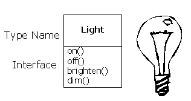
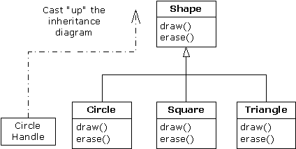
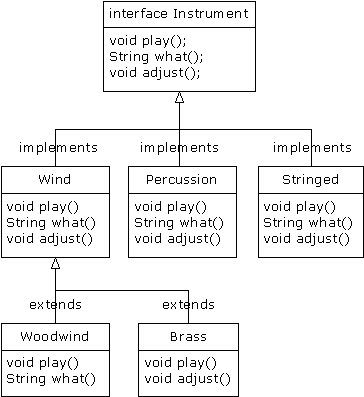
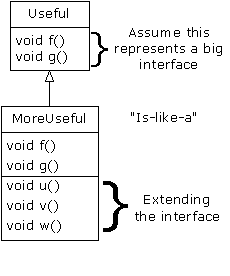
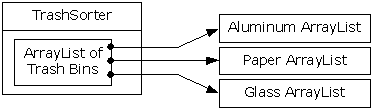
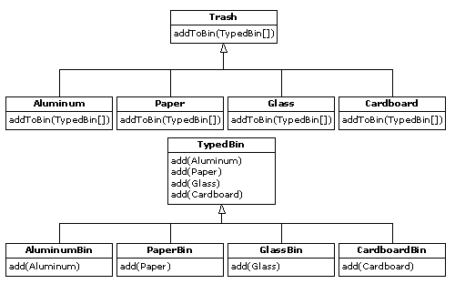

# Thinking in Java

## 目录

* [写在前面的话](#写在前面的话)
* [引言](#引言)
* [第1章 对象入门](#第1章 对象入门)
   * [1.1 抽象的进步](#1.1 抽象的进步)
   * [1.2 对象的接口](#1.2 对象的接口)
   * [1.3 实现方案的隐藏](#1.3 实现方案的隐藏)
   * [1.4 方案的重复使用](#1.4 方案的重复使用)
   * [1.5 继承：重新使用接口](#1.5 继承：重新使用接口)
   * [1.6 多形对象的互换使用](#1.6 多形对象的互换使用)
   * [1.7 对象的创建和存在时间](#1.7 对象的创建和存在时间)
   * [1.8 违例控制：解决错误](#1.8 违例控制：解决错误)
   * [1.9 多线程](#1.9 多线程)
   * [1.10 永久性](#1.10 永久性)
   * [1.11 Java和因特网](#1.11 Java和因特网)
   * [1.12 分析和设计](#1.12 分析和设计)
   * [1.13 Java还是C++](1.13 Java还是C++.md)
* [第2章 一切都是对象](#第2章 一切都是对象)
   * [2.1 用句柄操纵对象](#2.1 用句柄操纵对象)
   * [2.2 所有对象都必须创建](#2.2 所有对象都必须创建)
   * [2.3 绝对不要清除对象](#2.3 绝对不要清除对象)
   * [2.4 新建数据类型：类](#2.4 新建数据类型：类)
   * [2.5 方法、自变量和返回值](#2.5 方法、自变量和返回值)
   * [2.6 构建Java程序](#2.6 构建Java程序)
   * [2.7 我们的第一个Java程序](#2.7 我们的第一个Java程序)
   * [2.8 注释和嵌入文档](#2.8 注释和嵌入文档)
   * [2.9 编码样式](#2.9 编码样式)
   * [2.10 总结](#2.10 总结)
   * [2.11 练习](#2.11 练习)
* [第3章 控制程序流程](#第3章 控制程序流程)
   * [3.1 使用Java运算符](#3.1 使用Java运算符)
   * [3.2 执行控制](#3.2 执行控制)
   * [3.3 总结](#3.3 总结)
   * [3.4 练习](#3.4 练习)
* [第4章 初始化和清除](#第4章 初始化和清除)
   * [4.1 用构建器自动初始化](#4.1 用构建器自动初始化)
   * [4.2 方法过载](#4.2 方法过载)
   * [4.3 清除：收尾和垃圾收集](#4.3 清除：收尾和垃圾收集)
   * [4.4 成员初始化](#4.4 成员初始化)
   * [4.5 数组初始化](#4.5 数组初始化)
   * [4.6 总结](#4.6 总结)
   * [4.7 练习](#4.7 练习)
* [第5章 隐藏实施过程](#第5章 隐藏实施过程)
   * [5.1 包：库单元](#5.1 包：库单元)
   * [5.2 Java访问指示符](#5.2 Java访问指示符)
   * [5.3 接口与实现](#5.3 接口与实现)
   * [5.4 类访问](#5.4 类访问)
   * [5.5 总结](#5.5 总结)
   * [5.6 练习](#5.6 练习)
* [第6章 类再生](#第6章 类再生)
   * [6.1 合成的语法](#6.1 合成的语法)
   * [6.2 继承的语法](#6.2 继承的语法)
   * [6.3 合成与继承的结合](#6.3 合成与继承的结合)
   * [6.4 到底选择合成还是继承](#6.4 到底选择合成还是继承)
   * [6.5 protected](#6.5 protected)
   * [6.6 累积开发](#6.6 累积开发)
   * [6.7 上溯造型](#6.7 上溯造型)
   * [6.8 final关键字](#6.8 final关键字)
   * [6.9 初始化和类装载](#6.9 初始化和类装载)
   * [6.10 总结](#6.10 总结)
   * [6.11 练习](#6.11 练习)
* [第7章 多形性](#第7章 多形性)
   * [7.1 上溯造型](#7.1 上溯造型)
   * [7.2 深入理解](#7.2 深入理解)
   * [7.3 覆盖与过载](#7.3 覆盖与过载)
   * [7.4 抽象类和方法](#7.4 抽象类和方法)
   * [7.5 接口](#7.5 接口)
   * [7.6 内部类](#7.6 内部类)
   * [7.7 构建器和多形性](#7.7 构建器和多形性)
   * [7.8 通过继承进行设计](#7.8 通过继承进行设计)
   * [7.9 总结](#7.9 总结)
   * [7.10 练习](#7.10 练习)
* [第8章 对象的容纳](#第8章 对象的容纳)
   * [8.1 数组](#8.1 数组)
   * [8.2 集合](#8.2 集合)
   * [8.3 枚举器（反复器）](8.3 枚举器（反复器）.md)
   * [8.4 集合的类型](#8.4 集合的类型)
   * [8.5 排序](#8.5 排序)
   * [8.6 通用集合库](#8.6 通用集合库)
   * [8.7 新集合](#8.7 新集合)
   * [8.8 总结](#8.8 总结)
   * [8.9 练习](#8.9 练习)
* [第9章 违例差错控制](#第9章 违例差错控制)
   * [9.1 基本违例](#9.1 基本违例)
   * [9.2 违例的捕获](#9.2 违例的捕获)
   * [9.3 标准Java违例](#9.3 标准Java违例)
   * [9.4 创建自己的违例](#9.4 创建自己的违例)
   * [9.5 违例的限制](#9.5 违例的限制)
   * [9.6 用finally清除](#9.6 用finally清除)
   * [9.7 构建器](#9.7 构建器)
   * [9.8 违例匹配](#9.8 违例匹配)
   * [9.9 总结](#9.9 总结)
   * [9.10 练习](#9.10 练习)
* [第10章 Java IO系统](#第10章 Java IO系统)
   * [10.1 输入和输出](#10.1 输入和输出)
   * [10.2 增添属性和有用的接口](#10.2 增添属性和有用的接口)
   * [10.3 本身的缺陷：RandomAccessFile](#10.3 本身的缺陷：RandomAccessFile)
   * [10.4 File类](#10.4 File类)
   * [10.5 IO流的典型应用](#10.5 IO流的典型应用)
   * [10.6 StreamTokenizer](#10.6 StreamTokenizer)
   * [10.7 Java 1.1的IO流](#10.7 Java 1.1的IO流)
   * [10.8 压缩](#10.8 压缩)
   * [10.9 对象序列化](#10.9 对象序列化)
   * [10.10 总结](#10.10 总结)
   * [10.11 练习](#10.11 练习)
* [第11章 运行期类型鉴定](#第11章 运行期类型鉴定)
   * [11.1 对RTTI的需要](#11.1 对RTTI的需要)
   * [11.2 RTTI语法](#11.2 RTTI语法)
   * [11.3 反射：运行期类信息](#11.3 反射：运行期类信息)
   * [11.4 总结](#11.4 总结)
   * [11.5 练习](#11.5 练习)
* [第12章 传递和返回对象](#第12章 传递和返回对象)
   * [12.1 传递句柄](#12.1 传递句柄)
   * [12.2 制作本地副本](#12.2 制作本地副本)
   * [12.3 克隆的控制](#12.3 克隆的控制)
   * [12.4 只读类](#12.4 只读类)
   * [12.5 总结](#12.5 总结)
   * [12.6 练习](#12.6 练习)
* [第13章 创建窗口和程序片](#第13章 创建窗口和程序片)
   * [13.1 为何要用AWT？](#13.1 为何要用AWT？)
   * [13.2 基本程序片](#13.2 基本程序片)
   * [13.3 制作按钮](#13.3 制作按钮)
   * [13.4 捕获事件](#13.4 捕获事件)
   * [13.5 文本字段](#13.5 文本字段)
   * [13.6 文本区域](#13.6 文本区域)
   * [13.7 标签](#13.7 标签)
   * [13.8 复选框](#13.8 复选框)
   * [13.9 单选钮](#13.9 单选钮)
   * [13.10 下拉列表](#13.10 下拉列表)
   * [13.11 列表框](#13.11 列表框)
   * [13.12 布局的控制](#13.12 布局的控制)
   * [13.13 action的替代品](#13.13 action的替代品)
   * [13.14 程序片的局限](#13.14 程序片的局限)
   * [13.15 视窗化应用](#13.15 视窗化应用)
   * [13.16 新型AWT](#13.16 新型AWT)
   * [13.17 Java 1.1用户接口API](#13.17 Java 1.1用户接口API)
   * [13.18 可视编程和Beans](#13.18 可视编程和Beans)
   * [13.19 Swing入门（注释⑦）](#13.19 Swing入门（注释⑦）)
   * [13.20 总结](#13.20 总结)
   * [13.21 练习](#13.21 练习)
* [第14章 多线程](#第14章 多线程)
   * [14.1 反应灵敏的用户界面](#14.1 反应灵敏的用户界面)
   * [14.2 共享有限的资源](#14.2 共享有限的资源)
   * [14.3 堵塞](#14.3 堵塞)
   * [14.4 优先级](#14.4 优先级)
   * [14.5 回顾runnable](#14.5 回顾runnable)
   * [14.6 总结](#14.6 总结)
   * [14.7 练习](#14.7 练习)
* [第15章 网络编程](#第15章 网络编程)
   * [15.1 机器的标识](#15.1 机器的标识)
   * [15.2 套接字](#15.2 套接字)
   * [15.3 服务多个客户](#15.3 服务多个客户)
   * [15.4 数据报](#15.4 数据报)
   * [15.5 一个Web应用](#15.5 一个Web应用)
   * [15.6 Java与CGI的沟通](#15.6 Java与CGI的沟通)
   * [15.7 用JDBC连接数据库](#15.7 用JDBC连接数据库)
   * [15.8 远程方法](#15.8 远程方法)
   * [15.9 总结](#15.9 总结)
   * [15.10 练习](#15.10 练习)
* [第16章 设计范式](#第16章 设计范式)
   * [16.1 范式的概念](#16.1 范式的概念)
   * [16.2 观察器范式](#16.2 观察器范式)
   * [16.3 模拟垃圾回收站](#16.3 模拟垃圾回收站)
   * [16.4 改进设计](#16.4 改进设计)
   * [16.5 抽象的应用](#16.5 抽象的应用)
   * [16.6 多重派遣](#16.6 多重派遣)
   * [16.7 访问器范式](#16.7 访问器范式)
   * [16.8 RTTI真的有害吗](#16.8 RTTI真的有害吗)
   * [16.9 总结](#16.9 总结)
   * [16.10 练习](#16.10 练习)
* [第17章 项目](#第17章 项目)
   * [17.1 文字处理](#17.1 文字处理)
   * [17.2 方法查找工具](#17.2 方法查找工具)
   * [17.3 复杂性理论](#17.3 复杂性理论)
   * [17.4 总结](#17.4 总结)
   * [17.5 练习](#17.5 练习)
* [附录A 使用非JAVA代码](#附录A 使用非JAVA代码)
* [附录B 对比C++和Java](#附录B 对比C++和Java)
* [附录C Java编程规则](#附录C Java编程规则)
* [附录D 性能](#附录D 性能)
* [附录E 关于垃圾收集的一些话](#附录E 关于垃圾收集的一些话)
* [附录F 推荐读物](#附录F 推荐读物)

## 写在前面的话

我的兄弟Todd目前正在进行从硬件到编程领域的工作转变。我曾提醒他下一次大革命的重点将是遗传工程。
我们的微生物技术将能制造食品、燃油和塑料；它们都是清洁的，不会造成污染，而且能使人类进一步透视物理世界的奥秘。我认为相比之下电脑的进步会显得微不足道。

但随后，我又意识到自己正在犯一些科幻作家常犯的错误：在技术中迷失了（这种事情在科幻小说里常有发生）！如果是一名有经验的作家，就知道绝对不能就事论事，必须以人为中心。遗传对我们的生命有非常大的影响，但不能十分确定它能抹淡计算机革命——或至少信息革命——的影响。信息涉及人相互间的沟通：的确，汽车和轮子的发明都非常重要，但它们最终亦如此而已。真正重要的还是我们与世界的关系，而其中最关键的就是通信。

这本书或许能说明一些问题。许多人认为我有点儿大胆或者稍微有些狂妄，居然把所有家当都摆到了Web上。“这样做还有谁来买它呢？”他们问。假如我是一个十分守旧的人，那么绝对不这样干。但我确实不想再沿原来的老路再写一本计算机参考书了。我不知道最终会发生什么事情，但的确认为这是我对一本书作出的最明智的一个决定。

至少有一件事是可以肯定的，人们开始向我发送纠错反馈。这是一个令人震惊的体验，因为读者会看到书中的每一个角落，并揪出那些藏匿得很深的技术及语法错误。这样一来，和其他以传统方式发行的书不同，我就能及时改正已知的所有类别的错误，而不是让它们最终印成铅字，堂而皇之地出现在各位的面前。俗话说，“当局者迷，旁观者清”。人们对书中的错误是非常敏感的，往往毫不客气地指出：“我想这样说是错误的，我的看法是……”。在我仔细研究后，往往发现自己确实有不当之处，而这是当初写作时根本没有意识到的（检查多少遍也不行）。我意识到这是群体力量的一个可喜的反映，它使这本书显得的确与众不同。

但我随之又听到了另一个声音：“好吧，你在那儿放的电子版的确很有创意，但我想要的是从真正的出版社那里印刷的一个版本！”事实上，我作出了许多努力，让它用普通打印机机就能得到很好的阅读效果，但仍然不象真正印刷的书那样正规。许多人不想在屏幕上看完整本书，也不喜欢拿着一叠纸阅读。无论打印格式有多么好，这些人喜欢是仍然是真正的“书”（激光打印机的墨盒也太贵了一点）。现在看来，计算机的革命仍未使出版界完全走出传统的模式。但是，有一个学生向我推荐了未来出版的一种模式：书籍将首先在互联网上出版，然后只有在绝对必要的前提下，才会印刷到纸张上。目前，为数众多的书籍销售都不十分理想，许多出版社都在亏本。但如采用这种方式出版，就显得灵活得多，也更容易保证赢利。

这本书也从另一个角度也给了我深刻的启迪。我刚开始的时候以为Java“只是另一种程序设计语言”。这个想法在许多情况下都是成立的。但随着时间的推移，我对它的学习也愈加深入，开始意识到它的基本宗旨与我见过的其他所有语言都有所区别。

程序设计与对复杂性的操控有很大的关系：对一个准备解决的问题，它的复杂程度取决用于解决它的机器的复杂程度。正是由于这一复杂性的存在，我们的程序设计项目屡屡失败。对于我以前接触过的所有编程语言，它们都没能跳过这一框框，由此决定了它们的主要设计目标就是克服程序开发与维护中的复杂性。当然，许多语言在设计时就已考虑到了复杂性的问题。但从另一角度看，实际设计时肯定会有另一些问题浮现出来，需把它们考虑到这个复杂性的问题里。不可避免地，其他那些问题最后会变成最让程序员头痛的。例如，C++必须同C保持向后兼容（使C程序员能尽快地适应新环境），同时又要保证编程的效率。C++在这两个方面都设计得很好，为其赢得了不少的声誉。但它们同时也暴露出了额外的复杂性，阻碍了某些项目的成功实现（当然，你可以责备程序员和管理层，但假如一种语言能通过捕获你的错误而提供帮助，它为什么不那样做呢？）。作为另一个例子，Visual Basic（VB）同当初的BASIC有关的紧密的联系。而BASIC并没有打算设计成一种能全面解决问题的语言，所以堆加到VB身上的所有扩展都造成了令人头痛和难于管理和维护的语法。另一方面，C++、VB和其他如Smalltalk之类的语言均在复杂性的问题上下了一番功夫。由此得到的结果便是，它们在解决特定类型的问题时是非常成功的。
在理解到Java最终的目标是减轻程序员的负担时，我才真正感受到了震憾，尽管它的潜台词好象是说：“除了缩短时间和减小产生健壮代码的难度以外，我们不关心其他任何事情。”在目前这个初级阶段，达到那个目标的后果便是代码不能特别快地运行（尽管有许多保证都说Java终究有一天会运行得多么快），但它确实将开发时间缩短到令人惊讶的地步——几乎只有创建一个等效C++程序一半甚至更短的时间。这段节省下来的时间可以产生更大的效益，但Java并不仅止于此。它甚至更上一层楼，将重要性越来越明显的一切复杂任务都封装在内，比如网络程序和多线程处理等等。Java的各种语言特性和库在任何时候都能使那些任务轻而易举完成。而且最后，它解决了一些真正有些难度的复杂问题：跨平台程序、动态代码改换以及安全保护等等。换在从前，其中任何每一个都能使你头大如斗。所以不管我们见到了什么性能问题，Java的保证仍然是非常有效的：它使程序员显著提高了程序设计的效率！

在我看来，编程效率提升后影响最大的就是Web。网络程序设计以前非常困难，而Java使这个问题迎刃而解（而且Java也在不断地进步，使解决这类问题变得越来越容易）。网络程序的设计要求我们相互间更有效率地沟通，而且至少要比电话通信来得便宜（仅仅电子函件就为许多公司带来了好处）。随着我们网上通信越来越频繁，令人震惊的事情会慢慢发生，而且它们令人吃惊的程度绝不亚于当初工业革命给人带来的震憾。

在各个方面：创建程序；按计划编制程序；构造用户界面，使程序能与用户沟通；在不同类型的机器上运行程序；以及方便地编写程序，使其能通过因特网通信——Java提高了人与人之间的“通信带宽”。而且我认为通信革命的结果可能并不单单是数量庞大的比特到处传来传去那么简单。我们认为认清真正的革命发生在哪里，因为人和人之间的交流变得更方便了——个体与个体之间，个体与组之间，组与组之间，甚至在星球之间。有人预言下一次大革命的发生就是由于足够多的人和足够多的相互连接造成的，而这种革命是以整个世界为基础发生的。Java可能是、也可能不是促成那次革命的直接因素，但我在这里至少感觉自己在做一些有意义的工作——尝试教会大家一种重要的语言！

## 引言

同人类任何语言一样，Java为我们提供了一种表达思想的方式。如操作得当，同其他方式相比，随着问题变得愈大和愈复杂，这种表达方式的方便性和灵活性会显露无遗。

不可将Java简单想象成一系列特性的集合；如孤立地看，有些特性是没有任何意义的。只有在考虑“设计”、而非考虑简单的编码时，才可真正体会到Java的强大。为了按这种方式理解Java，首先必须掌握它与编程的一些基本概念。本书讨论了编程问题、它们为何会成为问题以及Java用以解决它们的方法。所以，我对每一章的解释都建立在如何用语言解决一种特定类型的问题基础上。按这种方式，我希望引导您一步一步地进入Java的世界，使其最终成为您最自然的一种语言。

贯穿本书，我试图在您的大脑里建立一个模型——或者说一个“知识结构”。这样可加深对语言的理解。若遇到难解之处，应学会把它填入这个模型的对应地方，然后自行演绎出答案。事实上，学习任何语言时，脑海里有一个现成的知识结构往往会起到事半功倍的效果。

#### 1. 前提

本书假定读者对编程多少有些熟悉。应已知道程序是一系列语句的集合，知道子程序／函数／宏是什么，知道象“If”这样的控制语句，也知道象“while”这样的循环结构。注意这些东西在大量语言里都是类似的。假如您学过一种宏语言，或者用过Perl之类的工具，那么它们的基本概念并无什么区别。总之，只要能习惯基本的编程概念，就可顺利阅读本书。当然，C/C++程序员在阅读时能占到更多的便宜。但即使不熟悉C，一样不要把自己排除在外（尽管以后的学习要付出更大的努力）。我会讲述面向对象编程的概念，以及Java的基本控制机制，所以不用担心自己会打不好基础。况且，您需要学习的第一类知识就会涉及到基本的流程控制语句。

尽管经常都会谈及C和C++语言的一些特性，但并没有打算使它们成为内部参考，而是想帮助所有程序员都能正确地看待那两种语言。毕竟，Java是从它们那里衍生出来的。我将试着尽可能地简化这些引用和参考，并合理地解释一名非C/C++程序员通常不太熟悉的内容。

#### 2. Java的学习

在我第一本书《Using C++》面市的几乎同一时间（Osborne/McGraw-Hill于1989年出版），我开始教授那种语言。程序设计语言的教授已成为我的专业。自1989年以来，我便在世界各地见过许多昏昏欲睡、满脸茫然以及困惑不解的面容。开始在室内面向较少的一组人授课以后，我从作业中发现了一些特别的问题。即使那些上课面带会心的微笑或者频频点头的学生，对许多问题也存在认识上的混淆。在过去几年间的“软件开发会议”上，由我主持C++分组讨论会（现在变成了Java讨论会）。有的演讲人试图在很短的时间内向听众灌输过多的主题。所以到最后，尽管听众的水平都还可以，而且提供的材料也很充足，但仍然损失了一部分听众。这可能是由于问得太多了，但由于我是那些采取传统授课方式的人之一，所以很想使每个人都能跟上讲课进度。

有段时间，我编制了大量教学简报。经过不断的试验和修订（或称“反复”，这是在Java程序设计中非常有用的一项技术），最后成功地在一门课程中集成了从我的教学经验中总结出来的所有东西——我在很长一段时间里都在使用。其中由一系列离散的、易于消化的小步骤组成，而且每个小课程结束后都有一些适当的练习。我目前已在Java公开研讨会上公布了这一课程，大家可到http://www.BruceEckel.com了解详情（对研讨会的介绍也以CD-ROM的形式提供，具体信息可在同样的Web站点找到）。

从每一次研讨会收到的反馈都帮助我修改及重新制订学习材料的重心，直到我最后认为它成为一个完善的教学载体为止。但本书并非仅仅是一本教科书——我尝试在其中装入尽可能多的信息，并按照主题进行了有序的分类。无论如何，这本书的主要宗旨是为那些独立学习的人士服务，他们正准备深入一门新的程序设计语言，而没有太大的可能参加此类专业研讨会。

#### 3. 目标
就象我的前一本书《Thinking in C++》一样，这本书面向语言的教授进行了良好的结构与组织。特别地，我的目标是建立一套有序的机制，可帮助我在自己的研讨会上更好地进行语言教学。在我思考书中的一章时，实际上是在想如何教好一堂课。我的目标是得到一系列规模适中的教学模块，可以在合理的时间内教完。随后是一些精心挑选的练习，可以在课堂上当即完成。

**在这本书中，我想达到的目标总结如下：**

(1) 每一次都将教学内容向前推进一小步，便于读者在继续后面的学习前消化前面的内容。

(2) 采用的示例尽可能简短。当然，这样做有时会妨碍我解决“现实世界”的问题。但我同时也发现对那些新手来说，如果他们能理解每一个细节，那么一般会产生更大的学习兴趣。而假如他们一开始就被要解决的问题的深度和广度所震惊，那么一般都不会收到很好的学习效果。另外在实际教学过程中，对能够摘录的代码数量是有严重限制的。另一方面，这样做无疑会有些人会批评我采用了“不真实的例子”，但只要能起到良好的效果，我宁愿接受这一指责。

(3) 要揭示的特性按照我精心挑选的顺序依次出场，而且尽可能符合读者的思想历程。当然，我不可能永远都做到这一点；在那些情况下，会给出一段简要的声明，指出这个问题。

(4) 只把我认为有助于理解语言的东西介绍给读者，而不是把我知道的一切东西都抖出来，这并非藏私。我认为信息的重要程度是存在一个合理的层次的。有些情况是95％的程序员都永远不必了解的。如强行学习，只会干扰他们的正常思维，从而加深语言在他们面前表现出来的难度。以C语言为例，假如你能记住运算符优先次序表（我从来记不住），那么就可以写出更“聪明”的代码。但再深入想一层，那也会使代码的读者／维护者感到困扰。所以忘了那些次序吧，在拿不准的时候加上括号即可。

(5) 每一节都有明确的学习重点，所以教学时间（以及练习的间隔时间）非常短。这样做不仅能保持读者思想的活跃，也能使问题更容易理解，对自己的学习产生更大的信心。

(6) 提供一个坚实的基础，使读者能充分理解问题，以便更容易转向一些更加困难的课程和书籍。

#### 4. 联机文档

由Sun微系统公司提供的Java语言和库（可免费下载）配套提供了电子版的用户帮助手册，可用Web浏览器阅读。此外，由其他厂商开发的几乎所有类似产品都有一套等价的文档系统。而目前出版的与Java有关的几乎所有书籍都重复了这份文档。所以你要么已经拥有了它，要么需要下载。所以除非特别必要，否则本书不会重复那份文档的内容。因为一般地说，用Web浏览器查找与类有关的资料比在书中查找方便得多（电子版的东西更新也快）。只有在需要对文档进行补充，以便你能理解一个特定的例子时，本书才会提供有关类的一些附加说明。

#### 5. 章节

本书在设计时认真考虑了人们学习Java语言的方式。在我授课时，学生们的反映有效地帮助了我认识哪些部分是比较困难的，需特别加以留意。我也曾经一次讲述了太多的问题，但得到的教训是：假如包括了大量新特性，就需要对它们全部作出解释，而这特别容易加深学生们的混淆。因此，我进行了大量努力，使这本书一次尽可能地少涉及一些问题。

所以，我在书中的目标是让每一章都讲述一种语言特性，或者只讲述少数几个相互关联的特性。这样一来，读者在转向下一主题时，就能更容易地消化前面学到的知识。

下面列出对本书各章的一个简要说明，它们与我实际进行的课堂教学是对应的。

**(1) 第1章：对象入门**

这一章是对面向对象的程序设计（OOP）的一个综述，其中包括对“什么是对象”之类的基本问题的回答，并讲述了接口与实现、抽象与封装、消息与函数、继承与合成以及非常重要的多形性的概念。这一章会向大家提出一些对象创建的基本问题，比如构建器、对象存在于何处、创建好后把它们置于什么地方以及魔术般的垃圾收集器（能够清除不再需要的对象）。要介绍的另一些问题还包括通过违例实现的错误控制机制、反应灵敏的用户界面的多线程处理以及连网和因特网等等。大家也会从中了解到是什么使得Java如此特别，它为什么取得了这么大的成功，以及与面向对象的分析与设计有关的问题。

**(2) 第2章：一切都是对象**

本章将大家带到可以着手写自己的第一个Java程序的地方，所以必须对一些基本概念作出解释，其中包括对象“句柄”的概念；怎样创建一个对象；对基本数据类型和数组的一个介绍；作用域以及垃圾收集器清除对象的方式；如何将Java中的所有东西都归为一种新数据类型（类），以及如何创建自己的类；函数、自变量以及返回值；名字的可见度以及使用来自其他库的组件；static关键字；注释和嵌入文档等等。

**(3) 第3章：控制程序流程**

本章开始介绍起源于C和C++，由Java继承的所有运算符。除此以外，还要学习运算符一些不易使人注意的问题，以及涉及造型、升迁以及优先次序的问题。随后要讲述的是基本的流程控制以及选择运算，这些是几乎所有程序设计语言都具有的特性：用if-else实现选择；用for和while实现循环；用break和continue以及Java的标签式break和contiune（它们被认为是Java中“不见的gogo”）退出循环；以及用switch实现另一种形式的选择。尽管这些与C和C++中见到的有一定的共通性，但多少存在一些区别。除此以外，所有示例都是完整的Java示例，能使大家很快地熟悉Java的外观。

**(4) 第4章：初始化和清除**

本章开始介绍构建器，它的作用是担保初始化的正确实现。对构建器的定义要涉及函数过载的概念（因为可能同时有几个构建器）。随后要讨论的是清除过程，它并非肯定如想象的那么简单。用完一个对象后，通常可以不必管它，垃圾收集器会自动介入，释放由它占据的内存。这里详细探讨了垃圾收集器以及它的一些特点。在这一章的最后，我们将更贴近地观察初始化过程：自动成员初始化、指定成员初始化、初始化的顺序、static（静态）初始化以及数组初始化等等。

**(5) 第5章：隐藏实现过程**

本章要探讨将代码封装到一起的方式，以及在库的其他部分隐藏时，为什么仍有一部分处于暴露状态。首先要讨论的是package和import关键字，它们的作用是进行文件级的封装（打包）操作，并允许我们构建由类构成的库（类库）。此时也会谈到目录路径和文件名的问题。本章剩下的部分将讨论public，private以及protected三个关键字、“友好”访问的概念以及各种场合下不同访问控制级的意义。

**(6) 第6章：类再生**

继承的概念是几乎所有OOP语言中都占有重要的地位。它是对现有类加以利用，并为其添加新功能的一种有效途径（同时可以修改它，这是第7章的主题）。通过继承来重复使用原有的代码时（再生），一般需要保持“基础类”不变，只是将这儿或那儿的东西串联起来，以达到预期的效果。然而，继承并不是在现有类基础上制造新类的唯一手段。通过“合成”，亦可将一个对象嵌入新类。在这一章中，大家将学习在Java中重复使用代码的这两种方法，以及具体如何运用。

**(7) 第7章：多形性**

若由你自己来干，可能要花9个月的时间才能发现和理解多形性的问题，这一特性实际是OOP一个重要的基础。通过一些小的、简单的例子，读者可知道如何通过继承来创建一系列类型，并通过它们共有的基础类对那个系列中的对象进行操作。通过Java的多形性概念，同一系列中的所有对象都具有了共通性。这意味着我们编写的代码不必再依赖特定的类型信息。这使程序更易扩展，包容力也更强。由此，程序的构建和代码的维护可以变得更方便，付出的代价也会更低。此外，Java还通过“接口”提供了设置再生关系的第三种途径。这儿所谓的“接口”是对对象物理“接口”一种纯粹的抽象。一旦理解了多形性的概念，接口的含义就很容易解释了。本章也向大家介绍了Java 1.1的“内部类”。

**(8) 第8章：对象的容纳**

对一个非常简单的程序来说，它可能只拥有一个固定数量的对象，而且对象的“生存时间”或者“存在时间”是已知的。但是通常，我们的程序会在不定的时间创建新对象，只有在程序运行时才可了解到它们的详情。此外，除非进入运行期，否则无法知道所需对象的数量，甚至无法得知它们确切的类型。为解决这个常见的程序设计问题，我们需要拥有一种能力，可在任何时间、任何地点创建任何数量的对象。本章的宗旨便是探讨在使用对象的同时用来容纳它们的一些Java工具：从简单的数组到复杂的集合（数据结构），如Vector和Hashtable等。最后，我们还会深入讨论新型和改进过的Java 1.2集合库。

**(9) 第9章：违例差错控制**

Java最基本的设计宗旨之一便是组织错误的代码不会真的运行起来。编译器会尽可能捕获问题。但某些情况下，除非进入运行期，否则问题是不会被发现的。这些问题要么属于编程错误，要么则是一些自然的出错状况，它们只有在作为程序正常运行的一部分时才会成立。Java为此提供了“违例控制”机制，用于控制程序运行时产生的一切问题。这一章将解释try、catch、throw、throws以及finally等关键字在Java中的工作原理。并讲述什么时候应当“掷”出违例，以及在捕获到违例后该采取什么操作。此外，大家还会学习Java的一些标准违例，如何构建自己的违例，违例发生在构建器中怎么办，以及违例控制器如何定位等等。

**(10) 第10章：Java IO系统**

理论上，我们可将任何程序分割为三部分：输入、处理和输出。这意味着IO（输入／输出）是所有程序最为关键的部分。在这一章中，大家将学习Java为此提供的各种类，如何用它们读写文件、内存块以及控制台等。“老”IO和Java 1.1的“新”IO将得到着重强调。除此之外，本节还要探讨如何获取一个对象、对其进行“流式”加工（使其能置入磁盘或通过网络传送）以及重新构建它等等。这些操作在Java的1.1版中都可以自动完成。另外，我们也要讨论Java 1.1的压缩库，它将用在Java的归档文件格式中（JAR）。

**(11) 第11章：运行期类型鉴定**

若只有指向基础类的一个句柄，Java的运行期类型标鉴定（RTTI）使我们能获知一个对象的准确类型是什么。一般情况下，我们需要有意忽略一个对象的准确类型，让Java的动态绑定机制（多形性）为那一类型实现正确的行为。但在某些场合下，对于只有一个基础句柄的对象，我们仍然特别有必要了解它的准确类型是什么。拥有这个资料后，通常可以更有效地执行一次特殊情况下的操作。本章将解释RTTI的用途、如何使用以及在适当的时候如何放弃它。此外，Java 1.1的“反射”特性也会在这里得到介绍。

**(12) 第12章：传递和返回对象**

由于我们在Java中同对象沟通的唯一途径是“句柄”，所以将对象传递到一个函数里以及从那个函数返回一个对象的概念就显得非常有趣了。本章将解释在函数中进出时，什么才是为了管理对象需要了解的。同时也会讲述String（字串）类的概念，它用一种不同的方式解决了同样的问题。

**(13) 第13章：创建窗口和程序片**

Java配套提供了“抽象Windows工具包”（AWT）。这实际是一系列类的集合，能以一种可移植的形式解决视窗操纵问题。这些窗口化程序既可以程序片的形式出现，亦可作为独立的应用程序使用。本章将向大家介绍AWT以及网上程序片的创建过程。我们也会探讨AWT的优缺点以及Java 1.1在GUI方面的一些改进。同时，重要的“Java Beans”技术也会在这里得到强调。Java Beans是创建“快速应用开发”（RAD）程序构造工具的重要基础。我们最后介绍的是Java 1.2的“Swing”库——它使Java的UI组件得到了显著的改善。

**(14) 第14章：多线程**

Java提供了一套内建的机制，可提供对多个并发子任务的支持，我们称其为“线程”。这线程均在单一的程序内运行。除非机器安装了多个处理器，否则这就是多个子任务的唯一运行方式。尽管还有别的许多重要用途，但在打算创建一个反应灵敏的用户界面时，多线程的运用显得尤为重要。举个例子来说，在采用了多线程技术后，尽管当时还有别的任务在执行，但用户仍然可以毫无阻碍地按下一个按钮，或者键入一些文字。本章将对Java的多线程处理机制进行探讨，并介绍相关的语法。

**(15) 第15章 网络编程**

开始编写网络应用时，就会发现所有Java特性和库仿佛早已串联到了一起。本章将探讨如何通过因特网通信，以及Java用以辅助此类编程的一些类。此外，这里也展示了如何创建一个Java程序片，令其同一个“通用网关接口”（CGI）程序通信；揭示了如何用C++编写CGI程序；也讲述了与Java 1.1的“Java数据库连接”（JDBC）和“远程方法调用”（RMI）有关的问题。

**(16) 第16章 设计范式**

本章将讨论非常重要、但同时也是非传统的“范式”程序设计概念。大家会学习设计进展过程的一个例子。首先是最初的方案，然后经历各种程序逻辑，将方案不断改革为更恰当的设计。通过整个过程的学习，大家可体会到使设计思想逐渐变得清晰起来的一种途径。

**(17) 第17章 项目**

本章包括了一系列项目，它们要么以本书前面讲述的内容为基础，要么对以前各章进行了一番扩展。这些项目显然是书中最复杂的，它们有效演示了新技术和类库的应用。
有些主题似乎不太适合放到本书的核心位置，但我发现有必要在教学时讨论它们，这些主题都放入了本书的附录。

**(18) 附录A：使用非Java代码**

对一个完全能够移植的Java程序，它肯定存在一些严重的缺陷：速度太慢，而且不能访问与具体平台有关的服务。若事先知道程序要在什么平台上使用，就可考虑将一些操作变成“固有方法”，从而显著加快执行速度。这些“固有方法”实际是一些特殊的函数，以另一种程序设计语言写成（目前仅支持C/C++）。Java还可通过另一些途径提供对非Java代码的支持，其中包括CORBA。本附录将详细介绍这些特性，以便大家能创建一些简单的例子，同非Java代码打交道。

**(19) 附录B：对比C++和Java**

对一个C++程序员，他应该已经掌握了面向对象程序设计的基本概念，而且Java语法对他来说无疑是非常眼熟的。这一点是明显的，因为Java本身就是从C++衍生而来。但是，C++和Java之间的确存在一些显著的差异。这些差异意味着Java在C++基础上作出的重大改进。一旦理解了这些差异，就能理解为什么说Java是一种杰出的语言。这一附录便是为这个目的设立的，它讲述了使Java与C++明显有别的一些重要特性。

**(20) 附录C：Java编程规则**

本附录提供了大量建议，帮助大家进行低级程序设计和代码编写。

**(21) 附录D：性能**

通过这个附录的学习，大家可发现自己Java程序中存在的瓶颈，并可有效地改善执行速度。

**(22) 附录E：关于垃圾收集的一些话**

这个附录讲述了用于实现垃圾收集的操作和方法。

**(23) 附录F：推荐读物**

列出我感觉特别有用的一系列Java参考书。

#### 6. 练习
为巩固对新知识的掌握，我发现简单的练习特别有用。所以读者在每一章结束时都能找到一系列练习。
大多数练习都很简单，在合理的时间内可以完成。如将本书作为教材，可考虑在课堂内完成。老师要注意观察，确定所有学生都已消化了讲授的内容。有些练习要难些，他们是为那些有兴趣深入的读者准备的。大多数练习都可在较短时间内做完，有效地检测和加深您的知识。有些题目比较具有挑战性，但都不会太麻烦。事实上，练习中碰到的问题在实际应用中也会经常碰到。

#### 7. 多媒体CD-ROM
本书配套提供了一片多媒体CD-ROM，可单独购买及使用。它与其他计算机书籍的普通配套CD不同，那些CD通常仅包含了书中用到的源码（本书的源码可从www.BruceEckel.com免费下载）。本CD-ROM是一个独立的产品，包含了一周“Hads-OnJava”培训课程的全部内容。这是一个由Bruce Eckel讲授的、长度在15小时以上的课程，含500张以上的演示幻灯片。该课程建立在这本书的基础上，所以是非常理想的一个配套产品。

**CD-ROM包含了本书的两个版本：**

(1) 本书一个可打印的版本，与下载版完全一致。

(2) 为方便读者在屏幕上阅读和索引，CD-ROM提供了一个独特的超链接版本。这些超链接包括：

```java
■230个章、节和小标题链接

■3600个索引链接
```

CD-ROM刻录了600MB以上的数据。我相信它已对所谓“物超所值”进行了崭新的定义。

CD-ROM包含了本书打印版的所有东西，另外还有来自五天快速入门课程的全部材料。我相信它建立了一个新的书刊品质评定标准。

若想单独购买此CD-ROM，只能从Web站点www.BruceEckel.com处直接订购。

#### 8. 源代码

本书所有源码都作为保留版权的免费软件提供，可以独立软件包的形式获得，亦可从http://www.BruceEckel.com下载。为保证大家获得的是最新版本，我用这个正式站点发行代码以及本书电子版。亦可在其他站点找到电子书和源码的镜像版（有些站点已在http://www.BruceEckel.com处列出）。但无论如何，都应检查正式站点，确定镜像版确实是最新的版本。可在课堂和其他教育场所发布这些代码。

版权的主要目标是保证源码得到正确的引用，并防止在未经许可的情况下，在印刷材料中发布代码。通常，只要源码获得了正确的引用，则在大多数媒体中使用本书的示例都没有什么问题。

在每个源码文件中，都能发现下述版本声明文字：

```java
16-17页程序
```

可在自己的开发项目中使用代码，并可在课堂上引用（包括学习材料）。但要确定版权声明在每个源文件中得到了保留。

#### 9. 编码样式

在本书正文中，标识符（函数、变量和类名）以粗体印刷。大多数关键字也采用粗体——除了一些频繁用到的关键字（若全部采用粗体，会使页面拥挤难看，比如那些“类”）。

对于本书的示例，我采用了一种特定的编码样式。该样式得到了大多数Java开发环境的支持。该样式问世已有几年的时间，最早起源于Bjarne Stroustrup先生在《The C++ Programming Language》里采用的样式（Addison-Wesley 1991年出版，第2版）。由于代码样式目前是个敏感问题，极易招致数小时的激烈辩论，所以我在这儿只想指出自己并不打算通过这些示例建立一种样式标准。之所以采用这些样式，完全出于我自己的考虑。由于Java是一种形式非常自由的编程语言，所以读者完全可以根据自己的感觉选用了适合的编码样式。

本书的程序是由字处理程序包括在正文中的，它们直接取自编译好的文件。所以，本书印刷的代码文件应能正常工作，不会造成编译器错误。会造成编译错误的代码已经用注释//!标出。所以很容易发现，也很容易用自动方式进行测试。读者发现并向作者报告的错误首先会在发行的源码中改正，然后在本书的更新版中校订（所有更新都会在Web站点http://www.BruceEckel.com处出现）。

#### 10. Java版本
尽管我用几家厂商的Java开发平台对本书的代码进行了测试，但在判断代码行为是否正确时，却通常以Sun公司的Java开发平台为准。

当您读到本书时，Sun应已发行了Java的三个重要版本：1.0，1.1及1.2（Sun声称每9个月就会发布一个主要更新版本）。就我看，1.1版对Java语言进行了显著改进，完全应标记成2.0版（由于1.1已作出了如此大的修改，真不敢想象2.0版会出现什么变化）。然而，它的1.2版看起来最终将Java推入了一个全盛时期，特别是其中考虑到了用户界面工具。

本书主要讨论了1.0和1.1版，1.2版有部分内容涉及。但在有些时候，新方法明显优于老方法。此时，我会明显偏向于新方法，通常教给大家更好的方法，而完全忽略老方法。然而，有的新方法要以老方法为基础，所以不可避免地要从老方法入手。这一特点尤以AWT为甚，因为那儿不仅存在数量众多的老式Java 1.0代码，有的平台仍然只支持Java 1.0。我会尽量指出哪些特性是哪个版本特有的。

大家会注意到我并未使用子版本号，比如1.1.1。至本书完稿为止，Sun公司发布的最后一个1.0版是1.02；而1.1的最后版本是1.1.5（Java 1.2仍在做β测试）。在这本书中，我只会提到Java 1.0，Java 1.1及Java 1.2，避免由于子版本编号过多造成的键入和印刷错误。

#### 11. 课程和培训
我的公司提供了一个五日制的公共培训课程，以本书的内容为基础。每章的内容都代表着一堂课，并附有相应的课后练习，以便巩固学到的知识。一些辅助用的幻灯片可在本书的配套光盘上找到，最大限度地方便各位读者。欲了解更多的情况，请访问：

http://www.BruceEckel.com

或发函至：

Bruce@EckelObjects.com

我的公司也提供了咨询服务，指导客户完成整个开发过程——特别是您的单位首次接触Java开发的时候。

#### 12. 错误
无论作者花多大精力来避免，错误总是从意想不到的地方冒出来。如果您认为自己发现了一个错误，请在源文件（可在 http://www.BruceEckel.com 处找到）里指出有可能是错误的地方，填好我们提供的表单。将您推荐的纠错方法通过电子函件发给Bruce@EckelObjects.com。经适当的核对与处理，Web站点的电子版以及本书的下一个印刷版本会作出相应的改正。具体格式如下：

```java
(1) 在主题行（Subject）写上“TIJ Correction”（去掉引号），以便您的函件进入对应的目录。

(2) 在函件正文，采用下述形式：

find: 在这里写一个单行字串，以便我们搜索错误所在的地方

Comment: 在这里可写多行批注正文，最好以“here's how I think it shoud read”开头
###
```

其中，“###”指出批注正文的结束。这样一来，我自己设计的一个纠错工具就能对原始正文来一次“搜索”，而您建议的纠错方法会在随后的一个窗口中弹出。
若希望在本书的下一版添加什么内容，或对书中的练习题有什么意见，也欢迎您指出。我们感谢您的所有意见。

#### 13. 封面设计
《Thinking in Java》一书封面的创作灵感来源于American Arts & CraftsMovement（美洲艺术＆手工艺品运动）。这一运动起始于世纪之交，1900到1920年达到了顶峰。它起源于英格兰，具有一定的历史背景。当时正是机器革命产生的风暴席卷整个大陆的时候，而且受到维多利亚地区强烈装饰风格的巨大影响。Arts&Crafts强调的是原始风格，回归自然的初衷是整个运动的核心。那时对手工制作推崇备至，手工艺人特别得到尊重。正因为如此，人们远远避开现代工具的使用。这场运动对整个艺术界造成了深远的影响，直至今天仍受到人们的怀念。特别是我们面临又一次世纪之交，强烈的怀旧情绪难免涌上心来。计算机发展至今，已走过了很长的一段路。我们更迫切地感到：软件设计中最重要的是设计者本身，而不是流水化的代码编制。如设计者本身的素质和修养不高，那么最多只是“生产”代码的工具而已。

我以同样的眼光来看待Java：作为一种将程序员从操作系统繁琐机制中解放出来的尝试，它的目的是使人们成为真正的“软件艺术家”。

无论作者还是本书的封面设计者（自孩提时代就是我的朋友）都从这一场运动中获得了灵感。所以接下来的事情就非常简单了，要么自己设计，要么直接采用来自那个时期的作品。

此外，封面向大家展示了一个收集箱，自然学者可能用它展示自己的昆虫标本。我们认为这些昆虫都是“对象”，全部置于更大的“收集箱”对象里，再统一置入“封面”这个对象里。它向我们揭示了面向对象编程技术最基本的“集合”概念。当然，作为一名程序员，大家对于“昆虫”或“虫”是非常敏感的（“虫”在英语里是Bug，后指程序错误）。这里的“虫”已被抓获，在一只广口瓶中杀死，最后禁闭于一个小的展览盒里——暗示Java有能力寻找、显示和消除程序里的“虫”（这是Java最具特色的特性之一）。

#### 14. 致谢
首先，感谢Doyle Street Cohousing Community（道尔街住房社区）容忍我花两年的时间来写这本书（其实他们一直都在容忍我的“胡做非为”）。非常感谢Kevin和Sonda Donovan，是他们把科罗拉多Crested Butte市这个风景优美的地方租给我，使我整个夏天都能安心写作。感谢Crested Butte友好的居民；以及Rocky Mountain Biological Laboratory（岩石山生物实验室），他们的工作人员总是面带微笑。

这是我第一次找代理人出书，但却绝没有后悔。谢谢“摩尔文学代理公司”的Claudette Moore小姐。是她强大的信心与毅力使我最终梦想成真。

我的头两本书是与Osborne/McGraw-Hill出版社的编辑Jeff Pepper合作出版的。Jeff又在正确的地方和正确的时间出现在了Prentice-Hall出版社，是他为了清除了所有可能遇到的障碍，也使我感受了一次愉快的出书经历。谢谢你，Jeff——你对我非常重要。

要特别感谢Gen Kiyooka和他的Digigami公司，我用的Web服务器就是他们提供的；也要感谢Scott Callaway，服务器是由他负责维护的。在我学习Web的过程中，一个服务器无疑是相当有价值的帮助。

谢谢Cay Horstmann（《Core Java》一书的副编辑，Prentice Hall于1997年出版）、D'Arcy Smith（Symantec公司）和Paul Tyma（《Java Primer Plus》一书的副编辑，The Waite Group于1996年出版），感谢他们帮助我澄清语言方面的一些概念。

感谢那些在“Java软件开发会议”上我的Java小组发言的同志们，以及我教授过的那些学生，他们提出的问题使我的教案愈发成熟起来。

特别感谢Larry和Tina O'Brien，是他们将这本书和我的教学内容制成一张教学CD-ROM（关于这方面的问题，http://www.BruceEckel.com有更多的答案）。

有许多人送来了纠错报告，我真的很感激所有这些朋友，但特别要对下面这些人说声谢谢：Kevin Raulerson（发现了多处重大错误），Bob Resendes（发现的错误令人难以置信），John Pinto，Joe Dante，Joe Sharp，David Combs（许多语法和表达不清的地方），Dr. Robert Stephenson，Franklin Chen，Zev Griner，David Karr，Leander A. Stroschein，Steve Clark，Charles A. Lee，AustinMaher，Dennis P. Roth，Roque Oliveira，Douglas Dunn，Dejan Ristic，NeilGalarneau，David B. Malkovsky，Steve Wilkinson，以及其他许多热心读者。

为了使这本书在欧洲发行，Prof. Ir. Marc Meurrens进行了大量工作。

有一些技术人员曾走进我的生活，他们后来都和我成了朋友。最不寻常的是他们全是素食主义者，平时喜欢练习瑜珈功，以及另一些形式的精神训练。我在练习了以后，觉得对我保持精力的旺盛非常有好处。他们是Kraig Brockschmidt，GenKiyooka和Andrea provaglio，是这些朋友帮我了解了Java和程序设计在意大利的情况。
显然，在Delphi上的一些经验使我更容易理解Java，因为它们有许多概念和语言设计决定是相通的。我的Delphi朋友提供了许多帮助，使我能够洞察一些不易为人注意的编程环境。他们是Marco Cantu（另一个意大利人——难道会说拉丁语的人在学习Java时有得天独厚的优势？）、Neil Rubenking（他最喜欢瑜珈／素食／禅道，但也非常喜欢计算机）以及Zack Urlocker（是我游历世界时碰面次数最多的一位同志）。

我的朋友Richard Hale Shaw（以及Kim）的一些意见和支持发挥了非常关键的作用。Richard和我花了数月的时间将教学内容合并到一起，并探讨如何使学生感受到最完美的学习体验。也要感谢KoAnn Vikoren，Eric Eaurot，DeborahSommers，Julie Shaw，Nicole Freeman，Cindy Blair，Barbara Hanscome，Regina Ridley，Alex Dunne以及MFI其他可敬的成员。

书籍设计、封面设计以及封面照片是由我的朋友Daniel Will-Harris制作的。他是一位著名的作家和设计家（http://www.WillHarris.com），在初中的时候就已显露出了过人的数学天赋。但是，小样是由我制作的，所以录入错误都是我的。我是用Microsoft Word 97 for Windows来写这本书，并用它生成小样。正文字体采用的是Bitstream Carmina；标题采用Bitstream Calligraph 421（www.bitstream.com）；每章开头的符号采用的是来自P22的Leonardo Extras（http://www.p22.com）；封面字体采用ITC Rennie Marckintosh。
感谢为我提供编译器程序的一些著名公司：Borland，Microsoft，Symantec，Sybase/Powersoft/Watcom以及Sun。

特别感谢我的老师和我所有的学生（他们也是我的老师），其中最有趣的一位写作老师是Gabrielle Rico（《Writing the Natural Way》一书的作者，Putnam于1983年出版）。

曾向我提供过支持的朋友包括（当然还不止）：Andrew Binstock，SteveSinofsky，JD Hildebrandt，Tom Keffer，Brian McElhinney，Brinkley Barr，《Midnight Engineering》杂志社的Bill Gates，Larry Constantine和LucyLockwood，Greg Perry，Dan Putterman，Christi Westphal，Gene Wang，DaveMayer，David Intersimone，Andrea Rosenfield，Claire Sawyers，另一些意大利朋友（Laura Fallai，Corrado，Ilsa和Cristina Giustozzi），Chris和Laura Strand，Almquists，Brad Jerbic，Marilyng Cvitanic，Mabrys，Haflingers，Pollocks，Peter Vinci，Robbins Families，Moelter Families（和McMillans），Michael Wilk，Dave Stoner，Laurie Adams，Cranstons，Larry Fogg，Mike和Karen Sequeira，Gary Entsminger和Allison Brody，KevinDonovan和Sonda Eastlack，Chester和Shannon Andersen，Joe Lordi，Dave和Brenda Bartlett，David Lee，Rentschlers，Sudeks，Dick，Patty和Lee Eckel，Lynn和Todd以及他们的家人。最后，当然还有我的爸爸和妈妈。


## 第1章 对象入门

“为什么面向对象的编程会在软件开发领域造成如此震憾的影响？”

面向对象编程（OOP）具有多方面的吸引力。对管理人员，它实现了更快和更廉价的开发与维护过程。对分析与设计人员，建模处理变得更加简单，能生成清晰、易于维护的设计方案。对程序员，对象模型显得如此高雅和浅显。此外，面向对象工具以及库的巨大威力使编程成为一项更使人愉悦的任务。每个人都可从中获益，至少表面如此。

如果说它有缺点，那就是掌握它需付出的代价。思考对象的时候，需要采用形象思维，而不是程序化的思维。与程序化设计相比，对象的设计过程更具挑战性——特别是在尝试创建可重复使用（可再生）的对象时。过去，那些初涉面向对象编程领域的人都必须进行一项令人痛苦的选择：

(1) 选择一种诸如Smalltalk的语言，“出师”前必须掌握一个巨型的库。

(2) 选择几乎根本没有库的C++（注释①），然后深入学习这种语言，直至能自行编写对象库。

①：幸运的是，这一情况已有明显改观。现在有第三方库以及标准的C++库供选用。

事实上，很难很好地设计出对象——从而很难设计好任何东西。因此，只有数量相当少的“专家”能设计出最好的对象，然后让其他人享用。对于成功的OOP语言，它们不仅集成了这种语言的语法以及一个编译程序（编译器），而且还有一个成功的开发环境，其中包含设计优良、易于使用的库。所以，大多数程序员的首要任务就是用现有的对象解决自己的应用问题。本章的目标就是向大家揭示出面向对象编程的概念，并证明它有多么简单。

本章将向大家解释Java的多项设计思想，并从概念上解释面向对象的程序设计。但要注意在阅读完本章后，并不能立即编写出全功能的Java程序。所有详细的说明和示例会在本书的其他章节慢慢道来。
### 1.1 抽象的进步


所有编程语言的最终目的都是提供一种“抽象”方法。一种较有争议的说法是：解决问题的复杂程度直接取决于抽象的种类及质量。这儿的“种类”是指准备对什么进行“抽象”？汇编语言是对基础机器的少量抽象。后来的许多“命令式”语言（如FORTRAN，BASIC和C）是对汇编语言的一种抽象。与汇编语言相比，这些语言已有了长足的进步，但它们的抽象原理依然要求我们着重考虑计算机的结构，而非考虑问题本身的结构。在机器模型（位于“方案空间”）与实际解决的问题模型（位于“问题空间”）之间，程序员必须建立起一种联系。这个过程要求人们付出较大的精力，而且由于它脱离了编程语言本身的范围，造成程序代码很难编写，而且要花较大的代价进行维护。由此造成的副作用便是一门完善的“编程方法”学科。

为机器建模的另一个方法是为要解决的问题制作模型。对一些早期语言来说，如LISP和APL，它们的做法是“从不同的角度观察世界”——“所有问题都归纳为列表”或“所有问题都归纳为算法”。PROLOG则将所有问题都归纳为决策链。对于这些语言，我们认为它们一部分是面向基于“强制”的编程，另一部分则是专为处理图形符号设计的。每种方法都有自己特殊的用途，适合解决某一类的问题。但只要超出了它们力所能及的范围，就会显得非常笨拙。

面向对象的程序设计在此基础上则跨出了一大步，程序员可利用一些工具表达问题空间内的元素。由于这种表达非常普遍，所以不必受限于特定类型的问题。我们将问题空间中的元素以及它们在方案空间的表示物称作“对象”（Object）。当然，还有一些在问题空间没有对应体的其他对象。通过添加新的对象类型，程序可进行灵活的调整，以便与特定的问题配合。所以在阅读方案的描述代码时，会读到对问题进行表达的话语。与我们以前见过的相比，这无疑是一种更加灵活、更加强大的语言抽象方法。总之，OOP允许我们根据问题来描述问题，而不是根据方案。然而，仍有一个联系途径回到计算机。每个对象都类似一台小计算机；它们有自己的状态，而且可要求它们进行特定的操作。与现实世界的“对象”或者“物体”相比，编程“对象”与它们也存在共通的地方：它们都有自己的特征和行为。

Alan Kay总结了Smalltalk的五大基本特征。这是第一种成功的面向对象程序设计语言，也是Java的基础语言。通过这些特征，我们可理解“纯粹”的面向对象程序设计方法是什么样的：

(1) 所有东西都是对象。可将对象想象成一种新型变量；它保存着数据，但可要求它对自身进行操作。理论上讲，可从要解决的问题身上提出所有概念性的组件，然后在程序中将其表达为一个对象。

(2) 程序是一大堆对象的组合；通过消息传递，各对象知道自己该做些什么。为了向对象发出请求，需向那个对象“发送一条消息”。更具体地讲，可将消息想象为一个调用请求，它调用的是从属于目标对象的一个子例程或函数。

(3) 每个对象都有自己的存储空间，可容纳其他对象。或者说，通过封装现有对象，可制作出新型对象。所以，尽管对象的概念非常简单，但在程序中却可达到任意高的复杂程度。

(4) 每个对象都有一种类型。根据语法，每个对象都是某个“类”的一个“实例”。其中，“类”（Class）是“类型”（Type）的同义词。一个类最重要的特征就是“能将什么消息发给它？”。

(5) 同一类所有对象都能接收相同的消息。这实际是别有含义的一种说法，大家不久便能理解。由于类型为“圆”（Circle）的一个对象也属于类型为“形状”（Shape）的一个对象，所以一个圆完全能接收形状消息。这意味着可让程序代码统一指挥“形状”，令其自动控制所有符合“形状”描述的对象，其中自然包括“圆”。这一特性称为对象的“可替换性”，是OOP最重要的概念之一。

一些语言设计者认为面向对象的程序设计本身并不足以方便解决所有形式的程序问题，提倡将不同的方法组合成“多形程序设计语言”（注释②）。

②：参见Timothy Budd编著的《Multiparadigm Programming in Leda》，Addison-Wesley 1995年出版。

### 1.2 对象的接口

亚里士多德或许是认真研究“类型”概念的第一人，他曾谈及“鱼类和鸟类”的问题。在世界首例面向对象语言Simula-67中，第一次用到了这样的一个概念：

所有对象——尽管各有特色——都属于某一系列对象的一部分，这些对象具有通用的特征和行为。在Simula-67中，首次用到了class这个关键字，它为程序引入了一个全新的类型（clas和type通常可互换使用；注释③）。

③：有些人进行了进一步的区分，他们强调“类型”决定了接口，而“类”是那个接口的一种特殊实现方式。

Simula是一个很好的例子。正如这个名字所暗示的，它的作用是“模拟”（Simulate）象“银行出纳员”这样的经典问题。在这个例子里，我们有一系列出纳员、客户、帐号以及交易等。每类成员（元素）都具有一些通用的特征：每个帐号都有一定的余额；每名出纳都能接收客户的存款；等等。与此同时，每个成员都有自己的状态；每个帐号都有不同的余额；每名出纳都有一个名字。所以在计算机程序中，能用独一无二的实体分别表示出纳员、客户、帐号以及交易。这个实体便是“对象”，而且每个对象都隶属一个特定的“类”，那个类具有自己的通用特征与行为。

因此，在面向对象的程序设计中，尽管我们真正要做的是新建各种各样的数据“类型”（Type），但几乎所有面向对象的程序设计语言都采用了“class”关键字。当您看到“type”这个字的时候，请同时想到“class”；反之亦然。

建好一个类后，可根据情况生成许多对象。随后，可将那些对象作为要解决问题中存在的元素进行处理。事实上，当我们进行面向对象的程序设计时，面临的最大一项挑战性就是：如何在“问题空间”（问题实际存在的地方）的元素与“方案空间”（对实际问题进行建模的地方，如计算机）的元素之间建立理想的“一对一”对应或映射关系。

如何利用对象完成真正有用的工作呢？必须有一种办法能向对象发出请求，令其做一些实际的事情，比如完成一次交易、在屏幕上画一些东西或者打开一个开关等等。每个对象仅能接受特定的请求。我们向对象发出的请求是通过它的“接口”（Interface）定义的，对象的“类型”或“类”则规定了它的接口形式。“类型”与“接口”的等价或对应关系是面向对象程序设计的基础。
下面让我们以电灯泡为例：



```java
Light lt = new Light();
lt.on();
```

在这个例子中，类型／类的名称是Light，可向Light对象发出的请求包括包括打开（on）、关闭（off）、变得更明亮（brighten）或者变得更暗淡（dim）。通过简单地声明一个名字（lt），我们为Light对象创建了一个“句柄”。然后用new关键字新建类型为Light的一个对象。再用等号将其赋给句柄。为了向对象发送一条消息，我们列出句柄名（lt），再用一个句点符号（.）把它同消息名称（on）连接起来。从中可以看出，使用一些预先定义好的类时，我们在程序里采用的代码是非常简单和直观的。

### 1.3 实现方案的隐藏


为方便后面的讨论，让我们先对这一领域的从业人员作一下分类。从根本上说，大致有两方面的人员涉足面向对象的编程：“类创建者”（创建新数据类型的人）以及“客户程序员”（在自己的应用程序中采用现成数据类型的人；注释④）。对客户程序员来讲，最主要的目标就是收集一个充斥着各种类的编程“工具箱”，以便快速开发符合自己要求的应用。而对类创建者来说，他们的目标则是从头构建一个类，只向客户程序员开放有必要开放的东西（接口），其他所有细节都隐藏起来。为什么要这样做？隐藏之后，客户程序员就不能接触和改变那些细节，所以原创者不用担心自己的作品会受到非法修改，可确保它们不会对其他人造成影响。

④：感谢我的朋友Scott Meyers，是他帮我起了这个名字。

“接口”（Interface）规定了可对一个特定的对象发出哪些请求。然而，必须在某个地方存在着一些代码，以便满足这些请求。这些代码与那些隐藏起来的数据便叫作“隐藏的实现”。站在程式化程序编写（Procedural Programming）的角度，整个问题并不显得复杂。一种类型含有与每种可能的请求关联起来的函数。一旦向对象发出一个特定的请求，就会调用那个函数。我们通常将这个过程总结为向对象“发送一条消息”（提出一个请求）。对象的职责就是决定如何对这条消息作出反应（执行相应的代码）。

对于任何关系，重要一点是让牵连到的所有成员都遵守相同的规则。创建一个库时，相当于同客户程序员建立了一种关系。对方也是程序员，但他们的目标是组合出一个特定的应用（程序），或者用您的库构建一个更大的库。

若任何人都能使用一个类的所有成员，那么客户程序员可对那个类做任何事情，没有办法强制他们遵守任何约束。即便非常不愿客户程序员直接操作类内包含的一些成员，但倘若未进行访问控制，就没有办法阻止这一情况的发生——所有东西都会暴露无遗。

有两方面的原因促使我们控制对成员的访问。第一个原因是防止程序员接触他们不该接触的东西——通常是内部数据类型的设计思想。若只是为了解决特定的问题，用户只需操作接口即可，毋需明白这些信息。我们向用户提供的实际是一种服务，因为他们很容易就可看出哪些对自己非常重要，以及哪些可忽略不计。

进行访问控制的第二个原因是允许库设计人员修改内部结构，不用担心它会对客户程序员造成什么影响。例如，我们最开始可能设计了一个形式简单的类，以便简化开发。以后又决定进行改写，使其更快地运行。若接口与实现方法早已隔离开，并分别受到保护，就可放心做到这一点，只要求用户重新链接一下即可。

Java采用三个显式（明确）关键字以及一个隐式（暗示）关键字来设置类边界：public，private，protected以及暗示性的friendly。若未明确指定其他关键字，则默认为后者。这些关键字的使用和含义都是相当直观的，它们决定了谁能使用后续的定义内容。“public”（公共）意味着后续的定义任何人均可使用。而在另一方面，“private”（私有）意味着除您自己、类型的创建者以及那个类型的内部函数成员，其他任何人都不能访问后续的定义信息。private在您与客户程序员之间竖起了一堵墙。若有人试图访问私有成员，就会得到一个编译期错误。“friendly”（友好的）涉及“包装”或“封装”（Package）的概念——即Java用来构建库的方法。若某样东西是“友好的”，意味着它只能在这个包装的范围内使用（所以这一访问级别有时也叫作“包装访问”）。“protected”（受保护的）与“private”相似，只是一个继承的类可访问受保护的成员，但不能访问私有成员。继承的问题不久就要谈到。
### 1.4 方案的重复使用

创建并测试好一个类后，它应（从理想的角度）代表一个有用的代码单位。但并不象许多人希望的那样，这种重复使用的能力并不容易实现；它要求较多的经验以及洞察力，这样才能设计出一个好的方案，才有可能重复使用。

许多人认为代码或设计方案的重复使用是面向对象的程序设计提供的最伟大的一种杠杆。

为重复使用一个类，最简单的办法是仅直接使用那个类的对象。但同时也能将那个类的一个对象置入一个新类。我们把这叫作“创建一个成员对象”。新类可由任意数量和类型的其他对象构成。无论如何，只要新类达到了设计要求即可。这个概念叫作“组织”——在现有类的基础上组织一个新类。有时，我们也将组织称作“包含”关系，比如“一辆车包含了一个变速箱”。

对象的组织具有极大的灵活性。新类的“成员对象”通常设为“私有”（Private），使用这个类的客户程序员不能访问它们。这样一来，我们可在不干扰客户代码的前提下，从容地修改那些成员。也可以在“运行期”更改成员，这进一步增大了灵活性。后面要讲到的“继承”并不具备这种灵活性，因为编译器必须对通过继承创建的类加以限制。

由于继承的重要性，所以在面向对象的程序设计中，它经常被重点强调。作为新加入这一领域的程序员，或许早已先入为主地认为“继承应当随处可见”。沿这种思路产生的设计将是非常笨拙的，会大大增加程序的复杂程度。相反，新建类的时候，首先应考虑“组织”对象；这样做显得更加简单和灵活。利用对象的组织，我们的设计可保持清爽。一旦需要用到继承，就会明显意识到这一点。
### 1.5 继承：重新使用接口


就其本身来说，对象的概念可为我们带来极大的便利。它在概念上允许我们将各式各样数据和功能封装到一起。这样便可恰当表达“问题空间”的概念，不用刻意遵照基础机器的表达方式。在程序设计语言中，这些概念则反映为具体的数据类型（使用class关键字）。

我们费尽心思做出一种数据类型后，假如不得不又新建一种类型，令其实现大致相同的功能，那会是一件非常令人灰心的事情。但若能利用现成的数据类型，对其进行“克隆”，再根据情况进行添加和修改，情况就显得理想多了。“继承”正是针对这个目标而设计的。但继承并不完全等价于克隆。在继承过程中，若原始类（正式名称叫作基础类、超类或父类）发生了变化，修改过的“克隆”类（正式名称叫作继承类或者子类）也会反映出这种变化。在Java语言中，继承是通过extends关键字实现的
使用继承时，相当于创建了一个新类。这个新类不仅包含了现有类型的所有成员（尽管private成员被隐藏起来，且不能访问），但更重要的是，它复制了基础类的接口。也就是说，可向基础类的对象发送的所有消息亦可原样发给衍生类的对象。根据可以发送的消息，我们能知道类的类型。这意味着衍生类具有与基础类相同的类型！为真正理解面向对象程序设计的含义，首先必须认识到这种类型的等价关系。

由于基础类和衍生类具有相同的接口，所以那个接口必须进行特殊的设计。也就是说，对象接收到一条特定的消息后，必须有一个“方法”能够执行。若只是简单地继承一个类，并不做其他任何事情，来自基础类接口的方法就会直接照搬到衍生类。这意味着衍生类的对象不仅有相同的类型，也有同样的行为，这一后果通常是我们不愿见到的。

有两种做法可将新得的衍生类与原来的基础类区分开。第一种做法十分简单：为衍生类添加新函数（功能）。这些新函数并非基础类接口的一部分。进行这种处理时，一般都是意识到基础类不能满足我们的要求，所以需要添加更多的函数。这是一种最简单、最基本的继承用法，大多数时候都可完美地解决我们的问题。然而，事先还是要仔细调查自己的基础类是否真的需要这些额外的函数。

1.5.1 改善基础类

尽管extends关键字暗示着我们要为接口“扩展”新功能，但实情并非肯定如此。为区分我们的新类，第二个办法是改变基础类一个现有函数的行为。我们将其称作“改善”那个函数。

为改善一个函数，只需为衍生类的函数建立一个新定义即可。我们的目标是：“尽管使用的函数接口未变，但它的新版本具有不同的表现”。

1.5.2 等价与类似关系

针对继承可能会产生这样的一个争论：继承只能改善原基础类的函数吗？若答案是肯定的，则衍生类型就是与基础类完全相同的类型，因为都拥有完全相同的接口。这样造成的结果就是：我们完全能够将衍生类的一个对象换成基础类的一个对象！可将其想象成一种“纯替换”。在某种意义上，这是进行继承的一种理想方式。此时，我们通常认为基础类和衍生类之间存在一种“等价”关系——因为我们可以理直气壮地说：“圆就是一种几何形状”。为了对继承进行测试，一个办法就是看看自己是否能把它们套入这种“等价”关系中，看看是否有意义。

但在许多时候，我们必须为衍生类型加入新的接口元素。所以不仅扩展了接口，也创建了一种新类型。这种新类型仍可替换成基础类型，但这种替换并不是完美的，因为不可在基础类里访问新函数。我们将其称作“类似”关系；新类型拥有旧类型的接口，但也包含了其他函数，所以不能说它们是完全等价的。举个例子来说，让我们考虑一下制冷机的情况。假定我们的房间连好了用于制冷的各种控制器；也就是说，我们已拥有必要的“接口”来控制制冷。现在假设机器出了故障，我们把它换成一台新型的冷、热两用空调，冬天和夏天均可使用。冷、热空调“类似”制冷机，但能做更多的事情。由于我们的房间只安装了控制制冷的设备，所以它们只限于同新机器的制冷部分打交道。新机器的接口已得到了扩展，但现有的系统并不知道除原始接口以外的任何东西。

认识了等价与类似的区别后，再进行替换时就会有把握得多。尽管大多数时候“纯替换”已经足够，但您会发现在某些情况下，仍然有明显的理由需要在衍生类的基础上增添新功能。通过前面对这两种情况的讨论，相信大家已心中有数该如何做。
### 1.6 多形对象的互换使用


通常，继承最终会以创建一系列类收场，所有类都建立在统一的接口基础上。我们用一幅颠倒的树形图来阐明这一点（注释⑤）：

⑤：这儿采用了“统一记号法”，本书将主要采用这种方法。


对这样的一系列类，我们要进行的一项重要处理就是将衍生类的对象当作基础类的一个对象对待。这一点是非常重要的，因为它意味着我们只需编写单一的代码，令其忽略类型的特定细节，只与基础类打交道。这样一来，那些代码就可与类型信息分开。所以更易编写，也更易理解。此外，若通过继承增添了一种新类型，如“三角形”，那么我们为“几何形状”新类型编写的代码会象在旧类型里一样良好地工作。所以说程序具备了“扩展能力”，具有“扩展性”。
以上面的例子为基础，假设我们用Java写了这样一个函数：

```java
void doStuff(Shape s) {
  s.erase();
  // ...
  s.draw();
}
```

这个函数可与任何“几何形状”（Shape）通信，所以完全独立于它要描绘（draw）和删除（erase）的任何特定类型的对象。如果我们在其他一些程序里使用doStuff()函数：

```java
Circle c = new Circle();
Triangle t = new Triangle();
Line l = new Line();
doStuff(c);
doStuff(t);
doStuff(l);
```

那么对doStuff()的调用会自动良好地工作，无论对象的具体类型是什么。
这实际是一个非常有用的编程技巧。请考虑下面这行代码：

```java
doStuff(c);
```

此时，一个Circle（圆）句柄传递给一个本来期待Shape（形状）句柄的函数。由于圆是一种几何形状，所以doStuff()能正确地进行处理。也就是说，凡是doStuff()能发给一个Shape的消息，Circle也能接收。所以这样做是安全的，不会造成错误。
我们将这种把衍生类型当作它的基本类型处理的过程叫作“Upcasting”（上溯造型）。其中，“cast”（造型）是指根据一个现成的模型创建；而“Up”（向上）表明继承的方向是从“上面”来的——即基础类位于顶部，而衍生类在下方展开。所以，根据基础类进行造型就是一个从上面继承的过程，即“Upcasting”。

在面向对象的程序里，通常都要用到上溯造型技术。这是避免去调查准确类型的一个好办法。请看看doStuff()里的代码：

```java
s.erase();
// ...
s.draw();
```

注意它并未这样表达：“如果你是一个Circle，就这样做；如果你是一个Square，就那样做；等等”。若那样编写代码，就需检查一个Shape所有可能的类型，如圆、矩形等等。这显然是非常麻烦的，而且每次添加了一种新的Shape类型后，都要相应地进行修改。在这儿，我们只需说：“你是一种几何形状，我知道你能将自己删掉，即erase()；请自己采取那个行动，并自己去控制所有的细节吧。”

1.6.1 动态绑定

在doStuff()的代码里，最让人吃惊的是尽管我们没作出任何特殊指示，采取的操作也是完全正确和恰当的。我们知道，为Circle调用draw()时执行的代码与为一个Square或Line调用draw()时执行的代码是不同的。但在将draw()消息发给一个匿名Shape时，根据Shape句柄当时连接的实际类型，会相应地采取正确的操作。这当然令人惊讶，因为当Java编译器为doStuff()编译代码时，它并不知道自己要操作的准确类型是什么。尽管我们确实可以保证最终会为Shape调用erase()，为Shape调用draw()，但并不能保证为特定的Circle，Square或者Line调用什么。然而最后采取的操作同样是正确的，这是怎么做到的呢？

将一条消息发给对象时，如果并不知道对方的具体类型是什么，但采取的行动同样是正确的，这种情况就叫作“多形性”（Polymorphism）。对面向对象的程序设计语言来说，它们用以实现多形性的方法叫作“动态绑定”。编译器和运行期系统会负责对所有细节的控制；我们只需知道会发生什么事情，而且更重要的是，如何利用它帮助自己设计程序。

有些语言要求我们用一个特殊的关键字来允许动态绑定。在C++中，这个关键字是virtual。在Java中，我们则完全不必记住添加一个关键字，因为函数的动态绑定是自动进行的。所以在将一条消息发给对象时，我们完全可以肯定对象会采取正确的行动，即使其中涉及上溯造型之类的处理。

1.6.2 抽象的基础类和接口

设计程序时，我们经常都希望基础类只为自己的衍生类提供一个接口。也就是说，我们不想其他任何人实际创建基础类的一个对象，只对上溯造型成它，以便使用它们的接口。为达到这个目的，需要把那个类变成“抽象”的——使用abstract关键字。若有人试图创建抽象类的一个对象，编译器就会阻止他们。这种工具可有效强制实行一种特殊的设计。

亦可用abstract关键字描述一个尚未实现的方法——作为一个“根”使用，指出：“这是适用于从这个类继承的所有类型的一个接口函数，但目前尚没有对它进行任何形式的实现。”抽象方法也许只能在一个抽象类里创建。继承了一个类后，那个方法就必须实现，否则继承的类也会变成“抽象”类。通过创建一个抽象方法，我们可以将一个方法置入接口中，不必再为那个方法提供可能毫无意义的主体代码。

interface（接口）关键字将抽象类的概念更延伸了一步，它完全禁止了所有的函数定义。“接口”是一种相当有效和常用的工具。另外如果自己愿意，亦可将多个接口都合并到一起（不能从多个普通class或abstract class中继承）。
### 1.7 对象的创建和存在时间


1.7 对象的创建和存在时间

从技术角度说，OOP（面向对象程序设计）只是涉及抽象的数据类型、继承以及多形性，但另一些问题也可能显得非常重要。本节将就这些问题进行探讨。

最重要的问题之一是对象的创建及破坏方式。对象需要的数据位于哪儿，如何控制对象的“存在时间”呢？针对这个问题，解决的方案是各异其趣的。C++认为程序的执行效率是最重要的一个问题，所以它允许程序员作出选择。为获得最快的运行速度，存储以及存在时间可在编写程序时决定，只需将对象放置在堆栈（有时也叫作自动或定域变量）或者静态存储区域即可。这样便为存储空间的分配和释放提供了一个优先级。某些情况下，这种优先级的控制是非常有价值的。然而，我们同时也牺牲了灵活性，因为在编写程序时，必须知道对象的准确的数量、存在时间、以及类型。如果要解决的是一个较常规的问题，如计算机辅助设计、仓储管理或者空中交通控制，这一方法就显得太局限了。

第二个方法是在一个内存池中动态创建对象，该内存池亦叫“堆”或者“内存堆”。若采用这种方式，除非进入运行期，否则根本不知道到底需要多少个对象，也不知道它们的存在时间有多长，以及准确的类型是什么。这些参数都在程序正式运行时才决定的。若需一个新对象，只需在需要它的时候在内存堆里简单地创建它即可。由于存储空间的管理是运行期间动态进行的，所以在内存堆里分配存储空间的时间比在堆栈里创建的时间长得多（在堆栈里创建存储空间一般只需要一个简单的指令，将堆栈指针向下或向下移动即可）。由于动态创建方法使对象本来就倾向于复杂，所以查找存储空间以及释放它所需的额外开销不会为对象的创建造成明显的影响。除此以外，更大的灵活性对于常规编程问题的解决是至关重要的。

C++允许我们决定是在写程序时创建对象，还是在运行期间创建，这种控制方法更加灵活。大家或许认为既然它如此灵活，那么无论如何都应在内存堆里创建对象，而不是在堆栈中创建。但还要考虑另外一个问题，亦即对象的“存在时间”或者“生存时间”（Lifetime）。若在堆栈或者静态存储空间里创建一个对象，编译器会判断对象的持续时间有多长，到时会自动“破坏”或者“清除”它。程序员可用两种方法来破坏一个对象：用程序化的方式决定何时破坏对象，或者利用由运行环境提供的一种“垃圾收集器”特性，自动寻找那些不再使用的对象，并将其清除。当然，垃圾收集器显得方便得多，但要求所有应用程序都必须容忍垃圾收集器的存在，并能默许随垃圾收集带来的额外开销。但这并不符合C++语言的设计宗旨，所以未能包括到C++里。但Java确实提供了一个垃圾收集器（Smalltalk也有这样的设计；尽管Delphi默认为没有垃圾收集器，但可选择安装；而C++亦可使用一些由其他公司开发的垃圾收集产品）。

本节剩下的部分将讨论操纵对象时要考虑的另一些因素。

1.7.1 集合与继承器

针对一个特定问题的解决，如果事先不知道需要多少个对象，或者它们的持续时间有多长，那么也不知道如何保存那些对象。既然如此，怎样才能知道那些对象要求多少空间呢？事先上根本无法提前知道，除非进入运行期。

在面向对象的设计中，大多数问题的解决办法似乎都有些轻率——只是简单地创建另一种类型的对象。用于解决特定问题的新型对象容纳了指向其他对象的句柄。当然，也可以用数组来做同样的事情，那是大多数语言都具有的一种功能。但不能只看到这一点。这种新对象通常叫作“集合”（亦叫作一个“容器”，但AWT在不同的场合应用了这个术语，所以本书将一直沿用“集合”的称呼。在需要的时候，集合会自动扩充自己，以便适应我们在其中置入的任何东西。所以我们事先不必知道要在一个集合里容下多少东西。只需创建一个集合，以后的工作让它自己负责好了。

幸运的是，设计优良的OOP语言都配套提供了一系列集合。在C++中，它们是以“标准模板库”（STL）的形式提供的。Object Pascal用自己的“可视组件库”（VCL）提供集合。Smalltalk提供了一套非常完整的集合。而Java也用自己的标准库提供了集合。在某些库中，一个常规集合便可满足人们的大多数要求；而在另一些库中（特别是C++的库），则面向不同的需求提供了不同类型的集合。例如，可以用一个矢量统一对所有元素的访问方式；一个链接列表则用于保证所有元素的插入统一。所以我们能根据自己的需要选择适当的类型。其中包括集、队列、散列表、树、堆栈等等。

所有集合都提供了相应的读写功能。将某样东西置入集合时，采用的方式是十分明显的。有一个叫作“推”（Push）、“添加”（Add）或其他类似名字的函数用于做这件事情。但将数据从集合中取出的时候，方式却并不总是那么明显。如果是一个数组形式的实体，比如一个矢量（Vector），那么也许能用索引运算符或函数。但在许多情况下，这样做往往会无功而返。此外，单选定函数的功能是非常有限的。如果想对集合中的一系列元素进行操纵或比较，而不是仅仅面向一个，这时又该怎么办呢？

办法就是使用一个“继续器”（Iterator），它属于一种对象，负责选择集合内的元素，并把它们提供给继承器的用户。作为一个类，它也提供了一级抽象。利用这一级抽象，可将集合细节与用于访问那个集合的代码隔离开。通过继承器的作用，集合被抽象成一个简单的序列。继承器允许我们遍历那个序列，同时毋需关心基础结构是什么——换言之，不管它是一个矢量、一个链接列表、一个堆栈，还是其他什么东西。这样一来，我们就可以灵活地改变基础数据，不会对程序里的代码造成干扰。Java最开始（在1.0和1.1版中）提供的是一个标准继承器，名为Enumeration（枚举），为它的所有集合类提供服务。Java 1.2新增一个更复杂的集合库，其中包含了一个名为Iterator的继承器，可以做比老式的Enumeration更多的事情。

从设计角度出发，我们需要的是一个全功能的序列。通过对它的操纵，应该能解决自己的问题。如果一种类型的序列即可满足我们的所有要求，那么完全没有必要再换用不同的类型。有两方面的原因促使我们需要对集合作出选择。首先，集合提供了不同的接口类型以及外部行为。堆栈的接口与行为与队列的不同，而队列的接口与行为又与一个集（Set）或列表的不同。利用这个特征，我们解决问题时便有更大的灵活性。

其次，不同的集合在进行特定操作时往往有不同的效率。最好的例子便是矢量（Vector）和列表（List）的区别。它们都属于简单的序列，拥有完全一致的接口和外部行为。但在执行一些特定的任务时，需要的开销却是完全不同的。对矢量内的元素进行的随机访问（存取）是一种常时操作；无论我们选择的选择是什么，需要的时间量都是相同的。但在一个链接列表中，若想到处移动，并随机挑选一个元素，就需付出“惨重”的代价。而且假设某个元素位于列表较远的地方，找到它所需的时间也会长许多。但在另一方面，如果想在序列中部插入一个元素，用列表就比用矢量划算得多。这些以及其他操作都有不同的执行效率，具体取决于序列的基础结构是什么。在设计阶段，我们可以先从一个列表开始。最后调整性能的时候，再根据情况把它换成矢量。由于抽象是通过继承器进行的，所以能在两者方便地切换，对代码的影响则显得微不足道。

最后，记住集合只是一个用来放置对象的储藏所。如果那个储藏所能满足我们的所有需要，就完全没必要关心它具体是如何实现的（这是大多数类型对象的一个基本概念）。如果在一个编程环境中工作，它由于其他因素（比如在Windows下运行，或者由垃圾收集器带来了开销）产生了内在的开销，那么矢量和链接列表之间在系统开销上的差异就或许不是一个大问题。我们可能只需要一种类型的序列。甚至可以想象有一个“完美”的集合抽象，它能根据自己的使用方式自动改变基层的实现方式。

1.7.2 单根结构

在面向对象的程序设计中，由于C++的引入而显得尤为突出的一个问题是：所有类最终是否都应从单独一个基础类继承。在Java中（与其他几乎所有OOP语言一样），对这个问题的答案都是肯定的，而且这个终级基础类的名字很简单，就是一个“Object”。这种“单根结构”具有许多方面的优点。

单根结构中的所有对象都有一个通用接口，所以它们最终都属于相同的类型。另一种方案（就象C++那样）是我们不能保证所有东西都属于相同的基本类型。从向后兼容的角度看，这一方案可与C模型更好地配合，而且可以认为它的限制更少一些。但假期我们想进行纯粹的面向对象编程，那么必须构建自己的结构，以期获得与内建到其他OOP语言里的同样的便利。需添加我们要用到的各种新类库，还要使用另一些不兼容的接口。理所当然地，这也需要付出额外的精力使新接口与自己的设计方案配合（可能还需要多重继承）。为得到C++额外的“灵活性”，付出这样的代价值得吗？当然，如果真的需要——如果早已是C专家，如果对C有难舍的情结——那么就真的很值得。但假如你是一名新手，首次接触这类设计，象Java那样的替换方案也许会更省事一些。

单根结构中的所有对象（比如所有Java对象）都可以保证拥有一些特定的功能。在自己的系统中，我们知道对每个对象都能进行一些基本操作。一个单根结构，加上所有对象都在内存堆中创建，可以极大简化参数的传递（这在C++里是一个复杂的概念）。
利用单根结构，我们可以更方便地实现一个垃圾收集器。与此有关的必要支持可安装于基础类中，而垃圾收集器可将适当的消息发给系统内的任何对象。如果没有这种单根结构，而且系统通过一个句柄来操纵对象，那么实现垃圾收集器的途径会有很大的不同，而且会面临许多障碍。

由于运行期的类型信息肯定存在于所有对象中，所以永远不会遇到判断不出一个对象的类型的情况。这对系统级的操作来说显得特别重要，比如违例控制；而且也能在程序设计时获得更大的灵活性。

但大家也可能产生疑问，既然你把好处说得这么天花乱坠，为什么C++没有采用单根结构呢？事实上，这是早期在效率与控制上权衡的一种结果。单根结构会带来程序设计上的一些限制。而且更重要的是，它加大了新程序与原有C代码兼容的难度。尽管这些限制仅在特定的场合会真的造成问题，但为了获得最大的灵活程度，C++最终决定放弃采用单根结构这一做法。而Java不存在上述的问题，它是全新设计的一种语言，不必与现有的语言保持所谓的“向后兼容”。所以很自然地，与其他大多数面向对象的程序设计语言一样，单根结构在Java的设计方案中很快就落实下来。

1.7.3 集合库与方便使用集合

由于集合是我们经常都要用到的一种工具，所以一个集合库是十分必要的，它应该可以方便地重复使用。这样一来，我们就可以方便地取用各种集合，将其插入自己的程序。Java提供了这样的一个库，尽管它在Java 1.0和1.1中都显得非常有限（Java 1.2的集合库则无疑是一个杰作）。

1.下溯造型与模板／通用性

为了使这些集合能够重复使用，或者“再生”，Java提供了一种通用类型，以前曾把它叫作“Object”。单根结构意味着、所有东西归根结底都是一个对象”！所以容纳了Object的一个集合实际可以容纳任何东西。这使我们对它的重复使用变得非常简便。
为使用这样的一个集合，只需添加指向它的对象句柄即可，以后可以通过句柄重新使用对象。但由于集合只能容纳Object，所以在我们向集合里添加对象句柄时，它会上溯造型成Object，这样便丢失了它的身份或者标识信息。再次使用它的时候，会得到一个Object句柄，而非指向我们早先置入的那个类型的句柄。所以怎样才能归还它的本来面貌，调用早先置入集合的那个对象的有用接口呢？

在这里，我们再次用到了造型（Cast）。但这一次不是在分级结构中上溯造型成一种更“通用”的类型。而是下溯造型成一种更“特殊”的类型。这种造型方法叫作“下溯造型”（Downcasting）。举个例子来说，我们知道在上溯造型的时候，Circle（圆）属于Shape（几何形状）的一种类型，所以上溯造型是安全的。但我们不知道一个Object到底是Circle还是Shape，所以很难保证下溯造型的安全进行，除非确切地知道自己要操作的是什么。

但这也不是绝对危险的，因为假如下溯造型成错误的东西，会得到我们称为“违例”（Exception）的一种运行期错误。我们稍后即会对此进行解释。但在从一个集合提取对象句柄时，必须用某种方式准确地记住它们是什么，以保证下溯造型的正确进行。
下溯造型和运行期检查都要求花额外的时间来运行程序，而且程序员必须付出额外的精力。既然如此，我们能不能创建一个“智能”集合，令其知道自己容纳的类型呢？这样做可消除下溯造型的必要以及潜在的错误。答案是肯定的，我们可以采用“参数化类型”，它们是编译器能自动定制的类，可与特定的类型配合。例如，通过使用一个参数化集合，编译器可对那个集合进行定制，使其只接受Shape，而且只提取Shape。

参数化类型是C++一个重要的组成部分，这部分是C++没有单根结构的缘故。在C++中，用于实现参数化类型的关键字是template（模板）。Java目前尚未提供参数化类型，因为由于使用的是单根结构，所以使用它显得有些笨拙。但这并不能保证以后的版本不会实现，因为“generic”这个词已被Java“保留到将来实现”（在Ada语言中，“generic”被用来实现它的模板）。Java采取的这种关键字保留机制其实经常让人摸不着头脑，很难断定以后会发生什么事情。

1.7.4 清除时的困境：由谁负责清除？

每个对象都要求资源才能“生存”，其中最令人注目的资源是内存。如果不再需要使用一个对象，就必须将其清除，以便释放这些资源，以便其他对象使用。如果要解决的是非常简单的问题，如何清除对象这个问题并不显得很突出：我们创建对象，在需要的时候调用它，然后将其清除或者“破坏”。但在另一方面，我们平时遇到的问题往往要比这复杂得多。
举个例子来说，假设我们要设计一套系统，用它管理一个机场的空中交通（同样的模型也可能适于管理一个仓库的货柜、或者一套影带出租系统、或者宠物店的宠物房。这初看似乎十分简单：构造一个集合用来容纳飞机，然后创建一架新飞机，将其置入集合。对进入空中交通管制区的所有飞机都如此处理。至于清除，在一架飞机离开这个区域的时候把它简单地删去即可。
但事情并没有这么简单，可能还需要另一套系统来记录与飞机有关的数据。当然，和控制器的主要功能不同，这些数据的重要性可能一开始并不显露出来。例如，这条记录反映的可能是离开机场的所有小飞机的飞行计划。所以我们得到了由小飞机组成的另一个集合。一旦创建了一个飞机对象，如果它是一架小飞机，那么也必须把它置入这个集合。然后在系统空闲时期，需对这个集合中的对象进行一些后台处理。

问题现在显得更复杂了：如何才能知道什么时间删除对象呢？用完对象后，系统的其他某些部分可能仍然要发挥作用。同样的问题也会在其他大量场合出现，而且在程序设计系统中（如C++），在用完一个对象之后必须明确地将其删除，所以问题会变得异常复杂（注释⑥）。

⑥：注意这一点只对内存堆里创建的对象成立（用new命令创建的）。但在另一方面，对这儿描述的问题以及其他所有常见的编程问题来说，都要求对象在内存堆里创建。

在Java中，垃圾收集器在设计时已考虑到了内存的释放问题（尽管这并不包括清除一个对象涉及到的其他方面）。垃圾收集器“知道”一个对象在什么时候不再使用，然后会自动释放那个对象占据的内存空间。采用这种方式，另外加上所有对象都从单个根类Object继承的事实，而且由于我们只能在内存堆中以一种方式创建对象，所以Java的编程要比C++的编程简单得多。我们只需要作出少量的抉择，即可克服原先存在的大量障碍。

2.垃圾收集器对效率及灵活性的影响

既然这是如此好的一种手段，为什么在C++里没有得到充分的发挥呢？我们当然要为这种编程的方便性付出一定的代价，代价就是运行期的开销。正如早先提到的那样，在C++中，我们可在堆栈中创建对象。在这种情况下，对象会得以自动清除（但不具有在运行期间随心所欲创建对象的灵活性）。在堆栈中创建对象是为对象分配存储空间最有效的一种方式，也是释放那些空间最有效的一种方式。在内存堆（Heap）中创建对象可能要付出昂贵得多的代价。如果总是从同一个基础类继承，并使所有函数调用都具有“同质多形”特征，那么也不可避免地需要付出一定的代价。但垃圾收集器是一种特殊的问题，因为我们永远不能确定它什么时候启动或者要花多长的时间。这意味着在Java程序执行期间，存在着一种不连贯的因素。所以在某些特殊的场合，我们必须避免用它——比如在一个程序的执行必须保持稳定、连贯的时候（通常把它们叫作“实时程序”，尽管并不是所有实时编程问题都要这方面的要求——注释⑦）。

⑦：根据本书一些技术性读者的反馈，有一个现成的实时Java系统（www.newmonics.com）确实能够保证垃圾收集器的效能。

C++语言的设计者曾经向C程序员发出请求（而且做得非常成功），不要希望在可以使用C的任何地方，向语言里加入可能对C++的速度或使用造成影响的任何特性。这个目的达到了，但代价就是C++的编程不可避免地复杂起来。Java比C++简单，但付出的代价是效率以及一定程度的灵活性。但对大多数程序设计问题来说，Java无疑都应是我们的首选。
### 1.8 违例控制：解决错误


从最古老的程序设计语言开始，错误控制一直都是设计者们需要解决的一个大问题。由于很难设计出一套完美的错误控制方案，许多语言干脆将问题简单地忽略掉，将其转嫁给库设计人员。对大多数错误控制方案来说，最主要的一个问题是它们严重依赖程序员的警觉性，而不是依赖语言本身的强制标准。如果程序员不够警惕——若比较匆忙，这几乎是肯定会发生的——程序所依赖的错误控制方案便会失效。

“违例控制”将错误控制方案内置到程序设计语言中，有时甚至内建到操作系统内。这里的“违例”（Exception）属于一个特殊的对象，它会从产生错误的地方“扔”或“掷”出来。随后，这个违例会被设计用于控制特定类型错误的“违例控制器”捕获。在情况变得不对劲的时候，可能有几个违例控制器并行捕获对应的违例对象。由于采用的是独立的执行路径，所以不会干扰我们的常规执行代码。这样便使代码的编写变得更加简单，因为不必经常性强制检查代码。除此以外，“掷”出的一个违例不同于从函数返回的错误值，也不同于由函数设置的一个标志。那些错误值或标志的作用是指示一个错误状态，是可以忽略的。但违例不能被忽略，所以肯定能在某个地方得到处置。最后，利用违例能够可靠地从一个糟糕的环境中恢复。此时一般不需要退出，我们可以采取某些处理，恢复程序的正常执行。显然，这样编制出来的程序显得更加可靠。

Java的违例控制机制与大多数程序设计语言都有所不同。因为在Java中，违例控制模块是从一开始就封装好的，所以必须使用它！如果没有自己写一些代码来正确地控制违例，就会得到一条编译期出错提示。这样可保证程序的连贯性，使错误控制变得更加容易。
注意违例控制并不属于一种面向对象的特性，尽管在面向对象的程序设计语言中，违例通常是用一个对象表示的。早在面向对象语言问世以前，违例控制就已经存在了。
### 1.9 多线程

在计算机编程中，一个基本的概念就是同时对多个任务加以控制。许多程序设计问题都要求程序能够停下手头的工作，改为处理其他一些问题，再返回主进程。可以通过多种途径达到这个目的。最开始的时候，那些拥有机器低级知识的程序员编写一些“中断服务例程”，主进程的暂停是通过硬件级的中断实现的。尽管这是一种有用的方法，但编出的程序很难移植，由此造成了另一类的代价高昂问题。

有些时候，中断对那些实时性很强的任务来说是很有必要的。但还存在其他许多问题，它们只要求将问题划分进入独立运行的程序片断中，使整个程序能更迅速地响应用户的请求。在一个程序中，这些独立运行的片断叫作“线程”（Thread），利用它编程的概念就叫作“多线程处理”。多线程处理一个常见的例子就是用户界面。利用线程，用户可按下一个按钮，然后程序会立即作出响应，而不是让用户等待程序完成了当前任务以后才开始响应。

最开始，线程只是用于分配单个处理器的处理时间的一种工具。但假如操作系统本身支持多个处理器，那么每个线程都可分配给一个不同的处理器，真正进入“并行运算”状态。从程序设计语言的角度看，多线程操作最有价值的特性之一就是程序员不必关心到底使用了多少个处理器。程序在逻辑意义上被分割为数个线程；假如机器本身安装了多个处理器，那么程序会运行得更快，毋需作出任何特殊的调校。

根据前面的论述，大家可能感觉线程处理非常简单。但必须注意一个问题：共享资源！如果有多个线程同时运行，而且它们试图访问相同的资源，就会遇到一个问题。举个例子来说，两个进程不能将信息同时发送给一台打印机。为解决这个问题，对那些可共享的资源来说（比如打印机），它们在使用期间必须进入锁定状态。所以一个线程可将资源锁定，在完成了它的任务后，再解开（释放）这个锁，使其他线程可以接着使用同样的资源。

Java的多线程机制已内建到语言中，这使一个可能较复杂的问题变得简单起来。对多线程处理的支持是在对象这一级支持的，所以一个执行线程可表达为一个对象。Java也提供了有限的资源锁定方案。它能锁定任何对象占用的内存（内存实际是多种共享资源的一种），所以同一时间只能有一个线程使用特定的内存空间。为达到这个目的，需要使用synchronized关键字。其他类型的资源必须由程序员明确锁定，这通常要求程序员创建一个对象，用它代表一把锁，所有线程在访问那个资源时都必须检查这把锁。
### 1.10 永久性


创建一个对象后，只要我们需要，它就会一直存在下去。但在程序结束运行时，对象的“生存期”也会宣告结束。尽管这一现象表面上非常合理，但深入追究就会发现，假如在程序停止运行以后，对象也能继续存在，并能保留它的全部信息，那么在某些情况下将是一件非常有价值的事情。下次启动程序时，对象仍然在那里，里面保留的信息仍然是程序上一次运行时的那些信息。当然，可以将信息写入一个文件或者数据库，从而达到相同的效果。但尽管可将所有东西都看作一个对象，如果能将对象声明成“永久性”，并令其为我们照看其他所有细节，无疑也是一件相当方便的事情。

Java 1.1提供了对“有限永久性”的支持，这意味着我们可将对象简单地保存到磁盘上，以后任何时间都可取回。之所以称它为“有限”的，是由于我们仍然需要明确发出调用，进行对象的保存和取回工作。这些工作不能自动进行。在Java未来的版本中，对“永久性”的支持有望更加全面。
### 1.11 Java和因特网


既然Java不过另一种类型的程序设计语言，大家可能会奇怪它为什么值得如此重视，为什么还有这么多的人认为它是计算机程序设计的一个里程碑呢？如果您来自一个传统的程序设计背景，那么答案在刚开始的时候并不是很明显。Java除了可解决传统的程序设计问题以外，还能解决World Wide Web（万维网）上的编程问题。

1.11.1 什么是Web？

Web这个词刚开始显得有些泛泛，似乎“冲浪”、“网上存在”以及“主页”等等都和它拉上了一些关系。甚至还有一种“Internet综合症”的说法，对许多人狂热的上网行为提出了质疑。我们在这里有必要作一些深入的探讨，但在这之前，必须理解客户机／服务器系统的概念，这是充斥着许多令人迷惑的问题的又一个计算领域。

**1. 客户机／服务器计算**

客户机／服务器系统的基本思想是我们能在一个统一的地方集中存放信息资源。一般将数据集中保存在某个数据库中，根据其他人或者机器的请求将信息投递给对方。客户机／服务器概述的一个关键在于信息是“集中存放”的。所以我们能方便地更改信息，然后将修改过的信息发放给信息的消费者。将各种元素集中到一起，信息仓库、用于投递信息的软件以及信息及软件所在的那台机器，它们联合起来便叫作“服务器”（Server）。而对那些驻留在远程机器上的软件，它们需要与服务器通信，取回信息，进行适当的处理，然后在远程机器上显示出来，这些就叫作“客户”（Client）。

这样看来，客户机／服务器的基本概念并不复杂。这里要注意的一个主要问题是单个服务器需要同时向多个客户提供服务。在这一机制中，通常少不了一套数据库管理系统，使设计人员能将数据布局封装到表格中，以获得最优的使用。除此以外，系统经常允许客户将新信息插入一个服务器。这意味着必须确保客户的新数据不会与其他客户的新数据冲突，或者说需要保证那些数据在加入数据库的时候不会丢失（用数据库的术语来说，这叫作“事务处理”）。客户软件发生了改变之后，它们必须在客户机器上构建、调试以及安装。所有这些会使问题变得比我们一般想象的复杂得多。另外，对多种类型的计算机和操作系统的支持也是一个大问题。最后，性能的问题显得尤为重要：可能会有数百个客户同时向服务器发出请求。所以任何微小的延误都是不能忽视的。为尽可能缓解潜伏的问题，程序员需要谨慎地分散任务的处理负担。一般可以考虑让客户机负担部分处理任务，但有时亦可分派给服务器所在地的其他机器，那些机器亦叫作“中间件”（中间件也用于改进对系统的维护）。

所以在具体实现的时候，其他人发布信息这样一个简单的概念可能变得异常复杂。有时甚至会使人产生完全无从着手的感觉。客户机／服务器的概念在这时就可以大显身手了。事实上，大约有一半的程序设计活动都可以采用客户机／服务器的结构。这种系统可负责从处理订单及信用卡交易，一直到发布各类数据的方方面面的任务——股票市场、科学研究、政府运作等等。在过去，我们一般为单独的问题采取单独的解决方案；每次都要设计一套新方案。这些方案无论创建还是使用都比较困难，用户每次都要学习和适应新界面。客户机／服务器问题需要从根本上加以变革！

**2. Web是一个巨大的服务器**

Web实际就是一套规模巨大的客户机／服务器系统。但它的情况要复杂一些，因为所有服务器和客户都同时存在于单个网络上面。但我们没必要了解更进一步的细节，因为唯一要关心的就是一次建立同一个服务器的连接，并同它打交道（即使可能要在全世界的范围内搜索正确的服务器）。

最开始的时候，这是一个简单的单向操作过程。我们向一个服务器发出请求，它向我们回传一个文件，由于本机的浏览器软件（亦即“客户”或“客户程序”）负责解释和格式化，并在我们面前的屏幕上正确地显示出来。但人们不久就不满足于只从一个服务器传递网页。他们希望获得完全的客户机／服务器能力，使客户（程序）也能反馈一些信息到服务器。比如希望对服务器上的数据库进行检索，向服务器添加新信息，或者下一份订单等等（这也提供了比以前的系统更高的安全要求）。在Web的发展过程中，我们可以很清晰地看出这些令人心喜的变化。

Web浏览器的发展终于迈出了重要的一步：某个信息可在任何类型的计算机上显示出来，毋需任何改动。然而，浏览器仍然显得很原始，在用户迅速增多的要求面前显得有些力不从心。它们的交互能力不够强，而且对服务器和因特网都造成了一定程度的干扰。这是由于每次采取一些要求编程的操作时，必须将信息反馈回服务器，在服务器那一端进行处理。所以完全可能需要等待数秒乃至数分钟的时间才会发现自己刚才拼错了一个单词。由于浏览器只是一个纯粹的查看程序，所以连最简单的计算任务都不能进行（当然在另一方面，它也显得非常安全，因为不能在本机上面执行任何程序，避开了程序错误或者病毒的骚扰）。

为解决这个问题，人们采取了许多不同的方法。最开始的时候，人们对图形标准进行了改进，使浏览器能显示更好的动画和视频。为解决剩下的问题，唯一的办法就是在客户端（浏览器）内运行程序。这就叫作“客户端编程”，它是对传统的“服务器端编程”的一个非常重要的拓展。

1.11.2 客户端编程（注释⑧）

Web最初采用的“服务器－浏览器”方案可提供交互式内容，但这种交互能力完全由服务器提供，为服务器和因特网带来了不小的负担。服务器一般为客户浏览器产生静态网页，由后者简单地解释并显示出来。基本HTML语言提供了简单的数据收集机制：文字输入框、复选框、单选钮、列表以及下拉列表等，另外还有一个按钮，只能由程序规定重新设置表单中的数据，以便回传给服务器。用户提交的信息通过所有Web服务器均能支持的“通用网关接口”（CGI）回传到服务器。包含在提交数据中的文字指示CGI该如何操作。最常见的行动是运行位于服务器的一个程序。那个程序一般保存在一个名为“cgi-bin”的目录中（按下Web页内的一个按钮时，请注意一下浏览器顶部的地址窗，经常都能发现“cgi-bin”的字样）。大多数语言都可用来编制这些程序，但其中最常见的是Perl。这是由于Perl是专为文字的处理及解释而设计的，所以能在任何服务器上安装和使用，无论采用的处理器或操作系统是什么。

⑧：本节内容改编自某位作者的一篇文章。那篇文章最早出现在位于www.mainspring.com的Mainspring上。本节的采用已征得了对方的同意。

今天的许多Web站点都严格地建立在CGI的基础上，事实上几乎所有事情都可用CGI做到。唯一的问题就是响应时间。CGI程序的响应取决于需要传送多少数据，以及服务器和因特网两方面的负担有多重（而且CGI程序的启动比较慢）。Web的早期设计者并未预料到当初绰绰有余的带宽很快就变得不够用，这正是大量应用充斥网上造成的结果。例如，此时任何形式的动态图形显示都几乎不能连贯地显示，因为此时必须创建一个GIF文件，再将图形的每种变化从服务器传递给客户。而且大家应该对输入表单上的数据校验有着深刻的体会。原来的方法是我们按下网页上的提交按钮（Submit）；数据回传给服务器；服务器启动一个CGI程序，检查用户输入是否有错；格式化一个HTML页，通知可能遇到的错误，并将这个页回传给我们；随后必须回到原先那个表单页，再输入一遍。这种方法不仅速度非常慢，也显得非常繁琐。

解决的办法就是客户端的程序设计。运行Web浏览器的大多数机器都拥有足够强的能力，可进行其他大量工作。与此同时，原始的静态HTML方法仍然可以采用，它会一直等到服务器送回下一个页。客户端编程意味着Web浏览器可获得更充分的利用，并可有效改善Web服务器的交互（互动）能力。

对客户端编程的讨论与常规编程问题的讨论并没有太大的区别。采用的参数肯定是相同的，只是运行的平台不同：Web浏览器就象一个有限的操作系统。无论如何，我们仍然需要编程，仍然会在客户端编程中遇到大量问题，同时也有很多解决的方案。在本节剩下的部分里，我们将对这些问题进行一番概括，并介绍在客户端编程中采取的对策。

**1. 插件**

朝客户端编程迈进的时候，最重要的一个问题就是插件的设计。利用插件，程序员可以方便地为浏览器添加新功能，用户只需下载一些代码，把它们“插入”浏览器的适当位置即可。这些代码的作用是告诉浏览器“从现在开始，你可以进行这些新活动了”（仅需下载这些插入一次）。有些快速和功能强大的行为是通过插件添加到浏览器的。但插件的编写并不是一件简单的任务。在我们构建一个特定的站点时，可能并不希望涉及这方面的工作。对客户端程序设计来说，插件的价值在于它允许专业程序员设计出一种新的语言，并将那种语言添加到浏览器，同时不必经过浏览器原创者的许可。由此可以看出，插件实际是浏览器的一个“后门”，允许创建新的客户端程序设计语言（尽管并非所有语言都是作为插件实现的）。

**2. 脚本编制语言**

插件造成了脚本编制语言的爆炸性增长。通过这种脚本语言，可将用于自己客户端程序的源码直接插入HTML页，而对那种语言进行解释的插件会在HTML页显示的时候自动激活。脚本语言一般都倾向于尽量简化，易于理解。而且由于它们是从属于HTML页的一些简单正文，所以只需向服务器发出对那个页的一次请求，即可非常快地载入。缺点是我们的代码全部暴露在人们面前。另一方面，由于通常不用脚本编制语言做过份复杂的事情，所以这个问题暂且可以放在一边。

脚本语言真正面向的是特定类型问题的解决，其中主要涉及如何创建更丰富、更具有互动能力的图形用户界面（GUI）。然而，脚本语言也许能解决客户端编程中80％的问题。你碰到的问题可能完全就在那80％里面。而且由于脚本编制语言的宗旨是尽可能地简化与快速，所以在考虑其他更复杂的方案之前（如Java及ActiveX），首先应想一下脚本语言是否可行。

目前讨论得最多的脚本编制语言包括JavaScript（它与Java没有任何关系；之所以叫那个名字，完全是一种市场策略）、VBScript（同Visual Basic很相似）以及Tcl/Tk（来源于流行的跨平台GUI构造语言）。当然还有其他许多语言，也有许多正在开发中。

JavaScript也许是目前最常用的，它得到的支持也最全面。无论NetscapeNavigator，Microsoft Internet Explorer，还是Opera，目前都提供了对JavaScript的支持。除此以外，市面上讲述JavaScript的书籍也要比讲述其他语言的书多得多。有些工具还能利用JavaScript自动产生网页。当然，如果你已经有Visual Basic或者Tcl/Tk的深厚功底，当然用它们要简单得多，起码可以避免学习新语言的烦恼（解决Web方面的问题就已经够让人头痛了）。

**3. Java**

如果说一种脚本编制语言能解决80％的客户端程序设计问题，那么剩下的20％又该怎么办呢？它们属于一些高难度的问题吗？目前最流行的方案就是Java。它不仅是一种功能强大、高度安全、可以跨平台使用以及国际通用的程序设计语言，也是一种具有旺盛生命力的语言。对Java的扩展是不断进行的，提供的语言特性和库能够很好地解决传统语言不能解决的问题，比如多线程操作、数据库访问、连网程序设计以及分布式计算等等。Java通过“程序片”（Applet）巧妙地解决了客户端编程的问题。

程序片（或“小应用程序”）是一种非常小的程序，只能在Web浏览器中运行。作为Web页的一部分，程序片代码会自动下载回来（这和网页中的图片差不多）。激活程序片后，它会执行一个程序。程序片的一个优点体现在：通过程序片，一旦用户需要客户软件，软件就可从服务器自动下载回来。它们能自动取得客户软件的最新版本，不会出错，也没有重新安装的麻烦。由于Java的设计原理，程序员只需要创建程序的一个版本，那个程序能在几乎所有计算机以及安装了Java解释器的浏览器中运行。由于Java是一种全功能的编程语言，所以在向服务器发出一个请求之前，我们能先在客户端做完尽可能多的工作。例如，再也不必通过因特网传送一个请求表单，再由服务器确定其中是否存在一个拼写或者其他参数错误。大多数数据校验工作均可在客户端完成，没有必要坐在计算机前面焦急地等待服务器的响应。这样一来，不仅速度和响应的灵敏度得到了极大的提高，对网络和服务器造成的负担也可以明显减轻，这对保障因特网的畅通是至关重要的。

与脚本程序相比，Java程序片的另一个优点是它采用编译好的形式，所以客户端看不到源码。当然在另一方面，反编译Java程序片也并不是件难事，而且代码的隐藏一般并不是个重要的问题。大家要注意另外两个重要的问题。正如本书以前会讲到的那样，编译好的Java程序片可能包含了许多模块，所以要多次“命中”（访问）服务器以便下载（在Java 1.1中，这个问题得到了有效的改善——利用Java压缩档，即JAR文件——它允许设计者将所有必要的模块都封装到一起，供用户统一下载）。在另一方面，脚本程序是作为Web页正文的一部分集成到Web页内的。这种程序一般都非常小，可有效减少对服务器的点击数。另一个因素是学习方面的问题。不管你平时听别人怎么说，Java都不是一种十分容易便可学会的语言。如果你以前是一名Visual Basic程序员，那么转向VBScript会是一种最快捷的方案。由于VBScript可以解决大多数典型的客户机／服务器问题，所以一旦上手，就很难下定决心再去学习Java。如果对脚本编制语言比较熟，那么在转向Java之前，建议先熟悉一下JavaScript或者VBScript，因为它们可能已经能够满足你的需要，不必经历学习Java的艰苦过程。

**4. ActiveX**

在某种程度上，Java的一个有力竞争对手应该是微软的ActiveX，尽管它采用的是完全不同的一套实现机制。ActiveX最早是一种纯Windows的方案。经过一家独立的专业协会的努力，ActiveX现在已具备了跨平台使用的能力。实际上，ActiveX的意思是“假如你的程序同它的工作环境正常连接，它就能进入Web页，并在支持ActiveX的浏览器中运行”（IE固化了对ActiveX的支持，而Netscape需要一个插件）。所以，ActiveX并没有限制我们使用一种特定的语言。比如，假设我们已经是一名有经验的Windows程序员，能熟练地使用象C++、Visual Basic或者BorlandDelphi那样的语言，就能几乎不加任何学习地创建出ActiveX组件。事实上，ActiveX是在我们的Web页中使用“历史遗留”代码的最佳途径。

**5. 安全**

自动下载和通过因特网运行程序听起来就象是一个病毒制造者的梦想。在客户端的编程中，ActiveX带来了最让人头痛的安全问题。点击一个Web站点的时候，可能会随同HTML网页传回任何数量的东西：GIF文件、脚本代码、编译好的Java代码以及ActiveX组件。有些是无害的；GIF文件不会对我们造成任何危害，而脚本编制语言通常在自己可做的事情上有着很大的限制。Java也设计成在一个安全“沙箱”里在它的程序片中运行，这样可防止操作位于沙箱以外的磁盘或者内存区域。

ActiveX是所有这些里面最让人担心的。用ActiveX编写程序就象编制Windows应用程序——可以做自己想做的任何事情。下载回一个ActiveX组件后，它完全可能对我们磁盘上的文件造成破坏。当然，对那些下载回来并不限于在Web浏览器内部运行的程序，它们同样也可能破坏我们的系统。从BBS下载回来的病毒一直是个大问题，但因特网的速度使得这个问题变得更加复杂。

目前解决的办法是“数字签名”，代码会得到权威机构的验证，显示出它的作者是谁。这一机制的基础是认为病毒之所以会传播，是由于它的编制者匿名的缘故。所以假如去掉了匿名的因素，所有设计者都不得不为它们的行为负责。这似乎是一个很好的主意，因为它使程序显得更加正规。但我对它能消除恶意因素持怀疑态度，因为假如一个程序便含有Bug，那么同样会造成问题。

Java通过“沙箱”来防止这些问题的发生。Java解释器内嵌于我们本地的Web浏览器中，在程序片装载时会检查所有有嫌疑的指令。特别地，程序片根本没有权力将文件写进磁盘，或者删除文件（这是病毒最喜欢做的事情之一）。我们通常认为程序片是安全的。而且由于安全对于营建一套可靠的客户机／服务器系统至关重要，所以会给病毒留下漏洞的所有错误都能很快得到修复（浏览器软件实际需要强行遵守这些安全规则；而有些浏览器则允许我们选择不同的安全级别，防止对系统不同程度的访问）。

大家或许会怀疑这种限制是否会妨碍我们将文件写到本地磁盘。比如，我们有时需要构建一个本地数据库，或将数据保存下来，以便日后离线使用。最早的版本似乎每个人都能在线做任何敏感的事情，但这很快就变得非常不现实（尽管低价“互联网工具”有一天可能会满足大多数用户的需要）。解决的方案是“签了名的程序片”，它用公共密钥加密算法验证程序片确实来自它所声称的地方。当然在通过验证后，签了名的一个程序片仍然可以开始清除你的磁盘。但从理论上说，既然现在能够找到创建人“算帐”，他们一般不会干这种蠢事。Java 1.1为数字签名提供了一个框架，在必要时，可让一个程序片“走”到沙箱的外面来。

数字签名遗漏了一个重要的问题，那就是人们在因特网上移动的速度。如下载回一个错误百出的程序，而它很不幸地真的干了某些蠢事，需要多久的时间才能发觉这一点呢？这也许是几天，也可能几周之后。发现了之后，又如何追踪当初肇事的程序呢（以及它当时的责任有多大）？

**6. 因特网和内联网**

Web是解决客户机／服务器问题的一种常用方案，所以最好能用相同的技术解决此类问题的一些“子集”，特别是公司内部的传统客户机／服务器问题。对于传统的客户机／服务器模式，我们面临的问题是拥有多种不同类型的客户计算机，而且很难安装新的客户软件。但通过Web浏览器和客户端编程，这两类问题都可得到很好的解决。若一个信息网络局限于一家特定的公司，那么在将Web技术应用于它之后，即可称其为“内联网”（Intranet），以示与国际性的“因特网”（Internet）有别。内联网提供了比因特网更大的安全级别，因为可以物理性地控制对公司内部服务器的使用。说到培训，一般只要人们理解了浏览器的常规概念，就可以非常轻松地掌握网页和程序片之间的差异，所以学习新型系统的开销会大幅度减少。

安全问题将我们引入客户端编程领域一个似乎是自动形成的分支。若程序是在因特网上运行，由于无从知晓它会在什么平台上运行，所以编程时要特别留意，防范可能出现的编程错误。需作一些跨平台处理，以及适当的安全防范，比如采用某种脚本语言或者Java。

但假如在内联网中运行，面临的一些制约因素就会发生变化。全部机器均为Intel/Windows平台是件很平常的事情。在内联网中，需要对自己代码的质量负责。而且一旦发现错误，就可以马上改正。除此以外，可能已经有了一些“历史遗留”的代码，并用较传统的客户机／服务器方式使用那些代码。但在进行升级时，每次都要物理性地安装一道客户程序。浪费在升级安装上的时间是转移到浏览器的一项重要原因。使用了浏览器后，升级就变得易如反掌，而且整个过程是透明和自动进行的。如果真的是牵涉到这样的一个内联网中，最明智的方法是采用ActiveX，而非试图采用一种新的语言来改写程序代码。

面临客户端编程问题令人困惑的一系列解决方案时，最好的方案是先做一次投资／回报分析。请总结出问题的全部制约因素，以及什么才是最快的方案。由于客户端程序设计仍然要编程，所以无论如何都该针对自己的特定情况采取最好的开发途径。这是准备面对程序开发中一些不可避免的问题时，我们可以作出的最佳姿态。

1.11.3 服务器端编程

我们的整个讨论都忽略了服务器端编程的问题。如果向服务器发出一个请求，会发生什么事情？大多数时候的请求都是很简单的一个“把这个文件发给我”。浏览器随后会按适当的形式解释这个文件：作为HTML页、一幅图、一个Java程序片、一个脚本程序等等。向服务器发出的较复杂的请求通常涉及到对一个数据库进行操作（事务处理）。其中最常见的就是发出一个数据库检索命令，得到结果后，服务器会把它格式化成HTML页，并作为结果传回来（当然，假如客户通过Java或者某种脚本语言具有了更高的智能，那么原始数据就能在客户端发送和格式化；这样做速度可以更快，也能减轻服务器的负担）。另外，有时需要在数据库中注册自己的名字（比如加入一个组时），或者向服务器发出一份订单，这就涉及到对那个数据库的修改。这类服务器请求必须通过服务器端的一些代码进行，我们称其为“服务器端的编程”。在传统意义上，服务器端编程是用Perl和CGI脚本进行的，但更复杂的系统已经出现。其中包括基于Java的Web服务器，它允许我们用Java进行所有服务器端编程，写出的程序就叫作“小服务程序”（Servlet）。

1.11.4 一个独立的领域：应用程序

与Java有关的大多数争论都是与程序片有关的。Java实际是一种常规用途的程序设计语言，可解决任何类型的问题，至少理论上如此。而且正如前面指出的，可以用更有效的方式来解决大多数客户机／服务器问题。如果将视线从程序片身上转开（同时放宽一些限制，比如禁止写盘等），就进入了常规用途的应用程序的广阔领域。这种应用程序可独立运行，毋需浏览器，就象普通的执行程序那样。在这儿，Java的特色并不仅仅反应在它的移植能力，也反映在编程本身上。就象贯穿全书都会讲到的那样，Java提供了许多有用的特性，使我们能在较短的时间里创建出比用从前的程序设计语言更健壮的程序。
但要注意任何东西都不是十全十美的，我们为此也要付出一些代价。其中最明显的是执行速度放慢了（尽管可对此进行多方面的调整）。和任何语言一样，Java本身也存在一些限制，使得它不十分适合解决某些特殊的编程问题。但不管怎样，Java都是一种正在快速发展的语言。随着每个新版本的发布，它变得越来越可爱，能充分解决的问题也变得越来越多。
### 1.12 分析和设计


面向对象的范式是思考程序设计时一种新的、而且全然不同的方式，许多人最开始都会在如何构造一个项目上皱起了眉头。事实上，我们可以作出一个“好”的设计，它能充分利用OOP提供的所有优点。

有关OOP分析与设计的书籍大多数都不尽如人意。其中的大多数书都充斥着莫名其妙的话语、笨拙的笔调以及许多听起来似乎很重要的声明（注释⑨）。我认为这种书最好压缩到一章左右的空间，至多写成一本非常薄的书。具有讽剌意味的是，那些特别专注于复杂事物管理的人往往在写一些浅显、明白的书上面大费周章！如果不能说得简单和直接，一定没多少人喜欢看这方面的内容。毕竟，OOP的全部宗旨就是让软件开发的过程变得更加容易。尽管这可能影响了那些喜欢解决复杂问题的人的生计，但为什么不从一开始就把事情弄得简单些呢？因此，希望我能从开始就为大家打下一个良好的基础，尽可能用几个段落来说清楚分析与设计的问题。

⑨：最好的入门书仍然是Grady Booch的《Object-Oriented Design withApplications，第2版本》，Wiely & Sons于1996年出版。这本书讲得很有深度，而且通俗易懂，尽管他的记号方法对大多数设计来说都显得不必要地复杂。

1.12.1 不要迷失

在整个开发过程中，最重要的事情就是：不要将自己迷失！但事实上这种事情很容易发生。大多数方法都设计用来解决最大范围内的问题。当然，也存在一些特别困难的项目，需要作者付出更为艰辛的努力，或者付出更大的代价。但是，大多数项目都是比较“常规”的，所以一般都能作出成功的分析与设计，而且只需用到推荐的一小部分方法。但无论多么有限，某些形式的处理总是有益的，这可使整个项目的开发更加容易，总比直接了当开始编码好！

也就是说，假如你正在考察一种特殊的方法，其中包含了大量细节，并推荐了许多步骤和文档，那么仍然很难正确判断自己该在何时停止。时刻提醒自己注意以下几个问题：

(1) 对象是什么？（怎样将自己的项目分割成一系列单独的组件？）

(2) 它们的接口是什么？（需要将什么消息发给每一个对象？）

在确定了对象和它们的接口后，便可着手编写一个程序。出于对多方面原因的考虑，可能还需要比这更多的说明及文档，但要求掌握的资料绝对不能比这还少。

整个过程可划分为四个阶段，阶段0刚刚开始采用某些形式的结构。

1.12.2 阶段0：拟出一个计划

第一步是决定在后面的过程中采取哪些步骤。这听起来似乎很简单（事实上，我们这儿说的一切都似乎很简单），但很常见的一种情况是：有些人甚至没有进入阶段1，便忙忙慌慌地开始编写代码。如果你的计划本来就是“直接开始开始编码”，那样做当然也无可非议（若对自己要解决的问题已有很透彻的理解，便可考虑那样做）。但最低程度也应同意自己该有个计划。

在这个阶段，可能要决定一些必要的附加处理结构。但非常不幸，有些程序员写程序时喜欢随心所欲，他们认为“该完成的时候自然会完成”。这样做刚开始可能不会有什么问题，但我觉得假如能在整个过程中设置几个标志，或者“路标”，将更有益于你集中注意力。这恐怕比单纯地为了“完成工作”而工作好得多。至少，在达到了一个又一个的目标，经过了一个接一个的路标以后，可对自己的进度有清晰的把握，干劲也会相应地提高，不会产生“路遥漫漫无期”的感觉。

从我刚开始学习故事结构起（我想有一天能写本小说出来），就一直坚持这种做法，感觉就象简单地让文字“流”到纸上。在我写与计算机有关的东西时，发现结构要比小说简单得多，所以不需要考虑太多这方面的问题。但我仍然制订了整个写作的结构，使自己对要写什么做到心中有数。因此，即使你的计划就是直接开始写程序，仍然需要经历以下的阶段，同时向自己提出一些特定的问题。

1.12.3 阶段1：要制作什么？
在上一代程序设计中（即“过程化或程序化设计”），这个阶段称为“建立需求分析和系统规格”。当然，那些操作今天已经不再需要了，或者至少改换了形式。大量令人头痛的文档资料已成为历史。但当时的初衷是好的。需求分析的意思是“建立一系列规则，根据它判断任务什么时候完成，以及客户怎样才能满意”。系统规格则表示“这里是一些具体的说明，让你知道程序需要做什么（而不是怎样做）才能满足要求”。需求分析实际就是你和客户之间的一份合约（即使客户就在本公司内部工作，或者是其他对象及系统）。系统规格是对所面临问题的最高级别的一种揭示，我们依据它判断任务是否完成，以及需要花多长的时间。由于这些都需要取得参与者的一致同意，所以我建议尽可能地简化它们——最好采用列表和基本图表的形式——以节省时间。可能还会面临另一些限制，需要把它们扩充成为更大的文档。

我们特别要注意将重点放在这一阶段的核心问题上，不要纠缠于细枝末节。这个核心问题就是：决定采用什么系统。对这个问题，最有价值的工具就是一个名为“使用条件”的集合。对那些采用“假如……，系统该怎样做？”形式的问题，这便是最有说服力的回答。例如，“假如客户需要提取一张现金支票，但当时又没有这么多的现金储备，那么自动取款机该怎样反应？”对这个问题，“使用条件”可以指示自动取款机在那种“条件”下的正确操作。

应尽可能总结出自己系统的一套完整的“使用条件”或者“应用场合”。一旦完成这个工作，就相当于摸清了想让系统完成的核心任务。由于将重点放在“使用条件”上，一个很好的效果就是它们总能让你放精力放在最关键的东西上，并防止自己分心于对完成任务关系不大的其他事情上面。也就是说，只要掌握了一套完整的“使用条件”，就可以对自己的系统作出清晰的描述，并转移到下一个阶段。在这一阶段，也有可能无法完全掌握系统日后的各种应用场合，但这也没有关系。只要肯花时间，所有问题都会自然而然暴露出来。不要过份在意系统规格的“完美”，否则也容易产生挫败感和焦燥情绪。

在这一阶段，最好用几个简单的段落对自己的系统作出描述，然后围绕它们再进行扩充，添加一些“名词”和“动词”。“名词”自然成为对象，而“动词”自然成为要整合到对象接口中的“方法”。只要亲自试着做一做，就会发现这是多么有用的一个工具；有些时候，它能帮助你完成绝大多数的工作。

尽管仍处在初级阶段，但这时的一些日程安排也可能会非常管用。我们现在对自己要构建的东西应该有了一个较全面的认识，所以可能已经感觉到了它大概会花多长的时间来完成。此时要考虑多方面的因素：如果估计出一个较长的日程，那么公司也许决定不再继续下去；或者一名主管已经估算出了这个项目要花多长的时间，并会试着影响你的估计。但无论如何，最好从一开始就草拟出一份“诚实”的时间表，以后再进行一些暂时难以作出的决策。目前有许多技术可帮助我们计算出准确的日程安排（就象那些预测股票市场起落的技术），但通常最好的方法还是依赖自己的经验和直觉（不要忘记，直觉也要建立在经验上）。感觉一下大概需要花多长的时间，然后将这个时间加倍，再加上10％。你的感觉可能是正确的；“也许”能在那个时间里完成。但“加倍”使那个时间更加充裕，“10％”的时间则用于进行最后的推敲和深化。但同时也要对此向上级主管作出适当的解释，无论对方有什么抱怨和修改，只要明确地告诉他们：这样的一个日程安排，只是我的一个估计！

1.12.4 阶段2：如何构建？

在这一阶段，必须拿出一套设计方案，并解释其中包含的各类对象在外观上是什么样子，以及相互间是如何沟通的。此时可考虑采用一种特殊的图表工具：“统一建模语言”（UML）。请到http://www.rational.com去下载一份UML规格书。作为第1阶段中的描述工具，UML也是很有帮助的。此外，还可用它在第2阶段中处理一些图表（如流程图）。当然并非一定要使用UML，但它对你会很有帮助，特别是在希望描绘一张详尽的图表，让许多人在一起研究的时候。除UML外，还可选择对对象以及它们的接口进行文字化描述（就象我在《Thinking in C++》里说的那样，但这种方法非常原始，发挥的作用亦较有限。

我曾有一次非常成功的咨询经历，那时涉及到一小组人的初始设计。他们以前还没有构建过OOP（面向对象程序设计）项目，将对象画在白板上面。我们谈到各对象相互间该如何沟通（通信），并删除了其中的一部分，以及替换了另一部分对象。这个小组（他们知道这个项目的目的是什么）实际上已经制订出了设计方案；他们自己“拥有”了设计，而不是让设计自然而然地显露出来。我在那里做的事情就是对设计进行指导，提出一些适当的问题，尝试作出一些假设，并从小组中得到反馈，以便修改那些假设。这个过程中最美妙的事情就是整个小组并不是通过学习一些抽象的例子来进行面向对象的设计，而是通过实践一个真正的设计来掌握OOP的窍门，而那个设计正是他们当时手上的工作！

作出了对对象以及它们的接口的说明后，就完成了第2阶段的工作。当然，这些工作可能并不完全。有些工作可能要等到进入阶段3才能得知。但这已经足够了。我们真正需要关心的是最终找出所有的对象。能早些发现当然好，但OOP提供了足够完美的结构，以后再找出它们也不迟。

1.12.5 阶段3：开始创建

读这本书的可能是程序员，现在进入的正是你可能最感兴趣的阶段。由于手头上有一个计划——无论它有多么简要，而且在正式编码前掌握了正确的设计结构，所以会发现接下去的工作比一开始就埋头写程序要简单得多。而这正是我们想达到的目的。让代码做到我们想做的事情，这是所有程序项目最终的目标。但切不要急功冒进，否则只有得不偿失。根据我的经验，最后先拿出一套较为全面的方案，使其尽可能设想周全，能满足尽可能多的要求。给我的感觉，编程更象一门艺术，不能只是作为技术活来看待。所有付出最终都会得到回报。作为真正的程序员，这并非可有可无的一种素质。全面的思考、周密的准备、良好的构造不仅使程序更易构建与调试，也使其更易理解和维护，而那正是一套软件赢利的必要条件。
构建好系统，并令其运行起来后，必须进行实际检验，以前做的那些需求分析和系统规格便可派上用场了。全面地考察自己的程序，确定提出的所有要求均已满足。现在一切似乎都该结束了？是吗？

1.12.6 阶段4：校订

事实上，整个开发周期还没有结束，现在进入的是传统意义上称为“维护”的一个阶段。“维护”是一个比较暧昧的称呼，可用它表示从“保持它按设想的轨道运行”、“加入客户从前忘了声明的功能”或者更传统的“除掉暴露出来的一切臭虫”等等意思。所以大家对“维护”这个词产生了许多误解，有的人认为：凡是需要“维护”的东西，必定不是好的，或者是有缺陷的！因为这个词说明你实际构建的是一个非常“原始”的程序，以后需要频繁地作出改动、添加新的代码或者防止它的落后、退化等。因此，我们需要用一个更合理的词语来称呼以后需要继续的工作。

这个词便是“校订”。换言之，“你第一次做的东西并不完善，所以需为自己留下一个深入学习、认知的空间，再回过头去作一些改变”。对于要解决的问题，随着对它的学习和了解愈加深入，可能需要作出大量改动。进行这些工作的一个动力是随着不断的改革优化，终于能够从自己的努力中得到回报，无论这需要经历一个较短还是较长的时期。

什么时候才叫“达到理想的状态”呢？这并不仅仅意味着程序必须按要求的那样工作，并能适应各种指定的“使用条件”，它也意味着代码的内部结构应当尽善尽美。至少，我们应能感觉出整个结构都能良好地协调运作。没有笨拙的语法，没有臃肿的对象，也没有一些华而不实的东西。除此以外，必须保证程序结构有很强的生命力。由于多方面的原因，以后对程序的改动是必不可少。但必须确定改动能够方便和清楚地进行。这里没有花巧可言。不仅需要理解自己构建的是什么，也要理解程序如何不断地进化。幸运的是，面向对象的程序设计语言特别适合进行这类连续作出的修改——由对象建立起来的边界可有效保证结构的整体性，并能防范对无关对象进行的无谓干扰、破坏。也可以对自己的程序作一些看似激烈的大变动，同时不会破坏程序的整体性，不会波及到其他代码。事实上，对“校订”的支持是OOP非常重要的一个特点。

通过校订，可创建出至少接近自己设想的东西。然后从整体上观察自己的作品，把它与自己的要求比较，看看还短缺什么。然后就可以从容地回过头去，对程序中不恰当的部分进行重新设计和重新实现（注释⑩）。在最终得到一套恰当的方案之前，可能需要解决一些不能回避的问题，或者至少解决问题的一个方面。而且一般要多“校订”几次才行（“设计范式”在这里可起到很大的帮助作用。有关它的讨论，请参考本书第16章）。

构建一套系统时，“校订”几乎是不可避免的。我们需要不断地对比自己的需求，了解系统是否自己实际所需要的。有时只有实际看到系统，才能意识到自己需要解决一个不同的问题。若认为这种形式的校订必然会发生，那么最好尽快拿出自己的第一个版本，检查它是否自己希望的，使自己的思想不断趋向成熟。

反复的“校订”同“递增开发”有关密不可分的关系。递增开发意味着先从系统的核心入手，将其作为一个框架实现，以后要在这个框架的基础上逐渐建立起系统剩余的部分。随后，将准备提供的各种功能（特性）一个接一个地加入其中。这里最考验技巧的是架设起一个能方便扩充所有目标特性的一个框架（对这个问题，大家可参考第16章的论述）。这样做的好处在于一旦令核心框架运作起来，要加入的每一项特性就象它自身内的一个小项目，而非大项目的一部分。此外，开发或维护阶段合成的新特性可以更方便地加入。OOP之所以提供了对递增开发的支持，是由于假如程序设计得好，每一次递增都可以成为完善的对象或者对象组。

⑩：这有点类似“快速造型”。此时应着眼于建立一个简单、明了的版本，使自己能对系统有个清楚的把握。再把这个原型扔掉，并正式地构建一个。快速造型最麻烦的一种情况就是人们不将原型扔掉，而是直接在它的基础上建造。如果再加上程序化设计中“结构”的缺乏，就会导致一个混乱的系统，致使维护成本增加。

1.12.7 计划的回报

如果没有仔细拟定的设计图，当然不可能建起一所房子。如建立的是一所狗舍，尽管设计图可以不必那么详尽，但仍然需要一些草图，以做到心中有数。软件开发则完全不同，它的“设计图”（计划）必须详尽而完备。在很长的一段时间里，人们在他们的开发过程中并没有太多的结构，但那些大型项目很容易就会遭致失败。通过不断的摸索，人们掌握了数量众多的结构和详细资料。但它们的使用却使人提心吊胆在意——似乎需要把自己的大多数时间花在编写文档上，而没有多少时间来编程（经常如此）。我希望这里为大家讲述的一切能提供一条折衷的道路。需要采取一种最适合自己需要（以及习惯）的方法。不管制订出的计划有多么小，但与完全没有计划相比，一些形式的计划会极大改善你的项目。请记住：根据估计，没有计划的50％以上的项目都会失败！
### 1.13 Java还是C++

Java特别象C++；由此很自然地会得出一个结论：C++似乎会被Java取代。但我对这个逻辑存有一些疑问。无论如何，C++仍有一些特性是Java没有的。而且尽管已有大量保证，声称Java有一天会达到或超过C++的速度。但这个突破迄今仍未实现（尽管Java的速度确实在稳步提高，但仍未达到C++的速度）。此外，许多领域都存在为数众多的C++爱好者，所以我并不认为那种语言很快就会被另一种语言替代（爱好者的力量是容忽视的。比如在我主持的一次“中／高级Java研讨会”上，Allen Holub声称两种最常用的语言是Rexx和COBOL）。

我感觉Java强大之处反映在与C++稍有不同的领域。C++是一种绝对不会试图迎合某个模子的语言。特别是它的形式可以变化多端，以解决不同类型的问题。这主要反映在象Microsoft Visual C++和Borland C++ Builder（我最喜欢这个）那样的工具身上。它们将库、组件模型以及代码生成工具等合成到一起，以开发视窗化的末端用户应用（用于Microsoft Windows操作系统）。但在另一方面，Windows开发人员最常用的是什么呢？是微软的Visual Basic（VB）。当然，我们在这儿暂且不提VB的语法极易使人迷惑的事实——即使一个只有几页长度的程序，产生的代码也十分难于管理。从语言设计的角度看，尽管VB是那样成功和流行，但仍然存在不少的缺点。最好能够同时拥有VB那样的强大功能和易用性，同时不要产生难于管理的代码。而这正是Java最吸引人的地方：作为“下一代的VB”。无论你听到这种主张后有什么感觉，请无论如何都仔细想一想：人们对Java做了大量的工作，使它能方便程序员解决应用级问题（如连网和跨平台UI等），所以它在本质上允许人们创建非常大型和灵活的代码主体。同时，考虑到Java还拥有我迄今为止尚未在其他任何一种语言里见到的最“健壮”的类型检查及错误控制系统，所以Java确实能大大提高我们的编程效率。这一点是勿庸置疑的！

但对于自己某个特定的项目，真的可以不假思索地将C++换成Java吗？除了Web程序片，还有两个问题需要考虑。首先，假如要使用大量现有的库（这样肯定可以提高不少的效率），或者已经有了一个坚实的C或C++代码库，那么换成Java后，反映会阻碍开发进度，而不是加快它的速度。但若想从头开始构建自己的所有代码，那么Java的简单易用就能有效地缩短开发时间。
最大的问题是速度。在原始的Java解释器中，解释过的Java会比C慢上20到50倍。尽管经过长时间的发展，这个速度有一定程度的提高，但和C比起来仍然很悬殊。计算机最注重的就是速度；假如在一台计算机上不能明显较快地干活，那么还不如用手做（有人建议在开发期间使用Java，以缩短开发时间。然后用一个工具和支撑库将代码转换成C++，这样可获得更快的执行速度）。
为使Java适用于大多数Web开发项目，关键在于速度上的改善。此时要用到人们称为“刚好及时”（Just-In Time，或JIT）的编译器，甚至考虑更低级的代码编译器（写作本书时，也有两款问世）。当然，低级代码编译器会使编译好的程序不能跨平台执行，但同时也带来了速度上的提升。这个速度甚至接近C和C++。而且Java中的程序交叉编译应当比C和C++中简单得多（理论上只需重编译即可，但实际仍较难实现；其他语言也曾作出类似的保证）。

在本书附录，大家可找到与Java／C++比较．对Java现状的观察以及编码规则有关的内容。


## 第2章 一切都是对象


“尽管以C++为基础，但Java是一种更纯粹的面向对象程序设计语言”。

无论C++还是Java都属于杂合语言。但在Java中，设计者觉得这种杂合并不象在C++里那么重要。杂合语言允许采用多种编程风格；之所以说C++是一种杂合语言，是因为它支持与C语言的向后兼容能力。由于C++是C的一个超集，所以包含的许多特性都是后者不具备的，这些特性使C++在某些地方显得过于复杂。

Java语言首先便假定了我们只希望进行面向对象的程序设计。也就是说，正式用它设计之前，必须先将自己的思想转入一个面向对象的世界（除非早已习惯了这个世界的思维方式）。只有做好这个准备工作，与其他OOP语言相比，才能体会到Java的易学易用。在本章，我们将探讨Java程序的基本组件，并体会为什么说Java乃至Java程序内的一切都是对象。

### 2.1 用句柄操纵对象

每种编程语言都有自己的数据处理方式。有些时候，程序员必须时刻留意准备处理的是什么类型。您曾利用一些特殊语法直接操作过对象，或处理过一些间接表示的对象吗（C或C++里的指针）？

所有这些在Java里都得到了简化，任何东西都可看作对象。因此，我们可采用一种统一的语法，任何地方均可照搬不误。但要注意，尽管将一切都“看作”对象，但操纵的标识符实际是指向一个对象的“句柄”（Handle）。在其他Java参考书里，还可看到有的人将其称作一个“引用”，甚至一个“指针”。可将这一情形想象成用遥控板（句柄）操纵电视机（对象）。只要握住这个遥控板，就相当于掌握了与电视机连接的通道。但一旦需要“换频道”或者“关小声音”，我们实际操纵的是遥控板（句柄），再由遥控板自己操纵电视机（对象）。如果要在房间里四处走走，并想保持对电视机的控制，那么手上拿着的是遥控板，而非电视机。

此外，即使没有电视机，遥控板亦可独立存在。也就是说，只是由于拥有一个句柄，并不表示必须有一个对象同它连接。所以如果想容纳一个词或句子，可创建一个String句柄：

```java
String s;
```

但这里创建的只是句柄，并不是对象。若此时向s发送一条消息，就会获得一个错误（运行期）。这是由于s实际并未与任何东西连接（即“没有电视机”）。因此，一种更安全的做法是：创建一个句柄时，记住无论如何都进行初始化：

```java
String s = "asdf";
```

然而，这里采用的是一种特殊类型：字串可用加引号的文字初始化。通常，必须为对象使用一种更通用的初始化类型。
### 2.2 所有对象都必须创建


创建句柄时，我们希望它同一个新对象连接。通常用new关键字达到这一目的。new的意思是：“把我变成这些对象的一种新类型”。所以在上面的例子中，可以说：

```java
String s = new String("asdf");
```

它不仅指出“将我变成一个新字串”，也通过提供一个初始字串，指出了“如何生成这个新字串”。
当然，字串（String）并非唯一的类型。Java配套提供了数量众多的现成类型。对我们来讲，最重要的就是记住能自行创建类型。事实上，这应是Java程序设计的一项基本操作，是继续本书后余部分学习的基础。

2.2.1 保存到什么地方

程序运行时，我们最好对数据保存到什么地方做到心中有数。特别要注意的是内存的分配。有六个地方都可以保存数据：

(1) 寄存器。这是最快的保存区域，因为它位于和其他所有保存方式不同的地方：处理器内部。然而，寄存器的数量十分有限，所以寄存器是根据需要由编译器分配。我们对此没有直接的控制权，也不可能在自己的程序里找到寄存器存在的任何踪迹。

(2) 堆栈。驻留于常规RAM（随机访问存储器）区域，但可通过它的“堆栈指针”获得处理的直接支持。堆栈指针若向下移，会创建新的内存；若向上移，则会释放那些内存。这是一种特别快、特别有效的数据保存方式，仅次于寄存器。创建程序时，Java编译器必须准确地知道堆栈内保存的所有数据的“长度”以及“存在时间”。这是由于它必须生成相应的代码，以便向上和向下移动指针。这一限制无疑影响了程序的灵活性，所以尽管有些Java数据要保存在堆栈里——特别是对象句柄，但Java对象并不放到其中。

(3) 堆。一种常规用途的内存池（也在RAM区域），其中保存了Java对象。和堆栈不同，“内存堆”或“堆”（Heap）最吸引人的地方在于编译器不必知道要从堆里分配多少存储空间，也不必知道存储的数据要在堆里停留多长的时间。因此，用堆保存数据时会得到更大的灵活性。要求创建一个对象时，只需用new命令编制相关的代码即可。执行这些代码时，会在堆里自动进行数据的保存。当然，为达到这种灵活性，必然会付出一定的代价：在堆里分配存储空间时会花掉更长的时间！

(4) 静态存储。这儿的“静态”（Static）是指“位于固定位置”（尽管也在RAM里）。程序运行期间，静态存储的数据将随时等候调用。可用static关键字指出一个对象的特定元素是静态的。但Java对象本身永远都不会置入静态存储空间。

(5) 常数存储。常数值通常直接置于程序代码内部。这样做是安全的，因为它们永远都不会改变。有的常数需要严格地保护，所以可考虑将它们置入只读存储器（ROM）。

(6) 非RAM存储。若数据完全独立于一个程序之外，则程序不运行时仍可存在，并在程序的控制范围之外。其中两个最主要的例子便是“流式对象”和“固定对象”。对于流式对象，对象会变成字节流，通常会发给另一台机器。而对于固定对象，对象保存在磁盘中。即使程序中止运行，它们仍可保持自己的状态不变。对于这些类型的数据存储，一个特别有用的技巧就是它们能存在于其他媒体中。一旦需要，甚至能将它们恢复成普通的、基于RAM的对象。Java 1.1提供了对Lightweight persistence的支持。未来的版本甚至可能提供更完整的方案。

2.2.2 特殊情况：主要类型

有一系列类需特别对待；可将它们想象成“基本”、“主要”或者“主”（Primitive）类型，进行程序设计时要频繁用到它们。之所以要特别对待，是由于用new创建对象（特别是小的、简单的变量）并不是非常有效，因为new将对象置于“堆”里。对于这些类型，Java采纳了与C和C++相同的方法。也就是说，不是用new创建变量，而是创建一个并非句柄的“自动”变量。这个变量容纳了具体的值，并置于堆栈中，能够更高效地存取。

Java决定了每种主要类型的大小。就象在大多数语言里那样，这些大小并不随着机器结构的变化而变化。这种大小的不可更改正是Java程序具有很强移植能力的原因之一。

| 主类型  | 大小    | 最小值    | 最大值         | 封装器类型 |
|---------|---------|-----------|----------------|------------|
| boolean | 1-bit   | –         | –              | Boolean    |
| char    | 16-bit  | Unicode 0 | Unicode 2<sup>16</sup>- 1 | Character  |
| byte    | 8-bit   | -128      | +127           | Byte<sup>[1]</sup>   |
| short   | 16-bit  | -2<sup>15</sup>      | +2<sup>15</sup> – 1       | Short<sup>[1]</sup>     |
| int     | 32-bit  | -2<sup>31</sup>      | +2<sup>31</sup> – 1       | Integer    |
| long    | 64-bit  | -2<sup>63</sup>      | +2<sup>63</sup> – 1       | Long       |
| float   | 32-bit  | IEEE754   | IEEE754        | Float      |
| double  | 64-bit  | IEEE754   | IEEE754        | Double     |
| void    | –       | –         | –              | Void<sup>[1]</sup>      |


①：到Java 1.1才有，1.0版没有。

数值类型全都是有符号（正负号）的，所以不必费劲寻找没有符号的类型。
主数据类型也拥有自己的“封装器”（wrapper）类。这意味着假如想让堆内一个非主要对象表示那个主类型，就要使用对应的封装器。例如：

```java
char c = 'x';
Character C = new Character(c);
```

也可以直接使用：

```java
Character C = new Character('x');
```

这样做的原因将在以后的章节里解释。

**1. 高精度数字**

Java 1.1增加了两个类，用于进行高精度的计算：BigInteger和BigDecimal。尽管它们大致可以划分为“封装器”类型，但两者都没有对应的“主类型”。

这两个类都有自己特殊的“方法”，对应于我们针对主类型执行的操作。也就是说，能对int或float做的事情，对BigInteger和BigDecimal一样可以做。只是必须使用方法调用，不能使用运算符。此外，由于牵涉更多，所以运算速度会慢一些。我们牺牲了速度，但换来了精度。

BigInteger支持任意精度的整数。也就是说，我们可精确表示任意大小的整数值，同时在运算过程中不会丢失任何信息。
BigDecimal支持任意精度的定点数字。例如，可用它进行精确的币值计算。

至于调用这两个类时可选用的构建器和方法，请自行参考联机帮助文档。

2.2.3 Java的数组

几乎所有程序设计语言都支持数组。在C和C++里使用数组是非常危险的，因为那些数组只是内存块。若程序访问自己内存块以外的数组，或者在初始化之前使用内存（属于常规编程错误），会产生不可预测的后果（注释②）。

②：在C++里，应尽量不要使用数组，换用标准模板库（Standard TemplateLibrary）里更安全的容器。

Java的一项主要设计目标就是安全性。所以在C和C++里困扰程序员的许多问题都未在Java里重复。一个Java可以保证被初始化，而且不可在它的范围之外访问。由于系统自动进行范围检查，所以必然要付出一些代价：针对每个数组，以及在运行期间对索引的校验，都会造成少量的内存开销。但由此换回的是更高的安全性，以及更高的工作效率。为此付出少许代价是值得的。

创建对象数组时，实际创建的是一个句柄数组。而且每个句柄都会自动初始化成一个特殊值，并带有自己的关键字：null（空）。一旦Java看到null，就知道该句柄并未指向一个对象。正式使用前，必须为每个句柄都分配一个对象。若试图使用依然为null的一个句柄，就会在运行期报告问题。因此，典型的数组错误在Java里就得到了避免。

也可以创建主类型数组。同样地，编译器能够担保对它的初始化，因为会将那个数组的内存划分成零。

数组问题将在以后的章节里详细讨论。
### 2.3 绝对不要清除对象


在大多数程序设计语言中，变量的“存在时间”（Lifetime）一直是程序员需要着重考虑的问题。变量应持续多长的时间？如果想清除它，那么何时进行？在变量存在时间上纠缠不清会造成大量的程序错误。在下面的小节里，将阐示Java如何帮助我们完成所有清除工作，从而极大了简化了这个问题。

2.3.1 作用域

大多数程序设计语言都提供了“作用域”（Scope）的概念。对于在作用域里定义的名字，作用域同时决定了它的“可见性”以及“存在时间”。在C，C++和Java里，作用域是由花括号的位置决定的。参考下面这个例子：

```java
{
  int x = 12;
  /* only x available */
  {
    int q = 96;
    /* both x & q available */
  }
  /* only x available */
  /* q “out of scope” */
}
```

作为在作用域里定义的一个变量，它只有在那个作用域结束之前才可使用。

在上面的例子中，缩进排版使Java代码更易辨读。由于Java是一种形式自由的语言，所以额外的空格、制表位以及回车都不会对结果程序造成影响。

注意尽管在C和C++里是合法的，但在Java里不能象下面这样书写代码：

```java
{
  int x = 12;
  {
    int x = 96; /* illegal */
  }
}
```

编译器会认为变量x已被定义。所以C和C++能将一个变量“隐藏”在一个更大的作用域里。但这种做法在Java里是不允许的，因为Java的设计者认为这样做使程序产生了混淆。

2.3.2 对象的作用域

Java对象不具备与主类型一样的存在时间。用new关键字创建一个Java对象的时候，它会超出作用域的范围之外。所以假若使用下面这段代码：

```java
{
String s = new String("a string");
} /* 作用域的终点 */
```

那么句柄s会在作用域的终点处消失。然而，s指向的String对象依然占据着内存空间。在上面这段代码里，我们没有办法访问对象，因为指向它的唯一一个句柄已超出了作用域的边界。在后面的章节里，大家还会继续学习如何在程序运行期间传递和复制对象句柄。

这样造成的结果便是：对于用new创建的对象，只要我们愿意，它们就会一直保留下去。这个编程问题在C和C++里特别突出。看来在C++里遇到的麻烦最大：由于不能从语言获得任何帮助，所以在需要对象的时候，根本无法确定它们是否可用。而且更麻烦的是，在C++里，一旦工作完成，必须保证将对象清除。

这样便带来了一个有趣的问题。假如Java让对象依然故我，怎样才能防止它们大量充斥内存，并最终造成程序的“凝固”呢。在C++里，这个问题最令程序员头痛。但Java以后，情况却发生了改观。Java有一个特别的“垃圾收集器”，它会查找用new创建的所有对象，并辨别其中哪些不再被引用。随后，它会自动释放由那些闲置对象占据的内存，以便能由新对象使用。这意味着我们根本不必操心内存的回收问题。只需简单地创建对象，一旦不再需要它们，它们就会自动离去。这样做可防止在C++里很常见的一个编程问题：由于程序员忘记释放内存造成的“内存溢出”。
### 2.4 新建数据类型：类


2.4 新建数据类型：类

如果说一切东西都是对象，那么用什么决定一个“类”（Class）的外观与行为呢？换句话说，是什么建立起了一个对象的“类型”（Type）呢？大家可能猜想有一个名为“type”的关键字。但从历史看来，大多数面向对象的语言都用关键字“class”表达这样一个意思：“我准备告诉你对象一种新类型的外观”。class关键字太常用了，以至于本书许多地方并没有用粗体字或双引号加以强调。在这个关键字的后面，应该跟随新数据类型的名称。例如：

```java
class ATypeName {/*类主体置于这里}
```

这样就引入了一种新类型，接下来便可用new创建这种类型的一个新对象：

```java
ATypeName a = new ATypeName();
```

在ATypeName里，类主体只由一条注释构成（星号和斜杠以及其中的内容，本章后面还会详细讲述），所以并不能对它做太多的事情。事实上，除非为其定义了某些方法，否则根本不能指示它做任何事情。

2.4.1 字段和方法

定义一个类时（我们在Java里的全部工作就是定义类、制作那些类的对象以及将消息发给那些对象），可在自己的类里设置两种类型的元素：数据成员（有时也叫“字段”）以及成员函数（通常叫“方法”）。其中，数据成员是一种对象（通过它的句柄与其通信），可以为任何类型。它也可以是主类型（并不是句柄）之一。如果是指向对象的一个句柄，则必须初始化那个句柄，用一种名为“构建器”（第4章会对此详述）的特殊函数将其与一个实际对象连接起来（就象早先看到的那样，使用new关键字）。但若是一种主类型，则可在类定义位置直接初始化（正如后面会看到的那样，句柄亦可在定义位置初始化）。

每个对象都为自己的数据成员保有存储空间；数据成员不会在对象之间共享。下面是定义了一些数据成员的类示例：

```java
class DataOnly {
  int i;
  float f;
  boolean b;
}
```

这个类并没有做任何实质性的事情，但我们可创建一个对象：

```java
DataOnly d = new DataOnly();
```

可将值赋给数据成员，但首先必须知道如何引用一个对象的成员。为达到引用对象成员的目的，首先要写上对象句柄的名字，再跟随一个点号（句点），再跟随对象内部成员的名字。即“对象句柄.成员”。例如：

```java
d.i = 47;
d.f = 1.1f;
d.b = false;
```

一个对象也可能包含了另一个对象，而另一个对象里则包含了我们想修改的数据。对于这个问题，只需保持“连接句点”即可。例如：

```java
myPlane.leftTank.capacity = 100;
```

除容纳数据之外，DataOnly类再也不能做更多的事情，因为它没有成员函数（方法）。为正确理解工作原理，首先必须知道“自变量”和“返回值”的概念。我们马上就会详加解释。

**1. 主成员的默认值**

若某个主数据类型属于一个类成员，那么即使不明确（显式）进行初始化，也可以保证它们获得一个默认值。

主类型 默认值

```java
boolean false
char '\u0000'(null)
byte (byte)0
short (short)0
int 0
long 0L
float 0.0f
double 0.0d
```

一旦将变量作为类成员使用，就要特别注意由Java分配的默认值。这样做可保证主类型的成员变量肯定得到了初始化（C++不具备这一功能），可有效遏止多种相关的编程错误。

然而，这种保证却并不适用于“局部”变量——那些变量并非一个类的字段。所以，假若在一个函数定义中写入下述代码：

```java
int x;
```

那么x会得到一些随机值（这与C和C++是一样的），不会自动初始化成零。我们责任是在正式使用x前分配一个适当的值。如果忘记，就会得到一条编译期错误，告诉我们变量可能尚未初始化。这种处理正是Java优于C++的表现之一。许多C++编译器会对变量未初始化发出警告，但在Java里却是错误。
### 2.5 方法、自变量和返回值


迄今为止，我们一直用“函数”（Function）这个词指代一个已命名的子例程。但在Java里，更常用的一个词却是“方法”（Method），代表“完成某事的途径”。尽管它们表达的实际是同一个意思，但从现在开始，本书将一直使用“方法”，而不是“函数”。

Java的“方法”决定了一个对象能够接收的消息。通过本节的学习，大家会知道方法的定义有多么简单！

方法的基本组成部分包括名字、自变量、返回类型以及主体。下面便是它最基本的形式：

```java
返回类型 方法名( /* 自变量列表*/ ) {/* 方法主体 */}
```

返回类型是指调用方法之后返回的数值类型。显然，方法名的作用是对具体的方法进行标识和引用。自变量列表列出了想传递给方法的信息类型和名称。

Java的方法只能作为类的一部分创建。只能针对某个对象调用一个方法（注释③），而且那个对象必须能够执行那个方法调用。若试图为一个对象调用错误的方法，就会在编译期得到一条出错消息。为一个对象调用方法时，需要先列出对象的名字，在后面跟上一个句点，再跟上方法名以及它的参数列表。亦即“对象名.方法名(自变量1，自变量2，自变量3...)。举个例子来说，假设我们有一个方法名叫f()，它没有自变量，返回的是类型为int的一个值。那么，假设有一个名为a的对象，可为其调用方法f()，则代码如下：

```java
int x = a.f();
```

返回值的类型必须兼容x的类型。

象这样调用一个方法的行动通常叫作“向对象发送一条消息”。在上面的例子中，消息是f()，而对象是a。面向对象的程序设计通常简单地归纳为“向对象发送消息”。

③：正如马上就要学到的那样，“静态”方法可针对类调用，毋需一个对象。

2.5.1 自变量列表

自变量列表规定了我们传送给方法的是什么信息。正如大家或许已猜到的那样，这些信息——如同Java内其他任何东西——采用的都是对象的形式。因此，我们必须在自变量列表里指定要传递的对象类型，以及每个对象的名字。正如在Java其他地方处理对象时一样，我们实际传递的是“句柄”（注释④）。然而，句柄的类型必须正确。倘若希望自变量是一个“字串”，那么传递的必须是一个字串。

④：对于前面提及的“特殊”数据类型boolean，char，byte，short，int，long，，float以及double来说是一个例外。但在传递对象时，通常都是指传递指向对象的句柄。

下面让我们考虑将一个字串作为自变量使用的方法。下面列出的是定义代码，必须将它置于一个类定义里，否则无法编译：

```java
int storage(String s) {
return s.length() * 2;
}
```

这个方法告诉我们需要多少字节才能容纳一个特定字串里的信息（字串里的每个字符都是16位，或者说2个字节、长整数，以便提供对Unicode字符的支持）。自变量的类型为String，而且叫作s。一旦将s传递给方法，就可将它当作其他对象一样处理（可向其发送消息）。在这里，我们调用的是length()方法，它是String的方法之一。该方法返回的是一个字串里的字符数。

通过上面的例子，也可以了解return关键字的运用。它主要做两件事情。首先，它意味着“离开方法，我已完工了”。其次，假设方法生成了一个值，则那个值紧接在return语句的后面。在这种情况下，返回值是通过计算表达式“s.length()*2”而产生的。
可按自己的愿望返回任意类型，但倘若不想返回任何东西，就可指示方法返回void（空）。下面列出一些例子。

```java
boolean flag() { return true; }
float naturalLogBase() { return 2.718; }
void nothing() { return; }
void nothing2() {}
```

若返回类型为void，则return关键字唯一的作用就是退出方法。所以一旦抵达方法末尾，该关键字便不需要了。可在任何地方从一个方法返回。但假设已指定了一种非void的返回类型，那么无论从何地返回，编译器都会确保我们返回的是正确的类型。

到此为止，大家或许已得到了这样的一个印象：一个程序只是一系列对象的集合，它们的方法将其他对象作为自己的自变量使用，而且将消息发给那些对象。这种说法大体正确，但通过以后的学习，大家还会知道如何在一个方法里作出决策，做一些更细致的基层工作。至于这一章，只需理解消息传送就足够了。
### 2.6 构建Java程序


正式构建自己的第一个Java程序前，还有几个问题需要注意。

2.6.1 名字的可见性

在所有程序设计语言里，一个不可避免的问题是对名字或名称的控制。假设您在程序的某个模块里使用了一个名字，而另一名程序员在另一个模块里使用了相同的名字。此时，如何区分两个名字，并防止两个名字互相冲突呢？这个问题在C语言里特别突出。因为程序未提供很好的名字管理方法。C++的类（即Java类的基础）嵌套使用类里的函数，使其不至于同其他类里的嵌套函数名冲突。然而，C++仍然允许使用全局数据以及全局函数，所以仍然难以避免冲突。为解决这个问题，C++用额外的关键字引入了“命名空间”的概念。

由于采用全新的机制，所以Java能完全避免这些问题。为了给一个库生成明确的名字，采用了与Internet域名类似的名字。事实上，Java的设计者鼓励程序员反转使用自己的Internet域名，因为它们肯定是独一无二的。由于我的域名是BruceEckel.com，所以我的实用工具库就可命名为com.bruceeckel.utility.foibles。反转了域名后，可将点号想象成子目录。

在Java 1.0和Java 1.1中，域扩展名com，edu，org，net等都约定为大写形式。所以库的样子就变成：COM.bruceeckel.utility.foibles。然而，在Java 1.2的开发过程中，设计者发现这样做会造成一些问题。所以目前的整个软件包都以小写字母为标准。

Java的这种特殊机制意味着所有文件都自动存在于自己的命名空间里。而且一个文件里的每个类都自动获得一个独一无二的标识符（当然，一个文件里的类名必须是唯一的）。所以不必学习特殊的语言知识来解决这个问题——语言本身已帮我们照顾到这一点。

2.6.2 使用其他组件

一旦要在自己的程序里使用一个预先定义好的类，编译器就必须知道如何找到它。当然，这个类可能就在发出调用的那个相同的源码文件里。如果是那种情况，只需简单地使用这个类即可——即使它直到文件的后面仍未得到定义。Java消除了“向前引用”的问题，所以不要关心这些事情。

但假若那个类位于其他文件里呢？您或许认为编译器应该足够“联盟”，可以自行发现它。但实情并非如此。假设我们想使用一个具有特定名称的类，但那个类的定义位于多个文件里。或者更糟，假设我们准备写一个程序，但在创建它的时候，却向自己的库加入了一个新类，它与现有某个类的名字发生了冲突。

为解决这个问题，必须消除所有潜在的、纠缠不清的情况。为达到这个目的，要用import关键字准确告诉Java编译器我们希望的类是什么。import的作用是指示编译器导入一个“包”——或者说一个“类库”（在其他语言里，可将“库”想象成一系列函数、数据以及类的集合。但请记住，Java的所有代码都必须写入一个类中）。

大多数时候，我们直接采用来自标准Java库的组件（部件）即可，它们是与编译器配套提供的。使用这些组件时，没有必要关心冗长的保留域名；举个例子来说，只需象下面这样写一行代码即可：

```java
import java.util.Vector;
```

它的作用是告诉编译器我们想使用Java的Vector类。然而，util包含了数量众多的类，我们有时希望使用其中的几个，同时不想全部明确地声明它们。为达到这个目的，可使用“*”通配符。如下所示：

```java
import java.util.*;
```

需导入一系列类时，采用的通常是这个办法。应尽量避免一个一个地导入类。

2.6.3 static关键字

通常，我们创建类时会指出那个类的对象的外观与行为。除非用new创建那个类的一个对象，否则实际上并未得到任何东西。只有执行了new后，才会正式生成数据存储空间，并可使用相应的方法。

但在两种特殊的情形下，上述方法并不堪用。一种情形是只想用一个存储区域来保存一个特定的数据——无论要创建多少个对象，甚至根本不创建对象。另一种情形是我们需要一个特殊的方法，它没有与这个类的任何对象关联。也就是说，即使没有创建对象，也需要一个能调用的方法。为满足这两方面的要求，可使用static（静态）关键字。一旦将什么东西设为static，数据或方法就不会同那个类的任何对象实例联系到一起。所以尽管从未创建那个类的一个对象，仍能调用一个static方法，或访问一些static数据。而在这之前，对于非static数据和方法，我们必须创建一个对象，并用那个对象访问数据或方法。这是由于非static数据和方法必须知道它们操作的具体对象。当然，在正式使用前，由于static方法不需要创建任何对象，所以它们不可简单地调用其他那些成员，同时不引用一个已命名的对象，从而直接访问非static成员或方法（因为非static成员和方法必须同一个特定的对象关联到一起）。
有些面向对象的语言使用了“类数据”和“类方法”这两个术语。它们意味着数据和方法只是为作为一个整体的类而存在的，并不是为那个类的任何特定对象。有时，您会在其他一些Java书刊里发现这样的称呼。

为了将数据成员或方法设为static，只需在定义前置和这个关键字即可。例如，下述代码能生成一个static数据成员，并对其初始化：

```java
class StaticTest {
Static int i = 47;
}
```

现在，尽管我们制作了两个StaticTest对象，但它们仍然只占据StaticTest.i的一个存储空间。这两个对象都共享同样的i。请考察下述代码：

```java
StaticTest st1 = new StaticTest();
StaticTest st2 = new StaticTest();
```

此时，无论st1.i还是st2.i都有同样的值47，因为它们引用的是同样的内存区域。

有两个办法可引用一个static变量。正如上面展示的那样，可通过一个对象命名它，如st2.i。亦可直接用它的类名引用，而这在非静态成员里是行不通的（最好用这个办法引用static变量，因为它强调了那个变量的“静态”本质）。

```java
StaticTest.i++;
```

其中，++运算符会使变量增值。此时，无论st1.i还是st2.i的值都是48。

类似的逻辑也适用于静态方法。既可象对其他任何方法那样通过一个对象引用静态方法，亦可用特殊的语法格式“类名.方法()”加以引用。静态方法的定义是类似的：

```java
class StaticFun {
static void incr() { StaticTest.i++; }
}
```

从中可看出，StaticFun的方法incr()使静态数据i增值。通过对象，可用典型的方法调用incr()：

```java
StaticFun sf = new StaticFun();
sf.incr();
```

或者，由于incr()是一种静态方法，所以可通过它的类直接调用：

```java
StaticFun.incr();
```

尽管是“静态”的，但只要应用于一个数据成员，就会明确改变数据的创建方式（一个类一个成员，以及每个对象一个非静态成员）。若应用于一个方法，就没有那么戏剧化了。对方法来说，static一项重要的用途就是帮助我们在不必创建对象的前提下调用那个方法。正如以后会看到的那样，这一点是至关重要的——特别是在定义程序运行入口方法main()的时候。

和其他任何方法一样，static方法也能创建自己类型的命名对象。所以经常把static方法作为一个“领头羊”使用，用它生成一系列自己类型的“实例”。
### 2.7 我们的第一个Java程序


最后，让我们正式编一个程序（注释⑤）。它能打印出与当前运行的系统有关的资料，并利用了来自Java标准库的System对象的多种方法。注意这里引入了一种额外的注释样式：“//”。它表示到本行结束前的所有内容都是注释：

```java
// Property.java
import java.util.*;

public class Property {
  public static void main(String[] args) {
    System.out.println(new Date());
    Properties p = System.getProperties();
    p.list(System.out);
    System.out.println("--- Memory Usage:");
    Runtime rt = Runtime.getRuntime();
    System.out.println("Total Memory = "
                       + rt.totalMemory()
                       + " Free Memory = "
                       + rt.freeMemory());
  }
}
```

⑤：在某些编程环境里，程序会在屏幕上一切而过，甚至没机会看到结果。可将下面这段代码置于main()的末尾，用它暂停输出：

```java
try {
Thread.currentThread().sleep(5 * 1000);
} catch(InterruptedException e) {}
}
```

它的作用是暂停输出5秒钟。这段代码涉及的一些概念要到本书后面才会讲到。所以目前不必深究，只知道它是让程序暂停的一个技巧便可。


在每个程序文件的开头，都必须放置一个import语句，导入那个文件的代码里要用到的所有额外的类。注意我们说它们是“额外”的，因为一个特殊的类库会自动导入每个Java文件：java.lang。启动您的Web浏览器，查看由Sun提供的用户文档（如果尚未从 http://www.java.sun.com 下载，或用其他方式安装了Java文档，请立即下载）。在packages.html文件里，可找到Java配套提供的所有类库名称。请选择其中的java.lang。在“Class Index”下面，可找到属于那个库的全部类的列表。由于java.lang默认进入每个Java代码文件，所以这些类在任何时候都可直接使用。在这个列表里，可发现System和Runtime，我们在Property.java里用到了它们。java.lang里没有列出Date类，所以必须导入另一个类库才能使用它。如果不清楚一个特定的类在哪个类库里，或者想检视所有的类，可在Java用户文档里选择“Class Hierarchy”（类分级结构）。在Web浏览器中，虽然要花不短的时间来建立这个结构，但可清楚找到与Java配套提供的每一个类。随后，可用浏览器的“查找”（Find）功能搜索关键字“Date”。经这样处理后，可发现我们的搜索目标以java.util.Date的形式列出。我们终于知道它位于util库里，所以必须导入 `java.util.*`；否则便不能使用Date。

观察packages.html文档最开头的部分（我已将其设为自己的默认起始页），请选择java.lang，再选System。这时可看到System类有几个字段。若选择out，就可知道它是一个static PrintStream对象。由于它是“静态”的，所以不需要我们创建任何东西。out对象肯定是3，所以只需直接用它即可。我们能对这个out对象做的事情由它的类型决定：PrintStream。PrintStream在说明文字中以一个超链接的形式列出，这一点做得非常方便。所以假若单击那个链接，就可看到能够为PrintStream调用的所有方法。方法的数量不少，本书后面会详细介绍。就目前来说，我们感兴趣的只有println()。它的意思是“把我给你的东西打印到控制台，并用一个新行结束”。所以在任何Java程序中，一旦要把某些内容打印到控制台，就可条件反射地写上`System.out.println`("内容")。

类名与文件是一样的。若象现在这样创建一个独立的程序，文件中的一个类必须与文件同名（如果没这样做，编译器会及时作出反应）。类里必须包含一个名为main()的方法，形式如下：

```java
public static void main(String[] args) {
```

其中，关键字“public”意味着方法可由外部世界调用（第5章会详细解释）。main()的自变量是包含了String对象的一个数组。args不会在本程序中用到，但需要在这个地方列出，因为它们保存了在命令行调用的自变量。
程序的第一行非常有趣：

```java
System.out.println(new Date());
```

请观察它的自变量：创建Date对象唯一的目的就是将它的值发送给println()。一旦这个语句执行完毕，Date就不再需要。随之而来的“垃圾收集器”会发现这一情况，并在任何可能的时候将其回收。事实上，我们没太大的必要关心“清除”的细节。

第二行调用了System.getProperties()。若用Web浏览器查看联机用户文档，就可知道getProperties()是System类的一个static方法。由于它是“静态”的，所以不必创建任何对象便可调用该方法。无论是否存在该类的一个对象，static方法随时都可使用。调用getProperties()时，它会将系统属性作为Properties类的一个对象生成（注意Properties是“属性”的意思）。随后的的句柄保存在一个名为p的Properties句柄里。在第三行，大家可看到Properties对象有一个名为list()的方法，它将自己的全部内容都发给一个我们作为自变量传递的PrintStream对象。

`main()` 的第四和第六行是典型的打印语句。注意为了打印多个String值，用加号（+）分隔它们即可。然而，也要在这里注意一些奇怪的事情。在String对象中使用时，加号并不代表真正的“相加”。处理字串时，我们通常不必考虑“+”的任何特殊含义。但是，Java的String类要受一种名为“运算符过载”的机制的制约。也就是说，只有在随同String对象使用时，加号才会产生与其他任何地方不同的表现。对于字串，它的意思是“连接这两个字串”。

但事情到此并未结束。请观察下述语句：

```java
System.out.println("Total Memory = "
+ rt.totalMemory()
+ " Free Memory = "
+ rt.freeMemory());
```

其中，totalMemory()和freeMemory()返回的是数值，并非String对象。如果将一个数值“加”到一个字串身上，会发生什么情况呢？同我们一样，编译器也会意识到这个问题，并魔术般地调用一个方法，将那个数值（int，float等等）转换成字串。经这样处理后，它们当然能利用加号“加”到一起。这种“自动类型转换”亦划入“运算符过载”处理的范畴。

许多Java著作都在热烈地辩论“运算符过载”（C++的一项特性）是否有用。目前就是反对它的一个好例子！然而，这最多只能算编译器（程序）的问题，而且只是对String对象而言。对于自己编写的任何源代码，都不可能使运算符“过载”。

通过为Runtime类调用getRuntime()方法，main()的第五行创建了一个Runtime对象。返回的则是指向一个Runtime对象的句柄。而且，我们不必关心它是一个静态对象，还是由new命令创建的一个对象。这是由于我们不必为清除工作负责，可以大模大样地使用对象。正如显示的那样，Runtime可告诉我们与内存使用有关的信息。

### 2.8 注释和嵌入文档


Java里有两种类型的注释。第一种是传统的、C语言风格的注释，是从C++继承而来的。这些注释用一个 `“/*”` 起头，随后是注释内容，并可跨越多行，最后用一个`“*/”`结束。注意许多程序员在连续注释内容的每一行都用一个 `“*”` 开头，所以经常能看到象下面这样的内容：

```java
/* 这是
* 一段注释，
* 它跨越了多个行
*/
```

但请记住，进行编译时，/*和*/之间的所有东西都会被忽略，所以上述注释与下面这段注释并没有什么不同：

```java
/* 这是一段注释，
它跨越了多个行 */
```

第二种类型的注释也起源于C++。这种注释叫作“单行注释”，以一个 `“//”` 起头，表示这一行的所有内容都是注释。这种类型的注释更常用，因为它书写时更方便。没有必要在键盘上寻找 `“/”` ，再寻找 `“*”` （只需按同样的键两次），而且不必在注释结尾时加一个结束标记。下面便是这类注释的一个例子：

```java
// 这是一条单行注释
```

2.8.1 注释文档

对于Java语言，最体贴的一项设计就是它并没有打算让人们为了写程序而写程序——人们也需要考虑程序的文档化问题。对于程序的文档化，最大的问题莫过于对文档的维护。若文档与代码分离，那么每次改变代码后都要改变文档，这无疑会变成相当麻烦的一件事情。解决的方法看起来似乎很简单：将代码同文档“链接”起来。为达到这个目的，最简单的方法是将所有内容都置于同一个文件。然而，为使一切都整齐划一，还必须使用一种特殊的注释语法，以便标记出特殊的文档；另外还需要一个工具，用于提取这些注释，并按有价值的形式将其展现出来。这些都是Java必须做到的。

用于提取注释的工具叫作javadoc。它采用了部分来自Java编译器的技术，查找我们置入程序的特殊注释标记。它不仅提取由这些标记指示的信息，也将毗邻注释的类名或方法名提取出来。这样一来，我们就可用最轻的工作量，生成十分专业的程序文档。

javadoc输出的是一个HTML文件，可用自己的Web浏览器查看。该工具允许我们创建和管理单个源文件，并生动生成有用的文档。由于有了javadoc，所以我们能够用标准的方法创建文档。而且由于它非常方便，所以我们能轻松获得所有Java库的文档。

2.8.2 具体语法

所有javadoc命令都只能出现于 `“/**”` 注释中。但和平常一样，注释结束于一个 `“*/”` 。主要通过两种方式来使用javadoc：嵌入的HTML，或使用“文档标记”。其中，“文档标记”（Doc tags）是一些以“@”开头的命令，置于注释行的起始处（但前导的“*”会被忽略）。

有三种类型的注释文档，它们对应于位于注释后面的元素：类、变量或者方法。也就是说，一个类注释正好位于一个类定义之前；变量注释正好位于变量定义之前；而一个方法定义正好位于一个方法定义的前面。如下面这个简单的例子所示：

```java
/** 一个类注释 */
public class docTest {
/** 一个变量注释 */
public int i;
/** 一个方法注释 */
public void f() {}
}
```

注意javadoc只能为public（公共）和protected（受保护）成员处理注释文档。“private”（私有）和“友好”（详见5章）成员的注释会被忽略，我们看不到任何输出（也可以用-private标记包括private成员）。这样做是有道理的，因为只有public和protected成员才可在文件之外使用，这是客户程序员的希望。然而，所有类注释都会包含到输出结果里。

上述代码的输出是一个HTML文件，它与其他Java文档具有相同的标准格式。因此，用户会非常熟悉这种格式，可在您设计的类中方便地“漫游”。设计程序时，请务必考虑输入上述代码，用javadoc处理一下，观看最终HTML文件的效果如何。

2.8.3 嵌入HTML

javadoc将HTML命令传递给最终生成的HTML文档。这便使我们能够充分利用HTML的巨大威力。当然，我们的最终动机是格式化代码，不是为了哗众取宠。下面列出一个例子：

```java
/**
* <pre>
* System.out.println(new Date());
* </pre>
*/
```

亦可象在其他Web文档里那样运用HTML，对普通文本进行格式化，使其更具条理、更加美观：

```java
/**
* 您<em>甚至</em>可以插入一个列表：
* <ol>
* <li> 项目一
* <li> 项目二
* <li> 项目三
* </ol>
*/
```

注意在文档注释中，位于一行最开头的星号会被javadoc丢弃。同时丢弃的还有前导空格。javadoc 会对所有内容进行格式化，使其与标准的文档外观相符。不要将`<h1>`或`<hr>`这样的标题当作嵌入HTML使用，因为javadoc会插入自己的标题，我们给出的标题会与之冲撞。

所有类型的注释文档——类、变量和方法——都支持嵌入HTML。

2.8.4 @see：引用其他类

所有三种类型的注释文档都可包含@see标记，它允许我们引用其他类里的文档。对于这个标记，javadoc会生成相应的HTML，将其直接链接到其他文档。格式如下：

```java
@see 类名
@see 完整类名
@see 完整类名#方法名
```

每一格式都会在生成的文档里自动加入一个超链接的“See Also”（参见）条目。注意javadoc不会检查我们指定的超链接，不会验证它们是否有效。

2.8.5 类文档标记

随同嵌入HTML和@see引用，类文档还可以包括用于版本信息以及作者姓名的标记。类文档亦可用于“接口”目的（本书后面会详细解释）。


**1. @version**


格式如下：

```java
@version 版本信息
```

其中，“版本信息”代表任何适合作为版本说明的资料。若在javadoc命令行使用了“-version”标记，就会从生成的HTML文档里提取出版本信息。

**2. @author**

格式如下：

```java
@author 作者信息
```

其中，“作者信息”包括您的姓名、电子函件地址或者其他任何适宜的资料。若在javadoc命令行使用了“-author”标记，就会专门从生成的HTML文档里提取出作者信息。

可为一系列作者使用多个这样的标记，但它们必须连续放置。全部作者信息会一起存入最终HTML代码的单独一个段落里。

2.8.6 变量文档标记

变量文档只能包括嵌入的HTML以及@see引用。

2.8.7 方法文档标记

除嵌入HTML和@see引用之外，方法还允许使用针对参数、返回值以及违例的文档标记。

**1. @param**
格式如下：
@param 参数名 说明
其中，“参数名”是指参数列表内的标识符，而“说明”代表一些可延续到后续行内的说明文字。一旦遇到一个新文档标记，就认为前一个说明结束。可使用任意数量的说明，每个参数一个。

**2. @return**

格式如下：

```java
@return 说明
```

其中，“说明”是指返回值的含义。它可延续到后面的行内。

**3. @exception**

有关“违例”（Exception）的详细情况，我们会在第9章讲述。简言之，它们是一些特殊的对象，若某个方法失败，就可将它们“扔出”对象。调用一个方法时，尽管只有一个违例对象出现，但一些特殊的方法也许能产生任意数量的、不同类型的违例。所有这些违例都需要说明。所以，违例标记的格式如下：

```java
@exception 完整类名 说明
```

其中，“完整类名”明确指定了一个违例类的名字，它是在其他某个地方定义好的。而“说明”（同样可以延续到下面的行）告诉我们为什么这种特殊类型的违例会在方法调用中出现。

**4. @deprecated**

这是Java 1.1的新特性。该标记用于指出一些旧功能已由改进过的新功能取代。该标记的作用是建议用户不必再使用一种特定的功能，因为未来改版时可能摒弃这一功能。若将一个方法标记为@deprecated，则使用该方法时会收到编译器的警告。

2.8.8 文档示例

下面还是我们的第一个Java程序，只不过已加入了完整的文档注释：

92页程序

第一行：

```java
//: Property.java
```

采用了我自己的方法：将一个“:”作为特殊的记号，指出这是包含了源文件名字的一个注释行。最后一行也用这样的一条注释结尾，它标志着源代码清单的结束。这样一来，可将代码从本书的正文中方便地提取出来，并用一个编译器检查。这方面的细节在第17章讲述。
### 2.9 编码样式


一个非正式的Java编程标准是大写一个类名的首字母。若类名由几个单词构成，那么把它们紧靠到一起（也就是说，不要用下划线来分隔名字）。此外，每个嵌入单词的首字母都采用大写形式。例如：

```java
class AllTheColorsOfTheRainbow { // ...}
```

对于其他几乎所有内容：方法、字段（成员变量）以及对象句柄名称，可接受的样式与类样式差不多，只是标识符的第一个字母采用小写。例如：

```java
class AllTheColorsOfTheRainbow {
int anIntegerRepresentingColors;
void changeTheHueOfTheColor(int newHue) {
// ...
}
// ...
}
```

当然，要注意用户也必须键入所有这些长名字，而且不能输错。
### 2.10 总结


通过本章的学习，大家已接触了足够多的Java编程知识，已知道如何自行编写一个简单的程序。此外，对语言的总体情况以及一些基本思想也有了一定程度的认识。然而，本章所有例子的模式都是单线形式的“这样做，再那样做，然后再做另一些事情”。如果想让程序作出一项选择，又该如何设计呢？例如，“假如这样做的结果是红色，就那样做；如果不是，就做另一些事情”。对于这种基本的编程方法，下一章会详细说明在Java里是如何实现的。

### 2.11 练习


(1) 参照本章的第一个例子，创建一个“Hello，World”程序，在屏幕上简单地显示这句话。注意在自己的类里只需一个方法（“main”方法会在程序启动时执行）。记住要把它设为static形式，并置入自变量列表——即使根本不会用到这个列表。用javac编译这个程序，再用java运行它。

(2) 写一个程序，打印出从命令行获取的三个自变量。

(3) 找出Property.java第二个版本的代码，这是一个简单的注释文档示例。请对文件执行javadoc，并在自己的Web浏览器里观看结果。

(4) 以练习(1)的程序为基础，向其中加入注释文档。利用javadoc，将这个注释文档提取为一个HTML文件，并用Web浏览器观看。


## 第3章 控制程序流程


“就象任何有感知的生物一样，程序必须能操纵自己的世界，在执行过程中作出判断与选择。”

在Java里，我们利用运算符操纵对象和数据，并用执行控制语句作出选择。Java是建立在C++基础上的，所以对C和C++程序员来说，对Java这方面的大多数语句和运算符都应是非常熟悉的。当然，Java也进行了自己的一些改进与简化工作。

### 3.1 使用Java运算符


运算符以一个或多个自变量为基础，可生成一个新值。自变量采用与原始方法调用不同的一种形式，但效果是相同的。根据以前写程序的经验，运算符的常规概念应该不难理解。

加号（+）、减号和负号（-）、乘号（*）、除号（/）以及等号（=）的用法与其他所有编程语言都是类似的。

所有运算符都能根据自己的运算对象生成一个值。除此以外，一个运算符可改变运算对象的值，这叫作“副作用”（Side Effect）。运算符最常见的用途就是修改自己的运算对象，从而产生副作用。但要注意生成的值亦可由没有副作用的运算符生成。
几乎所有运算符都只能操作“主类型”（Primitives）。唯一的例外是“=”、“==”和“!=”，它们能操作所有对象（也是对象易令人混淆的一个地方）。除此以外，String类支持“+”和“+=”。

3.1.1 优先级

运算符的优先级决定了存在多个运算符时一个表达式各部分的计算顺序。Java对计算顺序作出了特别的规定。其中，最简单的规则就是乘法和除法在加法和减法之前完成。程序员经常都会忘记其他优先级规则，所以应该用括号明确规定计算顺序。例如：

```java
A = X + Y - 2/2 + Z;
```

为上述表达式加上括号后，就有了一个不同的含义。

```java
A = X + (Y - 2)/(2 + Z);
```

3.1.2 赋值

赋值是用等号运算符（=）进行的。它的意思是“取得右边的值，把它复制到左边”。右边的值可以是任何常数、变量或者表达式，只要能产生一个值就行。但左边的值必须是一个明确的、已命名的变量。也就是说，它必须有一个物理性的空间来保存右边的值。举个例子来说，可将一个常数赋给一个变量（A=4;），但不可将任何东西赋给一个常数（比如不能4=A）。

对主数据类型的赋值是非常直接的。由于主类型容纳了实际的值，而且并非指向一个对象的句柄，所以在为其赋值的时候，可将来自一个地方的内容复制到另一个地方。例如，假设为主类型使用“A=B”，那么B处的内容就复制到A。若接着又修改了A，那么B根本不会受这种修改的影响。作为一名程序员，这应成为自己的常识。

但在为对象“赋值”的时候，情况却发生了变化。对一个对象进行操作时，我们真正操作的是它的句柄。所以倘若“从一个对象到另一个对象”赋值，实际就是将句柄从一个地方复制到另一个地方。这意味着假若为对象使用“C=D”，那么C和D最终都会指向最初只有D才指向的那个对象。下面这个例子将向大家阐示这一点。

这里有一些题外话。在后面，大家在代码示例里看到的第一个语句将是“package 03”使用的“package”语句，它代表本书第3章。本书每一章的第一个代码清单都会包含象这样的一个“package”（封装、打包、包裹）语句，它的作用是为那一章剩余的代码建立章节编号。在第17章，大家会看到第3章的所有代码清单（除那些有不同封装名称的以外）都会自动置入一个名为c03的子目录里；第4章的代码置入c04；以此类推。所有这些都是通过第17章展示的CodePackage.java程序实现的；“封装”的基本概念会在第5章进行详尽的解释。就目前来说，大家只需记住象“package 03”这样的形式只是用于为某一章的代码清单建立相应的子目录。

为运行程序，必须保证在classpath里包含了我们安装本书源码文件的根目录（那个目录里包含了c02，c03c，c04等等子目录）。
对于Java后续的版本（1.1.4和更高版本），如果您的main()用package语句封装到一个文件里，那么必须在程序名前面指定完整的包裹名称，否则不能运行程序。在这种情况下，命令行是：

```java
java c03.Assignment
```

运行位于一个“包裹”里的程序时，随时都要注意这方面的问题。
下面是例子：

```java
//: Assignment.java
// Assignment with objects is a bit tricky
package c03;

class Number {
  int i;
}

public class Assignment {
  public static void main(String[] args) {
    Number n1 = new Number();
    Number n2 = new Number();
    n1.i = 9;
    n2.i = 47;
    System.out.println("1: n1.i: " + n1.i +
      ", n2.i: " + n2.i);
    n1 = n2;
    System.out.println("2: n1.i: " + n1.i +
      ", n2.i: " + n2.i);
    n1.i = 27;
    System.out.println("3: n1.i: " + n1.i +
      ", n2.i: " + n2.i);
  }
} ///:~
```

Number类非常简单，它的两个实例（n1和n2）是在main()里创建的。每个Number中的i值都赋予了一个不同的值。随后，将n2赋给n1，而且n1发生改变。在许多程序设计语言中，我们都希望n1和n2任何时候都相互独立。但由于我们已赋予了一个句柄，所以下面才是真实的输出：

```java
1: n1.i: 9, n2.i: 47
2: n1.i: 47, n2.i: 47
3: n1.i: 27, n2.i: 27
```

看来改变n1的同时也改变了n2！这是由于无论n1还是n2都包含了相同的句柄，它指向相同的对象（最初的句柄位于n1内部，指向容纳了值9的一个对象。在赋值过程中，那个句柄实际已经丢失；它的对象会由“垃圾收集器”自动清除）。
这种特殊的现象通常也叫作“别名”，是Java操作对象的一种基本方式。但假若不愿意在这种情况下出现别名，又该怎么操作呢？可放弃赋值，并写入下述代码：

```java
n1.i = n2.i;
```

这样便可保留两个独立的对象，而不是将n1和n2绑定到相同的对象。但您很快就会意识到，这样做会使对象内部的字段处理发生混乱，并与标准的面向对象设计准则相悖。由于这并非一个简单的话题，所以留待第12章详细论述，那一章是专门讨论别名的。其时，大家也会注意到对象的赋值会产生一些令人震惊的效果。

**1. 方法调用中的别名处理**

将一个对象传递到方法内部时，也会产生别名现象。

```java
//: PassObject.java
// Passing objects to methods can be a bit tricky

class Letter {
  char c;
}

public class PassObject {
  static void f(Letter y) {
    y.c = 'z';
  }
  public static void main(String[] args) {
    Letter x = new Letter();
    x.c = 'a';
    System.out.println("1: x.c: " + x.c);
    f(x);
    System.out.println("2: x.c: " + x.c);
  }
} ///:~
```

在许多程序设计语言中，f()方法表面上似乎要在方法的作用域内制作自己的自变量Letter y的一个副本。但同样地，实际传递的是一个句柄。所以下面这个程序行：

```java
y.c = 'z';
````

实际改变的是f()之外的对象。输出结果如下：

```java
1: x.c: a
2: x.c: z
```

别名和它的对策是非常复杂的一个问题。尽管必须等至第12章才可获得所有答案，但从现在开始就应加以重视，以便提早发现它的缺点。

**3.1.3 算术运算符**

Java的基本算术运算符与其他大多数程序设计语言是相同的。其中包括加号（+）、减号（-）、除号（/）、乘号（*）以及模数（%，从整数除法中获得余数）。整数除法会直接砍掉小数，而不是进位。

Java也用一种简写形式进行运算，并同时进行赋值操作。这是由等号前的一个运算符标记的，而且对于语言中的所有运算符都是固定的。例如，为了将4加到变量x，并将结果赋给x，可用：x+=4。

下面这个例子展示了算术运算符的各种用法：

```java
//: MathOps.java
// Demonstrates the mathematical operators
import java.util.*;

public class MathOps {
  // Create a shorthand to save typing:
  static void prt(String s) {
    System.out.println(s);
  }
  // shorthand to print a string and an int:
  static void pInt(String s, int i) {
    prt(s + " = " + i);
  }
  // shorthand to print a string and a float:
  static void pFlt(String s, float f) {
    prt(s + " = " + f);
  }
  public static void main(String[] args) {
    // Create a random number generator,
    // seeds with current time by default:
    Random rand = new Random();
    int i, j, k;
    // '%' limits maximum value to 99:
    j = rand.nextInt() % 100;
    k = rand.nextInt() % 100;
    pInt("j",j);  pInt("k",k);
    i = j + k; pInt("j + k", i);
    i = j - k; pInt("j - k", i);
    i = k / j; pInt("k / j", i);
    i = k * j; pInt("k * j", i);
    i = k % j; pInt("k % j", i);
    j %= k; pInt("j %= k", j);
    // Floating-point number tests:
    float u,v,w;  // applies to doubles, too
    v = rand.nextFloat();
    w = rand.nextFloat();
    pFlt("v", v); pFlt("w", w);
    u = v + w; pFlt("v + w", u);
    u = v - w; pFlt("v - w", u);
    u = v * w; pFlt("v * w", u);
    u = v / w; pFlt("v / w", u);
    // the following also works for
    // char, byte, short, int, long,
    // and double:
    u += v; pFlt("u += v", u);
    u -= v; pFlt("u -= v", u);
    u *= v; pFlt("u *= v", u);
    u /= v; pFlt("u /= v", u);
  }
} ///:~
```

我们注意到的第一件事情就是用于打印（显示）的一些快捷方法：prt()方法打印一个String；pInt()先打印一个String，再打印一个int；而pFlt()先打印一个String，再打印一个float。当然，它们最终都要用System.out.println()结尾。

为生成数字，程序首先会创建一个Random（随机）对象。由于自变量是在创建过程中传递的，所以Java将当前时间作为一个“种子值”，由随机数生成器利用。通过Random对象，程序可生成许多不同类型的随机数字。做法很简单，只需调用不同的方法即可：nextInt()，nextLong()，nextFloat()或者nextDouble()。

若随同随机数生成器的结果使用，模数运算符（%）可将结果限制到运算对象减1的上限（本例是99）之下。

**1. 一元加、减运算符**

一元减号（-）和一元加号（+）与二元加号和减号都是相同的运算符。根据表达式的书写形式，编译器会自动判断使用哪一种。例如下述语句：

```java
x = -a;
```

它的含义是显然的。编译器能正确识别下述语句：

```java
x = a * -b;
```

但读者会被搞糊涂，所以最好更明确地写成：

```java
x = a * (-b);
```

一元减号得到的运算对象的负值。一元加号的含义与一元减号相反，虽然它实际并不做任何事情。

3.1.4 自动递增和递减

和C类似，Java提供了丰富的快捷运算方式。这些快捷运算可使代码更清爽，更易录入，也更易读者辨读。

两种很不错的快捷运算方式是递增和递减运算符（常称作“自动递增”和“自动递减”运算符）。其中，递减运算符是“--”，意为“减少一个单位”；递增运算符是“++”，意为“增加一个单位”。举个例子来说，假设A是一个int（整数）值，则表达式++A就等价于（A = A + 1）。递增和递减运算符结果生成的是变量的值。

对每种类型的运算符，都有两个版本可供选用；通常将其称为“前缀版”和“后缀版”。“前递增”表示++运算符位于变量或表达式的前面；而“后递增”表示++运算符位于变量或表达式的后面。类似地，“前递减”意味着--运算符位于变量或表达式的前面；而“后递减”意味着--运算符位于变量或表达式的后面。对于前递增和前递减（如++A或--A），会先执行运算，再生成值。而对于后递增和后递减（如A++或A--），会先生成值，再执行运算。下面是一个例子：

```java
//: AutoInc.java
// Demonstrates the ++ and -- operators

public class AutoInc {
  public static void main(String[] args) {
    int i = 1;
    prt("i : " + i);
    prt("++i : " + ++i); // Pre-increment
    prt("i++ : " + i++); // Post-increment
    prt("i : " + i);
    prt("--i : " + --i); // Pre-decrement
    prt("i-- : " + i--); // Post-decrement
    prt("i : " + i);
  }
  static void prt(String s) {
    System.out.println(s);
  }
} ///:~
```

该程序的输出如下：

```java
i : 1
++i : 2
i++ : 2
i : 3
--i : 2
i-- : 2
i : 1
```

从中可以看到，对于前缀形式，我们在执行完运算后才得到值。但对于后缀形式，则是在运算执行之前就得到值。它们是唯一具有“副作用”的运算符（除那些涉及赋值的以外）。也就是说，它们会改变运算对象，而不仅仅是使用自己的值。
递增运算符正是对“C++”这个名字的一种解释，暗示着“超载C的一步”。在早期的一次Java演讲中，Bill Joy（始创人之一）声称“Java=C++--”（C加加减减），意味着Java已去除了C++一些没来由折磨人的地方，形成一种更精简的语言。正如大家会在这本书中学到的那样，Java的许多地方都得到了简化，所以Java的学习比C++更容易。

3.1.5 关系运算符

关系运算符生成的是一个“布尔”（Boolean）结果。它们评价的是运算对象值之间的关系。若关系是真实的，关系表达式会生成true（真）；若关系不真实，则生成false（假）。关系运算符包括小于（<）、大于（>）、小于或等于（<=）、大于或等于（>=）、等于（==）以及不等于（!=）。等于和不等于适用于所有内建的数据类型，但其他比较不适用于boolean类型。

**1. 检查对象是否相等**

关系运算符==和!=也适用于所有对象，但它们的含义通常会使初涉Java领域的人找不到北。下面是一个例子：

```java
//: Equivalence.java

public class Equivalence {
  public static void main(String[] args) {
    Integer n1 = new Integer(47);
    Integer n2 = new Integer(47);
    System.out.println(n1 == n2);
    System.out.println(n1 != n2);
  }
} ///:~
```

其中，表达式System.out.println(n1 == n2)可打印出内部的布尔比较结果。一般人都会认为输出结果肯定先是true，再是false，因为两个Integer对象都是相同的。但尽管对象的内容相同，句柄却是不同的，而==和!=比较的正好就是对象句柄。所以输出结果实际上先是false，再是true。这自然会使第一次接触的人感到惊奇。

若想对比两个对象的实际内容是否相同，又该如何操作呢？此时，必须使用所有对象都适用的特殊方法equals()。但这个方法不适用于“主类型”，那些类型直接使用==和!=即可。下面举例说明如何使用：

```java
//: EqualsMethod.java

public class EqualsMethod {
  public static void main(String[] args) {
    Integer n1 = new Integer(47);
    Integer n2 = new Integer(47);
    System.out.println(n1.equals(n2));
  }
} ///:~
```

正如我们预计的那样，此时得到的结果是true。但事情并未到此结束！假设您创建了自己的类，就象下面这样：

```java
//: EqualsMethod2.java

class Value {
  int i;
}

public class EqualsMethod2 {
  public static void main(String[] args) {
    Value v1 = new Value();
    Value v2 = new Value();
    v1.i = v2.i = 100;
    System.out.println(v1.equals(v2));
  }
} ///:~
```

此时的结果又变回了false！这是由于equals()的默认行为是比较句柄。所以除非在自己的新类中改变了equals()，否则不可能表现出我们希望的行为。不幸的是，要到第7章才会学习如何改变行为。但要注意equals()的这种行为方式同时或许能够避免一些“灾难”性的事件。

大多数Java类库都实现了equals()，所以它实际比较的是对象的内容，而非它们的句柄。

3.1.6 逻辑运算符

逻辑运算符AND（&&）、OR（||）以及NOT（!）能生成一个布尔值（true或false）——以自变量的逻辑关系为基础。下面这个例子向大家展示了如何使用关系和逻辑运算符。

```java
//: Bool.java
// Relational and logical operators
import java.util.*;

public class Bool {
  public static void main(String[] args) {
    Random rand = new Random();
    int i = rand.nextInt() % 100;
    int j = rand.nextInt() % 100;
    prt("i = " + i);
    prt("j = " + j);
    prt("i > j is " + (i > j));
    prt("i < j is " + (i < j));
    prt("i >= j is " + (i >= j));
    prt("i <= j is " + (i <= j));
    prt("i == j is " + (i == j));
    prt("i != j is " + (i != j));

    // Treating an int as a boolean is 
    // not legal Java
//! prt("i && j is " + (i && j));
//! prt("i || j is " + (i || j));
//! prt("!i is " + !i);

    prt("(i < 10) && (j < 10) is "
       + ((i < 10) && (j < 10)) );
    prt("(i < 10) || (j < 10) is "
       + ((i < 10) || (j < 10)) );
  }
  static void prt(String s) {
    System.out.println(s);
  }
} ///:~
```

只可将AND，OR或NOT应用于布尔值。与在C及C++中不同，不可将一个非布尔值当作布尔值在逻辑表达式中使用。若这样做，就会发现尝试失败，并用一个“//!”标出。然而，后续的表达式利用关系比较生成布尔值，然后对结果进行逻辑运算。
输出列表看起来象下面这个样子：

```java
i = 85
j = 4
i > j is true
i < j is false
i >= j is true
i <= j is false
i == j is false
i != j is true
(i < 10) && (j < 10) is false
(i < 10) || (j < 10) is true
```

注意若在预计为String值的地方使用，布尔值会自动转换成适当的文本形式。

在上述程序中，可将对int的定义替换成除boolean以外的其他任何主数据类型。但要注意，对浮点数字的比较是非常严格的。即使一个数字仅在小数部分与另一个数字存在极微小的差异，仍然认为它们是“不相等”的。即使一个数字只比零大一点点（例如2不停地开平方根），它仍然属于“非零”值。

**1. 短路**

操作逻辑运算符时，我们会遇到一种名为“短路”的情况。这意味着只有明确得出整个表达式真或假的结论，才会对表达式进行逻辑求值。因此，一个逻辑表达式的所有部分都有可能不进行求值：

```java
//: ShortCircuit.java
// Demonstrates short-circuiting behavior
// with logical operators.

public class ShortCircuit {
  static boolean test1(int val) {
    System.out.println("test1(" + val + ")");
    System.out.println("result: " + (val < 1));
    return val < 1;
  }
  static boolean test2(int val) {
    System.out.println("test2(" + val + ")");
    System.out.println("result: " + (val < 2));
    return val < 2;
  }
  static boolean test3(int val) {
    System.out.println("test3(" + val + ")");
    System.out.println("result: " + (val < 3));
    return val < 3;
  }
  public static void main(String[] args) {
    if(test1(0) && test2(2) && test3(2))
      System.out.println("expression is true");
    else
      System.out.println("expression is false");
  }
} ///:~
```

每次测试都会比较自变量，并返回真或假。它不会显示与准备调用什么有关的资料。测试在下面这个表达式中进行：

```java
if(test1(0)) && test2(2) && test3(2))
```

很自然地，你也许认为所有这三个测试都会得以执行。但希望输出结果不至于使你大吃一惊：

```java
if(test1(0) && test2(2) && test3(2))
```

第一个测试生成一个true结果，所以表达式求值会继续下去。然而，第二个测试产生了一个false结果。由于这意味着整个表达式肯定为false，所以为什么还要继续剩余的表达式呢？这样做只会徒劳无益。事实上，“短路”一词的由来正种因于此。如果一个逻辑表达式的所有部分都不必执行下去，那么潜在的性能提升将是相当可观的。

3.1.7 按位运算符

按位运算符允许我们操作一个整数主数据类型中的单个“比特”，即二进制位。按位运算符会对两个自变量中对应的位执行布尔代数，并最终生成一个结果。

按位运算来源于C语言的低级操作。我们经常都要直接操纵硬件，需要频繁设置硬件寄存器内的二进制位。Java的设计初衷是嵌入电视顶置盒内，所以这种低级操作仍被保留下来了。然而，由于操作系统的进步，现在也许不必过于频繁地进行按位运算。

若两个输入位都是1，则按位AND运算符（&）在输出位里生成一个1；否则生成0。若两个输入位里至少有一个是1，则按位OR运算符（|）在输出位里生成一个1；只有在两个输入位都是0的情况下，它才会生成一个0。若两个输入位的某一个是1，但不全都是1，那么按位XOR（^，异或）在输出位里生成一个1。按位NOT（~，也叫作“非”运算符）属于一元运算符；它只对一个自变量进行操作（其他所有运算符都是二元运算符）。按位NOT生成与输入位的相反的值——若输入0，则输出1；输入1，则输出0。

按位运算符和逻辑运算符都使用了同样的字符，只是数量不同。因此，我们能方便地记忆各自的含义：由于“位”是非常“小”的，所以按位运算符仅使用了一个字符。

按位运算符可与等号（=）联合使用，以便合并运算及赋值：&=，|=和^=都是合法的（由于~是一元运算符，所以不可与=联合使用）。

我们将boolean（布尔）类型当作一种“单位”或“单比特”值对待，所以它多少有些独特的地方。我们可执行按位AND，OR和XOR，但不能执行按位NOT（大概是为了避免与逻辑NOT混淆）。对于布尔值，按位运算符具有与逻辑运算符相同的效果，只是它们不会中途“短路”。此外，针对布尔值进行的按位运算为我们新增了一个XOR逻辑运算符，它并未包括在“逻辑”运算符的列表中。在移位表达式中，我们被禁止使用布尔运算，原因将在下面解释。

3.1.8 移位运算符

移位运算符面向的运算对象也是二进制的“位”。可单独用它们处理整数类型（主类型的一种）。左移位运算符（<<）能将运算符左边的运算对象向左移动运算符右侧指定的位数（在低位补0）。“有符号”右移位运算符（>>）则将运算符左边的运算对象向右移动运算符右侧指定的位数。“有符号”右移位运算符使用了“符号扩展”：若值为正，则在高位插入0；若值为负，则在高位插入1。Java也添加了一种“无符号”右移位运算符（>>>），它使用了“零扩展”：无论正负，都在高位插入0。这一运算符是C或C++没有的。

若对char，byte或者short进行移位处理，那么在移位进行之前，它们会自动转换成一个int。只有右侧的5个低位才会用到。这样可防止我们在一个int数里移动不切实际的位数。若对一个long值进行处理，最后得到的结果也是long。此时只会用到右侧的6个低位，防止移动超过long值里现成的位数。但在进行“无符号”右移位时，也可能遇到一个问题。若对byte或short值进行右移位运算，得到的可能不是正确的结果（Java 1.0和Java 1.1特别突出）。它们会自动转换成int类型，并进行右移位。但“零扩展”不会发生，所以在那些情况下会得到-1的结果。可用下面这个例子检测自己的实现方案：

```java
//: URShift.java
// Test of unsigned right shift

public class URShift {
  public static void main(String[] args) {
    int i = -1;
    i >>>= 10;
    System.out.println(i);
    long l = -1;
    l >>>= 10;
    System.out.println(l);
    short s = -1;
    s >>>= 10;
    System.out.println(s);
    byte b = -1;
    b >>>= 10;
    System.out.println(b);
  }
} ///:~
```

移位可与等号（<<=或>>=或>>>=）组合使用。此时，运算符左边的值会移动由右边的值指定的位数，再将得到的结果赋回左边的值。

下面这个例子向大家阐示了如何应用涉及“按位”操作的所有运算符，以及它们的效果：

```java
//: BitManipulation.java
// Using the bitwise operators
import java.util.*;

public class BitManipulation {
  public static void main(String[] args) {
    Random rand = new Random();
    int i = rand.nextInt();
    int j = rand.nextInt();
    pBinInt("-1", -1);
    pBinInt("+1", +1);
    int maxpos = 2147483647;
    pBinInt("maxpos", maxpos);
    int maxneg = -2147483648;
    pBinInt("maxneg", maxneg);
    pBinInt("i", i);
    pBinInt("~i", ~i);
    pBinInt("-i", -i);
    pBinInt("j", j);
    pBinInt("i & j", i & j);
    pBinInt("i | j", i | j);
    pBinInt("i ^ j", i ^ j);
    pBinInt("i << 5", i << 5);
    pBinInt("i >> 5", i >> 5);
    pBinInt("(~i) >> 5", (~i) >> 5);
    pBinInt("i >>> 5", i >>> 5);
    pBinInt("(~i) >>> 5", (~i) >>> 5);

    long l = rand.nextLong();
    long m = rand.nextLong();
    pBinLong("-1L", -1L);
    pBinLong("+1L", +1L);
    long ll = 9223372036854775807L;
    pBinLong("maxpos", ll);
    long lln = -9223372036854775808L;
    pBinLong("maxneg", lln);
    pBinLong("l", l);
    pBinLong("~l", ~l);
    pBinLong("-l", -l);
    pBinLong("m", m);
    pBinLong("l & m", l & m);
    pBinLong("l | m", l | m);
    pBinLong("l ^ m", l ^ m);
    pBinLong("l << 5", l << 5);
    pBinLong("l >> 5", l >> 5);
    pBinLong("(~l) >> 5", (~l) >> 5);
    pBinLong("l >>> 5", l >>> 5);
    pBinLong("(~l) >>> 5", (~l) >>> 5);
  }
  static void pBinInt(String s, int i) {
    System.out.println(
      s + ", int: " + i + ", binary: ");
    System.out.print("   ");
    for(int j = 31; j >=0; j--)
      if(((1 << j) &  i) != 0)
        System.out.print("1");
      else
        System.out.print("0");
    System.out.println();
  }
  static void pBinLong(String s, long l) {
    System.out.println(
      s + ", long: " + l + ", binary: ");
    System.out.print("   ");
    for(int i = 63; i >=0; i--)
      if(((1L << i) & l) != 0)
        System.out.print("1");
      else
        System.out.print("0");
    System.out.println();
  }
} ///:~
```

程序末尾调用了两个方法：pBinInt()和pBinLong()。它们分别操作一个int和long值，并用一种二进制格式输出，同时附有简要的说明文字。目前，可暂时忽略它们具体的实现方案。

大家要注意的是System.out.print()的使用，而不是System.out.println()。print()方法不会产生一个新行，以便在同一行里罗列多种信息。

除展示所有按位运算符针对int和long的效果之外，本例也展示了int和long的最小值、最大值、+1和-1值，使大家能体会它们的情况。注意高位代表正负号：0为正，1为负。下面列出int部分的输出：

```java
-1, int: -1, binary: 
   11111111111111111111111111111111
+1, int: 1, binary: 
   00000000000000000000000000000001
maxpos, int: 2147483647, binary: 
   01111111111111111111111111111111
maxneg, int: -2147483648, binary: 
   10000000000000000000000000000000
i, int: 59081716, binary: 
   00000011100001011000001111110100
~i, int: -59081717, binary: 
   11111100011110100111110000001011
-i, int: -59081716, binary: 
   11111100011110100111110000001100
j, int: 198850956, binary: 
   00001011110110100011100110001100
i & j, int: 58720644, binary: 
   00000011100000000000000110000100
i | j, int: 199212028, binary: 
   00001011110111111011101111111100
i ^ j, int: 140491384, binary: 
   00001000010111111011101001111000
i << 5, int: 1890614912, binary: 
   01110000101100000111111010000000
i >> 5, int: 1846303, binary: 
   00000000000111000010110000011111
(~i) >> 5, int: -1846304, binary: 
   11111111111000111101001111100000
i >>> 5, int: 1846303, binary: 
   00000000000111000010110000011111
(~i) >>> 5, int: 132371424, binary: 
   00000111111000111101001111100000
```

数字的二进制形式表现为“有符号2的补值”。

3.1.9 三元if-else运算符

这种运算符比较罕见，因为它有三个运算对象。但它确实属于运算符的一种，因为它最终也会生成一个值。这与本章后一节要讲述的普通if-else语句是不同的。表达式采取下述形式：

```java
布尔表达式 ? 值0:值1
```

若“布尔表达式”的结果为true，就计算“值0”，而且它的结果成为最终由运算符产生的值。但若“布尔表达式”的结果为false，计算的就是“值1”，而且它的结果成为最终由运算符产生的值。

当然，也可以换用普通的if-else语句（在后面介绍），但三元运算符更加简洁。尽管C引以为傲的就是它是一种简练的语言，而且三元运算符的引入多半就是为了体现这种高效率的编程，但假若您打算频繁用它，还是要先多作一些思量——它很容易就会产生可读性极差的代码。

可将条件运算符用于自己的“副作用”，或用于它生成的值。但通常都应将其用于值，因为那样做可将运算符与if-else明确区别开。下面便是一个例子：

```java
static int ternary(int i) {
return i < 10 ? i * 100 : i * 10;
}
```

可以看出，假设用普通的if-else结构写上述代码，代码量会比上面多出许多。如下所示：

```java
static int alternative(int i) {
if (i < 10)
return i * 100;
return i * 10;
}
```

但第二种形式更易理解，而且不要求更多的录入。所以在挑选三元运算符时，请务必权衡一下利弊。

3.1.10 逗号运算符

在C和C++里，逗号不仅作为函数自变量列表的分隔符使用，也作为进行后续计算的一个运算符使用。在Java里需要用到逗号的唯一场所就是for循环，本章稍后会对此详加解释。

3.1.11 字串运算符+

这个运算符在Java里有一项特殊用途：连接不同的字串。这一点已在前面的例子中展示过了。尽管与+的传统意义不符，但用+来做这件事情仍然是非常自然的。在C++里，这一功能看起来非常不错，所以引入了一项“运算符过载”机制，以便C++程序员为几乎所有运算符增加特殊的含义。但非常不幸，与C++的另外一些限制结合，运算符过载成为一种非常复杂的特性，程序员在设计自己的类时必须对此有周到的考虑。与C++相比，尽管运算符过载在Java里更易实现，但迄今为止仍然认为这一特性过于复杂。所以Java程序员不能象C++程序员那样设计自己的过载运算符。

我们注意到运用“String +”时一些有趣的现象。若表达式以一个String起头，那么后续所有运算对象都必须是字串。如下所示：

```java
int x = 0, y = 1, z = 2;
String sString = "x, y, z ";
System.out.println(sString + x + y + z);
```


在这里，Java编译程序会将x，y和z转换成它们的字串形式，而不是先把它们加到一起。然而，如果使用下述语句：

```java
System.out.println(x + sString);
```

那么早期版本的Java就会提示出错（以后的版本能将x转换成一个字串）。因此，如果想通过“加号”连接字串（使用Java的早期版本），请务必保证第一个元素是字串（或加上引号的一系列字符，编译能将其识别成一个字串）。

3.1.12 运算符常规操作规则

使用运算符的一个缺点是括号的运用经常容易搞错。即使对一个表达式如何计算有丝毫不确定的因素，都容易混淆括号的用法。这个问题在Java里仍然存在。
在C和C++中，一个特别常见的错误如下：

```java
while(x = y) {
//...
}
```

程序的意图是测试是否“相等”（==），而不是进行赋值操作。在C和C++中，若y是一个非零值，那么这种赋值的结果肯定是true。这样使可能得到一个无限循环。在Java里，这个表达式的结果并不是布尔值，而编译器期望的是一个布尔值，而且不会从一个int数值中转换得来。所以在编译时，系统就会提示出现错误，有效地阻止我们进一步运行程序。所以这个缺点在Java里永远不会造成更严重的后果。唯一不会得到编译错误的时候是x和y都为布尔值。在这种情况下，x = y属于合法表达式。而在上述情况下，则可能是一个错误。

在C和C++里，类似的一个问题是使用按位AND和OR，而不是逻辑AND和OR。按位AND和OR使用两个字符之一（&或|），而逻辑AND和OR使用两个相同的字符（&&或||）。就象“=”和“==”一样，键入一个字符当然要比键入两个简单。在Java里，编译器同样可防止这一点，因为它不允许我们强行使用一种并不属于的类型。

3.1.13 造型运算符

“造型”（Cast）的作用是“与一个模型匹配”。在适当的时候，Java会将一种数据类型自动转换成另一种。例如，假设我们为浮点变量分配一个整数值，计算机会将int自动转换成float。通过造型，我们可明确设置这种类型的转换，或者在一般没有可能进行的时候强迫它进行。

为进行一次造型，要将括号中希望的数据类型（包括所有修改符）置于其他任何值的左侧。下面是一个例子：

```java
void casts() {
int i = 200;
long l = (long)i;
long l2 = (long)200;
}
```

正如您看到的那样，既可对一个数值进行造型处理，亦可对一个变量进行造型处理。但在这儿展示的两种情况下，造型均是多余的，因为编译器在必要的时候会自动进行int值到long值的转换。当然，仍然可以设置一个造型，提醒自己留意，也使程序更清楚。在其他情况下，造型只有在代码编译时才显出重要性。

在C和C++中，造型有时会让人头痛。在Java里，造型则是一种比较安全的操作。但是，若进行一种名为“缩小转换”（Narrowing Conversion）的操作（也就是说，脚本是能容纳更多信息的数据类型，将其转换成容量较小的类型），此时就可能面临信息丢失的危险。此时，编译器会强迫我们进行造型，就好象说：“这可能是一件危险的事情——如果您想让我不顾一切地做，那么对不起，请明确造型。”而对于“放大转换”（Widening conversion），则不必进行明确造型，因为新类型肯定能容纳原来类型的信息，不会造成任何信息的丢失。

Java允许我们将任何主类型“造型”为其他任何一种主类型，但布尔值（bollean）要除外，后者根本不允许进行任何造型处理。“类”不允许进行造型。为了将一种类转换成另一种，必须采用特殊的方法（字串是一种特殊的情况，本书后面会讲到将对象造型到一个类型“家族”里；例如，“橡树”可造型为“树”；反之亦然。但对于其他外来类型，如“岩石”，则不能造型为“树”）。

**1. 字面值**

最开始的时候，若在一个程序里插入“字面值”（Literal），编译器通常能准确知道要生成什么样的类型。但在有些时候，对于类型却是暧昧不清的。若发生这种情况，必须对编译器加以适当的“指导”。方法是用与字面值关联的字符形式加入一些额外的信息。下面这段代码向大家展示了这些字符。

```java
//: Literals.java

class Literals {
  char c = 0xffff; // max char hex value
  byte b = 0x7f; // max byte hex value
  short s = 0x7fff; // max short hex value
  int i1 = 0x2f; // Hexadecimal (lowercase)
  int i2 = 0X2F; // Hexadecimal (uppercase)
  int i3 = 0177; // Octal (leading zero)
  // Hex and Oct also work with long.
  long n1 = 200L; // long suffix
  long n2 = 200l; // long suffix
  long n3 = 200;
  //! long l6(200); // not allowed
  float f1 = 1;
  float f2 = 1F; // float suffix
  float f3 = 1f; // float suffix
  float f4 = 1e-45f; // 10 to the power
  float f5 = 1e+9f; // float suffix
  double d1 = 1d; // double suffix
  double d2 = 1D; // double suffix
  double d3 = 47e47d; // 10 to the power
} ///:~
```

十六进制（Base 16）——它适用于所有整数数据类型——用一个前置的0x或0X指示。并在后面跟随采用大写或小写形式的0-9以及a-f。若试图将一个变量初始化成超出自身能力的一个值（无论这个值的数值形式如何），编译器就会向我们报告一条出错消息。注意在上述代码中，最大的十六进制值只会在char，byte以及short身上出现。若超出这一限制，编译器会将值自动变成一个int，并告诉我们需要对这一次赋值进行“缩小造型”。这样一来，我们就可清楚获知自己已超载了边界。

八进制（Base 8）是用数字中的一个前置0以及0-7的数位指示的。在C，C++或者Java中，对二进制数字没有相应的“字面”表示方法。

字面值后的尾随字符标志着它的类型。若为大写或小写的L，代表long；大写或小写的F，代表float；大写或小写的D，则代表double。

指数总是采用一种我们认为很不直观的记号方法：1.39e-47f。在科学与工程学领域，“e”代表自然对数的基数，约等于2.718（Java一种更精确的double值采用Math.E的形式）。它在象“1.39×e的-47次方”这样的指数表达式中使用，意味着“1.39×2.718的-47次方”。然而，自FORTRAN语言发明后，人们自然而然地觉得e代表“10多少次幂”。这种做法显得颇为古怪，因为FORTRAN最初面向的是科学与工程设计领域。理所当然，它的设计者应对这样的混淆概念持谨慎态度（注释①）。但不管怎样，这种特别的表达方法在C，C++以及现在的Java中顽固地保留下来了。所以倘若您习惯将e作为自然对数的基数使用，那么在Java中看到象“1.39e-47f”这样的表达式时，请转换您的思维，从程序设计的角度思考它；它真正的含义是“1.39×10的-47次方”。

①：John Kirkham这样写道：“我最早于1962年在一部IBM 1620机器上使用FORTRAN II。那时——包括60年代以及70年代的早期，FORTRAN一直都是使用大写字母。之所以会出现这一情况，可能是由于早期的输入设备大多是老式电传打字机，使用5位Baudot码，那种码并不具备小写能力。乘幂表达式中的‘E’也肯定是大写的，所以不会与自然对数的基数‘e’发生冲突，后者必然是小写的。‘E’这个字母的含义其实很简单，就是‘Exponential’的意思，即‘指数’或‘幂数’，代表计算系统的基数——一般都是10。当时，八进制也在程序员中广泛使用。尽管我自己未看到它的使用，但假若我在乘幂表达式中看到一个八进制数字，就会把它认作Base 8。我记得第一次看到用小写‘e’表示指数是在70年代末期。我当时也觉得它极易产生混淆。所以说，这个问题完全是自己‘潜入’FORTRAN里去的，并非一开始就有。如果你真的想使用自然对数的基数，实际有现成的函数可供利用，但它们都是大写的。”

注意如果编译器能够正确地识别类型，就不必使用尾随字符。对于下述语句：

```java
long n3 = 200;
```

它并不存在含混不清的地方，所以200后面的一个L大可省去。然而，对于下述语句：

```java
float f4 = 1e-47f; //10的幂数
```

编译器通常会将指数作为双精度数（double）处理，所以假如没有这个尾随的f，就会收到一条出错提示，告诉我们须用一个“造型”将double转换成float。

**2. 转型**

大家会发现假若对主数据类型执行任何算术或按位运算，只要它们“比int小”（即char，byte或者short），那么在正式执行运算之前，那些值会自动转换成int。这样一来，最终生成的值就是int类型。所以只要把一个值赋回较小的类型，就必须使用“造型”。此外，由于是将值赋回给较小的类型，所以可能出现信息丢失的情况）。通常，表达式中最大的数据类型是决定了表达式最终结果大小的那个类型。若将一个float值与一个double值相乘，结果就是double；如将一个int和一个long值相加，则结果为long。

3.1.14 Java没有“sizeof”

在C和C++中，sizeof()运算符能满足我们的一项特殊需要：获知为数据项目分配的字符数量。在C和C++中，size()最常见的一种应用就是“移植”。不同的数据在不同的机器上可能有不同的大小，所以在进行一些对大小敏感的运算时，程序员必须对那些类型有多大做到心中有数。例如，一台计算机可用32位来保存整数，而另一台只用16位保存。显然，在第一台机器中，程序可保存更大的值。正如您可能已经想到的那样，移植是令C和C++程序员颇为头痛的一个问题。
Java不需要sizeof()运算符来满足这方面的需要，因为所有数据类型在所有机器的大小都是相同的。我们不必考虑移植问题——Java本身就是一种“与平台无关”的语言。

3.1.15 复习计算顺序

在我举办的一次培训班中，有人抱怨运算符的优先顺序太难记了。一名学生推荐用一句话来帮助记忆：“Ulcer Addicts Really Like C A lot”，即“溃疡患者特别喜欢（维生素）C”。

| 助记词  |       运算符类型       |                              运算符 |
|---------|:----------------------:|------------------------------------:|
| Ulcer   |          Unary         |      ` + - ++ – [[ rest...]]` |
| Addicts | Arithmetic (and shift) |      ` * / % + - << >>` |
| Really  |       Relational       |       `> < >= <= == != ` |
| Like    | Logical (and bitwise)  |   ** &&||&|^ **  |
| C       | Conditional (ternary)  | `A > B ? X : Y   ` |
| A Lot   | Assignment             | `= (and compound assignment like *=)` |


当然，对于移位和按位运算符，上表并不是完美的助记方法；但对于其他运算来说，它确实很管用。

3.1.16 运算符总结
下面这个例子向大家展示了如何随同特定的运算符使用主数据类型。从根本上说，它是同一个例子反反复复地执行，只是使用了不同的主数据类型。文件编译时不会报错，因为那些会导致错误的行已用//!变成了注释内容。

```java
//: AllOps.java
// Tests all the operators on all the
// primitive data types to show which
// ones are accepted by the Java compiler.

class AllOps {
  // To accept the results of a boolean test:
  void f(boolean b) {}
  void boolTest(boolean x, boolean y) {
    // Arithmetic operators:
    //! x = x * y;
    //! x = x / y;
    //! x = x % y;
    //! x = x + y;
    //! x = x - y;
    //! x++;
    //! x--;
    //! x = +y;
    //! x = -y;
    // Relational and logical:
    //! f(x > y);
    //! f(x >= y);
    //! f(x < y);
    //! f(x <= y);
    f(x == y);
    f(x != y);
    f(!y);
    x = x && y;
    x = x || y;
    // Bitwise operators:
    //! x = ~y;
    x = x & y;
    x = x | y;
    x = x ^ y;
    //! x = x << 1;
    //! x = x >> 1;
    //! x = x >>> 1;
    // Compound assignment:
    //! x += y;
    //! x -= y;
    //! x *= y;
    //! x /= y;
    //! x %= y;
    //! x <<= 1;
    //! x >>= 1;
    //! x >>>= 1;
    x &= y;
    x ^= y;
    x |= y;
    // Casting:
    //! char c = (char)x;
    //! byte B = (byte)x;
    //! short s = (short)x;
    //! int i = (int)x;
    //! long l = (long)x;
    //! float f = (float)x;
    //! double d = (double)x;
  }
  void charTest(char x, char y) {
    // Arithmetic operators:
    x = (char)(x * y);
    x = (char)(x / y);
    x = (char)(x % y);
    x = (char)(x + y);
    x = (char)(x - y);
    x++;
    x--;
    x = (char)+y;
    x = (char)-y;
    // Relational and logical:
    f(x > y);
    f(x >= y);
    f(x < y);
    f(x <= y);
    f(x == y);
    f(x != y);
    //! f(!x);
    //! f(x && y);
    //! f(x || y);
    // Bitwise operators:
    x= (char)~y;
    x = (char)(x & y);
    x  = (char)(x | y);
    x = (char)(x ^ y);
    x = (char)(x << 1);
    x = (char)(x >> 1);
    x = (char)(x >>> 1);
    // Compound assignment:
    x += y;
    x -= y;
    x *= y;
    x /= y;
    x %= y;
    x <<= 1;
    x >>= 1;
    x >>>= 1;
    x &= y;
    x ^= y;
    x |= y;
    // Casting:
    //! boolean b = (boolean)x;
    byte B = (byte)x;
    short s = (short)x;
    int i = (int)x;
    long l = (long)x;
    float f = (float)x;
    double d = (double)x;
  }
  void byteTest(byte x, byte y) {
    // Arithmetic operators:
    x = (byte)(x* y);
    x = (byte)(x / y);
    x = (byte)(x % y);
    x = (byte)(x + y);
    x = (byte)(x - y);
    x++;
    x--;
    x = (byte)+ y;
    x = (byte)- y;
    // Relational and logical:
    f(x > y);
    f(x >= y);
    f(x < y);
    f(x <= y);
    f(x == y);
    f(x != y);
    //! f(!x);
    //! f(x && y);
    //! f(x || y);
    // Bitwise operators:
    x = (byte)~y;
    x = (byte)(x & y);
    x = (byte)(x | y);
    x = (byte)(x ^ y);
    x = (byte)(x << 1);
    x = (byte)(x >> 1);
    x = (byte)(x >>> 1);
    // Compound assignment:
    x += y;
    x -= y;
    x *= y;
    x /= y;
    x %= y;
    x <<= 1;
    x >>= 1;
    x >>>= 1;
    x &= y;
    x ^= y;
    x |= y;
    // Casting:
    //! boolean b = (boolean)x;
    char c = (char)x;
    short s = (short)x;
    int i = (int)x;
    long l = (long)x;
    float f = (float)x;
    double d = (double)x;
  }
  void shortTest(short x, short y) {
    // Arithmetic operators:
    x = (short)(x * y);
    x = (short)(x / y);
    x = (short)(x % y);
    x = (short)(x + y);
    x = (short)(x - y);
    x++;
    x--;
    x = (short)+y;
    x = (short)-y;
    // Relational and logical:
    f(x > y);
    f(x >= y);
    f(x < y);
    f(x <= y);
    f(x == y);
    f(x != y);
    //! f(!x);
    //! f(x && y);
    //! f(x || y);
    // Bitwise operators:
    x = (short)~y;
    x = (short)(x & y);
    x = (short)(x | y);
    x = (short)(x ^ y);
    x = (short)(x << 1);
    x = (short)(x >> 1);
    x = (short)(x >>> 1);
    // Compound assignment:
    x += y;
    x -= y;
    x *= y;
    x /= y;
    x %= y;
    x <<= 1;
    x >>= 1;
    x >>>= 1;
    x &= y;
    x ^= y;
    x |= y;
    // Casting:
    //! boolean b = (boolean)x;
    char c = (char)x;
    byte B = (byte)x;
    int i = (int)x;
    long l = (long)x;
    float f = (float)x;
    double d = (double)x;
  }
  void intTest(int x, int y) {
    // Arithmetic operators:
    x = x * y;
    x = x / y;
    x = x % y;
    x = x + y;
    x = x - y;
    x++;
    x--;
    x = +y;
    x = -y;
    // Relational and logical:
    f(x > y);
    f(x >= y);
    f(x < y);
    f(x <= y);
    f(x == y);
    f(x != y);
    //! f(!x);
    //! f(x && y);
    //! f(x || y);
    // Bitwise operators:
    x = ~y;
    x = x & y;
    x = x | y;
    x = x ^ y;
    x = x << 1;
    x = x >> 1;
    x = x >>> 1;
    // Compound assignment:
    x += y;
    x -= y;
    x *= y;
    x /= y;
    x %= y;
    x <<= 1;
    x >>= 1;
    x >>>= 1;
    x &= y;
    x ^= y;
    x |= y;
    // Casting:
    //! boolean b = (boolean)x;
    char c = (char)x;
    byte B = (byte)x;
    short s = (short)x;
    long l = (long)x;
    float f = (float)x;
    double d = (double)x;
  }
  void longTest(long x, long y) {
    // Arithmetic operators:
    x = x * y;
    x = x / y;
    x = x % y;
    x = x + y;
    x = x - y;
    x++;
    x--;
    x = +y;
    x = -y;
    // Relational and logical:
    f(x > y);
    f(x >= y);
    f(x < y);
    f(x <= y);
    f(x == y);
    f(x != y);
    //! f(!x);
    //! f(x && y);
    //! f(x || y);
    // Bitwise operators:
    x = ~y;
    x = x & y;
    x = x | y;
    x = x ^ y;
    x = x << 1;
    x = x >> 1;
    x = x >>> 1;
    // Compound assignment:
    x += y;
    x -= y;
    x *= y;
    x /= y;
    x %= y;
    x <<= 1;
    x >>= 1;
    x >>>= 1;
    x &= y;
    x ^= y;
    x |= y;
    // Casting:
    //! boolean b = (boolean)x;
    char c = (char)x;
    byte B = (byte)x;
    short s = (short)x;
    int i = (int)x;
    float f = (float)x;
    double d = (double)x;
  }
  void floatTest(float x, float y) {
    // Arithmetic operators:
    x = x * y;
    x = x / y;
    x = x % y;
    x = x + y;
    x = x - y;
    x++;
    x--;
    x = +y;
    x = -y;
    // Relational and logical:
    f(x > y);
    f(x >= y);
    f(x < y);
    f(x <= y);
    f(x == y);
    f(x != y);
    //! f(!x);
    //! f(x && y);
    //! f(x || y);
    // Bitwise operators:
    //! x = ~y;
    //! x = x & y;
    //! x = x | y;
    //! x = x ^ y;
    //! x = x << 1;
    //! x = x >> 1;
    //! x = x >>> 1;
    // Compound assignment:
    x += y;
    x -= y;
    x *= y;
    x /= y;
    x %= y;
    //! x <<= 1;
    //! x >>= 1;
    //! x >>>= 1;
    //! x &= y;
    //! x ^= y;
    //! x |= y;
    // Casting:
    //! boolean b = (boolean)x;
    char c = (char)x;
    byte B = (byte)x;
    short s = (short)x;
    int i = (int)x;
    long l = (long)x;
    double d = (double)x;
  }
  void doubleTest(double x, double y) {
    // Arithmetic operators:
    x = x * y;
    x = x / y;
    x = x % y;
    x = x + y;
    x = x - y;
    x++;
    x--;
    x = +y;
    x = -y;
    // Relational and logical:
    f(x > y);
    f(x >= y);
    f(x < y);
    f(x <= y);
    f(x == y);
    f(x != y);
    //! f(!x);
    //! f(x && y);
    //! f(x || y);
    // Bitwise operators:
    //! x = ~y;
    //! x = x & y;
    //! x = x | y;
    //! x = x ^ y;
    //! x = x << 1;
    //! x = x >> 1;
    //! x = x >>> 1;
    // Compound assignment:
    x += y;
    x -= y;
    x *= y;
    x /= y;
    x %= y;
    //! x <<= 1;
    //! x >>= 1;
    //! x >>>= 1;
    //! x &= y;
    //! x ^= y;
    //! x |= y;
    // Casting:
    //! boolean b = (boolean)x;
    char c = (char)x;
    byte B = (byte)x;
    short s = (short)x;
    int i = (int)x;
    long l = (long)x;
    float f = (float)x;
  }
} ///:~
```

注意布尔值（boolean）的能力非常有限。我们只能为其赋予true和false值。而且可测试它为真还是为假，但不可为它们再添加布尔值，或进行其他其他任何类型运算。
在char，byte和short中，我们可看到算术运算符的“转型”效果。对这些类型的任何一个进行算术运算，都会获得一个int结果。必须将其明确“造型”回原来的类型（缩小转换会造成信息的丢失），以便将值赋回那个类型。但对于int值，却不必进行造型处理，因为所有数据都已经属于int类型。然而，不要放松警惕，认为一切事情都是安全的。如果对两个足够大的int值执行乘法运算，结果值就会溢出。下面这个例子向大家展示了这一点：

```java
//: Overflow.java
// Surprise! Java lets you overflow.

public class Overflow {
  public static void main(String[] args) {
    int big = 0x7fffffff; // max int value
    prt("big = " + big);
    int bigger = big * 4;
    prt("bigger = " + bigger);
  }
  static void prt(String s) {
    System.out.println(s);
  }
} ///:~
```

输出结果如下：

```java
big = 2147483647
bigger = -4
```

而且不会从编译器那里收到出错提示，运行时也不会出现异常反应。爪哇咖啡（Java）确实是很好的东西，但却没有“那么”好！
对于char，byte或者short，混合赋值并不需要造型。即使它们执行转型操作，也会获得与直接算术运算相同的结果。而在另一方面，将造型略去可使代码显得更加简练。

大家可以看到，除boolean以外，任何一种主类型都可通过造型变为其他主类型。同样地，当造型成一种较小的类型时，必须留意“缩小转换”的后果。否则会在造型过程中不知不觉地丢失信息。

### 3.2 执行控制

Java使用了C的全部控制语句，所以假期您以前用C或C++编程，其中大多数都应是非常熟悉的。大多数程序化的编程语言都提供了某种形式的控制语句，这在语言间通常是共通的。在Java里，涉及的关键字包括if-else、while、do-while、for以及一个名为switch的选择语句。然而，Java并不支持非常有害的goto（它仍是解决某些特殊问题的权宜之计）。仍然可以进行象goto那样的跳转，但比典型的goto要局限多了。

3.2.1 真和假

所有条件语句都利用条件表达式的真或假来决定执行流程。条件表达式的一个例子是A==B。它用条件运算符“==”来判断A值是否等于B值。该表达式返回true或false。本章早些时候接触到的所有关系运算符都可拿来构造一个条件语句。注意Java不允许我们将一个数字作为布尔值使用，即使它在C和C++里是允许的（真是非零，而假是零）。若想在一次布尔测试中使用一个非布尔值——比如在if(a)里，那么首先必须用一个条件表达式将其转换成一个布尔值，例如if(a!=0)。

3.2.2 if-else

if-else语句或许是控制程序流程最基本的形式。其中的else是可选的，所以可按下述两种形式来使用if：

```java
if(布尔表达式)
语句
```

或者

```java
if(布尔表达式)
语句
else
语句
```

条件必须产生一个布尔结果。“语句”要么是用分号结尾的一个简单语句，要么是一个复合语句——封闭在括号内的一组简单语句。在本书任何地方，只要提及“语句”这个词，就有可能包括简单或复合语句。

作为if-else的一个例子，下面这个test()方法可告诉我们猜测的一个数字位于目标数字之上、之下还是相等：

```java
static int test(int testval) {
  int result = 0;
  if(testval > target)
    result = -1;
  else if(testval < target)
    result = +1;
  else
    result = 0; // match
  return result;
}
```

最好将流程控制语句缩进排列，使读者能方便地看出起点与终点。

1. return

return关键字有两方面的用途：指定一个方法返回什么值（假设它没有void返回值），并立即返回那个值。可据此改写上面的test()方法，使其利用这些特点：

```java
static int test2(int testval) {
  if(testval > target)
    return -1;
  if(testval < target)
    return +1;
  return 0; // match
}
```

不必加上else，因为方法在遇到return后便不再继续。

3.2.3 反复

while，do-while和for控制着循环，有时将其划分为“反复语句”。除非用于控制反复的布尔表达式得到“假”的结果，否则语句会重复执行下去。while循环的格式如下：

```java
while(布尔表达式)
语句
```

在循环刚开始时，会计算一次“布尔表达式”的值。而对于后来每一次额外的循环，都会在开始前重新计算一次。
下面这个简单的例子可产生随机数，直到符合特定的条件为止：

```java
//: WhileTest.java
// Demonstrates the while loop

public class WhileTest {
  public static void main(String[] args) {
    double r = 0;
    while(r < 0.99d) {
      r = Math.random();
      System.out.println(r);
    }
  }
} ///:~
```

它用到了Math库里的static（静态）方法random()。该方法的作用是产生0和1之间（包括0，但不包括1）的一个double值。while的条件表达式意思是说：“一直循环下去，直到数字等于或大于0.99”。由于它的随机性，每运行一次这个程序，都会获得大小不同的数字列表。

3.2.4 do-while

do-while的格式如下：

```java
do
语句
while(布尔表达式)
```

while和do-while唯一的区别就是do-while肯定会至少执行一次；也就是说，至少会将其中的语句“过一遍”——即便表达式第一次便计算为false。而在while循环结构中，若条件第一次就为false，那么其中的语句根本不会执行。在实际应用中，while比do-while更常用一些。

3.2.5 for

for循环在第一次反复之前要进行初始化。随后，它会进行条件测试，而且在每一次反复的时候，进行某种形式的“步进”（Stepping）。for循环的形式如下：

```java
for(初始表达式; 布尔表达式; 步进)
语句
```

无论初始表达式，布尔表达式，还是步进，都可以置空。每次反复前，都要测试一下布尔表达式。若获得的结果是false，就会继续执行紧跟在for语句后面的那行代码。在每次循环的末尾，会计算一次步进。
for循环通常用于执行“计数”任务：

```java
//: ListCharacters.java
// Demonstrates "for" loop by listing
// all the ASCII characters.

public class ListCharacters {
  public static void main(String[] args) {
  for( char c = 0; c < 128; c++)
    if (c != 26 )  // ANSI Clear screen
      System.out.println(
        "value: " + (int)c +
        " character: " + c);
  }
} ///:~
```

注意变量c是在需要用到它的时候定义的——在for循环的控制表达式内部，而非在由起始花括号标记的代码块的最开头。c的作用域是由for控制的表达式。

以于象C这样传统的程序化语言，要求所有变量都在一个块的开头定义。所以在编译器创建一个块的时候，它可以为那些变量分配空间。而在Java和C++中，则可在整个块的范围内分散变量声明，在真正需要的地方才加以定义。这样便可形成更自然的编码风格，也更易理解。

可在for语句里定义多个变量，但它们必须具有同样的类型：

```java
for(int i = 0, j = 1;
    i < 10 && j != 11;
    i++, j++)
 /* body of for loop */;
```

其中，for语句内的int定义同时覆盖了i和j。只有for循环才具备在控制表达式里定义变量的能力。对于其他任何条件或循环语句，都不可采用这种方法。

1. 逗号运算符


早在第1章，我们已提到了逗号运算符——注意不是逗号分隔符；后者用于分隔函数的不同自变量。Java里唯一用到逗号运算符的地方就是for循环的控制表达式。在控制表达式的初始化和步进控制部分，我们可使用一系列由逗号分隔的语句。而且那些语句均会独立执行。前面的例子已运用了这种能力，下面则是另一个例子：

```java
//: CommaOperator.java

public class CommaOperator {
  public static void main(String[] args) {
    for(int i = 1, j = i + 10; i < 5;
        i++, j = i * 2) {
      System.out.println("i= " + i + " j= " + j);
    }
  }
} ///:~
```

输出如下：

```java
i= 1 j= 11
i= 2 j= 4
i= 3 j= 6
i= 4 j= 8
```

大家可以看到，无论在初始化还是在步进部分，语句都是顺序执行的。此外，尽管初始化部分可设置任意数量的定义，但都属于同一类型。

3.2.6 中断和继续

在任何循环语句的主体部分，亦可用break和continue控制循环的流程。其中，break用于强行退出循环，不执行循环中剩余的语句。而continue则停止执行当前的反复，然后退回循环起始和，开始新的反复。
下面这个程序向大家展示了break和continue在for和while循环中的例子：

```java
//: BreakAndContinue.java
// Demonstrates break and continue keywords

public class BreakAndContinue {
  public static void main(String[] args) {
    for(int i = 0; i < 100; i++) {
      if(i == 74) break; // Out of for loop
      if(i % 9 != 0) continue; // Next iteration
      System.out.println(i);
    }
    int i = 0;
    // An "infinite loop":
    while(true) {
      i++;
      int j = i * 27;
      if(j == 1269) break; // Out of loop
      if(i % 10 != 0) continue; // Top of loop
      System.out.println(i);
    }
  }
} ///:~
```

在这个for循环中，i的值永远不会到达100。因为一旦i到达74，break语句就会中断循环。通常，只有在不知道中断条件何时满足时，才需象这样使用break。只要i不能被9整除，continue语句会使程序流程返回循环的最开头执行（所以使i值递增）。如果能够整除，则将值显示出来。
第二部分向大家揭示了一个“无限循环”的情况。然而，循环内部有一个break语句，可中止循环。除此以外，大家还会看到continue移回循环顶部，同时不完成剩余的内容（所以只有在i值能被9整除时才打印出值）。输出结果如下：

```java
0
9
18
27
36
45
54
63
72
10
20
30
40
```

之所以显示0，是由于0%9等于0。

无限循环的第二种形式是for(;;)。编译器将while(true)与for(;;)看作同一回事。所以具体选用哪个取决于自己的编程习惯。

1. 臭名昭著的“goto”

goto关键字很早就在程序设计语言中出现。事实上，goto是汇编语言的程序控制结构的始祖：“若条件A，则跳到这里；否则跳到那里”。若阅读由几乎所有编译器生成的汇编代码，就会发现程序控制里包含了许多跳转。然而，goto是在源码的级别跳转的，所以招致了不好的声誉。若程序总是从一个地方跳到另一个地方，还有什么办法能识别代码的流程呢？随着Edsger Dijkstra著名的“Goto有害”论的问世，goto便从此失宠。

事实上，真正的问题并不在于使用goto，而在于goto的滥用。而且在一些少见的情况下，goto是组织控制流程的最佳手段。

尽管goto仍是Java的一个保留字，但并未在语言中得到正式使用；Java没有goto。然而，在break和continue这两个关键字的身上，我们仍然能看出一些goto的影子。它并不属于一次跳转，而是中断循环语句的一种方法。之所以把它们纳入goto问题中一起讨论，是由于它们使用了相同的机制：标签。

“标签”是后面跟一个冒号的标识符，就象下面这样：

```java
label1:
```

对Java来说，唯一用到标签的地方是在循环语句之前。进一步说，它实际需要紧靠在循环语句的前方——在标签和循环之间置入任何语句都是不明智的。而在循环之前设置标签的唯一理由是：我们希望在其中嵌套另一个循环或者一个开关。这是由于break和continue关键字通常只中断当前循环，但若随同标签使用，它们就会中断到存在标签的地方。如下所示：

```java
label1:
外部循环{
内部循环{
//...
break; //1
//...
continue; //2
//...
continue label1; //3
//...
break label1; //4
}
}
```

在条件1中，break中断内部循环，并在外部循环结束。在条件2中，continue移回内部循环的起始处。但在条件3中，continue label1却同时中断内部循环以及外部循环，并移至label1处。随后，它实际是继续循环，但却从外部循环开始。在条件4中，break label1也会中断所有循环，并回到label1处，但并不重新进入循环。也就是说，它实际是完全中止了两个循环。

下面是for循环的一个例子：

```java
//: LabeledFor.java
// Java’s "labeled for loop"

public class LabeledFor {
  public static void main(String[] args) {
    int i = 0;
    outer: // Can't have statements here
    for(; true ;) { // infinite loop
      inner: // Can't have statements here
      for(; i < 10; i++) {
        prt("i = " + i);
        if(i == 2) {
          prt("continue");
          continue;
        }
        if(i == 3) {
          prt("break");
          i++; // Otherwise i never
               // gets incremented.
          break;
        }
        if(i == 7) {
          prt("continue outer");
          i++; // Otherwise i never
               // gets incremented.
          continue outer;
        }
        if(i == 8) {
          prt("break outer");
          break outer;
        }
        for(int k = 0; k < 5; k++) {
          if(k == 3) {
            prt("continue inner");
            continue inner;
          }
        }
      }
    }
    // Can't break or continue
    // to labels here
  }
  static void prt(String s) {
    System.out.println(s);
  }
} ///:~
```

这里用到了在其他例子中已经定义的prt()方法。

注意break会中断for循环，而且在抵达for循环的末尾之前，递增表达式不会执行。由于break跳过了递增表达式，所以递增会在i==3的情况下直接执行。在i==7的情况下，continue outer语句也会到达循环顶部，而且也会跳过递增，所以它也是直接递增的。

下面是输出结果：

```java
i = 0
continue inner
i = 1
continue inner
i = 2
continue
i = 3
break
i = 4
continue inner
i = 5
continue inner
i = 6
continue inner
i = 7
continue outer
i = 8
break outer
```

如果没有break outer语句，就没有办法在一个内部循环里找到出外部循环的路径。这是由于break本身只能中断最内层的循环（对于continue同样如此）。

当然，若想在中断循环的同时退出方法，简单地用一个return即可。

下面这个例子向大家展示了带标签的break以及continue语句在while循环中的用法：

```java
//: LabeledWhile.java
// Java's "labeled while" loop

public class LabeledWhile {
  public static void main(String[] args) {
    int i = 0;
    outer:
    while(true) {
      prt("Outer while loop");
      while(true) {
        i++;
        prt("i = " + i);
        if(i == 1) {
          prt("continue");
          continue;
        }
        if(i == 3) {
          prt("continue outer");
          continue outer;
        }
        if(i == 5) {
          prt("break");
          break;
        }
        if(i == 7) {
          prt("break outer");
          break outer;
        }
      }
    }
  }
  static void prt(String s) {
    System.out.println(s);
  }
} ///:~
```

同样的规则亦适用于while：

(1) 简单的一个continue会退回最内层循环的开头（顶部），并继续执行。

(2) 带有标签的continue会到达标签的位置，并重新进入紧接在那个标签后面的循环。

(3) break会中断当前循环，并移离当前标签的末尾。

(4) 带标签的break会中断当前循环，并移离由那个标签指示的循环的末尾。

这个方法的输出结果是一目了然的：

```java
Outer while loop
i = 1
continue
i = 2
i = 3
continue outer
Outer while loop
i = 4
i = 5
break
Outer while loop
i = 6
i = 7
break outer
```

大家要记住的重点是：在Java里唯一需要用到标签的地方就是拥有嵌套循环，而且想中断或继续多个嵌套级别的时候。

在Dijkstra的“Goto有害”论中，他最反对的就是标签，而非goto。随着标签在一个程序里数量的增多，他发现产生错误的机会也越来越多。标签和goto使我们难于对程序作静态分析。这是由于它们在程序的执行流程中引入了许多“怪圈”。但幸运的是，Java标签不会造成这方面的问题，因为它们的活动场所已被限死，不可通过特别的方式到处传递程序的控制权。由此也引出了一个有趣的问题：通过限制语句的能力，反而能使一项语言特性更加有用。

3.2.7 开关

“开关”（Switch）有时也被划分为一种“选择语句”。根据一个整数表达式的值，switch语句可从一系列代码选出一段执行。它的格式如下：

```java
switch(整数选择因子) {
case 整数值1 : 语句; break;
case 整数值2 : 语句; break;
case 整数值3 : 语句; break;
case 整数值4 : 语句; break;
case 整数值5 : 语句; break;
//..
default:语句;
}
```

其中，“整数选择因子”是一个特殊的表达式，能产生整数值。switch能将整数选择因子的结果与每个整数值比较。若发现相符的，就执行对应的语句（简单或复合语句）。若没有发现相符的，就执行default语句。

在上面的定义中，大家会注意到每个case均以一个break结尾。这样可使执行流程跳转至switch主体的末尾。这是构建switch语句的一种传统方式，但break是可选的。若省略break，会继续执行后面的case语句的代码，直到遇到一个break为止。尽管通常不想出现这种情况，但对有经验的程序员来说，也许能够善加利用。注意最后的default语句没有break，因为执行流程已到了break的跳转目的地。当然，如果考虑到编程风格方面的原因，完全可以在default语句的末尾放置一个break，尽管它并没有任何实际的用处。

switch语句是实现多路选择的一种易行方式（比如从一系列执行路径中挑选一个）。但它要求使用一个选择因子，并且必须是int或char那样的整数值。例如，假若将一个字串或者浮点数作为选择因子使用，那么它们在switch语句里是不会工作的。对于非整数类型，则必须使用一系列if语句。
下面这个例子可随机生成字母，并判断它们是元音还是辅音字母：

```java
//: VowelsAndConsonants.java
// Demonstrates the switch statement

public class VowelsAndConsonants {
  public static void main(String[] args) {
    for(int i = 0; i < 100; i++) {
      char c = (char)(Math.random() * 26 + 'a');
      System.out.print(c + ": ");
      switch(c) {
      case 'a':
      case 'e':
      case 'i':
      case 'o':
      case 'u':
                System.out.println("vowel");
                break;
      case 'y':
      case 'w':
                System.out.println(
                  "Sometimes a vowel");
                break;
      default:
                System.out.println("consonant");
      }
    }
  }
} ///:~
```

由于Math.random()会产生0到1之间的一个值，所以只需将其乘以想获得的最大随机数（对于英语字母，这个数字是26），再加上一个偏移量，得到最小的随机数。

尽管我们在这儿表面上要处理的是字符，但switch语句实际使用的字符的整数值。在case语句中，用单引号封闭起来的字符也会产生整数值，以便我们进行比较。

请注意case语句相互间是如何聚合在一起的，它们依次排列，为一部分特定的代码提供了多种匹配模式。也应注意将break语句置于一个特定case的末尾，否则控制流程会简单地下移，并继续判断下一个条件是否相符。

1. 具体的计算

应特别留意下面这个语句：
```java
char c = (char)(Math.random() * 26 + 'a');
```

Math.random()会产生一个double值，所以26会转换成double类型，以便执行乘法运算。这个运算也会产生一个double值。这意味着为了执行加法，必须无将'a'转换成一个double。利用一个“造型”，double结果会转换回char。

我们的第一个问题是，造型会对char作什么样的处理呢？换言之，假设一个值是29.7，我们把它造型成一个char，那么结果值到底是30还是29呢？答案可从下面这个例子中得到：

```java
//: CastingNumbers.java
// What happens when you cast a float or double
// to an integral value?

public class CastingNumbers {
  public static void main(String[] args) {
    double
      above = 0.7,
      below = 0.4;
    System.out.println("above: " + above);
    System.out.println("below: " + below);
    System.out.println(
      "(int)above: " + (int)above);
    System.out.println(
      "(int)below: " + (int)below);
    System.out.println(
      "(char)('a' + above): " +
      (char)('a' + above));
    System.out.println(
      "(char)('a' + below): " +
      (char)('a' + below));
  }
} ///:~
```

输出结果如下：

```java
above: 0.7
below: 0.4
(int)above: 0
(int)below: 0
(char)('a' + above): a
(char)('a' + below): a
```

所以答案就是：将一个float或double值造型成整数值后，总是将小数部分“砍掉”，不作任何进位处理。

第二个问题与Math.random()有关。它会产生0和1之间的值，但是否包括值'1'呢？用正统的数学语言表达，它到底是(0,1)，[0,1]，(0,1]，还是[0,1)呢（方括号表示“包括”，圆括号表示“不包括”）？同样地，一个示范程序向我们揭示了答案：

```java
//: RandomBounds.java
// Does Math.random() produce 0.0 and 1.0?

public class RandomBounds {
  static void usage() {
    System.err.println("Usage: \n\t" +
      "RandomBounds lower\n\t" +
      "RandomBounds upper");
    System.exit(1);
  }
  public static void main(String[] args) {
    if(args.length != 1) usage();
    if(args[0].equals("lower")) {
      while(Math.random() != 0.0)
        ; // Keep trying
      System.out.println("Produced 0.0!");
    } 
    else if(args[0].equals("upper")) {
      while(Math.random() != 1.0)
        ; // Keep trying
      System.out.println("Produced 1.0!");
    } 
    else 
      usage();
  }
} ///:~
```

为运行这个程序，只需在命令行键入下述命令即可：

```java
java RandomBounds lower
```

或

```java
java RandomBounds upper
```

在这两种情况下，我们都必须人工中断程序，所以会发现Math.random()“似乎”永远都不会产生0.0或1.0。但这只是一项实验而已。若想到0和1之间有2的128次方不同的双精度小数，所以如果全部产生这些数字，花费的时间会远远超过一个人的生命。当然，最后的结果是在Math.random()的输出中包括了0.0。或者用数字语言表达，输出值范围是[0,1)。

### 3.3 总结

本章总结了大多数程序设计语言都具有的基本特性：计算、运算符优先顺序、类型转换以及选择和循环等等。现在，我们作好了相应的准备，可继续向面向对象的程序设计领域迈进。在下一章里，我们将讨论对象的初始化与清除问题，再后面则讲述隐藏的基本实现方法。

### 3.4 练习

(1) 写一个程序，打印出1到100间的整数。

(2) 修改练习(1)，在值为47时用一个break退出程序。亦可换成return试试。

(3) 创建一个switch语句，为每一种case都显示一条消息。并将switch置入一个for循环里，令其尝试每一种case。在每个case后面都放置一个break，并对其进行测试。然后，删除break，看看会有什么情况出现。


## 第4章 初始化和清除


“随着计算机的进步，‘不安全’的程序设计已成为造成编程代价高昂的罪魁祸首之一。”

“初始化”和“清除”是这些安全问题的其中两个。许多C程序的错误都是由于程序员忘记初始化一个变量造成的。对于现成的库，若用户不知道如何初始化库的一个组件，就往往会出现这一类的错误。清除是另一个特殊的问题，因为用完一个元素后，由于不再关心，所以很容易把它忘记。这样一来，那个元素占用的资源会一直保留下去，极易产生资源（主要是内存）用尽的后果。

C++为我们引入了“构建器”的概念。这是一种特殊的方法，在一个对象创建之后自动调用。Java也沿用了这个概念，但新增了自己的“垃圾收集器”，能在资源不再需要的时候自动释放它们。本章将讨论初始化和清除的问题，以及Java如何提供它们的支持。
### 4.1 用构建器自动初始化


对于方法的创建，可将其想象成为自己写的每个类都调用一次initialize()。这个名字提醒我们在使用对象之前，应首先进行这样的调用。但不幸的是，这也意味着用户必须记住调用方法。在Java中，由于提供了名为“构建器”的一种特殊方法，所以类的设计者可担保每个对象都会得到正确的初始化。若某个类有一个构建器，那么在创建对象时，Java会自动调用那个构建器——甚至在用户毫不知觉的情况下。所以说这是可以担保的！

接着的一个问题是如何命名这个方法。存在两方面的问题。第一个是我们使用的任何名字都可能与打算为某个类成员使用的名字冲突。第二是由于编译器的责任是调用构建器，所以它必须知道要调用是哪个方法。C++采取的方案看来是最简单的，且更有逻辑性，所以也在Java里得到了应用：构建器的名字与类名相同。这样一来，可保证象这样的一个方法会在初始化期间自动调用。

下面是带有构建器的一个简单的类（若执行这个程序有问题，请参考第3章的“赋值”小节）。

```java
//: SimpleConstructor.java
// Demonstration of a simple constructor
package c04;

class Rock {
  Rock() { // This is the constructor
    System.out.println("Creating Rock");
  }
}

public class SimpleConstructor {
  public static void main(String[] args) {
    for(int i = 0; i < 10; i++)
      new Rock();
  }
} ///:~
```

现在，一旦创建一个对象：

```java
new Rock();
```

就会分配相应的存储空间，并调用构建器。这样可保证在我们经手之前，对象得到正确的初始化。
请注意所有方法首字母小写的编码规则并不适用于构建器。这是由于构建器的名字必须与类名完全相同！
和其他任何方法一样，构建器也能使用自变量，以便我们指定对象的具体创建方式。可非常方便地改动上述例子，以便构建器使用自己的自变量。如下所示：

```java
class Rock {
  Rock(int i) {
    System.out.println(
      "Creating Rock number " + i);
  }
}

public class SimpleConstructor {
  public static void main(String[] args) {
    for(int i = 0; i < 10; i++)
      new Rock(i);
  }
}
```


利用构建器的自变量，我们可为一个对象的初始化设定相应的参数。举个例子来说，假设类Tree有一个构建器，它用一个整数自变量标记树的高度，那么就可以象下面这样创建一个Tree对象：

```java
tree t = new Tree(12); // 12英尺高的树
```

若Tree(int)是我们唯一的构建器，那么编译器不会允许我们以其他任何方式创建一个Tree对象。

构建器有助于消除大量涉及类的问题，并使代码更易阅读。例如在前述的代码段中，我们并未看到对initialize()方法的明确调用——那些方法在概念上独立于定义内容。在Java中，定义和初始化属于统一的概念——两者缺一不可。
构建器属于一种较特殊的方法类型，因为它没有返回值。这与void返回值存在着明显的区别。对于void返回值，尽管方法本身不会自动返回什么，但仍然可以让它返回另一些东西。构建器则不同，它不仅什么也不会自动返回，而且根本不能有任何选择。若存在一个返回值，而且假设我们可以自行选择返回内容，那么编译器多少要知道如何对那个返回值作什么样的处理。
### 4.2 方法过载


在任何程序设计语言中，一项重要的特性就是名字的运用。我们创建一个对象时，会分配到一个保存区域的名字。方法名代表的是一种具体的行动。通过用名字描述自己的系统，可使自己的程序更易人们理解和修改。它非常象写散文——目的是与读者沟通。

我们用名字引用或描述所有对象与方法。若名字选得好，可使自己及其他人更易理解自己的代码。

将人类语言中存在细致差别的概念“映射”到一种程序设计语言中时，会出现一些特殊的问题。在日常生活中，我们用相同的词表达多种不同的含义——即词的“过载”。我们说“洗衬衫”、“洗车”以及“洗狗”。但若强制象下面这样说，就显得很愚蠢：“衬衫洗 衬衫”、“车洗 车”以及“狗洗 狗”。这是由于听众根本不需要对执行的行动作任何明确的区分。人类的大多数语言都具有很强的“冗余”性，所以即使漏掉了几个词，仍然可以推断出含义。我们不需要独一无二的标识符——可从具体的语境中推论出含义。

大多数程序设计语言（特别是C）要求我们为每个函数都设定一个独一无二的标识符。所以绝对不能用一个名为print()的函数来显示整数，再用另一个print()显示浮点数——每个函数都要求具备唯一的名字。

在Java里，另一项因素强迫方法名出现过载情况：构建器。由于构建器的名字由类名决定，所以只能有一个构建器名称。但假若我们想用多种方式创建一个对象呢？例如，假设我们想创建一个类，令其用标准方式进行初始化，另外从文件里读取信息来初始化。此时，我们需要两个构建器，一个没有自变量（默认构建器），另一个将字串作为自变量——用于初始化对象的那个文件的名字。由于都是构建器，所以它们必须有相同的名字，亦即类名。所以为了让相同的方法名伴随不同的自变量类型使用，“方法过载”是非常关键的一项措施。同时，尽管方法过载是构建器必需的，但它亦可应用于其他任何方法，且用法非常方便。

在下面这个例子里，我们向大家同时展示了过载构建器和过载的原始方法：

```java
//: Overloading.java
// Demonstration of both constructor
// and ordinary method overloading.
import java.util.*;

class Tree {
  int height;
  Tree() {
    prt("Planting a seedling");
    height = 0;
  }
  Tree(int i) {
    prt("Creating new Tree that is "
        + i + " feet tall");
    height = i;
  }
  void info() {
    prt("Tree is " + height
        + " feet tall");
  }
  void info(String s) {
    prt(s + ": Tree is "
        + height + " feet tall");
  }
  static void prt(String s) {
    System.out.println(s);
  }
}

public class Overloading {
  public static void main(String[] args) {
    for(int i = 0; i < 5; i++) {
      Tree t = new Tree(i);
      t.info();
      t.info("overloaded method");
    }
    // Overloaded constructor:
    new Tree();
  }
} ///:~
```

Tree既可创建成一颗种子，不含任何自变量；亦可创建成生长在苗圃中的植物。为支持这种创建，共使用了两个构建器，一个没有自变量（我们把没有自变量的构建器称作“默认构建器”，注释①），另一个采用现成的高度。

①：在Sun公司出版的一些Java资料中，用简陋但很说明问题的词语称呼这类构建器——“无参数构建器”（no-arg constructors）。但“默认构建器”这个称呼已使用了许多年，所以我选择了它。

我们也有可能希望通过多种途径调用info()方法。例如，假设我们有一条额外的消息想显示出来，就使用String自变量；而假设没有其他话可说，就不使用。由于为显然相同的概念赋予了两个独立的名字，所以看起来可能有些古怪。幸运的是，方法过载允许我们为两者使用相同的名字。

4.2.1 区分过载方法

若方法有同样的名字，Java怎样知道我们指的哪一个方法呢？这里有一个简单的规则：每个过载的方法都必须采取独一无二的自变量类型列表。
若稍微思考几秒钟，就会想到这样一个问题：除根据自变量的类型，程序员如何区分两个同名方法的差异呢？
即使自变量的顺序也足够我们区分两个方法（尽管我们通常不愿意采用这种方法，因为它会产生难以维护的代码）：

```java
//: OverloadingOrder.java
// Overloading based on the order of
// the arguments.

public class OverloadingOrder {
  static void print(String s, int i) {
    System.out.println(
      "String: " + s +
      ", int: " + i);
  }
  static void print(int i, String s) {
    System.out.println(
      "int: " + i +
      ", String: " + s);
  }
  public static void main(String[] args) {
    print("String first", 11);
    print(99, "Int first");
  }
} ///:~
```

两个print()方法有完全一致的自变量，但顺序不同，可据此区分它们。

4.2.2 主类型的过载

主（数据）类型能从一个“较小”的类型自动转变成一个“较大”的类型。涉及过载问题时，这会稍微造成一些混乱。下面这个例子揭示了将主类型传递给过载的方法时发生的情况：

```java
//: PrimitiveOverloading.java
// Promotion of primitives and overloading

public class PrimitiveOverloading {
  // boolean can't be automatically converted
  static void prt(String s) { 
    System.out.println(s); 
  }

  void f1(char x) { prt("f1(char)"); }
  void f1(byte x) { prt("f1(byte)"); }
  void f1(short x) { prt("f1(short)"); }
  void f1(int x) { prt("f1(int)"); }
  void f1(long x) { prt("f1(long)"); }
  void f1(float x) { prt("f1(float)"); }
  void f1(double x) { prt("f1(double)"); }

  void f2(byte x) { prt("f2(byte)"); }
  void f2(short x) { prt("f2(short)"); }
  void f2(int x) { prt("f2(int)"); }
  void f2(long x) { prt("f2(long)"); }
  void f2(float x) { prt("f2(float)"); }
  void f2(double x) { prt("f2(double)"); }

  void f3(short x) { prt("f3(short)"); }
  void f3(int x) { prt("f3(int)"); }
  void f3(long x) { prt("f3(long)"); }
  void f3(float x) { prt("f3(float)"); }
  void f3(double x) { prt("f3(double)"); }

  void f4(int x) { prt("f4(int)"); }
  void f4(long x) { prt("f4(long)"); }
  void f4(float x) { prt("f4(float)"); }
  void f4(double x) { prt("f4(double)"); }

  void f5(long x) { prt("f5(long)"); }
  void f5(float x) { prt("f5(float)"); }
  void f5(double x) { prt("f5(double)"); }

  void f6(float x) { prt("f6(float)"); }
  void f6(double x) { prt("f6(double)"); }

  void f7(double x) { prt("f7(double)"); }

  void testConstVal() {
    prt("Testing with 5");
    f1(5);f2(5);f3(5);f4(5);f5(5);f6(5);f7(5);
  }
  void testChar() {
    char x = 'x';
    prt("char argument:");
    f1(x);f2(x);f3(x);f4(x);f5(x);f6(x);f7(x);
  }
  void testByte() {
    byte x = 0;
    prt("byte argument:");
    f1(x);f2(x);f3(x);f4(x);f5(x);f6(x);f7(x);
  }
  void testShort() {
    short x = 0;
    prt("short argument:");
    f1(x);f2(x);f3(x);f4(x);f5(x);f6(x);f7(x);
  }
  void testInt() {
    int x = 0;
    prt("int argument:");
    f1(x);f2(x);f3(x);f4(x);f5(x);f6(x);f7(x);
  }
  void testLong() {
    long x = 0;
    prt("long argument:");
    f1(x);f2(x);f3(x);f4(x);f5(x);f6(x);f7(x);
  }
  void testFloat() {
    float x = 0;
    prt("float argument:");
    f1(x);f2(x);f3(x);f4(x);f5(x);f6(x);f7(x);
  }
  void testDouble() {
    double x = 0;
    prt("double argument:");
    f1(x);f2(x);f3(x);f4(x);f5(x);f6(x);f7(x);
  }
  public static void main(String[] args) {
    PrimitiveOverloading p = 
      new PrimitiveOverloading();
    p.testConstVal();
    p.testChar();
    p.testByte();
    p.testShort();
    p.testInt();
    p.testLong();
    p.testFloat();
    p.testDouble();
  }
} ///:~
```

若观察这个程序的输出，就会发现常数值5被当作一个int值处理。所以假若可以使用一个过载的方法，就能获取它使用的int值。在其他所有情况下，若我们的数据类型“小于”方法中使用的自变量，就会对那种数据类型进行“转型”处理。char获得的效果稍有些不同，这是由于假期它没有发现一个准确的char匹配，就会转型为int。
若我们的自变量“大于”过载方法期望的自变量，这时又会出现什么情况呢？对前述程序的一个修改揭示出了答案：

```java
//: Demotion.java
// Demotion of primitives and overloading

public class Demotion {
  static void prt(String s) { 
    System.out.println(s); 
  }

  void f1(char x) { prt("f1(char)"); }
  void f1(byte x) { prt("f1(byte)"); }
  void f1(short x) { prt("f1(short)"); }
  void f1(int x) { prt("f1(int)"); }
  void f1(long x) { prt("f1(long)"); }
  void f1(float x) { prt("f1(float)"); }
  void f1(double x) { prt("f1(double)"); }

  void f2(char x) { prt("f2(char)"); }
  void f2(byte x) { prt("f2(byte)"); }
  void f2(short x) { prt("f2(short)"); }
  void f2(int x) { prt("f2(int)"); }
  void f2(long x) { prt("f2(long)"); }
  void f2(float x) { prt("f2(float)"); }

  void f3(char x) { prt("f3(char)"); }
  void f3(byte x) { prt("f3(byte)"); }
  void f3(short x) { prt("f3(short)"); }
  void f3(int x) { prt("f3(int)"); }
  void f3(long x) { prt("f3(long)"); }

  void f4(char x) { prt("f4(char)"); }
  void f4(byte x) { prt("f4(byte)"); }
  void f4(short x) { prt("f4(short)"); }
  void f4(int x) { prt("f4(int)"); }

  void f5(char x) { prt("f5(char)"); }
  void f5(byte x) { prt("f5(byte)"); }
  void f5(short x) { prt("f5(short)"); }

  void f6(char x) { prt("f6(char)"); }
  void f6(byte x) { prt("f6(byte)"); }

  void f7(char x) { prt("f7(char)"); }

  void testDouble() {
    double x = 0;
    prt("double argument:");
    f1(x);f2((float)x);f3((long)x);f4((int)x);
    f5((short)x);f6((byte)x);f7((char)x);
  }
  public static void main(String[] args) {
    Demotion p = new Demotion();
    p.testDouble();
  }
} ///:~
```

在这里，方法采用了容量更小、范围更窄的主类型值。若我们的自变量范围比它宽，就必须用括号中的类型名将其转为适当的类型。如果不这样做，编译器会报告出错。

大家可注意到这是一种“缩小转换”。也就是说，在造型或转型过程中可能丢失一些信息。这正是编译器强迫我们明确定义的原因——我们需明确表达想要转型的愿望。

4.2.3 返回值过载

我们很易对下面这些问题感到迷惑：为什么只有类名和方法自变量列出？为什么不根据返回值对方法加以区分？比如对下面这两个方法来说，虽然它们有同样的名字和自变量，但其实是很容易区分的：

```java
void f() {}
int f() {}
```

若编译器可根据上下文（语境）明确判断出含义，比如在int x=f()中，那么这样做完全没有问题。然而，我们也可能调用一个方法，同时忽略返回值；我们通常把这称为“为它的副作用去调用一个方法”，因为我们关心的不是返回值，而是方法调用的其他效果。所以假如我们象下面这样调用方法：

```java
f();
```

Java怎样判断f()的具体调用方式呢？而且别人如何识别并理解代码呢？由于存在这一类的问题，所以不能根据返回值类型来区分过载的方法。

4.2.4 默认构建器

正如早先指出的那样，默认构建器是没有自变量的。它们的作用是创建一个“空对象”。若创建一个没有构建器的类，则编译程序会帮我们自动创建一个默认构建器。例如：

```java
//: DefaultConstructor.java

class Bird {
  int i;
}

public class DefaultConstructor {
  public static void main(String[] args) {
    Bird nc = new Bird(); // default!
  }
} ///:~
```

对于下面这一行：

```java
new Bird();
```

它的作用是新建一个对象，并调用默认构建器——即使尚未明确定义一个象这样的构建器。若没有它，就没有方法可以调用，无法构建我们的对象。然而，如果已经定义了一个构建器（无论是否有自变量），编译程序都不会帮我们自动合成一个：

```java
class Bush {
Bush(int i) {}
Bush(double d) {}
}
```

现在，假若使用下述代码：

```java
new Bush();
```

编译程序就会报告自己找不到一个相符的构建器。就好象我们没有设置任何构建器，编译程序会说：“你看来似乎需要一个构建器，所以让我们给你制造一个吧。”但假如我们写了一个构建器，编译程序就会说：“啊，你已写了一个构建器，所以我知道你想干什么；如果你不放置一个默认的，是由于你打算省略它。”

4.2.5 this关键字

如果有两个同类型的对象，分别叫作a和b，那么您也许不知道如何为这两个对象同时调用一个f()方法：

```java
class Banana { void f(int i) { /* ... */ } }
Banana a = new Banana(), b = new Banana();
a.f(1);
b.f(2);
```

若只有一个名叫f()的方法，它怎样才能知道自己是为a还是为b调用的呢？

为了能用简便的、面向对象的语法来书写代码——亦即“将消息发给对象”，编译器为我们完成了一些幕后工作。其中的秘密就是第一个自变量传递给方法f()，而且那个自变量是准备操作的那个对象的句柄。所以前述的两个方法调用就变成了下面这样的形式：

```java
Banana.f(a,1);
Banana.f(b,2);
```

这是内部的表达形式，我们并不能这样书写表达式，并试图让编译器接受它。但是，通过它可理解幕后到底发生了什么事情。

假定我们在一个方法的内部，并希望获得当前对象的句柄。由于那个句柄是由编译器“秘密”传递的，所以没有标识符可用。然而，针对这一目的有个专用的关键字：this。this关键字（注意只能在方法内部使用）可为已调用了其方法的那个对象生成相应的句柄。可象对待其他任何对象句柄一样对待这个句柄。但要注意，假若准备从自己某个类的另一个方法内部调用一个类方法，就不必使用this。只需简单地调用那个方法即可。当前的this句柄会自动应用于其他方法。所以我们能使用下面这样的代码：

```java
class Apricot {
void pick() { /* ... */ }
void pit() { pick(); /* ... */ }
}
```

在pit()内部，我们可以说this.pick()，但事实上无此必要。编译器能帮我们自动完成。this关键字只能用于那些特殊的类——需明确使用当前对象的句柄。例如，假若您希望将句柄返回给当前对象，那么它经常在return语句中使用。

```java
//: Leaf.java
// Simple use of the "this" keyword

public class Leaf {
  private int i = 0;
  Leaf increment() {
    i++;
    return this;
  }
  void print() {
    System.out.println("i = " + i);
  }
  public static void main(String[] args) {
    Leaf x = new Leaf();
    x.increment().increment().increment().print();
  }
} ///:~
```

由于increment()通过this关键字返回当前对象的句柄，所以可以方便地对同一个对象执行多项操作。

1. 在构建器里调用构建器

若为一个类写了多个构建器，那么经常都需要在一个构建器里调用另一个构建器，以避免写重复的代码。可用this关键字做到这一点。

通常，当我们说this的时候，都是指“这个对象”或者“当前对象”。而且它本身会产生当前对象的一个句柄。在一个构建器中，若为其赋予一个自变量列表，那么this关键字会具有不同的含义：它会对与那个自变量列表相符的构建器进行明确的调用。这样一来，我们就可通过一条直接的途径来调用其他构建器。如下所示：

```java
//: Flower.java
// Calling constructors with "this"

public class Flower {
  private int petalCount = 0;
  private String s = new String("null");
  Flower(int petals) {
    petalCount = petals;
    System.out.println(
      "Constructor w/ int arg only, petalCount= "
      + petalCount);
  }
  Flower(String ss) {
    System.out.println(
      "Constructor w/ String arg only, s=" + ss);
    s = ss;
  }
  Flower(String s, int petals) {
    this(petals);
//!    this(s); // Can't call two!
    this.s = s; // Another use of "this"
    System.out.println("String & int args");
  }
  Flower() {
    this("hi", 47);
    System.out.println(
      "default constructor (no args)");
  }
  void print() {
//!    this(11); // Not inside non-constructor!
    System.out.println(
      "petalCount = " + petalCount + " s = "+ s);
  }
  public static void main(String[] args) {
    Flower x = new Flower();
    x.print();
  }
} ///:~
```

其中，构建器Flower(String s,int petals)向我们揭示出这样一个问题：尽管可用this调用一个构建器，但不可调用两个。除此以外，构建器调用必须是我们做的第一件事情，否则会收到编译程序的报错信息。

这个例子也向大家展示了this的另一项用途。由于自变量s的名字以及成员数据s的名字是相同的，所以会出现混淆。为解决这个问题，可用this.s来引用成员数据。经常都会在Java代码里看到这种形式的应用，本书的大量地方也采用了这种做法。

在print()中，我们发现编译器不让我们从除了一个构建器之外的其他任何方法内部调用一个构建器。

2. static的含义

理解了this关键字后，我们可更完整地理解static（静态）方法的含义。它意味着一个特定的方法没有this。我们不可从一个static方法内部发出对非static方法的调用（注释②），尽管反过来说是可以的。而且在没有任何对象的前提下，我们可针对类本身发出对一个static方法的调用。事实上，那正是static方法最基本的意义。它就好象我们创建一个全局函数的等价物（在C语言中）。除了全局函数不允许在Java中使用以外，若将一个static方法置入一个类的内部，它就可以访问其他static方法以及static字段。

②：有可能发出这类调用的一种情况是我们将一个对象句柄传到static方法内部。随后，通过句柄（此时实际是this），我们可调用非static方法，并访问非static字段。但一般地，如果真的想要这样做，只要制作一个普通的、非static方法即可。

有些人抱怨static方法并不是“面向对象”的，因为它们具有全局函数的某些特点；利用static方法，我们不必向对象发送一条消息，因为不存在this。这可能是一个清楚的自变量，若您发现自己使用了大量静态方法，就应重新思考自己的策略。然而，static的概念是非常实用的，许多时候都需要用到它。所以至于它们是否真的“面向对象”，应该留给理论家去讨论。事实上，即使Smalltalk在自己的“类方法”里也有类似于static的东西。
### 4.3 清除：收尾和垃圾收集


程序员都知道“初始化”的重要性，但通常忘记清除的重要性。毕竟，谁需要来清除一个int呢？但是对于库来说，用完后简单地“释放”一个对象并非总是安全的。当然，Java可用垃圾收集器回收由不再使用的对象占据的内存。现在考虑一种非常特殊且不多见的情况。假定我们的对象分配了一个“特殊”内存区域，没有使用new。垃圾收集器只知道释放那些由new分配的内存，所以不知道如何释放对象的“特殊”内存。为解决这个问题，Java提供了一个名为finalize()的方法，可为我们的类定义它。在理想情况下，它的工作原理应该是这样的：一旦垃圾收集器准备好释放对象占用的存储空间，它首先调用finalize()，而且只有在下一次垃圾收集过程中，才会真正回收对象的内存。所以如果使用finalize()，就可以在垃圾收集期间进行一些重要的清除或清扫工作。

但也是一个潜在的编程陷阱，因为有些程序员（特别是在C++开发背景的）刚开始可能会错误认为它就是在C++中为“破坏器”（Destructor）使用的finalize()——破坏（清除）一个对象的时候，肯定会调用这个函数。但在这里有必要区分一下C++和Java的区别，因为C++的对象肯定会被清除（排开编程错误的因素），而Java对象并非肯定能作为垃圾被“收集”去。或者换句话说：

垃圾收集并不等于“破坏”！

若能时刻牢记这一点，踩到陷阱的可能性就会大大减少。它意味着在我们不再需要一个对象之前，有些行动是必须采取的，而且必须由自己来采取这些行动。Java并未提供“破坏器”或者类似的概念，所以必须创建一个原始的方法，用它来进行这种清除。例如，假设在对象创建过程中，它会将自己描绘到屏幕上。如果不从屏幕明确删除它的图像，那么它可能永远都不会被清除。若在finalize()里置入某种删除机制，那么假设对象被当作垃圾收掉了，图像首先会将自身从屏幕上移去。但若未被收掉，图像就会保留下来。所以要记住的第二个重点是：

我们的对象可能不会当作垃圾被收掉！

有时可能发现一个对象的存储空间永远都不会释放，因为自己的程序永远都接近于用光空间的临界点。若程序执行结束，而且垃圾收集器一直都没有释放我们创建的任何对象的存储空间，则随着程序的退出，那些资源会返回给操作系统。这是一件好事情，因为垃圾收集本身也要消耗一些开销。如永远都不用它，那么永远也不用支出这部分开销。

4.3.1 finalize()用途何在

此时，大家可能已相信了自己应该将finalize()作为一种常规用途的清除方法使用。它有什么好处呢？
要记住的第三个重点是：

垃圾收集只跟内存有关！

也就是说，垃圾收集器存在的唯一原因是为了回收程序不再使用的内存。所以对于与垃圾收集有关的任何活动来说，其中最值得注意的是finalize()方法，它们也必须同内存以及它的回收有关。

但这是否意味着假如对象包含了其他对象，finalize()就应该明确释放那些对象呢？答案是否定的——垃圾收集器会负责释放所有对象占据的内存，无论这些对象是如何创建的。它将对finalize()的需求限制到特殊的情况。在这种情况下，我们的对象可采用与创建对象时不同的方法分配一些存储空间。但大家或许会注意到，Java中的所有东西都是对象，所以这到底是怎么一回事呢？

之所以要使用finalize()，看起来似乎是由于有时需要采取与Java的普通方法不同的一种方法，通过分配内存来做一些具有C风格的事情。这主要可以通过“固有方法”来进行，它是从Java里调用非Java方法的一种方式（固有方法的问题在附录A讨论）。C和C++是目前唯一获得固有方法支持的语言。但由于它们能调用通过其他语言编写的子程序，所以能够有效地调用任何东西。在非Java代码内部，也许能调用C的malloc()系列函数，用它分配存储空间。而且除非调用了free()，否则存储空间不会得到释放，从而造成内存“漏洞”的出现。当然，free()是一个C和C++函数，所以我们需要在finalize()内部的一个固有方法中调用它。

读完上述文字后，大家或许已弄清楚了自己不必过多地使用finalize()。这个思想是正确的；它并不是进行普通清除工作的理想场所。那么，普通的清除工作应在何处进行呢？

4.3.2 必须执行清除

为清除一个对象，那个对象的用户必须在希望进行清除的地点调用一个清除方法。这听起来似乎很容易做到，但却与C++“破坏器”的概念稍有抵触。在C++中，所有对象都会破坏（清除）。或者换句话说，所有对象都“应该”破坏。若将C++对象创建成一个本地对象，比如在堆栈中创建（在Java中是不可能的），那么清除或破坏工作就会在“结束花括号”所代表的、创建这个对象的作用域的末尾进行。若对象是用new创建的（类似于Java），那么当程序员调用C++的delete命令时（Java没有这个命令），就会调用相应的破坏器。若程序员忘记了，那么永远不会调用破坏器，我们最终得到的将是一个内存“漏洞”，另外还包括对象的其他部分永远不会得到清除。

相反，Java不允许我们创建本地（局部）对象——无论如何都要使用new。但在Java中，没有“delete”命令来释放对象，因为垃圾收集器会帮助我们自动释放存储空间。所以如果站在比较简化的立场，我们可以说正是由于存在垃圾收集机制，所以Java没有破坏器。然而，随着以后学习的深入，就会知道垃圾收集器的存在并不能完全消除对破坏器的需要，或者说不能消除对破坏器代表的那种机制的需要（而且绝对不能直接调用finalize()，所以应尽量避免用它）。若希望执行除释放存储空间之外的其他某种形式的清除工作，仍然必须调用Java中的一个方法。它等价于C++的破坏器，只是没后者方便。

finalize()最有用处的地方之一是观察垃圾收集的过程。下面这个例子向大家展示了垃圾收集所经历的过程，并对前面的陈述进行了总结。

```java
//: Garbage.java
// Demonstration of the garbage
// collector and finalization

class Chair {
  static boolean gcrun = false;
  static boolean f = false;
  static int created = 0;
  static int finalized = 0;
  int i;
  Chair() {
    i = ++created;
    if(created == 47) 
      System.out.println("Created 47");
  }
  protected void finalize() {
    if(!gcrun) {
      gcrun = true;
      System.out.println(
        "Beginning to finalize after " +
        created + " Chairs have been created");
    }
    if(i == 47) {
      System.out.println(
        "Finalizing Chair #47, " +
        "Setting flag to stop Chair creation");
      f = true;
    }
    finalized++;
    if(finalized >= created)
      System.out.println(
        "All " + finalized + " finalized");
  }
}

public class Garbage {
  public static void main(String[] args) {
    if(args.length == 0) {
      System.err.println("Usage: \n" +
        "java Garbage before\n  or:\n" +
        "java Garbage after");
      return;
    }
    while(!Chair.f) {
      new Chair();
      new String("To take up space");
    }
    System.out.println(
      "After all Chairs have been created:\n" +
      "total created = " + Chair.created +
      ", total finalized = " + Chair.finalized);
    if(args[0].equals("before")) {
      System.out.println("gc():");
      System.gc();
      System.out.println("runFinalization():");
      System.runFinalization();
    }
    System.out.println("bye!");
    if(args[0].equals("after"))
      System.runFinalizersOnExit(true);
  }
} ///:~
```

上面这个程序创建了许多Chair对象，而且在垃圾收集器开始运行后的某些时候，程序会停止创建Chair。由于垃圾收集器可能在任何时间运行，所以我们不能准确知道它在何时启动。因此，程序用一个名为gcrun的标记来指出垃圾收集器是否已经开始运行。利用第二个标记f，Chair可告诉main()它应停止对象的生成。这两个标记都是在finalize()内部设置的，它调用于垃圾收集期间。

另两个static变量——created以及finalized——分别用于跟踪已创建的对象数量以及垃圾收集器已进行完收尾工作的对象数量。最后，每个Chair都有它自己的（非static）int i，所以能跟踪了解它具体的编号是多少。编号为47的Chair进行完收尾工作后，标记会设为true，最终结束Chair对象的创建过程。

所有这些都在main()的内部进行——在下面这个循环里：

```java
while(!Chair.f) {
new Chair();
new String("To take up space");
}
```

大家可能会疑惑这个循环什么时候会停下来，因为内部没有任何改变Chair.f值的语句。然而，finalize()进程会改变这个值，直至最终对编号47的对象进行收尾处理。

每次循环过程中创建的String对象只是属于额外的垃圾，用于吸引垃圾收集器——一旦垃圾收集器对可用内存的容量感到“紧张不安”，就会开始关注它。

运行这个程序的时候，提供了一个命令行自变量“before”或者“after”。其中，“before”自变量会调用System.gc()方法（强制执行垃圾收集器），同时还会调用System.runFinalization()方法，以便进行收尾工作。这些方法都可在Java 1.0中使用，但通过使用“after”自变量而调用的runFinalizersOnExit()方法却只有Java 1.1及后续版本提供了对它的支持（注释③）。注意可在程序执行的任何时候调用这个方法，而且收尾程序的执行与垃圾收集器是否运行是无关的。

③：不幸的是，Java 1.0采用的垃圾收集器方案永远不能正确地调用finalize()。因此，finalize()方法（特别是那些用于关闭文件的）事实上经常都不会得到调用。现在有些文章声称所有收尾模块都会在程序退出的时候得到调用——即使到程序中止的时候，垃圾收集器仍未针对那些对象采取行动。这并不是真实的情况，所以我们根本不能指望finalize()能为所有对象而调用。特别地，finalize()在Java 1.0里几乎毫无用处。

前面的程序向我们揭示出：在Java 1.1中，收尾模块肯定会运行这一许诺已成为现实——但前提是我们明确地强制它采取这一操作。若使用一个不是“before”或“after”的自变量（如“none”），那么两个收尾工作都不会进行，而且我们会得到象下面这样的输出：

```java
Created 47

Created 47
Beginning to finalize after 8694 Chairs have been created
Finalizing Chair #47, Setting flag to stop Chair creation
After all Chairs have been created:
total created = 9834, total finalized = 108
bye!
```

因此，到程序结束的时候，并非所有收尾模块都会得到调用（注释④）。为强制进行收尾工作，可先调用System.gc()，再调用System.runFinalization()。这样可清除到目前为止没有使用的所有对象。这样做一个稍显奇怪的地方是在调用runFinalization()之前调用gc()，这看起来似乎与Sun公司的文档说明有些抵触，它宣称首先运行收尾模块，再释放存储空间。然而，若在这里首先调用runFinalization()，再调用gc()，收尾模块根本不会执行。

④：到你读到本书时，有些Java虚拟机（JVM）可能已开始表现出不同的行为。

针对所有对象，Java 1.1有时之所以会默认为跳过收尾工作，是由于它认为这样做的开销太大。不管用哪种方法强制进行垃圾收集，都可能注意到比没有额外收尾工作时较长的时间延迟。
### 4.4 成员初始化

Java尽自己的全力保证所有变量都能在使用前得到正确的初始化。若被定义成相对于一个方法的“局部”变量，这一保证就通过编译期的出错提示表现出来。因此，如果使用下述代码：

```java
void f() {
int i;
i++;
}
```

就会收到一条出错提示消息，告诉你i可能尚未初始化。当然，编译器也可为i赋予一个默认值，但它看起来更象一个程序员的失误，此时默认值反而会“帮倒忙”。若强迫程序员提供一个初始值，就往往能够帮他／她纠出程序里的“臭虫”。

然而，若将基本类型（主类型）设为一个类的数据成员，情况就会变得稍微有些不同。由于任何方法都可以初始化或使用那个数据，所以在正式使用数据前，若还是强迫程序员将其初始化成一个适当的值，就可能不是一种实际的做法。然而，若为其赋予一个垃圾值，同样是非常不安全的。因此，一个类的所有基本类型数据成员都会保证获得一个初始值。可用下面这段小程序看到这些值：

```java
//: InitialValues.java
// Shows default initial values

class Measurement {
  boolean t;
  char c;
  byte b;
  short s;
  int i;
  long l;
  float f;
  double d;
  void print() {
    System.out.println(
      "Data type      Inital value\n" +
      "boolean        " + t + "\n" +
      "char           " + c + "\n" +
      "byte           " + b + "\n" +
      "short          " + s + "\n" +
      "int            " + i + "\n" +
      "long           " + l + "\n" +
      "float          " + f + "\n" +
      "double         " + d);
  }
}

public class InitialValues {
  public static void main(String[] args) {
    Measurement d = new Measurement();
    d.print();
    /* In this case you could also say:
    new Measurement().print();
    */
  }
} ///:~
```

输入结果如下：

```java
Data type      Inital value
boolean        false
char
byte           0
short          0
int            0
long           0
float          0.0
double         0.0
```

其中，Char值为空（NULL），没有数据打印出来。

稍后大家就会看到：在一个类的内部定义一个对象句柄时，如果不将其初始化成新对象，那个句柄就会获得一个空值。

4.4.1 规定初始化

如果想自己为变量赋予一个初始值，又会发生什么情况呢？为达到这个目的，一个最直接的做法是在类内部定义变量的同时也为其赋值（注意在C++里不能这样做，尽管C++的新手们总“想”这样做）。在下面，Measurement类内部的字段定义已发生了变化，提供了初始值：

```java
class Measurement {
  boolean b = true;
  char c = 'x';
  byte B = 47;
  short s = 0xff;
  int i = 999;
  long l = 1;
  float f = 3.14f;
  double d = 3.14159;
  //. . .
```

亦可用相同的方法初始化非基本（主）类型的对象。若Depth是一个类，那么可象下面这样插入一个变量并进行初始化：

```java
class Measurement {
Depth o = new Depth();
boolean b = true;
// . . .
```

若尚未为o指定一个初始值，同时不顾一切地提前试用它，就会得到一条运行期错误提示，告诉你产生了名为“违例”（Exception）的一个错误（在第9章详述）。
甚至可通过调用一个方法来提供初始值：

```java
class CInit {
int i = f();
//...
}
```

当然，这个方法亦可使用自变量，但那些自变量不可是尚未初始化的其他类成员。因此，下面这样做是合法的：

```java
class CInit {
int i = f();
int j = g(i);
//...
}
```

但下面这样做是非法的：

```java
class CInit {
int j = g(i);
int i = f();
//...
}
```

这正是编译器对“向前引用”感到不适应的一个地方，因为它与初始化的顺序有关，而不是与程序的编译方式有关。
这种初始化方法非常简单和直观。它的一个限制是类型Measurement的每个对象都会获得相同的初始化值。有时，这正是我们希望的结果，但有时却需要盼望更大的灵活性。

4.4.2 构建器初始化

可考虑用构建器执行初始化进程。这样便可在编程时获得更大的灵活程度，因为我们可以在运行期调用方法和采取行动，从而“现场”决定初始化值。但要注意这样一件事情：不可妨碍自动初始化的进行，它在构建器进入之前就会发生。因此，假如使用下述代码：

```java
class Counter {
int i;
Counter() { i = 7; }
// . . .
```

那么i首先会初始化成零，然后变成7。对于所有基本类型以及对象句柄，这种情况都是成立的，其中包括在定义时已进行了明确初始化的那些一些。考虑到这个原因，编译器不会试着强迫我们在构建器任何特定的场所对元素进行初始化，或者在它们使用之前——初始化早已得到了保证（注释⑤）。

⑤：相反，C++有自己的“构建器初始模块列表”，能在进入构建器主体之前进行初始化，而且它对于对象来说是强制进行的。参见《Thinking in C++》。

1. 初始化顺序

在一个类里，初始化的顺序是由变量在类内的定义顺序决定的。即使变量定义大量遍布于方法定义的中间，那些变量仍会在调用任何方法之前得到初始化——甚至在构建器调用之前。例如：

```java
//: OrderOfInitialization.java
// Demonstrates initialization order.

// When the constructor is called, to create a
// Tag object, you'll see a message:
class Tag {
  Tag(int marker) {
    System.out.println("Tag(" + marker + ")");
  }
}

class Card {
  Tag t1 = new Tag(1); // Before constructor
  Card() {
    // Indicate we're in the constructor:
    System.out.println("Card()");
    t3 = new Tag(33); // Re-initialize t3
  }
  Tag t2 = new Tag(2); // After constructor
  void f() {
    System.out.println("f()");
  }
  Tag t3 = new Tag(3); // At end
}

public class OrderOfInitialization {
  public static void main(String[] args) {
    Card t = new Card();
    t.f(); // Shows that construction is done
  }
} ///:~
```

在Card中，Tag对象的定义故意到处散布，以证明它们全都会在构建器进入或者发生其他任何事情之前得到初始化。除此之外，t3在构建器内部得到了重新初始化。它的输入结果如下：

```java
Tag(1)
Tag(2)
Tag(3)
Card()
Tag(33)
f()
```

因此，t3句柄会被初始化两次，一次在构建器调用前，一次在调用期间（第一个对象会被丢弃，所以它后来可被当作垃圾收掉）。从表面看，这样做似乎效率低下，但它能保证正确的初始化——若定义了一个过载的构建器，它没有初始化t3；同时在t3的定义里并没有规定“默认”的初始化方式，那么会产生什么后果呢？

2. 静态数据的初始化

若数据是静态的（static），那么同样的事情就会发生；如果它属于一个基本类型（主类型），而且未对其初始化，就会自动获得自己的标准基本类型初始值；如果它是指向一个对象的句柄，那么除非新建一个对象，并将句柄同它连接起来，否则就会得到一个空值（NULL）。

如果想在定义的同时进行初始化，采取的方法与非静态值表面看起来是相同的。但由于static值只有一个存储区域，所以无论创建多少个对象，都必然会遇到何时对那个存储区域进行初始化的问题。下面这个例子可将这个问题说更清楚一些：

```java
//: StaticInitialization.java
// Specifying initial values in a
// class definition.

class Bowl {
  Bowl(int marker) {
    System.out.println("Bowl(" + marker + ")");
  }
  void f(int marker) {
    System.out.println("f(" + marker + ")");
  }
}

class Table {
  static Bowl b1 = new Bowl(1);
  Table() {
    System.out.println("Table()");
    b2.f(1);
  }
  void f2(int marker) {
    System.out.println("f2(" + marker + ")");
  }
  static Bowl b2 = new Bowl(2);
}

class Cupboard {
  Bowl b3 = new Bowl(3);
  static Bowl b4 = new Bowl(4);
  Cupboard() {
    System.out.println("Cupboard()");
    b4.f(2);
  }
  void f3(int marker) {
    System.out.println("f3(" + marker + ")");
  }
  static Bowl b5 = new Bowl(5);
}

public class StaticInitialization {
  public static void main(String[] args) {
    System.out.println(
      "Creating new Cupboard() in main");
    new Cupboard();
    System.out.println(
      "Creating new Cupboard() in main");
    new Cupboard();
    t2.f2(1);
    t3.f3(1);
  }
  static Table t2 = new Table();
  static Cupboard t3 = new Cupboard();
} ///:~
```

Bowl允许我们检查一个类的创建过程，而Table和Cupboard能创建散布于类定义中的Bowl的static成员。注意在static定义之前，Cupboard先创建了一个非static的Bowl b3。它的输出结果如下：

```java
Bowl(1)
Bowl(2)
Table()
f(1)
Bowl(4)
Bowl(5)
Bowl(3)
Cupboard()
f(2)
Creating new Cupboard() in main
Bowl(3)
Cupboard()
f(2)
Creating new Cupboard() in main
Bowl(3)
Cupboard()
f(2)
f2(1)
f3(1)
```

static初始化只有在必要的时候才会进行。如果不创建一个Table对象，而且永远都不引用Table.b1或Table.b2，那么static Bowl b1和b2永远都不会创建。然而，只有在创建了第一个Table对象之后（或者发生了第一次static访问），它们才会创建。在那以后，static对象不会重新初始化。
初始化的顺序是首先static（如果它们尚未由前一次对象创建过程初始化），接着是非static对象。大家可从输出结果中找到相应的证据。

在这里有必要总结一下对象的创建过程。请考虑一个名为Dog的类：

(1) 类型为Dog的一个对象首次创建时，或者Dog类的static方法／static字段首次访问时，Java解释器必须找到Dog.class（在事先设好的类路径里搜索）。

(2) 找到Dog.class后（它会创建一个Class对象，这将在后面学到），它的所有static初始化模块都会运行。因此，static初始化仅发生一次——在Class对象首次载入的时候。

(3) 创建一个new Dog()时，Dog对象的构建进程首先会在内存堆（Heap）里为一个Dog对象分配足够多的存储空间。

(4) 这种存储空间会清为零，将Dog中的所有基本类型设为它们的默认值（零用于数字，以及boolean和char的等价设定）。

(5) 进行字段定义时发生的所有初始化都会执行。

(6) 执行构建器。正如第6章将要讲到的那样，这实际可能要求进行相当多的操作，特别是在涉及继承的时候。

3. 明确进行的静态初始化

Java允许我们将其他static初始化工作划分到类内一个特殊的“static构建从句”（有时也叫作“静态块”）里。它看起来象下面这个样子：

```java
class Spoon {
  static int i;
  static {
    i = 47;
  }
  // . . .
```

尽管看起来象个方法，但它实际只是一个static关键字，后面跟随一个方法主体。与其他static初始化一样，这段代码仅执行一次——首次生成那个类的一个对象时，或者首次访问属于那个类的一个static成员时（即便从未生成过那个类的对象）。例如：

```java
//: ExplicitStatic.java
// Explicit static initialization
// with the "static" clause.

class Cup {
  Cup(int marker) {
    System.out.println("Cup(" + marker + ")");
  }
  void f(int marker) {
    System.out.println("f(" + marker + ")");
  }
}

class Cups {
  static Cup c1;
  static Cup c2;
  static {
    c1 = new Cup(1);
    c2 = new Cup(2);
  }
  Cups() {
    System.out.println("Cups()");
  }
}

public class ExplicitStatic {
  public static void main(String[] args) {
    System.out.println("Inside main()");
    Cups.c1.f(99);  // (1)
  }
  static Cups x = new Cups();  // (2)
  static Cups y = new Cups();  // (2) 
} ///:~
```

在标记为(1)的行内访问static对象c1的时候，或在行(1)标记为注释，同时(2)行不标记成注释的时候，用于Cups的static初始化模块就会运行。若(1)和(2)都被标记成注释，则用于Cups的static初始化进程永远不会发生。

4. 非静态实例的初始化

针对每个对象的非静态变量的初始化，Java 1.1提供了一种类似的语法格式。下面是一个例子：

```java
//: Mugs.java
// Java 1.1 "Instance Initialization"

class Mug {
  Mug(int marker) {
    System.out.println("Mug(" + marker + ")");
  }
  void f(int marker) {
    System.out.println("f(" + marker + ")");
  }
}

public class Mugs {
  Mug c1;
  Mug c2;
  {
    c1 = new Mug(1);
    c2 = new Mug(2);
    System.out.println("c1 & c2 initialized");
  }
  Mugs() {
    System.out.println("Mugs()");
  }
  public static void main(String[] args) {
    System.out.println("Inside main()");
    Mugs x = new Mugs();
  }
} ///:~
```

大家可看到实例初始化从句：

```java
  {
    c1 = new Mug(1);
    c2 = new Mug(2);
    System.out.println("c1 & c2 initialized");
  }
```

它看起来与静态初始化从句极其相似，只是static关键字从里面消失了。为支持对“匿名内部类”的初始化（参见第7章），必须采用这一语法格式。
### 4.5 数组初始化


在C中初始化数组极易出错，而且相当麻烦。C++通过“集合初始化”使其更安全（注释⑥）。Java则没有象C++那样的“集合”概念，因为Java中的所有东西都是对象。但它确实有自己的数组，通过数组初始化来提供支持。

数组代表一系列对象或者基本数据类型，所有相同的类型都封装到一起——采用一个统一的标识符名称。数组的定义和使用是通过方括号索引运算符进行的（[]）。为定义一个数组，只需在类型名后简单地跟随一对空方括号即可：

```java
int[] al;
```

也可以将方括号置于标识符后面，获得完全一致的结果：

```java
int al[];
```

这种格式与C和C++程序员习惯的格式是一致的。然而，最“通顺”的也许还是前一种语法，因为它指出类型是“一个int数组”。本书将沿用那种格式。

编译器不允许我们告诉它一个数组有多大。这样便使我们回到了“句柄”的问题上。此时，我们拥有的一切就是指向数组的一个句柄，而且尚未给数组分配任何空间。为了给数组创建相应的存储空间，必须编写一个初始化表达式。对于数组，初始化工作可在代码的任何地方出现，但也可以使用一种特殊的初始化表达式，它必须在数组创建的地方出现。这种特殊的初始化是一系列由花括号封闭起来的值。存储空间的分配（等价于使用new）将由编译器在这种情况下进行。例如：

```java
int[] a1 = { 1, 2, 3, 4, 5 };
```


那么为什么还要定义一个没有数组的数组句柄呢？

```java
int[] a2;
```

事实上在Java中，可将一个数组分配给另一个，所以能使用下述语句：

```java
a2 = a1;
```

我们真正准备做的是复制一个句柄，就象下面演示的那样：

```java
//: Arrays.java
// Arrays of primitives.

public class Arrays {
  public static void main(String[] args) {
    int[] a1 = { 1, 2, 3, 4, 5 };
    int[] a2;
    a2 = a1;
    for(int i = 0; i < a2.length; i++)
      a2[i]++;
    for(int i = 0; i < a1.length; i++)
      prt("a1[" + i + "] = " + a1[i]);
  }
  static void prt(String s) {
    System.out.println(s);
  }
} ///:~
```

大家看到a1获得了一个初始值，而a2没有；a2将在以后赋值——这种情况下是赋给另一个数组。

这里也出现了一些新东西：所有数组都有一个本质成员（无论它们是对象数组还是基本类型数组），可对其进行查询——但不是改变，从而获知数组内包含了多少个元素。这个成员就是length。与C和C++类似，由于Java数组从元素0开始计数，所以能索引的最大元素编号是“length-1”。如超出边界，C和C++会“默默”地接受，并允许我们胡乱使用自己的内存，这正是许多程序错误的根源。然而，Java可保留我们这受这一问题的损害，方法是一旦超过边界，就生成一个运行期错误（即一个“违例”，这是第9章的主题）。当然，由于需要检查每个数组的访问，所以会消耗一定的时间和多余的代码量，而且没有办法把它关闭。这意味着数组访问可能成为程序效率低下的重要原因——如果它们在关键的场合进行。但考虑到因特网访问的安全，以及程序员的编程效率，Java设计人员还是应该把它看作是值得的。

程序编写期间，如果不知道在自己的数组里需要多少元素，那么又该怎么办呢？此时，只需简单地用new在数组里创建元素。在这里，即使准备创建的是一个基本数据类型的数组，new也能正常地工作（new不会创建非数组的基本类型）：

```java
//: ArrayNew.java
// Creating arrays with new.
import java.util.*;

public class ArrayNew {
  static Random rand = new Random();
  static int pRand(int mod) {
    return Math.abs(rand.nextInt()) % mod + 1;
  }
  public static void main(String[] args) {
    int[] a;
    a = new int[pRand(20)];
    prt("length of a = " + a.length);
    for(int i = 0; i < a.length; i++)
      prt("a[" + i + "] = " + a[i]);
  }
  static void prt(String s) {
    System.out.println(s);
  }
} ///:~
```

由于数组的大小是随机决定的（使用早先定义的pRand()方法），所以非常明显，数组的创建实际是在运行期间进行的。除此以外，从这个程序的输出中，大家可看到基本数据类型的数组元素会自动初始化成“空”值（对于数值，空值就是零；对于char，它是null；而对于boolean，它却是false）。

当然，数组可能已在相同的语句中定义和初始化了，如下所示：

```java
int[] a = new int[pRand(20)];
```

若操作的是一个非基本类型对象的数组，那么无论如何都要使用new。在这里，我们会再一次遇到句柄问题，因为我们创建的是一个句柄数组。请大家观察封装器类型Integer，它是一个类，而非基本数据类型：

```java
//: ArrayClassObj.java
// Creating an array of non-primitive objects.
import java.util.*;

public class ArrayClassObj {
  static Random rand = new Random();
  static int pRand(int mod) {
    return Math.abs(rand.nextInt()) % mod + 1;
  }
  public static void main(String[] args) {
    Integer[] a = new Integer[pRand(20)];
    prt("length of a = " + a.length);
    for(int i = 0; i < a.length; i++) {
      a[i] = new Integer(pRand(500));
      prt("a[" + i + "] = " + a[i]);
    }
  }
  static void prt(String s) {
    System.out.println(s);
  }
} ///:~
```

在这儿，甚至在new调用后才开始创建数组：

```java
Integer[] a = new Integer[pRand(20)];
```

它只是一个句柄数组，而且除非通过创建一个新的Integer对象，从而初始化了对象句柄，否则初始化进程不会结束：

```java
a[i] = new Integer(pRand(500));
```

但若忘记创建对象，就会在运行期试图读取空数组位置时获得一个“违例”错误。

下面让我们看看打印语句中String对象的构成情况。大家可看到指向Integer对象的句柄会自动转换，从而产生一个String，它代表着位于对象内部的值。

亦可用花括号封闭列表来初始化对象数组。可采用两种形式，第一种是Java 1.0允许的唯一形式。第二种（等价）形式自Java 1.1才开始提供支持：

```java
//: ArrayInit.java
// Array initialization

public class ArrayInit {
  public static void main(String[] args) {
    Integer[] a = {
      new Integer(1),
      new Integer(2),
      new Integer(3),
    };

    // Java 1.1 only:
    Integer[] b = new Integer[] {
      new Integer(1),
      new Integer(2),
      new Integer(3),
    };
  }
} ///:~
```

这种做法大多数时候都很有用，但限制也是最大的，因为数组的大小是在编译期间决定的。初始化列表的最后一个逗号是可选的（这一特性使长列表的维护变得更加容易）。

数组初始化的第二种形式（Java 1.1开始支持）提供了一种更简便的语法，可创建和调用方法，获得与C的“变量参数列表”（C通常把它简称为“变参表”）一致的效果。这些效果包括未知的参数（自变量）数量以及未知的类型（如果这样选择的话）。由于所有类最终都是从通用的根类Object中继承的，所以能创建一个方法，令其获取一个Object数组，并象下面这样调用它：

```java
//: VarArgs.java
// Using the Java 1.1 array syntax to create
// variable argument lists

class A { int i; }

public class VarArgs {
  static void f(Object[] x) {
    for(int i = 0; i < x.length; i++)
      System.out.println(x[i]);
  }
  public static void main(String[] args) {
    f(new Object[] { 
        new Integer(47), new VarArgs(), 
        new Float(3.14), new Double(11.11) });
    f(new Object[] {"one", "two", "three" });
    f(new Object[] {new A(), new A(), new A()});
  }
} ///:~
```

此时，我们对这些未知的对象并不能采取太多的操作，而且这个程序利用自动String转换对每个Object做一些有用的事情。在第11章（运行期类型标识或RTTI），大家还会学习如何调查这类对象的准确类型，使自己能对它们做一些有趣的事情。

4.5.1 多维数组

在Java里可以方便地创建多维数组：

```java
//: MultiDimArray.java
// Creating multidimensional arrays.
import java.util.*;

public class MultiDimArray {
  static Random rand = new Random();
  static int pRand(int mod) {
    return Math.abs(rand.nextInt()) % mod + 1;
  }
  public static void main(String[] args) {
    int[][] a1 = {
      { 1, 2, 3, },
      { 4, 5, 6, },
    };
    for(int i = 0; i < a1.length; i++)
      for(int j = 0; j < a1[i].length; j++)
        prt("a1[" + i + "][" + j +
            "] = " + a1[i][j]);
    // 3-D array with fixed length:
    int[][][] a2 = new int[2][2][4];
    for(int i = 0; i < a2.length; i++)
      for(int j = 0; j < a2[i].length; j++)
        for(int k = 0; k < a2[i][j].length;
            k++)
          prt("a2[" + i + "][" +
              j + "][" + k +
              "] = " + a2[i][j][k]);
    // 3-D array with varied-length vectors:
    int[][][] a3 = new int[pRand(7)][][];
    for(int i = 0; i < a3.length; i++) {
      a3[i] = new int[pRand(5)][];
      for(int j = 0; j < a3[i].length; j++)
        a3[i][j] = new int[pRand(5)];
    }
    for(int i = 0; i < a3.length; i++)
      for(int j = 0; j < a3[i].length; j++)
        for(int k = 0; k < a3[i][j].length;
            k++)
          prt("a3[" + i + "][" +
              j + "][" + k +
              "] = " + a3[i][j][k]);
    // Array of non-primitive objects:
    Integer[][] a4 = {
      { new Integer(1), new Integer(2)},
      { new Integer(3), new Integer(4)},
      { new Integer(5), new Integer(6)},
    };
    for(int i = 0; i < a4.length; i++)
      for(int j = 0; j < a4[i].length; j++)
        prt("a4[" + i + "][" + j +
            "] = " + a4[i][j]);
    Integer[][] a5;
    a5 = new Integer[3][];
    for(int i = 0; i < a5.length; i++) {
      a5[i] = new Integer[3];
      for(int j = 0; j < a5[i].length; j++)
        a5[i][j] = new Integer(i*j);
    }
    for(int i = 0; i < a5.length; i++)
      for(int j = 0; j < a5[i].length; j++)
        prt("a5[" + i + "][" + j +
            "] = " + a5[i][j]);
  }
  static void prt(String s) {
    System.out.println(s);
  }
} ///:~
```

用于打印的代码里使用了length，所以它不必依赖固定的数组大小。
第一个例子展示了基本数据类型的一个多维数组。我们可用花括号定出数组内每个矢量的边界：

```java
int[][] a1 = {
{ 1, 2, 3, },
{ 4, 5, 6, },
};
```

每个方括号对都将我们移至数组的下一级。
第二个例子展示了用new分配的一个三维数组。在这里，整个数组都是立即分配的：
int[][][] a2 = new int[2][2][4];
但第三个例子却向大家揭示出构成矩阵的每个矢量都可以有任意的长度：

```java
    int[][][] a3 = new int[pRand(7)][][];
    for(int i = 0; i < a3.length; i++) {
      a3[i] = new int[pRand(5)][];
      for(int j = 0; j < a3[i].length; j++)
        a3[i][j] = new int[pRand(5)];
    }
```

对于第一个new创建的数组，它的第一个元素的长度是随机的，其他元素的长度则没有定义。for循环内的第二个new则会填写元素，但保持第三个索引的未定状态——直到碰到第三个new。
根据输出结果，大家可以看到：假若没有明确指定初始化值，数组值就会自动初始化成零。
可用类似的表式处理非基本类型对象的数组。这从第四个例子可以看出，它向我们演示了用花括号收集多个new表达式的能力：

```java
    Integer[][] a4 = {
      { new Integer(1), new Integer(2)},
      { new Integer(3), new Integer(4)},
      { new Integer(5), new Integer(6)},
    };
```

第五个例子展示了如何逐渐构建非基本类型的对象数组：

```java
    Integer[][] a5;
    a5 = new Integer[3][];
    for(int i = 0; i < a5.length; i++) {
      a5[i] = new Integer[3];
      for(int j = 0; j < a5[i].length; j++)
        a5[i][j] = new Integer(i*j);
    }
```

i*j只是在Integer里置了一个有趣的值。
### 4.6 总结

作为初始化的一种具体操作形式，构建器应使大家明确感受到在语言中进行初始化的重要性。与C++的程序设计一样，判断一个程序效率如何，关键是看是否由于变量的初始化不正确而造成了严重的编程错误（臭虫）。这些形式的错误很难发现，而且类似的问题也适用于不正确的清除或收尾工作。由于构建器使我们能保证正确的初始化和清除（若没有正确的构建器调用，编译器不允许对象创建），所以能获得完全的控制权和安全性。

在C++中，与“构建”相反的“破坏”（Destruction）工作也是相当重要的，因为用new创建的对象必须明确地清除。在Java中，垃圾收集器会自动为所有对象释放内存，所以Java中等价的清除方法并不是经常都需要用到的。如果不需要类似于构建器的行为，Java的垃圾收集器可以极大简化编程工作，而且在内存的管理过程中增加更大的安全性。有些垃圾收集器甚至能清除其他资源，比如图形和文件句柄等。然而，垃圾收集器确实也增加了运行期的开销。但这种开销到底造成了多大的影响却是很难看出的，因为到目前为止，Java解释器的总体运行速度仍然是比较慢的。随着这一情况的改观，我们应该能判断出垃圾收集器的开销是否使Java不适合做一些特定的工作（其中一个问题是垃圾收集器不可预测的性质）。

由于所有对象都肯定能获得正确的构建，所以同这儿讲述的情况相比，构建器实际做的事情还要多得多。特别地，当我们通过“创作”或“继承”生成新类的时候，对构建的保证仍然有效，而且需要一些附加的语法来提供对它的支持。大家将在以后的章节里详细了解创作、继承以及它们对构建器造成的影响。
### 4.7 练习


(1) 用默认构建器创建一个类（没有自变量），用它打印一条消息。创建属于这个类的一个对象。

(2) 在练习1的基础上增加一个过载的构建器，令其采用一个String自变量，并随同自己的消息打印出来。

(3) 以练习2创建的类为基础上，创建属于它的对象句柄的一个数组，但不要实际创建对象并分配到数组里。运行程
序时，注意是否打印出来自构建器调用的初始化消息。

(4) 创建同句柄数组联系起来的对象，最终完成练习3。

(5) 用自变量“before”，“after”和“none”运行程序，试验Garbage.java。重复这个操作，观察是否从输出中看出了一些固定的模式。改变代码，使System.runFinalization()在System.gc()之前调用，再观察结果。


## 第5章 隐藏实施过程


“进行面向对象的设计时，一项基本的考虑是：如何将发生变化的东西与保持不变的东西分隔开。”

这一点对于库来说是特别重要的。那个库的用户（客户程序员）必须能依赖自己使用的那一部分，并知道一旦新版本的库出台，自己不需要改写代码。而与此相反，库的创建者必须能自由地进行修改与改进，同时保证客户程序员代码不会受到那些变动的影响。

为达到这个目的，需遵守一定的约定或规则。例如，库程序员在修改库内的一个类时，必须保证不删除已有的方法，因为那样做会造成客户程序员代码出现断点。然而，相反的情况却是令人痛苦的。对于一个数据成员，库的创建者怎样才能知道哪些数据成员已受到客户程序员的访问呢？若方法属于某个类唯一的一部分，而且并不一定由客户程序员直接使用，那么这种痛苦的情况同样是真实的。如果库的创建者想删除一种旧有的实施方案，并置入新代码，此时又该怎么办呢？对那些成员进行的任何改动都可能中断客户程序员的代码。所以库创建者处在一个尴尬的境地，似乎根本动弹不得。

为解决这个问题，Java推出了“访问指示符”的概念，允许库创建者声明哪些东西是客户程序员可以使用的，哪些是不可使用的。这种访问控制的级别在“最大访问”和“最小访问”的范围之间，分别包括：public，“友好的”（无关键字），protected以及private。根据前一段的描述，大家或许已总结出作为一名库设计者，应将所有东西都尽可能保持为“private”（私有），并只展示出那些想让客户程序员使用的方法。这种思路是完全正确的，尽管它有点儿违背那些用其他语言（特别是C）编程的人的直觉，那些人习惯于在没有任何限制的情况下访问所有东西。到这一章结束时，大家应该可以深刻体会到Java访问控制的价值。

然而，组件库以及控制谁能访问那个库的组件的概念现在仍不是完整的。仍存在这样一个问题：如何将组件绑定到单独一个统一的库单元里。这是通过Java的package（打包）关键字来实现的，而且访问指示符要受到类在相同的包还是在不同的包里的影响。所以在本章的开头，大家首先要学习库组件如何置入包里。这样才能理解访问指示符的完整含义。
### 5.1 包：库单元


我们用import关键字导入一个完整的库时，就会获得“包”（Package）。例如：

```java
import java.util.*;
```

它的作用是导入完整的实用工具（Utility）库，该库属于标准Java开发工具包的一部分。由于Vector位于java.util里，所以现在要么指定完整名称“java.util.Vector”（可省略import语句），要么简单地指定一个“Vector”（因为import是默认的）。

若想导入单独一个类，可在import语句里指定那个类的名字：

```java
import java.util.Vector;
```

现在，我们可以自由地使用Vector。然而，java.util中的其他任何类仍是不可使用的。

之所以要进行这样的导入，是为了提供一种特殊的机制，以便管理“命名空间”（Name Space）。我们所有类成员的名字相互间都会隔离起来。位于类A内的一个方法f()不会与位于类B内的、拥有相同“签名”（自变量列表）的f()发生冲突。但类名会不会冲突呢？假设创建一个stack类，将它安装到已有一个stack类（由其他人编写）的机器上，这时会出现什么情况呢？对于因特网中的Java应用，这种情况会在用户毫不知晓的时候发生，因为类会在运行一个Java程序的时候自动下载。

正是由于存在名字潜在的冲突，所以特别有必要对Java中的命名空间进行完整的控制，而且需要创建一个完全独一无二的名字，无论因特网存在什么样的限制。

迄今为止，本书的大多数例子都仅存在于单个文件中，而且设计成局部（本地）使用，没有同包名发生冲突（在这种情况下，类名置于“默认包”内）。这是一种有效的做法，而且考虑到问题的简化，本书剩下的部分也将尽可能地采用它。然而，若计划创建一个“对因特网友好”或者说“适合在因特网使用”的程序，必须考虑如何防止类名的重复。
为Java创建一个源码文件的时候，它通常叫作一个“编辑单元”（有时也叫作“翻译单元”）。每个编译单元都必须有一个以.java结尾的名字。而且在编译单元的内部，可以有一个公共（public）类，它必须拥有与文件相同的名字（包括大小写形式，但排除.java文件扩展名）。如果不这样做，编译器就会报告出错。每个编译单元内都只能有一个public类（同样地，否则编译器会报告出错）。那个编译单元剩下的类（如果有的话）可在那个包外面的世界面前隐藏起来，因为它们并非“公共”的（非public），而且它们由用于主public类的“支撑”类组成。

编译一个.java文件时，我们会获得一个名字完全相同的输出文件；但对于.java文件中的每个类，它们都有一个.class扩展名。因此，我们最终从少量的.java文件里有可能获得数量众多的.class文件。如以前用一种汇编语言写过程序，那么可能已习惯编译器先分割出一种过渡形式（通常是一个.obj文件），再用一个链接器将其与其他东西封装到一起（生成一个可执行文件），或者与一个库封装到一起（生成一个库）。但那并不是Java的工作方式。一个有效的程序就是一系列.class文件，它们可以封装和压缩到一个JAR文件里（使用Java 1.1提供的jar工具）。Java解释器负责对这些文件的寻找、装载和解释（注释①）。

①：Java并没有强制一定要使用解释器。一些固有代码的Java编译器可生成单独的可执行文件。

“库”也由一系列类文件构成。每个文件都有一个public类（并没强迫使用一个public类，但这种情况最很典型的），所以每个文件都有一个组件。如果想将所有这些组件（它们在各自独立的.java和.class文件里）都归纳到一起，那么package关键字就可以发挥作用）。

若在一个文件的开头使用下述代码：

```java
package mypackage;
```

那么package语句必须作为文件的第一个非注释语句出现。该语句的作用是指出这个编译单元属于名为mypackage的一个库的一部分。或者换句话说，它表明这个编译单元内的public类名位于mypackage这个名字的下面。如果其他人想使用这个名字，要么指出完整的名字，要么与mypackage联合使用import关键字（使用前面给出的选项）。注意根据Java包（封装）的约定，名字内的所有字母都应小写，甚至那些中间单词亦要如此。

例如，假定文件名是MyClass.java。它意味着在那个文件有一个、而且只能有一个public类。而且那个类的名字必须是MyClass（包括大小写形式）：

```java
package mypackage;
public class MyClass {
// . . .
```

现在，如果有人想使用MyClass，或者想使用mypackage内的其他任何public类，他们必须用import关键字激活mypackage内的名字，使它们能够使用。另一个办法则是指定完整的名称：

```java
mypackage.MyClass m = new mypackage.MyClass();
```

import关键字则可将其变得简洁得多：

```java
import mypackage.*;
// . . .
MyClass m = new MyClass();
```

作为一名库设计者，一定要记住package和import关键字允许我们做的事情就是分割单个全局命名空间，保证我们不会遇到名字的冲突——无论有多少人使用因特网，也无论多少人用Java编写自己的类。

5.1.1 创建独一无二的包名

大家或许已注意到这样一个事实：由于一个包永远不会真的“封装”到单独一个文件里面，它可由多个.class文件构成，所以局面可能稍微有些混乱。为避免这个问题，最合理的一种做法就是将某个特定包使用的所有.class文件都置入单个目录里。也就是说，我们要利用操作系统的分级文件结构避免出现混乱局面。这正是Java所采取的方法。
它同时也解决了另两个问题：创建独一无二的包名以及找出那些可能深藏于目录结构某处的类。正如我们在第2章讲述的那样，为达到这个目的，需要将.class文件的位置路径编码到package的名字里。但根据约定，编译器强迫package名的第一部分是类创建者的因特网域名。由于因特网域名肯定是独一无二的（由InterNIC保证——注释②，它控制着域名的分配），所以假如按这一约定行事，package的名称就肯定不会重复，所以永远不会遇到名称冲突的问题。换句话说，除非将自己的域名转让给其他人，而且对方也按照相同的路径名编写Java代码，否则名字的冲突是永远不会出现的。当然，如果你没有自己的域名，那么必须创造一个非常生僻的包名（例如自己的英文姓名），以便尽最大可能创建一个独一无二的包名。如决定发行自己的Java代码，那么强烈推荐去申请自己的域名，它所需的费用是非常低廉的。

②：ftp://ftp.internic.net

这个技巧的另一部分是将package名解析成自己机器上的一个目录。这样一来，Java程序运行并需要装载.class文件的时候（这是动态进行的，在程序需要创建属于那个类的一个对象，或者首次访问那个类的一个static成员时），它就可以找到.class文件驻留的那个目录。

Java解释器的工作程序如下：首先，它找到环境变量CLASSPATH（将Java或者具有Java解释能力的工具——如浏览器——安装到机器中时，通过操作系统进行设定）。CLASSPATH包含了一个或多个目录，它们作为一种特殊的“根”使用，从这里展开对.class文件的搜索。从那个根开始，解释器会寻找包名，并将每个点号（句点）替换成一个斜杠，从而生成从CLASSPATH根开始的一个路径名（所以package foo.bar.baz会变成foo\bar\baz或者foo/bar/baz；具体是正斜杠还是反斜杠由操作系统决定）。随后将它们连接到一起，成为CLASSPATH内的各个条目（入口）。以后搜索.class文件时，就可从这些地方开始查找与准备创建的类名对应的名字。此外，它也会搜索一些标准目录——这些目录与Java解释器驻留的地方有关。

为进一步理解这个问题，下面以我自己的域名为例，它是bruceeckel.com。将其反转过来后，com.bruceeckel就为我的类创建了独一无二的全局名称（com，edu，org，net等扩展名以前在Java包中都是大写的，但自Java 1.2以来，这种情况已发生了变化。现在整个包名都是小写的）。由于决定创建一个名为util的库，我可以进一步地分割它，所以最后得到的包名如下：

```java
package com.bruceeckel.util;
```

现在，可将这个包名作为下述两个文件的“命名空间”使用：

```java
//: Vector.java
// Creating a package
package com.bruceeckel.util;

public class Vector {
  public Vector() {
    System.out.println(
      "com.bruceeckel.util.Vector");
  }
} ///:~
```

创建自己的包时，要求package语句必须是文件中的第一个“非注释”代码。第二个文件表面看起来是类似的：

```java
//: List.java
// Creating a package 
package com.bruceeckel.util;

public class List {
  public List() {
    System.out.println(
      "com.bruceeckel.util.List");
  }
} ///:~
```

这两个文件都置于我自己系统的一个子目录中：

```java
C:\DOC\JavaT\com\bruceeckel\util
```

若通过它往回走，就会发现包名com.bruceeckel.util，但路径的第一部分又是什么呢？这是由CLASSPATH环境变量决定的。在我的机器上，它是：

```java
CLASSPATH=.;D:\JAVA\LIB;C:\DOC\JavaT
```

可以看出，CLASSPATH里能包含大量备用的搜索路径。然而，使用JAR文件时要注意一个问题：必须将JAR文件的名字置于类路径里，而不仅仅是它所在的路径。所以对一个名为grape.jar的JAR文件来说，我们的类路径需要包括：

```java
CLASSPATH=.;D:\JAVA\LIB;C:\flavors\grape.jar
```

正确设置好类路径后，可将下面这个文件置于任何目录里（若在执行该程序时遇到麻烦，请参见第3章的3.1.2小节“赋值”）：

```java
//: LibTest.java
// Uses the library
package c05;
import com.bruceeckel.util.*;

public class LibTest {
  public static void main(String[] args) {
    Vector v = new Vector();
    List l = new List();
  }
} ///:~
```

编译器遇到import语句后，它会搜索由CLASSPATH指定的目录，查找子目录com\bruceeckel\util，然后查找名称适当的已编译文件（对于Vector是Vector.class，对于List则是List.class）。注意Vector和List内无论类还是需要的方法都必须设为public。

1. 自动编译

为导入的类首次创建一个对象时（或者访问一个类的static成员时），编译器会在适当的目录里寻找同名的.class文件（所以如果创建类X的一个对象，就应该是X.class）。若只发现X.class，它就是必须使用的那一个类。然而，如果它在相同的目录中还发现了一个X.java，编译器就会比较两个文件的日期标记。如果X.java比X.class新，就会自动编译X.java，生成一个最新的X.class。
对于一个特定的类，或在与它同名的.java文件中没有找到它，就会对那个类采取上述的处理。

2. 冲突

若通过 `*` 导入了两个库，而且它们包括相同的名字，这时会出现什么情况呢？例如，假定一个程序使用了下述导入语句：

```java
import com.bruceeckel.util.*;
import java.util.*;
```

由于 `java.util.*` 也包含了一个Vector类，所以这会造成潜在的冲突。然而，只要冲突并不真的发生，那么就不会产生任何问题——这当然是最理想的情况，因为否则的话，就需要进行大量编程工作，防范那些可能可能永远也不会发生的冲突。

如现在试着生成一个Vector，就肯定会发生冲突。如下所示：

```java
Vector v = new Vector();
```

它引用的到底是哪个Vector类呢？编译器对这个问题没有答案，读者也不可能知道。所以编译器会报告一个错误，强迫我们进行明确的说明。例如，假设我想使用标准的Java Vector，那么必须象下面这样编程：

```java
java.util.Vector v = new java.util.Vector();
```

由于它（与CLASSPATH一起）完整指定了那个Vector的位置，所以不再需要 `import java.util.*` 语句，除非还想使用来自java.util的其他东西。

5.1.2 自定义工具库

掌握前述的知识后，接下来就可以开始创建自己的工具库，以便减少或者完全消除重复的代码。例如，可为System.out.println()创建一个别名，减少重复键入的代码量。它可以是名为tools的一个包（package）的一部分：

```java
//: P.java
// The P.rint & P.rintln shorthand
package com.bruceeckel.tools;

public class P {
  public static void rint(Object obj) {
    System.out.print(obj);
  }
  public static void rint(String s) {
    System.out.print(s);
  }
  public static void rint(char[] s) {
    System.out.print(s);
  }
  public static void rint(char c) {
    System.out.print(c);
  }
  public static void rint(int i) {
    System.out.print(i);
  }
  public static void rint(long l) {
    System.out.print(l);
  }
  public static void rint(float f) {
    System.out.print(f);
  }
  public static void rint(double d) {
    System.out.print(d);
  }
  public static void rint(boolean b) {
    System.out.print(b);
  }
  public static void rintln() {
    System.out.println();
  }
  public static void rintln(Object obj) {
    System.out.println(obj);
  }
  public static void rintln(String s) {
    System.out.println(s);
  }
  public static void rintln(char[] s) {
    System.out.println(s);
  }
  public static void rintln(char c) {
    System.out.println(c);
  }
  public static void rintln(int i) {
    System.out.println(i);
  }
  public static void rintln(long l) {
    System.out.println(l);
  }
  public static void rintln(float f) {
    System.out.println(f);
  }
  public static void rintln(double d) {
    System.out.println(d);
  }
  public static void rintln(boolean b) {
    System.out.println(b);
  }
} ///:~
```

所有不同的数据类型现在都可以在一个新行输出（P.rintln()），或者不在一个新行输出（P.rint()）。
大家可能会猜想这个文件所在的目录必须从某个CLASSPATH位置开始，然后继续com/bruceeckel/tools。编译完毕后，利用一个import语句，即可在自己系统的任何地方使用P.class文件。如下所示：

```java
ToolTest.java 
```

所以从现在开始，无论什么时候只要做出了一个有用的新工具，就可将其加入tools目录（或者自己的个人util或tools目录）。

1. CLASSPATH的陷阱

P.java文件存在一个非常有趣的陷阱。特别是对于早期的Java实现方案来说，类路径的正确设定通常都是很困难的一项工作。编写这本书的时候，我引入了P.java文件，它最初看起来似乎工作很正常。但在某些情况下，却开始出现中断。在很长的时间里，我都确信这是Java或其他什么在实现时一个错误。但最后，我终于发现在一个地方引入了一个程序（即第17章要说明的CodePackager.java），它使用了一个不同的类P。由于它作为一个工具使用，所以有时候会进入类路径里；另一些时候则不会这样。但只要它进入类路径，那么假若执行的程序需要寻找com.bruceeckel.tools中的类，Java首先发现的就是CodePackager.java中的P。此时，编译器会报告一个特定的方法没有找到。这当然是非常令人头疼的，因为我们在前面的类P里明明看到了这个方法，而且根本没有更多的诊断报告可为我们提供一条线索，让我们知道找到的是一个完全不同的类（那甚至不是public的）。

乍一看来，这似乎是编译器的一个错误，但假若考察import语句，就会发现它只是说：“在这里可能发现了P”。然而，我们假定的是编译器搜索自己类路径的任何地方，所以一旦它发现一个P，就会使用它；若在搜索过程中发现了“错误的”一个，它就会停止搜索。这与我们在前面表述的稍微有些区别，因为存在一些讨厌的类，它们都位于包内。而这里有一个不在包内的P，但仍可在常规的类路径搜索过程中找到。

如果您遇到象这样的情况，请务必保证对于类路径的每个地方，每个名字都仅存在一个类。

5.1.3 利用导入改变行为

Java已取消的一种特性是C的“条件编译”，它允许我们改变参数，获得不同的行为，同时不改变其他任何代码。Java之所以抛弃了这一特性，可能是由于该特性经常在C里用于解决跨平台问题：代码的不同部分根据具体的平台进行编译，否则不能在特定的平台上运行。由于Java的设计思想是成为一种自动跨平台的语言，所以这种特性是没有必要的。

然而，条件编译还有另一些非常有价值的用途。一种很常见的用途就是调试代码。调试特性可在开发过程中使用，但在发行的产品中却无此功能。Alen Holub（www.holub.com）提出了利用包（package）来模仿条件编译的概念。根据这一概念，它创建了C“断定机制”一个非常有用的Java版本。之所以叫作“断定机制”，是由于我们可以说“它应该为真”或者“它应该为假”。如果语句不同意你的断定，就可以发现相关的情况。这种工具在调试过程中是特别有用的。

可用下面这个类进行程序调试：

```java
//: Assert.java
// Assertion tool for debugging
package com.bruceeckel.tools.debug;

public class Assert {
  private static void perr(String msg) {
    System.err.println(msg);
  }
  public final static void is_true(boolean exp) {
    if(!exp) perr("Assertion failed");
  }
  public final static void is_false(boolean exp){
    if(exp) perr("Assertion failed");
  }
  public final static void 
  is_true(boolean exp, String msg) {
    if(!exp) perr("Assertion failed: " + msg);
  }
  public final static void 
  is_false(boolean exp, String msg) {
    if(exp) perr("Assertion failed: " + msg);
  }
} ///:~
```

这个类只是简单地封装了布尔测试。如果失败，就显示出出错消息。在第9章，大家还会学习一个更高级的错误控制工具，名为“违例控制”。但在目前这种情况下，perr()方法已经可以很好地工作。
如果想使用这个类，可在自己的程序中加入下面这一行：

```java
import com.bruceeckel.tools.debug.*;
```

如欲清除断定机制，以便自己能发行最终的代码，我们创建了第二个Assert类，但却是在一个不同的包里：

```java
//: Assert.java
// Turning off the assertion output 
// so you can ship the program.
package com.bruceeckel.tools;

public class Assert {
  public final static void is_true(boolean exp){}
  public final static void is_false(boolean exp){}
  public final static void 
  is_true(boolean exp, String msg) {}
  public final static void 
  is_false(boolean exp, String msg) {}
} ///:~
```

现在，假如将前一个import语句变成下面这个样子：

```java
import com.bruceeckel.tools.*;
```

程序便不再显示出断言。下面是个例子：

```java
//: TestAssert.java
// Demonstrating the assertion tool
package c05;
// Comment the following, and uncomment the
// subsequent line to change assertion behavior:
import com.bruceeckel.tools.debug.*;
// import com.bruceeckel.tools.*;

public class TestAssert {
  public static void main(String[] args) {
    Assert.is_true((2 + 2) == 5);
    Assert.is_false((1 + 1) == 2);
    Assert.is_true((2 + 2) == 5, "2 + 2 == 5");
    Assert.is_false((1 + 1) == 2, "1 +1 != 2");
  }
} ///:~
```

通过改变导入的package，我们可将自己的代码从调试版本变成最终的发行版本。这种技术可应用于任何种类的条件代码。

5.1.4 包的停用

大家应注意这样一个问题：每次创建一个包后，都在为包取名时间接地指定了一个目录结构。这个包必须存在（驻留）于由它的名字规定的目录内。而且这个目录必须能从CLASSPATH开始搜索并发现。最开始的时候，package关键字的运用可能会令人迷惑，因为除非坚持遵守根据目录路径指定包名的规则，否则就会在运行期获得大量莫名其妙的消息，指出找不到一个特定的类——即使那个类明明就在相同的目录中。若得到象这样的一条消息，请试着将package语句作为注释标记出去。如果这样做行得通，就可知道问题到底出在哪儿。
### 5.2 Java访问指示符


针对类内每个成员的每个定义，Java访问指示符poublic，protected以及private都置于它们的最前面——无论它们是一个数据成员，还是一个方法。每个访问指示符都只控制着对那个特定定义的访问。这与C++存在着显著不同。在C++中，访问指示符控制着它后面的所有定义，直到又一个访问指示符加入为止。

通过千丝万缕的联系，程序为所有东西都指定了某种形式的访问。在后面的小节里，大家要学习与各类访问有关的所有知识。首次从默认访问开始。

5.2.1 “友好的”

如果根本不指定访问指示符，就象本章之前的所有例子那样，这时会出现什么情况呢？默认的访问没有关键字，但它通常称为“友好”（Friendly）访问。这意味着当前包内的其他所有类都能访问“友好的”成员，但对包外的所有类来说，这些成员却是“私有”（Private）的，外界不得访问。由于一个编译单元（一个文件）只能从属于单个包，所以单个编译单元内的所有类相互间都是自动“友好”的。因此，我们也说友好元素拥有“包访问”权限。

友好访问允许我们将相关的类都组合到一个包里，使它们相互间方便地进行沟通。将类组合到一个包内以后（这样便允许友好成员的相互访问，亦即让它们“交朋友”），我们便“拥有”了那个包内的代码。只有我们已经拥有的代码才能友好地访问自己拥有的其他代码。我们可认为友好访问使类在一个包内的组合显得有意义，或者说前者是后者的原因。在许多语言中，我们在文件内组织定义的方式往往显得有些牵强。但在Java中，却强制用一种颇有意义的形式进行组织。除此以外，我们有时可能想排除一些类，不想让它们访问当前包内定义的类。

对于任何关系，一个非常重要的问题是“谁能访问我们的‘私有’或private代码”。类控制着哪些代码能够访问自己的成员。没有任何秘诀可以“闯入”。另一个包内推荐可以声明一个新类，然后说：“嗨，我是Bob的朋友！”，并指望看到Bob的“protected”（受到保护的）、友好的以及“private”（私有）的成员。为获得对一个访问权限，唯一的方法就是：

(1) 使成员成为“public”（公共的）。这样所有人从任何地方都可以访问它。

(2) 变成一个“友好”成员，方法是舍弃所有访问指示符，并将其类置于相同的包内。这样一来，其他类就可以访问成员。

(3) 正如以后引入“继承”概念后大家会知道的那样，一个继承的类既可以访问一个protected成员，也可以访问一个public成员（但不可访问private成员）。只有在两个类位于相同的包内时，它才可以访问友好成员。但现在不必关心这方面的问题。

(4) 提供“访问器／变化器”方法（亦称为“获取／设置”方法），以便读取和修改值。这是OOP环境中最正规的一种方法，也是Java Beans的基础——具体情况会在第13章介绍。

5.2.2 public：接口访问

使用public关键字时，它意味着紧随在public后面的成员声明适用于所有人，特别是适用于使用库的客户程序员。假定我们定义了一个名为dessert的包，其中包含下述单元（若执行该程序时遇到困难，请参考第3章3.1.2小节“赋值”）：

```java
//: Cookie.java
// Creates a library
package c05.dessert;

public class Cookie {
  public Cookie() { 
   System.out.println("Cookie constructor"); 
  }
  void foo() { System.out.println("foo"); }
} ///:~
```

请记住，Cookie.java必须驻留在名为dessert的一个子目录内，而这个子目录又必须位于由CLASSPATH指定的C05目录下面（C05代表本书的第5章）。不要错误地以为Java无论如何都会将当前目录作为搜索的起点看待。如果不将一个“.”作为CLASSPATH的一部分使用，Java就不会考虑当前目录。
现在，假若创建使用了Cookie的一个程序，如下所示：

```java
//: Dinner.java
// Uses the library
import c05.dessert.*;

public class Dinner {
  public Dinner() {
   System.out.println("Dinner constructor");
  }
  public static void main(String[] args) {
    Cookie x = new Cookie();
    //! x.foo(); // Can't access
  }
} ///:~
```

就可以创建一个Cookie对象，因为它的构建器是public的，而且类也是public的（公共类的概念稍后还会进行更详细的讲述）。然而，foo()成员不可在Dinner.java内访问，因为foo()只有在dessert包内才是“友好”的。

1. 默认包

大家可能会惊讶地发现下面这些代码得以顺利编译——尽管它看起来似乎已违背了规则：

```java
//: Cake.java
// Accesses a class in a separate 
// compilation unit.

class Cake {
  public static void main(String[] args) {
    Pie x = new Pie();
    x.f();
  }
} ///:~
```

在位于相同目录的第二个文件里：

```java
//: Pie.java
// The other class

class Pie {
  void f() { System.out.println("Pie.f()"); }
} ///:~
```

最初可能会把它们看作完全不相干的文件，然而Cake能创建一个Pie对象，并能调用它的f()方法！通常的想法会认为Pie和f()是“友好的”，所以不适用于Cake。它们确实是友好的——这部分结论非常正确。但它们之所以仍能在Cake.java中使用，是由于它们位于相同的目录中，而且没有明确的包名。Java把象这样的文件看作那个目录“默认包”的一部分，所以它们对于目录内的其他文件来说是“友好”的。

5.2.3 private：不能接触！

private关键字意味着除非那个特定的类，而且从那个类的方法里，否则没有人能访问那个成员。同一个包内的其他成员不能访问private成员，这使其显得似乎将类与我们自己都隔离起来。另一方面，也不能由几个合作的人创建一个包。所以private允许我们自由地改变那个成员，同时毋需关心它是否会影响同一个包内的另一个类。默认的“友好”包访问通常已经是一种适当的隐藏方法；请记住，对于包的用户来说，是不能访问一个“友好”成员的。这种效果往往能令人满意，因为默认访问是我们通常采用的方法。对于希望变成public（公共）的成员，我们通常明确地指出，令其可由客户程序员自由调用。而且作为一个结果，最开始的时候通常会认为自己不必频繁使用private关键字，因为完全可以在不用它的前提下发布自己的代码（这与C++是个鲜明的对比）。然而，随着学习的深入，大家就会发现private仍然有非常重要的用途，特别是在涉及多线程处理的时候（详情见第14章）。
下面是应用了private的一个例子：

```java
//: IceCream.java
// Demonstrates "private" keyword

class Sundae {
  private Sundae() {}
  static Sundae makeASundae() { 
    return new Sundae(); 
  }
}

public class IceCream {
  public static void main(String[] args) {
    //! Sundae x = new Sundae();
    Sundae x = Sundae.makeASundae();
  }
} ///:~
```

这个例子向我们证明了使用private的方便：有时可能想控制对象的创建方式，并防止有人直接访问一个特定的构建器（或者所有构建器）。在上面的例子中，我们不可通过它的构建器创建一个Sundae对象；相反，必须调用makeASundae()方法来实现（注释③）。

③：此时还会产生另一个影响：由于默认构建器是唯一获得定义的，而且它的属性是private，所以可防止对这个类的继承（这是第6章要重点讲述的主题）。

若确定一个类只有一个“助手”方法，那么对于任何方法来说，都可以把它们设为private，从而保证自己不会误在包内其他地方使用它，防止自己更改或删除方法。将一个方法的属性设为private后，可保证自己一直保持这一选项（然而，若一个句柄被设为private，并不表明其他对象不能拥有指向同一个对象的public句柄。有关“别名”的问题将在第12章详述）。

5.2.4 protected：“友好的一种”

protected（受到保护的）访问指示符要求大家提前有所认识。首先应注意这样一个事实：为继续学习本书一直到继承那一章之前的内容，并不一定需要先理解本小节的内容。但为了保持内容的完整，这儿仍然要对此进行简要说明，并提供相关的例子。

protected关键字为我们引入了一种名为“继承”的概念，它以现有的类为基础，并在其中加入新的成员，同时不会对现有的类产生影响——我们将这种现有的类称为“基础类”或者“基本类”（Base Class）。亦可改变那个类现有成员的行为。对于从一个现有类的继承，我们说自己的新类“扩展”（extends）了那个现有的类。如下所示：

```java
class Foo extends Bar {
```

类定义剩余的部分看起来是完全相同的。

若新建一个包，并从另一个包内的某个类里继承，则唯一能够访问的成员就是原来那个包的public成员。当然，如果在相同的包里进行继承，那么继承获得的包能够访问所有“友好”的成员。有些时候，基础类的创建者喜欢提供一个特殊的成员，并允许访问衍生类。这正是protected的工作。若往回引用5.2.2小节“public：接口访问”的那个Cookie.java文件，则下面这个类就不能访问“友好”的成员：

```java
//: ChocolateChip.java
// Can't access friendly member
// in another class
import c05.dessert.*;

public class ChocolateChip extends Cookie {
  public ChocolateChip() {
   System.out.println(
     "ChocolateChip constructor");
  }
  public static void main(String[] args) {
    ChocolateChip x = new ChocolateChip();
    //! x.foo(); // Can't access foo
  }
} ///:~
```

对于继承，值得注意的一件有趣的事情是倘若方法foo()存在于类Cookie中，那么它也会存在于从Cookie继承的所有类中。但由于foo()在外部的包里是“友好”的，所以我们不能使用它。当然，亦可将其变成public。但这样一来，由于所有人都能自由访问它，所以可能并非我们所希望的局面。若象下面这样修改类Cookie：

```java
public class Cookie {
  public Cookie() { 
    System.out.println("Cookie constructor");
  }
  protected void foo() {
    System.out.println("foo"); 
  }
}
```

那么仍然能在包dessert里“友好”地访问foo()，但从Cookie继承的其他东西亦可自由地访问它。然而，它并非公共的（public）。
### 5.3 接口与实现


我们通常认为访问控制是“隐藏实施细节”的一种方式。将数据和方法封装到类内后，可生成一种数据类型，它具有自己的特征与行为。但由于两方面重要的原因，访问为那个数据类型加上了自己的边界。第一个原因是规定客户程序员哪些能够使用，哪些不能。我们可在结构里构建自己的内部机制，不用担心客户程序员将其当作接口的一部分，从而自由地使用或者“滥用”。

这个原因直接导致了第二个原因：我们需要将接口同实施细节分离开。若结构在一系列程序中使用，但用户除了将消息发给public接口之外，不能做其他任何事情，我们就可以改变不属于public的所有东西（如“友好的”、protected以及private），同时不要求用户对他们的代码作任何修改。

我们现在是在一个面向对象的编程环境中，其中的一个类（class）实际是指“一类对象”，就象我们说“鱼类”或“鸟类”那样。从属于这个类的所有对象都共享这些特征与行为。“类”是对属于这一类的所有对象的外观及行为进行的一种描述。

在一些早期OOP语言中，如Simula-67，关键字class的作用是描述一种新的数据类型。同样的关键字在大多数面向对象的编程语言里都得到了应用。它其实是整个语言的焦点：需要新建数据类型的场合比那些用于容纳数据和方法的“容器”多得多。

在Java中，类是最基本的OOP概念。它是本书未采用粗体印刷的关键字之一——由于数量太多，所以会造成页面排版的严重混乱。

为清楚起见，可考虑用特殊的样式创建一个类：将public成员置于最开头，后面跟随protected、友好以及private成员。这样做的好处是类的使用者可从上向下依次阅读，并首先看到对自己来说最重要的内容（即public成员，因为它们可从文件的外部访问），并在遇到非公共成员后停止阅读，后者已经属于内部实施细节的一部分了。然而，利用由javadoc提供支持的注释文档（已在第2章介绍），代码的可读性问题已在很大程度上得到了解决。

```java
public class X {
  public void pub1( ) { /* . . . */ }
  public void pub2( ) { /* . . . */ }
  public void pub3( ) { /* . . . */ }
  private void priv1( ) { /* . . . */ }
  private void priv2( ) { /* . . . */ }
  private void priv3( ) { /* . . . */ }
  private int i;
  // . . .
}
```

由于接口和实施细节仍然混合在一起，所以只是部分容易阅读。也就是说，仍然能够看到源码——实施的细节，因为它们需要保存在类里面。向一个类的消费者显示出接口实际是“类浏览器”的工作。这种工具能查找所有可用的类，总结出可对它们采取的全部操作（比如可以使用哪些成员等），并用一种清爽悦目的形式显示出来。到大家读到这本书的时候，所有优秀的Java开发工具都应推出了自己的浏览器。
### 5.4 类访问


在Java中，亦可用访问指示符判断出一个库内的哪些类可由那个库的用户使用。若想一个类能由客户程序员调用，可在类主体的起始花括号前面某处放置一个public关键字。它控制着客户程序员是否能够创建属于这个类的一个对象。

为控制一个类的访问，指示符必须在关键字class之前出现。所以我们能够使用：

```java
public class Widget {
```

也就是说，假若我们的库名是mylib，那么所有客户程序员都能访问Widget——通过下述语句：

```java
import mylib.Widget;
```

或者

```java
import mylib.*;
```

然而，我们同时还要注意到一些额外的限制：

(1) 每个编译单元（文件）都只能有一个public类。每个编译单元有一个公共接口的概念是由那个公共类表达出来的。根据自己的需要，它可拥有任意多个提供支撑的“友好”类。但若在一个编译单元里使用了多个public类，编译器就会向我们提示一条出错消息。

(2) public类的名字必须与包含了编译单元的那个文件的名字完全相符，甚至包括它的大小写形式。所以对于Widget来说，文件的名字必须是Widget.java，而不应是widget.java或者WIDGET.java。同样地，如果出现不符，就会报告一个编译期错误。

(3) 可能（但并常见）有一个编译单元根本没有任何公共类。此时，可按自己的意愿任意指定文件名。

如果已经获得了mylib内部的一个类，准备用它完成由Widget或者mylib内部的其他某些public类执行的任务，此时又会出现什么情况呢？我们不希望花费力气为客户程序员编制文档，并感觉以后某个时候也许会进行大手笔的修改，并将自己的类一起删掉，换成另一个不同的类。为获得这种灵活处理的能力，需要保证没有客户程序员能够依赖自己隐藏于mylib内部的特定实施细节。为达到这个目的，只需将public关键字从类中剔除即可，这样便把类变成了“友好的”（类仅能在包内使用）。

注意不可将类设成private（那样会使除类之外的其他东西都不能访问它），也不能设成protected（注释④）。因此，我们现在对于类的访问只有两个选择：“友好的”或者public。若不愿其他任何人访问那个类，可将所有构建器设为private。这样一来，在类的一个static成员内部，除自己之外的其他所有人都无法创建属于那个类的一个对象（注释⑤）。如下例所示：

```java
//: Lunch.java
// Demonstrates class access specifiers.
// Make a class effectively private
// with private constructors:

class Soup {
  private Soup() {}
  // (1) Allow creation via static method:
  public static Soup makeSoup() {
    return new Soup();
  }
  // (2) Create a static object and
  // return a reference upon request.
  // (The "Singleton" pattern):
  private static Soup ps1 = new Soup();
  public static Soup access() {
    return ps1;
  }
  public void f() {}
}

class Sandwich { // Uses Lunch
  void f() { new Lunch(); }
}

// Only one public class allowed per file:
public class Lunch {
  void test() {
    // Can't do this! Private constructor:
    //! Soup priv1 = new Soup();
    Soup priv2 = Soup.makeSoup();
    Sandwich f1 = new Sandwich();
    Soup.access().f();
  }
} ///:~
```

④：实际上，Java 1.1内部类既可以是“受到保护的”，也可以是“私有的”，但那属于特别情况。第7章会详细解释这个问题。

⑤：亦可通过从那个类继承来实现。

迄今为止，我们创建过的大多数方法都是要么返回void，要么返回一个基本数据类型。所以对下述定义来说：

```java
public static Soup access() {
return psl;
}
```

它最开始多少会使人有些迷惑。位于方法名（access）前的单词指出方法到底返回什么。在这之前，我们看到的都是void，它意味着“什么也不返回”（void在英语里是“虚无”的意思。但亦可返回指向一个对象的句柄，此时出现的就是这个情况。该方法返回一个句柄，它指向类Soup的一个对象。

Soup类向我们展示出如何通过将所有构建器都设为private，从而防止直接创建一个类。请记住，假若不明确地至少创建一个构建器，就会自动创建默认构建器（没有自变量）。若自己编写默认构建器，它就不会自动创建。把它变成private后，就没人能为那个类创建一个对象。但别人怎样使用这个类呢？上面的例子为我们揭示出了两个选择。第一个选择，我们可创建一个static方法，再通过它创建一个新的Soup，然后返回指向它的一个句柄。如果想在返回之前对Soup进行一些额外的操作，或者想了解准备创建多少个Soup对象（可能是为了限制它们的个数），这种方案无疑是特别有用的。

第二个选择是采用“设计方案”（Design Pattern）技术，本书后面会对此进行详细介绍。通常方案叫作“独子”，因为它仅允许创建一个对象。类Soup的对象被创建成Soup的一个static private成员，所以有一个而且只能有一个。除非通过public方法access()，否则根本无法访问它。

正如早先指出的那样，如果不针对类的访问设置一个访问指示符，那么它会自动默认为“友好的”。这意味着那个类的对象可由包内的其他类创建，但不能由包外创建。请记住，对于相同目录内的所有文件，如果没有明确地进行package声明，那么它们都默认为那个目录的默认包的一部分。然而，假若那个类一个static成员的属性是public，那么客户程序员仍然能够访问那个static成员——即使它们不能创建属于那个类的一个对象。
### 5.5 总结

对于任何关系，最重要的一点都是规定好所有方面都必须遵守的界限或规则。创建一个库时，相当于建立了同那个库的用户（即“客户程序员”）的一种关系——那些用户属于另外的程序员，可能用我们的库自行构建一个应用程序，或者用我们的库构建一个更大的库。

如果不制订规则，客户程序员就可以随心所欲地操作一个类的所有成员，无论我们本来愿不愿意其中的一些成员被直接操作。所有东西都在别人面前都暴露无遗。

本章讲述了如何构建类，从而制作出理想的库。首先，我们讲述如何将一组类封装到一个库里。其次，我们讲述类如何控制对自己成员的访问。

一般情况下，一个C程序项目会在50K到100K行代码之间的某个地方开始中断。这是由于C仅有一个“命名空间”，所以名字会开始互相抵触，从而造成额外的管理开销。而在Java中，package关键字、包命名方案以及import关键字为我们提供对名字的完全控制，所以命名冲突的问题可以很轻易地得到避免。

有两方面的原因要求我们控制对成员的访问。第一个是防止用户接触那些他们不应碰的工具。对于数据类型的内部机制，那些工具是必需的。但它们并不属于用户接口的一部分，用户不必用它来解决自己的特定问题。所以将方法和字段变成“私有”（private）后，可极大方便用户。因为他们能轻易看出哪些对于自己来说是最重要的，以及哪些是自己需要忽略的。这样便简化了用户对一个类的理解。

进行访问控制的第二个、也是最重要的一个原因是：允许库设计者改变类的内部工作机制，同时不必担心它会对客户程序员产生什么影响。最开始的时候，可用一种方法构建一个类，后来发现需要重新构建代码，以便达到更快的速度。如接口和实施细节早已进行了明确的分隔与保护，就可以轻松地达到自己的目的，不要求用户改写他们的代码。
利用Java中的访问指示符，可有效控制类的创建者。那个类的用户可确切知道哪些是自己能够使用的，哪些则是可以忽略的。但更重要的一点是，它可确保没有任何用户能依赖一个类的基础实施机制的任何部分。作为一个类的创建者，我们可自由修改基础的实施细节，这一改变不会对客户程序员产生任何影响，因为他们不能访问类的那一部分。
有能力改变基础的实施细节后，除了能在以后改进自己的设置之外，也同时拥有了“犯错误”的自由。无论当初计划与设计时有多么仔细，仍然有可能出现一些失误。由于知道自己能相当安全地犯下这种错误，所以可以放心大胆地进行更多、更自由的试验。这对自己编程水平的提高是很有帮助的，使整个项目最终能更快、更好地完成。

一个类的公共接口是所有用户都能看见的，所以在进行分析与设计的时候，这是应尽量保证其准确性的最重要的一个部分。但也不必过于紧张，少许的误差仍然是允许的。若最初设计的接口存在少许问题，可考虑添加更多的方法，只要保证不删除客户程序员已在他们的代码里使用的东西。
### 5.6 练习


(1) 用public、private、protected以及“友好的”数据成员及方法成员创建一个类。创建属于这个类的一个对象，并观察在试图访问所有类成员时会获得哪种类型的编译器错误提示。注意同一个目录内的类属于“默认”包的一部分。

(2) 用protected数据创建一个类。在相同的文件里创建第二个类，用一个方法操纵第一个类里的protected数据。

(3) 新建一个目录，并编辑自己的CLASSPATH，以便包括那个新目录。将P.class文件复制到自己的新目录，然后改变文件名、P类以及方法名（亦可考虑添加额外的输出，观察它的运行过程）。在一个不同的目录里创建另一个程序，令其使用自己的新类。

(4) 在c05目录（假定在自己的CLASSPATH里）创建下述文件：

214页程序

然后在c05之外的另一个目录里创建下述文件：

214-215页程序

解释编译器为什么会产生一个错误。将Foreign（外部）类作为c05包的一部分改变了什么东西吗？


## 第6章 类再生


“Java引人注目的一项特性是代码的重复使用或者再生。但最具革命意义的是，除代码的复制和修改以外，我们还能做多得多的其他事情。”

在象C那样的程序化语言里，代码的重复使用早已可行，但效果不是特别显著。与Java的其他地方一样，这个方案解决的也是与类有关的问题。我们通过创建新类来重复使用代码，但却用不着重新创建，可以直接使用别人已建好并调试好的现成类。

但这样做必须保证不会干扰原有的代码。在这一章里，我们将介绍两个达到这一目标的方法。第一个最简单：在新类里简单地创建原有类的对象。我们把这种方法叫作“合成”，因为新类由现有类的对象合并而成。我们只是简单地重复利用代码的功能，而不是采用它的形式。

第二种方法则显得稍微有些技巧。它创建一个新类，将其作为现有类的一个“类型”。我们可以原样采取现有类的形式，并在其中加入新代码，同时不会对现有的类产生影响。这种魔术般的行为叫作“继承”（Inheritance），涉及的大多数工作都是由编译器完成的。对于面向对象的程序设计，“继承”是最重要的基础概念之一。它对我们下一章要讲述的内容会产生一些额外的影响。

对于合成与继承这两种方法，大多数语法和行为都是类似的（因为它们都要根据现有的类型生成新类型）。在本章，我们将深入学习这些代码再生或者重复使用的机制。

### 6.1 合成的语法


就以前的学习情况来看，事实上已进行了多次“合成”操作。为进行合成，我们只需在新类里简单地置入对象句柄即可。举个例子来说，假定需要在一个对象里容纳几个String对象、两种基本数据类型以及属于另一个类的一个对象。对于非基本类型的对象来说，只需将句柄置于新类即可；而对于基本数据类型来说，则需在自己的类中定义它们。如下所示（若执行该程序时有麻烦，请参见第3章3.1.2小节“赋值”）：

```java
//: SprinklerSystem.java
// Composition for code reuse
package c06;

class WaterSource {
  private String s;
  WaterSource() {
    System.out.println("WaterSource()");
    s = new String("Constructed");
  }
  public String toString() { return s; }
}

public class SprinklerSystem {
  private String valve1, valve2, valve3, valve4;
  WaterSource source;
  int i;
  float f;
  void print() {
    System.out.println("valve1 = " + valve1);
    System.out.println("valve2 = " + valve2);
    System.out.println("valve3 = " + valve3);
    System.out.println("valve4 = " + valve4);
    System.out.println("i = " + i);
    System.out.println("f = " + f);
    System.out.println("source = " + source);
  }
  public static void main(String[] args) {
    SprinklerSystem x = new SprinklerSystem();
    x.print();
  }
} ///:~
```

WaterSource内定义的一个方法是比较特别的：toString()。大家不久就会知道，每种非基本类型的对象都有一个toString()方法。若编译器本来希望一个String，但却获得某个这样的对象，就会调用这个方法。所以在下面这个表达式中：

```java
System.out.println("source = " + source) ;
```

编译器会发现我们试图向一个WaterSource添加一个String对象（"source ="）。这对它来说是不可接受的，因为我们只能将一个字串“添加”到另一个字串，所以它会说：“我要调用toString()，把source转换成字串！”经这样处理后，它就能编译两个字串，并将结果字串传递给一个System.out.println()。每次随同自己创建的一个类允许这种行为的时候，都只需要写一个toString()方法。

如果不深究，可能会草率地认为编译器会为上述代码中的每个句柄都自动构造对象（由于Java的安全和谨慎的形象）。例如，可能以为它会为WaterSource调用默认构建器，以便初始化source。打印语句的输出事实上是：

```java
valve1 = null
valve2 = null
valve3 = null
valve4 = null
i = 0
f = 0.0
source = null
```

在类内作为字段使用的基本数据会初始化成零，就象第2章指出的那样。但对象句柄会初始化成null。而且假若试图为它们中的任何一个调用方法，就会产生一次“违例”。这种结果实际是相当好的（而且很有用），我们可在不丢弃一次违例的前提下，仍然把它们打印出来。

编译器并不只是为每个句柄创建一个默认对象，因为那样会在许多情况下招致不必要的开销。如希望句柄得到初始化，可在下面这些地方进行：

(1) 在对象定义的时候。这意味着它们在构建器调用之前肯定能得到初始化。

(2) 在那个类的构建器中。

(3) 紧靠在要求实际使用那个对象之前。这样做可减少不必要的开销——假如对象并不需要创建的话。

下面向大家展示了所有这三种方法：

```java
//: Bath.java
// Constructor initialization with composition

class Soap {
  private String s;
  Soap() {
    System.out.println("Soap()");
    s = new String("Constructed");
  }
  public String toString() { return s; }
}

public class Bath {
  private String 
    // Initializing at point of definition:
    s1 = new String("Happy"), 
    s2 = "Happy", 
    s3, s4;
  Soap castille;
  int i;
  float toy;
  Bath() {
    System.out.println("Inside Bath()");
    s3 = new String("Joy");
    i = 47;
    toy = 3.14f;
    castille = new Soap();
  }
  void print() {
    // Delayed initialization:
    if(s4 == null)
      s4 = new String("Joy");
    System.out.println("s1 = " + s1);
    System.out.println("s2 = " + s2);
    System.out.println("s3 = " + s3);
    System.out.println("s4 = " + s4);
    System.out.println("i = " + i);
    System.out.println("toy = " + toy);
    System.out.println("castille = " + castille);
  }
  public static void main(String[] args) {
    Bath b = new Bath();
    b.print();
  }
} ///:~
```

请注意在Bath构建器中，在所有初始化开始之前执行了一个语句。如果不在定义时进行初始化，仍然不能保证能在将一条消息发给一个对象句柄之前会执行任何初始化——除非出现不可避免的运行期违例。
下面是该程序的输出：

```java
Inside Bath()
Soap()
s1 = Happy
s2 = Happy
s3 = Joy
s4 = Joy
i = 47
toy = 3.14
castille = Constructed
```

调用print()时，它会填充s4，使所有字段在使用之前都获得正确的初始化。
### 6.2 继承的语法


继承与Java（以及其他OOP语言）非常紧密地结合在一起。我们早在第1章就为大家引入了继承的概念，并在那章之后到本章之前的各章里不时用到，因为一些特殊的场合要求必须使用继承。除此以外，创建一个类时肯定会进行继承，因为若非如此，会从Java的标准根类Object中继承。

用于合成的语法是非常简单且直观的。但为了进行继承，必须采用一种全然不同的形式。需要继承的时候，我们会说：“这个新类和那个旧类差不多。”为了在代码里表面这一观念，需要给出类名。但在类主体的起始花括号之前，需要放置一个关键字extends，在后面跟随“基础类”的名字。若采取这种做法，就可自动获得基础类的所有数据成员以及方法。下面是一个例子：

```java
//: Detergent.java
// Inheritance syntax & properties

class Cleanser {
  private String s = new String("Cleanser");
  public void append(String a) { s += a; }
  public void dilute() { append(" dilute()"); }
  public void apply() { append(" apply()"); }
  public void scrub() { append(" scrub()"); }
  public void print() { System.out.println(s); }
  public static void main(String[] args) {
    Cleanser x = new Cleanser();
    x.dilute(); x.apply(); x.scrub();
    x.print();
  }
}

public class Detergent extends Cleanser {
  // Change a method:
  public void scrub() {
    append(" Detergent.scrub()");
    super.scrub(); // Call base-class version
  }
  // Add methods to the interface:
  public void foam() { append(" foam()"); }
  // Test the new class:
  public static void main(String[] args) {
    Detergent x = new Detergent();
    x.dilute();
    x.apply();
    x.scrub();
    x.foam();
    x.print();
    System.out.println("Testing base class:");
    Cleanser.main(args);
  }
} ///:~
```

这个例子向大家展示了大量特性。首先，在Cleanser append()方法里，字串同一个s连接起来。这是用“+=”运算符实现的。同“+”一样，“+=”被Java用于对字串进行“过载”处理。

其次，无论Cleanser还是Detergent都包含了一个main()方法。我们可为自己的每个类都创建一个main()。通常建议大家象这样进行编写代码，使自己的测试代码能够封装到类内。即便在程序中含有数量众多的类，但对于在命令行请求的public类，只有main()才会得到调用。所以在这种情况下，当我们使用“java Detergent”的时候，调用的是Degergent.main()——即使Cleanser并非一个public类。采用这种将main()置入每个类的做法，可方便地为每个类都进行单元测试。而且在完成测试以后，毋需将main()删去；可把它保留下来，用于以后的测试。

在这里，大家可看到Deteregent.main()对Cleanser.main()的调用是明确进行的。

需要着重强调的是Cleanser中的所有类都是public属性。请记住，倘若省略所有访问指示符，则成员默认为“友好的”。这样一来，就只允许对包成员进行访问。在这个包内，任何人都可使用那些没有访问指示符的方法。例如，Detergent将不会遇到任何麻烦。然而，假设来自另外某个包的类准备继承Cleanser，它就只能访问那些public成员。所以在计划继承的时候，一个比较好的规则是将所有字段都设为private，并将所有方法都设为public（protected成员也允许衍生出来的类访问它；以后还会深入探讨这一问题）。当然，在一些特殊的场合，我们仍然必须作出一些调整，但这并不是一个好的做法。

注意Cleanser在它的接口中含有一系列方法：append()，dilute()，apply()，scrub()以及print()。由于Detergent是从Cleanser衍生出来的（通过extends关键字），所以它会自动获得接口内的所有这些方法——即使我们在Detergent里并未看到对它们的明确定义。这样一来，就可将继承想象成“对接口的重复利用”或者“接口的再生”（以后的实施细节可以自由设置，但那并非我们强调的重点）。

正如在scrub()里看到的那样，可以获得在基础类里定义的一个方法，并对其进行修改。在这种情况下，我们通常想在新版本里调用来自基础类的方法。但在scrub()里，不可只是简单地发出对scrub()的调用。那样便造成了递归调用，我们不愿看到这一情况。为解决这个问题，Java提供了一个super关键字，它引用当前类已从中继承的一个“超类”（Superclass）。所以表达式super.scrub()调用的是方法scrub()的基础类版本。

进行继承时，我们并不限于只能使用基础类的方法。亦可在衍生出来的类里加入自己的新方法。这时采取的做法与在普通类里添加其他任何方法是完全一样的：只需简单地定义它即可。extends关键字提醒我们准备将新方法加入基础类的接口里，对其进行“扩展”。foam()便是这种做法的一个产物。

在Detergent.main()里，我们可看到对于Detergent对象，可调用Cleanser以及Detergent内所有可用的方法（如foam()）。

6.2.1 初始化基础类

由于这儿涉及到两个类——基础类及衍生类，而不再是以前的一个，所以在想象衍生类的结果对象时，可能会产生一些迷惑。从外部看，似乎新类拥有与基础类相同的接口，而且可包含一些额外的方法和字段。但继承并非仅仅简单地复制基础类的接口了事。创建衍生类的一个对象时，它在其中包含了基础类的一个“子对象”。这个子对象就象我们根据基础类本身创建了它的一个对象。从外部看，基础类的子对象已封装到衍生类的对象里了。

当然，基础类子对象应该正确地初始化，而且只有一种方法能保证这一点：在构建器中执行初始化，通过调用基础类构建器，后者有足够的能力和权限来执行对基础类的初始化。在衍生类的构建器中，Java会自动插入对基础类构建器的调用。下面这个例子向大家展示了对这种三级继承的应用：

```java
//: Cartoon.java
// Constructor calls during inheritance

class Art {
  Art() {
    System.out.println("Art constructor");
  }
}

class Drawing extends Art {
  Drawing() {
    System.out.println("Drawing constructor");
  }
}

public class Cartoon extends Drawing {
  Cartoon() {
    System.out.println("Cartoon constructor");
  }
  public static void main(String[] args) {
    Cartoon x = new Cartoon();
  }
} ///:~
```

该程序的输出显示了自动调用：

```java
Art constructor
Drawing constructor
Cartoon constructor
```

可以看出，构建是在基础类的“外部”进行的，所以基础类会在衍生类访问它之前得到正确的初始化。
即使没有为Cartoon()创建一个构建器，编译器也会为我们自动合成一个默认构建器，并发出对基础类构建器的调用。

1. 含有自变量的构建器

上述例子有自己默认的构建器；也就是说，它们不含任何自变量。编译器可以很容易地调用它们，因为不存在具体传递什么自变量的问题。如果类没有默认的自变量，或者想调用含有一个自变量的某个基础类构建器，必须明确地编写对基础类的调用代码。这是用super关键字以及适当的自变量列表实现的，如下所示：

```java
//: Chess.java
// Inheritance, constructors and arguments

class Game {
  Game(int i) {
    System.out.println("Game constructor");
  }
}

class BoardGame extends Game {
  BoardGame(int i) {
    super(i);
    System.out.println("BoardGame constructor");
  }
}

public class Chess extends BoardGame {
  Chess() {
    super(11);
    System.out.println("Chess constructor");
  }
  public static void main(String[] args) {
    Chess x = new Chess();
  }
} ///:~
```

如果不调用BoardGames()内的基础类构建器，编译器就会报告自己找不到Games()形式的一个构建器。除此以外，在衍生类构建器中，对基础类构建器的调用是必须做的第一件事情（如操作失当，编译器会向我们指出）。

2. 捕获基本构建器的违例

正如刚才指出的那样，编译器会强迫我们在衍生类构建器的主体中首先设置对基础类构建器的调用。这意味着在它之前不能出现任何东西。正如大家在第9章会看到的那样，这同时也会防止衍生类构建器捕获来自一个基础类的任何违例事件。显然，这有时会为我们造成不便。
### 6.3 合成与继承的结合


许多时候都要求将合成与继承两种技术结合起来使用。下面这个例子展示了如何同时采用继承与合成技术，从而创建一个更复杂的类，同时进行必要的构建器初始化工作：

```java
//: PlaceSetting.java
// Combining composition & inheritance

class Plate {
  Plate(int i) {
    System.out.println("Plate constructor");
  }
}

class DinnerPlate extends Plate {
  DinnerPlate(int i) {
    super(i);
    System.out.println(
      "DinnerPlate constructor");
  }
}

class Utensil {
  Utensil(int i) {
    System.out.println("Utensil constructor");
  }
}

class Spoon extends Utensil {
  Spoon(int i) {
    super(i);
    System.out.println("Spoon constructor");
  }
}

class Fork extends Utensil {
  Fork(int i) {
    super(i);
    System.out.println("Fork constructor");
  }
}

class Knife extends Utensil {
  Knife(int i) {
    super(i);
    System.out.println("Knife constructor");
  }
}

// A cultural way of doing something:
class Custom {
  Custom(int i) {
    System.out.println("Custom constructor");
  }
}

public class PlaceSetting extends Custom {
  Spoon sp;
  Fork frk;
  Knife kn;
  DinnerPlate pl;
  PlaceSetting(int i) {
    super(i + 1);
    sp = new Spoon(i + 2);
    frk = new Fork(i + 3);
    kn = new Knife(i + 4);
    pl = new DinnerPlate(i + 5);
    System.out.println(
      "PlaceSetting constructor");
  }
  public static void main(String[] args) {
    PlaceSetting x = new PlaceSetting(9);
  }
} ///:~
```

尽管编译器会强迫我们对基础类进行初始化，并要求我们在构建器最开头做这一工作，但它并不会监视我们是否正确初始化了成员对象。所以对此必须特别加以留意。

6.3.1 确保正确的清除

Java不具备象C++的“破坏器”那样的概念。在C++中，一旦破坏（清除）一个对象，就会自动调用破坏器方法。之所以将其省略，大概是由于在Java中只需简单地忘记对象，不需强行破坏它们。垃圾收集器会在必要的时候自动回收内存。

垃圾收集器大多数时候都能很好地工作，但在某些情况下，我们的类可能在自己的存在时期采取一些行动，而这些行动要求必须进行明确的清除工作。正如第4章已经指出的那样，我们并不知道垃圾收集器什么时候才会显身，或者说不知它何时会调用。所以一旦希望为一个类清除什么东西，必须写一个特别的方法，明确、专门地来做这件事情。同时，还要让客户程序员知道他们必须调用这个方法。而在所有这一切的后面，就如第9章（违例控制）要详细解释的那样，必须将这样的清除代码置于一个finally从句中，从而防范任何可能出现的违例事件。

下面介绍的是一个计算机辅助设计系统的例子，它能在屏幕上描绘图形：

```java
//: CADSystem.java
// Ensuring proper cleanup
import java.util.*;

class Shape {
  Shape(int i) {
    System.out.println("Shape constructor");
  }
  void cleanup() {
    System.out.println("Shape cleanup");
  }
}

class Circle extends Shape {
  Circle(int i) {
    super(i);
    System.out.println("Drawing a Circle");
  }
  void cleanup() {
    System.out.println("Erasing a Circle");
    super.cleanup();
  }
}

class Triangle extends Shape {
  Triangle(int i) {
    super(i);
    System.out.println("Drawing a Triangle");
  }
  void cleanup() {
    System.out.println("Erasing a Triangle");
    super.cleanup();
  }
}

class Line extends Shape {
  private int start, end;
  Line(int start, int end) {
    super(start);
    this.start = start;
    this.end = end;
    System.out.println("Drawing a Line: " +
           start + ", " + end);
  }
  void cleanup() {
    System.out.println("Erasing a Line: " +
           start + ", " + end);
    super.cleanup();
  }
}

public class CADSystem extends Shape {
  private Circle c;
  private Triangle t;
  private Line[] lines = new Line[10];
  CADSystem(int i) {
    super(i + 1);
    for(int j = 0; j < 10; j++)
      lines[j] = new Line(j, j*j);
    c = new Circle(1);
    t = new Triangle(1);
    System.out.println("Combined constructor");
  }
  void cleanup() {
    System.out.println("CADSystem.cleanup()");
    t.cleanup();
    c.cleanup();
    for(int i = 0; i < lines.length; i++)
      lines[i].cleanup();
    super.cleanup();
  }
  public static void main(String[] args) {
    CADSystem x = new CADSystem(47);
    try {
      // Code and exception handling...
    } finally {
      x.cleanup();
    }
  }
} ///:~
```

这个系统中的所有东西都属于某种Shape（几何形状）。Shape本身是一种Object（对象），因为它是从根类明确继承的。每个类都重新定义了Shape的cleanup()方法，同时还要用super调用那个方法的基础类版本。尽管对象存在期间调用的所有方法都可负责做一些要求清除的工作，但对于特定的Shape类——Circle（圆）、Triangle（三角形）以及Line（直线），它们都拥有自己的构建器，能完成“作图”（draw）任务。每个类都有它们自己的cleanup()方法，用于将非内存的东西恢复回对象存在之前的景象。

在main()中，可看到两个新关键字：try和finally。我们要到第9章才会向大家正式引荐它们。其中，try关键字指出后面跟随的块（由花括号定界）是一个“警戒区”。也就是说，它会受到特别的待遇。其中一种待遇就是：该警戒区后面跟随的finally从句的代码肯定会得以执行——不管try块到底存不存在（通过违例控制技术，try块可有多种不寻常的应用）。在这里，finally从句的意思是“总是为x调用cleanup()，无论会发生什么事情”。这些关键字将在第9章进行全面、完整的解释。

在自己的清除方法中，必须注意对基础类以及成员对象清除方法的调用顺序——假若一个子对象要以另一个为基础。通常，应采取与C++编译器对它的“破坏器”采取的同样的形式：首先完成与类有关的所有特殊工作（可能要求基础类元素仍然可见），然后调用基础类清除方法，就象这儿演示的那样。

许多情况下，清除可能并不是个问题；只需让垃圾收集器尽它的职责即可。但一旦必须由自己明确清除，就必须特别谨慎，并要求周全的考虑。

1. 垃圾收集的顺序

不能指望自己能确切知道何时会开始垃圾收集。垃圾收集器可能永远不会得到调用。即使得到调用，它也可能以自己愿意的任何顺序回收对象。除此以外，Java 1.0实现的垃圾收集器机制通常不会调用finalize()方法。除内存的回收以外，其他任何东西都最好不要依赖垃圾收集器进行回收。若想明确地清除什么，请制作自己的清除方法，而且不要依赖finalize()。然而正如以前指出的那样，可强迫Java1.1调用所有收尾模块（Finalizer）。

6.3.2 名字的隐藏

只有C++程序员可能才会惊讶于名字的隐藏，因为它的工作原理与在C++里是完全不同的。如果Java基础类有一个方法名被“过载”使用多次，在衍生类里对那个方法名的重新定义就不会隐藏任何基础类的版本。所以无论方法在这一级还是在一个基础类中定义，过载都会生效：

```java
//: Hide.java
// Overloading a base-class method name
// in a derived class does not hide the
// base-class versions

class Homer {
  char doh(char c) {
    System.out.println("doh(char)");
    return 'd';
  }
  float doh(float f) {
    System.out.println("doh(float)");
    return 1.0f;
  }
}

class Milhouse {}

class Bart extends Homer {
  void doh(Milhouse m) {}
}

class Hide {
  public static void main(String[] args) {
    Bart b = new Bart();
    b.doh(1); // doh(float) used
    b.doh('x');
    b.doh(1.0f);
    b.doh(new Milhouse());
  }
} ///:~
```

正如下一章会讲到的那样，很少会用与基础类里完全一致的签名和返回类型来覆盖同名的方法，否则会使人感到迷惑（这正是C++不允许那样做的原因，所以能够防止产生一些不必要的错误）。
### 6.4 到底选择合成还是继承


无论合成还是继承，都允许我们将子对象置于自己的新类中。大家或许会奇怪两者间的差异，以及到底该如何选择。
如果想利用新类内部一个现有类的特性，而不想使用它的接口，通常应选择合成。也就是说，我们可嵌入一个对象，使自己能用它实现新类的特性。但新类的用户会看到我们已定义的接口，而不是来自嵌入对象的接口。考虑到这种效果，我们需在新类里嵌入现有类的private对象。

有些时候，我们想让类用户直接访问新类的合成。也就是说，需要将成员对象的属性变为public。成员对象会将自身隐藏起来，所以这是一种安全的做法。而且在用户知道我们准备合成一系列组件时，接口就更容易理解。car（汽车）对象便是一个很好的例子：

```java
//: Car.java
// Composition with public objects

class Engine {
  public void start() {}
  public void rev() {}
  public void stop() {}
}

class Wheel {
  public void inflate(int psi) {}
}

class Window {
  public void rollup() {}
  public void rolldown() {}
}

class Door {
  public Window window = new Window();
  public void open() {}
  public void close() {}
}

public class Car {
  public Engine engine = new Engine();
  public Wheel[] wheel = new Wheel[4];
  public Door left = new Door(),
       right = new Door(); // 2-door
  Car() {
    for(int i = 0; i < 4; i++)
      wheel[i] = new Wheel();
  }
  public static void main(String[] args) {
    Car car = new Car();
    car.left.window.rollup();
    car.wheel[0].inflate(72);
  }
} ///:~
```

由于汽车的装配是故障分析时需要考虑的一项因素（并非只是基础设计简单的一部分），所以有助于客户程序员理解如何使用类，而且类创建者的编程复杂程度也会大幅度降低。

如选择继承，就需要取得一个现成的类，并制作它的一个特殊版本。通常，这意味着我们准备使用一个常规用途的类，并根据特定的需求对其进行定制。只需稍加想象，就知道自己不能用一个车辆对象来合成一辆汽车——汽车并不“包含”车辆；相反，它“属于”车辆的一种类别。“属于”关系是用继承来表达的，而“包含”关系是用合成来表达的。
### 6.5 protected

现在我们已理解了继承的概念，protected这个关键字最后终于有了意义。在理想情况下，private成员随时都是“私有”的，任何人不得访问。但在实际应用中，经常想把某些东西深深地藏起来，但同时允许访问衍生类的成员。protected关键字可帮助我们做到这一点。它的意思是“它本身是私有的，但可由从这个类继承的任何东西或者同一个包内的其他任何东西访问”。也就是说，Java中的protected会成为进入“友好”状态。

我们采取的最好的做法是保持成员的private状态——无论如何都应保留对基 础的实施细节进行修改的权利。在这一前提下，可通过protected方法允许类的继承者进行受到控制的访问：

```java
//: Orc.java
// The protected keyword
import java.util.*;

class Villain {
  private int i;
  protected int read() { return i; }
  protected void set(int ii) { i = ii; }
  public Villain(int ii) { i = ii; }
  public int value(int m) { return m*i; }
}

public class Orc extends Villain {
  private int j;
  public Orc(int jj) { super(jj); j = jj; }
  public void change(int x) { set(x); }
} ///:~
```

可以看到，change()拥有对set()的访问权限，因为它的属性是protected（受到保护的）。
### 6.6 累积开发


继承的一个好处是它支持“累积开发”，允许我们引入新的代码，同时不会为现有代码造成错误。这样可将新错误隔离到新代码里。通过从一个现成的、功能性的类继承，同时增添成员新的数据成员及方法（并重新定义现有方法），我们可保持现有代码原封不动（另外有人也许仍在使用它），不会为其引入自己的编程错误。一旦出现错误，就知道它肯定是由于自己的新代码造成的。这样一来，与修改现有代码的主体相比，改正错误所需的时间和精力就可以少很多。

类的隔离效果非常好，这是许多程序员事先没有预料到的。甚至不需要方法的源代码来实现代码的再生。最多只需要导入一个包（这对于继承和合并都是成立的）。

大家要记住这样一个重点：程序开发是一个不断递增或者累积的过程，就象人们学习知识一样。当然可根据要求进行尽可能多的分析，但在一个项目的设计之初，谁都不可能提前获知所有的答案。如果能将自己的项目看作一个有机的、能不断进步的生物，从而不断地发展和改进它，就有望获得更大的成功以及更直接的反馈。

尽管继承是一种非常有用的技术，但在某些情况下，特别是在项目稳定下来以后，仍然需要从新的角度考察自己的类结构，将其收缩成一个更灵活的结构。请记住，继承是对一种特殊关系的表达，意味着“这个新类属于那个旧类的一种类型”。我们的程序不应纠缠于一些细树末节，而应着眼于创建和操作各种类型的对象，用它们表达出来自“问题空间”的一个模型。
### 6.7 上溯造型


继承最值得注意的地方就是它没有为新类提供方法。继承是对新类和基础类之间的关系的一种表达。可这样总结该关系：“新类属于现有类的一种类型”。

这种表达并不仅仅是对继承的一种形象化解释，继承是直接由语言提供支持的。作为一个例子，大家可考虑一个名为Instrument的基础类，它用于表示乐器；另一个衍生类叫作Wind。由于继承意味着基础类的所有方法亦可在衍生出来的类中使用，所以我们发给基础类的任何消息亦可发给衍生类。若Instrument类有一个play()方法，则Wind设备也会有这个方法。这意味着我们能肯定地认为一个Wind对象也是Instrument的一种类型。下面这个例子揭示出编译器如何提供对这一概念的支持：

```java
//: Wind.java
// Inheritance & upcasting
import java.util.*;

class Instrument {
  public void play() {}
  static void tune(Instrument i) {
    // ...
    i.play();
  }
}

// Wind objects are instruments
// because they have the same interface:
class Wind extends Instrument {
  public static void main(String[] args) {
    Wind flute = new Wind();
    Instrument.tune(flute); // Upcasting
  }
} ///:~
```

这个例子中最有趣的无疑是tune()方法，它能接受一个Instrument句柄。但在Wind.main()中，tune()方法是通过为其赋予一个Wind句柄来调用的。由于Java对类型检查特别严格，所以大家可能会感到很奇怪，为什么接收一种类型的方法也能接收另一种类型呢？但是，我们一定要认识到一个Wind对象也是一个Instrument对象。而且对于不在Wind中的一个Instrument（乐器），没有方法可以由tune()调用。在tune()中，代码适用于Instrument以及从Instrument衍生出来的任何东西。在这里，我们将从一个Wind句柄转换成一个Instrument句柄的行为叫作“上溯造型”。

6.7.1 何谓“上溯造型”？

之所以叫作这个名字，除了有一定的历史原因外，也是由于在传统意义上，类继承图的画法是根位于最顶部，再逐渐向下扩展（当然，可根据自己的习惯用任何方法描绘这种图）。因素，Wind.java的继承图就象下面这个样子：

由于造型的方向是从衍生类到基础类，箭头朝上，所以通常把它叫作“上溯造型”，即Upcasting。上溯造型肯定是安全的，因为我们是从一个更特殊的类型到一个更常规的类型。换言之，衍生类是基础类的一个超集。它可以包含比基础类更多的方法，但它至少包含了基础类的方法。进行上溯造型的时候，类接口可能出现的唯一一个问题是它可能丢失方法，而不是赢得这些方法。这便是在没有任何明确的造型或者其他特殊标注的情况下，编译器为什么允许上溯造型的原因所在。

也可以执行下溯造型，但这时会面临第11章要详细讲述的一种困境。

1. 再论合成与继承

在面向对象的程序设计中，创建和使用代码最可能采取的一种做法是：将数据和方法统一封装到一个类里，并且使用那个类的对象。有些时候，需通过“合成”技术用现成的类来构造新类。而继承是最少见的一种做法。因此，尽管继承在学习OOP的过程中得到了大量的强调，但并不意味着应该尽可能地到处使用它。相反，使用它时要特别慎重。只有在清楚知道继承在所有方法中最有效的前提下，才可考虑它。为判断自己到底应该选用合成还是继承，一个最简单的办法就是考虑是否需要从新类上溯造型回基础类。若必须上溯，就需要继承。但如果不需要上溯造型，就应提醒自己防止继承的滥用。在下一章里（多形性），会向大家介绍必须进行上溯造型的一种场合。但只要记住经常问自己“我真的需要上溯造型吗”，对于合成还是继承的选择就不应该是个太大的问题。
### 6.8 final关键字


由于语境（应用环境）不同，final关键字的含义可能会稍微产生一些差异。但它最一般的意思就是声明“这个东西不能改变”。之所以要禁止改变，可能是考虑到两方面的因素：设计或效率。由于这两个原因颇有些区别，所以也许会造成final关键字的误用。

在接下去的小节里，我们将讨论final关键字的三种应用场合：数据、方法以及类。

6.8.1 final数据

许多程序设计语言都有自己的办法告诉编译器某个数据是“常数”。常数主要应用于下述两个方面：

(1) 编译期常数，它永远不会改变

(2) 在运行期初始化的一个值，我们不希望它发生变化

对于编译期的常数，编译器（程序）可将常数值“封装”到需要的计算过程里。也就是说，计算可在编译期间提前执行，从而节省运行时的一些开销。在Java中，这些形式的常数必须属于基本数据类型（Primitives），而且要用final关键字进行表达。在对这样的一个常数进行定义的时候，必须给出一个值。

无论static还是final字段，都只能存储一个数据，而且不得改变。

若随同对象句柄使用final，而不是基本数据类型，它的含义就稍微让人有点儿迷糊了。对于基本数据类型，final会将值变成一个常数；但对于对象句柄，final会将句柄变成一个常数。进行声明时，必须将句柄初始化到一个具体的对象。而且永远不能将句柄变成指向另一个对象。然而，对象本身是可以修改的。Java对此未提供任何手段，可将一个对象直接变成一个常数（但是，我们可自己编写一个类，使其中的对象具有“常数”效果）。这一限制也适用于数组，它也属于对象。

下面是演示final字段用法的一个例子：

```java
//: FinalData.java
// The effect of final on fields

class Value {
  int i = 1;
}

public class FinalData {
  // Can be compile-time constants
  final int i1 = 9;
  static final int I2 = 99;
  // Typical public constant:
  public static final int I3 = 39;
  // Cannot be compile-time constants:
  final int i4 = (int)(Math.random()*20);
  static final int i5 = (int)(Math.random()*20);
  
  Value v1 = new Value();
  final Value v2 = new Value();
  static final Value v3 = new Value();
  //! final Value v4; // Pre-Java 1.1 Error: 
                      // no initializer
  // Arrays:
  final int[] a = { 1, 2, 3, 4, 5, 6 };

  public void print(String id) {
    System.out.println(
      id + ": " + "i4 = " + i4 + 
      ", i5 = " + i5);
  }
  public static void main(String[] args) {
    FinalData fd1 = new FinalData();
    //! fd1.i1++; // Error: can't change value
    fd1.v2.i++; // Object isn't constant!
    fd1.v1 = new Value(); // OK -- not final
    for(int i = 0; i < fd1.a.length; i++)
      fd1.a[i]++; // Object isn't constant!
    //! fd1.v2 = new Value(); // Error: Can't 
    //! fd1.v3 = new Value(); // change handle
    //! fd1.a = new int[3];

    fd1.print("fd1");
    System.out.println("Creating new FinalData");
    FinalData fd2 = new FinalData();
    fd1.print("fd1");
    fd2.print("fd2");
  }
} ///:~
```

由于i1和I2都是具有final属性的基本数据类型，并含有编译期的值，所以它们除了能作为编译期的常数使用外，在任何导入方式中也不会出现任何不同。I3是我们体验此类常数定义时更典型的一种方式：public表示它们可在包外使用；Static强调它们只有一个；而final表明它是一个常数。注意对于含有固定初始化值（即编译期常数）的fianl static基本数据类型，它们的名字根据规则要全部采用大写。也要注意i5在编译期间是未知的，所以它没有大写。

不能由于某样东西的属性是final，就认定它的值能在编译时期知道。i4和i5向大家证明了这一点。它们在运行期间使用随机生成的数字。例子的这一部分也向大家揭示出将final值设为static和非static之间的差异。只有当值在运行期间初始化的前提下，这种差异才会揭示出来。因为编译期间的值被编译器认为是相同的。这种差异可从输出结果中看出：

```java
fd1: i4 = 15, i5 = 9
Creating new FinalData
fd1: i4 = 15, i5 = 9
fd2: i4 = 10, i5 = 9
```

注意对于fd1和fd2来说，i4的值是唯一的，但i5的值不会由于创建了另一个FinalData对象而发生改变。那是因为它的属性是static，而且在载入时初始化，而非每创建一个对象时初始化。

从v1到v4的变量向我们揭示出final句柄的含义。正如大家在main()中看到的那样，并不能认为由于v2属于final，所以就不能再改变它的值。然而，我们确实不能再将v2绑定到一个新对象，因为它的属性是final。这便是final对于一个句柄的确切含义。我们会发现同样的含义亦适用于数组，后者只不过是另一种类型的句柄而已。将句柄变成final看起来似乎不如将基本数据类型变成final那么有用。

2. 空白final

Java 1.1允许我们创建“空白final”，它们属于一些特殊的字段。尽管被声明成final，但却未得到一个初始值。无论在哪种情况下，空白final都必须在实际使用前得到正确的初始化。而且编译器会主动保证这一规定得以贯彻。然而，对于final关键字的各种应用，空白final具有最大的灵活性。举个例子来说，位于类内部的一个final字段现在对每个对象都可以有所不同，同时依然保持其“不变”的本质。下面列出一个例子：

```java
//: BlankFinal.java
// "Blank" final data members

class Poppet { }

class BlankFinal {
  final int i = 0; // Initialized final
  final int j; // Blank final
  final Poppet p; // Blank final handle
  // Blank finals MUST be initialized
  // in the constructor:
  BlankFinal() {
    j = 1; // Initialize blank final
    p = new Poppet();
  }
  BlankFinal(int x) {
    j = x; // Initialize blank final
    p = new Poppet();
  }
  public static void main(String[] args) {
    BlankFinal bf = new BlankFinal();
  }
} ///:~
```

现在强行要求我们对final进行赋值处理——要么在定义字段时使用一个表达 式，要么在每个构建器中。这样就可以确保final字段在使用前获得正确的初始化。

3. final自变量

Java 1.1允许我们将自变量设成final属性，方法是在自变量列表中对它们进行适当的声明。这意味着在一个方法的内部，我们不能改变自变量句柄指向的东西。如下所示：

```java
//: FinalArguments.java
// Using "final" with method arguments

class Gizmo {
  public void spin() {}
}

public class FinalArguments {
  void with(final Gizmo g) {
    //! g = new Gizmo(); // Illegal -- g is final
    g.spin();
  }
  void without(Gizmo g) {
    g = new Gizmo(); // OK -- g not final
    g.spin();
  }
  // void f(final int i) { i++; } // Can't change
  // You can only read from a final primitive:
  int g(final int i) { return i + 1; }
  public static void main(String[] args) {
    FinalArguments bf = new FinalArguments();
    bf.without(null);
    bf.with(null);
  }
} ///:~
```

注意此时仍然能为final自变量分配一个null（空）句柄，同时编译器不会捕获它。这与我们对非final自变量采取的操作是一样的。

方法f()和g()向我们展示出基本类型的自变量为final时会发生什么情况：我们只能读取自变量，不可改变它。

6.8.2 final方法

之所以要使用final方法，可能是出于对两方面理由的考虑。第一个是为方法“上锁”，防止任何继承类改变它的本来含义。设计程序时，若希望一个方法的行为在继承期间保持不变，而且不可被覆盖或改写，就可以采取这种做法。
采用final方法的第二个理由是程序执行的效率。将一个方法设成final后，编译器就可以把对那个方法的所有调用都置入“嵌入”调用里。只要编译器发现一个final方法调用，就会（根据它自己的判断）忽略为执行方法调用机制而采取的常规代码插入方法（将自变量压入堆栈；跳至方法代码并执行它；跳回来；清除堆栈自变量；最后对返回值进行处理）。相反，它会用方法主体内实际代码的一个副本来替换方法调用。这样做可避免方法调用时的系统开销。当然，若方法体积太大，那么程序也会变得雍肿，可能受到到不到嵌入代码所带来的任何性能提升。因为任何提升都被花在方法内部的时间抵消了。Java编译器能自动侦测这些情况，并颇为“明智”地决定是否嵌入一个final方法。然而，最好还是不要完全相信编译器能正确地作出所有判断。通常，只有在方法的代码量非常少，或者想明确禁止方法被覆盖的时候，才应考虑将一个方法设为final。

类内所有private方法都自动成为final。由于我们不能访问一个private方法，所以它绝对不会被其他方法覆盖（若强行这样做，编译器会给出错误提示）。可为一个private方法添加final指示符，但却不能为那个方法提供任何额外的含义。

6.8.3 final类

如果说整个类都是final（在它的定义前冠以final关键字），就表明自己不希望从这个类继承，或者不允许其他任何人采取这种操作。换言之，出于这样或那样的原因，我们的类肯定不需要进行任何改变；或者出于安全方面的理由，我们不希望进行子类化（子类处理）。

除此以外，我们或许还考虑到执行效率的问题，并想确保涉及这个类各对象的所有行动都要尽可能地有效。如下所示：

```java
//: Jurassic.java
// Making an entire class final

class SmallBrain {}

final class Dinosaur {
  int i = 7;
  int j = 1;
  SmallBrain x = new SmallBrain();
  void f() {}
}

//! class Further extends Dinosaur {}
// error: Cannot extend final class 'Dinosaur'

public class Jurassic {
  public static void main(String[] args) {
    Dinosaur n = new Dinosaur();
    n.f();
    n.i = 40;
    n.j++;
  }
} ///:~
```

注意数据成员既可以是final，也可以不是，取决于我们具体选择。应用于final的规则同样适用于数据成员，无论类是否被定义成final。将类定义成final后，结果只是禁止进行继承——没有更多的限制。然而，由于它禁止了继承，所以一个final类中的所有方法都默认为final。因为此时再也无法覆盖它们。所以与我们将一个方法明确声明为final一样，编译器此时有相同的效率选择。

可为final类内的一个方法添加final指示符，但这样做没有任何意义。

6.8.4 final的注意事项

设计一个类时，往往需要考虑是否将一个方法设为final。可能会觉得使用自己的类时执行效率非常重要，没有人想覆盖自己的方法。这种想法在某些时候是正确的。

但要慎重作出自己的假定。通常，我们很难预测一个类以后会以什么样的形式再生或重复利用。常规用途的类尤其如此。若将一个方法定义成final，就可能杜绝了在其他程序员的项目中对自己的类进行继承的途径，因为我们根本没有想到它会象那样使用。

标准Java库是阐述这一观点的最好例子。其中特别常用的一个类是Vector。如果我们考虑代码的执行效率，就会发现只有不把任何方法设为final，才能使其发挥更大的作用。我们很容易就会想到自己应继承和覆盖如此有用的一个类，但它的设计者却否定了我们的想法。但我们至少可以用两个理由来反驳他们。首先，Stack（堆栈）是从Vector继承来的，亦即Stack“是”一个Vector，这种说法是不确切的。其次，对于Vector许多重要的方法，如addElement()以及elementAt()等，它们都变成了synchronized（同步的）。正如在第14章要讲到的那样，这会造成显著的性能开销，可能会把final提供的性能改善抵销得一干二净。因此，程序员不得不猜测到底应该在哪里进行优化。在标准库里居然采用了如此笨拙的设计，真不敢想象会在程序员里引发什么样的情绪。

另一个值得注意的是Hashtable（散列表），它是另一个重要的标准类。该类没有采用任何final方法。正如我们在本书其他地方提到的那样，显然一些类的设计人员与其他设计人员有着全然不同的素质（注意比较Hashtable极短的方法名与Vecor的方法名）。对类库的用户来说，这显然是不应该如此轻易就能看出的。一个产品的设计变得不一致后，会加大用户的工作量。这也从另一个侧面强调了代码设计与检查时需要很强的责任心。
### 6.9 初始化和类装载


在许多传统语言里，程序都是作为启动过程的一部分一次性载入的。随后进行的是初始化，再是正式执行程序。在这些语言中，必须对初始化过程进行慎重的控制，保证static数据的初始化不会带来麻烦。比如在一个static数据获得初始化之前，就有另一个static数据希望它是一个有效值，那么在C++中就会造成问题。

Java则没有这样的问题，因为它采用了不同的装载方法。由于Java中的一切东西都是对象，所以许多活动变得更加简单，这个问题便是其中的一例。正如下一章会讲到的那样，每个对象的代码都存在于独立的文件中。除非真的需要代码，否则那个文件是不会载入的。通常，我们可认为除非那个类的一个对象构造完毕，否则代码不会真的载入。由于static方法存在一些细微的歧义，所以也能认为“类代码在首次使用的时候载入”。

首次使用的地方也是static初始化发生的地方。装载的时候，所有static对象和static代码块都会按照本来的顺序初始化（亦即它们在类定义代码里写入的顺序）。当然，static数据只会初始化一次。

6.9.1 继承初始化

我们有必要对整个初始化过程有所认识，其中包括继承，对这个过程中发生的事情有一个整体性的概念。请观察下述代码：

```java
//: Beetle.java
// The full process of initialization.

class Insect {
  int i = 9;
  int j;
  Insect() {
    prt("i = " + i + ", j = " + j);
    j = 39;
  }
  static int x1 = 
    prt("static Insect.x1 initialized");
  static int prt(String s) {
    System.out.println(s);
    return 47;
  }
}

public class Beetle extends Insect {
  int k = prt("Beetle.k initialized");
  Beetle() {
    prt("k = " + k);
    prt("j = " + j);
  }
  static int x2 =
    prt("static Beetle.x2 initialized");
  static int prt(String s) {
    System.out.println(s);
    return 63;
  }
  public static void main(String[] args) {
    prt("Beetle constructor");
    Beetle b = new Beetle();
  }
} ///:~
```

该程序的输出如下：

```java
static Insect.x initialized
static Beetle.x initialized
Beetle constructor
i = 9, j = 0
Beetle.k initialized
k = 63
j = 39 
```

对Beetle运行Java时，发生的第一件事情是装载程序到外面找到那个类。在装载过程中，装载程序注意它有一个基础类（即extends关键字要表达的意思），所以随之将其载入。无论是否准备生成那个基础类的一个对象，这个过程都会发生（请试着将对象的创建代码当作注释标注出来，自己去证实）。

若基础类含有另一个基础类，则另一个基础类随即也会载入，以此类推。接下来，会在根基础类（此时是Insect）执行static初始化，再在下一个衍生类执行，以此类推。保证这个顺序是非常关键的，因为衍生类的初始化可能要依赖于对基础类成员的正确初始化。

此时，必要的类已全部装载完毕，所以能够创建对象。首先，这个对象中的所有基本数据类型都会设成它们的默认值，而将对象句柄设为null。随后会调用基础类构建器。在这种情况下，调用是自动进行的。但也完全可以用super来自行指定构建器调用（就象在Beetle()构建器中的第一个操作一样）。基础类的构建采用与衍生类构建器完全相同的处理过程。基础顺构建器完成以后，实例变量会按本来的顺序得以初始化。最后，执行构建器剩余的主体部分。
### 6.10 总结


无论继承还是合成，我们都可以在现有类型的基础上创建一个新类型。但在典型情况下，我们通过合成来实现现有类型的“再生”或“重复使用”，将其作为新类型基础实施过程的一部分使用。但如果想实现接口的“再生”，就应使用继承。由于衍生或派生出来的类拥有基础类的接口，所以能够将其“上溯造型”为基础类。对于下一章要讲述的多形性问题，这一点是至关重要的。

尽管继承在面向对象的程序设计中得到了特别的强调，但在实际启动一个设计时，最好还是先考虑采用合成技术。只有在特别必要的时候，才应考虑采用继承技术（下一章还会讲到这个问题）。合成显得更加灵活。但是，通过对自己的成员类型应用一些继承技巧，可在运行期准确改变那些成员对象的类型，由此可改变它们的行为。

尽管对于快速项目开发来说，通过合成和继承实现的代码再生具有很大的帮助作用。但在允许其他程序员完全依赖它之前，一般都希望能重新设计自己的类结构。我们理想的类结构应该是每个类都有自己特定的用途。它们不能过大（如集成的功能太多，则很难实现它的再生），也不能过小（造成不能由自己使用，或者不能增添新功能）。最终实现的类应该能够方便地再生。
### 6.11 练习


(1) 用默认构建器（空自变量列表）创建两个类：A和B，令它们自己声明自己。从A继承一个名为C的新类，并在C内创建一个成员B。不要为C创建一个构建器。创建类C的一个对象，并观察结果。

(2) 修改练习1，使A和B都有含有自变量的构建器，则不是采用默认构建器。为C写一个构建器，并在C的构建器中执行所有初始化工作。

(3) 使用文件Cartoon.java，将Cartoon类的构建器代码变成注释内容标注出去。解释会发生什么事情。

(4) 使用文件Chess.java，将Chess类的构建器代码作为注释标注出去。同样解释会发生什么。


## 第7章 多态性


“对于面向对象的程序设计语言，多态性是第三种最基本的特征（前两种是数据抽象和继承。”

“多态性”（Polymorphism）从另一个角度将接口从具体的实施细节中分离出来，亦即实现了“是什么”与“怎样做”两个模块的分离。利用多形性的概念，代码的组织以及可读性均能获得改善。此外，还能创建“易于扩展”的程序。无论在项目的创建过程中，还是在需要加入新特性的时候，它们都可以方便地“成长”。

通过合并各种特征与行为，封装技术可创建出新的数据类型。通过对具体实施细节的隐藏，可将接口与实施细节分离，使所有细节成为“private”（私有）。这种组织方式使那些有程序化编程背景人感觉颇为舒适。但多态性却涉及对“类型”的分解。通过上一章的学习，大家已知道通过继承可将一个对象当作它自己的类型或者它自己的基础类型对待。这种能力是十分重要的，因为多个类型（从相同的基础类型中衍生出来）可被当作同一种类型对待。而且只需一段代码，即可对所有不同的类型进行同样的处理。利用具有多态性的方法调用，一种类型可将自己与另一种相似的类型区分开，只要它们都是从相同的基础类型中衍生出来的。这种区分是通过各种方法在行为上的差异实现的，可通过基础类实现对那些方法的调用。

在这一章中，大家要由浅入深地学习有关多态性的问题（也叫作动态绑定、推迟绑定或者运行期绑定）。同时举一些简单的例子，其中所有无关的部分都已剥除，只保留与多态性有关的代码。
### 7.1 上溯造型


在第6章，大家已知道可将一个对象作为它自己的类型使用，或者作为它的基础类型的一个对象使用。取得一个对象句柄，并将其作为基础类型句柄使用的行为就叫作“上溯造型”——因为继承树的画法是基础类位于最上方。

但这样做也会遇到一个问题，如下例所示（若执行这个程序遇到麻烦，请参考第3章的3.1.2小节“赋值”）：

```java
//: Music.java 
// Inheritance & upcasting
package c07;

class Note {
  private int value;
  private Note(int val) { value = val; }
  public static final Note
    middleC = new Note(0), 
    cSharp = new Note(1),
    cFlat = new Note(2);
} // Etc.

class Instrument {
  public void play(Note n) {
    System.out.println("Instrument.play()");
  }
}

// Wind objects are instruments
// because they have the same interface:
class Wind extends Instrument {
  // Redefine interface method:
  public void play(Note n) {
    System.out.println("Wind.play()");
  }
}

public class Music {
  public static void tune(Instrument i) {
    // ...
    i.play(Note.middleC);
  }
  public static void main(String[] args) {
    Wind flute = new Wind();
    tune(flute); // Upcasting
  }
} ///:~
```

其中，方法Music.tune()接收一个Instrument句柄，同时也接收从Instrument衍生出来的所有东西。当一个Wind句柄传递给tune()的时候，就会出现这种情况。此时没有造型的必要。这样做是可以接受的；Instrument里的接口必须存在于Wind中，因为Wind是从Instrument里继承得到的。从Wind向Instrument的上溯造型可能“缩小”那个接口，但不可能把它变得比Instrument的完整接口还要小。

7.1.1 为什么要上溯造型

这个程序看起来也许显得有些奇怪。为什么所有人都应该有意忘记一个对象的类型呢？进行上溯造型时，就可能产生这方面的疑惑。而且如果让tune()简单地取得一个Wind句柄，将其作为自己的自变量使用，似乎会更加简单、直观得多。但要注意：假如那样做，就需为系统内Instrument的每种类型写一个全新的tune()。假设按照前面的推论，加入Stringed（弦乐）和Brass（铜管）这两种Instrument（乐器）：

```java
//: Music2.java 
// Overloading instead of upcasting

class Note2 {
  private int value;
  private Note2(int val) { value = val; }
  public static final Note2
    middleC = new Note2(0), 
    cSharp = new Note2(1),
    cFlat = new Note2(2);
} // Etc.

class Instrument2 {
  public void play(Note2 n) {
    System.out.println("Instrument2.play()");
  }
}

class Wind2 extends Instrument2 {
  public void play(Note2 n) {
    System.out.println("Wind2.play()");
  }
}

class Stringed2 extends Instrument2 {
  public void play(Note2 n) {
    System.out.println("Stringed2.play()");
  }
}

class Brass2 extends Instrument2 {
  public void play(Note2 n) {
    System.out.println("Brass2.play()");
  }
}

public class Music2 {
  public static void tune(Wind2 i) {
    i.play(Note2.middleC);
  }
  public static void tune(Stringed2 i) {
    i.play(Note2.middleC);
  }
  public static void tune(Brass2 i) {
    i.play(Note2.middleC);
  }
  public static void main(String[] args) {
    Wind2 flute = new Wind2();
    Stringed2 violin = new Stringed2();
    Brass2 frenchHorn = new Brass2();
    tune(flute); // No upcasting
    tune(violin);
    tune(frenchHorn);
  }
} ///:~
```

这样做当然行得通，但却存在一个极大的弊端：必须为每种新增的Instrument2类编写与类紧密相关的方法。这意味着第一次就要求多得多的编程量。以后，假如想添加一个象tune()那样的新方法或者为Instrument添加一个新类型，仍然需要进行大量编码工作。此外，即使忘记对自己的某个方法进行过载设置，编译器也不会提示任何错误。这样一来，类型的整个操作过程就显得极难管理，有失控的危险。

但假如只写一个方法，将基础类作为自变量或参数使用，而不是使用那些特定的衍生类，岂不是会简单得多？也就是说，如果我们能不顾衍生类，只让自己的代码与基础类打交道，那么省下的工作量将是难以估计的。

这正是“多形性”大显身手的地方。然而，大多数程序员（特别是有程序化编程背景的）对于多形性的工作原理仍然显得有些生疏。
### 7.2 深入理解


对于Music.java的困难性，可通过运行程序加以体会。输出是Wind.play()。这当然是我们希望的输出，但它看起来似乎并不愿按我们的希望行事。请观察一下tune()方法：

```java
public static void tune(Instrument i) {
// ...
i.play(Note.middleC);
}
```

它接收Instrument句柄。所以在这种情况下，编译器怎样才能知道Instrument句柄指向的是一个Wind，而不是一个Brass或Stringed呢？编译器无从得知。为了深入了理解这个问题，我们有必要探讨一下“绑定”这个主题。

7.2.1 方法调用的绑定

将一个方法调用同一个方法主体连接到一起就称为“绑定”（Binding）。若在程序运行以前执行绑定（由编译器和链接程序，如果有的话），就叫作“早期绑定”。大家以前或许从未听说过这个术语，因为它在任何程序化语言里都是不可能的。C编译器只有一种方法调用，那就是“早期绑定”。

上述程序最令人迷惑不解的地方全与早期绑定有关，因为在只有一个Instrument句柄的前提下，编译器不知道具体该调用哪个方法。

解决的方法就是“后期绑定”，它意味着绑定在运行期间进行，以对象的类型为基础。后期绑定也叫作“动态绑定”或“运行期绑定”。若一种语言实现了后期绑定，同时必须提供一些机制，可在运行期间判断对象的类型，并分别调用适当的方法。也就是说，编译器此时依然不知道对象的类型，但方法调用机制能自己去调查，找到正确的方法主体。不同的语言对后期绑定的实现方法是有所区别的。但我们至少可以这样认为：它们都要在对象中安插某些特殊类型的信息。

Java中绑定的所有方法都采用后期绑定技术，除非一个方法已被声明成final。这意味着我们通常不必决定是否应进行后期绑定——它是自动发生的。

为什么要把一个方法声明成final呢？正如上一章指出的那样，它能防止其他人覆盖那个方法。但也许更重要的一点是，它可有效地“关闭”动态绑定，或者告诉编译器不需要进行动态绑定。这样一来，编译器就可为final方法调用生成效率更高的代码。

7.2.2 产生正确的行为

知道Java里绑定的所有方法都通过后期绑定具有多形性以后，就可以相应地编写自己的代码，令其与基础类沟通。此时，所有的衍生类都保证能用相同的代码正常地工作。或者换用另一种方法，我们可以“将一条消息发给一个对象，让对象自行判断要做什么事情。”

在面向对象的程序设计中，有一个经典的“形状”例子。由于它很容易用可视化的形式表现出来，所以经常都用它说明问题。但很不幸的是，它可能误导初学者认为OOP只是为图形化编程设计的，这种认识当然是错误的。

形状例子有一个基础类，名为Shape；另外还有大量衍生类型：Circle（圆形），Square（方形），Triangle（三角形）等等。大家之所以喜欢这个例子，因为很容易理解“圆属于形状的一种类型”等概念。下面这幅继承图向我们展示了它们的关系：

 

上溯造型可用下面这个语句简单地表现出来：

```java
Shape s = new Circle();
```

在这里，我们创建了Circle对象，并将结果句柄立即赋给一个Shape。这表面看起来似乎属于错误操作（将一种类型分配给另一个），但实际是完全可行的——因为按照继承关系，Circle属于Shape的一种。因此编译器认可上述语句，不会向我们提示一条出错消息。
当我们调用其中一个基础类方法时（已在衍生类里覆盖）：

```java
s.draw();
```

同样地，大家也许认为会调用Shape的draw()，因为这毕竟是一个Shape句柄。那么编译器怎样才能知道该做其他任何事情呢？但此时实际调用的是Circle.draw()，因为后期绑定已经介入（多形性）。
下面这个例子从一个稍微不同的角度说明了问题：

```java
//: Shapes.java
// Polymorphism in Java

class Shape { 
  void draw() {}
  void erase() {} 
}

class Circle extends Shape {
  void draw() { 
    System.out.println("Circle.draw()"); 
  }
  void erase() { 
    System.out.println("Circle.erase()"); 
  }
}

class Square extends Shape {
  void draw() { 
    System.out.println("Square.draw()"); 
  }
  void erase() { 
    System.out.println("Square.erase()"); 
  }
}

class Triangle extends Shape {
  void draw() { 
    System.out.println("Triangle.draw()"); 
  }
  void erase() { 
    System.out.println("Triangle.erase()");
  }
}

public class Shapes {
  public static Shape randShape() {
    switch((int)(Math.random() * 3)) {
      default: // To quiet the compiler
      case 0: return new Circle();
      case 1: return new Square();
      case 2: return new Triangle();
    }
  }
  public static void main(String[] args) {
    Shape[] s = new Shape[9];
    // Fill up the array with shapes:
    for(int i = 0; i < s.length; i++)
      s[i] = randShape();
    // Make polymorphic method calls:
    for(int i = 0; i < s.length; i++)
      s[i].draw();
  }
} ///:~
```

针对从Shape衍生出来的所有东西，Shape建立了一个通用接口——也就是说，所有（几何）形状都可以描绘和删除。衍生类覆盖了这些定义，为每种特殊类型的几何形状都提供了独一无二的行为。

在主类Shapes里，包含了一个static方法，名为randShape()。它的作用是在每次调用它时为某个随机选择的Shape对象生成一个句柄。请注意上溯造型是在每个return语句里发生的。这个语句取得指向一个Circle，Square或者Triangle的句柄，并将其作为返回类型Shape发给方法。所以无论什么时候调用这个方法，就绝对没机会了解它的具体类型到底是什么，因为肯定会获得一个单纯的Shape句柄。

main()包含了Shape句柄的一个数组，其中的数据通过对randShape()的调用填入。在这个时候，我们知道自己拥有Shape，但不知除此之外任何具体的情况（编译器同样不知）。然而，当我们在这个数组里步进，并为每个元素调用draw()的时候，与各类型有关的正确行为会魔术般地发生，就象下面这个输出示例展示的那样：

```java
Circle.draw()
Triangle.draw()
Circle.draw()
Circle.draw()
Circle.draw()
Square.draw()
Triangle.draw()
Square.draw()
Square.draw()
```

当然，由于几何形状是每次随机选择的，所以每次运行都可能有不同的结果。之所以要突出形状的随机选择，是为了让大家深刻体会这一点：为了在编译的时候发出正确的调用，编译器毋需获得任何特殊的情报。对draw()的所有调用都是通过动态绑定进行的。

7.2.3 扩展性

现在，让我们仍然返回乐器（Instrument）示例。由于存在多形性，所以可根据自己的需要向系统里加入任意多的新类型，同时毋需更改tune()方法。在一个设计良好的OOP程序中，我们的大多数或者所有方法都会遵从tune()的模型，而且只与基础类接口通信。我们说这样的程序具有“扩展性”，因为可以从通用的基础类继承新的数据类型，从而新添一些功能。如果是为了适应新类的要求，那么对基础类接口进行操纵的方法根本不需要改变，
对于乐器例子，假设我们在基础类里加入更多的方法，以及一系列新类，那么会出现什么情况呢？下面是示意图：


所有这些新类都能与老类——tune()默契地工作，毋需对tune()作任何调整。即使tune()位于一个独立的文件里，而将新方法添加到Instrument的接口，tune()也能正确地工作，不需要重新编译。下面这个程序是对上述示意图的具体实现：

```java
//: Music3.java
// An extensible program
import java.util.*;

class Instrument3 {
  public void play() {
    System.out.println("Instrument3.play()");
  }
  public String what() {
    return "Instrument3";
  }
  public void adjust() {}
}

class Wind3 extends Instrument3 {
  public void play() {
    System.out.println("Wind3.play()");
  }
  public String what() { return "Wind3"; }
  public void adjust() {}
}

class Percussion3 extends Instrument3 {
  public void play() {
    System.out.println("Percussion3.play()");
  }
  public String what() { return "Percussion3"; }
  public void adjust() {}
}

class Stringed3 extends Instrument3 {
  public void play() {
    System.out.println("Stringed3.play()");
  }
  public String what() { return "Stringed3"; }
  public void adjust() {}
}

class Brass3 extends Wind3 {
  public void play() {
    System.out.println("Brass3.play()");
  }
  public void adjust() {
    System.out.println("Brass3.adjust()");
  }
}

class Woodwind3 extends Wind3 {
  public void play() {
    System.out.println("Woodwind3.play()");
  }
  public String what() { return "Woodwind3"; }
}

public class Music3 {
  // Doesn't care about type, so new types
  // added to the system still work right:
  static void tune(Instrument3 i) {
    // ...
    i.play();
  }
  static void tuneAll(Instrument3[] e) {
    for(int i = 0; i < e.length; i++)
      tune(e[i]);
  }
  public static void main(String[] args) {
    Instrument3[] orchestra = new Instrument3[5];
    int i = 0;
    // Upcasting during addition to the array:
    orchestra[i++] = new Wind3();
    orchestra[i++] = new Percussion3();
    orchestra[i++] = new Stringed3();
    orchestra[i++] = new Brass3();
    orchestra[i++] = new Woodwind3();
    tuneAll(orchestra);
  }
} ///:~
```

新方法是what()和adjust()。前者返回一个String句柄，同时返回对那个类的说明；后者使我们能对每种乐器进行调整。

在main()中，当我们将某样东西置入Instrument3数组时，就会自动上溯造型到Instrument3。

可以看到，在围绕tune()方法的其他所有代码都发生变化的同时，tune()方法却丝毫不受它们的影响，依然故我地正常工作。这正是利用多形性希望达到的目标。我们对代码进行修改后，不会对程序中不应受到影响的部分造成影响。此外，我们认为多形性是一种至关重要的技术，它允许程序员“将发生改变的东西同没有发生改变的东西区分开”。
### 7.3 覆盖与过载


现在让我们用不同的眼光来看看本章的头一个例子。在下面这个程序中，方法play()的接口会在被覆盖的过程中发生变化。这意味着我们实际并没有“覆盖”方法，而是使其“过载”。编译器允许我们对方法进行过载处理，使其不报告出错。但这种行为可能并不是我们所希望的。下面是这个例子：

```java
//: WindError.java 
// Accidentally changing the interface

class NoteX {
  public static final int
    MIDDLE_C = 0, C_SHARP = 1, C_FLAT = 2;
}

class InstrumentX {
  public void play(int NoteX) {
    System.out.println("InstrumentX.play()");
  }
}

class WindX extends InstrumentX {
  // OOPS! Changes the method interface:
  public void play(NoteX n) {
    System.out.println("WindX.play(NoteX n)");
  }
}

public class WindError {
  public static void tune(InstrumentX i) {
    // ...
    i.play(NoteX.MIDDLE_C);
  }
  public static void main(String[] args) {
    WindX flute = new WindX();
    tune(flute); // Not the desired behavior!
  }
} ///:~
```

这里还向大家引入了另一个易于混淆的概念。在InstrumentX中，play()方法采用了一个int（整数）数值，它的标识符是NoteX。也就是说，即使NoteX是一个类名，也可以把它作为一个标识符使用，编译器不会报告出错。但在WindX中，play()采用一个NoteX句柄，它有一个标识符n。即便我们使用“play(NoteX NoteX)”，编译器也不会报告错误。这样一来，看起来就象是程序员有意覆盖play()的功能，但对方法的类型定义却稍微有些不确切。然而，编译器此时假定的是程序员有意进行“过载”，而非“覆盖”。请仔细体会这两个术语的区别。“过载”是指同一样东西在不同的地方具有多种含义；而“覆盖”是指它随时随地都只有一种含义，只是原先的含义完全被后来的含义取代了。请注意如果遵守标准的Java命名规范，自变量标识符就应该是noteX，这样可把它与类名区分开。

在tune中，“InstrumentX i”会发出play()消息，同时将某个NoteX成员作为自变量使用（MIDDLE_C）。由于NoteX包含了int定义，过载的play()方法的int版本会得到调用。同时由于它尚未被“覆盖”，所以会使用基础类版本。

输出是：

```java
InstrumentX.play()
```
### 7.4 抽象类和方法


在我们所有乐器（Instrument）例子中，基础类Instrument内的方法都肯定是“伪”方法。若去调用这些方法，就会出现错误。那是由于Instrument的意图是为从它衍生出去的所有类都创建一个通用接口。

之所以要建立这个通用接口，唯一的原因就是它能为不同的子类型作出不同的表示。它为我们建立了一种基本形式，使我们能定义在所有衍生类里“通用”的一些东西。为阐述这个观念，另一个方法是把Instrument称为“抽象基础类”（简称“抽象类”）。若想通过该通用接口处理一系列类，就需要创建一个抽象类。对所有与基础类声明的签名相符的衍生类方法，都可以通过动态绑定机制进行调用（然而，正如上一节指出的那样，如果方法名与基础类相同，但自变量或参数不同，就会出现过载现象，那或许并非我们所愿意的）。

如果有一个象Instrument那样的抽象类，那个类的对象几乎肯定没有什么意义。换言之，Instrument的作用仅仅是表达接口，而不是表达一些具体的实施细节。所以创建一个Instrument对象是没有意义的，而且我们通常都应禁止用户那样做。为达到这个目的，可令Instrument内的所有方法都显示出错消息。但这样做会延迟信息到运行期，并要求在用户那一面进行彻底、可靠的测试。无论如何，最好的方法都是在编译期间捕捉到问题。

针对这个问题，Java专门提供了一种机制，名为“抽象方法”。它属于一种不完整的方法，只含有一个声明，没有方法主体。下面是抽象方法声明时采用的语法：

```java
abstract void X();
```

包含了抽象方法的一个类叫作“抽象类”。如果一个类里包含了一个或多个抽象方法，类就必须指定成abstract（抽象）。否则，编译器会向我们报告一条出错消息。

若一个抽象类是不完整的，那么一旦有人试图生成那个类的一个对象，编译器又会采取什么行动呢？由于不能安全地为一个抽象类创建属于它的对象，所以会从编译器那里获得一条出错提示。通过这种方法，编译器可保证抽象类的“纯洁性”，我们不必担心会误用它。

如果从一个抽象类继承，而且想生成新类型的一个对象，就必须为基础类中的所有抽象方法提供方法定义。如果不这样做（完全可以选择不做），则衍生类也会是抽象的，而且编译器会强迫我们用abstract关键字标志那个类的“抽象”本质。

即使不包括任何abstract方法，亦可将一个类声明成“抽象类”。如果一个类没必要拥有任何抽象方法，而且我们想禁止那个类的所有实例，这种能力就会显得非常有用。

Instrument类可很轻松地转换成一个抽象类。只有其中一部分方法会变成抽象方法，因为使一个类抽象以后，并不会强迫我们将它的所有方法都同时变成抽象。下面是它看起来的样子：


下面是我们修改过的“管弦”乐器例子，其中采用了抽象类以及方法：

```java
//: Music4.java
// Abstract classes and methods
import java.util.*;

abstract class Instrument4 {
  int i; // storage allocated for each
  public abstract void play();
  public String what() {
    return "Instrument4";
  }
  public abstract void adjust();
}

class Wind4 extends Instrument4 {
  public void play() {
    System.out.println("Wind4.play()");
  }
  public String what() { return "Wind4"; }
  public void adjust() {}
}

class Percussion4 extends Instrument4 {
  public void play() {
    System.out.println("Percussion4.play()");
  }
  public String what() { return "Percussion4"; }
  public void adjust() {}
}

class Stringed4 extends Instrument4 {
  public void play() {
    System.out.println("Stringed4.play()");
  }
  public String what() { return "Stringed4"; }
  public void adjust() {}
}

class Brass4 extends Wind4 {
  public void play() {
    System.out.println("Brass4.play()");
  }
  public void adjust() { 
    System.out.println("Brass4.adjust()");
  }
}

class Woodwind4 extends Wind4 {
  public void play() {
    System.out.println("Woodwind4.play()");
  }
  public String what() { return "Woodwind4"; }
}

public class Music4 {
  // Doesn't care about type, so new types
  // added to the system still work right:
  static void tune(Instrument4 i) {
    // ...
    i.play();
  }
  static void tuneAll(Instrument4[] e) {
    for(int i = 0; i < e.length; i++)
      tune(e[i]);
  }
  public static void main(String[] args) {
    Instrument4[] orchestra = new Instrument4[5];
    int i = 0;
    // Upcasting during addition to the array:
    orchestra[i++] = new Wind4();
    orchestra[i++] = new Percussion4();
    orchestra[i++] = new Stringed4();
    orchestra[i++] = new Brass4();
    orchestra[i++] = new Woodwind4();
    tuneAll(orchestra);
  }
} ///:~
```

可以看出，除基础类以外，实际并没有进行什么改变。

创建抽象类和方法有时对我们非常有用，因为它们使一个类的抽象变成明显的事实，可明确告诉用户和编译器自己打算如何用它。
### 7.5 接口


“interface”（接口）关键字使抽象的概念更深入了一层。我们可将其想象为一个“纯”抽象类。它允许创建者规定一个类的基本形式：方法名、自变量列表以及返回类型，但不规定方法主体。接口也包含了基本数据类型的数据成员，但它们都默认为static和final。接口只提供一种形式，并不提供实施的细节。

接口这样描述自己：“对于实现我的所有类，看起来都应该象我现在这个样子”。因此，采用了一个特定接口的所有代码都知道对于那个接口可能会调用什么方法。这便是接口的全部含义。所以我们常把接口用于建立类和类之间的一个“协议”。有些面向对象的程序设计语言采用了一个名为“protocol”（协议）的关键字，它做的便是与接口相同的事情。

为创建一个接口，请使用interface关键字，而不要用class。与类相似，我们可在interface关键字的前面增加一个public关键字（但只有接口定义于同名的一个文件内）；或者将其省略，营造一种“友好的”状态。

为了生成与一个特定的接口（或一组接口）相符的类，要使用implements（实现）关键字。我们要表达的意思是“接口看起来就象那个样子，这儿是它具体的工作细节”。除这些之外，我们其他的工作都与继承极为相似。下面是乐器例子的示意图：



具体实现了一个接口以后，就获得了一个普通的类，可用标准方式对其进行扩展。

可决定将一个接口中的方法声明明确定义为“public”。但即便不明确定义，它们也会默认为public。所以在实现一个接口的时候，来自接口的方法必须定义成public。否则的话，它们会默认为“友好的”，而且会限制我们在继承过程中对一个方法的访问——Java编译器不允许我们那样做。

在Instrument例子的修改版本中，大家可明确地看出这一点。注意接口中的每个方法都严格地是一个声明，它是编译器唯一允许的。除此以外，Instrument5中没有一个方法被声明为public，但它们都会自动获得public属性。如下所示：

```java
//: Music5.java
// Interfaces
import java.util.*;

interface Instrument5 {
  // Compile-time constant:
  int i = 5; // static & final
  // Cannot have method definitions:
  void play(); // Automatically public
  String what();
  void adjust();
}

class Wind5 implements Instrument5 {
  public void play() {
    System.out.println("Wind5.play()");
  }
  public String what() { return "Wind5"; }
  public void adjust() {}
}

class Percussion5 implements Instrument5 {
  public void play() {
    System.out.println("Percussion5.play()");
  }
  public String what() { return "Percussion5"; }
  public void adjust() {}
}

class Stringed5 implements Instrument5 {
  public void play() {
    System.out.println("Stringed5.play()");
  }
  public String what() { return "Stringed5"; }
  public void adjust() {}
}

class Brass5 extends Wind5 {
  public void play() {
    System.out.println("Brass5.play()");
  }
  public void adjust() { 
    System.out.println("Brass5.adjust()");
  }
}

class Woodwind5 extends Wind5 {
  public void play() {
    System.out.println("Woodwind5.play()");
  }
  public String what() { return "Woodwind5"; }
}

public class Music5 {
  // Doesn't care about type, so new types
  // added to the system still work right:
  static void tune(Instrument5 i) {
    // ...
    i.play();
  }
  static void tuneAll(Instrument5[] e) {
    for(int i = 0; i < e.length; i++)
      tune(e[i]);
  }
  public static void main(String[] args) {
    Instrument5[] orchestra = new Instrument5[5];
    int i = 0;
    // Upcasting during addition to the array:
    orchestra[i++] = new Wind5();
    orchestra[i++] = new Percussion5();
    orchestra[i++] = new Stringed5();
    orchestra[i++] = new Brass5();
    orchestra[i++] = new Woodwind5();
    tuneAll(orchestra);
  }
} ///:~
```

代码剩余的部分按相同的方式工作。我们可以自由决定上溯造型到一个名为Instrument5的“普通”类，一个名为Instrument5的“抽象”类，或者一个名为Instrument5的“接口”。所有行为都是相同的。事实上，我们在tune()方法中可以发现没有任何证据显示Instrument5到底是个“普通”类、“抽象”类还是一个“接口”。这是做是故意的：每种方法都使程序员能对对象的创建与使用进行不同的控制。

7.5.1 Java的“多重继承”

接口只是比抽象类“更纯”的一种形式。它的用途并不止那些。由于接口根本没有具体的实施细节——也就是说，没有与存储空间与“接口”关联在一起——所以没有任何办法可以防止多个接口合并到一起。这一点是至关重要的，因为我们经常都需要表达这样一个意思：“x从属于a，也从属于b，也从属于c”。在C++中，将多个类合并到一起的行动称作“多重继承”，而且操作较为不便，因为每个类都可能有一套自己的实施细节。在Java中，我们可采取同样的行动，但只有其中一个类拥有具体的实施细节。所以在合并多个接口的时候，C++的问题不会在Java中重演。如下所示：


在一个衍生类中，我们并不一定要拥有一个抽象或具体（没有抽象方法）的基础类。如果确实想从一个非接口继承，那么只能从一个继承。剩余的所有基本元素都必须是“接口”。我们将所有接口名置于implements关键字的后面，并用逗号分隔它们。可根据需要使用多个接口，而且每个接口都会成为一个独立的类型，可对其进行上溯造型。下面这个例子展示了一个“具体”类同几个接口合并的情况，它最终生成了一个新类：

```java
//: Adventure.java
// Multiple interfaces
import java.util.*;

interface CanFight {
  void fight();
}

interface CanSwim {
  void swim();
}

interface CanFly {
  void fly();
}

class ActionCharacter {
  public void fight() {}
}

class Hero extends ActionCharacter 
    implements CanFight, CanSwim, CanFly {
  public void swim() {}
  public void fly() {}
}

public class Adventure {
  static void t(CanFight x) { x.fight(); }
  static void u(CanSwim x) { x.swim(); }
  static void v(CanFly x) { x.fly(); }
  static void w(ActionCharacter x) { x.fight(); }
  public static void main(String[] args) {
    Hero i = new Hero();
    t(i); // Treat it as a CanFight
    u(i); // Treat it as a CanSwim
    v(i); // Treat it as a CanFly
    w(i); // Treat it as an ActionCharacter
  }
} ///:~
```

从中可以看到，Hero将具体类ActionCharacter同接口CanFight，CanSwim以及CanFly合并起来。按这种形式合并一个具体类与接口的时候，具体类必须首先出现，然后才是接口（否则编译器会报错）。

请注意fight()的签名在CanFight接口与ActionCharacter类中是相同的，而且没有在Hero中为fight()提供一个具体的定义。接口的规则是：我们可以从它继承（稍后就会看到），但这样得到的将是另一个接口。如果想创建新类型的一个对象，它就必须是已提供所有定义的一个类。尽管Hero没有为fight()明确地提供一个定义，但定义是随同ActionCharacter来的，所以这个定义会自动提供，我们可以创建Hero的对象。

在类Adventure中，我们可看到共有四个方法，它们将不同的接口和具体类作为自己的自变量使用。创建一个Hero对象后，它可以传递给这些方法中的任何一个。这意味着它们会依次上溯造型到每一个接口。由于接口是用Java设计的，所以这样做不会有任何问题，而且程序员不必对此加以任何特别的关注。

注意上述例子已向我们揭示了接口最关键的作用，也是使用接口最重要的一个原因：能上溯造型至多个基础类。使用接口的第二个原因与使用抽象基础类的原因是一样的：防止客户程序员制作这个类的一个对象，以及规定它仅仅是一个接口。这样便带来了一个问题：到底应该使用一个接口还是一个抽象类呢？若使用接口，我们可以同时获得抽象类以及接口的好处。所以假如想创建的基础类没有任何方法定义或者成员变量，那么无论如何都愿意使用接口，而不要选择抽象类。事实上，如果事先知道某种东西会成为基础类，那么第一个选择就是把它变成一个接口。只有在必须使用方法定义或者成员变量的时候，才应考虑采用抽象类。

7.5.2 通过继承扩展接口

利用继承技术，可方便地为一个接口添加新的方法声明，也可以将几个接口合并成一个新接口。在这两种情况下，最终得到的都是一个新接口，如下例所示：

```java
//: HorrorShow.java
// Extending an interface with inheritance

interface Monster {
  void menace();
}

interface DangerousMonster extends Monster {
  void destroy();
}

interface Lethal {
  void kill();
}

class DragonZilla implements DangerousMonster {
  public void menace() {}
  public void destroy() {}
}

interface Vampire 
    extends DangerousMonster, Lethal {
  void drinkBlood();
}

class HorrorShow {
  static void u(Monster b) { b.menace(); }
  static void v(DangerousMonster d) {
    d.menace();
    d.destroy();
  }
  public static void main(String[] args) {
    DragonZilla if2 = new DragonZilla();
    u(if2);
    v(if2);
  }
} ///:~
```

DangerousMonster是对Monster的一个简单的扩展，最终生成了一个新接口。这是在DragonZilla里实现的。
Vampire的语法仅在继承接口时才可使用。通常，我们只能对单独一个类应用extends（扩展）关键字。但由于接口可能由多个其他接口构成，所以在构建一个新接口时，extends可能引用多个基础接口。正如大家看到的那样，接口的名字只是简单地使用逗号分隔。

7.5.3 常数分组

由于置入一个接口的所有字段都自动具有static和final属性，所以接口是对常数值进行分组的一个好工具，它具有与C或C++的enum非常相似的效果。如下例所示：

```java
//: Months.java
// Using interfaces to create groups of constants
package c07;

public interface Months {
  int
    JANUARY = 1, FEBRUARY = 2, MARCH = 3, 
    APRIL = 4, MAY = 5, JUNE = 6, JULY = 7, 
    AUGUST = 8, SEPTEMBER = 9, OCTOBER = 10,
    NOVEMBER = 11, DECEMBER = 12;
} ///:~
```

注意根据Java命名规则，拥有固定标识符的static final基本数据类型（亦即编译期常数）都全部采用大写字母（用下划线分隔单个标识符里的多个单词）。

接口中的字段会自动具备public属性，所以没必要专门指定。

现在，通过导入 `c07.*` 或 `c07.Months` ，我们可以从包的外部使用常数——就象对其他任何包进行的操作那样。此外，也可以用类似Months.JANUARY的表达式对值进行引用。当然，我们获得的只是一个int，所以不象C++的enum那样拥有额外的类型安全性。但与将数字强行编码（硬编码）到自己的程序中相比，这种（常用的）技术无疑已经是一个巨大的进步。我们通常把“硬编码”数字的行为称为“魔术数字”，它产生的代码是非常难以维护的。
如确实不想放弃额外的类型安全性，可构建象下面这样的一个类（注释①）：

```java
//: Month2.java
// A more robust enumeration system
package c07;

public final class Month2 {
  private String name;
  private Month2(String nm) { name = nm; }
  public String toString() { return name; }
  public final static Month2
    JAN = new Month2("January"), 
    FEB = new Month2("February"),
    MAR = new Month2("March"),
    APR = new Month2("April"),
    MAY = new Month2("May"),
    JUN = new Month2("June"),
    JUL = new Month2("July"),
    AUG = new Month2("August"),
    SEP = new Month2("September"),
    OCT = new Month2("October"),
    NOV = new Month2("November"),
    DEC = new Month2("December");
  public final static Month2[] month =  {
    JAN, JAN, FEB, MAR, APR, MAY, JUN,
    JUL, AUG, SEP, OCT, NOV, DEC
  };
  public static void main(String[] args) {
    Month2 m = Month2.JAN;
    System.out.println(m);
    m = Month2.month[12];
    System.out.println(m);
    System.out.println(m == Month2.DEC);
    System.out.println(m.equals(Month2.DEC));
  }
} ///:~
```

①：是Rich Hoffarth的一封E-mail触发了我这样编写程序的灵感。

这个类叫作Month2，因为标准Java库里已经有一个Month。它是一个final类，并含有一个private构建器，所以没有人能从它继承，或制作它的一个实例。唯一的实例就是那些final static对象，它们是在类本身内部创建的，包括：JAN，FEB，MAR等等。这些对象也在month数组中使用，后者让我们能够按数字挑选月份，而不是按名字（注意数组中提供了一个多余的JAN，使偏移量增加了1，也使December确实成为12月）。在main()中，我们可注意到类型的安全性：m是一个Month2对象，所以只能将其分配给Month2。在前面的Months.java例子中，只提供了int值，所以本来想用来代表一个月份的int变量可能实际获得一个整数值，那样做可能不十分安全。
这儿介绍的方法也允许我们交换使用==或者equals()，就象main()尾部展示的那样。

7.5.4 初始化接口中的字段

接口中定义的字段会自动具有static和final属性。它们不能是“空白final”，但可初始化成非常数表达式。例如：

```java
//: RandVals.java
// Initializing interface fields with 
// non-constant initializers
import java.util.*;

public interface RandVals {
  int rint = (int)(Math.random() * 10);
  long rlong = (long)(Math.random() * 10);
  float rfloat = (float)(Math.random() * 10);
  double rdouble = Math.random() * 10;
} ///:~
```

由于字段是static的，所以它们会在首次装载类之后、以及首次访问任何字段之前获得初始化。下面是一个简单的测试：

```java
//: TestRandVals.java

public class TestRandVals {
  public static void main(String[] args) {
    System.out.println(RandVals.rint);
    System.out.println(RandVals.rlong);
    System.out.println(RandVals.rfloat);
    System.out.println(RandVals.rdouble);
  }
} ///:~
```

当然，字段并不是接口的一部分，而是保存于那个接口的static存储区域中。
### 7.6 内部类


在Java 1.1中，可将一个类定义置入另一个类定义中。这就叫作“内部类”。内部类对我们非常有用，因为利用它可对那些逻辑上相互联系的类进行分组，并可控制一个类在另一个类里的“可见性”。然而，我们必须认识到内部类与以前讲述的“合成”方法存在着根本的区别。

通常，对内部类的需要并不是特别明显的，至少不会立即感觉到自己需要使用内部类。在本章的末尾，介绍完内部类的所有语法之后，大家会发现一个特别的例子。通过它应该可以清晰地认识到内部类的好处。

创建内部类的过程是平淡无奇的：将类定义置入一个用于封装它的类内部（若执行这个程序遇到麻烦，请参见第3章的3.1.2小节“赋值”）：

```java
//: Parcel1.java
// Creating inner classes
package c07.parcel1;

public class Parcel1 {
  class Contents {
    private int i = 11;
    public int value() { return i; }
  }
  class Destination {
    private String label;
    Destination(String whereTo) {
      label = whereTo;
    }
    String readLabel() { return label; }
  }
  // Using inner classes looks just like
  // using any other class, within Parcel1:
  public void ship(String dest) {
    Contents c = new Contents();
    Destination d = new Destination(dest);
  }  
  public static void main(String[] args) {
    Parcel1 p = new Parcel1();
    p.ship("Tanzania");
  }
} ///:~
```

若在ship()内部使用，内部类的使用看起来和其他任何类都没什么分别。在这里，唯一明显的区别就是它的名字嵌套在Parcel1里面。但大家不久就会知道，这其实并非唯一的区别。

更典型的一种情况是，一个外部类拥有一个特殊的方法，它会返回指向一个内部类的句柄。就象下面这样：

```java
//: Parcel2.java
// Returning a handle to an inner class
package c07.parcel2;

public class Parcel2 {
  class Contents {
    private int i = 11;
    public int value() { return i; }
  }
  class Destination {
    private String label;
    Destination(String whereTo) {
      label = whereTo;
    }
    String readLabel() { return label; }
  }
  public Destination to(String s) {
    return new Destination(s);
  }
  public Contents cont() { 
    return new Contents(); 
  }
  public void ship(String dest) {
    Contents c = cont();
    Destination d = to(dest);
  }  
  public static void main(String[] args) {
    Parcel2 p = new Parcel2();
    p.ship("Tanzania");
    Parcel2 q = new Parcel2();
    // Defining handles to inner classes:
    Parcel2.Contents c = q.cont();
    Parcel2.Destination d = q.to("Borneo");
  }
} ///:~
```

若想在除外部类非static方法内部之外的任何地方生成内部类的一个对象，必须将那个对象的类型设为“外部类名.内部类名”，就象main()中展示的那样。

7.6.1 内部类和上溯造型

迄今为止，内部类看起来仍然没什么特别的地方。毕竟，用它实现隐藏显得有些大题小做。Java已经有一个非常优秀的隐藏机制——只允许类成为“友好的”（只在一个包内可见），而不是把它创建成一个内部类。

然而，当我们准备上溯造型到一个基础类（特别是到一个接口）的时候，内部类就开始发挥其关键作用（从用于实现的对象生成一个接口句柄具有与上溯造型至一个基础类相同的效果）。这是由于内部类随后可完全进入不可见或不可用状态——对任何人都将如此。所以我们可以非常方便地隐藏实施细节。我们得到的全部回报就是一个基础类或者接口的句柄，而且甚至有可能不知道准确的类型。就象下面这样：

```java
//: Parcel3.java
// Returning a handle to an inner class
package c07.parcel3;

abstract class Contents {
  abstract public int value();
}

interface Destination {
  String readLabel();
}

public class Parcel3 {
  private class PContents extends Contents {
    private int i = 11;
    public int value() { return i; }
  }
  protected class PDestination
      implements Destination {
    private String label;
    private PDestination(String whereTo) {
      label = whereTo;
    }
    public String readLabel() { return label; }
  }
  public Destination dest(String s) {
    return new PDestination(s);
  }
  public Contents cont() { 
    return new PContents(); 
  }
}

class Test {
  public static void main(String[] args) {
    Parcel3 p = new Parcel3();
    Contents c = p.cont();
    Destination d = p.dest("Tanzania");
    // Illegal -- can't access private class:
    //! Parcel3.PContents c = p.new PContents();
  }
} ///:~
```

现在，Contents和Destination代表可由客户程序员使用的接口（记住接口会将自己的所有成员都变成public属性）。为方便起见，它们置于单独一个文件里，但原始的Contents和Destination在它们自己的文件中是相互public的。

在Parcel3中，一些新东西已经加入：内部类PContents被设为private，所以除了Parcel3之外，其他任何东西都不能访问它。PDestination被设为protected，所以除了Parcel3，Parcel3包内的类（因为protected也为包赋予了访问权；也就是说，protected也是“友好的”），以及Parcel3的继承者之外，其他任何东西都不能访问PDestination。这意味着客户程序员对这些成员的认识与访问将会受到限制。事实上，我们甚至不能下溯造型到一个private内部类（或者一个protected内部类，除非自己本身便是一个继承者），因为我们不能访问名字，就象在classTest里看到的那样。所以，利用private内部类，类设计人员可完全禁止其他人依赖类型编码，并可将具体的实施细节完全隐藏起来。除此以外，从客户程序员的角度来看，一个接口的范围没有意义的，因为他们不能访问不属于公共接口类的任何额外方法。这样一来，Java编译器也有机会生成效率更高的代码。

普通（非内部）类不可设为private或protected——只允许public或者“友好的”。

注意Contents不必成为一个抽象类。在这儿也可以使用一个普通类，但这种设计最典型的起点依然是一个“接口”。

7.6.2 方法和作用域中的内部类

至此，我们已基本理解了内部类的典型用途。对那些涉及内部类的代码，通常表达的都是“单纯”的内部类，非常简单，且极易理解。然而，内部类的设计非常全面，不可避免地会遇到它们的其他大量用法——假若我们在一个方法甚至一个任意的作用域内创建内部类。有两方面的原因促使我们这样做：

(1) 正如前面展示的那样，我们准备实现某种形式的接口，使自己能创建和返回一个句柄。

(2) 要解决一个复杂的问题，并希望创建一个类，用来辅助自己的程序方案。同时不愿意把它公开。

在下面这个例子里，将修改前面的代码，以便使用：

(1) 在一个方法内定义的类

(2) 在方法的一个作用域内定义的类

(3) 一个匿名类，用于实现一个接口

(4) 一个匿名类，用于扩展拥有非默认构建器的一个类

(5) 一个匿名类，用于执行字段初始化

(6) 一个匿名类，通过实例初始化进行构建（匿名内部类不可拥有构建器）

所有这些都在innerscopes包内发生。首先，来自前述代码的通用接口会在它们自己的文件里获得定义，使它们能在所有的例子里使用：

```java
//: Destination.java
package c07.innerscopes;

interface Destination {
  String readLabel();
} ///:~
```

由于我们已认为Contents可能是一个抽象类，所以可采取下面这种更自然的形式，就象一个接口那样：

```java
//: Contents.java
package c07.innerscopes;

interface Contents {
  int value();
} ///:~
```

尽管是含有具体实施细节的一个普通类，但Wrapping也作为它所有衍生类的一个通用“接口”使用：

```java
//: Wrapping.java
package c07.innerscopes;

public class Wrapping {
  private int i;
  public Wrapping(int x) { i = x; }
  public int value() { return i; }
} ///:~
```

在上面的代码中，我们注意到Wrapping有一个要求使用自变量的构建器，这就使情况变得更加有趣了。
第一个例子展示了如何在一个方法的作用域（而不是另一个类的作用域）中创建一个完整的类：

```java
//: Parcel4.java
// Nesting a class within a method
package c07.innerscopes;

public class Parcel4 {
  public Destination dest(String s) {
    class PDestination
        implements Destination {
      private String label;
      private PDestination(String whereTo) {
        label = whereTo;
      }
      public String readLabel() { return label; }
    }
    return new PDestination(s);
  }
  public static void main(String[] args) {
    Parcel4 p = new Parcel4();
    Destination d = p.dest("Tanzania");
  }
} ///:~
```

PDestination类属于dest()的一部分，而不是Parcel4的一部分（同时注意可为相同目录内每个类内部的一个内部类使用类标识符PDestination，这样做不会发生命名的冲突）。因此，PDestination不可从dest()的外部访问。请注意在返回语句中发生的上溯造型——除了指向基础类Destination的一个句柄之外，没有任何东西超出dest()的边界之外。当然，不能由于类PDestination的名字置于dest()内部，就认为在dest()返回之后PDestination不是一个有效的对象。
下面这个例子展示了如何在任意作用域内嵌套一个内部类：

```java
//: Parcel5.java
// Nesting a class within a scope
package c07.innerscopes;

public class Parcel5 {
  private void internalTracking(boolean b) {
    if(b) {
      class TrackingSlip {
        private String id;
        TrackingSlip(String s) {
          id = s;
        }
        String getSlip() { return id; }
      }
      TrackingSlip ts = new TrackingSlip("slip");
      String s = ts.getSlip();
    }
    // Can't use it here! Out of scope:
    //! TrackingSlip ts = new TrackingSlip("x");
  }
  public void track() { internalTracking(true); }
  public static void main(String[] args) {
    Parcel5 p = new Parcel5();
    p.track();
  }
} ///:~
```

TrackingSlip类嵌套于一个if语句的作用域内。这并不意味着类是有条件创建的——它会随同其他所有东西得到编译。然而，在定义它的那个作用域之外，它是不可使用的。除这些以外，它看起来和一个普通类并没有什么区别。
下面这个例子看起来有些奇怪：

```java
//: Parcel6.java
// A method that returns an anonymous inner class
package c07.innerscopes;

public class Parcel6 {
  public Contents cont() {
    return new Contents() {
      private int i = 11;
      public int value() { return i; }
    }; // Semicolon required in this case
  }
  public static void main(String[] args) {
    Parcel6 p = new Parcel6();
    Contents c = p.cont();
  }
} ///:~
```


cont()方法同时合并了返回值的创建代码，以及用于表示那个返回值的类。除此以外，这个类是匿名的——它没有名字。而且看起来似乎更让人摸不着头脑的是，我们准备创建一个Contents对象：

```java
return new Contents()
```

但在这之后，在遇到分号之前，我们又说：“等一等，让我先在一个类定义里再耍一下花招”：

```java
return new Contents() {
private int i = 11;
public int value() { return i; }
};
```

这种奇怪的语法要表达的意思是：“创建从Contents衍生出来的匿名类的一个对象”。由new表达式返回的句柄会自动上溯造型成一个Contents句柄。匿名内部类的语法其实要表达的是：

```java
class MyContents extends Contents {
private int i = 11;
public int value() { return i; }
}
return new MyContents();
```

在匿名内部类中，Contents是用一个默认构建器创建的。下面这段代码展示了基础类需要含有自变量的一个构建器时做的事情：

```java
//: Parcel7.java
// An anonymous inner class that calls the 
// base-class constructor
package c07.innerscopes;

public class Parcel7 {
  public Wrapping wrap(int x) {
    // Base constructor call:
    return new Wrapping(x) { 
      public int value() {
        return super.value() * 47;
      }
    }; // Semicolon required
  }
  public static void main(String[] args) {
    Parcel7 p = new Parcel7();
    Wrapping w = p.wrap(10);
  }
} ///:~
```

也就是说，我们将适当的自变量简单地传递给基础类构建器，在这儿表现为在“new Wrapping(x)”中传递x。匿名类不能拥有一个构建器，这和在调用super()时的常规做法不同。
在前述的两个例子中，分号并不标志着类主体的结束（和C++不同）。相反，它标志着用于包含匿名类的那个表达式的结束。因此，它完全等价于在其他任何地方使用分号。
若想对匿名内部类的一个对象进行某种形式的初始化，此时会出现什么情况呢？由于它是匿名的，没有名字赋给构建器，所以我们不能拥有一个构建器。然而，我们可在定义自己的字段时进行初始化：

```java
//: Parcel8.java
// An anonymous inner class that performs 
// initialization. A briefer version
// of Parcel5.java.
package c07.innerscopes;

public class Parcel8 {
  // Argument must be final to use inside 
  // anonymous inner class:
  public Destination dest(final String dest) {
    return new Destination() {
      private String label = dest;
      public String readLabel() { return label; }
    };
  }
  public static void main(String[] args) {
    Parcel8 p = new Parcel8();
    Destination d = p.dest("Tanzania");
  }
} ///:~
```

若试图定义一个匿名内部类，并想使用在匿名内部类外部定义的一个对象，则编译器要求外部对象为final属性。这正是我们将dest()的自变量设为final的原因。如果忘记这样做，就会得到一条编译期出错提示。
只要自己只是想分配一个字段，上述方法就肯定可行。但假如需要采取一些类似于构建器的行动，又应怎样操作呢？通过Java 1.1的实例初始化，我们可以有效地为一个匿名内部类创建一个构建器：

```java
//: Parcel9.java
// Using "instance initialization" to perform 
// construction on an anonymous inner class
package c07.innerscopes;

public class Parcel9 {
  public Destination 
  dest(final String dest, final float price) {
    return new Destination() {
      private int cost;
      // Instance initialization for each object:
      {
        cost = Math.round(price);
        if(cost > 100)
          System.out.println("Over budget!");
      }
      private String label = dest;
      public String readLabel() { return label; }
    };
  }
  public static void main(String[] args) {
    Parcel9 p = new Parcel9();
    Destination d = p.dest("Tanzania", 101.395F);
  }
} ///:~
```

在实例初始化模块中，我们可看到代码不能作为类初始化模块（即if语句）的一部分执行。所以实际上，一个实例初始化模块就是一个匿名内部类的构建器。当然，它的功能是有限的；我们不能对实例初始化模块进行过载处理，所以只能拥有这些构建器的其中一个。

7.6.3 链接到外部类

迄今为止，我们见到的内部类好象仅仅是一种名字隐藏以及代码组织方案。尽管这些功能非常有用，但似乎并不特别引人注目。然而，我们还忽略了另一个重要的事实。创建自己的内部类时，那个类的对象同时拥有指向封装对象（这些对象封装或生成了内部类）的一个链接。所以它们能访问那个封装对象的成员——毋需取得任何资格。除此以外，内部类拥有对封装类所有元素的访问权限（注释②）。下面这个例子阐示了这个问题：

```java
//: Sequence.java
// Holds a sequence of Objects

interface Selector {
  boolean end();
  Object current();
  void next();
}

public class Sequence {
  private Object[] o;
  private int next = 0;
  public Sequence(int size) {
    o = new Object[size];
  }
  public void add(Object x) {
    if(next < o.length) {
      o[next] = x;
      next++;
    }
  }
  private class SSelector implements Selector {
    int i = 0;
    public boolean end() {
      return i == o.length;
    }
    public Object current() {
      return o[i];
    }
    public void next() {
      if(i < o.length) i++;
    }
  }
  public Selector getSelector() {
    return new SSelector();
  }
  public static void main(String[] args) {
    Sequence s = new Sequence(10);
    for(int i = 0; i < 10; i++)
      s.add(Integer.toString(i));
    Selector sl = s.getSelector();    
    while(!sl.end()) {
      System.out.println((String)sl.current());
      sl.next();
    }
  }
} ///:~
```

②：这与C++“嵌套类”的设计颇有不同，后者只是一种单纯的名字隐藏机制。在C++中，没有指向一个封装对象的链接，也不存在默认的访问权限。

其中，Sequence只是一个大小固定的对象数组，有一个类将其封装在内部。我们调用add()，以便将一个新对象添加到Sequence末尾（如果还有地方的话）。为了取得Sequence中的每一个对象，要使用一个名为Selector的接口，它使我们能够知道自己是否位于最末尾（end()），能观看当前对象（current() Object），以及能够移至Sequence内的下一个对象（next() Object）。由于Selector是一个接口，所以其他许多类都能用它们自己的方式实现接口，而且许多方法都能将接口作为一个自变量使用，从而创建一般的代码。

在这里，SSelector是一个私有类，它提供了Selector功能。在main()中，大家可看到Sequence的创建过程，在它后面是一系列字串对象的添加。随后，通过对getSelector()的一个调用生成一个Selector。并用它在Sequence中移动，同时选择每一个项目。

从表面看，SSelector似乎只是另一个内部类。但不要被表面现象迷惑。请注意观察end()，current()以及next()，它们每个方法都引用了o。o是个不属于SSelector一部分的句柄，而是位于封装类里的一个private字段。然而，内部类可以从封装类访问方法与字段，就象已经拥有了它们一样。这一特征对我们来说是非常方便的，就象在上面的例子中看到的那样。

因此，我们现在知道一个内部类可以访问封装类的成员。这是如何实现的呢？内部类必须拥有对封装类的特定对象的一个引用，而封装类的作用就是创建这个内部类。随后，当我们引用封装类的一个成员时，就利用那个（隐藏）的引用来选择那个成员。幸运的是，编译器会帮助我们照管所有这些细节。但我们现在也可以理解内部类的一个对象只能与封装类的一个对象联合创建。在这个创建过程中，要求对封装类对象的句柄进行初始化。若不能访问那个句柄，编译器就会报错。进行所有这些操作的时候，大多数时候都不要求程序员的任何介入。

7.6.4 static内部类

为正确理解static在应用于内部类时的含义，必须记住内部类的对象默认持有创建它的那个封装类的一个对象的句柄。然而，假如我们说一个内部类是static的，这种说法却是不成立的。static内部类意味着：

(1) 为创建一个static内部类的对象，我们不需要一个外部类对象。

(2) 不能从static内部类的一个对象中访问一个外部类对象。

但在存在一些限制：由于static成员只能位于一个类的外部级别，所以内部类不可拥有static数据或static内部类。

倘若为了创建内部类的对象而不需要创建外部类的一个对象，那么可将所有东西都设为static。为了能正常工作，同时也必须将内部类设为static。如下所示：

```java
//: Parcel10.java
// Static inner classes
package c07.parcel10;

abstract class Contents {
  abstract public int value();
}

interface Destination {
  String readLabel();
}

public class Parcel10 {
  private static class PContents 
  extends Contents {
    private int i = 11;
    public int value() { return i; }
  }
  protected static class PDestination
      implements Destination {
    private String label;
    private PDestination(String whereTo) {
      label = whereTo;
    }
    public String readLabel() { return label; }
  }
  public static Destination dest(String s) {
    return new PDestination(s);
  }
  public static Contents cont() {
    return new PContents();
  }
  public static void main(String[] args) {
    Contents c = cont();
    Destination d = dest("Tanzania");
  }
} ///:~
```

在main()中，我们不需要Parcel10的对象；相反，我们用常规的语法来选择一个static成员，以便调用将句柄返回Contents和Destination的方法。

通常，我们不在一个接口里设置任何代码，但static内部类可以成为接口的一部分。由于类是“静态”的，所以它不会违反接口的规则——static内部类只位于接口的命名空间内部：

```java
//: IInterface.java
// Static inner classes inside interfaces

interface IInterface {
  static class Inner {
    int i, j, k;
    public Inner() {}
    void f() {}
  }
} ///:~
```

在本书早些时候，我建议大家在每个类里都设置一个main()，将其作为那个类的测试床使用。这样做的一个缺点就是额外代码的数量太多。若不愿如此，可考虑用一个static内部类容纳自己的测试代码。如下所示：

```java
//: TestBed.java
// Putting test code in a static inner class

class TestBed {
  TestBed() {}
  void f() { System.out.println("f()"); }
  public static class Tester {
    public static void main(String[] args) {
      TestBed t = new TestBed();
      t.f();
    }
  }
} ///:~
```

这样便生成一个独立的、名为TestBed$Tester的类（为运行程序，请使用“java TestBed$Tester”命令）。可将这个类用于测试，但不需在自己的最终发行版本中包含它。

7.6.5 引用外部类对象

若想生成外部类对象的句柄，就要用一个点号以及一个this来命名外部类。举个例子来说，在Sequence.SSelector类中，它的所有方法都能产生外部类Sequence的存储句柄，方法是采用Sequence.this的形式。结果获得的句柄会自动具备正确的类型（这会在编译期间检查并核实，所以不会出现运行期的开销）。

有些时候，我们想告诉其他某些对象创建它某个内部类的一个对象。为达到这个目的，必须在new表达式中提供指向其他外部类对象的一个句柄，就象下面这样：

```java
//: Parcel11.java
// Creating inner classes
package c07.parcel11;

public class Parcel11 {
  class Contents {
    private int i = 11;
    public int value() { return i; }
  }
  class Destination {
    private String label;
    Destination(String whereTo) {
      label = whereTo;
    }
    String readLabel() { return label; }
  }
  public static void main(String[] args) {
    Parcel11 p = new Parcel11();
    // Must use instance of outer class
    // to create an instances of the inner class:
    Parcel11.Contents c = p.new Contents();
    Parcel11.Destination d =
      p.new Destination("Tanzania");
  }
} ///:~
```

为直接创建内部类的一个对象，不能象大家或许猜想的那样——采用相同的形式，并引用外部类名Parcel11。此时，必须利用外部类的一个对象生成内部类的一个对象：

```java
Parcel11.Contents c = p.new Contents();
```

因此，除非已拥有外部类的一个对象，否则不可能创建内部类的一个对象。这是由于内部类的对象已同创建它的外部类的对象“默默”地连接到一起。然而，如果生成一个static内部类，就不需要指向外部类对象的一个句柄。

7.6.6 从内部类继承

由于内部类构建器必须同封装类对象的一个句柄联系到一起，所以从一个内部类继承的时候，情况会稍微变得有些复杂。这儿的问题是封装类的“秘密”句柄必须获得初始化，而且在衍生类中不再有一个默认的对象可以连接。解决这个问题的办法是采用一种特殊的语法，明确建立这种关联：

```java
//: InheritInner.java
// Inheriting an inner class

class WithInner {
  class Inner {}
}

public class InheritInner 
    extends WithInner.Inner {
  //! InheritInner() {} // Won't compile
  InheritInner(WithInner wi) {
    wi.super();
  }
  public static void main(String[] args) {
    WithInner wi = new WithInner();
    InheritInner ii = new InheritInner(wi);
  }
} ///:~
```

从中可以看到，InheritInner只对内部类进行了扩展，没有扩展外部类。但在需要创建一个构建器的时候，默认对象已经没有意义，我们不能只是传递封装对象的一个句柄。此外，必须在构建器中采用下述语法：

```java
enclosingClassHandle.super();
```

它提供了必要的句柄，以便程序正确编译。

7.6.7 内部类可以覆盖吗？

若创建一个内部类，然后从封装类继承，并重新定义内部类，那么会出现什么情况呢？也就是说，我们有可能覆盖一个内部类吗？这看起来似乎是一个非常有用的概念，但“覆盖”一个内部类——好象它是外部类的另一个方法——这一概念实际不能做任何事情：

```java
//: BigEgg.java
// An inner class cannot be overriden 
// like a method

class Egg {
  protected class Yolk {
    public Yolk() {
      System.out.println("Egg.Yolk()");
    }
  }
  private Yolk y;
  public Egg() {
    System.out.println("New Egg()");
    y = new Yolk();
  }
}

public class BigEgg extends Egg {
  public class Yolk {
    public Yolk() {
      System.out.println("BigEgg.Yolk()");
    }
  }
  public static void main(String[] args) {
    new BigEgg();
  }
} ///:~
```

默认构建器是由编译器自动合成的，而且会调用基础类的默认构建器。大家或许会认为由于准备创建一个BigEgg，所以会使用Yolk的“被覆盖”版本。但实际情况并非如此。输出如下：

```java
New Egg()
Egg.Yolk()
```

这个例子简单地揭示出当我们从外部类继承的时候，没有任何额外的内部类继续下去。然而，仍然有可能“明确”地从内部类继承：

```java
//: BigEgg2.java
// Proper inheritance of an inner class

class Egg2 {
  protected class Yolk {
    public Yolk() {
      System.out.println("Egg2.Yolk()");
    }
    public void f() {
      System.out.println("Egg2.Yolk.f()");
    }
  }
  private Yolk y = new Yolk();
  public Egg2() {
    System.out.println("New Egg2()");
  }
  public void insertYolk(Yolk yy) { y = yy; }
  public void g() { y.f(); }
}

public class BigEgg2 extends Egg2 {
  public class Yolk extends Egg2.Yolk {
    public Yolk() {
      System.out.println("BigEgg2.Yolk()");
    }
    public void f() {
      System.out.println("BigEgg2.Yolk.f()");
    }
  }
  public BigEgg2() { insertYolk(new Yolk()); }
  public static void main(String[] args) {
    Egg2 e2 = new BigEgg2();
    e2.g();
  }
} ///:~
```

现在，BigEgg2.Yolk明确地扩展了Egg2.Yolk，而且覆盖了它的方法。方法insertYolk()允许BigEgg2将它自己的某个Yolk对象上溯造型至Egg2的y句柄。所以当g()调用y.f()的时候，就会使用f()被覆盖版本。输出结果如下：

```java
Egg2.Yolk()
New Egg2()
Egg2.Yolk()
BigEgg2.Yolk()
BigEgg2.Yolk.f()
```

对Egg2.Yolk()的第二个调用是BigEgg2.Yolk构建器的基础类构建器调用。调用
g()的时候，可发现使用的是f()的被覆盖版本。

7.6.8 内部类标识符

由于每个类都会生成一个.class文件，用于容纳与如何创建这个类型的对象有关的所有信息（这种信息产生了一个名为Class对象的元类），所以大家或许会猜到内部类也必须生成相应的.class文件，用来容纳与它们的Class对象有关的信息。这些文件或类的名字遵守一种严格的形式：先是封装类的名字，再跟随一个$，再跟随内部类的名字。例如，由InheritInner.java创建的.class文件包括：

```java
InheritInner.class
WithInner$Inner.class
WithInner.class
```

如果内部类是匿名的，那么编译器会简单地生成数字，把它们作为内部类标识符使用。若内部类嵌套于其他内部类中，则它们的名字简单地追加在一个$以及外部类标识符的后面。

这种生成内部名称的方法除了非常简单和直观以外，也非常“健壮”，可适应大多数场合的要求（注释③）。由于它是Java的标准命名机制，所以产生的文件会自动具备“与平台无关”的能力（注意Java编译器会根据情况改变内部类，使其在不同的平台中能正常工作）。

③：但在另一方面，由于“$”也是Unix外壳的一个元字符，所以有时会在列出.class文件时遇到麻烦。对一家以Unix为基础的公司——Sun——来说，采取这种方案显得有些奇怪。我的猜测是他们根本没有仔细考虑这方面的问题，而是认为我们会将全部注意力自然地放在源码文件上。

7.6.9 为什么要用内部类：控制框架

到目前为止，大家已接触了对内部类的运作进行描述的大量语法与概念。但这些并不能真正说明内部类存在的原因。为什么Sun要如此麻烦地在Java 1.1里添加这样的一种基本语言特性呢？答案就在于我们在这里要学习的“控制框架”。

一个“应用程序框架”是指一个或一系列类，它们专门设计用来解决特定类型的问题。为应用应用程序框架，我们可从一个或多个类继承，并覆盖其中的部分方法。我们在覆盖方法中编写的代码用于定制由那些应用程序框架提供的常规方案，以便解决自己的实际问题。“控制框架”属于应用程序框架的一种特殊类型，受到对事件响应的需要的支配；主要用来响应事件的一个系统叫作“由事件驱动的系统”。在应用程序设计语言中，最重要的问题之一便是“图形用户界面”（GUI），它几乎完全是由事件驱动的。正如大家会在第13章学习的那样，Java 1.1 AWT属于一种控制框架，它通过内部类完美地解决了GUI的问题。

为理解内部类如何简化控制框架的创建与使用，可认为一个控制框架的工作就是在事件“就绪”以后执行它们。尽管“就绪”的意思很多，但在目前这种情况下，我们却是以计算机时钟为基础。随后，请认识到针对控制框架需要控制的东西，框架内并未包含任何特定的信息。首先，它是一个特殊的接口，描述了所有控制事件。它可以是一个抽象类，而非一个实际的接口。由于默认行为是根据时间控制的，所以部分实施细节可能包括：

```java
//: Event.java
// The common methods for any control event
package c07.controller;

abstract public class Event {
  private long evtTime;
  public Event(long eventTime) {
    evtTime = eventTime;
  }
  public boolean ready() {
    return System.currentTimeMillis() >= evtTime;
  }
  abstract public void action();
  abstract public String description();
} ///:~
```

希望Event（事件）运行的时候，构建器即简单地捕获时间。同时ready()告诉我们何时该运行它。当然，ready()也可以在一个衍生类中被覆盖，将事件建立在除时间以外的其他东西上。

action()是事件就绪后需要调用的方法，而description()提供了与事件有关的文字信息。

下面这个文件包含了实际的控制框架，用于管理和触发事件。第一个类实际只是一个“助手”类，它的职责是容纳Event对象。可用任何适当的集合替换它。而且通过第8章的学习，大家会知道另一些集合可简化我们的工作，不需要我们编写这些额外的代码：

```java
//: Controller.java
// Along with Event, the generic
// framework for all control systems:
package c07.controller;

// This is just a way to hold Event objects.
class EventSet {
  private Event[] events = new Event[100];
  private int index = 0;
  private int next = 0;
  public void add(Event e) {
    if(index >= events.length)
      return; // (In real life, throw exception)
    events[index++] = e;
  }
  public Event getNext() {
    boolean looped = false;
    int start = next;
    do {
      next = (next + 1) % events.length;
      // See if it has looped to the beginning:
      if(start == next) looped = true;
      // If it loops past start, the list 
      // is empty:
      if((next == (start + 1) % events.length)
         && looped)
        return null;
    } while(events[next] == null);
    return events[next];
  }
  public void removeCurrent() {
    events[next] = null;
  }
}

public class Controller {
  private EventSet es = new EventSet();
  public void addEvent(Event c) { es.add(c); }
  public void run() {
    Event e;
    while((e = es.getNext()) != null) {
      if(e.ready()) {
        e.action();
        System.out.println(e.description());
        es.removeCurrent();
      }
    }
  }
} ///:~
```

EventSet可容纳100个事件（若在这里使用来自第8章的一个“真实”集合，就不必担心它的最大尺寸，因为它会根据情况自动改变大小）。index（索引）在这里用于跟踪下一个可用的空间，而next（下一个）帮助我们寻找列表中的下一个事件，了解自己是否已经循环到头。在对getNext()的调用中，这一点是至关重要的，因为一旦运行，Event对象就会从列表中删去（使用removeCurrent()）。所以getNext()会在列表中向前移动时遇到“空洞”。

注意removeCurrent()并不只是指示一些标志，指出对象不再使用。相反，它将句柄设为null。这一点是非常重要的，因为假如垃圾收集器发现一个句柄仍在使用，就不会清除对象。若认为自己的句柄可能象现在这样被挂起，那么最好将其设为null，使垃圾收集器能够正常地清除它们。

Controller是进行实际工作的地方。它用一个EventSet容纳自己的Event对象，而且addEvent()允许我们向这个列表加入新事件。但最重要的方法是run()。该方法会在EventSet中遍历，搜索一个准备运行的Event对象——ready()。对于它发现ready()的每一个对象，都会调用action()方法，打印出description()，然后将事件从列表中删去。

注意在迄今为止的所有设计中，我们仍然不能准确地知道一个“事件”要做什么。这正是整个设计的关键；它怎样“将发生变化的东西同没有变化的东西区分开”？或者用我的话来讲，“改变的意图”造成了各类Event对象的不同行动。我们通过创建不同的Event子类，从而表达出不同的行动。

这里正是内部类大显身手的地方。它们允许我们做两件事情：

(1) 在单独一个类里表达一个控制框架应用的全部实施细节，从而完整地封装与那个实施有关的所有东西。内部类用于表达多种不同类型的action()，它们用于解决实际的问题。除此以外，后续的例子使用了private内部类，所以实施细节会完全隐藏起来，可以安全地修改。

(2) 内部类使我们具体的实施变得更加巧妙，因为能方便地访问外部类的任何成员。若不具备这种能力，代码看起来就可能没那么使人舒服，最后不得不寻找其他方法解决。

现在要请大家思考控制框架的一种具体实施方式，它设计用来控制温室（Greenhouse）功能（注释④）。每个行动都是完全不同的：控制灯光、供水以及温度自动调节的开与关，控制响铃，以及重新启动系统。但控制框架的设计宗旨是将不同的代码方便地隔离开。对每种类型的行动，都要继承一个新的Event内部类，并在action()内编写相应的控制代码。

④：由于某些特殊原因，这对我来说是一个经常需要解决的、非常有趣的问题；原来的例子在《C++ Inside & Out》一书里也出现过，但Java提供了一种更令人舒适的解决方案。

作为应用程序框架的一种典型行为，GreenhouseControls类是从Controller继承的：

```java
//: GreenhouseControls.java
// This produces a specific application of the
// control system, all in a single class. Inner
// classes allow you to encapsulate different
// functionality for each type of event.
package c07.controller;

public class GreenhouseControls 
    extends Controller {
  private boolean light = false;
  private boolean water = false;
  private String thermostat = "Day";
  private class LightOn extends Event {
    public LightOn(long eventTime) {
      super(eventTime);
    }
    public void action() {
      // Put hardware control code here to 
      // physically turn on the light.
      light = true;
    }
    public String description() {
      return "Light is on";
    }
  }
  private class LightOff extends Event {
    public LightOff(long eventTime) {
      super(eventTime);
    }
    public void action() {
      // Put hardware control code here to 
      // physically turn off the light.
      light = false;
    }
    public String description() {
      return "Light is off";
    }
  }
  private class WaterOn extends Event {
    public WaterOn(long eventTime) {
      super(eventTime);
    }
    public void action() {
      // Put hardware control code here
      water = true;
    }
    public String description() {
      return "Greenhouse water is on";
    }
  }
  private class WaterOff extends Event {
    public WaterOff(long eventTime) {
      super(eventTime);
    }
    public void action() {
      // Put hardware control code here
      water = false;
    }
    public String description() {
      return "Greenhouse water is off";
    }
  }
  private class ThermostatNight extends Event {
    public ThermostatNight(long eventTime) {
      super(eventTime);
    }
    public void action() {
      // Put hardware control code here
      thermostat = "Night";
    }
    public String description() {
      return "Thermostat on night setting";
    }
  }
  private class ThermostatDay extends Event {
    public ThermostatDay(long eventTime) {
      super(eventTime);
    }
    public void action() {
      // Put hardware control code here
      thermostat = "Day";
    }
    public String description() {
      return "Thermostat on day setting";
    }
  }
  // An example of an action() that inserts a 
  // new one of itself into the event list:
  private int rings;
  private class Bell extends Event {
    public Bell(long eventTime) {
      super(eventTime);
    }
    public void action() {
      // Ring bell every 2 seconds, rings times:
      System.out.println("Bing!");
      if(--rings > 0)
        addEvent(new Bell(
          System.currentTimeMillis() + 2000));
    }
    public String description() {
      return "Ring bell";
    }
  }
  private class Restart extends Event {
    public Restart(long eventTime) {
      super(eventTime);
    }
    public void action() {
      long tm = System.currentTimeMillis();
      // Instead of hard-wiring, you could parse
      // configuration information from a text
      // file here:
      rings = 5;
      addEvent(new ThermostatNight(tm));
      addEvent(new LightOn(tm + 1000));
      addEvent(new LightOff(tm + 2000));
      addEvent(new WaterOn(tm + 3000));
      addEvent(new WaterOff(tm + 8000));
      addEvent(new Bell(tm + 9000));
      addEvent(new ThermostatDay(tm + 10000));
      // Can even add a Restart object!
      addEvent(new Restart(tm + 20000));
    }
    public String description() {
      return "Restarting system";
    }
  }
  public static void main(String[] args) {
    GreenhouseControls gc = 
      new GreenhouseControls();
    long tm = System.currentTimeMillis();
    gc.addEvent(gc.new Restart(tm));
    gc.run();
  } 
} ///:~
```

注意light（灯光）、water（供水）、thermostat（调温）以及rings都隶属于外部类GreenhouseControls，所以内部类可以毫无阻碍地访问那些字段。此外，大多数action()方法也涉及到某些形式的硬件控制，这通常都要求发出对非Java代码的调用。

大多数Event类看起来都是相似的，但Bell（铃）和Restart（重启）属于特殊情况。Bell会发出响声，若尚未响铃足够的次数，它会在事件列表里添加一个新的Bell对象，所以以后会再度响铃。请注意内部类看起来为什么总是类似于多重继承：Bell拥有Event的所有方法，而且也拥有外部类GreenhouseControls的所有方法。

Restart负责对系统进行初始化，所以会添加所有必要的事件。当然，一种更灵活的做法是避免进行“硬编码”，而是从一个文件里读入它们（第10章的一个练习会要求大家修改这个例子，从而达到这个目标）。由于Restart()仅仅是另一个Event对象，所以也可以在Restart.action()里添加一个Restart对象，使系统能够定期重启。在main()中，我们需要做的全部事情就是创建一个GreenhouseControls对象，并添加一个Restart对象，令其工作起来。
这个例子应该使大家对内部类的价值有一个更加深刻的认识，特别是在一个控制框架里使用它们的时候。此外，在第13章的后半部分，大家还会看到如何巧妙地利用内部类描述一个图形用户界面的行为。完成那里的学习后，对内部类的认识将上升到一个前所未有的新高度。
### 7.7 构建器和多形性

同往常一样，构建器与其他种类的方法是有区别的。在涉及到多形性的问题后，这种方法依然成立。尽管构建器并不具有多形性（即便可以使用一种“虚拟构建器”——将在第11章介绍），但仍然非常有必要理解构建器如何在复杂的分级结构中以及随同多形性使用。这一理解将有助于大家避免陷入一些令人不快的纠纷。

7.7.1 构建器的调用顺序

构建器调用的顺序已在第4章进行了简要说明，但那是在继承和多形性问题引入之前说的话。

用于基础类的构建器肯定在一个衍生类的构建器中调用，而且逐渐向上链接，使每个基础类使用的构建器都能得到调用。之所以要这样做，是由于构建器负有一项特殊任务：检查对象是否得到了正确的构建。一个衍生类只能访问它自己的成员，不能访问基础类的成员（这些成员通常都具有private属性）。只有基础类的构建器在初始化自己的元素时才知道正确的方法以及拥有适当的权限。所以，必须令所有构建器都得到调用，否则整个对象的构建就可能不正确。那正是编译器为什么要强迫对衍生类的每个部分进行构建器调用的原因。在衍生类的构建器主体中，若我们没有明确指定对一个基础类构建器的调用，它就会“默默”地调用默认构建器。如果不存在默认构建器，编译器就会报告一个错误（若某个类没有构建器，编译器会自动组织一个默认构建器）。

下面让我们看看一个例子，它展示了按构建顺序进行合成、继承以及多形性的效果：

```java
//: Sandwich.java
// Order of constructor calls

class Meal {
  Meal() { System.out.println("Meal()"); }
}

class Bread {
  Bread() { System.out.println("Bread()"); }
}

class Cheese {
  Cheese() { System.out.println("Cheese()"); }
}

class Lettuce {
  Lettuce() { System.out.println("Lettuce()"); }
}

class Lunch extends Meal {
  Lunch() { System.out.println("Lunch()");}
}

class PortableLunch extends Lunch {
  PortableLunch() {
    System.out.println("PortableLunch()");
  }
}

class Sandwich extends PortableLunch {
  Bread b = new Bread();
  Cheese c = new Cheese();
  Lettuce l = new Lettuce();
  Sandwich() { 
    System.out.println("Sandwich()");
  }
  public static void main(String[] args) {
    new Sandwich();
  }
} ///:~
```

这个例子在其他类的外部创建了一个复杂的类，而且每个类都有一个构建器对自己进行了宣布。其中最重要的类是Sandwich，它反映出了三个级别的继承（若将从Object的默认继承算在内，就是四级）以及三个成员对象。在main()里创建了一个Sandwich对象后，输出结果如下：

```java
Meal()
Lunch()
PortableLunch()
Bread()
Cheese()
Lettuce()
Sandwich()
```

这意味着对于一个复杂的对象，构建器的调用遵照下面的顺序：

(1) 调用基础类构建器。这个步骤会不断重复下去，首先得到构建的是分级结构的根部，然后是下一个衍生类，等等。直到抵达最深一层的衍生类。

(2) 按声明顺序调用成员初始化模块。

(3) 调用衍生构建器的主体。

构建器调用的顺序是非常重要的。进行继承时，我们知道关于基础类的一切，并且能访问基础类的任何public和protected成员。这意味着当我们在衍生类的时候，必须能假定基础类的所有成员都是有效的。采用一种标准方法，构建行动已经进行，所以对象所有部分的成员均已得到构建。但在构建器内部，必须保证使用的所有成员都已构建。为达到这个要求，唯一的办法就是首先调用基础类构建器。然后在进入衍生类构建器以后，我们在基础类能够访问的所有成员都已得到初始化。此外，所有成员对象（亦即通过合成方法置于类内的对象）在类内进行定义的时候（比如上例中的b，c和l），由于我们应尽可能地对它们进行初始化，所以也应保证构建器内部的所有成员均为有效。若坚持按这一规则行事，会有助于我们确定所有基础类成员以及当前对象的成员对象均已获得正确的初始化。但不幸的是，这种做法并不适用于所有情况，这将在下一节具体说明。

7.7.2 继承和finalize()

通过“合成”方法创建新类时，永远不必担心对那个类的成员对象的收尾工作。每个成员都是一个独立的对象，所以会得到正常的垃圾收集以及收尾处理——无论它是不是不自己某个类一个成员。但在进行初始化的时候，必须覆盖衍生类中的finalize()方法——如果已经设计了某个特殊的清除进程，要求它必须作为垃圾收集的一部分进行。覆盖衍生类的finalize()时，务必记住调用finalize()的基础类版本。否则，基础类的初始化根本不会发生。下面这个例子便是明证：

```java
//: Frog.java
// Testing finalize with inheritance

class DoBaseFinalization {
  public static boolean flag = false;
}

class Characteristic {
  String s;
  Characteristic(String c) {
    s = c;
    System.out.println(
      "Creating Characteristic " + s);
  }
  protected void finalize() {
    System.out.println(
      "finalizing Characteristic " + s);
  }
}

class LivingCreature {
  Characteristic p = 
    new Characteristic("is alive");
  LivingCreature() {
    System.out.println("LivingCreature()");
  }
  protected void finalize() {
    System.out.println(
      "LivingCreature finalize");
    // Call base-class version LAST!
    if(DoBaseFinalization.flag)
      try {
        super.finalize();
      } catch(Throwable t) {}
  }
}

class Animal extends LivingCreature {
  Characteristic p = 
    new Characteristic("has heart");
  Animal() {
    System.out.println("Animal()");
  }
  protected void finalize() {
    System.out.println("Animal finalize");
    if(DoBaseFinalization.flag)
      try {
        super.finalize();
      } catch(Throwable t) {}
  }
}

class Amphibian extends Animal {
  Characteristic p = 
    new Characteristic("can live in water");
  Amphibian() {
    System.out.println("Amphibian()");
  }
  protected void finalize() {
    System.out.println("Amphibian finalize");
    if(DoBaseFinalization.flag)
      try {
        super.finalize();
      } catch(Throwable t) {}
  }
}

public class Frog extends Amphibian {
  Frog() {
    System.out.println("Frog()");
  }
  protected void finalize() {
    System.out.println("Frog finalize");
    if(DoBaseFinalization.flag)
      try {
        super.finalize();
      } catch(Throwable t) {}
  }
  public static void main(String[] args) {
    if(args.length != 0 && 
       args[0].equals("finalize"))
       DoBaseFinalization.flag = true;
    else
      System.out.println("not finalizing bases");
    new Frog(); // Instantly becomes garbage
    System.out.println("bye!");
    // Must do this to guarantee that all 
    // finalizers will be called:
    System.runFinalizersOnExit(true);
  }
} ///:~
```

DoBasefinalization类只是简单地容纳了一个标志，向分级结构中的每个类指出是否应调用super.finalize()。这个标志的设置建立在命令行参数的基础上，所以能够在进行和不进行基础类收尾工作的前提下查看行为。
分级结构中的每个类也包含了Characteristic类的一个成员对象。大家可以看到，无论是否调用了基础类收尾模块，Characteristic成员对象都肯定会得到收尾（清除）处理。

每个被覆盖的finalize()至少要拥有对protected成员的访问权力，因为Object类中的finalize()方法具有protected属性，而编译器不允许我们在继承过程中消除访问权限（“友好的”比“受到保护的”具有更小的访问权限）。

在Frog.main()中，DoBaseFinalization标志会得到配置，而且会创建单独一个Frog对象。请记住垃圾收集（特别是收尾工作）可能不会针对任何特定的对象发生，所以为了强制采取这一行动，System.runFinalizersOnExit(true)添加了额外的开销，以保证收尾工作的正常进行。若没有基础类初始化，则输出结果是：

```java
not finalizing bases
Creating Characteristic is alive
LivingCreature()
Creating Characteristic has heart
Animal()
Creating Characteristic can live in water
Amphibian()
Frog()
bye!
Frog finalize
finalizing Characteristic is alive
finalizing Characteristic has heart
finalizing Characteristic can live in water
```

从中可以看出确实没有为基础类Frog调用收尾模块。但假如在命令行加入“finalize”自变量，则会获得下述结果：

```java
Creating Characteristic is alive
LivingCreature()
Creating Characteristic has heart
Animal()
Creating Characteristic can live in water
Amphibian()
Frog()
bye!
Frog finalize
Amphibian finalize
Animal finalize
LivingCreature finalize
finalizing Characteristic is alive
finalizing Characteristic has heart
finalizing Characteristic can live in water
```

尽管成员对象按照与它们创建时相同的顺序进行收尾，但从技术角度说，并没有指定对象收尾的顺序。但对于基础类，我们可对收尾的顺序进行控制。采用的最佳顺序正是在这里采用的顺序，它与初始化顺序正好相反。按照与C++中用于“破坏器”相同的形式，我们应该首先执行衍生类的收尾，再是基础类的收尾。这是由于衍生类的收尾可能调用基础类中相同的方法，要求基础类组件仍然处于活动状态。因此，必须提前将它们清除（破坏）。

7.7.3 构建器内部的多形性方法的行为

构建器调用的分级结构（顺序）为我们带来了一个有趣的问题，或者说让我们进入了一种进退两难的局面。若当前位于一个构建器的内部，同时调用准备构建的那个对象的一个动态绑定方法，那么会出现什么情况呢？在原始的方法内部，我们完全可以想象会发生什么——动态绑定的调用会在运行期间进行解析，因为对象不知道它到底从属于方法所在的那个类，还是从属于从它衍生出来的某些类。为保持一致性，大家也许会认为这应该在构建器内部发生。
但实际情况并非完全如此。若调用构建器内部一个动态绑定的方法，会使用那个方法被覆盖的定义。然而，产生的效果可能并不如我们所愿，而且可能造成一些难于发现的程序错误。

从概念上讲，构建器的职责是让对象实际进入存在状态。在任何构建器内部，整个对象可能只是得到部分组织——我们只知道基础类对象已得到初始化，但却不知道哪些类已经继承。然而，一个动态绑定的方法调用却会在分级结构里“向前”或者“向外”前进。它调用位于衍生类里的一个方法。如果在构建器内部做这件事情，那么对于调用的方法，它要操纵的成员可能尚未得到正确的初始化——这显然不是我们所希望的。
通过观察下面这个例子，这个问题便会昭然若揭：

```java
//: PolyConstructors.java
// Constructors and polymorphism
// don't produce what you might expect.

abstract class Glyph {
  abstract void draw();
  Glyph() {
    System.out.println("Glyph() before draw()");
    draw(); 
    System.out.println("Glyph() after draw()");
  }
}

class RoundGlyph extends Glyph {
  int radius = 1;
  RoundGlyph(int r) {
    radius = r;
    System.out.println(
      "RoundGlyph.RoundGlyph(), radius = "
      + radius);
  }
  void draw() { 
    System.out.println(
      "RoundGlyph.draw(), radius = " + radius);
  }
}

public class PolyConstructors {
  public static void main(String[] args) {
    new RoundGlyph(5);
  }
} ///:~
```

在Glyph中，draw()方法是“抽象的”（abstract），所以它可以被其他方法覆盖。事实上，我们在RoundGlyph中不得不对其进行覆盖。但Glyph构建器会调用这个方法，而且调用会在RoundGlyph.draw()中止，这看起来似乎是有意的。但请看看输出结果：

```java
Glyph() before draw()
RoundGlyph.draw(), radius = 0
Glyph() after draw()
RoundGlyph.RoundGlyph(), radius = 5
```

当Glyph的构建器调用draw()时，radius的值甚至不是默认的初始值1，而是0。这可能是由于一个点号或者屏幕上根本什么都没有画而造成的。这样就不得不开始查找程序中的错误，试着找出程序不能工作的原因。
前一节讲述的初始化顺序并不十分完整，而那是解决问题的关键所在。初始化的实际过程是这样的：

(1) 在采取其他任何操作之前，为对象分配的存储空间初始化成二进制零。

(2) 就象前面叙述的那样，调用基础类构建器。此时，被覆盖的draw()方法会得到调用（的确是在RoundGlyph构建器调用之前），此时会发现radius的值为0，这是由于步骤(1)造成的。

(3) 按照原先声明的顺序调用成员初始化代码。

(4) 调用衍生类构建器的主体。

采取这些操作要求有一个前提，那就是所有东西都至少要初始化成零（或者某些特殊数据类型与“零”等价的值），而不是仅仅留作垃圾。其中包括通过“合成”技术嵌入一个类内部的对象句柄。如果假若忘记初始化那个句柄，就会在运行期间出现违例事件。其他所有东西都会变成零，这在观看结果时通常是一个严重的警告信号。

在另一方面，应对这个程序的结果提高警惕。从逻辑的角度说，我们似乎已进行了无懈可击的设计，所以它的错误行为令人非常不可思议。而且没有从编译器那里收到任何报错信息（C++在这种情况下会表现出更合理的行为）。象这样的错误会很轻易地被人忽略，而且要花很长的时间才能找出。

因此，设计构建器时一个特别有效的规则是：用尽可能简单的方法使对象进入就绪状态；如果可能，避免调用任何方法。在构建器内唯一能够安全调用的是在基础类中具有final属性的那些方法（也适用于private方法，它们自动具有final属性）。这些方法不能被覆盖，所以不会出现上述潜在的问题。
### 7.8 通过继承进行设计


学习了多形性的知识后，由于多形性是如此“聪明”的一种工具，所以看起来似乎所有东西都应该继承。但假如过度使用继承技术，也会使自己的设计变得不必要地复杂起来。事实上，当我们以一个现成类为基础建立一个新类时，如首先选择继承，会使情况变得异常复杂。

一个更好的思路是首先选择“合成”——如果不能十分确定自己应使用哪一个。合成不会强迫我们的程序设计进入继承的分级结构中。同时，合成显得更加灵活，因为可以动态选择一种类型（以及行为），而继承要求在编译期间准确地知道一种类型。下面这个例子对此进行了阐释：

```java
//: Transmogrify.java
// Dynamically changing the behavior of
// an object via composition.

interface Actor {
  void act();
}

class HappyActor implements Actor {
  public void act() { 
    System.out.println("HappyActor"); 
  }
}

class SadActor implements Actor {
  public void act() { 
    System.out.println("SadActor");
  }
}

class Stage {
  Actor a = new HappyActor();
  void change() { a = new SadActor(); }
  void go() { a.act(); }
}

public class Transmogrify {
  public static void main(String[] args) {
    Stage s = new Stage();
    s.go(); // Prints "HappyActor"
    s.change();
    s.go(); // Prints "SadActor"
  }
} ///:~
```

在这里，一个Stage对象包含了指向一个Actor的句柄，后者被初始化成一个HappyActor对象。这意味着go()会产生特定的行为。但由于句柄在运行期间可以重新与一个不同的对象绑定或结合起来，所以SadActor对象的句柄可在a中得到替换，然后由go()产生的行为发生改变。这样一来，我们在运行期间就获得了很大的灵活性。与此相反，我们不能在运行期间换用不同的形式来进行继承；它要求在编译期间完全决定下来。

一条常规的设计准则是：用继承表达行为间的差异，并用成员变量表达状态的变化。在上述例子中，两者都得到了应用：继承了两个不同的类，用于表达act()方法的差异；而Stage通过合成技术允许它自己的状态发生变化。在这种情况下，那种状态的改变同时也产生了行为的变化。

7.8.1 纯继承与扩展

学习继承时，为了创建继承分级结构，看来最明显的方法是采取一种“纯粹”的手段。也就是说，只有在基础类或“接口”中已建立的方法才可在衍生类中被覆盖，如下面这张图所示：


可将其描述成一种纯粹的“属于”关系，因为一个类的接口已规定了它到底“是什么”或者“属于什么”。通过继承，可保证所有衍生类都只拥有基础类的接口。如果按上述示意图操作，衍生出来的类除了基础类的接口之外，也不会再拥有其他什么。

可将其想象成一种“纯替换”，因为衍生类对象可为基础类完美地替换掉。使用它们的时候，我们根本没必要知道与子类有关的任何额外信息。如下所示：


也就是说，基础类可接收我们发给衍生类的任何消息，因为两者拥有完全一致的接口。我们要做的全部事情就是从衍生上溯造型，而且永远不需要回过头来检查对象的准确类型是什么。所有细节都已通过多形性获得了完美的控制。
若按这种思路考虑问题，那么一个纯粹的“属于”关系似乎是唯一明智的设计方法，其他任何设计方法都会导致混乱不清的思路，而且在定义上存在很大的困难。但这种想法又属于另一个极端。经过细致的研究，我们发现扩展接口对于一些特定问题来说是特别有效的方案。可将其称为“类似于”关系，因为扩展后的衍生类“类似于”基础类——它们有相同的基础接口——但它增加了一些特性，要求用额外的方法加以实现。如下所示：



尽管这是一种有用和明智的做法（由具体的环境决定），但它也有一个缺点：衍生类中对接口扩展的那一部分不可在基础类中使用。所以一旦上溯造型，就不可再调用新方法：


若在此时不进行上溯造型，则不会出现此类问题。但在许多情况下，都需要重新核实对象的准确类型，使自己能访问那个类型的扩展方法。在后面的小节里，我们具体讲述了这是如何实现的。

7.8.2 下溯造型与运行期类型标识

由于我们在上溯造型（在继承结构中向上移动）期间丢失了具体的类型信息，所以为了获取具体的类型信息——亦即在分级结构中向下移动——我们必须使用 “下溯造型”技术。然而，我们知道一个上溯造型肯定是安全的；基础类不可能再拥有一个比衍生类更大的接口。因此，我们通过基础类接口发送的每一条消息都肯定能够接收到。但在进行下溯造型的时候，我们（举个例子来说）并不真的知道一个几何形状实际是一个圆，它完全可能是一个三角形、方形或者其他形状。


为解决这个问题，必须有一种办法能够保证下溯造型正确进行。只有这样，我们才不会冒然造型成一种错误的类型，然后发出一条对象不可能收到的消息。这样做是非常不安全的。

在某些语言中（如C++），为了进行保证“类型安全”的下溯造型，必须采取特殊的操作。但在Java中，所有造型都会自动得到检查和核实！所以即使我们只是进行一次普通的括弧造型，进入运行期以后，仍然会毫无留情地对这个造型进行检查，保证它的确是我们希望的那种类型。如果不是，就会得到一个ClassCastException（类造型违例）。在运行期间对类型进行检查的行为叫作“运行期类型标识”（RTTI）。下面这个例子向大家演示了RTTI的行为：

```java
//: RTTI.java
// Downcasting & Run-Time Type
// Identification (RTTI)
import java.util.*;

class Useful {
  public void f() {}
  public void g() {}
}

class MoreUseful extends Useful {
  public void f() {}
  public void g() {}
  public void u() {}
  public void v() {}
  public void w() {}
}

public class RTTI {
  public static void main(String[] args) {
    Useful[] x = {
      new Useful(),
      new MoreUseful()
    };
    x[0].f();
    x[1].g();
    // Compile-time: method not found in Useful:
    //! x[1].u();
    ((MoreUseful)x[1]).u(); // Downcast/RTTI
    ((MoreUseful)x[0]).u(); // Exception thrown
  }
} ///:~
```

和在示意图中一样，MoreUseful（更有用的）对Useful（有用的）的接口进行了扩展。但由于它是继承来的，所以也能上溯造型到一个Useful。我们可看到这会在对数组x（位于main()中）进行初始化的时候发生。由于数组中的两个对象都属于Useful类，所以可将f()和g()方法同时发给它们两个。而且假如试图调用u()（它只存在于MoreUseful），就会收到一条编译期出错提示。

若想访问一个MoreUseful对象的扩展接口，可试着进行下溯造型。如果它是正确的类型，这一行动就会成功。否则，就会得到一个ClassCastException。我们不必为这个违例编写任何特殊的代码，因为它指出的是一个可能在程序中任何地方发生的一个编程错误。

RTTI的意义远不仅仅反映在造型处理上。例如，在试图下溯造型之前，可通过一种方法了解自己处理的是什么类型。整个第11章都在讲述Java运行期类型标识的方方面面。
### 7.9 总结


“多形性”意味着“不同的形式”。在面向对象的程序设计中，我们有相同的外观（基础类的通用接口）以及使用那个外观的不同形式：动态绑定或组织的、不同版本的方法。

通过这一章的学习，大家已知道假如不利用数据抽象以及继承技术，就不可能理解、甚至去创建多形性的一个例子。多形性是一种不可独立应用的特性（就象一个switch语句），只可与其他元素协同使用。我们应将其作为类总体关系的一部分来看待。人们经常混淆Java其他的、非面向对象的特性，比如方法过载等，这些特性有时也具有面向对象的某些特征。但不要被愚弄：如果以后没有绑定，就不成其为多形性。

为使用多形性乃至面向对象的技术，特别是在自己的程序中，必须将自己的编程视野扩展到不仅包括单独一个类的成员和消息，也要包括类与类之间的一致性以及它们的关系。尽管这要求学习时付出更多的精力，但却是非常值得的，因为只有这样才可真正有效地加快自己的编程速度、更好地组织代码、更容易做出包容面广的程序以及更易对自己的代码进行维护与扩展。

### 7.10 练习

(1) 创建Rodent（啮齿动物）:Mouse（老鼠）,Gerbil（鼹鼠）,Hamster（大颊鼠）等的一个继承分级结构。在基础类中，提供适用于所有Rodent的方法，并在衍生类中覆盖它们，从而根据不同类型的Rodent采取不同的行动。创建一个Rodent数组，在其中填充不同类型的Rodent，然后调用自己的基础类方法，看看会有什么情况发生。

(2) 修改练习1，使Rodent成为一个接口。

(3) 改正WindError.java中的问题。

(4) 在GreenhouseControls.java中，添加Event内部类，使其能打开和关闭风扇。


## 第8章 对象的容纳


“如果一个程序只含有数量固定的对象，而且已知它们的存在时间，那么这个程序可以说是相当简单的。”

通常，我们的程序需要根据程序运行时才知道的一些标准创建新对象。若非程序正式运行，否则我们根本不知道自己到底需要多少数量的对象，甚至不知道它们的准确类型。为了满足常规编程的需要，我们要求能在任何时候、任何地点创建任意数量的对象。所以不可依赖一个已命名的句柄来容纳自己的每一个对象，就象下面这样：

```java
MyObject myHandle;
```

因为根本不知道自己实际需要多少这样的东西。

为解决这个非常关键的问题，Java提供了容纳对象（或者对象的句柄）的多种方式。其中内建的类型是数组，我们之前已讨论过它，本章准备加深大家对它的认识。此外，Java的工具（实用程序）库提供了一些“集合类”（亦称作“容器类”，但该术语已由AWT使用，所以这里仍采用“集合”这一称呼）。利用这些集合类，我们可以容纳乃至操纵自己的对象。本章的剩余部分会就此进行详细讨论。
### 8.1 数组


对数组的大多数必要的介绍已在第4章的最后一节进行。通过那里的学习，大家已知道自己该如何定义及初始化一个数组。对象的容纳是本章的重点，而数组只是容纳对象的一种方式。但由于还有其他大量方法可容纳数组，所以是哪些地方使数组显得如此特别呢？
有两方面的问题将数组与其他集合类型区分开来：效率和类型。对于Java来说，为保存和访问一系列对象（实际是对象的句柄）数组，最有效的方法莫过于数组。数组实际代表一个简单的线性序列，它使得元素的访问速度非常快，但我们却要为这种速度付出代价：创建一个数组对象时，它的大小是固定的，而且不可在那个数组对象的“存在时间”内发生改变。可创建特定大小的一个数组，然后假如用光了存储空间，就再创建一个新数组，将所有句柄从旧数组移到新数组。这属于“矢量”（Vector）类的行为，本章稍后还会详细讨论它。然而，由于为这种大小的灵活性要付出较大的代价，所以我们认为矢量的效率并没有数组高。

C++的矢量类知道自己容纳的是什么类型的对象，但同Java的数组相比，它却有一个明显的缺点：C++矢量类的operator[]不能进行范围检查，所以很容易超出边界（然而，它可以查询vector有多大，而且at()方法确实能进行范围检查）。在Java中，无论使用的是数组还是集合，都会进行范围检查——若超过边界，就会获得一个RuntimeException（运行期违例）错误。正如大家在第9章会学到的那样，这类违例指出的是一个程序员错误，所以不需要在代码中检查它。在另一方面，由于C++的vector不进行范围检查，所以访问速度较快——在Java中，由于对数组和集合都要进行范围检查，所以对性能有一定的影响。

本章还要学习另外几种常见的集合类：Vector（矢量）、Stack（堆栈）以及Hashtable（散列表）。这些类都涉及对对象的处理——好象它们没有特定的类型。换言之，它们将其当作Object类型处理（Object类型是Java中所有类的“根”类）。从某个角度看，这种处理方法是非常合理的：我们仅需构建一个集合，然后任何Java对象都可以进入那个集合（除基本数据类型外——可用Java的基本类型封装类将其作为常数置入集合，或者将其封装到自己的类内，作为可以变化的值使用）。这再一次反映了数组优于常规集合：创建一个数组时，可令其容纳一种特定的类型。这意味着可进行编译期类型检查，预防自己设置了错误的类型，或者错误指定了准备提取的类型。当然，在编译期或者运行期，Java会防止我们将不当的消息发给一个对象。所以我们不必考虑自己的哪种做法更加危险，只要编译器能及时地指出错误，同时在运行期间加快速度，目的也就达到了。此外，用户很少会对一次违例事件感到非常惊讶的。

考虑到执行效率和类型检查，应尽可能地采用数组。然而，当我们试图解决一个更常规的问题时，数组的局限也可能显得非常明显。在研究过数组以后，本章剩余的部分将把重点放到Java提供的集合类身上。

8.1.1 数组和第一类对象

无论使用的数组属于什么类型，数组标识符实际都是指向真实对象的一个句柄。那些对象本身是在内存“堆”里创建的。堆对象既可“隐式”创建（即默认产生），亦可“显式”创建（即明确指定，用一个new表达式）。堆对象的一部分（实际是我们能访问的唯一字段或方法）是只读的length（长度）成员，它告诉我们那个数组对象里最多能容纳多少元素。对于数组对象，“[]”语法是我们能采用的唯一另类访问方法。

下面这个例子展示了对数组进行初始化的不同方式，以及如何将数组句柄分配给不同的数组对象。它也揭示出对象数组和基本数据类型数组在使用方法上几乎是完全一致的。唯一的差别在于对象数组容纳的是句柄，而基本数据类型数组容纳的是具体的数值（若在执行此程序时遇到困难，请参考第3章的“赋值”小节）：

```java
//: ArraySize.java
// Initialization & re-assignment of arrays
package c08;

class Weeble {} // A small mythical creature

public class ArraySize {
  public static void main(String[] args) {
    // Arrays of objects:
    Weeble[] a; // Null handle
    Weeble[] b = new Weeble[5]; // Null handles
    Weeble[] c = new Weeble[4];
    for(int i = 0; i < c.length; i++)
      c[i] = new Weeble();
    Weeble[] d = {
      new Weeble(), new Weeble(), new Weeble()
    };
    // Compile error: variable a not initialized:
    //!System.out.println("a.length=" + a.length);
    System.out.println("b.length = " + b.length);
    // The handles inside the array are 
    // automatically initialized to null:
    for(int i = 0; i < b.length; i++)
      System.out.println("b[" + i + "]=" + b[i]);
    System.out.println("c.length = " + c.length);
    System.out.println("d.length = " + d.length);
    a = d;
    System.out.println("a.length = " + a.length);
    // Java 1.1 initialization syntax:
    a = new Weeble[] {
      new Weeble(), new Weeble()
    };
    System.out.println("a.length = " + a.length);

    // Arrays of primitives:
    int[] e; // Null handle
    int[] f = new int[5];
    int[] g = new int[4];
    for(int i = 0; i < g.length; i++)
      g[i] = i*i;
    int[] h = { 11, 47, 93 };
    // Compile error: variable e not initialized:
    //!System.out.println("e.length=" + e.length);
    System.out.println("f.length = " + f.length);
    // The primitives inside the array are
    // automatically initialized to zero:
    for(int i = 0; i < f.length; i++)
      System.out.println("f[" + i + "]=" + f[i]);
    System.out.println("g.length = " + g.length);
    System.out.println("h.length = " + h.length);
    e = h;
    System.out.println("e.length = " + e.length);
    // Java 1.1 initialization syntax:
    e = new int[] { 1, 2 };
    System.out.println("e.length = " + e.length);
  }
} ///:~
Here’s the output from the program:

b.length = 5
b[0]=null
b[1]=null
b[2]=null
b[3]=null
b[4]=null
c.length = 4
d.length = 3
a.length = 3
a.length = 2
f.length = 5
f[0]=0
f[1]=0
f[2]=0
f[3]=0
f[4]=0
g.length = 4
h.length = 3
e.length = 3
e.length = 2
```

其中，数组a只是初始化成一个null句柄。此时，编译器会禁止我们对这个句柄作任何实际操作，除非已正确地初始化了它。数组b被初始化成指向由Weeble句柄构成的一个数组，但那个数组里实际并未放置任何Weeble对象。然而，我们仍然可以查询那个数组的大小，因为b指向的是一个合法对象。这也为我们带来了一个难题：不可知道那个数组里实际包含了多少个元素，因为length只告诉我们可将多少元素置入那个数组。换言之，我们只知道数组对象的大小或容量，不知其实际容纳了多少个元素。尽管如此，由于数组对象在创建之初会自动初始化成null，所以可检查它是否为null，判断一个特定的数组“空位”是否容纳一个对象。类似地，由基本数据类型构成的数组会自动初始化成零（针对数值类型）、null（字符类型）或者false（布尔类型）。

数组c显示出我们首先创建一个数组对象，再将Weeble对象赋给那个数组的所有“空位”。数组d揭示出“集合初始化”语法，从而创建数组对象（用new命令明确进行，类似于数组c），然后用Weeble对象进行初始化，全部工作在一条语句里完成。
下面这个表达式：

```java
a = d;
```

向我们展示了如何取得同一个数组对象连接的句柄，然后将其赋给另一个数组对象，就象我们针对对象句柄的其他任何类型做的那样。现在，a和d都指向内存堆内同样的数组对象。

Java 1.1加入了一种新的数组初始化语法，可将其想象成“动态集合初始化”。由d采用的Java 1.0集合初始化方法则必须在定义d的同时进行。但若采用Java 1.1的语法，却可以在任何地方创建和初始化一个数组对象。例如，假设hide()方法用于取得一个Weeble对象数组，那么调用它时传统的方法是：

```java
hide(d);
```

但在Java 1.1中，亦可动态创建想作为参数传递的数组，如下所示：

```java
hide(new Weeble[] {new Weeble(), new Weeble() });
```

这一新式语法使我们在某些场合下写代码更方便了。

上述例子的第二部分揭示出这样一个问题：对于由基本数据类型构成的数组，它们的运作方式与对象数组极为相似，只是前者直接包容了基本类型的数据值。

1. 基本数据类型集合

集合类只能容纳对象句柄。但对一个数组，却既可令其直接容纳基本类型的数据，亦可容纳指向对象的句柄。利用象Integer、Double之类的“封装器”类，可将基本数据类型的值置入一个集合里。但正如本章后面会在WordCount.java例子中讲到的那样，用于基本数据类型的封装器类只是在某些场合下才能发挥作用。无论将基本类型的数据置入数组，还是将其封装进入位于集合的一个类内，都涉及到执行效率的问题。显然，若能创建和访问一个基本数据类型数组，那么比起访问一个封装数据的集合，前者的效率会高出许多。

当然，假如准备一种基本数据类型，同时又想要集合的灵活性（在需要的时候可自动扩展，腾出更多的空间），就不宜使用数组，必须使用由封装的数据构成的一个集合。大家或许认为针对每种基本数据类型，都应有一种特殊类型的Vector。但Java并未提供这一特性。某些形式的建模机制或许会在某一天帮助Java更好地解决这个问题（注释①）。

①：这儿是C++比Java做得好的一个地方，因为C++通过template关键字提供了对“参数化类型”的支持。

8.1.2 数组的返回

假定我们现在想写一个方法，同时不希望它仅仅返回一样东西，而是想返回一系列东西。此时，象C和C++这样的语言会使问题复杂化，因为我们不能返回一个数组，只能返回指向数组的一个指针。这样就非常麻烦，因为很难控制数组的“存在时间”，它很容易造成内存“漏洞”的出现。

Java采用的是类似的方法，但我们能“返回一个数组”。当然，此时返回的实际仍是指向数组的指针。但在Java里，我们永远不必担心那个数组的是否可用——只要需要，它就会自动存在。而且垃圾收集器会在我们完成后自动将其清除。
作为一个例子，请思考如何返回一个字串数组：

```java
//: IceCream.java
// Returning arrays from methods

public class IceCream {
  static String[] flav = {
    "Chocolate", "Strawberry",
    "Vanilla Fudge Swirl", "Mint Chip",
    "Mocha Almond Fudge", "Rum Raisin",
    "Praline Cream", "Mud Pie" 
  };
  static String[] flavorSet(int n) {
    // Force it to be positive & within bounds:
    n = Math.abs(n) % (flav.length + 1);
    String[] results = new String[n];
    int[] picks = new int[n];
    for(int i = 0; i < picks.length; i++)
      picks[i] = -1;
    for(int i = 0; i < picks.length; i++) {
      retry:
      while(true) {
        int t =
          (int)(Math.random() * flav.length);
        for(int j = 0; j < i; j++)
          if(picks[j] == t) continue retry;
        picks[i] = t;
        results[i] = flav[t];
        break;
      }
    }
    return results;
  }
  public static void main(String[] args) {
    for(int i = 0; i < 20; i++) {
      System.out.println(
        "flavorSet(" + i + ") = ");
      String[] fl = flavorSet(flav.length);
      for(int j = 0; j < fl.length; j++)
        System.out.println("\t" + fl[j]);
    }
  }
} ///:~
```

flavorSet()方法创建了一个名为results的String数组。该数组的大小为n——具体数值取决于我们传递给方法的自变量。随后，它从数组flav里随机挑选一些“香料”（Flavor），并将它们置入results里，并最终返回results。返回数组与返回其他任何对象没什么区别——最终返回的都是一个句柄。至于数组到底是在flavorSet()里创建的，还是在其他什么地方创建的，这个问题并不重要，因为反正返回的仅是一个句柄。一旦我们的操作完成，垃圾收集器会自动关照数组的清除工作。而且只要我们需要数组，它就会乖乖地听候调遣。

另一方面，注意当flavorSet()随机挑选香料的时候，它需要保证以前出现过的一次随机选择不会再次出现。为达到这个目的，它使用了一个无限while循环，不断地作出随机选择，直到发现未在picks数组里出现过的一个元素为止（当然，也可以进行字串比较，检查随机选择是否在results数组里出现过，但字串比较的效率比较低）。若成功，就添加这个元素，并中断循环（break），再查找下一个（i值会递增）。但假若t是一个已在picks里出现过的数组，就用标签式的continue往回跳两级，强制选择一个新t。用一个调试程序可以很清楚地看到这个过程。

main()能显示出20个完整的香料集合，所以我们看到flavorSet()每次都用一个随机顺序选择香料。为体会这一点，最简单的方法就是将输出重导向进入一个文件，然后直接观看这个文件的内容。
### 8.2 集合


现在总结一下我们前面学过的东西：为容纳一组对象，最适宜的选择应当是数组。而且假如容纳的是一系列基本数据类型，更是必须采用数组。在本章剩下的部分，大家将接触到一些更常规的情况。当我们编写程序时，通常并不能确切地知道最终需要多少个对象。有些时候甚至想用更复杂的方式来保存对象。为解决这个问题，Java提供了四种类型的“集合类”：Vector（矢量）、BitSet（位集）、Stack（堆栈）以及Hashtable（散列表）。与拥有集合功能的其他语言相比，尽管这儿的数量显得相当少，但仍然能用它们解决数量惊人的实际问题。

这些集合类具有形形色色的特征。例如，Stack实现了一个LIFO（先入先出）序列，而Hashtable是一种“关联数组”，允许我们将任何对象关联起来。除此以外，所有Java集合类都能自动改变自身的大小。所以，我们在编程时可使用数量众多的对象，同时不必担心会将集合弄得有多大。

8.2.1 缺点：类型未知

使用Java集合的“缺点”是在将对象置入一个集合时丢失了类型信息。之所以会发生这种情况，是由于当初编写集合时，那个集合的程序员根本不知道用户到底想把什么类型置入集合。若指示某个集合只允许特定的类型，会妨碍它成为一个“常规用途”的工具，为用户带来麻烦。为解决这个问题，集合实际容纳的是类型为Object的一些对象的句柄。这种类型当然代表Java中的所有对象，因为它是所有类的根。当然，也要注意这并不包括基本数据类型，因为它们并不是从“任何东西”继承来的。这是一个很好的方案，只是不适用下述场合：

(1) 将一个对象句柄置入集合时，由于类型信息会被抛弃，所以任何类型的对象都可进入我们的集合——即便特别指示它只能容纳特定类型的对象。举个例子来说，虽然指示它只能容纳猫，但事实上任何人都可以把一条狗扔进来。

(2) 由于类型信息不复存在，所以集合能肯定的唯一事情就是自己容纳的是指向一个对象的句柄。正式使用它之前，必须对其进行造型，使其具有正确的类型。

值得欣慰的是，Java不允许人们滥用置入集合的对象。假如将一条狗扔进一个猫的集合，那么仍会将集合内的所有东西都看作猫，所以在使用那条狗时会得到一个“违例”错误。在同样的意义上，假若试图将一条狗的句柄“造型”到一只猫，那么运行期间仍会得到一个“违例”错误。

下面是个例子：

```java
//: CatsAndDogs.java
// Simple collection example (Vector)
import java.util.*;

class Cat {
  private int catNumber;
  Cat(int i) {
    catNumber = i;
  }
  void print() {
    System.out.println("Cat #" + catNumber);
  }
}

class Dog {
  private int dogNumber;
  Dog(int i) {
    dogNumber = i;
  }
  void print() {
    System.out.println("Dog #" + dogNumber);
  }
}

public class CatsAndDogs {
  public static void main(String[] args) {
    Vector cats = new Vector();
    for(int i = 0; i < 7; i++)
      cats.addElement(new Cat(i));
    // Not a problem to add a dog to cats:
    cats.addElement(new Dog(7));
    for(int i = 0; i < cats.size(); i++)
      ((Cat)cats.elementAt(i)).print();
    // Dog is detected only at run-time
  }
} ///:~
```

可以看出，Vector的使用是非常简单的：先创建一个，再用addElement()置入对象，以后用elementAt()取得那些对象（注意Vector有一个size()方法，可使我们知道已添加了多少个元素，以便防止误超边界，造成违例错误）。

Cat和Dog类都非常浅显——除了都是“对象”之外，它们并无特别之处（倘若不明确指出从什么类继承，就默认为从Object继承。所以我们不仅能用Vector方法将Cat对象置入这个集合，也能添加Dog对象，同时不会在编译期和运行期得到任何出错提示。用Vector方法elementAt()获取原本认为是Cat的对象时，实际获得的是指向一个Object的句柄，必须将那个对象造型为Cat。随后，需要将整个表达式用括号封闭起来，在为Cat调用print()方法之前进行强制造型；否则就会出现一个语法错误。在运行期间，如果试图将Dog对象造型为Cat，就会得到一个违例。

这些处理的意义都非常深远。尽管显得有些麻烦，但却获得了安全上的保证。我们从此再难偶然造成一些隐藏得深的错误。若程序的一个部分（或几个部分）将对象插入一个集合，但我们只是通过一次违例在程序的某个部分发现一个错误的对象置入了集合，就必须找出插入错误的位置。当然，可通过检查代码达到这个目的，但这或许是最笨的调试工具。另一方面，我们可从一些标准化的集合类开始自己的编程。尽管它们在功能上存在一些不足，且显得有些笨拙，但却能保证没有隐藏的错误。

1. 错误有时并不显露出来

在某些情况下，程序似乎正确地工作，不造型回我们原来的类型。第一种情况是相当特殊的：String类从编译器获得了额外的帮助，使其能够正常工作。只要编译器期待的是一个String对象，但它没有得到一个，就会自动调用在Object里定义、并且能够由任何Java类覆盖的toString()方法。这个方法能生成满足要求的String对象，然后在我们需要的时候使用。

因此，为了让自己类的对象能显示出来，要做的全部事情就是覆盖toString()方法，如下例所示：

```java
//: WorksAnyway.java
// In special cases, things just seem
// to work correctly.
import java.util.*;

class Mouse {
  private int mouseNumber;
  Mouse(int i) {
    mouseNumber = i;
  }
  // Magic method:
  public String toString() {
    return "This is Mouse #" + mouseNumber;
  }
  void print(String msg) {
    if(msg != null) System.out.println(msg);
    System.out.println(
      "Mouse number " + mouseNumber);
  }
}

class MouseTrap {
  static void caughtYa(Object m) {
    Mouse mouse = (Mouse)m; // Cast from Object
    mouse.print("Caught one!");
  }
}

public class WorksAnyway {
  public static void main(String[] args) {
    Vector mice = new Vector();
    for(int i = 0; i < 3; i++)
      mice.addElement(new Mouse(i));
    for(int i = 0; i < mice.size(); i++) {
      // No cast necessary, automatic call
      // to Object.toString():
      System.out.println(
        "Free mouse: " + mice.elementAt(i));
      MouseTrap.caughtYa(mice.elementAt(i));
    }
  }
} ///:~
```

可在Mouse里看到对toString()的重定义代码。在main()的第二个for循环中，可发现下述语句：

```java
System.out.println("Free mouse: " +
mice.elementAt(i));
```

在“+”后，编译器预期看到的是一个String对象。elementAt()生成了一个Object，所以为获得希望的String，编译器会默认调用toString()。但不幸的是，只有针对String才能得到象这样的结果；其他任何类型都不会进行这样的转换。
隐藏造型的第二种方法已在Mousetrap里得到了应用。caughtYa()方法接收的不是一个Mouse，而是一个Object。随后再将其造型为一个Mouse。当然，这样做是非常冒失的，因为通过接收一个Object，任何东西都可以传递给方法。然而，假若造型不正确——如果我们传递了错误的类型——就会在运行期间得到一个违例错误。这当然没有在编译期进行检查好，但仍然能防止问题的发生。注意在使用这个方法时毋需进行造型：

```java
MouseTrap.caughtYa(mice.elementAt(i));
```

2. 生成能自动判别类型的Vector

大家或许不想放弃刚才那个问题。一个更“健壮”的方案是用Vector创建一个新类，使其只接收我们指定的类型，也只生成我们希望的类型。如下所示：

```java
//: GopherVector.java
// A type-conscious Vector
import java.util.*;

class Gopher {
  private int gopherNumber;
  Gopher(int i) {
    gopherNumber = i;
  }
  void print(String msg) {
    if(msg != null) System.out.println(msg);
    System.out.println(
      "Gopher number " + gopherNumber);
  }
}

class GopherTrap {
  static void caughtYa(Gopher g) {
    g.print("Caught one!");
  }
}

class GopherVector {
  private Vector v = new Vector();
  public void addElement(Gopher m) {
    v.addElement(m);
  }
  public Gopher elementAt(int index) {
    return (Gopher)v.elementAt(index);
  }
  public int size() { return v.size(); }
  public static void main(String[] args) {
    GopherVector gophers = new GopherVector();
    for(int i = 0; i < 3; i++)
      gophers.addElement(new Gopher(i));
    for(int i = 0; i < gophers.size(); i++)
      GopherTrap.caughtYa(gophers.elementAt(i));
  }
} ///:~
```

这前一个例子类似，只是新的GopherVector类有一个类型为Vector的private成员（从Vector继承有些麻烦，理由稍后便知），而且方法也和Vector类似。然而，它不会接收和产生普通Object，只对Gopher对象感兴趣。
由于GopherVector只接收一个Gopher（地鼠），所以假如我们使用：

```java
gophers.addElement(new Pigeon());
```

就会在编译期间获得一条出错消息。采用这种方式，尽管从编码的角度看显得更令人沉闷，但可以立即判断出是否使用了正确的类型。

注意在使用elementAt()时不必进行造型——它肯定是一个Gopher。

3. 参数化类型

这类问题并不是孤立的——我们许多时候都要在其他类型的基础上创建新类型。此时，在编译期间拥有特定的类型信息是非常有帮助的。这便是“参数化类型”的概念。在C++中，它由语言通过“模板”获得了直接支持。至少，Java保留了关键字generic，期望有一天能够支持参数化类型。但我们现在无法确定这一天何时会来临。
### 8.3 枚举器（反复器）


在任何集合类中，必须通过某种方法在其中置入对象，再用另一种方法从中取得对象。毕竟，容纳各种各样的对象正是集合的首要任务。在Vector中，addElement()便是我们插入对象采用的方法，而elementAt()是提取对象的唯一方法。Vector非常灵活，我们可在任何时候选择任何东西，并可使用不同的索引选择多个元素。

若从更高的角度看这个问题，就会发现它的一个缺陷：需要事先知道集合的准确类型，否则无法使用。乍看来，这一点似乎没什么关系。但假若最开始决定使用Vector，后来在程序中又决定（考虑执行效率的原因）改变成一个List（属于Java1.2集合库的一部分），这时又该如何做呢？

可利用“反复器”（Iterator）的概念达到这个目的。它可以是一个对象，作用是遍历一系列对象，并选择那个序列中的每个对象，同时不让客户程序员知道或关注那个序列的基础结构。此外，我们通常认为反复器是一种“轻量级”对象；也就是说，创建它只需付出极少的代价。但也正是由于这个原因，我们常发现反复器存在一些似乎很奇怪的限制。例如，有些反复器只能朝一个方向移动。
Java的Enumeration（枚举，注释②）便是具有这些限制的一个反复器的例子。除下面这些外，不可再用它做其他任何事情：

(1) 用一个名为elements()的方法要求集合为我们提供一个Enumeration。我们首次调用它的nextElement()时，这个Enumeration会返回序列中的第一个元素。

(2) 用nextElement()获得下一个对象。

(3) 用hasMoreElements()检查序列中是否还有更多的对象。

②：“反复器”这个词在C++和OOP的其他地方是经常出现的，所以很难确定为什么Java的开发者采用了这样一个奇怪的名字。Java 1.2的集合库修正了这个问题以及其他许多问题。

只可用Enumeration做这些事情，不能再有更多。它属于反复器一种简单的实现方式，但功能依然十分强大。为体会它的运作过程，让我们复习一下本章早些时候提到的CatsAndDogs.java程序。在原始版本中，elementAt()方法用于选择每一个元素，但在下述修订版中，可看到使用了一个“枚举”：

```java
//: CatsAndDogs2.java
// Simple collection with Enumeration
import java.util.*;

class Cat2 {
  private int catNumber;
  Cat2(int i) {
    catNumber = i;
  }
  void print() {
    System.out.println("Cat number " +catNumber);
  }
}

class Dog2 {
  private int dogNumber;
  Dog2(int i) {
    dogNumber = i;
  }
  void print() {
    System.out.println("Dog number " +dogNumber);
  }
}

public class CatsAndDogs2 {
  public static void main(String[] args) {
    Vector cats = new Vector();
    for(int i = 0; i < 7; i++)
      cats.addElement(new Cat2(i));
    // Not a problem to add a dog to cats:
    cats.addElement(new Dog2(7));
    Enumeration e = cats.elements();
    while(e.hasMoreElements())
      ((Cat2)e.nextElement()).print();
    // Dog is detected only at run-time
  }
} ///:~
```

我们看到唯一的改变就是最后几行。不再是：

```java
for(int i = 0; i < cats.size(); i++)
((Cat)cats.elementAt(i)).print();
```

而是用一个Enumeration遍历整个序列：

```java
while(e.hasMoreElements())
((Cat2)e.nextElement()).print();
```

使用Enumeration，我们不必关心集合中的元素数量。所有工作均由hasMoreElements()和nextElement()自动照管了。
下面再看看另一个例子，让我们创建一个常规用途的打印方法：

```java
//: HamsterMaze.java
// Using an Enumeration
import java.util.*;

class Hamster {
  private int hamsterNumber;
  Hamster(int i) {
    hamsterNumber = i;
  }
  public String toString() {
    return "This is Hamster #" + hamsterNumber;
  }
}

class Printer {
  static void printAll(Enumeration e) {
    while(e.hasMoreElements())
      System.out.println(
        e.nextElement().toString());
  }
}

public class HamsterMaze {
  public static void main(String[] args) {
    Vector v = new Vector();
    for(int i = 0; i < 3; i++)
      v.addElement(new Hamster(i));
    Printer.printAll(v.elements());
  }
} ///:~
```

仔细研究一下打印方法：

```java
static void printAll(Enumeration e) {
  while(e.hasMoreElements())
    System.out.println(
      e.nextElement().toString());
}
```

注意其中没有与序列类型有关的信息。我们拥有的全部东西便是Enumeration。为了解有关序列的情况，一个Enumeration便足够了：可取得下一个对象，亦可知道是否已抵达了末尾。取得一系列对象，然后在其中遍历，从而执行一个特定的操作——这是一个颇有价值的编程概念，本书许多地方都会沿用这一思路。

这个看似特殊的例子甚至可以更为通用，因为它使用了常规的toString()方法（之所以称为常规，是由于它属于Object类的一部分）。下面是调用打印的另一个方法（尽管在效率上可能会差一些）：

```java
System.out.println("" + e.nextElement());
```

它采用了封装到Java内部的“自动转换成字串”技术。一旦编译器碰到一个字串，后面跟随一个“+”，就会希望后面又跟随一个字串，并自动调用toString()。在Java 1.1中，第一个字串是不必要的；所有对象都会转换成字串。亦可对此执行一次造型，获得与调用toString()同样的效果：

```java
System.out.println((String)e.nextElement())
```

但我们想做的事情通常并不仅仅是调用Object方法，所以会再度面临类型造型的问题。对于自己感兴趣的类型，必须假定自己已获得了一个Enumeration，然后将结果对象造型成为那种类型（若操作错误，会得到运行期违例）。
### 8.4 集合的类型

标准Java 1.0和1.1库配套提供了非常少的一系列集合类。但对于自己的大多数编程要求，它们基本上都能胜任。正如大家到本章末尾会看到的，Java 1.2提供的是一套重新设计过的大型集合库。

8.4.1 Vector

Vector的用法很简单，这已在前面的例子中得到了证明。尽管我们大多数时候只需用addElement()插入对象，用elementAt()一次提取一个对象，并用elements()获得对序列的一个“枚举”。但仍有其他一系列方法是非常有用的。同我们对于Java库惯常的做法一样，在这里并不使用或讲述所有这些方法。但请务必阅读相应的电子文档，对它们的工作有一个大概的认识。

1. 崩溃Java

Java标准集合里包含了toString()方法，所以它们能生成自己的String表达方式，包括它们容纳的对象。例如在Vector中，toString()会在Vector的各个元素中步进和遍历，并为每个元素调用toString()。假定我们现在想打印出自己类的地址。看起来似乎简单地引用this即可（特别是C++程序员有这样做的倾向）：

```java
//: CrashJava.java
// One way to crash Java
import java.util.*;

public class CrashJava {
  public String toString() {
    return "CrashJava address: " + this + "\n";
  }
  public static void main(String[] args) {
    Vector v = new Vector();
    for(int i = 0; i < 10; i++)
      v.addElement(new CrashJava());
    System.out.println(v);
  }
} ///:~
```

若只是简单地创建一个CrashJava对象，并将其打印出来，就会得到无穷无尽的一系列违例错误。然而，假如将CrashJava对象置入一个Vector，并象这里演示的那样打印Vector，就不会出现什么错误提示，甚至连一个违例都不会出现。此时Java只是简单地崩溃（但至少它没有崩溃我的操作系统）。这已在Java 1.1中测试通过。

此时发生的是字串的自动类型转换。当我们使用下述语句时：

```java
"CrashJava address: " + this
```

编译器就在一个字串后面发现了一个“+”以及好象并非字串的其他东西，所以它会试图将this转换成一个字串。转换时调用的是toString()，后者会产生一个递归调用。若在一个Vector内出现这种事情，看起来堆栈就会溢出，同时违例控制机制根本没有机会作出响应。

若确实想在这种情况下打印出对象的地址，解决方案就是调用Object的toString方法。此时就不必加入this，只需使用super.toString()。当然，采取这种做法也有一个前提：我们必须从Object直接继承，或者没有一个父类覆盖了toString方法。

8.4.2 BitSet

BitSet实际是由“二进制位”构成的一个Vector。如果希望高效率地保存大量“开－关”信息，就应使用BitSet。它只有从尺寸的角度看才有意义；如果希望的高效率的访问，那么它的速度会比使用一些固有类型的数组慢一些。

此外，BitSet的最小长度是一个长整数（Long）的长度：64位。这意味着假如我们准备保存比这更小的数据，如8位数据，那么BitSet就显得浪费了。所以最好创建自己的类，用它容纳自己的标志位。

在一个普通的Vector中，随我们加入越来越多的元素，集合也会自我膨胀。在某种程度上，BitSet也不例外。也就是说，它有时会自行扩展，有时则不然。而且Java的1.0版本似乎在这方面做得最糟，它的BitSet表现十分差强人意（Java1.1已改正了这个问题）。下面这个例子展示了BitSet是如何运作的，同时演示了1.0版本的错误：

```java
//: Bits.java
// Demonstration of BitSet
import java.util.*;

public class Bits {
  public static void main(String[] args) {
    Random rand = new Random();
    // Take the LSB of nextInt():
    byte bt = (byte)rand.nextInt();
    BitSet bb = new BitSet();
    for(int i = 7; i >=0; i--)
      if(((1 << i) &  bt) != 0)
        bb.set(i);
      else
        bb.clear(i);
    System.out.println("byte value: " + bt);
    printBitSet(bb);

    short st = (short)rand.nextInt();
    BitSet bs = new BitSet();
    for(int i = 15; i >=0; i--)
      if(((1 << i) &  st) != 0)
        bs.set(i);
      else
        bs.clear(i);
    System.out.println("short value: " + st);
    printBitSet(bs);

    int it = rand.nextInt();
    BitSet bi = new BitSet();
    for(int i = 31; i >=0; i--)
      if(((1 << i) &  it) != 0)
        bi.set(i);
      else
        bi.clear(i);
    System.out.println("int value: " + it);
    printBitSet(bi);

    // Test bitsets >= 64 bits:
    BitSet b127 = new BitSet();
    b127.set(127);
    System.out.println("set bit 127: " + b127);
    BitSet b255 = new BitSet(65);
    b255.set(255);
    System.out.println("set bit 255: " + b255);
    BitSet b1023 = new BitSet(512);
// Without the following, an exception is thrown
// in the Java 1.0 implementation of BitSet:
//    b1023.set(1023);
    b1023.set(1024);
    System.out.println("set bit 1023: " + b1023);
  }
  static void printBitSet(BitSet b) {
    System.out.println("bits: " + b);
    String bbits = new String();
    for(int j = 0; j < b.size() ; j++)
      bbits += (b.get(j) ? "1" : "0");
    System.out.println("bit pattern: " + bbits);
  }
} ///:~
```

随机数字生成器用于创建一个随机的byte、short和int。每一个都会转换成BitSet内相应的位模型。此时一切都很正常，因为BitSet是64位的，所以它们都不会造成最终尺寸的增大。但在Java 1.0中，一旦BitSet大于64位，就会出现一些令人迷惑不解的行为。假如我们设置一个只比BitSet当前分配存储空间大出1的一个位，它能够正常地扩展。但一旦试图在更高的位置设置位，同时不先接触边界，就会得到一个恼人的违例。这正是由于BitSet在Java 1.0里不能正确扩展造成的。本例创建了一个512位的BitSet。构建器分配的存储空间是位数的两倍。所以假如设置位1024或更高的位，同时没有先设置位1023，就会在Java 1.0里得到一个违例。但幸运的是，这个问题已在Java 1.1得到了改正。所以如果是为Java 1.0写代码，请尽量避免使用BitSet。

8.4.3 Stack

Stack有时也可以称为“后入先出”（LIFO）集合。换言之，我们在堆栈里最后“压入”的东西将是以后第一个“弹出”的。和其他所有Java集合一样，我们压入和弹出的都是“对象”，所以必须对自己弹出的东西进行“造型”。

一种很少见的做法是拒绝使用Vector作为一个Stack的基本构成元素，而是从Vector里“继承”一个Stack。这样一来，它就拥有了一个Vector的所有特征及行为，另外加上一些额外的Stack行为。很难判断出设计者到底是明确想这样做，还是属于一种固有的设计。

下面是一个简单的堆栈示例，它能读入数组的每一行，同时将其作为字串压入堆栈。

```java
//: Stacks.java
// Demonstration of Stack Class
import java.util.*;

public class Stacks {
  static String[] months = { 
    "January", "February", "March", "April",
    "May", "June", "July", "August", "September",
    "October", "November", "December" };
  public static void main(String[] args) {
    Stack stk = new Stack();
    for(int i = 0; i < months.length; i++)
      stk.push(months[i] + " ");
    System.out.println("stk = " + stk);
    // Treating a stack as a Vector:
    stk.addElement("The last line");
    System.out.println(
      "element 5 = " + stk.elementAt(5));
    System.out.println("popping elements:");
    while(!stk.empty())
      System.out.println(stk.pop());
  }
} ///:~
```

months数组的每一行都通过push()继承进入堆栈，稍后用pop()从堆栈的顶部将其取出。要声明的一点是，Vector操作亦可针对Stack对象进行。这可能是由继承的特质决定的——Stack“属于”一种Vector。因此，能对Vector进行的操作亦可针对Stack进行，例如elementAt()方法。

8.4.4 Hashtable

Vector允许我们用一个数字从一系列对象中作出选择，所以它实际是将数字同对象关联起来了。但假如我们想根据其他标准选择一系列对象呢？堆栈就是这样的一个例子：它的选择标准是“最后压入堆栈的东西”。这种“从一系列对象中选择”的概念亦可叫作一个“映射”、“字典”或者“关联数组”。从概念上讲，它看起来象一个Vector，但却不是通过数字来查找对象，而是用另一个对象来查找它们！这通常都属于一个程序中的重要进程。

在Java中，这个概念具体反映到抽象类Dictionary身上。该类的接口是非常直观的size()告诉我们其中包含了多少元素；isEmpty()判断是否包含了元素（是则为true）；put(Object key, Object value)添加一个值（我们希望的东西），并将其同一个键关联起来（想用于搜索它的东西）；get(Object key)获得与某个键对应的值；而remove(Object Key)用于从列表中删除“键－值”对。还可以使用枚举技术：keys()产生对键的一个枚举（Enumeration）；而elements()产生对所有值的一个枚举。这便是一个Dictionary（字典）的全部。

Dictionary的实现过程并不麻烦。下面列出一种简单的方法，它使用了两个Vector，一个用于容纳键，另一个用来容纳值：

```java
//: AssocArray.java
// Simple version of a Dictionary
import java.util.*;

public class AssocArray extends Dictionary {
  private Vector keys = new Vector();
  private Vector values = new Vector();
  public int size() { return keys.size(); }
  public boolean isEmpty() {
    return keys.isEmpty();
  }
  public Object put(Object key, Object value) {
    keys.addElement(key);
    values.addElement(value);
    return key;
  }
  public Object get(Object key) {
    int index = keys.indexOf(key);
    // indexOf() Returns -1 if key not found:
    if(index == -1) return null;
    return values.elementAt(index);
  }
  public Object remove(Object key) {
    int index = keys.indexOf(key);
    if(index == -1) return null;
    keys.removeElementAt(index);
    Object returnval = values.elementAt(index);
    values.removeElementAt(index);
    return returnval;
  }
  public Enumeration keys() {
    return keys.elements();
  }
  public Enumeration elements() {
    return values.elements();
  }
  // Test it:
  public static void main(String[] args) {
    AssocArray aa = new AssocArray();
    for(char c = 'a'; c <= 'z'; c++)
      aa.put(String.valueOf(c),
             String.valueOf(c)
             .toUpperCase());
    char[] ca = { 'a', 'e', 'i', 'o', 'u' };
    for(int i = 0; i < ca.length; i++)
      System.out.println("Uppercase: " +
             aa.get(String.valueOf(ca[i])));
  }
} ///:~
```

在对AssocArray的定义中，我们注意到的第一个问题是它“扩展”了字典。这意味着AssocArray属于Dictionary的一种类型，所以可对其发出与Dictionary一样的请求。如果想生成自己的Dictionary，而且就在这里进行，那么要做的全部事情只是填充位于Dictionary内的所有方法（而且必须覆盖所有方法，因为它们——除构建器外——都是抽象的）。

Vector key和value通过一个标准索引编号链接起来。也就是说，如果用“roof”的一个键以及“blue”的一个值调用put()——假定我们准备将一个房子的各部分与它们的油漆颜色关联起来，而且AssocArray里已有100个元素，那么“roof”就会有101个键元素，而“blue”有101个值元素。而且要注意一下get()，假如我们作为键传递“roof”，它就会产生与keys.index.Of()的索引编号，然后用那个索引编号生成相关的值矢量内的值。

main()中进行的测试是非常简单的；它只是将小写字符转换成大写字符，这显然可用更有效的方式进行。但它向我们揭示出了AssocArray的强大功能。

标准Java库只包含Dictionary的一个变种，名为Hashtable（散列表，注释③）。Java的散列表具有与AssocArray相同的接口（因为两者都是从Dictionary继承来的）。但有一个方面却反映出了差别：执行效率。若仔细想想必须为一个get()做的事情，就会发现在一个Vector里搜索键的速度要慢得多。但此时用散列表却可以加快不少速度。不必用冗长的线性搜索技术来查找一个键，而是用一个特殊的值，名为“散列码”。散列码可以获取对象中的信息，然后将其转换成那个对象“相对唯一”的整数（int）。所有对象都有一个散列码，而hashCode()是根类Object的一个方法。Hashtable获取对象的hashCode()，然后用它快速查找键。这样可使性能得到大幅度提升（④）。散列表的具体工作原理已超出了本书的范围（⑤）——大家只需要知道散列表是一种快速的“字典”（Dictionary）即可，而字典是一种非常有用的工具。

③：如计划使用RMI（在第15章详述），应注意将远程对象置入散列表时会遇到一个问题（参阅《Core Java》，作者Conrell和Horstmann，Prentice-Hall 1997年出版）

④：如这种速度的提升仍然不能满足你对性能的要求，甚至可以编写自己的散列表例程，从而进一步加快表格的检索过程。这样做可避免在与Object之间进行造型的时间延误，也可以避开由Java类库散列表例程内建的同步过程。
⑤：我的知道的最佳参考读物是《Practical Algorithms for Programmers》，作者为Andrew Binstock和John Rex，Addison-Wesley 1995年出版。

作为应用散列表的一个例子，可考虑用一个程序来检验Java的Math.random()方法的随机性到底如何。在理想情况下，它应该产生一系列完美的随机分布数字。但为了验证这一点，我们需要生成数量众多的随机数字，然后计算落在不同范围内的数字多少。散列表可以极大简化这一工作，因为它能将对象同对象关联起来（此时是将Math.random()生成的值同那些值出现的次数关联起来）。如下所示：

```java
//: Statistics.java
// Simple demonstration of Hashtable
import java.util.*;

class Counter { 
  int i = 1; 
  public String toString() { 
    return Integer.toString(i); 
  }
}

class Statistics {
  public static void main(String[] args) {
    Hashtable ht = new Hashtable();
    for(int i = 0; i < 10000; i++) {
      // Produce a number between 0 and 20:
      Integer r = 
        new Integer((int)(Math.random() * 20));
      if(ht.containsKey(r))
        ((Counter)ht.get(r)).i++;
      else
        ht.put(r, new Counter());
    }
    System.out.println(ht);
  }
} ///:~
```

在main()中，每次产生一个随机数字，它都会封装到一个Integer对象里，使句柄能够随同散列表一起使用（不可对一个集合使用基本数据类型，只能使用对象句柄）。containKey()方法检查这个键是否已经在集合里（也就是说，那个数字以前发现过吗？）若已在集合里，则get()方法获得那个键关联的值，此时是一个Counter（计数器）对象。计数器内的值i随后会增加1，表明这个特定的随机数字又出现了一次。

假如键以前尚未发现过，那么方法put()仍然会在散列表内置入一个新的“键－值”对。在创建之初，Counter会自己的变量i自动初始化为1，它标志着该随机数字的第一次出现。

为显示散列表，只需把它简单地打印出来即可。Hashtable toString()方法能遍历所有键－值对，并为每一对都调用toString()。Integer toString()是事先定义好的，可看到计数器使用的toString。一次运行的结果（添加了一些换行）如下：

```java
{19=526, 18=533, 17=460, 16=513, 15=521, 14=495,
 13=512, 12=483, 11=488, 10=487, 9=514, 8=523,
 7=497, 6=487, 5=480, 4=489, 3=509, 2=503, 1=475,
 0=505}
```

大家或许会对Counter类是否必要感到疑惑，它看起来似乎根本没有封装类Integer的功能。为什么不用int或Integer呢？事实上，由于所有集合能容纳的仅有对象句柄，所以根本不可以使用整数。学过集合后，封装类的概念对大家来说就可能更容易理解了，因为不可以将任何基本数据类型置入集合里。然而，我们对Java封装器能做的唯一事情就是将其初始化成一个特定的值，然后读取那个值。也就是说，一旦封装器对象已经创建，就没有办法改变一个值。这使得Integer封装器对解决我们的问题毫无意义，所以不得不创建一个新类，用它来满足自己的要求。

1. 创建“关键”类

在前面的例子里，我们用一个标准库的类（Integer）作为Hashtable的一个键使用。作为一个键，它能很好地工作，因为它已经具备正确运行的所有条件。但在使用散列表的时候，一旦我们创建自己的类作为键使用，就会遇到一个很常见的问题。例如，假设一套天气预报系统将Groundhog（土拔鼠）对象匹配成Prediction（预报）。这看起来非常直观：我们创建两个类，然后将Groundhog作为键使用，而将Prediction作为值使用。如下所示：

```java
//: SpringDetector.java
// Looks plausible, but doesn't work right.
import java.util.*;

class Groundhog {
  int ghNumber;
  Groundhog(int n) { ghNumber = n; }
}

class Prediction {
  boolean shadow = Math.random() > 0.5;
  public String toString() {
    if(shadow)
      return "Six more weeks of Winter!";
    else
      return "Early Spring!";
  }
}

public class SpringDetector {
  public static void main(String[] args) {
    Hashtable ht = new Hashtable();
    for(int i = 0; i < 10; i++)
      ht.put(new Groundhog(i), new Prediction());
    System.out.println("ht = " + ht + "\n");
    System.out.println(
      "Looking up prediction for groundhog #3:");
    Groundhog gh = new Groundhog(3);
    if(ht.containsKey(gh))
      System.out.println((Prediction)ht.get(gh));
  }
} ///:~
```

每个Groundhog都具有一个标识号码，所以赤了在散列表中查找一个Prediction，只需指示它“告诉我与Groundhog号码3相关的Prediction”。Prediction类包含了一个布尔值，用Math.random()进行初始化，以及一个toString()为我们解释结果。在main()中，用Groundhog以及与它们相关的Prediction填充一个散列表。散列表被打印出来，以便我们看到它们确实已被填充。随后，用标识号码为3的一个Groundhog查找与Groundhog #3对应的预报。

看起来似乎非常简单，但实际是不可行的。问题在于Groundhog是从通用的Object根类继承的（若当初未指定基础类，则所有类最终都是从Object继承的）。事实上是用Object的hashCode()方法生成每个对象的散列码，而且默认情况下只使用它的对象的地址。所以，Groundhog(3)的第一个实例并不会产生与Groundhog(3)第二个实例相等的散列码，而我们用第二个实例进行检索。
大家或许认为此时要做的全部事情就是正确地覆盖hashCode()。但这样做依然行不能，除非再做另一件事情：覆盖也属于Object一部分的equals()。当散列表试图判断我们的键是否等于表内的某个键时，就会用到这个方法。同样地，默认的Object.equals()只是简单地比较对象地址，所以一个Groundhog(3)并不等于另一个Groundhog(3)。

因此，为了在散列表中将自己的类作为键使用，必须同时覆盖hashCode()和equals()，就象下面展示的那样：

```java
//: SpringDetector2.java
// If you create a class that's used as a key in
// a Hashtable, you must override hashCode()
// and equals().
import java.util.*;

class Groundhog2 {
  int ghNumber;
  Groundhog2(int n) { ghNumber = n; }
  public int hashCode() { return ghNumber; }
  public boolean equals(Object o) {
    return (o instanceof Groundhog2)
      && (ghNumber == ((Groundhog2)o).ghNumber);
  }
}

public class SpringDetector2 {
  public static void main(String[] args) {
    Hashtable ht = new Hashtable();
    for(int i = 0; i < 10; i++)
      ht.put(new Groundhog2(i),new Prediction());
    System.out.println("ht = " + ht + "\n");
    System.out.println(
      "Looking up prediction for groundhog #3:");
    Groundhog2 gh = new Groundhog2(3);
    if(ht.containsKey(gh))
      System.out.println((Prediction)ht.get(gh));
  }
} ///:~
```

注意这段代码使用了来自前一个例子的Prediction，所以SpringDetector.java必须首先编译，否则就会在试图编译SpringDetector2.java时得到一个编译期错误。

Groundhog2.hashCode()将土拔鼠号码作为一个标识符返回（在这个例子中，程序员需要保证没有两个土拔鼠用同样的ID号码并存）。为了返回一个独一无二的标识符，并不需要hashCode()，equals()方法必须能够严格判断两个对象是否相等。
equals()方法要进行两种检查：检查对象是否为null；若不为null，则继续检查是否为Groundhog2的一个实例（要用到instanceof关键字，第11章会详加论述）。即使为了继续执行equals()，它也应该是一个Groundhog2。正如大家看到的那样，这种比较建立在实际ghNumber的基础上。这一次一旦我们运行程序，就会看到它终于产生了正确的输出（许多Java库的类都覆盖了hashcode()和equals()方法，以便与自己提供的内容适应）。

2. 属性：Hashtable的一种类型

在本书的第一个例子中，我们使用了一个名为Properties（属性）的Hashtable类型。在那个例子中，下述程序行：

```java
Properties p = System.getProperties();
p.list(System.out);
```

调用了一个名为getProperties()的static方法，用于获得一个特殊的Properties对象，对系统的某些特征进行描述。list()属于Properties的一个方法，可将内容发给我们选择的任何流式输出。也有一个save()方法，可用它将属性列表写入一个文件，以便日后用load()方法读取。

尽管Properties类是从Hashtable继承的，但它也包含了一个散列表，用于容纳“默认”属性的列表。所以假如没有在主列表里找到一个属性，就会自动搜索默认属性。

Properties类亦可在我们的程序中使用（第17章的ClassScanner.java便是一例）。在Java库的用户文档中，往往可以找到更多、更详细的说明。

8.4.5 再论枚举器

我们现在可以开始演示Enumeration（枚举）的真正威力：将穿越一个序列的操作与那个序列的基础结构分隔开。在下面的例子里，PrintData类用一个Enumeration在一个序列中移动，并为每个对象都调用toString()方法。此时创建了两个不同类型的集合：一个Vector和一个Hashtable。并且在它们里面分别填充Mouse和Hamster对象（本章早些时候已定义了这些类；注意必须先编译HamsterMaze.java和WorksAnyway.java，否则下面的程序不能编译）。由于Enumeration隐藏了基层集合的结构，所以PrintData不知道或者不关心Enumeration来自于什么类型的集合：

```java
//: Enumerators2.java
// Revisiting Enumerations
import java.util.*;

class PrintData {
  static void print(Enumeration e) {
    while(e.hasMoreElements())
      System.out.println(
        e.nextElement().toString());
  }
}

class Enumerators2 {
  public static void main(String[] args) {
    Vector v = new Vector();
    for(int i = 0; i < 5; i++)
      v.addElement(new Mouse(i));

    Hashtable h = new Hashtable();
    for(int i = 0; i < 5; i++)
      h.put(new Integer(i), new Hamster(i));

    System.out.println("Vector");
    PrintData.print(v.elements());
    System.out.println("Hashtable");
    PrintData.print(h.elements());
  }
} ///:~
```

注意PrintData.print()利用了这些集合中的对象属于Object类这一事实，所以它调用了toString()。但在解决自己的实际问题时，经常都要保证自己的Enumeration穿越某种特定类型的集合。例如，可能要求集合中的所有元素都是一个Shape（几何形状），并含有draw()方法。若出现这种情况，必须从Enumeration.nextElement()返回的Object进行下溯造型，以便产生一个Shape。
### 8.5 排序

Java 1.0和1.1库都缺少的一样东西是算术运算，甚至没有最简单的排序运算方法。因此，我们最好创建一个Vector，利用经典的Quicksort（快速排序）方法对其自身进行排序。

编写通用的排序代码时，面临的一个问题是必须根据对象的实际类型来执行比较运算，从而实现正确的排序。当然，一个办法是为每种不同的类型都写一个不同的排序方法。然而，应认识到假若这样做，以后增加新类型时便不易实现代码的重复利用。

程序设计一个主要的目标就是“将发生变化的东西同保持不变的东西分隔开”。在这里，保持不变的代码是通用的排序算法，而每次使用时都要变化的是对象的实际比较方法。因此，我们不可将比较代码“硬编码”到多个不同的排序例程内，而是采用“回调”技术。利用回调，经常发生变化的那部分代码会封装到它自己的类内，而总是保持相同的代码则“回调”发生变化的代码。这样一来，不同的对象就可以表达不同的比较方式，同时向它们传递相同的排序代码。

下面这个“接口”（Interface）展示了如何比较两个对象，它将那些“要发生变化的东西”封装在内：

```java
//: Compare.java
// Interface for sorting callback:
package c08;

interface Compare {
  boolean lessThan(Object lhs, Object rhs);
  boolean lessThanOrEqual(Object lhs, Object rhs);
} ///:~
```

对这两种方法来说，lhs代表本次比较中的“左手”对象，而rhs代表“右手”对象。

可创建Vector的一个子类，通过Compare实现“快速排序”。对于这种算法，包括它的速度以及原理等等，在此不具体说明。欲知详情，可参考Binstock和Rex编著的《Practical Algorithms for Programmers》，由Addison-Wesley于1995年出版。

```java
//: SortVector.java
// A generic sorting vector
package c08;
import java.util.*;

public class SortVector extends Vector {
  private Compare compare; // To hold the callback
  public SortVector(Compare comp) {
    compare = comp;
  }
  public void sort() {
    quickSort(0, size() - 1);
  }
  private void quickSort(int left, int right) {
    if(right > left) {
      Object o1 = elementAt(right);
      int i = left - 1;
      int j = right;
      while(true) {
        while(compare.lessThan(
              elementAt(++i), o1))
          ;
        while(j > 0)
          if(compare.lessThanOrEqual(
             elementAt(--j), o1))
            break; // out of while
        if(i >= j) break;
        swap(i, j);
      }
      swap(i , right);
      quickSort(left, i-1);
      quickSort(i+1, right);
    }
  }
  private void swap(int loc1, int loc2) {
    Object tmp = elementAt(loc1);
    setElementAt(elementAt(loc2), loc1);
    setElementAt(tmp, loc2);
  }
} ///:~
```

现在，大家可以明白“回调”一词的来历，这是由于quickSort()方法“往回调用”了Compare中的方法。从中亦可理解这种技术如何生成通用的、可重复利用（再生）的代码。

为使用SortVector，必须创建一个类，令其为我们准备排序的对象实现Compare。此时内部类并不显得特别重要，但对于代码的组织却是有益的。下面是针对String对象的一个例子：

```java
//: StringSortTest.java
// Testing the generic sorting Vector
package c08;
import java.util.*;

public class StringSortTest {
  static class StringCompare implements Compare {
    public boolean lessThan(Object l, Object r) {
      return ((String)l).toLowerCase().compareTo(
        ((String)r).toLowerCase()) < 0;
    }
    public boolean 
    lessThanOrEqual(Object l, Object r) {
      return ((String)l).toLowerCase().compareTo(
        ((String)r).toLowerCase()) <= 0;
    }
  }
  public static void main(String[] args) {
    SortVector sv = 
      new SortVector(new StringCompare());
    sv.addElement("d");
    sv.addElement("A");
    sv.addElement("C");
    sv.addElement("c");
    sv.addElement("b");
    sv.addElement("B");
    sv.addElement("D");
    sv.addElement("a");
    sv.sort();
    Enumeration e = sv.elements();
    while(e.hasMoreElements())
      System.out.println(e.nextElement());
  }
} ///:~
```

内部类是“静态”（Static）的，因为它毋需连接一个外部类即可工作。

大家可以看到，一旦设置好框架，就可以非常方便地重复使用象这样的一个设计——只需简单地写一个类，将“需要发生变化”的东西封装进去，然后将一个对象传给SortVector即可。

比较时将字串强制为小写形式，所以大写A会排列于小写a的旁边，而不会移动一个完全不同的地方。然而，该例也显示了这种方法的一个不足，因为上述测试代码按照出现顺序排列同一个字母的大写和小写形式：A a b B c C d D。但这通常不是一个大问题，因为经常处理的都是更长的字串，所以上述效果不会显露出来（Java 1.2的集合提供了排序功能，已解决了这个问题）。

继承（extends）在这儿用于创建一种新类型的Vector——也就是说，SortVector属于一种Vector，并带有一些附加的功能。继承在这里可发挥很大的作用，但了带来了问题。它使一些方法具有了final属性（已在第7章讲述），所以不能覆盖它们。如果想创建一个排好序的Vector，令其只接收和生成String对象，就会遇到麻烦。因为addElement()和elementAt()都具有final属性，而且它们都是我们必须覆盖的方法，否则便无法实现只能接收和产生String对象。

但在另一方面，请考虑采用“合成”方法：将一个对象置入一个新类的内部。此时，不是改写上述代码来达到这个目的，而是在新类里简单地使用一个SortVector。在这种情况下，用于实现Compare接口的内部类就可以“匿名”地创建。如下所示：

```java
//: StrSortVector.java
// Automatically sorted Vector that 
// accepts and produces only Strings
package c08;
import java.util.*;

public class StrSortVector {
  private SortVector v = new SortVector(
    // Anonymous inner class:
    new Compare() {
      public boolean 
      lessThan(Object l, Object r) {
        return 
          ((String)l).toLowerCase().compareTo(
          ((String)r).toLowerCase()) < 0;
      }
      public boolean 
      lessThanOrEqual(Object l, Object r) {
        return 
          ((String)l).toLowerCase().compareTo(
          ((String)r).toLowerCase()) <= 0;
      }
    }
  );
  private boolean sorted = false;
  public void addElement(String s) {
    v.addElement(s);
    sorted = false;
  }
  public String elementAt(int index) {
    if(!sorted) {
      v.sort();
      sorted = true;
    }
    return (String)v.elementAt(index);
  }
  public Enumeration elements() {
    if(!sorted) {
      v.sort();
      sorted = true;
    }
    return v.elements();
  }
  // Test it:
  public static void main(String[] args) {
    StrSortVector sv = new StrSortVector();
    sv.addElement("d");
    sv.addElement("A");
    sv.addElement("C");
    sv.addElement("c");
    sv.addElement("b");
    sv.addElement("B");
    sv.addElement("D");
    sv.addElement("a");
    Enumeration e = sv.elements();
    while(e.hasMoreElements())
      System.out.println(e.nextElement());
  }
} ///:~
```

这样便可快速再生来自SortVector的代码，从而获得希望的功能。然而，并不是来自SortVector和Vector的所有public方法都能在StrSortVector中出现。若按这种形式再生代码，可在新类里为包含类内的每一个方法都生成一个定义。当然，也可以在刚开始时只添加少数几个，以后根据需要再添加更多的。新类的设计最终会稳定下来。

这种方法的好处在于它仍然只接纳String对象，也只产生String对象。而且相应的检查是在编译期间进行的，而非在运行期。当然，只有addElement()和elementAt()才具备这一特性；elements()仍然会产生一个Enumeration（枚举），它在编译期的类型是未定的。当然，对Enumeration以及在StrSortVector中的类型检查会照旧进行；如果真的有什么错误，运行期间会简单地产生一个违例。事实上，我们在编译或运行期间能保证一切都正确无误吗？（也就是说，“代码测试时也许不能保证”，以及“该程序的用户有可能做一些未经我们测试的事情”）。尽管存在其他选择和争论，使用继承都要容易得多，只是在造型时让人深感不便。同样地，一旦为Java加入参数化类型，就有望解决这个问题。

大家在这个类中可以看到有一个名为“sorted”的标志。每次调用addElement()时，都可对Vector进行排序，而且将其连续保持在一个排好序的状态。但在开始读取之前，人们总是向一个Vector添加大量元素。所以与其在每个addElement()后排序，不如一直等到有人想读取Vector，再对其进行排序。后者的效率要高得多。这种除非绝对必要，否则就不采取行动的方法叫作“懒惰求值”（还有一种类似的技术叫作“懒惰初始化”——除非真的需要一个字段值，否则不进行初始化）。
### 8.6 通用集合库


通过本章的学习，大家已知道标准Java库提供了一些特别有用的集合，但距完整意义的集合尚远。除此之外，象排序这样的算法根本没有提供支持。C++出色的一个地方就是它的库，特别是“标准模板库”（STL）提供了一套相当完整的集合，以及许多象排序和检索这样的算法，可以非常方便地对那些集合进行操作。有感这一现状，并以这个模型为基础，ObjectSpace公司设计了Java版本的“通用集合库”（从前叫作“Java通用库”，即JGL；但JGL这个缩写形式侵犯了Sun公司的版权——尽管本书仍然沿用这个简称）。这个库尽可能遵照STL的设计（照顾到两种语言间的差异）。JGL实现了许多功能，可满足对一个集合库的大多数常规需求，它与C++的模板机制非常相似。JGL包括相互链接起来的列表、设置、队列、映射、堆栈、序列以及反复器，它们的功能比Enumeration（枚举）强多了。同时提供了一套完整的算法，如检索和排序等。在某些方面，ObjectSpace的设计也显得比Sun的库设计方案“智能”一些。举个例子来说，JGL集合中的方法不会进入final状态，所以很容易继承和改写那些方法。

JGL已包括到一些厂商发行的Java套件中，而且ObjectSpace公司自己也允许所有用户免费使用JGL，包括商业性的使用。详细情况和软件下载可访问 http://www.ObjectSpace.com 。与JGL配套提供的联机文档做得非常好，可作为自己的一个绝佳起点使用。
### 8.7 新集合

对我来说，集合类属于最强大的一种工具，特别适合在原创编程中使用。大家可能已感觉到我对Java 1.1提供的集合多少有点儿失望。因此，看到Java 1.2对集合重新引起了正确的注意后，确实令人非常愉快。这个版本的集合也得到了完全的重新设计（由Sun公司的Joshua Bloch）。我认为新设计的集合是Java 1.2中两项最主要的特性之一（另一项是Swing库，将在第13章叙述），因为它们极大方便了我们的编程，也使Java变成一种更成熟的编程系统。

有些设计使得元素间的结合变得更紧密，也更容易让人理解。例如，许多名字都变得更短、更明确了，而且更易使用；类型同样如此。有些名字进行了修改，更接近于通俗：我感觉特别好的一个是用“反复器”（Inerator）代替了“枚举”（Enumeration）。

此次重新设计也加强了集合库的功能。现在新增的行为包括链接列表、队列以及撤消组队（即“双终点队列”）。

集合库的设计是相当困难的（会遇到大量库设计问题）。在C++中，STL用多个不同的类来覆盖基础。这种做法比起STL以前是个很大的进步，那时根本没做这方面的考虑。但仍然没有很好地转换到Java里面。结果就是一大堆特别容易混淆的类。在另一个极端，我曾发现一个集合库由单个类构成：colleciton，它同时作为Vector和Hashtable使用。新集合库的设计者则希望达到一种新的平衡：实现人们希望从一个成熟集合库上获得的完整功能，同时又要比STL和其他类似的集合库更易学习和使用。这样得到的结果在某些场合显得有些古怪。但和早期Java库的一些决策不同，这些古怪之处并非偶然出现的，而是以复杂性作为代价，在进行仔细权衡之后得到的结果。这样做也许会延长人们掌握一些库概念的时间，但很快就会发现自己很乐于使用那些新工具，而且变得越来越离不了它。

新的集合库考虑到了“容纳自己对象”的问题，并将其分割成两个明确的概念：

(1) 集合（Collection）：一组单独的元素，通常应用了某种规则。在这里，一个List（列表）必须按特定的顺序容纳元素，而一个Set（集）不可包含任何重复的元素。相反，“包”（Bag）的概念未在新的集合库中实现，因为“列表”已提供了类似的功能。

(2) 映射（Map）：一系列“键－值”对（这已在散列表身上得到了充分的体现）。从表面看，这似乎应该成为一个“键－值”对的“集合”，但假若试图按那种方式实现它，就会发现实现过程相当笨拙。这进一步证明了应该分离成单独的概念。另一方面，可以方便地查看Map的某个部分。只需创建一个集合，然后用它表示那一部分即可。这样一来，Map就可以返回自己键的一个Set、一个包含自己值的List或者包含自己“键－值”对的一个List。和数组相似，Map可方便扩充到多个“维”，毋需涉及任何新概念。只需简单地在一个Map里包含其他Map（后者又可以包含更多的Map，以此类推）。

Collection和Map可通过多种形式实现，具体由编程要求决定。下面列出的是一个帮助大家理解的新集合示意图：


这张图刚开始的时候可能让人有点儿摸不着头脑，但在通读了本章以后，相信大家会真正理解它实际只有三个集合组件：Map，List和Set。而且每个组件实际只有两、三种实现方式（注释⑥），而且通常都只有一种特别好的方式。只要看出了这一点，集合就不会再令人生畏。

⑥：写作本章时，Java 1.2尚处于β测试阶段，所以这张示意图没有包括以后会加入的TreeSet。

虚线框代表“接口”，点线框代表“抽象”类，而实线框代表普通（实际）类。点线箭头表示一个特定的类准备实现一个接口（在抽象类的情况下，则是“部分”实现一个接口）。双线箭头表示一个类可生成箭头指向的那个类的对象。例如，任何集合都可以生成一个反复器（Iterator），而一个列表可以生成一个ListIterator（以及原始的反复器，因为列表是从集合继承的）。

致力于容纳对象的接口是Collection，List，Set和Map。在传统情况下，我们需要写大量代码才能同这些接口打交道。而且为了指定自己想使用的准确类型，必须在创建之初进行设置。所以可能创建下面这样的一个List：


```java
List x = new LinkedList();
```

当然，也可以决定将x作为一个LinkedList使用（而不是一个普通的List），并用x负载准确的类型信息。使用接口的好处就是一旦决定改变自己的实施细节，要做的全部事情就是在创建的时候改变它，就象下面这样：

```java
List x = new ArrayList();
```

其余代码可以保持原封不动。

在类的分级结构中，可看到大量以“Abstract”（抽象）开头的类，这刚开始可能会使人感觉迷惑。它们实际上是一些工具，用于“部分”实现一个特定的接口。举个例子来说，假如想生成自己的Set，就不是从Set接口开始，然后自行实现所有方法。相反，我们可以从AbstractSet继承，只需极少的工作即可得到自己的新类。尽管如此，新集合库仍然包含了足够的功能，可满足我们的几乎所有需求。所以考虑到我们的目的，可忽略所有以“Abstract”开头的类。

因此，在观看这张示意图时，真正需要关心的只有位于最顶部的“接口”以及普通（实际）类——均用实线方框包围。通常需要生成实际类的一个对象，将其上溯造型为对应的接口。以后即可在代码的任何地方使用那个接口。下面是一个简单的例子，它用String对象填充一个集合，然后打印出集合内的每一个元素：

```java
//: SimpleCollection.java
// A simple example using the new Collections
package c08.newcollections;
import java.util.*;

public class SimpleCollection {
  public static void main(String[] args) {
    Collection c = new ArrayList();
    for(int i = 0; i < 10; i++)
      c.add(Integer.toString(i));
    Iterator it = c.iterator();
    while(it.hasNext())
      System.out.println(it.next());
  }
} ///:~
```

新集合库的所有代码示例都置于子目录newcollections下，这样便可提醒自己这些工作只对于Java 1.2有效。这样一来，我们必须用下述代码来调用程序：

```java
java c08.newcollections.SimpleCollection
```

采用的语法与其他程序是差不多的。

大家可以看到新集合属于java.util库的一部分，所以在使用时不需要再添加任何额外的import语句。

main()的第一行创建了一个ArrayList对象，然后将其上溯造型成为一个集合。由于这个例子只使用了Collection方法，所以从Collection继承的一个类的任何对象都可以正常工作。但ArrayList是一个典型的Collection，它代替了Vector的位置。
显然，add()方法的作用是将一个新元素置入集合里。然而，用户文档谨慎地指出add()“保证这个集合包含了指定的元素”。这一点是为Set作铺垫的，后者只有在元素不存在的前提下才会真的加入那个元素。对于ArrayList以及其他任何形式的List，add()肯定意味着“直接加入”。

利用iterator()方法，所有集合都能生成一个“反复器”（Iterator）。反复器其实就象一个“枚举”（Enumeration），是后者的一个替代物，只是：

(1) 它采用了一个历史上默认、而且早在OOP中得到广泛采纳的名字（反复器）。

(2) 采用了比Enumeration更短的名字：hasNext()代替了hasMoreElement()，而next()代替了nextElement()。

(3) 添加了一个名为remove()的新方法，可删除由Iterator生成的上一个元素。所以每次调用next()的时候，只需调用remove()一次。

在SimpleCollection.java中，大家可看到创建了一个反复器，并用它在集合里遍历，打印出每个元素。

8.7.1 使用Collections

下面这张表格总结了用一个集合能做的所有事情（亦可对Set和List做同样的事情，尽管List还提供了一些额外的功能）。Map不是从Collection继承的，所以要单独对待。

```java
Boolean add(Object)

*Ensures that the Collection contains the argument. Returns false if it doesn’t add the argument.

Boolean addAll(Collection)

*Adds all the elements in the argument. Returns true if any elements were added.

void clear( )

*Removes all the elements in the Collection. 

Boolean contains(Object)

True if the Collection contains the argument. 

Boolean containsAll(Collection)

True if the Collection contains all the elements in the argument. 

Boolean isEmpty( )

True if the Collection has no elements. 

Iterator iterator( )

Returns an Iterator that you can use to move through the elements in the Collection. 

Boolean remove(Object)

*If the argument is in the Collection, one instance of that element is removed. Returns true if a removal occurred.

Boolean removeAll(Collection)

*Removes all the elements that are contained in the argument. Returns true if any removals occurred.

Boolean retainAll(Collection)

*Retains only elements that are contained in the argument (an “intersection” from set theory). Returns true if any changes occurred.

int size( )

Returns the number of elements in the Collection. 

Object[] toArray( )

Returns an array containing all the elements in the Collection.

Object[] toArray(Object[] a)

Returns an array containing all the elements in the Collection, whose type is that of the array a rather than plain Object (you must cast the array to the right type).


*This is an “optional” method, which means it might not be implemented by a particular Collection. If not, that method throws an UnsupportedOperationException. Exceptions will be covered in Chapter 9.


boolean add(Object) ＊保证集合内包含了自变量。如果它没有添加自变量，就返回false（假）
boolean addAll(Collection) ＊添加自变量内的所有元素。如果没有添加元素，则返回true（真）
void clear() ＊删除集合内的所有元素
boolean contains(Object) 若集合包含自变量，就返回“真”
boolean containsAll(Collection) 若集合包含了自变量内的所有元素，就返回“真”
boolean isEmpty() 若集合内没有元素，就返回“真”
Iterator iterator() 返回一个反复器，以用它遍历集合的各元素
boolean remove(Object) ＊如自变量在集合里，就删除那个元素的一个实例。如果已进行了删除，就返回“真”
boolean removeAll(Collection) ＊删除自变量里的所有元素。如果已进行了任何删除，就返回“真”
boolean retainAll(Collection) ＊只保留包含在一个自变量里的元素（一个理论的“交集”）。如果已进行了任何改变，就返回“真”
int size() 返回集合内的元素数量
Object[] toArray() 返回包含了集合内所有元素的一个数组

＊这是一个“可选的”方法，有的集合可能并未实现它。若确实如此，该方法就会遇到一个UnsupportedOperatiionException，即一个“操作不支持”违例，详见第9章。
```

下面这个例子向大家演示了所有方法。同样地，它们只对从集合继承的东西有效，一个ArrayList作为一种“不常用的分母”使用：

```java
//: Collection1.java
// Things you can do with all Collections
package c08.newcollections;
import java.util.*;

public class Collection1 {
  // Fill with 'size' elements, start
  // counting at 'start':
  public static Collection 
  fill(Collection c, int start, int size) {
    for(int i = start; i < start + size; i++)
      c.add(Integer.toString(i));
    return c;
  }
  // Default to a "start" of 0:
  public static Collection 
  fill(Collection c, int size) {
    return fill(c, 0, size);
  }
  // Default to 10 elements:
  public static Collection fill(Collection c) {
    return fill(c, 0, 10);
  }
  // Create & upcast to Collection:
  public static Collection newCollection() {
    return fill(new ArrayList());
    // ArrayList is used for simplicity, but it's
    // only seen as a generic Collection 
    // everywhere else in the program.
  }
  // Fill a Collection with a range of values:
  public static Collection 
  newCollection(int start, int size) {
    return fill(new ArrayList(), start, size);
  }
  // Moving through a List with an iterator:
  public static void print(Collection c) {
    for(Iterator x = c.iterator(); x.hasNext();)
      System.out.print(x.next() + " ");
    System.out.println();
  }    
  public static void main(String[] args) {
    Collection c = newCollection();
    c.add("ten");
    c.add("eleven");
    print(c);
    // Make an array from the List:
    Object[] array = c.toArray(); 
    // Make a String array from the List:
    String[] str = 
      (String[])c.toArray(new String[1]);
    // Find max and min elements; this means
    // different things depending on the way
    // the Comparable interface is implemented:
    System.out.println("Collections.max(c) = " +
      Collections.max(c));
    System.out.println("Collections.min(c) = " +
      Collections.min(c));
    // Add a Collection to another Collection
    c.addAll(newCollection());
    print(c);
    c.remove("3"); // Removes the first one
    print(c);
    c.remove("3"); // Removes the second one
    print(c);
    // Remove all components that are in the
    // argument collection:
    c.removeAll(newCollection());
    print(c);
    c.addAll(newCollection());
    print(c);
    // Is an element in this Collection?
    System.out.println(
      "c.contains(\"4\") = " + c.contains("4"));
    // Is a Collection in this Collection?
    System.out.println(
      "c.containsAll(newCollection()) = " + 
      c.containsAll(newCollection()));
    Collection c2 = newCollection(5, 3);
    // Keep all the elements that are in both
    // c and c2 (an intersection of sets):
    c.retainAll(c2);
    print(c);
    // Throw away all the elements in c that
    // also appear in c2:
    c.removeAll(c2);
    System.out.println("c.isEmpty() = " +
      c.isEmpty());
    c = newCollection();
    print(c);
    c.clear(); // Remove all elements
    System.out.println("after c.clear():");
    print(c);
  }
} ///:~
```

通过第一个方法，我们可用测试数据填充任何集合。在当前这种情况下，只是将int转换成String。第二个方法将在本章其余的部分经常采用。

newCollection()的两个版本都创建了ArrayList，用于包含不同的数据集，并将它们作为集合对象返回。所以很明显，除了Collection接口之外，不会再用到其他什么。

print()方法也会在本节经常用到。由于它用一个反复器（Iterator）在一个集合内遍历，而任何集合都可以产生这样的一个反复器，所以它适用于List和Set，也适用于由一个Map生成的Collection。

main()用简单的手段显示出了集合内的所有方法。

在后续的小节里，我们将比较List，Set和Map的不同实现方案，同时指出在各种情况下哪一种方案应成为首选（带有星号的那个）。大家会发现这里并未包括一些传统的类，如Vector，Stack以及Hashtable等。因为不管在什么情况下，新集合内都有自己首选的类。

8.7.2 使用Lists

```java
List (interface)

Order is the most important feature of a List; it promises to maintain elements in a particular sequence. List adds a number of methods to Collection that allow insertion and removal of elements in the middle of a List. (This is recommended only for a LinkedList.) A List will produce a ListIterator, and using this you can traverse the List in both directions, as well as insert and remove elements in the middle of the list (again, recommended only for a LinkedList).

ArrayList*

A List backed by an array. Use instead of Vector as a general-purpose object holder. Allows rapid random access to elements, but is slow when inserting and removing elements from the middle of a list. ListIterator should be used only for back-and-forth traversal of an ArrayList, but not for inserting and removing elements, which is expensive compared to LinkedList.

LinkedList

Provides optimal sequential access, with inexpensive insertions and deletions from the middle of the list. Relatively slow for random access. (Use ArrayList instead.) Also has addFirst( ), addLast( ), getFirst( ), getLast( ), removeFirst( ), and removeLast( ) (which are not defined in any interfaces or base classes) to allow it to be used as a stack, a queue, and a dequeue.

```

List（接口） 顺序是List最重要的特性；它可保证元素按照规定的顺序排列。List为Collection添加了大量方法，以便我们在List中部插入和删除元素（只推荐对LinkedList这样做）。List也会生成一个ListIterator（列表反复器），利用它可在一个列表里朝两个方向遍历，同时插入和删除位于列表中部的元素（同样地，只建议对LinkedList这样做）

ArrayList＊ 由一个数组后推得到的List。作为一个常规用途的对象容器使用，用于替换原先的Vector。允许我们快速访问元素，但在从列表中部插入和删除元素时，速度却嫌稍慢。一般只应该用ListIterator对一个ArrayList进行向前和向后遍历，不要用它删除和插入元素；与LinkedList相比，它的效率要低许多

LinkedList 提供优化的顺序访问性能，同时可以高效率地在列表中部进行插入和删除操作。但在进行随机访问时，速度却相当慢，此时应换用ArrayList。也提供了addFirst()，addLast()，getFirst()，getLast()，removeFirst()以及removeLast()（未在任何接口或基础类中定义），以便将其作为一个规格、队列以及一个双向队列使用

下面这个例子中的方法每个都覆盖了一组不同的行为：每个列表都能做的事情（basicTest()），通过一个反复器遍历（iterMotion()）、用一个反复器改变某些东西（iterManipulation()）、体验列表处理的效果（testVisual()）以及只有LinkedList才能做的事情等：

```java
//: List1.java
// Things you can do with Lists
package c08.newcollections;
import java.util.*;

public class List1 {
  // Wrap Collection1.fill() for convenience:
  public static List fill(List a) {
    return (List)Collection1.fill(a);
  }
  // You can use an Iterator, just as with a
  // Collection, but you can also use random
  // access with get():
  public static void print(List a) {
    for(int i = 0; i < a.size(); i++)
      System.out.print(a.get(i) + " ");
    System.out.println();
  }
  static boolean b;
  static Object o;
  static int i;
  static Iterator it;
  static ListIterator lit;
  public static void basicTest(List a) {
    a.add(1, "x"); // Add at location 1
    a.add("x"); // Add at end
    // Add a collection:
    a.addAll(fill(new ArrayList()));
    // Add a collection starting at location 3:
    a.addAll(3, fill(new ArrayList())); 
    b = a.contains("1"); // Is it in there?
    // Is the entire collection in there?
    b = a.containsAll(fill(new ArrayList()));
    // Lists allow random access, which is cheap
    // for ArrayList, expensive for LinkedList:
    o = a.get(1); // Get object at location 1
    i = a.indexOf("1"); // Tell index of object
    // indexOf, starting search at location 2:
    i = a.indexOf("1", 2);
    b = a.isEmpty(); // Any elements inside?
    it = a.iterator(); // Ordinary Iterator
    lit = a.listIterator(); // ListIterator
    lit = a.listIterator(3); // Start at loc 3
    i = a.lastIndexOf("1"); // Last match 
    i = a.lastIndexOf("1", 2); // ...after loc 2
    a.remove(1); // Remove location 1
    a.remove("3"); // Remove this object
    a.set(1, "y"); // Set location 1 to "y"
    // Keep everything that's in the argument
    // (the intersection of the two sets):
    a.retainAll(fill(new ArrayList()));
    // Remove elements in this range:
    a.removeRange(0, 2);
    // Remove everything that's in the argument:
    a.removeAll(fill(new ArrayList()));
    i = a.size(); // How big is it?
    a.clear(); // Remove all elements
  }
  public static void iterMotion(List a) {
    ListIterator it = a.listIterator();
    b = it.hasNext();
    b = it.hasPrevious();
    o = it.next();
    i = it.nextIndex();
    o = it.previous();
    i = it.previousIndex();
  }
  public static void iterManipulation(List a) {
    ListIterator it = a.listIterator();
    it.add("47");
    // Must move to an element after add():
    it.next();
    // Remove the element that was just produced:
    it.remove(); 
    // Must move to an element after remove():
    it.next();
    // Change the element that was just produced:
    it.set("47");
  }
  public static void testVisual(List a) {
    print(a);
    List b = new ArrayList();
    fill(b);
    System.out.print("b = ");
    print(b);
    a.addAll(b);
    a.addAll(fill(new ArrayList()));
    print(a);
    // Shrink the list by removing all the 
    // elements beyond the first 1/2 of the list
    System.out.println(a.size());
    System.out.println(a.size()/2);
    a.removeRange(a.size()/2, a.size()/2 + 2);
    print(a);
    // Insert, remove, and replace elements
    // using a ListIterator:
    ListIterator x = a.listIterator(a.size()/2);
    x.add("one"); 
    print(a);
    System.out.println(x.next());
    x.remove();
    System.out.println(x.next());
    x.set("47");
    print(a);
    // Traverse the list backwards:
    x = a.listIterator(a.size());
    while(x.hasPrevious())
      System.out.print(x.previous() + " ");
    System.out.println();
    System.out.println("testVisual finished");
  }
  // There are some things that only
  // LinkedLists can do:
  public static void testLinkedList() {
    LinkedList ll = new LinkedList();
    Collection1.fill(ll, 5);
    print(ll);
    // Treat it like a stack, pushing:
    ll.addFirst("one");
    ll.addFirst("two");
    print(ll);
    // Like "peeking" at the top of a stack:
    System.out.println(ll.getFirst());
    // Like popping a stack:
    System.out.println(ll.removeFirst());
    System.out.println(ll.removeFirst());
    // Treat it like a queue, pulling elements
    // off the tail end:
    System.out.println(ll.removeLast());
    // With the above operations, it's a dequeue!
    print(ll);
  }
  public static void main(String args[]) {
    // Make and fill a new list each time:
    basicTest(fill(new LinkedList()));
    basicTest(fill(new ArrayList()));
    iterMotion(fill(new LinkedList()));
    iterMotion(fill(new ArrayList()));
    iterManipulation(fill(new LinkedList()));
    iterManipulation(fill(new ArrayList()));
    testVisual(fill(new LinkedList()));
    testLinkedList();
  }
} ///:~
```

在basicTest()和iterMotiion()中，只是简单地发出调用，以便揭示出正确的语法。而且尽管捕获了返回值，但是并未使用它。在某些情况下，之所以不捕获返回值，是由于它们没有什么特别的用处。在正式使用它们前，应仔细研究一下自己的联机文档，掌握这些方法完整、正确的用法。

8.7.3 使用Sets

Set拥有与Collection完全相同的接口，所以和两种不同的List不同，它没有什么额外的功能。相反，Set完全就是一个Collection，只是具有不同的行为（这是实例和多形性最理想的应用：用于表达不同的行为）。在这里，一个Set只允许每个对象存在一个实例（正如大家以后会看到的那样，一个对象的“值”的构成是相当复杂的）。

```java
Set (interface)

Each element that you add to the Set must be unique; otherwise the Set doesn’t add the duplicate element. Objects added to a Set must define equals( ) to establish object uniqueness. Set has exactly the same interface as Collection. The Set interface does not guarantee it will maintain its elements in any particular order.

HashSet*

For Sets where fast lookup time is important. Objects must also define hashCode( ).

TreeSet

An ordered Set backed by a red-black tree. This way, you can extract an ordered sequence from a Set.
```

Set（接口） 添加到Set的每个元素都必须是独一无二的；否则Set就不会添加重复的元素。添加到Set里的对象必须定义equals()，从而建立对象的唯一性。Set拥有与Collection完全相同的接口。一个Set不能保证自己可按任何特定的顺序维持自己的元素

HashSet＊ 用于除非常小的以外的所有Set。对象也必须定义hashCode()
ArraySet 由一个数组后推得到的Set。面向非常小的Set设计，特别是那些需要频繁创建和删除的。对于小Set，与HashSet相比，ArraySet创建和反复所需付出的代价都要小得多。但随着Set的增大，它的性能也会大打折扣。不需要HashCode()
TreeSet 由一个“红黑树”后推得到的顺序Set（注释⑦）。这样一来，我们就可以从一个Set里提到一个顺序集合

⑦：直至本书写作的时候，TreeSet仍然只是宣布，尚未正式实现。所以这里没有提供使用TreeSet的例子。

下面这个例子并没有列出用一个Set能够做的全部事情，因为接口与Collection是相同的，前例已经练习过了。相反，我们要例示的重点在于使一个Set独一无二的行为：

```java
//: Set1.java
// Things you can do with Sets
package c08.newcollections;
import java.util.*;

public class Set1 {
  public static void testVisual(Set a) {
    Collection1.fill(a);
    Collection1.fill(a);
    Collection1.fill(a);
    Collection1.print(a); // No duplicates!
    // Add another set to this one:
    a.addAll(a);
    a.add("one"); 
    a.add("one"); 
    a.add("one");
    Collection1.print(a);
    // Look something up:
    System.out.println("a.contains(\"one\"): " +
      a.contains("one"));
  }
  public static void main(String[] args) {
    testVisual(new HashSet());
    testVisual(new TreeSet());
  }
} ///:~

```

重复的值被添加到Set，但在打印的时候，我们会发现Set只接受每个值的一个实例。

运行这个程序时，会注意到由HashSet维持的顺序与ArraySet是不同的。这是由于它们采用了不同的方法来保存元素，以便它们以后的定位。ArraySet保持着它们的顺序状态，而HashSet使用一个散列函数，这是特别为快速检索设计的）。创建自己的类型时，一定要注意Set需要通过一种方式来维持一种存储顺序，就象本章早些时候展示的“groundhog”（土拔鼠）例子那样。下面是一个例子：

```java
//: Set2.java
// Putting your own type in a Set
package c08.newcollections;
import java.util.*;

class MyType implements Comparable {
  private int i;
  public MyType(int n) { i = n; }
  public boolean equals(Object o) {
    return 
      (o instanceof MyType) 
      && (i == ((MyType)o).i);
  }
  public int hashCode() { return i; }
  public String toString() { return i + " "; }
  public int compareTo(Object o) {
    int i2 = ((MyType) o).i;
    return (i2 < i ? -1 : (i2 == i ? 0 : 1));
  }
}

public class Set2 {
  public static Set fill(Set a, int size) {
    for(int i = 0; i < size; i++)
      a.add(new MyType(i));
    return a;
  }
  public static Set fill(Set a) {
    return fill(a, 10);
  }
  public static void test(Set a) {
    fill(a);
    fill(a); // Try to add duplicates
    fill(a);
    a.addAll(fill(new TreeSet()));
    System.out.println(a);
  }
  public static void main(String[] args) {
    test(new HashSet());
    test(new TreeSet());
  }
} ///:~

```

对equals()及hashCode()的定义遵照“groundhog”例子已经给出的形式。在两种情况下都必须定义一个equals()。但只有要把类置入一个HashSet的前提下，才有必要使用hashCode()——这种情况是完全有可能的，因为通常应先选择作为一个Set实现。

8.7.4 使用Maps

```java
Map (interface)

Maintains key-value associations (pairs), so you can look up a value using a key.

HashMap*

Implementation based on a hash table. (Use this instead of Hashtable.) Provides constant-time performance for inserting and locating pairs. Performance can be adjusted via constructors that allow you to set the capacity and load factor of the hash table.

TreeMap

Implementation based on a red-black tree. When you view the keys or the pairs, they will be in sorted order (determined by Comparable or Comparator, discussed later). The point of a TreeMap is that you get the results in sorted order. TreeMap is the only Map with the subMap( ) method, which allows you to return a portion of the tree.

```


Map（接口） 维持“键－值”对应关系（对），以便通过一个键查找相应的值

`HashMap＊` 基于一个散列表实现（用它代替Hashtable）。针对“键－值”对的插入和检索，这种形式具有最稳定的性能。可通过构建器对这一性能进行调整，以便设置散列表的“能力”和“装载因子”

ArrayMap 由一个ArrayList后推得到的Map。对反复的顺序提供了精确的控制。面向非常小的Map设计，特别是那些需要经常创建和删除的。对于非常小的Map，创建和反复所付出的代价要比HashMap低得多。但在Map变大以后，性能也会相应地大幅度降低

TreeMap 在一个“红－黑”树的基础上实现。查看键或者“键－值”对时，它们会按固定的顺序排列（取决于Comparable或
Comparator，稍后即会讲到）。TreeMap最大的好处就是我们得到的是已排好序的结果。TreeMap是含有subMap()方法的唯一一种Map，利用它可以返回树的一部分

下例包含了两套测试数据以及一个fill()方法，利用该方法可以用任何两维数组（由Object构成）填充任何Map。这些工具也会在其他Map例子中用到。

```java
//: Map1.java
// Things you can do with Maps
package c08.newcollections;
import java.util.*;

public class Map1 {
  public final static String[][] testData1 = {
    { "Happy", "Cheerful disposition" },
    { "Sleepy", "Prefers dark, quiet places" },
    { "Grumpy", "Needs to work on attitude" },
    { "Doc", "Fantasizes about advanced degree"},
    { "Dopey", "'A' for effort" },
    { "Sneezy", "Struggles with allergies" },
    { "Bashful", "Needs self-esteem workshop"},
  };
  public final static String[][] testData2 = {
    { "Belligerent", "Disruptive influence" },
    { "Lazy", "Motivational problems" },
    { "Comatose", "Excellent behavior" }
  };
  public static Map fill(Map m, Object[][] o) {
    for(int i = 0; i < o.length; i++)
      m.put(o[i][0], o[i][1]);
    return m;
  }
  // Producing a Set of the keys:
  public static void printKeys(Map m) {
    System.out.print("Size = " + m.size() +", ");
    System.out.print("Keys: ");
    Collection1.print(m.keySet());
  }
  // Producing a Collection of the values:
  public static void printValues(Map m) {
    System.out.print("Values: ");
    Collection1.print(m.values());
  }
  // Iterating through Map.Entry objects (pairs):
  public static void print(Map m) {
    Collection entries = m.entries();
    Iterator it = entries.iterator();
    while(it.hasNext()) {
      Map.Entry e = (Map.Entry)it.next();
      System.out.println("Key = " + e.getKey() +
        ", Value = " + e.getValue());
    }
  }
  public static void test(Map m) {
    fill(m, testData1);
    // Map has 'Set' behavior for keys:
    fill(m, testData1);
    printKeys(m);
    printValues(m);
    print(m);
    String key = testData1[4][0];
    String value = testData1[4][1];
    System.out.println("m.containsKey(\"" + key +
      "\"): " + m.containsKey(key));
    System.out.println("m.get(\"" + key + "\"): "
      + m.get(key));
    System.out.println("m.containsValue(\"" 
      + value + "\"): " + 
      m.containsValue(value)); 
    Map m2 = fill(new TreeMap(), testData2);
    m.putAll(m2);
    printKeys(m);
    m.remove(testData2[0][0]);
    printKeys(m);
    m.clear();
    System.out.println("m.isEmpty(): " 
      + m.isEmpty());
    fill(m, testData1);
    // Operations on the Set change the Map:
    m.keySet().removeAll(m.keySet());
    System.out.println("m.isEmpty(): " 
      + m.isEmpty());
  }
  public static void main(String args[]) {
    System.out.println("Testing HashMap");
    test(new HashMap());
    System.out.println("Testing TreeMap");
    test(new TreeMap());
  }
} ///:~

```

printKeys()，printValues()以及print()方法并不只是有用的工具，它们也清楚地揭示了一个Map的Collection“景象”的产生过程。keySet()方法会产生一个Set，它由Map中的键后推得来。在这儿，它只被当作一个Collection对待。values()也得到了类似的对待，它的作用是产生一个List，其中包含了Map中的所有值（注意键必须是独一无二的，而值可以有重复）。由于这些Collection是由Map后推得到的，所以一个Collection中的任何改变都会在相应的Map中反映出来。

print()方法的作用是收集由entries产生的Iterator（反复器），并用它同时打印出每个“键－值”对的键和值。程序剩余的部分提供了每种Map操作的简单示例，并对每种类型的Map进行了测试。

当创建自己的类，将其作为Map中的一个键使用时，必须注意到和以前的Set相同的问题。

8.7.5 决定实施方案

从早些时候的那幅示意图可以看出，实际上只有三个集合组件：Map，List和Set。而且每个接口只有两种或三种实施方案。若需使用由一个特定的接口提供的功能，如何才能决定到底采取哪一种方案呢？

为理解这个问题，必须认识到每种不同的实施方案都有自己的特点、优点和缺点。比如在那张示意图中，可以看到Hashtable，Vector和Stack的“特点”是它们都属于“传统”类，所以不会干扰原有的代码。但在另一方面，应尽量避免为新的（Java 1.2）代码使用它们。

其他集合间的差异通常都可归纳为它们具体是由什么“后推”的。换言之，取决于物理意义上用于实施目标接口的数据结构是什么。例如，ArrayList，LinkedList以及Vector（大致等价于ArrayList）都实现了List接口，所以无论选用哪一个，我们的程序都会得到类似的结果。然而，ArrayList（以及Vector）是由一个数组后推得到的；而LinkedList是根据常规的双重链接列表方式实现的，因为每个单独的对象都包含了数据以及指向列表内前后元素的句柄。正是由于这个原因，假如想在一个列表中部进行大量插入和删除操作，那么LinkedList无疑是最恰当的选择（LinkedList还有一些额外的功能，建立于AbstractSequentialList中）。若非如此，就情愿选择ArrayList，它的速度可能要快一些。

作为另一个例子，Set既可作为一个ArraySet实现，亦可作为HashSet实现。ArraySet是由一个ArrayList后推得到的，设计成只支持少量元素，特别适合要求创建和删除大量Set对象的场合使用。然而，一旦需要在自己的Set中容纳大量元素，ArraySet的性能就会大打折扣。写一个需要Set的程序时，应默认选择HashSet。而且只有在某些特殊情况下（对性能的提升有迫切的需求），才应切换到ArraySet。

1. 决定使用何种List

为体会各种List实施方案间的差异，最简便的方法就是进行一次性能测验。下述代码的作用是建立一个内部基础类，将其作为一个测试床使用。然后为每次测验都创建一个匿名内部类。每个这样的内部类都由一个test()方法调用。利用这种方法，可以方便添加和删除测试项目。

```java
//: ListPerformance.java
// Demonstrates performance differences in Lists
package c08.newcollections;
import java.util.*;

public class ListPerformance {
  private static final int REPS = 100;
  private abstract static class Tester {
    String name;
    int size; // Test quantity
    Tester(String name, int size) { 
      this.name = name;
      this.size = size;
    }
    abstract void test(List a);
  }
  private static Tester[] tests = {
    new Tester("get", 300) { 
      void test(List a) {
        for(int i = 0; i < REPS; i++) {
          for(int j = 0; j < a.size(); j++)
            a.get(j);
        }
      }
    },
    new Tester("iteration", 300) { 
      void test(List a) {
        for(int i = 0; i < REPS; i++) {
          Iterator it = a.iterator();
          while(it.hasNext())
            it.next();
        }
      }
    },
    new Tester("insert", 1000) { 
      void test(List a) {
        int half = a.size()/2;
        String s = "test";
        ListIterator it = a.listIterator(half);
        for(int i = 0; i < size * 10; i++)
          it.add(s);
      }
    },
    new Tester("remove", 5000) { 
      void test(List a) {
        ListIterator it = a.listIterator(3);
        while(it.hasNext()) {
          it.next();
          it.remove();
        }
      }
    },
  };
  public static void test(List a) {
    // A trick to print out the class name:
    System.out.println("Testing " + 
      a.getClass().getName());
    for(int i = 0; i < tests.length; i++) {
      Collection1.fill(a, tests[i].size);
      System.out.print(tests[i].name);
      long t1 = System.currentTimeMillis();
      tests[i].test(a);
      long t2 = System.currentTimeMillis();
      System.out.println(": " + (t2 - t1));
    }
  }
  public static void main(String[] args) {
    test(new ArrayList());
    test(new LinkedList());
  }
} ///:~
```

内部类Tester是一个抽象类，用于为特定的测试提供一个基础类。它包含了一个要在测试开始时打印的字串、一个用于计算测试次数或元素数量的size参数、用于初始化字段的一个构建器以及一个抽象方法test()。test()做的是最实际的测试工作。各种类型的测试都集中到一个地方：tests数组。我们用继承于Tester的不同匿名内部类来初始化该数组。为添加或删除一个测试项目，只需在数组里简单地添加或移去一个内部类定义即可，其他所有工作都是自动进行的。

首先用元素填充传递给test()的List，然后对tests数组中的测试计时。由于测试用机器的不同，结果当然也会有所区别。这个程序的宗旨是揭示出不同集合类型的相对性能比较。下面是某一次运行得到的结果：

类型 获取 反复 插入 删除

```java
ArrayList 110 270 1920 4780
LinkedList 1870 7580 170 110
```

可以看出，在ArrayList中进行随机访问（即get()）以及循环反复是最划得来的；但对于LinkedList却是一个不小的开销。但另一方面，在列表中部进行插入和删除操作对于LinkedList来说却比ArrayList划算得多。我们最好的做法也许是先选择一个ArrayList作为自己的默认起点。以后若发现由于大量的插入和删除造成了性能的降低，再考虑换成LinkedList不迟。

2. 决定使用何种Set

可在ArraySet以及HashSet间作出选择，具体取决于Set的大小（如果需要从一个Set中获得一个顺序列表，请用TreeSet；注释⑧）。下面这个测试程序将有助于大家作出这方面的抉择：

```java
//: SetPerformance.java
package c08.newcollections;
import java.util.*;

public class SetPerformance {
  private static final int REPS = 200;
  private abstract static class Tester {
    String name;
    Tester(String name) { this.name = name; }
    abstract void test(Set s, int size);
  }
  private static Tester[] tests = {
    new Tester("add") { 
      void test(Set s, int size) {
        for(int i = 0; i < REPS; i++) {
          s.clear();
          Collection1.fill(s, size);
        }
      }
    },
    new Tester("contains") { 
      void test(Set s, int size) {
        for(int i = 0; i < REPS; i++)
          for(int j = 0; j < size; j++)
            s.contains(Integer.toString(j));
      }
    },
    new Tester("iteration") { 
      void test(Set s, int size) {
        for(int i = 0; i < REPS * 10; i++) {
          Iterator it = s.iterator();
          while(it.hasNext())
            it.next();
        }
      }
    },
  };
  public static void test(Set s, int size) {
    // A trick to print out the class name:
    System.out.println("Testing " + 
      s.getClass().getName() + " size " + size);
    Collection1.fill(s, size);
    for(int i = 0; i < tests.length; i++) {
      System.out.print(tests[i].name);
      long t1 = System.currentTimeMillis();
      tests[i].test(s, size);
      long t2 = System.currentTimeMillis();
      System.out.println(": " + 
        ((double)(t2 - t1)/(double)size));
    }
  }
  public static void main(String[] args) {
    // Small:
    test(new TreeSet(), 10);
    test(new HashSet(), 10);
    // Medium:
    test(new TreeSet(), 100);
    test(new HashSet(), 100);
    // Large:
    test(new HashSet(), 1000);
    test(new TreeSet(), 1000);
  }
} ///:~
```

⑧：TreeSet在本书写作时尚未成为一个正式的特性，但在这个例子中可以很轻松地为其添加一个测试。

最后对ArraySet的测试只有500个元素，而不是1000个，因为它太慢了。

类型 测试大小 添加 包含 反复


Type

Test size

Add

Contains

Iteration


10

22.0

11.0

16.0

TreeSet 

100

22.5

13.2

12.1


1000

31.1

18.7

11.8


10

5.0

6.0

27.0

HashSet 

100

6.6

6.6

10.9


1000

7.4

6.6

9.5


进行add()以及contains()操作时，HashSet显然要比ArraySet出色得多，而且性能明显与元素的多寡关系不大。一般编写程序的时候，几乎永远用不着使用ArraySet。

3. 决定使用何种Map

选择不同的Map实施方案时，注意Map的大小对于性能的影响是最大的，下面这个测试程序清楚地阐示了这一点：

```java
//: MapPerformance.java
// Demonstrates performance differences in Maps
package c08.newcollections;
import java.util.*;

public class MapPerformance {
  private static final int REPS = 200;
  public static Map fill(Map m, int size) {
    for(int i = 0; i < size; i++) {
      String x = Integer.toString(i);
      m.put(x, x);
    }
    return m;
  }
  private abstract static class Tester {
    String name;
    Tester(String name) { this.name = name; }
    abstract void test(Map m, int size);
  }
  private static Tester[] tests = {
    new Tester("put") { 
      void test(Map m, int size) {
        for(int i = 0; i < REPS; i++) {
          m.clear();
          fill(m, size);
        }
      }
    },
    new Tester("get") { 
      void test(Map m, int size) {
        for(int i = 0; i < REPS; i++)
          for(int j = 0; j < size; j++)
            m.get(Integer.toString(j));
      }
    },
    new Tester("iteration") { 
      void test(Map m, int size) {
        for(int i = 0; i < REPS * 10; i++) {
          Iterator it = m.entries().iterator();
          while(it.hasNext())
            it.next();
        }
      }
    },
  };
  public static void test(Map m, int size) {
    // A trick to print out the class name:
    System.out.println("Testing " + 
      m.getClass().getName() + " size " + size);
    fill(m, size);
    for(int i = 0; i < tests.length; i++) {
      System.out.print(tests[i].name);
      long t1 = System.currentTimeMillis();
      tests[i].test(m, size);
      long t2 = System.currentTimeMillis();
      System.out.println(": " + 
        ((double)(t2 - t1)/(double)size));
    }
  }
  public static void main(String[] args) {
    // Small:
    test(new Hashtable(), 10);
    test(new HashMap(), 10);
    test(new TreeMap(), 10);
    // Medium:
    test(new Hashtable(), 100);
    test(new HashMap(), 100);
    test(new TreeMap(), 100);
    // Large:
    test(new HashMap(), 1000);
    test(new Hashtable(), 1000);
    test(new TreeMap(), 1000);
  }
} ///:~
```

由于Map的大小是最严重的问题，所以程序的计时测试按Map的大小（或容量）来分割时间，以便得到令人信服的测试结果。下面列出一系列结果（在你的机器上可能不同）：

类型 测试大小 置入 取出 反复
Type 

Test size

Put

Get

Iteration


10

11.0

5.0

44.0

Hashtable

100

7.7

7.7

16.5


1000

8.0

8.0

14.4


10

16.0

11.0

22.0

TreeMap

100

25.8

15.4

13.2


1000

33.8

20.9

13.6


10

11.0

6.0

33.0

HashMap

100

8.2

7.7

13.7


1000

8.0

7.8

11.9


即使大小为10，ArrayMap的性能也要比HashMap差——除反复循环时以外。而在使用Map时，反复的作用通常并不重要（get()通常是我们时间花得最多的地方）。TreeMap提供了出色的put()以及反复时间，但get()的性能并不佳。但是，我们为什么仍然需要使用TreeMap呢？这样一来，我们可以不把它作为Map使用，而作为创建顺序列表的一种途径。树的本质在于它总是顺序排列的，不必特别进行排序（它的排序方式马上就要讲到）。一旦填充了一个TreeMap，就可以调用keySet()来获得键的一个Set“景象”。然后用toArray()产生包含了那些键的一个数组。随后，可用static方法Array.binarySearch()快速查找排好序的数组中的内容。当然，也许只有在HashMap的行为不可接受的时候，才需要采用这种做法。因为HashMap的设计宗旨就是进行快速的检索操作。最后，当我们使用Map时，首要的选择应该是HashMap。只有在极少数情况下才需要考虑其他方法。
此外，在上面那张表里，有另一个性能问题没有反映出来。下述程序用于测试不同类型Map的创建速度：


```java
//: MapCreation.java
// Demonstrates time differences in Map creation
package c08.newcollections;
import java.util.*;

public class MapCreation {
  public static void main(String[] args) {
    final long REPS = 100000;
    long t1 = System.currentTimeMillis();
    System.out.print("Hashtable");
    for(long i = 0; i < REPS; i++)
      new Hashtable();
    long t2 = System.currentTimeMillis();
    System.out.println(": " + (t2 - t1));
    t1 = System.currentTimeMillis();
    System.out.print("TreeMap");
    for(long i = 0; i < REPS; i++)
      new TreeMap();
    t2 = System.currentTimeMillis();
    System.out.println(": " + (t2 - t1));
    t1 = System.currentTimeMillis();
    System.out.print("HashMap");
    for(long i = 0; i < REPS; i++)
      new HashMap();
    t2 = System.currentTimeMillis();
    System.out.println(": " + (t2 - t1));
  }
} ///:~

```

在写这个程序期间，TreeMap的创建速度比其他两种类型明显快得多（但你应亲自尝试一下，因为据说新版本可能会改善ArrayMap的性能）。考虑到这方面的原因，同时由于前述TreeMap出色的put()性能，所以如果需要创建大量Map，而且只有在以后才需要涉及大量检索操作，那么最佳的策略就是：创建和填充TreeMap；以后检索量增大的时候，再将重要的TreeMap转换成HashMap——使用HashMap(Map)构建器。同样地，只有在事实证明确实存在性能瓶颈后，才应关心这些方面的问题——先用起来，再根据需要加快速度。

8.7.6 未支持的操作

利用static（静态）数组Arrays.toList()，也许能将一个数组转换成List，如下所示：

```java
//: Unsupported.java
// Sometimes methods defined in the Collection
// interfaces don't work!
package c08.newcollections;
import java.util.*;

public class Unsupported {
  private static String[] s = {
    "one", "two", "three", "four", "five",
    "six", "seven", "eight", "nine", "ten",
  };
  static List a = Arrays.toList(s);
  static List a2 = Arrays.toList(
    new String[] { s[3], s[4], s[5] });
  public static void main(String[] args) {
    Collection1.print(a); // Iteration
    System.out.println(
      "a.contains(" + s[0] + ") = " + 
      a.contains(s[0]));
    System.out.println(
      "a.containsAll(a2) = " + 
      a.containsAll(a2));
    System.out.println("a.isEmpty() = " +
      a.isEmpty());
    System.out.println(
      "a.indexOf(" + s[5] + ") = " + 
      a.indexOf(s[5]));
    // Traverse backwards:
    ListIterator lit = a.listIterator(a.size());
    while(lit.hasPrevious())
      System.out.print(lit.previous());
    System.out.println();
    // Set the elements to different values:
    for(int i = 0; i < a.size(); i++)
      a.set(i, "47");
    Collection1.print(a);
    // Compiles, but won't run:
    lit.add("X"); // Unsupported operation
    a.clear(); // Unsupported
    a.add("eleven"); // Unsupported
    a.addAll(a2); // Unsupported
    a.retainAll(a2); // Unsupported
    a.remove(s[0]); // Unsupported
    a.removeAll(a2); // Unsupported
  }
} ///:~

```

从中可以看出，实际只实现了Collection和List接口的一部分。剩余的方法导致了不受欢迎的一种情况，名为UnsupportedOperationException。在下一章里，我们会讲述违例的详细情况，但在这里有必要进行一下简单说明。这里的关键在于“集合接口”，以及新集合库内的另一些接口，它们都包含了“可选的”方法。在实现那些接口的集合类中，或者提供、或者没有提供对那些方法的支持。若调用一个未获支持的方法，就会导致一个UnsupportedOperationException（操作未支持违例），这表明出现了一个编程错误。

大家或许会觉得奇怪，不是说“接口”和基础类最大的“卖点”就是它们许诺这些方法能产生一些有意义的行为吗？上述违例破坏了那个许诺——它调用的一部分方法不仅不能产生有意义的行为，而且还会中止程序的运行。在这些情况下，类型的所谓安全保证似乎显得一钱不值！但是，情况并没有想象的那么坏。通过Collection，List，Set或者Map，编译器仍然限制我们只能调用那个接口中的方法，所以它和Smalltalk还是存在一些区别的（在Smalltalk中，可为任何对象调用任何方法，而且只有在运行程序时才知道这些调用是否可行）。除此以外，以Collection作为自变量的大多数方法只能从那个集合中读取数据——Collection的所有“read”方法都不是可选的。

这样一来，系统就可避免在设计期间出现接口的冲突。而在集合库的其他设计方案中，最终经常都会得到数量过多的接口，用它们描述基本方案的每一种变化形式，所以学习和掌握显得非常困难。有些时候，甚至难于捕捉接口中的所有特殊情况，因为人们可能设计出任何新接口。但Java的“不支持的操作”方法却达到了新集合库的一个重要设计目标：易于学习和使用。但是，为了使这一方法真正有效，却需满足下述条件：

(1) UnsupportedOperationException必须属于一种“非常”事件。也就是说，对于大多数类来说，所有操作都应是可行的。只有在一些特殊情况下，一、两个操作才可能未获支持。新集合库满足了这一条件，因为绝大多数时候用到的类——ArrayList，LinkedList，HashList和HashMap，以及其他集合方案——都提供了对所有操作的支持。但是，如果想新建一个集合，同时不想为集合接口中的所有方法都提供有意义的定义，同时令其仍与现有库配合，这种设计方法也确实提供了一个“后门”可以利用。

(2) 若一个操作未获支持，那么UnsupportedOperationException（未支持的操作违例）极有可能在实现期间出现，则不是在产品已交付给客户以后才会出现。它毕竟指出的是一个编程错误——不正确地使用了一个类。这一点不能十分确定，通过也可以看出这种方案的“试验”特征——只有经过多次试验，才能找出最理想的工作方式。

在上面的例子中，Arrays.toList()产生了一个List（列表），该列表是由一个固定长度的数组后推出来的。因此唯一能够支持的就是那些不改变数组长度的操作。在另一方面，若请求一个新接口表达不同种类的行为（可能叫作“FixedSizeList”——固定长度列表），就有遭遇更大的复杂程度的危险。这样一来，以后试图使用库的时候，很快就会发现自己不知从何处下手。

对那些采用Collection，List，Set或者Map作为参数的方法，它们的文档应当指出哪些可选的方法是必须实现的。举个例子来说，排序要求实现set()和Iterator.set()方法，但不包括add()和remove()。

8.7.7 排序和搜索

Java 1.2添加了自己的一套实用工具，可用来对数组或列表进行排列和搜索。这些工具都属于两个新类的“静态”方法。这两个类分别是用于排序和搜索数组的Arrays，以及用于排序和搜索列表的Collections。

1. 数组

Arrays类为所有基本数据类型的数组提供了一个过载的sort()和binarySearch()，它们亦可用于String和Object。下面这个例子显示出如何排序和搜索一个字节数组（其他所有基本数据类型都是类似的）以及一个String数组：

```java
//: Array1.java
// Testing the sorting & searching in Arrays
package c08.newcollections;
import java.util.*;

public class Array1 {
  static Random r = new Random();
  static String ssource = 
    "ABCDEFGHIJKLMNOPQRSTUVWXYZ" +
    "abcdefghijklmnopqrstuvwxyz";
  static char[] src = ssource.toCharArray();
  // Create a random String
  public static String randString(int length) {
    char[] buf = new char[length];
    int rnd;
    for(int i = 0; i < length; i++) {
      rnd = Math.abs(r.nextInt()) % src.length;
      buf[i] = src[rnd];
    }
    return new String(buf);
  }
  // Create a random array of Strings:
  public static 
  String[] randStrings(int length, int size) {
    String[] s = new String[size];
    for(int i = 0; i < size; i++)
      s[i] = randString(length);
    return s;
  }
  public static void print(byte[] b) {
    for(int i = 0; i < b.length; i++)
      System.out.print(b[i] + " ");
    System.out.println();
  }
  public static void print(String[] s) {
    for(int i = 0; i < s.length; i++)
      System.out.print(s[i] + " ");
    System.out.println();
  }
  public static void main(String[] args) {
    byte[] b = new byte[15];
    r.nextBytes(b); // Fill with random bytes
    print(b);
    Arrays.sort(b);
    print(b);
    int loc = Arrays.binarySearch(b, b[10]);
    System.out.println("Location of " + b[10] +
      " = " + loc);
    // Test String sort & search:
    String[] s = randStrings(4, 10);
    print(s);
    Arrays.sort(s);
    print(s);
    loc = Arrays.binarySearch(s, s[4]);
    System.out.println("Location of " + s[4] +
      " = " + loc);
  }
} ///:~
```

类的第一部分包含了用于产生随机字串对象的实用工具，可供选择的随机字母保存在一个字符数组中。randString()返回一个任意长度的字串；而readStrings()创建随机字串的一个数组，同时给定每个字串的长度以及希望的数组大小。两个print()方法简化了对示范数组的显示。在main()中，Random.nextBytes()用随机选择的字节填充数组自变量（没有对应的Random方法用于创建其他基本数据类型的数组）。获得一个数组后，便可发现为了执行sort()或者binarySearch()，只需发出一次方法调用即可。与binarySearch()有关的还有一个重要的警告：若在执行一次binarySearch()之前不调用sort()，便会发生不可预测的行为，其中甚至包括无限循环。

对String的排序以及搜索是相似的，但在运行程序的时候，我们会注意到一个有趣的现象：排序遵守的是字典顺序，亦即大写字母在字符集中位于小写字母的前面。因此，所有大写字母都位于列表的最前面，后面再跟上小写字母——Z居然位于a的前面。似乎连电话簿也是这样排序的。

2. 可比较与比较器

但假若我们不满足这一排序方式，又该如何处理呢？例如本书后面的索引，如果必须对以A或a开头的词条分别到两处地方查看，那么肯定会使读者颇不耐烦。

若想对一个Object数组进行排序，那么必须解决一个问题。根据什么来判定两个Object的顺序呢？不幸的是，最初的Java设计者并不认为这是一个重要的问题，否则就已经在根类Object里定义它了。这样造成的一个后果便是：必须从外部进行Object的排序，而且新的集合库提供了实现这一操作的标准方式（最理想的是在Object里定义它）。

针对Object数组（以及String，它当然属于Object的一种），可使用一个sort()，并令其接纳另一个参数：实现了Comparator接口（即“比较器”接口，新集合库的一部分）的一个对象，并用它的单个compare()方法进行比较。这个方法将两个准备比较的对象作为自己的参数使用——若第一个参数小于第二个，返回一个负整数；若相等，返回零；若第一个参数大于第二个，则返回正整数。基于这一规则，上述例子的String部分便可重新写过，令其进行真正按字母顺序的排序：


```java
//: AlphaComp.java
// Using Comparator to perform an alphabetic sort
package c08.newcollections;
import java.util.*;

public class AlphaComp implements Comparator {
  public int compare(Object o1, Object o2) {
    // Assume it's used only for Strings...
    String s1 = ((String)o1).toLowerCase();
    String s2 = ((String)o2).toLowerCase();
    return s1.compareTo(s2);
  }
  public static void main(String[] args) {
    String[] s = Array1.randStrings(4, 10);
    Array1.print(s);
    AlphaComp ac = new AlphaComp();
    Arrays.sort(s, ac);
    Array1.print(s);
    // Must use the Comparator to search, also:
    int loc = Arrays.binarySearch(s, s[3], ac);
    System.out.println("Location of " + s[3] +
     " = " + loc);
  }
} ///:~
```

通过造型为String，compare()方法会进行“暗示”性的测试，保证自己操作的只能是String对象——运行期系统会捕获任何差错。将两个字串都强迫换成小写形式后，String.compareTo()方法会产生预期的结果。

若用自己的Comparator来进行一次sort()，那么在使用binarySearch()时必须使用那个相同的Comparator。

Arrays类提供了另一个sort()方法，它会采用单个自变量：一个Object数组，但没有Comparator。这个sort()方法也必须用同样的方式来比较两个Object。通过实现Comparable接口，它采用了赋予一个类的“自然比较方法”。这个接口含有单独一个方法——compareTo()，能分别根据它小于、等于或者大于自变量而返回负数、零或者正数，从而实现对象的比较。下面这个例子简单地阐示了这一点：

```java
//: CompClass.java
// A class that implements Comparable
package c08.newcollections;
import java.util.*;

public class CompClass implements Comparable {
  private int i;
  public CompClass(int ii) { i = ii; }
  public int compareTo(Object o) {
    // Implicitly tests for correct type:
    int argi = ((CompClass)o).i;
    if(i == argi) return 0;
    if(i < argi) return -1;
    return 1;
  }
  public static void print(Object[] a) {
    for(int i = 0; i < a.length; i++)
      System.out.print(a[i] + " ");
    System.out.println();
  }
  public String toString() { return i + ""; }
  public static void main(String[] args) {
    CompClass[] a = new CompClass[20];
    for(int i = 0; i < a.length; i++)
      a[i] = new CompClass(
        (int)(Math.random() *100));
    print(a);
    Arrays.sort(a);
    print(a);
    int loc = Arrays.binarySearch(a, a[3]);
    System.out.println("Location of " + a[3] +
     " = " + loc);
  }
} ///:~
```

当然，我们的compareTo()方法亦可根据实际情况增大复杂程度。

3. 列表

可用与数组相同的形式排序和搜索一个列表（List）。用于排序和搜索列表的静态方法包含在类Collections中，但它们拥有与Arrays中差不多的签名：sort(List)用于对一个实现了Comparable的对象列表进行排序；binarySearch(List,Object)用于查找列表中的某个对象；sort(List,Comparator)利用一个“比较器”对一个列表进行排序；

而binarySearch(List,Object,Comparator)则用于查找那个列表中的一个对象（注释⑨）。下面这个例子利用了预先定义好的CompClass和AlphaComp来示范Collections中的各种排序工具：

```java
//: ListSort.java
// Sorting and searching Lists with 'Collections'
package c08.newcollections;
import java.util.*;

public class ListSort {
  public static void main(String[] args) {
    final int SZ = 20;
    // Using "natural comparison method":
    List a = new ArrayList();
    for(int i = 0; i < SZ; i++)
      a.add(new CompClass(
        (int)(Math.random() *100)));
    Collection1.print(a);
    Collections.sort(a);
    Collection1.print(a);
    Object find = a.get(SZ/2);
    int loc = Collections.binarySearch(a, find);
    System.out.println("Location of " + find +
     " = " + loc);
    // Using a Comparator:
    List b = new ArrayList();
    for(int i = 0; i < SZ; i++)
      b.add(Array1.randString(4));
    Collection1.print(b);
    AlphaComp ac = new AlphaComp();
    Collections.sort(b, ac);
    Collection1.print(b);
    find = b.get(SZ/2);
    // Must use the Comparator to search, also:
    loc = Collections.binarySearch(b, find, ac);
    System.out.println("Location of " + find +
     " = " + loc);
  }
} ///:~ 
```

⑨：在本书写作时，已宣布了一个新的Collections.stableSort()，可用它进行合并式排序，但还没有它的测试版问世。

这些方法的用法与在Arrays中的用法是完全一致的，只是用一个列表代替了数组。

TreeMap也必须根据Comparable或者Comparator对自己的对象进行排序。

8.7.8 实用工具

Collections类中含有其他大量有用的实用工具：

```java
enumeration(Collection) 

Produces an old-style Enumeration for the argument.

max(Collection) 

min(Collection)

Produces the maximum or minimum element in the argument using the natural comparison method of the objects in the Collection.

max(Collection, Comparator) 

min(Collection, Comparator)

Produces the maximum or minimum element in the Collection using the Comparator. 

nCopies(int n, Object o) 

Returns an immutable List of size n whose handles all point to o. 

subList(List, int min, int max) 

Returns a new List backed by the specified argument List that is a window into that argument with indexes starting at min and stopping just before max. 
```
enumeration(Collection) 为自变量产生原始风格的Enumeration（枚举）

max(Collection)，min(Collection) 在自变量中用集合内对象的自然比较方法产生最大或最小元素

max(Collection,Comparator)，min(Collection,Comparator) 在集合内用比较器产生最大或最小元素

nCopies(int n, Object o) 返回长度为n的一个不可变列表，它的所有句柄均指向o

subList(List,int min,int max) 返回由指定参数列表后推得到的一个新列表。可将这个列表想象成一个“窗口”，它自索引为min的地方开始，正好结束于max的前面

注意min()和max()都是随同Collection对象工作的，而非随同List，所以不必担心Collection是否需要排序（就象早先指出的那样，在执行一次binarySearch()——即二进制搜索——之前，必须对一个List或者一个数组执行sort()）。

1. 使Collection或Map不可修改

通常，创建Collection或Map的一个“只读”版本显得更有利一些。Collections类允许我们达到这个目标，方法是将原始容器传递进入一个方法，并令其传回一个只读版本。这个方法共有四种变化形式，分别用于Collection（如果不想把集合当作一种更特殊的类型对待）、List、Set以及Map。下面这个例子演示了为它们分别构建只读版本的正确方法：

```java
//: ReadOnly.java
// Using the Collections.unmodifiable methods
package c08.newcollections;
import java.util.*;

public class ReadOnly {
  public static void main(String[] args) {
    Collection c = new ArrayList();
    Collection1.fill(c); // Insert useful data
    c = Collections.unmodifiableCollection(c);
    Collection1.print(c); // Reading is OK
    //! c.add("one"); // Can't change it
    
    List a = new ArrayList();
    Collection1.fill(a);
    a = Collections.unmodifiableList(a);
    ListIterator lit = a.listIterator();
    System.out.println(lit.next()); // Reading OK
    //! lit.add("one"); // Can't change it

    Set s = new HashSet();
    Collection1.fill(s);
    s = Collections.unmodifiableSet(s);
    Collection1.print(s); // Reading OK
    //! s.add("one"); // Can't change it
    
    Map m = new HashMap();
    Map1.fill(m, Map1.testData1);
    m = Collections.unmodifiableMap(m);
    Map1.print(m); // Reading OK
    //! m.put("Ralph", "Howdy!");
  }
} ///:~
```

对于每种情况，在将其正式变为只读以前，都必须用有有效的数据填充容器。一旦载入成功，最佳的做法就是用“不可修改”调用产生的句柄替换现有的句柄。这样做可有效避免将其变成不可修改后不慎改变其中的内容。在另一方面，该工具也允许我们在一个类中将能够修改的容器保持为private状态，并可从一个方法调用中返回指向那个容器的一个只读句柄。这样一来，虽然我们可在类里修改它，但其他任何人都只能读。

为特定类型调用“不可修改”的方法不会造成编译期间的检查，但一旦发生任何变化，对修改特定容器的方法的调用便会产生一个UnsupportedOperationException违例。

2. Collection或Map的同步

synchronized关键字是“多线程”机制一个非常重要的部分。我们到第14章才会对这一机制作深入的探讨。在这儿，大家只需注意到Collections类提供了对整个容器进行自动同步的一种途径。它的语法与“不可修改”的方法是类似的：

```java
//: Synchronization.java
// Using the Collections.synchronized methods
package c08.newcollections;
import java.util.*;

public class Synchronization {
  public static void main(String[] args) {
    Collection c = 
      Collections.synchronizedCollection(
        new ArrayList());
    List list = Collections.synchronizedList(
      new ArrayList());
    Set s = Collections.synchronizedSet(
      new HashSet());
    Map m = Collections.synchronizedMap(
      new HashMap());
  }
} ///:~
```

在这种情况下，我们通过适当的“同步”方法直接传递新容器；这样做可避免不慎暴露出未同步的版本。

新集合也提供了能防止多个进程同时修改一个容器内容的机制。若在一个容器里反复，同时另一些进程介入，并在那个容器中插入、删除或修改一个对象，便会面临发生冲突的危险。我们可能已传递了那个对象，可能它位位于我们前面，可能容器的大小在我们调用size()后已发生了收缩——我们面临各种各样可能的危险。针对这个问题，新的集合库集成了一套解决的机制，能查出除我们的进程自己需要负责的之外的、对容器的其他任何修改。若探测到有其他方面也准备修改容器，便会立即产生一个ConcurrentModificationException（并发修改违例）。我们将这一机制称为“立即失败”——它并不用更复杂的算法在“以后”侦测问题，而是“立即”产生违例。

### 8.8 总结

下面复习一下由标准Java（1.0和1.1）库提供的集合（BitSet未包括在这里，因为它更象一种负有特殊使命的类）：

(1) 数组包含了对象的数字化索引。它容纳的是一种已知类型的对象，所以在查找一个对象时，不必对结果进行造型处理。数组可以是多维的，而且能够容纳基本数据类型。但是，一旦把它创建好以后，大小便不能变化了。

(2) Vector（矢量）也包含了对象的数字索引——可将数组和Vector想象成随机访问集合。当我们加入更多的元素时，Vector能够自动改变自身的大小。但Vector只能容纳对象的句柄，所以它不可包含基本数据类型；而且将一个对象句柄从集合中取出来的时候，必须对结果进行造型处理。

(3) Hashtable（散列表）属于Dictionary（字典）的一种类型，是一种将对象（而不是数字）同其他对象关联到一起的方式。散列表也支持对对象的随机访问，事实上，它的整个设计方案都在突出访问的“高速度”。

(4) Stack（堆栈）是一种“后入先出”（LIFO）的队列。

若你曾经熟悉数据结构，可能会疑惑为何没看到一套更大的集合。从功能的角度出发，你真的需要一套更大的集合吗？对于Hashtable，可将任何东西置入其中，并以非常快的速度检索；对于Enumeration（枚举），可遍历一个序列，并对其中的每个元素都采取一个特定的操作。那是一种功能足够强劲的工具。

但Hashtable没有“顺序”的概念。Vector和数组为我们提供了一种线性顺序，但若要把一个元素插入它们任何一个的中部，一般都要付出“惨重”的代价。除此以外，队列、拆散队列、优先级队列以及树都涉及到元素的“排序”——并非仅仅将它们置入，以便以后能按线性顺序查找或移动它们。这些数据结构也非常有用，这也正是标准C++中包含了它们的原因。考虑到这个原因，只应将标准Java库的集合看作自己的一个起点。而且倘若必须使用Java 1.0或1.1，则可在需要超越它们的时候使用JGL。

如果能使用Java 1.2，那么只使用新集合即可，它一般能满足我们的所有需要。注意本书在Java 1.1身上花了大量篇幅，所以书中用到的大量集合都是只能在Java1.1中用到的那些：Vector和Hashtable。就目前来看，这是一个不得以而为之的做法。但是，这样处理亦可提供与老Java代码更出色的向后兼容能力。若要用Java1.2写新代码，新的集合往往能更好地为你服务。
### 8.9 练习

(1) 新建一个名为Gerbil的类，在构建器中初始化一个int gerbilNumber（类似本章的Mouse例子）。为其写一个名为hop()的方法，用它打印出符合hop()条件的Gerbil的编号。建一个Vector，并为Vector添加一系列Gerbil对象。现在，用elementAt()方法在Vector中遍历，并为每个Gerbil都调用hop()。

(2) 修改练习1，用Enumeration在调用hop()的同时遍历Vector。

(3) 在AssocArray.java中，修改这个例子，令其使用一个Hashtable，而不是AssocArray。

(4) 获取练习1用到的Gerbil类，改为把它置入一个Hashtable，然后将Gerbil的名称作为一个String（键）与置入表格的每个Gerbil（值）都关联起来。获得用于keys()的一个Enumeration，并用它在Hashtable里遍历，查找每个键的Gerbil，打印出键，然后将gerbil告诉给hop()。

(5) 修改第7章的练习1，用一个Vector容纳Rodent（啮齿动物），并用Enumeration在Rodent序列中遍历。记住Vector只能容纳对象，所以在访问单独的Rodent时必须采用一个造型（如RTTI）。

(6) 转到第7章的中间位置，找到那个GreenhouseControls.java（温室控制）例子，该例应该由三个文件构成。在Controller.java中，类EventSet仅是一个集合。修改它的代码，用一个Stack代替EventSet。当然，这时可能并不仅仅用Stack取代EventSet这样简单；也需要用一个Enumeration遍历事件集。可考虑在某些时候将集合当作Stack对待，另一些时候则当作Vector对待——这样或许能使事情变得更加简单。

(7) （有一定挑战性）在与所有Java发行包配套提供的Java源码库中找出用于Vector的源码。复制这些代码，制作名为
intVector的一个特殊版本，只在其中包含int数据。思考是否能为所有基本数据类型都制作Vector的一个特殊版本。接下来，考虑假如制作一个链接列表类，令其能随同所有基本数据类型使用，那么会发生什么情况。若在Java中提供了参数化类型，利用它们便可自动完成这一工作（还有其他许多好处）。


## 第9章 违例差错控制

Java的基本原理就是“形式错误的代码不会运行”。

与C++类似，捕获错误最理想的是在编译期间，最好在试图运行程序以前。然而，并非所有错误都能在编译期间侦测到。有些问题必须在运行期间解决，让错误的缔结者通过一些手续向接收者传递一些适当的信息，使其知道该如何正确地处理遇到的问题。

在C++和其他早期语言中，可通过几种手续来达到这个目的。而且它们通常是作为一种规定建立起来的，而非作为程序设计语言的一部分。典型地，我们需要返回一个值或设置一个标志（位），接收者会检查这些值或标志，判断具体发生了什么事情。然而，随着时间的流逝，终于发现这种做法会助长那些使用一个库的程序员的麻痹情绪。他们往往会这样想：“是的，错误可能会在其他人的代码中出现，但不会在我的代码中”。这样的后果便是他们一般不检查是否出现了错误（有时出错条件确实显得太愚蠢，不值得检验；注释①）。另一方面，若每次调用一个方法时都进行全面、细致的错误检查，那么代码的可读性也可能大幅度降低。由于程序员可能仍然在用这些语言维护自己的系统，所以他们应该对此有着深刻的体会：若按这种方式控制错误，那么在创建大型、健壮、易于维护的程序时，肯定会遇到不小的阻挠。

①：C程序员研究一下printf()的返回值便知端详。

解决的方法是在错误控制中排除所有偶然性，强制格式的正确。这种方法实际已有很长的历史，因为早在60年代便在操作系统里采用了“违例控制”手段；甚至可以追溯到BASIC语言的on error goto语句。但C++的违例控制建立在Ada的基础上，而Java又主要建立在C++的基础上（尽管它看起来更象Object Pascal）。

“违例”（Exception）这个词表达的是一种“例外”情况，亦即正常情况之外的一种“异常”。在问题发生的时候，我们可能不知具体该如何解决，但肯定知道已不能不顾一切地继续下去。此时，必须坚决地停下来，并由某人、某地指出发生了什么事情，以及该采取何种对策。但为了真正解决问题，当地可能并没有足够多的信息。因此，我们需要将其移交给更级的负责人，令其作出正确的决定（类似一个命令链）。

违例机制的另一项好处就是能够简化错误控制代码。我们再也不用检查一个特定的错误，然后在程序的多处地方对其进行控制。此外，也不需要在方法调用的时候检查错误（因为保证有人能捕获这里的错误）。我们只需要在一个地方处理问题：“违例控制模块”或者“违例控制器”。这样可有效减少代码量，并将那些用于描述具体操作的代码与专门纠正错误的代码分隔开。一般情况下，用于读取、写入以及调试的代码会变得更富有条理。

由于违例控制是由Java编译器强行实施的，所以毋需深入学习违例控制，便可正确使用本书编写的大量例子。本章向大家介绍了用于正确控制违例所需的代码，以及在某个方法遇到麻烦的时候，该如何生成自己的违例。
### 9.1 基本违例

“违例条件”表示在出现什么问题的时候应中止方法或作用域的继续。为了将违例条件与普通问题区分开，违例条件是非常重要的一个因素。在普通问题的情况下，我们在当地已拥有足够的信息，可在某种程度上解决碰到的问题。而在违例条件的情况下，却无法继续下去，因为当地没有提供解决问题所需的足够多的信息。此时，我们能做的唯一事情就是跳出当地环境，将那个问题委托给一个更高级的负责人。这便是出现违例时出现的情况。

一个简单的例子是“除法”。如可能被零除，就有必要进行检查，确保程序不会冒进，并在那种情况下执行除法。但具体通过什么知道分母是零呢？在那个特定的方法里，在我们试图解决的那个问题的环境中，我们或许知道该如何对待一个零分母。但假如它是一个没有预料到的值，就不能对其进行处理，所以必须产生一个违例，而非不顾一切地继续执行下去。

产生一个违例时，会发生几件事情。首先，按照与创建Java对象一样的方法创建违例对象：在内存“堆”里，使用new来创建。随后，停止当前执行路径（记住不可沿这条路径继续下去），然后从当前的环境中释放出违例对象的句柄。此时，违例控制机制会接管一切，并开始查找一个恰当的地方，用于继续程序的执行。这个恰当的地方便是“违例控制器”，它的职责是从问题中恢复，使程序要么尝试另一条执行路径，要么简单地继续。

作为产生违例的一个简单示例，大家可思考一个名为t的对象句柄。有些时候，程序可能传递一个尚未初始化的句柄。所以在用那个对象句柄调用一个方法之前，最好进行一番检查。可将与错误有关的信息发送到一个更大的场景中，方法是创建一个特殊的对象，用它代表我们的信息，并将其“掷”（Throw）出我们当前的场景之外。这就叫作“产生一个违例”或者“掷出一个违例”。下面是它的大概形式：

```java
if(t == null)
throw new NullPointerException();
```

这样便“掷”出了一个违例。在当前场景中，它使我们能放弃进一步解决该问题的企图。该问题会被转移到其他更恰当的地方解决。准确地说，那个地方不久就会显露出来。

9.1.1 违例自变量

和Java的其他任何对象一样，需要用new在内存堆里创建违例，并需调用一个构建器。在所有标准违例中，存在着两个构建器：第一个是默认构建器，第二个则需使用一个字串自变量，使我们能在违例里置入相关信息：

```java
if(t == null)
throw new NullPointerException("t = null");
```

稍后，字串可用各种方法提取出来，就象稍后会展示的那样。

在这儿，关键字throw会象变戏法一样做出一系列不可思议的事情。它首先执行new表达式，创建一个不在程序常规执行范围之内的对象。而且理所当然，会为那个对象调用构建器。随后，对象实际会从方法中返回——尽管对象的类型通常并不是方法设计为返回的类型。为深入理解违例控制，可将其想象成另一种返回机制——但是不要在这个问题上深究，否则会遇到麻烦。通过“掷”出一个违例，亦可从原来的作用域中退出。但是会先返回一个值，再退出方法或作用域。

但是，与普通方法返回的相似性到此便全部结束了，因为我们返回的地方与从普通方法调用中返回的地方是迥然有异的（我们结束于一个恰当的违例控制器，它距离违例“掷”出的地方可能相当遥远——在调用堆栈中要低上许多级）。

此外，我们可根据需要掷出任何类型的“可掷”对象。典型情况下，我们要为每种不同类型的错误“掷”出一类不同的违例。我们的思路是在违例对象以及挑选的违例对象类型中保存信息，所以在更大场景中的某个人可知道如何对待我们的违例（通常，唯一的信息是违例对象的类型，而违例对象中保存的没什么意义）。
### 9.2 违例的捕获

若某个方法产生一个违例，必须保证该违例能被捕获，并获得正确对待。对于Java的违例控制机制，它的一个好处就是允许我们在一个地方将精力集中在要解决的问题上，然后在另一个地方对待来自那个代码内部的错误。

为理解违例是如何捕获的，首先必须掌握“警戒区”的概念。它代表一个特殊的代码区域，有可能产生违例，并在后面跟随用于控制那些违例的代码。

9.2.1 try块

若位于一个方法内部，并“掷”出一个违例（或在这个方法内部调用的另一个方法产生了违例），那个方法就会在违例产生过程中退出。若不想一个throw离开方法，可在那个方法内部设置一个特殊的代码块，用它捕获违例。这就叫作“try块”，因为要在这个地方“尝试”各种方法调用。try块属于一种普通的作用域，用一个try关键字开头：

```java
try {
// 可能产生违例的代码
}
```

若用一种不支持违例控制的编程语言全面检查错误，必须用设置和错误检测代码将每个方法都包围起来——即便多次调用相同的方法。而在使用了违例控制技术后，可将所有东西都置入一个try块内，在同一地点捕获所有违例。这样便可极大简化我们的代码，并使其更易辨读，因为代码本身要达到的目标再也不会与繁复的错误检查混淆。

9.2.2 违例控制器

当然，生成的违例必须在某个地方中止。这个“地方”便是违例控制器或者违例控制模块。而且针对想捕获的每种违例类型，都必须有一个相应的违例控制器。违例控制器紧接在try块后面，且用catch（捕获）关键字标记。如下所示：

```java
try {
  // Code that might generate exceptions
} catch(Type1 id1) {
  // Handle exceptions of Type1
} catch(Type2 id2) {
  // Handle exceptions of Type2
} catch(Type3 id3) {
  // Handle exceptions of Type3
}

// etc...
```

每个catch从句——即违例控制器——都类似一个小型方法，它需要采用一个（而且只有一个）特定类型的自变量。可在控制器内部使用标识符（id1，id2等等），就象一个普通的方法自变量那样。我们有时也根本不使用标识符，因为违例类型已提供了足够的信息，可有效处理违例。但即使不用，标识符也必须就位。

控制器必须“紧接”在try块后面。若“掷”出一个违例，违例控制机制就会搜寻自变量与违例类型相符的第一个控制器。随后，它会进入那个catch从句，并认为违例已得到控制（一旦catch从句结束，对控制器的搜索也会停止）。只有相符的catch从句才会得到执行；它与switch语句不同，后者在每个case后都需要一个break命令，防止误执行其他语句。
在try块内部，请注意大量不同的方法调用可能生成相同的违例，但只需要一个控制器。

1. 中断与恢复

在违例控制理论中，共存在两种基本方法。在“中断”方法中（Java和C++提供了对这种方法的支持），我们假定错误非常关键，没有办法返回违例发生的地方。无论谁只要“掷”出一个违例，就表明没有办法补救错误，而且也不希望再回来。

另一种方法叫作“恢复”。它意味着违例控制器有责任来纠正当前的状况，然后取得出错的方法，假定下一次会成功执行。若使用恢复，意味着在违例得到控制以后仍然想继续执行。在这种情况下，我们的违例更象一个方法调用——我们用它在Java中设置各种各样特殊的环境，产生类似于“恢复”的行为（换言之，此时不是“掷”出一个违例，而是调用一个用于解决问题的方法）。另外，也可以将自己的try块置入一个while循环里，用它不断进入try块，直到结果满意时为止。

从历史的角度看，若程序员使用的操作系统支持可恢复的违例控制，最终都会用到类似于中断的代码，并跳过恢复进程。所以尽管“恢复”表面上十分不错，但在实际应用中却显得困难重重。其中决定性的原因可能是：我们的控制模块必须随时留意是否产生了违例，以及是否包含了由产生位置专用的代码。这便使代码很难编写和维护——大型系统尤其如此，因为违例可能在多个位置产生。

9.2.3 违例规范

在Java中，对那些要调用方法的客户程序员，我们要通知他们可能从自己的方法里“掷”出违例。这是一种有礼貌的做法，只有它才能使客户程序员准确地知道要编写什么代码来捕获所有潜在的违例。当然，若你同时提供了源码，客户程序员甚至能全盘检查代码，找出相应的throw语句。但尽管如此，通常并不随同源码提供库。为解决这个问题，Java提供了一种特殊的语法格式（并强迫我们采用），以便礼貌地告诉客户程序员该方法会“掷”出什么违例，令对方方便地加以控制。这便是我们在这里要讲述的“违例规范”，它属于方法声明的一部分，位于自变量（参数）列表的后面。

违例规范采用了一个额外的关键字：throws；后面跟随全部潜在的违例类型。因此，我们的方法定义看起来应象下面这个样子：

```java
void f() throws tooBig, tooSmall, divZero { //...
```

若使用下述代码：

```java
void f() [ // ...
```

它意味着不会从方法里“掷”出违例（除类型为RuntimeException的违例以外，它可能从任何地方掷出——稍后还会详细讲述）。
但不能完全依赖违例规范——假若方法造成了一个违例，但没有对其进行控制，编译器会侦测到这个情况，并告诉我们必须控制违例，或者指出应该从方法里“掷”出一个违例规范。通过坚持从顶部到底部排列违例规范，Java可在编译期保证违例的正确性（注释②）。

②：这是在C++违例控制基础上一个显著的进步，后者除非到运行期，否则不会捕获不符合违例规范的错误。这使得C++的违例控制机制显得用处不大。

我们在这个地方可采取欺骗手段：要求“掷”出一个并没有发生的违例。编译器能理解我们的要求，并强迫使用这个方法的用户当作真的产生了那个违例处理。在实际应用中，可将其作为那个违例的一个“占位符”使用。这样一来，以后可以方便地产生实际的违例，毋需修改现有的代码。

9.2.4 捕获所有违例

我们可创建一个控制器，令其捕获所有类型的违例。具体的做法是捕获基础类违例类型Exception（也存在其他类型的基础违例，但Exception是适用于几乎所有编程活动的基础）。如下所示：

```java
catch(Exception e) {
System.out.println("caught an exception");
}
```

这段代码能捕获任何违例，所以在实际使用时最好将其置于控制器列表的末尾，防止跟随在后面的任何特殊违例控制器失效。
对于程序员常用的所有违例类来说，由于Exception类是它们的基础，所以我们不会获得关于违例太多的信息，但可调用来自它的基础类Throwable的方法：

```java
String getMessage()
```

获得详细的消息。

```java
String toString()
```

返回对Throwable的一段简要说明，其中包括详细的消息（如果有的话）。

```java
void printStackTrace()
void printStackTrace(PrintStream)
```

打印出Throwable和Throwable的调用堆栈路径。调用堆栈显示出将我们带到违例发生地点的方法调用的顺序。

第一个版本会打印出标准错误，第二个则打印出我们的选择流程。若在Windows下工作，就不能重定向标准错误。因此，我们一般愿意使用第二个版本，并将结果送给System.out；这样一来，输出就可重定向到我们希望的任何路径。

除此以外，我们还可从Throwable的基础类Object（所有对象的基础类型）获得另外一些方法。对于违例控制来说，其中一个可能有用的是getClass()，它的作用是返回一个对象，用它代表这个对象的类。我们可依次用getName()或toString()查询这个Class类的名字。亦可对Class对象进行一些复杂的操作，尽管那些操作在违例控制中是不必要的。本章稍后还会详细讲述Class对象。

下面是一个特殊的例子，它展示了Exception方法的使用（若执行该程序遇到困难，请参考第3章3.1.2小节“赋值”）：

```java
//: ExceptionMethods.java
// Demonstrating the Exception Methods
package c09;

public class ExceptionMethods {
  public static void main(String[] args) {
    try {
      throw new Exception("Here's my Exception");
    } catch(Exception e) {
      System.out.println("Caught Exception");
      System.out.println(
        "e.getMessage(): " + e.getMessage());
      System.out.println(
        "e.toString(): " + e.toString());
      System.out.println("e.printStackTrace():");
      e.printStackTrace();
    }
  }
} ///:~
```

该程序输出如下：

```java
Caught Exception
e.getMessage(): Here's my Exception
e.toString(): java.lang.Exception: Here's my Exception
e.printStackTrace():
java.lang.Exception: Here's my Exception
        at ExceptionMethods.main
```

可以看到，该方法连续提供了大量信息——每类信息都是前一类信息的一个子集。

9.2.5 重新“掷”出违例

在某些情况下，我们想重新掷出刚才产生过的违例，特别是在用Exception捕获所有可能的违例时。由于我们已拥有当前违例的句柄，所以只需简单地重新掷出那个句柄即可。下面是一个例子：

```java
catch(Exception e) {
System.out.println("一个违例已经产生");
throw e;
}
```

重新“掷”出一个违例导致违例进入更高一级环境的违例控制器中。用于同一个try块的任何更进一步的catch从句仍然会被忽略。此外，与违例对象有关的所有东西都会得到保留，所以用于捕获特定违例类型的更高一级的控制器可以从那个对象里提取出所有信息。
若只是简单地重新掷出当前违例，我们打印出来的、与printStackTrace()内的那个违例有关的信息会与违例的起源地对应，而不是与重新掷出它的地点对应。若想安装新的堆栈跟踪信息，可调用fillInStackTrace()，它会返回一个特殊的违例对象。这个违例的创建过程如下：将当前堆栈的信息填充到原来的违例对象里。下面列出它的形式：

```java
//: Rethrowing.java
// Demonstrating fillInStackTrace()

public class Rethrowing {
  public static void f() throws Exception {
    System.out.println(
      "originating the exception in f()");
    throw new Exception("thrown from f()");
  }
  public static void g() throws Throwable {
    try {
      f();
    } catch(Exception e) {
      System.out.println(
        "Inside g(), e.printStackTrace()");
      e.printStackTrace();
      throw e; // 17
      // throw e.fillInStackTrace(); // 18
    }
  }
  public static void
  main(String[] args) throws Throwable {
    try {
      g();
    } catch(Exception e) {
      System.out.println(
        "Caught in main, e.printStackTrace()");
      e.printStackTrace();
    }
  }
} ///:~
```

其中最重要的行号在注释内标记出来。注意第17行没有设为注释行。它的输出结果如下：

```java
originating the exception in f()
Inside g(), e.printStackTrace()
java.lang.Exception: thrown from f()
        at Rethrowing.f(Rethrowing.java:8)
        at Rethrowing.g(Rethrowing.java:12)
        at Rethrowing.main(Rethrowing.java:24)
Caught in main, e.printStackTrace()
java.lang.Exception: thrown from f()
        at Rethrowing.f(Rethrowing.java:8)
        at Rethrowing.g(Rethrowing.java:12)
        at Rethrowing.main(Rethrowing.java:24)
```

因此，违例堆栈路径无论如何都会记住它的真正起点，无论自己被重复“掷”了好几次。
若将第17行标注（变成注释行），而撤消对第18行的标注，就会换用fillInStackTrace()，结果如下：

```java
originating the exception in f()
Inside g(), e.printStackTrace()
java.lang.Exception: thrown from f()
        at Rethrowing.f(Rethrowing.java:8)
        at Rethrowing.g(Rethrowing.java:12)
        at Rethrowing.main(Rethrowing.java:24)
Caught in main, e.printStackTrace()
java.lang.Exception: thrown from f()
        at Rethrowing.g(Rethrowing.java:18)
        at Rethrowing.main(Rethrowing.java:24)
```

由于使用的是fillInStackTrace()，第18行成为违例的新起点。

针对g()和main()，Throwable类必须在违例规格中出现，因为fillInStackTrace()会生成一个Throwable对象的句柄。由于Throwable是Exception的一个基础类，所以有可能获得一个能够“掷”出的对象（具有Throwable属性），但却并非一个Exception（违例）。因此，在main()中用于Exception的句柄可能丢失自己的目标。为保证所有东西均井然有序，编译器强制Throwable使用一个违例规范。举个例子来说，下述程序的违例便不会在main()中被捕获到：

```java
//: ThrowOut.java
public class ThrowOut {
  public static void
  main(String[] args) throws Throwable {
    try {
      throw new Throwable(); 
    } catch(Exception e) {
      System.out.println("Caught in main()");
    }
  }
} ///:~
```

也有可能从一个已经捕获的违例重新“掷”出一个不同的违例。但假如这样做，会得到与使用fillInStackTrace()类似的效果：与违例起源地有关的信息会全部丢失，我们留下的是与新的throw有关的信息。如下所示：

```java
//: RethrowNew.java
// Rethrow a different object from the one that
// was caught

public class RethrowNew {
  public static void f() throws Exception {
    System.out.println(
      "originating the exception in f()");
    throw new Exception("thrown from f()");
  }
  public static void main(String[] args) {
    try {
      f();
    } catch(Exception e) {
      System.out.println(
        "Caught in main, e.printStackTrace()");
      e.printStackTrace();
      throw new NullPointerException("from main");
    }
  }
} ///:~
```

输出如下：

```java
originating the exception in f()
Caught in main, e.printStackTrace()
java.lang.Exception: thrown from f()
        at RethrowNew.f(RethrowNew.java:8)
        at RethrowNew.main(RethrowNew.java:13)
java.lang.NullPointerException: from main
        at RethrowNew.main(RethrowNew.java:18)
```

最后一个违例只知道自己来自main()，而非来自f()。注意Throwable在任何违例规范中都不是必需的。

永远不必关心如何清除前一个违例，或者与之有关的其他任何违例。它们都属于用new创建的、以内存堆为基础的对象，所以垃圾收集器会自动将其清除。
### 9.3 标准Java违例


Java包含了一个名为Throwable的类，它对可以作为违例“掷”出的所有东西进行了描述。Throwable对象有两种常规类型（亦即“从Throwable继承”）。其中，Error代表编译期和系统错误，我们一般不必特意捕获它们（除在特殊情况以外）。Exception是可以从任何标准Java库的类方法中“掷”出的基本类型。此外，它们亦可从我们自己的方法以及运行期偶发事件中“掷”出。

为获得违例的一个综合概念，最好的方法是阅读由http://java.sun.com提供的联机Java文档（当然，首先下载它们更好）。为了对各种违例有一个大概的印象，这个工作是相当有价值的。但大家不久就会发现，除名字外，一个违例和下一个违例之间并不存在任何特殊的地方。此外，Java提供的违例数量正在日益增多；从本质上说，把它们印到一本书里是没有意义的。大家从其他地方获得的任何新库可能也提供了它们自己的违例。我们最需要掌握的是基本概念，以及用这些违例能够做什么。

```java
java.lang.Exception
```

这是程序能捕获的基本违例。其他违例都是从它衍生出去的。这里要注意的是违例的名字代表发生的问题，而且违例名通常都是精心挑选的，可以很清楚地说明到底发生了什么事情。违例并不全是在java.lang中定义的；有些是为了提供对其他库的支持，如util，net以及io等——我们可以从它们的完整类名中看出这一点，或者观察它们从什么继承。例如，所有IO违例都是从java.io.IOException继承的。

9.3.1 RuntimeException的特殊情况

本章的第一个例子是：

```java
if(t == null)
throw new NullPointerException();
```

看起来似乎在传递进入一个方法的每个句柄中都必须检查null（因为不知道调用者是否已传递了一个有效的句柄），这无疑是相当可怕的。但幸运的是，我们根本不必这样做——它属于Java进行的标准运行期检查的一部分。若对一个空句柄发出了调用，Java会自动产生一个NullPointerException违例。所以上述代码在任何情况下都是多余的。

这个类别里含有一系列违例类型。它们全部由Java自动生成，毋需我们亲自动手把它们包含到自己的违例规范里。最方便的是，通过将它们置入单独一个名为RuntimeException的基础类下面，它们全部组合到一起。这是一个很好的继承例子：它建立了一系列具有某种共通性的类型，都具有某些共通的特征与行为。此外，我们没必要专门写一个违例规范，指出一个方法可能会“掷”出一个RuntimeException，因为已经假定可能出现那种情况。由于它们用于指出编程中的错误，所以几乎永远不必专门捕获一个“运行期违例”——RuntimeException——它在默认情况下会自动得到处理。若必须检查RuntimeException，我们的代码就会变得相当繁复。在我们自己的包里，可选择“掷”出一部分RuntimeException。

如果不捕获这些违例，又会出现什么情况呢？由于编译器并不强制违例规范捕获它们，所以假如不捕获的话，一个RuntimeException可能过滤掉我们到达main()方法的所有途径。为体会此时发生的事情，请试试下面这个例子：

```java
//: NeverCaught.java
// Ignoring RuntimeExceptions

public class NeverCaught {
  static void f() {
    throw new RuntimeException("From f()");
  }
  static void g() {
    f();
  }
  public static void main(String[] args) {
    g();
  }
} ///:~
```

大家已经看到，一个RuntimeException（或者从它继承的任何东西）属于一种特殊情况，因为编译器不要求为这些类型指定违例规范。

输出如下：

```java
java.lang.RuntimeException: From f()
at NeverCaught.f(NeverCaught.java:9)
at NeverCaught.g(NeverCaught.java:12)
at NeverCaught.main(NeverCaught.java:15)
```

所以答案就是：假若一个RuntimeException获得到达main()的所有途径，同时不被捕获，那么当程序退出时，会为那个违例调用printStackTrace()。

注意也许能在自己的代码中仅忽略RuntimeException，因为编译器已正确实行了其他所有控制。因为RuntimeException在此时代表一个编程错误：

(1) 一个我们不能捕获的错误（例如，由客户程序员接收传递给自己方法的一个空句柄）。

(2) 作为一名程序员，一个应在自己的代码中检查的错误（如ArrayIndexOutOfBoundException，此时应注意数组的大小）。
可以看出，最好的做法是在这种情况下违例，因为它们有助于程序的调试。

另外一个有趣的地方是，我们不可将Java违例划分为单一用途的工具。的确，它们设计用于控制那些讨厌的运行期错误——由代码控制范围之外的其他力量产生。但是，它也特别有助于调试某些特殊类型的编程错误，那些是编译器侦测不到的。
### 9.4 创建自己的违例

并不一定非要使用Java违例。这一点必须掌握，因为经常都需要创建自己的违例，以便指出自己的库可能生成的一个特殊错误——但创建Java分级结构的时候，这个错误是无法预知的。

为创建自己的违例类，必须从一个现有的违例类型继承——最好在含义上与新违例近似。继承一个违例相当简单：

```java
//: Inheriting.java
// Inheriting your own exceptions

class MyException extends Exception {
  public MyException() {}
  public MyException(String msg) {
    super(msg);
  }
}

public class Inheriting {
  public static void f() throws MyException {
    System.out.println(
      "Throwing MyException from f()");
    throw new MyException();
  }
  public static void g() throws MyException {
    System.out.println(
      "Throwing MyException from g()");
    throw new MyException("Originated in g()");
  }
  public static void main(String[] args) {
    try {
      f();
    } catch(MyException e) {
      e.printStackTrace();
    }
    try {
      g();
    } catch(MyException e) {
      e.printStackTrace();
    }
  }
} ///:~
```

继承在创建新类时发生：

```java
class MyException extends Exception {
  public MyException() {}
  public MyException(String msg) {
    super(msg);
  }
}
```

这里的关键是“extends Exception”，它的意思是：除包括一个Exception的全部含义以外，还有更多的含义。增加的代码数量非常少——实际只添加了两个构建器，对MyException的创建方式进行了定义。请记住，假如我们不明确调用一个基础类构建器，编译器会自动调用基础类默认构建器。在第二个构建器中，通过使用super关键字，明确调用了带有一个String参数的基础类构建器。

该程序输出结果如下：

```java
Throwing MyException from f()
MyException
        at Inheriting.f(Inheriting.java:16)
        at Inheriting.main(Inheriting.java:24)
Throwing MyException from g()
MyException: Originated in g()
        at Inheriting.g(Inheriting.java:20)
        at Inheriting.main(Inheriting.java:29)
```

可以看到，在从f()“掷”出的MyException违例中，缺乏详细的消息。

创建自己的违例时，还可以采取更多的操作。我们可添加额外的构建器及成员：

```java
//: Inheriting2.java
// Inheriting your own exceptions

class MyException2 extends Exception {
  public MyException2() {}
  public MyException2(String msg) {
    super(msg);
  }
  public MyException2(String msg, int x) {
    super(msg);
    i = x;
  }
  public int val() { return i; }
  private int i;
}

public class Inheriting2 {
  public static void f() throws MyException2 {
    System.out.println(
      "Throwing MyException2 from f()");
    throw new MyException2();
  }
  public static void g() throws MyException2 {
    System.out.println(
      "Throwing MyException2 from g()");
    throw new MyException2("Originated in g()");
  }
  public static void h() throws MyException2 {
    System.out.println(
      "Throwing MyException2 from h()");
    throw new MyException2(
      "Originated in h()", 47);
  }
  public static void main(String[] args) {
    try {
      f();
    } catch(MyException2 e) {
      e.printStackTrace();
    }
    try {
      g();
    } catch(MyException2 e) {
      e.printStackTrace();
    }
    try {
      h();
    } catch(MyException2 e) {
      e.printStackTrace();
      System.out.println("e.val() = " + e.val());
    }
  }
} ///:~
```

此时添加了一个数据成员i；同时添加了一个特殊的方法，用它读取那个值；也添加了一个额外的构建器，用它设置那个值。输出结果如下：

```java
Throwing MyException2 from f()
MyException2
        at Inheriting2.f(Inheriting2.java:22)
        at Inheriting2.main(Inheriting2.java:34)
Throwing MyException2 from g()
MyException2: Originated in g()
        at Inheriting2.g(Inheriting2.java:26)
        at Inheriting2.main(Inheriting2.java:39)
Throwing MyException2 from h()
MyException2: Originated in h()
        at Inheriting2.h(Inheriting2.java:30)
        at Inheriting2.main(Inheriting2.java:44)
e.val() = 47
```

由于违例不过是另一种形式的对象，所以可以继续这个进程，进一步增强违例类的能力。但要注意，对使用自己这个包的客户程序员来说，他们可能错过所有这些增强。因为他们可能只是简单地寻找准备生成的违例，除此以外不做任何事情——这是大多数Java库违例的标准用法。若出现这种情况，有可能创建一个新违例类型，其中几乎不包含任何代码：

```java
//: SimpleException.java
class SimpleException extends Exception {
} ///:~
```

它要依赖编译器来创建默认构建器（会自动调用基础类的默认构建器）。当然，在这种情况下，我们不会得到一个SimpleException(String)构建器，但它实际上也不会经常用到。
### 9.5 违例的限制


覆盖一个方法时，只能产生已在方法的基础类版本中定义的违例。这是一个重要的限制，因为它意味着与基础类协同工作的代码也会自动应用于从基础类衍生的任何对象（当然，这属于基本的OOP概念），其中包括违例。
下面这个例子演示了强加在违例身上的限制类型（在编译期）：

```java
//: StormyInning.java
// Overridden methods may throw only the 
// exceptions specified in their base-class 
// versions, or exceptions derived from the 
// base-class exceptions.

class BaseballException extends Exception {}
class Foul extends BaseballException {}
class Strike extends BaseballException {}

abstract class Inning {
  Inning() throws BaseballException {}
  void event () throws BaseballException {
   // Doesn't actually have to throw anything
  }
  abstract void atBat() throws Strike, Foul;
  void walk() {} // Throws nothing
}

class StormException extends Exception {}
class RainedOut extends StormException {}
class PopFoul extends Foul {}

interface Storm {
  void event() throws RainedOut;
  void rainHard() throws RainedOut;
}

public class StormyInning extends Inning 
    implements Storm {
  // OK to add new exceptions for constructors,
  // but you must deal with the base constructor
  // exceptions:
  StormyInning() throws RainedOut, 
    BaseballException {}
  StormyInning(String s) throws Foul, 
    BaseballException {}
  // Regular methods must conform to base class:
//! void walk() throws PopFoul {} //Compile error
  // Interface CANNOT add exceptions to existing
  // methods from the base class:
//! public void event() throws RainedOut {}
  // If the method doesn't already exist in the
  // base class, the exception is OK:
  public void rainHard() throws RainedOut {}
  // You can choose to not throw any exceptions,
  // even if base version does:
  public void event() {}
  // Overridden methods can throw 
  // inherited exceptions:
  void atBat() throws PopFoul {}
  public static void main(String[] args) {
    try {
      StormyInning si = new StormyInning();
      si.atBat();
    } catch(PopFoul e) {
    } catch(RainedOut e) {
    } catch(BaseballException e) {}
    // Strike not thrown in derived version.
    try {
      // What happens if you upcast?
      Inning i = new StormyInning();
      i.atBat();
      // You must catch the exceptions from the
      // base-class version of the method:
    } catch(Strike e) {
    } catch(Foul e) {
    } catch(RainedOut e) {
    } catch(BaseballException e) {}
  }
} ///:~
```

在Inning中，可以看到无论构建器还是event()方法都指出自己会“掷”出一个违例，但它们实际上没有那样做。这是合法的，因为它允许我们强迫用户捕获可能在覆盖过的event()版本里添加的任何违例。同样的道理也适用于abstract方法，就象在atBat()里展示的那样。

“interface Storm”非常有趣，因为它包含了在Incoming中定义的一个方法——event()，以及不是在其中定义的一个方法。这两个方法都会“掷”出一个新的违例类型：RainedOut。当执行到“StormyInning extends”和“implements Storm”的时候，可以看到Storm中的event()方法不能改变Inning中的event()的违例接口。同样地，这种设计是十分合理的；否则的话，当我们操作基础类时，便根本无法知道自己捕获的是否正确的东西。当然，假如interface中定义的一个方法不在基础类里，比如rainHard()，它产生违例时就没什么问题。

对违例的限制并不适用于构建器。在StormyInning中，我们可看到一个构建器能够“掷”出它希望的任何东西，无论基础类构建器“掷”出什么。然而，由于必须坚持按某种方式调用基础类构建器（在这里，会自动调用默认构建器），所以衍生类构建器必须在自己的违例规范中声明所有基础类构建器违例。

StormyInning.walk()不会编译的原因是它“掷”出了一个违例，而Inning.walk()却不会“掷”出。若允许这种情况发生，就可让自己的代码调用Inning.walk()，而且它不必控制任何违例。但在以后替换从Inning衍生的一个类的对象时，违例就会“掷”出，造成代码执行的中断。通过强迫衍生类方法遵守基础类方法的违例规范，对象的替换可保持连贯性。

覆盖过的event()方法向我们显示出一个方法的衍生类版本可以不产生任何违例——即便基础类版本要产生违例。同样地，这样做是必要的，因为它不会中断那些已假定基础类版本会产生违例的代码。差不多的道理亦适用于atBat()，它会“掷”出PopFoul——从Foul衍生出来的一个违例，而Foul违例是由atBat()的基础类版本产生的。这样一来，假如有人在自己的代码里操作Inning，同时调用了atBat()，就必须捕获Foul违例。由于PopFoul是从Foul衍生的，所以违例控制器（模块）也会捕获PopFoul。

最后一个有趣的地方在main()内部。在这个地方，假如我们明确操作一个StormyInning对象，编译器就会强迫我们只捕获特定于那个类的违例。但假如我们上溯造型到基础类型，编译器就会强迫我们捕获针对基础类的违例。通过所有这些限制，违例控制代码的“健壮”程度获得了大幅度改善（注释③）。

③：ANSI/ISO C++施加了类似的限制，要求衍生方法违例与基础类方法掷出的违例相同，或者从后者衍生。在这种情况下，C++实际上能够在编译期间检查违例规范。

我们必须认识到这一点：尽管违例规范是由编译器在继承期间强行遵守的，但违例规范并不属于方法类型的一部分，后者仅包括了方法名以及自变量类型。因此，我们不可在违例规范的基础上覆盖方法。除此以外，尽管违例规范存在于一个方法的基础类版本中，但并不表示它必须在方法的衍生类版本中存在。这与方法的“继承”颇有不同（进行继承时，基础类中的方法也必须在衍生类中存在）。换言之，用于一个特定方法的“违例规范接口”可能在继承和覆盖时变得更“窄”，但它不会变得更“宽”——这与继承时的类接口规则是正好相反的。
### 9.6 用finally清除

无论一个违例是否在try块中发生，我们经常都想执行一些特定的代码。对一些特定的操作，经常都会遇到这种情况，但在恢复内存时一般都不需要（因为垃圾收集器会自动照料一切）。为达到这个目的，可在所有违例控制器的末尾使用一个finally从句（注释④）。所以完整的违例控制小节象下面这个样子：

```java
try {
// 要保卫的区域：
// 可能“掷”出A,B,或C的危险情况
} catch (A a1) {
// 控制器 A
} catch (B b1) {
// 控制器 B
} catch (C c1) {
// 控制器 C
} finally {
// 每次都会发生的情况
}
```

④：C++违例控制未提供finally从句，因为它依赖构建器来达到这种清除效果。

为演示finally从句，请试验下面这个程序：

```java
//: FinallyWorks.java
// The finally clause is always executed

public class FinallyWorks {
  static int count = 0;
  public static void main(String[] args) {
    while(true) {
      try {
        // post-increment is zero first time:
        if(count++ == 0)
          throw new Exception();
        System.out.println("No exception");
      } catch(Exception e) {
        System.out.println("Exception thrown");
      } finally {
        System.out.println("in finally clause");
        if(count == 2) break; // out of "while"
      }
    }
  }
} ///:~
```

通过该程序，我们亦可知道如何应付Java违例（类似C++的违例）不允许我们恢复至违例产生地方的这一事实。若将自己的try块置入一个循环内，就可建立一个条件，它必须在继续程序之前满足。亦可添加一个static计数器或者另一些设备，允许循环在放弃以前尝试数种不同的方法。这样一来，我们的程序可以变得更加“健壮”。

输出如下：

```java
Exception thrown
in finally clause
No exception
in finally clause
```

无论是否“掷”出一个违例，finally从句都会执行。

9.6.1 用finally做什么

在没有“垃圾收集”以及“自动调用破坏器”机制的一种语言中（注释⑤），finally显得特别重要，因为程序员可用它担保内存的正确释放——无论在try块内部发生了什么状况。但Java提供了垃圾收集机制，所以内存的释放几乎绝对不会成为问题。另外，它也没有构建器可供调用。既然如此，Java里何时才会用到finally呢？

⑤：“破坏器”（Destructor）是“构建器”（Constructor）的反义词。它代表一个特殊的函数，一旦某个对象失去用处，通常就会调用它。我们肯定知道在哪里以及何时调用破坏器。C++提供了自动的破坏器调用机制，但Delphi的Object Pascal版本1及2却不具备这一能力（在这种语言中，破坏器的含义与用法都发生了变化）。

除将内存设回原始状态以外，若要设置另一些东西，finally就是必需的。例如，我们有时需要打开一个文件或者建立一个网络连接，或者在屏幕上画一些东西，甚至设置外部世界的一个开关，等等。如下例所示：

```java
//: OnOffSwitch.java
// Why use finally?

class Switch {
  boolean state = false;
  boolean read() { return state; }
  void on() { state = true; }
  void off() { state = false; }
}

public class OnOffSwitch {
  static Switch sw = new Switch();
  public static void main(String[] args) {
    try {
      sw.on();
      // Code that can throw exceptions...
      sw.off();
    } catch(NullPointerException e) {
      System.out.println("NullPointerException");
      sw.off();
    } catch(IllegalArgumentException e) {
      System.out.println("IOException");
      sw.off();
    }
  }
} ///:~
```

这里的目标是保证main()完成时开关处于关闭状态，所以将sw.off()置于try块以及每个违例控制器的末尾。但产生的一个违例有可能不是在这里捕获的，这便会错过sw.off()。然而，利用finally，我们可以将来自try块的关闭代码只置于一个地方：

```java
//: WithFinally.java
// Finally Guarantees cleanup

class Switch2 {
  boolean state = false;
  boolean read() { return state; }
  void on() { state = true; }
  void off() { state = false; }
}

public class WithFinally {
  static Switch2 sw = new Switch2();
  public static void main(String[] args) {
    try {
      sw.on();
      // Code that can throw exceptions...
    } catch(NullPointerException e) {
      System.out.println("NullPointerException");
    } catch(IllegalArgumentException e) {
      System.out.println("IOException");
    } finally {
      sw.off();
    }
  }
} ///:~
```

在这儿，sw.off()已移至一个地方。无论发生什么事情，都肯定会运行它。

即使违例不在当前的catch从句集里捕获，finally都会在违例控制机制转到更高级别搜索一个控制器之前得以执行。如下所示：

```java
//: AlwaysFinally.java
// Finally is always executed

class Ex extends Exception {}

public class AlwaysFinally {
  public static void main(String[] args) {
    System.out.println(
      "Entering first try block");
    try {
      System.out.println(
        "Entering second try block");
      try {
        throw new Ex();
      } finally {
        System.out.println(
          "finally in 2nd try block");
      }
    } catch(Ex e) {
      System.out.println(
        "Caught Ex in first try block");
    } finally {
      System.out.println(
        "finally in 1st try block");
    }
  }
} ///:~
```

该程序的输出展示了具体发生的事情：

```java
Entering first try block
Entering second try block
finally in 2nd try block
Caught Ex in first try block
finally in 1st try block
```

若调用了break和continue语句，finally语句也会得以执行。请注意，与作上标签的break和continue一道，finally排除了Java对goto跳转语句的需求。

9.6.2 缺点：丢失的违例

一般情况下，Java的违例实施方案都显得十分出色。不幸的是，它依然存在一个缺点。尽管违例指出程序里存在一个危机，而且绝不应忽略，但一个违例仍有可能简单地“丢失”。在采用finally从句的一种特殊配置下，便有可能发生这种情况：

```java
//: LostMessage.java
// How an exception can be lost

class VeryImportantException extends Exception {
  public String toString() {
    return "A very important exception!";
  }
}

class HoHumException extends Exception {
  public String toString() {
    return "A trivial exception";
  }
}

public class LostMessage {
  void f() throws VeryImportantException {
    throw new VeryImportantException();
  }
  void dispose() throws HoHumException {
    throw new HoHumException();
  }
  public static void main(String[] args) 
      throws Exception {
    LostMessage lm = new LostMessage();
    try {
      lm.f();
    } finally {
      lm.dispose();
    }
  }
} ///:~
```

输出如下：

```java
A trivial exception
        at LostMessage.dispose(LostMessage.java:21)
        at LostMessage.main(LostMessage.java:29)
```

可以看到，这里不存在VeryImportantException（非常重要的违例）的迹象，它只是简单地被finally从句中的HoHumException代替了。

这是一项相当严重的缺陷，因为它意味着一个违例可能完全丢失。而且就象前例演示的那样，这种丢失显得非常“自然”，很难被人查出蛛丝马迹。而与此相反，C++里如果第二个违例在第一个违例得到控制前产生，就会被当作一个严重的编程错误处理。或许Java以后的版本会纠正这个问题（上述结果是用Java 1.1生成的）。
### 9.7 构建器


为违例编写代码时，我们经常要解决的一个问题是：“一旦产生违例，会正确地进行清除吗？”大多数时候都会非常安全，但在构建器中却是一个大问题。构建器将对象置于一个安全的起始状态，但它可能执行一些操作——如打开一个文件。除非用户完成对象的使用，并调用一个特殊的清除方法，否则那些操作不会得到正确的清除。若从一个构建器内部“掷”出一个违例，这些清除行为也可能不会正确地发生。所有这些都意味着在编写构建器时，我们必须特别加以留意。

由于前面刚学了finally，所以大家可能认为它是一种合适的方案。但事情并没有这么简单，因为finally每次都会执行清除代码——即使我们在清除方法运行之前不想执行清除代码。因此，假如真的用finally进行清除，必须在构建器正常结束时设置某种形式的标志。而且只要设置了标志，就不要执行finally块内的任何东西。由于这种做法并不完美（需要将一个地方的代码同另一个地方的结合起来），所以除非特别需要，否则一般不要尝试在finally中进行这种形式的清除。

在下面这个例子里，我们创建了一个名为InputFile的类。它的作用是打开一个文件，然后每次读取它的一行内容（转换为一个字串）。它利用了由Java标准IO库提供的FileReader以及BufferedReader类（将于第10章讨论）。这两个类都非常简单，大家现在可以毫无困难地掌握它们的基本用法：

```java
//: Cleanup.java
// Paying attention to exceptions
// in constructors
import java.io.*;

class InputFile {
  private BufferedReader in;
  InputFile(String fname) throws Exception {
    try {
      in = 
        new BufferedReader(
          new FileReader(fname));
      // Other code that might throw exceptions
    } catch(FileNotFoundException e) {
      System.out.println(
        "Could not open " + fname);
      // Wasn't open, so don't close it
      throw e;
    } catch(Exception e) {
      // All other exceptions must close it
      try {
        in.close();
      } catch(IOException e2) {
        System.out.println(
          "in.close() unsuccessful");
      }
      throw e;
    } finally {
      // Don't close it here!!!
    }
  }
  String getLine() {
    String s;
    try {
      s = in.readLine();
    } catch(IOException e) {
      System.out.println(
        "readLine() unsuccessful");
      s = "failed";
    }
    return s;
  }
  void cleanup() {
    try {
      in.close();
    } catch(IOException e2) {
      System.out.println(
        "in.close() unsuccessful");
    }
  }
}

public class Cleanup {
  public static void main(String[] args) {
    try {
      InputFile in = 
        new InputFile("Cleanup.java");
      String s;
      int i = 1;
      while((s = in.getLine()) != null)
        System.out.println(""+ i++ + ": " + s);
      in.cleanup();
    } catch(Exception e) {
      System.out.println(
        "Caught in main, e.printStackTrace()");
      e.printStackTrace();
    }
  }
} ///:~
```

该例使用了Java 1.1 IO类。

用于InputFile的构建器采用了一个String（字串）参数，它代表我们想打开的那个文件的名字。在一个try块内部，它用该文件名创建了一个FileReader。对FileReader来说，除非转移并用它创建一个能够实际与之“交谈”的BufferedReader，否则便没什么用处。注意InputFile的一个好处就是它同时合并了这两种行动。

若FileReader构建器不成功，就会产生一个FileNotFoundException（文件未找到违例）。必须单独捕获这个违例——这属于我们不想关闭文件的一种特殊情况，因为文件尚未成功打开。其他任何捕获从句（catch）都必须关闭文件，因为文件已在进入那些捕获从句时打开（当然，如果多个方法都能产生一个FileNotFoundException违例，就需要稍微用一些技巧。此时，我们可将不同的情况分隔到数个try块内）。close()方法会掷出一个尝试过的违例。即使它在另一个catch从句的代码块内，该违例也会得以捕获——对Java编译器来说，那个catch从句不过是另一对花括号而已。执行完本地操作后，违例会被重新“掷”出。这样做是必要的，因为这个构建器的执行已经失败，我们不希望调用方法来假设对象已正确创建以及有效。

在这个例子中，没有采用前述的标志技术，finally从句显然不是关闭文件的正确地方，因为这可能在每次构建器结束的时候关闭它。由于我们希望文件在InputFile对象处于活动状态时一直保持打开状态，所以这样做并不恰当。

getLine()方法会返回一个字串，其中包含了文件中下一行的内容。它调用了readLine()，后者可能产生一个违例，但那个违例会被捕获，使getLine()不会再产生任何违例。对违例来说，一项特别的设计问题是决定在这一级完全控制一个违例，还是进行部分控制，并传递相同（或不同）的违例，或者只是简单地传递它。在适当的时候，简单地传递可极大简化我们的编码工作。

getLine()方法会变成：

```java
String getLine() throws IOException {
return in.readLine();
}
```

但是当然，调用者现在需要对可能产生的任何IOException进行控制。

用户使用完毕InputFile对象后，必须调用cleanup()方法，以便释放由BufferedReader以及／或者FileReader占用的系统资源（如文件句柄）——注释⑥。除非InputFile对象使用完毕，而且到了需要弃之不用的时候，否则不应进行清除。大家可能想把这样的机制置入一个finalize()方法内，但正如第4章指出的那样，并非总能保证finalize()获得正确的调用（即便确定它会调用，也不知道何时开始）。这属于Java的一项缺陷——除内存清除之外的所有清除都不会自动进行，所以必须知会客户程序员，告诉他们有责任用finalize()保证清除工作的正确进行。

⑥：在C++里，“破坏器”可帮我们控制这一局面。

在Cleanup.java中，我们创建了一个InputFile，用它打开用于创建程序的相同的源文件。同时一次读取该文件的一行内容，而且添加相应的行号。所有违例都会在main()中被捕获——尽管我们可选择更大的可靠性。

这个示例也向大家展示了为何在本书的这个地方引入违例的概念。违例与Java的编程具有很高的集成度，这主要是由于编译器会强制它们。只有知道了如何操作那些违例，才可更进一步地掌握编译器的知识。
### 9.8 违例匹配

“掷”出一个违例后，违例控制系统会按当初编写的顺序搜索“最接近”的控制器。一旦找到相符的控制器，就认为违例已得到控制，不再进行更多的搜索工作。

在违例和它的控制器之间，并不需要非常精确的匹配。一个衍生类对象可与基础类的一个控制器相配，如下例所示：

```java
//: Human.java
// Catching Exception Hierarchies

class Annoyance extends Exception {}
class Sneeze extends Annoyance {}

public class Human {
  public static void main(String[] args) {
    try {
      throw new Sneeze();
    } catch(Sneeze s) {
      System.out.println("Caught Sneeze");
    } catch(Annoyance a) {
      System.out.println("Caught Annoyance");
    }
  }
} ///:~
```

Sneeze违例会被相符的第一个catch从句捕获。当然，这只是第一个。然而，假如我们删除第一个catch从句：

```java
    try {
      throw new Sneeze();
    } catch(Annoyance a) {
      System.out.println("Caught Annoyance");
    }
```

那么剩下的catch从句依然能够工作，因为它捕获的是Sneeze的基础类。换言之，catch(Annoyance e)能捕获一个Annoyance以及从它衍生的任何类。这一点非常重要，因为一旦我们决定为一个方法添加更多的违例，而且它们都是从相同的基础类继承的，那么客户程序员的代码就不需要更改。至少能够假定它们捕获的是基础类。

若将基础类捕获从句置于第一位，试图“屏蔽”衍生类违例，就象下面这样：

```java
    try {
      throw new Sneeze();
    } catch(Annoyance a) {
      System.out.println("Caught Annoyance");
    } catch(Sneeze s) {
      System.out.println("Caught Sneeze");
    }
```

则编译器会产生一条出错消息，因为它发现永远不可能抵达Sneeze捕获从句。

9.8.1 违例准则

用违例做下面这些事情：

(1) 解决问题并再次调用造成违例的方法。

(2) 平息事态的发展，并在不重新尝试方法的前提下继续。

(3) 计算另一些结果，而不是希望方法产生的结果。

(4) 在当前环境中尽可能解决问题，以及将相同的违例重新“掷”出一个更高级的环境。

(5) 在当前环境中尽可能解决问题，以及将不同的违例重新“掷”出一个更高级的环境。

(6) 中止程序执行。

(7) 简化编码。若违例方案使事情变得更加复杂，那就会令人非常烦恼，不如不用。

(8) 使自己的库和程序变得更加安全。这既是一种“短期投资”（便于调试），也是一种“长期投资”（改善应用程序的健壮性）
### 9.9 总结

通过先进的错误纠正与恢复机制，我们可以有效地增强代码的健壮程度。对我们编写的每个程序来说，错误恢复都属于一个基本的考虑目标。它在Java中显得尤为重要，因为该语言的一个目标就是创建不同的程序组件，以便其他用户（客户程序员）使用。为构建一套健壮的系统，每个组件都必须非常健壮。

在Java里，违例控制的目的是使用尽可能精简的代码创建大型、可靠的应用程序，同时排除程序里那些不能控制的错误。

违例的概念很难掌握。但只有很好地运用它，才可使自己的项目立即获得显著的收益。Java强迫遵守违例所有方面的问题，所以无论库设计者还是客户程序员，都能够连续一致地使用它。
### 9.10 练习

(1) 用main()创建一个类，令其掷出try块内的Exception类的一个对象。为Exception的构建器赋予一个字串参数。在catch从句内捕获违例，并打印出字串参数。添加一个finally从句，并打印一条消息，证明自己真正到达那里。

(2) 用extends关键字创建自己的违例类。为这个类写一个构建器，令其采用String参数，并随同String句柄把它保存到对象内。写一个方法，令其打印出保存下来的String。创建一个try-catch从句，练习实际操作新违例。

(3) 写一个类，并令一个方法掷出在练习2中创建的类型的一个违例。试着在没有违例规范的前提下编译它，观察编译器会报告什么。接着添加适当的违例规范。在一个try-catch从句中尝试自己的类以及它的违例。

(4) 在第5章，找到调用了Assert.java的两个程序，并修改它们，令其掷出自己的违例类型，而不是打印到System.err。该违例应是扩展了RuntimeException的一个内部类。


## 第10章 Java IO系统


“对语言设计人员来说，创建好的输入／输出系统是一项特别困难的任务。”

由于存在大量不同的设计方案，所以该任务的困难性是很容易证明的。其中最大的挑战似乎是如何覆盖所有可能的因素。不仅有三种不同的种类的IO需要考虑（文件、控制台、网络连接），而且需要通过大量不同的方式与它们通信（顺序、随机访问、二进制、字符、按行、按字等等）。

Java库的设计者通过创建大量类来攻克这个难题。事实上，Java的IO系统采用了如此多的类，以致刚开始会产生不知从何处入手的感觉（具有讽刺意味的是，Java的IO设计初衷实际要求避免过多的类）。从Java 1.0升级到Java 1.1后，IO库的设计也发生了显著的变化。此时并非简单地用新库替换旧库，Sun的设计人员对原来的库进行了大手笔的扩展，添加了大量新的内容。因此，我们有时不得不混合使用新库与旧库，产生令人无奈的复杂代码。

本章将帮助大家理解标准Java库内的各种IO类，并学习如何使用它们。本章的第一部分将介绍“旧”的Java 1.0 IO流库，因为现在有大量代码仍在使用那个库。本章剩下的部分将为大家引入Java 1.1 IO库的一些新特性。注意若用Java 1.1编译器来编译本章第一部分介绍的部分代码，可能会得到一条“不建议使用该特性”（Deprecated feature）警告消息。代码仍然能够使用；编译器只是建议我们换用本章后面要讲述的一些新特性。但我们这样做是有价值的，因为可以更清楚地认识老方法与新方法之间的一些差异，从而加深我们的理解（并可顺利阅读为Java 1.0写的代码）。

### 10.1 输入和输出

可将Java库的IO类分割为输入与输出两个部分，这一点在用Web浏览器阅读联机Java类文档时便可知道。通过继承，从InputStream（输入流）衍生的所有类都拥有名为read()的基本方法，用于读取单个字节或者字节数组。类似地，从OutputStream衍生的所有类都拥有基本方法write()，用于写入单个字节或者字节数组。然而，我们通常不会用到这些方法；它们之所以存在，是因为更复杂的类可以利用它们，以便提供一个更有用的接口。因此，我们很少用单个类创建自己的系统对象。一般情况下，我们都是将多个对象重叠在一起，提供自己期望的功能。我们之所以感到Java的流库（Stream Library）异常复杂，正是由于为了创建单独一个结果流，却需要创建多个对象的缘故。

很有必要按照功能对类进行分类。库的设计者首先决定与输入有关的所有类都从InputStream继承，而与输出有关的所有类都从OutputStream继承。

10.1.1 InputStream的类型

InputStream的作用是标志那些从不同起源地产生输入的类。这些起源地包括（每个都有一个相关的InputStream子类）：

(1) 字节数组

(2) String对象

(3) 文件

(4) “管道”，它的工作原理与现实生活中的管道类似：将一些东西置入一端，它们在另一端出来。 (5) 一系列其他流，以便我们将其统一收集到单独一个流内。

(6) 其他起源地，如Internet连接等（将在本书后面的部分讲述）。

除此以外，FilterInputStream也属于InputStream的一种类型，用它可为“破坏器”类提供一个基础类，以便将属性或者有用的接口同输入流连接到一起。这将在以后讨论。

```java
Class

Function

Constructor Arguments

How to use it

ByteArray-InputStream

Allows a buffer in memory to be used as an InputStream.

The buffer from which to extract the bytes.

As a source of data. Connect it to a FilterInputStream object to provide a useful interface.

StringBuffer-InputStream

Converts a String into an InputStream.

A String. The underlying implementation actually uses a StringBuffer.

As a source of data. Connect it to a FilterInputStream object to provide a useful interface.

File-InputStream

For reading information from a file.

A String representing the file name, or a File or FileDescriptor object.

As a source of data. Connect it to a FilterInputStream object to provide a useful interface.
```

类 功能 构建器参数／如何使用

ByteArrayInputStream 允许内存中的一个缓冲区作为InputStream使用 从中提取字节的缓冲区／作为一个数据源使用。通过将其同一个FilterInputStream对象连接，可提供一个有用的接口

StringBufferInputStream 将一个String转换成InputStream 一个String（字串）。基础的实施方案实际采用一个

StringBuffer（字串缓冲）／作为一个数据源使用。通过将其同一个FilterInputStream对象连接，可提供一个有用的接口

FileInputStream 用于从文件读取信息 代表文件名的一个String，或者一个File或FileDescriptor对象／作为一个数据源使用。通过将其同一个FilterInputStream对象连接，可提供一个有用的接口

```java
Piped-InputStream

Produces the data that’s being written to the associated PipedOutput-Stream. Implements the “piping” concept.

PipedOutputStream

As a source of data in multithreading. Connect it to a FilterInputStream object to provide a useful interface.

Sequence-InputStream

Coverts two or more InputStream objects into a single InputStream.

Two InputStream objects or an Enumeration for a container of InputStream objects.

As a source of data. Connect it to a FilterInputStream object to provide a useful interface.

Filter-InputStream

Abstract class which is an interface for decorators that provide useful functionality to the other InputStream classes. See Table 10-3.

See Table 10-3.

See Table 10-3.
```


PipedInputString 产生为相关的PipedOutputStream写的数据。实现了“管道化”的概念 PipedOutputStream／作为一个数据源使用。通过将其同一个FilterInputStream对象连接，可提供一个有用的接口

SequenceInputStream 将两个或更多的InputStream对象转换成单个InputStream使用 两个InputStream对象或者一个Enumeration，用于InputStream对象的一个容器／作为一个数据源使用。通过将其同一个FilterInputStream对象连接，可提供一个有用的接口

FilterInputStream 对作为破坏器接口使用的类进行抽象；那个破坏器为其他InputStream类提供了有用的功能。参见表10.3 参见表10.3／参见表10.3

10.1.2 OutputStream的类型

这一类别包括的类决定了我们的输入往何处去：一个字节数组（但没有String；假定我们可用字节数组创建一个）；一个文件；或者一个“管道”。

除此以外，FilterOutputStream为“破坏器”类提供了一个基础类，它将属性或者有用的接口同输出流连接起来。这将在以后讨论。

表10.2 OutputStream的类型

```java
Class

Function

Constructor Arguments

How to use it

ByteArray-OutputStream

Creates a buffer in memory. All the data that you send to the stream is placed in this buffer.

Optional initial size of the buffer.

To designate the destination of your data. Connect it to a FilterOutputStream object to provide a useful interface.

File-OutputStream

For sending information to a file.

A String representing the file name, or a File or FileDescriptor object.

To designate the destination of your data. Connect it to a FilterOutputStream object to provide a useful interface.

Piped-OutputStream

Any information you write to this automatically ends up as input for the associated PipedInput-Stream. Implements the “piping” concept.

PipedInputStream

To designate the destination of your data for multithreading. Connect it to a FilterOutputStream object to provide a useful interface.

Filter-OutputStream

Abstract class which is an interface for decorators that provide useful functionality to the other OutputStream classes. See Table 
10-4.

See Table 10-4.

See Table 10-4.
```

类 功能 构建器参数／如何使用

ByteArrayOutputStream 在内存中创建一个缓冲区。我们发送给流的所有数据都会置入这个缓冲区。 可选缓冲区的初始大小／
用于指出数据的目的地。若将其同FilterOutputStream对象连接到一起，可提供一个有用的接口

FileOutputStream 将信息发给一个文件 用一个String代表文件名，或选用一个File或FileDescriptor对象／用于指出数据的目的地。若将其同FilterOutputStream对象连接到一起，可提供一个有用的接口

PipedOutputStream 我们写给它的任何信息都会自动成为相关的PipedInputStream的输出。实现了“管道化”的概念 PipedInputStream／为多线程处理指出自己数据的目的地／将其同FilterOutputStream对象连接到一起，便可提供一个有用的接口

FilterOutputStream 对作为破坏器接口使用的类进行抽象处理；那个破坏器为其他OutputStream类提供了有用的功能。参见表10.4 参见表10.4／参见表10.4

### 10.2 增添属性和有用的接口


利用层次化对象动态和透明地添加单个对象的能力的做法叫作“装饰器”（Decorator）方案——“方案”属于本书第16章的主题（注释①）。装饰器方案规定封装于初始化对象中的所有对象都拥有相同的接口，以便利用装饰器的“透明”性质——我们将相同的消息发给一个对象，无论它是否已被“装饰”。这正是在Java IO库里存在“过滤器”（Filter）类的原因：抽象的“过滤器”类是所有装饰器的基础类（装饰器必须拥有与它装饰的那个对象相同的接口，但装饰器亦可对接口作出扩展，这种情况见诸于几个特殊的“过滤器”类中）。

子类处理要求大量子类对每种可能的组合提供支持时，便经常会用到装饰器——由于组合形式太多，造成子类处理变得不切实际。Java IO库要求许多不同的特性组合方案，这正是装饰器方案显得特别有用的原因。但是，装饰器方案也有自己的一个缺点。在我们写一个程序的时候，装饰器为我们提供了大得多的灵活性（因为可以方便地混合与匹配属性），但它们也使自己的代码变得更加复杂。原因在于Java IO库操作不便，我们必须创建许多类——“核心”IO类型加上所有装饰器——才能得到自己希望的单个IO对象。

FilterInputStream和FilterOutputStream（这两个名字不十分直观）提供了相应的装饰器接口，用于控制一个特定的输入流（InputStream）或者输出流（OutputStream）。它们分别是从InputStream和OutputStream衍生出来的。此外，它们都属于抽象类，在理论上为我们与一个流的不同通信手段都提供了一个通用的接口。事实上，FilterInputStream和FilterOutputStream只是简单地模仿了自己的基础类，它们是一个装饰器的基本要求。

10.2.1 通过FilterInputStream从InputStream里读入数据

FilterInputStream类要完成两件全然不同的事情。其中，DataInputStream允许我们读取不同的基本类型数据以及String对象（所有方法都以“read”开头，比如readByte()，readFloat()等等）。伴随对应的DataOutputStream，我们可通过数据“流”将基本类型的数据从一个地方搬到另一个地方。这些“地方”是由表10.1总结的那些类决定的。若读取块内的数据，并自己进行解析，就不需要用到DataInputStream。但在其他许多情况下，我们一般都想用它对自己读入的数据进行自动格式化。
剩下的类用于修改InputStream的内部行为方式：是否进行缓冲，是否跟踪自己读入的数据行，以及是否能够推回一个字符等等。后两种类看起来特别象提供对构建一个编译器的支持（换言之，添加它们为了支持Java编译器的构建），所以在常规编程中一般都用不着它们。

也许几乎每次都要缓冲自己的输入，无论连接的是哪个IO设备。所以IO库最明智的做法就是将未缓冲输入作为一种特殊情况处理，同时将缓冲输入接纳为标准做法。

表10.3 FilterInputStream的类型
```java

Class

Function

Constructor Arguments

How to use it

Data-InputStream

Used in concert with DataOutputStream, so you can read primitives (int, char, long, etc.) from a stream in a portable fashion.

InputStream

Contains a full interface to allow you to read primitive types.


Buffered-InputStream

Use this to prevent a physical read every time you want more data. You’re saying “Use a buffer.”

InputStream, with optional buffer size.

This doesn’t provide an interface per se, just a requirement that a buffer be used. Attach an interface object.

LineNumber-InputStream

Keeps track of line numbers in the input stream; you can call getLineNumber( ) and setLineNumber(int).

InputStream

This just adds line numbering, so you’ll probably attach an interface object.

Pushback-InputStream

Has a one byte push-back buffer so that you can push back the last character read.

InputStream

Generally used in the scanner for a compiler and probably included because the Java compiler needed it. You probably won’t use this.
```

类 功能 构建器参数／如何使用

DataInputStream 与DataOutputStream联合使用，使自己能以机动方式读取一个流中的基本数据类型（int，char，long等等） InputStream/包含了一个完整的接口，以便读取基本数据类型

BufferedInputStream 避免每次想要更多数据时都进行物理性的读取，告诉它“请先在缓冲区里找” InputStream，没有可选的缓冲区大小／本身并不能提供一个接口，只是发出使用缓冲区的要求。要求同一个接口对象连接到一起

LineNumberInputStream 跟踪输入流中的行号；可调用getLineNumber()以及setLineNumber(int) 只是添加对数据行编号的能力，所以可能需要同一个真正的接口对象连接

PushbackInputStream 有一个字节的后推缓冲区，以便后推读入的上一个字符 InputStream／通常由编译器在扫描器中使用，因为Java编译器需要它。一般不在自己的代码中使用

10.2.2 通过FilterOutputStream向OutputStream里写入数据

与DataInputStream对应的是DataOutputStream，后者对各个基本数据类型以及String对象进行格式化，并将其置入一个数据“流”中，以便任何机器上的DataInputStream都能正常地读取它们。所有方法都以“wirte”开头，例如writeByte()，writeFloat()等等。

若想进行一些真正的格式化输出，比如输出到控制台，请使用PrintStream。利用它可以打印出所有基本数据类型以及String对象，并可采用一种易于查看的格式。这与DataOutputStream正好相反，后者的目标是将那些数据置入一个数据流中，以便DataInputStream能够方便地重新构造它们。System.out静态对象是一个PrintStream。

PrintStream内两个重要的方法是print()和println()。它们已进行了覆盖处理，可打印出所有数据类型。print()和println()之间的差异是后者在操作完毕后会自动添加一个新行。

BufferedOutputStream属于一种“修改器”，用于指示数据流使用缓冲技术，使自己不必每次都向流内物理性地写入数据。通常都应将它应用于文件处理和控制器IO。
表10.4 FilterOutputStream的类型
```java

Class

Function

Constructor Arguments 

How to use it

Data-OutputStream

Used in concert with DataInputStream so you can write primitives (int, char, long, etc.) to a stream in a portable fashion.

OutputStream

Contains full interface to allow you to write primitive types.

PrintStream

For producing formatted output. While DataOutputStream handles the storage of data, PrintStream handles display.

OutputStream, with optional boolean indicating that the buffer is flushed with every newline.

Should be the “final” wrapping for your OutputStream object. You’ll probably use this a lot.

Buffered-OutputStream

Use this to prevent a physical write every time you send a piece of data. You’re saying “Use a buffer.” You can call flush( ) to flush the buffer.

OutputStream, with optional buffer size.

This doesn’t provide an interface per se, just a requirement that a buffer is used. Attach an interface object.
```

类 功能 构建器参数／如何使用

DataOutputStream 与DataInputStream配合使用，以便采用方便的形式将基本数据类型（int，char，long等）写入一个数据流 OutputStream／包含了完整接口，以便我们写入基本数据类型

PrintStream 用于产生格式化输出。DataOutputStream控制的是数据的“存储”，而PrintStream控制的是“显示” 

OutputStream，可选一个布尔参数，指示缓冲区是否与每个新行一同刷新／对于自己的OutputStream对象，应该用“final”将其封闭在内。可能经常都要用到它

BufferedOutputStream 用它避免每次发出数据的时候都要进行物理性的写入，要求它“请先在缓冲区里找”。可调用flush()，对缓冲区进行刷新 OutputStream，可选缓冲区大小／本身并不能提供一个接口，只是发出使用缓冲区的要求。需要同一个接口对象连接到一起

### 10.3 本身的缺陷：RandomAccessFile

RandomAccessFile用于包含了已知长度记录的文件，以便我们能用seek()从一条记录移至另一条；然后读取或修改那些记录。各记录的长度并不一定相同；只要知道它们有多大以及置于文件何处即可。

首先，我们有点难以相信RandomAccessFile不属于InputStream或者OutputStream分层结构的一部分。除了恰巧实现了DataInput以及DataOutput（这两者亦由DataInputStream和DataOutputStream实现）接口之外，它们与那些分层结构并无什么关系。它甚至没有用到现有InputStream或OutputStream类的功能——采用的是一个完全不相干的类。该类属于全新的设计，含有自己的全部（大多数为固有）方法。之所以要这样做，是因为RandomAccessFile拥有与其他IO类型完全不同的行为，因为我们可在一个文件里向前或向后移动。不管在哪种情况下，它都是独立运作的，作为Object的一个“直接继承人”使用。

从根本上说，RandomAccessFile类似DataInputStream和DataOutputStream的联合使用。其中，getFilePointer()用于了解当前在文件的什么地方，seek()用于移至文件内的一个新地点，而length()用于判断文件的最大长度。此外，构建器要求使用另一个自变量（与C的fopen()完全一样），指出自己只是随机读（"r"），还是读写兼施（"rw"）。这里没有提供对“只写文件”的支持。也就是说，假如是从DataInputStream继承的，那么RandomAccessFile也有可能能很好地工作。

还有更难对付的。很容易想象我们有时要在其他类型的数据流中搜索，比如一个ByteArrayInputStream，但搜索方法只有RandomAccessFile才会提供。而后者只能针对文件才能操作，不能针对数据流操作。此时，BufferedInputStream确实允许我们标记一个位置（使用mark()，它的值容纳于单个内部变量中），并用reset()重设那个位置。但这些做法都存在限制，并不是特别有用。

### 10.4 File类


File类有一个欺骗性的名字——通常会认为它对付的是一个文件，但实情并非如此。它既代表一个特定文件的名字，也代表目录内一系列文件的名字。若代表一个文件集，便可用list()方法查询这个集，返回的是一个字串数组。之所以要返回一个数组，而非某个灵活的集合类，是因为元素的数量是固定的。而且若想得到一个不同的目录列表，只需创建一个不同的File对象即可。事实上，“FilePath”（文件路径）似乎是一个更好的名字。本节将向大家完整地例示如何使用这个类，其中包括相关的FilenameFilter（文件名过滤器）接口。

10.4.1 目录列表器

现在假设我们想观看一个目录列表。可用两种方式列出File对象。若在不含自变量（参数）的情况下调用list()，会获得File对象包含的一个完整列表。然而，若想对这个列表进行某些限制，就需要使用一个“目录过滤器”，该类的作用是指出应如何选择File对象来完成显示。

下面是用于这个例子的代码（或在执行该程序时遇到困难，请参考第3章3.1.2小节“赋值”）：

```java
//: DirList.java
// Displays directory listing
package c10;
import java.io.*;

public class DirList {
  public static void main(String[] args) {
    try {
      File path = new File(".");
      String[] list;
      if(args.length == 0)
        list = path.list();
      else 
        list = path.list(new DirFilter(args[0]));
      for(int i = 0; i < list.length; i++)
        System.out.println(list[i]);
    } catch(Exception e) {
      e.printStackTrace();
    }
  }
}

class DirFilter implements FilenameFilter {
  String afn;
  DirFilter(String afn) { this.afn = afn; }
  public boolean accept(File dir, String name) {
    // Strip path information:
    String f = new File(name).getName();
    return f.indexOf(afn) != -1;
  }
} ///:~
```

DirFilter类“实现”了interface FilenameFilter（关于接口的问题，已在第7章进行了详述）。下面让我们看看FilenameFilter接口有多么简单：

```java
public interface FilenameFilter {
boolean accept(文件目录, 字串名);
}
```

它指出这种类型的所有对象都提供了一个名为accept()的方法。之所以要创建这样的一个类，背后的全部原因就是把accept()方法提供给list()方法，使list()能够“回调”accept()，从而判断应将哪些文件名包括到列表中。因此，通常将这种技术称为“回调”，有时也称为“算子”（也就是说，DirFilter是一个算子，因为它唯一的作用就是容纳一个方法）。由于list()采用一个FilenameFilter对象作为自己的自变量使用，所以我们能传递实现了FilenameFilter的任何类的一个对象，用它决定（甚至在运行期）list()方法的行为方式。回调的目的是在代码的行为上提供更大的灵活性。

通过DirFilter，我们看出尽管一个“接口”只包含了一系列方法，但并不局限于只能写那些方法（但是，至少必须提供一个接口内所有方法的定义。在这种情况下，DirFilter构建器也会创建）。

accept()方法必须接纳一个File对象，用它指示用于寻找一个特定文件的目录；并接纳一个String，其中包含了要寻找之文件的名字。可决定使用或忽略这两个参数之一，但有时至少要使用文件名。记住list()方法准备为目录对象中的每个文件名调用

accept()，核实哪个应包含在内——具体由accept()返回的“布尔”结果决定。
为确定我们操作的只是文件名，其中没有包含路径信息，必须采用String对象，并在它的外部创建一个File对象。然后调用

getName()，它的作用是去除所有路径信息（采用与平台无关的方式）。随后，accept()用String类的indexOf()方法检查文件名内部是否存在搜索字串"afn"。若在字串内找到afn，那么返回值就是afn的起点索引；但假如没有找到，返回值就是-1。注意这只是一个简单的字串搜索例子，未使用常见的表达式“通配符”方案，比如"fo?.b?r*"；这种方案更难实现。

list()方法返回的是一个数组。可查询这个数组的长度，然后在其中遍历，选定数组元素。与C和C++的类似行为相比，这种于方法内外方便游历数组的行为无疑是一个显著的进步。

1. 匿名内部类

下例用一个匿名内部类（已在第7章讲述）来重写显得非常理想。首先创建了一个filter()方法，它返回指向FilenameFilter的一个句柄：

```java
//: DirList2.java
// Uses Java 1.1 anonymous inner classes
import java.io.*;

public class DirList2 {
  public static FilenameFilter 
  filter(final String afn) {
    // Creation of anonymous inner class:
    return new FilenameFilter() {
      String fn = afn;
      public boolean accept(File dir, String n) {
        // Strip path information:
        String f = new File(n).getName();
        return f.indexOf(fn) != -1;
      }
    }; // End of anonymous inner class
  }
  public static void main(String[] args) {
    try {
      File path = new File(".");
      String[] list;
      if(args.length == 0)
        list = path.list();
      else 
        list = path.list(filter(args[0]));
      for(int i = 0; i < list.length; i++)
        System.out.println(list[i]);
    } catch(Exception e) {
      e.printStackTrace();
    }
  }
} ///:~

```

注意filter()的自变量必须是final。这一点是匿名内部类要求的，使其能使用来自本身作用域以外的一个对象。

之所以认为这样做更好，是由于FilenameFilter类现在同DirList2紧密地结合在一起。然而，我们可采取进一步的操作，将匿名内部类定义成list()的一个参数，使其显得更加精简。如下所示：

```java
//: DirList3.java
// Building the anonymous inner class "in-place"
import java.io.*;

public class DirList3 {
  public static void main(final String[] args) {
    try {
      File path = new File(".");
      String[] list;
      if(args.length == 0)
        list = path.list();
      else 
        list = path.list(
          new FilenameFilter() {
            public boolean 
            accept(File dir, String n) {
              String f = new File(n).getName();
              return f.indexOf(args[0]) != -1;
            }
          });
      for(int i = 0; i < list.length; i++)
        System.out.println(list[i]);
    } catch(Exception e) {
      e.printStackTrace();
    }
  }
} ///:~
```

main()现在的自变量是final，因为匿名内部类直接使用args[0]。

这展示了如何利用匿名内部类快速创建精简的类，以便解决一些复杂的问题。由于Java中的所有东西都与类有关，所以它无疑是一种相当有用的编码技术。它的一个好处是将特定的问题隔离在一个地方统一解决。但在另一方面，这样生成的代码不是十分容易阅读，所以使用时必须慎重。

2. 顺序目录列表

经常都需要文件名以排好序的方式提供。由于Java 1.0和Java 1.1都没有提供对排序的支持（从Java 1.2开始提供），所以必须用第8章创建的SortVector将这一能力直接加入自己的程序。就象下面这样：

```java
//: SortedDirList.java
// Displays sorted directory listing
import java.io.*;
import c08.*;

public class SortedDirList {
  private File path;
  private String[] list;
  public SortedDirList(final String afn) {
    path = new File(".");
    if(afn == null)
      list = path.list();
    else
      list = path.list(
          new FilenameFilter() {
            public boolean 
            accept(File dir, String n) {
              String f = new File(n).getName();
              return f.indexOf(afn) != -1;
            }
          });
    sort();
  }
  void print() {
    for(int i = 0; i < list.length; i++)
      System.out.println(list[i]);
  }
  private void sort() {
    StrSortVector sv = new StrSortVector();
    for(int i = 0; i < list.length; i++)
      sv.addElement(list[i]);
    // The first time an element is pulled from
    // the StrSortVector the list is sorted:
    for(int i = 0; i < list.length; i++)
      list[i] = sv.elementAt(i);
  }
  // Test it:
  public static void main(String[] args) {
    SortedDirList sd;
    if(args.length == 0)
      sd = new SortedDirList(null);
    else
      sd = new SortedDirList(args[0]);
    sd.print();
  }
} ///:~
```

这里进行了另外少许改进。不再是将path（路径）和list（列表）创建为main()的本地变量，它们变成了类的成员，使它们的值能在对象“生存”期间方便地访问。事实上，main()现在只是对类进行测试的一种方式。大家可以看到，一旦列表创建完毕，类的构建器就会自动开始对列表进行排序。

这种排序不要求区分大小写，所以最终不会得到一组全部单词都以大写字母开头的列表，跟着是全部以小写字母开头的列表。然而，我们注意到在以相同字母开头的一组文件名中，大写字母是排在前面的——这对标准的排序来说仍是一种不合格的行为。Java 1.2已成功解决了这个问题。

10.4.2 检查与创建目录

File类并不仅仅是对现有目录路径、文件或者文件组的一个表示。亦可用一个File对象新建一个目录，甚至创建一个完整的目录路径——假如它尚不存在的话。亦可用它了解文件的属性（长度、上一次修改日期、读／写属性等），检查一个File对象到底代表一个文件还是一个目录，以及删除一个文件等等。下列程序完整展示了如何运用File类剩下的这些方法：

```java
//: MakeDirectories.java
// Demonstrates the use of the File class to
// create directories and manipulate files.
import java.io.*;

public class MakeDirectories {
  private final static String usage =
    "Usage:MakeDirectories path1 ...\n" +
    "Creates each path\n" +
    "Usage:MakeDirectories -d path1 ...\n" +
    "Deletes each path\n" +
    "Usage:MakeDirectories -r path1 path2\n" +
    "Renames from path1 to path2\n";
  private static void usage() {
    System.err.println(usage);
    System.exit(1);
  }
  private static void fileData(File f) {
    System.out.println(
      "Absolute path: " + f.getAbsolutePath() +
      "\n Can read: " + f.canRead() +
      "\n Can write: " + f.canWrite() +
      "\n getName: " + f.getName() +
      "\n getParent: " + f.getParent() +
      "\n getPath: " + f.getPath() +
      "\n length: " + f.length() +
      "\n lastModified: " + f.lastModified());
    if(f.isFile())
      System.out.println("it's a file");
    else if(f.isDirectory())
      System.out.println("it's a directory");
  }
  public static void main(String[] args) {
    if(args.length < 1) usage();
    if(args[0].equals("-r")) {
      if(args.length != 3) usage();
      File 
        old = new File(args[1]),
        rname = new File(args[2]);
      old.renameTo(rname);
      fileData(old);
      fileData(rname);
      return; // Exit main
    }
    int count = 0;
    boolean del = false;
    if(args[0].equals("-d")) {
      count++;
      del = true;
    }
    for( ; count < args.length; count++) {
      File f = new File(args[count]);
      if(f.exists()) {
        System.out.println(f + " exists");
        if(del) {
          System.out.println("deleting..." + f);
          f.delete();
        }
      } 
      else { // Doesn't exist
        if(!del) {
          f.mkdirs();
          System.out.println("created " + f);
        }
      }
      fileData(f);
    }  
  }
} ///:~
```

在fileData()中，可看到应用了各种文件调查方法来显示与文件或目录路径有关的信息。

main()应用的第一个方法是renameTo()，利用它可以重命名（或移动）一个文件至一个全新的路径（该路径由参数决定），它属于另一个File对象。这也适用于任何长度的目录。

若试验上述程序，就可发现自己能制作任意复杂程度的一个目录路径，因为mkdirs()会帮我们完成所有工作。在Java 1.0中，-d标志报告目录虽然已被删除，但它依然存在；但在Java 1.1中，目录会被实际删除。

### 10.5 IO流的典型应用

尽管库内存在大量IO流类，可通过多种不同的方式组合到一起，但实际上只有几种方式才会经常用到。然而，必须小心在意才能得到正确的组合。下面这个相当长的例子展示了典型IO配置的创建与使用，可在写自己的代码时将其作为一个参考使用。注意每个配置都以一个注释形式的编号起头，并提供了适当的解释信息。

```java
//: IOStreamDemo.java
// Typical IO Stream Configurations
import java.io.*;
import com.bruceeckel.tools.*;

public class IOStreamDemo {
  public static void main(String[] args) {
    try {
      // 1. Buffered input file
      DataInputStream in =
        new DataInputStream(
          new BufferedInputStream(
            new FileInputStream(args[0])));
      String s, s2 = new String();
      while((s = in.readLine())!= null)
        s2 += s + "\n";
      in.close();

      // 2. Input from memory
      StringBufferInputStream in2 =
          new StringBufferInputStream(s2);
      int c;
      while((c = in2.read()) != -1)
        System.out.print((char)c);

      // 3. Formatted memory input
      try {
        DataInputStream in3 =
          new DataInputStream(
            new StringBufferInputStream(s2));
        while(true)
          System.out.print((char)in3.readByte());
      } catch(EOFException e) {
        System.out.println(
          "End of stream encountered");
      }

      // 4. Line numbering & file output
      try {
        LineNumberInputStream li =
          new LineNumberInputStream(
            new StringBufferInputStream(s2));
        DataInputStream in4 =
          new DataInputStream(li);
        PrintStream out1 =
          new PrintStream(
            new BufferedOutputStream(
              new FileOutputStream(
                "IODemo.out")));
        while((s = in4.readLine()) != null )
          out1.println(
            "Line " + li.getLineNumber() + s);
        out1.close(); // finalize() not reliable!
      } catch(EOFException e) {
        System.out.println(
          "End of stream encountered");
      }

      // 5. Storing & recovering data
      try {
        DataOutputStream out2 =
          new DataOutputStream(
            new BufferedOutputStream(
              new FileOutputStream("Data.txt")));
        out2.writeBytes(
          "Here's the value of pi: \n");
        out2.writeDouble(3.14159);
        out2.close();
        DataInputStream in5 =
          new DataInputStream(
            new BufferedInputStream(
              new FileInputStream("Data.txt")));
        System.out.println(in5.readLine());
        System.out.println(in5.readDouble());
      } catch(EOFException e) {
        System.out.println(
          "End of stream encountered");
      }

      // 6. Reading/writing random access files
      RandomAccessFile rf =
        new RandomAccessFile("rtest.dat", "rw");
      for(int i = 0; i < 10; i++)
        rf.writeDouble(i*1.414);
      rf.close();

      rf =
        new RandomAccessFile("rtest.dat", "rw");
      rf.seek(5*8);
      rf.writeDouble(47.0001);
      rf.close();

      rf =
        new RandomAccessFile("rtest.dat", "r");
      for(int i = 0; i < 10; i++)
        System.out.println(
          "Value " + i + ": " +
          rf.readDouble());
      rf.close();

      // 7. File input shorthand
      InFile in6 = new InFile(args[0]);
      String s3 = new String();
      System.out.println(
        "First line in file: " +
        in6.readLine());
        in6.close();

      // 8. Formatted file output shorthand
      PrintFile out3 = new PrintFile("Data2.txt");
      out3.print("Test of PrintFile");
      out3.close();

      // 9. Data file output shorthand
      OutFile out4 = new OutFile("Data3.txt");
      out4.writeBytes("Test of outDataFile\n\r");
      out4.writeChars("Test of outDataFile\n\r");
      out4.close();

    } catch(FileNotFoundException e) {
      System.out.println(
        "File Not Found:" + args[0]);
    } catch(IOException e) {
      System.out.println("IO Exception");
    }
  }
} ///:~
```

10.5.1 输入流

当然，我们经常想做的一件事情是将格式化的输出打印到控制台，但那已在第5章创建的com.bruceeckel.tools中得到了简化。
第1到第4部分演示了输入流的创建与使用（尽管第4部分展示了将输出流作为一个测试工具的简单应用）。

1. 缓冲的输入文件

为打开一个文件以便输入，需要使用一个FileInputStream，同时将一个String或File对象作为文件名使用。为提高速度，最好先对文件进行缓冲处理，从而获得用于一个BufferedInputStream的构建器的结果句柄。为了以格式化的形式读取输入数据，我们将那个结果句柄赋给用于一个DataInputStream的构建器。DataInputStream是我们的最终（final）对象，并是我们进行读取操作的接口。

在这个例子中，只用到了readLine()方法，但理所当然任何DataInputStream方法都可以采用。一旦抵达文件末尾，readLine()就会返回一个null（空），以便中止并退出while循环。

“String s2”用于聚集完整的文件内容（包括必须添加的新行，因为readLine()去除了那些行）。随后，在本程序的后面部分中使用s2。最后，我们调用close()，用它关闭文件。从技术上说，会在运行finalize()时调用close()。而且我们希望一旦程序退出，就发生这种情况（无论是否进行垃圾收集）。然而，Java 1.0有一个非常突出的错误（Bug），造成这种情况不会发生。在Java 1.1中，必须明确调用System.runFinalizersOnExit(true)，用它保证会为系统中的每个对象调用finalize()。然而，最安全的方法还是为文件明确调用close()。

2. 从内存输入

这一部分采用已经包含了完整文件内容的String s2，并用它创建一个StringBufferInputStream（字串缓冲输入流）——作为构建器的参数，要求使用一个String，而非一个StringBuffer）。随后，我们用read()依次读取每个字符，并将其发送至控制台。注意read()将下一个字节返回为int，所以必须将其造型为一个char，以便正确地打印。

3. 格式化内存输入

StringBufferInputStream的接口是有限的，所以通常需要将其封装到一个DataInputStream内，从而增强它的能力。然而，若选择用readByte()每次读出一个字符，那么所有值都是有效的，所以不可再用返回值来侦测何时结束输入。相反，可用available()方法判断有多少字符可用。下面这个例子展示了如何从文件中一次读出一个字符：

```java
//: TestEOF.java
// Testing for the end of file while reading
// a byte at a time.
import java.io.*;

public class TestEOF {
  public static void main(String[] args) {
    try {
      DataInputStream in = 
        new DataInputStream(
         new BufferedInputStream(
          new FileInputStream("TestEof.java")));
      while(in.available() != 0)
        System.out.print((char)in.readByte());
    } catch (IOException e) {
      System.err.println("IOException");
    }
  }
} ///:~
```

注意取决于当前从什么媒体读入，avaiable()的工作方式也是有所区别的。它在字面上意味着“可以不受阻塞读取的字节数量”。对一个文件来说，它意味着整个文件。但对一个不同种类的数据流来说，它却可能有不同的含义。因此在使用时应考虑周全。

为了在这样的情况下侦测输入的结束，也可以通过捕获一个违例来实现。然而，若真的用违例来控制数据流，却显得有些大材小用。

4. 行的编号与文件输出

这个例子展示了如何LineNumberInputStream来跟踪输入行的编号。在这里，不可简单地将所有构建器都组合起来，因为必须保持LineNumberInputStream的一个句柄（注意这并非一种继承环境，所以不能简单地将in4造型到一个LineNumberInputStream）。因此，li容纳了指向LineNumberInputStream的句柄，然后在它的基础上创建一个DataInputStream，以便读入数据。

这个例子也展示了如何将格式化数据写入一个文件。首先创建了一个FileOutputStream，用它同一个文件连接。考虑到效率方面的原因，它生成了一个BufferedOutputStream。这几乎肯定是我们一般的做法，但却必须明确地这样做。随后为了进行格式化，它转换成一个PrintStream。用这种方式创建的数据文件可作为一个原始的文本文件读取。
标志DataInputStream何时结束的一个方法是readLine()。一旦没有更多的字串可以读取，它就会返回null。每个行都会伴随自己的行号打印到文件里。该行号可通过li查询。

可看到用于out1的、一个明确指定的close()。若程序准备掉转头来，并再次读取相同的文件，这种做法就显得相当有用。然而，该程序直到结束也没有检查文件IODemo.txt。正如以前指出的那样，如果不为自己的所有输出文件调用close()，就可能发现缓冲区不会得到刷新，造成它们不完整。。

10.5.2 输出流

两类主要的输出流是按它们写入数据的方式划分的：一种按人的习惯写入，另一种为了以后由一个DataInputStream而写入。RandomAccessFile是独立的，尽管它的数据格式兼容于DataInputStream和DataOutputStream。

5. 保存与恢复数据

PrintStream能格式化数据，使其能按我们的习惯阅读。但为了输出数据，以便由另一个数据流恢复，则需用一个DataOutputStream写入数据，并用一个DataInputStream恢复（获取）数据。当然，这些数据流可以是任何东西，但这里采用的是一个文件，并进行了缓冲处理，以加快读写速度。

注意字串是用writeBytes()写入的，而非writeChars()。若使用后者，写入的就是16位Unicode字符。由于DataInputStream中没有补充的“readChars”方法，所以不得不用readChar()每次取出一个字符。所以对ASCII来说，更方便的做法是将字符作为字节写入，在后面跟随一个新行；然后再用readLine()将字符当作普通的ASCII行读回。

writeDouble()将double数字保存到数据流中，并用补充的readDouble()恢复它。但为了保证任何读方法能够正常工作，必须知道数据项在流中的准确位置，因为既有可能将保存的double数据作为一个简单的字节序列读入，也有可能作为char或其他格式读入。所以必须要么为文件中的数据采用固定的格式，要么将额外的信息保存到文件中，以便正确判断数据的存放位置。

6. 读写随机访问文件

正如早先指出的那样，RandomAccessFile与IO层次结构的剩余部分几乎是完全隔离的，尽管它也实现了DataInput和DataOutput接口。所以不可将其与InputStream及OutputStream子类的任何部分关联起来。尽管也许能将一个ByteArrayInputStream当作一个随机访问元素对待，但只能用RandomAccessFile打开一个文件。必须假定RandomAccessFile已得到了正确的缓冲，因为我们不能自行选择。

可以自行选择的是第二个构建器参数：可决定以“只读”（r）方式或“读写”（rw）方式打开一个RandomAccessFile文件。

使用RandomAccessFile的时候，类似于组合使用DataInputStream和DataOutputStream（因为它实现了等同的接口）。除此以外，还可看到程序中使用了seek()，以便在文件中到处移动，对某个值作出修改。

10.5.3 快捷文件处理

由于以前采用的一些典型形式都涉及到文件处理，所以大家也许会怀疑为什么要进行那么多的代码输入——这正是装饰器方案一个缺点。本部分将向大家展示如何创建和使用典型文件读取和写入配置的快捷版本。这些快捷版本均置入packagecom.bruceeckel.tools中（自第5章开始创建）。为了将每个类都添加到库内，只需将其置入适当的目录，并添加对应的package语句即可。

7. 快速文件输入

若想创建一个对象，用它从一个缓冲的DataInputStream中读取一个文件，可将这个过程封装到一个名为InFile的类内。如下所示：

```java
//: InFile.java
// Shorthand class for opening an input file
package com.bruceeckel.tools;
import java.io.*;

public class InFile extends DataInputStream {
  public InFile(String filename)
    throws FileNotFoundException {
    super(
      new BufferedInputStream(
        new FileInputStream(filename)));
  }
  public InFile(File file)
    throws FileNotFoundException {
    this(file.getPath());
  }
} ///:~
```

无论构建器的String版本还是File版本都包括在内，用于共同创建一个FileInputStream。

就象这个例子展示的那样，现在可以有效减少创建文件时由于重复强调造成的问题。

8. 快速输出格式化文件

亦可用同类型的方法创建一个PrintStream，令其写入一个缓冲文件。下面是对com.bruceeckel.tools的扩展：

```java
//: PrintFile.java
// Shorthand class for opening an output file
// for human-readable output.
package com.bruceeckel.tools;
import java.io.*;

public class PrintFile extends PrintStream {
  public PrintFile(String filename)
    throws IOException {
    super(
      new BufferedOutputStream(
        new FileOutputStream(filename)));
  }
  public PrintFile(File file)
    throws IOException {
    this(file.getPath());
  }
} ///:~
```

注意构建器不可能捕获一个由基础类构建器“掷”出的违例。

9. 快速输出数据文件

最后，利用类似的快捷方式可创建一个缓冲输出文件，用它保存数据（与由人观看的数据格式相反）：

```java
//: OutFile.java
// Shorthand class for opening an output file
// for data storage.
package com.bruceeckel.tools;
import java.io.*;

public class OutFile extends DataOutputStream {
  public OutFile(String filename)
    throws IOException {
    super(
      new BufferedOutputStream(
        new FileOutputStream(filename)));
  }
  public OutFile(File file)
    throws IOException {
    this(file.getPath());
  }
} ///:~
```

非常奇怪的是（也非常不幸），Java库的设计者居然没想到将这些便利措施直接作为他们的一部分标准提供。

10.5.4 从标准输入中读取数据

以Unix首先倡导的“标准输入”、“标准输出”以及“标准错误输出”概念为基础，Java提供了相应的System.in，System.out以及System.err。贯这一整本书，大家都会接触到如何用System.out进行标准输出，它已预封装成一个PrintStream对象。

System.err同样是一个PrintStream，但System.in是一个原始的InputStream，未进行任何封装处理。这意味着尽管能直接使用System.out和System.err，但必须事先封装System.in，否则不能从中读取数据。

典型情况下，我们希望用readLine()每次读取一行输入信息，所以需要将System.in封装到一个DataInputStream中。这是Java 1.0进行行输入时采取的“老”办法。在本章稍后，大家还会看到Java 1.1的解决方案。下面是个简单的例子，作用是回应我们键入的每一行内容：

```java
//: Echo.java
// How to read from standard input
import java.io.*;

public class Echo {
  public static void main(String[] args) {
    DataInputStream in =
      new DataInputStream(
        new BufferedInputStream(System.in));
    String s;
    try {
      while((s = in.readLine()).length() != 0)
        System.out.println(s);
      // An empty line terminates the program
    } catch(IOException e) {
      e.printStackTrace();
    }
  }
} ///:~

```

之所以要使用try块，是由于readLine()可能“掷”出一个IOException。注意同其他大多数流一样，也应对System.in进行缓冲。

由于在每个程序中都要将System.in封装到一个DataInputStream内，所以显得有点不方便。但采用这种设计方案，可以获得最大的灵活性。

10.5.5 管道数据流

本章已简要介绍了PipedInputStream（管道输入流）和PipedOutputStream（管道输出流）。尽管描述不十分详细，但并不是说它们作用不大。然而，只有在掌握了多线程处理的概念后，才可真正体会它们的价值所在。原因很简单，因为管道化的数据流就是用于线程之间的通信。这方面的问题将在第14章用一个示例说明。

### 10.6 StreamTokenizer

尽管StreamTokenizer并不是从InputStream或OutputStream衍生的，但它只随同InputStream工作，所以十分恰当地包括在库的IO部分中。

StreamTokenizer类用于将任何InputStream分割为一系列“记号”（Token）。这些记号实际是一些断续的文本块，中间用我们选择的任何东西分隔。例如，我们的记号可以是单词，中间用空白（空格）以及标点符号分隔。
下面是一个简单的程序，用于计算各个单词在文本文件中重复出现的次数：

```java
//: SortedWordCount.java
// Counts words in a file, outputs
// results in sorted form.
import java.io.*;
import java.util.*;
import c08.*; // Contains StrSortVector

class Counter {
  private int i = 1;
  int read() { return i; }
  void increment() { i++; }
}

public class SortedWordCount {
  private FileInputStream file;
  private StreamTokenizer st;
  private Hashtable counts = new Hashtable();
  SortedWordCount(String filename)
    throws FileNotFoundException {
    try {
      file = new FileInputStream(filename);
      st = new StreamTokenizer(file);
      st.ordinaryChar('.');
      st.ordinaryChar('-');
    } catch(FileNotFoundException e) {
      System.out.println(
        "Could not open " + filename);
      throw e;
    }
  }
  void cleanup() {
    try {
      file.close();
    } catch(IOException e) {
      System.out.println(
        "file.close() unsuccessful");
    }
  }
  void countWords() {
    try {
      while(st.nextToken() !=
        StreamTokenizer.TT_EOF) {
        String s;
        switch(st.ttype) {
          case StreamTokenizer.TT_EOL:
            s = new String("EOL");
            break;
          case StreamTokenizer.TT_NUMBER:
            s = Double.toString(st.nval);
            break;
          case StreamTokenizer.TT_WORD:
            s = st.sval; // Already a String
            break;
          default: // single character in ttype
            s = String.valueOf((char)st.ttype);
        }
        if(counts.containsKey(s))
          ((Counter)counts.get(s)).increment();
        else
          counts.put(s, new Counter());
      }
    } catch(IOException e) {
      System.out.println(
        "st.nextToken() unsuccessful");
    }
  }
  Enumeration values() {
    return counts.elements();
  }
  Enumeration keys() { return counts.keys(); }
  Counter getCounter(String s) {
    return (Counter)counts.get(s);
  }
  Enumeration sortedKeys() {
    Enumeration e = counts.keys();
    StrSortVector sv = new StrSortVector();
    while(e.hasMoreElements())
      sv.addElement((String)e.nextElement());
    // This call forces a sort:
    return sv.elements();
  }
  public static void main(String[] args) {
    try {
      SortedWordCount wc =
        new SortedWordCount(args[0]);
      wc.countWords();
      Enumeration keys = wc.sortedKeys();
      while(keys.hasMoreElements()) {
        String key = (String)keys.nextElement();
        System.out.println(key + ": "
                 + wc.getCounter(key).read());
      }
      wc.cleanup();
    } catch(Exception e) {
      e.printStackTrace();
    }
  }
} ///:~
```

最好将结果按排序格式输出，但由于Java 1.0和Java 1.1都没有提供任何排序方法，所以必须由自己动手。这个目标可用一个StrSortVector方便地达成（创建于第8章，属于那一章创建的软件包的一部分。记住本书所有子目录的起始目录都必须位于类路径中，否则程序将不能正确地编译）。

为打开文件，使用了一个FileInputStream。而且为了将文件转换成单词，从FileInputStream中创建了一个StreamTokenizer。在StreamTokenizer中，存在一个默认的分隔符列表，我们可用一系列方法加入更多的分隔符。在这里，我们用ordinaryChar()指出“该字符没有特别重要的意义”，所以解析器不会把它当作自己创建的任何单词的一部分。例如，st.ordinaryChar('.')表示小数点不会成为解析出来的单词的一部分。在与Java配套提供的联机文档中，可以找到更多的相关信息。

在countWords()中，每次从数据流中取出一个记号，而ttype信息的作用是判断对每个记号采取什么操作——因为记号可能代表一个行尾、一个数字、一个字串或者一个字符。

找到一个记号后，会查询Hashtable counts，核实其中是否已经以“键”（Key）的形式包含了一个记号。若答案是肯定的，对应的Counter（计数器）对象就会增值，指出已找到该单词的另一个实例。若答案为否，则新建一个Counter——因为Counter构建器会将它的值初始化为1，正是我们计算单词数量时的要求。

SortedWordCount并不属于Hashtable（散列表）的一种类型，所以它不会继承。它执行的一种特定类型的操作，所以尽管keys()和values()方法都必须重新揭示出来，但仍不表示应使用那个继承，因为大量Hashtable方法在这里都是不适当的。除此以外，对于另一些方法来说（比如getCounter()——用于获得一个特定字串的计数器；又如sortedKeys()——用于产生一个枚举），它们最终都改变了SortedWordCount接口的形式。

在main()内，我们用SortedWordCount打开和计算文件中的单词数量——总共只用了两行代码。随后，我们为一个排好序的键（单词）列表提取出一个枚举。并用它获得每个键以及相关的Count（计数）。注意必须调用cleanup()，否则文件不能正常关闭。
采用了StreamTokenizer的第二个例子将在第17章提供。

10.6.1 StringTokenizer

尽管并不必要IO库的一部分，但StringTokenizer提供了与StreamTokenizer极相似的功能，所以在这里一并讲述。

StringTokenizer的作用是每次返回字串内的一个记号。这些记号是一些由制表站、空格以及新行分隔的连续字符。因此，字串“Where is my cat?”的记号分别是“Where”、“is”、“my”和“cat?”。与StreamTokenizer类似，我们可以指示StringTokenizer按照我们的愿望分割输入。但对于StringTokenizer，却需要向构建器传递另一个参数，即我们想使用的分隔字串。通常，如果想进行更复杂的操作，应使用StreamTokenizer。

可用nextToken()向StringTokenizer对象请求字串内的下一个记号。该方法要么返回一个记号，要么返回一个空字串（表示没有记号剩下）。

作为一个例子，下述程序将执行一个有限的句法分析，查询键短语序列，了解句子暗示的是快乐亦或悲伤的含义。

```java
//: AnalyzeSentence.java
// Look for particular sequences
// within sentences.
import java.util.*;

public class AnalyzeSentence {
  public static void main(String[] args) {
    analyze("I am happy about this");
    analyze("I am not happy about this");
    analyze("I am not! I am happy");
    analyze("I am sad about this");
    analyze("I am not sad about this");
    analyze("I am not! I am sad");
    analyze("Are you happy about this?");
    analyze("Are you sad about this?");
    analyze("It's you! I am happy");
    analyze("It's you! I am sad");
  }
  static StringTokenizer st;
  static void analyze(String s) {
    prt("\nnew sentence >> " + s);
    boolean sad = false;
    st = new StringTokenizer(s);
    while (st.hasMoreTokens()) {
      String token = next();
      // Look until you find one of the
      // two starting tokens:
      if(!token.equals("I") &&
         !token.equals("Are"))
        continue; // Top of while loop
      if(token.equals("I")) {
        String tk2 = next();
        if(!tk2.equals("am")) // Must be after I
          break; // Out of while loop
        else {
          String tk3 = next();
          if(tk3.equals("sad")) {
            sad = true;
            break; // Out of while loop
          }
          if (tk3.equals("not")) {
            String tk4 = next();
            if(tk4.equals("sad"))
              break; // Leave sad false
            if(tk4.equals("happy")) {
              sad = true;
              break;
            }
          }
        }
      }
      if(token.equals("Are")) {
        String tk2 = next();
        if(!tk2.equals("you"))
          break; // Must be after Are
        String tk3 = next();
        if(tk3.equals("sad"))
          sad = true;
        break; // Out of while loop
      }
    }
    if(sad) prt("Sad detected");
  }
  static String next() {
    if(st.hasMoreTokens()) {
      String s = st.nextToken();
      prt(s);
      return s;
    } 
    else
      return "";
  }
  static void prt(String s) {
    System.out.println(s);
  }
} ///:~
```

对于准备分析的每个字串，我们进入一个while循环，并将记号从那个字串中取出。请注意第一个if语句，假如记号既不是“I”，也不是“Are”，就会执行continue（返回循环起点，再一次开始）。这意味着除非发现一个“I”或者“Are”，才会真正得到记号。大家可能想用==代替equals()方法，但那样做会出现不正常的表现，因为==比较的是句柄值，而equals()比较的是内容。

analyze()方法剩余部分的逻辑是搜索“I am sad”（我很忧伤、“I am nothappy”（我不快乐）或者“Are you sad?”（你悲伤吗？）这样的句法格式。若没有break语句，这方面的代码甚至可能更加散乱。大家应注意对一个典型的解析器来说，通常都有这些记号的一个表格，并能在读取新记号的时候用一小段代码在表格内移动。

无论如何，只应将StringTokenizer看作StreamTokenizer一种简单而且特殊的简化形式。然而，如果有一个字串需要进行记号处理，而且StringTokenizer的功能实在有限，那么应该做的全部事情就是用StringBufferInputStream将其转换到一个数据流里，再用它创建一个功能更强大的StreamTokenizer。

### 10.7 Java 1.1的IO流


到这个时候，大家或许会陷入一种困境之中，怀疑是否存在IO流的另一种设计方案，并可能要求更大的代码量。还有人能提出一种更古怪的设计吗？事实上，Java 1.1对IO流库进行了一些重大的改进。看到Reader和Writer类时，大多数人的第一个印象（就象我一样）就是它们用来替换原来的InputStream和OutputStream类。但实情并非如此。尽管不建议使用原始数据流库的某些功能（如使用它们，会从编译器收到一条警告消息），但原来的数据流依然得到了保留，以便维持向后兼容，而且：

(1) 在老式层次结构里加入了新类，所以Sun公司明显不会放弃老式数据流。

(2) 在许多情况下，我们需要与新结构中的类联合使用老结构中的类。为达到这个目的，需要使用一些“桥”类：

InputStreamReader将一个InputStream转换成Reader，OutputStreamWriter将一个OutputStream转换成Writer。
所以与原来的IO流库相比，经常都要对新IO流进行层次更多的封装。同样地，这也属于装饰器方案的一个缺点——需要为额外的灵活性付出代价。

之所以在Java 1.1里添加了Reader和Writer层次，最重要的原因便是国际化的需求。老式IO流层次结构只支持8位字节流，不能很好地控制16位Unicode字符。由于Unicode主要面向的是国际化支持（Java内含的char是16位的Unicode），所以添加了Reader和Writer层次，以提供对所有IO操作中的Unicode的支持。除此之外，新库也对速度进行了优化，可比旧库更快地运行。
与本书其他地方一样，我会试着提供对类的一个概述，但假定你会利用联机文档搞定所有的细节，比如方法的详尽列表等。

10.7.1 数据的发起与接收

Java 1.0的几乎所有IO流类都有对应的Java 1.1类，用于提供内建的Unicode管理。似乎最容易的事情就是“全部使用新类，再也不要用旧的”，但实际情况并没有这么简单。有些时候，由于受到库设计的一些限制，我们不得不使用Java 1.0的IO流类。特别要指出的是，在旧流库的基础上新加了java.util.zip库，它们依赖旧的流组件。所以最明智的做法是“尝试性”地使用Reader和Writer类。若代码不能通过编译，便知道必须换回老式库。

下面这张表格分旧库与新库分别总结了信息发起与接收之间的对应关系。

```java
Sources & Sinks:
Java 1.0 class

Corresponding Java 1.1 class

InputStream

Reader 
converter: InputStreamReader

OutputStream

Writer 
converter: OutputStreamWriter

FileInputStream

FileReader

FileOutputStream

FileWriter

StringBufferInputStream

StringReader

(no corresponding class)

StringWriter

ByteArrayInputStream

CharArrayReader

ByteArrayOutputStream

CharArrayWriter

PipedInputStream

PipedReader

PipedOutputStream

PipedWriter

```

我们发现即使不完全一致，但旧库组件中的接口与新接口通常也是类似的。

10.7.2 修改数据流的行为

在Java 1.0中，数据流通过FilterInputStream和FilterOutputStream的“装饰器”（Decorator）子类适应特定的需求。Java 1.1的IO流沿用了这一思想，但没有继续采用所有装饰器都从相同“filter”（过滤器）基础类中衍生这一做法。若通过观察类的层次结构来理解它，这可能令人出现少许的困惑。

在下面这张表格中，对应关系比上一张表要粗糙一些。之所以会出现这个差别，是由类的组织造成的：尽管BufferedOutputStream是FilterOutputStream的一个子类，但是BufferedWriter并不是FilterWriter的子类（对后者来说，尽管它是一个抽象类，但没有自己的子类或者近似子类的东西，也没有一个“占位符”可用，所以不必费心地寻找）。然而，两个类的接口是非常相似的，而且不管在什么情况下，显然应该尽可能地使用新版本，而不应考虑旧版本（也就是说，除非在一些类中必须生成一个Stream，不可生成Reader或者Writer）。

```java
Filters:
Java 1.0 class

Corresponding Java 1.1 class

FilterInputStream

FilterReader

FilterOutputStream

FilterWriter (abstract class with no subclasses)

BufferedInputStream

BufferedReader
(also has readLine( ))

BufferedOutputStream

BufferedWriter

DataInputStream

use DataInputStream
(Except when you need to use readLine( ), when you should use a BufferedReader)

PrintStream

PrintWriter

LineNumberInputStream

LineNumberReader

StreamTokenizer

StreamTokenizer
(use constructor that takes a Reader instead)

PushBackInputStream

PushBackReader
```


过滤器：Java 1.0类 对应的Java 1.1类

```java
FilterInputStream FilterReader
FilterOutputStream FilterWriter（没有子类的抽象类）
BufferedInputStream BufferedReader（也有readLine()）
BufferedOutputStream BufferedWriter
DataInputStream 使用DataInputStream（除非要使用readLine()，那时需要使用一个BufferedReader）
PrintStream PrintWriter
LineNumberInputStream LineNumberReader
StreamTokenizer StreamTokenizer（用构建器取代Reader）
PushBackInputStream PushBackReader
```

有一条规律是显然的：若想使用readLine()，就不要再用一个DataInputStream来实现（否则会在编译期得到一条出错消息），而应使用一个BufferedReader。但除这种情况以外，DataInputStream仍是Java 1.1 IO库的“首选”成员。

为了将向PrintWriter的过渡变得更加自然，它提供了能采用任何OutputStream对象的构建器。PrintWriter提供的格式化支持没有PrintStream那么多；但接口几乎是相同的。

10.7.3 未改变的类

显然，Java库的设计人员觉得以前的一些类毫无问题，所以没有对它们作任何修改，可象以前那样继续使用它们：

没有对应Java 1.1类的Java 1.0类

```java
DataOutputStream
File
RandomAccessFile
SequenceInputStream
```

特别未加改动的是DataOutputStream，所以为了用一种可转移的格式保存和获取数据，必须沿用InputStream和OutputStream层次结构。

10.7.4 一个例子

为体验新类的效果，下面让我们看看如何修改IOStreamDemo.java示例的相应区域，以便使用Reader和Writer类：

```java
//: NewIODemo.java
// Java 1.1 IO typical usage
import java.io.*;

public class NewIODemo {
  public static void main(String[] args) {
    try {
      // 1. Reading input by lines:
      BufferedReader in =
        new BufferedReader(
          new FileReader(args[0]));
      String s, s2 = new String();
      while((s = in.readLine())!= null)
        s2 += s + "\n";
      in.close();

      // 1b. Reading standard input:
      BufferedReader stdin =
        new BufferedReader(
          new InputStreamReader(System.in));      
      System.out.print("Enter a line:");
      System.out.println(stdin.readLine());

      // 2. Input from memory
      StringReader in2 = new StringReader(s2);
      int c;
      while((c = in2.read()) != -1)
        System.out.print((char)c);

      // 3. Formatted memory input
      try {
        DataInputStream in3 =
          new DataInputStream(
            // Oops: must use deprecated class:
            new StringBufferInputStream(s2));
        while(true)
          System.out.print((char)in3.readByte());
      } catch(EOFException e) {
        System.out.println("End of stream");
      }

      // 4. Line numbering & file output
      try {
        LineNumberReader li =
          new LineNumberReader(
            new StringReader(s2));
        BufferedReader in4 =
          new BufferedReader(li);
        PrintWriter out1 =
          new PrintWriter(
            new BufferedWriter(
              new FileWriter("IODemo.out")));
        while((s = in4.readLine()) != null )
          out1.println(
            "Line " + li.getLineNumber() + s);
        out1.close();
      } catch(EOFException e) {
        System.out.println("End of stream");
      }

      // 5. Storing & recovering data
      try {
        DataOutputStream out2 =
          new DataOutputStream(
            new BufferedOutputStream(
              new FileOutputStream("Data.txt")));
        out2.writeDouble(3.14159);
        out2.writeBytes("That was pi");
        out2.close();
        DataInputStream in5 =
          new DataInputStream(
            new BufferedInputStream(
              new FileInputStream("Data.txt")));
        BufferedReader in5br =
          new BufferedReader(
            new InputStreamReader(in5));
        // Must use DataInputStream for data:
        System.out.println(in5.readDouble());
        // Can now use the "proper" readLine():
        System.out.println(in5br.readLine());
      } catch(EOFException e) {
        System.out.println("End of stream");
      }

      // 6. Reading and writing random access
      // files is the same as before.
      // (not repeated here)

    } catch(FileNotFoundException e) {
      System.out.println(
        "File Not Found:" + args[1]);
    } catch(IOException e) {
      System.out.println("IO Exception");
    }
  }
} ///:~
```

大家一般看见的是转换过程非常直观，代码看起来也颇相似。但这些都不是重要的区别。最重要的是，由于随机访问文件已经改变，所以第6节未再重复。

第1节收缩了一点儿，因为假如要做的全部事情就是读取行输入，那么只需要将一个FileReader封装到BufferedReader之内即可。第1b节展示了封装System.in，以便读取控制台输入的新方法。这里的代码量增多了一些，因为System.in是一个DataInputStream，而且BufferedReader需要一个Reader参数，所以要用InputStreamReader来进行转换。

在2节，可以看到如果有一个字串，而且想从中读取数据，只需用一个StringReader替换StringBufferInputStream，剩下的代码是完全相同的。

第3节揭示了新IO流库设计中的一个错误。如果有一个字串，而且想从中读取数据，那么不能再以任何形式使用StringBufferInputStream。若编译一个涉及StringBufferInputStream的代码，会得到一条“反对”消息，告诉我们不要用它。此时最好换用一个StringReader。但是，假如要象第3节这样进行格式化的内存输入，就必须使用DataInputStream——没有什么“DataReader”可以代替它——而DataInputStream很不幸地要求用到一个InputStream参数。所以我们没有选择的余地，只好使用编译器不赞成的StringBufferInputStream类。编译器同样会发出反对信息，但我们对此束手无策（注释②）。
StringReader替换StringBufferInputStream，剩下的代码是完全相同的。

②：到你现在正式使用的时候，这个错误可能已经修正。

第4节明显是从老式数据流到新数据流的一个直接转换，没有需要特别指出的。在第5节中，我们被强迫使用所有的老式数据流，因为DataOutputStream和DataInputStream要求用到它们，而且没有可供替换的东西。然而，编译期间不会产生任何“反对”信息。若不赞成一种数据流，通常是由于它的构建器产生了一条反对消息，禁止我们使用整个类。但在DataInputStream的情况下，只有readLine()是不赞成使用的，因为我们最好为readLine()使用一个BufferedReader（但为其他所有格式化输入都使用一个DataInputStream）。

若比较第5节和IOStreamDemo.java中的那一小节，会注意到在这个版本中，数据是在文本之前写入的。那是由于Java 1.1本身存在一个错误，如下述代码所示：

```java
//: IOBug.java
// Java 1.1 (and higher?) IO Bug
import java.io.*;

public class IOBug {
  public static void main(String[] args) 
  throws Exception {
    DataOutputStream out =
      new DataOutputStream(
        new BufferedOutputStream(
          new FileOutputStream("Data.txt")));
    out.writeDouble(3.14159);
    out.writeBytes("That was the value of pi\n");
    out.writeBytes("This is pi/2:\n");
    out.writeDouble(3.14159/2);
    out.close();

    DataInputStream in =
      new DataInputStream(
        new BufferedInputStream(
          new FileInputStream("Data.txt")));
    BufferedReader inbr =
      new BufferedReader(
        new InputStreamReader(in));
    // The doubles written BEFORE the line of text
    // read back correctly:
    System.out.println(in.readDouble());
    // Read the lines of text:
    System.out.println(inbr.readLine());
    System.out.println(inbr.readLine());
    // Trying to read the doubles after the line
    // produces an end-of-file exception:
    System.out.println(in.readDouble());
  }
} ///:~
```

看起来，我们在对一个writeBytes()的调用之后写入的任何东西都不是能够恢复的。这是一个十分有限的错误，希望在你读到本书的时候已获得改正。为检测是否改正，请运行上述程序。若没有得到一个违例，而且值都能正确打印出来，就表明已经改正。

10.7.5 重导向标准IO

Java 1.1在System类中添加了特殊的方法，允许我们重新定向标准输入、输出以及错误IO流。此时要用到下述简单的静态方法调用：

```java
setIn(InputStream)
setOut(PrintStream)
setErr(PrintStream)
```

如果突然要在屏幕上生成大量输出，而且滚动的速度快于人们的阅读速度，输出的重定向就显得特别有用。在一个命令行程序中，如果想重复测试一个特定的用户输入序列，输入的重定向也显得特别有价值。下面这个简单的例子展示了这些方法的使用：

```java
//: Redirecting.java
// Demonstrates the use of redirection for 
// standard IO in Java 1.1
import java.io.*;

class Redirecting {
  public static void main(String[] args) {
    try {
      BufferedInputStream in = 
        new BufferedInputStream(
          new FileInputStream(
            "Redirecting.java"));
      // Produces deprecation message:
      PrintStream out =
        new PrintStream(
          new BufferedOutputStream(
            new FileOutputStream("test.out")));
      System.setIn(in);
      System.setOut(out);
      System.setErr(out);

      BufferedReader br = 
        new BufferedReader(
          new InputStreamReader(System.in));
      String s;
      while((s = br.readLine()) != null)
        System.out.println(s);
      out.close(); // Remember this!
    } catch(IOException e) {
      e.printStackTrace();
    }
  }
} ///:~

```

这个程序的作用是将标准输入同一个文件连接起来，并将标准输出和错误重定向至另一个文件。
这是不可避免会遇到“反对”消息的另一个例子。用-deprecation标志编译时得到的消息如下：


> Note:The constructor java.io.PrintStream(java.io.OutputStream) has been deprecated.
注意：不推荐使用构建器java.io.PrintStream（java.io.OutputStream）。

然而，无论System.setOut()还是System.setErr()都要求用一个PrintStream作为参数使用，所以必须调用PrintStream构建器。所以大家可能会觉得奇怪，既然Java 1.1通过反对构建器而反对了整个PrintStream，为什么库的设计人员在添加这个反对的同时，依然为System添加了新方法，且指明要求用PrintStream，而不是用PrintWriter呢？毕竟，后者是一个崭新和首选的替换措施呀？这真令人费解。

### 10.8 压缩

Java 1.1也添加一个类，用以支持对压缩格式的数据流的读写。它们封装到现成的IO类中，以提供压缩功能。

此时Java 1.1的一个问题显得非常突出：它们不是从新的Reader和Writer类衍生出来的，而是属于InputStream和OutputStream层次结构的一部分。所以有时不得不混合使用两种类型的数据流（注意可用InputStreamReader和OutputStreamWriter在不同的类型间方便地进行转换）。

Java 1.1压缩类 功能

```java
CheckedInputStream GetCheckSum()为任何InputStream产生校验和（不仅是解压）
CheckedOutputStream GetCheckSum()为任何OutputStream产生校验和（不仅是解压）
DeflaterOutputStream 用于压缩类的基础类
ZipOutputStream 一个DeflaterOutputStream，将数据压缩成Zip文件格式
GZIPOutputStream 一个DeflaterOutputStream，将数据压缩成GZIP文件格式
InflaterInputStream 用于解压类的基础类
ZipInputStream 一个DeflaterInputStream，解压用Zip文件格式保存的数据
GZIPInputStream 一个DeflaterInputStream，解压用GZIP文件格式保存的数据
```

尽管存在许多种压缩算法，但是Zip和GZIP可能最常用的。所以能够很方便地用多种现成的工具来读写这些格式的压缩数据。

10.8.1 用GZIP进行简单压缩

GZIP接口非常简单，所以如果只有单个数据流需要压缩（而不是一系列不同的数据），那么它就可能是最适当选择。下面是对单个文件进行压缩的例子：

```java
//: GZIPcompress.java
// Uses Java 1.1 GZIP compression to compress
// a file whose name is passed on the command
// line.
import java.io.*;
import java.util.zip.*;

public class GZIPcompress {
  public static void main(String[] args) {
    try {
      BufferedReader in =
        new BufferedReader(
          new FileReader(args[0]));
      BufferedOutputStream out =
        new BufferedOutputStream(
          new GZIPOutputStream(
            new FileOutputStream("test.gz")));
      System.out.println("Writing file");
      int c;
      while((c = in.read()) != -1)
        out.write(c);
      in.close();
      out.close();
      System.out.println("Reading file");
      BufferedReader in2 =
        new BufferedReader(
          new InputStreamReader(
            new GZIPInputStream(
              new FileInputStream("test.gz"))));
      String s;
      while((s = in2.readLine()) != null)
        System.out.println(s);
    } catch(Exception e) {
      e.printStackTrace();
    }
  }
} ///:~
```

压缩类的用法非常直观——只需将输出流封装到一个GZIPOutputStream或者ZipOutputStream内，并将输入流封装到GZIPInputStream或者ZipInputStream内即可。剩余的全部操作就是标准的IO读写。然而，这是一个很典型的例子，我们不得不混合使用新旧IO流：数据的输入使用Reader类，而GZIPOutputStream的构建器只能接收一个OutputStream对象，不能接收Writer对象。

10.8.2 用Zip进行多文件保存

提供了Zip支持的Java 1.1库显得更加全面。利用它可以方便地保存多个文件。甚至有一个独立的类来简化对Zip文件的读操作。这个库采采用的是标准Zip格式，所以能与当前因特网上使用的大量压缩、解压工具很好地协作。下面这个例子采取了与前例相同的形式，但能根据我们需要控制任意数量的命令行参数。除此之外，它展示了如何用Checksum类来计算和校验文件的“校验和”（Checksum）。可选用两种类型的Checksum：Adler32（速度要快一些）和CRC32（慢一些，但更准确）。

```java
//: ZipCompress.java
// Uses Java 1.1 Zip compression to compress
// any number of files whose names are passed
// on the command line.
import java.io.*;
import java.util.*;
import java.util.zip.*;

public class ZipCompress {
  public static void main(String[] args) {
    try {
      FileOutputStream f =
        new FileOutputStream("test.zip");
      CheckedOutputStream csum =
        new CheckedOutputStream(
          f, new Adler32());
      ZipOutputStream out =
        new ZipOutputStream(
          new BufferedOutputStream(csum));
      out.setComment("A test of Java Zipping");
      // Can't read the above comment, though
      for(int i = 0; i < args.length; i++) {
        System.out.println(
          "Writing file " + args[i]);
        BufferedReader in =
          new BufferedReader(
            new FileReader(args[i]));
        out.putNextEntry(new ZipEntry(args[i]));
        int c;
        while((c = in.read()) != -1)
          out.write(c);
        in.close();
      }
      out.close();
      // Checksum valid only after the file
      // has been closed!
      System.out.println("Checksum: " +
        csum.getChecksum().getValue());
      // Now extract the files:
      System.out.println("Reading file");
      FileInputStream fi =
         new FileInputStream("test.zip");
      CheckedInputStream csumi =
        new CheckedInputStream(
          fi, new Adler32());
      ZipInputStream in2 =
        new ZipInputStream(
          new BufferedInputStream(csumi));
      ZipEntry ze;
      System.out.println("Checksum: " +
        csumi.getChecksum().getValue());
      while((ze = in2.getNextEntry()) != null) {
        System.out.println("Reading file " + ze);
        int x;
        while((x = in2.read()) != -1)
          System.out.write(x);
      }
      in2.close();
      // Alternative way to open and read
      // zip files:
      ZipFile zf = new ZipFile("test.zip");
      Enumeration e = zf.entries();
      while(e.hasMoreElements()) {
        ZipEntry ze2 = (ZipEntry)e.nextElement();
        System.out.println("File: " + ze2);
        // ... and extract the data as before
      }
    } catch(Exception e) {
      e.printStackTrace();
    }
  }
} ///:~
```

对于要加入压缩档的每一个文件，都必须调用putNextEntry()，并将其传递给一个ZipEntry对象。ZipEntry对象包含了一个功能全面的接口，利用它可以获取和设置Zip文件内那个特定的Entry（入口）上能够接受的所有数据：名字、压缩后和压缩前的长度、日期、CRC校验和、额外字段的数据、注释、压缩方法以及它是否一个目录入口等等。然而，虽然Zip格式提供了设置密码的方法，但Java的Zip库没有提供这方面的支持。而且尽管CheckedInputStream和CheckedOutputStream同时提供了对Adler32和CRC32校验和的支持，但是ZipEntry只支持CRC的接口。这虽然属于基层Zip格式的限制，但却限制了我们使用速度更快的Adler32。

为解压文件，ZipInputStream提供了一个getNextEntry()方法，能在有的前提下返回下一个ZipEntry。作为一个更简洁的方法，可以用ZipFile对象读取文件。该对象有一个entries()方法，可以为ZipEntry返回一个Enumeration（枚举）。

为读取校验和，必须多少拥有对关联的Checksum对象的访问权限。在这里保留了指向CheckedOutputStream和CheckedInputStream对象的一个句柄。但是，也可以只占有指向Checksum对象的一个句柄。

Zip流中一个令人困惑的方法是setComment()。正如前面展示的那样，我们可在写一个文件时设置注释内容，但却没有办法取出ZipInputStream内的注释。看起来，似乎只能通过ZipEntry逐个入口地提供对注释的完全支持。

当然，使用GZIP或Zip库时并不仅仅限于文件——可以压缩任何东西，包括要通过网络连接发送的数据。

10.8.3 Java归档（jar）实用程序

Zip格式亦在Java 1.1的JAR（Java ARchive）文件格式中得到了采用。这种文件格式的作用是将一系列文件合并到单个压缩文件里，就象Zip那样。然而，同Java中其他任何东西一样，JAR文件是跨平台的，所以不必关心涉及具体平台的问题。除了可以包括声音和图像文件以外，也可以在其中包括类文件。

涉及因特网应用时，JAR文件显得特别有用。在JAR文件之前，Web浏览器必须重复多次请求Web服务器，以便下载完构成一个“程序片”（Applet）的所有文件。除此以外，每个文件都是未经压缩的。但在将所有这些文件合并到一个JAR文件里以后，只需向远程服务器发出一次请求即可。同时，由于采用了压缩技术，所以可在更短的时间里获得全部数据。另外，JAR文件里的每个入口（条目）都可以加上数字化签名（详情参考Java用户文档）。

一个JAR文件由一系列采用Zip压缩格式的文件构成，同时还有一张“详情单”，对所有这些文件进行了描述（可创建自己的详情单文件；否则，jar程序会为我们代劳）。在联机用户文档中，可以找到与JAR详情单更多的资料（详情单的英语是“Manifest”）。
jar实用程序已与Sun的JDK配套提供，可以按我们的选择自动压缩文件。请在命令行调用它：

```java
jar [选项] 说明 [详情单] 输入文件
```

其中，“选项”用一系列字母表示（不必输入连字号或其他任何指示符）。如下所示：

```java
c 创建新的或空的压缩档
t 列出目录表
x 解压所有文件
x file 解压指定文件
f 指出“我准备向你提供文件名”。若省略此参数，jar会假定它的输入来自标准输入；或者在它创建文件时，输出会进入标准输出内
m 指出第一个参数将是用户自建的详情表文件的名字
v 产生详细输出，对jar做的工作进行巨细无遗的描述
O 只保存文件；不压缩文件（用于创建一个JAR文件，以便我们将其置入自己的类路径中）
M 不自动生成详情表文件
```

在准备进入JAR文件的文件中，若包括了一个子目录，那个子目录会自动添加，其中包括它自己的所有子目录，以此类推。路径信息也会得到保留。

下面是调用jar的一些典型方法：

```java
jar cf myJarFile.jar *.class
```

用于创建一个名为myJarFile.jar的JAR文件，其中包含了当前目录中的所有类文件，同时还有自动产生的详情表文件。

```java
jar cmf myJarFile.jar myManifestFile.mf *.class
```

与前例类似，但添加了一个名为myManifestFile.mf的用户自建详情表文件。

```java
jar tf myJarFile.jar
```

生成myJarFile.jar内所有文件的一个目录表。

```java
jar tvf myJarFile.jar
```

添加“verbose”（详尽）标志，提供与myJarFile.jar中的文件有关的、更详细的资料。

```java
jar cvf myApp.jar audio classes image
```

假定audio，classes和image是子目录，这样便将所有子目录合并到文件myApp.jar中。其中也包括了“verbose”标志，可在jar程序工作时反馈更详尽的信息。

如果用O选项创建了一个JAR文件，那个文件就可置入自己的类路径（CLASSPATH）中：

```java
CLASSPATH="lib1.jar;lib2.jar;"
```

Java能在lib1.jar和lib2.jar中搜索目标类文件。

jar工具的功能没有zip工具那么丰富。例如，不能够添加或更新一个现成JAR文件中的文件，只能从头开始新建一个JAR文件。此外，不能将文件移入一个JAR文件，并在移动后将它们删除。然而，在一种平台上创建的JAR文件可在其他任何平台上由jar工具毫无阻碍地读出（这个问题有时会困扰zip工具）。

正如大家在第13章会看到的那样，我们也用JAR为Java Beans打包。

### 10.9 对象序列化

Java 1.1增添了一种有趣的特性，名为“对象序列化”（Object Serialization）。它面向那些实现了Serializable接口的对象，可将它们转换成一系列字节，并可在以后完全恢复回原来的样子。这一过程亦可通过网络进行。这意味着序列化机制能自动补偿操作系统间的差异。换句话说，可以先在Windows机器上创建一个对象，对其序列化，然后通过网络发给一台Unix机器，然后在那里准确无误地重新“装配”。不必关心数据在不同机器上如何表示，也不必关心字节的顺序或者其他任何细节。

就其本身来说，对象的序列化是非常有趣的，因为利用它可以实现“有限持久化”。请记住“持久化”意味着对象的“生存时间”并不取决于程序是否正在执行——它存在或“生存”于程序的每一次调用之间。通过序列化一个对象，将其写入磁盘，以后在程序重新调用时重新恢复那个对象，就能圆满实现一种“持久”效果。之所以称其为“有限”，是因为不能用某种“persistent”（持久）关键字简单地地定义一个对象，并让系统自动照看其他所有细节问题（尽管将来可能成为现实）。相反，必须在自己的程序中明确地序列化和组装对象。

语言里增加了对象序列化的概念后，可提供对两种主要特性的支持。Java 1.1的“远程方法调用”（RMI）使本来存在于其他机器的对象可以表现出好象就在本地机器上的行为。将消息发给远程对象时，需要通过对象序列化来传输参数和返回值。RMI将在第15章作具体讨论。

对象的序列化也是Java Beans必需的，后者由Java 1.1引入。使用一个Bean时，它的状态信息通常在设计期间配置好。程序启动以后，这种状态信息必须保存下来，以便程序启动以后恢复；具体工作由对象序列化完成。

对象的序列化处理非常简单，只需对象实现了Serializable接口即可（该接口仅是一个标记，没有方法）。在Java 1.1中，许多标准库类都发生了改变，以便能够序列化——其中包括用于基本数据类型的全部封装器、所有集合类以及其他许多东西。甚至Class对象也可以序列化（第11章讲述了具体实现过程）。

为序列化一个对象，首先要创建某些OutputStream对象，然后将其封装到ObjectOutputStream对象内。此时，只需调用writeObject()即可完成对象的序列化，并将其发送给OutputStream。相反的过程是将一个InputStream封装到ObjectInputStream内，然后调用readObject()。和往常一样，我们最后获得的是指向一个上溯造型Object的句柄，所以必须下溯造型，以便能够直接设置。

对象序列化特别“聪明”的一个地方是它不仅保存了对象的“全景图”，而且能追踪对象内包含的所有句柄并保存那些对象；接着又能对每个对象内包含的句柄进行追踪；以此类推。我们有时将这种情况称为“对象网”，单个对象可与之建立连接。而且它还包含了对象的句柄数组以及成员对象。若必须自行操纵一套对象序列化机制，那么在代码里追踪所有这些链接时可能会显得非常麻烦。在另一方面，由于Java对象的序列化似乎找不出什么缺点，所以请尽量不要自己动手，让它用优化的算法自动维护整个对象网。下面这个例子对序列化机制进行了测试。它建立了许多链接对象的一个“Worm”（蠕虫），每个对象都与Worm中的下一段链接，同时又与属于不同类（Data）的对象句柄数组链接：

```java
//: Worm.java
// Demonstrates object serialization in Java 1.1
import java.io.*;

class Data implements Serializable {
  private int i;
  Data(int x) { i = x; }
  public String toString() {
    return Integer.toString(i);
  }
}

public class Worm implements Serializable {
  // Generate a random int value:
  private static int r() {
    return (int)(Math.random() * 10);
  }
  private Data[] d = {
    new Data(r()), new Data(r()), new Data(r())
  };
  private Worm next;
  private char c;
  // Value of i == number of segments
  Worm(int i, char x) {
    System.out.println(" Worm constructor: " + i);
    c = x;
    if(--i > 0)
      next = new Worm(i, (char)(x + 1));
  }
  Worm() {
    System.out.println("Default constructor");
  }
  public String toString() {
    String s = ":" + c + "(";
    for(int i = 0; i < d.length; i++)
      s += d[i].toString();
    s += ")";
    if(next != null)
      s += next.toString();
    return s;
  }
  public static void main(String[] args) {
    Worm w = new Worm(6, 'a');
    System.out.println("w = " + w);
    try {
      ObjectOutputStream out =
        new ObjectOutputStream(
          new FileOutputStream("worm.out"));
      out.writeObject("Worm storage");
      out.writeObject(w);
      out.close(); // Also flushes output
      ObjectInputStream in =
        new ObjectInputStream(
          new FileInputStream("worm.out"));
      String s = (String)in.readObject();
      Worm w2 = (Worm)in.readObject();
      System.out.println(s + ", w2 = " + w2);
    } catch(Exception e) {
      e.printStackTrace();
    }
    try {
      ByteArrayOutputStream bout =
        new ByteArrayOutputStream();
      ObjectOutputStream out =
        new ObjectOutputStream(bout);
      out.writeObject("Worm storage");
      out.writeObject(w);
      out.flush();
      ObjectInputStream in =
        new ObjectInputStream(
          new ByteArrayInputStream(
            bout.toByteArray()));
      String s = (String)in.readObject();
      Worm w3 = (Worm)in.readObject();
      System.out.println(s + ", w3 = " + w3);
    } catch(Exception e) {
      e.printStackTrace();
    }
  }
} ///:~
```

更有趣的是，Worm内的Data对象数组是用随机数字初始化的（这样便不用怀疑编译器保留了某种原始信息）。每个Worm段都用一个Char标记。这个Char是在重复生成链接的Worm列表时自动产生的。创建一个Worm时，需告诉构建器希望它有多长。为产生下一个句柄（next），它总是用减去1的长度来调用Worm构建器。最后一个next句柄则保持为null（空），表示已抵达Worm的尾部。
上面的所有操作都是为了加深事情的复杂程度，加大对象序列化的难度。然而，真正的序列化过程却是非常简单的。一旦从另外某个流里创建了ObjectOutputStream，writeObject()就会序列化对象。注意也可以为一个String调用writeObject()。亦可使用与DataOutputStream相同的方法写入所有基本数据类型（它们有相同的接口）。

有两个单独的try块看起来是类似的。第一个读写的是文件，而另一个读写的是一个ByteArray（字节数组）。可利用对任何DataInputStream或者DataOutputStream的序列化来读写特定的对象；正如在关于连网的那一章会讲到的那样，这些对象甚至包括网络。一次循环后的输出结果如下：

```java
Worm constructor: 6
Worm constructor: 5
Worm constructor: 4
Worm constructor: 3
Worm constructor: 2
Worm constructor: 1
w = :a(262):b(100):c(396):d(480):e(316):f(398)
Worm storage, w2 = :a(262):b(100):c(396):d(480):e(316):f(398)
Worm storage, w3 = :a(262):b(100):c(396):d(480):e(316):f(398)
```

可以看出，装配回原状的对象确实包含了原来那个对象里包含的所有链接。

注意在对一个Serializable（可序列化）对象进行重新装配的过程中，不会调用任何构建器（甚至默认构建器）。整个对象都是通过从InputStream中取得数据恢复的。

作为Java 1.1特性的一种，我们注意到对象的序列化并不属于新的Reader和Writer层次结构的一部分，而是沿用老式的InputStream和OutputStream结构。所以在一些特殊的场合下，不得不混合使用两种类型的层次结构。

10.9.1 寻找类

读者或许会奇怪为什么需要一个对象从它的序列化状态中恢复。举个例子来说，假定我们序列化一个对象，并通过网络将其作为文件传送给另一台机器。此时，位于另一台机器的程序可以只用文件目录来重新构造这个对象吗？
回答这个问题的最好方法就是做一个实验。下面这个文件位于本章的子目录下：

```java
//: Alien.java
// A serializable class
import java.io.*;

public class Alien implements Serializable {
} ///:~

```

用于创建和序列化一个Alien对象的文件位于相同的目录下：

```java
//: FreezeAlien.java
// Create a serialized output file
import java.io.*;

public class FreezeAlien {
  public static void main(String[] args) 
      throws Exception {
    ObjectOutput out = 
      new ObjectOutputStream(
        new FileOutputStream("file.x"));
    Alien zorcon = new Alien();
    out.writeObject(zorcon); 
  }
} ///:~
```

该程序并不是捕获和控制违例，而是将违例简单、直接地传递到main()外部，这样便能在命令行报告它们。
程序编译并运行后，将结果产生的file.x复制到名为xfiles的子目录，代码如下：

```java
//: ThawAlien.java
// Try to recover a serialized file without the 
// class of object that's stored in that file.
package c10.xfiles;
import java.io.*;

public class ThawAlien {
  public static void main(String[] args) 
      throws Exception {
    ObjectInputStream in =
      new ObjectInputStream(
        new FileInputStream("file.x"));
    Object mystery = in.readObject();
    System.out.println(
      mystery.getClass().toString());
  }
} ///:~

```
该程序能打开文件，并成功读取mystery对象中的内容。然而，一旦尝试查找与对象有关的任何资料——这要求Alien的Class对象——Java虚拟机（JVM）便找不到Alien.class（除非它正好在类路径内，而本例理应相反）。这样就会得到一个名叫ClassNotFoundException的违例（同样地，若非能够校验Alien存在的证据，否则它等于消失）。

恢复了一个序列化的对象后，如果想对其做更多的事情，必须保证JVM能在本地类路径或者因特网的其他什么地方找到相关的.class文件。

10.9.2 序列化的控制

正如大家看到的那样，默认的序列化机制并不难操纵。然而，假若有特殊要求又该怎么办呢？我们可能有特殊的安全问题，不希望对象的某一部分序列化；或者某一个子对象完全不必序列化，因为对象恢复以后，那一部分需要重新创建。

此时，通过实现Externalizable接口，用它代替Serializable接口，便可控制序列化的具体过程。这个Externalizable接口扩展了Serializable，并增添了两个方法：writeExternal()和readExternal()。在序列化和重新装配的过程中，会自动调用这两个方法，以便我们执行一些特殊操作。

下面这个例子展示了Externalizable接口方法的简单应用。注意Blip1和Blip2几乎完全一致，除了极微小的差别（自己研究一下代码，看看是否能发现）：

```java
//: Blips.java
// Simple use of Externalizable & a pitfall
import java.io.*;
import java.util.*;

class Blip1 implements Externalizable {
  public Blip1() {
    System.out.println("Blip1 Constructor");
  }
  public void writeExternal(ObjectOutput out)
      throws IOException {
    System.out.println("Blip1.writeExternal");
  }
  public void readExternal(ObjectInput in)
     throws IOException, ClassNotFoundException {
    System.out.println("Blip1.readExternal");
  }
}

class Blip2 implements Externalizable {
  Blip2() {
    System.out.println("Blip2 Constructor");
  }
  public void writeExternal(ObjectOutput out)
      throws IOException {
    System.out.println("Blip2.writeExternal");
  }
  public void readExternal(ObjectInput in)
     throws IOException, ClassNotFoundException {
    System.out.println("Blip2.readExternal");
  }
}

public class Blips {
  public static void main(String[] args) {
    System.out.println("Constructing objects:");
    Blip1 b1 = new Blip1();
    Blip2 b2 = new Blip2();
    try {
      ObjectOutputStream o =
        new ObjectOutputStream(
          new FileOutputStream("Blips.out"));
      System.out.println("Saving objects:");
      o.writeObject(b1);
      o.writeObject(b2);
      o.close();
      // Now get them back:
      ObjectInputStream in =
        new ObjectInputStream(
          new FileInputStream("Blips.out"));
      System.out.println("Recovering b1:");
      b1 = (Blip1)in.readObject();
      // OOPS! Throws an exception:
//!   System.out.println("Recovering b2:");
//!   b2 = (Blip2)in.readObject();
    } catch(Exception e) {
      e.printStackTrace();
    }
  }
} ///:~
```

该程序输出如下：

```java
Constructing objects:
Blip1 Constructor
Blip2 Constructor
Saving objects:
Blip1.writeExternal
Blip2.writeExternal
Recovering b1:
Blip1 Constructor
Blip1.readExternal
```

未恢复Blip2对象的原因是那样做会导致一个违例。你找出了Blip1和Blip2之间的区别吗？Blip1的构建器是“公共的”（public），Blip2的构建器则不然，这样便会在恢复时造成违例。试试将Blip2的构建器属性变成“public”，然后删除//!注释标记，看看是否能得到正确的结果。

恢复b1后，会调用Blip1默认构建器。这与恢复一个Serializable（可序列化）对象不同。在后者的情况下，对象完全以它保存下来的二进制位为基础恢复，不存在构建器调用。而对一个Externalizable对象，所有普通的默认构建行为都会发生（包括在字段定义时的初始化），而且会调用readExternal()。必须注意这一事实——特别注意所有默认的构建行为都会进行——否则很难在自己的Externalizable对象中产生正确的行为。

下面这个例子揭示了保存和恢复一个Externalizable对象必须做的全部事情：

```java
//: Blip3.java
// Reconstructing an externalizable object
import java.io.*;
import java.util.*;

class Blip3 implements Externalizable {
  int i;
  String s; // No initialization
  public Blip3() {
    System.out.println("Blip3 Constructor");
    // s, i not initialized
  }
  public Blip3(String x, int a) {
    System.out.println("Blip3(String x, int a)");
    s = x;
    i = a;
    // s & i initialized only in non-default
    // constructor.
  }
  public String toString() { return s + i; }
  public void writeExternal(ObjectOutput out)
      throws IOException {
    System.out.println("Blip3.writeExternal");
    // You must do this:
    out.writeObject(s); out.writeInt(i);
  }
  public void readExternal(ObjectInput in)
     throws IOException, ClassNotFoundException {
    System.out.println("Blip3.readExternal");
    // You must do this:
    s = (String)in.readObject(); 
    i =in.readInt();
  }
  public static void main(String[] args) {
    System.out.println("Constructing objects:");
    Blip3 b3 = new Blip3("A String ", 47);
    System.out.println(b3.toString());
    try {
      ObjectOutputStream o =
        new ObjectOutputStream(
          new FileOutputStream("Blip3.out"));
      System.out.println("Saving object:");
      o.writeObject(b3);
      o.close();
      // Now get it back:
      ObjectInputStream in =
        new ObjectInputStream(
          new FileInputStream("Blip3.out"));
      System.out.println("Recovering b3:");
      b3 = (Blip3)in.readObject();
      System.out.println(b3.toString());
    } catch(Exception e) {
      e.printStackTrace();
    }
  }
} ///:~
```

其中，字段s和i只在第二个构建器中初始化，不关默认构建器的事。这意味着假如不在readExternal中初始化s和i，它们就会成为null（因为在对象创建的第一步中已将对象的存储空间清除为1）。若注释掉跟随于“You must do this”后面的两行代码，并运行程序，就会发现当对象恢复以后，s是null，而i是零。

若从一个Externalizable对象继承，通常需要调用writeExternal()和readExternal()的基础类版本，以便正确地保存和恢复基础类组件。

所以为了让一切正常运作起来，千万不可仅在writeExternal()方法执行期间写入对象的重要数据（没有默认的行为可用来为一个Externalizable对象写入所有成员对象）的，而是必须在readExternal()方法中也恢复那些数据。初次操作时可能会有些不习惯，因为Externalizable对象的默认构建行为使其看起来似乎正在进行某种存储与恢复操作。但实情并非如此。

1. transient（临时）关键字

控制序列化过程时，可能有一个特定的子对象不愿让Java的序列化机制自动保存与恢复。一般地，若那个子对象包含了不想序列化的敏感信息（如密码），就会面临这种情况。即使那种信息在对象中具有“private”（私有）属性，但一旦经序列化处理，人们就可以通过读取一个文件，或者拦截网络传输得到它。

为防止对象的敏感部分被序列化，一个办法是将自己的类实现为Externalizable，就象前面展示的那样。这样一来，没有任何东西可以自动序列化，只能在writeExternal()明确序列化那些需要的部分。

然而，若操作的是一个Serializable对象，所有序列化操作都会自动进行。为解决这个问题，可以用transient（临时）逐个字段地关闭序列化，它的意思是“不要麻烦你（指自动机制）保存或恢复它了——我会自己处理的”。

例如，假设一个Login对象包含了与一个特定的登录会话有关的信息。校验登录的合法性时，一般都想将数据保存下来，但不包括密码。为做到这一点，最简单的办法是实现Serializable，并将password字段设为transient。下面是具体的代码：

```java
//: Logon.java
// Demonstrates the "transient" keyword
import java.io.*;
import java.util.*;

class Logon implements Serializable {
  private Date date = new Date();
  private String username;
  private transient String password;
  Logon(String name, String pwd) {
    username = name;
    password = pwd;
  }
  public String toString() {
    String pwd =
      (password == null) ? "(n/a)" : password;
    return "logon info: \n   " +
      "username: " + username +
      "\n   date: " + date.toString() +
      "\n   password: " + pwd;
  }
  public static void main(String[] args) {
    Logon a = new Logon("Hulk", "myLittlePony");
    System.out.println( "logon a = " + a);
    try {
      ObjectOutputStream o =
        new ObjectOutputStream(
          new FileOutputStream("Logon.out"));
      o.writeObject(a);
      o.close();
      // Delay:
      int seconds = 5;
      long t = System.currentTimeMillis()
             + seconds * 1000;
      while(System.currentTimeMillis() < t)
        ;
      // Now get them back:
      ObjectInputStream in =
        new ObjectInputStream(
          new FileInputStream("Logon.out"));
      System.out.println(
        "Recovering object at " + new Date());
      a = (Logon)in.readObject();
      System.out.println( "logon a = " + a);
    } catch(Exception e) {
      e.printStackTrace();
    }
  }
} ///:~

```

可以看到，其中的date和username字段保持原始状态（未设成transient），所以会自动序列化。然而，password被设为transient，所以不会自动保存到磁盘；另外，自动序列化机制也不会作恢复它的尝试。输出如下：

```java
logon a = logon info:
   username: Hulk
   date: Sun Mar 23 18:25:53 PST 1997
   password: myLittlePony
Recovering object at Sun Mar 23 18:25:59 PST 1997
logon a = logon info:
   username: Hulk
   date: Sun Mar 23 18:25:53 PST 1997
   password: (n/a)
```

一旦对象恢复成原来的样子，password字段就会变成null。注意必须用toString()检查password是否为null，因为若用过载的“+”运算符来装配一个String对象，而且那个运算符遇到一个null句柄，就会造成一个名为NullPointerException的违例（新版Java可能会提供避免这个问题的代码）。

我们也发现date字段被保存到磁盘，并从磁盘恢复，没有重新生成。

由于Externalizable对象默认时不保存它的任何字段，所以transient关键字只能伴随Serializable使用。

2. Externalizable的替代方法

若不是特别在意要实现Externalizable接口，还有另一种方法可供选用。我们可以实现Serializable接口，并添加（注意是“添加”，而非“覆盖”或者“实现”）名为writeObject()和readObject()的方法。一旦对象被序列化或者重新装配，就会分别调用那两个方法。也就是说，只要提供了这两个方法，就会优先使用它们，而不考虑默认的序列化机制。
这些方法必须含有下列准确的签名：

```java
private void 
  writeObject(ObjectOutputStream stream)
    throws IOException;

private void 
  readObject(ObjectInputStream stream)
    throws IOException, ClassNotFoundException
```

从设计的角度出发，情况变得有些扑朔迷离。首先，大家可能认为这些方法不属于基础类或者Serializable接口的一部分，它们应该在自己的接口中得到定义。但请注意它们被定义成“private”，这意味着它们只能由这个类的其他成员调用。然而，我们实际并不从这个类的其他成员中调用它们，而是由ObjectOutputStream和ObjectInputStream的writeObject()及readObject()方法来调用我们对象的writeObject()和readObject()方法（注意我在这里用了很大的抑制力来避免使用相同的方法名——因为怕混淆）。大家可能奇怪ObjectOutputStream和ObjectInputStream如何有权访问我们的类的private方法——只能认为这是序列化机制玩的一个把戏。

在任何情况下，接口中的定义的任何东西都会自动具有public属性，所以假若writeObject()和readObject()必须为private，那么它们不能成为接口（interface）的一部分。但由于我们准确地加上了签名，所以最终的效果实际与实现一个接口是相同的。

看起来似乎我们调用ObjectOutputStream.writeObject()的时候，我们传递给它的Serializable对象似乎会被检查是否实现了自己的writeObject()。若答案是肯定的是，便会跳过常规的序列化过程，并调用writeObject()。readObject()也会遇到同样的情况。

还存在另一个问题。在我们的writeObject()内部，可以调用defaultWriteObject()，从而决定采取默认的writeObject()行动。类似地，在readObject()内部，可以调用defaultReadObject()。下面这个简单的例子演示了如何对一个Serializable对象的存储与恢复进行控制：

```java
//: SerialCtl.java
// Controlling serialization by adding your own
// writeObject() and readObject() methods.
import java.io.*;

public class SerialCtl implements Serializable {
  String a;
  transient String b;
  public SerialCtl(String aa, String bb) {
    a = "Not Transient: " + aa;
    b = "Transient: " + bb;
  }
  public String toString() {
    return a + "\n" + b;
  }
  private void 
    writeObject(ObjectOutputStream stream)
      throws IOException {
    stream.defaultWriteObject();
    stream.writeObject(b);
  }
  private void 
    readObject(ObjectInputStream stream)
      throws IOException, ClassNotFoundException {
    stream.defaultReadObject();
    b = (String)stream.readObject();
  }
  public static void main(String[] args) {
    SerialCtl sc = 
      new SerialCtl("Test1", "Test2");
    System.out.println("Before:\n" + sc);
    ByteArrayOutputStream buf = 
      new ByteArrayOutputStream();
    try {
      ObjectOutputStream o =
        new ObjectOutputStream(buf);
      o.writeObject(sc);
      // Now get it back:
      ObjectInputStream in =
        new ObjectInputStream(
          new ByteArrayInputStream(
            buf.toByteArray()));
      SerialCtl sc2 = (SerialCtl)in.readObject();
      System.out.println("After:\n" + sc2);
    } catch(Exception e) {
      e.printStackTrace();
    }
  }
} ///:~

```

在这个例子中，一个String保持原始状态，其他设为transient（临时），以便证明非临时字段会被defaultWriteObject()方法自动保存，而transient字段必须在程序中明确保存和恢复。字段是在构建器内部初始化的，而不是在定义的时候，这证明了它们不会在重新装配的时候被某些自动化机制初始化。

若准备通过默认机制写入对象的非transient部分，那么必须调用defaultWriteObject()，令其作为writeObject()中的第一个操作；并调用defaultReadObject()，令其作为readObject()的第一个操作。这些都是不常见的调用方法。举个例子来说，当我们为一个ObjectOutputStream调用defaultWriteObject()的时候，而且没有为其传递参数，就需要采取这种操作，使其知道对象的句柄以及如何写入所有非transient的部分。这种做法非常不便。

transient对象的存储与恢复采用了我们更熟悉的代码。现在考虑一下会发生一些什么事情。在main()中会创建一个SerialCtl对象，随后会序列化到一个ObjectOutputStream里（注意这种情况下使用的是一个缓冲区，而非文件——与ObjectOutputStream完全一致）。正式的序列化操作是在下面这行代码里发生的：

```java
o.writeObject(sc);
```

其中，writeObject()方法必须核查sc，判断它是否有自己的writeObject()方法（不是检查它的接口——它根本就没有，也不是检查类的类型，而是利用反射方法实际搜索方法）。若答案是肯定的，就使用那个方法。类似的情况也会在readObject()上发生。或许这是解决问题唯一实际的方法，但确实显得有些古怪。

3. 版本问题

有时候可能想改变一个可序列化的类的版本（比如原始类的对象可能保存在数据库中）。尽管这种做法得到了支持，但一般只应在非常特殊的情况下才用它。此外，它要求操作者对背后的原理有一个比较深的认识，而我们在这里还不想达到这种深度。JDK 1.1的HTML文档对这一主题进行了非常全面的论述（可从Sun公司下载，但可能也成了Java开发包联机文档的一部分）。

10.9.3 利用“持久性”

一个比较诱人的想法是用序列化技术保存程序的一些状态信息，从而将程序方便地恢复到以前的状态。但在具体实现以前，有些问题是必须解决的。如果两个对象都有指向第三个对象的句柄，该如何对这两个对象序列化呢？如果从两个对象序列化后的状态恢复它们，第三个对象的句柄只会出现在一个对象身上吗？如果将这两个对象序列化成独立的文件，然后在代码的不同部分重新装配它们，又会得到什么结果呢？

下面这个例子对上述问题进行了很好的说明：

```java
//: MyWorld.java
import java.io.*;
import java.util.*;

class House implements Serializable {}

class Animal implements Serializable {
  String name;
  House preferredHouse;
  Animal(String nm, House h) { 
    name = nm; 
    preferredHouse = h;
  }
  public String toString() {
    return name + "[" + super.toString() + 
      "], " + preferredHouse + "\n";
  }
}

public class MyWorld {
  public static void main(String[] args) {
    House house = new House();
    Vector  animals = new Vector();
    animals.addElement(
      new Animal("Bosco the dog", house));
    animals.addElement(
      new Animal("Ralph the hamster", house));
    animals.addElement(
      new Animal("Fronk the cat", house));
    System.out.println("animals: " + animals);

    try {
      ByteArrayOutputStream buf1 = 
        new ByteArrayOutputStream();
      ObjectOutputStream o1 =
        new ObjectOutputStream(buf1);
      o1.writeObject(animals);
      o1.writeObject(animals); // Write a 2nd set
      // Write to a different stream:
      ByteArrayOutputStream buf2 = 
        new ByteArrayOutputStream();
      ObjectOutputStream o2 =
        new ObjectOutputStream(buf2);
      o2.writeObject(animals);
      // Now get them back:
      ObjectInputStream in1 =
        new ObjectInputStream(
          new ByteArrayInputStream(
            buf1.toByteArray()));
      ObjectInputStream in2 =
        new ObjectInputStream(
          new ByteArrayInputStream(
            buf2.toByteArray()));
      Vector animals1 = (Vector)in1.readObject();
      Vector animals2 = (Vector)in1.readObject();
      Vector animals3 = (Vector)in2.readObject();
      System.out.println("animals1: " + animals1);
      System.out.println("animals2: " + animals2);
      System.out.println("animals3: " + animals3);
    } catch(Exception e) {
      e.printStackTrace();
    }
  }
} ///:~
```

这里一件有趣的事情是也许是能针对一个字节数组应用对象的序列化，从而实现对任何Serializable（可序列化）对象的一个“全面复制”（全面复制意味着复制的是整个对象网，而不仅是基本对象和它的句柄）。复制问题将在第12章进行全面讲述。

Animal对象包含了类型为House的字段。在main()中，会创建这些Animal的一个Vector，并对其序列化两次，分别送入两个不同的数据流内。这些数据重新装配并打印出来后，可看到下面这样的结果（对象在每次运行时都会处在不同的内存位置，所以每次运行的结果有区别）：

```java
animals: [Bosco the dog[Animal@1cc76c], House@1cc769
, Ralph the hamster[Animal@1cc76d], House@1cc769
, Fronk the cat[Animal@1cc76e], House@1cc769
]
animals1: [Bosco the dog[Animal@1cca0c], House@1cca16
, Ralph the hamster[Animal@1cca17], House@1cca16
, Fronk the cat[Animal@1cca1b], House@1cca16
]
animals2: [Bosco the dog[Animal@1cca0c], House@1cca16
, Ralph the hamster[Animal@1cca17], House@1cca16
, Fronk the cat[Animal@1cca1b], House@1cca16
]
animals3: [Bosco the dog[Animal@1cca52], House@1cca5c
, Ralph the hamster[Animal@1cca5d], House@1cca5c
, Fronk the cat[Animal@1cca61], House@1cca5c
]

```

当然，我们希望装配好的对象有与原来不同的地址。但注意在animals1和animals2中出现了相同的地址，其中包括共享的、对House对象的引用。在另一方面，当animals3恢复以后，系统没有办法知道另一个流内的对象是第一个流内对象的化身，所以会产生一个完全不同的对象网。

只要将所有东西都序列化到单独一个数据流里，就能恢复获得与以前写入时完全一样的对象网，不会不慎造成对象的重复。当然，在写第一个和最后一个对象的时间之间，可改变对象的状态，但那必须由我们明确采取操作——序列化时，对象会采用它们当时的任何状态（包括它们与其他对象的连接关系）写入。

若想保存系统状态，最安全的做法是当作一种“微观”操作序列化。如果序列化了某些东西，再去做其他一些工作，再来序列化更多的东西，以此类推，那么最终将无法安全地保存系统状态。相反，应将构成系统状态的所有对象都置入单个集合内，并在一次操作里完成那个集合的写入。这样一来，同样只需一次方法调用，即可成功恢复之。

下面这个例子是一套假想的计算机辅助设计（CAD）系统，对这一方法进行了很好的演示。此外，它还为我们引入了static字段的问题——如留意联机文档，就会发现Class是“Serializable”（可序列化）的，所以只需简单地序列化Class对象，就能实现static字段的保存。这无论如何都是一种明智的做法。

```java
//: CADState.java
// Saving and restoring the state of a 
// pretend CAD system.
import java.io.*;
import java.util.*;

abstract class Shape implements Serializable {
  public static final int 
    RED = 1, BLUE = 2, GREEN = 3;
  private int xPos, yPos, dimension;
  private static Random r = new Random();
  private static int counter = 0;
  abstract public void setColor(int newColor);
  abstract public int getColor();
  public Shape(int xVal, int yVal, int dim) {
    xPos = xVal;
    yPos = yVal;
    dimension = dim;
  }
  public String toString() {
    return getClass().toString() + 
      " color[" + getColor() +
      "] xPos[" + xPos +
      "] yPos[" + yPos +
      "] dim[" + dimension + "]\n";
  }
  public static Shape randomFactory() {
    int xVal = r.nextInt() % 100;
    int yVal = r.nextInt() % 100;
    int dim = r.nextInt() % 100;
    switch(counter++ % 3) {
      default: 
      case 0: return new Circle(xVal, yVal, dim);
      case 1: return new Square(xVal, yVal, dim);
      case 2: return new Line(xVal, yVal, dim);
    }
  }
}

class Circle extends Shape {
  private static int color = RED;
  public Circle(int xVal, int yVal, int dim) {
    super(xVal, yVal, dim);
  }
  public void setColor(int newColor) { 
    color = newColor;
  }
  public int getColor() { 
    return color;
  }
}

class Square extends Shape {
  private static int color;
  public Square(int xVal, int yVal, int dim) {
    super(xVal, yVal, dim);
    color = RED;
  }
  public void setColor(int newColor) { 
    color = newColor;
  }
  public int getColor() { 
    return color;
  }
}

class Line extends Shape {
  private static int color = RED;
  public static void 
  serializeStaticState(ObjectOutputStream os)
      throws IOException {
    os.writeInt(color);
  }
  public static void 
  deserializeStaticState(ObjectInputStream os)
      throws IOException {
    color = os.readInt();
  }
  public Line(int xVal, int yVal, int dim) {
    super(xVal, yVal, dim);
  }
  public void setColor(int newColor) { 
    color = newColor;
  }
  public int getColor() { 
    return color;
  }
}

public class CADState {
  public static void main(String[] args) 
      throws Exception {
    Vector shapeTypes, shapes;
    if(args.length == 0) {
      shapeTypes = new Vector();
      shapes = new Vector();
      // Add handles to the class objects:
      shapeTypes.addElement(Circle.class);
      shapeTypes.addElement(Square.class);
      shapeTypes.addElement(Line.class);
      // Make some shapes:
      for(int i = 0; i < 10; i++)
        shapes.addElement(Shape.randomFactory());
      // Set all the static colors to GREEN:
      for(int i = 0; i < 10; i++)
        ((Shape)shapes.elementAt(i))
          .setColor(Shape.GREEN);
      // Save the state vector:
      ObjectOutputStream out =
        new ObjectOutputStream(
          new FileOutputStream("CADState.out"));
      out.writeObject(shapeTypes);
      Line.serializeStaticState(out);
      out.writeObject(shapes);
    } else { // There's a command-line argument
      ObjectInputStream in =
        new ObjectInputStream(
          new FileInputStream(args[0]));
      // Read in the same order they were written:
      shapeTypes = (Vector)in.readObject();
      Line.deserializeStaticState(in);
      shapes = (Vector)in.readObject();
    }
    // Display the shapes:
    System.out.println(shapes);
  }
} ///:~
```

Shape（几何形状）类“实现了可序列化”（implements Serializable），所以从Shape继承的任何东西也都会自动“可序列化”。每个Shape都包含了数据，而且每个衍生的Shape类都包含了一个特殊的static字段，用于决定所有那些类型的Shape的颜色（如将一个static字段置入基础类，结果只会产生一个字段，因为static字段未在衍生类中复制）。可对基础类中的方法进行覆盖处理，以便为不同的类型设置颜色（static方法不会动态绑定，所以这些都是普通的方法）。每次调用randomFactory()方法时，它都会创建一个不同的Shape（Shape值采用随机值）。

Circle（圆）和Square（矩形）属于对Shape的直接扩展；唯一的差别是Circle在定义时会初始化颜色，而Square在构建器中初始化。Line（直线）的问题将留到以后讨论。

在main()中，一个Vector用于容纳Class对象，而另一个用于容纳形状。若不提供相应的命令行参数，就会创建shapeTypes Vector，并添加Class对象。然后创建shapes Vector，并添加Shape对象。接下来，所有static color值都会设成GREEN，而且所有东西都会序列化到文件CADState.out。

若提供了一个命令行参数（假设CADState.out），便会打开那个文件，并用它恢复程序的状态。无论在哪种情况下，结果产生的Shape的Vector都会打印出来。下面列出它某一次运行的结果：

```java
>java CADState
[class Circle color[3] xPos[-51] yPos[-99] dim[38]
, class Square color[3] xPos[2] yPos[61] dim[-46]
, class Line color[3] xPos[51] yPos[73] dim[64]
, class Circle color[3] xPos[-70] yPos[1] dim[16]
, class Square color[3] xPos[3] yPos[94] dim[-36]
, class Line color[3] xPos[-84] yPos[-21] dim[-35]
, class Circle color[3] xPos[-75] yPos[-43] dim[22]
, class Square color[3] xPos[81] yPos[30] dim[-45]
, class Line color[3] xPos[-29] yPos[92] dim[17]
, class Circle color[3] xPos[17] yPos[90] dim[-76]
]

>java CADState CADState.out
[class Circle color[1] xPos[-51] yPos[-99] dim[38]
, class Square color[0] xPos[2] yPos[61] dim[-46]
, class Line color[3] xPos[51] yPos[73] dim[64]
, class Circle color[1] xPos[-70] yPos[1] dim[16]
, class Square color[0] xPos[3] yPos[94] dim[-36]
, class Line color[3] xPos[-84] yPos[-21] dim[-35]
, class Circle color[1] xPos[-75] yPos[-43] dim[22]
, class Square color[0] xPos[81] yPos[30] dim[-45]
, class Line color[3] xPos[-29] yPos[92] dim[17]
, class Circle color[1] xPos[17] yPos[90] dim[-76]
]

```
从中可以看出，xPos，yPos以及dim的值都已成功保存和恢复出来。但在获取static信息时却出现了问题。所有“3”都已进入，但没有正常地出来。Circle有一个1值（定义为RED），而Square有一个0值（记住，它们是在构建器里初始化的）。看上去似乎static根本没有得到初始化！实情正是如此——尽管类Class是“可以序列化的”，但却不能按我们希望的工作。所以假如想序列化static值，必须亲自动手。

这正是Line中的serializeStaticState()和deserializeStaticState()两个static方法的用途。可以看到，这两个方法都是作为存储和恢复进程的一部分明确调用的（注意写入序列化文件和从中读回的顺序不能改变）。所以为了使CADState.java正确运行起来，必须采用下述三种方法之一：

(1) 为几何形状添加一个serializeStaticState()和deserializeStaticState()。

(2) 删除Vector shapeTypes以及与之有关的所有代码

(3) 在几何形状内添加对新序列化和撤消序列化静态方法的调用

要注意的另一个问题是安全，因为序列化处理也会将private数据保存下来。若有需要保密的字段，应将其标记成transient。但在这之后，必须设计一种安全的信息保存方法。这样一来，一旦需要恢复，就可以重设那些private变量。

### 10.10 总结

Java IO流库能满足我们的许多基本要求：可以通过控制台、文件、内存块甚至因特网（参见第15章）进行读写。可以创建新的输入和输出对象类型（通过从InputStream和OutputStream继承）。向一个本来预期为收到字串的方法传递一个对象时，由于Java已限制了“自动类型转换”，所以会自动调用toString()方法。而我们可以重新定义这个toString()，扩展一个数据流能接纳的对象种类。

在IO数据流库的联机文档和设计过程中，仍有些问题没有解决。比如当我们打开一个文件以便输出时，完全可以指定一旦有人试图覆盖该文件就“掷”出一个违例——有的编程系统允许我们自行指定想打开一个输出文件，但唯一的前提是它尚不存在。但在Java中，似乎必须用一个File对象来判断某个文件是否存在，因为假如将其作为FileOutputStream或者FileWriter打开，那么肯定会被覆盖。若同时指定文件和目录路径，File类设计上的一个缺陷就会暴露出来，因为它会说“不要试图在单个类里做太多的事情”！
IO流库易使我们混淆一些概念。它确实能做许多事情，而且也可以移植。但假如假如事先没有吃透装饰器方案的概念，那么所有的设计都多少带有一点盲目性质。所以不管学它还是教它，都要特别花一些功夫才行。而且它并不完整：没有提供对输出格式化的支持，而其他几乎所有语言的IO包都提供了这方面的支持（这一点没有在Java 1.1里得以纠正，它完全错失了改变库设计方案的机会，反而增添了更特殊的一些情况，使复杂程度进一步提高）。Java 1.1转到那些尚未替换的IO库，而不是增加新库。而且库的设计人员似乎没有很好地指出哪些特性是不赞成的，哪些是首选的，造成库设计中经常都会出现一些令人恼火的反对消息。

然而，一旦掌握了装饰器方案，并开始在一些较为灵活的环境使用库，就会认识到这种设计的好处。到那个时候，为此多付出的代码行应该不至于使你觉得太生气。

### 10.11 练习

(1) 打开一个文本文件，每次读取一行内容。将每行作为一个String读入，并将那个String对象置入一个Vector里。按相反的顺序打印出Vector中的所有行。

(2) 修改练习1，使读取那个文件的名字作为一个命令行参数提供。

(3) 修改练习2，又打开一个文本文件，以便将文字写入其中。将Vector中的行随同行号一起写入文件。

(4) 修改练习2，强迫Vector中的所有行都变成大写形式，将结果发给System.out。

(5) 修改练习2，在文件中查找指定的单词。打印出包含了欲找单词的所有文本行。

(6) 在Blips.java中复制文件，将其重命名为BlipCheck.java。然后将类Blip2重命名为BlipCheck（在进程中将其标记为public）。删除文件中的//!记号，并执行程序。接下来，将BlipCheck的默认构建器变成注释信息。运行它，并解释为什么仍然能够工作。

(7) 在Blip3.java中，将接在“You must do this:”字样后的两行变成注释，然后运行程序。解释得到的结果为什么会与执行了那两行代码不同。

(8) 转换SortedWordCount.java程序，以便使用Java 1.1 IO流。

(9) 根据本章正文的说明修改程序CADState.java。

(10) 在第7章（中间部分）找到GreenhouseControls.java示例，它应该由三个文件构成。在GreenhouseControls.java中，Restart()内部类有一个硬编码的事件集。请修改这个程序，使其能从一个文本文件里动态读取事件以及它们的相关时间。


## 第11章 运行期类型鉴定


运行期类型鉴定（RTTI）的概念初看非常简单——手上只有基础类型的一个句柄时，利用它判断一个对象的正确类型。
然而，对RTTI的需要暴露出了面向对象设计许多有趣（而且经常是令人困惑的）的问题，并把程序的构造问题正式摆上了桌面。
本章将讨论如何利用Java在运行期间查找对象和类信息。这主要采取两种形式：一种是“传统”RTTI，它假定我们已在编译和运行期拥有所有类型；另一种是Java1.1特有的“反射”机制，利用它可在运行期独立查找类信息。首先讨论“传统”的RTTI，再讨论反射问题。
### 11.1 对RTTI的需要


请考虑下面这个熟悉的类结构例子，它利用了多形性。常规类型是Shape类，而特别衍生出来的类型是Circle，Square和Triangle。


这是一个典型的类结构示意图，基础类位于顶部，衍生类向下延展。面向对象编程的基本目标是用大量代码控制基础类型（这里是Shape）的句柄，所以假如决定添加一个新类（比如Rhomboid，从Shape衍生），从而对程序进行扩展，那么不会影响到原来的代码。在这个例子中，Shape接口中的动态绑定方法是draw()，所以客户程序员要做的是通过一个普通Shape句柄调用draw()。draw()在所有衍生类里都会被覆盖。而且由于它是一个动态绑定方法，所以即使通过一个普通的Shape句柄调用它，也有表现出正确的行为。这正是多形性的作用。

所以，我们一般创建一个特定的对象（Circle，Square，或者Triangle），把它上溯造型到一个Shape（忽略对象的特殊类型），以后便在程序的剩余部分使用匿名Shape句柄。

作为对多形性和上溯造型的一个简要回顾，可以象下面这样为上述例子编码（若执行这个程序时出现困难，请参考第3章3.1.2小节“赋值”）：

```java
//: Shapes.java
package c11;
import java.util.*;

interface Shape {
  void draw();
}

class Circle implements Shape {
  public void draw() {
    System.out.println("Circle.draw()");
  }
}

class Square implements Shape {
  public void draw() {
    System.out.println("Square.draw()");
  }
}

class Triangle implements Shape {
  public void draw() {
    System.out.println("Triangle.draw()");
  }
}

public class Shapes {
  public static void main(String[] args) {
    Vector s = new Vector();
    s.addElement(new Circle());
    s.addElement(new Square());
    s.addElement(new Triangle());
    Enumeration e = s.elements();
    while(e.hasMoreElements())
      ((Shape)e.nextElement()).draw();
  }
} ///:~
```

基础类可编码成一个interface（接口）、一个abstract（抽象）类或者一个普通类。由于Shape没有真正的成员（亦即有定义的成员），而且并不在意我们创建了一个纯粹的Shape对象，所以最适合和最灵活的表达方式便是用一个接口。而且由于不必设置所有那些abstract关键字，所以整个代码也显得更为清爽。

每个衍生类都覆盖了基础类draw方法，所以具有不同的行为。在main()中创建了特定类型的Shape，然后将其添加到一个Vector。这里正是上溯造型发生的地方，因为Vector只容纳了对象。由于Java中的所有东西（除基本数据类型外）都是对象，所以Vector也能容纳Shape对象。但在上溯造型至Object的过程中，任何特殊的信息都会丢失，其中甚至包括对象是几何形状这一事实。对Vector来说，它们只是Object。

用nextElement()将一个元素从Vector提取出来的时候，情况变得稍微有些复杂。由于Vector只容纳Object，所以nextElement()会自然地产生一个Object句柄。但我们知道它实际是个Shape句柄，而且希望将Shape消息发给那个对象。所以需要用传统的"(Shape)"方式造型成一个Shape。这是RTTI最基本的形式，因为在Java中，所有造型都会在运行期间得到检查，以确保其正确性。那正是RTTI的意义所在：在运行期，对象的类型会得到鉴定。

在目前这种情况下，RTTI造型只实现了一部分：Object造型成Shape，而不是造型成Circle，Square或者Triangle。那是由于我们目前能够肯定的唯一事实就是Vector里充斥着几何形状，而不知它们的具体类别。在编译期间，我们肯定的依据是我们自己的规则；而在编译期间，却是通过造型来肯定这一点。

现在的局面会由多形性控制，而且会为Shape调用适当的方法，以便判断句柄到底是提供Circle，Square，还是提供给Triangle。而且在一般情况下，必须保证采用多形性方案。因为我们希望自己的代码尽可能少知道一些与对象的具体类型有关的情况，只将注意力放在某一类对象（这里是Shape）的常规信息上。只有这样，我们的代码才更易实现、理解以及修改。所以说多形性是面向对象程序设计的一个常规目标。

然而，若碰到一个特殊的程序设计问题，只有在知道常规句柄的确切类型后，才能最容易地解决这个问题，这个时候又该怎么办呢？举个例子来说，我们有时候想让自己的用户将某一具体类型的几何形状（如三角形）全都变成紫色，以便突出显示它们，并快速找出这一类型的所有形状。此时便要用到RTTI技术，用它查询某个Shape句柄引用的准确类型是什么。

11.1.1 Class对象

为理解RTTI在Java里如何工作，首先必须了解类型信息在运行期是如何表示的。这时要用到一个名为“Class对象”的特殊形式的对象，其中包含了与类有关的信息（有时也把它叫作“元类”）。事实上，我们要用Class对象创建属于某个类的全部“常规”或“普通”对象。

对于作为程序一部分的每个类，它们都有一个Class对象。换言之，每次写一个新类时，同时也会创建一个Class对象（更恰当地说，是保存在一个完全同名的.class文件中）。在运行期，一旦我们想生成那个类的一个对象，用于执行程序的Java虚拟机（JVM）首先就会检查那个类型的Class对象是否已经载入。若尚未载入，JVM就会查找同名的.class文件，并将其载入。所以Java程序启动时并不是完全载入的，这一点与许多传统语言都不同。

一旦那个类型的Class对象进入内存，就用它创建那一类型的所有对象。

若这种说法多少让你产生了一点儿迷惑，或者并没有真正理解它，下面这个示范程序或许能提供进一步的帮助：

```java
//: SweetShop.java
// Examination of the way the class loader works

class Candy {
  static {
    System.out.println("Loading Candy");
  }
}

class Gum {
  static {
    System.out.println("Loading Gum");
  }
}

class Cookie {
  static {
    System.out.println("Loading Cookie");
  }
}

public class SweetShop {
  public static void main(String[] args) {
    System.out.println("inside main");
    new Candy();
    System.out.println("After creating Candy");
    try {
      Class.forName("Gum");
    } catch(ClassNotFoundException e) {
      e.printStackTrace();
    }
    System.out.println(
      "After Class.forName(\"Gum\")");
    new Cookie();
    System.out.println("After creating Cookie");
  }
} ///:~
```

对每个类来说（Candy，Gum和Cookie），它们都有一个static从句，用于在类首次载入时执行。相应的信息会打印出来，告诉我们载入是什么时候进行的。在main()中，对象的创建代码位于打印语句之间，以便侦测载入时间。
特别有趣的一行是：

```java
Class.forName("Gum");
```

该方法是Class（即全部Class所从属的）的一个static成员。而Class对象和其他任何对象都是类似的，所以能够获取和控制它的一个句柄（装载模块就是干这件事的）。为获得Class的一个句柄，一个办法是使用forName()。它的作用是取得包含了目标类文本名字的一个String（注意拼写和大小写）。最后返回的是一个Class句柄。

该程序在某个JVM中的输出如下：

```java
inside main
Loading Candy
After creating Candy
Loading Gum
After Class.forName("Gum")
Loading Cookie
After creating Cookie
```

可以看到，每个Class只有在它需要的时候才会载入，而static初始化工作是在类载入时执行的。
非常有趣的是，另一个JVM的输出变成了另一个样子：

```java
Loading Candy
Loading Cookie
inside main
After creating Candy
Loading Gum
After Class.forName("Gum")
After creating Cookie
```

看来JVM通过检查main()中的代码，已经预测到了对Candy和Cookie的需要，但却看不到Gum，因为它是通过对forName()的一个调用创建的，而不是通过更典型的new调用。尽管这个JVM也达到了我们希望的效果，因为确实会在我们需要之前载入那些类，但却不能肯定这儿展示的行为百分之百正确。

1. 类标记

在Java 1.1中，可以采用第二种方式来产生Class对象的句柄：使用“类标记”。对上述程序来说，看起来就象下面这样：
Gum.class;

这样做不仅更加简单，而且更安全，因为它会在编译期间得到检查。由于它取消了对方法调用的需要，所以执行的效率也会更高。
类标记不仅可以应用于普通类，也可以应用于接口、数组以及基本数据类型。除此以外，针对每种基本数据类型的封装器类，它还存在一个名为TYPE的标准字段。TYPE字段的作用是为相关的基本数据类型产生Class对象的一个句柄，如下所示：

……等价于……

```java
... is equivalent to ...
boolean.class

Boolean.TYPE

char.class

Character.TYPE

byte.class

Byte.TYPE

short.class

Short.TYPE

int.class

Integer.TYPE

long.class

Long.TYPE

float.class

Float.TYPE

double.class

Double.TYPE

void.class

Void.TYPE

```

11.1.2 造型前的检查

迄今为止，我们已知的RTTI形式包括：

(1) 经典造型，如"(Shape)"，它用RTTI确保造型的正确性，并在遇到一个失败的造型后产生一个ClassCastException违例。

(2) 代表对象类型的Class对象。可查询Class对象，获取有用的运行期资料。

在C++中，经典的"(Shape)"造型并不执行RTTI。它只是简单地告诉编译器将对象当作新类型处理。而Java要执行类型检查，这通常叫作“类型安全”的下溯造型。之所以叫“下溯造型”，是由于类分层结构的历史排列方式造成的。若将一个Circle（圆）造型到一个Shape（几何形状），就叫做上溯造型，因为圆只是几何形状的一个子集。反之，若将Shape造型至Circle，就叫做下溯造型。然而，尽管我们明确知道Circle也是一个Shape，所以编译器能够自动上溯造型，但却不能保证一个Shape肯定是一个Circle。因此，编译器不允许自动下溯造型，除非明确指定一次这样的造型。

RTTI在Java中存在三种形式。关键字instanceof告诉我们对象是不是一个特定类型的实例（Instance即“实例”）。它会返回一个布尔值，以便以问题的形式使用，就象下面这样：

```java
if(x instanceof Dog)
((Dog)x).bark();
```

将x造型至一个Dog前，上面的if语句会检查对象x是否从属于Dog类。进行造型前，如果没有其他信息可以告诉自己对象的类型，那么instanceof的使用是非常重要的——否则会得到一个ClassCastException违例。

我们最一般的做法是查找一种类型（比如要变成紫色的三角形），但下面这个程序却演示了如何用instanceof标记出所有对象。

```java
//: PetCount.java
// Using instanceof
package c11.petcount;
import java.util.*;

class Pet {}
class Dog extends Pet {}
class Pug extends Dog {}
class Cat extends Pet {}
class Rodent extends Pet {}
class Gerbil extends Rodent {}
class Hamster extends Rodent {}

class Counter { int i; }

public class PetCount {
  static String[] typenames = {
    "Pet", "Dog", "Pug", "Cat",
    "Rodent", "Gerbil", "Hamster",
  };
  public static void main(String[] args) {
    Vector pets = new Vector();
    try {
      Class[] petTypes = {
        Class.forName("c11.petcount.Dog"),
        Class.forName("c11.petcount.Pug"),
        Class.forName("c11.petcount.Cat"),
        Class.forName("c11.petcount.Rodent"),
        Class.forName("c11.petcount.Gerbil"),
        Class.forName("c11.petcount.Hamster"),
      };
      for(int i = 0; i < 15; i++)
        pets.addElement(
          petTypes[
            (int)(Math.random()*petTypes.length)]
            .newInstance());
    } catch(InstantiationException e) {}
      catch(IllegalAccessException e) {}
      catch(ClassNotFoundException e) {}
    Hashtable h = new Hashtable();
    for(int i = 0; i < typenames.length; i++)
      h.put(typenames[i], new Counter());
    for(int i = 0; i < pets.size(); i++) {
      Object o = pets.elementAt(i);
      if(o instanceof Pet)
        ((Counter)h.get("Pet")).i++;
      if(o instanceof Dog)
        ((Counter)h.get("Dog")).i++;
      if(o instanceof Pug)
        ((Counter)h.get("Pug")).i++;
      if(o instanceof Cat)
        ((Counter)h.get("Cat")).i++;
      if(o instanceof Rodent)
        ((Counter)h.get("Rodent")).i++;
      if(o instanceof Gerbil)
        ((Counter)h.get("Gerbil")).i++;
      if(o instanceof Hamster)
        ((Counter)h.get("Hamster")).i++;
    }
    for(int i = 0; i < pets.size(); i++)
      System.out.println(
        pets.elementAt(i).getClass().toString());
    for(int i = 0; i < typenames.length; i++)
      System.out.println(
        typenames[i] + " quantity: " +
        ((Counter)h.get(typenames[i])).i);
  }
} ///:~
```

在Java 1.0中，对instanceof有一个比较小的限制：只可将其与一个已命名的类型比较，不能同Class对象作对比。在上述例子中，大家可能觉得将所有那些instanceof表达式写出来是件很麻烦的事情。实际情况正是这样。但在Java 1.0中，没有办法让这一工作自动进行——不能创建Class的一个Vector，再将其与之比较。大家最终会意识到，如编写了数量众多的instanceof表达式，整个设计都可能出现问题。

当然，这个例子只是一个构想——最好在每个类型里添加一个static数据成员，然后在构建器中令其增值，以便跟踪计数。编写程序时，大家可能想象自己拥有类的源码控制权，能够自由改动它。但由于实际情况并非总是这样，所以RTTI显得特别方便。

1. 使用类标记

PetCount.java示例可用Java 1.1的类标记重写一遍。得到的结果显得更加明确易懂：

```java
//: PetCount2.java
// Using Java 1.1 class literals
package c11.petcount2;
import java.util.*;

class Pet {}
class Dog extends Pet {}
class Pug extends Dog {}
class Cat extends Pet {}
class Rodent extends Pet {}
class Gerbil extends Rodent {}
class Hamster extends Rodent {}

class Counter { int i; }

public class PetCount2 {
  public static void main(String[] args) {
    Vector pets = new Vector();
    Class[] petTypes = {
      // Class literals work in Java 1.1+ only:
      Pet.class,
      Dog.class,
      Pug.class,
      Cat.class,
      Rodent.class,
      Gerbil.class,
      Hamster.class,
    };
    try {
      for(int i = 0; i < 15; i++) {
        // Offset by one to eliminate Pet.class:
        int rnd = 1 + (int)(
          Math.random() * (petTypes.length - 1));
        pets.addElement(
          petTypes[rnd].newInstance());
      }
    } catch(InstantiationException e) {}
      catch(IllegalAccessException e) {}
    Hashtable h = new Hashtable();
    for(int i = 0; i < petTypes.length; i++)
      h.put(petTypes[i].toString(),
        new Counter());
    for(int i = 0; i < pets.size(); i++) {
      Object o = pets.elementAt(i);
      if(o instanceof Pet)
        ((Counter)h.get(
          "class c11.petcount2.Pet")).i++;
      if(o instanceof Dog)
        ((Counter)h.get(
          "class c11.petcount2.Dog")).i++;
      if(o instanceof Pug)
        ((Counter)h.get(
          "class c11.petcount2.Pug")).i++;
      if(o instanceof Cat)
        ((Counter)h.get(
          "class c11.petcount2.Cat")).i++;
      if(o instanceof Rodent)
        ((Counter)h.get(
          "class c11.petcount2.Rodent")).i++;
      if(o instanceof Gerbil)
        ((Counter)h.get(
          "class c11.petcount2.Gerbil")).i++;
      if(o instanceof Hamster)
        ((Counter)h.get(
          "class c11.petcount2.Hamster")).i++;
    }
    for(int i = 0; i < pets.size(); i++)
      System.out.println(
        pets.elementAt(i).getClass().toString());
    Enumeration keys = h.keys();
    while(keys.hasMoreElements()) {
      String nm = (String)keys.nextElement();
      Counter cnt = (Counter)h.get(nm);
      System.out.println(
        nm.substring(nm.lastIndexOf('.') + 1) + 
        " quantity: " + cnt.i);
    }
  }
} ///:~
```

在这里，typenames（类型名）数组已被删除，改为从Class对象里获取类型名称。注意为此而额外做的工作：例如，类名不是Getbil，而是c11.petcount2.Getbil，其中已包含了包的名字。也要注意系统是能够区分类和接口的。

也可以看到，petTypes的创建模块不需要用一个try块包围起来，因为它会在编译期得到检查，不会象Class.forName()那样“掷”出任何违例。

Pet动态创建好以后，可以看到随机数字已得到了限制，位于1和petTypes.length之间，而且不包括零。那是由于零代表的是Pet.class，而且一个普通的Pet对象可能不会有人感兴趣。然而，由于Pet.class是petTypes的一部分，所以所有Pet（宠物）都会算入计数中。

2. 动态的instanceof


Java 1.1为Class类添加了isInstance方法。利用它可以动态调用instanceof运算符。而在Java 1.0中，只能静态地调用它（就象前面指出的那样）。因此，所有那些烦人的instanceof语句都可以从PetCount例子中删去了。如下所示：

```java
//: PetCount3.java
// Using Java 1.1 isInstance()
package c11.petcount3;
import java.util.*;

class Pet {}
class Dog extends Pet {}
class Pug extends Dog {}
class Cat extends Pet {}
class Rodent extends Pet {}
class Gerbil extends Rodent {}
class Hamster extends Rodent {}

class Counter { int i; }

public class PetCount3 {
  public static void main(String[] args) {
    Vector pets = new Vector();
    Class[] petTypes = {
      Pet.class,
      Dog.class,
      Pug.class,
      Cat.class,
      Rodent.class,
      Gerbil.class,
      Hamster.class,
    };
    try {
      for(int i = 0; i < 15; i++) {
        // Offset by one to eliminate Pet.class:
        int rnd = 1 + (int)(
          Math.random() * (petTypes.length - 1));
        pets.addElement(
          petTypes[rnd].newInstance());
      }
    } catch(InstantiationException e) {}
      catch(IllegalAccessException e) {}
    Hashtable h = new Hashtable();
    for(int i = 0; i < petTypes.length; i++)
      h.put(petTypes[i].toString(),
        new Counter());
    for(int i = 0; i < pets.size(); i++) {
      Object o = pets.elementAt(i);
      // Using isInstance to eliminate individual
      // instanceof expressions:
      for (int j = 0; j < petTypes.length; ++j)
        if (petTypes[j].isInstance(o)) {
          String key = petTypes[j].toString();
          ((Counter)h.get(key)).i++;
        }
    }
    for(int i = 0; i < pets.size(); i++)
      System.out.println(
        pets.elementAt(i).getClass().toString());
    Enumeration keys = h.keys();
    while(keys.hasMoreElements()) {
      String nm = (String)keys.nextElement();
      Counter cnt = (Counter)h.get(nm);
      System.out.println(
        nm.substring(nm.lastIndexOf('.') + 1) + 
        " quantity: " + cnt.i);
    }
  }
} ///:~
```

可以看到，Java 1.1的isInstance()方法已取消了对instanceof表达式的需要。此外，这也意味着一旦要求添加新类型宠物，只需简单地改变petTypes数组即可；毋需改动程序剩余的部分（但在使用instanceof时却是必需的）。
### 11.2 RTTI语法


Java用Class对象实现自己的RTTI功能——即便我们要做的只是象造型那样的一些工作。Class类也提供了其他大量方式，以方便我们使用RTTI。

首先必须获得指向适当Class对象的的一个句柄。就象前例演示的那样，一个办法是用一个字串以及Class.forName()方法。这是非常方便的，因为不需要那种类型的一个对象来获取Class句柄。然而，对于自己感兴趣的类型，如果已有了它的一个对象，那么为了取得Class句柄，可调用属于Object根类一部分的一个方法：getClass()。它的作用是返回一个特定的Class句柄，用来表示对象的实际类型。Class提供了几个有趣且较为有用的方法，从下例即可看出：

```java
//: ToyTest.java
// Testing class Class

interface HasBatteries {}
interface Waterproof {}
interface ShootsThings {}
class Toy {
  // Comment out the following default
  // constructor to see 
  // NoSuchMethodError from (*1*)
  Toy() {} 
  Toy(int i) {} 
}

class FancyToy extends Toy 
    implements HasBatteries, 
      Waterproof, ShootsThings {
  FancyToy() { super(1); }
}

public class ToyTest {
  public static void main(String[] args) {
    Class c = null;
    try {
      c = Class.forName("FancyToy");
    } catch(ClassNotFoundException e) {}
    printInfo(c);
    Class[] faces = c.getInterfaces();
    for(int i = 0; i < faces.length; i++)
      printInfo(faces[i]);
    Class cy = c.getSuperclass();
    Object o = null;
    try {
      // Requires default constructor:
      o = cy.newInstance(); // (*1*)
    } catch(InstantiationException e) {}
      catch(IllegalAccessException e) {}
    printInfo(o.getClass());
  }
  static void printInfo(Class cc) {
    System.out.println(
      "Class name: " + cc.getName() +
      " is interface? [" +
      cc.isInterface() + "]");
  }
} ///:~
```

从中可以看出，class FancyToy相当复杂，因为它从Toy中继承，并实现了HasBatteries，Waterproof以及ShootsThings的接口。在main()中创建了一个Class句柄，并用位于相应try块内的forName()初始化成FancyToy。

Class.getInterfaces方法会返回Class对象的一个数组，用于表示包含在Class对象内的接口。

若有一个Class对象，也可以用getSuperclass()查询该对象的直接基础类是什么。当然，这种做会返回一个Class句柄，可用它作进一步的查询。这意味着在运行期的时候，完全有机会调查到对象的完整层次结构。

若从表面看，Class的newInstance()方法似乎是克隆（clone()）一个对象的另一种手段。但两者是有区别的。利用newInstance()，我们可在没有现成对象供“克隆”的情况下新建一个对象。就象上面的程序演示的那样，当时没有Toy对象，只有cy——即y的Class对象的一个句柄。利用它可以实现“虚拟构建器”。换言之，我们表达：“尽管我不知道你的准确类型是什么，但请你无论如何都正确地创建自己。”在上述例子中，cy只是一个Class句柄，编译期间并不知道进一步的类型信息。一旦新建了一个实例后，可以得到Object句柄。但那个句柄指向一个Toy对象。当然，如果要将除Object能够接收的其他任何消息发出去，首先必须进行一些调查研究，再进行造型。除此以外，用newInstance()创建的类必须有一个默认构建器。没有办法用newInstance()创建拥有非默认构建器的对象，所以在Java 1.0中可能存在一些限制。然而，Java 1.1的“反射”API（下一节讨论）却允许我们动态地使用类里的任何构建器。

程序中的最后一个方法是printInfo()，它取得一个Class句柄，通过getName()获得它的名字，并用interface()调查它是不是一个接口。

该程序的输出如下：

```java
Class name: FancyToy is interface? [false]
Class name: HasBatteries is interface? [true]
Class name: Waterproof is interface? [true]
Class name: ShootsThings is interface? [true]
Class name: Toy is interface? [false]
```

所以利用Class对象，我们几乎能将一个对象的祖宗十八代都调查出来。
### 11.3 反射：运行期类信息


如果不知道一个对象的准确类型，RTTI会帮助我们调查。但却有一个限制：类型必须是在编译期间已知的，否则就不能用RTTI调查它，进而无法展开下一步的工作。换言之，编译器必须明确知道RTTI要处理的所有类。

从表面看，这似乎并不是一个很大的限制，但假若得到的是一个不在自己程序空间内的对象的句柄，这时又会怎样呢？事实上，对象的类即使在编译期间也不可由我们的程序使用。例如，假设我们从磁盘或者网络获得一系列字节，而且被告知那些字节代表一个类。由于编译器在编译代码时并不知道那个类的情况，所以怎样才能顺利地使用这个类呢？

在传统的程序设计环境中，出现这种情况的概率或许很小。但当我们转移到一个规模更大的编程世界中，却必须对这个问题加以高度重视。第一个要注意的是基于组件的程序设计。在这种环境下，我们用“快速应用开发”（RAD）模型来构建程序项目。RAD一般是在应用程序构建工具中内建的。这是编制程序的一种可视途径（在屏幕上以窗体的形式出现）。可将代表不同组件的图标拖曳到窗体中。随后，通过设定这些组件的属性或者值，进行正确的配置。设计期间的配置要求任何组件都是可以“例示”的（即可以自由获得它们的实例）。这些组件也要揭示出自己的一部分内容，允许程序员读取和设置各种值。此外，用于控制GUI事件的组件必须揭示出与相应的方法有关的信息，以便RAD环境帮助程序员用自己的代码覆盖这些由事件驱动的方法。“反射”提供了一种特殊的机制，可以侦测可用的方法，并产生方法名。通过Java Beans（第13章将详细介绍），Java 1.1为这种基于组件的程序设计提供了一个基础结构。

在运行期查询类信息的另一个原动力是通过网络创建与执行位于远程系统上的对象。这就叫作“远程方法调用”（RMI），它允许Java程序（版本1.1以上）使用由多台机器发布或分布的对象。这种对象的分布可能是由多方面的原因引起的：可能要做一件计算密集型的工作，想对它进行分割，让处于空闲状态的其他机器分担部分工作，从而加快处理进度。某些情况下，可能需要将用于控制特定类型任务（比如多层客户／服务器架构中的“运作规则”）的代码放置在一台特殊的机器上，使这台机器成为对那些行动进行描述的一个通用储藏所。而且可以方便地修改这个场所，使其对系统内的所有方面产生影响（这是一种特别有用的设计思路，因为机器是独立存在的，所以能轻易修改软件！）。分布式计算也能更充分地发挥某些专用硬件的作用，它们特别擅长执行一些特定的任务——例如矩阵逆转——但对常规编程来说却显得太夸张或者太昂贵了。

在Java 1.1中，Class类（本章前面已有详细论述）得到了扩展，可以支持“反射”的概念。针对Field，Method以及Constructor类（每个都实现了Memberinterface——成员接口），它们都新增了一个库：java.lang.reflect。这些类型的对象都是JVM在运行期创建的，用于代表未知类里对应的成员。这样便可用构建器创建新对象，用get()和set()方法读取和修改与Field对象关联的字段，以及用invoke()方法调用与Method对象关联的方法。此外，我们可调用方法getFields()，getMethods()，getConstructors()，分别返回用于表示字段、方法以及构建器的对象数组（在联机文档中，还可找到与Class类有关的更多的资料）。因此，匿名对象的类信息可在运行期被完整的揭露出来，而在编译期间不需要知道任何东西。
大家要认识的很重要的一点是“反射”并没有什么神奇的地方。通过“反射”同一个未知类型的对象打交道时，JVM只是简单地检查那个对象，并调查它从属于哪个特定的类（就象以前的RTTI那样）。但在这之后，在我们做其他任何事情之前，Class对象必须载入。因此，用于那种特定类型的.class文件必须能由JVM调用（要么在本地机器内，要么可以通过网络取得）。所以RTTI和“反射”之间唯一的区别就是对RTTI来说，编译器会在编译期打开和检查.class文件。换句话说，我们可以用“普通”方式调用一个对象的所有方法；但对“反射”来说，.class文件在编译期间是不可使用的，而是由运行期环境打开和检查。

11.3.1 一个类方法提取器

很少需要直接使用反射工具；之所以在语言中提供它们，仅仅是为了支持其他Java特性，比如对象序列化（第10章介绍）、Java Beans以及RMI（本章后面介绍）。但是，我们许多时候仍然需要动态提取与一个类有关的资料。其中特别有用的工具便是一个类方法提取器。正如前面指出的那样，若检视类定义源码或者联机文档，只能看到在那个类定义中被定义或覆盖的方法，基础类那里还有大量资料拿不到。幸运的是，“反射”做到了这一点，可用它写一个简单的工具，令其自动展示整个接口。下面便是具体的程序：

```java
//: ShowMethods.java
// Using Java 1.1 reflection to show all the 
// methods of a class, even if the methods are 
// defined in the base class.
import java.lang.reflect.*;

public class ShowMethods {
  static final String usage =
    "usage: \n" +
    "ShowMethods qualified.class.name\n" +
    "To show all methods in class or: \n" +
    "ShowMethods qualified.class.name word\n" +
    "To search for methods involving 'word'";
  public static void main(String[] args) {
    if(args.length < 1) {
      System.out.println(usage);
      System.exit(0);
    }
    try {
      Class c = Class.forName(args[0]);
      Method[] m = c.getMethods();
      Constructor[] ctor = c.getConstructors();
      if(args.length == 1) {
        for (int i = 0; i < m.length; i++)
          System.out.println(m[i].toString());
        for (int i = 0; i < ctor.length; i++)
          System.out.println(ctor[i].toString());
      } 
      else {
        for (int i = 0; i < m.length; i++)
          if(m[i].toString()
             .indexOf(args[1])!= -1)
            System.out.println(m[i].toString());
        for (int i = 0; i < ctor.length; i++)
          if(ctor[i].toString()
             .indexOf(args[1])!= -1)
          System.out.println(ctor[i].toString());
      }
    } catch (ClassNotFoundException e) {
      System.out.println("No such class: " + e);
    }
  }
} ///:~
```

Class方法getMethods()和getConstructors()可以分别返回Method和Constructor的一个数组。每个类都提供了进一步的方法，可解析出它们所代表的方法的名字、参数以及返回值。但也可以象这样一样只使用toString()，生成一个含有完整方法签名的字串。代码剩余的部分只是用于提取命令行信息，判断特定的签名是否与我们的目标字串相符（使用indexOf()），并打印出结果。

这里便用到了“反射”技术，因为由Class.forName()产生的结果不能在编译期间获知，所以所有方法签名信息都会在运行期间提取。若研究一下联机文档中关于“反射”（Reflection）的那部分文字，就会发现它已提供了足够多的支持，可对一个编译期完全未知的对象进行实际的设置以及发出方法调用。同样地，这也属于几乎完全不用我们操心的一个步骤——Java自己会利用这种支持，所以程序设计环境能够控制Java Beans——但它无论如何都是非常有趣的。

一个有趣的试验是运行java ShowMehods ShowMethods。这样做可得到一个列表，其中包括一个public默认构建器，尽管我们在代码中看见并没有定义一个构建器。我们看到的是由编译器自动合成的那一个构建器。如果随之将ShowMethods设为一个非public类（即换成“友好”类），合成的默认构建器便不会在输出结果中出现。合成的默认构建器会自动获得与类一样的访问权限。
ShowMethods的输出仍然有些“不爽”。例如，下面是通过调用java ShowMethods java.lang.String得到的输出结果的一部分：

```java
public boolean 
  java.lang.String.startsWith(java.lang.String,int)
public boolean 
  java.lang.String.startsWith(java.lang.String)
public boolean
  java.lang.String.endsWith(java.lang.String)
```

若能去掉象java.lang这样的限定词，结果显然会更令人满意。有鉴于此，可引入上一章介绍的StreamTokenizer类，解决这个问题：

```java
//: ShowMethodsClean.java
// ShowMethods with the qualifiers stripped
// to make the results easier to read
import java.lang.reflect.*;
import java.io.*;

public class ShowMethodsClean {
  static final String usage =
    "usage: \n" +
    "ShowMethodsClean qualified.class.name\n" +
    "To show all methods in class or: \n" +
    "ShowMethodsClean qualif.class.name word\n" +
    "To search for methods involving 'word'";
  public static void main(String[] args) {
    if(args.length < 1) {
      System.out.println(usage);
      System.exit(0);
    }
    try {
      Class c = Class.forName(args[0]);
      Method[] m = c.getMethods();
      Constructor[] ctor = c.getConstructors();
      // Convert to an array of cleaned Strings:
      String[] n = 
        new String[m.length + ctor.length];
      for(int i = 0; i < m.length; i++) {
        String s = m[i].toString();
        n[i] = StripQualifiers.strip(s);
      }
      for(int i = 0; i < ctor.length; i++) {
        String s = ctor[i].toString();
        n[i + m.length] = 
          StripQualifiers.strip(s);
      }
      if(args.length == 1)
        for (int i = 0; i < n.length; i++)
          System.out.println(n[i]);
      else
        for (int i = 0; i < n.length; i++)
          if(n[i].indexOf(args[1])!= -1)
            System.out.println(n[i]);
    } catch (ClassNotFoundException e) {
      System.out.println("No such class: " + e);
    }
  }
}

class StripQualifiers {
  private StreamTokenizer st;
  public StripQualifiers(String qualified) {
      st = new StreamTokenizer(
        new StringReader(qualified));
      st.ordinaryChar(' '); // Keep the spaces
  }
  public String getNext() {
    String s = null;
    try {
      if(st.nextToken() !=
            StreamTokenizer.TT_EOF) {
        switch(st.ttype) {
          case StreamTokenizer.TT_EOL:
            s = null;
            break;
          case StreamTokenizer.TT_NUMBER:
            s = Double.toString(st.nval);
            break;
          case StreamTokenizer.TT_WORD:
            s = new String(st.sval);
            break;
          default: // single character in ttype
            s = String.valueOf((char)st.ttype);
        }
      }
    } catch(IOException e) {
      System.out.println(e);
    }
    return s;
  }
  public static String strip(String qualified) {
    StripQualifiers sq = 
      new StripQualifiers(qualified);
    String s = "", si;
    while((si = sq.getNext()) != null) {
      int lastDot = si.lastIndexOf('.');
      if(lastDot != -1)
        si = si.substring(lastDot + 1);
      s += si;
    }
    return s;
  }
} ///:~
```

ShowMethodsClean方法非常接近前一个ShowMethods，只是它取得了Method和Constructor数组，并将它们转换成单个String数组。随后，每个这样的String对象都在StripQualifiers.Strip()里“过”一遍，删除所有方法限定词。正如大家看到的那样，此时用到了StreamTokenizer和String来完成这个工作。

假如记不得一个类是否有一个特定的方法，而且不想在联机文档里逐步检查类结构，或者不知道那个类是否能对某个对象（如Color对象）做某件事情，该工具便可节省大量编程时间。

第17章提供了这个程序的一个GUI版本，可在自己写代码的时候运行它，以便快速查找需要的东西。
### 11.4 总结

利用RTTI可根据一个匿名的基础类句柄调查出类型信息。但正是由于这个原因，新手们极易误用它，因为有些时候多形性方法便足够了。对那些以前习惯程序化编程的人来说，极易将他们的程序组织成一系列switch语句。他们可能用RTTI做到这一点，从而在代码开发和维护中损失多形性技术的重要价值。Java的要求是让我们尽可能地采用多形性，只有在极特别的情况下才使用RTTI。
但为了利用多形性，要求我们拥有对基础类定义的控制权，因为有些时候在程序范围之内，可能发现基础类并未包括我们想要的方法。若基础类来自一个库，或者由别的什么东西控制着，RTTI便是一种很好的解决方案：可继承一个新类型，然后添加自己的额外方法。在代码的其他地方，可以侦测自己的特定类型，并调用那个特殊的方法。这样做不会破坏多形性以及程序的扩展能力，因为新类型的添加不要求查找程序中的switch语句。但在需要新特性的主体中添加新代码时，就必须用RTTI侦测自己特定的类型。

从某个特定类的利益的角度出发，在基础类里加入一个特性后，可能意味着从那个基础类衍生的其他所有类都必须获得一些无意义的“鸡肋”。这使得接口变得含义模糊。若有人从那个基础类继承，且必须覆盖抽象方法，这一现象便会使他们陷入困扰。比如现在用一个类结构来表示乐器（Instrument）。假定我们想清洁管弦乐队中所有适当乐器的通气音栓（Spit Valve），此时的一个办法是在基础类Instrument中置入一个ClearSpitValve()方法。但这样做会造成一个误区，因为它暗示着打击乐器和电子乐器中也有音栓。针对这种情况，RTTI提供了一个更合理的解决方案，可将方法置入特定的类中（此时是Wind，即“通气口”）——这样做是可行的。但事实上一种更合理的方案是将prepareInstrument()置入基础类中。初学者刚开始时往往看不到这一点，一般会认定自己必须使用RTTI。

最后，RTTI有时能解决效率问题。若代码大量运用了多形性，但其中的一个对象在执行效率上很有问题，便可用RTTI找出那个类型，然后写一段适当的代码，改进其效率。
### 11.5 练习

(1) 写一个方法，向它传递一个对象，循环打印出对象层次结构中的所有类。

(2) 在ToyTest.java中，将Toy的默认构建器标记成注释信息，解释随之发生的事情。

(3) 新建一种类型的集合，令其使用一个Vector。捕获置入其中的第一个对象的类型，然后从那时起只允许用户插入那种类型的对
象。

(4) 写一个程序，判断一个Char数组属于基本数据类型，还是一个真正的对象。

(5) 根据本章的说明，实现clearSpitValve()。

(6) 实现本章介绍的rotate(Shape)方法，令其检查是否已经旋转了一个圆（若已旋转，就不再执行旋转操作）。


## 第12章 传递和返回对象


到目前为止，读者应对对象的“传递”有了一个较为深刻的认识，记住实际传递的只是一个句柄。

在许多程序设计语言中，我们可用语言的“普通”方式到处传递对象，而且大多数时候都不会遇到问题。但有些时候却不得不采取一些非常做法，使得情况突然变得稍微复杂起来（在C++中则是变得非常复杂）。Java亦不例外，我们十分有必要准确认识在对象传递和赋值时所发生的一切。这正是本章的宗旨。

若读者是从某些特殊的程序设计环境中转移过来的，那么一般都会问到：“Java有指针吗？”有些人认为指针的操作很困难，而且十分危险，所以一厢情愿地认为它没有好处。同时由于Java有如此好的口碑，所以应该很轻易地免除自己以前编程中的麻烦，其中不可能夹带有指针这样的“危险品”。然而准确地说，Java是有指针的！事实上，Java中每个对象（除基本数据类型以外）的标识符都属于指针的一种。但它们的使用受到了严格的限制和防范，不仅编译器对它们有“戒心”，运行期系统也不例外。或者换从另一个角度说，Java有指针，但没有传统指针的麻烦。我曾一度将这种指针叫做“句柄”，但你可以把它想像成“安全指针”。和预备学校为学生提供的安全剪刀类似——除非特别有意，否则不会伤着自己，只不过有时要慢慢来，要习惯一些沉闷的工作。
### 12.1 传递句柄

将句柄传递进入一个方法时，指向的仍然是相同的对象。一个简单的实验可以证明这一点（若执行这个程序时有麻烦，请参考第3章3.1.2小节“赋值”）
```java
：
//: PassHandles.java
// Passing handles around
package c12;

public class PassHandles {
  static void f(PassHandles h) {
    System.out.println("h inside f(): " + h);
  }
  public static void main(String[] args) {
    PassHandles p = new PassHandles();
    System.out.println("p inside main(): " + p);
    f(p);
  }
} ///:~
```

toString方法会在打印语句里自动调用，而PassHandles直接从Object继承，没有toString的重新定义。因此，这里会采用toString的Object版本，打印出对象的类，接着是那个对象所在的位置（不是句柄，而是对象的实际存储位置）。输出结果如下：
p inside main(): PassHandles@1653748
h inside f() : PassHandles@1653748
可以看到，无论p还是h引用的都是同一个对象。这比复制一个新的PassHandles对象有效多了，使我们能将一个参数发给一个方法。但这样做也带来了另一个重要的问题。

12.1.1 别名问题
“别名”意味着多个句柄都试图指向同一个对象，就象前面的例子展示的那样。若有人向那个对象里写入一点什么东西，就会产生别名问题。若其他句柄的所有者不希望那个对象改变，恐怕就要失望了。这可用下面这个简单的例子说明：
```java
//: Alias1.java
// Aliasing two handles to one object

public class Alias1 {
  int i;
  Alias1(int ii) { i = ii; }
  public static void main(String[] args) {
    Alias1 x = new Alias1(7);
    Alias1 y = x; // Assign the handle
    System.out.println("x: " + x.i);
    System.out.println("y: " + y.i);
    System.out.println("Incrementing x");
    x.i++;
    System.out.println("x: " + x.i);
    System.out.println("y: " + y.i);
  }
} ///:~
```

对下面这行：
```java
Alias1 y = x; // Assign the handle
```
它会新建一个Alias1句柄，但不是把它分配给由new创建的一个新鲜对象，而是分配给一个现有的句柄。所以句柄x的内容——即对象x指向的地址——被分配给y，所以无论x还是y都与相同的对象连接起来。这样一来，一旦x的i在下述语句中增值：
```java
x.i++;
```
y的i值也必然受到影响。从最终的输出就可以看出：
```java
x: 7
y: 7
```
Incrementing x
```java
x: 8
y: 8
```

此时最直接的一个解决办法就是干脆不这样做：不要有意将多个句柄指向同一个作用域内的同一个对象。这样做可使代码更易理解和调试。然而，一旦准备将句柄作为一个自变量或参数传递——这是Java设想的正常方法——别名问题就会自动出现，因为创建的本地句柄可能修改“外部对象”（在方法作用域之外创建的对象）。下面是一个例子：
```java
//: Alias2.java
// Method calls implicitly alias their
// arguments.

public class Alias2 {
  int i;
  Alias2(int ii) { i = ii; }
  static void f(Alias2 handle) {
    handle.i++;
  }
  public static void main(String[] args) {
    Alias2 x = new Alias2(7);
    System.out.println("x: " + x.i);
    System.out.println("Calling f(x)");
    f(x);
    System.out.println("x: " + x.i);
  }
} ///:~
```

输出如下：
```java
x: 7
Calling f(x)
x: 8
```

方法改变了自己的参数——外部对象。一旦遇到这种情况，必须判断它是否合理，用户是否愿意这样，以及是不是会造成问题。
通常，我们调用一个方法是为了产生返回值，或者用它改变为其调用方法的那个对象的状态（方法其实就是我们向那个对象“发一条消息”的方式）。很少需要调用一个方法来处理它的参数；这叫作利用方法的“副作用”（Side Effect）。所以倘若创建一个会修改自己参数的方法，必须向用户明确地指出这一情况，并警告使用那个方法可能会有的后果以及它的潜在威胁。由于存在这些混淆和缺陷，所以应该尽量避免改变参数。
若需在一个方法调用期间修改一个参数，且不打算修改外部参数，就应在自己的方法内部制作一个副本，从而保护那个参数。本章的大多数内容都是围绕这个问题展开的。
### 12.2 制作本地副本


12.2 制作本地副本
稍微总结一下：Java中的所有自变量或参数传递都是通过传递句柄进行的。也就是说，当我们传递“一个对象”时，实际传递的只是指向位于方法外部的那个对象的“一个句柄”。所以一旦要对那个句柄进行任何修改，便相当于修改外部对象。此外：
■参数传递过程中会自动产生别名问题
■不存在本地对象，只有本地句柄
■句柄有自己的作用域，而对象没有
■对象的“存在时间”在Java里不是个问题
■没有语言上的支持（如常量）可防止对象被修改（以避免别名的副作用）
若只是从对象中读取信息，而不修改它，传递句柄便是自变量传递中最有效的一种形式。这种做非常恰当；默认的方法一般也是最有效的方法。然而，有时仍需将对象当作“本地的”对待，使我们作出的改变只影响一个本地副本，不会对外面的对象造成影响。许多程序设计语言都支持在方法内自动生成外部对象的一个本地副本（注释①）。尽管Java不具备这种能力，但允许我们达到同样的效果。

①：在C语言中，通常控制的是少量数据位，默认操作是按值传递。C++也必须遵照这一形式，但按值传递对象并非肯定是一种有效的方式。此外，在C++中用于支持按值传递的代码也较难编写，是件让人头痛的事情。

12.2.1 按值传递
首先要解决术语的问题，最适合“按值传递”的看起来是自变量。“按值传递”以及它的含义取决于如何理解程序的运行方式。最常见的意思是获得要传递的任何东西的一个本地副本，但这里真正的问题是如何看待自己准备传递的东西。对于“按值传递”的含义，目前存在两种存在明显区别的见解：
(1) Java按值传递任何东西。若将基本数据类型传递进入一个方法，会明确得到基本数据类型的一个副本。但若将一个句柄传递进入方法，得到的是句柄的副本。所以人们认为“一切”都按值传递。当然，这种说法也有一个前提：句柄肯定也会被传递。但Java的设计方案似乎有些超前，允许我们忽略（大多数时候）自己处理的是一个句柄。也就是说，它允许我们将句柄假想成“对象”，因为在发出方法调用时，系统会自动照管两者间的差异。
(2) Java主要按值传递（无自变量），但对象却是按引用传递的。得到这个结论的前提是句柄只是对象的一个“别名”，所以不考虑传递句柄的问题，而是直接指出“我准备传递对象”。由于将其传递进入一个方法时没有获得对象的一个本地副本，所以对象显然不是按值传递的。Sun公司似乎在某种程度上支持这一见解，因为它“保留但未实现”的关键字之一便是byvalue（按值）。但没人知道那个关键字什么时候可以发挥作用。
尽管存在两种不同的见解，但其间的分歧归根到底是由于对“句柄”的不同解释造成的。我打算在本书剩下的部分里回避这个问题。大家不久就会知道，这个问题争论下去其实是没有意义的——最重要的是理解一个句柄的传递会使调用者的对象发生意外的改变。

12.2.2 克隆对象
若需修改一个对象，同时不想改变调用者的对象，就要制作该对象的一个本地副本。这也是本地副本最常见的一种用途。若决定制作一个本地副本，只需简单地使用clone()方法即可。Clone是“克隆”的意思，即制作完全一模一样的副本。这个方法在基础类Object中定义成“protected”（受保护）模式。但在希望克隆的任何衍生类中，必须将其覆盖为“public”模式。例如，标准库类Vector覆盖了clone()，所以能为Vector调用clone()，如下所示：
```java
//: Cloning.java
// The clone() operation works for only a few
// items in the standard Java library.
import java.util.*;

class Int {
  private int i;
  public Int(int ii) { i = ii; }
  public void increment() { i++; }
  public String toString() { 
    return Integer.toString(i); 
  }
}

public class Cloning {
  public static void main(String[] args) {
    Vector v = new Vector();
    for(int i = 0; i < 10; i++ )
      v.addElement(new Int(i));
    System.out.println("v: " + v);
    Vector v2 = (Vector)v.clone();
    // Increment all v2's elements:
    for(Enumeration e = v2.elements();
        e.hasMoreElements(); )
      ((Int)e.nextElement()).increment();
    // See if it changed v's elements:
    System.out.println("v: " + v);
  }
} ///:~
```

clone()方法产生了一个Object，后者必须立即重新造型为正确类型。这个例子指出Vector的clone()方法不能自动尝试克隆Vector内包含的每个对象——由于别名问题，老的Vector和克隆的Vector都包含了相同的对象。我们通常把这种情况叫作“简单复制”或者“浅层复制”，因为它只复制了一个对象的“表面”部分。实际对象除包含这个“表面”以外，还包括句柄指向的所有对象，以及那些对象又指向的其他所有对象，由此类推。这便是“对象网”或“对象关系网”的由来。若能复制下所有这张网，便叫作“全面复制”或者“深层复制”。
在输出中可看到浅层复制的结果，注意对v2采取的行动也会影响到v：
```java
v: [0, 1, 2, 3, 4, 5, 6, 7, 8, 9]
v: [1, 2, 3, 4, 5, 6, 7, 8, 9, 10]
```

一般来说，由于不敢保证Vector里包含的对象是“可以克隆”（注释②）的，所以最好不要试图克隆那些对象。

②：“可以克隆”用英语讲是cloneable，请留意Java库中专门保留了这样的一个关键字。

12.2.3 使类具有克隆能力
尽管克隆方法是在所有类最基本的Object中定义的，但克隆仍然不会在每个类里自动进行。这似乎有些不可思议，因为基础类方法在衍生类里是肯定能用的。但Java确实有点儿反其道而行之；如果想在一个类里使用克隆方法，唯一的办法就是专门添加一些代码，以便保证克隆的正常进行。

1. 使用protected时的技巧
为避免我们创建的每个类都默认具有克隆能力，clone()方法在基础类Object里得到了“保留”（设为protected）。这样造成的后果就是：对那些简单地使用一下这个类的客户程序员来说，他们不会默认地拥有这个方法；其次，我们不能利用指向基础类的一个句柄来调用clone()（尽管那样做在某些情况下特别有用，比如用多形性的方式克隆一系列对象）。在编译期的时候，这实际是通知我们对象不可克隆的一种方式——而且最奇怪的是，Java库中的大多数类都不能克隆。因此，假如我们执行下述代码：
```java
Integer x = new Integer(l);
x = x.clone();
```
那么在编译期，就有一条讨厌的错误消息弹出，告诉我们不可访问clone()——因为Integer并没有覆盖它，而且它对protected版本来说是默认的）。
但是，假若我们是在一个从Object衍生出来的类中（所有类都是从Object衍生的），就有权调用Object.clone()，因为它是“protected”，而且我们在一个继承器中。基础类clone()提供了一个有用的功能——它进行的是对衍生类对象的真正“按位”复制，所以相当于标准的克隆行动。然而，我们随后需要将自己的克隆操作设为public，否则无法访问。总之，克隆时要注意的两个关键问题是：几乎肯定要调用super.clone()，以及注意将克隆设为public。
有时还想在更深层的衍生类中覆盖clone()，否则就直接使用我们的clone()（现在已成为public），而那并不一定是我们所希望的（然而，由于Object.clone()已制作了实际对象的一个副本，所以也有可能允许这种情况）。protected的技巧在这里只能用一次：首次从一个不具备克隆能力的类继承，而且想使一个类变成“能够克隆”。而在从我们的类继承的任何场合，clone()方法都是可以使用的，因为Java不可能在衍生之后反而缩小方法的访问范围。换言之，一旦对象变得可以克隆，从它衍生的任何东西都是能够克隆的，除非使用特殊的机制（后面讨论）令其“关闭”克隆能力。

2. 实现Cloneable接口
为使一个对象的克隆能力功成圆满，还需要做另一件事情：实现Cloneable接口。这个接口使人稍觉奇怪，因为它是空的！
```java
interface Cloneable {}
```
之所以要实现这个空接口，显然不是因为我们准备上溯造型成一个Cloneable，以及调用它的某个方法。有些人认为在这里使用接口属于一种“欺骗”行为，因为它使用的特性打的是别的主意，而非原来的意思。Cloneable interface的实现扮演了一个标记的角色，封装到类的类型中。
两方面的原因促成了Cloneable interface的存在。首先，可能有一个上溯造型句柄指向一个基础类型，而且不知道它是否真的能克隆那个对象。在这种情况下，可用instanceof关键字（第11章有介绍）调查句柄是否确实同一个能克隆的对象连接：
```java
if(myHandle instanceof Cloneable) // ...
```
第二个原因是考虑到我们可能不愿所有对象类型都能克隆。所以Object.clone()会验证一个类是否真的是实现了Cloneable接口。若答案是否定的，则“掷”出一个CloneNotSupportedException违例。所以在一般情况下，我们必须将“implement Cloneable”作为对克隆能力提供支持的一部分。

12.2.4 成功的克隆
理解了实现clone()方法背后的所有细节后，便可创建出能方便复制的类，以便提供了一个本地副本：
```java
//: LocalCopy.java
// Creating local copies with clone()
import java.util.*;

class MyObject implements Cloneable {
  int i;
  MyObject(int ii) { i = ii; }
  public Object clone() {
    Object o = null;
    try {
      o = super.clone();
    } catch (CloneNotSupportedException e) {
      System.out.println("MyObject can't clone");
    }
    return o;
  }
  public String toString() {
    return Integer.toString(i);
  }
}

public class LocalCopy {
  static MyObject g(MyObject v) {
    // Passing a handle, modifies outside object:
    v.i++;
    return v;
  }
  static MyObject f(MyObject v) {
    v = (MyObject)v.clone(); // Local copy
    v.i++;
    return v;
  }
  public static void main(String[] args) {
    MyObject a = new MyObject(11);
    MyObject b = g(a);
    // Testing handle equivalence,
    // not object equivalence:
    if(a == b) 
      System.out.println("a == b");
    else 
      System.out.println("a != b");
    System.out.println("a = " + a);
    System.out.println("b = " + b);
    MyObject c = new MyObject(47);
    MyObject d = f(c);
    if(c == d) 
      System.out.println("c == d");
    else 
      System.out.println("c != d");
    System.out.println("c = " + c);
    System.out.println("d = " + d);
  }
} ///:~
```

不管怎样，clone()必须能够访问，所以必须将其设为public（公共的）。其次，作为clone()的初期行动，应调用clone()的基础类版本。这里调用的clone()是Object内部预先定义好的。之所以能调用它，是由于它具有protected（受到保护的）属性，所以能在衍生的类里访问。
Object.clone()会检查原先的对象有多大，再为新对象腾出足够多的内存，将所有二进制位从原来的对象复制到新对象。这叫作“按位复制”，而且按一般的想法，这个工作应该是由clone()方法来做的。但在Object.clone()正式开始操作前，首先会检查一个类是否Cloneable，即是否具有克隆能力——换言之，它是否实现了Cloneable接口。若未实现，Object.clone()就掷出一个CloneNotSupportedException违例，指出我们不能克隆它。因此，我们最好用一个try-catch块将对super.clone()的调用代码包围（或封装）起来，试图捕获一个应当永不出现的违例（因为这里确实已实现了Cloneable接口）。
在LocalCopy中，两个方法g()和f()揭示出两种参数传递方法间的差异。其中，g()演示的是按引用传递，它会修改外部对象，并返回对那个外部对象的一个引用。而f()是对自变量进行克隆，所以将其分离出来，并让原来的对象保持独立。随后，它继续做它希望的事情。甚至能返回指向这个新对象的一个句柄，而且不会对原来的对象产生任何副作用。注意下面这个多少有些古怪的语句：
v = (MyObject)v.clone();
它的作用正是创建一个本地副本。为避免被这样的一个语句搞混淆，记住这种相当奇怪的编码形式在Java中是完全允许的，因为有一个名字的所有东西实际都是一个句柄。所以句柄v用于克隆一个它所指向的副本，而且最终返回指向基础类型Object的一个句柄（因为它在Object.clone()中是那样被定义的），随后必须将其造型为正确的类型。
在main()中，两种不同参数传递方式的区别在于它们分别测试了一个不同的方法。输出结果如下：
```java
a == b
a = 12
b = 12
c != d
c = 47
d = 48
```

大家要记住这样一个事实：Java对“是否等价”的测试并不对所比较对象的内部进行检查，从而核实它们的值是否相同。==和!=运算符只是简单地对比句柄的内容。若句柄内的地址相同，就认为句柄指向同样的对象，所以认为它们是“等价”的。所以运算符真正检测的是“由于别名问题，句柄是否指向同一个对象？”

12.2.5 Object.clone()的效果
调用Object.clone()时，实际发生的是什么事情呢？当我们在自己的类里覆盖clone()时，什么东西对于super.clone()来说是最关键的呢？根类中的clone()方法负责建立正确的存储容量，并通过“按位复制”将二进制位从原始对象中复制到新对象的存储空间。也就是说，它并不只是预留存储空间以及复制一个对象——实际需要调查出欲复制之对象的准确大小，然后复制那个对象。由于所有这些工作都是在由根类定义之clone()方法的内部代码中进行的（根类并不知道要从自己这里继承出去什么），所以大家或许已经猜到，这个过程需要用RTTI判断欲克隆的对象的实际大小。采取这种方式，clone()方法便可建立起正确数量的存储空间，并对那个类型进行正确的按位复制。
不管我们要做什么，克隆过程的第一个部分通常都应该是调用super.clone()。通过进行一次准确的复制，这样做可为后续的克隆进程建立起一个良好的基础。随后，可采取另一些必要的操作，以完成最终的克隆。
为确切了解其他操作是什么，首先要正确理解Object.clone()为我们带来了什么。特别地，它会自动克隆所有句柄指向的目标吗？下面这个例子可完成这种形式的检测：
```java
//: Snake.java
// Tests cloning to see if destination of
// handles are also cloned.

public class Snake implements Cloneable {
  private Snake next;
  private char c;
  // Value of i == number of segments
  Snake(int i, char x) {
    c = x;
    if(--i > 0)
      next = new Snake(i, (char)(x + 1));
  }
  void increment() {
    c++;
    if(next != null)
      next.increment();
  }
  public String toString() {
    String s = ":" + c;
    if(next != null)
      s += next.toString();
    return s;
  }
  public Object clone() {
    Object o = null;
    try {
      o = super.clone();
    } catch (CloneNotSupportedException e) {}
    return o;
  }
  public static void main(String[] args) {
    Snake s = new Snake(5, 'a');
    System.out.println("s = " + s);
    Snake s2 = (Snake)s.clone();
    System.out.println("s2 = " + s2);
    s.increment();
    System.out.println(
      "after s.increment, s2 = " + s2);
  }
} ///:~
```

一条Snake（蛇）由数段构成，每一段的类型都是Snake。所以，这是一个一段段链接起来的列表。所有段都是以循环方式创建的，每做好一段，都会使第一个构建器参数的值递减，直至最终为零。而为给每段赋予一个独一无二的标记，第二个参数（一个Char）的值在每次循环构建器调用时都会递增。
increment()方法的作用是循环递增每个标记，使我们能看到发生的变化；而toString则循环打印出每个标记。输出如下：
```java
s = :a:b:c:d:e
s2 = :a:b:c:d:e
after s.increment, s2 = :a:c:d:e:f
```

这意味着只有第一段才是由Object.clone()复制的，所以此时进行的是一种“浅层复制”。若希望复制整条蛇——即进行“深层复制”——必须在被覆盖的clone()里采取附加的操作。
通常可在从一个能克隆的类里调用super.clone()，以确保所有基础类行动（包括Object.clone()）能够进行。随着是为对象内每个句柄都明确调用一个clone()；否则那些句柄会别名变成原始对象的句柄。构建器的调用也大致相同——首先构造基础类，然后是下一个衍生的构建器……以此类推，直到位于最深层的衍生构建器。区别在于clone()并不是个构建器，所以没有办法实现自动克隆。为了克隆，必须由自己明确进行。

12.2.6 克隆合成对象
试图深层复制合成对象时会遇到一个问题。必须假定成员对象中的clone()方法也能依次对自己的句柄进行深层复制，以此类推。这使我们的操作变得复杂。为了能正常实现深层复制，必须对所有类中的代码进行控制，或者至少全面掌握深层复制中需要涉及的类，确保它们自己的深层复制能正确进行。
下面这个例子总结了面对一个合成对象进行深层复制时需要做哪些事情：
```java
//: DeepCopy.java
// Cloning a composed object

class DepthReading implements Cloneable {
  private double depth;
  public DepthReading(double depth) { 
    this.depth = depth;
  }
  public Object clone() {
    Object o = null;
    try {
      o = super.clone();
    } catch (CloneNotSupportedException e) {
      e.printStackTrace();
    }
    return o;
  }
}

class TemperatureReading implements Cloneable {
  private long time;
  private double temperature;
  public TemperatureReading(double temperature) {
    time = System.currentTimeMillis();
    this.temperature = temperature;
  }
  public Object clone() {
    Object o = null;
    try {
      o = super.clone();
    } catch (CloneNotSupportedException e) {
      e.printStackTrace();
    }
    return o;
  }
}

class OceanReading implements Cloneable {
  private DepthReading depth;
  private TemperatureReading temperature;
  public OceanReading(double tdata, double ddata){
    temperature = new TemperatureReading(tdata);
    depth = new DepthReading(ddata);
  }
  public Object clone() {
    OceanReading o = null;
    try {
      o = (OceanReading)super.clone();
    } catch (CloneNotSupportedException e) {
      e.printStackTrace();
    }
    // Must clone handles:
    o.depth = (DepthReading)o.depth.clone();
    o.temperature = 
      (TemperatureReading)o.temperature.clone();
    return o; // Upcasts back to Object
  }
}

public class DeepCopy {
  public static void main(String[] args) {
    OceanReading reading = 
      new OceanReading(33.9, 100.5);
    // Now clone it:
    OceanReading r = 
      (OceanReading)reading.clone();
  }
} ///:~
```

DepthReading和TemperatureReading非常相似；它们都只包含了基本数据类型。所以clone()方法能够非常简单：调用super.clone()并返回结果即可。注意两个类使用的clone()代码是完全一致的。
OceanReading是由DepthReading和TemperatureReading对象合并而成的。为了对其进行深层复制，clone()必须同时克隆OceanReading内的句柄。为达到这个目标，super.clone()的结果必须造型成一个OceanReading对象（以便访问depth和temperature句柄）。

12.2.7 用Vector进行深层复制
下面让我们复习一下本章早些时候提出的Vector例子。这一次Int2类是可以克隆的，所以能对Vector进行深层复制：
```java
//: AddingClone.java
// You must go through a few gyrations to
// add cloning to your own class.
import java.util.*;

class Int2 implements Cloneable {
  private int i;
  public Int2(int ii) { i = ii; }
  public void increment() { i++; }
  public String toString() {
    return Integer.toString(i);
  }
  public Object clone() {
    Object o = null;
    try {
      o = super.clone();
    } catch (CloneNotSupportedException e) {
      System.out.println("Int2 can't clone");
    }
    return o;
  }
}

// Once it's cloneable, inheritance
// doesn't remove cloneability:
class Int3 extends Int2 {
  private int j; // Automatically duplicated
  public Int3(int i) { super(i); }
}

public class AddingClone {
  public static void main(String[] args) {
    Int2 x = new Int2(10);
    Int2 x2 = (Int2)x.clone();
    x2.increment();
    System.out.println(
      "x = " + x + ", x2 = " + x2);
    // Anything inherited is also cloneable:
    Int3 x3 = new Int3(7);
    x3 = (Int3)x3.clone();

    Vector v = new Vector();
    for(int i = 0; i < 10; i++ )
      v.addElement(new Int2(i));
    System.out.println("v: " + v);
    Vector v2 = (Vector)v.clone();
    // Now clone each element:
    for(int i = 0; i < v.size(); i++)
      v2.setElementAt(
        ((Int2)v2.elementAt(i)).clone(), i);
    // Increment all v2's elements:
    for(Enumeration e = v2.elements();
        e.hasMoreElements(); )
      ((Int2)e.nextElement()).increment();
    // See if it changed v's elements:
    System.out.println("v: " + v);
    System.out.println("v2: " + v2);
  }
} ///:~
```

Int3自Int2继承而来，并添加了一个新的基本类型成员int j。大家也许认为自己需要再次覆盖clone()，以确保j得到复制，但实情并非如此。将Int2的clone()当作Int3的clone()调用时，它会调用Object.clone()，判断出当前操作的是Int3，并复制Int3内的所有二进制位。只要没有新增需要克隆的句柄，对Object.clone()的一个调用就能完成所有必要的复制——无论clone()是在层次结构多深的一级定义的。
至此，大家可以总结出对Vector进行深层复制的先决条件：在克隆了Vector后，必须在其中遍历，并克隆由Vector指向的每个对象。为了对Hashtable（散列表）进行深层复制，也必须采取类似的处理。
这个例子剩余的部分显示出克隆已实际进行——证据就是在克隆了对象以后，可以自由改变它，而原来那个对象不受任何影响。

12.2.8 通过序列化进行深层复制
若研究一下第10章介绍的那个Java 1.1对象序列化示例，可能发现若在一个对象序列化以后再撤消对它的序列化，或者说进行装配，那么实际经历的正是一个“克隆”的过程。
那么为什么不用序列化进行深层复制呢？下面这个例子通过计算执行时间对比了这两种方法：
```java
//: Compete.java
import java.io.*;

class Thing1 implements Serializable {}
class Thing2 implements Serializable {
  Thing1 o1 = new Thing1();
}

class Thing3 implements Cloneable {
  public Object clone() {
    Object o = null;
    try {
      o = super.clone();
    } catch (CloneNotSupportedException e) {
      System.out.println("Thing3 can't clone");
    }
    return o;
  }
}

class Thing4 implements Cloneable {
  Thing3 o3 = new Thing3();
  public Object clone() {
    Thing4 o = null;
    try {
      o = (Thing4)super.clone();
    } catch (CloneNotSupportedException e) {
      System.out.println("Thing4 can't clone");
    }
    // Clone the field, too:
    o.o3 = (Thing3)o3.clone();
    return o;
  }
}

public class Compete {
  static final int SIZE = 5000;
  public static void main(String[] args) {
    Thing2[] a = new Thing2[SIZE];
    for(int i = 0; i < a.length; i++)
      a[i] = new Thing2();
    Thing4[] b = new Thing4[SIZE];
    for(int i = 0; i < b.length; i++)
      b[i] = new Thing4();
    try {
      long t1 = System.currentTimeMillis();
      ByteArrayOutputStream buf = 
        new ByteArrayOutputStream();
      ObjectOutputStream o =
        new ObjectOutputStream(buf);
      for(int i = 0; i < a.length; i++)
        o.writeObject(a[i]);
      // Now get copies:
      ObjectInputStream in =
        new ObjectInputStream(
          new ByteArrayInputStream(
            buf.toByteArray()));
      Thing2[] c = new Thing2[SIZE];
      for(int i = 0; i < c.length; i++)
        c[i] = (Thing2)in.readObject();
      long t2 = System.currentTimeMillis();
      System.out.println(
        "Duplication via serialization: " +
        (t2 - t1) + " Milliseconds");
      // Now try cloning:
      t1 = System.currentTimeMillis();
      Thing4[] d = new Thing4[SIZE];
      for(int i = 0; i < d.length; i++)
        d[i] = (Thing4)b[i].clone();
      t2 = System.currentTimeMillis();
      System.out.println(
        "Duplication via cloning: " +
        (t2 - t1) + " Milliseconds");
    } catch(Exception e) {
      e.printStackTrace();
    }
  }
} ///:~
```

其中，Thing2和Thing4包含了成员对象，所以需要进行一些深层复制。一个有趣的地方是尽管Serializable类很容易设置，但在复制它们时却要做多得多的工作。克隆涉及到大量的类设置工作，但实际的对象复制是相当简单的。结果很好地说明了一切。下面是几次运行分别得到的结果：
的确
Duplication via serialization: 3400 Milliseconds
Duplication via cloning: 110 Milliseconds

Duplication via serialization: 3410 Milliseconds
Duplication via cloning: 110 Milliseconds

Duplication via serialization: 3520 Milliseconds
Duplication via cloning: 110 Milliseconds

除了序列化和克隆之间巨大的时间差异以外，我们也注意到序列化技术的运行结果并不稳定，而克隆每一次花费的时间都是相同的。

12.2.9 使克隆具有更大的深度
若新建一个类，它的基础类会默认为Object，并默认为不具备克隆能力（就象在下一节会看到的那样）。只要不明确地添加克隆能力，这种能力便不会自动产生。但我们可以在任何层添加它，然后便可从那个层开始向下具有克隆能力。如下所示：
```java
//: HorrorFlick.java
// You can insert Cloneability at any
// level of inheritance.
import java.util.*;

class Person {}
class Hero extends Person {}
class Scientist extends Person 
    implements Cloneable {
  public Object clone() {
    try {
      return super.clone();
    } catch (CloneNotSupportedException e) {
      // this should never happen:
      // It's Cloneable already!
      throw new InternalError();
    }
  }
}
class MadScientist extends Scientist {}

public class HorrorFlick {
  public static void main(String[] args) {
    Person p = new Person();
    Hero h = new Hero();
    Scientist s = new Scientist();
    MadScientist m = new MadScientist();

    // p = (Person)p.clone(); // Compile error
    // h = (Hero)h.clone(); // Compile error
    s = (Scientist)s.clone();
    m = (MadScientist)m.clone();
  }
} ///:~
```

添加克隆能力之前，编译器会阻止我们的克隆尝试。一旦在Scientist里添加了克隆能力，那么Scientist以及它的所有“后裔”都可以克隆。

12.2.10 为什么有这个奇怪的设计
之所以感觉这个方案的奇特，因为它事实上的确如此。也许大家会奇怪它为什么要象这样运行，而该方案背后的真正含义是什么呢？后面讲述的是一个未获证实的故事——大概是由于围绕Java的许多买卖使其成为一种设计优良的语言——但确实要花许多口舌才能讲清楚这背后发生的所有事情。
最初，Java只是作为一种用于控制硬件的语言而设计，与因特网并没有丝毫联系。象这样一类面向大众的语言一样，其意义在于程序员可以对任意一个对象进行克隆。这样一来，clone()就放置在根类Object里面，但因为它是一种公用方式，因而我们通常能够对任意一个对象进行克隆。看来这是最灵活的方式了，毕竟它不会带来任何害处。
正当Java看起来象一种终级因特网程序设计语言的时候，情况却发生了变化。突然地，人们提出了安全问题，而且理所当然，这些问题与使用对象有关，我们不愿望任何人克隆自己的保密对象。所以我们最后看到的是为原来那个简单、直观的方案添加的大量补丁：clone()在Object里被设置成“protected”。必须将其覆盖，并使用“implement Cloneable”，同时解决违例的问题。
只有在准备调用Object的clone()方法时，才没有必要使用Cloneable接口，因为那个方法会在运行期间得到检查，以确保我们的类实现了Cloneable。但为了保持连贯性（而且由于Cloneable无论如何都是空的），最好还是由自己实现Cloneable。
### 12.3 克隆的控制


12.3 克隆的控制
为消除克隆能力，大家也许认为只需将clone()方法简单地设为private（私有）即可，但这样是行不通的，因为不能采用一个基础类方法，并使其在衍生类中更“私有”。所以事情并没有这么简单。此外，我们有必要控制一个对象是否能够克隆。对于我们设计的一个类，实际有许多种方案都是可以采取的：
(1) 保持中立，不为克隆做任何事情。也就是说，尽管不可对我们的类克隆，但从它继承的一个类却可根据实际情况决定克隆。只有Object.clone()要对类中的字段进行某些合理的操作时，才可以作这方面的决定。
(2) 支持clone()，采用实现Cloneable（可克隆）能力的标准操作，并覆盖clone()。在被覆盖的clone()中，可调用super.clone()，并捕获所有违例（这样可使clone()不“掷”出任何违例）。
(3) 有条件地支持克隆。若类容纳了其他对象的句柄，而那些对象也许能够克隆（集合类便是这样的一个例子），就可试着克隆拥有对方句柄的所有对象；如果它们“掷”出了违例，只需让这些违例通过即可。举个例子来说，假设有一个特殊的Vector，它试图克隆自己容纳的所有对象。编写这样的一个Vector时，并不知道客户程序员会把什么形式的对象置入这个Vector中，所以并不知道它们是否真的能够克隆。
(4) 不实现Cloneable()，但是将clone()覆盖成protected，使任何字段都具有正确的复制行为。这样一来，从这个类继承的所有东西都能覆盖clone()，并调用super.clone()来产生正确的复制行为。注意在我们实现方案里，可以而且应该调用super.clone()——即使那个方法本来预期的是一个Cloneable对象（否则会掷出一个违例），因为没有人会在我们这种类型的对象上直接调用它。它只有通过一个衍生类调用；对那个衍生类来说，如果要保证它正常工作，需实现Cloneable。
(5) 不实现Cloneable来试着防止克隆，并覆盖clone()，以产生一个违例。为使这一设想顺利实现，只有令从它衍生出来的任何类都调用重新定义后的clone()里的suepr.clone()。
(6) 将类设为final，从而防止克隆。若clone()尚未被我们的任何一个上级类覆盖，这一设想便不会成功。若已被覆盖，那么再一次覆盖它，并“掷”出一个CloneNotSupportedException（克隆不支持）违例。为担保克隆被禁止，将类设为final是唯一的办法。除此以外，一旦涉及保密对象或者遇到想对创建的对象数量进行控制的其他情况，应该将所有构建器都设为private，并提供一个或更多的特殊方法来创建对象。采用这种方式，这些方法就可以限制创建的对象数量以及它们的创建条件——一种特殊情况是第16章要介绍的singleton（独子）方案。

下面这个例子总结了克隆的各种实现方法，然后在层次结构中将其“关闭”：
```java
//: CheckCloneable.java
// Checking to see if a handle can be cloned

// Can't clone this because it doesn't
// override clone():
class Ordinary {}

// Overrides clone, but doesn't implement
// Cloneable:
class WrongClone extends Ordinary {
  public Object clone()
      throws CloneNotSupportedException {
    return super.clone(); // Throws exception
  }
}

// Does all the right things for cloning:
class IsCloneable extends Ordinary 
    implements Cloneable {
  public Object clone() 
      throws CloneNotSupportedException {
    return super.clone();
  }
}

// Turn off cloning by throwing the exception:
class NoMore extends IsCloneable {
  public Object clone() 
      throws CloneNotSupportedException {
    throw new CloneNotSupportedException();
  }
}

class TryMore extends NoMore {
  public Object clone() 
      throws CloneNotSupportedException {
    // Calls NoMore.clone(), throws exception:
    return super.clone();
  }
}

class BackOn extends NoMore {
  private BackOn duplicate(BackOn b) {
    // Somehow make a copy of b
    // and return that copy. This is a dummy
    // copy, just to make the point:
    return new BackOn();
  }
  public Object clone() {
    // Doesn't call NoMore.clone():
    return duplicate(this);
  }
}

// Can't inherit from this, so can't override
// the clone method like in BackOn:
final class ReallyNoMore extends NoMore {}

public class CheckCloneable {
  static Ordinary tryToClone(Ordinary ord) {
    String id = ord.getClass().getName();
    Ordinary x = null;
    if(ord instanceof Cloneable) {
      try {
        System.out.println("Attempting " + id);
        x = (Ordinary)((IsCloneable)ord).clone();
        System.out.println("Cloned " + id);
      } catch(CloneNotSupportedException e) {
        System.out.println(
          "Could not clone " + id);
      }
    }
    return x;
  }
  public static void main(String[] args) {
    // Upcasting:
    Ordinary[] ord = { 
      new IsCloneable(),
      new WrongClone(),
      new NoMore(),
      new TryMore(),
      new BackOn(),
      new ReallyNoMore(),
    };
    Ordinary x = new Ordinary();
    // This won't compile, since clone() is
    // protected in Object:
    //! x = (Ordinary)x.clone();
    // tryToClone() checks first to see if
    // a class implements Cloneable:
    for(int i = 0; i < ord.length; i++)
      tryToClone(ord[i]);
  }
} ///:~
```

第一个类Ordinary代表着大家在本书各处最常见到的类：不支持克隆，但在它正式应用以后，却也不禁止对其克隆。但假如有一个指向Ordinary对象的句柄，而且那个对象可能是从一个更深的衍生类上溯造型来的，便不能判断它到底能不能克隆。
WrongClone类揭示了实现克隆的一种不正确途径。它确实覆盖了Object.clone()，并将那个方法设为public，但却没有实现Cloneable。所以一旦发出对super.clone()的调用（由于对Object.clone()的一个调用造成的），便会无情地掷出CloneNotSupportedException违例。
在IsCloneable中，大家看到的才是进行克隆的各种正确行动：先覆盖clone()，并实现了Cloneable。但是，这个clone()方法以及本例的另外几个方法并不捕获CloneNotSupportedException违例，而是任由它通过，并传递给调用者。随后，调用者必须用一个try-catch代码块把它包围起来。在我们自己的clone()方法中，通常需要在clone()内部捕获CloneNotSupportedException违例，而不是任由它通过。正如大家以后会理解的那样，对这个例子来说，让它通过是最正确的做法。
类NoMore试图按照Java设计者打算的那样“关闭”克隆：在衍生类clone()中，我们掷出CloneNotSupportedException违例。TryMore类中的clone()方法正确地调用super.clone()，并解析成NoMore.clone()，后者掷出一个违例并禁止克隆。
但在已被覆盖的clone()方法中，假若程序员不遵守调用super.clone()的“正确”方法，又会出现什么情况呢？在BackOn中，大家可看到实际会发生什么。这个类用一个独立的方法duplicate()制作当前对象的一个副本，并在clone()内部调用这个方法，而不是调用super.clone()。违例永远不会产生，而且新类是可以克隆的。因此，我们不能依赖“掷”出一个违例的方法来防止产生一个可克隆的类。唯一安全的方法在ReallyNoMore中得到了演示，它设为final，所以不可继承。这意味着假如clone()在final类中掷出了一个违例，便不能通过继承来进行修改，并可有效地禁止克隆（不能从一个拥有任意继承级数的类中明确调用Object.clone()；只能调用super.clone()，它只可访问直接基础类）。因此，只要制作一些涉及安全问题的对象，就最好把那些类设为final。
在类CheckCloneable中，我们看到的第一个类是tryToClone()，它能接纳任何Ordinary对象，并用instanceof检查它是否能够克隆。若答案是肯定的，就将对象造型成为一个IsCloneable，调用clone()，并将结果造型回Ordinary，最后捕获有可能产生的任何违例。请注意用运行期类型鉴定（见第11章）打印出类名，使自己看到发生的一切情况。
在main()中，我们创建了不同类型的Ordinary对象，并在数组定义中上溯造型成为Ordinary。在这之后的头两行代码创建了一个纯粹的Ordinary对象，并试图对其克隆。然而，这些代码不会得到编译，因为clone()是Object中的一个protected（受到保护的）方法。代码剩余的部分将遍历数组，并试着克隆每个对象，分别报告它们的成功或失败。输出如下：
```java
Attempting IsCloneable
Cloned IsCloneable
Attempting NoMore
Could not clone NoMore
Attempting TryMore
Could not clone TryMore
Attempting BackOn
Cloned BackOn
Attempting ReallyNoMore
Could not clone ReallyNoMore
```

总之，如果希望一个类能够克隆，那么：
(1) 实现Cloneable接口
(2) 覆盖clone()
(3) 在自己的clone()中调用super.clone()
(4) 在自己的clone()中捕获违例
这一系列步骤能达到最理想的效果。

12.3.1 副本构建器
克隆看起来要求进行非常复杂的设置，似乎还该有另一种替代方案。一个办法是制作特殊的构建器，令其负责复制一个对象。在C++中，这叫作“副本构建器”。刚开始的时候，这好象是一种非常显然的解决方案（如果你是C++程序员，这个方法就更显亲切）。下面是一个实际的例子：
```java
//: CopyConstructor.java
// A constructor for copying an object
// of the same type, as an attempt to create
// a local copy.

class FruitQualities {
  private int weight;
  private int color;
  private int firmness;
  private int ripeness;
  private int smell;
  // etc.
  FruitQualities() { // Default constructor
    // do something meaningful...
  }
  // Other constructors:
  // ...
  // Copy constructor:
  FruitQualities(FruitQualities f) {
    weight = f.weight;
    color = f.color;
    firmness = f.firmness;
    ripeness = f.ripeness;
    smell = f.smell;
    // etc.
  }
}

class Seed {
  // Members...
  Seed() { /* Default constructor */ }
  Seed(Seed s) { /* Copy constructor */ }
}

class Fruit {
  private FruitQualities fq;
  private int seeds;
  private Seed[] s;
  Fruit(FruitQualities q, int seedCount) { 
    fq = q;
    seeds = seedCount;
    s = new Seed[seeds];
    for(int i = 0; i < seeds; i++)
      s[i] = new Seed();
  }
  // Other constructors:
  // ...
  // Copy constructor:
  Fruit(Fruit f) {
    fq = new FruitQualities(f.fq);
    seeds = f.seeds;
    // Call all Seed copy-constructors:
    for(int i = 0; i < seeds; i++)
      s[i] = new Seed(f.s[i]);
    // Other copy-construction activities...
  }
  // To allow derived constructors (or other 
  // methods) to put in different qualities:
  protected void addQualities(FruitQualities q) {
    fq = q;
  }
  protected FruitQualities getQualities() {
    return fq;
  }
}

class Tomato extends Fruit {
  Tomato() {
    super(new FruitQualities(), 100);
  }
  Tomato(Tomato t) { // Copy-constructor
    super(t); // Upcast for base copy-constructor
    // Other copy-construction activities...
  }
}

class ZebraQualities extends FruitQualities {
  private int stripedness;
  ZebraQualities() { // Default constructor
    // do something meaningful...
  }
  ZebraQualities(ZebraQualities z) {
    super(z);
    stripedness = z.stripedness;
  }
}

class GreenZebra extends Tomato {
  GreenZebra() {
    addQualities(new ZebraQualities());
  }
  GreenZebra(GreenZebra g) {
    super(g); // Calls Tomato(Tomato)
    // Restore the right qualities:
    addQualities(new ZebraQualities());
  }
  void evaluate() {
    ZebraQualities zq = 
      (ZebraQualities)getQualities();
    // Do something with the qualities
    // ...
  }
}

public class CopyConstructor {
  public static void ripen(Tomato t) {
    // Use the "copy constructor":
    t = new Tomato(t); 
    System.out.println("In ripen, t is a " +
      t.getClass().getName());
  }
  public static void slice(Fruit f) {
    f = new Fruit(f); // Hmmm... will this work?
    System.out.println("In slice, f is a " +
      f.getClass().getName());
  }
  public static void main(String[] args) {
    Tomato tomato = new Tomato();
    ripen(tomato); // OK
    slice(tomato); // OOPS!
    GreenZebra g = new GreenZebra();
    ripen(g); // OOPS!
    slice(g); // OOPS!
    g.evaluate();
  }
} ///:~
```

这个例子第一眼看上去显得有点奇怪。不同水果的质量肯定有所区别，但为什么只是把代表那些质量的数据成员直接置入Fruit（水果）类？有两方面可能的原因。第一个是我们可能想简便地插入或修改质量。注意Fruit有一个protected（受到保护的）addQualities()方法，它允许衍生类来进行这些插入或修改操作（大家或许会认为最合乎逻辑的做法是在Fruit中使用一个protected构建器，用它获取FruitQualities参数，但构建器不能继承，所以不可在第二级或级数更深的类中使用它）。通过将水果的质量置入一个独立的类，可以得到更大的灵活性，其中包括可以在特定Fruit对象的存在期间中途更改质量。
之所以将FruitQualities设为一个独立的对象，另一个原因是考虑到我们有时希望添加新的质量，或者通过继承与多形性改变行为。注意对GreenZebra来说（这实际是西红柿的一类——我已栽种成功，它们简直令人难以置信），构建器会调用addQualities()，并为其传递一个ZebraQualities对象。该对象是从FruitQualities衍生出来的，所以能与基础类中的FruitQualities句柄联系在一起。当然，一旦GreenZebra使用FruitQualities，就必须将其下溯造型成为正确的类型（就象evaluate()中展示的那样），但它肯定知道类型是ZebraQualities。
大家也看到有一个Seed（种子）类，Fruit（大家都知道，水果含有自己的种子）包含了一个Seed数组。
最后，注意每个类都有一个副本构建器，而且每个副本构建器都必须关心为基础类和成员对象调用副本构建器的问题，从而获得“深层复制”的效果。对副本构建器的测试是在CopyConstructor类内进行的。方法ripen()需要获取一个Tomato参数，并对其执行副本构建工作，以便复制对象：
```java
t = new Tomato(t);
```
而slice()需要获取一个更常规的Fruit对象，而且对它进行复制：
```java
f = new Fruit(f);
```
它们都在main()中伴随不同种类的Fruit进行测试。下面是输出结果：
```java
In ripen, t is a Tomato
In slice, f is a Fruit
In ripen, t is a Tomato
In slice, f is a Fruit
```

从中可以看出一个问题。在slice()内部对Tomato进行了副本构建工作以后，结果便不再是一个Tomato对象，而只是一个Fruit。它已丢失了作为一个Tomato（西红柿）的所有特征。此外，如果采用一个GreenZebra，ripen()和slice()会把它分别转换成一个Tomato和一个Fruit。所以非常不幸，假如想制作对象的一个本地副本，Java中的副本构建器便不是特别适合我们。

1. 为什么在C++的作用比在Java中大？
副本构建器是C++的一个基本构成部分，因为它能自动产生对象的一个本地副本。但前面的例子确实证明了它不适合在Java中使用，为什么呢？在Java中，我们操控的一切东西都是句柄，而在C++中，却可以使用类似于句柄的东西，也能直接传递对象。这时便要用到C++的副本构建器：只要想获得一个对象，并按值传递它，就可以复制对象。所以它在C++里能很好地工作，但应注意这套机制在Java里是很不通的，所以不要用它。
### 12.4 只读类


12.4 只读类
尽管在一些特定的场合，由clone()产生的本地副本能够获得我们希望的结果，但程序员（方法的作者）不得不亲自禁止别名处理的副作用。假如想制作一个库，令其具有常规用途，但却不能担保它肯定能在正确的类中得以克隆，这时又该怎么办呢？更有可能的一种情况是，假如我们想让别名发挥积极的作用——禁止不必要的对象复制——但却不希望看到由此造成的副作用，那么又该如何处理呢？
一个办法是创建“不变对象”，令其从属于只读类。可定义一个特殊的类，使其中没有任何方法能造成对象内部状态的改变。在这样的一个类中，别名处理是没有问题的。因为我们只能读取内部状态，所以当多处代码都读取相同的对象时，不会出现任何副作用。
作为“不变对象”一个简单例子，Java的标准库包含了“封装器”（wrapper）类，可用于所有基本数据类型。大家可能已发现了这一点，如果想在一个象Vector（只采用Object句柄）这样的集合里保存一个int数值，可以将这个int封装到标准库的Integer类内部。如下所示：
```java
//: ImmutableInteger.java
// The Integer class cannot be changed
import java.util.*;

public class ImmutableInteger {
  public static void main(String[] args) {
    Vector v = new Vector();
    for(int i = 0; i < 10; i++) 
      v.addElement(new Integer(i));
    // But how do you change the int
    // inside the Integer?
  }
} ///:~
```

Integer类（以及基本的“封装器”类）用简单的形式实现了“不变性”：它们没有提供可以修改对象的方法。
若确实需要一个容纳了基本数据类型的对象，并想对基本数据类型进行修改，就必须亲自创建它们。幸运的是，操作非常简单：
```java
//: MutableInteger.java
// A changeable wrapper class
import java.util.*;

class IntValue { 
  int n;
  IntValue(int x) { n = x; }
  public String toString() { 
    return Integer.toString(n);
  }
}

public class MutableInteger {
  public static void main(String[] args) {
    Vector v = new Vector();
    for(int i = 0; i < 10; i++) 
      v.addElement(new IntValue(i));
    System.out.println(v);
    for(int i = 0; i < v.size(); i++)
      ((IntValue)v.elementAt(i)).n++;
    System.out.println(v);
  }
} ///:~
```

注意n在这里简化了我们的编码。
若默认的初始化为零已经足够（便不需要构建器），而且不用考虑把它打印出来（便不需要toString），那么IntValue甚至还能更加简单。如下所示：
```java
class IntValue { int n; }
```
将元素取出来，再对其进行造型，这多少显得有些笨拙，但那是Vector的问题，不是IntValue的错。

12.4.1 创建只读类
完全可以创建自己的只读类，下面是个简单的例子：
```java
//: Immutable1.java
// Objects that cannot be modified
// are immune to aliasing.

public class Immutable1 {
  private int data;
  public Immutable1(int initVal) {
    data = initVal;
  }
  public int read() { return data; }
  public boolean nonzero() { return data != 0; }
  public Immutable1 quadruple() {
    return new Immutable1(data * 4);
  }
  static void f(Immutable1 i1) {
    Immutable1 quad = i1.quadruple();
    System.out.println("i1 = " + i1.read());
    System.out.println("quad = " + quad.read());
  }
  public static void main(String[] args) {
    Immutable1 x = new Immutable1(47);
    System.out.println("x = " + x.read());
    f(x);
    System.out.println("x = " + x.read());
  }
} ///:~
```

所有数据都设为private，可以看到没有任何public方法对数据作出修改。事实上，确实需要修改一个对象的方法是quadruple()，但它的作用是新建一个Immutable1对象，初始对象则是原封未动的。
方法f()需要取得一个Immutable1对象，并对其采取不同的操作，而main()的输出显示出没有对x作任何修改。因此，x对象可别名处理许多次，不会造成任何伤害，因为根据Immutable1类的设计，它能保证对象不被改动。

12.4.2 “一成不变”的弊端
从表面看，不变类的建立似乎是一个好方案。但是，一旦真的需要那种新类型的一个修改的对象，就必须辛苦地进行新对象的创建工作，同时还有可能涉及更频繁的垃圾收集。对有些类来说，这个问题并不是很大。但对其他类来说（比如String类），这一方案的代价显得太高了。
为解决这个问题，我们可以创建一个“同志”类，并使其能够修改。以后只要涉及大量的修改工作，就可换为使用能修改的同志类。完事以后，再切换回不可变的类。
因此，上例可改成下面这个样子：
```java
//: Immutable2.java
// A companion class for making changes
// to immutable objects.

class Mutable {
  private int data;
  public Mutable(int initVal) {
    data = initVal;
  }
  public Mutable add(int x) { 
    data += x;
    return this;
  }
  public Mutable multiply(int x) {
    data *= x;
    return this;
  }
  public Immutable2 makeImmutable2() {
    return new Immutable2(data);
  }
}

public class Immutable2 {
  private int data;
  public Immutable2(int initVal) {
    data = initVal;
  }
  public int read() { return data; }
  public boolean nonzero() { return data != 0; }
  public Immutable2 add(int x) { 
    return new Immutable2(data + x);
  }
  public Immutable2 multiply(int x) {
    return new Immutable2(data * x);
  }
  public Mutable makeMutable() {
    return new Mutable(data);
  }
  public static Immutable2 modify1(Immutable2 y){
    Immutable2 val = y.add(12);
    val = val.multiply(3);
    val = val.add(11);
    val = val.multiply(2);
    return val;
  }
  // This produces the same result:
  public static Immutable2 modify2(Immutable2 y){
    Mutable m = y.makeMutable();
    m.add(12).multiply(3).add(11).multiply(2);
    return m.makeImmutable2();
  }
  public static void main(String[] args) {
    Immutable2 i2 = new Immutable2(47);
    Immutable2 r1 = modify1(i2);
    Immutable2 r2 = modify2(i2);
    System.out.println("i2 = " + i2.read());
    System.out.println("r1 = " + r1.read());
    System.out.println("r2 = " + r2.read());
  }
} ///:~
```

和往常一样，Immutable2包含的方法保留了对象不可变的特征，只要涉及修改，就创建新的对象。完成这些操作的是add()和multiply()方法。同志类叫作Mutable，它也含有add()和multiply()方法。但这些方法能够修改Mutable对象，而不是新建一个。除此以外，Mutable的一个方法可用它的数据产生一个Immutable2对象，反之亦然。
两个静态方法modify1()和modify2()揭示出获得同样结果的两种不同方法。在modify1()中，所有工作都是在Immutable2类中完成的，我们可看到在进程中创建了四个新的Immutable2对象（而且每次重新分配了val，前一个对象就成为垃圾）。
在方法modify2()中，可看到它的第一个行动是获取Immutable2 y，然后从中生成一个Mutable（类似于前面对clone()的调用，但这一次创建了一个不同类型的对象）。随后，用Mutable对象进行大量修改操作，同时用不着新建许多对象。最后，它切换回Immutable2。在这里，我们只创建了两个新对象（Mutable和Immutable2的结果），而不是四个。
这一方法特别适合在下述场合应用：
(1) 需要不可变的对象，而且
(2) 经常需要进行大量修改，或者
(3) 创建新的不变对象代价太高

12.4.3 不变字串
请观察下述代码：
```java
//: Stringer.java

public class Stringer {
  static String upcase(String s) {
    return s.toUpperCase();
  }
  public static void main(String[] args) {
    String q = new String("howdy");
    System.out.println(q); // howdy
    String qq = upcase(q);
    System.out.println(qq); // HOWDY
    System.out.println(q); // howdy
  }
} ///:~
```

q传递进入upcase()时，它实际是q的句柄的一个副本。该句柄连接的对象实际只在一个统一的物理位置处。句柄四处传递的时候，它的句柄会得到复制。
若观察对upcase()的定义，会发现传递进入的句柄有一个名字s，而且该名字只有在upcase()执行期间才会存在。upcase()完成后，本地句柄s便会消失，而upcase()返回结果——还是原来那个字串，只是所有字符都变成了大写。当然，它返回的实际是结果的一个句柄。但它返回的句柄最终是为一个新对象的，同时原来的q并未发生变化。所有这些是如何发生的呢？

1. 隐式常数
若使用下述语句：
```java
String s = "asdf";
String x = Stringer.upcase(s);
```
那么真的希望upcase()方法改变自变量或者参数吗？我们通常是不愿意的，因为作为提供给方法的一种信息，自变量一般是拿给代码的读者看的，而不是让他们修改。这是一个相当重要的保证，因为它使代码更易编写和理解。
为了在C++中实现这一保证，需要一个特殊关键字的帮助：const。利用这个关键字，程序员可以保证一个句柄（C++叫“指针”或者“引用”）不会被用来修改原始的对象。但这样一来，C++程序员需要用心记住在所有地方都使用const。这显然易使人混淆，也不容易记住。

2. 覆盖"+"和StringBuffer
利用前面提到的技术，String类的对象被设计成“不可变”。若查阅联机文档中关于String类的内容（本章稍后还要总结它），就会发现类中能够修改String的每个方法实际都创建和返回了一个崭新的String对象，新对象里包含了修改过的信息——原来的String是原封未动的。因此，Java里没有与C++的const对应的特性可用来让编译器支持对象的不可变能力。若想获得这一能力，可以自行设置，就象String那样。
由于String对象是不可变的，所以能够根据情况对一个特定的String进行多次别名处理。因为它是只读的，所以一个句柄不可能会改变一些会影响其他句柄的东西。因此，只读对象可以很好地解决别名问题。
通过修改产生对象的一个崭新版本，似乎可以解决修改对象时的所有问题，就象String那样。但对某些操作来讲，这种方法的效率并不高。一个典型的例子便是为String对象覆盖的运算符“+”。“覆盖”意味着在与一个特定的类使用时，它的含义已发生了变化（用于String的“+”和“+=”是Java中能被覆盖的唯一运算符，Java不允许程序员覆盖其他任何运算符——注释④）。

④：C++允许程序员随意覆盖运算符。由于这通常是一个复杂的过程（参见《Thinking in C++》，Prentice-Hall于1995年出版），所以Java的设计者认定它是一种“糟糕”的特性，决定不在Java中采用。但具有讽剌意味的是，运算符的覆盖在Java中要比在C++中容易得多。

针对String对象使用时，“+”允许我们将不同的字串连接起来：
```java
String s = "abc" + foo + "def" + Integer.toString(47);
```

可以想象出它“可能”是如何工作的：字串"abc"可以有一个方法append()，它新建了一个字串，其中包含"abc"以及foo的内容；这个新字串然后再创建另一个新字串，在其中添加"def"；以此类推。
这一设想是行得通的，但它要求创建大量字串对象。尽管最终的目的只是获得包含了所有内容的一个新字串，但中间却要用到大量字串对象，而且要不断地进行垃圾收集。我怀疑Java的设计者是否先试过种方法（这是软件开发的一个教训——除非自己试试代码，并让某些东西运行起来，否则不可能真正了解系统）。我还怀疑他们是否早就发现这样做获得的性能是不能接受的。
解决的方法是象前面介绍的那样制作一个可变的同志类。对字串来说，这个同志类叫作StringBuffer，编译器可以自动创建一个StringBuffer，以便计算特定的表达式，特别是面向String对象应用覆盖过的运算符+和+=时。下面这个例子可以解决这个问题：
```java
//: ImmutableStrings.java
// Demonstrating StringBuffer

public class ImmutableStrings {
  public static void main(String[] args) {
    String foo = "foo";
    String s = "abc" + foo +
      "def" + Integer.toString(47);
    System.out.println(s);
    // The "equivalent" using StringBuffer:
    StringBuffer sb = 
      new StringBuffer("abc"); // Creates String!
    sb.append(foo);
    sb.append("def"); // Creates String!
    sb.append(Integer.toString(47));
    System.out.println(sb);
  }
} ///:~
```

创建字串s时，编译器做的工作大致等价于后面使用sb的代码——创建一个StringBuffer，并用append()将新字符直接加入StringBuffer对象（而不是每次都产生新对象）。尽管这样做更有效，但不值得每次都创建象"abc"和"def"这样的引号字串，编译器会把它们都转换成String对象。所以尽管StringBuffer提供了更高的效率，但会产生比我们希望的多得多的对象。

12.4.4 String和StringBuffer类
这里总结一下同时适用于String和StringBuffer的方法，以便对它们相互间的沟通方式有一个印象。这些表格并未把每个单独的方法都包括进去，而是包含了与本次讨论有重要关系的方法。那些已被覆盖的方法用单独一行总结。
首先总结String类的各种方法：

方法 自变量，覆盖 用途

构建器 已被覆盖：默认，String，StringBuffer，char数组，byte数组 创建String对象
```java
length() 无 String中的字符数量
charAt() int Index 位于String内某个位置的char
getChars()，getBytes 开始复制的起点和终点，要向其中复制内容的数组，对目标数组的一个索引 将char或byte复制到外部数组内部
toCharArray() 无 产生一个char[]，其中包含了String内部的字符
equals()，equalsIgnoreCase() 用于对比的一个String 对两个字串的内容进行等价性检查
compareTo() 用于对比的一个String 结果为负、零或正，具体取决于String和自变量的字典顺序。注意大写和小写不是相等的！
regionMatches() 这个String以及其他String的位置偏移，以及要比较的区域长度。覆盖加入了“忽略大小写”的特性 一个布尔结果，指出要对比的区域是否相同
startsWith() 可能以它开头的String。覆盖在自变量里加入了偏移 一个布尔结果，指出String是否以那个自变量开头
endsWith() 可能是这个String后缀的一个String 一个布尔结果，指出自变量是不是一个后缀
indexOf(),lastIndexOf() 已覆盖：char，char和起始索引，String，String和起始索引 若自变量未在这个String里找到，则返回-1；否则返回自变量开始处的位置索引。lastIndexOf()可从终点开始回溯搜索
substring() 已覆盖：起始索引，起始索引和结束索引 返回一个新的String对象，其中包含了指定的字符子集
concat() 想连结的String 返回一个新String对象，其中包含了原始String的字符，并在后面加上由自变量提供的字符
relpace() 要查找的老字符，要用它替换的新字符 返回一个新String对象，其中已完成了替换工作。若没有找到相符的搜索项，就沿用老字串
toLowerCase(),toUpperCase() 无 返回一个新String对象，其中所有字符的大小写形式都进行了统一。若不必修改，则沿用老字串
trim() 无 返回一个新的String对象，头尾空白均已删除。若毋需改动，则沿用老字串
valueOf() 已覆盖：object，char[]，char[]和偏移以及计数，boolean，char，int，long，float，double 返回一个String，其中包含自变量的一个字符表现形式
Intern() 无 为每个独一无二的字符顺序都产生一个（而且只有一个）String句柄
```

可以看到，一旦有必要改变原来的内容，每个String方法都小心地返回了一个新的String对象。另外要注意的一个问题是，若内容不需要改变，则方法只返回指向原来那个String的一个句柄。这样做可以节省存储空间和系统开销。
下面列出有关StringBuffer（字串缓冲）类的方法：

方法 自变量，覆盖 用途

构建器 已覆盖：默认，要创建的缓冲区长度，要根据它创建的String 新建一个StringBuffer对象
```java
toString() 无 根据这个StringBuffer创建一个String
length() 无 StringBuffer中的字符数量
capacity() 无 返回目前分配的空间大小
ensureCapacity() 用于表示希望容量的一个整数 使StringBuffer容纳至少希望的空间大小
setLength() 用于指示缓冲区内字串新长度的一个整数 缩短或扩充前一个字符串。如果是扩充，则用null值填充空隙
charAt() 表示目标元素所在位置的一个整数 返回位于缓冲区指定位置处的char
setCharAt() 代表目标元素位置的一个整数以及元素的一个新char值 修改指定位置处的值
getChars() 复制的起点和终点，要在其中复制的数组以及目标数组的一个索引 将char复制到一个外部数组。和String不同，这里没有getBytes()可供使用
append() 已覆盖：Object，String，char[]，特定偏移和长度的char[]，boolean，char，int，long，float，double 将自变量转换成一个字串，并将其追加到当前缓冲区的末尾。若有必要，同时增大缓冲区的长度
insert() 已覆盖，第一个自变量代表开始插入的位置：Object，String，char[]，boolean，char，int，long，float，double 第二个自变量转换成一个字串，并插入当前缓冲区。插入位置在偏移区域的起点处。若有必要，同时会增大缓冲区的长度
reverse() 无 反转缓冲内的字符顺序
```

最常用的一个方法是append()。在计算包含了+和+=运算符的String表达式时，编译器便会用到这个方法。insert()方法采用类似的形式。这两个方法都能对缓冲区进行重要的操作，不需要另建新对象。

12.4.5 字串的特殊性
现在，大家已知道String类并非仅仅是Java提供的另一个类。String里含有大量特殊的类。通过编译器和特殊的覆盖或过载运算符+和+=，可将引号字符串转换成一个String。在本章中，大家已见识了剩下的一种特殊情况：用同志StringBuffer精心构造的“不可变”能力，以及编译器中出现的一些有趣现象。
### 12.5 总结

由于Java中的所有东西都是句柄，而且由于每个对象都是在内存堆中创建的——只有不再需要的时候，才会当作垃圾收集掉，所以对象的操作方式发生了变化，特别是在传递和返回对象的时候。举个例子来说，在C和C++中，如果想在一个方法里初始化一些存储空间，可能需要请求用户将那片存储区域的地址传递进入方法。否则就必须考虑由谁负责清除那片区域。因此，这些方法的接口和对它们的理解就显得要复杂一些。但在Java中，根本不必关心由谁负责清除，也不必关心在需要一个对象的时候它是否仍然存在。因为系统会为我们照料一切。我们的程序可在需要的时候创建一个对象。而且更进一步地，根本不必担心那个对象的传输机制的细节：只需简单地传递句柄即可。有些时候，这种简化非常有价值，但另一些时候却显得有些多余。
可从两个方面认识这一机制的缺点：
(1) 肯定要为额外的内存管理付出效率上的损失（尽管损失不大），而且对于运行所需的时间，总是存在一丝不确定的因素（因为在内存不够时，垃圾收集器可能会被强制采取行动）。对大多数应用来说，优点显得比缺点重要，而且部分对时间要求非常苛刻的段落可以用native方法写成（参见附录A）。
(2) 别名处理：有时会不慎获得指向同一个对象的两个句柄。只有在这两个句柄都假定指向一个“明确”的对象时，才有可能产生问题。对这个问题，必须加以足够的重视。而且应该尽可能地“克隆”一个对象，以防止另一个句柄被不希望的改动影响。除此以外，可考虑创建“不可变”对象，使它的操作能返回同种类型或不同种类型的一个新对象，从而提高程序的执行效率。但千万不要改变原始对象，使对那个对象别名的其他任何方面都感觉不出变化。

有些人认为Java的克隆是一个笨拙的家伙，所以他们实现了自己的克隆方案（注释⑤），永远杜绝调用Object.clone()方法，从而消除了实现Cloneable和捕获CloneNotSupportException违例的需要。这一做法是合理的，而且由于clone()在Java标准库中很少得以支持，所以这显然也是一种“安全”的方法。只要不调用Object.clone()，就不必实现Cloneable或者捕获违例，所以那看起来也是能够接受的。

⑤：Doug Lea特别重视这个问题，并把这个方法推荐给了我，他说只需为每个类都创建一个名为duplicate()的函数即可。

Java中一个有趣的关键字是byvalue（按值），它属于那些“保留但未实现”的关键字之一。在理解了别名和克隆问题以后，大家可以想象byvalue最终有一天会在Java中用于实现一种自动化的本地副本。这样做可以解决更多复杂的克隆问题，并使这种情况下的编写的代码变得更加简单和健壮。
### 12.6 练习


12.6 练习
(1) 创建一个myString类，在其中包含了一个String对象，以便用在构建器中用构建器的自变量对其进行初始化。添加一个toString()方法以及一个concatenate()方法，令其将一个String对象追加到我们的内部字串。在myString中实现clone()。创建两个static方法，每个都取得一个myString x句柄作为自己的自变量，并调用x.concatenate("test")。但在第二个方法中，请首先调用clone()。测试这两个方法，观察它们不同的结果。
(2) 创建一个名为Battery（电池）的类，在其中包含一个int，用它表示电池的编号（采用独一无二的标识符的形式）。接下来，创建一个名为Toy的类，其中包含了一个Battery数组以及一个toString，用于打印出所有电池。为Toy写一个clone()方法，令其自动关闭所有Battery对象。克隆Toy并打印出结果，完成对它的测试。
(3) 修改CheckCloneable.java，使所有clone()方法都能捕获CloneNotSupportException违例，而不是把它直接传递给调用者。
(4) 修改Compete.java，为Thing2和Thing4类添加更多的成员对象，看看自己是否能判断计时随复杂性变化的规律——是一种简单的线性关系，还是看起来更加复杂。
(5) 从Snake.java开始，创建Snake的一个深层复制版本。


## 第13章 创建窗口和程序片

在Java 1.0中，图形用户接口（GUI）库最初的设计目标是让程序员构建一个通用的GUI，使其在所有平台上都能正常显示。
但遗憾的是，这个目标并未达到。事实上，Java 1.0版的“抽象Windows工具包”（AWT）产生的是在各系统看来都同样欠佳的图形用户接口。除此之外，它还限制我们只能使用四种字体，并且不能访问操作系统中现有的高级GUI元素。同时，Jave1.0版的AWT编程模型也不是面向对象的，极不成熟。这类情况在Java1.1版的AWT事件模型中得到了很好的改进，例如：更加清晰、面向对象的编程、遵循Java Beans的范例，以及一个可轻松创建可视编程环境的编程组件模型。Java1.2为老的Java 1.0 AWT添加了Java基础类（AWT），这是一个被称为“Swing”的GUI的一部分。丰富的、易于使用和理解的Java Beans能经过拖放操作（像手工编程一样的好），创建出能使程序员满意的GUI。软件业的“3次修订版”规则看来对于程序设计语言也是成立的（一个产品除非经过第3次修订，否则不会尽如人意）。
Java的主要设计目的之一是建立程序片，也就是建立运行在WEB 浏览器上的小应用程序。由于它们必须是安全的，所以程序片在运行时必须加以限制。无论怎样，它们都是支持客户端编程的强有力的工具，一个重要的应用便是在Web上。
在一个程序片中编程会受到很多的限制，我们一般说它“在沙箱内”，这是由于Java运行时一直会有某个东西——即Java运行期安全系统——在监视着我们。Jave 1.1为程序片提供了数字签名，所以可选出能信赖的程序片去访问主机。不过，我们也能跳出沙箱的限制写出可靠的程序。在这种情况下，我们可访问操作系统中的其他功能。在这本书中我们自始至终编写的都是可靠的程序，但它们成为了没有图形组件的控制台程序。AWT也能用来为可靠的程序建立GUI接口。
在这一章中我们将先学习使用老的AWT工具，我们会与许多支持和使用AWT的代码程序样本相遇。尽管这有一些困难，但却是必须的，因为我们必须用老的AWT来维护和阅读传统的Java代码。有时甚至需要我们编写AWT代码去支持不能从Java1.0升级的环境。在本章第二部分，我们将学习Java 1.1版中新的AWT结构并会看到它的事件模型是如此的优秀（如果能掌握的话，那么在编制新的程序时就可使用这最新的工具。最后，我们将学习新的能像类库一样加入到Java 1.1版中的JFC/Swing组件，这意味着不需要升级到Java 1.2便能使用这一类库。
大多数的例程都将展示程序片的建立，这并不仅仅是因为这非常的容易，更因为这是AWT的主要作用。另外，当用AWT创建一个可靠的程序时，我们将看到处理程序的不同之处，以及怎样创建能在命令行和浏览器中运行的程序。
请注意的是这不是为了描述类的所有程序的综合解释。这一章将带领我们从摘要开始。当我们查找更复杂的内容时，请确定我们的信息浏览器通过查找类和方法来解决编程中的问题（如果我们正在使用一个开发环境，信息浏览器也许是内建的；如果我们使用的是SUN公司的JDK则这时我们要使用WEB浏览器并在Java根目录下面开始）。附录F列出了用于深入学习库知识的其他一些参考资料。

### 13.1 为何要用AWT？
对于本章要学习的“老式”AWT，它最严重的缺点就是它无论在面向对象设计方面，还是在GUI开发包设计方面，都有不尽如人意的表现。它使我们回到了程序设计的黑暗年代（换成其他话就是“拙劣的”、“可怕的”、“恶劣的”等等）。必须为执行每一个事件编写代码，包括在其他环境中利用“资源”即可轻松完成的一些任务。
许多象这样的问题在Java 1.1里都得到了缓解或排除，因为：
(1)Java 1.1的新型AWT是一个更好的编程模型，并向更好的库设计迈出了可喜的一步。而Java Beans则是那个库的框架。
(2)“GUI构建器”（可视编程环境）将适用于所有开发系统。在我们用图形化工具将组件置入窗体的时候，Java Beans和新的AWT使GUI构建器能帮我们自动完成代码。其它组件技术如ActiveX等也将以相同的形式支持。

既然如此，为什么还要学习使用老的AWT呢？原因很简单，因为它的存在是个事实。就目前来说，这个事实对我们来说显得有些不利，它涉及到面向对象库设计的一个宗旨：一旦我们在库中公布一个组件，就再不能去掉它。如去掉它，就会损害别人已存在的代码。另外，当我们学习Java和所有使用老AWT的程序时，会发现有许多原来的代码使用的都是老式AWT。
AWT必须能与固有操作系统的GUI组件打交通，这意味着它需要执行一个程序片不可能做到的任务。一个不被信任的程序片在操作系统中不能作出任何直接调用，否则它会对用户的机器做出不恰当的事情。一个不被信任的程序片不能访问重要的功能。例如，“在屏幕上画一个窗口”的唯一方法是通过调用拥有特殊接口和安全检查的标准Java库。Sun公司的原始模型创建的信任库将仅仅供给Web浏览器中的Java系统信任关系自动授权器使用，自动授权器将控制怎样进入到库中去。
但当我们想增加操作系统中访问新组件的功能时该怎么办？等待Sun来决定我们的扩展被合并到标准的Java库中，但这不一定会解决我们的问题。Java 1.1版中的新模型是“信任代码”或“签名代码”，因此一个特殊服务器将校验我们下载的、由规定的开发者使用的公共密钥加密系统的代码。这样我们就可知道代码从何而来，那真的是Bob的代码，还是由某人伪装成Bob的代码。这并不能阻止Bob犯错误或作某些恶意的事，但能防止Bob逃避匿名制造计算机病毒的责任。一个数字签名的程序片——“被信任的程序片”——在Java 1.1版能进入我们的机器并直接控制它，正像一些其它的应用程序从信任关系自动授权机中得到“信任”并安装在我们的机器上。
这是老AWT的所有特点。老的AWT代码将一直存在，新的Java编程者在从旧的书本中学习时将会遇到老的AWT代码。同样，老的AWT也是值得去学习的，例如在一个只有少量库的例程设计中。老的AWT所包括的范围在不考虑深度和枚举每一个程序和类，取而代之的是给了我们一个老AWT设计的概貌。

### 13.2 基本程序片
库通常按照它们的功能来进行组合。一些库，例如使用过的，便中断搁置起来。标准的Java库字符串和矢量类就是这样的一个例子。其他的库被特殊地设计，例如构建块去建立其它的库。库中的某些类是应用程序的框架，其目的是协助我们构建应用程序，在提供类或类集的情况下产生每个特定应用程序的基本活动状况。然后，为我们定制活动状况，必须继承应用程序类并且废弃程序的权益。应用程序框架的默认控制结构将在特定的时间调用我们废弃的程序。应用程序的框架是“分离、改变和中止事件”的好例子，因为它总是努力去尝试集中在被废弃的所有特殊程序段。
程序片利用应用程序框架来建立。我们从类中继承程序片，并且废弃特定的程序。大多数时间我们必须考虑一些不得不运行的使程序片在WEB页面上建立和使用的重要方法。这些方法是：
```java
Method

Operation

init( )

Called when the applet is first created to perform first-time initialization of the applet

start( )

Called every time the applet moves into sight on the Web browser to allow the applet to start up its normal operations (especially those that are shut off by stop( )). Also called after init( ).

paint( )

Part of the base class Component (three levels of inheritance up). Called as part of an update( ) to perform special painting on the canvas of an applet.

stop( )

Called every time the applet moves out of sight on the Web browser to allow the applet to shut off expensive operations. Also called right before destroy( ).

destroy( )

Called when the applet is being unloaded from the page to perform final release of resources when the applet is no longer used
```

方法 作用
```java
init() 程序片第一次被创建，初次运行初始化程序片时调用
start() 每当程序片进入Web浏览器中，并且允许程序片启动它的常规操作时调用（特殊的程序片被stop()关闭）；同样在init()后调用
paint() 基础类Component的一部分（继承结构中上溯三级）。作为update()的一部分调用，以便对程序片的画布进行特殊的描绘
stop() 每次程序片从Web浏览器的视线中离开时调用，使程序片能关闭代价高昂的操作；同样在调用destroy()前调用
destroy() 程序片不再需要，将它从页面中卸载时调用，以执行资源的最后清除工作
```
现在来看一看paint()方法。一旦Component（目前是程序片）决定自己需要更新，就会调用这个方法——可能是由于它再次回转屏幕，首次在屏幕上显示，或者是由于其他窗口临时覆盖了你的Web浏览器。此时程序片会调用它的update()方法（在基础类Component中定义），该方法会恢复一切该恢复的东西，而调用paint()正是这个过程的一部分。没必要对paint()进行过载处理，但构建一个简单的程序片无疑是方便的方法，所以我们首先从paint()方法开始。
update()调用paint()时，会向其传递指向Graphics对象的一个句柄，那个对象代表准备在上面描绘（作图）的表面。这是非常重要的，因为我们受到项目组件的外观的限制，因此不能画到区域外，这可是一件好事，否则我们就会画到线外去。在程序片的例子中，程序片的外观就是这界定的区域。
图形对象同样有一系列我们可对其进行的操作。这些操作都与在画布上作图有关。所以其中的大部分都要涉及图像、几何菜状、圆弧等等的描绘（注意如果有兴趣，可在Java文档中找到更详细的说明）。有些方法允许我们画出字符，而其中最常用的就是drawString()。对于它，需指出自己想描绘的String（字串），并指定它在程序片作图区域的起点。这个位置用像素表示，所以它在不同的机器上看起来是不同的，但至少是可以移植的。
根据这些信息即可创建一个简单的程序片：
```java
//: Applet1.java
// Very simple applet
package c13;
import java.awt.*;
import java.applet.*;

public class Applet1 extends Applet {
  public void paint(Graphics g) {
    g.drawString("First applet", 10, 10);
  }
} ///:~
```

注意这个程序片不需要有一个main()。所有内容都封装到应用程序框架中；我们将所有启动代码都放在init()里。
必须将这个程序放到一个Web页中才能运行，而只能在支持Java的Web浏览器中才能看到此页。为了将一个程序片置入Web页，需要在那个Web页的代码中设置一个特殊的标记（注释①），以指示网页装载和运行程序片。这就是applet标记，它在Applet1中的样子如下：
```java
<applet
code=Applet1
width=200
height=200>
</applet>
```

①：本书假定读者已掌握了HTML的基本知识。这些知识不难学习，有许多书籍和网上资源都可以提供帮助。

其中，code值指定了.class文件的名字，程序片就驻留在那个文件中。width和height指定这个程序片的初始尺寸（如前所述，以像素为单位）。还可将另一些东西放入applet标记：用于在因特网上寻找其他.class文件的位置（codebase）、对齐和排列信息（align）、使程序片相互间能够通信的一个特殊标识符（name）以及用于提供程序片能接收的信息的参数。参数采取下述形式：
<Paramname=标识符 value ="信息">
可根据需要设置任意多个这样的参数。
在简单的程序片中，我们要做的唯一事情是按上述形式在Web页中设置一个程序片标记（applet），令其装载和运行程序片。

13.2.1 程序片的测试
我们可在不必建立网络连接的前提下进行一次简单的测试，方法是启动我们的Web浏览器，然后打开包含了程序片标签的HTML文件（Sun公司的JDK同样包括一个称为“程序片观察器”的工具，它能挑出html文件的<applet>标记，并运行这个程序片，不必显示周围的HTML文本——注释②）。html文件载入后，浏览器会发现程序片的标签，并查找由code值指定的.class文件。当然，它会先在CLASSPATH（类路径）中寻找，如果在CLASSPATH下找不到类文件，就在WEB浏览器状态栏给出一个错误信息，告知不能找到.class文件。

②；由于程序片观察器会忽略除APPLET标记之外的任何东西，所以可将那些标记作为注释置入Java源码：
```java
// <applet code=MyApplet.class width=200 height=100></applet>
```
这样就可直接执行“appletviewer MyApplet.java”，不必再创建小的HTML文件来完成测试。

若想在Web站点上试验，还会碰到另一些麻烦。首先，我们必须有一个Web站点，这对大多数人来说都意味着位于远程地点的一家服务提供商（ISP）。然后必须通过某种途径将HTML文件和.class文件从自己的站点移至ISP机器上正确的目录（WWW目录）。这一般是通过采用“文件传输协议”（FTP）的程序来做成的，网上可找到许多这样的免费程序。所以我们要做的全部事情似乎就是用FTP协议将文件移至ISP的机器，然后用自己的浏览器连接网站和HTML文件；假如程序片正确装载和执行，就表明大功告成。但真是这样吗？
但这儿我们可能会受到愚弄。假如Web浏览器在服务器上找不到.class文件，就会在你的本地机器上搜寻CLASSPATH。所以程序片或许根本不能从服务器上正确地装载，但在你看来却是一切正常的，因为浏览器在你的机器上找到了它需要的东西。但在其他人访问时，他们的浏览器就无法找到那些类文件。所以在测试时，必须确定已从自己的机器删除了相关的.class文件，以确保测试结果的真实。
我自己就遇到过这样的一个问题。当时是将程序片置入一个package（包）中。上载了HTML文件和程序片后，由于包名的问题，程序片的服务器路径似乎陷入了混乱。但是，我的浏览器在本地类路径（CLASSPATH）中找到了它。这样一来，我就成了能够成功装载程序片的唯一一个人。后来我花了一些时间才发现原来是package语句有误。一般地，应该将package语句置于程序片的外部。

13.2.2 一个更图形化的例子
这个程序不会太令人紧张，所以让我们试着增加一些有趣的图形组件。
```java
//: Applet2.java
// Easy graphics
import java.awt.*;
import java.applet.*;

public class Applet2 extends Applet {
  public void paint(Graphics g) {
    g.drawString("Second applet", 10, 15);
    g.draw3DRect(0, 0, 100, 20, true);
  }
} ///:~
```

这个程序用一个方框将字符串包围起来。当然，所有数字都是“硬编码”的（指数字固定于程序内部），并以像素为基础。所以在一些机器上，框会正好将字串围住；而在另一些机器上，也许根本看不见这个框，因为不同机器安装的字体也会有所区别。
对Graphic类而言，可在帮助文档中找到另一些有趣的内容。大多数涉及图形的活动都是很有趣的，所有我将更多的试验留给读者自己去进行。

13.2.3 框架方法的演示
观看框架方法的实际运作是相当有趣的（这个例子只使用init()，start()和stop()，因为paint()和destroy()非常简单，很容易就能掌握）。下面的程序片将跟踪这些方法调用的次数，并用paint()将其显示出来：
```java
//: Applet3.java
// Shows init(), start() and stop() activities
import java.awt.*;
import java.applet.*;

public class Applet3 extends Applet {
  String s;
  int inits = 0;
  int starts = 0;
  int stops = 0;
  public void init() { inits++; }
  public void start() { starts++; }
  public void stop() { stops++; }
  public void paint(Graphics g) {
    s = "inits: " + inits + 
      ", starts: " + starts +
      ", stops: " + stops;
    g.drawString(s, 10, 10);
  }
} ///:~
```

正常情况下，当我们过载一个方法时，需检查自己是否需要调用方法的基础类版本，这是十分重要的。例如，使用init()时可能需要调用super.init()。然而，Applet文档特别指出init()、start()和stop()在Applet中没有用处，所以这里不需要调用它们。
试验这个程序片时，会发现假如最小化WEB浏览器，或者用另一个窗口将其覆盖，那么就不能再调用stop()和start()（这一行为会随着不同的实现方案变化；可考虑将Web浏览器的行为同程序片观察器的行为对照一下）。调用唯一发生的场合是在我们转移到一个不同的Web页，然后返回包含了程序片的那个页时。

### 13.3 制作按钮
制作一个按钮非常简单：只需要调用Button构建器，并指定想在按钮上出现的标签就行了（如果不想要标签，亦可使用默认构建器，但那种情况极少出现）。可参照后面的程序为按钮创建一个句柄，以便以后能够引用它。
Button是一个组件，象它自己的小窗口一样，会在更新时得以重绘。这意味着我们不必明确描绘一个按钮或者其他任意种类的控件；只需将它们纳入窗体，以后的描绘工作会由它们自行负责。所以为了将一个按钮置入窗体，需要过载init()方法，而不是过载paint()：
```java
//: Button1.java
// Putting buttons on an applet
import java.awt.*;
import java.applet.*;

public class Button1 extends Applet {
  Button 
    b1 = new Button("Button 1"), 
    b2 = new Button("Button 2");
  public void init() {
    add(b1);
    add(b2);
  }
} ///:~
```

但这还不足以创建Button（或其他任何控件）。必须同时调用Applet add()方法，令按钮放置在程序片的窗体中。这看起来似乎比实际简单得多，因为对add()的调用实际会（间接地）决定将控件放在窗体的什么地方。对窗体布局的控件马上就要讲到。

### 13.4 捕获事件
大家可注意到假如编译和运行上面的程序片，按下按钮后不会发生任何事情。必须进入程序片内部，编写用于决定要发生什么事情的代码。对于由事件驱动的程序设计，它的基本目标就是用代码捕获发生的事件，并由代码对那些事件作出响应。事实上，GUI的大部分内容都是围绕这种事件驱动的程序设计展开的。
经过本书前面的学习，大家应该有了面向对象程序设计的一些基础，此时可能会想到应当有一些面向对象的方法来专门控制事件。例如，也许不得不继承每个按钮，并过载一些“按钮按下”方法（尽管这显得非常麻烦有有限）。大家也可能认为存在一些主控“事件”类，其中为希望响应的每个事件都包含了一个方法。
在对象以前，事件控制的典型方式是switch语句。每个事件都对应一个独一无二的整数编号；而且在主事件控制方法中，需要专门为那个值写一个switch。
Java 1.0的AWT没有采用任何面向对象的手段。此外，它也没有使用switch语句，没有打算依靠那些分配给事件的数字。相反，我们必须创建if语句的一个嵌套系列。通过if语句，我们需要尝试做的事情是侦测到作为事件“目标”的对象。换言之，那是我们关心的全部内容——假如某个按钮是一个事件的目标，那么它肯定是一次鼠标点击，并要基于那个假设继续下去。但是，事件里也可能包含了其他信息。例如，假如想调查一次鼠标点击的像素位置，以便画一条引向那个位置的线，那么Event对象里就会包含那个位置的信息（也要注意Java 1.0的组件只能产生有限种类的事件，而Java 1.1和Swing/JFC组件则可产生完整的一系列事件）。
Java 1.0版的AWT方法串联的条件语句中存在action()方法的调用。虽然整个Java 1.0版的事件模型不兼容Java 1.1版，但它在还不支持Java1.1版的机器和运行简单的程序片的系统中更广泛地使用，忠告您使用它会变得非常的舒适，包括对下面使用的action()程序方法而言。
action()拥有两个自变量：第一个是事件的类型，包括所有的触发调用action()的事件的有关信息。例如鼠标单击、普通按键按下或释放、特殊按键按下或释放、鼠标移动或者拖动、事件组件得到或丢失焦点，等等。第二个自变量通常是我们忽略的事件目标。第二个自变量封装在事件目标中，所以它像一个自变量一样的冗长。
需调用action()时情况非常有限：将控件置入窗体时，一些类型的控件（按钮、复选框、下拉列表单、菜单）会发生一种“标准行动”，从而随相应的Event对象发起对action()的调用。比如对按钮来说，一旦按钮被按下，而且没有再多按一次，就会调用它的action()方法。这种行为通常正是我们所希望的，因为这正是我们对一个按钮正常观感。但正如本章后面要讲到的那样，还可通过handleEvent()方法来处理其他许多类型的事件。
前面的例程可进行一些扩展，以便象下面这样控制按钮的点击：

```java
//: Button2.java
// Capturing button presses
import java.awt.*;
import java.applet.*;

public class Button2 extends Applet {
  Button 
    b1 = new Button("Button 1"), 
    b2 = new Button("Button 2");
  public void init() {
    add(b1);
    add(b2);
  }
  public boolean action(Event evt, Object arg) {
    if(evt.target.equals(b1))
      getAppletContext().showStatus("Button 1");
    else if(evt.target.equals(b2))
      getAppletContext().showStatus("Button 2");
    // Let the base class handle it:
    else 
      return super.action(evt, arg);
    return true; // We've handled it here
  }
} ///:~
```

为了解目标是什么，需要向Event对象询问它的target（目标）成员是什么，然后用equals()方法检查它是否与自己感兴趣的目标对象句柄相符。为所有感兴趣的对象写好句柄后，必须在末尾的else语句中调用super.action(evt, arg)方法。我们在第7章已经说过（有关多形性的那一章），此时调用的是我们过载过的方法，而非它的基础类版本。然而，基础类版本也针对我们不感兴趣的所有情况提供了相应的控制代码。除非明确进行，否则它们是不会得到调用的。返回值指出我们是否已经处理了它，所以假如确实与一个事件相符，就应返回true；否则就返回由基础类event()返回的东西。
对这个例子来说，最简单的行动就是打印出到底是什么按钮被按下。一些系统允许你弹出一个小消息窗口，但Java程序片却防碍窗口的弹出。不过我们可以用调用Applet方法的getAppletContext()来访问浏览器，然后用showStatus()在浏览器窗口底部的状态栏上显示一条信息（注释③）。还可用同样的方法打印出对事件的一段完整说明文字，方法是调用getAppletConext().showStatus(evt + "")。空字串会强制编译器将evt转换成一个字符串。这些报告对于测试和调试特别有用，因为浏览器可能会覆盖我们的消息。

③：ShowStatus()也属于Applet的一个方法，所以可直接调用它，不必调用getAppletContext()。

尽管看起来似乎很奇怪，但我们确实也能通过event()中的第二个参数将一个事件与按钮上的文字相配。采用这种方法，上面的例子就变成了：
```java
//: Button3.java
// Matching events on button text
import java.awt.*;
import java.applet.*;

public class Button3 extends Applet {
  Button 
    b1 = new Button("Button 1"), 
    b2 = new Button("Button 2");
  public void init() {
    add(b1);
    add(b2);
  }
  public boolean action (Event evt, Object arg) {
    if(arg.equals("Button 1"))
      getAppletContext().showStatus("Button 1");
    else if(arg.equals("Button 2"))
      getAppletContext().showStatus("Button 2");
    // Let the base class handle it:
    else 
      return super.action(evt, arg);
    return true; // We've handled it here
  }
} ///:~
```

很难确切知道equals()方法在这儿要做什么。这种方法有一个很大的问题，就是开始使用这个新技术的Java程序员至少需要花费一个受挫折的时期来在比较按钮上的文字时发现他们要么大写了要么写错了（我就有这种经验）。同样，如果我们改变了按钮上的文字，程序代码将不再工作（但我们不会得到任何编译时和运行时的信息）。所以如果可能，我们就得避免使用这种方法。

### 13.5 文本字段
“文本字段”是允许用户输入和编辑文字的一种线性区域。文本字段从文本组件那里继承了让我们选择文字、让我们像得到字符串一样得到选择的文字，得到或设置文字，设置文本字段是否可编辑以及连同我们从在线参考书中找到的相关方法。下面的例子将证明文本字段的其它功能；我们能注意到方法名是显而易见的：
```java
//: TextField1.java
// Using the text field control
import java.awt.*;
import java.applet.*;

public class TextField1 extends Applet {
  Button
    b1 = new Button("Get Text"),
    b2 = new Button("Set Text");
  TextField 
    t = new TextField("Starting text", 30);
  String s = new String();
  public void init() {
    add(b1);
    add(b2);
    add(t);
  }
  public boolean action (Event evt, Object arg) {
    if(evt.target.equals(b1)) {
      getAppletContext().showStatus(t.getText());
      s = t.getSelectedText();
      if(s.length() == 0) s = t.getText();
      t.setEditable(true);
    }
    else if(evt.target.equals(b2)) {
      t.setText("Inserted by Button 2: " + s);
      t.setEditable(false);
    }
    // Let the base class handle it:
    else 
      return super.action(evt, arg);
    return true; // We've handled it here
  }
} ///:~
```

有几种方法均可构建一个文本字段；其中之一是提供一个初始字符串，并设置字符域的大小。
按下按钮1 是得到我们用鼠标选择的文字就是得到字段内所有的文字并转换成字符串S。它也允许字段被编辑。按下按钮2 放一条信息和字符串s到Text fields，并且阻止字段被编辑（尽管我们能够一直选择文字）。文字的可编辑性是通过setEditable()的真假值来控制的。

### 13.6 文本区域
“文本区域”很像文字字段，只是它拥有更多的行以及一些引人注目的更多的功能。另外你能在给定位置对一个文本字段追加、插入或者修改文字。这看起来对文本字段有用的功能相当不错，所以设法发现它设计的特性会产生一些困惑。我们可以认为如果我们处处需要“文本区域”的功能，那么可以简单地使用一个线型文字区域在我们将另外使用文本字段的地方。在Java 1.0版中，当它们不是固定的时候我们也得到了一个文本区域的垂直和水平方向的滚动条。在Java 1.1版中，对高级构建器的修改允许我们选择哪个滚动条是当前的。下面的例子演示的仅仅是在Java1.0版的状况下滚动条一直打开。在下一章里我们将看到一个证明Java 1.1版中的文字区域的例程。
```java
//: TextArea1.java
// Using the text area control
import java.awt.*;
import java.applet.*;

public class TextArea1 extends Applet {
  Button b1 = new Button("Text Area 1");
  Button b2 = new Button("Text Area 2");
  Button b3 = new Button("Replace Text");
  Button b4 = new Button("Insert Text");
  TextArea t1 = new TextArea("t1", 1, 30);
  TextArea t2 = new TextArea("t2", 4, 30);
  public void init() {
    add(b1);
    add(t1);
    add(b2);
    add(t2);
    add(b3);
    add(b4);
  }
  public boolean action (Event evt, Object arg) {
    if(evt.target.equals(b1))
      getAppletContext().showStatus(t1.getText());
    else if(evt.target.equals(b2)) {
      t2.setText("Inserted by Button 2");
      t2.appendText(": " + t1.getText());
      getAppletContext().showStatus(t2.getText());
    }
    else if(evt.target.equals(b3)) {
      String s = " Replacement ";
      t2.replaceText(s, 3, 3 + s.length());
    }
    else if(evt.target.equals(b4))
      t2.insertText(" Inserted ", 10);
    // Let the base class handle it:
    else 
      return super.action(evt, arg);
    return true; // We've handled it here
  }
} ///:~
```

程序中有几个不同的“文本区域”构建器，这其中的一个在此处显示了一个初始字符串和行号和列号。不同的按钮显示得到、追加、修改和插入文字。

### 13.7 标签
标签准确地运作：安放一个标签到窗体上。这对没有标签的TextFields和Text areas 来说非常的重要，如果我们简单地想安放文字的信息在窗体上也能同样的使用。我们能像本章中第一个例程中演示的那样，使用drawString()里边的paint()在确定的位置去安置一个文字。当我们使用的标签允许我们通过布局管理加入其它的文字组件。（在这章的后面我们将进入讨论。）
使用构建器我们能创建一条包括初始化文字的标签（这是我们典型的作法），一个标签包括一行CENTER（中间）、LEFT（左）和RIGHT(右）（静态的结果取整定义在类标签里）。如果我们忘记了可以用getText()和getalignment()读取值，我们同样可以用setText()和setAlignment()来改变和调整。下面的例子将演示标签的特点：
```java
//: Label1.java
// Using labels
import java.awt.*;
import java.applet.*;

public class Label1 extends Applet {
  TextField t1 = new TextField("t1", 10);
  Label labl1 = new Label("TextField t1");
  Label labl2 = new Label("                   ");
  Label labl3 = new Label("                    ",
    Label.RIGHT);
  Button b1 = new Button("Test 1");
  Button b2 = new Button("Test 2");
  public void init() {
    add(labl1); add(t1);
    add(b1); add(labl2);
    add(b2); add(labl3);
  }
  public boolean action (Event evt, Object arg) {
    if(evt.target.equals(b1))
      labl2.setText("Text set into Label");
    else if(evt.target.equals(b2)) {
      if(labl3.getText().trim().length() == 0)
        labl3.setText("labl3");
      if(labl3.getAlignment() == Label.LEFT)
        labl3.setAlignment(Label.CENTER);
      else if(labl3.getAlignment()==Label.CENTER)
        labl3.setAlignment(Label.RIGHT);
      else if(labl3.getAlignment() == Label.RIGHT)
        labl3.setAlignment(Label.LEFT);
    }
    else 
      return super.action(evt, arg);
    return true;
  }
} ///:~
```

首先是标签的最典型的用途：标记一个文本字段或文本区域。在例程的第二部分，当我们按下“test 1”按钮通过setText()将一串空的空格插入到的字段里。因为空的空格数不等于同样的字符数（在一个等比例间隔的字库里），当插入文字到标签里时我们会看到文字将被省略掉。在例子的第三部分保留的空的空格在我们第一次按下“test 2”会发现标签是空的（trim()删除了每个字符串结尾部分的空格）并且在开头的左列插入了一个短的标签。在工作的其余时间中我们按下按钮进行调整，因此就能看到效果。
我们可能会认为我们可以创建一个空的标签，然后用setText()安放文字在里面。然而我们不能在一个空标签内加入文字－这大概是因为空标签没有宽度－所以创建一个没有文字的空标签是没有用处的。在上面的例子里，“blank”标签里充满空的空格，所以它足够容纳后面加入的文字。
同样的，setAlignment()在我们用构建器创建的典型的文字标签上没有作用。这个标签的宽度就是文字的宽度，所以不能对它进行任何的调整。但是，如果我们启动一个长标签，然后把它变成短的，我们就可以看到调整的效果。
这些导致事件连同它们最小化的尺寸被挤压的状况被程序片使用的默认布局管理器所发现。有关布局管理器的部分包含在本章的后面。

### 13.8 复选框
复选框提供一个制造单一选择开关的方法；它包括一个小框和一个标签。典型的复选框有一个小的“X”（或者它设置的其它类型）或是空的，这依靠项目是否被选择来决定的。
我们会使用构建器正常地创建一个复选框，使用它的标签来充当它的自变量。如果我们在创建复选框后想读出或改变它，我们能够获取和设置它的状态，同样也能获取和设置它的标签。注意，复选框的大写是与其它的控制相矛盾的。
无论何时一个复选框都可以设置和清除一个事件指令，我们可以捕捉同样的方法做一个按钮。在下面的例子里使用一个文字区域枚举所有被选中的复选框：
```java
//: CheckBox1.java
// Using check boxes
import java.awt.*;
import java.applet.*;

public class CheckBox1 extends Applet {
  TextArea t = new TextArea(6, 20);
  Checkbox cb1 = new Checkbox("Check Box 1");
  Checkbox cb2 = new Checkbox("Check Box 2");
  Checkbox cb3 = new Checkbox("Check Box 3");
  public void init() {
    add(t); add(cb1); add(cb2); add(cb3);
  }
  public boolean action (Event evt, Object arg) {
    if(evt.target.equals(cb1))
      trace("1", cb1.getState());
    else if(evt.target.equals(cb2))
      trace("2", cb2.getState());
    else if(evt.target.equals(cb3))
      trace("3", cb3.getState());
    else 
      return super.action(evt, arg);
    return true;
  }
  void trace(String b, boolean state) {
    if(state)
      t.appendText("Box " + b + " Set\n");
    else
      t.appendText("Box " + b + " Cleared\n");
  }
} ///:~
```

trace()方法将选中的复选框名和当前状态用appendText()发送到文字区域中去，所以我们看到一个累积的被选中的复选框和它们的状态的列表。

### 13.9 单选钮
单选钮在GUI程序设计中的概念来自于老式的电子管汽车收音机的机械按钮：当我们按下一个按钮时，其它的按钮就会弹起。因此它允许我们强制从众多选择中作出单一选择。
AWT没有单独的描述单选钮的类；取而代之的是复用复选框。然而将复选框放在单选钮组中（并且修改它的外形使它看起来不同于一般的复选框）我们必须使用一个特殊的构建器象一个自变量一样的作用在checkboxGroup对象上。（我们同样能在创建复选框后调用setCheckboxGroup()方法。）
一个复选框组没有构建器的自变量；它存在的唯一理由就是聚集一些复选框到单选钮组里。一个复选框对象必须在我们试图显示单选钮组之前将它的状态设置成true，否则在运行时我们就会得到一个异常。如果我们设置超过一个的单选钮为true，只有最后的一个能被设置成真。
这里有个简单的使用单选钮的例子。注意我们可以像其它的组件一样捕捉单选钮的事件：
```java
//: RadioButton1.java
// Using radio buttons
import java.awt.*;
import java.applet.*;

public class RadioButton1 extends Applet {
  TextField t = 
    new TextField("Radio button 2", 30);
  CheckboxGroup g = new CheckboxGroup();
  Checkbox 
    cb1 = new Checkbox("one", g, false),
    cb2 = new Checkbox("two", g, true),
    cb3 = new Checkbox("three", g, false);
  public void init() {
    t.setEditable(false);
    add(t); 
    add(cb1); add(cb2); add(cb3); 
  }
  public boolean action (Event evt, Object arg) {
    if(evt.target.equals(cb1))
      t.setText("Radio button 1");
    else if(evt.target.equals(cb2))
      t.setText("Radio button 2");
    else if(evt.target.equals(cb3))
      t.setText("Radio button 3");
    else 
      return super.action(evt, arg);
    return true;
  }
} ///:~
```

显示的状态是一个文字字段在被使用。这个字段被设置为不可编辑的，因为它只是用来显示数据而不是收集。这演示了一个使用标签的可取之道。注意字段内的文字是由最早选择的单选钮“Radio button 2”初始化的。
我们可以在窗体中拥有相当多的复选框组。

### 13.10 下拉列表
下拉列表像一个单选钮组，它是强制用户从一组可实现的选择中选择一个对象的方法。而且，它是一个实现这点的相当简洁的方法，也最易改变选择而不至使用户感到吃力（我们可以动态地改变单选钮，但那种方法显然不方便）。Java的选择框不像Windows中的组合框可以让我从列表中选择或输入自己的选择。在一个选择框中你只能从列表中选择仅仅一个项目。在下面的例子里，选择框从一个确定输入的数字开始，然后当按下一个按钮时，新输入的数字增加到框里。你将可以看到选择框的一些有趣的状态：
```java
//: Choice1.java
// Using drop-down lists
import java.awt.*;
import java.applet.*;

public class Choice1 extends Applet {
  String[] description = { "Ebullient", "Obtuse",
    "Recalcitrant", "Brilliant", "Somnescent",
    "Timorous", "Florid", "Putrescent" };
  TextField t = new TextField(30);
  Choice c = new Choice();
  Button b = new Button("Add items");
  int count = 0;
  public void init() {
    t.setEditable(false);
    for(int i = 0; i < 4; i++)
      c.addItem(description[count++]);
    add(t);
    add(c);
    add(b);
  }
  public boolean action (Event evt, Object arg) {
    if(evt.target.equals(c))
      t.setText("index: " +  c.getSelectedIndex()
        + "   " + (String)arg);
    else if(evt.target.equals(b)) {
      if(count < description.length)
        c.addItem(description[count++]);
    } 
    else 
      return super.action(evt, arg);
    return true;
  }
} ///:~
```

文本字字段中显示的“selected index,"也就是当前选择的项目的序列号，在事件中选择的字符串就像action()的第二个自变量的字串符描述的一样好。
运行这个程序片时，请注意对Choice框大小的判断：在windows里，这个大小是在我们拉下列表时确定的。这意味着如果我们拉下列表，然后增加更多的项目到列表中，这项目将在那，但这个下拉列表不再接受（我们可以通过项目来滚动观察——注释④）。然而，如果我们在第一次拉下下拉列表前将所的项目装入下拉列表，它的大小就会合适。当然，用户在使用时希望看到整个的列表，所以会在下拉列表的状态里对增加项目到选择框里加以特殊的限定。

④：这一行为显然是一种错误，会Java以后的版本里解决。

### 13.11 列表框
列表框与选择框有完全的不同，而不仅仅是当我们在激活选择框时的显示不同，列表框固定在屏幕的指定位置不会改变。另外，一个列表框允许多个选择：如果我们单击在超过一个的项目上，未选择的则表现为高亮度，我们可以选择象我们想要的一样的多。如果我们想察看项目列表，我们可以调用getSelectedItem()来产生一个被选择的项目列表。要想从一个组里删除一个项目，我们必须再一次的单击它。列表框，当然这里有一个问题就是它默认的动作是双击而不是单击。单击从组中增加或删除项目，双击调用action()。解决这个问题的方法是象下面的程序假设的一样重新培训我们的用户。
```java
//: List1.java
// Using lists with action()
import java.awt.*;
import java.applet.*;

public class List1 extends Applet {
  String[] flavors = { "Chocolate", "Strawberry",
    "Vanilla Fudge Swirl", "Mint Chip", 
    "Mocha Almond Fudge", "Rum Raisin", 
    "Praline Cream", "Mud Pie" };
  // Show 6 items, allow multiple selection:
  List lst = new List(6, true);
  TextArea t = new TextArea(flavors.length, 30);
  Button b = new Button("test");
  int count = 0;
  public void init() {
    t.setEditable(false);
    for(int i = 0; i < 4; i++)
      lst.addItem(flavors[count++]);
    add(t);
    add(lst);
    add(b);
  }
  public boolean action (Event evt, Object arg) {
    if(evt.target.equals(lst)) {
      t.setText("");
      String[] items = lst.getSelectedItems();
      for(int i = 0; i < items.length; i++)
        t.appendText(items[i] + "\n");
    }
    else if(evt.target.equals(b)) {
      if(count < flavors.length)
        lst.addItem(flavors[count++], 0);
    }
    else 
      return super.action(evt, arg);
    return true;
  }
} ///:~
```

按下按钮时，按钮增加项目到列表的顶部（因为addItem()的第二个自变量为零）。增加项目到列表框比到选择框更加的合理，因为用户期望去滚动一个列表框（因为这个原因，它有内建的滚动条）但用户并不愿意像在前面的例子里不得不去计算怎样才能滚动到要要的那个项目。
然而，调用action()的唯一方法就是通过双击。如果我们想监视用户在我们的列表中的所作所为（尤其是单击），我们必须提供一个可供选择的方法。

13.11.1 handleEvent()
到目前为止，我们已使用了action()，现有另一种方法handleEvent()可对每一事件进行尝试。当一个事件发生时，它总是针对单独事件或发生在单独的事件对象上。该对象的handleEvent()方法是自动调用的，并且是被handleEvent()创建并传递到handleEvent()里。默认的handleEvent()（handleEvent()定义在组件里，基础类的所有控件都在AWT里）将像我们以前一样调用action()或其它同样的方法去指明鼠标的活动、键盘活动或者指明移动的焦点。我们将会在本章的后面部分看到。
如果其它的方法－特别是action()－不能满足我们的需要怎么办呢？至于列表框，例如，如果我想捕捉鼠标单击，但action()只响应双击怎么办呢？这个解答是过载handleEvent()，毕竟它是从程序片中得到的，因此可以过载任何非确定的方法。当我们为程序片过载handleEvent()时，我们会得到所有的事件在它们发送出去之前，所以我们不能假设“这里有我的按钮可做的事件，所以我们可以假设按钮被按下了”从它被action()设为真值。在handleEvent()中按钮拥有焦点且某人对它进行分配都是可能的。不论它合理与否，我们可测试这些事件并遵照handleEvent()来进行操作。
为了修改列表样本，使它会响应鼠标的单击，在action()中按钮测试将被过载，但代码会处理的列表将像下面的例子被移进handleEvent()中去：
```java
//: List2.java
// Using lists with handleEvent()
import java.awt.*;
import java.applet.*;

public class List2 extends Applet {
  String[] flavors = { "Chocolate", "Strawberry",
    "Vanilla Fudge Swirl", "Mint Chip", 
    "Mocha Almond Fudge", "Rum Raisin", 
    "Praline Cream", "Mud Pie" };
  // Show 6 items, allow multiple selection:
  List lst = new List(6, true);
  TextArea t = new TextArea(flavors.length, 30);
  Button b = new Button("test");
  int count = 0;
  public void init() {
    t.setEditable(false);
    for(int i = 0; i < 4; i++)
      lst.addItem(flavors[count++]);
    add(t);
    add(lst);
    add(b);
  }
  public boolean handleEvent(Event evt) {
    if(evt.id == Event.LIST_SELECT ||
       evt.id == Event.LIST_DESELECT) {
      if(evt.target.equals(lst)) {
        t.setText("");
        String[] items = lst.getSelectedItems();
        for(int i = 0; i < items.length; i++)
          t.appendText(items[i] + "\n");
      }
      else 
        return super.handleEvent(evt);
    } 
    else 
      return super.handleEvent(evt);
    return true;
  }
  public boolean action(Event evt, Object arg) {
    if(evt.target.equals(b)) {
      if(count < flavors.length)
        lst.addItem(flavors[count++], 0);
    }
    else 
      return super.action(evt, arg);
    return true;
  }
} ///:~
```

这个例子同前面的例子相同除了增加了handleEvent()外简直一模一样。在程序中做了试验来验证是否列表框的选择和非选择存在。现在请记住，handleEvent()被程序片所过载，所以它能在窗体中任何存在，并且被其它的列表当成事件来处理。因此我们同样必须通过试验来观察目标。（虽然在这个例子中，程序片中只有一个列表框所以我们能假设所有的列表框事件必须服务于列表框。这是一个不好的习惯，一旦其它的列表框加入，它就会变成程序中的一个缺陷。）如果列表框匹配一个我们感兴趣的列表框，像前面的一样的代码将按上面的策略来运行。注意handleEvent()的窗体与action()的相同：如果我们处理一个单独的事件，将返回真值，但如果我们对其它的一些事件不感兴趣，通过handleEvent()我们必须返回super.handleEvent()值。这便是程序的核心，如果我们不那样做，其它的任何一个事件处理代码也不会被调用。例如，试注解在上面的代码中返回super.handleEvent(evt)的值。我们将发现action()没有被调用，当然那不是我们想得到的。对action()和handlEvent()而言，最重要的是跟着上面例子中的格式，并且当我们自己不处理事件时一直返回基础类的方法版本信息。（在例子中我们将返回真值）。（幸运的是，这些类型的错误的仅属于Java 1.0版，在本章后面将看到的新设计的Java 1.1消除了这些类型的错误。）
在windows里，如果我们按下shift键，列表框自动允许我们做多个选择。这非常的棒，因为它允许用户做单个或多个的选择而不是编程期间固定的。我们可能会认为我们变得更加的精明，并且当一个鼠标单击被evt.shiftdown()产生时如果shift键是按下的将执行我们自己的试验程序。AWT的设计妨碍了我们－我们不得不去了解哪个项目被鼠标点击时是否按下了shift键，所以我们能取消其余部分所有的选择并且只选择那一个。不管怎样，我们是不可能在Java 1.0版中做出来的。（Java 1.1将所有的鼠标、键盘、焦点事件传送到列表中，所以我们能够完成它。）

### 13.12 布局的控制
在Java里该方法是安一个组件到一个窗体中去，它不同我们使用过的其它GUI系统。首先，它是全代码的；没有控制安放组件的“资源”。其次，该方法的组件被安放到一个被“布局管理器”控制的窗体中，由“布局管理器”根据我们add()它们的决定来安放组件。大小，形状，组件位置与其它系统的布局管理器显著的不同。另外，布局管理器使我们的程序片或应用程序适合窗口的大小，所以，如果窗口的尺寸改变（例如，在HTML页面的程序片指定的规格），组件的大小，形状和位置都会改变。
程序片和帧类都是来源于包含和显示组件的容器。（这个容器也是一个组件，所以它也能响应事件。）在容器中，调用setLayout()方法允许我选择不同的布局管理器。
在这节里我们将探索不同的布局管理器，并安放按钮在它们之上。这里没有捕捉按钮的事件，正好可以演示如何布置这些按钮。

13.12.1 FlowLayout
到目前为止，所有的程序片都被建立，看起来使用一些不可思议的内部逻辑来布置它们的组件。那是因为程序使用一个默认的方式：FlowLayout。这个简单的“Flow”的组件安装在窗体中，从左到右，直到顶部的空格全部再移去一行，并继续循环这些组件。
这里有一个例子明确地（当然也是多余地）设置一个程序片的布局管理器去FlowLayout，然后在窗体中安放按钮。我们将注意到FlowLayout组件使用它们本来的大小。例如一个按钮将会变得和它的字串符一样的大小。
```java
//: FlowLayout1.java
// Demonstrating the FlowLayout
import java.awt.*;
import java.applet.*;

public class FlowLayout1 extends Applet {
  public void init() {
    setLayout(new FlowLayout());
    for(int i = 0; i < 20; i++)
      add(new Button("Button " + i));
  }
} ///:~
```

所有组件将在FlowLayout中被压缩为它们的最小尺寸，所以我们可能会得到一些奇怪的状态。例如，一个标签会合适它自已的字符串的尺寸，所以它会右对齐产生一个不变的显示。

13.12.2 BorderLayout
布局管理器有四边和中间区域的概念。当我们增加一些事物到使用BorderLayout的面板上时我们必须使用add()方法将一个字符串对象作为它的第一个自变量，并且字符串必须指定（正确的大写）“North”（上），“South”（下），“west”（左），“East”（右）或者“Center”。如果我们拼写错误或没有大写，就会得到一个编译时的错误，并且程序片不会像你所期望的那样运行。幸运的是，我们会很快发现在Java 1.1中有了更多改进。
这是一个简单的程序例子：
```java
//: BorderLayout1.java
// Demonstrating the BorderLayout
import java.awt.*;
import java.applet.*;

public class BorderLayout1 extends Applet {
  public void init() {
    int i = 0;
    setLayout(new BorderLayout());
    add("North", new Button("Button " + i++));
    add("South", new Button("Button " + i++));
    add("East", new Button("Button " + i++));
    add("West", new Button("Button " + i++));
    add("Center", new Button("Button " + i++));
  }
} ///:~
```

除了“Center”的每一个位置，当元素在其它空间内扩大到最大时，我们会把它压缩到适合空间的最小尺寸。但是，“Center”扩大后只会占据中心位置。
BorderLayout是应用程序和对话框的默认布局管理器。

13.12.3 GridLayout
GridLayout允许我们建立一个组件表。添加那些组件时，它们会按从左到右、从上到下的顺序在网格中排列。在构建器里，需要指定自己希望的行、列数，它们将按正比例展开。
```java
//: GridLayout1.java
// Demonstrating the GridLayout
import java.awt.*;
import java.applet.*;

public class GridLayout1 extends Applet {
  public void init() {
    setLayout(new GridLayout(7,3));
    for(int i = 0; i < 20; i++)
      add(new Button("Button " + i));
  }
} ///:~
```

在这个例子里共有21个空位，但却只有20个按钮，最后的一个位置作留空处理；注意对GridLayout来说，并不存在什么“均衡”处理。

13.12.4 CardLayout
CardLayout允许我们在更复杂的拥有真正的文件夹卡片与一条边相遇的环境里创建大致相同于“卡片式对话框”的布局，我们必须压下一个卡片使不同的对话框带到前面来。在AWT里不是这样的：CardLayout是简单的空的空格，我们可以自由地把新卡片带到前面来。（JFC/Swing库包括卡片式的窗格看起来非常的棒，且可以我们处理所有的细节。）

1. 联合布局（Combining layouts)
下面的例子联合了更多的布局类型，在最初只有一个布局管理器被程序片或应用程序操作看起来相当的困难。这是事实，但如果我们创建更多的面板对象，每个面板都能拥有一个布局管理器，并且像被集成到程序片或应用程序中一样使用程序片或应用程序的布局管理器。这就象下面程序中的一样给了我们更多的灵活性：
```java
//: CardLayout1.java
// Demonstrating the CardLayout
import java.awt.*;
import java.applet.Applet;

class ButtonPanel extends Panel {
  ButtonPanel(String id) {
    setLayout(new BorderLayout());
    add("Center", new Button(id));
  }
}

public class CardLayout1 extends Applet {
  Button
    first = new Button("First"),
    second = new Button("Second"),
    third = new Button("Third");
  Panel cards = new Panel();
  CardLayout cl = new CardLayout();
  public void init() {
    setLayout(new BorderLayout());
    Panel p = new Panel();
    p.setLayout(new FlowLayout());
    p.add(first);
    p.add(second);
    p.add(third);
    add("North", p);
    cards.setLayout(cl);
    cards.add("First card", 
      new ButtonPanel("The first one"));
    cards.add("Second card", 
      new ButtonPanel("The second one"));
    cards.add("Third card", 
      new ButtonPanel("The third one"));
    add("Center", cards);
  }
  public boolean action(Event evt, Object arg) {
    if (evt.target.equals(first)) {
      cl.first(cards);
    } 
    else if (evt.target.equals(second)) {
      cl.first(cards);
      cl.next(cards);
    } 
    else if (evt.target.equals(third)) {
      cl.last(cards);
    } 
    else 
      return super.action(evt, arg);
    return true;
  }
} ///:~
```

这个例子首先会创建一种新类型的面板：BottonPanel（按钮面板）。它包括一个单独的按钮，安放在BorderLayout的中央，那意味着它将充满整个的面板。按钮上的标签将让我们知道我们在CardLayout上的那个面板上。
在程序片里，面板卡片上将存放卡片和布局管理器CL因为CardLayout必须组成类，因为当我们需要处理卡片时我们需要访问这些句柄。
这个程序片变成使用BorderLayout来取代它的默认FlowLayout，创建面板来容纳三个按钮（使用FlowLayout），并且这个面板安置在程序片末尾的“North”。卡片面板增加到程序片的“Center”里，有效地占据面板的其余地方。
当我们增加BottonPanels(或者任何其它我们想要的组件）到卡片面板时，add()方法的第一个自变量不是“North”，“South”等等。相反的是，它是一个描述卡片的字符串。如果我们想轻击那张卡片使用字符串，我们就可以使用，虽然这字符串不会显示在卡片的任何地方。使用的方法不是使用action()；代之使用first()、next()和last()等方法。请查看我们有关其它方法的文件。
在Java中，使用的一些卡片式面板结构十分的重要，因为（我们将在后面看到）在程序片编程中使用的弹出式对话框是十分令人沮丧的。对于Java 1.0版的程序片而言，CardLayout是唯一有效的取得很多不同的“弹出式”的窗体。

13.12.5 GridBagLayout
很早以前，人们相信所有的恒星、行星、太阳及月亮都围绕地球公转。这是直观的观察。但后来天文学家变得更加的精明，他们开始跟踪个别星体的移动，它们中的一些似乎有时在轨道上缓慢运行。因为天文学家知道所有的天体都围绕地球公转，天文学家花费了大量的时间来讨论相关的方程式和理论去解释天体对象的运行。当我们试图用GridBagLayout来工作时，我们可以想像自己为一个早期的天文学家。基础的条例是（公告：有趣的是设计者居然在太阳上(这可能是在天体图中标错了位置所致，译者注)）所有的天体都将遵守规则来运行。哥白尼日新说（又一次不顾嘲讽，发现太阳系内的所有的行星围绕太阳公转。）是使用网络图来判断布局，这种方法使得程序员的工作变得简单。直到这些增加到Java里，我们忍耐（持续的冷嘲热讽）西班牙的GridBagLayout和GridBagConstraints狂热宗教。我们建议废止GridBagLayout。取代它的是，使用其它的布局管理器和特殊的在单个程序里联合几个面板使用不同的布局管理器的技术。我们的程序片看起来不会有什么不同；至少不足以调整GridBagLayout限制的麻烦。对我而言，通过一个例子来讨论它实在是令人头痛（并且我不鼓励这种库设计）。相反，我建议您从阅读Cornell和Horstmann撰写的《核心Java》（第二版，Prentice-Hall出版社，1997年）开始。
在这范围内还有其它的：在JFC/Swing库里有一个新的使用Smalltalk的受人欢迎的“Spring and Struts”布局管理器并且它能显著地减少GridBagLayout的需要。

### 13.13 action的替代品
正如早先指出的那样，action()并不是我们对所有事进行分类后自动为handleEvent()调用的唯一方法。有三个其它的被调用的方法集，如果我们想捕捉某些类型的事件（键盘、鼠标和焦点事件），因此我们不得不过载规定的方法。这些方法是定义在基础类组件里，所以他们几乎在所有我们可能安放在窗体中的组件中都是有用的。然而，我们也注意到这种方法在Java 1.1版中是不被支持的，同样尽管我们可能注意到继承代码利用了这种方法，我们将会使用Java 1.1版的方法来代替（本章后面有详细介绍）。

组件方法 何时调用
```java

action(Event evt, Object what) 当典型的事件针对组件发生（例如，当按下一个按钮或下拉列表项目被选中）时调用
keyDown(Event evt, int key） 当按键被按下，组件拥有焦点时调用。第二个自变量是按下的键并且是冗余的是从evt.key处复制来的
keyup(Event evt, int key) 当按键被释放，组件拥有焦点时调用
lostFocus(Event evt, Object what) 焦点从目标处移开时调用。通常，what是从evt.arg里冗余复制的
gotFocus(Event evt, Object what) 焦点移动到目标时调用
mouseDown(Event evt, int x，int y) 一个鼠标按下存在于组件之上，在X，Y座标处时调用
mouseUp(Event evt, int x, int y) 一个鼠标升起存在于组件之上时调用
mouseMove(Event evt, int x, int y) 当鼠标在组件上移动时调用
mouseDrag(Event evt, int x, int y） 鼠标在一次mouseDown事件发生后拖动。所有拖动事件都会报告给内部发生了mouseDown事件的那个组件，直到遇到一次mouseUp为止
mouseEnter(Event evt, int x, int y) 鼠标从前不在组件上方，但目前在
mouseExit(Event evt, int x, int y) 鼠标曾经位于组件上方，但目前不在
```

当我们处理特殊情况时——一个鼠标事件，例如，它恰好是我们想得到的鼠标事件存在的座标，我们将看到每个程序接收一个事件连同一些我们所需要的信息。有趣的是，当组件的handleEvent()调用这些方法时（典型的事例），附加的自变量总是多余的因为它们包含在事件对象里。事实上，如果我们观察component.handleEvent()的源代码，我们能发现它显然将增加的自变量抽出事件对象（这可能是考虑到在一些语言中无效率的编码，但请记住Java的焦点是安全的，不必担心。）试验对我们表明这些事件事实上在被调用并且作为一个有趣的尝试是值得创建一个过载每个方法的程序片，（action()的过载在本章的其它地方）当事件发生时显示它们的相关数据。
这个例子同样向我们展示了怎样制造自己的按钮对象，因为它是作为目标的所有事件权益来使用。我可能会首先（也是必须的）假设制造一个新的按钮，我们从按钮处继承。但它并不能运行。取而代之的是，我们从画布组件处（一个非常普通组件）继承，并在其上不使用paint()方法画出一个按钮。正如我们所看到的，自从一些代码混入到画按钮中去，按钮根本就不运行，这实在是太糟糕了。（如果您不相信我，试图在例子中为画布组件交换按钮，请记住调用称为super的基础类构建器。我们会看到按钮不会被画出，事件也不会被处理。）
myButton类是明确说明的：它只和一个自动事件（AutoEvent）“父窗口”一起运行（父窗口不是一个基础类，它是按钮创建和存在的窗口。）。通过这个知识，myButton可能进入到父窗口并且处理它的文字字段，必然就能将状态信息写入到父窗口的字段里。当然这是一种非常有限的解决方法，myButton仅能在连结AutoEvent时被使用。这种代码有时称为“高度结合”。但是，制造myButton更需要很多的不是为例子（和可能为我们将写的一些程序片）担保的努力。再者，请注意下面的代码使用了Java 1.1版不支持的API。
```java
//: AutoEvent.java
// Alternatives to action()
import java.awt.*;
import java.applet.*;
import java.util.*;

class MyButton extends Canvas {
  AutoEvent parent;
  Color color;
  String label;
  MyButton(AutoEvent parent, 
           Color color, String label) {
    this.label = label;
    this.parent = parent;
    this.color = color;
  }
  public void paint(Graphics  g) {
    g.setColor(color);
    int rnd = 30;
    g.fillRoundRect(0, 0, size().width, 
                    size().height, rnd, rnd);
    g.setColor(Color.black);
    g.drawRoundRect(0, 0, size().width, 
                    size().height, rnd, rnd);
    FontMetrics fm = g.getFontMetrics();
    int width = fm.stringWidth(label);
    int height = fm.getHeight();
    int ascent = fm.getAscent();
    int leading = fm.getLeading();
    int horizMargin = (size().width - width)/2;
    int verMargin = (size().height - height)/2;
    g.setColor(Color.white);
    g.drawString(label, horizMargin, 
                 verMargin + ascent + leading);
  }
  public boolean keyDown(Event evt, int key) {
    TextField t = 
      (TextField)parent.h.get("keyDown");
    t.setText(evt.toString());
    return true;
  }
  public boolean keyUp(Event evt, int key) {
    TextField t = 
      (TextField)parent.h.get("keyUp");
    t.setText(evt.toString());
    return true;
  }
  public boolean lostFocus(Event evt, Object w) {
    TextField t = 
      (TextField)parent.h.get("lostFocus");
    t.setText(evt.toString());
    return true;
  }
  public boolean gotFocus(Event evt, Object w) {
    TextField t = 
      (TextField)parent.h.get("gotFocus");
    t.setText(evt.toString());
    return true;
  }
  public boolean 
  mouseDown(Event evt,int x,int y) {
    TextField t = 
      (TextField)parent.h.get("mouseDown");
    t.setText(evt.toString());
    return true;
  }
  public boolean 
  mouseDrag(Event evt,int x,int y) {
    TextField t = 
      (TextField)parent.h.get("mouseDrag");
    t.setText(evt.toString());
    return true;
  }
  public boolean 
  mouseEnter(Event evt,int x,int y) {
    TextField t = 
      (TextField)parent.h.get("mouseEnter");
    t.setText(evt.toString());
    return true;
  }
  public boolean 
  mouseExit(Event evt,int x,int y) {
    TextField t = 
      (TextField)parent.h.get("mouseExit");
    t.setText(evt.toString());
    return true;
  }
  public boolean 
  mouseMove(Event evt,int x,int y) {
    TextField t = 
      (TextField)parent.h.get("mouseMove");
    t.setText(evt.toString());
    return true;
  }
  public boolean mouseUp(Event evt,int x,int y) {
    TextField t = 
      (TextField)parent.h.get("mouseUp");
    t.setText(evt.toString());
    return true;
  }
}

public class AutoEvent extends Applet {
  Hashtable h = new Hashtable();
  String[] event = {
    "keyDown", "keyUp", "lostFocus", 
    "gotFocus", "mouseDown", "mouseUp", 
    "mouseMove", "mouseDrag", "mouseEnter", 
    "mouseExit"
  };
  MyButton 
    b1 = new MyButton(this, Color.blue, "test1"),
    b2 = new MyButton(this, Color.red, "test2");
  public void init() {
    setLayout(new GridLayout(event.length+1,2));
    for(int i = 0; i < event.length; i++) {
      TextField t = new TextField();
      t.setEditable(false);
      add(new Label(event[i], Label.CENTER)); 
      add(t);
      h.put(event[i], t);
    }
    add(b1);
    add(b2);
  }
} ///:~
```

我们可以看到构建器使用利用自变量同名的方法，所以自变量被赋值，并且使用this来区分：
this.label = label;
paint()方法由简单的开始：它用按钮的颜色填充了一个“圆角矩形”，然后画了一个黑线围绕它。请注意size()的使用决定了组件的宽度和长度（当然，是像素）。这之后，paint()看起来非常的复杂，因为有大量的预测去计算出怎样利用“font metrics”集中按钮的标签到按钮里。我们能得到一个相当好的关于继续关注方法调用的主意，它将程序中那些相当平凡的代码挑出，当我们想集中一个标签到一些组件里时，我们正好可以对它进行剪切和粘贴。
您直到注意到AutoEvent类才能正确地理解keyDown(),keyUp()及其它方法的运行。这包含一个Hashtable（译者注：散列表）去控制字符串来描述关于事件处理的事件和TextField类型。当然，这些能被静态的创建而不是放入Hashtable但我认为您会同意它是更容易使用和改变的。特别是，如果我们需要在AutoEvent中增加或删除一个新的事件类型，我们只需要简单地在事件列队中增加或删除一个字符串——所有的工作都自动地完成了。
我们查出在keyDown()，keyup()及其它方法中的字符串的位置回到myButton中。这些方法中的任何一个都用父句柄试图回到父窗口。父类是一个AutoEvent，它包含Hashtable h和get()方法，当拥有特定的字符串时，将对一个我们知道的TextField对象产生一个句柄（因此它被选派到那）。然后事件对象修改显示在TextField中的字符串陈述。从我们可以真正注意到举出的例子在我们的程序中运行事件时以来，可以发现这个例子运行起来颇为有趣的。

### 13.14 程序片的局限
出于安全缘故，程序片十分受到限制，并且有很多的事我们都不能做。您一般会问：程序片看起来能做什么，传闻它又能做什么：扩展浏览器中WEB页的功能。自从作为一个网上冲浪者，我们从未真正想了解是否一个WEB页来自友好的或者不友好的站点，我们想要一些可以安全地行动的代码。所以我们可能会注意到大量的限制：
(1) 一个程序片不能接触到本地的磁盘。这意味着不能在本地磁盘上写和读，我们不想一个程序片通过WEB页面阅读和传送重要的信息。写是被禁止的，当然，因为那将会引起病毒的侵入。当数字签名生效时，这些限制会被解除。
(2) 程序片不能拥有菜单。（注意：这是规定在Swing中的）这可能会减少关于安全和关于程序简化的麻烦。我们可能会接到有关程序片协调利益以作为WEB页面的一部分的通知；而我们通常不去注意程序片的范围。这儿没有帧和标题条从菜单处弹出，出现的帧和标题条是属于WEB浏览器的。也许将来设计能被改变成允许我们将浏览器菜单和程序片菜单相结合起来——程序片可以影响它的环境将导致太危及整个系统的安全并使程序片过于的复杂。
(3) 对话框是不被信任的。在Java中，对话框存在一些令人难解的地方。首先，它们不能正确地拒绝程序片，这实在是令人沮丧。如果我们从程序片弹出一个对话框，我们会在对话框上看到一个附上的消息框“不被信任的程序片”。这是因为在理论上，它有可能欺骗用户去考虑他们在通过WEB同一个老顾客的本地应用程序交易并且让他们输入他们的信用卡号。在看到AWT开发的那种GUI后，我们可能会难过地相信任何人都会被那种方法所愚弄。但程序片是一直附着在一个Web页面上的，并可以在浏览器中看到，而对话框没有这种依附关系，所以理论上是可能的。因此，我们很少会见到一个使用对话框的程序片。
在较新的浏览器中，对受到信任的程序片来说，许多限制都被放宽了（受信任程序片由一个信任源认证）。
涉及程序片的开发时，还有另一些问题需要考虑：
■程序片不停地从一个适合不同类的单独的服务器上下载。我们的浏览器能够缓存程序片，但这没有保证。在Java 1.1版中的一个改进是JAR（Java ARchive）文件，它允许将所有的程序片组件（包括其它的类文件、图像、声音）一起打包到一个的能被单个服务器处理下载的压缩文件。“数字签字”（能校验类创建器）可有效地加入每个单独的JAR文件。
■因为安全方面的缘故，我们做某些工作更加困难，例如访问数据库和发送电子邮件。另外，安全限制规则使访问多个主机变得非常的困难，因为每一件事都必须通过WEB服务器路由，形成一个性能瓶颈，并且单一环节的出错都会导致整个处理的停止。
■浏览器里的程序片不会拥有同样的本地应用程序运行的控件类型。例如，自从用户可以开关页面以来，在程序片中不会拥有一个形式上的对话框。当用户对一个WEB页面进行改变或退出浏览器时，对我们的程序片而言简直是一场灾难——这时没有办法保存状态，所以如果我们在处理和操作中时，信息会被丢失。另外，当我们离开一个WEB页面时，不同的浏览器会对我们的程序片做不同的操作，因此结果本来就是不确定的。

13.14.1 程序片的优点
如果能容忍那些限制，那么程序片的一些优点也是非常突出的，尤其是在我们构建客户／服务器应用或者其它网络应用时：
■没有安装方面的争议。程序片拥有真正的平台独立性（包括容易地播放声音文件等能力）所以我们不需要针对不同的平台修改代码也不需要任何人根据安装运行任何的“tweaking”。事实上，安装每次自动地将WEB页连同程序片一起，因此安静、自动地更新。在传统的客户机/服务器系统中，建立和安装一个新版本的客户端软件简直就是一场恶梦。
■因为安全的原因创建在核心Java语言和程序片结构中，我们不必担心坏的代码而导致毁坏某人的系统。这样，连同前面的优点，可使用Java（可从JavaScript和VBScript中选择客户端的WEB编程工具）为所谓的Intrant（在公司内部使用而不向Internet转移的企业内部网络）客户机/服务器开发应用程序。
■由于程序片是自动同HTML集成的，所以我们有一个内建的独立平台文件系统去支持程序片。这是一个很有趣的方法，因为我们惯于拥有程序文件的一部分而不是相反的拥有文件系统。

### 13.15 视窗化应用
出于安全的缘故，我们会看到在程序片我们的行为非常的受到限制。我们真实地感到，程序片是被临时地加入在WEB浏览器中的，因此，它的功能连同它的相关知识，控件都必须加以限制。但是，我们希望Java能制造一个开窗口的程序去运行一些事物，否则宁愿安放在一个WEB页面上，并且也许我们希望它可以运行一些可靠的应用程序，以及夸张的实时便携性。在这本书前面的章节中我们制造了一些命令行应用程序，但在一些操作环境中（例如：Macintosh）没有命令行。所以我们有很多的理由去利用Java创建一个设置窗口，非程序片的程序。这当然是一个十分合理的要求。
一个Java设置窗口应用程序可以拥有菜单和对话框（这对一个程序片来说是不可能的和很困难的），可是如果我们使用一个老版本的Java，我们将会牺牲本地操作系统环境的外观和感受。JFC/Swing库允许我们制造一个保持原来操作系统环境的外观和感受的应用程序。如果我们想建立一个设置窗口应用程序，它会合理地运作，同样，如果我们可以使用最新版本的Java并且集合所有的工具，我们就可以发布不会使用户困惑的应用程序。如果因为一些原因，我们被迫使用老版本的Java，请在毁坏以建立重要的设置窗口的应用程序前仔细地考虑。

13.15.1 菜单
直接在程序片中安放一个菜单是不可能的（Java 1.0,Java1.1和Swing库不允许），因为它们是针对应用程序的。继续，如果您不相信我并且确定在程序片中可以合理地拥有菜单，那么您可以去试验一下。程序片中没有setMenuBar()方法，而这种方法是附在菜单中的（我们会看到它可以合理地在程序片产生一个帧，并且帧包含菜单）。
有四种不同类型的MenuComponent（菜单组件），所有的菜单组件起源于抽象类：菜单条（我们可以在一个事件帧里拥有一个菜单条），菜单去支配一个单独的下拉菜单或者子菜单、菜单项来说明菜单里一个单个的元素，以及起源于MenuItem,产生检查标志（checkmark）去显示菜单项是否被选择的CheckBoxMenuItem。
不同的系统使用不同的资源，对Java和AWT而言，我们必须在源代码中手工汇编所有的菜单。
```java
//: Menu1.java
// Menus work only with Frames.
// Shows submenus, checkbox menu items
// and swapping menus.
import java.awt.*;

public class Menu1 extends Frame {
  String[] flavors = { "Chocolate", "Strawberry",
    "Vanilla Fudge Swirl", "Mint Chip", 
    "Mocha Almond Fudge", "Rum Raisin", 
    "Praline Cream", "Mud Pie" };
  TextField t = new TextField("No flavor", 30);
  MenuBar mb1 = new MenuBar();
  Menu f = new Menu("File");
  Menu m = new Menu("Flavors");
  Menu s = new Menu("Safety");
  // Alternative approach:
  CheckboxMenuItem[] safety = {
    new CheckboxMenuItem("Guard"),
    new CheckboxMenuItem("Hide")
  };
  MenuItem[] file = {
    new MenuItem("Open"),
    new MenuItem("Exit")
  };
  // A second menu bar to swap to:
  MenuBar mb2 = new MenuBar();
  Menu fooBar = new Menu("fooBar");
  MenuItem[] other = {
    new MenuItem("Foo"),
    new MenuItem("Bar"),
    new MenuItem("Baz"),
  };
  Button b = new Button("Swap Menus");
  public Menu1() {
    for(int i = 0; i < flavors.length; i++) {
      m.add(new MenuItem(flavors[i]));
      // Add separators at intervals:
      if((i+1) % 3 == 0) 
        m.addSeparator();
    }
    for(int i = 0; i < safety.length; i++)
      s.add(safety[i]);
    f.add(s);
    for(int i = 0; i < file.length; i++)
      f.add(file[i]);
    mb1.add(f);
    mb1.add(m);
    setMenuBar(mb1);
    t.setEditable(false);
    add("Center", t);
    // Set up the system for swapping menus:
    add("North", b);
    for(int i = 0; i < other.length; i++)
      fooBar.add(other[i]);
    mb2.add(fooBar);
  }
  public boolean handleEvent(Event evt) {
    if(evt.id == Event.WINDOW_DESTROY) 
      System.exit(0);
    else 
      return super.handleEvent(evt);
    return true;
  }
  public boolean action(Event evt, Object arg) {
    if(evt.target.equals(b)) {
      MenuBar m = getMenuBar();
      if(m == mb1) setMenuBar(mb2);
      else if (m == mb2) setMenuBar(mb1);
    } 
    else if(evt.target instanceof MenuItem) {
      if(arg.equals("Open")) {
        String s = t.getText();
        boolean chosen = false;
        for(int i = 0; i < flavors.length; i++)
          if(s.equals(flavors[i])) chosen = true;
        if(!chosen)
          t.setText("Choose a flavor first!");
        else
          t.setText("Opening "+ s +". Mmm, mm!");
      }
      else if(evt.target.equals(file[1]))
        System.exit(0);
      // CheckboxMenuItems cannot use String 
      // matching; you must match the target:
      else if(evt.target.equals(safety[0]))
        t.setText("Guard the Ice Cream! " +
          "Guarding is " + safety[0].getState());
      else if(evt.target.equals(safety[1]))
        t.setText("Hide the Ice Cream! " +
          "Is it cold? " + safety[1].getState());
      else 
        t.setText(arg.toString());
    } 
    else 
      return super.action(evt, arg);
    return true;
  }
  public static void main(String[] args) {
    Menu1 f = new Menu1();
    f.resize(300,200);
    f.show();
  }
} ///:~
```

在这个程序中，我避免了为每个菜单编写典型的冗长的add()列表调用，因为那看起来像许多的无用的标志。取而代之的是，我安放菜单项到数组中，然后在一个for的循环中通过每个数组调用add()简单地跳过。这样的话，增加和减少菜单项变得没那么讨厌了。
作为一个可选择的方法（我发现这很难令我满意，因为它需要更多的分配）CheckboxMenuItems在数组的句柄中被创建是被称为安全创建；这对数组文件和其它的文件而言是真正的安全。
程序中创建了不是一个而是二个的菜单条来证明菜单条在程序运行时能被交换激活。我们可以看到菜单条怎样组成菜单，每个菜单怎样组成菜单项（MenuItems），chenkboxMenuItems或者其它的菜单（产生子菜单）。当菜单组合后，可以用setMenuBar()方法安装到现在的程序中。值得注意的是当按钮被压下时，它将检查当前的菜单安装使用getMenuBar()，然后安放其它的菜单条在它的位置上。
当测试是“open”（即开始）时，注意拼写和大写，如果开始时没有对象，Java发出no error（没有错误）的信号。这种字符串比较是一个明显的程序设计错误源。
校验和非校验的菜单项自动地运行，与之相关的CheckBoxMenuItems着实令人吃惊，这是因为一些原因它们不允许字符串匹配。（这似乎是自相矛盾的，尽管字符串匹配并不是一种很好的办法。）因此，我们可以匹配一个目标对象而不是它们的标签。当演示时，getState()方法用来显示状态。我们同样可以用setState()改变CheckboxMenuItem的状态。
我们可能会认为一个菜单可以合理地置入超过一个的菜单条中。这看似合理，因为所有我们忽略的菜单条的add()方法都是一个句柄。然而，如果我们试图这样做，这个结果将会变得非常的别扭，而远非我们所希望得到的结果。（很难知道这是一个编程中的错误或者说是他们试图使它以这种方法去运行所产生的。）这个例子同样向我们展示了为什么我们需要建立一个应用程序以替代程序片。（这是因为应用程序能支持菜单，而程序片是不能直接使用菜单的。）我们从帧处继承代替从程序片处继承。另外，我们为类建一个构建器以取代init()安装事件。最后，我们创建一个main()方法并且在我们建的新型对象里，调整它的大小，然后调用show()。它与程序片只在很小的地方有不同之处，然而这时它已经是一个独立的设置窗口应用程序并且我们可以使用菜单。

13.15.2 对话框
对话框是一个从其它窗口弹出的窗口。它的目的是处理一些特殊的争议和它们的细节而不使原来的窗口陷入混乱之中。对话框大量在设置窗口的编程环境中使用，但就像前面提到的一样，鲜于在程序片中使用。
我们需要从对话类处继承以创建其它类型的窗口、像帧一样的对话框。和窗框不同，对话框不能拥有菜单条也不能改变光标，但除此之外它们十分的相似。一个对话框拥有布局管理器（默认的是BorderLayout布局管理器）和过载action()等等，或用handleEvent()去处理事件。我们会注意到handleEvent()的一个重要差异：当WINDOW_DESTORY事件发生时，我们并不希望关闭正在运行的应用程序！
相反，我们可以使用对话窗口通过调用dispace()释放资源。在下面的例子中，对话框是由定义在那儿作为类的ToeButton的特殊按钮组成的网格构成的（利用GridLayout布局管理器）。ToeButton按钮围绕它自已画了一个帧，并且依赖它的状态：在空的中的“Ｘ”或者“Ｏ”。它从空白开始，然后依靠使用者的选择，转换成“Ｘ”或“Ｏ”。但是，当我们单击在按钮上时，它会在“Ｘ”和“Ｏ”之间来回交换。（这产生了一种类似填字游戏的感觉，当然比它更令人讨厌。）另外，这个对话框可以被设置为在主应用程序窗口中为很多的行和列变更号码。
```java
//: ToeTest.java
// Demonstration of dialog boxes
// and creating your own components
import java.awt.*;

class ToeButton extends Canvas {
  int state = ToeDialog.BLANK;
  ToeDialog parent;
  ToeButton(ToeDialog parent) {
    this.parent = parent;
  }
  public void paint(Graphics  g) {
    int x1 = 0;
    int y1 = 0;
    int x2 = size().width - 1;
    int y2 = size().height - 1;
    g.drawRect(x1, y1, x2, y2);
    x1 = x2/4;
    y1 = y2/4;
    int wide = x2/2;
    int high = y2/2;
    if(state == ToeDialog.XX) {
      g.drawLine(x1, y1, x1 + wide, y1 + high);
      g.drawLine(x1, y1 + high, x1 + wide, y1);
    }
    if(state == ToeDialog.OO) {
      g.drawOval(x1, y1, x1+wide/2, y1+high/2);
    }
  }
  public boolean 
  mouseDown(Event evt, int x, int y) {
    if(state == ToeDialog.BLANK) {
      state = parent.turn;
      parent.turn= (parent.turn == ToeDialog.XX ?
        ToeDialog.OO : ToeDialog.XX);
    } 
    else
      state = (state == ToeDialog.XX ? 
        ToeDialog.OO : ToeDialog.XX);
    repaint();
    return true;
  }
}

class ToeDialog extends Dialog {
  // w = number of cells wide
  // h = number of cells high
  static final int BLANK = 0;
  static final int XX = 1;
  static final int OO = 2;
  int turn = XX; // Start with x's turn
  public ToeDialog(Frame parent, int w, int h) {
    super(parent, "The game itself", false);
    setLayout(new GridLayout(w, h));
    for(int i = 0; i < w * h; i++)
      add(new ToeButton(this));
    resize(w * 50, h * 50);
  }
  public boolean handleEvent(Event evt) {
    if(evt.id == Event.WINDOW_DESTROY) 
      dispose();
    else 
      return super.handleEvent(evt);
    return true;
  }
}

public class ToeTest extends Frame {
  TextField rows = new TextField("3");
  TextField cols = new TextField("3");
  public ToeTest() {
    setTitle("Toe Test");
    Panel p = new Panel();
    p.setLayout(new GridLayout(2,2));
    p.add(new Label("Rows", Label.CENTER));
    p.add(rows);
    p.add(new Label("Columns", Label.CENTER));
    p.add(cols);
    add("North", p);
    add("South", new Button("go"));
  }
  public boolean handleEvent(Event evt) {
    if(evt.id == Event.WINDOW_DESTROY) 
      System.exit(0);
    else 
      return super.handleEvent(evt);
    return true;
  }
  public boolean action(Event evt, Object arg) {
    if(arg.equals("go")) {
      Dialog d = new ToeDialog(
        this, 
        Integer.parseInt(rows.getText()),
        Integer.parseInt(cols.getText()));
      d.show();
    } 
    else 
      return super.action(evt, arg);
    return true;
  }
  public static void main(String[] args) {
    Frame f = new ToeTest();
    f.resize(200,100);
    f.show();
  }
} ///:~
```

ToeButton类保留了一个句柄到它ToeDialog型的父类中。正如前面所述，ToeButton和ToeDialog高度的结合因为一个ToeButton只能被一个ToeDialog所使用，但它却解决了一系列的问题，事实上这实在不是一个糟糕的解决方案因为没有另外的可以记录用户选择的对话类。当然我们可以使用其它的制造ToeDialog.turn（ToeButton的静态的一部分）方法。这种方法消除了它们的紧密联系，但却阻止了我们一次拥有多个ToeDialog（无论如何，至少有一个正常地运行）。
paint()是一种与图形有关的方法：它围绕按钮画出矩形并画出“Ｘ”或“Ｏ”。这完全是冗长的计算，但却十分的直观。
一个鼠标单击被过载的mouseDown()方法所俘获，最要紧的是检查是否有事件写在按钮上。如果没有，父窗口会被询问以找出谁选择了它并用来确定按钮的状态。值得注意的是按钮随后交回到父类中并且改变它的选择。如果按钮已经显示这为“Ｘ”和“Ｏ”，那么它们会被改变状态。我们能注意到本书第三章中描述的在这些计算中方便的使用的三个一组的If-else。当一个按钮的状态改变后，按钮会被重画。
ToeDialog的构建器十分的简单：它像我们所需要的一样增加一些按钮到GridLayout布局管理器中，然后调整每个按钮每边大小为50个像素（如果我们不调整窗口，那么它就不会显示出来）。注意handleEvent()正好为WINDOW_DESTROY调用dispose()，因此整个应用程序不会被关闭。
ToeTest设置整个应用程序以创建TextField（为输入按钮网格的行和列）和“go”按钮。我们会领会action()在这个程序中使用不太令人满意的“字符串匹配”技术来测试按钮的按下（请确定我们拼写和大写都是正确的！）。当按钮按下时，TextField中的数据将被取出，并且，因为它们在字符串结构中，所以需要利用静态的Integer.paresInt()方法来转变成中断。一旦对话类被建立，我们就必须调用show()方法来显示和激活它。
我们会注意到ToeDialog对象赋值给一个对话句柄 d。这是一个上溯造型的例子，尽管它没有真正地产生重要的差异，因为所有的事件都是show()调用的。但是，如果我们想调用ToeDialog中已经存在的一些方法，我们需要对ToeDialog句柄赋值，就不会在一个上溯中丢失信息。

1. 文件对话类
在一些操作系统中拥有许多的特殊内建对话框去处理选择的事件，例如：字库，颜色，打印机以及类似的事件。几乎所有的操作系统都支持打开和保存文件，但是，Java的FileDialog包更容易使用。当然这会不再检测所有使用的程序片，因为程序片在本地磁盘上既不能读也不能写文件。（这会在新的浏览器中交换程序片的信任关系。）
下面的应用程序运用了两个文件对话类的窗体，一个是打开，一个是保存。大多数的代码到如今已为我们所熟悉，而所有这些有趣的活动发生在两个不同按钮单击事件的action()方法中。
```java
//: FileDialogTest.java
// Demonstration of File dialog boxes
import java.awt.*;

public class FileDialogTest extends Frame {
  TextField filename = new TextField();
  TextField directory = new TextField();
  Button open = new Button("Open");
  Button save = new Button("Save");
  public FileDialogTest() {
    setTitle("File Dialog Test");
    Panel p = new Panel();
    p.setLayout(new FlowLayout());
    p.add(open);
    p.add(save);
    add("South", p);
    directory.setEditable(false);
    filename.setEditable(false);
    p = new Panel();
    p.setLayout(new GridLayout(2,1));
    p.add(filename);
    p.add(directory);
    add("North", p);
  }
  public boolean handleEvent(Event evt) {
    if(evt.id == Event.WINDOW_DESTROY) 
      System.exit(0);
    else 
      return super.handleEvent(evt);
    return true;
  }
  public boolean action(Event evt, Object arg) {
    if(evt.target.equals(open)) {
      // Two arguments, defaults to open file:
      FileDialog d = new FileDialog(this,
        "What file do you want to open?");
      d.setFile("*.java"); // Filename filter
      d.setDirectory("."); // Current directory
      d.show();
      String openFile;
      if((openFile = d.getFile()) != null) {
        filename.setText(openFile);
        directory.setText(d.getDirectory());
      } else {
        filename.setText("You pressed cancel");
        directory.setText("");
      }
    } 
    else if(evt.target.equals(save)) {
      FileDialog d = new FileDialog(this,
        "What file do you want to save?",
        FileDialog.SAVE);
      d.setFile("*.java");
      d.setDirectory(".");
      d.show();
      String saveFile;
      if((saveFile = d.getFile()) != null) {
        filename.setText(saveFile);
        directory.setText(d.getDirectory());
      } else {
        filename.setText("You pressed cancel");
        directory.setText("");
      }
    } 
    else 
      return super.action(evt, arg);
    return true;
  }
  public static void main(String[] args) {
    Frame f = new FileDialogTest();
    f.resize(250,110);
    f.show();
  }
} ///:~
```

对一个“打开文件”对话框，我们使用构建器设置两个自变量；首先是父窗口句柄，其次是FileDialog标题条的标题。setFile()方法提供一个初始文件名－－也许本地操作系统支持通配符，因此在这个例子中所有的.java文件最开头会被显示出来。setDirectory()方法选择文件决定开始的目录（一般而言，操作系统允许用户改变目录）。
show()命令直到对话类关闭才返回。FileDialog对象一直存在，因此我们可以从它那里读取数据。如果我们调用getFile()并且它返回空，这意味着用户退出了对话类。文件名和调用getDirectory()方法的结果都显示在TextFields里。
按钮的保存工作使用同样的方法，除了因为FileDialog而使用不同的构建器。这个构建器设置了三个自变量并且第三的一个自变量必须为FileDialog.SAVE或FileDialog.OPEN。

### 13.16 新型AWT
在Java 1.1中一个显著的改变就是完善了新AWT的创新。大多数的改变围绕在Java 1.1中使用的新事件模型：老的事件模型是糟糕的、笨拙的、非面向对象的，而新的事件模型可能是我所见过的最优秀的。难以理解一个如此糟糕的（老的AWT）和一个如此优秀的（新的事件模型）程序语言居然出自同一个集团之手。新的考虑事件的方法看来中止了，因此争议不再变成障碍，从而轻易进入我们的意识里；相反，它是一个帮助我们设计系统的工具。它同样是Java Beans的精华，我们会在本章后面部分进入讲述。
新的方法设计对象做为“事件源”和“事件接收器”以代替老AWT的非面向对象串联的条件语句。正象我们将看到的内部类的用途是集成面向对象的原始状态的新事件。另外，事件现在被描绘为在一个类体系以取代单一的类并且我们可以创建自己的事件类型。
我们同样会发现，如果我们采用老的AWT编程，Java 1.1版会产生一些看起来不合理的名字转换。例如，setsize()改成resize()。当我们学习Java Beans时这会变得更加的合理，因为Beans使用一个独特的命名协议。名字必须被修改以在Beans中产生新的标准AWT组件。
剪贴板操作在Java 1.1版中也得到支持，尽管拖放操作“将在新版本中被支持”。我们可能访问桌面色彩组织，所以我们的Java可以同其余桌面保持一致。可以利用弹出式菜单，并且为图像和图形作了改进。也同样支持鼠标操作。还有简单的为打印的API以及简单地支持滚动。

13.16.1 新的事件模型
在新的事件模型的组件可以开始一个事件。每种类型的事件被一个个别的类所描绘。当事件开始后，它受理一个或更多事件指明“接收器”。因此，事件源和处理事件的地址可以被分离。
每个事件接收器都是执行特定的接收器类型接口的类对象。因此作为一个程序开发者，我们所要做的是创建接收器对象并且在被激活事件的组件中进行注册。event-firing组件调用一个addXXXListener()方法来完成注册，以描述XXX事件类型接受。我们可以容易地了解到以addListened名的方法通知我们任何的事件类型都可以被处理，如果我们试图接收事件我们会发现编译时我们的错误。Java Beans同样使用这种addListener名的方法去判断那一个程序可以运行。
我们所有的事件逻辑将装入到一个接收器类中。当我们创建一个接收器类时唯一的一点限制是必须执行专用的接口。我们可以创建一个全局接收器类，这种情况在内部类中有助于被很好地使用，不仅仅是因为它们提供了一个理论上的接收器类组到它们服务的UI或业务逻辑类中，但因为（正像我们将会在本章后面看到的）事实是一个内部类维持一个句柄到它的父对象，提供了一个很好的通过类和子系统边界的调用方法。
一个简单的例子将使这一切变得清晰明确。同时思考本章前部Button2.java例子与这个例子的差异。
```java
//: Button2New.java
// Capturing button presses
import java.awt.*;
import java.awt.event.*; // Must add this
import java.applet.*;

public class Button2New extends Applet {
  Button
    b1 = new Button("Button 1"),
    b2 = new Button("Button 2");
  public void init() {
    b1.addActionListener(new B1());
    b2.addActionListener(new B2());
    add(b1);
    add(b2);
  }
  class B1 implements ActionListener {
    public void actionPerformed(ActionEvent e) {
      getAppletContext().showStatus("Button 1");
    }
  }
  class B2 implements ActionListener {
    public void actionPerformed(ActionEvent e) {
      getAppletContext().showStatus("Button 2");
    }
  }
  /* The old way:
  public boolean action(Event evt, Object arg) {
    if(evt.target.equals(b1))
      getAppletContext().showStatus("Button 1");
    else if(evt.target.equals(b2))
      getAppletContext().showStatus("Button 2");
    // Let the base class handle it:
    else 
      return super.action(evt, arg);
    return true; // We've handled it here
  }
  */
} ///:~
```

我们可比较两种方法，老的代码在左面作为注解。在init()方法里，只有一个改变就是增加了下面的两行：
b1.addActionListener(new B1());
b2.addActionListener(new B2());
按钮按下时，addActionListener()通知按钮对象被激活。B1和B2类都是执行接口ActionListener的内部类。这个接口包括一个单一的方法actionPerformed()（这意味着当事件激活时，这个动作将被执行）。注意actionPreformed()方法不是一个普通事件，说得更恰当些是一个特殊类型的事件，ActionEvent。如果我们想提取特殊ActionEvent的信息，因此我们不需要故意去测试和下溯造型自变量。
对编程者来说一个最好的事便是actionPerformed()十分的简单易用。它是一个可以调用的方法。同老的action()方法比较，老的方法我们必须指出发生了什么和适当的动作，同样，我们会担心调用基础类action()的版本并且返回一个值去指明是否被处理。在新的事件模型中，我们知道所有事件测试推理自动进行，因此我们不必指出发生了什么；我们刚刚表示发生了什么，它就自动地完成了。如果我们还没有提出用新的方法覆盖老的方法，我们会很快提出。

13.16.2 事件和接收者类型
所有AWT组件都被改变成包含addXXXListener()和removeXXXListener()方法，因此特定的接收器类型可从每个组件中增加和删除。我们会注意到“XXX”在每个场合中同样表示自变量的方法，例如，addFooListener(FooListener fl)。下面这张表格总结了通过提供addXXXListener()和removeXXXListener()方法，从而支持那些特定事件的相关事件、接收器、方法以及组件。

事件，接收器接口及添加和删除方法 支持这个事件的组件
```java
Event, listener interface and add- and remove-methods

Components supporting this event

ActionEvent
ActionListener
addActionListener( )
removeActionListener( )

Button, List, TextField, MenuItem, and its derivatives including CheckboxMenuItem, Menu, and PopupMenu

AdjustmentEvent
AdjustmentListener
addAdjustmentListener( )
removeAdjustmentListener( )

Scrollbar
Anything you create that implements the Adjustable interface

ComponentEvent
ComponentListener
addComponentListener( )
removeComponentListener( )

Component and its derivatives, including Button, Canvas, Checkbox, Choice, Container, Panel, Applet, ScrollPane, Window, Dialog, FileDialog, Frame, Label, List, Scrollbar, TextArea, and TextField

ContainerEvent
ContainerListener
addContainerListener( )
removeContainerListener( )

Container and its derivatives, including Panel, Applet, ScrollPane, Window, Dialog, FileDialog, and Frame

FocusEvent
FocusListener
addFocusListener( )
removeFocusListener( )

Component and its derivatives, including Button, Canvas, Checkbox, Choice, Container, Panel, Applet, ScrollPane, Window, Dialog, FileDialog, Frame Label, List, Scrollbar, TextArea, and TextField

KeyEvent
KeyListener
addKeyListener( )
removeKeyListener( )

Component and its derivatives, including Button, Canvas, Checkbox, Choice, Container, Panel, Applet, ScrollPane, Window, Dialog, FileDialog, Frame, Label, List, Scrollbar, TextArea, and TextField

MouseEvent (for both clicks and motion)
MouseListener
addMouseListener( )
removeMouseListener( )

Component and its derivatives, including Button, Canvas, Checkbox, Choice, Container, Panel, Applet, ScrollPane, Window, Dialog, FileDialog, Frame, Label, List, Scrollbar, TextArea, and TextField

MouseEvent[55] (for both clicks and motion)
MouseMotionListener
addMouseMotionListener( )
removeMouseMotionListener( )

Component and its derivatives, including Button, Canvas, Checkbox, Choice, Container, Panel, Applet, ScrollPane, Window, Dialog, FileDialog, Frame, Label, List, Scrollbar, TextArea, and TextField

WindowEvent
WindowListener
addWindowListener( )
removeWindowListener( )

Window and its derivatives, including Dialog, FileDialog, and Frame

ItemEvent
ItemListener
addItemListener( )
removeItemListener( )

Checkbox, CheckboxMenuItem, Choice, List, and anything that implements the ItemSelectable interface

TextEvent
TextListener
addTextListener( )
removeTextListener( )

Anything derived from TextComponent, including TextArea and TextField
```


⑤：即使表面上如此，但实际上并没有MouseMotiionEvent（鼠标运动事件）。单击和运动都合成到MouseEvent里，所以MouseEvent在表格中的这种另类行为并非一个错误。

可以看到，每种类型的组件只为特定类型的事件提供了支持。这有助于我们发现由每种组件支持的事件，如下表所示：

组件类型 支持的事件
```java
Component type

Events supported by this component

Adjustable

AdjustmentEvent

Applet

ContainerEvent, FocusEvent, KeyEvent, MouseEvent, ComponentEvent

Button

ActionEvent, FocusEvent, KeyEvent, MouseEvent, ComponentEvent

Canvas

FocusEvent, KeyEvent, MouseEvent, ComponentEvent

Checkbox

ItemEvent, FocusEvent, KeyEvent, MouseEvent, ComponentEvent

CheckboxMenuItem

ActionEvent, ItemEvent

Choice

ItemEvent, FocusEvent, KeyEvent, MouseEvent, ComponentEvent

Component

FocusEvent, KeyEvent, MouseEvent, ComponentEvent

Container

ContainerEvent, FocusEvent, KeyEvent, MouseEvent, ComponentEvent

Dialog

ContainerEvent, WindowEvent, FocusEvent, KeyEvent, MouseEvent, ComponentEvent

FileDialog

ContainerEvent, WindowEvent, FocusEvent, KeyEvent, MouseEvent, ComponentEvent

Frame

ContainerEvent, WindowEvent, FocusEvent, KeyEvent, MouseEvent, ComponentEvent

Label

FocusEvent, KeyEvent, MouseEvent, ComponentEvent

List

ActionEvent, FocusEvent, KeyEvent, MouseEvent, ItemEvent, ComponentEvent

Menu

ActionEvent

MenuItem

ActionEvent

Panel

ContainerEvent, FocusEvent, KeyEvent, MouseEvent, ComponentEvent

PopupMenu

ActionEvent

Scrollbar

AdjustmentEvent, FocusEvent, KeyEvent, MouseEvent, ComponentEvent

ScrollPane

ContainerEvent, FocusEvent, KeyEvent, MouseEvent, ComponentEvent

TextArea

TextEvent, FocusEvent, KeyEvent, MouseEvent, ComponentEvent

TextComponent

TextEvent, FocusEvent, KeyEvent, MouseEvent, ComponentEvent

TextField

ActionEvent, TextEvent, FocusEvent, KeyEvent, MouseEvent, ComponentEvent

Window

ContainerEvent, WindowEvent, FocusEvent, KeyEvent, MouseEvent, ComponentEvent
```


一旦知道了一个特定的组件支持哪些事件，就不必再去寻找任何东西来响应那个事件。只需简单地：
(1) 取得事件类的名字，并删掉其中的“Event”字样。在剩下的部分加入“Listener”字样。这就是在我们的内部类里需要实现的接收器接口。
(2) 实现上面的接口，针对想要捕获的事件编写方法代码。例如，假设我们想捕获鼠标的移动，所以需要为MouseMotiionListener接口的mouseMoved()方法编写代（当然还必须实现其他一些方法，但这里有捷径可循，马上就会讲到这个问题）。
(3) 为步骤2中的接收器类创建一个对象。随自己的组件和方法完成对它的注册，方法是在接收器的名字里加入一个前缀“add”。比如addMouseMotionListener()。

下表是对接收器接口的一个总结：

接收器接口 接口中的方法
```java
Listener interface
w/ adapter

Methods in interface

ActionListener

actionPerformed(ActionEvent)

AdjustmentListener

adjustmentValueChanged(
AdjustmentEvent)

ComponentListener
ComponentAdapter

componentHidden(ComponentEvent)
componentShown(ComponentEvent)
componentMoved(ComponentEvent)
componentResized(ComponentEvent)

ContainerListener
ContainerAdapter

componentAdded(ContainerEvent)
componentRemoved(ContainerEvent)

FocusListener
FocusAdapter

focusGained(FocusEvent)
focusLost(FocusEvent)

KeyListener
KeyAdapter

keyPressed(KeyEvent)
keyReleased(KeyEvent)
keyTyped(KeyEvent)

MouseListener
MouseAdapter

mouseClicked(MouseEvent)
mouseEntered(MouseEvent)
mouseExited(MouseEvent)
mousePressed(MouseEvent)
mouseReleased(MouseEvent)

MouseMotionListener
MouseMotionAdapter

mouseDragged(MouseEvent)
mouseMoved(MouseEvent)

WindowListener
WindowAdapter

windowOpened(WindowEvent)
windowClosing(WindowEvent) 
windowClosed(WindowEvent) 
windowActivated(WindowEvent) 
windowDeactivated(WindowEvent) 
windowIconified(WindowEvent) 
windowDeiconified(WindowEvent)

ItemListener

itemStateChanged(ItemEvent)

TextListener

textValueChanged(TextEvent)
```


1. 用接收器适配器简化操作
在上面的表格中，我们可以注意到一些接收器接口只有唯一的一个方法。它们的执行是无轻重的，因为我们仅当需要书写特殊方法时才会执行它们。然而，接收器接口拥有多个方法，使用起来却不太友好。例如，我们必须一直运行某些事物，当我们创建一个应用程序时对帧提供一个WindowListener，以便当我们得到windowClosing()事件时可以调用System.exit(0)以退出应用程序。但因为WindowListener是一个接口，我们必须执行其它所有的方法即使它们不运行任何事件。这真令人讨厌。
为了解决这个问题，每个拥有超过一个方法的接收器接口都可拥有适配器，它们的名我们可以在上面的表格中看到。每个适配器为每个接口方法提供默认的方法。（WindowAdapter的默认方法不是windowClosing()，而是System.exit(0)方法。）此外我们所要做的就是从适配器处继承并过载唯一的需要变更的方法。例如，典型的WindowListener我们会像下面这样的使用。
```java
class MyWindowListener extends WindowAdapter {
    public void windowClosing(WindowEvent e) {
    System.exit(0);
    }
}
```

适配器的全部宗旨就是使接收器的创建变得更加简便。
但所谓的“适配器”也有一个缺点，而且较难发觉。假定我们象上面那样写一个WindowAdapter：
```java
class MyWindowListener extends WindowAdapter {
  public void WindowClosing(WindowEvent e) {
    System.exit(0);
  }
}
```

表面上一切正常，但实际没有任何效果。每个事件的编译和运行都很正常——只是关闭窗口不会退出程序。您注意到问题在哪里吗？在方法的名字里：是WindowClosing()，而不是windowClosing()。大小写的一个简单失误就会造成一个崭新的方法。但是，这并非我们关闭窗口时调用的方法，所以当然没有任何效果。
13.16.3 用Java 1.1 AWT制作窗口和程序片
我们经常都需要创建一个类，使其既可作为一个窗口调用，亦可作为一个程序片调用。为做到这一点，只需为程序片简单地加入一个main()即可，令其在一个Frame（帧）里构建程序片的一个实例。作为一个简单的示例，下面让我们来看看如何对Button2New.java作一番修改，使其能同时作为应用程序和程序片使用：
```java
//: Button2NewB.java
// An application and an applet
import java.awt.*;
import java.awt.event.*; // Must add this
import java.applet.*;

public class Button2NewB extends Applet {
  Button
    b1 = new Button("Button 1"),
    b2 = new Button("Button 2");
  TextField t = new TextField(20);
  public void init() {
    b1.addActionListener(new B1());
    b2.addActionListener(new B2());
    add(b1);
    add(b2);
    add(t);
  }
  class B1 implements ActionListener {
    public void actionPerformed(ActionEvent e) {
      t.setText("Button 1");
    }
  }
  class B2 implements ActionListener {
    public void actionPerformed(ActionEvent e) {
      t.setText("Button 2");
    }
  }
  // To close the application:
  static class WL extends WindowAdapter {
    public void windowClosing(WindowEvent e) {
      System.exit(0);
    }
  }
  // A main() for the application:
  public static void main(String[] args) {
    Button2NewB applet = new Button2NewB();
    Frame aFrame = new Frame("Button2NewB");
    aFrame.addWindowListener(new WL());
    aFrame.add(applet, BorderLayout.CENTER);
    aFrame.setSize(300,200);
    applet.init();
    applet.start();
    aFrame.setVisible(true);
  }
} ///:~
```

内部类WL和main()方法是加入程序片的唯一两个元素，程序片剩余的部分则原封未动。事实上，我们通常将WL类和main()方法做一结小的改进复制和粘贴到我们自己的程序片里（请记住创建内部类时通常需要一个外部类来处理它，形成它静态地消除这个需要）。我们可以看到在main()方法里，程序片明确地初始化和开始，因为在这个例子里浏览器不能为我们有效地运行它。当然，这不会提供全部的浏览器调用stop()和destroy()的行为，但对大多数的情况而言它都是可接受的。如果它变成一个麻烦，我们可以：
(1) 使程序片句柄为一个静态类（以代替局部可变的main()），然后：
(2) 在我们调用System.exit()之前在WindowAdapter.windowClosing()中调用applet.stop()和applet.destroy()。
注意最后一行：
aFrame.setVisible(true);
这是Java 1.1 AWT的一个改变。show()方法不再被支持，而setVisible(true)则取代了show()方法。当我们在本章后面部分学习Java Beans时，这些表面上易于改变的方法将会变得更加的合理。
这个例子同样被使用TextField修改而不是显示到控制台或浏览器状态行上。在开发程序时有一个限制条件就是程序片和应用程序我们都必须根据它们的运行情况选择输入和输出结构。
这里展示了Java 1.1 AWT的其它小的新功能。我们不再需要去使用有错误倾向的利用字符串指定BorderLayout定位的方法。当我们增加一个元素到Java 1.1版的BorderLayout中时，我们可以这样写：
aFrame.add(applet, BorderLayout.CENTER);
我们对位置规定一个BorderLayout的常数，以使它能在编译时被检验（而不是对老的结构悄悄地做不合适的事）。这是一个显著的改善，并且将在这本书的余下部分大量地使用。

2. 将窗口接收器变成匿名类
任何一个接收器类都可作为一个匿名类执行，但这一直有个意外，那就是我们可能需要在其它场合使用它们的功能。但是，窗口接收器在这里仅作为关闭应用程序窗口来使用，因此我们可以安全地制造一个匿名类。然后，main()中的下面这行代码：
```java
aFrame.addWindowListener(new WL());
```
会变成：
```java
aFrame.addWindowListener(
    new WindowAdapter() {
    public void windowClosing(WindowEvent e) {
      System.exit(0);
    }
    });
```

这有一个优点就是它不需要其它的类名。我们必须对自己判断是否它使代码变得易于理解或者更难。不过，对本书余下部分而言，匿名内部类将通常被使用在窗口接收器中。

3. 将程序片封装到JAR文件里
一个重要的JAR应用就是完善程序片的装载。在Java 1.0版中，人们倾向于试法将它们的代码填入到单个的程序片类里，因此客户只需要单个的服务器就可适合下载程序片代码。但这不仅使结果凌乱，难以阅读（当然维护也然）程序，但类文件一直不能压缩，因此下载从来没有快过。
JAR文件将我们所有的被压缩的类文件打包到一个单个儿的文件中，再被浏览器下载。现在我们不需要创建一个糟糕的设计以最小化我们创建的类，并且用户将得到更快地下载速度。
仔细想想上面的例子，这个例子看起来像Button2NewB，是一个单类，但事实上它包含三个内部类，因此共有四个。每当我们编译程序，我会用这行代码打包它到一个JAR文件：
jar cf Button2NewB.jar *.class
这是假定只有一个类文件在当前目录中，其中之一来自Button2NewB.java（否则我们会得到特别的打包）。
现在我们可以创建一个使用新文件标签来指定JAR文件的HTML页，如下所示：
```java
<head><title>Button2NewB Example Applet
</title></head>
<body>
<applet code="Button2NewB.class" 
        archive="Button2NewB.jar" 
        width=200 height=150>
</applet>
</body>
```

与HTML文件中的程序片标记有关的其他任何内容都保持不变。

13.16.4 再研究一下以前的例子
为注意到一些利用新事件模型的例子和为学习程序从老到新事件模型改变的方法，下面的例子回到在本章第一部分利用事件模型来证明的一些争议。另外，每个程序包括程序片和应用程序现在都可以借助或不借助浏览器来运行。

1. 文本字段
这个例子同TextField1.java相似，但它增加了显然额外的行为：
```java
//: TextNew.java
// Text fields with Java 1.1 events
import java.awt.*;
import java.awt.event.*;
import java.applet.*;

public class TextNew extends Applet {
  Button 
    b1 = new Button("Get Text"), 
    b2 = new Button("Set Text");
  TextField 
    t1 = new TextField(30),
    t2 = new TextField(30),
    t3 = new TextField(30);
  String s = new String();
  public void init() {
    b1.addActionListener(new B1());
    b2.addActionListener(new B2());
    t1.addTextListener(new T1());
    t1.addActionListener(new T1A());
    t1.addKeyListener(new T1K());
    add(b1);
    add(b2);
    add(t1);
    add(t2);
    add(t3);
  }
  class T1 implements TextListener {
    public void textValueChanged(TextEvent e) {
      t2.setText(t1.getText());
    }
  }
  class T1A implements ActionListener {
    private int count = 0;
    public void actionPerformed(ActionEvent e) {
      t3.setText("t1 Action Event " + count++);
    }
  }
  class T1K extends KeyAdapter {
    public void keyTyped(KeyEvent e) {
      String ts = t1.getText();
      if(e.getKeyChar() == 
          KeyEvent.VK_BACK_SPACE) {
        // Ensure it's not empty:
        if( ts.length() > 0) {
          ts = ts.substring(0, ts.length() - 1);
          t1.setText(ts);
        }
      } 
      else
        t1.setText(
          t1.getText() +
            Character.toUpperCase(
              e.getKeyChar()));
      t1.setCaretPosition(
        t1.getText().length());
      // Stop regular character from appearing:
      e.consume(); 
    }
  }
  class B1 implements ActionListener {
    public void actionPerformed(ActionEvent e) {
      s = t1.getSelectedText();
      if(s.length() == 0) s = t1.getText();
      t1.setEditable(true);
    }
  }
  class B2 implements ActionListener {
    public void actionPerformed(ActionEvent e) {
      t1.setText("Inserted by Button 2: " + s);
      t1.setEditable(false);
    }
  }
  public static void main(String[] args) {
    TextNew applet = new TextNew();
    Frame aFrame = new Frame("TextNew");
    aFrame.addWindowListener(
      new WindowAdapter() {
        public void windowClosing(WindowEvent e) {
          System.exit(0);
        }
      });
    aFrame.add(applet, BorderLayout.CENTER);
    aFrame.setSize(300,200);
    applet.init();
    applet.start();
    aFrame.setVisible(true);
  }
} ///:~
```

当TextField t1的动作接收器被激活时，TextField t3就是一个需要报告的场所。我们注意到仅当我们按下“enter”键时，动作接收器才会为“TextField”所激活。
TextField t1附有几个接收器。T1接收器从t1复制所有文字到t2，强制所有字符串转换成大写。我们会发现这两个工作同是进行的，并且如果我们增加T1K接收器后我们再增加T1接收器，它就不那么重要：在文字字段内的所有的字符串将一直被强制变为大写。这看起来键盘事件一直在文字组件事件前被激活，并且如果我们需要保留t2的字符串原来输入时的样子，我们就必须做一些特别的工作。
T1K有着其它的一些有趣的活动。我们必须测试backspace（因为我们现在控制着每一个事件）并执行删除。caret必须被明确地设置到字段的结尾；否则它不会像我们希望的运行。最后，为了防止原来的字符串被默认的机制所处理，事件必须利用为事件对象而存在的consume()方法所“耗尽”。这会通知系统停止激活其余特殊事件的事件处理器。
这个例子同样无声地证明了设计内部类的带来的诸多优点。注意下面的内部类：
```java
  class T1 implements TextListener {
    public void textValueChanged(TextEvent e) {
      t2.setText(t1.getText());
    }
  }
```

t1和t2不属于T1的一部分，并且到目前为止它们都是很容易理解的，没有任何的特殊限制。这是因为一个内部类的对象能自动地捕捉一个句柄到外部的创建它的对象那里，因此我们可以处理封装类对象的方法和内容。正像我们看到的，这十分方便（注释⑥）。

⑥：它也解决了“回调”的问题，不必为Java加入任何令人恼火的“方法指针”特性。

2. 文本区域
Java 1.1版中Text Area最重要的改变就滚动条。对于TextArea的构建器而言，我们可以立即控制TextArea是否会拥有滚动条：水平的，垂直的，两者都有或者都没有。这个例子更正了前面Java 1.0版TextArea1.java程序片，演示了Java 1.1版的滚动条构建器：
```java
//: TextAreaNew.java
// Controlling scrollbars with the TextArea
// component in Java 1.1
import java.awt.*;
import java.awt.event.*;
import java.applet.*;

public class TextAreaNew extends Applet {
  Button b1 = new Button("Text Area 1");
  Button b2 = new Button("Text Area 2");
  Button b3 = new Button("Replace Text");
  Button b4 = new Button("Insert Text");
  TextArea t1 = new TextArea("t1", 1, 30);
  TextArea t2 = new TextArea("t2", 4, 30);
  TextArea t3 = new TextArea("t3", 1, 30,
    TextArea.SCROLLBARS_NONE);
  TextArea t4 = new TextArea("t4", 10, 10,
    TextArea.SCROLLBARS_VERTICAL_ONLY);
  TextArea t5 = new TextArea("t5", 4, 30,
    TextArea.SCROLLBARS_HORIZONTAL_ONLY);
  TextArea t6 = new TextArea("t6", 10, 10,
    TextArea.SCROLLBARS_BOTH);
  public void init() {
    b1.addActionListener(new B1L());
    add(b1);
    add(t1);
    b2.addActionListener(new B2L());
    add(b2);
    add(t2);
    b3.addActionListener(new B3L());
    add(b3);
    b4.addActionListener(new B4L());
    add(b4);
    add(t3); add(t4); add(t5); add(t6);
  }
  class B1L implements ActionListener {
    public void actionPerformed(ActionEvent e) {
      t5.append(t1.getText() + "\n");
    }
  }
  class B2L implements ActionListener {
    public void actionPerformed(ActionEvent e) {
      t2.setText("Inserted by Button 2");
      t2.append(": " + t1.getText());
      t5.append(t2.getText() + "\n");
    }
  }
  class B3L implements ActionListener {
    public void actionPerformed(ActionEvent e) {
      String s = " Replacement ";
      t2.replaceRange(s, 3, 3 + s.length());
    }
  }
  class B4L implements ActionListener {
    public void actionPerformed(ActionEvent e) {
      t2.insert(" Inserted ", 10);
    }
  }
  public static void main(String[] args) {
    TextAreaNew applet = new TextAreaNew();
    Frame aFrame = new Frame("TextAreaNew");
    aFrame.addWindowListener(
      new WindowAdapter() {
        public void windowClosing(WindowEvent e) {
          System.exit(0);
        }
      });
    aFrame.add(applet, BorderLayout.CENTER);
    aFrame.setSize(300,725);
    applet.init();
    applet.start();
    aFrame.setVisible(true);
  }
} ///:~
```

我们发现只能在构造TextArea时能够控制滚动条。同样，即使TE AR没有滚动条，我们滚动光标也将被制止（可通过运行这个例子中验证这种行为）。

3. 复选框和单选钮
正如早先指出的那样，复选框和单选钮都是同一个类建立的。单选钮和复选框略有不同，它是复选框安置到CheckboxGroup中构成的。在其中任一种情况下，有趣的ItemEvent事件为我们创建一个ItemListener项目接收器。
当处理一组复选框或者单选钮时，我们有一个不错的选择。我们可以创建一个新的内部类去为每个复选框处理事件，或者创建一个内部类判断哪个复选框被单击并注册一个内部类单独的对象为每个复选对象。下面的例子演示了两种方法：
```java
//: RadioCheckNew.java
// Radio buttons and Check Boxes in Java 1.1
import java.awt.*;
import java.awt.event.*;
import java.applet.*;

public class RadioCheckNew extends Applet {
  TextField t = new TextField(30);
  Checkbox[] cb = {
    new Checkbox("Check Box 1"),
    new Checkbox("Check Box 2"),
    new Checkbox("Check Box 3") };
  CheckboxGroup g = new CheckboxGroup();
  Checkbox 
    cb4 = new Checkbox("four", g, false),
    cb5 = new Checkbox("five", g, true),
    cb6 = new Checkbox("six", g, false);
  public void init() {
    t.setEditable(false);
    add(t); 
    ILCheck il = new ILCheck();
    for(int i = 0; i < cb.length; i++) {
      cb[i].addItemListener(il);
      add(cb[i]);
    }
    cb4.addItemListener(new IL4());
    cb5.addItemListener(new IL5());
    cb6.addItemListener(new IL6());
    add(cb4); add(cb5); add(cb6); 
  }
  // Checking the source:
  class ILCheck implements ItemListener {
    public void itemStateChanged(ItemEvent e) {
      for(int i = 0; i < cb.length; i++) {
        if(e.getSource().equals(cb[i])) {
          t.setText("Check box " + (i + 1));
          return;
        }
      }
    }
  }
  // vs. an individual class for each item:
  class IL4 implements ItemListener {
    public void itemStateChanged(ItemEvent e) {
      t.setText("Radio button four");
    }
  }
  class IL5 implements ItemListener {
    public void itemStateChanged(ItemEvent e) {
      t.setText("Radio button five");
    }
  }
  class IL6 implements ItemListener {
    public void itemStateChanged(ItemEvent e) {
      t.setText("Radio button six");
    }
  }
  public static void main(String[] args) {
    RadioCheckNew applet = new RadioCheckNew();
    Frame aFrame = new Frame("RadioCheckNew");
    aFrame.addWindowListener(
      new WindowAdapter() {
        public void windowClosing(WindowEvent e) {
          System.exit(0);
        }
      });
    aFrame.add(applet, BorderLayout.CENTER);
    aFrame.setSize(300,200);
    applet.init();
    applet.start();
    aFrame.setVisible(true);
  }
} ///:~
```

ILCheck拥有当我们增加或者减少复选框时自动调整的优点。当然，我们对单选钮使用这种方法也同样的好。但是，它仅当我们的逻辑足以普遍的支持这种方法时才会被使用。如果声明一个确定的信号——我们将重复利用独立的接收器类，否则我们将结束一串条件语句。

4. 下拉列表
下拉列表在Java 1.1版中当一个选择被改变时同样使用ItemListener去告知我们：
```java
//: ChoiceNew.java
// Drop-down lists with Java 1.1
import java.awt.*;
import java.awt.event.*;
import java.applet.*;

public class ChoiceNew extends Applet {
  String[] description = { "Ebullient", "Obtuse",
    "Recalcitrant", "Brilliant", "Somnescent",
    "Timorous", "Florid", "Putrescent" };
  TextField t = new TextField(100);
  Choice c = new Choice();
  Button b = new Button("Add items");
  int count = 0;
  public void init() {
    t.setEditable(false);
    for(int i = 0; i < 4; i++)
      c.addItem(description[count++]);
    add(t);
    add(c);
    add(b);
    c.addItemListener(new CL());
    b.addActionListener(new BL());
  }
  class CL implements ItemListener {
    public void itemStateChanged(ItemEvent e) {
      t.setText("index: " +  c.getSelectedIndex()
        + "   " + e.toString());
    }
  }
  class BL implements ActionListener {
    public void actionPerformed(ActionEvent e) {
      if(count < description.length)
        c.addItem(description[count++]);
    }
  }
  public static void main(String[] args) {
    ChoiceNew applet = new ChoiceNew();
    Frame aFrame = new Frame("ChoiceNew");
    aFrame.addWindowListener(
      new WindowAdapter() {
        public void windowClosing(WindowEvent e) {
          System.exit(0);
        }
      });
    aFrame.add(applet, BorderLayout.CENTER);
    aFrame.setSize(750,100);
    applet.init();
    applet.start();
    aFrame.setVisible(true);
  }
} ///:~
```

这个程序中没什么特别新颖的东西（除了Java 1.1版的UI类里少数几个值得关注的缺陷）。

5. 列表
我们消除了Java 1.0中List设计的一个缺陷，就是List不能像我们希望的那样工作：它会与单击在一个列表元素上发生冲突。
```java
//: ListNew.java
// Java 1.1 Lists are easier to use
import java.awt.*;
import java.awt.event.*;
import java.applet.*;

public class ListNew extends Applet {
  String[] flavors = { "Chocolate", "Strawberry",
    "Vanilla Fudge Swirl", "Mint Chip", 
    "Mocha Almond Fudge", "Rum Raisin", 
    "Praline Cream", "Mud Pie" };
  // Show 6 items, allow multiple selection:
  List lst = new List(6, true);
  TextArea t = new TextArea(flavors.length, 30);
  Button b = new Button("test");
  int count = 0;
  public void init() {
    t.setEditable(false);
    for(int i = 0; i < 4; i++)
      lst.addItem(flavors[count++]);
    add(t);
    add(lst);
    add(b);
    lst.addItemListener(new LL());
    b.addActionListener(new BL());
  }
  class LL implements ItemListener {
    public void itemStateChanged(ItemEvent e) {
      t.setText("");
      String[] items = lst.getSelectedItems();
      for(int i = 0; i < items.length; i++)
        t.append(items[i] + "\n");
    }
  }
  class BL implements ActionListener {
    public void actionPerformed(ActionEvent e) {
      if(count < flavors.length)
        lst.addItem(flavors[count++], 0);
    }
  }
  public static void main(String[] args) {
    ListNew applet = new ListNew();
    Frame aFrame = new Frame("ListNew");
    aFrame.addWindowListener(
      new WindowAdapter() {
        public void windowClosing(WindowEvent e) {
          System.exit(0);
        }
      });
    aFrame.add(applet, BorderLayout.CENTER);
    aFrame.setSize(300,200);
    applet.init();
    applet.start();
    aFrame.setVisible(true);
  }
} ///:~
```

我们可以注意到在列表项中无需特别的逻辑需要去支持一个单击动作。我们正好像我们在其它地方所做的那样附加上一个接收器。

6. 菜单
为菜单处理事件看起来受益于Java 1.1版的事件模型，但Java生成菜单的方法常常麻烦并且需要一些手工编写代码。生成菜单的正确方法看起来像资源而不是一些代码。请牢牢记住编程工具会广泛地为我们处理创建的菜单，因此这可以减少我们的痛苦（只要它们会同样处理维护任务！）。另外，我们将发现菜单不支持并且将导致混乱的事件：菜单项使用ActionListeners（动作接收器），但复选框菜单项使用ItemListeners（项目接收器）。菜单对象同样能支持ActionListeners（动作接收器），但通常不那么有用。一般来说，我们会附加接收器到每个菜单项或复选框菜单项，但下面的例子（对先前例子的修改）演示了一个联合捕捉多个菜单组件到一个单独的接收器类的方法。正像我们将看到的，它或许不值得为这而激烈地争论。
```java
//: MenuNew.java
// Menus in Java 1.1
import java.awt.*;
import java.awt.event.*;

public class MenuNew extends Frame {
  String[] flavors = { "Chocolate", "Strawberry",
    "Vanilla Fudge Swirl", "Mint Chip", 
    "Mocha Almond Fudge", "Rum Raisin", 
    "Praline Cream", "Mud Pie" };
  TextField t = new TextField("No flavor", 30);
  MenuBar mb1 = new MenuBar();
  Menu f = new Menu("File");
  Menu m = new Menu("Flavors");
  Menu s = new Menu("Safety");
  // Alternative approach:
  CheckboxMenuItem[] safety = {
    new CheckboxMenuItem("Guard"),
    new CheckboxMenuItem("Hide")
  };
  MenuItem[] file = {
    // No menu shortcut:
    new MenuItem("Open"),
    // Adding a menu shortcut is very simple:
    new MenuItem("Exit", 
      new MenuShortcut(KeyEvent.VK_E))
  };
  // A second menu bar to swap to:
  MenuBar mb2 = new MenuBar();
  Menu fooBar = new Menu("fooBar");
  MenuItem[] other = {
    new MenuItem("Foo"),
    new MenuItem("Bar"),
    new MenuItem("Baz"),
  };
  // Initialization code:
  {
    ML ml = new ML();
    CMIL cmil = new CMIL();
    safety[0].setActionCommand("Guard");
    safety[0].addItemListener(cmil);
    safety[1].setActionCommand("Hide");
    safety[1].addItemListener(cmil);
    file[0].setActionCommand("Open");
    file[0].addActionListener(ml);
    file[1].setActionCommand("Exit");
    file[1].addActionListener(ml);
    other[0].addActionListener(new FooL());
    other[1].addActionListener(new BarL());
    other[2].addActionListener(new BazL());
  }
  Button b = new Button("Swap Menus");
  public MenuNew() {
    FL fl = new FL();
    for(int i = 0; i < flavors.length; i++) {
      MenuItem mi = new MenuItem(flavors[i]);
      mi.addActionListener(fl);
      m.add(mi);
      // Add separators at intervals:
      if((i+1) % 3 == 0) 
        m.addSeparator();
    }
    for(int i = 0; i < safety.length; i++)
      s.add(safety[i]);
    f.add(s);
    for(int i = 0; i < file.length; i++)
      f.add(file[i]);
    mb1.add(f);
    mb1.add(m);
    setMenuBar(mb1);
    t.setEditable(false);
    add(t, BorderLayout.CENTER);
    // Set up the system for swapping menus:
    b.addActionListener(new BL());
    add(b, BorderLayout.NORTH);
    for(int i = 0; i < other.length; i++)
      fooBar.add(other[i]);
    mb2.add(fooBar);
  }
  class BL implements ActionListener {
    public void actionPerformed(ActionEvent e) {
      MenuBar m = getMenuBar();
      if(m == mb1) setMenuBar(mb2);
      else if (m == mb2) setMenuBar(mb1);
    }
  }
  class ML implements ActionListener {
    public void actionPerformed(ActionEvent e) {
      MenuItem target = (MenuItem)e.getSource();
      String actionCommand = 
        target.getActionCommand();
      if(actionCommand.equals("Open")) {
        String s = t.getText();
        boolean chosen = false;
        for(int i = 0; i < flavors.length; i++)
          if(s.equals(flavors[i])) chosen = true;
        if(!chosen)
          t.setText("Choose a flavor first!");
        else
          t.setText("Opening "+ s +". Mmm, mm!");
      } else if(actionCommand.equals("Exit")) {
        dispatchEvent(
          new WindowEvent(MenuNew.this, 
            WindowEvent.WINDOW_CLOSING));
      }
    }
  }
  class FL implements ActionListener {
    public void actionPerformed(ActionEvent e) {
      MenuItem target = (MenuItem)e.getSource();
      t.setText(target.getLabel());
    }
  }
  // Alternatively, you can create a different
  // class for each different MenuItem. Then you
  // Don't have to figure out which one it is:
  class FooL implements ActionListener {
    public void actionPerformed(ActionEvent e) {
      t.setText("Foo selected");
    }
  }
  class BarL implements ActionListener {
    public void actionPerformed(ActionEvent e) {
      t.setText("Bar selected");
    }
  }
  class BazL implements ActionListener {
    public void actionPerformed(ActionEvent e) {
      t.setText("Baz selected");
    }
  }
  class CMIL implements ItemListener {
    public void itemStateChanged(ItemEvent e) {
      CheckboxMenuItem target = 
        (CheckboxMenuItem)e.getSource();
      String actionCommand = 
        target.getActionCommand();
      if(actionCommand.equals("Guard"))
        t.setText("Guard the Ice Cream! " +
          "Guarding is " + target.getState());
      else if(actionCommand.equals("Hide"))
        t.setText("Hide the Ice Cream! " +
          "Is it cold? " + target.getState());
    }
  }
  public static void main(String[] args) {
    MenuNew f = new MenuNew();
    f.addWindowListener(
      new WindowAdapter() {
        public void windowClosing(WindowEvent e) {
          System.exit(0);
        }
      });
    f.setSize(300,200);
    f.setVisible(true);
  }
} ///:~
```

在我们开始初始化节（由注解“Initialization code:”后的右大括号指明）的前面部分的代码同先前（Java 1.0版）版本相同。这里我们可以注意到项目接收器和动作接收器被附加在不同的菜单组件上。
Java 1.1支持“菜单快捷键”，因此我们可以选择一个菜单项目利用键盘替代鼠标。这十分的简单；我们只要使用过载菜单项构建器设置第二个自变量为一个MenuShortcut（菜单快捷键事件）对象即可。菜单快捷键构建器设置重要的方法，当它按下时不可思议地显示在菜单项上。上面的例子增加了Control-E到“Exit”
菜单项中。
我们同样会注意setActionCommand()的使用。这看似一点陌生因为在各种情况下“action command”完全同菜单组件上的标签一样。为什么不正好使用标签代替可选择的字符串呢？这个难题是国际化的。如果我们重新用其它语言写这个程序，我们只需要改变菜单中的标签，并不审查代码中可能包含新错误的所有逻辑。因此使这对检查文字字符串联合菜单组件的代码而言变得简单容易，当菜单标签能改变时“动作指令”可以不作任何的改变。所有这些代码同“动作指令”一同工作，因此它不会受改变菜单标签的影响。注意在这个程序中，不是所有的菜单组件都被它们的动作指令所审查，因此这些组件都没有它们的动作指令集。
大多数的构建器同前面的一样，将几个调用的异常增加到接收器中。大量的工作发生在接收器里。在前面例子的BL中，菜单交替发生。在ML中，“寻找ring”方法被作为动作事件（ActionEvent）的资源并对它进行造型送入菜单项，然后得到动作指令字符串，再通过它去贯穿串联组，当然条件是对它进行声明。这些大多数同前面的一样，但请注意如果“Exit”被选中，通过进入封装类对象的句柄（MenuNew.this）并创建一个WINDOW_CLOSING事件，一个新的窗口事件就被创建了。新的事件被分配到封装类对象的dispatchEvent()方法，然后结束调用windowsClosing()内部帧的窗口接收器（这个接收器作为一个内部类被创建在main()里），似乎这是“正常”产生消息的方法。通过这种机制，我们可以在任何情况下迅速处理任何的信息，因此，它非常的强大。
FL接收器是很简单尽管它能处理特殊菜单的所有不同的特色。如果我们的逻辑十分的简单明了，这种方法对我们就很有用处，但通常，我们使用这种方法时需要与FooL，BarL和BazL一道使用，它们每个都附加到一个单独的菜单组件上，因此必然无需测试逻辑，并且使我们正确地辨识出谁调用了接收器。这种方法产生了大量的类，内部代码趋向于变得小巧和处理起来简单、安全。

7. 对话框
在这个例子里直接重写了早期的ToeTest.java程序。在这个新的版本里，任何事件都被安放进一个内部类中。虽然这完全消除了需要记录产生的任何类的麻烦，作为ToeTest.java的一个例子，它能使内部类的概念变得不那遥远。在这点，内嵌类被嵌套达四层之深！我们需要的这种设计决定了内部类的优点是否值得增加更加复杂的事物。另外，当我们创建一个非静态的内部类时，我们将捆绑非静态类到它周围的类上。有时，单独的类可以更容易地被复用。
```java
//: ToeTestNew.java
// Demonstration of dialog boxes
// and creating your own components
import java.awt.*;
import java.awt.event.*;

public class ToeTestNew extends Frame {
  TextField rows = new TextField("3");
  TextField cols = new TextField("3");
  public ToeTestNew() {
    setTitle("Toe Test");
    Panel p = new Panel();
    p.setLayout(new GridLayout(2,2));
    p.add(new Label("Rows", Label.CENTER));
    p.add(rows);
    p.add(new Label("Columns", Label.CENTER));
    p.add(cols);
    add(p, BorderLayout.NORTH);
    Button b = new Button("go");
    b.addActionListener(new BL());
    add(b, BorderLayout.SOUTH);
  }
  static final int BLANK = 0;
  static final int XX = 1;
  static final int OO = 2;
  class ToeDialog extends Dialog {
    // w = number of cells wide
    // h = number of cells high
    int turn = XX; // Start with x's turn
    public ToeDialog(int w, int h) {
      super(ToeTestNew.this, 
        "The game itself", false);
      setLayout(new GridLayout(w, h));
      for(int i = 0; i < w * h; i++)
        add(new ToeButton());
      setSize(w * 50, h * 50);
      addWindowListener(new WindowAdapter() {
        public void windowClosing(WindowEvent e){
          dispose();
        }
      });
    }
    class ToeButton extends Canvas {
      int state = BLANK;
      ToeButton() {
        addMouseListener(new ML());
      }
      public void paint(Graphics  g) {
        int x1 = 0;
        int y1 = 0;
        int x2 = getSize().width - 1;
        int y2 = getSize().height - 1;
        g.drawRect(x1, y1, x2, y2);
        x1 = x2/4;
        y1 = y2/4;
        int wide = x2/2;
        int high = y2/2;
        if(state == XX) {
          g.drawLine(x1, y1, 
            x1 + wide, y1 + high);
          g.drawLine(x1, y1 + high, 
            x1 + wide, y1);
        }
        if(state == OO) {
          g.drawOval(x1, y1, 
            x1 + wide/2, y1 + high/2);
        }
      }
      class ML extends MouseAdapter {
        public void mousePressed(MouseEvent e) {
          if(state == BLANK) {
            state = turn;
            turn = (turn == XX ? OO : XX);
          } 
          else
            state = (state == XX ? OO : XX);
          repaint();
        }
      }
    }
  }
  class BL implements ActionListener {
    public void actionPerformed(ActionEvent e) {
      Dialog d = new ToeDialog(
        Integer.parseInt(rows.getText()),
        Integer.parseInt(cols.getText()));
      d.show();
    }
  }
  public static void main(String[] args) {
    Frame f = new ToeTestNew();
    f.addWindowListener(
      new WindowAdapter() {
        public void windowClosing(WindowEvent e) {
          System.exit(0);
        }
      });
    f.setSize(200,100);
    f.setVisible(true);
  }
} ///:~
```

由于“静态”的东西只能位于类的外部一级，所以内部类不可能拥有静态数据或者静态内部类。

8. 文件对话框
这个例子是直接用新事件模型对FileDialogTest.java修改而来。
```java
//: FileDialogNew.java
// Demonstration of File dialog boxes
import java.awt.*;
import java.awt.event.*;

public class FileDialogNew extends Frame {
  TextField filename = new TextField();
  TextField directory = new TextField();
  Button open = new Button("Open");
  Button save = new Button("Save");
  public FileDialogNew() {
    setTitle("File Dialog Test");
    Panel p = new Panel();
    p.setLayout(new FlowLayout());
    open.addActionListener(new OpenL());
    p.add(open);
    save.addActionListener(new SaveL());
    p.add(save);
    add(p, BorderLayout.SOUTH);
    directory.setEditable(false);
    filename.setEditable(false);
    p = new Panel();
    p.setLayout(new GridLayout(2,1));
    p.add(filename);
    p.add(directory);
    add(p, BorderLayout.NORTH);
  }
  class OpenL implements ActionListener {
    public void actionPerformed(ActionEvent e) {
      // Two arguments, defaults to open file:
      FileDialog d = new FileDialog(
        FileDialogNew.this,
        "What file do you want to open?");
      d.setFile("*.java");
      d.setDirectory("."); // Current directory
      d.show();
      String yourFile = "*.*";
      if((yourFile = d.getFile()) != null) {
        filename.setText(yourFile);
        directory.setText(d.getDirectory());
      } else {
        filename.setText("You pressed cancel");
        directory.setText("");
      }
    }
  }
  class SaveL implements ActionListener {
    public void actionPerformed(ActionEvent e) {
      FileDialog d = new FileDialog(
        FileDialogNew.this,
        "What file do you want to save?",
        FileDialog.SAVE);
      d.setFile("*.java");
      d.setDirectory(".");
      d.show();
      String saveFile;
      if((saveFile = d.getFile()) != null) {
        filename.setText(saveFile);
        directory.setText(d.getDirectory());
      } else {
        filename.setText("You pressed cancel");
        directory.setText("");
      }
    }
  }
  public static void main(String[] args) {
    Frame f = new FileDialogNew();
    f.addWindowListener(
      new WindowAdapter() {
        public void windowClosing(WindowEvent e) {
          System.exit(0);
        }
      });
    f.setSize(250,110);
    f.setVisible(true);
  }
} ///:~
```

如果所有的改变是这样的容易那将有多棒，但至少它们已足够容易，并且我们的代码已受益于这改进的可读性上。

13.16.5 动态绑定事件
新AWT事件模型给我们带来的一个好处就是灵活性。在老的模型中我们被迫为我们的程序动作艰难地编写代码。但新的模型我们可以用单一方法调用增加和删除事件动作。下面的例子证明了这一点：
```java
//: DynamicEvents.java
// The new Java 1.1 event model allows you to
// change event behavior dynamically. Also
// demonstrates multiple actions for an event.
import java.awt.*;
import java.awt.event.*;
import java.util.*;

public class DynamicEvents extends Frame {
  Vector v = new Vector();
  int i = 0;
  Button 
    b1 = new Button("Button 1"), 
    b2 = new Button("Button 2");
  public DynamicEvents() {
    setLayout(new FlowLayout());
    b1.addActionListener(new B());
    b1.addActionListener(new B1());
    b2.addActionListener(new B());
    b2.addActionListener(new B2());
    add(b1);
    add(b2);
  }
  class B implements ActionListener {
    public void actionPerformed(ActionEvent e) {
      System.out.println("A button was pressed");
    }
  }
  class CountListener implements ActionListener {
    int index;
    public CountListener(int i) { index = i; }
    public void actionPerformed(ActionEvent e) {
      System.out.println(
        "Counted Listener " + index);
    }
  }    
  class B1 implements ActionListener {
    public void actionPerformed(ActionEvent e) {
      System.out.println("Button 1 pressed");
      ActionListener a = new CountListener(i++);
      v.addElement(a);
      b2.addActionListener(a);
    }
  }
  class B2 implements ActionListener {
    public void actionPerformed(ActionEvent e) {
      System.out.println("Button 2 pressed");
      int end = v.size() -1;
      if(end >= 0) {
        b2.removeActionListener(
          (ActionListener)v.elementAt(end));
        v.removeElementAt(end);
      }
    }
  }
  public static void main(String[] args) {
    Frame f = new DynamicEvents();
    f.addWindowListener(
      new WindowAdapter() {
        public void windowClosing(WindowEvent e){
          System.exit(0);
        }
      });
    f.setSize(300,200);
    f.show();
  }
} ///:~
```

这个例子采取的新手法包括：
(1) 在每个按钮上附着不少于一个的接收器。通常，组件把事件作为多造型处理，这意味着我们可以为单个事件注册许多接收器。当在特殊的组件中一个事件作为单一造型被处理时，我们会得到TooManyListenersException（即太多接收器异常）。
(2) 程序执行期间，接收器动态地被从按钮B2中增加和删除。增加用我们前面见到过的方法完成，但每个组件同样有一个removeXXXListener()（删除XXX接收器）方法来删除各种类型的接收器。

这种灵活性为我们的编程提供了更强大的能力。
我们注意到事件接收器不能保证在命令他们被增加时可被调用（虽然事实上大部分的执行工作都是用这种方法完成的）。

13.16.6 将事务逻辑与UI逻辑区分开
一般而言，我们需要设计我们的类如此以至于每一类做“一件事”。当涉及用户接口代码时就更显得尤为重要，因为它很容易地封装“您要做什么”和“怎样显示它”。这种有效的配合防止了代码的重复使用。更不用说它令人满意的从GUI中区分出我们的“事物逻辑”。使用这种方法，我们可以不仅仅更容易地重复使用事物逻辑，它同样可以更容易地重复使用GUI。
其它的争议是“动作对象”存在的完成分离机器的多层次系统。动作主要的定位规则允许所有新事件修改后立刻生效，并且这是如此一个引人注目的设置系统的方法。但是这些动作对象可以被在一些不同的应用程序使用并且因此不会被一些特殊的显示模式所约束。它们会合理地执行动作操作并且没有多余的事件。
下面的例子演示了从GUI代码中多么地轻松的区分事物逻辑：
```java
//: Separation.java
// Separating GUI logic and business objects
import java.awt.*;
import java.awt.event.*;
import java.applet.*;

class BusinessLogic {
  private int modifier;
  BusinessLogic(int mod) {
    modifier = mod;
  }
  public void setModifier(int mod) {
    modifier = mod;
  }
  public int getModifier() {
    return modifier;
  }
  // Some business operations:
  public int calculation1(int arg) {
    return arg * modifier;
  }
  public int calculation2(int arg) {
    return arg + modifier;
  }
}

public class Separation extends Applet {
  TextField 
    t = new TextField(20),
    mod = new TextField(20);
  BusinessLogic bl = new BusinessLogic(2);
  Button
    calc1 = new Button("Calculation 1"),
    calc2 = new Button("Calculation 2");
  public void init() {
    add(t);
    calc1.addActionListener(new Calc1L());
    calc2.addActionListener(new Calc2L());
    add(calc1); add(calc2);
    mod.addTextListener(new ModL());
    add(new Label("Modifier:"));
    add(mod);
  }
  static int getValue(TextField tf) {
    try {
      return Integer.parseInt(tf.getText());
    } catch(NumberFormatException e) {
      return 0;
    }
  }
  class Calc1L implements ActionListener {
    public void actionPerformed(ActionEvent e) {
      t.setText(Integer.toString(
        bl.calculation1(getValue(t))));
    }
  }
  class Calc2L implements ActionListener {
    public void actionPerformed(ActionEvent e) {
      t.setText(Integer.toString(
        bl.calculation2(getValue(t))));
    }
  }
  class ModL implements TextListener {
    public void textValueChanged(TextEvent e) {
      bl.setModifier(getValue(mod));
    }
  }
  public static void main(String[] args) {
    Separation applet = new Separation();
    Frame aFrame = new Frame("Separation");
    aFrame.addWindowListener(
      new WindowAdapter() {
        public void windowClosing(WindowEvent e) {
          System.exit(0);
        }
      });
    aFrame.add(applet, BorderLayout.CENTER);
    aFrame.setSize(200,200);
    applet.init();
    applet.start();
    aFrame.setVisible(true);
  }
} ///:~
```

可以看到，事物逻辑是一个直接完成它的操作而不需要提示并且可以在GUI环境下使用的类。它正适合它的工作。区分动作记录了所有UI的详细资料，并且它只通过它的公共接口与事物逻辑交流。所有的操作围绕中心通过UI和事物逻辑对象来回获取信息。因此区分，轮流做它的工作。因为区分中只知道它同事物逻辑对象对话（也就是说，它没有高度的结合），它可以被强迫同其它类型的对象对话而没有更多的烦恼。
思考从事物逻辑中区分UI的条件，同样思考当我们调整传统的Java代码使它运行时，怎样使它更易存活。

13.16.7 推荐编码方法
内部类是新的事件模型，并且事实上旧的事件模型连同新库的特征都被它好的支持，依赖老式的编程方法无疑增加了一个新的混乱的因素。现在有更多不同的方法为我们编写讨厌的代码。凑巧的是，这种代码显现在本书中和程序样本中，并且甚至在文件和程序样本中同SUN公司区别开来。在这一节中，我们将看到一些关于我们会和不会运行新AWT的争执，并由向我们展示除了可以原谅的情况，我们可以随时使用接收器类去解决我们的事件处理需要来结束。因为这种方法同样是最简单和最清晰的方法，它将会对我们学习它构成有效的帮助。
在看到任何事以前，我们知道尽管Java 1.1向后兼容Java 1.0（也就是说，我们可以在1.1中编译和运行1.0的程序），但我们并不能在同一个程序里混合事件模型。换言之，当我们试图集成老的代码到一个新的程序中时，我们不能使用老式的action()方法在同一个程序中，因此我们必须决定是否对新程序使用老的，难以维护的方法或者升级老的代码。这不会有太多的竞争因为新的方法对老的方法而言是如此的优秀。

1. 准则：运行它的好方法
为了给我们一些事物来进行比较，这儿有一个程序例子演示向我们推荐的方法。到现在它会变得相当的熟悉和舒适。
```java
//: GoodIdea.java
// The best way to design classes using the new
// Java 1.1 event model: use an inner class for
// each different event. This maximizes 
// flexibility and modularity.
import java.awt.*;
import java.awt.event.*;
import java.util.*;

public class GoodIdea extends Frame {
  Button 
    b1 = new Button("Button 1"), 
    b2 = new Button("Button 2");
  public GoodIdea() {
    setLayout(new FlowLayout());
    b1.addActionListener(new B1L());
    b2.addActionListener(new B2L());
    add(b1);
    add(b2);
  }
  public class B1L implements ActionListener {
    public void actionPerformed(ActionEvent e) {
      System.out.println("Button 1 pressed");
    }
  }
  public class B2L implements ActionListener {
    public void actionPerformed(ActionEvent e) {
      System.out.println("Button 2 pressed");
    }
  }
  public static void main(String[] args) {
    Frame f = new GoodIdea();
    f.addWindowListener(
      new WindowAdapter() {
        public void windowClosing(WindowEvent e){
          System.out.println("Window Closing");
          System.exit(0);
        }
      });
    f.setSize(300,200);
    f.setVisible(true);
  }
} ///:~
```

这是颇有点微不足道的：每个按钮有它自己的印出一些事物到控制台的接收器。但请注意在整个程序中这不是一个条件语句，或者是一些表示“我想要知道怎样使事件发生”的语句。每块代码都与运行有关，而不是类型检验。也就是说，这是最好的编写我们的代码的方法；不仅仅是它更易使我们理解概念，至少是使我们更易阅读和维护。剪切和粘贴到新的程序是同样如此的容易。


2. 将主类作为接收器实现
第一个坏主意是一个通常的和推荐的方法。这使得主类（有代表性的是程序片或帧，但它能变成一些类）执行各种不同的接收器。下面是一个例子：
```java
//: BadIdea1.java
// Some literature recommends this approach,
// but it's missing the point of the new event
// model in Java 1.1
import java.awt.*;
import java.awt.event.*;
import java.util.*;

public class BadIdea1 extends Frame 
    implements ActionListener, WindowListener {
  Button 
    b1 = new Button("Button 1"), 
    b2 = new Button("Button 2");
  public BadIdea1() {
    setLayout(new FlowLayout());
    addWindowListener(this);
    b1.addActionListener(this);
    b2.addActionListener(this);
    add(b1);
    add(b2);
  }
  public void actionPerformed(ActionEvent e) {
    Object source = e.getSource();
    if(source == b1)
      System.out.println("Button 1 pressed");
    else if(source == b2)
      System.out.println("Button 2 pressed");
    else
      System.out.println("Something else");
  }    
  public void windowClosing(WindowEvent e) {
    System.out.println("Window Closing");
    System.exit(0);
  }
  public void windowClosed(WindowEvent e) {}
  public void windowDeiconified(WindowEvent e) {}
  public void windowIconified(WindowEvent e) {}
  public void windowActivated(WindowEvent e) {}
  public void windowDeactivated(WindowEvent e) {}
  public void windowOpened(WindowEvent e) {}  

  public static void main(String[] args) {
    Frame f = new BadIdea1();
    f.setSize(300,200);
    f.setVisible(true);
  }
} ///:~
```

这样做的用途显示在下述三行里：
```java
addWindowListener(this);
b1.addActionListener(this);
b2.addActionListener(this);
```
因为Badidea1执行动作接收器和窗中接收器，这些程序行当然可以接受，并且如果我们一直坚持设法使少量的类去减少服务器检索期间的程序片载入的作法，它看起来变成一个不错的主意。但是：
(1) Java 1.1版支持JAR文件，因此所有我们的文件可以被放置到一个单一的压缩的JAR文件中，只需要一次服务器检索。我们不再需要为Internet效率而减少类的数量。
(2) 上面的代码的组件更加的少，因此它难以抓住和粘贴。注意我们必须不仅要执行各种各样的接口为我们的主类，但在actionPerformed()方法中，我们利用一串条件语句测试哪个动作被完成了。不仅仅是这个状态倒退，远离接收器模型，除此之外，我们不能简单地重复使用actionPerformed()方法因为它是指定为这个特殊的应用程序使用的。将这个程序例子与GoodIdea.java进行比较，我们可以正好捕捉一个接收器类并粘贴它和最小的焦急到任何地方。另外我们可以为一个单独的事件注册多个接收器类，允许甚至更多的模块在每个接收器类在每个接收器中运行。

3. 方法的混合
第二个bad idea混合了两种方法：使用内嵌接收器类，但同样执行一个或更多的接收器接口以作为主类的一部分。这种方法无需在书中和文件中进行解释，而且我可以臆测到Java开发者认为他们必须为不同的目的而采取不同的方法。但我们却不必——在我们编程时，我们或许可能会倾向于使用内嵌接收器类。
```java
//: BadIdea2.java
// An improvement over BadIdea1.java, since it
// uses the WindowAdapter as an inner class 
// instead of implementing all the methods of
// WindowListener, but still misses the
// valuable modularity of inner classes
import java.awt.*;
import java.awt.event.*;
import java.util.*;

public class BadIdea2 extends Frame 
    implements ActionListener {
  Button 
    b1 = new Button("Button 1"), 
    b2 = new Button("Button 2");
  public BadIdea2() {
    setLayout(new FlowLayout());
    addWindowListener(new WL());
    b1.addActionListener(this);
    b2.addActionListener(this);
    add(b1);
    add(b2);
  }
  public void actionPerformed(ActionEvent e) {
    Object source = e.getSource();
    if(source == b1)
      System.out.println("Button 1 pressed");
    else if(source == b2)
      System.out.println("Button 2 pressed");
    else
      System.out.println("Something else");
  }
  class WL extends WindowAdapter {
    public void windowClosing(WindowEvent e) {
      System.out.println("Window Closing");
      System.exit(0);
    }
  }
  public static void main(String[] args) {
    Frame f = new BadIdea2();
    f.setSize(300,200);
    f.setVisible(true);
  }
} ///:~
```

因为actionPerformed()动作完成方法同主类紧密地结合，所以难以复用代码。它的代码读起来同样是凌乱和令人厌烦的，远远超过了内部类方法。不合理的是，我们不得不在Java 1.1版中为事件使用那些老的思路。

4. 继承一个组件
创建一个新类型的组件时，在运行事件的老方法中，我们会经常看到不同的地方发生了变化。这里有一个程序例子来演示这种新的工作方法：
```java
//: GoodTechnique.java
// Your first choice when overriding components
// should be to install listeners. The code is
// much safer, more modular and maintainable.
import java.awt.*;
import java.awt.event.*;

class Display {
  public static final int
    EVENT = 0, COMPONENT = 1,
    MOUSE = 2, MOUSE_MOVE = 3,
    FOCUS = 4, KEY = 5, ACTION = 6,
    LAST = 7;
  public String[] evnt;
  Display() {
    evnt = new String[LAST];
    for(int i = 0; i < LAST; i++)
      evnt[i] = new String();
  }
  public void show(Graphics g) {
    for(int i = 0; i < LAST; i++)
      g.drawString(evnt[i], 0, 10 * i + 10);
  }
}

class EnabledPanel extends Panel {
  Color c;
  int id;
  Display display = new Display();
  public EnabledPanel(int i, Color mc) {
    id = i;
    c = mc;
    setLayout(new BorderLayout());
    add(new MyButton(), BorderLayout.SOUTH);
    addComponentListener(new CL());
    addFocusListener(new FL());
    addKeyListener(new KL());
    addMouseListener(new ML());
    addMouseMotionListener(new MML());
  }
  // To eliminate flicker:
  public void update(Graphics g) {
    paint(g);
  }
  public void paint(Graphics  g) {
    g.setColor(c);
    Dimension s = getSize();
    g.fillRect(0, 0, s.width, s.height);
    g.setColor(Color.black);
    display.show(g);
  }
  // Don't need to enable anything for this:
  public void processEvent(AWTEvent e) {
    display.evnt[Display.EVENT]= e.toString();
    repaint();
    super.processEvent(e);
  }
  class CL implements ComponentListener {
    public void componentMoved(ComponentEvent e){
      display.evnt[Display.COMPONENT] = 
        "Component moved";
      repaint();
    }
    public void 
    componentResized(ComponentEvent e) {
      display.evnt[Display.COMPONENT] = 
        "Component resized";
      repaint();
    }
    public void 
    componentHidden(ComponentEvent e) {
      display.evnt[Display.COMPONENT] = 
        "Component hidden";
      repaint();
    }
    public void componentShown(ComponentEvent e){
      display.evnt[Display.COMPONENT] = 
        "Component shown";
      repaint();
    }
  }
  class FL implements FocusListener {
    public void focusGained(FocusEvent e) {
      display.evnt[Display.FOCUS] = 
        "FOCUS gained";
      repaint();
    }
    public void focusLost(FocusEvent e) {
      display.evnt[Display.FOCUS] = 
        "FOCUS lost";
      repaint();
    }
  }
  class KL implements KeyListener {
    public void keyPressed(KeyEvent e) {
      display.evnt[Display.KEY] = 
        "KEY pressed: "; 
      showCode(e);
    }
    public void keyReleased(KeyEvent e) {
      display.evnt[Display.KEY] = 
        "KEY released: "; 
      showCode(e);
    }
    public void keyTyped(KeyEvent e) {
      display.evnt[Display.KEY] = 
        "KEY typed: ";
      showCode(e);
    }
    void showCode(KeyEvent e) {
      int code = e.getKeyCode();
      display.evnt[Display.KEY] += 
        KeyEvent.getKeyText(code);
      repaint();
    }
  }
  class ML implements MouseListener {
    public void mouseClicked(MouseEvent e) {
      requestFocus(); // Get FOCUS on click
      display.evnt[Display.MOUSE] = 
        "MOUSE clicked";
      showMouse(e);
    }
    public void mousePressed(MouseEvent e) {
      display.evnt[Display.MOUSE] = 
        "MOUSE pressed";
      showMouse(e);
    }
    public void mouseReleased(MouseEvent e) {
      display.evnt[Display.MOUSE] = 
        "MOUSE released";
      showMouse(e);
    }
    public void mouseEntered(MouseEvent e) { 
      display.evnt[Display.MOUSE] = 
        "MOUSE entered";
      showMouse(e);
    }
    public void mouseExited(MouseEvent e) { 
      display.evnt[Display.MOUSE] = 
        "MOUSE exited";
      showMouse(e);
    }
    void showMouse(MouseEvent e) {
      display.evnt[Display.MOUSE] += 
        ", x = " + e.getX() + 
        ", y = " + e.getY();
      repaint();
    }
  }
  class MML implements MouseMotionListener {
    public void mouseDragged(MouseEvent e) {
      display.evnt[Display.MOUSE_MOVE] = 
        "MOUSE dragged";
      showMouse(e);
    }
    public void mouseMoved(MouseEvent e) {
      display.evnt[Display.MOUSE_MOVE] = 
        "MOUSE moved";
      showMouse(e);
    }
    void showMouse(MouseEvent e) {
      display.evnt[Display.MOUSE_MOVE] += 
        ", x = " + e.getX() + 
        ", y = " + e.getY();
      repaint();
    }
  }
}

class MyButton extends Button {
  int clickCounter;
  String label = "";
  public MyButton() {
    addActionListener(new AL());
  }
  public void paint(Graphics g) {
    g.setColor(Color.green);
    Dimension s = getSize();
    g.fillRect(0, 0, s.width, s.height);
    g.setColor(Color.black);
    g.drawRect(0, 0, s.width - 1, s.height - 1);
    drawLabel(g);
  }
  private void drawLabel(Graphics g) {
    FontMetrics fm = g.getFontMetrics();
    int width = fm.stringWidth(label);
    int height = fm.getHeight();
    int ascent = fm.getAscent();
    int leading = fm.getLeading();
    int horizMargin = 
      (getSize().width - width)/2;
    int verMargin = 
      (getSize().height - height)/2;
    g.setColor(Color.red);
    g.drawString(label, horizMargin, 
      verMargin + ascent + leading);
  }
  class AL implements ActionListener {
    public void actionPerformed(ActionEvent e) {
      clickCounter++;
      label = "click #" + clickCounter +
        " " + e.toString();
      repaint();
    }
  }
}

public class GoodTechnique extends Frame {
  GoodTechnique() {
    setLayout(new GridLayout(2,2));
    add(new EnabledPanel(1, Color.cyan));
    add(new EnabledPanel(2, Color.lightGray));
    add(new EnabledPanel(3, Color.yellow));
  }
  public static void main(String[] args) {
    Frame f = new GoodTechnique();
    f.setTitle("Good Technique");
    f.addWindowListener(
      new WindowAdapter() {
        public void windowClosing(WindowEvent e){
          System.out.println(e);
          System.out.println("Window Closing");
          System.exit(0);
        }
      });
    f.setSize(700,700);
    f.setVisible(true);
  }
} ///:~
```

这个程序例子同样证明了各种各样的发现和显示关于它们的信息的事件。这种显示是一种集中显示信息的方法。一组字符串去获取关于每种类型的事件的信息，并且show()方法对任何图像对象都设置了一个句柄，我们采用并直接地写在外观代码上。这种设计是有意的被某种事件重复使用。
激活面板代表了这种新型的组件。它是一个底部有一个按钮的彩色的面板，并且它由利用接收器类为每一个单独的事件来引发捕捉所有发生在它之上的事件，除了那些在激活面板过载的老式的processEvent()方法（注意它应该同样调用super.processEvent()）。利用这种方法的唯一理由是它捕捉发生的每一个事件，因此我们可以观察持续发生的每一事件。processEvent()方法没有更多的展示代表每个事件的字符串，否则它会不得不使用一串条件语句去寻找事件。在其它方面，内嵌接收类早已清晰地知道被发现的事件。（假定我们注册它们到组件，我们不需要任何的控件的逻辑，这将成为我们的目的。）因此，它们不会去检查任何事件；这些事件正好做它们的原材料。
每个接收器修改显示字符串和它的指定事件，并且调用重画方法repaint()因此将显示这个字符串。我们同样能注意到一个通常能消除闪烁的秘诀：
```java
public void update(Graphics g) {
paint(g);
}
```
我们不会始终需要过载update()，但如果我们写下一些闪烁的程序，并运行它。默认的最新版本的清除背景然后调用paint()方法重新画出一些图画。这个清除动作通常会产生闪烁，但是不必要的，因为paint()重画了整个的外观。
我们可以看到许多的接收器——但是，对接收器输入检查指令，但我们却不能接收任何组件不支持的事件。（不像BadTechnuque.java那样我们能时时刻刻看到）。
试验这个程序是十分的有教育意义的，因为我们学习了许多的关于在Java中事件发生的方法。一则它展示了大多数开窗口的系统中设计上的瑕疵：它相当的难以去单击和释放鼠标，除非移动它，并且当我们实际上正试图用鼠标单击在某物体上时开窗口的会常常认为我们是在拖动。一个解决这个问题的方案是使用mousePressed()鼠标按下方法和mouseReleased()鼠标释放方法去代替mouseClicked()鼠标单击方法，然后判断是否去调用我们自己的以时间和4个像素的鼠标滞后作用的“mouseReallyClicked()真实的鼠标单击”方法。

5. 蹩脚的组件继承
另一种做法是调用enableEvent()方法，并将与希望控制的事件对应的模型传递给它（许多参考书中都曾提及这种做法）。这样做会造成那些事件被发送至老式方法（尽管它们对Java 1.1来说是新的），并采用象processFocusEvent()这样的名字。也必须要记住调用基础类版本。下面是它看起来的样子。
```java
//: BadTechnique.java
// It's possible to override components this way,
// but the listener approach is much better, so
// why would you?
import java.awt.*;
import java.awt.event.*;

class Display {
  public static final int
    EVENT = 0, COMPONENT = 1,
    MOUSE = 2, MOUSE_MOVE = 3,
    FOCUS = 4, KEY = 5, ACTION = 6,
    LAST = 7;
  public String[] evnt;
  Display() {
    evnt = new String[LAST];
    for(int i = 0; i < LAST; i++)
      evnt[i] = new String();
  }
  public void show(Graphics g) {
    for(int i = 0; i < LAST; i++)
      g.drawString(evnt[i], 0, 10 * i + 10);
  }
}

class EnabledPanel extends Panel {
  Color c;
  int id;
  Display display = new Display();
  public EnabledPanel(int i, Color mc) {
    id = i;
    c = mc;
    setLayout(new BorderLayout());
    add(new MyButton(), BorderLayout.SOUTH);
    // Type checking is lost. You can enable and
    // process events that the component doesn't
    // capture:
    enableEvents(
      // Panel doesn't handle these:
      AWTEvent.ACTION_EVENT_MASK |
      AWTEvent.ADJUSTMENT_EVENT_MASK |
      AWTEvent.ITEM_EVENT_MASK |
      AWTEvent.TEXT_EVENT_MASK |
      AWTEvent.WINDOW_EVENT_MASK |
      // Panel can handle these:
      AWTEvent.COMPONENT_EVENT_MASK |
      AWTEvent.FOCUS_EVENT_MASK |
      AWTEvent.KEY_EVENT_MASK |
      AWTEvent.MOUSE_EVENT_MASK |
      AWTEvent.MOUSE_MOTION_EVENT_MASK |
      AWTEvent.CONTAINER_EVENT_MASK);
      // You can enable an event without
      // overriding its process method.
  }
  // To eliminate flicker:
  public void update(Graphics g) {
    paint(g);
  }
  public void paint(Graphics  g) {
    g.setColor(c);
    Dimension s = getSize();
    g.fillRect(0, 0, s.width, s.height);
    g.setColor(Color.black);
    display.show(g);
  }
  public void processEvent(AWTEvent e) {
    display.evnt[Display.EVENT]= e.toString();
    repaint();
    super.processEvent(e);
  }
  public void
  processComponentEvent(ComponentEvent e) {
    switch(e.getID()) {
      case ComponentEvent.COMPONENT_MOVED:
        display.evnt[Display.COMPONENT] = 
          "Component moved";
        break;
      case ComponentEvent.COMPONENT_RESIZED:
        display.evnt[Display.COMPONENT] = 
          "Component resized";
        break;
      case ComponentEvent.COMPONENT_HIDDEN:
        display.evnt[Display.COMPONENT] = 
          "Component hidden";
        break;
      case ComponentEvent.COMPONENT_SHOWN:
        display.evnt[Display.COMPONENT] = 
          "Component shown";
        break;
      default:
    }
    repaint();
    // Must always remember to call the "super"
    // version of whatever you override:
    super.processComponentEvent(e);
  }
  public void processFocusEvent(FocusEvent e) {
    switch(e.getID()) {
      case FocusEvent.FOCUS_GAINED:
        display.evnt[Display.FOCUS] = 
          "FOCUS gained";
        break;
      case FocusEvent.FOCUS_LOST:
        display.evnt[Display.FOCUS] = 
          "FOCUS lost";
        break;
      default:
    }
    repaint();
    super.processFocusEvent(e);
  }
  public void processKeyEvent(KeyEvent e) {
    switch(e.getID()) {
      case KeyEvent.KEY_PRESSED:
        display.evnt[Display.KEY] = 
          "KEY pressed: "; 
        break;
      case KeyEvent.KEY_RELEASED:
        display.evnt[Display.KEY] = 
          "KEY released: "; 
        break;
      case KeyEvent.KEY_TYPED:
        display.evnt[Display.KEY] = 
          "KEY typed: ";
        break;
      default:
    }
    int code = e.getKeyCode();
    display.evnt[Display.KEY] += 
      KeyEvent.getKeyText(code);
    repaint();
    super.processKeyEvent(e);
  }
  public void processMouseEvent(MouseEvent e) {
    switch(e.getID()) {
      case MouseEvent.MOUSE_CLICKED:
        requestFocus(); // Get FOCUS on click
        display.evnt[Display.MOUSE] = 
          "MOUSE clicked";
        break;
      case MouseEvent.MOUSE_PRESSED:
        display.evnt[Display.MOUSE] = 
          "MOUSE pressed";
        break;
      case MouseEvent.MOUSE_RELEASED:
        display.evnt[Display.MOUSE] = 
          "MOUSE released";
        break;
      case MouseEvent.MOUSE_ENTERED: 
        display.evnt[Display.MOUSE] = 
          "MOUSE entered";
        break;
      case MouseEvent.MOUSE_EXITED: 
        display.evnt[Display.MOUSE] = 
          "MOUSE exited";
        break;
      default:
    }
    display.evnt[Display.MOUSE] += 
      ", x = " + e.getX() + 
      ", y = " + e.getY();
    repaint();
    super.processMouseEvent(e);
  }
  public void
  processMouseMotionEvent(MouseEvent e) {
    switch(e.getID()) {
      case MouseEvent.MOUSE_DRAGGED:
        display.evnt[Display.MOUSE_MOVE] = 
          "MOUSE dragged";
        break;
      case MouseEvent.MOUSE_MOVED:
        display.evnt[Display.MOUSE_MOVE] = 
          "MOUSE moved";
        break;
      default:
    }
    display.evnt[Display.MOUSE_MOVE] += 
      ", x = " + e.getX() + 
      ", y = " + e.getY();
    repaint();
    super.processMouseMotionEvent(e);
  }
}

class MyButton extends Button {
  int clickCounter;
  String label = "";
  public MyButton() {
    enableEvents(AWTEvent.ACTION_EVENT_MASK);
  }
  public void paint(Graphics g) {
    g.setColor(Color.green);
    Dimension s = getSize();
    g.fillRect(0, 0, s.width, s.height);
    g.setColor(Color.black);
    g.drawRect(0, 0, s.width - 1, s.height - 1);
    drawLabel(g);
  }
  private void drawLabel(Graphics g) {
    FontMetrics fm = g.getFontMetrics();
    int width = fm.stringWidth(label);
    int height = fm.getHeight();
    int ascent = fm.getAscent();
    int leading = fm.getLeading();
    int horizMargin = 
      (getSize().width - width)/2;
    int verMargin = 
      (getSize().height - height)/2;
    g.setColor(Color.red);
    g.drawString(label, horizMargin, 
                 verMargin + ascent + leading);
  }
  public void processActionEvent(ActionEvent e) {
    clickCounter++;
    label = "click #" + clickCounter +
      " " + e.toString();
    repaint();
    super.processActionEvent(e);
  }
}

public class BadTechnique extends Frame {
  BadTechnique() {
    setLayout(new GridLayout(2,2));
    add(new EnabledPanel(1, Color.cyan));
    add(new EnabledPanel(2, Color.lightGray));
    add(new EnabledPanel(3, Color.yellow));
    // You can also do it for Windows:
    enableEvents(AWTEvent.WINDOW_EVENT_MASK);
  }
  public void processWindowEvent(WindowEvent e) {
    System.out.println(e);
    if(e.getID() == WindowEvent.WINDOW_CLOSING) {
      System.out.println("Window Closing");
      System.exit(0);
    }
  }
  public static void main(String[] args) {
    Frame f = new BadTechnique();
    f.setTitle("Bad Technique");
    f.setSize(700,700);
    f.setVisible(true);
  }
} ///:~
```

的确，它能够工作。但却实在太蹩脚，而且很难编写、阅读、调试、维护以及再生。既然如此，为什么还不使用内部接收器类呢？

### 13.17 Java 1.1用户接口API
Java 1.1版同样增加了一些重要的新功能，包括焦点遍历，桌面色彩访问，打印“沙箱内”及早期的剪贴板支持。
焦点遍历十分的简单，因为它显然存在于AWT库里的组件并且我们不必为使它工作而去做任何事。如果我们制造我们自己组件并且想使它们去处理焦点遍历，我们过载isFocusTraversable()以使它返回真值。如果我们想在一个鼠标单击上捕捉键盘焦点，我们可以捕捉鼠标按下事件并且调用requestFocus()需求焦点方法。

13.17.1 桌面颜色
利用桌面颜色，我们可知道当前用户桌面都有哪些颜色选择。这样一来，就可在必要的时候通过自己的程序来运用那些颜色。颜色都会得以自动初始化，并置于SystemColor的static成员中，所以要做的唯一事情就是读取自己感兴趣的成员。各种名字的意义是不言而喻的：desktop，activeCaption， activeCaptionText，activeCaptionBorder， inactiveCaption， inactiveCaptionText，inactiveCaptionBorder， window， windowBorder， windowText， menu，menuText，text， textText， textHighlight， textHighlightText，textInactiveText，control， controlText， controlHighlight，controlLtHighlight，controlShadow，controlDkShadow， scrollbar， info（用于帮助）以及infoText（用于帮助文字）。

13.17.2 打印
非常不幸，打印时没有多少事情是可以自动进行的。相反，为完成打印，我们必须经历大量机械的、非OO（面向对象）的步骤。但打印一个图形化的组件时，可能多少有点儿自动化的意思：默认情况下，print()方法会调用paint()来完成自己的工作。大多数时候这都已经足够了，但假如还想做一些特别的事情，就必须知道页面的几何尺寸。
下面这个例子同时演示了文字和图形的打印，以及打印图形时可以采取的不同方法。此外，它也对打印支持进行了测试：
```java
//: PrintDemo.java
// Printing with Java 1.1
import java.awt.*;
import java.awt.event.*;

public class PrintDemo extends Frame {
  Button 
    printText = new Button("Print Text"),
    printGraphics = new Button("Print Graphics");
  TextField ringNum = new TextField(3);
  Choice faces = new Choice();
  Graphics g = null;
  Plot plot = new Plot3(); // Try different plots
  Toolkit tk = Toolkit.getDefaultToolkit();
  public PrintDemo() {
    ringNum.setText("3");
    ringNum.addTextListener(new RingL());
    Panel p = new Panel();
    p.setLayout(new FlowLayout());
    printText.addActionListener(new TBL());
    p.add(printText);
    p.add(new Label("Font:"));
    p.add(faces);
    printGraphics.addActionListener(new GBL());
    p.add(printGraphics);
    p.add(new Label("Rings:"));
    p.add(ringNum);
    setLayout(new BorderLayout());
    add(p, BorderLayout.NORTH);
    add(plot, BorderLayout.CENTER);
    String[] fontList = tk.getFontList();
    for(int i = 0; i < fontList.length; i++)
      faces.add(fontList[i]);
    faces.select("Serif");
  }
  class PrintData {
    public PrintJob pj;
    public int pageWidth, pageHeight;
    PrintData(String jobName) {
      pj = getToolkit().getPrintJob(
        PrintDemo.this, jobName, null);
      if(pj != null) {
        pageWidth = pj.getPageDimension().width;
        pageHeight= pj.getPageDimension().height;
        g = pj.getGraphics();
      }
    }
    void end() { pj.end(); }
  }
  class ChangeFont {
    private int stringHeight;
    ChangeFont(String face, int style,int point){
      if(g != null) {
        g.setFont(new Font(face, style, point));
        stringHeight = 
          g.getFontMetrics().getHeight();
      }
    }
    int stringWidth(String s) {
      return g.getFontMetrics().stringWidth(s);
    }
    int stringHeight() { return stringHeight; }
  }
  class TBL implements ActionListener {
    public void actionPerformed(ActionEvent e) {
      PrintData pd = 
        new PrintData("Print Text Test");
      // Null means print job canceled:
      if(pd == null) return;
      String s = "PrintDemo";
      ChangeFont cf = new ChangeFont(
        faces.getSelectedItem(), Font.ITALIC,72);
      g.drawString(s, 
        (pd.pageWidth - cf.stringWidth(s)) / 2,
        (pd.pageHeight - cf.stringHeight()) / 3);

      s = "A smaller point size";
      cf = new ChangeFont(
        faces.getSelectedItem(), Font.BOLD, 48);
      g.drawString(s, 
        (pd.pageWidth - cf.stringWidth(s)) / 2,
        (int)((pd.pageHeight - 
           cf.stringHeight())/1.5));
      g.dispose();
      pd.end();
    }
  }
  class GBL implements ActionListener {
    public void actionPerformed(ActionEvent e) {
      PrintData pd = 
        new PrintData("Print Graphics Test");
      if(pd == null) return;
      plot.print(g);
      g.dispose();
      pd.end();
    }
  }
  class RingL implements TextListener {
    public void textValueChanged(TextEvent e) {
      int i = 1;
      try {
        i = Integer.parseInt(ringNum.getText());
      } catch(NumberFormatException ex) {
        i = 1;
      }
      plot.rings = i;
      plot.repaint();
    }
  }
  public static void main(String[] args) {
    Frame pdemo = new PrintDemo();
    pdemo.setTitle("Print Demo");
    pdemo.addWindowListener(
      new WindowAdapter() {
        public void windowClosing(WindowEvent e) {
          System.exit(0);
        }
      });
    pdemo.setSize(500, 500);
    pdemo.setVisible(true);
  }
}

class Plot extends Canvas {
  public int rings = 3;
}

class Plot1 extends Plot {
  // Default print() calls paint():
  public void paint(Graphics g) {
    int w = getSize().width;
    int h = getSize().height;
    int xc = w / 2;
    int yc = w / 2;
    int x = 0, y = 0;
    for(int i = 0; i < rings; i++) {
      if(x < xc && y < yc) {
        g.drawOval(x, y, w, h);
        x += 10; y += 10;
        w -= 20; h -= 20;
      }
    }
  }
} 

class Plot2 extends Plot {
  // To fit the picture to the page, you must
  // know whether you're printing or painting:
  public void paint(Graphics g) {
    int w, h;
    if(g instanceof PrintGraphics) {
      PrintJob pj = 
        ((PrintGraphics)g).getPrintJob();
      w = pj.getPageDimension().width;
      h = pj.getPageDimension().height;
    } 
    else {
      w = getSize().width;
      h = getSize().height;
    }
    int xc = w / 2;
    int yc = w / 2;
    int x = 0, y = 0;
    for(int i = 0; i < rings; i++) {
      if(x < xc && y < yc) {
        g.drawOval(x, y, w, h);
        x += 10; y += 10;
        w -= 20; h -= 20;
      }
    }
  }
} 

class Plot3 extends Plot {
  // Somewhat better. Separate 
  // printing from painting:
  public void print(Graphics g) {
    // Assume it's a PrintGraphics object:
    PrintJob pj = 
      ((PrintGraphics)g).getPrintJob();
    int w = pj.getPageDimension().width;
    int h = pj.getPageDimension().height;
    doGraphics(g, w, h);
  }
  public void paint(Graphics g) {
    int w = getSize().width;
    int h = getSize().height;
    doGraphics(g, w, h);
  }
  private void doGraphics(
      Graphics g, int w, int h) {
    int xc = w / 2;
    int yc = w / 2;
    int x = 0, y = 0;
    for(int i = 0; i < rings; i++) {
      if(x < xc && y < yc) {
        g.drawOval(x, y, w, h);
        x += 10; y += 10;
        w -= 20; h -= 20;
      }
    }
  }
} ///:~
```

这个程序允许我们从一个选择列表框中选择字体（并且我们会注意到很多有用的字体在Java 1.1版中一直受到严格的限制，我们没有任何可以利用的优秀字体安装在我们的机器上）。它使用这些字体去打出粗体，斜体和不同大小的文字。另外，一个新型组件调用过的绘图被创建，以用来示范图形。当打印图形时，绘图拥有的ring将显示在屏幕上和打印在纸上，并且这三个衍生类Plot1，Plot2，Plot3用不同的方法去完成任务以便我们可以看到我们选择的事物。同样，我们也能在一个绘图中改变一些ring——这很有趣，因为它证明了Java 1.1版中打印的脆弱。在我的系统里，当ring计数显示“too high”（究竟这是什么意思？）时，打印机给出错误信息并且不能正确地工作，而当计数给出“low enough”信息时，打印机又能工作得很好。我们也会注意到，当打印到看起来实际大小不相符的纸时页面的大小便产生了。这些特点可能被装入到将来发行的Java中，我们可以使用这个程序来测试它。
这个程序为促进重复使用，不论何时都可以封装功能到内部类中。例如，不论何时我想开始打印工作（不论图形或文字），我必须创建一个PrintJob打印工作对象，该对象拥有它自己的连同页面宽度和高度的图形对象。创建的PrintJob打印工作对象和提取的页面尺寸一起被封装进PrintData class打印类中。

1. 打印文字
打印文字的概念简单明了：我们选择一种字体和大小，决定字符串在页面上存在的位置，并且使用Graphics.drawSrting()方法在页面上画出字符串就行了。这意味着，不管怎样我们必须精确地计算每行字符串在页面上存在的位置并确定字符串不会超出页面底部或者同其它行冲突。如果我们想进行字处理，我们将进行的工作与我们很相配。ChangeFont封装进少量从一种字体到其它的字体的变更方法并自动地创建一个新字体对象和我们想要的字体，款式（粗体和斜体——目前还不支持下划线、空心等）以及点阵大小。它同样会简单地计算字符串的宽度和高度。当我们按下“Print text”按钮时，TBL接收器被激活。我们可以注意到它通过反复创建ChangeFont对象和调用drawString()来在计算出的位置打印出字符串。注意是否这些计算产生预期的结果。（我使用的版本没有出错。）

2. 打印图形
按下“Print graphics”按钮时，GBL接收器会被激活。我们需要打印时，创建的PrintData对象初始化，然后我们简单地为这个组件调用print()打印方法。为强制打印，我们必须为图形对象调用dispose()处理方法，并且为PrintData对象调用end()结束方法（或改变为为PrintJob调用end()结束方法。）
这种工作在绘图对象中继续。我们可以看到基础类绘图是很简单的——它扩展画布并且包括一个中断调用ring来指明多少个集中的ring需要画在这个特殊的画布上。这三个衍生类展示了可达到一个目的的不同的方法：画在屏幕上和打印的页面上。
Plot1采用最简单的编程方法：忽略绘画和打印的不同，并且过载paint()绘画方法。使用这种工作方法的原因是默认的print()打印方法简单地改变工作方法转而调用Paint()。但是，我们会注意到输出的尺寸依赖于屏幕上画布的大小，因为宽度和高度都是在调用Canvas.getSize()方法时决定是，所以这是合理的。如果我们图像的尺寸一值都是固定不变的，其它的情况都可接受。当画出的外观的大小如此的重要时，我们必须深入了解的尺寸大小的重要性。不凑巧的是，就像我们将在Plot2中看到的一样，这种方法变得很棘手。因为一些我们不知道的好的理由，我们不能简单地要求图形对象以它自己的大小画出外观。这将使整个的处理工作变得十分的优良。相反，如果我们打印而不是绘画，我们必须利用RTTI instanceof关键字（在本书11章中有相应描述）来测试PrintGrapics，然后下溯造型并调用这独特的PrintGraphics方法：getPrintJob()方法。现在我们拥有PrintJob的句柄并且我们可以发现纸张的高度和宽度。这是一种hacky的方法，但也许这对它来说是合理的理由。（在其它方面，到如今我们看到一些其它的库设计，因此，我们可能会得到设计者们的想法。）
我们可以注意到Plot2中的paint()绘画方法对打印和绘图的可能性进行审查。但是因为当打印时Print()方法将被调用，那么为什么不使用那种方法呢？这种方法同样也在Plot3中也被使用，并且它消除了对instanceof使用的需求，因为在Print()方法中我们可以假设我们能对一个PrintGraphics对象造型。这样也不坏。这种情况被放置公共绘画代码到一个分离的doGraphics()方法的办法所改进。

2. 在程序片内运行帧
如果我们想在一个程序片中打印会怎以样呢？很好，为了打印任何事物我们必须通过工具组件对象的getPrintJob()方法拥有一个PrintJob对象，设置唯一的一个帧对象而不是一个程序片对象。于是它似乎可能从一个应用程序中打印，而不是从一个程序片中打印。但是，它变为我们可以从一个程序片中创建一个帧（相反的到目前为止，我在程序片或应用程序例子中所做的，都可以生成程序片并安放帧。）。这是一个很有用的技术，因为它允许我们在程序片中使用一些应用程序（只要它们不妨碍程序片的安全）。但是，当应用程序窗口在程序片中出现时，我们会注意到WEB浏览器插入一些警告在它上面，其中一些产生“Warning:Applet Window.（警告：程序片窗口）”的字样。
我们会看到这种技术十分直接的安放一个帧到程序片中。唯一的事是当用户关闭它时我们必须增加帧的代码（代替调用System.exit()）：
```java
//: PrintDemoApplet.java
// Creating a Frame from within an Applet
import java.applet.*;
import java.awt.*;
import java.awt.event.*;

public class PrintDemoApplet extends Applet {
  public void init() {
    Button b = new Button("Run PrintDemo");
    b.addActionListener(new PDL());
    add(b);
  }
  class PDL implements ActionListener {
    public void actionPerformed(ActionEvent e) {
      final PrintDemo pd = new PrintDemo();
      pd.addWindowListener(new WindowAdapter() {
        public void windowClosing(WindowEvent e){
          pd.dispose();
        }
      });
      pd.setSize(500, 500);
      pd.show();
    }
  }
} ///:~
```

伴随Java 1.1版的打印支持功能而来的是一些混乱。一些宣传似乎声明我们能在一个程序片中打印。但Java的安全系统包含了一个特点，可停止一个正在初始化打印工作的程序片，初始化程序片需要通过一个Web浏览器或程序片浏览器来进行。在写作这本书时，这看起来像留下了一个未定的争议。当我在WEB浏览器中运行这个程序时，printdemo（打印样本）窗口正好出现，但它却根本不能从浏览器中打印。

13.17.3 剪贴板
Java 1.1对系统剪贴板提供有限的操作支持（在Java.awt.datatransfer package里）。我们可以将字符串作这文字对象复制到剪贴板中，并且我们可以从剪贴板中粘贴文字到字符中对角中。当然，剪贴板被设计来容纳各种类型的数据，存在于剪贴板上的数据通过程序运行剪切和粘贴进入到程序中。虽然剪切板目前只支持字符串数据，Java的剪切板API通过“特色”概念提供了良好的可扩展性。当数据从剪贴板中出来时，它拥有一个相关的特色集，这个特色集可以被修改（例如，一个图形可以被表示成一些字符串或者一幅图像）并且我们会注意到如果特殊的剪贴板数据支持这种特色，我们会对此十分的感兴趣。
下面的程序简单地对TextArea中的字符串数据进行剪切，复制，粘贴的操作做了示范。我们将注意到的是我们需要按照剪切、复制和粘贴的顺序进行工作。但如果我们看见一些其它程序中的TextField或者TextArea，我们会发现它们同样也自动地支持剪贴板的操作顺序。程序中简单地增加了剪贴板的程序化控制，如果我们想用它来捕捉剪贴板上的文字到一些非文字组件中就可以使用这种技术。
```java
//: CutAndPaste.java
// Using the clipboard from Java 1.1
import java.awt.*;
import java.awt.event.*;
import java.awt.datatransfer.*;

public class CutAndPaste extends Frame {
  MenuBar mb = new MenuBar();
  Menu edit = new Menu("Edit");
  MenuItem
    cut = new MenuItem("Cut"),
    copy = new MenuItem("Copy"),
    paste = new MenuItem("Paste");
  TextArea text = new TextArea(20,20);
  Clipboard clipbd = 
    getToolkit().getSystemClipboard();
  public CutAndPaste() {
    cut.addActionListener(new CutL());
    copy.addActionListener(new CopyL());
    paste.addActionListener(new PasteL());
    edit.add(cut);
    edit.add(copy);
    edit.add(paste);
    mb.add(edit);
    setMenuBar(mb);
    add(text, BorderLayout.CENTER);
  }
  class CopyL implements ActionListener {
    public void actionPerformed(ActionEvent e) {
      String selection = text.getSelectedText();
      StringSelection clipString = 
        new StringSelection(selection);
      clipbd.setContents(clipString, clipString);
    }
  }
  class CutL implements ActionListener {
    public void actionPerformed(ActionEvent e) {
      String selection = text.getSelectedText();
      StringSelection clipString = 
        new StringSelection(selection);
      clipbd.setContents(clipString, clipString);
      text.replaceRange("", 
        text.getSelectionStart(), 
        text.getSelectionEnd());
    }
  }
  class PasteL implements ActionListener {
    public void actionPerformed(ActionEvent e) {
      Transferable clipData =
        clipbd.getContents(CutAndPaste.this);
      try {
        String clipString = 
          (String)clipData.
            getTransferData(
              DataFlavor.stringFlavor);
        text.replaceRange(clipString, 
          text.getSelectionStart(), 
          text.getSelectionEnd());
      } catch(Exception ex) {
        System.out.println("not String flavor");
      }
    }
  }
  public static void main(String[] args) {
    CutAndPaste cp = new CutAndPaste();
    cp.addWindowListener(
      new WindowAdapter() {
        public void windowClosing(WindowEvent e) {
          System.exit(0);
        }
      });
    cp.setSize(300,200);
    cp.setVisible(true);
  }
} ///:~
```

创建和增加菜单及TextArea到如今似乎已变成一种单调的活动。这与通过工具组件创建的剪贴板字段clipbd有很大的区别。
所有的动作都安置在接收器中。CopyL和Cupl接收器同样除了最后的CutL线以外删除被复制的线。特殊的两条线是StringSelection对象从字符串从创建并调用StringSelection的setContents()方法。说得更准确些，就是放一个字符串到剪切板上。
在PasteL中，数据被剪贴板利用getContents()进行分解。任何返回的对象都是可移动的匿名的，并且我们并不真正地知道它里面包含了什么。有一种发现的方法是调用getTransferDateFlavors()，返回一个DataFlavor对象数组，表明特殊对象支持这种特点。我们同样能要求它通过我们感兴趣的特点直接地使用IsDataFlavorSupported()。但是在这里使用一种大胆的方法：调用getTransferData（ ）方法，假设里面的内容支持字符串特色，并且它不是个被分类在异常处理器中的难题 。
在将来，我们希望更多的数据特色能够被支持。

### 13.18 可视编程和Beans
迄今为止，我们已看到Java对创建可重复使用的代码片工作而言是多么的有价值。“最大限度地可重复使用”的代码单元拥有类，因为它包含一个紧密结合在一起的单元特性（字段）和单元动作（方法），它们可以直接经过混合或通过继承被重复使用。
继承和多形态性是面向对象编程的精华，但在大多数情况下当我们创建一个应用程序时，我们真正最想要的恰恰是我们最需要的组件。我们希望在我们的设计中设置这些部件就像电子工程师在电路板上创造集成电路块一样（在使用Java的情况下，就是放到WEB页面上）。这似乎会成为加快这种“模块集合”编制程序方法的发展。
“可视化编程”最早的成功——非常的成功——要归功于微软公司的Visual Basic（VB，可视化Basic语言），接下来的第二代是Borland公司Delphi（一种客户/服务器数据库应用程序开发工具，也是Java Beans设计的主要灵感）。这些编程工具的组件的像征就是可视化，这是不容置疑的，因为它们通常展示一些类型的可视化组件，例如：一个按惯或一个TextField。事实上，可视化通常表现为组件可以非常精确地访问运行中程序。因此可视化编程方法的一部分包含从一个调色盘从拖放一个组件并将它放置到我们的窗体中。应用程序创建工具像我们所做的一样编写程序代码，该代码将导致正在运行的程序中的组件被创建。
简单地拖放组件到一个窗体中通常不足以构成一个完整的程序。一般情况下，我们需要改变组件的特性，例如组件的色彩，组件的文字，组件连结的数据库，等等。特性可以参照属性在编程时进行修改。我们可以在应用程序构建工具中巧妙处置我们组件的属性，并且当我们创建程序时，构建数据被保存下来，所以当该程序被启动时，数据能被重新恢复。
到如今，我们可能习惯于使用对象的多个特性，这也是一个动作集合。在设计时，可视化组件的动作可由事件部分地代表，意味着“任何事件都可以发生在组件上”。通常，由我们决定想发生的事件，当一个事件发生时，对所发生的事件连接代码。
这是关键性的部分：应用程序构建工具可以动态地询问组件（利用映象）以发现组件支持的事件和属件。一旦它知道它们的状态，应用程序构建工具就可以显示组件的属性并允许我们修改它们的属性（当我们构建程序时，保存它们的状态），并且也显示这些事件。一般而言，我们做一些事件像双击一个事件以及应用程序构建工具创建一个代码并连接到事件上。当事件发生时，我们不得不编写执行代码。应用程序构建工具累计为我们做了大量的工作。结果我们可以注意到程序看起来像它所假定的那样运行，并且依赖应用程序构建工具去为我们管理连接的详细资料。可视化的编程工具如此成功的原因是它们明显加快构建的应用程序的处理过程——当然，用户接口作为应用程序的一部分同样的好。

13.18.1 什么是Bean
在经细节处理后，一个组件在类中被独特的具体化，真正地成为一块代码。关键的争议在于应用程序构建工具发现组件的属性和事件能力。为了创建一个VB组件，程序开发者不得不编写正确的同时也是复杂烦琐的代码片，接下来由某些协议去展现它们的事件和属性。Delphi是第二代的可视化编程工具并且这种开发语言主动地围绕可视化编程来设计因此它更容易去创建一个可视化组件。但是，Java带来了可视化的创作组件做为Java Beans最高级的“装备”，因为一个Bean就是一个类。我们不必再为制造任何的Bean而编写一些特殊的代码或者使用特殊的编程语言。事实上，我们唯一需要做的是略微地修改我们对我们方法命名的办法。方法名通知应用程序构建工具是否是一个属性，一个事件或是一个普通的方法。
在Java的文件中，命名规则被错误地曲解为“设计范式”。这十分的不幸，因为设计范式（参见第16章）惹来不少的麻烦。命名规则不是设计范式，它是相当的简单：
(1) 因为属性被命名为xxx，我们代表性的创建两个方法：getXxx()和setXxx()。注意get或set后的第一个字母小写以产生属性名。“get”和“set”方法产生同样类型的自变量。“set”和“get”的属性名和类型名之间没有关系。
(2) 对于布尔逻辑型属性，我们可以使用上面的“get”和“set”方法，但我们也可以用“is”代替“ get”。
(3) Bean的普通方法不适合上面的命名规则，但它们是公用的。
4.对于事件，我们使用“listener（接收器）”方法。这种方法完全同我们看到过的方法相同：(addFooBarListener(FooBarListener)和removeFooBarListener(FooBarListener)方法用来处理FooBar事件。大多数时候内建的事件和接收器会满足我们的需要，但我们可以创建自己的事件和接收器接口。
上面的第一点回答了一个关于我们可能注意到的从Java 1.0到Java 1.1的改变的问题：一些方法的名字太过于短小，显然改写名字毫无意义。现在我们可以看到为了制造Bean中的特殊的组件，大多数的这些修改不得不适合于“get”和“set”命名规则。
现在，我们已经可以利用上面的这些指导方针去创建一个简单的Bean：
```java
//: Frog.java
// A trivial Java Bean
package frogbean;
import java.awt.*;
import java.awt.event.*;

class Spots {}

public class Frog {
  private int jumps;
  private Color color;
  private Spots spots;
  private boolean jmpr;
  public int getJumps() { return jumps; }
  public void setJumps(int newJumps) { 
    jumps = newJumps;
  }
  public Color getColor() { return color; }
  public void setColor(Color newColor) { 
    color = newColor; 
  }
  public Spots getSpots() { return spots; }
  public void setSpots(Spots newSpots) {
    spots = newSpots; 
  }
  public boolean isJumper() { return jmpr; }
  public void setJumper(boolean j) { jmpr = j; }
  public void addActionListener(
      ActionListener l) {
    //...
  }
  public void removeActionListener(
      ActionListener l) {
    // ...
  }
  public void addKeyListener(KeyListener l) {
    // ...
  }
  public void removeKeyListener(KeyListener l) {
    // ...
  }
  // An "ordinary" public method:
  public void croak() {
    System.out.println("Ribbet!");
  }
} ///:~
```

首先，我们可看到Bean就是一个类。通常，所有我们的字段会被作为专用，并且可以接近的唯一办法是通过方法。紧接着的是命名规则，属性是jump，color，jumper，spots（注意这些修改是在第一个字母在属性名的情况下进行的）。虽然内部确定的名字同最早的三个例子的属性名一样，在jumper中我们可以看到属性名不会强迫我们使用任何特殊的内部可变的名字（或者，真的拥有一些内部的可变的属性名）。
Bean事件的句柄是ActionEvent和KeyEvent，这是根据有关接收器的“add”和“remove”命名方法得出的。最后我们可以注意到普通的方法croak()一直是Bean的一部分，仅仅是因为它是一个公共的方法，而不是因为它符合一些命名规则。

13.18.2 用Introspector提取BeanInfo
当我们拖放一个Bean的调色板并将它放入到窗体中时，一个Bean的最关键的部分的规则发生了。应用程序构建工具必须可以创建Bean（如果它是默认的构建器的话，它就可以做）然后，在此范围外访问Bean的源代码，提取所有的必要的信息以创立属性表和事件处理器。
解决方案的一部分在11章结尾部分已经显现出来：Java 1.1版的映象允许一个匿名类的所有方法被发现。这完美地解决了Bean的难题而无需我们使用一些特殊的语言关键字像在其它的可视化编程语言中所需要的那样。事实上，一个主要的原因是映象增加到Java 1.1版中以支持Beans（尽管映象同样支持对象串联和远程方法调用）。因为我们可能希望应用程序构建工具的开发者将不得不映象每个Bean并且通过它们的方法搜索以找到Bean的属性和事件。
这当然是可能的，但是Java的研制者们希望为每个使用它的用户提供一个标准的接口，而不仅仅是使Bean更为简单易用，不过他们也同样提供了一个创建更复杂的Bean的标准方法。这个接口就是Introspector类，在这个类中最重要的方法静态的getBeanInfo()。我们通过一个类处理这个方法并且getBeanInfo()方法全面地对类进行查询，返回一个我们可以进行详细研究以发现其属性、方法和事件的BeanInfo对象。
通常我们不会留意这样的一些事物——我们可能会使用我们大多数的现成的Bean，并且我们不需要了解所有的在底层运行的技术细节。我们会简单地拖放我们的Bean到我们窗体中，然后配置它们的属性并且为事件编写处理器。无论如何它都是一个有趣的并且是有教育意义的使用Introspector来显示关于Bean信息的练习，好啦，闲话少说，这里有一个工具请运行它（我们可以在forgbean子目录中找到它）：
```java
//: BeanDumper.java
// A method to introspect a Bean
import java.beans.*;
import java.lang.reflect.*;

public class BeanDumper {
  public static void dump(Class bean){
    BeanInfo bi = null;
    try {
      bi = Introspector.getBeanInfo(
        bean, java.lang.Object.class);
    } catch(IntrospectionException ex) {
      System.out.println("Couldn't introspect " +
        bean.getName());
      System.exit(1);
    }
    PropertyDescriptor[] properties = 
      bi.getPropertyDescriptors();
    for(int i = 0; i < properties.length; i++) {
      Class p = properties[i].getPropertyType();
      System.out.println(
        "Property type:\n  " + p.getName());
      System.out.println(
        "Property name:\n  " + 
        properties[i].getName());
      Method readMethod = 
        properties[i].getReadMethod();
      if(readMethod != null)
        System.out.println(
          "Read method:\n  " + 
          readMethod.toString());
      Method writeMethod = 
        properties[i].getWriteMethod();
      if(writeMethod != null)
        System.out.println(
          "Write method:\n  " +
          writeMethod.toString());
      System.out.println("====================");
    }
    System.out.println("Public methods:");
    MethodDescriptor[] methods =
      bi.getMethodDescriptors();
    for(int i = 0; i < methods.length; i++)
      System.out.println(
        methods[i].getMethod().toString());
    System.out.println("======================");
    System.out.println("Event support:");
    EventSetDescriptor[] events = 
      bi.getEventSetDescriptors();
    for(int i = 0; i < events.length; i++) {
      System.out.println("Listener type:\n  " +
        events[i].getListenerType().getName());
      Method[] lm = 
        events[i].getListenerMethods();
      for(int j = 0; j < lm.length; j++)
        System.out.println(
          "Listener method:\n  " +
          lm[j].getName());
      MethodDescriptor[] lmd = 
        events[i].getListenerMethodDescriptors();
      for(int j = 0; j < lmd.length; j++)
        System.out.println(
          "Method descriptor:\n  " +
          lmd[j].getMethod().toString());
      Method addListener = 
        events[i].getAddListenerMethod();
      System.out.println(
          "Add Listener Method:\n  " +
        addListener.toString());
      Method removeListener =
        events[i].getRemoveListenerMethod();
      System.out.println(
        "Remove Listener Method:\n  " +
        removeListener.toString());
      System.out.println("====================");
    }
  }
  // Dump the class of your choice:
  public static void main(String[] args) {
    if(args.length < 1) {
      System.err.println("usage: \n" +
        "BeanDumper fully.qualified.class");
      System.exit(0);
    }
    Class c = null;
    try {
      c = Class.forName(args[0]);
    } catch(ClassNotFoundException ex) {
      System.err.println(
        "Couldn't find " + args[0]);
      System.exit(0);
    }
    dump(c);
  }
} ///:~
```

BeanDumper.dump()是一个可以做任何工作的方法。首先它试图创建一个BeanInfo对象，如果成功地调用BeanInfo的方法，就产生关于属性、方法和事件的信息。在Introspector.getBeanInfo()中，我们会注意到有一个另外的自变量。由它来通知Introspector访问继承体系的地点。在这种情况下，它在分析所有对象方法前停下，因为我们对看到那些并不感兴趣。
因为属性，getPropertyDescriptors()返回一组的属性描述符号。对于每个描述符号我们可以调用getPropertyType()方法彻底的通过属性方法发现类的对象。这时，我们可以用getName()方法得到每个属性的假名（从方法名中提取），getname()方法用getReadMethod()和getWriteMethod()完成读和写的操作。最后的两个方法返回一个可以真正地用来调用在对象上调用相应的方法方法对象（这是映象的一部分）。对于公共方法（包括属性方法），getMethodDescriptors( ）返回一组方法描述字符。每一个我们都可以得到相当的方法对象并可以显示出它们的名字。
对于事件而言，getEventSetDescriptors()返回一组事件描述字符。它们中的每一个都可以被查询以找出接收器的类，接收器类的方法以及增加和删除接收器的方法。BeanDumper程序打印出所有的这些信息。
如果我们调用BeanDumper在Frog类中，就像这样：
java BeanDumper frogbean.Frog
它的输出结果如下（已删除这儿不需要的额外细节）：
```java
class name: Frog
Property type:
  Color
Property name:
  color
Read method:
  public Color getColor()
Write method:
  public void setColor(Color)
====================
Property type:
  Spots
Property name:
  spots
Read method:
  public Spots getSpots()
Write method:
  public void setSpots(Spots)
====================
Property type:
  boolean
Property name:
  jumper
Read method:
  public boolean isJumper()
Write method:
  public void setJumper(boolean)
====================
Property type:
  int
Property name:
  jumps
Read method:
  public int getJumps()
Write method:
  public void setJumps(int)
====================
Public methods:
public void setJumps(int)
public void croak()
public void removeActionListener(ActionListener)
public void addActionListener(ActionListener)
public int getJumps()
public void setColor(Color)
public void setSpots(Spots)
public void setJumper(boolean)
public boolean isJumper()
public void addKeyListener(KeyListener)
public Color getColor()
public void removeKeyListener(KeyListener)
public Spots getSpots()
======================
Event support:
Listener type:
  KeyListener
Listener method:
  keyTyped
Listener method:
  keyPressed
Listener method:
  keyReleased
Method descriptor:
  public void keyTyped(KeyEvent)
Method descriptor:
  public void keyPressed(KeyEvent)
Method descriptor:
  public void keyReleased(KeyEvent)
Add Listener Method:
  public void addKeyListener(KeyListener)
Remove Listener Method:
  public void removeKeyListener(KeyListener)
====================
Listener type:
  ActionListener
Listener method:
  actionPerformed
Method descriptor:
  public void actionPerformed(ActionEvent)
Add Listener Method:
  public void addActionListener(ActionListener)
Remove Listener Method:
  public void removeActionListener(ActionListener)
====================
```

这个结果揭示出了Introspector在从我们的Bean产生一个BeanInfo对象时看到的大部分内容。我们可注意到属性的类型和它们的名字是相互独立的。请注意小写的属性名。（当属性名开头在一行中有超过不止的大写字母，这一次程序就不会被执行。）并且请记住我们在这里所见到的方法名（例如读和与方法）真正地从一个可以被用来在对象中调用相关方法的方法对象中产生。
通用方法列表包含了不相关的事件或者属性，例如croak()。列表中所有的方法都是我们可以有计划的为Bean调用，并且应用程序构建工具可以选择列出所有的方法，当我们调用方法时，减轻我们的任务。
最后，我们可以看到事件在接收器中完全地分析研究它的方法、增加和减少接收器的方法。基本上，一旦我们拥有BeanInfo，我们就可以找出对Bean来说任何重要的事物。我们同样可以为Bean调用方法，即使我们除了对象外没有任何其它的信息（此外，这也是映象的特点）。

13.18.3 一个更复杂的Bean
接下的程序例子稍微复杂一些，尽管这没有什么价值。这个程序是一张不论鼠标何时移动都围绕它画一个小圆的 弧５蔽颐前聪率蟊昙保谄聊恢醒胂允疽桓鲎帧奥ang!”，并且一个动作接收器被激活。画布。当按下鼠标键时，我们可以改变的属性是圆的大小，除此之外还有被显示文字的色彩，大小，内容。BangBean同样拥有它自己的addActionListener()和removeActionListener()方法，因此我们可以附上自己的当用户单击在BangBean上时会被激活的接收器。这样，我们将能够确认可支持的属性和事件：
```java
//: BangBean.java
// A graphical Bean
package bangbean;
import java.awt.*;
import java.awt.event.*;
import java.io.*;
import java.util.*;

public class BangBean extends Canvas
     implements Serializable {
  protected int xm, ym;
  protected int cSize = 20; // Circle size
  protected String text = "Bang!";
  protected int fontSize = 48;
  protected Color tColor = Color.red;
  protected ActionListener actionListener;
  public BangBean() {
    addMouseListener(new ML());
    addMouseMotionListener(new MML());
  }
  public int getCircleSize() { return cSize; }
  public void setCircleSize(int newSize) {
    cSize = newSize;
  }
  public String getBangText() { return text; }
  public void setBangText(String newText) {
    text = newText;
  }
  public int getFontSize() { return fontSize; }
  public void setFontSize(int newSize) {
    fontSize = newSize;
  }
  public Color getTextColor() { return tColor; }
  public void setTextColor(Color newColor) {
    tColor = newColor;
  }
  public void paint(Graphics g) {
    g.setColor(Color.black);
    g.drawOval(xm - cSize/2, ym - cSize/2, 
      cSize, cSize);
  }
  // This is a unicast listener, which is
  // the simplest form of listener management:
  public void addActionListener (
      ActionListener l) 
        throws TooManyListenersException {
    if(actionListener != null)
      throw new TooManyListenersException();
    actionListener = l;
  }
  public void removeActionListener(
      ActionListener l) {
    actionListener = null;
  }
  class ML extends MouseAdapter {
    public void mousePressed(MouseEvent e) {
      Graphics g = getGraphics();
      g.setColor(tColor);
      g.setFont(
        new Font(
          "TimesRoman", Font.BOLD, fontSize));
      int width = 
        g.getFontMetrics().stringWidth(text);
      g.drawString(text, 
        (getSize().width - width) /2,
        getSize().height/2);
      g.dispose();
      // Call the listener's method:
      if(actionListener != null)
        actionListener.actionPerformed(
          new ActionEvent(BangBean.this,
            ActionEvent.ACTION_PERFORMED, null));
    }
  }
  class MML extends MouseMotionAdapter {
    public void mouseMoved(MouseEvent e) {
      xm = e.getX();
      ym = e.getY();
      repaint();
    }
  }
  public Dimension getPreferredSize() {
    return new Dimension(200, 200);
  }
  // Testing the BangBean:
  public static void main(String[] args) {
    BangBean bb = new BangBean();
    try {
      bb.addActionListener(new BBL());
    } catch(TooManyListenersException e) {}
    Frame aFrame = new Frame("BangBean Test");
    aFrame.addWindowListener(
      new WindowAdapter() {
        public void windowClosing(WindowEvent e) {
          System.exit(0);
        }
      });
    aFrame.add(bb, BorderLayout.CENTER);
    aFrame.setSize(300,300);
    aFrame.setVisible(true);
  }
  // During testing, send action information
  // to the console:
  static class BBL implements ActionListener {
    public void actionPerformed(ActionEvent e) {
      System.out.println("BangBean action");
    }
  }
} ///:~
```

最重要的是我们会注意到BangBean执行了这种串联化的接口。这意味着应用程序构建工具可以在程序设计者调整完属性值后利用串联为BangBean贮藏所有的信息。当Bean作为运行的应用程序的一部分被创建时，那些被贮藏的属性被重新恢复，因此我们可以正确地得到我们的设计。
我们能看到通常同Bean一起运行的所有的字段都是专用的——允许只能通过方法来访问，通常利用“属性”结构。
当我们注视着addActionListener()的签名时，我们会注意到它可以产生出一个TooManyListenerException（太多接收器异常）。这个异常指明它是一个单一的类型的，意味着当事件发生时，它只能通知一个接收器。一般情况下，我们会使用具有多种类型的事件，以便一个事件通知多个的接收器。但是，那样会陷入直到下一章我们才能准备好的结局中，因此这些内容会被重新回顾（下一个标题是“Java Beans 的重新回顾”）。单一类型的事件回避了这个难题。
当我们按下鼠标键时，文字被安入BangBean中间，并且如果动作接收器字段存在，它的actionPerformed()方法就被调用，创建一个新的ActionEvent对象在处理过程中。无论何时鼠标移动，它的新座标将被捕捉，并且画布会被重画（像我们所看到的抹去一些画布上的文字）。
main()方法增加了允许我们从命令行中测试程序的功能。当一个Bean在一个开发环境中，main()方法不会被使用，但拥有它是绝对有益的，因为它提供了快捷的测试能力。无论何时一个ActionEvent发生，main()方法都将创建了一个帧并安置了一个BangBean在它里面，还在BangBean中附上了一个简单的动作接收器以打印到控制台。当然，一般来说应用程序构建工具将创建大多数的Bean的代码。当我们通过BeanDumper或者安放BangBean到一个可激活Bean的开发环境中去运行BangBean时，我们会注意到会有很多额外的属性和动作明显超过了上面的代码。那是因为BangBean从画布中继承，并且画布就是一个Bean，因此我们看到它的属性和事件同样的合适。

13.18.4 Bean的封装
在我们可以安放一个Bean到一个可激活Bean的可视化构建工具中前，它必须被放入到标准的Bean容器里，也就是包含Bean类和一个表示“这是一个Bean”的清单文件的JAR（Java ARchive，Java文件）文件中。清单文件是一个简单的紧随事件结构的文本文件。对于BangBean而言，清单文件就像下面这样：
```java

Manifest-Version: 1.0

Name: bangbean/BangBean.class
Java-Bean: True
```

其中，第一行指出清单文件结构的版本，这是SUN公司在很久以前公布的版本。第二行（空行忽略）对文件命名为BangBean.class。第三行表示“这个文件是一个Bean”。没有第三行，程序构建工具不会将类作为一个Bean来认可。
唯一难以处理的部分是我们必须肯定“Name:”字段中的路径是正确的。如果我们回顾BangBean.java，我们会看到它在package bangbean（因为存放类路径的子目录称为“bangbean”）中，并且这个名字在清单文件中必须包括封装的信息。另外，我们必须安放清单文件在我们封装路径的根目录上，在这个例子中意味着安放文件在bangbean子目录中。这之后，我们必须从同一目录中调用Jar来作为清单文件，如下所示：
jar cfm BangBean.jar BangBean.mf bangbean
这个例子假定我们想产生一个名为BangBean.jar的文件并且我们将清单放到一个称为BangBean.mf文件中。
我们可能会想“当我编译BangBean.java时，产生的其它类会怎么样呢？”哦，它们会在bangbean子目录中被中止，并且我们会注意到上面jar命令行的最后一个自变量就是bangbean子目录。当我们给jar子目录名时，它封装整个的子目录到jar文件中（在这个例子中，包括BangBean.java的源代码文件——对于我们自己的Bean我们可能不会去选择包含源代码文件。）另外，如果我们改变主意，解开打包的JAR文件，我们会发现我们清单文件并不在里面，但jar创建了它自己的清单文件（部分根据我们的文件），称为MAINFEST.MF并且安放它到META-INF子目录中（代表“meta-information”）。如果我们打开这个清单文件，我们同样会注意到jar为每个文件加入数字签名信息，其结构如下：
```java
Digest-Algorithms: SHA MD5
SHA-Digest: pDpEAG9NaeCx8aFtqPI4udSX/O0=
MD5-Digest: O4NcS1hE3Smnzlp2hj6qeg==
```
一般来说，我们不必担心这些，如果我们要做一些修改，可以修改我们的原始的清单文件并且重新调用jar以为我们的Bean创建了一个新的JAR文件。我们同样也可以简单地通过增加其它的Bean的信息到我们清单文件来增加它们到JAR文件中。
值得注意的是我们或许需要安放每个Bean到它自己的子目录中，因为当我们创建一个JAR文件时，分配JAR应用目录名并且JAR放置子目录中的任何文件到JAR文件中。我们可以看到Frog和BangBean都在它们自己的子目录中。
一旦我们将我们的Bean正确地放入一个JAR文件中，我们就可以携带它到一个可以激活Bean的编程环境中使用。使用这种方法，我们可以从一种工具到另一种工具间交替变换，但SUN公司为Java Beans提供了免费高效的测试工具在它们的“Bean Development Kit，Bean开发工具”（BDK）称为“beanbox”。（我们可以从www.javasoft.com处下载。）在我们启动beanbox前，放置我们的Bean到beanbox中，复制JAR文件到BDK的“jars”子目录中。

13.18.5 更复杂的Bean支持
我们可以看到创建一个Bean显然多么的简单。在程序设计中我们几乎不受到任何的限制。Java Bean的设计提供了一个简单的输入点，这样可以提高到更复杂的层次上。这些高层次的问题超出了这本书所要讨论的范围，但它们会在此做简要的介绍。我们可以在http://java.sun.com/beans上找到更多的详细资料。
我们增加更加复杂的程序和它的属性到一个位置。上面的例子显示一个独特的属性，当然它也可能代表一个数组的属性。这称为索引属性。我们简单地提供一个相应的方法（再者有一个方法名的命名规则）并且Introspector认可索引属性，因此我们的应用程序构建工具相应的处理。
属性可以被捆绑，这意味着它们将通过PropertyChangeEvent通知其它的对象。其它的对象可以随后根据对Bean的改变选择修改它们自己。
属性可以被束缚，这意味着其它的对象可以在一个属性的改变不能被接受时，拒绝它。其它的对象利用一个PropertyChangeEvent来通知，并且它们产生一个ProptertyVetoException去阻止修改的发生，并恢复为原来的值。
我们同样能够改变我们的Bean在设计时的被描绘成的方法：
(1) 我们可以为我们特殊的Bean提供一个定制的属性表。这个普通的属性表将被所有的Bean所使用，但当我们的Bean被选择时，它会自动地调用这张属性表。
(2) 我们可以为一个特殊的属性创建一个定制的编辑器，因此普通的属性表被使用，但当我们指定的属性被调用时，编辑器会自动地被调用。
(3)我们可以为我们的Bean提供一个定制的BeanInfo类，产生的信息不同于由Introspector默认产生的。
(4) 它同样可能在所有的FeatureDescriptors中改变“expert”的开关模式，以辨别基本特征和更复杂的特征。

13.18.6 Bean更多的知识
另外有关的争议是Bean不能被编址。无论何时我们创建一个Bean，都希望它会在一个多线程的环境中运行。这意味着我们必须理解线程的出口，我们将在下一章中介绍。我们会发现有一段称为“Java Beans的回顾”的节会注意到这个问题和它的解决方案。

### 13.19 Swing入门（注释⑦）
通过这一章的学习，当我们的工作方法在AWT中发生了巨大的改变后（如果可以回忆起很久以前，当Java第一次面世时SUN公司曾声明Java是一种“稳定，牢固”的编程语言），可能一直有Java还不十分的成熟的感觉。的确，现在Java拥有一个不错的事件模型以及一个优秀的组件复用设计——JavaBeans。但GUI组件看起来还相当的原始，笨拙以及相当的抽象。

⑦：写作本节时，Swing库显然已被Sun“固定”下来了，所以只要你下载并安装了Swing库，就应该能正确地编译和运行这里的代码，不会出现任何问题（应该能编译Sun配套提供的演示程序，以检测安装是否正确）。若遇到任何麻烦，请访问http://www.BruceEckel.com，了解最近的更新情况。

而这就是Swing将要占领的领域。Swing库在Java 1.1之后面世，因此我们可以自然而然地假设它是Java 1.2的一部分。可是，它是设计为作为一个补充在Java 1.1版中工作的。这样，我们就不必为了享用好的UI组件库而等待我们的平台去支持Java 1.2版了。如果Swing库不是我们的用户的Java 1.1版所支持的一部分，并且产生一些意外，那他就可能真正的需要去下载Swing库了。
Swing包含所有我们缺乏的组件，在整个本章余下的部分中：我们期望领会现代化的UI，来自按钮的任何事件包括到树状和网格结构中的图片。它是一个大库，但在某些方面它为任务被设计得相应的复杂——如果任何事都是简单的，我们不必编写更多的代码但同样设法运行我们的代码逐渐地变得更加的复杂。这意味着一个容易的入口，如果我们需要它我们得到它的强大力量。
Swing相当的深奥，这一节不会去试图让读者理解，但会介绍它的能力和Swing简单地使我们着手使用库。请注意我们有意识的使用这一切变得简单。如果我们需要运行更多的，这时Swing能或许能给我们所想要的，如果我们愿意深入地研究，可以从SUN公司的在线文档中获取更多的资料。

13.19.1 Swing有哪些优点
当我们开始使用Swing库时，会注意到它在技术上向前迈出了巨大的一步。Swing组件是Bean，因此他们可以支持Bean的任何开发环境中使用。Swing提供了一个完全的UI组件集合。因为速度的关系，所有的组件都很小巧的（没有“重量级”组件被使用），Swing为了轻便在Java中整个被编写。
最重要的是我们会希望Swing被称为“正交使用”；一旦我们采用了这种关于库的普遍的办法我们就可以在任何地方应用它们。这主要是因为Bean的命名规则，大多数的时候在我编写这些程序例子时我可以猜到方法名并且第一次就将它拼写正确而无需查找任何事物。这无疑是优秀库设计的品质证明。另外，我们可以广泛地插入组件到其它的组件中并且事件会正常地工作。
键盘操作是自动被支持的——我们可以使用Swing应用程序而不需要鼠标，但我们不得不做一些额外的编程工作（老的AWT中需要一些可怕的代码以支持键盘操作）。滚动被毫不费力地支持——我们简单地将我们的组件到一个JScrollPane中，同样我们再增加它到我们的窗体中即可。其它的特征，例如工具提示条只需要一行单独的代码就可执行。
Swing同样支持一些被称为“可插入外观和效果”的事物，这就是说UI的外观可以在不同的平台和不同的操作系统上被动态地改变以符合用户的期望。它甚至可以创造我们自己的外观和效果。

13.19.2 方便的转换
如果我们长期艰苦不懈地利用Java 1.1版构建我们的UI，我们并不需要扔掉它改变到Swing阵营中来。幸运的是，库被设计得允许容易地修改——在很多情况下我们可以简单地放一个“J”到我们老AWT组件的每个类名前面即可。下面这个例子拥有我们所熟悉的特色：
```java
//: JButtonDemo.java
// Looks like Java 1.1 but with J's added
package c13.swing;
import java.awt.*;
import java.awt.event.*;
import java.applet.*;
import javax.swing.*;

public class JButtonDemo extends Applet {
  JButton 
    b1 = new JButton("JButton 1"),
    b2 = new JButton("JButton 2");
  JTextField t = new JTextField(20);
  public void init() {
    ActionListener al = new ActionListener() {
      public void actionPerformed(ActionEvent e){
        String name = 
          ((JButton)e.getSource()).getText();
        t.setText(name + " Pressed");
      }
    };
    b1.addActionListener(al);
    add(b1);
    b2.addActionListener(al);
    add(b2);
    add(t);
  }
  public static void main(String args[]) {
    JButtonDemo applet = new JButtonDemo();
    JFrame frame = new JFrame("TextAreaNew");
    frame.addWindowListener(new WindowAdapter() {
      public void windowClosing(WindowEvent e){
        System.exit(0);
      }
    });
    frame.getContentPane().add(
      applet, BorderLayout.CENTER);
    frame.setSize(300,100);
    applet.init();
    applet.start();
    frame.setVisible(true);
  }
} ///:~
```

这是一个新的输入语句，但此外任何事物除了增加了一些“J”外，看起都像这Java 1.1版的AWT。同样，我们不恰当的用add()方法增加到Swing JFrame中，除此之外我们必须像上面看到的一样先准备一些“content pane”。我们可以容易地得到Swing一个简单的改变所带来的好处。
因为程序中的封装语句，我们不得不调用像下面所写的一样调用这个程序：
java c13.swing.JbuttonDemo
在这一节里出现的所有的程序都将需要一个相同的窗体来运行它们。

13.19.3 显示框架
尽管程序片和应用程序都可以变得很重要，但如果在任何地方都使用它们就会变得混乱和毫无用处。这一节余下部分取代它们的是一个Swing程序例子的显示框架：
```java
//: Show.java
// Tool for displaying Swing demos
package c13.swing;
import java.awt.*;
import java.awt.event.*;
import javax.swing.*;

public class Show {
  public static void 
  inFrame(JPanel jp, int width, int height) {
    String title = jp.getClass().toString();
    // Remove the word "class":
    if(title.indexOf("class") != -1)
      title = title.substring(6);
    JFrame frame = new JFrame(title);
    frame.addWindowListener(new WindowAdapter() {
      public void windowClosing(WindowEvent e){
        System.exit(0);
      }
    });
    frame.getContentPane().add(
      jp, BorderLayout.CENTER);
    frame.setSize(width, height);
    frame.setVisible(true);
  }
} ///:~
```

那些想显示它们自己的类将从JPanel处继承并且随后为它们自己增加一些可视化的组件。最后，它们创建一个包含下面这一行程序的main()：
Show.inFrame(new MyClass(), 500, 300);
最后的两个自变量是显示的宽度和高度。
注意JFrame的标题是用RTTI产生的。

13.19.4 工具提示
几乎所有我们利用来创建我们用户接口的来自于JComponent的类都包含一个称为setToolTipText(string）的方法。因此，几乎任何我们所需要表示的（对于一个对象jc来说就是一些来自JComponent的类）都可以安放在窗体中：
jc.setToolTipText("My tip");
并且当鼠标停在JComponent上一个超过预先设置的一个时间，一个包含我们的文字的小框就会从鼠标下弹出。

13.19.5 边框
JComponent同样包括一个称为setBorder()的方法，该方法允许我们安放一些各种各样有趣的边框到一些可见的组件上。下面的程序例子利用一个创建JPanel并安放边框到每个例子中的被称为showBorder()的方法，示范了一些有用的不同的边框。同样，它也使用RTTI来找我们使用的边框名（剔除所有的路径信息），然后将边框名放到面板中间的JLable里：
```java
//: Borders.java
// Different Swing borders
package c13.swing;
import java.awt.*;
import java.awt.event.*;
import javax.swing.*;
import javax.swing.border.*;

public class Borders extends JPanel {
  static JPanel showBorder(Border b) {
    JPanel jp = new JPanel();
    jp.setLayout(new BorderLayout());
    String nm = b.getClass().toString();
    nm = nm.substring(nm.lastIndexOf('.') + 1);
    jp.add(new JLabel(nm, JLabel.CENTER), 
      BorderLayout.CENTER);
    jp.setBorder(b);
    return jp;
  }
  public Borders() {
    setLayout(new GridLayout(2,4));
    add(showBorder(new TitledBorder("Title")));
    add(showBorder(new EtchedBorder()));
    add(showBorder(new LineBorder(Color.blue)));
    add(showBorder(
      new MatteBorder(5,5,30,30,Color.green)));
    add(showBorder(
      new BevelBorder(BevelBorder.RAISED)));
    add(showBorder(
      new SoftBevelBorder(BevelBorder.LOWERED)));
    add(showBorder(new CompoundBorder(
      new EtchedBorder(),
      new LineBorder(Color.red))));
  }
  public static void main(String args[]) {
    Show.inFrame(new Borders(), 500, 300);
  }
} ///:~
```

这一节中大多数程序例子都使用TitledBorder，但我们可以注意到其余的边框也同样易于使用。能创建我们自己的边框并安放它们到按钮、标签等等内——任何来自JComponent的东西。

13.19.6 按钮
Swing增加了一些不同类型的按钮，并且它同样可以修改选择组件的结构：所有的按钮、复选框、单选钮，甚至从AbstractButton处继承的菜单项（这是因为菜单项一般被包含在其中，它可能会被改进命名为“AbstractChooser”或者相同的什么名字）。我们会注意使用菜单项的简便，下面的例子展示了不同类型的可用的按钮：
```java
//: Buttons.java
// Various Swing buttons
package c13.swing;
import java.awt.*;
import java.awt.event.*;
import javax.swing.*;
import javax.swing.plaf.basic.*;
import javax.swing.border.*;

public class Buttons extends JPanel {
  JButton jb = new JButton("JButton");
  BasicArrowButton
    up = new BasicArrowButton(
      BasicArrowButton.NORTH),
    down = new BasicArrowButton(
      BasicArrowButton.SOUTH),
    right = new BasicArrowButton(
      BasicArrowButton.EAST),
    left = new BasicArrowButton(
      BasicArrowButton.WEST);
  public Buttons() {
    add(jb);
    add(new JToggleButton("JToggleButton"));
    add(new JCheckBox("JCheckBox"));
    add(new JRadioButton("JRadioButton"));
    JPanel jp = new JPanel();
    jp.setBorder(new TitledBorder("Directions"));
    jp.add(up);
    jp.add(down);
    jp.add(left);
    jp.add(right);
    add(jp);
  }
  public static void main(String args[]) {
    Show.inFrame(new Buttons(), 300, 200);
  }
} ///:~
```

JButton看起来像AWT按钮，但它没有更多可运行的功能（像我们后面将看到的如加入图像等）。在com.sun.java.swing.basic里，有一个更合适的BasicArrowButton按钮，但怎样测试它呢？有两种类型的“指针”恰好请求箭头按钮使用：Spinner修改一个中断值，并且StringSpinner通过一个字符串数组来移动（当它到达数组底部时，甚至会自动地封装）。ActionListeners附着在箭头按钮上展示它使用的这些相关指针：因为它们是Bean，我们将期待利用方法名，正好捕捉并设置它们的值。
当我们运行这个程序例子时，我们会发现触发按钮保持它最新状态，开或时关。但复选框和单选钮每一个动作都相同，选中或没选中（它们从JToggleButton处继承）。

13.19.7 按钮组
如果我们想单选钮保持“异或”状态，我们必须增加它们到一个按钮组中，这几乎同老AWT中的方法相同但更加的灵活。在下面将要证明的程序例子是，一些AbstruactButton能被增加到一个ButtonGroup中。
为避免重复一些代码，这个程序利用映射来生不同类型的按钮组。这会在makeBPanel中看到，makeBPanel创建了一个按钮组和一个JPanel，并且为数组中的每个String就是makeBPanel的第二个自变量增加一个类对象，由它的第一个自变量进行声明：
```java
//: ButtonGroups.java
// Uses reflection to create groups of different
// types of AbstractButton.
package c13.swing;
import java.awt.*;
import java.awt.event.*;
import javax.swing.*;
import javax.swing.border.*;
import java.lang.reflect.*;

public class ButtonGroups extends JPanel {
  static String[] ids = { 
    "June", "Ward", "Beaver", 
    "Wally", "Eddie", "Lumpy",
  };
  static JPanel 
  makeBPanel(Class bClass, String[] ids) {
    ButtonGroup bg = new ButtonGroup();
    JPanel jp = new JPanel();
    String title = bClass.getName();
    title = title.substring(
      title.lastIndexOf('.') + 1);
    jp.setBorder(new TitledBorder(title));
    for(int i = 0; i < ids.length; i++) {
      AbstractButton ab = new JButton("failed");
      try {
        // Get the dynamic constructor method
        // that takes a String argument:
        Constructor ctor = bClass.getConstructor(
          new Class[] { String.class });
        // Create a new object:
        ab = (AbstractButton)ctor.newInstance(
          new Object[]{ids[i]});
      } catch(Exception ex) {
        System.out.println("can't create " + 
          bClass);
      }
      bg.add(ab);
      jp.add(ab);
    }
    return jp;
  }
  public ButtonGroups() {
    add(makeBPanel(JButton.class, ids));
    add(makeBPanel(JToggleButton.class, ids));
    add(makeBPanel(JCheckBox.class, ids));
    add(makeBPanel(JRadioButton.class, ids));
  }
  public static void main(String args[]) {
    Show.inFrame(new ButtonGroups(), 500, 300);
  }
} ///:~
```

边框标题由类名剔除了所有的路径信息而来。AbstractButton初始化为一个JButton，JButtonr的标签发生“失效”，因此如果我们忽略这个异常信息，我们会在屏幕上一直看到这个问题。getConstructor()方法产生了一个通过getConstructor()方法安放自变量数组类型到类数组的构建器对象，然后所有我们要做的就是调用newInstance()，通过它一个数组对象包含我们当前的自变量——在这种例子中，就是ids数组中的字符串。
这样增加了一些更复杂的内容到这个简单的程序中。为了使“异或”行为拥有按钮，我们创建一个按钮组并增加每个按钮到我们所需的组中。当我们运行这个程序时，我们会注意到所有的按钮除了JButton都会向我们展示“异或”行为。

13.19.8 图标
我们可在一个JLable或从AbstractButton处继承的任何事物中使用一个图标（包括JButton，JCheckbox，JradioButton及不同类型的JMenuItem)。利用JLables的图标十分的简单容易（我们会在随后的一个程序例子中看到）。下面的程序例子探索了我们可以利用按钮的图标和它们的衍生物的其它所有方法。
我们可以使用任何我们需要的GIF文件，但在这个例子中使用的这个GIF文件是这本书编码发行的一部分，可以在www.BruceEckel.com处下载来使用。为了打开一个文件和随之带来的图像，简单地创建一个图标并分配它文件名。从那时起，我们可以在程序中使用这个产生的图标。
```java
//: Faces.java
// Icon behavior in JButtons
package c13.swing;
import java.awt.*;
import java.awt.event.*;
import javax.swing.*;

public class Faces extends JPanel {
  static Icon[] faces = {
    new ImageIcon("face0.gif"),
    new ImageIcon("face1.gif"),
    new ImageIcon("face2.gif"),
    new ImageIcon("face3.gif"),
    new ImageIcon("face4.gif"),
  };
  JButton 
    jb = new JButton("JButton", faces[3]),
    jb2 = new JButton("Disable");
  boolean mad = false;
  public Faces() {
    jb.addActionListener(new ActionListener() {
      public void actionPerformed(ActionEvent e){
        if(mad) {
          jb.setIcon(faces[3]);
          mad = false;
        } else {
          jb.setIcon(faces[0]);
          mad = true;
        }
        jb.setVerticalAlignment(JButton.TOP);
        jb.setHorizontalAlignment(JButton.LEFT);
      }
    });
    jb.setRolloverEnabled(true);
    jb.setRolloverIcon(faces[1]);
    jb.setPressedIcon(faces[2]);
    jb.setDisabledIcon(faces[4]);
    jb.setToolTipText("Yow!");
    add(jb);
    jb2.addActionListener(new ActionListener() {
      public void actionPerformed(ActionEvent e){
        if(jb.isEnabled()) {
          jb.setEnabled(false);
          jb2.setText("Enable");
        } else {
          jb.setEnabled(true);
          jb2.setText("Disable");
        }
      }
    });
    add(jb2);
  }
  public static void main(String args[]) {
    Show.inFrame(new Faces(), 300, 200);
  }
} ///:~
```

一个图标可以在许多的构建器中使用，但我们可以使用setIcon()方法增加或更换图标。这个例子同样展示了当事件发生在JButton（或者一些AbstractButton）上时，为什么它可以设置各种各样的显示图标：当JButton被按下时，当它被失效时，或者“滚过”时（鼠标从它上面移动过但并不击它）。我们会注意到那给了按钮一种动画的感觉。
注意工具提示条也同样增加到按钮中。

13.19.9 菜单
菜单在Swing中做了重要的改进并且更加的灵活——例如，我们可以在几乎程序中任何地方使用他们，包括在面板和程序片中。语法同它们在老的AWT中是一样的，并且这样使出现在老AWT的在新的Swing也出现了：我们必须为我们的菜单艰难地编写代码，并且有一些不再作为资源支持菜单（其它事件中的一些将使它们更易转换成其它的编程语言）。另外，菜单代码相当的冗长，有时还有一些混乱。下面的方法是放置所有的关于每个菜单的信息到对象的二维数组里（这种方法可以放置我们想处理的任何事物到数组里），这种方法在解决这个问题方面领先了一步。这个二维数组被菜单所创建，因此它首先表示出菜单名，并在剩余的列中表示菜单项和它们的特性。我们会注意到数组列不必保持一致——只要我们的代码知道将发生的一切事件，每一列都可以完全不同。
```java
//: Menus.java
// A menu-building system; also demonstrates
// icons in labels and menu items.
package c13.swing;
import java.awt.*;
import java.awt.event.*;
import javax.swing.*;

public class Menus extends JPanel {
  static final Boolean
    bT = new Boolean(true), 
    bF = new Boolean(false);
  // Dummy class to create type identifiers:
  static class MType { MType(int i) {} };
  static final MType
    mi = new MType(1), // Normal menu item
    cb = new MType(2), // Checkbox menu item
    rb = new MType(3); // Radio button menu item
  JTextField t = new JTextField(10);
  JLabel l = new JLabel("Icon Selected", 
    Faces.faces[0], JLabel.CENTER);
  ActionListener a1 = new ActionListener() {
    public void actionPerformed(ActionEvent e) {
      t.setText(
        ((JMenuItem)e.getSource()).getText());
    }
  };
  ActionListener a2 = new ActionListener() {
    public void actionPerformed(ActionEvent e) {
      JMenuItem mi = (JMenuItem)e.getSource();
      l.setText(mi.getText());
      l.setIcon(mi.getIcon());
    }
  };
  // Store menu data as "resources":
  public Object[][] fileMenu = {
    // Menu name and accelerator:
    { "File", new Character('F') },
    // Name type accel listener enabled
    { "New", mi, new Character('N'), a1, bT },
    { "Open", mi, new Character('O'), a1, bT },
    { "Save", mi, new Character('S'), a1, bF },
    { "Save As", mi, new Character('A'), a1, bF},
    { null }, // Separator
    { "Exit", mi, new Character('x'), a1, bT },
  };
  public Object[][] editMenu = {
    // Menu name:
    { "Edit", new Character('E') },
    // Name type accel listener enabled
    { "Cut", mi, new Character('t'), a1, bT },
    { "Copy", mi, new Character('C'), a1, bT },
    { "Paste", mi, new Character('P'), a1, bT },
    { null }, // Separator
    { "Select All", mi,new Character('l'),a1,bT},
  };
  public Object[][] helpMenu = {
    // Menu name:
    { "Help", new Character('H') },
    // Name type accel listener enabled
    { "Index", mi, new Character('I'), a1, bT },
    { "Using help", mi,new Character('U'),a1,bT},
    { null }, // Separator
    { "About", mi, new Character('t'), a1, bT },
  };
  public Object[][] optionMenu = {
    // Menu name:
    { "Options", new Character('O') },
    // Name type accel listener enabled
    { "Option 1", cb, new Character('1'), a1,bT},
    { "Option 2", cb, new Character('2'), a1,bT},
  };
  public Object[][] faceMenu = {
    // Menu name:
    { "Faces", new Character('a') },
    // Optinal last element is icon
    { "Face 0", rb, new Character('0'), a2, bT, 
      Faces.faces[0] },
    { "Face 1", rb, new Character('1'), a2, bT, 
      Faces.faces[1] },
    { "Face 2", rb, new Character('2'), a2, bT, 
      Faces.faces[2] },
    { "Face 3", rb, new Character('3'), a2, bT, 
      Faces.faces[3] },
    { "Face 4", rb, new Character('4'), a2, bT, 
      Faces.faces[4] },
  };
  public Object[] menuBar = {
    fileMenu, editMenu, faceMenu, 
    optionMenu, helpMenu,
  };
  static public JMenuBar
  createMenuBar(Object[] menuBarData) {
    JMenuBar menuBar = new JMenuBar();
    for(int i = 0; i < menuBarData.length; i++)
      menuBar.add(
        createMenu((Object[][])menuBarData[i]));
    return menuBar;
  }
  static ButtonGroup bgroup;
  static public JMenu 
  createMenu(Object[][] menuData) {
    JMenu menu = new JMenu();
    menu.setText((String)menuData[0][0]);
    menu.setMnemonic(
      ((Character)menuData[0][1]).charValue());
    // Create redundantly, in case there are
    // any radio buttons:
    bgroup = new ButtonGroup();
    for(int i = 1; i < menuData.length; i++) {
      if(menuData[i][0] == null)
        menu.add(new JSeparator());
      else
        menu.add(createMenuItem(menuData[i]));
    }
    return menu;
  }
  static public JMenuItem 
  createMenuItem(Object[] data) {
    JMenuItem m = null;
    MType type = (MType)data[1];
    if(type == mi)
      m = new JMenuItem();
    else if(type == cb)
      m = new JCheckBoxMenuItem();
    else if(type == rb) {
      m = new JRadioButtonMenuItem();
      bgroup.add(m);
    }
    m.setText((String)data[0]);
    m.setMnemonic(
      ((Character)data[2]).charValue());
    m.addActionListener(
      (ActionListener)data[3]);
    m.setEnabled(
      ((Boolean)data[4]).booleanValue());
    if(data.length == 6)
      m.setIcon((Icon)data[5]);
    return m;
  }
  Menus() {
    setLayout(new BorderLayout());
    add(createMenuBar(menuBar), 
      BorderLayout.NORTH);
    JPanel p = new JPanel();
    p.setLayout(new BorderLayout());
    p.add(t, BorderLayout.NORTH);
    p.add(l, BorderLayout.CENTER);
    add(p, BorderLayout.CENTER);
  }
  public static void main(String args[]) {
    Show.inFrame(new Menus(), 300, 200);
  }
} ///:~
```

这个程序的目的是允许程序设计者简单地创建表格来描述每个菜单，而不是输入代码行来建立菜单。每个菜单都产生一个菜单，表格中的第一列包含菜单名和键盘快捷键。其余的列包含每个菜单项的数据：字符串存在在菜单项中的位置，菜单的类型，它的快捷键，当菜单项被选中时被激活的动作接收器及菜单是否被激活等信息。如果列开始处是空的，它将被作为一个分隔符来处理。
为了预防浪费和冗长的多个Boolean创建的对象和类型标志，以下的这些在类开始时就作为static final被创建：bT和bF描述Booleans和哑类MType的不同对象描述标准的菜单项（mi），复选框菜单项（cb），和单选钮菜单项（rb）。请记住一组Object可以拥有单一的Object句柄，并且不再是原来的值。
这个程序例子同样展示了JLables和JMenuItems（和它们的衍生事物）如何处理图标的。一个图标经由它的构建器置放进JLable中并当对应的菜单项被选中时被改变。
菜单条数组控制处理所有在文件菜单清单中列出的，我们想显示在菜单条上的文件菜单。我们通过这个数组去使用createMenuBar()，将数组分类成单独的菜单数据数组，再通过每个单独的数组去创建菜单。这种方法依次使用菜单数据的每一行并以该数据创建JMenu，然后为菜单数据中剩下的每一行调用createMenuItem()方法。最后，createMenuItem()方法分析菜单数据的每一行并且判断菜单类型和它的属性，再适当地创建菜单项。终于，像我们在菜单构建器中看到的一样，从表示createMenuBar(menuBar)的表格中创建菜单，而所有的事物都是采用递归方法处理的。
这个程序不能建立串联的菜单，但我们拥有足够的知识，如果我们需要的话，随时都能增加多级菜单进去。

13.19.10 弹出式菜单
JPopupMenu的执行看起来有一些别扭：我们必须调用enableEvents()方法并选择鼠标事件代替利用事件接收器。它可能增加一个鼠标接收器但MouseEvent从isPopupTrigger()处不会返回真值——它不知道将激活一个弹出菜单。另外，当我们尝试接收器方法时，它的行为令人不可思议，这或许是鼠标单击活动引起的。在下面的程序例子里一些事件产生了这种弹出行为：
```java
//: Popup.java
// Creating popup menus with Swing
package c13.swing;
import java.awt.*;
import java.awt.event.*;
import javax.swing.*;

public class Popup extends JPanel {
  JPopupMenu popup = new JPopupMenu();
  JTextField t = new JTextField(10);
  public Popup() {
    add(t);
    ActionListener al = new ActionListener() {
      public void actionPerformed(ActionEvent e){
        t.setText(
          ((JMenuItem)e.getSource()).getText());
      }
    };
    JMenuItem m = new JMenuItem("Hither");
    m.addActionListener(al);
    popup.add(m);
    m = new JMenuItem("Yon");
    m.addActionListener(al);
    popup.add(m);
    m = new JMenuItem("Afar");
    m.addActionListener(al);
    popup.add(m);
    popup.addSeparator();
    m = new JMenuItem("Stay Here");
    m.addActionListener(al);
    popup.add(m);
    PopupListener pl = new PopupListener();
    addMouseListener(pl);
    t.addMouseListener(pl);
  }
  class PopupListener extends MouseAdapter {
    public void mousePressed(MouseEvent e) {
      maybeShowPopup(e);
    }
    public void mouseReleased(MouseEvent e) {
      maybeShowPopup(e);
    }
    private void maybeShowPopup(MouseEvent e) {
      if(e.isPopupTrigger()) {
        popup.show(
          e.getComponent(), e.getX(), e.getY());
      }
    }
  }
  public static void main(String args[]) {
    Show.inFrame(new Popup(),200,150);
  }
} ///:~
```

相同的ActionListener被加入每个JMenuItem中，使其能从菜单标签中取出文字，并将文字插入JTextField。

13.19.11 列表框和组合框
列表框和组合框在Swing中工作就像它们在老的AWT中工作一样，但如果我们需要它，它们同样被增加功能。另外，它也更加的方便易用。例如，JList中有一个显示String数组的构建器（奇怪的是同样的功能在JComboBox中无效！）。下面的例子显示了它们基本的用法。
```java
//: ListCombo.java
// List boxes & Combo boxes
package c13.swing;
import java.awt.*;
import java.awt.event.*;
import javax.swing.*;

public class ListCombo extends JPanel {
  public ListCombo() {
    setLayout(new GridLayout(2,1));
    JList list = new JList(ButtonGroups.ids);
    add(new JScrollPane(list));
    JComboBox combo = new JComboBox();
    for(int i = 0; i < 100; i++)
      combo.addItem(Integer.toString(i));
    add(combo);
  }
  public static void main(String args[]) {
    Show.inFrame(new ListCombo(),200,200);
  }
} ///:~
```

最开始的时候，似乎有点儿古怪的一种情况是JLists居然不能自动提供滚动特性——即使那也许正是我们一直所期望的。增加对滚动的支持变得十分容易，就像上面示范的一样——简单地将JList封装到JScrollPane即可，所有的细节都自动地为我们照料到了。

13.19.12 滑杆和进度指示条
滑杆用户能用一个滑块的来回移动来输入数据，在很多情况下显得很直观（如声音控制）。进程条从“空”到“满”显示相关数据的状态，因此用户得到了一个状态的透视。我最喜爱的有关这的程序例子简单地将滑动块同进程条挂接起来，所以当我们移动滑动块时，进程条也相应的改变：
```java
//: Progress.java
// Using progress bars and sliders
package c13.swing;
import java.awt.*;
import java.awt.event.*;
import javax.swing.*;
import javax.swing.event.*;
import javax.swing.border.*;

public class Progress extends JPanel {
  JProgressBar pb = new JProgressBar();
  JSlider sb = 
    new JSlider(JSlider.HORIZONTAL, 0, 100, 60);
  public Progress() {
    setLayout(new GridLayout(2,1));
    add(pb);
    sb.setValue(0);
    sb.setPaintTicks(true);
    sb.setMajorTickSpacing(20);
    sb.setMinorTickSpacing(5);
    sb.setBorder(new TitledBorder("Slide Me"));
    pb.setModel(sb.getModel()); // Share model
    add(sb);
  }
  public static void main(String args[]) {
    Show.inFrame(new Progress(),200,150);
  }
} ///:~
```

JProgressBar十分简单，但JSlider却有许多选项，例如方法、大或小的记号标签。注意增加一个带标题的边框是多么的容易。

13.19.13 树
使用一个JTree可以简单地像下面这样表示：
add(new JTree(
new Object[] {"this", "that", "other"}));
这个程序显示了一个原始的树状物。树状物的API是非常巨大的，可是——当然是在Swing中的巨大。它表明我们可以做有关树状物的任何事，但更复杂的任务可能需要不少的研究和试验。幸运的是，在库中提供了一个妥协：“默认的”树状物组件，通常那是我们所需要的。因此大多数的时间我们可以利用这些组件，并且只在特殊的情况下我们需要更深入的研究和理解。
下面的例子使用了“默认”的树状物组件在一个程序片中显示一个树状物。当我们按下按钮时，一个新的子树就被增加到当前选中的结点下（如果没有结点被选中，就用根结节）：
```java
//: Trees.java
// Simple Swing tree example. Trees can be made
// vastly more complex than this.
package c13.swing;
import java.awt.*;
import java.awt.event.*;
import javax.swing.*;
import javax.swing.tree.*;

// Takes an array of Strings and makes the first
// element a node and the rest leaves:
class Branch {
  DefaultMutableTreeNode r;
  public Branch(String[] data) {
    r = new DefaultMutableTreeNode(data[0]);
    for(int i = 1; i < data.length; i++)
      r.add(new DefaultMutableTreeNode(data[i]));
  }
  public DefaultMutableTreeNode node() { 
    return r; 
  }
}  

public class Trees extends JPanel {
  String[][] data = {
    { "Colors", "Red", "Blue", "Green" },
    { "Flavors", "Tart", "Sweet", "Bland" },
    { "Length", "Short", "Medium", "Long" },
    { "Volume", "High", "Medium", "Low" },
    { "Temperature", "High", "Medium", "Low" },
    { "Intensity", "High", "Medium", "Low" },
  };
  static int i = 0;
  DefaultMutableTreeNode root, child, chosen;
  JTree tree;
  DefaultTreeModel model;
  public Trees() {
    setLayout(new BorderLayout());
    root = new DefaultMutableTreeNode("root");
    tree = new JTree(root);
    // Add it and make it take care of scrolling:
    add(new JScrollPane(tree), 
      BorderLayout.CENTER);
    // Capture the tree's model:
    model =(DefaultTreeModel)tree.getModel();
    JButton test = new JButton("Press me");
    test.addActionListener(new ActionListener() {
      public void actionPerformed(ActionEvent e){
        if(i < data.length) {
          child = new Branch(data[i++]).node();
          // What's the last one you clicked?
          chosen = (DefaultMutableTreeNode)
            tree.getLastSelectedPathComponent();
          if(chosen == null) chosen = root;
          // The model will create the 
          // appropriate event. In response, the
          // tree will update itself:
          model.insertNodeInto(child, chosen, 0);
          // This puts the new node on the 
          // currently chosen node.
        }
      }
    });
    // Change the button's colors:
    test.setBackground(Color.blue);
    test.setForeground(Color.white);
    JPanel p = new JPanel();
    p.add(test);
    add(p, BorderLayout.SOUTH);
  }
  public static void main(String args[]) {
    Show.inFrame(new Trees(),200,500);
  }
} ///:~
```

最重要的类就是分支，它是一个工具，用来获取一个字符串数组并为第一个字符串建立一个DefaultMutableTreeNode作为根，其余在数组中的字符串作为叶。然后node()方法被调用以产生“分支”的根。树状物类包括一个来自被制造的分支的二维字符串数组，以及用来统计数组的一个静态中断i。DefaultMutableTreeNode对象控制这个结节，但在屏幕上表示的是被JTree和它的相关（DefaultTreeModel）模式所控制。注意当JTree被增加到程序片时，它被封装到JScrollPane中——这就是它全部提供的自动滚动。
JTree通过它自己的模型来控制。当我们修改这个模型时，模型产生一个事件，导致JTree对可以看见的树状物完成任何必要的升级。在init()中，模型由调用getModel()方法所捕捉。当按钮被按下时，一个新的分支被创建了。然后，当前选择的组件被找到（如果没有选择就是根）并且模型的insertNodeInto()方法做所有的改变树状物和导致它升级的工作。
大多数的时候，就像上面的例子一样，程序将给我们在树状物中所需要的一切。不过，树状物拥有力量去做我们能够想像到的任何事——在上面的例子中我们到处都可看到“default（默认）”字样，我们可以取代我们自己的类来获取不同的动作。但请注意：几乎所有这些类都有一个具大的接口，因此我们可以花一些时间努力去理解这些错综复杂的树状物。

13.19.14 表格
和树状物一样，表格在Swing相当的庞大和强大。它们最初有意被设计成以Java数据库连结（JDBC，在15章有介绍）为媒介的“网格”数据库接口，并且因此它们拥有的巨大的灵活性，使我们不再感到复杂。无疑，这是足以成为成熟的电子数据表的基础条件而且可能为整本书提供很好的根据。但是，如果我们理解这个的基础条件，它同样可能创建相关的简单的Jtable。
JTable控制数据的显示方式，但TableModel控制它自己的数据。因此在我们创建JTable前，应先创建一个TableModel。我们可以全部地执行TableModel接口，但它通常从helper类的AbstractTableModel处简单地继承：
```java
//: Table.java
// Simple demonstration of JTable
package c13.swing;
import java.awt.*;
import java.awt.event.*;
import javax.swing.*;
import javax.swing.table.*;
import javax.swing.event.*;

// The TableModel controls all the data:
class DataModel extends AbstractTableModel {
  Object[][] data = {
    {"one", "two", "three", "four"},
    {"five", "six", "seven", "eight"},
    {"nine", "ten", "eleven", "twelve"},
  };
  // Prints data when table changes:
  class TML implements TableModelListener {
    public void tableChanged(TableModelEvent e) {
      for(int i = 0; i < data.length; i++) {
        for(int j = 0; j < data[0].length; j++)
          System.out.print(data[i][j] + " ");
        System.out.println();
      }
    }
  }
  DataModel() {
    addTableModelListener(new TML());
  }
  public int getColumnCount() { 
    return data[0].length; 
  }
  public int getRowCount() { 
    return data.length;
  }
  public Object getValueAt(int row, int col) { 
    return data[row][col]; 
  }
  public void 
  setValueAt(Object val, int row, int col) {
    data[row][col] = val;
    // Indicate the change has happened:
    fireTableDataChanged();
  }
  public boolean 
  isCellEditable(int row, int col) { 
    return true; 
  }
};       

public class Table extends JPanel {
  public Table() {
    setLayout(new BorderLayout());
    JTable table = new JTable(new DataModel());
    JScrollPane scrollpane = 
      JTable.createScrollPaneForTable(table);
    add(scrollpane, BorderLayout.CENTER);
  }
  public static void main(String args[]) {
    Show.inFrame(new Table(),200,200);
  }
} ///:~
```

DateModel包括一组数据，但我们同样能从其它的地方得到数据，例如从数据库中。构建器增加了一个TableModelListener用来在每次表格被改变后打印数组。剩下的方法都遵循Bean的命名规则，并且当JTable需要在DateModel中显示信息时调用。AbstractTableModel提供了默认的setValueAt()和isCellEditable()方法以防止修改这些数据，因此如果我们想修改这些数据，就必须过载这些方法。
一旦我们拥有一个TableModel，我们只需要将它分配给JTable构建器即可。所有有关显示，编辑和更新的详细资料将为我们处理。注意这个程序例子同样将JTable放置在JScrollPane中，这是因为JScrollPane需要一个特殊的JTable方法。

13.19.15 卡片式对话框
在本章的前部，向我们介绍了老式的CardLayout，并且注意到我们怎样去管理我们所有的卡片开关。有趣的是，有人现在认为这是一种不错的设计。幸运的是，Swing用JTabbedPane对它进行了修补，由JTabbedPane来处理这些卡片，开关和其它的任何事物。对比CardLayout和JTabbedPane，我们会发现惊人的差异。
下面的程序例子十分的有趣，因为它利用了前面例子的设计。它们都是做为JPanel的衍生物来构建的，因此这个程序将安放前面的每个例子到它自己在JTabbedPane的窗格中。我们会看到利用RTTI制造的程序十分的小巧精致：
```java
//: Tabbed.java
// Using tabbed panes
package c13.swing;
import java.awt.*;
import javax.swing.*;
import javax.swing.border.*;

public class Tabbed extends JPanel {
  static Object[][] q = {
    { "Felix", Borders.class },
    { "The Professor", Buttons.class },
    { "Rock Bottom", ButtonGroups.class },
    { "Theodore", Faces.class },
    { "Simon", Menus.class },
    { "Alvin", Popup.class },
    { "Tom", ListCombo.class },
    { "Jerry", Progress.class },
    { "Bugs", Trees.class },
    { "Daffy", Table.class },
  };
  static JPanel makePanel(Class c) {
    String title = c.getName();
    title = title.substring(
      title.lastIndexOf('.') + 1);
    JPanel sp = null;
    try {
      sp = (JPanel)c.newInstance();
    } catch(Exception e) {
      System.out.println(e);
    }
    sp.setBorder(new TitledBorder(title));
    return sp;
  }
  public Tabbed() {
    setLayout(new BorderLayout());
    JTabbedPane tabbed = new JTabbedPane();
    for(int i = 0; i < q.length; i++)
      tabbed.addTab((String)q[i][0], 
        makePanel((Class)q[i][1]));
    add(tabbed, BorderLayout.CENTER);
    tabbed.setSelectedIndex(q.length/2);
  }
  public static void main(String args[]) {
    Show.inFrame(new Tabbed(),460,350);
  }
} ///:~
```

再者，我们可以注意到使用的数组构造式样：第一个元素是被置放在卡片上的String，第二个元素是将被显示在对应窗格上JPanel类。在Tabbed()构建器里，我们可以看到两个重要的JTabbedPane方法被使用：addTab()插入一个新的窗格，setSelectedIndex()选择一个窗格并从它开始。（一个在中间被选中的窗格证明我们不必从第一个窗格开始）。
当我们调用addTab()方法时，我们为它提供卡片的String和一些组件（也就是说，一个AWT组件，而不是一个来自AWT的JComponent）。这个组件会被显示在窗格中。一旦我们这样做了，自然而然的就不需要更多管理了——JTabbedPane会为我们处理其它的任何事。
makePanel()方法获取我们想创建的类Class对象和用newInstance()去创建并造型为JPanel（当然，假定那些类是必须从JPanel继承才能增加的类，除非在这一节中为程序例子的结构所使用）。它增加了一个包括类名并返回结果的TitledBorder，以作为一个JPanel在addTab()被使用。
当我们运行程序时，我们会发现如果卡片太多，填满了一行，JTabbedPane自动地将它们堆积起来。

13.19.16 Swing消息框
开窗的环境通常包含一个标准的信息框集，允许我们很快传递消息给用户或者从用户那里捕捉消息。在Swing里，这些信息窗被包含在JOptionPane里的。我们有一些不同的可能实现的事件（有一些十分复杂），但有一点，我们必须尽可能的利用static JOptionPane.showMessageDialog()和 JOptionPane.showConfirmDialog()方法，调用消息对话框和确认对话框。

13.19.17 Swing更多的知识
这一节意味着唯一向我们介绍的是Swing的强大力量和我们的着手处，因此我们能注意到通过库，我们会感觉到我们的方法何等的简单。到目前为止，我们已看到的可能足够满足我们UI设计需要的一部分。不过，这里有许多有关Swing额外的情况——它有意成为一全功能的UI设计工具箱。如果我们没有发现我们所需要的，请到SUN公司的在线文件中去查找，并搜索WEB。这个方法几乎可以完成我们能想到的任何事。
本节中没有涉及的一些要点：
■更多特殊的组件，例如JColorChooser,JFileChooser,JPasswordField,JHTMLPane（完成简单的HTML格式化和显示）以及JTextPane（一个支持格式化，字处理和图像的文字编辑器）。它们都非常易用。
■Swing的新的事件类型。在一些方法中，它们看起来像违例：类型非常的重要，名字可以被用来表示除了它们自己之外的任何事物。
■新的布局管理：Springs & Struts以及BoxLayout
■分裂控制：一个间隔物式的分裂条，允许我们动态地处理其它组件的位置。
■JLayeredPane和JInternalFrame被一起用来在当前帧中创建子帧，以产生多文件接口（MDI）应用程序。
■可插入的外观和效果，因此我们可以编写单个的程序可以像期望的那样动态地适合不同的平台和操作系统。
■自定义光标。
■JToolbar API提供的可拖动的浮动工具条。
■双缓存和为平整屏幕重新画线的自动重画批次。
■内建“取消”支持。
■拖放支持。

### 13.20 总结
对于AWT而言，Java 1.1到Java 1.2最大的改变就是Java中所有的库。Java 1.0版的AWT曾作为目前见过的最糟糕的一个设计被彻底地批评，并且当它允许我们在创建小巧精致的程序时，产生的GUI“在所有的平台上都同样的平庸”。它与在特殊平台上本地应用程序开发工具相比也是受到限制的，笨拙的并且也是不友好的。当Java 1.1版纳入新的事件模型和Java Beans时，平台被设置——现在它可以被拖放到可视化的应用程序构建工具中，创建GUI组件。另外，事件模型的设计和Bean无疑对轻松的编程和可维护的代码都非常的在意（这些在Java 1.0 AWT中不那么的明显）。但直至GUI组件－JFC/Swing类－显示工作结束它才这样。对于Swing组件而言，交叉平台GUI编程可以变成一种有教育意义的经验。
现在，唯一的情况是缺乏应用程序构建工具，并且这就是真正的变革的存在之处。微软的Visual Basic和Visual C++需要它们的应用程序构建工具，同样的是Borland的Delphi和C++构建器。如果我们需要应用程序构建工具变得更好，我们不得不交叉我们的指针并且希望自动授权机会给我们所需要的。Java是一个开放的环境，因此不但考虑到同其它的应用程序构建环境竞争，而且Java还促进它们的发展。这些工具被认真地使用，它们必须支持Java Beans。这意味着一个平等的应用领域：如果一个更好的应用程序构建工具出现，我们不需要去约束它就可以使用——我们可以采用并移动到新的工具上工作即可，这会提高我们的工作效率。这种竞争的环境对应用程序构建工具来说从未出现过，这种竞争能真正提高程序设计者的工作效率。

### 13.21 练习
(1)创建一个有文字字段和三个按钮的程序片。当我们按下每个按钮时，使不同的文字显示在文字段中。
(2)增加一个复选框到练习1创建的程序中，捕捉事件，并插入不同的文字到文字字段中。
(3)创建一个程序片并增加所有导致action()被调用的组件，然后捕捉他们的事件并在文字字段中为每个组件显示一个特定的消息。
(4)增加可以被handleEvent()方法测试事件的组件到练习3中。过载handleEvent()并在文字字段中为每个组件显示特定的消息。
(5)创建一个有一个按钮和一个TextField的程序片。编写一个handleEvent()，以便如果按钮有焦点，输入字符到将显示的TextField中。
(6)创建一个应用程序并将本章所有的组件增加主要的帧，包括菜单和对话框。
(7)修改TextNew.java，以便字母在t2中保持输入时的样子，取代自动变成大写。
(8)修改CardLayout1.java以便它使用Java 1.1的事件模型。
(9)增加Frog.class到本章出现的清单文件中并运行jar以创建一个包括Frog和BangBean的JAR文件。现在从SUN公司处下载并安装BDK或者使用我们自己的可激活Bean的程序构建工具并增加JAR文件到我们的环境中，因此我们可以测试两个Bean。
(10)创建我们自己的包括两个属性：一个布尔值为“on”，另一个为整型“level”，称为Valve的Java Bean。创建一个清单文件，利用jar打包我们的Bean，然后读入它到beanbox或到我们自己的激活程序构建工具里，因此我们可以测试它。
(11)修改Menus.java，以便它处理多级菜单。这要假设读者已经熟悉了HTML的基础知识。但那些东西并不难理解，而且有一些书和资料可供参考。


## 第14章 多线程


利用对象，可将一个程序分割成相互独立的区域。我们通常也需要将一个程序转换成多个独立运行的子任务。

象这样的每个子任务都叫作一个“线程”（Thread）。编写程序时，可将每个线程都想象成独立运行，而且都有自己的专用CPU。一些基础机制实际会为我们自动分割CPU的时间。我们通常不必关心这些细节问题，所以多线程的代码编写是相当简便的。

这时理解一些定义对以后的学习狠有帮助。“进程”是指一种“自包容”的运行程序，有自己的地址空间。“多任务”操作系统能同时运行多个进程（程序）——但实际是由于CPU分时机制的作用，使每个进程都能循环获得自己的CPU时间片。但由于轮换速度非常快，使得所有程序好象是在“同时”运行一样。“线程”是进程内部单一的一个顺序控制流。因此，一个进程可能容纳了多个同时执行的线程。

多线程的应用范围很广。但在一般情况下，程序的一些部分同特定的事件或资源联系在一起，同时又不想为它而暂停程序其他部分的执行。这样一来，就可考虑创建一个线程，令其与那个事件或资源关联到一起，并让它独立于主程序运行。一个很好的例子便是“Quit”或“退出”按钮——我们并不希望在程序的每一部分代码中都轮询这个按钮，同时又希望该按钮能及时地作出响应（使程序看起来似乎经常都在轮询它）。事实上，多线程最主要的一个用途就是构建一个“反应灵敏”的用户界面。
### 14.1 反应灵敏的用户界面

作为我们的起点，请思考一个需要执行某些CPU密集型计算的程序。由于CPU“全心全意”为那些计算服务，所以对用户的输入十分迟钝，几乎没有什么反应。在这里，我们用一个合成的applet/application（程序片／应用程序）来简单显示出一个计数器的结果：

```java
//: Counter1.java
// A non-responsive user interface
package c14;
import java.awt.*;
import java.awt.event.*;
import java.applet.*;

public class Counter1 extends Applet {
  private int count = 0;
  private Button 
    onOff = new Button("Toggle"),
    start = new Button("Start");
  private TextField t = new TextField(10);
  private boolean runFlag = true;
  public void init() {
    add(t);
    start.addActionListener(new StartL());
    add(start);
    onOff.addActionListener(new OnOffL());
    add(onOff);
  }
  public void go() {
    while (true) {
      try {
        Thread.currentThread().sleep(100);
      } catch (InterruptedException e){}
      if(runFlag) 
        t.setText(Integer.toString(count++));
    }
  }
  class StartL implements ActionListener {
    public void actionPerformed(ActionEvent e) {
      go();
    }
  }
  class OnOffL implements ActionListener {
    public void actionPerformed(ActionEvent e) {
      runFlag = !runFlag;
    }
  }
  public static void main(String[] args) {
    Counter1 applet = new Counter1();
    Frame aFrame = new Frame("Counter1");
    aFrame.addWindowListener(
      new WindowAdapter() {
        public void windowClosing(WindowEvent e) {
          System.exit(0);
        }
      });
    aFrame.add(applet, BorderLayout.CENTER);
    aFrame.setSize(300,200);
    applet.init();
    applet.start();
    aFrame.setVisible(true);
  }
} ///:~
```

在这个程序中，AWT和程序片代码都应是大家熟悉的，第13章对此已有很详细的交待。go()方法正是程序全心全意服务的对待：将当前的count（计数）值置入TextField（文本字段）t，然后使count增值。

go()内的部分无限循环是调用sleep()。sleep()必须同一个Thread（线程）对象关联到一起，而且似乎每个应用程序都有部分线程同它关联（事实上，Java本身就是建立在线程基础上的，肯定有一些线程会伴随我们写的应用一起运行）。所以无论我们是否明确使用了线程，都可利用Thread.currentThread()产生由程序使用的当前线程，然后为那个线程调用sleep()。注意，Thread.currentThread()是Thread类的一个静态方法。

注意sleep()可能“掷”出一个InterruptException（中断违例）——尽管产生这样的违例被认为是中止线程的一种“恶意”手段，而且应该尽可能地杜绝这一做法。再次提醒大家，违例是为异常情况而产生的，而不是为了正常的控制流。在这里包含了对一个“睡眠”线程的中断，以支持未来的一种语言特性。

一旦按下start按钮，就会调用go()。研究一下go()，你可能会很自然地（就象我一样）认为它该支持多线程，因为它会进入“睡眠”状态。也就是说，尽管方法本身“睡着”了，CPU仍然应该忙于监视其他按钮“按下”事件。但有一个问题，那就是go()是永远不会返回的，因为它被设计成一个无限循环。这意味着actionPerformed()根本不会返回。由于在第一个按键以后便陷入actionPerformed()中，所以程序不能再对其他任何事件进行控制（如果想出来，必须以某种方式“杀死”进程——最简便的方式就是在控制台窗口按Ctrl＋C键）。

这里最基本的问题是go()需要继续执行自己的操作，而与此同时，它也需要返回，以便actionPerformed()能够完成，而且用户界面也能继续响应用户的操作。但对象go()这样的传统方法来说，它却不能在继续的同时将控制权返回给程序的其他部分。这听起来似乎是一件不可能做到的事情，就象CPU必须同时位于两个地方一样，但线程可以解决一切。“线程模型”（以及Java中的编程支持）是一种程序编写规范，可在单独一个程序里实现几个操作的同时进行。根据这一机制，CPU可为每个线程都分配自己的一部分时间。每个线程都“感觉”自己好象拥有整个CPU，但CPU的计算时间实际却是在所有线程间分摊的。

线程机制多少降低了一些计算效率，但无论程序的设计，资源的均衡，还是用户操作的方便性，都从中获得了巨大的利益。综合考虑，这一机制是非常有价值的。当然，如果本来就安装了多块CPU，那么操作系统能够自行决定为不同的CPU分配哪些线程，程序的总体运行速度也会变得更快（所有这些都要求操作系统以及应用程序的支持）。多线程和多任务是充分发挥多处理机系统能力的一种最有效的方式。

14.1.1 从线程继承

为创建一个线程，最简单的方法就是从Thread类继承。这个类包含了创建和运行线程所需的一切东西。Thread最重要的方法是run()。但为了使用run()，必须对其进行过载或者覆盖，使其能充分按自己的吩咐行事。因此，run()属于那些会与程序中的其他线程“并发”或“同时”执行的代码。

下面这个例子可创建任意数量的线程，并通过为每个线程分配一个独一无二的编号（由一个静态变量产生），从而对不同的线程进行跟踪。Thread的run()方法在这里得到了覆盖，每通过一次循环，计数就减1——计数为0时则完成循环（此时一旦返回run()，线程就中止运行）。

```java
//: SimpleThread.java
// Very simple Threading example

public class SimpleThread extends Thread {
  private int countDown = 5;
  private int threadNumber;
  private static int threadCount = 0;
  public SimpleThread() {
    threadNumber = ++threadCount;
    System.out.println("Making " + threadNumber);
  }
  public void run() {
    while(true) {
      System.out.println("Thread " + 
        threadNumber + "(" + countDown + ")");
      if(--countDown == 0) return;
    }
  }
  public static void main(String[] args) {
    for(int i = 0; i < 5; i++)
      new SimpleThread().start();
    System.out.println("All Threads Started");
  }
} ///:~
```

run()方法几乎肯定含有某种形式的循环——它们会一直持续到线程不再需要为止。因此，我们必须规定特定的条件，以便中断并退出这个循环（或者在上述的例子中，简单地从run()返回即可）。run()通常采用一种无限循环的形式。也就是说，通过阻止外部发出对线程的stop()或者destroy()调用，它会永远运行下去（直到程序完成）。

在main()中，可看到创建并运行了大量线程。Thread包含了一个特殊的方法，叫作start()，它的作用是对线程进行特殊的初始化，然后调用run()。所以整个步骤包括：调用构建器来构建对象，然后用start()配置线程，再调用run()。如果不调用start()——如果适当的话，可在构建器那样做——线程便永远不会启动。

下面是该程序某一次运行的输出（注意每次运行都会不同）：

```java
Making 1
Making 2
Making 3
Making 4
Making 5
Thread 1(5)
Thread 1(4)
Thread 1(3)
Thread 1(2)
Thread 2(5)
Thread 2(4)
Thread 2(3)
Thread 2(2)
Thread 2(1)
Thread 1(1)
All Threads Started
Thread 3(5)
Thread 4(5)
Thread 4(4)
Thread 4(3)
Thread 4(2)
Thread 4(1)
Thread 5(5)
Thread 5(4)
Thread 5(3)
Thread 5(2)
Thread 5(1)
Thread 3(4)
Thread 3(3)
Thread 3(2)
Thread 3(1)
```

可注意到这个例子中到处都调用了sleep()，然而输出结果指出每个线程都获得了属于自己的那一部分CPU执行时间。从中可以看出，尽管sleep()依赖一个线程的存在来执行，但却与允许或禁止线程无关。它只不过是另一个不同的方法而已。

亦可看出线程并不是按它们创建时的顺序运行的。事实上，CPU处理一个现有线程集的顺序是不确定的——除非我们亲自介入，并用Thread的setPriority()方法调整它们的优先级。

main()创建Thread对象时，它并未捕获任何一个对象的句柄。普通对象对于垃圾收集来说是一种“公平竞赛”，但线程却并非如此。每个线程都会“注册”自己，所以某处实际存在着对它的一个引用。这样一来，垃圾收集器便只好对它“瞠目以对”了。

14.1.2 针对用户界面的多线程

现在，我们也许能用一个线程解决在Counter1.java中出现的问题。采用的一个技巧便是在一个线程的run()方法中放置“子任务”——亦即位于go()内的循环。一旦用户按下Start按钮，线程就会启动，但马上结束线程的创建。这样一来，尽管线程仍在运行，但程序的主要工作却能得以继续（等候并响应用户界面的事件）。下面是具体的代码：

```java
//: Counter2.java
// A responsive user interface with threads
import java.awt.*;
import java.awt.event.*;
import java.applet.*;

class SeparateSubTask extends Thread {
  private int count = 0;
  private Counter2 c2;
  private boolean runFlag = true;
  public SeparateSubTask(Counter2 c2) {
    this.c2 = c2;
    start();
  }
  public void invertFlag() { runFlag = !runFlag;}
  public void run() {
    while (true) {
     try {
      sleep(100);
     } catch (InterruptedException e){}
     if(runFlag) 
       c2.t.setText(Integer.toString(count++));
    }
  }
} 

public class Counter2 extends Applet {
  TextField t = new TextField(10);
  private SeparateSubTask sp = null;
  private Button 
    onOff = new Button("Toggle"),
    start = new Button("Start");
  public void init() {
    add(t);
    start.addActionListener(new StartL());
    add(start);
    onOff.addActionListener(new OnOffL());
    add(onOff);
  }
  class StartL implements ActionListener {
    public void actionPerformed(ActionEvent e) {
      if(sp == null)
        sp = new SeparateSubTask(Counter2.this);
    }
  }
  class OnOffL implements ActionListener {
    public void actionPerformed(ActionEvent e) {
      if(sp != null)
        sp.invertFlag();
    }
  }
  public static void main(String[] args) {
    Counter2 applet = new Counter2();
    Frame aFrame = new Frame("Counter2");
    aFrame.addWindowListener(
      new WindowAdapter() {
        public void windowClosing(WindowEvent e) {
          System.exit(0);
        }
      });
    aFrame.add(applet, BorderLayout.CENTER);
    aFrame.setSize(300,200);
    applet.init();
    applet.start();
    aFrame.setVisible(true);
  }
} ///:~
```

现在，Counter2变成了一个相当直接的程序，它的唯一任务就是设置并管理用户界面。但假若用户现在按下Start按钮，却不会真正调用一个方法。此时不是创建类的一个线程，而是创建SeparateSubTask，然后继续Counter2事件循环。注意此时会保存SeparateSubTask的句柄，以便我们按下onOff按钮的时候，能正常地切换位于SeparateSubTask内部的runFlag（运行标志）。随后那个线程便可启动（当它看到标志的时候），然后将自己中止（亦可将SeparateSubTask设为一个内部类来达到这一目的）。

SeparateSubTask类是对Thread的一个简单扩展，它带有一个构建器（其中保存了Counter2句柄，然后通过调用start()来运行线程）以及一个run()——本质上包含了Counter1.java的go()内的代码。由于SeparateSubTask知道自己容纳了指向一个Counter2的句柄，所以能够在需要的时候介入，并访问Counter2的TestField（文本字段）。

按下onOff按钮，几乎立即能得到正确的响应。当然，这个响应其实并不是“立即”发生的，它毕竟和那种由“中断”驱动的系统不同。只有线程拥有CPU的执行时间，并注意到标记已发生改变，计数器才会停止。

1. 用内部类改善代码

下面说说题外话，请大家注意一下SeparateSubTask和Counter2类之间发生的结合行为。SeparateSubTask同Counter2“亲密”地结合到了一起——它必须持有指向自己“父”Counter2对象的一个句柄，以便自己能回调和操纵它。但两个类并不是真的合并为单独一个类（尽管在下一节中，我们会讲到Java确实提供了合并它们的方法），因为它们各自做的是不同的事情，而且是在不同的时间创建的。但不管怎样，它们依然紧密地结合到一起（更准确地说，应该叫“联合”），所以使程序代码多少显得有些笨拙。在这种情况下，一个内部类可以显著改善代码的“可读性”和执行效率：

```java
//: Counter2i.java
// Counter2 using an inner class for the thread
import java.awt.*;
import java.awt.event.*;
import java.applet.*;

public class Counter2i extends Applet {
  private class SeparateSubTask extends Thread {
    int count = 0;
    boolean runFlag = true;
    SeparateSubTask() { start(); }
    public void run() {
      while (true) {
       try {
        sleep(100);
       } catch (InterruptedException e){}
       if(runFlag) 
         t.setText(Integer.toString(count++));
      }
    }
  } 
  private SeparateSubTask sp = null;
  private TextField t = new TextField(10);
  private Button 
    onOff = new Button("Toggle"),
    start = new Button("Start");
  public void init() {
    add(t);
    start.addActionListener(new StartL());
    add(start);
    onOff.addActionListener(new OnOffL());
    add(onOff);
  }
  class StartL implements ActionListener {
    public void actionPerformed(ActionEvent e) {
      if(sp == null)
        sp = new SeparateSubTask();
    }
  }
  class OnOffL implements ActionListener {
    public void actionPerformed(ActionEvent e) {
      if(sp != null)
        sp.runFlag = !sp.runFlag; // invertFlag();
    }
  }
  public static void main(String[] args) {
    Counter2i applet = new Counter2i();
    Frame aFrame = new Frame("Counter2i");
    aFrame.addWindowListener(
      new WindowAdapter() {
        public void windowClosing(WindowEvent e) {
          System.exit(0);
        }
      });
    aFrame.add(applet, BorderLayout.CENTER);
    aFrame.setSize(300,200);
    applet.init();
    applet.start();
    aFrame.setVisible(true);
  }
} ///:~
```

这个SeparateSubTask名字不会与前例中的SeparateSubTask冲突——即使它们都在相同的目录里——因为它已作为一个内部类隐藏起来。大家亦可看到内部类被设为private（私有）属性，这意味着它的字段和方法都可获得默认的访问权限（run()除外，它必须设为public，因为它在基础类中是公开的）。除Counter2i之外，其他任何方面都不可访问private内部类。而且由于两个类紧密结合在一起，所以很容易放宽它们之间的访问限制。在SeparateSubTask中，我们可看到invertFlag()方法已被删去，因为SeparateSubTask现在可以直接访问runFlag。

此外，注意SeparateSubTask的构建器已得到了简化——它现在唯一的用外就是启动线程。Counter2i对象的句柄仍象以前那样得以捕获，但不再是通过人工传递和引用外部对象来达到这一目的，此时的内部类机制可以自动照料它。在run()中，可看到对t的访问是直接进行的，似乎它是SeparateSubTask的一个字段。父类中的t字段现在可以变成private，因为SeparateSubTask能在未获任何特殊许可的前提下自由地访问它——而且无论如何都该尽可能地把字段变成“私有”属性，以防来自类外的某种力量不慎地改变它们。

无论在什么时候，只要注意到类相互之间结合得比较紧密，就可考虑利用内部类来改善代码的编写与维护。

14.1.3 用主类合并线程

在上面的例子中，我们看到线程类（Thread）与程序的主类（Main）是分隔开的。这样做非常合理，而且易于理解。然而，还有另一种方式也是经常要用到的。尽管它不十分明确，但一般都要更简洁一些（这也解释了它为什么十分流行）。通过将主程序类变成一个线程，这种形式可将主程序类与线程类合并到一起。由于对一个GUI程序来说，主程序类必须从Frame或Applet继承，所以必须用一个接口加入额外的功能。这个接口叫作Runnable，其中包含了与Thread一致的基本方法。事实上，Thread也实现了Runnable，它只指出有一个run()方法。

对合并后的程序／线程来说，它的用法不是十分明确。当我们启动程序时，会创建一个Runnable（可运行的）对象，但不会自行启动线程。线程的启动必须明确进行。下面这个程序向我们演示了这一点，它再现了Counter2的功能：

```java
//: Counter3.java
// Using the Runnable interface to turn the 
// main class into a thread.
import java.awt.*;
import java.awt.event.*;
import java.applet.*;

public class Counter3 
    extends Applet implements Runnable {
  private int count = 0;
  private boolean runFlag = true;
  private Thread selfThread = null;
  private Button 
    onOff = new Button("Toggle"),
    start = new Button("Start");
  private TextField t = new TextField(10);
  public void init() {
    add(t);
    start.addActionListener(new StartL());
    add(start);
    onOff.addActionListener(new OnOffL());
    add(onOff);
  }
  public void run() {
    while (true) {
      try {
        selfThread.sleep(100);
      } catch (InterruptedException e){}
      if(runFlag) 
        t.setText(Integer.toString(count++));
    }
  }
  class StartL implements ActionListener {
    public void actionPerformed(ActionEvent e) {
      if(selfThread == null) {
        selfThread = new Thread(Counter3.this);
        selfThread.start();
      }
    }
  }
  class OnOffL implements ActionListener {
    public void actionPerformed(ActionEvent e) {
      runFlag = !runFlag;
    }
  }
  public static void main(String[] args) {
    Counter3 applet = new Counter3();
    Frame aFrame = new Frame("Counter3");
    aFrame.addWindowListener(
      new WindowAdapter() {
        public void windowClosing(WindowEvent e) {
          System.exit(0);
        }
      });
    aFrame.add(applet, BorderLayout.CENTER);
    aFrame.setSize(300,200);
    applet.init();
    applet.start();
    aFrame.setVisible(true);
  }
} ///:~
```

现在run()位于类内，但它在init()结束以后仍处在“睡眠”状态。若按下启动按钮，线程便会用多少有些暧昧的表达方式创建（若线程尚不存在）：

```java
new Thread(Counter3.this);
```

若某样东西有一个Runnable接口，实际只是意味着它有一个run()方法，但不存在与之相关的任何特殊东西——它不具有任何天生的线程处理能力，这与那些从Thread继承的类是不同的。所以为了从一个Runnable对象产生线程，必须单独创建一个线程，并为其传递Runnable对象；可为其使用一个特殊的构建器，并令其采用一个Runnable作为自己的参数使用。随后便可为那个线程调用start()，如下所示：

```java
selfThread.start();
```

它的作用是执行常规初始化操作，然后调用run()。

Runnable接口最大的一个优点是所有东西都从属于相同的类。若需访问什么东西，只需简单地访问它即可，不需要涉及一个独立的对象。但为这种便利也是要付出代价的——只可为那个特定的对象运行单独一个线程（尽管可创建那种类型的多个对象，或者在不同的类里创建其他对象）。

注意Runnable接口本身并不是造成这一限制的罪魁祸首。它是由于Runnable与我们的主类合并造成的，因为每个应用只能主类的一个对象。

14.1.4 制作多个线程

现在考虑一下创建多个不同的线程的问题。我们不可用前面的例子来做到这一点，所以必须倒退回去，利用从Thread继承的多个独立类来封装run()。但这是一种更常规的方案，而且更易理解，所以尽管前例揭示了我们经常都能看到的编码样式，但并不推荐在大多数情况下都那样做，因为它只是稍微复杂一些，而且灵活性稍低一些。

下面这个例子用计数器和切换按钮再现了前面的编码样式。但这一次，一个特定计数器的所有信息（按钮和文本字段）都位于它自己的、从Thread继承的对象内。Ticker中的所有字段都具有private（私有）属性，这意味着Ticker的具体实现方案可根据实际情况任意修改，其中包括修改用于获取和显示信息的数据组件的数量及类型。创建好一个Ticker对象以后，构建器便请求一个AWT容器（Container）的句柄——Ticker用自己的可视组件填充那个容器。采用这种方式，以后一旦改变了可视组件，使用Ticker的代码便不需要另行修改一道。

```java
//: Counter4.java
// If you separate your thread from the main
// class, you can have as many threads as you
// want.
import java.awt.*;
import java.awt.event.*;
import java.applet.*;

class Ticker extends Thread {
  private Button b = new Button("Toggle");
  private TextField t = new TextField(10);
  private int count = 0;
  private boolean runFlag = true;
  public Ticker(Container c) {
    b.addActionListener(new ToggleL());
    Panel p = new Panel();
    p.add(t);
    p.add(b);
    c.add(p);
  }
  class ToggleL implements ActionListener {
    public void actionPerformed(ActionEvent e) {
      runFlag = !runFlag;
    }
  }
  public void run() {
    while (true) {
      if(runFlag)
        t.setText(Integer.toString(count++));
       try {
        sleep(100);
      } catch (InterruptedException e){}
    }
  }
}

public class Counter4 extends Applet {
  private Button start = new Button("Start");
  private boolean started = false;
  private Ticker[] s;
  private boolean isApplet = true;
  private int size;
  public void init() {
    // Get parameter "size" from Web page:
    if(isApplet)
      size = 
        Integer.parseInt(getParameter("size"));
    s = new Ticker[size];
    for(int i = 0; i < s.length; i++)
      s[i] = new Ticker(this);
    start.addActionListener(new StartL());
    add(start);
  }
  class StartL implements ActionListener {
    public void actionPerformed(ActionEvent e) {
      if(!started) {
        started = true;
        for(int i = 0; i < s.length; i++)
          s[i].start();
      }
    }
  }
  public static void main(String[] args) {
    Counter4 applet = new Counter4();
    // This isn't an applet, so set the flag and
    // produce the parameter values from args:
    applet.isApplet = false;
    applet.size = 
      (args.length == 0 ? 5 :
        Integer.parseInt(args[0]));
    Frame aFrame = new Frame("Counter4");
    aFrame.addWindowListener(
      new WindowAdapter() {
        public void windowClosing(WindowEvent e) {
          System.exit(0);
        }
      });
    aFrame.add(applet, BorderLayout.CENTER);
    aFrame.setSize(200, applet.size * 50);
    applet.init();
    applet.start();
    aFrame.setVisible(true);
  }
} ///:~
```

Ticker不仅包括了自己的线程处理机制，也提供了控制与显示线程的工具。可按自己的意愿创建任意数量的线程，毋需明确地创建窗口化组件。

在Counter4中，有一个名为s的Ticker对象的数组。为获得最大的灵活性，这个数组的长度是用程序片参数接触Web页而初始化的。下面是网页中长度参数大致的样子，它们嵌于对程序片（applet）的描述内容中：

```java
<applet code=Counter4 width=600 height=600>
<param name=size value="20">
</applet>
```

其中，param，name和value是所有Web页都适用的关键字。name是指程序中对参数的一种引用称谓，value可以是任何字串（并不仅仅是解析成一个数字的东西）。

我们注意到对数组s长度的判断是在init()内部完成的，它没有作为s的内嵌定义的一部分提供。换言之，不可将下述代码作为类定义的一部分使用（应该位于任何方法的外部）：

```java
inst size = Integer.parseInt(getParameter("Size"));
Ticker[] s = new Ticker[size]
```

可把它编译出来，但会在运行期得到一个空指针违例。但若将getParameter()初始化移入init()，则可正常工作。程序片框架会进行必要的启动工作，以便在进入init()前收集好一些参数。

此外，上述代码被同时设置成一个程序片和一个应用（程序）。在它是应用程序的情况下，size参数可从命令行里提取出来（否则就提供一个默认的值）。

数组的长度建好以后，就可以创建新的Ticker对象；作为Ticker构建器的一部分，用于每个Ticker的按钮和文本字段就会加入程序片。

按下Start按钮后，会在整个Ticker数组里遍历，并为每个Ticker调用start()。记住，start()会进行必要的线程初始化工作，然后为那个线程调用run()。

ToggleL监视器只是简单地切换Ticker中的标记，一旦对应线程以后需要修改这个标记，它会作出相应的反应。

这个例子的一个好处是它使我们能够方便地创建由单独子任务构成的大型集合，并以监视它们的行为。在这种情况下，我们会发现随着子任务数量的增多，机器显示出来的数字可能会出现更大的分歧，这是由于为线程提供服务的方式造成的。

亦可试着体验一下sleep(100)在Ticker.run()中的重要作用。若删除sleep()，那么在按下一个切换按钮前，情况仍然会进展良好。按下按钮以后，那个特定的线程就会出现一个false的runFlag，而且run()会深深地陷入一个无限循环——很难在多任务处理期间中止退出。因此，程序对用户操作的反应灵敏度会大幅度降低。

14.1.5 Daemon线程

“Daemon”线程的作用是在程序的运行期间于后台提供一种“常规”服务，但它并不属于程序的一个基本部分。因此，一旦所有非
Daemon线程完成，程序也会中止运行。相反，假若有任何非Daemon线程仍在运行（比如还有一个正在运行main()的线程），则程序的运行不会中止。

通过调用isDaemon()，可调查一个线程是不是一个Daemon，而且能用setDaemon()打开或者关闭一个线程的Daemon状态。如果是一个Daemon线程，那么它创建的任何线程也会自动具备Daemon属性。

下面这个例子演示了Daemon线程的用法：

```java
//: Daemons.java
// Daemonic behavior
import java.io.*;

class Daemon extends Thread {
  private static final int SIZE = 10;
  private Thread[] t = new Thread[SIZE];
  public Daemon() { 
    setDaemon(true);
    start();
  }
  public void run() {
    for(int i = 0; i < SIZE; i++)
      t[i] = new DaemonSpawn(i);
    for(int i = 0; i < SIZE; i++)
      System.out.println(
        "t[" + i + "].isDaemon() = " 
        + t[i].isDaemon());
    while(true) 
      yield();
  }
}

class DaemonSpawn extends Thread {
  public DaemonSpawn(int i) {
    System.out.println(
      "DaemonSpawn " + i + " started");
    start();
  }
  public void run() {
    while(true) 
      yield();
  }
}

public class Daemons {
  public static void main(String[] args) {
    Thread d = new Daemon();
    System.out.println(
      "d.isDaemon() = " + d.isDaemon());
    // Allow the daemon threads to finish
    // their startup processes:
    BufferedReader stdin =
      new BufferedReader(
        new InputStreamReader(System.in));
    System.out.println("Waiting for CR");
    try {
      stdin.readLine();
    } catch(IOException e) {}
  }
} ///:~
```

Daemon线程可将自己的Daemon标记设置成“真”，然后产生一系列其他线程，而且认为它们也具有Daemon属性。随后，它进入一个无限循环，在其中调用yield()，放弃对其他进程的控制。在这个程序早期的一个版本中，无限循环会使int计数器增值，但会使整个程序都好象陷入停顿状态。换用yield()后，却可使程序充满“活力”，不会使人产生停滞或反应迟钝的感觉。

一旦main()完成自己的工作，便没有什么能阻止程序中断运行，因为这里运行的只有Daemon线程。所以能看到启动所有Daemon线程后显示出来的结果，System.in也进行了相应的设置，使程序中断前能等待一个回车。如果不进行这样的设置，就只能看到创建Daemon线程的一部分结果（试试将readLine()代码换成不同长度的sleep()调用，看看会有什么表现）。
### 14.2 共享有限的资源


可将单线程程序想象成一种孤立的实体，它能遍历我们的问题空间，而且一次只能做一件事情。由于只有一个实体，所以永远不必担心会有两个实体同时试图使用相同的资源，就象两个人同时都想停到一个车位，同时都想通过一扇门，甚至同时发话。

进入多线程环境后，它们则再也不是孤立的。可能会有两个甚至更多的线程试图同时同一个有限的资源。必须对这种潜在资源冲突进行预防，否则就可能发生两个线程同时访问一个银行帐号，打印到同一台计算机，以及对同一个值进行调整等等。

14.2.1 资源访问的错误方法

现在考虑换成另一种方式来使用本章频繁见到的计数器。在下面的例子中，每个线程都包含了两个计数器，它们在run()里增值以及显示。除此以外，我们使用了Watcher类的另一个线程。它的作用是监视计数器，检查它们是否保持相等。这表面是一项无意义的行动，因为如果查看代码，就会发现计数器肯定是相同的。但实际情况却不一定如此。下面是程序的第一个版本：

```java
//: Sharing1.java
// Problems with resource sharing while threading
import java.awt.*;
import java.awt.event.*;
import java.applet.*;

class TwoCounter extends Thread {
  private boolean started = false;
  private TextField 
    t1 = new TextField(5),
    t2 = new TextField(5);
  private Label l = 
    new Label("count1 == count2");
  private int count1 = 0, count2 = 0;
  // Add the display components as a panel
  // to the given container:
  public TwoCounter(Container c) {
    Panel p = new Panel();
    p.add(t1);
    p.add(t2);
    p.add(l);
    c.add(p);
  }
  public void start() {
    if(!started) {
      started = true;
      super.start();
    }
  }
  public void run() {
    while (true) {
      t1.setText(Integer.toString(count1++));
      t2.setText(Integer.toString(count2++));
      try {
        sleep(500);
      } catch (InterruptedException e){}
    }
  }
  public void synchTest() {
    Sharing1.incrementAccess();
    if(count1 != count2)
      l.setText("Unsynched");
  }
}

class Watcher extends Thread {
  private Sharing1 p;
  public Watcher(Sharing1 p) { 
    this.p = p;
    start();
  }
  public void run() {
    while(true) {
      for(int i = 0; i < p.s.length; i++)
        p.s[i].synchTest();
      try {
        sleep(500);
      } catch (InterruptedException e){}
    }
  }
}

public class Sharing1 extends Applet {
  TwoCounter[] s;
  private static int accessCount = 0;
  private static TextField aCount = 
    new TextField("0", 10);
  public static void incrementAccess() {
    accessCount++;
    aCount.setText(Integer.toString(accessCount));
  }
  private Button 
    start = new Button("Start"),
    observer = new Button("Observe");
  private boolean isApplet = true;
  private int numCounters = 0;
  private int numObservers = 0;
  public void init() {
    if(isApplet) {
      numCounters = 
        Integer.parseInt(getParameter("size"));
      numObservers = 
        Integer.parseInt(
          getParameter("observers"));
    }
    s = new TwoCounter[numCounters];
    for(int i = 0; i < s.length; i++)
      s[i] = new TwoCounter(this);
    Panel p = new Panel();
    start.addActionListener(new StartL());
    p.add(start);
    observer.addActionListener(new ObserverL());
    p.add(observer);
    p.add(new Label("Access Count"));
    p.add(aCount);
    add(p);
  }
  class StartL implements ActionListener {
    public void actionPerformed(ActionEvent e) {
      for(int i = 0; i < s.length; i++)
        s[i].start();
    }
  }
  class ObserverL implements ActionListener {
    public void actionPerformed(ActionEvent e) {
      for(int i = 0; i < numObservers; i++)
        new Watcher(Sharing1.this);
    }
  }
  public static void main(String[] args) {
    Sharing1 applet = new Sharing1();
    // This isn't an applet, so set the flag and
    // produce the parameter values from args:
    applet.isApplet = false;
    applet.numCounters = 
      (args.length == 0 ? 5 :
        Integer.parseInt(args[0]));
    applet.numObservers =
      (args.length < 2 ? 5 :
        Integer.parseInt(args[1]));
    Frame aFrame = new Frame("Sharing1");
    aFrame.addWindowListener(
      new WindowAdapter() {
        public void windowClosing(WindowEvent e){
          System.exit(0);
        }
      });
    aFrame.add(applet, BorderLayout.CENTER);
    aFrame.setSize(350, applet.numCounters *100);
    applet.init();
    applet.start();
    aFrame.setVisible(true);
  }
} ///:~
```

和往常一样，每个计数器都包含了自己的显示组件：两个文本字段以及一个标签。根据它们的初始值，可知道计数是相同的。这些组件在TwoCounter构建器加入Container。由于这个线程是通过用户的一个“按下按钮”操作启动的，所以start()可能被多次调用。但对一个线程来说，对Thread.start()的多次调用是非法的（会产生违例）。在started标记和过载的start()方法中，大家可看到针对这一情况采取的防范措施。

在run()中，count1和count2的增值与显示方式表面上似乎能保持它们完全一致。随后会调用sleep()；若没有这个调用，程序便会出错，因为那会造成CPU难于交换任务。

synchTest()方法采取的似乎是没有意义的行动，它检查count1是否等于count2；如果不等，就把标签设为“Unsynched”（不同步）。但是首先，它调用的是类Sharing1的一个静态成员，以便增值和显示一个访问计数器，指出这种检查已成功进行了多少次（这样做的理由会在本例的其他版本中变得非常明显）。

Watcher类是一个线程，它的作用是为处于活动状态的所有TwoCounter对象都调用synchTest()。其间，它会对Sharing1对象中容纳的数组进行遍历。可将Watcher想象成它掠过TwoCounter对象的肩膀不断地“偷看”。

Sharing1包含了TwoCounter对象的一个数组，它通过init()进行初始化，并在我们按下“start”按钮后作为线程启动。以后若按下“Observe”（观察）按钮，就会创建一个或者多个观察器，并对毫不设防的TwoCounter进行调查。

注意为了让它作为一个程序片在浏览器中运行，Web页需要包含下面这几行：

```java
<applet code=Sharing1 width=650 height=500>
<param name=size value="20">
<param name=observers value="1">
</applet>
```

可自行改变宽度、高度以及参数，根据自己的意愿进行试验。若改变了size和observers，程序的行为也会发生变化。我们也注意到，通过从命令行接受参数（或者使用默认值），它被设计成作为一个独立的应用程序运行。

下面才是最让人“不可思议”的。在TwoCounter.run()中，无限循环只是不断地重复相邻的行：

```java
t1.setText(Integer.toString(count1++));
t2.setText(Integer.toString(count2++));
```

（和“睡眠”一样，不过在这里并不重要）。但在程序运行的时候，你会发现count1和count2被“观察”（用Watcher观察）的次数是不相等的！这是由线程的本质造成的——它们可在任何时候挂起（暂停）。所以在上述两行的执行时刻之间，有时会出现执行暂停现象。同时，Watcher线程也正好跟随着进来，并正好在这个时候进行比较，造成计数器出现不相等的情况。

本例揭示了使用线程时一个非常基本的问题。我们跟无从知道一个线程什么时候运行。想象自己坐在一张桌子前面，桌上放有一把叉子，准备叉起自己的最后一块食物。当叉子要碰到食物时，食物却突然消失了（因为这个线程已被挂起，同时另一个线程进来“偷”走了食物）。这便是我们要解决的问题。

有的时候，我们并不介意一个资源在尝试使用它的时候是否正被访问（食物在另一些盘子里）。但为了让多线程机制能够正常运转，需要采取一些措施来防止两个线程访问相同的资源——至少在关键的时期。

为防止出现这样的冲突，只需在线程使用一个资源时为其加锁即可。访问资源的第一个线程会其加上锁以后，其他线程便不能再使用那个资源，除非被解锁。如果车子的前座是有限的资源，高喊“这是我的！”的孩子会主张把它锁起来。

14.2.2 Java如何共享资源

对一种特殊的资源——对象中的内存——Java提供了内建的机制来防止它们的冲突。由于我们通常将数据元素设为从属于private（私有）类，然后只通过方法访问那些内存，所以只需将一个特定的方法设为synchronized（同步的），便可有效地防止冲突。在任何时刻，只可有一个线程调用特定对象的一个synchronized方法（尽管那个线程可以调用多个对象的同步方法）。下面列出简单的synchronized方法：


```java
synchronized void f() { /* ... */ }
synchronized void g() { /* ... */ }
```

每个对象都包含了一把锁（也叫作“监视器”），它自动成为对象的一部分（不必为此写任何特殊的代码）。调用任何synchronized方法时，对象就会被锁定，不可再调用那个对象的其他任何synchronized方法，除非第一个方法完成了自己的工作，并解除锁定。在上面的例子中，如果为一个对象调用f()，便不能再为同样的对象调用g()，除非f()完成并解除锁定。因此，一个特定对象的所有synchronized方法都共享着一把锁，而且这把锁能防止多个方法对通用内存同时进行写操作（比如同时有多个线程）。

每个类也有自己的一把锁（作为类的Class对象的一部分），所以synchronized static方法可在一个类的范围内被相互间锁定起来，防止与static数据的接触。

注意如果想保护其他某些资源不被多个线程同时访问，可以强制通过synchronized方访问那些资源。

1. 计数器的同步

装备了这个新关键字后，我们能够采取的方案就更灵活了：可以只为TwoCounter中的方法简单地使用synchronized关键字。下面这个例子是对前例的改版，其中加入了新的关键字：

```java
//: Sharing2.java
// Using the synchronized keyword to prevent
// multiple access to a particular resource.
import java.awt.*;
import java.awt.event.*;
import java.applet.*;

class TwoCounter2 extends Thread {
  private boolean started = false;
  private TextField 
    t1 = new TextField(5),
    t2 = new TextField(5);
  private Label l = 
    new Label("count1 == count2");
  private int count1 = 0, count2 = 0;
  public TwoCounter2(Container c) {
    Panel p = new Panel();
    p.add(t1);
    p.add(t2);
    p.add(l);
    c.add(p);
  }    
  public void start() {
    if(!started) {
      started = true;
      super.start();
    }
  }
  public synchronized void run() {
    while (true) {
      t1.setText(Integer.toString(count1++));
      t2.setText(Integer.toString(count2++));
      try {
        sleep(500);
      } catch (InterruptedException e){}
    }
  }
  public synchronized void synchTest() {
    Sharing2.incrementAccess();
    if(count1 != count2)
      l.setText("Unsynched");
  }
}

class Watcher2 extends Thread {
  private Sharing2 p;
  public Watcher2(Sharing2 p) { 
    this.p = p;
    start();
  }
  public void run() {
    while(true) {
      for(int i = 0; i < p.s.length; i++)
        p.s[i].synchTest();
      try {
        sleep(500);
      } catch (InterruptedException e){}
    }
  }
}

public class Sharing2 extends Applet {
  TwoCounter2[] s;
  private static int accessCount = 0;
  private static TextField aCount = 
    new TextField("0", 10);
  public static void incrementAccess() {
    accessCount++;
    aCount.setText(Integer.toString(accessCount));
  }
  private Button 
    start = new Button("Start"),
    observer = new Button("Observe");
  private boolean isApplet = true;
  private int numCounters = 0;
  private int numObservers = 0;
  public void init() {
    if(isApplet) {
      numCounters = 
        Integer.parseInt(getParameter("size"));
      numObservers = 
        Integer.parseInt(
          getParameter("observers"));
    }
    s = new TwoCounter2[numCounters];
    for(int i = 0; i < s.length; i++)
      s[i] = new TwoCounter2(this);
    Panel p = new Panel();
    start.addActionListener(new StartL());
    p.add(start);
    observer.addActionListener(new ObserverL());
    p.add(observer);
    p.add(new Label("Access Count"));
    p.add(aCount);
    add(p);
  }
  class StartL implements ActionListener {
    public void actionPerformed(ActionEvent e) {
      for(int i = 0; i < s.length; i++)
        s[i].start();
    }
  }
  class ObserverL implements ActionListener {
    public void actionPerformed(ActionEvent e) {
      for(int i = 0; i < numObservers; i++)
        new Watcher2(Sharing2.this);
    }
  }
  public static void main(String[] args) {
    Sharing2 applet = new Sharing2();
    // This isn't an applet, so set the flag and
    // produce the parameter values from args:
    applet.isApplet = false;
    applet.numCounters = 
      (args.length == 0 ? 5 :
        Integer.parseInt(args[0]));
    applet.numObservers =
      (args.length < 2 ? 5 :
        Integer.parseInt(args[1]));
    Frame aFrame = new Frame("Sharing2");
    aFrame.addWindowListener(
      new WindowAdapter() {
        public void windowClosing(WindowEvent e){
          System.exit(0);
        }
      });
    aFrame.add(applet, BorderLayout.CENTER);
    aFrame.setSize(350, applet.numCounters *100);
    applet.init();
    applet.start();
    aFrame.setVisible(true);
  }
} ///:~
```

我们注意到无论run()还是synchTest()都是“同步的”。如果只同步其中的一个方法，那么另一个就可以自由忽视对象的锁定，并可无碍地调用。所以必须记住一个重要的规则：对于访问某个关键共享资源的所有方法，都必须把它们设为synchronized，否则就不能正常地工作。

现在又遇到了一个新问题。Watcher2永远都不能看到正在进行的事情，因为整个run()方法已设为“同步”。而且由于肯定要为每个对象运行run()，所以锁永远不能打开，而synchTest()永远不会得到调用。之所以能看到这一结果，是因为accessCount根本没有变化。

为解决这个问题，我们能采取的一个办法是只将run()中的一部分代码隔离出来。想用这个办法隔离出来的那部分代码叫作“关键区域”，而且要用不同的方式来使用synchronized关键字，以设置一个关键区域。Java通过“同步块”提供对关键区域的支持；这一次，我们用synchronized关键字指出对象的锁用于对其中封闭的代码进行同步。如下所示：
synchronized(syncObject) {
  // This code can be accessed by only
  // one thread at a time, assuming all
  // threads respect syncObject's lock
}

在能进入同步块之前，必须在synchObject上取得锁。如果已有其他线程取得了这把锁，块便不能进入，必须等候那把锁被释放。
可从整个run()中删除synchronized关键字，换成用一个同步块包围两个关键行，从而完成对Sharing2例子的修改。但什么对象应作为锁来使用呢？那个对象已由synchTest()标记出来了——也就是当前对象（this）！所以修改过的run()方法象下面这个样子：

```java
  public void run() {
    while (true) {
      synchronized(this) {
        t1.setText(Integer.toString(count1++));
        t2.setText(Integer.toString(count2++));
      }
      try {
        sleep(500);
      } catch (InterruptedException e){}
    }
  }
```

这是必须对Sharing2.java作出的唯一修改，我们会看到尽管两个计数器永远不会脱离同步（取决于允许Watcher什么时候检查它们），但在run()执行期间，仍然向Watcher提供了足够的访问权限。

当然，所有同步都取决于程序员是否勤奋：要访问共享资源的每一部分代码都必须封装到一个适当的同步块里。

2. 同步的效率

由于要为同样的数据编写两个方法，所以无论如何都不会给人留下效率很高的印象。看来似乎更好的一种做法是将所有方法都设为自动同步，并完全消除synchronized关键字（当然，含有synchronized run()的例子显示出这样做是很不通的）。但它也揭示出获取一把锁并非一种“廉价”方案——为一次方法调用付出的代价（进入和退出方法，不执行方法主体）至少要累加到四倍，而且根据我们的具体现方案，这一代价还有可能变得更高。所以假如已知一个方法不会造成冲突，最明智的做法便是撤消其中的synchronized关键字。

14.2.3 回顾Java Beans

我们现在已理解了同步，接着可换从另一个角度来考察Java Beans。无论什么时候创建了一个Bean，就必须假定它要在一个多线程的环境中运行。这意味着：

(1) 只要可行，Bean的所有公共方法都应同步。当然，这也带来了“同步”在运行期间的开销。若特别在意这个问题，在关键区域中不会造成问题的方法就可保留为“不同步”，但注意这通常都不是十分容易判断。有资格的方法倾向于规模很小（如下例的getCircleSize()）以及／或者“微小”。也就是说，这个方法调用在如此少的代码片里执行，以至于在执行期间对象不能改变。如果将这种方法设为“不同步”，可能对程序的执行速度不会有明显的影响。可能也将一个Bean的所有public方法都设为synchronized，并只有在保证特别必要、而且会造成一个差异的情况下，才将synchronized关键字删去。

(2) 如果将一个多造型事件送给一系列对那个事件感兴趣的“听众”，必须假在列表中移动的时候可以添加或者删除。

第一点很容易处理，但第二点需要考虑更多的东西。让我们以前一章提供的BangBean.java为例。在那个例子中，我们忽略了synchronized关键字（那时还没有引入呢），并将造型设为单造型，从而回避了多线程的问题。在下面这个修改过的版本中，我们使其能在多线程环境中工作，并为事件采用了多造型技术：

```java
//: BangBean2.java
// You should write your Beans this way so they 
// can run in a multithreaded environment.
import java.awt.*;
import java.awt.event.*;
import java.util.*;
import java.io.*;

public class BangBean2 extends Canvas 
    implements Serializable {
  private int xm, ym;
  private int cSize = 20; // Circle size
  private String text = "Bang!";
  private int fontSize = 48;
  private Color tColor = Color.red;
  private Vector actionListeners = new Vector();
  public BangBean2() {
    addMouseListener(new ML());
    addMouseMotionListener(new MM());
  }
  public synchronized int getCircleSize() { 
    return cSize; 
  }
  public synchronized void 
  setCircleSize(int newSize) {
    cSize = newSize;
  }
  public synchronized String getBangText() { 
    return text; 
  }
  public synchronized void 
  setBangText(String newText) {
    text = newText;
  }
  public synchronized int getFontSize() { 
    return fontSize; 
  }
  public synchronized void 
  setFontSize(int newSize) {
    fontSize = newSize;
  }
  public synchronized Color getTextColor() {
    return tColor; 
  }
  public synchronized void 
  setTextColor(Color newColor) {
    tColor = newColor;
  }
  public void paint(Graphics g) {
    g.setColor(Color.black);
    g.drawOval(xm - cSize/2, ym - cSize/2, 
      cSize, cSize);
  }
  // This is a multicast listener, which is
  // more typically used than the unicast
  // approach taken in BangBean.java:
  public synchronized void addActionListener (
      ActionListener l) {
    actionListeners.addElement(l);
  }
  public synchronized void removeActionListener(
      ActionListener l) {
    actionListeners.removeElement(l);
  }
  // Notice this isn't synchronized:
  public void notifyListeners() {
    ActionEvent a =
      new ActionEvent(BangBean2.this,
        ActionEvent.ACTION_PERFORMED, null);
    Vector lv = null;
    // Make a copy of the vector in case someone
    // adds a listener while we're 
    // calling listeners:
    synchronized(this) {
      lv = (Vector)actionListeners.clone();
    }
    // Call all the listener methods:
    for(int i = 0; i < lv.size(); i++) {
      ActionListener al = 
        (ActionListener)lv.elementAt(i);
      al.actionPerformed(a);
    }
  }
  class ML extends MouseAdapter {
    public void mousePressed(MouseEvent e) {
      Graphics g = getGraphics();
      g.setColor(tColor);
      g.setFont(
        new Font(
          "TimesRoman", Font.BOLD, fontSize));
      int width = 
        g.getFontMetrics().stringWidth(text);
      g.drawString(text, 
        (getSize().width - width) /2,
        getSize().height/2);
      g.dispose();
      notifyListeners();
    }
  }
  class MM extends MouseMotionAdapter {
    public void mouseMoved(MouseEvent e) {
      xm = e.getX();
      ym = e.getY();
      repaint();
    }
  }
  // Testing the BangBean2:
  public static void main(String[] args) {
    BangBean2 bb = new BangBean2();
    bb.addActionListener(new ActionListener() {
      public void actionPerformed(ActionEvent e){
        System.out.println("ActionEvent" + e);
      }
    });
    bb.addActionListener(new ActionListener() {
      public void actionPerformed(ActionEvent e){
        System.out.println("BangBean2 action");
      }
    });
    bb.addActionListener(new ActionListener() {
      public void actionPerformed(ActionEvent e){
        System.out.println("More action");
      }
    });
    Frame aFrame = new Frame("BangBean2 Test");
    aFrame.addWindowListener(new WindowAdapter(){
      public void windowClosing(WindowEvent e) {
        System.exit(0);
      }
    });
    aFrame.add(bb, BorderLayout.CENTER);
    aFrame.setSize(300,300);
    aFrame.setVisible(true);
  }
} ///:~
```

很容易就可以为方法添加synchronized。但注意在addActionListener()和removeActionListener()中，现在添加了ActionListener，并从一个Vector中移去，所以能够根据自己愿望使用任意多个。

我们注意到，notifyListeners()方法并未设为“同步”。可从多个线程中发出对这个方法的调用。另外，在对notifyListeners()调用的中途，也可能发出对addActionListener()和removeActionListener()的调用。这显然会造成问题，因为它否定了Vector actionListeners。为缓解这个问题，我们在一个synchronized从句中“克隆”了Vector，并对克隆进行了否定。这样便可在不影响notifyListeners()的前提下，对Vector进行操纵。

paint()方法也没有设为“同步”。与单纯地添加自己的方法相比，决定是否对过载的方法进行同步要困难得多。在这个例子中，无论paint()是否“同步”，它似乎都能正常地工作。但必须考虑的问题包括：

(1) 方法会在对象内部修改“关键”变量的状态吗？为判断一个变量是否“关键”，必须知道它是否会被程序中的其他线程读取或设置（就目前的情况看，读取或设置几乎肯定是通过“同步”方法进行的，所以可以只对它们进行检查）。对paint()的情况来说，不会发生任何修改。

(2) 方法要以这些“关键”变量的状态为基础吗？如果一个“同步”方法修改了一个变量，而我们的方法要用到这个变量，那么一般都愿意把自己的方法也设为“同步”。基于这一前提，大家可观察到cSize由“同步”方法进行了修改，所以paint()应当是“同步”的。但在这里，我们可以问：“假如cSize在paint()执行期间发生了变化，会发生的最糟糕的事情是什么呢？”如果发现情况不算太坏，而且仅仅是暂时的效果，那么最好保持paint()的“不同步”状态，以避免同步方法调用带来的额外开销。

(3) 要留意的第三条线索是paint()基础类版本是否“同步”，在这里它不是同步的。这并不是一个非常严格的参数，仅仅是一条“线索”。比如在目前的情况下，通过同步方法（好cSize）改变的一个字段已合成到paint()公式里，而且可能已改变了情况。但请注意，synchronized不能继承——也就是说，假如一个方法在基础类中是“同步”的，那么在衍生类过载版本中，它不会自动进入“同步”状态。

TestBangBean2中的测试代码已在前一章的基础上进行了修改，已在其中加入了额外的“听众”，从而演示了BangBean2的多造型能力。
### 14.3 堵塞


一个线程可以有四种状态：

(1) 新（New）：线程对象已经创建，但尚未启动，所以不可运行。

(2) 可运行（Runnable）：意味着一旦时间分片机制有空闲的CPU周期提供给一个线程，那个线程便可立即开始运行。因此，线程可能在、也可能不在运行当中，但一旦条件许可，没有什么能阻止它的运行——它既没有“死”掉，也未被“堵塞”。

(3) 死（Dead）：从自己的run()方法中返回后，一个线程便已“死”掉。亦可调用stop()令其死掉，但会产生一个违例——属于
Error的一个子类（也就是说，我们通常不捕获它）。记住一个违例的“掷”出应当是一个特殊事件，而不是正常程序运行的一部分。所以不建议你使用stop()（在Java 1.2则是坚决反对）。另外还有一个destroy()方法（它永远不会实现），应该尽可能地避免调用它，因为它非常武断，根本不会解除对象的锁定。

(4) 堵塞（Blocked）：线程可以运行，但有某种东西阻碍了它。若线程处于堵塞状态，调度机制可以简单地跳过它，不给它分配任何CPU时间。除非线程再次进入“可运行”状态，否则不会采取任何操作。

14.3.1 为何会堵塞

堵塞状态是前述四种状态中最有趣的，值得我们作进一步的探讨。线程被堵塞可能是由下述五方面的原因造成的：

(1) 调用sleep(毫秒数)，使线程进入“睡眠”状态。在规定的时间内，这个线程是不会运行的。

(2) 用suspend()暂停了线程的执行。除非线程收到resume()消息，否则不会返回“可运行”状态。

(3) 用wait()暂停了线程的执行。除非线程收到nofify()或者notifyAll()消息，否则不会变成“可运行”（是的，这看起来同原因2非常相象，但有一个明显的区别是我们马上要揭示的）。

(4) 线程正在等候一些IO（输入输出）操作完成。

(5) 线程试图调用另一个对象的“同步”方法，但那个对象处于锁定状态，暂时无法使用。

亦可调用yield()（Thread类的一个方法）自动放弃CPU，以便其他线程能够运行。然而，假如调度机制觉得我们的线程已拥有足够的时间，并跳转到另一个线程，就会发生同样的事情。也就是说，没有什么能防止调度机制重新启动我们的线程。线程被堵塞后，便有一些原因造成它不能继续运行。

下面这个例子展示了进入堵塞状态的全部五种途径。它们全都存在于名为Blocking.java的一个文件中，但在这儿采用散落的片断进行解释（大家可注意到片断前后的“Continued”以及“Continuing”标志。利用第17章介绍的工具，可将这些片断连结到一起）。首先让我们看看基本的框架：

```java
//: Blocking.java
// Demonstrates the various ways a thread
// can be blocked.
import java.awt.*;
import java.awt.event.*;
import java.applet.*;
import java.io.*;

//////////// The basic framework ///////////
class Blockable extends Thread {
  private Peeker peeker;
  protected TextField state = new TextField(40);
  protected int i;
  public Blockable(Container c) {
    c.add(state);
    peeker = new Peeker(this, c);
  }
  public synchronized int read() { return i; }
  protected synchronized void update() {
    state.setText(getClass().getName()
      + " state: i = " + i);
  }
  public void stopPeeker() { 
    // peeker.stop(); Deprecated in Java 1.2
    peeker.terminate(); // The preferred approach
  }
}

class Peeker extends Thread {
  private Blockable b;
  private int session;
  private TextField status = new TextField(40);
  private boolean stop = false;
  public Peeker(Blockable b, Container c) {
    c.add(status);
    this.b = b;
    start();
  }
  public void terminate() { stop = true; }
  public void run() {
    while (!stop) {
      status.setText(b.getClass().getName()
        + " Peeker " + (++session)
        + "; value = " + b.read());
       try {
        sleep(100);
      } catch (InterruptedException e){}
    }
  }
} ///:Continued
```

Blockable类打算成为本例所有类的一个基础类。一个Blockable对象包含了一个名为state的TextField（文本字段），用于显示出对象有关的信息。用于显示这些信息的方法叫作update()。我们发现它用getClass.getName()来产生类名，而不是仅仅把它打印出来；这是由于update(0不知道自己为其调用的那个类的准确名字，因为那个类是从Blockable衍生出来的。
在Blockable中，变动指示符是一个int i；衍生类的run()方法会为其增值。

针对每个Bloackable对象，都会启动Peeker类的一个线程。Peeker的任务是调用read()方法，检查与自己关联的Blockable对象，看看i是否发生了变化，最后用它的status文本字段报告检查结果。注意read()和update()都是同步的，要求对象的锁定能自由解除，这一点非常重要。

1. 睡眠


这个程序的第一项测试是用sleep()作出的：

```java
///:Continuing
///////////// Blocking via sleep() ///////////
class Sleeper1 extends Blockable {
  public Sleeper1(Container c) { super(c); }
  public synchronized void run() {
    while(true) {
      i++;
      update();
       try {
        sleep(1000);
      } catch (InterruptedException e){}
    }
  }
}
  
class Sleeper2 extends Blockable {
  public Sleeper2(Container c) { super(c); }
  public void run() {
    while(true) {
      change();
       try {
        sleep(1000);
      } catch (InterruptedException e){}
    }
  }
  public synchronized void change() {
      i++;
      update();
  }
} ///:Continued
```

在Sleeper1中，整个run()方法都是同步的。我们可看到与这个对象关联在一起的Peeker可以正常运行，直到我们启动线程为止，随后Peeker便会完全停止。这正是“堵塞”的一种形式：因为Sleeper1.run()是同步的，而且一旦线程启动，它就肯定在run()内部，方法永远不会放弃对象锁定，造成Peeker线程的堵塞。

Sleeper2通过设置不同步的运行，提供了一种解决方案。只有change()方法才是同步的，所以尽管run()位于sleep()内部，Peeker仍然能访问自己需要的同步方法——read()。在这里，我们可看到在启动了Sleeper2线程以后，Peeker会持续运行下去。

2. 暂停和恢复

这个例子接下来的一部分引入了“挂起”或者“暂停”（Suspend）的概述。Thread类提供了一个名为suspend()的方法，可临时中止线程；以及一个名为resume()的方法，用于从暂停处开始恢复线程的执行。显然，我们可以推断出resume()是由暂停线程外部的某个线程调用的。在这种情况下，需要用到一个名为Resumer（恢复器）的独立类。演示暂停／恢复过程的每个类都有一个相关的恢复器。如下所示：

```java
///:Continuing
/////////// Blocking via suspend() ///////////
class SuspendResume extends Blockable {
  public SuspendResume(Container c) {
    super(c);    
    new Resumer(this); 
  }
}

class SuspendResume1 extends SuspendResume {
  public SuspendResume1(Container c) { super(c);}
  public synchronized void run() {
    while(true) {
      i++;
      update();
      suspend(); // Deprecated in Java 1.2
    }
  }
}

class SuspendResume2 extends SuspendResume {
  public SuspendResume2(Container c) { super(c);}
  public void run() {
    while(true) {
      change();
      suspend(); // Deprecated in Java 1.2
    }
  }
  public synchronized void change() {
      i++;
      update();
  }
}

class Resumer extends Thread {
  private SuspendResume sr;
  public Resumer(SuspendResume sr) {
    this.sr = sr;
    start();
  }
  public void run() {
    while(true) {
       try {
        sleep(1000);
      } catch (InterruptedException e){}
      sr.resume(); // Deprecated in Java 1.2
    }
  }
} ///:Continued
```

SuspendResume1也提供了一个同步的run()方法。同样地，当我们启动这个线程以后，就会发现与它关联的Peeker进入“堵塞”状态，等候对象锁被释放，但那永远不会发生。和往常一样，这个问题在SuspendResume2里得到了解决，它并不同步整个run()方法，而是采用了一个单独的同步change()方法。

对于Java 1.2，大家应注意suspend()和resume()已获得强烈反对，因为suspend()包含了对象锁，所以极易出现“死锁”现象。换言之，很容易就会看到许多被锁住的对象在傻乎乎地等待对方。这会造成整个应用程序的“凝固”。尽管在一些老程序中还能看到它们的踪迹，但在你写自己的程序时，无论如何都应避免。本章稍后就会讲述正确的方案是什么。

3. 等待和通知

通过前两个例子的实践，我们知道无论sleep()还是suspend()都不会在自己被调用的时候解除锁定。需要用到对象锁时，请务必注意这个问题。在另一方面，wait()方法在被调用时却会解除锁定，这意味着可在执行wait()期间调用线程对象中的其他同步方法。但在接着的两个类中，我们看到run()方法都是“同步”的。在wait()期间，Peeker仍然拥有对同步方法的完全访问权限。这是由于wait()在挂起内部调用的方法时，会解除对象的锁定。

我们也可以看到wait()的两种形式。第一种形式采用一个以毫秒为单位的参数，它具有与sleep()中相同的含义：暂停这一段规定时间。区别在于在wait()中，对象锁已被解除，而且能够自由地退出wait()，因为一个notify()可强行使时间流逝。

第二种形式不采用任何参数，这意味着wait()会持续执行，直到notify()介入为止。而且在一段时间以后，不会自行中止。
wait()和notify()比较特别的一个地方是这两个方法都属于基础类Object的一部分，不象sleep()，suspend()以及resume()那样属于Thread的一部分。尽管这表面看有点儿奇怪——居然让专门进行线程处理的东西成为通用基础类的一部分——但仔细想想又会释然，因为它们操纵的对象锁也属于每个对象的一部分。因此，我们可将一个wait()置入任何同步方法内部，无论在那个类里是否准备进行涉及线程的处理。事实上，我们能调用wait()的唯一地方是在一个同步的方法或代码块内部。若在一个不同步的方法内调用wait()或者notify()，尽管程序仍然会编译，但在运行它的时候，就会得到一个IllegalMonitorStateException（非法监视器状态违例），而且会出现多少有点莫名其妙的一条消息：“current thread not owner”（当前线程不是所有人”。注意sleep()，suspend()以及resume()都能在不同步的方法内调用，因为它们不需要对锁定进行操作。

只能为自己的锁定调用wait()和notify()。同样地，仍然可以编译那些试图使用错误锁定的代码，但和往常一样会产生同样的IllegalMonitorStateException违例。我们没办法用其他人的对象锁来愚弄系统，但可要求另一个对象执行相应的操作，对它自己的锁进行操作。所以一种做法是创建一个同步方法，令其为自己的对象调用notify()。但在Notifier中，我们会看到一个同步方法内部的notify()：

```java
synchronized(wn2) {
  wn2.notify();
}
```

其中，wn2是类型为WaitNotify2的对象。尽管并不属于WaitNotify2的一部分，这个方法仍然获得了wn2对象的锁定。在这个时候，它为wn2调用notify()是合法的，不会得到IllegalMonitorStateException违例。

```java
///:Continuing
/////////// Blocking via wait() ///////////
class WaitNotify1 extends Blockable {
  public WaitNotify1(Container c) { super(c); }
  public synchronized void run() {
    while(true) {
      i++;
      update();
       try {
        wait(1000);
      } catch (InterruptedException e){}
    }
  }
}

class WaitNotify2 extends Blockable {
  public WaitNotify2(Container c) {
    super(c);
    new Notifier(this); 
  }
  public synchronized void run() {
    while(true) {
      i++;
      update();
       try {
        wait();
      } catch (InterruptedException e){}
    }
  }
}

class Notifier extends Thread {
  private WaitNotify2 wn2;
  public Notifier(WaitNotify2 wn2) {
    this.wn2 = wn2;
    start();
  }
  public void run() {
    while(true) {
       try {
        sleep(2000);
      } catch (InterruptedException e){}
      synchronized(wn2) {
        wn2.notify();
      }
    }
  }
} ///:Continued
```

若必须等候其他某些条件（从线程外部加以控制）发生变化，同时又不想在线程内一直傻乎乎地等下去，一般就需要用到wait()。wait()允许我们将线程置入“睡眠”状态，同时又“积极”地等待条件发生改变。而且只有在一个notify()或notifyAll()发生变化的时候，线程才会被唤醒，并检查条件是否有变。因此，我们认为它提供了在线程间进行同步的一种手段。

4. IO堵塞

若一个数据流必须等候一些IO活动，便会自动进入“堵塞”状态。在本例下面列出的部分中，有两个类协同通用的Reader以及Writer对象工作（使用Java 1.1的流）。但在测试模型中，会设置一个管道化的数据流，使两个线程相互间能安全地传递数据（这正是使用管道流的目的）。

Sender将数据置入Writer，并“睡眠”随机长短的时间。然而，Receiver本身并没有包括sleep()，suspend()或者wait()方法。但在执行read()的时候，如果没有数据存在，它会自动进入“堵塞”状态。如下所示：

```java
///:Continuing
class Sender extends Blockable { // send
  private Writer out;
  public Sender(Container c, Writer out) { 
    super(c);
    this.out = out; 
  }
  public void run() {
    while(true) {
      for(char c = 'A'; c <= 'z'; c++) {
         try {
          i++;
          out.write(c);
          state.setText("Sender sent: " 
            + (char)c);
          sleep((int)(3000 * Math.random()));
        } catch (InterruptedException e){}
          catch (IOException e) {}
      }
    }
  }
}

class Receiver extends Blockable {
  private Reader in;
  public Receiver(Container c, Reader in) { 
    super(c);
    this.in = in; 
  }
  public void run() {
    try {
      while(true) {
        i++; // Show peeker it's alive
        // Blocks until characters are there:
        state.setText("Receiver read: "
          + (char)in.read());
      }
    } catch(IOException e) { e.printStackTrace();}
  }
} ///:Continued
```

这两个类也将信息送入自己的state字段，并修改i值，使Peeker知道线程仍在运行。

5. 测试

令人惊讶的是，主要的程序片（Applet）类非常简单，这是大多数工作都已置入Blockable框架的缘故。大概地说，我们创建了一个由Blockable对象构成的数组。而且由于每个对象都是一个线程，所以在按下“start”按钮后，它们会采取自己的行动。还有另一个按钮和actionPerformed()从句，用于中止所有Peeker对象。由于Java 1.2“反对”使用Thread的stop()方法，所以可考虑采用这种折衷形式的中止方式。

为了在Sender和Receiver之间建立一个连接，我们创建了一个PipedWriter和一个PipedReader。注意PipedReader in必须通过一个构建器参数同PipedWriterout连接起来。在那以后，我们在out内放进去的所有东西都可从in中提取出来——似乎那些东西是通过一个“管道”传输过去的。随后将in和out对象分别传递给Receiver和Sender构建器；后者将它们当作任意类型的Reader和Writer看待（也就是说，它们被“上溯”造型了）。

Blockable句柄b的数组在定义之初并未得到初始化，因为管道化的数据流是不可在定义前设置好的（对try块的需要将成为障碍）：

```java
///:Continuing
/////////// Testing Everything ///////////
public class Blocking extends Applet {
  private Button 
    start = new Button("Start"),
    stopPeekers = new Button("Stop Peekers");
  private boolean started = false;
  private Blockable[] b;
  private PipedWriter out;
  private PipedReader in;
  public void init() {
     out = new PipedWriter();
    try {
      in = new PipedReader(out);
    } catch(IOException e) {}
    b = new Blockable[] {
      new Sleeper1(this),
      new Sleeper2(this),
      new SuspendResume1(this),
      new SuspendResume2(this),
      new WaitNotify1(this),
      new WaitNotify2(this),
      new Sender(this, out),
      new Receiver(this, in)
    };
    start.addActionListener(new StartL());
    add(start);
    stopPeekers.addActionListener(
      new StopPeekersL());
    add(stopPeekers);
  }
  class StartL implements ActionListener {
    public void actionPerformed(ActionEvent e) {
      if(!started) {
        started = true;
        for(int i = 0; i < b.length; i++)
          b[i].start();
      }
    }
  }
  class StopPeekersL implements ActionListener {
    public void actionPerformed(ActionEvent e) {
      // Demonstration of the preferred 
      // alternative to Thread.stop():
      for(int i = 0; i < b.length; i++)
        b[i].stopPeeker();
    }
  }
  public static void main(String[] args) {
    Blocking applet = new Blocking();
    Frame aFrame = new Frame("Blocking");
    aFrame.addWindowListener(
      new WindowAdapter() {
        public void windowClosing(WindowEvent e) {
          System.exit(0);
        }
      });
    aFrame.add(applet, BorderLayout.CENTER);
    aFrame.setSize(350,550);
    applet.init();
    applet.start();
    aFrame.setVisible(true);
  }
} ///:~
```

在init()中，注意循环会遍历整个数组，并为页添加state和peeker.status文本字段。

首次创建好Blockable线程以后，每个这样的线程都会自动创建并启动自己的Peeker。所以我们会看到各个Peeker都在Blockable线程启动之前运行起来。这一点非常重要，因为在Blockable线程启动的时候，部分Peeker会被堵塞，并停止运行。弄懂这一点，将有助于我们加深对“堵塞”这一概念的认识。

14.3.2 死锁

由于线程可能进入堵塞状态，而且由于对象可能拥有“同步”方法——除非同步锁定被解除，否则线程不能访问那个对象——所以一个线程完全可能等候另一个对象，而另一个对象又在等候下一个对象，以此类推。这个“等候”链最可怕的情形就是进入封闭状态——最后那个对象等候的是第一个对象！此时，所有线程都会陷入无休止的相互等待状态，大家都动弹不得。我们将这种情况称为“死锁”。尽管这种情况并非经常出现，但一旦碰到，程序的调试将变得异常艰难。
就语言本身来说，尚未直接提供防止死锁的帮助措施，需要我们通过谨慎的设计来避免。如果有谁需要调试一个死锁的程序，他是没有任何窍门可用的。

1. Java 1.2对stop()，suspend()，resume()以及destroy()的反对

为减少出现死锁的可能，Java 1.2作出的一项贡献是“反对”使用Thread的stop()，suspend()，resume()以及destroy()方法。

之所以反对使用stop()，是因为它不安全。它会解除由线程获取的所有锁定，而且如果对象处于一种不连贯状态（“被破坏”），那么其他线程能在那种状态下检查和修改它们。结果便造成了一种微妙的局面，我们很难检查出真正的问题所在。所以应尽量避免使用stop()，应该采用Blocking.java那样的方法，用一个标志告诉线程什么时候通过退出自己的run()方法来中止自己的执行。

如果一个线程被堵塞，比如在它等候输入的时候，那么一般都不能象在Blocking.java中那样轮询一个标志。但在这些情况下，我们仍然不该使用stop()，而应换用由Thread提供的interrupt()方法，以便中止并退出堵塞的代码。

```java
//: Interrupt.java
// The alternative approach to using stop()
// when a thread is blocked
import java.awt.*;
import java.awt.event.*;
import java.applet.*;

class Blocked extends Thread {
  public synchronized void run() {
    try {
      wait(); // Blocks
    } catch(InterruptedException e) {
      System.out.println("InterruptedException");
    }
    System.out.println("Exiting run()");
  }
}

public class Interrupt extends Applet {
  private Button 
    interrupt = new Button("Interrupt");
  private Blocked blocked = new Blocked();
  public void init() {
    add(interrupt);
    interrupt.addActionListener(
      new ActionListener() {
        public 
        void actionPerformed(ActionEvent e) {
          System.out.println("Button pressed");
          if(blocked == null) return;
          Thread remove = blocked;
          blocked = null; // to release it
          remove.interrupt();
        }
      });
    blocked.start();
  }
  public static void main(String[] args) {
    Interrupt applet = new Interrupt();
    Frame aFrame = new Frame("Interrupt");
    aFrame.addWindowListener(
      new WindowAdapter() {
        public void windowClosing(WindowEvent e) {
          System.exit(0);
        }
      });
    aFrame.add(applet, BorderLayout.CENTER);
    aFrame.setSize(200,100);
    applet.init();
    applet.start();
    aFrame.setVisible(true);
  }
} ///:~
```

Blocked.run()内部的wait()会产生堵塞的线程。当我们按下按钮以后，blocked（堵塞）的句柄就会设为null，使垃圾收集器能够将其清除，然后调用对象的interrupt()方法。如果是首次按下按钮，我们会看到线程正常退出。但在没有可供“杀死”的线程以后，看到的便只是按钮被按下而已。

suspend()和resume()方法天生容易发生死锁。调用suspend()的时候，目标线程会停下来，但却仍然持有在这之前获得的锁定。此时，其他任何线程都不能访问锁定的资源，除非被“挂起”的线程恢复运行。对任何线程来说，如果它们想恢复目标线程，同时又试图使用任何一个锁定的资源，就会造成令人难堪的死锁。所以我们不应该使用suspend()和resume()，而应在自己的Thread类中置入一个标志，指出线程应该活动还是挂起。若标志指出线程应该挂起，便用wait()命其进入等待状态。若标志指出线程应当恢复，则用一个notify()重新启动线程。我们可以修改前面的Counter2.java来实际体验一番。尽管两个版本的效果是差不多的，但大家会注意到代码的组织结构发生了很大的变化——为所有“听众”都使用了匿名的内部类，而且Thread是一个内部类。这使得程序的编写稍微方便一些，因为它取消了Counter2.java中一些额外的记录工作。

```java
//: Suspend.java
// The alternative approach to using suspend()
// and resume(), which have been deprecated
// in Java 1.2.
import java.awt.*;
import java.awt.event.*;
import java.applet.*;

public class Suspend extends Applet {
  private TextField t = new TextField(10);
  private Button 
    suspend = new Button("Suspend"),
    resume = new Button("Resume");
  class Suspendable extends Thread {
    private int count = 0;
    private boolean suspended = false;
    public Suspendable() { start(); }
    public void fauxSuspend() { 
      suspended = true;
    }
    public synchronized void fauxResume() {
      suspended = false;
      notify();
    }
    public void run() {
      while (true) {
        try {
          sleep(100);
          synchronized(this) {
            while(suspended)
              wait();
          }
        } catch (InterruptedException e){}
        t.setText(Integer.toString(count++));
      }
    }
  } 
  private Suspendable ss = new Suspendable();
  public void init() {
    add(t);
    suspend.addActionListener(
      new ActionListener() {
        public 
        void actionPerformed(ActionEvent e) {
          ss.fauxSuspend();
        }
      });
    add(suspend);
    resume.addActionListener(
      new ActionListener() {
        public 
        void actionPerformed(ActionEvent e) {
          ss.fauxResume();
        }
      });
    add(resume);
  }
  public static void main(String[] args) {
    Suspend applet = new Suspend();
    Frame aFrame = new Frame("Suspend");
    aFrame.addWindowListener(
      new WindowAdapter() {
        public void windowClosing(WindowEvent e){
          System.exit(0);
        }
      });
    aFrame.add(applet, BorderLayout.CENTER);
    aFrame.setSize(300,100);
    applet.init();
    applet.start();
    aFrame.setVisible(true);
  }
} ///:~
```

Suspendable中的suspended（已挂起）标志用于开关“挂起”或者“暂停”状态。为挂起一个线程，只需调用fauxSuspend()将标志设为true（真）即可。对标志状态的侦测是在run()内进行的。就象本章早些时候提到的那样，wait()必须设为“同步”（synchronized），使其能够使用对象锁。在fauxResume()中，suspended标志被设为false（假），并调用notify()——由于这会在一个“同步”从句中唤醒wait()，所以fauxResume()方法也必须同步，使其能在调用notify()之前取得对象锁（这样一来，对象锁可由要唤醍的那个wait()使用）。如果遵照本程序展示的样式，可以避免使用wait()和notify()。
Thread的destroy()方法根本没有实现；它类似一个根本不能恢复的suspend()，所以会发生与suspend()一样的死锁问题。然而，这一方法没有得到明确的“反对”，也许会在Java以后的版本（1.2版以后）实现，用于一些可以承受死锁危险的特殊场合。
大家可能会奇怪当初为什么要实现这些现在又被“反对”的方法。之所以会出现这种情况，大概是由于Sun公司主要让技术人员来决定对语言的改动，而不是那些市场销售人员。通常，技术人员比搞销售的更能理解语言的实质。当初犯下了错误以后，也能较为理智地正视它们。这意味着Java能够继续进步，即便这使Java程序员多少感到有些不便。就我自己来说，宁愿面对这些不便之处，也不愿看到语言停滞不前。
### 14.4 优先级

线程的优先级（Priority）告诉调试程序该线程的重要程度有多大。如果有大量线程都被堵塞，都在等候运行，调试程序会首先运行具有最高优先级的那个线程。然而，这并不表示优先级较低的线程不会运行（换言之，不会因为存在优先级而导致死锁）。若线程的优先级较低，只不过表示它被准许运行的机会小一些而已。

可用getPriority()方法读取一个线程的优先级，并用setPriority()改变它。在下面这个程序片中，大家会发现计数器的计数速度慢了下来，因为它们关联的线程分配了较低的优先级：

```java
//: Counter5.java
// Adjusting the priorities of threads
import java.awt.*;
import java.awt.event.*;
import java.applet.*;

class Ticker2 extends Thread {
  private Button 
    b = new Button("Toggle"),
    incPriority = new Button("up"),
    decPriority = new Button("down");
  private TextField 
    t = new TextField(10),
    pr = new TextField(3); // Display priority
  private int count = 0;
  private boolean runFlag = true;
  public Ticker2(Container c) {
    b.addActionListener(new ToggleL());
    incPriority.addActionListener(new UpL());
    decPriority.addActionListener(new DownL());
    Panel p = new Panel();
    p.add(t);
    p.add(pr);
    p.add(b);
    p.add(incPriority);
    p.add(decPriority);
    c.add(p);
  }
  class ToggleL implements ActionListener {
    public void actionPerformed(ActionEvent e) {
      runFlag = !runFlag;
    }
  }
  class UpL implements ActionListener {
    public void actionPerformed(ActionEvent e) {
      int newPriority = getPriority() + 1;
      if(newPriority > Thread.MAX_PRIORITY)
        newPriority = Thread.MAX_PRIORITY;
      setPriority(newPriority);
    }
  }
  class DownL implements ActionListener {
    public void actionPerformed(ActionEvent e) {
      int newPriority = getPriority() - 1;
      if(newPriority < Thread.MIN_PRIORITY)
        newPriority = Thread.MIN_PRIORITY;
      setPriority(newPriority);
    }
  }
  public void run() {
    while (true) {
      if(runFlag) {
        t.setText(Integer.toString(count++));
        pr.setText(
          Integer.toString(getPriority()));
      }
      yield();
    }
  }
}

public class Counter5 extends Applet {
  private Button 
    start = new Button("Start"),
    upMax = new Button("Inc Max Priority"),
    downMax = new Button("Dec Max Priority");
  private boolean started = false;
  private static final int SIZE = 10;
  private Ticker2[] s = new Ticker2[SIZE];
  private TextField mp = new TextField(3);
  public void init() {
    for(int i = 0; i < s.length; i++)
      s[i] = new Ticker2(this);
    add(new Label("MAX_PRIORITY = "
      + Thread.MAX_PRIORITY));
    add(new Label("MIN_PRIORITY = "
      + Thread.MIN_PRIORITY));
    add(new Label("Group Max Priority = "));
    add(mp); 
    add(start);
    add(upMax); add(downMax);
    start.addActionListener(new StartL());
    upMax.addActionListener(new UpMaxL());
    downMax.addActionListener(new DownMaxL());
    showMaxPriority();
    // Recursively display parent thread groups:
    ThreadGroup parent = 
      s[0].getThreadGroup().getParent();
    while(parent != null) {
      add(new Label(
        "Parent threadgroup max priority = "
        + parent.getMaxPriority()));
      parent = parent.getParent();
    }
  }
  public void showMaxPriority() {
    mp.setText(Integer.toString(
      s[0].getThreadGroup().getMaxPriority()));
  }
  class StartL implements ActionListener {
    public void actionPerformed(ActionEvent e) {
      if(!started) {
        started = true;
        for(int i = 0; i < s.length; i++)
          s[i].start();
      }
    }
  }
  class UpMaxL implements ActionListener {
    public void actionPerformed(ActionEvent e) {
      int maxp = 
        s[0].getThreadGroup().getMaxPriority();
      if(++maxp > Thread.MAX_PRIORITY)
        maxp = Thread.MAX_PRIORITY;
      s[0].getThreadGroup().setMaxPriority(maxp);
      showMaxPriority();
    }
  }
  class DownMaxL implements ActionListener {
    public void actionPerformed(ActionEvent e) {
      int maxp = 
        s[0].getThreadGroup().getMaxPriority();
      if(--maxp < Thread.MIN_PRIORITY)
        maxp = Thread.MIN_PRIORITY;
      s[0].getThreadGroup().setMaxPriority(maxp);
      showMaxPriority();
    }
  }
  public static void main(String[] args) {
    Counter5 applet = new Counter5();
    Frame aFrame = new Frame("Counter5");
    aFrame.addWindowListener(
      new WindowAdapter() {
        public void windowClosing(WindowEvent e) {
          System.exit(0);
        }
      });
    aFrame.add(applet, BorderLayout.CENTER);
    aFrame.setSize(300, 600);
    applet.init();
    applet.start();
    aFrame.setVisible(true);
  }
} ///:~
```

Ticker采用本章前面构造好的形式，但有一个额外的TextField（文本字段），用于显示线程的优先级；以及两个额外的按钮，用于人为提高及降低优先级。

也要注意yield()的用法，它将控制权自动返回给调试程序（机制）。若不进行这样的处理，多线程机制仍会工作，但我们会发现它的运行速度慢了下来（试试删去对yield()的调用）。亦可调用sleep()，但假若那样做，计数频率就会改由sleep()的持续时间控制，而不是优先级。

Counter5中的init()创建了由10个Ticker2构成的一个数组；它们的按钮以及输入字段（文本字段）由Ticker2构建器置入窗体。Counter5增加了新的按钮，用于启动一切，以及用于提高和降低线程组的最大优先级。除此以外，还有一些标签用于显示一个线程可以采用的最大及最小优先级；以及一个特殊的文本字段，用于显示线程组的最大优先级（在下一节里，我们将全面讨论线程组的问题）。最后，父线程组的优先级也作为标签显示出来。

按下“up”（上）或“down”（下）按钮的时候，会先取得Ticker2当前的优先级，然后相应地提高或者降低。
运行该程序时，我们可注意到几件事情。首先，线程组的默认优先级是5。即使在启动线程之前（或者在创建线程之前，这要求对代码进行适当的修改）将最大优先级降到5以下，每个线程都会有一个5的默认优先级。

最简单的测试是获取一个计数器，将它的优先级降低至1，此时应观察到它的计数频率显著放慢。现在试着再次提高优先级，可以升高回线程组的优先级，但不能再高了。现在将线程组的优先级降低两次。线程的优先级不会改变，但假若试图提高或者降低它，就会发现这个优先级自动变成线程组的优先级。此外，新线程仍然具有一个默认优先级，即使它比组的优先级还要高（换句话说，不要指望利用组优先级来防止新线程拥有比现有的更高的优先级）。

最后，试着提高组的最大优先级。可以发现，这样做是没有效果的。我们只能减少线程组的最大优先级，而不能增大它。

14.4.1 线程组

所有线程都隶属于一个线程组。那可以是一个默认线程组，亦可是一个创建线程时明确指定的组。在创建之初，线程被限制到一个组里，而且不能改变到一个不同的组。每个应用都至少有一个线程从属于系统线程组。若创建多个线程而不指定一个组，它们就会自动归属于系统线程组。

线程组也必须从属于其他线程组。必须在构建器里指定新线程组从属于哪个线程组。若在创建一个线程组的时候没有指定它的归属，则同样会自动成为系统线程组的一名属下。因此，一个应用程序中的所有线程组最终都会将系统线程组作为自己的“父”。
之所以要提出“线程组”的概念，很难从字面上找到原因。这多少为我们讨论的主题带来了一些混乱。一般地说，我们认为是由于“安全”或者“保密”方面的理由才使用线程组的。根据Arnold和Gosling的说法：“线程组中的线程可以修改组内的其他线程，包括那些位于分层结构最深处的。一个线程不能修改位于自己所在组或者下属组之外的任何线程”（注释①）。然而，我们很难判断“修改”在这儿的具体含义是什么。下面这个例子展示了位于一个“叶子组”内的线程能修改它所在线程组树的所有线程的优先级，同时还能为这个“树”内的所有线程都调用一个方法。

```java
①：《The Java Programming Language》第179页。该书由Arnold和Jams Gosling编著，Addison-Wesley于1996年出版
//: TestAccess.java
// How threads can access other threads
// in a parent thread group

public class TestAccess {
  public static void main(String[] args) {
    ThreadGroup 
      x = new ThreadGroup("x"),
      y = new ThreadGroup(x, "y"),
      z = new ThreadGroup(y, "z");
    Thread
      one = new TestThread1(x, "one"),
      two = new TestThread2(z, "two");
  }
}

class TestThread1 extends Thread {
  private int i;
  TestThread1(ThreadGroup g, String name) {
    super(g, name);
  }
  void f() {
    i++; // modify this thread
    System.out.println(getName() + " f()");
  }
}

class TestThread2 extends TestThread1 {
  TestThread2(ThreadGroup g, String name) {
    super(g, name);
    start();
  }
  public void run() {
    ThreadGroup g =
      getThreadGroup().getParent().getParent();
    g.list();
    Thread[] gAll = new Thread[g.activeCount()];
    g.enumerate(gAll);
    for(int i = 0; i < gAll.length; i++) {
      gAll[i].setPriority(Thread.MIN_PRIORITY);
      ((TestThread1)gAll[i]).f();
    }
    g.list();
  }
} ///:~

```

在main()中，我们创建了几个ThreadGroup（线程组），每个都位于不同的“叶”上：x没有参数，只有它的名字（一个String），所以会自动进入“system”（系统）线程组；y位于x下方，而z位于y下方。注意初始化是按照文字顺序进行的，所以代码合法。

有两个线程创建之后进入了不同的线程组。其中，TestThread1没有一个run()方法，但有一个f()，用于通知线程以及打印出一些东西，以便我们知道它已被调用。而TestThread2属于TestThread1的一个子类，它的run()非常详尽，要做许多事情。首先，它获得当前线程所在的线程组，然后利用getParent()在继承树中向上移动两级（这样做是有道理的，因为我想把TestThread2在分级结构中向下移动两级）。随后，我们调用方法activeCount()，查询这个线程组以及所有子线程组内有多少个线程，从而创建由指向Thread的句柄构成的一个数组。enumerate()方法将指向所有这些线程的句柄置入数组gAll里。然后在整个数组里遍历，为每个线程都调用f()方法，同时修改优先级。这样一来，位于一个“叶子”线程组里的线程就修改了位于父线程组的线程。

调试方法list()打印出与一个线程组有关的所有信息，把它们作为标准输出。在我们对线程组的行为进行调查的时候，这样做是相当有好处的。下面是程序的输出：

```java
java.lang.ThreadGroup[name=x,maxpri=10]
    Thread[one,5,x]
    java.lang.ThreadGroup[name=y,maxpri=10]
        java.lang.ThreadGroup[name=z,maxpri=10]
            Thread[two,5,z]
one f()
two f()
java.lang.ThreadGroup[name=x,maxpri=10]
    Thread[one,1,x]
    java.lang.ThreadGroup[name=y,maxpri=10]
        java.lang.ThreadGroup[name=z,maxpri=10]
            Thread[two,1,z]
```

list()不仅打印出ThreadGroup或者Thread的类名，也打印出了线程组的名字以及它的最高优先级。对于线程，则打印出它们的名字，并接上线程优先级以及所属的线程组。注意list()会对线程和线程组进行缩排处理，指出它们是未缩排的线程组的“子”。
大家可看到f()是由TestThread2的run()方法调用的，所以很明显，组内的所有线程都是相当脆弱的。然而，我们只能访问那些从自己的system线程组树分支出来的线程，而且或许这就是所谓“安全”的意思。我们不能访问其他任何人的系统线程树。

1. 线程组的控制

抛开安全问题不谈，线程组最有用的一个地方就是控制：只需用单个命令即可完成对整个线程组的操作。下面这个例子演示了这一点，并对线程组内优先级的限制进行了说明。括号内的注释数字便于大家比较输出结果：

```java
//: ThreadGroup1.java
// How thread groups control priorities
// of the threads inside them.

public class ThreadGroup1 {
  public static void main(String[] args) {
    // Get the system thread & print its Info:
    ThreadGroup sys = 
      Thread.currentThread().getThreadGroup();
    sys.list(); // (1)
    // Reduce the system thread group priority:
    sys.setMaxPriority(Thread.MAX_PRIORITY - 1);
    // Increase the main thread priority:
    Thread curr = Thread.currentThread();
    curr.setPriority(curr.getPriority() + 1);
    sys.list(); // (2)
    // Attempt to set a new group to the max:
    ThreadGroup g1 = new ThreadGroup("g1");
    g1.setMaxPriority(Thread.MAX_PRIORITY);
    // Attempt to set a new thread to the max:
    Thread t = new Thread(g1, "A");
    t.setPriority(Thread.MAX_PRIORITY);
    g1.list(); // (3)
    // Reduce g1's max priority, then attempt
    // to increase it:
    g1.setMaxPriority(Thread.MAX_PRIORITY - 2);
    g1.setMaxPriority(Thread.MAX_PRIORITY);
    g1.list(); // (4)
    // Attempt to set a new thread to the max:
    t = new Thread(g1, "B");
    t.setPriority(Thread.MAX_PRIORITY);
    g1.list(); // (5)
    // Lower the max priority below the default
    // thread priority:
    g1.setMaxPriority(Thread.MIN_PRIORITY + 2);
    // Look at a new thread's priority before
    // and after changing it:
    t = new Thread(g1, "C");
    g1.list(); // (6)
    t.setPriority(t.getPriority() -1);
    g1.list(); // (7)
    // Make g2 a child Threadgroup of g1 and
    // try to increase its priority:
    ThreadGroup g2 = new ThreadGroup(g1, "g2");
    g2.list(); // (8)
    g2.setMaxPriority(Thread.MAX_PRIORITY);
    g2.list(); // (9)
    // Add a bunch of new threads to g2:
    for (int i = 0; i < 5; i++)
      new Thread(g2, Integer.toString(i));
    // Show information about all threadgroups
    // and threads:
    sys.list(); // (10)
    System.out.println("Starting all threads:");
    Thread[] all = new Thread[sys.activeCount()];
    sys.enumerate(all);
    for(int i = 0; i < all.length; i++)
      if(!all[i].isAlive())
        all[i].start();
    // Suspends & Stops all threads in 
    // this group and its subgroups:
    System.out.println("All threads started");
    sys.suspend(); // Deprecated in Java 1.2
    // Never gets here...
    System.out.println("All threads suspended");
    sys.stop(); // Deprecated in Java 1.2
    System.out.println("All threads stopped");
  }
} ///:~
```

下面的输出结果已进行了适当的编辑，以便用一页能够装下（java.lang.已被删去），而且添加了适当的数字，与前面程序列表中括号里的数字对应：

```java
(1) ThreadGroup[name=system,maxpri=10]
      Thread[main,5,system]
(2) ThreadGroup[name=system,maxpri=9]
      Thread[main,6,system]
(3) ThreadGroup[name=g1,maxpri=9]
      Thread[A,9,g1]
(4) ThreadGroup[name=g1,maxpri=8]
      Thread[A,9,g1]
(5) ThreadGroup[name=g1,maxpri=8]
      Thread[A,9,g1]
      Thread[B,8,g1]
(6) ThreadGroup[name=g1,maxpri=3]
      Thread[A,9,g1]
      Thread[B,8,g1]
      Thread[C,6,g1]
(7) ThreadGroup[name=g1,maxpri=3]
      Thread[A,9,g1]
      Thread[B,8,g1]
      Thread[C,3,g1]
(8) ThreadGroup[name=g2,maxpri=3]
(9) ThreadGroup[name=g2,maxpri=3]
(10)ThreadGroup[name=system,maxpri=9]
      Thread[main,6,system]
      ThreadGroup[name=g1,maxpri=3]
        Thread[A,9,g1]
        Thread[B,8,g1]
        Thread[C,3,g1]
        ThreadGroup[name=g2,maxpri=3]
          Thread[0,6,g2]
          Thread[1,6,g2]
          Thread[2,6,g2]
          Thread[3,6,g2]
          Thread[4,6,g2]
Starting all threads:
All threads started
```

所有程序都至少有一个线程在运行，而且main()采取的第一项行动便是调用Thread的一个static（静态）方法，名为currentThread()。从这个线程开始，线程组将被创建，而且会为结果调用list()。输出如下：

```java
(1) ThreadGroup[name=system,maxpri=10]
      Thread[main,5,system]
```

我们可以看到，主线程组的名字是system，而主线程的名字是main，而且它从属于system线程组。
第二个练习显示出system组的最高优先级可以减少，而且main线程可以增大自己的优先级：

```java
(2) ThreadGroup[name=system,maxpri=9]
      Thread[main,6,system]
```

第三个练习创建一个新的线程组，名为g1；它自动从属于system线程组，因为并没有明确指定它的归属关系。我们在g1内部放置了一个新线程，名为A。随后，我们试着将这个组的最大优先级设到最高的级别，并将A的优先级也设到最高一级。结果如下：

```java
(3) ThreadGroup[name=g1,maxpri=9]
      Thread[A,9,g1]
```

可以看出，不可能将线程组的最大优先级设为高于它的父线程组。
第四个练习将g1的最大优先级降低两级，然后试着把它升至Thread.MAX_PRIORITY。结果如下：

```java
(4) ThreadGroup[name=g1,maxpri=8]
      Thread[A,9,g1]
```

同样可以看出，提高最大优先级的企图是失败的。我们只能降低一个线程组的最大优先级，而不能提高它。此外，注意线程A的优先级并未改变，而且它现在高于线程组的最大优先级。也就是说，线程组最大优先级的变化并不能对现有线程造成影响。
第五个练习试着将一个新线程设为最大优先级。如下所示：

```java
(5) ThreadGroup[name=g1,maxpri=8]
      Thread[A,9,g1]
      Thread[B,8,g1]
```

因此，新线程不能变到比最大线程组优先级还要高的一级。
这个程序的默认线程优先级是6；若新建一个线程，那就是它的默认优先级，而且不会发生变化，除非对优先级进行了特别的处理。练习六将把线程组的最大优先级降至默认线程优先级以下，看看在这种情况下新建一个线程会发生什么事情：

```java
(6) ThreadGroup[name=g1,maxpri=3]
      Thread[A,9,g1]
      Thread[B,8,g1]
      Thread[C,6,g1]
```

尽管线程组现在的最大优先级是3，但仍然用默认优先级6来创建新线程。所以，线程组的最大优先级不会影响默认优先级（事实上，似乎没有办法可以设置新线程的默认优先级）。
改变了优先级后，接下来试试将其降低一级，结果如下：

```java
(7) ThreadGroup[name=g1,maxpri=3]
      Thread[A,9,g1]
      Thread[B,8,g1]
      Thread[C,3,g1]
```

因此，只有在试图改变优先级的时候，才会强迫遵守线程组最大优先级的限制。
我们在(8)和(9)中进行了类似的试验。在这里，我们创建了一个新的线程组，名为g2，将其作为g1的一个子组，并改变了它的最大优先级。大家可以看到，g2的优先级无论如何都不可能高于g1：

```java
(8) ThreadGroup[name=g2,maxpri=3]
(9) ThreadGroup[name=g2,maxpri=3]
```

也要注意在g2创建的时候，它会被自动设为g1的线程组最大优先级。
经过所有这些实验以后，整个线程组和线程系统都会被打印出来，如下所示：

```java
(10)ThreadGroup[name=system,maxpri=9]
      Thread[main,6,system]
      ThreadGroup[name=g1,maxpri=3]
        Thread[A,9,g1]
        Thread[B,8,g1]
        Thread[C,3,g1]
        ThreadGroup[name=g2,maxpri=3]
          Thread[0,6,g2]
          Thread[1,6,g2]
          Thread[2,6,g2]
          Thread[3,6,g2]
          Thread[4,6,g2]
```

所以由线程组的规则所限，一个子组的最大优先级在任何时候都只能低于或等于它的父组的最大优先级。

本程序的最后一个部分演示了用于整组线程的方法。程序首先遍历整个线程树，并启动每一个尚未启动的线程。例如，system组随后会被挂起（暂停），最后被中止（尽管用suspend()和stop()对整个线程组进行操作看起来似乎很有趣，但应注意这些方法在Java 1.2里都是被“反对”的）。但在挂起system组的同时，也挂起了main线程，而且整个程序都会关闭。所以永远不会达到让线程中止的那一步。实际上，假如真的中止了main线程，它会“掷”出一个ThreadDeath违例，所以我们通常不这样做。由于ThreadGroup是从Object继承的，其中包含了wait()方法，所以也能调用wait(秒数×1000)，令程序暂停运行任意秒数的时间。当然，事前必须在一个同步块里取得对象锁。

ThreadGroup类也提供了suspend()和resume()方法，所以能中止和启动整个线程组和它的所有线程，也能中止和启动它的子组，所有这些只需一个命令即可（再次提醒，suspend()和resume()都是Java 1.2所“反对”的）。
从表面看，线程组似乎有些让人摸不着头脑，但请注意我们很少需要直接使用它们。
### 14.5 回顾runnable


14.5 回顾runnable

在本章早些时候，我曾建议大家在将一个程序片或主Frame当作Runnable的实现形式之前，一定要好好地想一想。若采用那种方式，就只能在自己的程序中使用其中的一个线程。这便限制了灵活性，一旦需要用到属于那种类型的多个线程，就会遇到不必要的麻烦。

当然，如果必须从一个类继承，而且想使类具有线程处理能力，则Runnable是一种正确的方案。本章最后一个例子对这一点进行了剖析，制作了一个RunnableCanvas类，用于为自己描绘不同的颜色（Canvas是“画布”的意思）。这个应用被设计成从命令行获得参数值，以决定颜色网格有多大，以及颜色发生变化之间的sleep()有多长。通过运用这些值，大家能体验到线程一些有趣而且可能令人费解的特性：

```java
//: ColorBoxes.java
// Using the Runnable interface
import java.awt.*;
import java.awt.event.*;

class CBox extends Canvas implements Runnable {
  private Thread t;
  private int pause;
  private static final Color[] colors = { 
    Color.black, Color.blue, Color.cyan, 
    Color.darkGray, Color.gray, Color.green,
    Color.lightGray, Color.magenta, 
    Color.orange, Color.pink, Color.red, 
    Color.white, Color.yellow 
  };
  private Color cColor = newColor();
  private static final Color newColor() {
    return colors[
      (int)(Math.random() * colors.length)
    ];
  }
  public void paint(Graphics  g) {
    g.setColor(cColor);
    Dimension s = getSize();
    g.fillRect(0, 0, s.width, s.height);
  }
  public CBox(int pause) {
    this.pause = pause;
    t = new Thread(this);
    t.start(); 
  }
  public void run() {
    while(true) {
      cColor = newColor();
      repaint();
      try {
        t.sleep(pause);
      } catch(InterruptedException e) {}
    } 
  }
} 

public class ColorBoxes extends Frame {
  public ColorBoxes(int pause, int grid) {
    setTitle("ColorBoxes");
    setLayout(new GridLayout(grid, grid));
    for (int i = 0; i < grid * grid; i++)
      add(new CBox(pause));
    addWindowListener(new WindowAdapter() {
      public void windowClosing(WindowEvent e) {
        System.exit(0);
      }
    });
  }   
  public static void main(String[] args) {
    int pause = 50;
    int grid = 8;
    if(args.length > 0) 
      pause = Integer.parseInt(args[0]);
    if(args.length > 1)
      grid = Integer.parseInt(args[1]);
    Frame f = new ColorBoxes(pause, grid);
    f.setSize(500, 400);
    f.setVisible(true);  
  }
} ///:~
```

ColorBoxes是一个典型的应用（程序），有一个构建器用于设置GUI。这个构建器采用int grid的一个参数，用它设置GridLayout（网格布局），使每一维里都有一个grid单元。随后，它添加适当数量的CBox对象，用它们填充网格，并为每一个都传递pause值。在main()中，我们可看到如何对pause和grid的默认值进行修改（如果用命令行参数传递）。
CBox是进行正式工作的地方。它是从Canvas继承的，并实现了Runnable接口，使每个Canvas也能是一个Thread。记住在实现Runnable的时候，并没有实际产生一个Thread对象，只是一个拥有run()方法的类。因此，我们必须明确地创建一个Thread对象，并将Runnable对象传递给构建器，随后调用start()（在构建器里进行）。在CBox里，这个线程的名字叫作t。
请留意数组colors，它对Color类中的所有颜色进行了列举（枚举）。它在newColor()中用于产生一种随机选择的颜色。当前的单元（格）颜色是cColor。

paint()则相当简单——只是将颜色设为cColor，然后用那种颜色填充整张画布（Canvas）。

在run()中，我们看到一个无限循环，它将cColor设为一种随机颜色，然后调用repaint()把它显示出来。随后，对线程执行sleep()，使其“休眠”由命令行指定的时间长度。

由于这种设计方案非常灵活，而且线程处理同每个Canvas元素都紧密结合在一起，所以在理论上可以生成任意多的线程（但在实际应用中，这要受到JVM能够从容对付的线程数量的限制）。

这个程序也为我们提供了一个有趣的评测基准，因为它揭示了不同JVM机制在速度上造成的戏剧性的差异。

14.5.1 过多的线程

有些时候，我们会发现ColorBoxes几乎陷于停顿状态。在我自己的机器上，这一情况在产生了10×10的网格之后发生了。为什么会这样呢？自然地，我们有理由怀疑AWT对它做了什么事情。所以这里有一个例子能够测试那个猜测，它产生了较少的线程。代码经过了重新组织，使一个Vector实现了Runnable，而且那个Vector容纳了数量众多的色块，并随机挑选一些进行更新。随后，我们创建大量这些Vector对象，数量大致取决于我们挑选的网格维数。结果便是我们得到比色块少得多的线程。所以假如有一个速度的加快，我们就能立即知道，因为前例的线程数量太多了。如下所示：

```java
//: ColorBoxes2.java
// Balancing thread use
import java.awt.*;
import java.awt.event.*;
import java.util.*;

class CBox2 extends Canvas {
  private static final Color[] colors = { 
    Color.black, Color.blue, Color.cyan, 
    Color.darkGray, Color.gray, Color.green,
    Color.lightGray, Color.magenta, 
    Color.orange, Color.pink, Color.red, 
    Color.white, Color.yellow 
  };
  private Color cColor = newColor();
  private static final Color newColor() {
    return colors[
      (int)(Math.random() * colors.length)
    ];
  }
  void nextColor() {
    cColor = newColor();
    repaint();
  }
  public void paint(Graphics  g) {
    g.setColor(cColor);
    Dimension s = getSize();
    g.fillRect(0, 0, s.width, s.height);
  }
}

class CBoxVector 
  extends Vector implements Runnable {
  private Thread t;
  private int pause;
  public CBoxVector(int pause) {
    this.pause = pause;
    t = new Thread(this);
  }
  public void go() { t.start(); }
  public void run() {
    while(true) {
      int i = (int)(Math.random() * size());
      ((CBox2)elementAt(i)).nextColor();
      try {
        t.sleep(pause);
      } catch(InterruptedException e) {}
    } 
  }
}

public class ColorBoxes2 extends Frame {
  private CBoxVector[] v;
  public ColorBoxes2(int pause, int grid) {
    setTitle("ColorBoxes2");
    setLayout(new GridLayout(grid, grid));
    v = new CBoxVector[grid];
    for(int i = 0; i < grid; i++)
      v[i] = new CBoxVector(pause);
    for (int i = 0; i < grid * grid; i++) {
      v[i % grid].addElement(new CBox2());
      add((CBox2)v[i % grid].lastElement());
    }
    for(int i = 0; i < grid; i++)
      v[i].go();
    addWindowListener(new WindowAdapter() {
      public void windowClosing(WindowEvent e) {
        System.exit(0);
      }
    });
  }   
  public static void main(String[] args) {
    // Shorter default pause than ColorBoxes:
    int pause = 5;
    int grid = 8;
    if(args.length > 0) 
      pause = Integer.parseInt(args[0]);
    if(args.length > 1)
      grid = Integer.parseInt(args[1]);
    Frame f = new ColorBoxes2(pause, grid);
    f.setSize(500, 400);
    f.setVisible(true);  
  }
} ///:~
```

在ColorBoxes2中，我们创建了CBoxVector的一个数组，并对其初始化，使其容下各个CBoxVector网格。每个网格都知道自己该“睡眠”多长的时间。随后为每个CBoxVector都添加等量的Cbox2对象，而且将每个Vector都告诉给go()，用它来启动自己的线程。

CBox2类似CBox——能用一种随机选择的颜色描绘自己。但那就是CBox2能够做的全部工作。所有涉及线程的处理都已移至CBoxVector进行。

CBoxVector也可以拥有继承的Thread，并有一个类型为Vector的成员对象。这样设计的好处就是addElement()和elementAt()方法可以获得特定的参数以及返回值类型，而不是只能获得常规Object（它们的名字也可以变得更短）。然而，这里采用的设计表面上看需要较少的代码。除此以外，它会自动保留一个Vector的其他所有行为。由于elementAt()需要大量进行“封闭”工作，用到许多括号，所以随着代码主体的扩充，最终仍有可能需要大量代码。

和以前一样，在我们实现Runnable的时候，并没有获得与Thread配套提供的所有功能，所以必须创建一个新的Thread，并将自己传递给它的构建器，以便正式“启动”——start()——一些东西。大家在CBoxVector构建器和go()里都可以体会到这一点。run()方法简单地选择Vector里的一个随机元素编号，并为那个元素调用nextColor()，令其挑选一种新的随机颜色。

运行这个程序时，大家会发现它确实变得更快，响应也更迅速（比如在中断它的时候，它能更快地停下来）。而且随着网格尺寸的壮
大，它也不会经常性地陷于“停顿”状态。因此，线程的处理又多了一项新的考虑因素：必须随时检查自己有没有“太多的线程”（无论对什么程序和运行平台）。若线程太多，必须试着使用上面介绍的技术，对程序中的线程数量进行“平衡”。如果在一个多线程的程序中遇到了性能上的问题，那么现在有许多因素需要检查：

(1) 对sleep，yield()以及／或者wait()的调用足够多吗？

(2) sleep()的调用时间足够长吗？

(3) 运行的线程数是不是太多？

(4) 试过不同的平台和JVM吗？

象这样的一些问题是造成多线程应用程序的编制成为一种“技术活”的原因之一。
### 14.6 总结


14.6 总结

何时使用多线程技术，以及何时避免用它，这是我们需要掌握的重要课题。骼它的主要目的是对大量任务进行有序的管理。通过多个任务的混合使用，可以更有效地利用计算机资源，或者对用户来说显得更方便。资源均衡的经典问题是在IO等候期间如何利用CPU。至于用户方面的方便性，最经典的问题就是如何在一个长时间的下载过程中监视并灵敏地反应一个“停止”（stop）按钮的按下。
多线程的主要缺点包括：

(1) 等候使用共享资源时造成程序的运行速度变慢。

(2) 对线程进行管理要求的额外CPU开销。

(3) 复杂程度无意义的加大，比如用独立的线程来更新数组内每个元素的愚蠢主意。

(4) 漫长的等待、浪费精力的资源竞争以及死锁等多线程症状。

线程另一个优点是它们用“轻度”执行切换（100条指令的顺序）取代了“重度”进程场景切换（1000条指令）。由于一个进程内的所有线程共享相同的内存空间，所以“轻度”场景切换只改变程序的执行和本地变量。而在“重度”场景切换时，一个进程的改变要求必须完整地交换内存空间。
线程处理看来好象进入了一个全新的领域，似乎要求我们学习一种全新的程序设计语言——或者至少学习一系列新的语言概念。由于大多数微机操作系统都提供了对线程的支持，所以程序设计语言或者库里也出现了对线程的扩展。不管在什么情况下，涉及线程的程序设计：

(1) 刚开始会让人摸不着头脑，要求改换我们传统的编程思路；

(2) 其他语言对线程的支持看来是类似的。所以一旦掌握了线程的概念，在其他环境也不会有太大的困难。尽管对线程的支持使Java语言的复杂程度多少有些增加，但请不要责怪Java。毕竟，利用线程可以做许多有益的事情。
多个线程可能共享同一个资源（比如一个对象里的内存），这是运用线程时面临的最大的一个麻烦。必须保证多个线程不会同时试图读取和修改那个资源。这要求技巧性地运用synchronized（同步）关键字。它是一个有用的工具，但必须真正掌握它，因为假若操作不当，极易出现死锁。

除此以外，运用线程时还要注意一个非常特殊的问题。由于根据Java的设计，它允许我们根据需要创建任意数量的线程——至少理论上如此（例如，假设为一项工程方面的有限元素分析创建数以百万的线程，这对Java来说并非实际）。然而，我们一般都要控制自己创建的线程数量的上限。因为在某些情况下，大量线程会将场面变得一团糟，所以工作都会几乎陷于停顿。临界点并不象对象那样可以达到几千个，而是在100以下。一般情况下，我们只创建少数几个关键线程，用它们解决某个特定的问题。这时数量的限制问题不大。但在较常规的一些设计中，这一限制确实会使我们感到束手束脚。

大家要注意线程处理中一个不是十分直观的问题。由于采用了线程“调度”机制，所以通过在run()的主循环中插入对sleep()的调用，一般都可以使自己的程序运行得更快一些。这使它对编程技巧的要求非常高，特别是在更长的延迟似乎反而能提高性能的时候。当然，之所以会出现这种情况，是由于在正在运行的线程准备进入“休眠”状态之前，较短的延迟可能造成“sleep()结束”调度机制的中断。这便强迫调度机制将其中止，并于稍后重新启动，以便它能做完自己的事情，再进入休眠状态。必须多想一想，才能意识到事情真正的麻烦程度。

本章遗漏的一件事情是一个动画例子，这是目前程序片最流行的一种应用。然而，Java JDK配套提供了解决这个问题的一整套方案（并可播放声音），大家可到java.sun.com的演示区域下载。此外，我们完全有理由相信未来版本的Java会提供更好的动画支持——尽管目前的Web涌现出了与传统方式完全不同的非Java、非程序化的许多动画方案。如果想系统学习Java动画的工作原理，可参考《Core Java——核心Java》一书，由Cornell&Horstmann编著，Prentice-Hall于1997年出版。若欲更深入地了解线程处理，请参考《Concurrent Programming in Java——Java中的并发编程》，由Doug Lea编著，Addison-Wiseley于1997年出版；或者《Java Threads——Java线程》，Oaks&Wong编著，O'Reilly于1997年出版。
### 14.7 练习


14.7 练习

(1) 从Thread继承一个类，并（过载）覆盖run()方法。在run()内，打印出一条消息，然后调用sleep()。重复三遍这些操作，然后从run()返回。在构建器中放置一条启动消息，并覆盖finalize()，打印一条关闭消息。创建一个独立的线程类，使它在run()内调用System.gc()和System.runFinalization()，并打印一条消息，表明调用成功。创建这两种类型的几个线程，然后运行它们，看看会发生什么。

(2) 修改Counter2.java，使线程成为一个内部类，而且不需要明确保存指向Counter2的一个。

(3) 修改Sharing2.java，在TwoCounter的run()方法内部添加一个synchronized（同步）块，而不是同步整个run()方法。

(4) 创建两个Thread子类，第一个的run()方法用于最开始的启动，并捕获第二个Thread对象的句柄，然后调用wait()。第二个类的run()应在过几秒后为第一个线程调用modifyAll()，使第一个线程能打印出一条消息。

(5) 在Ticker2内的Counter5.java中，删除yield()，并解释一下结果。用一个sleep()换掉yield()，再解释一下结果。

(6) 在ThreadGroup1.java中，将对sys.suspend()的调用换成对线程组的一个wait()调用，令其等候2秒钟。为了保证获得正确的结果，必须在一个同步块内取得sys的对象锁。

(7) 修改Daemons.java，使main()有一个sleep()，而不是一个readLine()。实验不同的睡眠时间，看看会有什么发生。

(8) 到第7章（中间部分）找到那个GreenhouseControls.java例子，它应该由三个文件构成。在Event.java中，Event类建立在对时间的监视基础上。修改这个Event，使其成为一个线程。然后修改其余的设计，使它们能与新的、以线程为基础的Event正常协作。


## 第15章 网络编程

历史上的网络编程都倾向于困难、复杂，而且极易出错。

程序员必须掌握与网络有关的大量细节，有时甚至要对硬件有深刻的认识。一般地，我们需要理解连网协议中不同的“层”（Layer）。而且对于每个连网库，一般都包含了数量众多的函数，分别涉及信息块的连接、打包和拆包；这些块的来回运输；以及握手等等。这是一项令人痛苦的工作。

但是，连网本身的概念并不是很难。我们想获得位于其他地方某台机器上的信息，并把它们移到这儿；或者相反。这与读写文件非常相似，只是文件存在于远程机器上，而且远程机器有权决定如何处理我们请求或者发送的数据。

Java最出色的一个地方就是它的“无痛苦连网”概念。有关连网的基层细节已被尽可能地提取出去，并隐藏在JVM以及Java的本机安装系统里进行控制。我们使用的编程模型是一个文件的模型；事实上，网络连接（一个“套接字”）已被封装到系统对象里，所以可象对其他数据流那样采用同样的方法调用。除此以外，在我们处理另一个连网问题——同时控制多个网络连接——的时候，Java内建的多线程机制也是十分方便的。

本章将用一系列易懂的例子解释Java的连网支持。
### 15.1 机器的标识

当然，为了分辨来自别处的一台机器，以及为了保证自己连接的是希望的那台机器，必须有一种机制能独一无二地标识出网络内的每台机器。早期网络只解决了如何在本地网络环境中为机器提供唯一的名字。但Java面向的是整个因特网，这要求用一种机制对来自世界各地的机器进行标识。为达到这个目的，我们采用了IP（互联网地址）的概念。IP以两种形式存在着：

(1) 大家最熟悉的DNS（域名服务）形式。我自己的域名是bruceeckel.com。所以假定我在自己的域内有一台名为Opus的计算机，它的域名就可以是Opus.bruceeckel.com。这正是大家向其他人发送电子函件时采用的名字，而且通常集成到一个万维网（WWW）地址里。

(2) 此外，亦可采用“四点”格式，亦即由点号（.）分隔的四组数字，比如202.98.32.111。
不管哪种情况，IP地址在内部都表达成一个由32个二进制位（bit）构成的数字（注释①），所以IP地址的每一组数字都不能超过255。利用由java.net提供的static InetAddress.getByName()，我们可以让一个特定的Java对象表达上述任何一种形式的数字。结果是类型为InetAddress的一个对象，可用它构成一个“套接字”（Socket），大家在后面会见到这一点。

①：这意味着最多只能得到40亿左右的数字组合，全世界的人很快就会把它用光。但根据目前正在研究的新IP编址方案，它将采用128 bit的数字，这样得到的唯一性IP地址也许在几百年的时间里都不会用完。

作为运用InetAddress.getByName()一个简单的例子，请考虑假设自己有一家拨号连接因特网服务提供者（ISP），那么会发生什么情况。每次拨号连接的时候，都会分配得到一个临时IP地址。但在连接期间，那个IP地址拥有与因特网上其他IP地址一样的有效性。如果有人按照你的IP地址连接你的机器，他们就有可能使用在你机器上运行的Web或者FTP服务器程序。当然这有个前提，对方必须准确地知道你目前分配到的IP。由于每次拨号连接获得的IP都是随机的，怎样才能准确地掌握你的IP呢？
下面这个程序利用InetAddress.getByName()来产生你的IP地址。为了让它运行起来，事先必须知道计算机的名字。该程序只在Windows 95中进行了测试，但大家可以依次进入自己的“开始”、“设置”、“控制面板”、“网络”，然后进入“标识”卡片。其中，“计算机名称”就是应在命令行输入的内容。

```java
//: WhoAmI.java
// Finds out your network address when you're 
// connected to the Internet.
package c15;
import java.net.*;

public class WhoAmI {
  public static void main(String[] args) 
      throws Exception {
    if(args.length != 1) {
      System.err.println(
        "Usage: WhoAmI MachineName");
      System.exit(1);
    }
    InetAddress a = 
      InetAddress.getByName(args[0]);
    System.out.println(a);
  }
} ///:~
```

就我自己的情况来说，机器的名字叫作“Colossus”（来自同名电影，“巨人”的意思。我在这台机器上有一个很大的硬盘）。所以一旦连通我的ISP，就象下面这样执行程序：

```java
java whoAmI Colossus
```

得到的结果象下面这个样子（当然，这个地址可能每次都是不同的）：

```java
Colossus/202.98.41.151
```

假如我把这个地址告诉一位朋友，他就可以立即登录到我的个人Web服务器，只需指定目标地址 http://202.98.41.151 即可（当然，我此时不能断线）。有些时候，这是向其他人发送信息或者在自己的Web站点正式出台以前进行测试的一种方便手段。

15.1.1 服务器和客户机

网络最基本的精神就是让两台机器连接到一起，并相互“交谈”或者“沟通”。一旦两台机器都发现了对方，就可以展开一次令人愉快的双向对话。但它们怎样才能“发现”对方呢？这就象在游乐园里那样：一台机器不得不停留在一个地方，侦听其他机器说：“嘿，你在哪里呢？”

“停留在一个地方”的机器叫作“服务器”（Server）；到处“找人”的机器则叫作“客户机”（Client）或者“客户”。它们之间的区别只有在客户机试图同服务器连接的时候才显得非常明显。一旦连通，就变成了一种双向通信，谁来扮演服务器或者客户机便显得不那么重要了。

所以服务器的主要任务是侦听建立连接的请求，这是由我们创建的特定服务器对象完成的。而客户机的任务是试着与一台服务器建立连接，这是由我们创建的特定客户机对象完成的。一旦连接建好，那么无论在服务器端还是客户机端，连接只是魔术般地变成了一个IO数据流对象。从这时开始，我们可以象读写一个普通的文件那样对待连接。所以一旦建好连接，我们只需象第10章那样使用自己熟悉的IO命令即可。这正是Java连网最方便的一个地方。

1. 在没有网络的前提下测试程序

由于多种潜在的原因，我们可能没有一台客户机、服务器以及一个网络来测试自己做好的程序。我们也许是在一个课堂环境中进行练习，或者写出的是一个不十分可靠的网络应用，还能拿到网络上去。IP的设计者注意到了这个问题，并建立了一个特殊的地址——localhost——来满足非网络环境中的测试要求。在Java中产生这个地址最一般的做法是：

```java
InetAddress addr = InetAddress.getByName(null);
```

如果向getByName()传递一个null（空）值，就默认为使用localhost。我们用InetAddress对特定的机器进行索引，而且必须在进行进一步的操作之前得到这个InetAddress（互联网地址）。我们不可以操纵一个InetAddress的内容（但可把它打印出来，就象下一个例子要演示的那样）。创建InetAddress的唯一途径就是那个类的static（静态）成员方法getByName()（这是最常用的）、getAllByName()或者getLocalHost()。

为得到本地主机地址，亦可向其直接传递字串"localhost"：

```java
InetAddress.getByName("localhost");
```

或者使用它的保留IP地址（四点形式），就象下面这样：

```java
InetAddress.getByName("127.0.0.1");
```

这三种方法得到的结果是一样的。

15.1.2 端口：机器内独一无二的场所

有些时候，一个IP地址并不足以完整标识一个服务器。这是由于在一台物理性的机器中，往往运行着多个服务器（程序）。由IP表达的每台机器也包含了“端口”（Port）。我们设置一个客户机或者服务器的时候，必须选择一个无论客户机还是服务器都认可连接的端口。就象我们去拜会某人时，IP地址是他居住的房子，而端口是他在的那个房间。

注意端口并不是机器上一个物理上存在的场所，而是一种软件抽象（主要是为了表述的方便）。客户程序知道如何通过机器的IP地址同它连接，但怎样才能同自己真正需要的那种服务连接呢（一般每个端口都运行着一种服务，一台机器可能提供了多种服务，比如HTTP和FTP等等）？端口编号在这里扮演了重要的角色，它是必需的一种二级定址措施。也就是说，我们请求一个特定的端口，便相当于请求与那个端口编号关联的服务。“报时”便是服务的一个典型例子。通常，每个服务都同一台特定服务器机器上的一个独一
无二的端口编号关联在一起。客户程序必须事先知道自己要求的那项服务的运行端口号。

系统服务保留了使用端口1到端口1024的权力，所以不应让自己设计的服务占用这些以及其他任何已知正在使用的端口。本书的第一个例子将使用端口8080（为追忆我的第一台机器使用的老式8位Intel 8080芯片，那是一部使用CP/M操作系统的机子）。
### 15.2 套接字

“套接字”或者“插座”（Socket）也是一种软件形式的抽象，用于表达两台机器间一个连接的“终端”。针对一个特定的连接，每台机器上都有一个“套接字”，可以想象它们之间有一条虚拟的“线缆”。线缆的每一端都插入一个“套接字”或者“插座”里。当然，机器之间的物理性硬件以及电缆连接都是完全未知的。抽象的基本宗旨是让我们尽可能不必知道那些细节。

在Java中，我们创建一个套接字，用它建立与其他机器的连接。从套接字得到的结果是一个InputStream以及OutputStream（若使用恰当的转换器，则分别是Reader和Writer），以便将连接作为一个IO流对象对待。有两个基于数据流的套接字类：ServerSocket，服务器用它“侦听”进入的连接；以及Socket，客户用它初始一次连接。一旦客户（程序）申请建立一个套接字连接，ServerSocket就会返回（通过accept()方法）一个对应的服务器端套接字，以便进行直接通信。从此时起，我们就得到了真正的“套接字－套接字”连接，可以用同样的方式对待连接的两端，因为它们本来就是相同的！此时可以利用getInputStream()以及getOutputStream()从每个套接字产生对应的InputStream和OutputStream对象。这些数据流必须封装到缓冲区内。可按第10章介绍的方法对类进行格式化，就象对待其他任何流对象那样。

对于Java库的命名机制，ServerSocket（服务器套接字）的使用无疑是容易产生混淆的又一个例证。大家可能认为ServerSocket最好叫作“ServerConnector”（服务器连接器），或者其他什么名字，只是不要在其中安插一个“Socket”。也可能以为ServerSocket和Socket都应从一些通用的基础类继承。事实上，这两种类确实包含了几个通用的方法，但还不够资格把它们赋给一个通用的基础类。相反，ServerSocket的主要任务是在那里耐心地等候其他机器同它连接，再返回一个实际的Socket。这正是“ServerSocket”这个命名不恰当的地方，因为它的目标不是真的成为一个Socket，而是在其他人同它连接的时候产生一个Socket对象。

然而，ServerSocket确实会在主机上创建一个物理性的“服务器”或者侦听用的套接字。这个套接字会侦听进入的连接，然后利用accept()方法返回一个“已建立”套接字（本地和远程端点均已定义）。容易混淆的地方是这两个套接字（侦听和已建立）都与相同的服务器套接字关联在一起。侦听套接字只能接收新的连接请求，不能接收实际的数据包。所以尽管ServerSocket对于编程并无太大的意义，但它确实是“物理性”的。

创建一个ServerSocket时，只需为其赋予一个端口编号。不必把一个IP地址分配它，因为它已经在自己代表的那台机器上了。但在创建一个Socket时，却必须同时赋予IP地址以及要连接的端口编号（另一方面，从ServerSocket.accept()返回的Socket已经包含了所有这些信息）。

15.2.1 一个简单的服务器和客户机程序

这个例子将以最简单的方式运用套接字对服务器和客户机进行操作。服务器的全部工作就是等候建立一个连接，然后用那个连接产生的Socket创建一个InputStream以及一个OutputStream。在这之后，它从InputStream读入的所有东西都会反馈给OutputStream，直到接收到行中止（END）为止，最后关闭连接。

客户机连接与服务器的连接，然后创建一个OutputStream。文本行通过OutputStream发送。客户机也会创建一个InputStream，用它收听服务器说些什么（本例只不过是反馈回来的同样的字句）。

服务器与客户机（程序）都使用同样的端口号，而且客户机利用本地主机地址连接位于同一台机器中的服务器（程序），所以不必在一个物理性的网络里完成测试（在某些配置环境中，可能需要同真正的网络建立连接，否则程序不能工作——尽管实际并不通过那个网络通信）。

下面是服务器程序：

```java
//: JabberServer.java
// Very simple server that just
// echoes whatever the client sends.
import java.io.*;
import java.net.*;

public class JabberServer {  
  // Choose a port outside of the range 1-1024:
  public static final int PORT = 8080;
  public static void main(String[] args) 
      throws IOException {
    ServerSocket s = new ServerSocket(PORT);
    System.out.println("Started: " + s);
    try {
      // Blocks until a connection occurs:
      Socket socket = s.accept();
      try {
        System.out.println(
          "Connection accepted: "+ socket);
        BufferedReader in = 
          new BufferedReader(
            new InputStreamReader(
              socket.getInputStream()));
        // Output is automatically flushed
        // by PrintWriter:
        PrintWriter out = 
          new PrintWriter(
            new BufferedWriter(
              new OutputStreamWriter(
                socket.getOutputStream())),true);
        while (true) {  
          String str = in.readLine();
          if (str.equals("END")) break;
          System.out.println("Echoing: " + str);
          out.println(str);
        }
      // Always close the two sockets...
      } finally {
        System.out.println("closing...");
        socket.close();
      }
    } finally {
      s.close();
    }
  } 
} ///:~
```

可以看到，ServerSocket需要的只是一个端口编号，不需要IP地址（因为它就在这台机器上运行）。调用accept()时，方法会暂时陷入停顿状态（堵塞），直到某个客户尝试同它建立连接。换言之，尽管它在那里等候连接，但其他进程仍能正常运行（参考第14章）。建好一个连接以后，accept()就会返回一个Socket对象，它是那个连接的代表。

清除套接字的责任在这里得到了很艺术的处理。假如ServerSocket构建器失败，则程序简单地退出（注意必须保证ServerSocket的构建器在失败之后不会留下任何打开的网络套接字）。针对这种情况，main()会“掷”出一个IOException违例，所以不必使用一个try块。若ServerSocket构建器成功执行，则其他所有方法调用都必须到一个try-finally代码块里寻求保护，以确保无论块以什么方式留下，ServerSocket都能正确地关闭。

同样的道理也适用于由accept()返回的Socket。若accept()失败，那么我们必须保证Socket不再存在或者含有任何资源，以便不必清除它们。但假若执行成功，则后续的语句必须进入一个try-finally块内，以保障在它们失败的情况下，Socket仍能得到正确的清除。由于套接字使用了重要的非内存资源，所以在这里必须特别谨慎，必须自己动手将它们清除（Java中没有提供“破坏器”来帮助我们做这件事情）。

无论ServerSocket还是由accept()产生的Socket都打印到System.out里。这意味着它们的toString方法会得到自动调用。这样便产生了：

```java
ServerSocket[addr=0.0.0.0,PORT=0,localport=8080]
Socket[addr=127.0.0.1,PORT=1077,localport=8080]
```

大家不久就会看到它们如何与客户程序做的事情配合。

程序的下一部分看来似乎仅仅是打开文件，以便读取和写入，只是InputStream和OutputStream是从Socket对象创建的。利用两个“转换器”类InputStreamReader和OutputStreamWriter，InputStream和OutputStream对象已经分别转换成为Java 1.1的Reader和Writer对象。也可以直接使用Java1.0的InputStream和OutputStream类，但对输出来说，使用Writer方式具有明显的优势。这一优势是通过PrintWriter表现出来的，它有一个过载的构建器，能获取第二个参数——一个布尔值标志，指向是否在每一次println()结束的时候自动刷新输出（但不适用于print()语句）。每次写入了输出内容后（写进out），它的缓冲区必须刷新，使信息能正式通过网络传递出去。对目前这个例子来说，刷新显得尤为重要，因为客户和服务器在采取下一步操作之前都要等待一行文本内容的到达。若刷新没有发生，那么信息不会进入网络，除非缓冲区满（溢出），这会为本例带来许多问题。
编写网络应用程序时，需要特别注意自动刷新机制的使用。每次刷新缓冲区时，必须创建和发出一个数据包（数据封）。就目前的情况来说，这正是我们所希望的，因为假如包内包含了还没有发出的文本行，服务器和客户机之间的相互“握手”就会停止。换句话说，一行的末尾就是一条消息的末尾。但在其他许多情况下，消息并不是用行分隔的，所以不如不用自动刷新机制，而用内建的缓冲区判决机制来决定何时发送一个数据包。这样一来，我们可以发出较大的数据包，而且处理进程也能加快。

注意和我们打开的几乎所有数据流一样，它们都要进行缓冲处理。本章末尾有一个练习，清楚展现了假如我们不对数据流进行缓冲，那么会得到什么样的后果（速度会变慢）。

无限while循环从BufferedReader in内读取文本行，并将信息写入System.out，然后写入PrintWriter.out。注意这可以是任何数据流，它们只是在表面上同网络连接。

客户程序发出包含了"END"的行后，程序会中止循环，并关闭Socket。

下面是客户程序的源码：

```java
//: JabberClient.java
// Very simple client that just sends
// lines to the server and reads lines
// that the server sends.
import java.net.*;
import java.io.*;

public class JabberClient {
  public static void main(String[] args) 
      throws IOException {
    // Passing null to getByName() produces the
    // special "Local Loopback" IP address, for
    // testing on one machine w/o a network:
    InetAddress addr = 
      InetAddress.getByName(null);
    // Alternatively, you can use 
    // the address or name:
    // InetAddress addr = 
    //    InetAddress.getByName("127.0.0.1");
    // InetAddress addr = 
    //    InetAddress.getByName("localhost");
    System.out.println("addr = " + addr);
    Socket socket = 
      new Socket(addr, JabberServer.PORT);
    // Guard everything in a try-finally to make
    // sure that the socket is closed:
    try {
      System.out.println("socket = " + socket);
      BufferedReader in =
        new BufferedReader(
          new InputStreamReader(
            socket.getInputStream()));
      // Output is automatically flushed
      // by PrintWriter:
      PrintWriter out =
        new PrintWriter(
          new BufferedWriter(
            new OutputStreamWriter(
              socket.getOutputStream())),true);
      for(int i = 0; i < 10; i ++) {
        out.println("howdy " + i);
        String str = in.readLine();
        System.out.println(str);
      }
      out.println("END");
    } finally {
      System.out.println("closing...");
      socket.close();
    }
  }
} ///:~
```

在main()中，大家可看到获得本地主机IP地址的InetAddress的三种途径：使用null，使用localhost，或者直接使用保留地址127.0.0.1。当然，如果想通过网络同一台远程主机连接，也可以换用那台机器的IP地址。打印出InetAddress addr后（通过对toString()方法的自动调用），结果如下：

```java
localhost/127.0.0.1
```

通过向getByName()传递一个null，它会默认寻找localhost，并生成特殊的保留地址127.0.0.1。注意在名为socket的套接字创建时，同时使用了InetAddress以及端口号。打印这样的某个Socket对象时，为了真正理解它的含义，请记住一次独一无二的因特网连接是用下述四种数据标识的：clientHost（客户主机）、clientPortNumber（客户端口号）、serverHost（服务主机）以及serverPortNumber（服务端口号）。服务程序启动后，会在本地主机（127.0.0.1）上建立为它分配的端口（8080）。一旦客户程序发出请求，机器上下一个可用的端口就会分配给它（这种情况下是1077），这一行动也在与服务程序相同的机器（127.0.0.1）上进行。现在，为了使数据能在客户及服务程序之间来回传送，每一端都需要知道把数据发到哪里。所以在同一个“已知”服务程序连接的时候，客户会发出一个“返回地址”，使服务器程序知道将自己的数据发到哪儿。我们在服务器端的示范输出中可以体会到这一情况：

```java
Socket[addr=127.0.0.1,port=1077,localport=8080]
```

这意味着服务器刚才已接受了来自127.0.0.1这台机器的端口1077的连接，同时监听自己的本地端口（8080）。而在客户端：

```java
Socket[addr=localhost/127.0.0.1,PORT=8080,localport=1077]
```

这意味着客户已用自己的本地端口1077与127.0.0.1机器上的端口8080建立了 连接。

大家会注意到每次重新启动客户程序的时候，本地端口的编号都会增加。这个编号从1025（刚好在系统保留的1-1024之外）开始，并会一直增加下去，除非我们重启机器。若重新启动机器，端口号仍然会从1025开始增值（在Unix机器中，一旦超过保留的套按字范围，数字就会再次从最小的可用数字开始）。

创建好Socket对象后，将其转换成BufferedReader和PrintWriter的过程便与在服务器中相同（同样地，两种情况下都要从一个Socket开始）。在这里，客户通过发出字串"howdy"，并在后面跟随一个数字，从而初始化通信。注意缓冲区必须再次刷新（这是自动发生的，通过传递给PrintWriter构建器的第二个参数）。若缓冲区没有刷新，那么整个会话（通信）都会被挂起，因为用于初始化的“howdy”永远不会发送出去（缓冲区不够满，不足以造成发送动作的自动进行）。从服务器返回的每一行都会写入System.out，以验证一切都在正常运转。为中止会话，需要发出一个"END"。若客户程序简单地挂起，那么服务器会“掷”出一个违例。

大家在这里可以看到我们采用了同样的措施来确保由Socket代表的网络资源得到正确的清除，这是用一个try-finally块实现的。

套接字建立了一个“专用”连接，它会一直持续到明确断开连接为止（专用连接也可能间接性地断开，前提是某一端或者中间的某条链路出现故障而崩溃）。这意味着参与连接的双方都被锁定在通信中，而且无论是否有数据传递，连接都会连续处于开放状态。从表面看，这似乎是一种合理的连网方式。然而，它也为网络带来了额外的开销。本章后面会介绍进行连网的另一种方式。采用那种方式，连接的建立只是暂时的。
### 15.3 服务多个客户


JabberServer可以正常工作，但每次只能为一个客户程序提供服务。在典型的服务器中，我们希望同时能处理多个客户的请求。解决这个问题的关键就是多线程处理机制。而对于那些本身不支持多线程的语言，达到这个要求无疑是异常困难的。通过第14章的学习，大家已经知道Java已对多线程的处理进行了尽可能的简化。由于Java的线程处理方式非常直接，所以让服务器控制多名客户并不是件难事。

最基本的方法是在服务器（程序）里创建单个ServerSocket，并调用accept()来等候一个新连接。一旦accept()返回，我们就取得结果获得的Socket，并用它新建一个线程，令其只为那个特定的客户服务。然后再调用accept()，等候下一次新的连接请求。

对于下面这段服务器代码，大家可发现它与JabberServer.java例子非常相似，只是为一个特定的客户提供服务的所有操作都已移入一个独立的线程类中：

```java
//: MultiJabberServer.java
// A server that uses multithreading to handle 
// any number of clients.
import java.io.*;
import java.net.*;

class ServeOneJabber extends Thread {
  private Socket socket;
  private BufferedReader in;
  private PrintWriter out;
  public ServeOneJabber(Socket s) 
      throws IOException {
    socket = s;
    in = 
      new BufferedReader(
        new InputStreamReader(
          socket.getInputStream()));
    // Enable auto-flush:
    out = 
      new PrintWriter(
        new BufferedWriter(
          new OutputStreamWriter(
            socket.getOutputStream())), true);
    // If any of the above calls throw an 
    // exception, the caller is responsible for
    // closing the socket. Otherwise the thread
    // will close it.
    start(); // Calls run()
  }
  public void run() {
    try {
      while (true) {  
        String str = in.readLine();
        if (str.equals("END")) break;
        System.out.println("Echoing: " + str);
        out.println(str);
      }
      System.out.println("closing...");
    } catch (IOException e) {
    } finally {
      try {
        socket.close();
      } catch(IOException e) {}
    }
  }
}

public class MultiJabberServer {  
  static final int PORT = 8080;
  public static void main(String[] args)
      throws IOException {
    ServerSocket s = new ServerSocket(PORT);
    System.out.println("Server Started");
    try {
      while(true) {
        // Blocks until a connection occurs:
        Socket socket = s.accept();
        try {
          new ServeOneJabber(socket);
        } catch(IOException e) {
          // If it fails, close the socket,
          // otherwise the thread will close it:
          socket.close();
        }
      }
    } finally {
      s.close();
    }
  } 
} ///:~
```

每次有新客户请求建立一个连接时，ServeOneJabber线程都会取得由accept()在main()中生成的Socket对象。然后和往常一样，它创建一个BufferedReader，并用Socket自动刷新PrintWriter对象。最后，它调用Thread的特殊方法start()，令其进行线程的初始化，然后调用run()。这里采取的操作与前例是一样的：从套扫字读入某些东西，然后把它原样反馈回去，直到遇到一个特殊的"END"结束标志为止。

同样地，套接字的清除必须进行谨慎的设计。就目前这种情况来说，套接字是在ServeOneJabber外部创建的，所以清除工作可以“共享”。若ServeOneJabber构建器失败，那么只需向调用者“掷”出一个违例即可，然后由调用者负责线程的清除。但假如构建器成功，那么必须由ServeOneJabber对象负责线程的清除，这是在它的run()里进行的。

请注意MultiJabberServer有多么简单。和以前一样，我们创建一个ServerSocket，并调用accept()允许一个新连接的建立。但这一次，accept()的返回值（一个套接字）将传递给用于ServeOneJabber的构建器，由它创建一个新线程，并对那个连接进行控制。连接中断后，线程便可简单地消失。

如果ServerSocket创建失败，则再一次通过main()掷出违例。如果成功，则位于外层的try-finally代码块可以担保正确的清除。位于内层的try-catch块只负责防范ServeOneJabber构建器的失败；若构建器成功，则ServeOneJabber线程会将对应的套接字关掉。

为了证实服务器代码确实能为多名客户提供服务，下面这个程序将创建许多客户（使用线程），并同相同的服务器建立连接。每个线程的“存在时间”都是有限的。一旦到期，就留出空间以便创建一个新线程。允许创建的线程的最大数量是由final int maxthreads决定的。大家会注意到这个值非常关键，因为假如把它设得很大，线程便有可能耗尽资源，并产生不可预知的程序错误。

```java
//: MultiJabberClient.java
// Client that tests the MultiJabberServer
// by starting up multiple clients.
import java.net.*;
import java.io.*;

class JabberClientThread extends Thread {
  private Socket socket;
  private BufferedReader in;
  private PrintWriter out;
  private static int counter = 0;
  private int id = counter++;
  private static int threadcount = 0;
  public static int threadCount() { 
    return threadcount; 
  }
  public JabberClientThread(InetAddress addr) {
    System.out.println("Making client " + id);
    threadcount++;
    try {
      socket = 
        new Socket(addr, MultiJabberServer.PORT);
    } catch(IOException e) {
      // If the creation of the socket fails, 
      // nothing needs to be cleaned up.
    }
    try {    
      in = 
        new BufferedReader(
          new InputStreamReader(
            socket.getInputStream()));
      // Enable auto-flush:
      out = 
        new PrintWriter(
          new BufferedWriter(
            new OutputStreamWriter(
              socket.getOutputStream())), true);
      start();
    } catch(IOException e) {
      // The socket should be closed on any 
      // failures other than the socket 
      // constructor:
      try {
        socket.close();
      } catch(IOException e2) {}
    }
    // Otherwise the socket will be closed by
    // the run() method of the thread.
  }
  public void run() {
    try {
      for(int i = 0; i < 25; i++) {
        out.println("Client " + id + ": " + i);
        String str = in.readLine();
        System.out.println(str);
      }
      out.println("END");
    } catch(IOException e) {
    } finally {
      // Always close it:
      try {
        socket.close();
      } catch(IOException e) {}
      threadcount--; // Ending this thread
    }
  }
}

public class MultiJabberClient {
  static final int MAX_THREADS = 40;
  public static void main(String[] args) 
      throws IOException, InterruptedException {
    InetAddress addr = 
      InetAddress.getByName(null);
    while(true) {
      if(JabberClientThread.threadCount() 
         < MAX_THREADS)
        new JabberClientThread(addr);
      Thread.currentThread().sleep(100);
    }
  }
} ///:~
```

JabberClientThread构建器获取一个InetAddress，并用它打开一个套接字。大家可能已看出了这样的一个套路：Socket肯定用于创建某种Reader以及／或者Writer（或者InputStream和／或OutputStream）对象，这是运用Socket的唯一方式（当然，我们可考虑编写一、两个类，令其自动完成这些操作，避免大量重复的代码编写工作）。同样地，start()执行线程的初始化，并调用run()。在这里，消息发送给服务器，而来自服务器的信息则在屏幕上回显出来。然而，线程的“存在时间”是有限的，最终都会结束。注意在套接字创建好以后，但在构建器完成之前，假若构建器失败，套接字会被清除。否则，为套接字调用close()的责任便落到了run()方法的头上。

threadcount跟踪计算目前存在的JabberClientThread对象的数量。它将作为构建器的一部分增值，并在run()退出时减值（run()退出意味着线程中止）。在MultiJabberClient.main()中，大家可以看到线程的数量会得到检查。若数量太多，则多余的暂时不创建。方法随后进入“休眠”状态。这样一来，一旦部分线程最后被中止，多作的那些线程就可以创建了。大家可试验一下逐渐增大MAX_THREADS，看看对于你使用的系统来说，建立多少线程（连接）才会使您的系统资源降低到危险程度。
### 15.4 数据报


15.4 数据报
大家迄今看到的例子使用的都是“传输控制协议”（TCP），亦称作“基于数据流的套接字”。根据该协议的设计宗旨，它具有高度的可靠性，而且能保证数据顺利抵达目的地。换言之，它允许重传那些由于各种原因半路“走失”的数据。而且收到字节的顺序与它们发出来时是一样的。当然，这种控制与可靠性需要我们付出一些代价：TCP具有非常高的开销。
还有另一种协议，名为“用户数据报协议”（UDP），它并不刻意追求数据包会完全发送出去，也不能担保它们抵达的顺序与它们发出时一样。我们认为这是一种“不可靠协议”（TCP当然是“可靠协议”）。听起来似乎很糟，但由于它的速度快得多，所以经常还是有用武之地的。对某些应用来说，比如声音信号的传输，如果少量数据包在半路上丢失了，那么用不着太在意，因为传输的速度显得更重要一些。大多数互联网游戏，如Diablo，采用的也是UDP协议通信，因为网络通信的快慢是游戏是否流畅的决定性因素。也可以想想一台报时服务器，如果某条消息丢失了，那么也真的不必过份紧张。另外，有些应用也许能向服务器传回一条UDP消息，以便以后能够恢复。如果在适当的时间里没有响应，消息就会丢失。
Java对数据报的支持与它对TCP套接字的支持大致相同，但也存在一个明显的区别。对数据报来说，我们在客户和服务器程序都可以放置一个DatagramSocket（数据报套接字），但与ServerSocket不同，前者不会干巴巴地等待建立一个连接的请求。这是由于不再存在“连接”，取而代之的是一个数据报陈列出来。另一项本质的区别的是对TCP套接字来说，一旦我们建好了连接，便不再需要关心谁向谁“说话”——只需通过会话流来回传送数据即可。但对数据报来说，它的数据包必须知道自己来自何处，以及打算去哪里。这意味着我们必须知道每个数据报包的这些信息，否则信息就不能正常地传递。
DatagramSocket用于收发数据包，而DatagramPacket包含了具体的信息。准备接收一个数据报时，只需提供一个缓冲区，以便安置接收到的数据。数据包抵达时，通过DatagramSocket，作为信息起源地的因特网地址以及端口编号会自动得到初化。所以一个用于接收数据报的DatagramPacket构建器是：
DatagramPacket(buf, buf.length)
其中，buf是一个字节数组。既然buf是个数组，大家可能会奇怪为什么构建器自己不能调查出数组的长度呢？实际上我也有同感，唯一能猜到的原因就是C风格的编程使然，那里的数组不能自己告诉我们它有多大。
可以重复使用数据报的接收代码，不必每次都建一个新的。每次用它的时候（再生），缓冲区内的数据都会被覆盖。
缓冲区的最大容量仅受限于允许的数据报包大小，这个限制位于比64KB稍小的地方。但在许多应用程序中，我们都宁愿它变得还要小一些，特别是在发送数据的时候。具体选择的数据包大小取决于应用程序的特定要求。
发出一个数据报时，DatagramPacket不仅需要包含正式的数据，也要包含因特网地址以及端口号，以决定它的目的地。所以用于输出DatagramPacket的构建器是：
DatagramPacket(buf, length, inetAddress, port)
这一次，buf（一个字节数组）已经包含了我们想发出的数据。length可以是buf的长度，但也可以更短一些，意味着我们只想发出那么多的字节。另两个参数分别代表数据包要到达的因特网地址以及目标机器的一个目标端口（注释②）。

②：我们认为TCP和UDP端口是相互独立的。也就是说，可以在端口8080同时运行一个TCP和UDP服务程序，两者之间不会产生冲突。

大家也许认为两个构建器创建了两个不同的对象：一个用于接收数据报，另一个用于发送它们。如果是好的面向对象的设计方案，会建议把它们创建成两个不同的类，而不是具有不同的行为的一个类（具体行为取决于我们如何构建对象）。这也许会成为一个严重的问题，但幸运的是，DatagramPacket的使用相当简单，我们不需要在这个问题上纠缠不清。这一点在下例里将有很明确的说明。该例类似于前面针对TCP套接字的MultiJabberServer和MultiJabberClient例子。多个客户都会将数据报发给服务器，后者会将其反馈回最初发出消息的同样的客户。
为简化从一个String里创建DatagramPacket的工作（或者从DatagramPacket里创建String），这个例子首先用到了一个工具类，名为Dgram：

//: Dgram.java
// A utility class to convert back and forth
// Between Strings and DataGramPackets.
import java.net.*;

public class Dgram {
  public static DatagramPacket toDatagram(
    String s, InetAddress destIA, int destPort) {
    // Deprecated in Java 1.1, but it works:
    byte[] buf = new byte[s.length() + 1];
    s.getBytes(0, s.length(), buf, 0);
    // The correct Java 1.1 approach, but it's
    // Broken (it truncates the String):
    // byte[] buf = s.getBytes();
    return new DatagramPacket(buf, buf.length, 
      destIA, destPort);
  }
  public static String toString(DatagramPacket p){
    // The Java 1.0 approach:
    // return new String(p.getData(), 
    //  0, 0, p.getLength());
    // The Java 1.1 approach:
    return 
      new String(p.getData(), 0, p.getLength());
  }
} ///:~

Dgram的第一个方法采用一个String、一个InetAddress以及一个端口号作为自己的参数，将String的内容复制到一个字节缓冲区，再将缓冲区传递进入DatagramPacket构建器，从而构建一个DatagramPacket。注意缓冲区分配时的"+1"——这对防止截尾现象是非常重要的。String的getByte()方法属于一种特殊操作，能将一个字串包含的char复制进入一个字节缓冲。该方法现在已被“反对”使用；Java 1.1有一个“更好”的办法来做这个工作，但在这里却被当作注释屏蔽掉了，因为它会截掉String的部分内容。所以尽管我们在Java 1.1下编译该程序时会得到一条“反对”消息，但它的行为仍然是正确无误的（这个错误应该在你读到这里的时候修正了）。
Dgram.toString()方法同时展示了Java 1.0的方法和Java 1.1的方法（两者是不同的，因为有一种新类型的String构建器）。
下面是用于数据报演示的服务器代码：

//: ChatterServer.java
// A server that echoes datagrams
import java.net.*;
import java.io.*;
import java.util.*;

public class ChatterServer {
  static final int INPORT = 1711;
  private byte[] buf = new byte[1000];
  private DatagramPacket dp = 
    new DatagramPacket(buf, buf.length);
  // Can listen & send on the same socket:
  private DatagramSocket socket;

  public ChatterServer() {
    try {
      socket = new DatagramSocket(INPORT);
      System.out.println("Server started");
      while(true) {
        // Block until a datagram appears:
        socket.receive(dp);
        String rcvd = Dgram.toString(dp) +
          ", from address: " + dp.getAddress() +
          ", port: " + dp.getPort();
        System.out.println(rcvd);
        String echoString = 
          "Echoed: " + rcvd;
        // Extract the address and port from the
        // received datagram to find out where to
        // send it back:
        DatagramPacket echo = 
          Dgram.toDatagram(echoString,
            dp.getAddress(), dp.getPort());
        socket.send(echo);
      }
    } catch(SocketException e) {
      System.err.println("Can't open socket");
      System.exit(1);
    } catch(IOException e) {
      System.err.println("Communication error");
      e.printStackTrace();
    }
  }
  public static void main(String[] args) {
    new ChatterServer();
  }
} ///:~

ChatterServer创建了一个用来接收消息的DatagramSocket（数据报套接字），而不是在我们每次准备接收一条新消息时都新建一个。这个单一的DatagramSocket可以重复使用。它有一个端口号，因为这属于服务器，客户必须确切知道自己把数据报发到哪个地址。尽管有一个端口号，但没有为它分配因特网地址，因为它就驻留在“这”台机器内，所以知道自己的因特网地址是什么（目前是默认的localhost）。在无限while循环中，套接字被告知接收数据（receive()）。然后暂时挂起，直到一个数据报出现，再把它反馈回我们希望的接收人——DatagramPacket dp——里面。数据包（Packet）会被转换成一个字串，同时插入的还有数据包的起源因特网地址及套接字。这些信息会显示出来，然后添加一个额外的字串，指出自己已从服务器反馈回来了。
大家可能会觉得有点儿迷惑。正如大家会看到的那样，许多不同的因特网地址和端口号都可能是消息的起源地——换言之，客户程序可能驻留在任何一台机器里（就这一次演示来说，它们都驻留在localhost里，但每个客户使用的端口编号是不同的）。为了将一条消息送回它真正的始发客户，需要知道那个客户的因特网地址以及端口号。幸运的是，所有这些资料均已非常周到地封装到发出消息的DatagramPacket内部，所以我们要做的全部事情就是用getAddress()和getPort()把它们取出来。利用这些资料，可以构建DatagramPacket echo——它通过与接收用的相同的套接字发送回来。除此以外，一旦套接字发出数据报，就会添加“这”台机器的因特网地址及端口信息，所以当客户接收消息时，它可以利用getAddress()和getPort()了解数据报来自何处。事实上，getAddress()和getPort()唯一不能告诉我们数据报来自何处的前提是：我们创建一个待发送的数据报，并在正式发出之前调用了getAddress()和getPort()。到数据报正式发送的时候，这台机器的地址以及端口才会写入数据报。所以我们得到了运用数据报时一项重要的原则：不必跟踪一条消息的来源地！因为它肯定保存在数据报里。事实上，对程序来说，最可靠的做法是我们不要试图跟踪，而是无论如何都从目标数据报里提取出地址以及端口信息（就象这里做的那样）。
为测试服务器的运转是否正常，下面这程序将创建大量客户（线程），它们都会将数据报包发给服务器，并等候服务器把它们原样反馈回来。

//: ChatterServer.java
// A server that echoes datagrams
import java.net.*;
import java.io.*;
import java.util.*;

public class ChatterServer {
  static final int INPORT = 1711;
  private byte[] buf = new byte[1000];
  private DatagramPacket dp = 
    new DatagramPacket(buf, buf.length);
  // Can listen & send on the same socket:
  private DatagramSocket socket;

  public ChatterServer() {
    try {
      socket = new DatagramSocket(INPORT);
      System.out.println("Server started");
      while(true) {
        // Block until a datagram appears:
        socket.receive(dp);
        String rcvd = Dgram.toString(dp) +
          ", from address: " + dp.getAddress() +
          ", port: " + dp.getPort();
        System.out.println(rcvd);
        String echoString = 
          "Echoed: " + rcvd;
        // Extract the address and port from the
        // received datagram to find out where to
        // send it back:
        DatagramPacket echo = 
          Dgram.toDatagram(echoString,
            dp.getAddress(), dp.getPort());
        socket.send(echo);
      }
    } catch(SocketException e) {
      System.err.println("Can't open socket");
      System.exit(1);
    } catch(IOException e) {
      System.err.println("Communication error");
      e.printStackTrace();
    }
  }
  public static void main(String[] args) {
    new ChatterServer();
  }
} ///:~

ChatterClient被创建成一个线程（Thread），所以可以用多个客户来“骚扰”服务器。从中可以看到，用于接收的DatagramPacket和用于ChatterServer的那个是相似的。在构建器中，创建DatagramPacket时没有附带任何参数（自变量），因为它不需要明确指出自己位于哪个特定编号的端口里。用于这个套接字的因特网地址将成为“这台机器”（比如localhost），而且会自动分配端口编号，这从输出结果即可看出。同用于服务器的那个一样，这个DatagramPacket将同时用于发送和接收。
hostAddress是我们想与之通信的那台机器的因特网地址。在程序中，如果需要创建一个准备传出去的DatagramPacket，那么必须知道一个准确的因特网地址和端口号。可以肯定的是，主机必须位于一个已知的地址和端口号上，使客户能启动与主机的“会话”。
每个线程都有自己独一无二的标识号（尽管自动分配给线程的端口号是也会提供一个唯一的标识符）。在run()中，我们创建了一个String消息，其中包含了线程的标识编号以及该线程准备发送的消息编号。我们用这个字串创建一个数据报，发到主机上的指定地址；端口编号则直接从ChatterServer内的一个常数取得。一旦消息发出，receive()就会暂时被“堵塞”起来，直到服务器回复了这条消息。与消息附在一起的所有信息使我们知道回到这个特定线程的东西正是从始发消息中投递出去的。在这个例子中，尽管是一种“不可靠”协议，但仍然能够检查数据报是否到去过了它们该去的地方（这在localhost和LAN环境中是成立的，但在非本地连接中却可能出现一些错误）。
运行该程序时，大家会发现每个线程都会结束。这意味着发送到服务器的每个数据报包都会回转，并反馈回正确的接收者。如果不是这样，一个或更多的线程就会挂起并进入“堵塞”状态，直到它们的输入被显露出来。
大家或许认为将文件从一台机器传到另一台的唯一正确方式是通过TCP套接字，因为它们是“可靠”的。然而，由于数据报的速度非常快，所以它才是一种更好的选择。我们只需将文件分割成多个数据报，并为每个包编号。接收机器会取得这些数据包，并重新“组装”它们；一个“标题包”会告诉机器应该接收多少个包，以及组装所需的另一些重要信息。如果一个包在半路“走丢”了，接收机器会返回一个数据报，告诉发送者重传。
### 15.5 一个Web应用

现在让我们想想如何创建一个应用，令其在真实的Web环境中运行，它将把Java的优势表现得淋漓尽致。这个应用的一部分是在Web服务器上运行的一个Java程序，另一部分则是一个“程序片”或“小应用程序”（Applet），从服务器下载至浏览器（即“客户”）。这个程序片从用户那里收集信息，并将其传回Web服务器上运行的应用程序。程序的任务非常简单：程序片会询问用户的E-mail地址，并在验证这个地址合格后（没有包含空格，而且有一个@符号），将该E-mail发送给Web服务器。服务器上运行的程序则会捕获传回的数据，检查一个包含了所有E-mail地址的数据文件。如果那个地址已包含在文件里，则向浏览器反馈一条消息，说明这一情况。该消息由程序片负责显示。若是一个新地址，则将其置入列表，并通知程序片已成功添加了电子函件地址。

若采用传统方式来解决这个问题，我们要创建一个包含了文本字段及一个“提交”（Submit）按钮的HTML页。用户可在文本字段里键入自己喜欢的任何内容，并毫无阻碍地提交给服务器（在客户端不进行任何检查）。提交数据的同时，Web页也会告诉服务器应对数据采取什么样的操作——知会“通用网关接口”（CGI）程序，收到这些数据后立即运行服务器。这种CGI程序通常是用Perl或C写的（有时也用C++，但要求服务器支持），而且必须能控制一切可能出现的情况。它首先会检查数据，判断是否采用了正确的格式。若答案是否定的，则CGI程序必须创建一个HTML页，对遇到的问题进行描述。这个页会转交给服务器，再由服务器反馈回用户。用户看到出错提示后，必须再试一遍提交，直到通过为止。若数据正确，CGI程序会打开数据文件，要么把电子函件地址加入文件，要么指出该地址已在数据文件里了。无论哪种情况，都必须格式化一个恰当的HTML页，以便服务器返回给用户。

作为Java程序员，上述解决问题的方法显得非常笨拙。而且很自然地，我们希望一切工作都用Java完成。首先，我们会用一个Java程序片负责客户端的数据有效性校验，避免数据在服务器和客户之间传来传去，浪费时间和带宽，同时减轻服务器额外构建HTML页的负担。然后跳过Perl CGI脚本，换成在服务器上运行一个Java应用。事实上，我们在这儿已完全跳过了Web服务器，仅仅需要从程序片到服务器上运行的Java应用之间建立一个连接即可。

正如大家不久就会体验到的那样，尽管看起来非常简单，但实际上有一些意想不到的问题使局面显得稍微有些复杂。用Java 1.1写程序片是最理想的，但实际上却经常行不通。到本书写作的时候，拥有Java 1.1能力的浏览器仍为数不多，而且即使这类浏览器现在非常流行，仍需考虑照顾一下那些升级缓慢的人。所以从安全的角度看，程序片代码最好只用Java 1.0编写。基于这一前提，我们不能用JAR文件来合并（压缩）程序片中的.class文件。所以，我们应尽可能减少.class文件的使用数量，以缩短下载时间。
好了，再来说说我用的Web服务器（写这个示范程序时用的就是它）。它确实支持Java，但仅限于Java 1.0！所以服务器应用也必须用Java 1.0编写。

15.5.1 服务器应用

现在讨论一下服务器应用（程序）的问题，我把它叫作NameCollecor（名字收集器）。假如多名用户同时尝试提交他们的E-mail地址，那么会发生什么情况呢？若NameCollector使用TCP/IP套接字，那么必须运用早先介绍的多线程机制来实现对多个客户的并发控制。但所有这些线程都试图把数据写到同一个文件里，其中保存了所有E-mail地址。这便要求我们设立一种锁定机制，保证多个线程不会同时访问那个文件。一个“信号机”可在这里帮助我们达到目的，但或许还有一种更简单的方式。

如果我们换用数据报，就不必使用多线程了。用单个数据报即可“侦听”进入的所有数据报。一旦监视到有进入的消息，程序就会进行适当的处理，并将答复数据作为一个数据报传回原先发出请求的那名接收者。若数据报半路上丢失了，则用户会注意到没有答复数据传回，所以可以重新提交请求。

服务器应用收到一个数据报，并对它进行解读的时候，必须提取出其中的电子函件地址，并检查本机保存的数据文件，看看里面是否已经包含了那个地址（如果没有，则添加之）。所以我们现在遇到了一个新的问题。Java 1.0似乎没有足够的能力来方便地处理包含了电子函件地址的文件（Java 1.1则不然）。但是，用C轻易就可以解决这个问题。因此，我们在这儿有机会学习将一个非Java程序同Java程序连接的最简便方式。程序使用的Runtime对象包含了一个名为exec()的方法，它会独立机器上一个独立的程序，并返回一个Process（进程）对象。我们可以取得一个OutputStream，它同这个单独程序的标准输入连接在一起；并取得一个InputStream，它则同标准输出连接到一起。要做的全部事情就是用任何语言写一个程序，只要它能从标准输入中取得自己的输入数据，并将输出结果写入标准输出即可。如果有些问题不能用Java简便与快速地解决（或者想利用原有代码，不想改写），就可以考虑采用这种方法。亦可使用Java的“固有方法”（Native Method），但那要求更多的技巧，大家可以参考一下附录A。

1. C程序

这个非Java应用是用C写成，因为Java不适合作CGI编程；起码启动的时间不能让人满意。它的任务是管理电子函件（E-mail）地址的一个列表。标准输入会接受一个E-mail地址，程序会检查列表中的名字，判断是否存在那个地址。若不存在，就将其加入，并报告操作成功。但假如名字已在列表里了，就需要指出这一点，避免重复加入。大家不必担心自己不能完全理解下列代码的含义。它仅仅是一个演示程序，告诉你如何用其他语言写一个程序，并从Java中调用它。在这里具体采用何种语言并不重要，只要能够从标准输入中读取数据，并能写入标准输出即可。

```java
//: Listmgr.c
// Used by NameCollector.java to manage 
// the email list file on the server
#include <stdio.h>
#include <stdlib.h>
#include <string.h>
#define BSIZE 250

int alreadyInList(FILE* list, char* name) {
  char lbuf[BSIZE];
  // Go to the beginning of the list:
  fseek(list, 0, SEEK_SET);
  // Read each line in the list:
  while(fgets(lbuf, BSIZE, list)) {
    // Strip off the newline:
    char * newline = strchr(lbuf, '\n');
    if(newline != 0) 
      *newline = '\0';
    if(strcmp(lbuf, name) == 0)
      return 1;
  }
  return 0;
}

int main() {
  char buf[BSIZE];
  FILE* list = fopen("emlist.txt", "a+t");
  if(list == 0) {
    perror("could not open emlist.txt");
    exit(1);
  }
  while(1) {
    gets(buf); /* From stdin */
    if(alreadyInList(list, buf)) {
      printf("Already in list: %s", buf);
      fflush(stdout);
    }
    else {
      fseek(list, 0, SEEK_END);
      fprintf(list, "%s\n", buf);
      fflush(list);
      printf("%s added to list", buf);
      fflush(stdout);
    }
  }
} ///:~
```

该程序假设C编译器能接受'//'样式注释（许多编译器都能，亦可换用一个C++编译器来编译这个程序）。如果你的编译器不能接受，则简单地将那些注释删掉即可。

文件中的第一个函数检查我们作为第二个参数（指向一个char的指针）传递给它的名字是否已在文件中。在这儿，我们将文件作为一个FILE指针传递，它指向一个已打开的文件（文件是在main()中打开的）。函数fseek()在文件中遍历；我们在这儿用它移至文件开头。fgets()从文件list中读入一行内容，并将其置入缓冲区lbuf——不会超过规定的缓冲区长度BSIZE。所有这些工作都在一个while循环中进行，所以文件中的每一行都会读入。接下来，用strchr()找到新行字符，以便将其删掉。最后，用strcmp()比较我们传递给函数的名字与文件中的当前行。若找到一致的内容，strcmp()会返回0。函数随后会退出，并返回一个

1，指出该名字已经在文件里了（注意这个函数找到相符内容后会立即返回，不会把时间浪费在检查列表剩余内容的上面）。如果找遍列表都没有发现相符的内容，则函数返回0。

在main()中，我们用fopen()打开文件。第一个参数是文件名，第二个是打开文件的方式；a+表示“追加”，以及“打开”（或“创建”，假若文件尚不存在），以便到文件的末尾进行更新。fopen()函数返回的是一个FILE指针；若为0，表示打开操作失败。此时需要用perror()打印一条出错提示消息，并用exit()中止程序运行。

如果文件成功打开，程序就会进入一个无限循环。调用gets(buf)的函数会从标准输入中取出一行（记住标准输入会与Java程序连接到一起），并将其置入缓冲区buf中。缓冲区的内容随后会简单地传递给alreadyInList()函数，如内容已在列表中，printf()就会将那条消息发给标准输出（Java程序正在监视它）。fflush()用于对输出缓冲区进行刷新。

如果名字不在列表中，就用fseek()移到列表末尾，并用fprintf()将名字“打印”到列表末尾。随后，用printf()指出名字已成功加入列表（同样需要刷新标准输出），无限循环返回，继续等候一个新名字的进入。

记住一般不能先在自己的计算机上编译此程序，再把编译好的内容上载到Web服务器，因为那台机器使用的可能是不同类的处理器和操作系统。例如，我的Web服务器安装的是Intel的CPU，但操作系统是Linux，所以必须先下载源码，再用远程命令（通过telnet）指挥Linux自带的C编译器，令其在服务器端编译好程序。

2. Java程序

这个程序先启动上述的C程序，再建立必要的连接，以便同它“交谈”。随后，它创建一个数据报套接字，用它“监视”或者“侦听”来自程序片的数据报包。

```java
//: NameCollector.java
// Extracts email names from datagrams and stores
// them inside a file, using Java 1.02.
import java.net.*;
import java.io.*;
import java.util.*;

public class NameCollector {
  final static int COLLECTOR_PORT = 8080;
  final static int BUFFER_SIZE = 1000;
  byte[] buf = new byte[BUFFER_SIZE];
  DatagramPacket dp = 
    new DatagramPacket(buf, buf.length);
  // Can listen & send on the same socket:
  DatagramSocket socket;
  Process listmgr;
  PrintStream nameList;
  DataInputStream addResult;
  public NameCollector() {
    try {
      listmgr =
        Runtime.getRuntime().exec("listmgr.exe");
      nameList = new PrintStream(
        new BufferedOutputStream(
          listmgr.getOutputStream()));
      addResult = new DataInputStream(
        new BufferedInputStream(
          listmgr.getInputStream()));

    } catch(IOException e) {
      System.err.println(
        "Cannot start listmgr.exe");
      System.exit(1);
    }
    try {
      socket =
        new DatagramSocket(COLLECTOR_PORT);
      System.out.println(
        "NameCollector Server started");
      while(true) {
        // Block until a datagram appears:
        socket.receive(dp);
        String rcvd = new String(dp.getData(),
            0, 0, dp.getLength());
        // Send to listmgr.exe standard input:
        nameList.println(rcvd.trim());
        nameList.flush();
        byte[] resultBuf = new byte[BUFFER_SIZE];
        int byteCount = 
          addResult.read(resultBuf);
        if(byteCount != -1) {
          String result = 
            new String(resultBuf, 0).trim();
          // Extract the address and port from 
          // the received datagram to find out 
          // where to send the reply:
          InetAddress senderAddress =
            dp.getAddress();
          int senderPort = dp.getPort();
          byte[] echoBuf = new byte[BUFFER_SIZE];
          result.getBytes(
            0, byteCount, echoBuf, 0);
          DatagramPacket echo =
            new DatagramPacket(
              echoBuf, echoBuf.length,
              senderAddress, senderPort);
          socket.send(echo);
        }
        else
          System.out.println(
            "Unexpected lack of result from " +
            "listmgr.exe");
      }
    } catch(SocketException e) {
      System.err.println("Can't open socket");
      System.exit(1);
    } catch(IOException e) {
      System.err.println("Communication error");
      e.printStackTrace();
    }
  }
  public static void main(String[] args) {
    new NameCollector();
  }
} ///:~
```

NameCollector中的第一个定义应该是大家所熟悉的：选定端口，创建一个数据报包，然后创建指向一个DatagramSocket的句柄。接下来的三个定义负责与C程序的连接：一个Process对象是C程序由Java程序启动之后返回的，而且那个Process对象产生了InputStream和OutputStream，分别代表C程序的标准输出和标准输入。和Java IO一样，它们理所当然地需要“封装”起来，所以我们最后得到的是一个PrintStream和DataInputStream。

这个程序的所有工作都是在构建器内进行的。为启动C程序，需要取得当前的Runtime对象。我们用它调用exec()，再由后者返回Process对象。在Process对象中，大家可看到通过一简单的调用即可生成数据流：getOutputStream()和getInputStream()。从这个时候开始，我们需要考虑的全部事情就是将数据传给数据流nameList，并从addResult中取得结果。

和往常一样，我们将DatagramSocket同一个端口连接到一起。在无限while循环中，程序会调用receive()——除非一个数据报到来，否则receive()会一起处于“堵塞”状态。数据报出现以后，它的内容会提取到String rcvd里。我们首先将该字串两头的空格剔除（trim），再将其发给C程序。如下所示：

```java
nameList.println(rcvd.trim());
```

之所以能这样编码，是因为Java的exec()允许我们访问任何可执行模块，只要它能从标准输入中读，并能向标准输出中写。还有另一些方式可与非Java代码“交谈”，这将在附录A中讨论。

从C程序中捕获结果就显得稍微麻烦一些。我们必须调用read()，并提供一个缓冲区，以便保存结果。read()的返回值是来自C程序的字节数。若这个值为-1，意味着某个地方出现了问题。否则，我们就将resultBuf（结果缓冲区）转换成一个字串，然后同样清除多余的空格。随后，这个字串会象往常一样进入一个DatagramPacket，并传回当初发出请求的那个同样的地址。注意发送方的地址也是我们接收到的DatagramPacket的一部分。

记住尽管C程序必须在Web服务器上编译，但Java程序的编译场所可以是任意的。这是由于不管使用的是什么硬件平台和操作系统，编译得到的字节码都是一样的。就就是Java的“跨平台”兼容能力。

15.5.2 NameSender程序片

正如早先指出的那样，程序片必须用Java 1.0编写，使其能与绝大多数的浏览器适应。也正是由于这个原因，我们产生的类数量应尽可能地少。所以我们在这儿不考虑使用前面设计好的Dgram类，而将数据报的所有维护工作都转到代码行中进行。此外，程序片要用一个线程监视由服务器传回的响应信息，而非实现Runnable接口，用集成到程序片的一个独立线程来做这件事情。当然，这样做对代码的可读性不利，但却能产生一个单类（以及单个服务器请求）程序片：

```java
//: NameSender.java
// An applet that sends an email address
// as a datagram, using Java 1.02.
import java.awt.*;
import java.applet.*;
import java.net.*;
import java.io.*;

public class NameSender extends Applet 
    implements Runnable {
  private Thread pl = null;
  private Button send = new Button(
    "Add email address to mailing list");
  private TextField t = new TextField(
    "type your email address here", 40);
  private String str = new String();
  private Label 
    l = new Label(), l2 = new Label();
  private DatagramSocket s; 
  private InetAddress hostAddress;
  private byte[] buf = 
    new byte[NameCollector.BUFFER_SIZE];
  private DatagramPacket dp =
    new DatagramPacket(buf, buf.length);
  private int vcount = 0;
  public void init() {
    setLayout(new BorderLayout());
    Panel p = new Panel();
    p.setLayout(new GridLayout(2, 1));
    p.add(t);
    p.add(send);
    add("North", p);
    Panel labels = new Panel();
    labels.setLayout(new GridLayout(2, 1));
    labels.add(l);
    labels.add(l2);
    add("Center", labels);
    try {
      // Auto-assign port number:
      s = new DatagramSocket();
      hostAddress = InetAddress.getByName(
        getCodeBase().getHost());
    } catch(UnknownHostException e) {
      l.setText("Cannot find host");
    } catch(SocketException e) {
      l.setText("Can't open socket");
    } 
    l.setText("Ready to send your email address");
  }
  public boolean action (Event evt, Object arg) {
    if(evt.target.equals(send)) {
      if(pl != null) {
        // pl.stop(); Deprecated in Java 1.2
        Thread remove = pl;
        pl = null;
        remove.interrupt();
      }
      l2.setText("");
      // Check for errors in email name:
      str = t.getText().toLowerCase().trim();
      if(str.indexOf(' ') != -1) {
        l.setText("Spaces not allowed in name");
        return true;
      }
      if(str.indexOf(',') != -1) {
        l.setText("Commas not allowed in name");
        return true;
      }
      if(str.indexOf('@') == -1) {
        l.setText("Name must include '@'");
        l2.setText("");
        return true;
      }
      if(str.indexOf('@') == 0) {
        l.setText("Name must preceed '@'");
        l2.setText("");
        return true;
      }
      String end = 
        str.substring(str.indexOf('@'));
      if(end.indexOf('.') == -1) {
        l.setText("Portion after '@' must " +
          "have an extension, such as '.com'");
        l2.setText("");
        return true;
      }
      // Everything's OK, so send the name. Get a
      // fresh buffer, so it's zeroed. For some 
      // reason you must use a fixed size rather
      // than calculating the size dynamically:
      byte[] sbuf = 
        new byte[NameCollector.BUFFER_SIZE];
      str.getBytes(0, str.length(), sbuf, 0);
      DatagramPacket toSend =
        new DatagramPacket(
          sbuf, 100, hostAddress,
          NameCollector.COLLECTOR_PORT);
      try {
        s.send(toSend);
      } catch(Exception e) {
        l.setText("Couldn't send datagram");
        return true;
      }
      l.setText("Sent: " + str);
      send.setLabel("Re-send");
      pl = new Thread(this);
      pl.start();
      l2.setText(
        "Waiting for verification " + ++vcount);
    }
    else return super.action(evt, arg);
    return true;
  }
  // The thread portion of the applet watches for
  // the reply to come back from the server:
  public void run() {
    try {
      s.receive(dp);
    } catch(Exception e) {
      l2.setText("Couldn't receive datagram");
      return;
    }
    l2.setText(new String(dp.getData(),
      0, 0, dp.getLength()));
  }
} ///:~
```

程序片的UI（用户界面）非常简单。它包含了一个TestField（文本字段），以便我们键入一个电子函件地址；以及一个Button（按钮），用于将地址发给服务器。两个Label（标签）用于向用户报告状态信息。

到现在为止，大家已能判断出DatagramSocket、InetAddress、缓冲区以及DatagramPacket都属于网络连接中比较麻烦的部分。最后，大家可看到run()方法实现了线程部分，使程序片能够“侦听”由服务器传回的响应信息。

init()方法用大家熟悉的布局工具设置GUI，然后创建DatagramSocket，它将同时用于数据报的收发。

action()方法只负责监视我们是否按下了“发送”（send）按钮。记住，我们已被限制在Java 1.0上面，所以不能再用较灵活的内部类了。按钮按下以后，采取的第一项行动便是检查线程pl，看看它是否为null（空）。如果不为null，表明有一个活动线程正在运行。消息首次发出时，会启动一个新线程，用它监视来自服务器的回应。所以假若有个线程正在运行，就意味着这并非用户第一次发送消息。pl句柄被设为null，同时中止原来的监视者（这是最合理的一种做法，因为stop()已被Java 1.2“反对”，这在前一章已解释过了）。

无论这是否按钮被第一次按下，I2中的文字都会清除。

下一组语句将检查E-mail名字是否合格。String.indexOf()方法的作用是搜索其中的非法字符。如果找到一个，就把情况报告给用户。注意进行所有这些工作时，都不必涉及网络通信，所以速度非常快，而且不会影响带宽和服务器的性能。

名字校验通过以后，它会打包到一个数据报里，然后采用与前面那个数据报示例一样的方式发到主机地址和端口编号。第一个标签会发生变化，指出已成功发送出去。而且按钮上的文字也会改变，变成“重发”（resend）。这时会启动线程，第二个标签则会告诉我们程序片正在等候来自服务器的回应。

线程的run()方法会利用NameSender中包含的DatagramSocket来接收数据（receive()），除非出现来自服务器的数据报包，否则receive()会暂时处于“堵塞”或者“暂停”状态。结果得到的数据包会放进NameSender的DatagramPacketdp中。数据会从包中提取出来，并置入NameSender的第二个标签。随后，线程的执行将中断，成为一个“死”线程。若某段时间里没有收到来自服务器的回应，用户可能变得不耐烦，再次按下按钮。这样做会中断当前线程（数据发出以后，会再建一个新的）。由于用一个线程来监视回应数据，所以用户在监视期间仍然可以自由使用UI。

1. Web页

当然，程序片必须放到一个Web页里。下面列出完整的Web页源码；稍微研究一下就可看出，我用它从自己开办的邮寄列表（Mailling List）里自动收集名字。

```java
<HTML>
<HEAD>
<META CONTENT="text/html">
<TITLE>
Add Yourself to Bruce Eckel's Java Mailing List
</TITLE>
</HEAD>
<BODY LINK="#0000ff" VLINK="#800080" BGCOLOR="#ffffff">
<FONT SIZE=6><P>
Add Yourself to Bruce Eckel's Java Mailing List
</P></FONT>
The applet on this page will automatically add your email address to the mailing list, so you will receive update information about changes to the online version of "Thinking in Java," notification when the book is in print, information about upcoming Java seminars, and notification about the “Hands-on Java Seminar” Multimedia CD. Type in your email address and press the button to automatically add yourself to this mailing list. <HR>
<applet code=NameSender width=400 height=100>
</applet>
<HR>
If after several tries, you do not get verification it means that the Java application on the server is having problems. In this case, you can add yourself to the list by sending email to 
<A HREF="mailto:Bruce@EckelObjects.com">
Bruce@EckelObjects.com</A>
</BODY>
</HTML>
```

程序片标记（<applet>）的使用非常简单，和第13章展示的那一个并没有什么区别。

15.5.3 要注意的问题

前面采取的似乎是一种完美的方法。没有CGI编程，所以在服务器启动一个CGI程序时不会出现延迟。数据报方式似乎能产生非常快的响应。此外，一旦Java 1.1得到绝大多数人的采纳，服务器端的那一部分就可完全用Java编写（尽管利用标准输入和输出同一个非Java程序连接也非常容易）。

但必须注意到一些问题。其中一个特别容易忽略：由于Java应用在服务器上是连续运行的，而且会把大多数时间花在Datagram.receive()方法的等候上面，这样便为CPU带来了额外的开销。至少，我在自己的服务器上便发现了这个问题。另一方面，那个服务器上不会发生其他更多的事情。而且假如我们使用一个任务更为繁重的服务器，启动程序用“nice”（一个Unix程序，用于防止进程贪吃CPU资源）或其他等价程序即可解决问题。在许多情况下，都有必要留意象这样的一些应用——一个堵塞的receive()完全可能造成CPU的瘫痪。

第二个问题涉及防火墙。可将防火墙理解成自己的本地网与因特网之间的一道墙（实际是一个专用机器或防火墙软件）。它监视进出因特网的所有通信，确保这些通信不违背预设的规则。

防火墙显得多少有些保守，要求严格遵守所有规则。假如没有遵守，它们会无情地把它们拒之门外。例如，假设我们位于防火墙后面的一个网络中，开始用Web浏览器同因特网连接，防火墙要求所有传输都用可以接受的http端口同服务器连接，这个端口是80。现在来了这个Java程序片NameSender，它试图将一个数据报传到端口8080，这是为了越过“受保护”的端口范围0-1024而设置的。防火墙很自然地把它想象成最坏的情况——有人使用病毒或者非法扫描端口——根本不允许传输的继续进行。

只要我们的客户建立的是与因特网的原始连接（比如通过典型的ISP接驳Internet），就不会出现此类防火墙问题。但也可能有一些重要的客户隐藏在防火墙后，他们便不能使用我们设计的程序。

在学过有关Java的这么多东西以后，这是一件使人相当沮丧的事情，因为看来必须放弃在服务器上使用Java，改为学习如何编写C或Perl脚本程序。但请大家不要绝望。

一个出色方案是由Sun公司提出的。如一切按计划进行，Web服务器最终都装备“小服务程序”或者“服务程序片”（Servlet）。它们负责接收来自客户的请求（经过防火墙允许的80端口）。而且不再是启动一个CGI程序，它们会启动小服务程序。根据Sun的设想，这些小服务程序都是用Java编写的，而且只能在服务器上运行。运行这种小程序的服务器会自动启动它们，令其对客户的请求进行处理。这意味着我们的所有程序都可以用Java写成（100%纯咖啡）。这显然是一种非常吸引人的想法：一旦习惯了Java，就不必换用其他语言在服务器上处理客户请求。

由于只能在服务器上控制请求，所以小服务程序API没有提供GUI功能。这对NameCollector.java来说非常适合，它本来就不需要任何图形界面。

在本书写作时，java.sun.com已提供了一个非常廉价的小服务程序专用服务器。Sun鼓励其他Web服务器开发者为他们的服务器软件产品加入对小服务程序的支持。
### 15.6 Java与CGI的沟通

Java程序可向一个服务器发出一个CGI请求，这与HTML表单页没什么两样。而且和HTML页一样，这个请求既可以设为GET（下载），亦可设为POST（上传）。除此以外，Java程序还可拦截CGI程序的输出，所以不必依赖程序来格式化一个新页，也不必在出错的时候强迫用户从一个页回转到另一个页。事实上，程序的外观可以做得跟以前的版本别无二致。

代码也要简单一些，毕竟用CGI也不是很难就能写出来（前提是真正地理解它）。所以在这一节里，我们准备办个CGI编程速成班。为解决常规问题，将用C++创建一些CGI工具，以便我们编写一个能解决所有问题的CGI程序。这样做的好处是移植能力特别强——即将看到的例子能在支持CGI的任何系统上运行，而且不存在防火墙的问题。

这个例子也阐示了如何在程序片（Applet）和CGI程序之间建立连接，以便将其方便地改编到自己的项目中。

15.6.1 CGI数据的编码

在这个版本中，我们将收集名字和电子函件地址，并用下述形式将其保存到文件中：

```java
First Last <email@domain.com>;
```

这对任何E-mail程序来说都是一种非常方便的格式。由于只需收集两个字段，而且CGI为字段中的编码采用了一种特殊的格式，所以这里没有简便的方法。如果自己动手编制一个原始的HTML页，并加入下述代码行，即可正确地理解这一点：

```java
<Form method="GET" ACTION="/cgi-bin/Listmgr2.exe">
<P>Name: <INPUT TYPE = "text" NAME = "name" 
VALUE = "" size = "40"></p>
<P>Email Address: <INPUT TYPE = "text" 
NAME = "email" VALUE = "" size = "40"></p>
<p><input type = "submit" name = "submit" > </p>
</Form>
```

上述代码创建了两个数据输入字段（区），名为name和email。另外还有一个submit（提交）按钮，用于收集数据，并将其发给CGI程序。Listmgr2.exe是驻留在特殊程序目录中的一个可执行文件。在我们的Web服务器上，该目录一般都叫作“cgi-bin”（注释③）。如果在那个目录里找不到该程序，结果就无法出现。填好这个表单，然后按下提交按钮，即可在浏览器的URL地址窗口里看到象下面这样的内容：

```java
http://www.myhome.com/cgi-bin/Listmgr2.exe?name=First+Last&email=email@domain.com&submit=Submit
```

③：在Windows32平台下，可利用与Microsoft Office 97或其他产品配套提供的Microsoft Personal Web Server（微软个人Web服务器）进行测试。这是进行试验的最好方法，因为不必正式连入网络，可在本地环境中完成测试（速度也非常快）。如果使用的是不同的平台，或者没有Office 97或者FrontPage 98那样的产品，可到网上找一个免费的Web服务器供自己测试。

当然，上述URL实际显示时是不会拆行的。从中可稍微看出如何对数据编码并传给CGI。至少有一件事情能够肯定——空格是不允许的（因为它通常用于分隔命令行参数）。所有必需的空格都用“+”号替代，每个字段都包含了字段名（具体由HTML页决定），后面跟随一个“=”号以及正式的字段数据，最后用一个“&”结束。

到这时，大家也许会对“+”，“=”以及“&”的使用产生疑惑。假如必须在字段里使用这些字符，那么该如何声明呢？例如，我们可能使用“John & MarshaSmith”这个名字，其中的“&”代表“And”。事实上，它会编码成下面这个样子：

```java
John+%26+Marsha+Smith
```

也就是说，特殊字符会转换成一个“%”，并在后面跟上它的十六进制ASCII编码。

幸运的是，Java有一个工具来帮助我们进行这种编码。这是URLEncoder类的一个静态方法，名为encode()。可用下述程序来试验这个方法：

```java
//: EncodeDemo.java
// Demonstration of URLEncoder.encode()
import java.net.*;

public class EncodeDemo {
  public static void main(String[] args) {
    String s = "";
    for(int i = 0; i < args.length; i++)
      s += args[i] + " ";
    s = URLEncoder.encode(s.trim());
    System.out.println(s);
  }
} ///:~
```

该程序将获取一些命令行参数，把它们合并成一个由多个词构成的字串，各词之间用空格分隔（最后一个空格用String.trim()剔除了）。随后对它们进行编码，并打印出来。

为调用一个CGI程序，程序片要做的全部事情就是从自己的字段或其他地方收集数据，将所有数据都编码成正确的URL样式，然后汇编到单独一个字串里。每个字段名后面都加上一个“=”符号，紧跟正式数据，再紧跟一个“&”。为构建完整的CGI命令，我们将这个字串置于CGI程序的URL以及一个“?”后。这是调用所有CGI程序的标准方法。大家马上就会看到，用一个程序片能够很轻松地完成所有这些编码与合并。

15.6.2 程序片

程序片实际要比NameSender.java简单一些。这部分是由于很容易即可发出一个GET请求。此外，也不必等候回复信息。现在有两个字段，而非一个，但大家会发现许多程序片都是熟悉的，请比较NameSender.java。

```java
//: NameSender2.java
// An applet that sends an email address
// via a CGI GET, using Java 1.02.
import java.awt.*;
import java.applet.*;
import java.net.*;
import java.io.*;

public class NameSender2 extends Applet {
  final String CGIProgram = "Listmgr2.exe";
  Button send = new Button(
    "Add email address to mailing list");
  TextField name = new TextField(
    "type your name here", 40),
    email = new TextField(
    "type your email address here", 40);
  String str = new String();
  Label l = new Label(), l2 = new Label();
  int vcount = 0;
  public void init() {
    setLayout(new BorderLayout());
    Panel p = new Panel();
    p.setLayout(new GridLayout(3, 1));
    p.add(name);
    p.add(email);
    p.add(send);
    add("North", p);
    Panel labels = new Panel();
    labels.setLayout(new GridLayout(2, 1));
    labels.add(l);
    labels.add(l2);
    add("Center", labels);
    l.setText("Ready to send email address");
  }
  public boolean action (Event evt, Object arg) {
    if(evt.target.equals(send)) {
      l2.setText("");
      // Check for errors in data:
      if(name.getText().trim()
         .indexOf(' ') == -1) {
        l.setText(
          "Please give first and last name");
        l2.setText("");
        return true;
      }
      str = email.getText().trim();
      if(str.indexOf(' ') != -1) {
        l.setText(
          "Spaces not allowed in email name");
        l2.setText("");
        return true;
      }
      if(str.indexOf(',') != -1) {
        l.setText(
          "Commas not allowed in email name");
        return true;
      }
      if(str.indexOf('@') == -1) {
        l.setText("Email name must include '@'");
        l2.setText("");
        return true;
      }
      if(str.indexOf('@') == 0) {
        l.setText(
          "Name must preceed '@' in email name");
        l2.setText("");
        return true;
      }
      String end = 
        str.substring(str.indexOf('@'));
      if(end.indexOf('.') == -1) {
        l.setText("Portion after '@' must " +
          "have an extension, such as '.com'");
        l2.setText("");
        return true;
      }
      // Build and encode the email data:
      String emailData = 
        "name=" + URLEncoder.encode(
          name.getText().trim()) +
        "&email=" + URLEncoder.encode(
          email.getText().trim().toLowerCase()) +
        "&submit=Submit";
      // Send the name using CGI's GET process:
      try {
        l.setText("Sending...");
        URL u = new URL(
          getDocumentBase(), "cgi-bin/" +
          CGIProgram + "?" + emailData);
        l.setText("Sent: " + email.getText());
        send.setLabel("Re-send");
        l2.setText(
          "Waiting for reply " + ++vcount);
        DataInputStream server =
          new DataInputStream(u.openStream());
        String line;
        while((line = server.readLine()) != null)
          l2.setText(line);
      } catch(MalformedURLException e) {
        l.setText("Bad URl");
      } catch(IOException e) {
        l.setText("IO Exception");
      } 
    }
    else return super.action(evt, arg);
    return true;
  }
} ///:~
```

CGI程序（不久即可看到）的名字是Listmgr2.exe。许多Web服务器都在Unix机器上运行（Linux也越来越受到青睐）。根据传统，它们一般不为自己的可执行程序采用.exe扩展名。但在Unix操作系统中，可以把自己的程序称呼为自己希望的任何东西。若使用的是.exe扩展名，程序毋需任何修改即可通过Unix和Win32的运行测试。

和往常一样，程序片设置了自己的用户界面（这次是两个输入字段，不是一个）。唯一显著的区别是在action()方法内产生的。该方法的作用是对按钮按下事件进行控制。名字检查过以后，大家会发现下述代码行：

```java
      String emailData = 
        "name=" + URLEncoder.encode(
          name.getText().trim()) +
        "&email=" + URLEncoder.encode(
          email.getText().trim().toLowerCase()) +
        "&submit=Submit";
      // Send the name using CGI's GET process:
      try {
        l.setText("Sending...");
        URL u = new URL(
          getDocumentBase(), "cgi-bin/" +
          CGIProgram + "?" + emailData);
        l.setText("Sent: " + email.getText());
        send.setLabel("Re-send");
        l2.setText(
          "Waiting for reply " + ++vcount);
        DataInputStream server =
          new DataInputStream(u.openStream());
        String line;
        while((line = server.readLine()) != null)
          l2.setText(line);
        // ...
```

name和email数据都是它们对应的文字框里提取出来，而且两端多余的空格都用trim()剔去了。为了进入列表，email名字被强制换成小写形式，以便能够准确地对比（防止基于大小写形式的错误判断）。来自每个字段的数据都编码为URL形式，随后采用与HTML页中一样的方式汇编GET字串（这样一来，我们可将Java程序片与现有的任何CGI程序结合使用，以满足常规的HTML GET请求）。

到这时，一些Java的魔力已经开始发挥作用了：如果想同任何URL连接，只需创建一个URL对象，并将地址传递给构建器即可。构建器会负责建立同服务器的连接（对Web服务器来说，所有连接行动都是根据作为URL使用的字串来判断的）。就目前这种情况来说，URL指向的是当前Web站点的cgi-bin目录（当前Web站点的基础地址是用getDocumentBase()设定的）。一旦Web服务器在URL中看到了一个“cgi-bin”，会接着希望在它后面跟随了cgi-bin目录内的某个程序的名字，那是我们要运行的目标程序。程序名后面是一个问号以及CGI程序会在QUERY_STRING环境变量中查找的一个参数字串（马上就要学到）。

我们发出任何形式的请求后，一般都会得到一个回应的HTML页。但若使用Java的URL对象，我们可以拦截自CGI程序传回的任何东西，只需从URL对象里取得一个InputStream（输入数据流）即可。这是用URL对象的openStream()方法实现，它要封装到一个DataInputStream里。随后就可以读取数据行，若readLine()返回一个null（空值），就表明CGI程序已结束了它的输出。
我们即将看到的CGI程序返回的仅仅是一行，它是用于标志成功与否（以及失败的具体原因）的一个字串。这一行会被捕获并置放第二个Label字段里，使用户看到具体发生了什么事情。

1. 从程序片里显示一个Web页

程序亦可将CGI程序的结果作为一个Web页显示出来，就象它们在普通HTML模式中运行那样。可用下述代码做到这一点：

```java
getAppletContext().showDocument(u);
```

其中，u代表URL对象。这是将我们重新定向于另一个Web页的一个简单例子。那个页凑巧是一个CGI程序的输出，但可以非常方便地进入一个原始的HTML页，所以可以构建这个程序片，令其产生一个由密码保护的网关，通过它进入自己Web站点的特殊部分：

```java
//: ShowHTML.java
import java.awt.*;
import java.applet.*;
import java.net.*;
import java.io.*;

public class ShowHTML extends Applet {
  static final String CGIProgram = "MyCGIProgram";
  Button send = new Button("Go");
  Label l = new Label();
  public void init() {
    add(send);
    add(l);
  }
  public boolean action (Event evt, Object arg) {
    if(evt.target.equals(send)) {
      try {
        // This could be an HTML page instead of
        // a CGI program. Notice that this CGI 
        // program doesn't use arguments, but 
        // you can add them in the usual way.
        URL u = new URL(
          getDocumentBase(), 
          "cgi-bin/" + CGIProgram);
        // Display the output of the URL using
        // the Web browser, as an ordinary page:
        getAppletContext().showDocument(u);
      } catch(Exception e) {
        l.setText(e.toString());
      } 
    }
    else return super.action(evt, arg);
    return true;
  }
} ///:~
```

URL类的最大的特点就是有效地保护了我们的安全。可以同一个Web服务器建立连接，毋需知道幕后的任何东西。

15.6.3 用C++写的CGI程序

经过前面的学习，大家应该能够根据例子用ANSI C为自己的服务器写出CGI程序。之所以选用ANSI C，是因为它几乎随处可见，是最流行的C语言标准。当然，现在的C++也非常流行了，特别是采用GNU C++编译器（g++）形式的那一些（注释④）。可从网上许多地方免费下载g++，而且可选用几乎所有平台的版本（通常与Linux那样的操作系统配套提供，且已预先安装好）。正如大家即将看到的那样，从CGI程序可获得面向对象程序设计的许多好处。

④：GNU的全称是“Gnu's Not Unix”。这最早是由“自由软件基金会”（FSF）负责开发的一个项目，致力于用一个免费的版本取代原有的Unix操作系统。现在的Linux似乎正在做前人没有做到的事情。但GNU工具在Linux的开发中扮演了至关重要的角色。事实上，Linux的整套软件包附带了数量非常多的GNU组件。

为避免第一次就提出过多的新概念，这个程序并未打算成为一个“纯”C++程序；有些代码是用普通C写成的——尽管还可选用C++的一些替用形式。但这并不是个突出的问题，因为该程序用C++制作最大的好处就是能够创建类。在解析CGI信息的时候，由于我们最关心的是字段的“名称／值”对，所以要用一个类（Pair）来代表单个名称／值对；另一个类（CGI_vector）则将CGI字串自动解析到它会容纳的Pair对象里（作为一个vector），这样即可在有空的时候把每个Pair（对）都取出来。

这个程序同时也非常有趣，因为它演示了C++与Java相比的许多优缺点。大家会看到一些相似的东西；比如class关键字。访问控制使用的是完全相同的关键字public和private，但用法却有所不同。它们控制的是一个块，而非单个方法或字段（也就是说，如果指定private:，后续的每个定义都具有private属性，直到我们再指定public:为止）。另外在创建一个类的时候，所有定义都自动默认为private。

在这儿使用C++的一个原因是要利用C++“标准模板库”（STL）提供的便利。至少，STL包含了一个vector类。这是一个C++模板，可在编译期间进行配置，令其只容纳一种特定类型的对象（这里是Pair对象）。和Java的Vector不同，如果我们试图将除Pair对象之外的任何东西置入vector，C++的vector模板都会造成一个编译期错误；而Java的Vector能够照单全收。而且从vector里取出什么东西的时候，它会自动成为一个Pair对象，毋需进行造型处理。所以检查在编译期进行，这使程序显得更为“健壮”。此外，程序的运行速度也可以加快，因为没有必要进行运行期间的造型。vector也会过载operator[]，所以可以利用非常方便的语法来提取Pair对象。vector模板将在CGI_vector创建时使用；在那时，大家就可以体会到如此简短的一个定义居然蕴藏有那么巨大的能量。

若提到缺点，就一定不要忘记Pair在下列代码中定义时的复杂程度。与我们在Java代码中看到的相比，Pair的方法定义要多得多。这是由于C++的程序员必须提前知道如何用副本构建器控制复制过程，而且要用过载的operator=完成赋值。正如第12章解释的那样，我们有时也要在Java中考虑同样的事情。但在C++中，几乎一刻都不能放松对这些问题的关注。
这个项目首先创建一个可以重复使用的部分，由C++头文件中的Pair和CGI_vector构成。从技术角度看，确实不应把这些东西都塞到一个头文件里。但就目前的例子来说，这样做不会造成任何方面的损害，而且更具有Java风格，所以大家阅读理解代码时要显得轻松一些：

```java
//: CGITools.h
// Automatically extracts and decodes data
// from CGI GETs and POSTs. Tested with GNU C++ 
// (available for most server machines).
#include <string.h>
#include <vector> // STL vector
using namespace std;

// A class to hold a single name-value pair from
// a CGI query. CGI_vector holds Pair objects and
// returns them from its operator[].
class Pair {
  char* nm;
  char* val;
public:
  Pair() { nm = val = 0; }
  Pair(char* name, char* value) {
    // Creates new memory:
    nm = decodeURLString(name);
    val = decodeURLString(value);
  }
  const char* name() const { return nm; }
  const char* value() const { return val; }
  // Test for "emptiness"
  bool empty() const {
    return (nm == 0) || (val == 0);
  }
  // Automatic type conversion for boolean test:
  operator bool() const {
    return (nm != 0) && (val != 0);
  }
  // The following constructors & destructor are
  // necessary for bookkeeping in C++.
  // Copy-constructor:
  Pair(const Pair& p) {
    if(p.nm == 0 || p.val == 0) {
      nm = val = 0;
    } else {
      // Create storage & copy rhs values:
      nm = new char[strlen(p.nm) + 1];
      strcpy(nm, p.nm);
      val = new char[strlen(p.val) + 1];
      strcpy(val, p.val);
    }
  }
  // Assignment operator:
  Pair& operator=(const Pair& p) {
    // Clean up old lvalues:
    delete nm;
    delete val;
    if(p.nm == 0 || p.val == 0) {
      nm = val = 0;
    } else {
      // Create storage & copy rhs values:
      nm = new char[strlen(p.nm) + 1];
      strcpy(nm, p.nm);
      val = new char[strlen(p.val) + 1];
      strcpy(val, p.val);
    }
    return *this;
  } 
  ~Pair() { // Destructor
    delete nm; // 0 value OK
    delete val;
  }
  // If you use this method outide this class, 
  // you're responsible for calling 'delete' on
  // the pointer that's returned:
  static char* 
  decodeURLString(const char* URLstr) {
    int len = strlen(URLstr);
    char* result = new char[len + 1];
    memset(result, len + 1, 0);
    for(int i = 0, j = 0; i <= len; i++, j++) {
      if(URLstr[i] == '+')
        result[j] = ' ';
      else if(URLstr[i] == '%') {
        result[j] =
          translateHex(URLstr[i + 1]) * 16 +
          translateHex(URLstr[i + 2]);
        i += 2; // Move past hex code
      } else // An ordinary character
        result[j] = URLstr[i];
    }
    return result;
  }
  // Translate a single hex character; used by
  // decodeURLString():
  static char translateHex(char hex) {
    if(hex >= 'A')
      return (hex & 0xdf) - 'A' + 10;
    else
      return hex - '0';
  }
};

// Parses any CGI query and turns it
// into an STL vector of Pair objects:
class CGI_vector : public vector<Pair> {
  char* qry;
  const char* start; // Save starting position
  // Prevent assignment and copy-construction:
  void operator=(CGI_vector&);
  CGI_vector(CGI_vector&);
public:
  // const fields must be initialized in the C++
  // "Constructor initializer list":
  CGI_vector(char* query) :
      start(new char[strlen(query) + 1]) {
    qry = (char*)start; // Cast to non-const
    strcpy(qry, query);
    Pair p;
    while((p = nextPair()) != 0)
      push_back(p);
  }
  // Destructor:
  ~CGI_vector() { delete start; }
private:
  // Produces name-value pairs from the query 
  // string. Returns an empty Pair when there's 
  // no more query string left:
  Pair nextPair() {
    char* name = qry;
    if(name == 0 || *name == '\0')
      return Pair(); // End, return null Pair
    char* value = strchr(name, '=');
    if(value == 0)
      return Pair(); // Error, return null Pair
    // Null-terminate name, move value to start
    // of its set of characters:
    *value = '\0';
    value++;
    // Look for end of value, marked by '&':
    qry = strchr(value, '&');
    if(qry == 0) qry = ""; // Last pair found
    else {
      *qry = '\0'; // Terminate value string
      qry++; // Move to next pair
    }
    return Pair(name, value);
  }
}; ///:~
```

在#include语句后，可看到有一行是：

```java
using namespace std;
```

C++中的“命名空间”（Namespace）解决了由Java的package负责的一个问题：将库名隐藏起来。std命名空间引用的是标准C++库，而vector就在这个库中，所以这一行是必需的。

Pair类表面看异常简单，只是容纳了两个（private）字符指针而已——一个用于名字，另一个用于值。默认构建器将这两个指针简单地设为零。这是由于在C++中，对象的内存不会自动置零。第二个构建器调用方法decodeURLString()，在新分配的堆内存中生成一个解码过后的字串。这个内存区域必须由对象负责管理及清除，这与“破坏器”中见到的相同。name()和value()方法为相关的字段产生只读指针。利用empty()方法，我们查询Pair对象它的某个字段是否为空；返回的结果是一个bool——C++内建的基本布尔数据类型。operator bool()使用的是C++“运算符过载”的一种特殊形式。它允许我们控制自动类型转换。如果有一个名为p的Pair对象，而且在一个本来希望是布尔结果的表达式中使用，比如if(p){//...，那么编译器能辨别出它有一个Pair，而且需要的是个布尔值，所以自动调用operator bool()，进行必要的转换。

接下来的三个方法属于常规编码，在C++中创建类时必须用到它们。根据C++类采用的所谓“经典形式”，我们必须定义必要的“原始”构建器，以及一个副本构建器和赋值运算符——operator=（以及破坏器，用于清除内存）。之所以要作这样的定义，是由于编译器会“默默”地调用它们。在对象传入、传出一个函数的时候，需要调用副本构建器；而在分配对象时，需要调用赋值运算符。只有真正掌握了副本构建器和赋值运算符的工作原理，才能在C++里写出真正“健壮”的类，但这需要需要一个比较艰苦的过程（注释⑤）。

⑤：我的《Thinking in C++》（Prentice-Hall,1995）用了一整章的地方来讨论这个主题。若需更多的帮助，请务必看看那一章。

只要将一个对象按值传入或传出函数，就会自动调用副本构建器Pair(const Pair&)。也就是说，对于准备为其制作一个完整副本的那个对象，我们不准备在函数框架中传递它的地址。这并不是Java提供的一个选项，由于我们只能传递句柄，所以在Java里没有所谓的副本构建器（如果想制作一个本地副本，可以“克隆”那个对象——使用clone()，参见第12章）。类似地，如果在Java里分配一个句柄，它会简单地复制。但C++中的赋值意味着整个对象都会复制。在副本构建器中，我们创建新的存储空间，并复制原始数据。但对于赋值运算符，我们必须在分配新存储空间之前释放老存储空间。我们要见到的也许是C++类最复杂的一种情况，但那正是Java的支持者们论证Java比C++简单得多的有力证据。在Java中，我们可以自由传递句柄，善后工作则由垃圾收集器负责，所以可以轻松许多。

但事情并没有完。Pair类为nm和val使用的是char*，最复杂的情况主要是围绕指针展开的。如果用较时髦的C++ string类来代替 `char*` ，事情就要变得简单得多（当然，并不是所有编译器都提供了对string的支持）。那么，Pair的第一部分看起来就象下面这样：

```java
class Pair {
  string nm;
  string val;
public:
  Pair() { }
  Pair(char* name, char* value) {
    nm = decodeURLString(name);
    val = decodeURLString(value);
  }
  const char* name() const { return nm.c_str(); }
  const char* value() const { 
    return val.c_str(); 
  }
  // Test for "emptiness"
  bool empty() const {
    return (nm.length() == 0) 
      || (val.length() == 0);
  }
  // Automatic type conversion for boolean test:
  operator bool() const {
    return (nm.length() != 0) 
      && (val.length() != 0);
  }
```

（此外，对这个类decodeURLString()会返回一个string，而不是一个char*）。我们不必定义副本构建器、operator=或者破坏器，因为编译器已帮我们做了，而且做得非常好。但即使有些事情是自动进行的，C++程序员也必须了解副本构建以及赋值的细节。

Pair类剩下的部分由两个方法构成：decodeURLString()以及一个“帮助器”方法translateHex()——将由decodeURLString()使用。注意translateHex()并不能防范用户的恶意输入，比如“%1H”。分配好足够的存储空间后（必须由破坏器释放），decodeURLString()就会其中遍历，将所有“+”都换成一个空格；将所有十六进制代码（以一个“%”打头）换成对应的字符。

CGI_vector用于解析和容纳整个CGI GET命令。它是从STL vector里继承的，后者例示为容纳Pair。C++中的继承是用一个冒号表示，在Java中则要用extends。此外，继承默认为private属性，所以几乎肯定需要用到public关键字，就象这样做的那样。大家也会发现CGI_vector有一个副本构建器以及一个operator=，但它们都声明成private。这样做是为了防止编译器同步两个函数（如果不自己声明它们，两者就会同步）。但这同时也禁止了客户程序员按值或者通过赋值传递一个CGI_vector。

CGI_vector的工作是获取QUERY_STRING，并把它解析成“名称／值”对，这需要在Pair的帮助下完成。它首先将字串复制到本地分配的内存，并用常数指针start跟踪起始地址（稍后会在破坏器中用于释放内存）。随后，它用自己的nextPair()方法将字串解析成原始的“名称／值”对，各个对之间用一个“=”和“&”符号分隔。这些对由nextPair()传递给Pair构建器，所以nextPair()返回的是一个Pair对象。随后用push_back()将该对象加入vector。nextPair()遍历完整个QUERY_STRING后，会返回一个零值。

现在基本工具已定义好，它们可以简单地在一个CGI程序中使用，就象下面这样：

```java
//: Listmgr2.cpp
// CGI version of Listmgr.c in C++, which 
// extracts its input via the GET submission 
// from the associated applet. Also works as
// an ordinary CGI program with HTML forms.
#include <stdio.h>
#include "CGITools.h"
const char* dataFile = "list2.txt";
const char* notify = "Bruce@EckelObjects.com";
#undef DEBUG

// Similar code as before, except that it looks
// for the email name inside of '<>':
int inList(FILE* list, const char* emailName) {
  const int BSIZE = 255;
  char lbuf[BSIZE];
  char emname[BSIZE];
  // Put the email name in '<>' so there's no
  // possibility of a match within another name:
  sprintf(emname, "<%s>", emailName);
  // Go to the beginning of the list:
  fseek(list, 0, SEEK_SET);
  // Read each line in the list:
  while(fgets(lbuf, BSIZE, list)) {
    // Strip off the newline: 
    char * newline = strchr(lbuf, '\n');
    if(newline != 0) 
      *newline = '\0';
    if(strstr(lbuf, emname) != 0)
      return 1;
  }
  return 0;
}

void main() {
  // You MUST print this out, otherwise the 
  // server will not send the response:
  printf("Content-type: text/plain\n\n");
  FILE* list = fopen(dataFile, "a+t");
  if(list == 0) {
    printf("error: could not open database. ");
    printf("Notify %s", notify);
    return;
  }
  // For a CGI "GET," the server puts the data
  // in the environment variable QUERY_STRING:
  CGI_vector query(getenv("QUERY_STRING"));
  #if defined(DEBUG)
  // Test: dump all names and values
  for(int i = 0; i < query.size(); i++) {
    printf("query[%d].name() = [%s], ", 
      i, query[i].name());
    printf("query[%d].value() = [%s]\n", 
      i, query[i].value());
  }
  #endif(DEBUG)
  Pair name = query[0];
  Pair email = query[1];
  if(name.empty() || email.empty()) {
    printf("error: null name or email");
    return;
  } 
  if(inList(list, email.value())) {
    printf("Already in list: %s", email.value());
    return;
  }
  // It's not in the list, add it:
  fseek(list, 0, SEEK_END);
  fprintf(list, "%s <%s>;\n", 
    name.value(), email.value());
  fflush(list);
  fclose(list);
  printf("%s <%s> added to list\n", 
    name.value(), email.value());
} ///:~
```

alreadyInList()函数与前一个版本几乎是完全相同的，只是它假定所有电子函件地址都在一个“<>”内。
在使用GET方法时（通过在FORM引导命令的METHOD标记内部设置，但这在这里由数据发送的方式控制），Web服务器会收集位于“?”后面的所有信息，并把它们置入环境变量QUERY_STRING（查询字串）里。所以为了读取那些信息，必须获得QUERY_STRING的值，这是用标准的C库函数getnv()完成的。在main()中，注意对QUERY_STRING的解析有多么容易：只需把它传递给用于CGI_vector对象的构建器（名为query），剩下的所有工作都会自动进行。从这时开始，我们就可以从query中取出名称和值，把它们当作数组看待（这是由于operator[]在vector里已经过载了）。在调试代码中，大家可看到这一切是如何运作的；调试代码封装在预处理器引导命令#if defined(DEBUG)和#endif(DEBUG)之间。

现在，我们迫切需要掌握一些与CGI有关的东西。CGI程序用两个方式之一传递它们的输入：在GET执行期间通过QUERY_STRING传递（目前用的这种方式），或者在POST期间通过标准输入。但CGI程序通过标准输出发送自己的输出，这通常是用C程序的printf()命令实现的。那么这个输出到哪里去了呢？它回到了Web服务器，由服务器决定该如何处理它。服务器作出决定的依据是content-type（内容类型）头数据。这意味着假如content-type头不是它看到的第一件东西，就不知道该如何处理收到的数据。因此，我们无论如何也要使所有CGI程序都从content-type头开始输出。

在目前这种情况下，我们希望服务器将所有信息都直接反馈回客户程序（亦即我们的程序片，它们正在等候给自己的回复）。信息应该原封不动，所以content-type设为text/plain（纯文本）。一旦服务器看到这个头，就会将所有字串都直接发还给客户。所以每个字串（三个用于出错条件，一个用于成功的加入）都会返回程序片。

我们用相同的代码添加电子函件名称（用户的姓名）。但在CGI脚本的情况下，并不存在无限循环——程序只是简单地响应，然后就中断。每次有一个CGI请求抵达时，程序都会启动，对那个请求作出反应，然后自行关闭。所以CPU不可能陷入空等待的尴尬境地，只有启动程序和打开文件时才存在性能上的隐患。Web服务器对CGI请求进行控制时，它的开销会将这种隐患减轻到最低程度。
这种设计的另一个好处是由于Pair和CGI_vector都得到了定义，大多数工作都帮我们自动完成了，所以只需修改main()即可轻松创建自己的CGI程序。尽管小服务程序（Servlet）最终会变得越来越流行，但为了创建快速的CGI程序，C++仍然显得非常方便。

15.6.4 POST的概念

在许多应用程序中使用GET都没有问题。但是，GET要求通过一个环境变量将自己的数据传递给CGI程序。但假如GET字串过长，有些Web服务器可能用光自己的环境空间（若字串长度超过200字符，就应开始关心这方面的问题）。CGI为此提供了一个解决方案：POST。通过POST，数据可以编码，并按与GET相同的方法连结起来。但POST利用标准输入将编码过后的查询字串传递给CGI程序。我们要做的全部事情就是判断查询字串的长度，而这个长度已在环境变量CONTENT_LENGTH中保存好了。一旦知道了长度，就可自由分配存储空间，并从标准输入中读入指定数量的字符。

对一个用来控制POST的CGI程序，由CGITools.h提供的Pair和CGI_vector均可不加丝毫改变地使用。下面这段程序揭示了写这样的一个CGI程序有多么简单。这个例子将采用“纯”C++，所以studio.h库被iostream（IO数据流）代替。对于iostream，我们可以使用两个预先定义好的对象：cin，用于同标准输入连接；以及cout，用于同标准输出连接。有几个办法可从cin中读入数据以及向cout中写入。但下面这个程序准备采用标准方法：用“<<”将信息发给cout，并用一个成员函数（此时是read()）从cin中读入数据：

```java
//: POSTtest.cpp
// CGI_vector works as easily with POST as it
// does with GET. Written in "pure" C++.
#include <iostream.h>
#include "CGITools.h"

void main() {
  cout << "Content-type: text/plain\n" << endl;
  // For a CGI "POST," the server puts the length
  // of the content string in the environment 
  // variable CONTENT_LENGTH:
  char* clen = getenv("CONTENT_LENGTH");
  if(clen == 0) {
    cout << "Zero CONTENT_LENGTH" << endl;
    return;
  }
  int len = atoi(clen);
  char* query_str = new char[len + 1];
  cin.read(query_str, len);
  query_str[len] = '\0';
  CGI_vector query(query_str);
  // Test: dump all names and values
  for(int i = 0; i < query.size(); i++)
    cout << "query[" << i << "].name() = [" <<
      query[i].name() << "], " <<
      "query[" << i << "].value() = [" <<
      query[i].value() << "]" << endl;
  delete query_str; // Release storage
} ///:~
```

getenv()函数返回指向一个字串的指针，那个字串指示着内容的长度。若指针为零，表明CONTENT_LENGTH环境变量尚未设置，所以肯定某个地方出了问题。否则就必须用ANSI C库函数atoi()将字串转换成一个整数。这个长度将与new一起运用，分配足够的存储空间，以便容纳查询字串（另加它的空中止符）。随后为cin()调用read()。read()函数需要取得指向目标缓冲区的一个指针以及要读入的字节数。随后用空字符（null）中止query_str，指出已经抵达字串的末尾，这就叫作“空中止”。

到这个时候，我们得到的查询字串与GET查询字串已经没有什么区别，所以把它传递给用于CGI_vector的构建器。随后便和前例一样，我们可以自由vector内不同的字段。

为测试这个程序，必须把它编译到主机Web服务器的cgi-bin目录下。然后就可以写一个简单的HTML页进行测试，就象下面这样：

```java
<HTML>
<HEAD>
<META CONTENT="text/html">
<TITLE>A test of standard HTML POST</TITLE>
</HEAD>
Test, uses standard html POST
<Form method="POST" ACTION="/cgi-bin/POSTtest">
<P>Field1: <INPUT TYPE = "text" NAME = "Field1" 
VALUE = "" size = "40"></p>
<P>Field2: <INPUT TYPE = "text" NAME = "Field2" 
VALUE = "" size = "40"></p>
<P>Field3: <INPUT TYPE = "text" NAME = "Field3" 
VALUE = "" size = "40"></p>
<P>Field4: <INPUT TYPE = "text" NAME = "Field4" 
VALUE = "" size = "40"></p>
<P>Field5: <INPUT TYPE = "text" NAME = "Field5" 
VALUE = "" size = "40"></p>
<P>Field6: <INPUT TYPE = "text" NAME = "Field6" 
VALUE = "" size = "40"></p>
<p><input type = "submit" name = "submit" > </p>
</Form>
</HTML>
```

填好这个表单并提交出去以后，会得到一个简单的文本页，其中包含了解析出来的结果。从中可知道CGI程序是否在正常工作。
当然，用一个程序片来提交数据显得更有趣一些。然而，POST数据的提交属于一个不同的过程。在用常规方式调用了CGI程序以后，必须另行建立与服务器的一个连接，以便将查询字串反馈给它。服务器随后会进行一番处理，再通过标准输入将查询字串反馈回CGI程序。

为建立与服务器的一个直接连接，必须取得自己创建的URL，然后调用openConnection()创建一个URLConnection。但是，由于URLConnection一般不允许我们把数据发给它，所以必须很可笑地调用setDoOutput(true)函数，同时调用的还包括setDoInput(true)以及setAllowUserInteraction(false)——注释⑥。最后，可调用getOutputStream()来创建一个OutputStream（输出数据流），并把它封装到一个DataOutputStream里，以便能按传统方式同它通信。下面列出的便是一个用于完成上述工作的程序片，必须在从它的各个字段里收集了数据之后再执行它：

```java
//: POSTtest.java
// An applet that sends its data via a CGI POST
import java.awt.*;
import java.applet.*;
import java.net.*;
import java.io.*;

public class POSTtest extends Applet {
  final static int SIZE = 10;
  Button submit = new Button("Submit");
  TextField[] t = new TextField[SIZE];
  String query = "";
  Label l = new Label();
  TextArea ta = new TextArea(15, 60);
  public void init() {
    Panel p = new Panel();
    p.setLayout(new GridLayout(t.length + 2, 2));
    for(int i = 0; i < t.length; i++) {
      p.add(new Label(
        "Field " + i + "  ", Label.RIGHT));
      p.add(t[i] = new TextField(30));
    }
    p.add(l);
    p.add(submit);
    add("North", p);
    add("South", ta);
  }
  public boolean action (Event evt, Object arg) {
    if(evt.target.equals(submit)) {
      query = "";
      ta.setText("");
      // Encode the query from the field data:
      for(int i = 0; i < t.length; i++)
         query += "Field" + i + "=" +
           URLEncoder.encode(
             t[i].getText().trim()) +
           "&";
      query += "submit=Submit";
      // Send the name using CGI's POST process:
      try {
        URL u = new URL(
          getDocumentBase(), "cgi-bin/POSTtest");
        URLConnection urlc = u.openConnection();
        urlc.setDoOutput(true);
        urlc.setDoInput(true);
        urlc.setAllowUserInteraction(false);
        DataOutputStream server = 
          new DataOutputStream(
            urlc.getOutputStream());
        // Send the data
        server.writeBytes(query);
        server.close();
        // Read and display the response. You
        // cannot use 
        // getAppletContext().showDocument(u);
        // to display the results as a Web page!
        DataInputStream in = 
          new DataInputStream(
            urlc.getInputStream());
        String s;
        while((s = in.readLine()) != null) {
          ta.appendText(s + "\n");
        }
        in.close();
      }
      catch (Exception e) {
        l.setText(e.toString());
      }
    }
    else return super.action(evt, arg);
    return true;
  }
} ///:~
```

⑥：我不得不说自己并没有真正理解这儿都发生了什么事情，这些概念都是从Elliotte Rusty Harold编著的《Java Network Programming》里得来的，该书由O'Reilly于1997年出版。他在书中提到了Java连网函数库中出现的许多令人迷惑的Bug。所以一旦涉足这些领域，事情就不是编写代码，然后让它自己运行那么简单。一定要警惕潜在的陷阱！

信息发送到服务器后，我们调用getInputStream()，并把返回值封装到一个DataInputStream里，以便自己能读取结果。要注意的一件事情是结果以文本行的形式显示在一个TextArea（文本区域）中。为什么不简单地使用getAppletContext().showDocument(u)呢？事实上，这正是那些陷阱中的一个。上述代码可以很好地工作，但假如试图换用showDocument()，几乎一切都会停止运行。也就是说，showDocument()确实可以运行，但从POSTtest得到的返回结果是“Zero CONTENT_LENGTH”（内容长度为零）。所以不知道为什么原因，showDocument()阻止了POST查询向CGI程序的传递。我很难判断这到底是一个在以后版本里会修复的Bug，还是由于我的理解不够（我看过的书对此讲得都很模糊）。但无论在哪种情况下，只要能坚持在文本区域里观看自CGI程序返回的内容，上述程序片运行时就没有问题。
### 15.7 用JDBC连接数据库


据估算，将近一半的软件开发都要涉及客户（机）／服务器方面的操作。Java为自己保证的一项出色能力就是构建与平台无关的客户机／服务器数据库应用。在Java 1.1中，这一保证通过Java数据库连接（JDBC）实现了。

数据库最主要的一个问题就是各家公司之间的规格大战。确实存在一种“标准”数据库语言，即“结构查询语言”（SQL-92），但通常都必须确切知道自己要和哪家数据库公司打交道，否则极易出问题，尽管存在所谓的“标准”。JDBC是面向“与平台无关”设计的，所以在编程的时候不必关心自己要使用的是什么数据库产品。然而，从JDBC里仍有可能发出对某些数据库公司专用功能的调用，所以仍然不可任性妄为。

和Java中的许多API一样，JDBC也做到了尽量的简化。我们发出的方法调用对应于从数据库收集数据时想当然的做法：同数据库连接，创建一个语句并执行查询，然后处理结果集。

为实现这一“与平台无关”的特点，JDBC为我们提供了一个“驱动程序管理器”，它能动态维护数据库查询所需的所有驱动程序对象。所以假如要连接由三家公司开发的不同种类的数据库，就需要三个单独的驱动程序对象。驱动程序对象会在装载时由“驱动程序管理器”自动注册，并可用Class.forName()强行装载。

为打开一个数据库，必须创建一个“数据库URL”，它要指定下述三方面的内容：

(1) 用“jdbc”指出要使用JDBC。

(2) “子协议”：驱动程序的名字或者一种数据库连接机制的名称。由于JDBC的设计从ODBC吸收了许多灵感，所以可以选用的第一种子协议就是“jdbc-odbc桥”，它用“odbc”关键字即可指定。

(3) 数据库标识符：随使用的数据库驱动程序的不同而变化，但一般都提供了一个比较符合逻辑的名称，由数据库管理软件映射（对应）到保存了数据表的一个物理目录。为使自己的数据库标识符具有任何含义，必须用自己的数据库管理软件为自己喜欢的名字注册（注册的具体过程又随运行平台的不同而变化）。

所有这些信息都统一编译到一个字串里，即“数据库URL”。举个例子来说，若想通过ODBC子协议同一个标识为“people”的数据库连接，相应的数据库URL可设为：

```java
String dbUrl = "jdbc:odbc:people"
```

如果通过一个网络连接，数据库URL也需要包含对远程机器进行标识的信息。

准备好同数据库连接后，可调用静态方法DriverManager.getConnection()，将数据库的URL以及进入那个数据库所需的用户名密码传递给它。得到的返回结果是一个Connection对象，利用它即可查询和操纵数据库。

下面这个例子将打开一个联络信息数据库，并根据命令行提供的参数查询一个人的姓（Last Name）。它只选择那些有E-mail地址的人的名字，然后列印出符合查询条件的所有人：

```java
//: Lookup.java
// Looks up email addresses in a 
// local database using JDBC
import java.sql.*;

public class Lookup {
  public static void main(String[] args) {
    String dbUrl = "jdbc:odbc:people";
    String user = "";
    String password = "";
    try {
      // Load the driver (registers itself)
      Class.forName(
        "sun.jdbc.odbc.JdbcOdbcDriver");
      Connection c = DriverManager.getConnection(
        dbUrl, user, password);
      Statement s = c.createStatement();
      // SQL code:
      ResultSet r = 
        s.executeQuery(
          "SELECT FIRST, LAST, EMAIL " +
          "FROM people.csv people " +
          "WHERE " +
          "(LAST='" + args[0] + "') " +
          " AND (EMAIL Is Not Null) " +
          "ORDER BY FIRST");
      while(r.next()) {
        // Capitalization doesn't matter:
        System.out.println(
          r.getString("Last") + ", " 
          + r.getString("fIRST")
          + ": " + r.getString("EMAIL") );
      }
      s.close(); // Also closes ResultSet
    } catch(Exception e) {
      e.printStackTrace();
    }
  }
} ///:~
```

可以看到，数据库URL的创建过程与我们前面讲述的完全一样。在该例中，数据库未设密码保护，所以用户名和密码都是空串。
用DriverManager.getConnection()建好连接后，接下来可根据结果Connection对象创建一个Statement（语句）对象，这是用createStatement()方法实现的。根据结果Statement，我们可调用executeQuery()，向其传递包含了SQL-92标准SQL语句的一个字串（不久就会看到如何自动创建这类语句，所以没必要在这里知道关于SQL更多的东西）。

executeQuery()方法会返回一个ResultSet（结果集）对象，它与继承器非常相似：next()方法将继承器移至语句中的下一条记录；如果已抵达结果集的末尾，则返回null。我们肯定能从executeQuery()返回一个ResultSet对象，即使查询结果是个空集（也就是说，不会产生一个违例）。注意在试图读取任何记录数据之前，都必须调用一次next()。若结果集为空，那么对next()的这个首次调用就会返回false。对于结果集中的每条记录，都可将字段名作为字串使用（当然还有其他方法），从而选择不同的字段。另外要注意的是字段名的大小写是无关紧要的——SQL数据库不在乎这个问题。为决定返回的类型，可调用getString()，getFloat()等等。到这个时候，我们已经用Java的原始格式得到了自己的数据库数据，接下去可用Java代码做自己想做的任何事情了。

15.7.1 让示例运行起来

就JDBC来说，代码本身是很容易理解的。最令人迷惑的部分是如何使它在自己特定的系统上运行起来。之所以会感到迷惑，是由于它要求我们掌握如何才能使JDBC驱动程序正确装载，以及如何用我们的数据库管理软件来设置一个数据库。
当然，具体的操作过程在不同的机器上也会有所区别。但这儿提供的在32位Windows环境下操作过程可有效帮助大家理解在其他平台上的操作。

1. 步骤1：寻找JDBC驱动程序

上述程序包含了下面这条语句：

```java
Class.forName("sun.jdbc.odbc.JdbcOdbcDriver");
```

这似乎暗示着一个目录结构，但大家不要被它蒙骗了。在我手上这个JDK 1.1安装版本中，根本不存在叫作JdbcOdbcDriver.class的一个文件。所以假如在看了这个例子后去寻找它，那么必然会徒劳而返。另一些人提供的例子使用的是一个假名字，如“myDriver.ClassName”，但人们从字面上得不到任何帮助。事实上，上述用于装载jdbc-odbc驱动程序（实际是与JDK 1.1配套提供的唯一驱动）的语句在联机文档的多处地方均有出现（特别是在一个标记为“JDBC-ODBC Bridge Driver”的页内）。若上面的装载语句不能工作，那么它的名字可能已随着Java新版本的发布而改变了；此时应到联机文档里寻找新的表述方式。

若装载语句出错，会在这个时候得到一个违例。为了检验驱动程序装载语句是不是能正常工作，请将该语句后面直到catch从句之间的代码暂时设为注释。如果程序运行时未出现违例，表明驱动程序的装载是正确的。

2. 步骤2：配置数据库

同样地，我们只限于在32位Windows环境中工作；您可能需要研究一下自己的操作系统，找出适合自己平台的配置方法。

首先打开控制面板。其中可能有两个图标都含有“ODBC”字样，必须选择那个“32位ODBC”，因为另一个是为了保持与16位软件的向后兼容而设置的，和JDBC混用没有任何结果。双击“32位ODBC”图标后，看到的应该是一个卡片式对话框，上面一排有多个卡片标签，其中包括“用户DSN”、“系统DSN”、“文件DSN”等等。其中，“DSN”代表“数据源名称”（Data Source Name）。它们都与JDBC-ODBC桥有关，但设置数据库时唯一重要的地方“系统DSN”。尽管如此，由于需要测试自己的配置以及创建查询，所以也需要在“文件DSN”中设置自己的数据库。这样便可让Microsoft Query工具（与Microsoft Office配套提供）正确地找到数据库。注意一些软件公司也设计了自己的查询工具。

最有趣的数据库是我们已经使用过的一个。标准ODBC支持多种文件格式，其中包括由不同公司专用的一些格式，如dBASE。然而，它也包括了简单的“逗号分隔ASCII”格式，它几乎是每种数据工具都能够生成的。就目前的例子来说，我只选择自己的“people”数据库。这是我多年来一直在维护的一个数据库，中间使用了各种联络管理工具。我把它导出成为一个逗号分隔的ASCII文件（一般有个.csv扩展名，用Outlook Express导出通信簿时亦可选用同样的文件格式）。在“文件DSN”区域，我按下“添加”按钮，选择用于控制逗号分隔ASCII文件的文本驱动程序（Microsoft Text Driver），然后撤消对“使用当前目录”的选择，以便导出数据文件时可以自行指定目录。

大家会注意到在进行这些工作的时候，并没有实际指定一个文件，只是一个目录。那是因为数据库通常是由某个目录下的一系列文件构成的（尽管也可能采用其他形式）。每个文件一般都包含了单个“数据表”，而且SQL语句可以产生从数据库中多个表摘取出来的结果（这叫作“联合”，或者join）只包含了单张表的数据库（就象目前这个）通常叫作“平面文件数据库”。对于大多数问题，如果已经超过了简单的数据存储与获取力所能及的范围，那么必须使用多个数据表。通过“联合”，从而获得希望的结果。我们把这些叫作“关系型”数据库。

3. 步骤3：测试配置

为了对配置进行测试，需用一种方式核实数据库是否可由查询它的一个程序“见到”。当然，可以简单地运行上述的JDBC示范程序，并加入下述语句：

```java
Connection c = DriverManager.getConnection(
dbUrl, user, password);
```

若掷出一个违例，表明你的配置有误。

然而，此时很有必要使用一个自动化的查询生成工具。我使用的是与Microsoft Office配套提供的Microsoft Query，但你完全可以自行选择一个。查询工具必须知道数据库在什么地方，而Microsoft Query要求我进入ODBC Administrator的“文件DSN”卡片，并在那里新添一个条目。同样指定文本驱动程序以及保存数据库的目录。虽然可将这个条目命名为自己喜欢的任何东西，但最好还是使用与“系统DSN”中相同的名字。

做完这些工作后，再用查询工具创建一个新查询时，便会发现自己的数据库可以使用了。

4. 步骤4：建立自己的SQL查询

我用Microsoft Query创建的查询不仅指出目标数据库存在且次序良好，也会自动生成SQL代码，以便将其插入我自己的Java程序。我希望这个查询能够检查记录中是否存在与启动Java程序时在命令行键入的相同的“姓”（Last Name）。所以作为一个起点，我搜索自己的姓“Eckel”。另外，我希望只显示出有对应E-mail地址的那些名字。创建这个查询的步骤如下：

(1) 启动一个新查询，并使用查询向导（Query Wizard）。选择“people”数据库（等价于用适应的数据库URL打开数据库连接）。

(2) 选择数据库中的“people”表。从这张数据表中，选择FIRST，LAST和EMAIL列。

(3) 在“Filter Data”（过滤器数据库）下，选择LAST，并选择“equals”（等于），加上参数Eckel。点选“And”单选钮。

(4) 选择EMAIL，并选中“Is not Null”（不为空）。

(5) 在“Sort By”下，选择FIRST。

查询结果会向我们展示出是否能得到自己希望的东西。
现在可以按下SQL按钮。不需要我们任何方面的介入，正确的SQL代码会立即弹现出来，以便我们粘贴和复制。对于这个查询，相应的SQL代码如下：

```java
SELECT people.FIRST, people.LAST, people.EMAIL
FROM people.csv people
WHERE (people.LAST='Eckel') AND 
(people.EMAIL Is Not Null)
ORDER BY people.FIRST
```

若查询比较复杂，手工编码极易出错。但利用一个查询工具，就可以交互式地测试自己的查询，并自动获得正确的代码。事实上，亲手为这些事情编码是难以让人接受的。

5. 步骤5：在自己的查询中修改和粘贴

我们注意到上述代码与程序中使用的代码是有所区别的。那是由于查询工具对所有名字都进行了限定，即便涉及的仅有一个数据表（若真的涉及多个数据表，这种限定可避免来自不同表的同名数据列发生冲突）。由于这个查询只需要用到一个数据表，所以可考虑从大多数名字中删除“people”限定符，就象下面这样：

```java
SELECT FIRST, LAST, EMAIL
FROM people.csv people
WHERE (LAST='Eckel') AND 
(EMAIL Is Not Null)
ORDER BY FIRST
```

此外，我们不希望“硬编码”这个程序，从而只能查找一个特定的名字。相反，它应该能查找我们在命令行动态提供的一个名字。所以还要进行必要的修改，并将SQL语句转换成一个动态生成的字串。如下所示：

```java
"SELECT FIRST, LAST, EMAIL " +
"FROM people.csv people " +
"WHERE " +
"(LAST='" + args[0] + "') " +
" AND (EMAIL Is Not Null) " +
"ORDER BY FIRST");
```

SQL还有一种方式可将名字插入一个查询，名为“程序”（Procedures），它的速度非常快。但对于我们的大多数实验性数据库操作，以及一些初级应用，用Java构建查询字串已经很不错了。

从这个例子可以看出，利用目前找得到的工具——特别是查询构建工具——涉及SQL及JDBC的数据库编程是非常简单和直观的。

15.7.2 查找程序的GUI版本

最好的方法是让查找程序一直保持运行，要查找什么东西时只需简单地切换到它，并键入要查找的名字即可。下面这个程序将查找程序作为一个“application/applet”创建，且添加了名字自动填写功能，所以不必键入完整的姓，即可看到数据：

```java
//: VLookup.java
// GUI version of Lookup.java
import java.awt.*;
import java.awt.event.*;
import java.applet.*;
import java.sql.*;

public class VLookup extends Applet {
  String dbUrl = "jdbc:odbc:people";
  String user = "";
  String password = "";
  Statement s;
  TextField searchFor = new TextField(20);
  Label completion = 
    new Label("                        ");
  TextArea results = new TextArea(40, 20);
  public void init() {
    searchFor.addTextListener(new SearchForL());
    Panel p = new Panel();
    p.add(new Label("Last name to search for:"));
    p.add(searchFor);
    p.add(completion);
    setLayout(new BorderLayout());
    add(p, BorderLayout.NORTH);
    add(results, BorderLayout.CENTER);
    try {
      // Load the driver (registers itself)
      Class.forName(
        "sun.jdbc.odbc.JdbcOdbcDriver");
      Connection c = DriverManager.getConnection(
        dbUrl, user, password);
      s = c.createStatement();
    } catch(Exception e) {
      results.setText(e.getMessage());
    }
  }
  class SearchForL implements TextListener {
    public void textValueChanged(TextEvent te) {
      ResultSet r;
      if(searchFor.getText().length() == 0) {
        completion.setText("");
        results.setText("");
        return;
      }
      try {
        // Name completion:
        r = s.executeQuery(
          "SELECT LAST FROM people.csv people " +
          "WHERE (LAST Like '" +
          searchFor.getText()  + 
          "%') ORDER BY LAST");
        if(r.next()) 
          completion.setText(
            r.getString("last"));
        r = s.executeQuery(
          "SELECT FIRST, LAST, EMAIL " +
          "FROM people.csv people " +
          "WHERE (LAST='" + 
          completion.getText() +
          "') AND (EMAIL Is Not Null) " +
          "ORDER BY FIRST");
      } catch(Exception e) {
        results.setText(
          searchFor.getText() + "\n");
        results.append(e.getMessage());
        return; 
      }
      results.setText("");
      try {
        while(r.next()) {
          results.append(
            r.getString("Last") + ", " 
            + r.getString("fIRST") + 
            ": " + r.getString("EMAIL") + "\n");
        }
      } catch(Exception e) {
        results.setText(e.getMessage());
      }
    }
  }
  public static void main(String[] args) {
    VLookup applet = new VLookup();
    Frame aFrame = new Frame("Email lookup");
    aFrame.addWindowListener(
      new WindowAdapter() {
        public void windowClosing(WindowEvent e) {
          System.exit(0);
        }
      });
    aFrame.add(applet, BorderLayout.CENTER);
    aFrame.setSize(500,200);
    applet.init();
    applet.start();
    aFrame.setVisible(true);
  }
} ///:~
```

数据库的许多逻辑都是相同的，但大家可看到这里添加了一个TextListener，用于监视在TextField（文本字段）的输入。所以只要键入一个新字符，它首先就会试着查找数据库中的“姓”，并显示出与当前输入相符的第一条记录（将其置入completion Label，并用它作为要查找的文本）。因此，只要我们键入了足够的字符，使程序能找到与之相符的唯一一条记录，就可以停手了。

15.7.3 JDBC API为何如何复杂

阅览JDBC的联机帮助文档时，我们往往会产生畏难情绪。特别是DatabaseMetaData接口——与Java中看到的大多数接口相反，它的体积显得非常庞大——存在着数量众多的方法，比如dataDefinitionCausesTransactionCommit()，getMaxColumnNameLength()，getMaxStatementLength()，storesMixedCaseQuotedIdentifiers()，supportsANSI92IntermediateSQL()，supportsLimitedOuterJoins()等等。它们有这儿有什么意义吗？

正如早先指出的那样，数据库起初一直处于一种混乱状态。这主要是由于各种数据库应用提出的要求造成的，所以数据库工具显得非常“强大”——换言之，“庞大”。只是近几年才涌现出了SQL的通用语言（常用的还有其他许多数据库语言）。但即便象SQL这样的“标准”，也存在无数的变种，所以JDBC必须提供一个巨大的DatabaseMetaData接口，使我们的代码能真正利用当前要连接的一种“标准”SQL数据库的能力。简言之，我们可编写出简单的、能移植的SQL。但如果想优化代码的执行速度，那么为了适应不同数据库类型的特点，我们的编写代码的麻烦就大了。

当然，这并不是Java的缺陷。数据库产品之间的差异是我们和JDBC都要面对的一个现实。但是，如果能编写通用的查询，而不必太关心性能，那么事情就要简单得多。即使必须对性能作一番调整，只要知道最终面向的平台，也不必针对每一种情况都编写不同的优化代码。

在Sun发布的Java 1.1产品中，配套提供了一系列电子文档，其中有对JDBC更全面的介绍。此外，在由Hamilton Cattel和Fisher编著、Addison-Wesley于1997年出版的《JDBC Database Access with Java》中，也提供了有关这一主题的许多有用资料。同时，书店里也经常出现一些有关JDBC的新书。
### 15.8 远程方法

为通过网络执行其他机器上的代码，传统的方法不仅难以学习和掌握，也极易出错。思考这个问题最佳的方式是：某些对象正好位于另一台机器，我们可向它们发送一条消息，并获得返回结果，就象那些对象位于自己的本地机器一样。Java 1.1的“远程方法调用”（RMI）采用的正是这种抽象。本节将引导大家经历一些必要的步骤，创建自己的RMI对象。

15.8.1 远程接口概念

RMI对接口有着强烈的依赖。在需要创建一个远程对象的时候，我们通过传递一个接口来隐藏基层的实施细节。所以客户得到远程对象的一个句柄时，它们真正得到的是接口句柄。这个句柄正好同一些本地的根代码连接，由后者负责通过网络通信。但我们并不关心这些事情，只需通过自己的接口句柄发送消息即可。

创建一个远程接口时，必须遵守下列规则：

(1) 远程接口必须为public属性（不能有“包访问”；也就是说，它不能是“友好的”）。否则，一旦客户试图装载一个实现了远程接口的远程对象，就会得到一个错误。

(2) 远程接口必须扩展接口java.rmi.Remote。

(3) 除与应用程序本身有关的违例之外，远程接口中的每个方法都必须在自己的throws从句中声明java.rmi.RemoteException。

(4) 作为参数或返回值传递的一个远程对象（不管是直接的，还是在本地对象中嵌入）必须声明为远程接口，不可声明为实施类。

下面是一个简单的远程接口示例，它代表的是一个精确计时服务：

```java
//: PerfectTimeI.java
// The PerfectTime remote interface
package c15.ptime;
import java.rmi.*;

interface PerfectTimeI extends Remote {
  long getPerfectTime() throws RemoteException;
} ///:~
```

它表面上与其他接口是类似的，只是对Remote进行了扩展，而且它的所有方法都会“掷”出RemoteException（远程违例）。记住接口和它所有的方法都是public的。

15.8.2 远程接口的实施

服务器必须包含一个扩展了UnicastRemoteObject的类，并实现远程接口。这个类也可以含有附加的方法，但客户只能使用远程接口中的方法。这是显然的，因为客户得到的只是指向接口的一个句柄，而非实现它的那个类。

必须为远程对象明确定义构建器，即使只准备定义一个默认构建器，用它调用基础类构建器。必须把它明确地编写出来，因为它必须“掷”出RemoteException违例。

下面列出远程接口PerfectTime的实施过程：

```java
//: PerfectTime.java
// The implementation of the PerfectTime 
// remote object
package c15.ptime;
import java.rmi.*;
import java.rmi.server.*;
import java.rmi.registry.*;
import java.net.*;

public class PerfectTime 
    extends UnicastRemoteObject
    implements PerfectTimeI {
  // Implementation of the interface:
  public long getPerfectTime() 
      throws RemoteException {
    return System.currentTimeMillis();
  }
  // Must implement constructor to throw
  // RemoteException:
  public PerfectTime() throws RemoteException {
    // super(); // Called automatically
  }
  // Registration for RMI serving:
  public static void main(String[] args) {
    System.setSecurityManager(
      new RMISecurityManager());
    try {
      PerfectTime pt = new PerfectTime();
      Naming.bind(
        "//colossus:2005/PerfectTime", pt);
      System.out.println("Ready to do time");
    } catch(Exception e) {
      e.printStackTrace();
    }
  }
} ///:~
```

在这里，main()控制着设置服务器的全部细节。保存RMI对象时，必须在程序的某个地方采取下述操作：

(1) 创建和安装一个安全管理器，令其支持RMI。作为Java发行包的一部分，适用于RMI唯一一个是RMISecurityManager。

(2) 创建远程对象的一个或多个实例。在这里，大家可看到创建的是PerfectTime对象。

(3) 向RMI远程对象注册表注册至少一个远程对象。一个远程对象拥有的方法可生成指向其他远程对象的句柄。这样一来，客户只需到注册表里访问一次，得到第一个远程对象即可。

1. 设置注册表

在这儿，大家可看到对静态方法Naming.bind()的一个调用。然而，这个调用要求注册表作为计算机上的一个独立进程运行。注册表服务器的名字是rmiregistry。在32位Windows环境中，可使用：

```java
start rmiregistry
```

令其在后台运行。在Unix中，使用：

```java
rmiregistry &
```

和许多网络程序一样，rmiregistry位于机器启动它所在的某个IP地址处，但它也必须监视一个端口。如果象上面那样调用rmiregistry，不使用参数，注册表的端口就会默认为1099。若希望它位于其他某个端口，只需在命令行添加一个参数，指定那个端口编号即可。对这个例子来说，端口将位于2005，所以rmiregistry应该象下面这样启动（对于32位Windows）：

```java
start rmiregistry 2005
```

对于Unix，则使用下述命令：

```java
rmiregistry 2005 &
```

与端口有关的信息必须传送给bind()命令，同时传送的还有注册表所在的那台机器的IP地址。但假若我们想在本地测试RMI程序，就象本章的网络程序一直测试的那样，这样做就会带来问题。在JDK 1.1.1版本中，存在着下述两方面的问题（注释⑦）：

(1) localhost不能随RMI工作。所以为了在单独一台机器上完成对RMI的测试，必须提供机器的名字。为了在32位Windows环境中调查自己机器的名字，可进入控制面板，选择“网络”，选择“标识”卡片，其中列出了计算机的名字。就我自己的情况来说，我的机器叫作“Colossus”（因为我用几个大容量的硬盘保存各种不同的开发系统——Clossus是“巨人”的意思）。似乎大写形式会被忽略。

(2) 除非计算机有一个活动的TCP/IP连接，否则RMI不能工作，即使所有组件都只需要在本地机器里互相通信。这意味着在试图运行程序之前，必须连接到自己的ISP（因特网服务提供者），否则会得到一些含义模糊的违例消息。

⑦：为找出这些信息，我不知损伤了多少个脑细胞。

考虑到这些因素，bind()命令变成了下面这个样子：

```java
Naming.bind("//colossus:2005/PerfectTime", pt);
```

若使用默认端口1099，就没有必要指定一个端口，所以可以使用：

```java
Naming.bind("//colossus/PerfectTime", pt);
```

在JDK未来的版本中（1.1之后），一旦改正了localhost的问题，就能正常地进行本地测试，去掉IP地址，只使用标识符：
Naming.bind("PerfectTime", pt);

服务名是任意的；它在这里正好为PerfectTime，和类名一样，但你可以根据情况任意修改。最重要的是确保它在注册表里是个独一无二的名字，以便客户正常地获取远程对象。若这个名字已在注册表里了，就会得到一个AlreadyBoundException违例。为防止这个问题，可考虑坚持使用rebind()，放弃bind()。这是由于rebind()要么会添加一个新条目，要么将同名的条目替换掉。
尽管main()退出，我们的对象已经创建并注册，所以会由注册表一直保持活动状态，等候客户到达并发出对它的请求。只要rmiregistry处于运行状态，而且我们没有为名字调用Naming.unbind()方法，对象就肯定位于那个地方。考虑到这个原因，在我们设计自己的代码时，需要先关闭rmiregistry，并在编译远程对象的一个新版本时重新启动它。

并不一定要将rmiregistry作为一个外部进程启动。若事前知道自己的是要求用以注册表的唯一一个应用，就可在程序内部启动它，使用下述代码：

```java
LocateRegistry.createRegistry(2005);
```

和前面一样，2005代表我们在这个例子里选用的端口号。这等价于在命令行执行rmiregistry 2005。但在设计RMI代码时，这种做法往往显得更加方便，因为它取消了启动和中止注册表所需的额外步骤。一旦执行完这个代码，就可象以前一样使用Naming进行“绑定”——bind()。

15.8.3 创建根与干

若编译和运行PerfectTime.java，即使rmiregistry正确运行，它也无法工作。这是由于RMI的框架尚未就位。首先必须创建根和干，以便提供网络连接操作，并使我们将远程对象伪装成自己机器内的某个本地对象。

所有这些幕后的工作都是相当复杂的。我们从远程对象传入、传出的任何对象都必须“implement Serializable”（如果想传递
远程引用，而非整个对象，对象的参数就可以“implement Remote”）。因此可以想象，当根和干通过网络“汇集”所有参数并返回结果的时候，会自动进行序列化以及数据的重新装配。幸运的是，我们根本没必要了解这些方面的任何细节，但根和干却是必须创建的。一个简单的过程如下：在编译好的代码中调用rmic，它会创建必需的一些文件。所以唯一要做的事情就是为编译过程新添一个步骤。

然而，rmic工具与特定的包和类路径有很大的关联。PerfectTime.java位于包c15.Ptime中，即使我们调用与PerfectTime.class同一目录内的rmic，rmic都无法找到文件。这是由于它搜索的是类路径。因此，我们必须同时指定类路径，就象下面这样：

```java
rmic c15.PTime.PerfectTime
```

执行这个命令时，并不一定非要在包含了PerfectTime.class的目录中，但结果会置于当前目录。
若rmic成功运行，目录里就会多出两个新类：

```java
PerfectTime_Stub.class
PerfectTime_Skel.class
```

它们分别对应根（Stub）和干（Skeleton）。现在，我们已准备好让服务器与客户互相沟通了。

15.8.4 使用远程对象

RMI全部的宗旨就是尽可能简化远程对象的使用。我们在客户程序中要做的唯一一件额外的事情就是查找并从服务器取回远程接口。自此以后，剩下的事情就是普通的Java编程：将消息发给对象。下面是使用PerfectTime的程序：

```java
//: DisplayPerfectTime.java
// Uses remote object PerfectTime
package c15.ptime;
import java.rmi.*;
import java.rmi.registry.*;

public class DisplayPerfectTime {
  public static void main(String[] args) {
    System.setSecurityManager(
      new RMISecurityManager());
    try {
      PerfectTimeI t = 
        (PerfectTimeI)Naming.lookup(
          "//colossus:2005/PerfectTime");
      for(int i = 0; i < 10; i++)
        System.out.println("Perfect time = " +
          t.getPerfectTime());
    } catch(Exception e) {
      e.printStackTrace();
    }
  }
} ///:~
```

ID字串与那个用Naming注册对象的那个字串是相同的，第一部分指出了URL和端口号。由于我们准备使用一个URL，所以也可以指定因特网上的一台机器。

从Naming.lookup()返回的必须造型到远程接口，而不是到类。若换用类，会得到一个违例提示。
在下述方法调用中：

```java
t.getPerfectTime( )
```

我们可看到一旦获得远程对象的句柄，用它进行的编程与用本地对象的编程是非常相似（仅有一个区别：远程方法会“掷”出一个RemoteException违例）。

15.8.5 RMI的替选方案

RMI只是一种创建特殊对象的方式，它创建的对象可通过网络发布。它最大的优点就是提供了一种“纯Java”方案，但假如已经有许多用其他语言编写的代码，则RMI可能无法满足我们的要求。目前，两种最具竞争力的替选方案是微软的DCOM（根据微软的计划，它最终会移植到除Windows以外的其他平台）以及CORBA。CORBA自Java 1.1便开始支持，是一种全新设计的概念，面向跨平台应用。在由Orfali和Harkey编著的《Client/Server Programming with Java and CORBA》一书中（John Wiley&Sons 1997年出版），大家可获得对Java中的分布式对象的全面介绍（该书似乎对CORBA似乎有些偏见）。为CORBA赋予一个较公正的对待的一本书是由Andreas Vogel和Keith Duddy编写的《Java Programming with CORBA》，John Wiley&Sons于1997年出版。
### 15.9 总结

由于篇幅所限，还有其他许多涉及连网的概念没有介绍给大家。Java也为URL提供了相当全面的支持，包括为因特网上不同类型的客户提供协议控制器等等。

除此以外，一种正在逐步流行的技术叫作Servlet Server。它是一种因特网服务器应用，通过Java控制客户请求，而非使用以前那种速度很慢、且相当麻烦的CGI（通用网关接口）协议。这意味着为了在服务器那一端提供服务，我们可以用Java编程，不必使用自己不熟悉的其他语言。由于Java具有优秀的移植能力，所以不必关心具体容纳这个服务器是什么平台。

所有这些以及其他特性都在《Java Network Programming》一书中得到了详细讲述。该书由Elliotte Rusty Harold编著，O'Reilly于1997年出版。
### 15.10 练习

(1) 编译和运行本章中的JabberServer和JabberClient程序。接着编辑一下程序，删去为输入和输出设计的所有缓冲机制，然后再次编译和运行，观察一下结果。

(2) 创建一个服务器，用它请求用户输入密码，然后打开一个文件，并将文件通过网络连接传送出去。创建一个同该服务器连接的客户，为其分配适当的密码，然后捕获和保存文件。在自己的机器上用localhost（通过调用InetAddress.getByName(null)生成本地IP地址127.0.0.1）测试这两个程序。

(3) 修改练习2中的程序，令其用多线程机制对多个客户进行控制。

(4) 修改JabberClient，禁止输出刷新，并观察结果。

(5) 以ShowHTML.java为基础，创建一个程序片，令其成为对自己Web站点的特定部分进行密码保护的大门。

(6) （可能有些难度）创建一对客户／服务器程序，利用数据报（Datagram）将一个文件从一台机器传到另一台（参见本章数据报小节末尾的叙述）。

(7) （可能有些难度）对VLookup.java程序作一番修改，使我们能点击得到的结果名字，然后程序会自动取得那个名字，并把它复制到剪贴板（以便我们方便地粘贴到自己的E-mail）。可能要回过头去研究一下IO数据流的那一章，回忆该如何使用Java 1.1剪贴板。


## 第16章 设计范式

本章要向大家介绍重要但却并不是那么传统的“范式”（Pattern）程序设计方法。

在向面向对象程序设计的演化过程中，或许最重要的一步就是“设计范式”（Design Pattern）的问世。它在由Gamma，Helm和Johnson编著的《Design Patterns》一书中被定义成一个“里程碑”（该书由Addison-Wesley于1995年出版，注释①）。那本书列出了解决这个问题的23种不同的方法。在本章中，我们准备伴随几个例子揭示出设计范式的基本概念。这或许能激起您阅读《Design Pattern》一书的欲望。事实上，那本书现在已成为几乎所有OOP程序员都必备的参考书。

①：但警告大家：书中的例子是用C++写的。

本章的后一部分包含了展示设计进化过程的一个例子，首先是比较原始的方案，经过逐渐发展和改进，慢慢成为更符合逻辑、更为恰当的设计。该程序（仿真垃圾分类）一直都在进化，可将这种进化作为自己设计方案的一个原型——先为特定的问题提出一个适当的方案，再逐步改善，使其成为解决那类问题一种最灵活的方案。
### 16.1 范式的概念

在最开始，可将范式想象成一种特别聪明、能够自我适应的手法，它可以解决特定类型的问题。也就是说，它类似一些需要全面认识某个问题的人。在了解了问题的方方面面以后，最后提出一套最通用、最灵活的解决方案。具体问题或许是以前见到并解决过的。然而，从前的方案也许并不是最完善的，大家会看到它如何在一个范式里具体表达出来。

尽管我们称之为“设计范式”，但它们实际上并不局限于设计领域。思考“范式”时，应脱离传统意义上分析、设计以及实施的思考方式。相反，“范式”是在一个程序里具体表达一套完整的思想，所以它有时可能出现在分析阶段或者高级设计阶段。这一点是非常有趣的，因为范式具有以代码形式直接实现的形式，所以可能不希望它在低级设计或者具体实施以前显露出来（而且事实上，除非真正进入那些阶段，否则一般意识不到自己需要一个范式来解决问题）。

范式的基本概念亦可看成是程序设计的基本概念：添加一层新的抽象！只要我们抽象了某些东西，就相当于隔离了特定的细节。而且这后面最引人注目的动机就是“将保持不变的东西身上发生的变化孤立出来”。这样做的另一个原因是一旦发现程序的某部分由于这样或那样的原因可能发生变化，我们一般都想防止那些改变在代码内部繁衍出其他变化。这样做不仅可以降低代码的维护代价，也更便于我们理解（结果同样是降低开销）。

为设计出功能强大且易于维护的应用项目，通常最困难的部分就是找出我称之为“领头变化”的东西。这意味着需要找出造成系统改变的最重要的东西，或者换一个角度，找出付出代价最高、开销最大的那一部分。一旦发现了“领头变化”，就可以为自己定下一个焦点，围绕它展开自己的设计。

所以设计范式的最终目标就是将代码中变化的内容隔离开。如果从这个角度观察，就会发现本书实际已采用了一些设计范式。举个例子来说，继承可以想象成一种设计范式（类似一个由编译器实现的）。在都拥有同样接口（即保持不变的东西）的对象内部，它允许我们表达行为上的差异（即发生变化的东西）。合成亦可想象成一种范式，因为它允许我们修改——动态或静态——用于实现类的对象，所以也能修改类的运作方式。

在《Design Patterns》一书中，大家还能看到另一种范式：“继承器”（即Iterator，Java 1.0和1.1不负责任地把它叫作Enumeration，即“枚举”；Java1.2的集合则改回了“继承器”的称呼）。当我们在集合里遍历，逐个选择不同的元素时，继承器可将集合的实施细节有效地隐藏起来。利用继承器，可以编写出通用的代码，以便对一个序列里的所有元素采取某种操作，同时不必关心这个序列是如何构建的。这样一来，我们的通用代码即可伴随任何能产生继承器的集合使用。

16.1.1 单子

或许最简单的设计范式就是“单子”（Singleton），它能提供对象的一个（而且只有一个）实例。单子在Java库中得到了应用，但下面这个例子显得更直接一些：

```java
//: SingletonPattern.java
// The Singleton design pattern: you can
// never instantiate more than one.
package c16;

// Since this isn't inherited from a Cloneable
// base class and cloneability isn't added,
// making it final prevents cloneability from
// being added in any derived classes:
final class Singleton {
  private static Singleton s = new Singleton(47);
  private int i;
  private Singleton(int x) { i = x; }
  public static Singleton getHandle() { 
    return s; 
  }
  public int getValue() { return i; }
  public void setValue(int x) { i = x; }
}

public class SingletonPattern {
  public static void main(String[] args) {
    Singleton s = Singleton.getHandle();
    System.out.println(s.getValue());
    Singleton s2 = Singleton.getHandle();
    s2.setValue(9);
    System.out.println(s.getValue());
    try {
      // Can't do this: compile-time error.
      // Singleton s3 = (Singleton)s2.clone();
    } catch(Exception e) {}
  }
} ///:~
```

创建单子的关键就是防止客户程序员采用除由我们提供的之外的任何一种方式来创建一个对象。必须将所有构建器都设为private（私有），而且至少要创建一个构建器，以防止编译器帮我们自动同步一个默认构建器（它会自做聪明地创建成为“友好的”——friendly，而非private）。

此时应决定如何创建自己的对象。在这儿，我们选择了静态创建的方式。但亦可选择等候客户程序员发出一个创建请求，然后根据他们的要求动态创建。不管在哪种情况下，对象都应该保存为“私有”属性。我们通过公用方法提供访问途径。在这里，getHandle()会产生指向Singleton的一个句柄。剩下的接口（getValue()和setValue()）属于普通的类接口。

Java也允许通过克隆（Clone）方式来创建一个对象。在这个例子中，将类设为final可禁止克隆的发生。由于Singleton是从Object直接继承的，所以clone()方法会保持protected（受保护）属性，不能够使用它（强行使用会造成编译期错误）。然而，假如我们是从一个类结构中继承，那个结构已经过载了clone()方法，使其具有public属性，并实现了Cloneable，那么为了禁止克隆，需要过载clone()，并掷出一个CloneNotSupportedException（不支持克隆违例），就象第12章介绍的那样。亦可过载clone()，并简单地返回this。那样做会造成一定的混淆，因为客户程序员可能错误地认为对象尚未克隆，仍然操纵的是原来的那个。

注意我们并不限于只能创建一个对象。亦可利用该技术创建一个有限的对象池。但在那种情况下，可能需要解决池内对象的共享问题。如果不幸真的遇到这个问题，可以自己设计一套方案，实现共享对象的登记与撤消登记。

16.1.2 范式分类

《Design Patterns》一书讨论了23种不同的范式，并依据三个标准分类（所有标准都涉及那些可能发生变化的方面）。这三个标准是：

(1) 创建：对象的创建方式。这通常涉及对象创建细节的隔离，这样便不必依赖具体类型的对象，所以在新添一种对象类型时也不必改动代码。

(2) 结构：设计对象，满足特定的项目限制。这涉及对象与其他对象的连接方式，以保证系统内的改变不会影响到这些连接。

(3) 行为：对程序中特定类型的行动进行操纵的对象。这要求我们将希望采取的操作封装起来，比如解释一种语言、实现一个请求、在一个序列中遍历（就象在继承器中那样）或者实现一种算法。本章提供了“观察器”（Observer）和“访问器”（Visitor）的范式的例子。

《Design Patterns》为所有这23种范式都分别使用了一节，随附的还有大量示例，但大多是用C++编写的，少数用Smalltalk编写（如看过这本书，就知道这实际并不是个大问题，因为很容易即可将基本概念从两种语言翻译到Java里）。现在这本书并不打算重复《Design Patterns》介绍的所有范式，因为那是一本独立的书，大家应该单独阅读。相反，本章只准备给出一些例子，让大家先对范式有个大致的印象，并理解它们的重要性到底在哪里。
### 16.2 观察器范式

观察器（Observer）范式解决的是一个相当普通的问题：由于某些对象的状态发生了改变，所以一组对象都需要更新，那么该如何解决？在Smalltalk的MVC（模型－视图－控制器）的“模型－视图”部分中，或在几乎等价的“文档－视图结构”中，大家可以看到这个问题。现在我们有一些数据（“文档”）以及多个视图，假定为一张图（Plot）和一个文本视图。若改变了数据，两个视图必须知道对自己进行更新，而那正是“观察器”要负责的工作。这是一种十分常见的问题，它的解决方案已包括进标准的java.util库中。

在Java中，有两种类型的对象用来实现观察器范式。其中，Observable类用于跟踪那些当发生一个改变时希望收到通知的所有个体——无论“状态”是否改变。如果有人说“好了，所有人都要检查自己，并可能要进行更新”，那么Observable类会执行这个任务——为列表中的每个“人”都调用notifyObservers()方法。notifyObservers()方法属于基础类Observable的一部分。

在观察器范式中，实际有两个方面可能发生变化：观察对象的数量以及更新的方式。也就是说，观察器范式允许我们同时修改这两个方面，不会干扰围绕在它周围的其他代码。

下面这个例子类似于第14章的ColorBoxes示例。箱子（Boxes）置于一个屏幕网格中，每个都初始化一种随机的颜色。此外，每个箱子都“实现”（implement）了“观察器”（Observer）接口，而且随一个Observable对象进行了注册。若点击一个箱子，其他所有箱子都会收到一个通知，指出一个改变已经发生。这是由于Observable对象会自动调用每个Observer对象的update()方法。在这个方法内，箱子会检查被点中的那个箱子是否与自己紧邻。若答案是肯定的，那么也修改自己的颜色，保持与点中那个箱子的协调。

```java
//: BoxObserver.java
// Demonstration of Observer pattern using
// Java's built-in observer classes.
import java.awt.*;
import java.awt.event.*;
import java.util.*;

// You must inherit a new type of Observable:
class BoxObservable extends Observable {
  public void notifyObservers(Object b) {
    // Otherwise it won't propagate changes:
    setChanged();
    super.notifyObservers(b);
  }
}

public class BoxObserver extends Frame {
  Observable notifier = new BoxObservable();
  public BoxObserver(int grid) {
    setTitle("Demonstrates Observer pattern");
    setLayout(new GridLayout(grid, grid));
    for(int x = 0; x < grid; x++)
      for(int y = 0; y < grid; y++)
        add(new OCBox(x, y, notifier));
  }   
  public static void main(String[] args) {
    int grid = 8;
    if(args.length > 0)
      grid = Integer.parseInt(args[0]);
    Frame f = new BoxObserver(grid);
    f.setSize(500, 400);
    f.setVisible(true);
    f.addWindowListener(
      new WindowAdapter() {
        public void windowClosing(WindowEvent e) {
          System.exit(0);
        }
      });
  }
}

class OCBox extends Canvas implements Observer {
  Observable notifier;
  int x, y; // Locations in grid
  Color cColor = newColor();
  static final Color[] colors = { 
    Color.black, Color.blue, Color.cyan, 
    Color.darkGray, Color.gray, Color.green,
    Color.lightGray, Color.magenta, 
    Color.orange, Color.pink, Color.red, 
    Color.white, Color.yellow 
  };
  static final Color newColor() {
    return colors[
      (int)(Math.random() * colors.length)
    ];
  }
  OCBox(int x, int y, Observable notifier) {
    this.x = x;
    this.y = y;
    notifier.addObserver(this);
    this.notifier = notifier;
    addMouseListener(new ML());
  }
  public void paint(Graphics  g) {
    g.setColor(cColor);
    Dimension s = getSize();
    g.fillRect(0, 0, s.width, s.height);
  }
  class ML extends MouseAdapter {
    public void mousePressed(MouseEvent e) {
      notifier.notifyObservers(OCBox.this);
    }
  }
  public void update(Observable o, Object arg) {
    OCBox clicked = (OCBox)arg;
    if(nextTo(clicked)) {
      cColor = clicked.cColor;
      repaint();
    }
  }
  private final boolean nextTo(OCBox b) {
    return Math.abs(x - b.x) <= 1 && 
           Math.abs(y - b.y) <= 1;
  }
} ///:~
```

如果是首次查阅Observable的联机帮助文档，可能会多少感到有些困惑，因为它似乎表明可以用一个原始的Observable对象来管理更新。但这种说法是不成立的；大家可自己试试——在BoxObserver中，创建一个Observable对象，替换BoxObservable对象，看看会有什么事情发生。事实上，什么事情也不会发生。为真正产生效果，必须从Observable继承，并在衍生类代码的某个地方调用setChanged()。这个方法需要设置“changed”（已改变）标志，它意味着当我们调用notifyObservers()的时候，所有观察器事实上都会收到通知。在上面的例子中，setChanged()只是简单地在notifyObservers()中调用，大家可依据符合实际情况的任何标准决定何时调用setChanged()。

BoxObserver包含了单个Observable对象，名为notifier。每次创建一个OCBox对象时，它都会同notifier联系到一起。在OCBox中，只要点击鼠标，就会发出对notifyObservers()方法的调用，并将被点中的那个对象作为一个参数传递进去，使收到消息（用它们的update()方法）的所有箱子都能知道谁被点中了，并据此判断自己是否也要变动。通过notifyObservers()和update()中的代码的结合，我们可以应付一些非常复杂的局面。

在notifyObservers()方法中，表面上似乎观察器收到通知的方式必须在编译期间固定下来。然而，只要稍微仔细研究一下上面的代码，就会发现BoxObserver或OCBox中唯一需要留意是否使用BoxObservable的地方就是创建Observable对象的时候——从那时开始，所有东西都会使用基本的Observable接口。这意味着以后若想更改通知方式，可以继承其他Observable类，并在运行期间交换它们。
### 16.3 模拟垃圾回收站

这个问题的本质是若将垃圾丢进单个垃圾筒，事实上是未经分类的。但在以后，某些特殊的信息必须恢复，以便对垃圾正确地归类。在最开始的解决方案中，RTTI扮演了关键的角色（详见第11章）。

这并不是一种普通的设计，因为它增加了一个新的限制。正是这个限制使问题变得非常有趣——它更象我们在工作中碰到的那些非常麻烦的问题。这个额外的限制是：垃圾抵达垃圾回收站时，它们全都是混合在一起的。程序必须为那些垃圾的分类定出一个模型。这正是RTTI发挥作用的地方：我们有大量不知名的垃圾，程序将正确判断出它们所属的类型。

```java
//: RecycleA.java 
// Recycling with RTTI
package c16.recyclea;
import java.util.*;
import java.io.*;

abstract class Trash {
  private double weight;
  Trash(double wt) { weight = wt; }
  abstract double value();
  double weight() { return weight; }
  // Sums the value of Trash in a bin:
  static void sumValue(Vector bin) {
    Enumeration e = bin.elements();
    double val = 0.0f;
    while(e.hasMoreElements()) {
      // One kind of RTTI:
      // A dynamically-checked cast
      Trash t = (Trash)e.nextElement();
      // Polymorphism in action:
      val += t.weight() * t.value();
      System.out.println(
        "weight of " +
        // Using RTTI to get type
        // information about the class:
        t.getClass().getName() +
        " = " + t.weight());
    }
    System.out.println("Total value = " + val);
  }
}

class Aluminum extends Trash {
  static double val  = 1.67f;
  Aluminum(double wt) { super(wt); }
  double value() { return val; }
  static void value(double newval) {
    val = newval;
  }
}

class Paper extends Trash {
  static double val = 0.10f;
  Paper(double wt) { super(wt); }
  double value() { return val; }
  static void value(double newval) {
    val = newval;
  }
}

class Glass extends Trash {
  static double val = 0.23f;
  Glass(double wt) { super(wt); }
  double value() { return val; }
  static void value(double newval) {
    val = newval;
  }
}

public class RecycleA {
  public static void main(String[] args) {
    Vector bin = new Vector();
    // Fill up the Trash bin:
    for(int i = 0; i < 30; i++)
      switch((int)(Math.random() * 3)) {
        case 0 :
          bin.addElement(new
            Aluminum(Math.random() * 100));
          break;
        case 1 :
          bin.addElement(new
            Paper(Math.random() * 100));
          break;
        case 2 :
          bin.addElement(new
            Glass(Math.random() * 100));
      }
    Vector 
      glassBin = new Vector(),
      paperBin = new Vector(),
      alBin = new Vector();
    Enumeration sorter = bin.elements();
    // Sort the Trash:
    while(sorter.hasMoreElements()) {
      Object t = sorter.nextElement();
      // RTTI to show class membership:
      if(t instanceof Aluminum)
        alBin.addElement(t);
      if(t instanceof Paper)
        paperBin.addElement(t);
      if(t instanceof Glass)
        glassBin.addElement(t);
    }
    Trash.sumValue(alBin);
    Trash.sumValue(paperBin);
    Trash.sumValue(glassBin);
    Trash.sumValue(bin);
  }
} ///:~
```

要注意的第一个地方是package语句：

```java
package c16.recyclea;
```

这意味着在本书采用的源码目录中，这个文件会被置入从c16（代表第16章的程序）分支出来的recyclea子目录中。第17章的解包工具会负责将其置入正确的子目录。之所以要这样做，是因为本章会多次改写这个特定的例子；它的每个版本都会置入自己的“包”（package）内，避免类名的冲突。

其中创建了几个Vector对象，用于容纳Trash句柄。当然，Vector实际容纳的是Object（对象），所以它们最终能够容纳任何东西。之所以要它们容纳Trash（或者从Trash衍生出来的其他东西），唯一的理由是我们需要谨慎地避免放入除Trash以外的其他任何东西。如果真的把某些“错误”的东西置入Vector，那么不会在编译期得到出错或警告提示——只能通过运行期的一个违例知道自己已经犯了错误。

Trash句柄加入后，它们会丢失自己的特定标识信息，只会成为简单的Object句柄（上溯造型）。然而，由于存在多形性的因素，所以在我们通过Enumeration sorter调用动态绑定方法时，一旦结果Object已经造型回Trash，仍然会发生正确的行为。sumValue()也用一个Enumeration对Vector中的每个对象进行操作。

表面上持，先把Trash的类型上溯造型到一个集合容纳基础类型的句柄，再回过头重新下溯造型，这似乎是一种非常愚蠢的做法。为什么不只是一开始就将垃圾置入适当的容器里呢？（事实上，这正是拨开“回收”一团迷雾的关键）。在这个程序中，我们很容易就可以换成这种做法，但在某些情况下，系统的结构及灵活性都能从下溯造型中得到极大的好处。

该程序已满足了设计的初衷：它能够正常工作！只要这是个一次性的方案，就会显得非常出色。但是，真正有用的程序应该能够在任
何时候解决问题。所以必须问自己这样一个问题：“如果情况发生了变化，它还能工作吗？”举个例子来说，厚纸板现在是一种非常有价值的可回收物品，那么如何把它集成到系统中呢（特别是程序很大很复杂的时候）？由于前面在switch语句中的类型检查编码可能散布于整个程序，所以每次加入一种新类型时，都必须找到所有那些编码。若不慎遗漏一个，编译器除了指出存在一个错误之外，不能再提供任何有价值的帮助。

RTTI在这里使用不当的关键是“每种类型都进行了测试”。如果由于类型的子集需要特殊的对待，所以只寻找那个子集，那么情况就会变得好一些。但假如在一个switch语句中查找每一种类型，那么很可能错过一个重点，使最终的代码很难维护。在下一节中，大家会学习如何逐步对这个程序进行改进，使其显得越来越灵活。这是在程序设计中一种非常有意义的例子。
### 16.4 改进设计


《Design Patterns》书内所有方案的组织都围绕“程序进化时会发生什么变化”这个问题展开。对于任何设计来说，这都可能是最重要的一个问题。若根据对这个问题的回答来构造自己的系统，就可以得到两个方面的结果：系统不仅更易维护（而且更廉价），而且能产生一些能够重复使用的对象，进而使其他相关系统的构造也变得更廉价。这正是面向对象程序设计的优势所在，但这一优势并不是自动体现出来的。它要求对我们对需要解决的问题有全面而且深入的理解。在这一节中，我们准备在系统的逐步改进过程中向大家展示如何做到这一点。

就目前这个回收系统来说，对“什么会变化”这个问题的回答是非常普通的：更多的类型会加入系统。因此，设计的目标就是尽可能简化这种类型的添加。在回收程序中，我们准备把涉及特定类型信息的所有地方都封装起来。这样一来（如果没有别的原因），所有变化对那些封装来说都是在本地进行的。这种处理方式也使代码剩余的部分显得特别清爽。

16.4.1 “制作更多的对象”

这样便引出了面向对象程序设计时一条常规的准则，我最早是在Grady Booch那里听说的：“若设计过于复杂，就制作更多的对象”。尽管听起来有些暧昧，且简单得可笑，但这确实是我知道的最有用一条准则（大家以后会注意到“制作更多的对象”经常等同于“添加另一个层次的迂回”）。一般情况下，如果发现一个地方充斥着大量繁复的代码，就需要考虑什么类能使它显得清爽一些。用这种方式整理系统，往往会得到一个更好的结构，也使程序更加灵活。

首先考虑Trash对象首次创建的地方，这是main()里的一个switch语句：

```java
    for(int i = 0; i < 30; i++)
      switch((int)(Math.random() * 3)) {
        case 0 :
          bin.addElement(new
            Aluminum(Math.random() * 100));
          break;
        case 1 :
          bin.addElement(new
            Paper(Math.random() * 100));
          break;
        case 2 :
          bin.addElement(new
            Glass(Math.random() * 100));
      }
```

这些代码显然“过于复杂”，也是新类型加入时必须改动代码的场所之一。如果经常都要加入新类型，那么更好的方案就是建立一个独立的方法，用它获取所有必需的信息，并创建一个句柄，指向正确类型的一个对象——已经上溯造型到一个Trash对象。在《Design Patterns》中，它被粗略地称呼为“创建范式”。要在这里应用的特殊范式是Factory方法的一种变体。在这里，Factory方法属于Trash的一名static（静态）成员。但更常见的一种情况是：它属于衍生类中一个被过载的方法。
Factory方法的基本原理是我们将创建对象所需的基本信息传递给它，然后返回并等候句柄（已经上溯造型至基础类型）作为返回值出现。从这时开始，就可以按多形性的方式对待对象了。因此，我们根本没必要知道所创建对象的准确类型是什么。事实上，Factory方法会把自己隐藏起来，我们是看不见它的。这样做可防止不慎的误用。如果想在没有多形性的前提下使用对象，必须明确地使用RTTI和指定造型。

但仍然存在一个小问题，特别是在基础类中使用更复杂的方法（不是在这里展示的那种），且在衍生类里过载（覆盖）了它的前提下。如果在衍生类里请求的信息要求更多或者不同的参数，那么该怎么办呢？“创建更多的对象”解决了这个问题。为实现Factory方法，Trash类使用了一个新的方法，名为factory。为了将创建数据隐藏起来，我们用一个名为Info的新类包含factory方法创建适当的Trash对象时需要的全部信息。下面是Info一种简单的实现方式：

```java
class Info {
  int type;
  // Must change this to add another type:
  static final int MAX_NUM = 4;
  double data;
  Info(int typeNum, double dat) {
    type = typeNum % MAX_NUM;
    data = dat;
  }
}

```
Info对象唯一的任务就是容纳用于factory()方法的信息。现在，假如出现了一种特殊情况，factory()需要更多或者不同的信息来新建一种类型的Trash对象，那么再也不需要改动factory()了。通过添加新的数据和构建器，我们可以修改Info类，或者采用子类处理更典型的面向对象形式。

用于这个简单示例的factory()方法如下：

```java
  static Trash factory(Info i) {
    switch(i.type) {
      default: // To quiet the compiler
      case 0:
        return new Aluminum(i.data);
      case 1:
        return new Paper(i.data);
      case 2:
        return new Glass(i.data);
      // Two lines here:
      case 3: 
        return new Cardboard(i.data);
    }
  }
```

在这里，对象的准确类型很容易即可判断出来。但我们可以设想一些更复杂的情况，factory()将采用一种复杂的算法。无论如何，现在的关键是它已隐藏到某个地方，而且我们在添加新类型时知道去那个地方。

新对象在main()中的创建现在变得非常简单和清爽：

```java
    for(int i = 0; i < 30; i++)
      bin.addElement(
        Trash.factory(
          new Info(
            (int)(Math.random() * Info.MAX_NUM),
            Math.random() * 100)));
```

我们在这里创建了一个Info对象，用于将数据传入factory()；后者在内存堆中创建某种Trash对象，并返回添加到Vector bin内的句柄。当然，如果改变了参数的数量及类型，仍然需要修改这个语句。但假如Info对象的创建是自动进行的，也可以避免那个麻烦。例如，可将参数的一个Vector传递到Info对象的构建器中（或直接传入一个factory()调用）。这要求在运行期间对参数（自变量）进行分析与检查，但确实提供了非常高的灵活程度。

大家从这个代码可看出Factory要负责解决的“领头变化”问题：如果向系统添加了新类型（发生了变化），唯一需要修改的代码在Factory内部，所以Factory将那种变化的影响隔离出来了。

16.4.2 用于原型创建的一个范式

上述设计方案的一个问题是仍然需要一个中心场所，必须在那里知道所有类型的对象：在factory()方法内部。如果经常都要向系统添加新类型，factory()方法为每种新类型都要修改一遍。若确实对这个问题感到苦恼，可试试再深入一步，将与类型有关的所有信息——包括它的创建过程——都移入代表那种类型的类内部。这样一来，每次新添一种类型的时候，需要做的唯一事情就是从一个类继承。

为将涉及类型创建的信息移入特定类型的Trash里，必须使用“原型”（prototype）范式（来自《Design Patterns》那本书）。这里最基本的想法是我们有一个主控对象序列，为自己感兴趣的每种类型都制作一个。这个序列中的对象只能用于新对象的创建，采用的操作类似内建到Java根类Object内部的clone()机制。在这种情况下，我们将克隆方法命名为tClone()。准备创建一个新对象时，要事先收集好某种形式的信息，用它建立我们希望的对象类型。然后在主控序列中遍历，将手上的信息与主控序列中原型对象内任何适当的信息作对比。若找到一个符合自己需要的，就克隆它。

采用这种方案，我们不必用硬编码的方式植入任何创建信息。每个对象都知道如何揭示出适当的信息，以及如何对自身进行克隆。所以一种新类型加入系统的时候，factory()方法不需要任何改变。

为解决原型的创建问题，一个方法是添加大量方法，用它们支持新对象的创建。但在Java 1.1中，如果拥有指向Class对象的一个句柄，那么它已经提供了对创建新对象的支持。利用Java 1.1的“反射”（已在第11章介绍）技术，即便我们只有指向Class对象的一个句柄，亦可正常地调用一个构建器。这对原型问题的解决无疑是个完美的方案。

原型列表将由指向所有想创建的Class对象的一个句柄列表间接地表示。除此之外，假如原型处理失败，则factory()方法会认为由于一个特定的Class对象不在列表中，所以会尝试装载它。通过以这种方式动态装载原型，Trash类根本不需要知道自己要操纵的是什么类型。因此，在我们添加新类型时不需要作出任何形式的修改。于是，我们可在本章剩余的部分方便地重复利用它。

```java
//: Trash.java
// Base class for Trash recycling examples
package c16.trash;
import java.util.*;
import java.lang.reflect.*;

public abstract class Trash {
  private double weight;
  Trash(double wt) { weight = wt; }
  Trash() {}
  public abstract double value();
  public double weight() { return weight; }
  // Sums the value of Trash in a bin:
  public static void sumValue(Vector bin) {
    Enumeration e = bin.elements();
    double val = 0.0f;
    while(e.hasMoreElements()) {
      // One kind of RTTI:
      // A dynamically-checked cast
      Trash t = (Trash)e.nextElement();
      val += t.weight() * t.value();
      System.out.println(
        "weight of " +
        // Using RTTI to get type
        // information about the class:
        t.getClass().getName() +
        " = " + t.weight());
    }
    System.out.println("Total value = " + val);
  }
  // Remainder of class provides support for
  // prototyping:
  public static class PrototypeNotFoundException
      extends Exception {}
  public static class CannotCreateTrashException
      extends Exception {}
  private static Vector trashTypes = 
    new Vector();
  public static Trash factory(Info info) 
      throws PrototypeNotFoundException, 
      CannotCreateTrashException {
    for(int i = 0; i < trashTypes.size(); i++) {
      // Somehow determine the new type
      // to create, and create one:
      Class tc = 
        (Class)trashTypes.elementAt(i);
      if (tc.getName().indexOf(info.id) != -1) {
        try {
          // Get the dynamic constructor method
          // that takes a double argument:
          Constructor ctor =
            tc.getConstructor(
              new Class[] {double.class});
          // Call the constructor to create a 
          // new object:
          return (Trash)ctor.newInstance(
            new Object[]{new Double(info.data)});
        } catch(Exception ex) {
          ex.printStackTrace();
          throw new CannotCreateTrashException();
        }
      }
    }
    // Class was not in the list. Try to load it,
    // but it must be in your class path!
    try {
      System.out.println("Loading " + info.id);
      trashTypes.addElement(
        Class.forName(info.id));
    } catch(Exception e) {
      e.printStackTrace();
      throw new PrototypeNotFoundException();
    }
    // Loaded successfully. Recursive call 
    // should work this time:
    return factory(info);
  }
  public static class Info {
    public String id;
    public double data;
    public Info(String name, double data) {
      id = name;
      this.data = data;
    }
  }
} ///:~
```

基本Trash类和sumValue()还是象往常一样。这个类剩下的部分支持原型范式。大家首先会看到两个内部类（被设为static属性，使其成为只为代码组织目的而存在的内部类），它们描述了可能出现的违例。在它后面跟随的是一个Vector trashTypes，用于容纳Class句柄。

在Trash.factory()中，Info对象id（Info类的另一个版本，与前面讨论的不同）内部的String包含了要创建的那种Trash的类型名称。这个String会与列表中的Class名比较。若存在相符的，那便是要创建的对象。当然，还有很多方法可以决定我们想创建的对象。之所以要采用这种方法，是因为从一个文件读入的信息可以转换成对象。

发现自己要创建的Trash（垃圾）种类后，接下来就轮到“反射”方法大显身手了。getConstructor()方法需要取得自己的参数——由Class句柄构成的一个数组。这个数组代表着不同的参数，并按它们正确的顺序排列，以便我们查找的构建器使用。在这儿，该数组是用Java 1.1的数组创建语法动态创建的：

```java
new Class[] {double.class}
```

这个代码假定所有Trash类型都有一个需要double数值的构建器（注意double.class与Double.class是不同的）。若考虑一种更灵活的方案，亦可调用getConstructors()，令其返回可用构建器的一个数组。
从getConstructors()返回的是指向一个Constructor对象的句柄（该对象是java.lang.reflect的一部分）。我们用方法newInstance()动态地调用构建器。该方法需要获取包含了实际参数的一个Object数组。这个数组同样是按Java 1.1的语法创建的：

```java
new Object[] {new Double(info.data)}
```

在这种情况下，double必须置入一个封装（容器）类的内部，使其真正成为这个对象数组的一部分。通过调用newInstance()，会提取出double，但大家可能会觉得稍微有些迷惑——参数既可能是double，也可能是Double，但在调用的时候必须用Double传递。幸运的是，这个问题只存在于基本数据类型中间。

理解了具体的过程后，再来创建一个新对象，并且只为它提供一个Class句柄，事情就变得非常简单了。就目前的情况来说，内部循环中的return永远不会执行，我们在终点就会退出。在这儿，程序动态装载Class对象，并把它加入trashTypes（垃圾类型）列表，从而试图纠正这个问题。若仍然找不到真正有问题的地方，同时装载又是成功的，那么就重复调用factory方法，重新试一遍。

正如大家会看到的那样，这种设计方案最大的优点就是不需要改动代码。无论在什么情况下，它都能正常地使用（假定所有Trash子类都包含了一个构建器，用以获取单个double参数）。

1. Trash子类

为了与原型机制相适应，对Trash每个新子类唯一的要求就是在其中包含了一个构建器，指示它获取一个double参数。Java 1.1的“反射”机制可负责剩下的所有工作。
下面是不同类型的Trash，每种类型都有它们自己的文件里，但都属于Trash包的一部分（同样地，为了方便在本章内重复使用）：

```java
//: Aluminum.java 
// The Aluminum class with prototyping
package c16.trash;

public class Aluminum extends Trash {
  private static double val = 1.67f;
  public Aluminum(double wt) { super(wt); }
  public double value() { return val; }
  public static void value(double newVal) {
    val = newVal;
  }
} ///:~
```

下面是一种新的Trash类型：

```java
//: Cardboard.java 
// The Cardboard class with prototyping
package c16.trash;

public class Cardboard extends Trash {
  private static double val = 0.23f;
  public Cardboard(double wt) { super(wt); }
  public double value() { return val; }
  public static void value(double newVal) {
    val = newVal;
  }
} ///:~
```

可以看出，除构建器以外，这些类根本没有什么特别的地方。

2. 从外部文件中解析出Trash

与Trash对象有关的信息将从一个外部文件中读取。针对Trash的每个方面，文件内列出了所有必要的信息——每行都代表一个方面，采用“垃圾（废品）名称:值”的固定格式。例如：

```java
c16.Trash.Glass:54
c16.Trash.Paper:22
c16.Trash.Paper:11
c16.Trash.Glass:17
c16.Trash.Aluminum:89
c16.Trash.Paper:88
c16.Trash.Aluminum:76
c16.Trash.Cardboard:96
c16.Trash.Aluminum:25
c16.Trash.Aluminum:34
c16.Trash.Glass:11
c16.Trash.Glass:68
c16.Trash.Glass:43
c16.Trash.Aluminum:27
c16.Trash.Cardboard:44
c16.Trash.Aluminum:18
c16.Trash.Paper:91
c16.Trash.Glass:63
c16.Trash.Glass:50
c16.Trash.Glass:80
c16.Trash.Aluminum:81
c16.Trash.Cardboard:12
c16.Trash.Glass:12
c16.Trash.Glass:54
c16.Trash.Aluminum:36
c16.Trash.Aluminum:93
c16.Trash.Glass:93
c16.Trash.Paper:80
c16.Trash.Glass:36
c16.Trash.Glass:12
c16.Trash.Glass:60
c16.Trash.Paper:66
c16.Trash.Aluminum:36
c16.Trash.Cardboard:22

```

注意在给定类名的时候，类路径必须包含在内，否则就找不到类。

为解析它，每一行内容都会读入，并用字串方法indexOf()来建立“:”的一个索引。首先用字串方法substring()取出垃圾的类型名称，接着用一个静态方法Double.valueOf()取得相应的值，并转换成一个double值。trim()方法则用于删除字串两头的多余空格。

Trash解析器置入单独的文件中，因为本章将不断地用到它。如下所示：

```java
//: ParseTrash.java 
// Open a file and parse its contents into
// Trash objects, placing each into a Vector
package c16.trash;
import java.util.*;
import java.io.*;

public class ParseTrash {
  public static void 
  fillBin(String filename, Fillable bin) {
    try {
      BufferedReader data =
        new BufferedReader(
          new FileReader(filename));
      String buf;
      while((buf = data.readLine())!= null) {
        String type = buf.substring(0, 
          buf.indexOf(':')).trim();
        double weight = Double.valueOf(
          buf.substring(buf.indexOf(':') + 1)
          .trim()).doubleValue();
        bin.addTrash(
          Trash.factory(
            new Trash.Info(type, weight)));
      }
      data.close();
    } catch(IOException e) {
      e.printStackTrace();
    } catch(Exception e) {
      e.printStackTrace();
    }
  }
  // Special case to handle Vector:
  public static void 
  fillBin(String filename, Vector bin) {
    fillBin(filename, new FillableVector(bin));
  }
} ///:~

```

在RecycleA.java中，我们用一个Vector容纳Trash对象。然而，亦可考虑采用其他集合类型。为做到这一点，fillBin()的第一个版本将获取指向一个Fillable的句柄。后者是一个接口，用于支持一个名为addTrash()的方法：

```java
//: Fillable.java 
// Any object that can be filled with Trash
package c16.trash;

public interface Fillable {
  void addTrash(Trash t);
} ///:~
```

支持该接口的所有东西都能伴随fillBin使用。当然，Vector并未实现Fillable，所以它不能工作。由于Vector将在大多数例子中应用，所以最好的做法是添加另一个过载的fillBin()方法，令其以一个Vector作为参数。利用一个适配器（Adapter）类，这个Vector可作为一个Fillable对象使用：

```java
//: FillableVector.java 
// Adapter that makes a Vector Fillable
package c16.trash;
import java.util.*;

public class FillableVector implements Fillable {
  private Vector v;
  public FillableVector(Vector vv) { v = vv; }
  public void addTrash(Trash t) {
    v.addElement(t);
  }
} ///:~
```

可以看到，这个类唯一的任务就是负责将Fillable的addTrash()同Vector的addElement()方法连接起来。利用这个类，已过载的fillBin()方法可在ParseTrash.java中伴随一个Vector使用：

```java
  public static void 
  fillBin(String filename, Vector bin) {
    fillBin(filename, new FillableVector(bin));
  }
```

这种方案适用于任何频繁用到的集合类。除此以外，集合类还可提供它自己的适配器类，并实现Fillable（稍后即可看到，在DynaTrash.java中）。

3. 原型机制的重复应用

现在，大家可以看到采用原型技术的、修订过的RecycleA.java版本了：

```java
//: RecycleAP.java 
// Recycling with RTTI and Prototypes
package c16.recycleap;
import c16.trash.*;
import java.util.*;

public class RecycleAP {
  public static void main(String[] args) {
    Vector bin = new Vector();
    // Fill up the Trash bin:
    ParseTrash.fillBin("Trash.dat", bin);
    Vector 
      glassBin = new Vector(),
      paperBin = new Vector(),
      alBin = new Vector();
    Enumeration sorter = bin.elements();
    // Sort the Trash:
    while(sorter.hasMoreElements()) {
      Object t = sorter.nextElement();
      // RTTI to show class membership:
      if(t instanceof Aluminum)
        alBin.addElement(t);
      if(t instanceof Paper)
        paperBin.addElement(t);
      if(t instanceof Glass)
        glassBin.addElement(t);
    }
    Trash.sumValue(alBin);
    Trash.sumValue(paperBin);
    Trash.sumValue(glassBin);
    Trash.sumValue(bin);
  }
} ///:~

```


所有Trash对象——以及ParseTrash及支撑类——现在都成为名为c16.trash的一个包的一部分，所以它们可以简单地导入。
无论打开包含了Trash描述信息的数据文件，还是对那个文件进行解析，所有涉及到的操作均已封装到static（静态）方法ParseTrash.fillBin()里。所以它现在已经不是我们设计过程中要注意的一个重点。在本章剩余的部分，大家经常都会看到无论添加的是什么类型的新类，ParseTrash.fillBin()都会持续工作，不会发生改变，这无疑是一种优良的设计方案。

提到对象的创建，这一方案确实已将新类型加入系统所需的变动严格地“本地化”了。但在使用RTTI的过程中，却存在着一个严重的问题，这里已明确地显露出来。程序表面上工作得很好，但却永远侦测到不能“硬纸板”（Cardboard）这种新的废品类型——即使列表里确实有一个硬纸板类型！之所以会出现这种情况，完全是由于使用了RTTI的缘故。RTTI只会查找那些我们告诉它查找的东西。RTTI在这里错误的用法是“系统中的每种类型”都进行了测试，而不是仅测试一种类型或者一个类型子集。正如大家以后会看到的那样，在测试每一种类型时可换用其他方式来运用多形性特征。但假如以这种形式过多地使用RTTI，而且又在自己的系统里添加了一种新类型，很容易就会忘记在程序里作出适当的改动，从而埋下以后难以发现的Bug。因此，在这种情况下避免使用RTTI是很有必要的，这并不仅仅是为了表面好看——也是为了产生更易维护的代码。
### 16.5 抽象的应用

走到这一步，接下来该考虑一下设计方案剩下的部分了——在哪里使用类？既然归类到垃圾箱的办法非常不雅且过于暴露，为什么不隔离那个过程，把它隐藏到一个类里呢？这就是著名的“如果必须做不雅的事情，至少应将其本地化到一个类里”规则。看起来就象下面这样：



现在，只要一种新类型的Trash加入方法，对TrashSorter对象的初始化就必须变动。可以想象，TrashSorter类看起来应该象下面这个样子：

```java
class TrashSorter extends Vector {
void sort(Trash t) { /* ... */ }
}
```

也就是说，TrashSorter是由一系列句柄构成的Vector（系列），而那些句柄指向的又是由Trash句柄构成的Vector；利用addElement()，可以安装新的TrashSorter，如下所示：

```java
TrashSorter ts = new TrashSorter();
ts.addElement(new Vector());
```

但是现在，sort()却成为一个问题。用静态方式编码的方法如何应付一种新类型加入的事实呢？为解决这个问题，必须从sort()里将类型信息删除，使其需要做的所有事情就是调用一个通用方法，用它照料涉及类型处理的所有细节。这当然是对一个动态绑定方法进行描述的另一种方式。所以sort()会在序列中简单地遍历，并为每个Vector都调用一个动态绑定方法。由于这个方法的任务是收集它感兴趣的垃圾片，所以称之为grab(Trash)。结构现在变成了下面这样：


其中，TrashSorter需要调用每个grab()方法；然后根据当前Vector容纳的是什么类型，会获得一个不同的结果。也就是说，Vector必须留意自己容纳的类型。解决这个问题的传统方法是创建一个基础“Trash bin”（垃圾筒）类，并为希望容纳的每个不同的类型都继承一个新的衍生类。若Java有一个参数化的类型机制，那就也许是最直接的方法。但对于这种机制应该为我们构建的各个类，我们不应该进行麻烦的手工编码，以后的“观察”方式提供了一种更好的编码方式。

OOP设计一条基本的准则是“为状态的变化使用数据成员，为行为的变化使用多性形”。对于容纳Paper（纸张）的Vector，以及容纳Glass（玻璃）的Vector，大家最开始或许会认为分别用于它们的grab()方法肯定会产生不同的行为。但具体如何却完全取决于类型，而不是其他什么东西。可将其解释成一种不同的状态，而且由于Java有一个类可表示类型（Class），所以可用它判断特定的Tbin要容纳什么类型的Trash。

用于Tbin的构建器要求我们为其传递自己选择的一个Class。这样做可告诉Vector它希望容纳的是什么类型。随后，grab()方法用Class BinType和RTTI来检查我们传递给它的Trash对象是否与它希望收集的类型相符。
下面列出完整的解决方案。设定为注释的编号（如*1*）便于大家对照程序后面列出的说明。

```java
//: RecycleB.java
// Adding more objects to the recycling problem
package c16.recycleb;
import c16.trash.*;
import java.util.*;

// A vector that admits only the right type:
class Tbin extends Vector {
  Class binType;
  Tbin(Class binType) { 
    this.binType = binType; 
  }
  boolean grab(Trash t) {
    // Comparing class types:
    if(t.getClass().equals(binType)) {
      addElement(t);
      return true; // Object grabbed
    }
    return false; // Object not grabbed
  }
}

class TbinList extends Vector { //(*1*)
  boolean sort(Trash t) {
    Enumeration e = elements();
    while(e.hasMoreElements()) {
      Tbin bin = (Tbin)e.nextElement();
      if(bin.grab(t)) return true;
    }
    return false; // bin not found for t
  }
  void sortBin(Tbin bin) { // (*2*)
    Enumeration e = bin.elements();
    while(e.hasMoreElements())
      if(!sort((Trash)e.nextElement()))
        System.out.println("Bin not found");
  }
}

public class RecycleB {
  static Tbin bin = new Tbin(Trash.class);
  public static void main(String[] args) {
    // Fill up the Trash bin:
    ParseTrash.fillBin("Trash.dat", bin);

    TbinList trashBins = new TbinList();
    trashBins.addElement(
      new Tbin(Aluminum.class));
    trashBins.addElement(
      new Tbin(Paper.class));
    trashBins.addElement(
      new Tbin(Glass.class));
    // add one line here: (*3*)
    trashBins.addElement(
      new Tbin(Cardboard.class));

    trashBins.sortBin(bin); // (*4*)

    Enumeration e = trashBins.elements();
    while(e.hasMoreElements()) {
      Tbin b = (Tbin)e.nextElement();
      Trash.sumValue(b);
    }
    Trash.sumValue(bin);
  }
} ///:~
```

(1) TbinList容纳一系列Tbin句柄，所以在查找与我们传递给它的Trash对象相符的情况时，sort()能通过Tbin继承。

(2) sortBin()允许我们将一个完整的Tbin传递进去，而且它会在Tbin里遍历，挑选出每种Trash，并将其归类到特定的Tbin中。请注意这些代码的通用性：新类型加入时，它本身不需要任何改动。只要新类型加入（或发生其他事件）时大量代码都不需要变化，就表明我们设计的是一个容易扩展的系统。

(3) 现在可以体会添加新类型有多么容易了。为支持添加，只需要改动几行代码。如确实有必要，甚至可以进一步地改进设计，使更多的代码都保持“固定”。

(4) 一个方法调用使bin的内容归类到对应的、特定类型的垃圾筒里。
### 16.6 多重派遣

上述设计方案肯定是令人满意的。系统内新类型的加入涉及添加或修改不同的类，但没有必要在系统内对代码作大范围的改动。除此以外，RTTI并不象它在RecycleA.java里那样被不当地使用。然而，我们仍然有可能更深入一步，以最“纯”的角度来看待RTTI，
考虑如何在垃圾分类系统中将它完全消灭。

为达到这个目标，首先必须认识到：对所有与不同类型有特殊关联的活动来说——比如侦测一种垃圾的具体类型，并把它置入适当的垃圾筒里——这些活动都应当通过多形性以及动态绑定加以控制。

以前的例子都是先按类型排序，再对属于某种特殊类型的一系列元素进行操作。现在一旦需要操作特定的类型，就请先停下来想一想。事实上，多形性（动态绑定的方法调用）整个的宗旨就是帮我们管理与不同类型有特殊关联的信息。既然如此，为什么还要自己去检查类型呢？

答案在于大家或许不以为然的一个道理：Java只执行单一派遣。也就是说，假如对多个类型未知的对象执行某项操作，Java只会为那些类型中的一种调用动态绑定机制。这当然不能解决问题，所以最后不得不人工判断某些类型，才能有效地产生自己的动态绑定行为。

为解决这个缺陷，我们需要用到“多重派遣”机制，这意味着需要建立一个配置，使单一方法调用能产生多个动态方法调用，从而在一次处理过程中正确判断出多种类型。为达到这个要求，需要对多个类型结构进行操作：每一次派遣都需要一个类型结构。下面的例子将对两个结构进行操作：现有的Trash系列以及由垃圾筒（Trash Bin）的类型构成的一个系列——不同的垃圾或废品将置入这些筒内。第二个分级结构并非绝对显然的。在这种情况下，我们需要人为地创建它，以执行多重派遣（由于本例只涉及两次派遣，所以称为“双重派遣”）。

16.6.1 实现双重派遣

记住多形性只能通过方法调用才能表现出来，所以假如想使双重派遣正确进行，必须执行两个方法调用：在每种结构中都用一个来判断其中的类型。在Trash结构中，将使用一个新的方法调用addToBin()，它采用的参数是由TypeBin构成的一个数组。那个方法将在数组中遍历，尝试将自己加入适当的垃圾筒，这里正是双重派遣发生的地方。



新建立的分级结构是TypeBin，其中包含了它自己的一个方法，名为add()，而且也应用了多形性。但要注意一个新特点：add()已进行了“过载”处理，可接受不同的垃圾类型作为参数。因此，双重满足机制的一个关键点是它也要涉及到过载。
程序的重新设计也带来了一个问题：现在的基础类Trash必须包含一个addToBin()方法。为解决这个问题，一个最直接的办法是复制所有代码，并修改基础类。然而，假如没有对源码的控制权，那么还有另一个办法可以考虑：将addToBin()方法置入一个接口内部，保持Trash不变，并继承新的、特殊的类型Aluminum，Paper，Glass以及Cardboard。我们在这里准备采取后一个办法。
这个设计方案中用到的大多数类都必须设为public（公用）属性，所以它们放置于自己的类内。下面列出接口代码：

```java
//: TypedBinMember.java
// An interface for adding the double dispatching
// method to the trash hierarchy without 
// modifying the original hierarchy.
package c16.doubledispatch;

interface TypedBinMember {
  // The new method:
  boolean addToBin(TypedBin[] tb);
} ///:~
```

在Aluminum，Paper，Glass以及Cardboard每个特定的子类型内，都会实现接口TypeBinMember的addToBin()方法，但每种情况下使用的代码“似乎”都是完全一样的：

```java
//: DDAluminum.java
// Aluminum for double dispatching
package c16.doubledispatch;
import c16.trash.*;

public class DDAluminum extends Aluminum 
    implements TypedBinMember {
  public DDAluminum(double wt) { super(wt); }
  public boolean addToBin(TypedBin[] tb) {
    for(int i = 0; i < tb.length; i++)
      if(tb[i].add(this))
        return true;
    return false;
  }
} ///:~
//: DDPaper.java
// Paper for double dispatching
package c16.doubledispatch;
import c16.trash.*;

public class DDPaper extends Paper 
    implements TypedBinMember {
  public DDPaper(double wt) { super(wt); }
  public boolean addToBin(TypedBin[] tb) {
    for(int i = 0; i < tb.length; i++)
      if(tb[i].add(this))
        return true;
    return false;
  }
} ///:~
//: DDGlass.java
// Glass for double dispatching
package c16.doubledispatch;
import c16.trash.*;

public class DDGlass extends Glass 
    implements TypedBinMember {
  public DDGlass(double wt) { super(wt); }
  public boolean addToBin(TypedBin[] tb) {
    for(int i = 0; i < tb.length; i++)
      if(tb[i].add(this))
        return true;
    return false;
  }
} ///:~
//: DDCardboard.java
// Cardboard for double dispatching
package c16.doubledispatch;
import c16.trash.*;

public class DDCardboard extends Cardboard 
    implements TypedBinMember {
  public DDCardboard(double wt) { super(wt); }
  public boolean addToBin(TypedBin[] tb) {
    for(int i = 0; i < tb.length; i++)
      if(tb[i].add(this))
        return true;
    return false;
  }
} ///:~
```

每个addToBin()内的代码会为数组中的每个TypeBin对象调用add()。但请注意参数：this。对Trash的每个子类来说，this的类型都是不同的，所以不能认为代码“完全”一样——尽管以后在Java里加入参数化类型机制后便可认为一样。这是双重派遣的第一个部分，因为一旦进入这个方法内部，便可知道到底是Aluminum，Paper，还是其他什么垃圾类型。在对add()的调用过程中，这种信息是通过this的类型传递的。编译器会分析出对add()正确的过载版本的调用。但由于tb[i]会产生指向基础类型TypeBin的一个句柄，所以最终会调用一个不同的方法——具体什么方法取决于当前选择的TypeBin的类型。那就是第二次派遣。

下面是TypeBin的基础类：

```java
//: TypedBin.java
// Vector that knows how to grab the right type
package c16.doubledispatch;
import c16.trash.*;
import java.util.*;

public abstract class TypedBin {
  Vector v = new Vector();
  protected boolean addIt(Trash t) {
    v.addElement(t);
    return true;
  }
  public Enumeration elements() {
    return v.elements();
  }
  public boolean add(DDAluminum a) {
    return false;
  }
  public boolean add(DDPaper a) {
    return false;
  }
  public boolean add(DDGlass a) {
    return false;
  }
  public boolean add(DDCardboard a) {
    return false;
  }
} ///:~
```

可以看到，过载的add()方法全都会返回false。如果未在衍生类里对方法进行过载，它就会一直返回false，而且调用者（目前是addToBin()）会认为当前Trash对象尚未成功加入一个集合，所以会继续查找正确的集合。

在TypeBin的每一个子类中，都只有一个过载的方法会被过载——具体取决于准备创建的是什么垃圾筒类型。举个例子来说，CardboardBin会过载add(DDCardboard)。过载的方法会将垃圾对象加入它的集合，并返回true。而CardboardBin中剩余的所有add()方法都会继续返回false，因为它们尚未过载。事实上，假如在这里采用了参数化类型机制，Java代码的自动创建就要方便得多（使用C++的“模板”，我们不必费事地为子类编码，或者将addToBin()方法置入Trash里；Java在这方面尚有待改进）。

由于对这个例子来说，垃圾的类型已经定制并置入一个不同的目录，所以需要用一个不同的垃圾数据文件令其运转起来。下面是一个示范性的DDTrash.dat：

```java
c16.DoubleDispatch.DDGlass:54
c16.DoubleDispatch.DDPaper:22
c16.DoubleDispatch.DDPaper:11
c16.DoubleDispatch.DDGlass:17
c16.DoubleDispatch.DDAluminum:89
c16.DoubleDispatch.DDPaper:88
c16.DoubleDispatch.DDAluminum:76
c16.DoubleDispatch.DDCardboard:96
c16.DoubleDispatch.DDAluminum:25
c16.DoubleDispatch.DDAluminum:34
c16.DoubleDispatch.DDGlass:11
c16.DoubleDispatch.DDGlass:68
c16.DoubleDispatch.DDGlass:43
c16.DoubleDispatch.DDAluminum:27
c16.DoubleDispatch.DDCardboard:44
c16.DoubleDispatch.DDAluminum:18
c16.DoubleDispatch.DDPaper:91
c16.DoubleDispatch.DDGlass:63
c16.DoubleDispatch.DDGlass:50
c16.DoubleDispatch.DDGlass:80
c16.DoubleDispatch.DDAluminum:81
c16.DoubleDispatch.DDCardboard:12
c16.DoubleDispatch.DDGlass:12
c16.DoubleDispatch.DDGlass:54
c16.DoubleDispatch.DDAluminum:36
c16.DoubleDispatch.DDAluminum:93
c16.DoubleDispatch.DDGlass:93
c16.DoubleDispatch.DDPaper:80
c16.DoubleDispatch.DDGlass:36
c16.DoubleDispatch.DDGlass:12
c16.DoubleDispatch.DDGlass:60
c16.DoubleDispatch.DDPaper:66
c16.DoubleDispatch.DDAluminum:36
c16.DoubleDispatch.DDCardboard:22
```

下面列出程序剩余的部分：

```java
//: DoubleDispatch.java
// Using multiple dispatching to handle more
// than one unknown type during a method call.
package c16.doubledispatch;
import c16.trash.*;
import java.util.*;

class AluminumBin extends TypedBin {
  public boolean add(DDAluminum a) {
    return addIt(a);
  }
}

class PaperBin extends TypedBin {
  public boolean add(DDPaper a) {
    return addIt(a);
  }
}

class GlassBin extends TypedBin {
  public boolean add(DDGlass a) {
    return addIt(a);
  }
}

class CardboardBin extends TypedBin {
  public boolean add(DDCardboard a) {
    return addIt(a);
  }
}

class TrashBinSet {
  private TypedBin[] binSet = {
    new AluminumBin(),
    new PaperBin(),
    new GlassBin(),
    new CardboardBin()
  };
  public void sortIntoBins(Vector bin) {
    Enumeration e = bin.elements();
    while(e.hasMoreElements()) {
      TypedBinMember t = 
        (TypedBinMember)e.nextElement();
      if(!t.addToBin(binSet))
        System.err.println("Couldn't add " + t);
    }
  }
  public TypedBin[] binSet() { return binSet; }
}

public class DoubleDispatch {
  public static void main(String[] args) {
    Vector bin = new Vector();
    TrashBinSet bins = new TrashBinSet();
    // ParseTrash still works, without changes:
    ParseTrash.fillBin("DDTrash.dat", bin);
    // Sort from the master bin into the 
    // individually-typed bins:
    bins.sortIntoBins(bin);
    TypedBin[] tb = bins.binSet();
    // Perform sumValue for each bin...
    for(int i = 0; i < tb.length; i++)
      Trash.sumValue(tb[i].v);
    // ... and for the master bin
    Trash.sumValue(bin);
  }
} ///:~
```

其中，TrashBinSet封装了各种不同类型的TypeBin，同时还有sortIntoBins()方法。所有双重派遣事件都会在那个方法里发生。可以看到，一旦设置好结构，再归类成各种TypeBin的工作就变得十分简单了。除此以外，两个动态方法调用的效率可能也比其他排序方法高一些。

注意这个系统的方便性主要体现在main()中，同时还要注意到任何特定的类型信息在main()中都是完全独立的。只与Trash基础类接口通信的其他所有方法都不会受到Trash类中发生的改变的干扰。

添加新类型需要作出的改动是完全孤立的：我们随同addToBin()方法继承Trash的新类型，然后继承一个新的TypeBin（这实际只是一个副本，可以简单地编辑），最后将一种新类型加入TrashBinSet的集合初化化过程。

### 16.7 访问器范式


接下来，让我们思考如何将具有完全不同目标的一个设计范式应用到垃圾归类系统。

对这个范式，我们不再关心在系统中加入新型Trash时的优化。事实上，这个范式使新型Trash的添加显得更加复杂。假定我们有一个基本类结构，它是固定不变的；它或许来自另一个开发者或公司，我们无权对那个结构进行任何修改。然而，我们又希望在那个结构里加入新的多形性方法。这意味着我们一般必须在基础类的接口里添加某些东西。因此，我们目前面临的困境是一方面需要向基础类添加方法，另一方面又不能改动基础类。怎样解决这个问题呢？

“访问器”（Visitor）范式使我们能扩展基本类型的接口，方法是创建类型为Visitor的一个独立的类结构，对以后需对基本类型采取的操作进行虚拟。基本类型的任务就是简单地“接收”访问器，然后调用访问器的动态绑定方法。看起来就象下面这样：


现在，假如v是一个指向Aluminum（铝制品）的Visitable句柄，那么下述代码：

```java
PriceVisitor pv = new PriceVisitor();
v.accept(pv);
```

会造成两个多形性方法调用：第一个会选择accept()的Aluminum版本；第二个则在accept()里——用基础类Visitor句柄v动态调用visit()的特定版本时。

这种配置意味着可采取Visitor的新子类的形式将新的功能添加到系统里，没必要接触Trash结构。这就是“访问器”范式最主要的优点：可为一个类结构添加新的多形性功能，同时不必改动结构——只要安装好了accept()方法。注意这个优点在这儿是有用的，但并不一定是我们在任何情况下的首选方案。所以在最开始的时候，就要判断这到底是不是自己需要的方案。

现在注意一件没有做成的事情：访问器方案防止了从主控Trash序列向单独类型序列的归类。所以我们可将所有东西都留在单主控序列中，只需用适当的访问器通过那个序列传递，即可达到希望的目标。尽管这似乎并非访问器范式的本意，但确实让我们达到了很希望达到的一个目标（避免使用RTTI）。

访问器范式中的双生派遣负责同时判断Trash以及Visitor的类型。在下面的例子中，大家可看到Visitor的两种实现方式：PriceVisitor用于判断总计及价格，而WeightVisitor用于跟踪重量。

可以看到，所有这些都是用回收程序一个新的、改进过的版本实现的。而且和DoubleDispatch.java一样，Trash类被保持孤立，并创建一个新接口来添加accept()方法：

```java
//: Visitable.java
// An interface to add visitor functionality to 
// the Trash hierarchy without modifying the 
// base class.
package c16.trashvisitor;
import c16.trash.*;

interface Visitable {
  // The new method:
  void accept(Visitor v);
} ///:~
```

Aluminum，Paper，Glass以及Cardboard的子类型实现了accept()方法：

```java
//: VAluminum.java
// Aluminum for the visitor pattern
package c16.trashvisitor;
import c16.trash.*;

public class VAluminum extends Aluminum 
    implements Visitable {
  public VAluminum(double wt) { super(wt); }
  public void accept(Visitor v) {
    v.visit(this);
  }
} ///:~
//: VPaper.java
// Paper for the visitor pattern
package c16.trashvisitor;
import c16.trash.*;

public class VPaper extends Paper 
    implements Visitable {
  public VPaper(double wt) { super(wt); }
  public void accept(Visitor v) {
    v.visit(this);
  }
} ///:~
//: VGlass.java
// Glass for the visitor pattern
package c16.trashvisitor;
import c16.trash.*;

public class VGlass extends Glass 
    implements Visitable {
  public VGlass(double wt) { super(wt); }
  public void accept(Visitor v) {
    v.visit(this);
  }
} ///:~
//: VCardboard.java
// Cardboard for the visitor pattern
package c16.trashvisitor;
import c16.trash.*;

public class VCardboard extends Cardboard 
    implements Visitable {
  public VCardboard(double wt) { super(wt); }
  public void accept(Visitor v) {
    v.visit(this);
  }
} ///:~
```

由于Visitor基础类没有什么需要实在的东西，可将其创建成一个接口：

```java
//: Visitor.java
// The base interface for visitors
package c16.trashvisitor;
import c16.trash.*;

interface Visitor {
  void visit(VAluminum a);
  void visit(VPaper p);
  void visit(VGlass g);
  void visit(VCardboard c);
} ///:~

c16.TrashVisitor.VGlass:54
c16.TrashVisitor.VPaper:22
c16.TrashVisitor.VPaper:11
c16.TrashVisitor.VGlass:17
c16.TrashVisitor.VAluminum:89
c16.TrashVisitor.VPaper:88
c16.TrashVisitor.VAluminum:76
c16.TrashVisitor.VCardboard:96
c16.TrashVisitor.VAluminum:25
c16.TrashVisitor.VAluminum:34
c16.TrashVisitor.VGlass:11
c16.TrashVisitor.VGlass:68
c16.TrashVisitor.VGlass:43
c16.TrashVisitor.VAluminum:27
c16.TrashVisitor.VCardboard:44
c16.TrashVisitor.VAluminum:18
c16.TrashVisitor.VPaper:91
c16.TrashVisitor.VGlass:63
c16.TrashVisitor.VGlass:50
c16.TrashVisitor.VGlass:80
c16.TrashVisitor.VAluminum:81
c16.TrashVisitor.VCardboard:12
c16.TrashVisitor.VGlass:12
c16.TrashVisitor.VGlass:54
c16.TrashVisitor.VAluminum:36
c16.TrashVisitor.VAluminum:93
c16.TrashVisitor.VGlass:93
c16.TrashVisitor.VPaper:80
c16.TrashVisitor.VGlass:36
c16.TrashVisitor.VGlass:12
c16.TrashVisitor.VGlass:60
c16.TrashVisitor.VPaper:66
c16.TrashVisitor.VAluminum:36
c16.TrashVisitor.VCardboard:22
```

程序剩余的部分将创建特定的Visitor类型，并通过一个Trash对象列表发送它们：


```java
//: TrashVisitor.java 
// The "visitor" pattern
package c16.trashvisitor;
import c16.trash.*;
import java.util.*;

// Specific group of algorithms packaged
// in each implementation of Visitor:
class PriceVisitor implements Visitor {
  private double alSum; // Aluminum
  private double pSum; // Paper
  private double gSum; // Glass
  private double cSum; // Cardboard
  public void visit(VAluminum al) {
    double v = al.weight() * al.value();
    System.out.println(
      "value of Aluminum= " + v);
    alSum += v;
  }
  public void visit(VPaper p) {
    double v = p.weight() * p.value();
    System.out.println(
      "value of Paper= " + v);
    pSum += v;
  }
  public void visit(VGlass g) {
    double v = g.weight() * g.value();
    System.out.println(
      "value of Glass= " + v);
    gSum += v;
  }
  public void visit(VCardboard c) {
    double v = c.weight() * c.value();
    System.out.println(
      "value of Cardboard = " + v);
    cSum += v;
  }
  void total() {
    System.out.println(
      "Total Aluminum: $" + alSum + "\n" +
      "Total Paper: $" + pSum + "\n" +
      "Total Glass: $" + gSum + "\n" +
      "Total Cardboard: $" + cSum);
  }
}

class WeightVisitor implements Visitor {
  private double alSum; // Aluminum
  private double pSum; // Paper
  private double gSum; // Glass
  private double cSum; // Cardboard
  public void visit(VAluminum al) {
    alSum += al.weight();
    System.out.println("weight of Aluminum = "
        + al.weight());
  }
  public void visit(VPaper p) {
    pSum += p.weight();
    System.out.println("weight of Paper = "
        + p.weight());
  }
  public void visit(VGlass g) {
    gSum += g.weight();
    System.out.println("weight of Glass = "
        + g.weight());
  }
  public void visit(VCardboard c) {
    cSum += c.weight();
    System.out.println("weight of Cardboard = "
        + c.weight());
  }
  void total() {
    System.out.println("Total weight Aluminum:"
        + alSum);
    System.out.println("Total weight Paper:"
        + pSum);
    System.out.println("Total weight Glass:"
        + gSum);
    System.out.println("Total weight Cardboard:"
        + cSum);
  }
}

public class TrashVisitor {
  public static void main(String[] args) {
    Vector bin = new Vector();
    // ParseTrash still works, without changes:
    ParseTrash.fillBin("VTrash.dat", bin);
    // You could even iterate through
    // a list of visitors!
    PriceVisitor pv = new PriceVisitor();
    WeightVisitor wv = new WeightVisitor();
    Enumeration it = bin.elements();
    while(it.hasMoreElements()) {
      Visitable v = (Visitable)it.nextElement();
      v.accept(pv);
      v.accept(wv);
    }
    pv.total();
    wv.total();
  }
} ///:~
```

注意main()的形状已再次发生了变化。现在只有一个垃圾（Trash）筒。两个Visitor对象被接收到序列中的每个元素内，它们会完成自己份内的工作。Visitor跟踪它们自己的内部数据，计算出总重和价格。

最好，将东西从序列中取出的时候，除了不可避免地向Trash造型以外，再没有运行期的类型验证。若在Java里实现了参数化类型，甚至那个造型操作也可以避免。

对比之前介绍过的双重派遣方案，区分这两种方案的一个办法是：在双重派遣方案中，每个子类创建时只会过载其中的一个过载方法，即add()。而在这里，每个过载的visit()方法都必须在Visitor的每个子类中进行过载。

1. 更多的结合？

这里还有其他许多代码，Trash结构和Visitor结构之间存在着明显的“结合”（Coupling）关系。然而，在它们所代表的类集内部，也存在着高度的凝聚力：都只做一件事情（Trash描述垃圾或废品，而Visitor描述对垃圾采取什么行动）。作为一套优秀的设计方案，这无疑是个良好的开端。当然就目前的情况来说，只有在我们添加新的Visitor类型时才能体会到它的好处。但在添加新类型的Trash时，它却显得有些碍手碍脚。

类与类之间低度的结合与类内高度的凝聚无疑是一个重要的设计目标。但只要稍不留神，就可能妨碍我们得到一个本该更出色的设计。从表面看，有些类不可避免地相互间存在着一些“亲密”关系。这种关系通常是成对发生的，可以叫作“对联”（Couplet）——比如集合和继承器（Enumeration）。前面的Trash-Visitor对似乎也是这样的一种“对联”。
### 16.8 RTTI真的有害吗


本章的各种设计方案都在努力避免使用RTTI，这或许会给大家留下“RTTI有害”的印象（还记得可怜的goto吗，由于给人印象不佳，根本就没有放到Java里来）。但实际情况并非绝对如此。正确地说，应该是RTTI使用不当才“有害”。我们之所以想避免RTTI的使用，是由于它的错误运用会造成扩展性受到损害。而我们事前提出的目标就是能向系统自由加入新类型，同时保证对周围的代码造成尽可能小的影响。由于RTTI常被滥用（让它查找系统中的每一种类型），会造成代码的扩展能力大打折扣——添加一种新类型时，必须找出使用了RTTI的所有代码。即使仅遗漏了其中的一个，也不能从编译器那里得到任何帮助。

然而，RTTI本身并不会自动产生非扩展性的代码。让我们再来看一看前面提到的垃圾回收例子。这一次准备引入一种新工具，我把它叫作TypeMap。其中包含了一个Hashtable（散列表），其中容纳了多个Vector，但接口非常简单：可以添加（add()）一个新对象，可以获得（get()）一个Vector，其中包含了属于某种特定类型的所有对象。对于这个包含的散列表，它的关键在于对应的Vector里的类型。这种设计方案的优点（根据Larry O'Brien的建议）是在遇到一种新类型的时候，TypeMap会动态加入一种新类型。所以不管什么时候，只要将一种新类型加入系统（即使在运行期间添加），它也会正确无误地得以接受。

我们的例子同样建立在c16.Trash这个“包”（Package）内的Trash类型结构的基础上（而且那儿使用的Trash.dat文件可以照搬到这里来）。

```java
//: DynaTrash.java 
// Using a Hashtable of Vectors and RTTI
// to automatically sort trash into
// vectors. This solution, despite the
// use of RTTI, is extensible.
package c16.dynatrash;
import c16.trash.*;
import java.util.*;

// Generic TypeMap works in any situation:
class TypeMap {
  private Hashtable t = new Hashtable();
  public void add(Object o) {
    Class type = o.getClass();
    if(t.containsKey(type))
      ((Vector)t.get(type)).addElement(o);
    else {
      Vector v = new Vector();
      v.addElement(o);
      t.put(type,v);
    }
  }
  public Vector get(Class type) {
    return (Vector)t.get(type);
  }
  public Enumeration keys() { return t.keys(); }
  // Returns handle to adapter class to allow
  // callbacks from ParseTrash.fillBin():
  public Fillable filler() { 
    // Anonymous inner class:
    return new Fillable() {
      public void addTrash(Trash t) { add(t); }
    };
  }
}

public class DynaTrash {
  public static void main(String[] args) {
    TypeMap bin = new TypeMap();
    ParseTrash.fillBin("Trash.dat",bin.filler());
    Enumeration keys = bin.keys();
    while(keys.hasMoreElements())
      Trash.sumValue(
        bin.get((Class)keys.nextElement()));
  }
} ///:~
```

尽管功能很强，但对TypeMap的定义是非常简单的。它只是包含了一个散列表，同时add()负担了大部分的工作。添加一个新类型时，那种类型的Class对象的句柄会被提取出来。随后，利用这个句柄判断容纳了那类对象的一个Vector是否已存在于散列表中。如答案是肯定的，就提取出那个Vector，并将对象加入其中；反之，就将Class对象及新Vector作为一个“键－值”对加入。
利用keys()，可以得到对所有Class对象的一个“枚举”（Enumeration），而且可用get()，可通过Class对象获取对应的Vector。

filler()方法非常有趣，因为它利用了ParseTrash.fillBin()的设计——不仅能尝试填充一个Vector，也能用它的addTrash()方法试着填充实现了Fillable（可填充）接口的任何东西。filter()需要做的全部事情就是将一个句柄返回给实现了Fillable的一个接口，然后将这个句柄作为参数传递给fillBin()，就象下面这样：

```java
ParseTrash.fillBin("Trash.dat", bin.filler());
```

为产生这个句柄，我们采用了一个“匿名内部类”（已在第7章讲述）。由于根本不需要用一个已命名的类来实现Fillable，只需要属于那个类的一个对象的句柄即可，所以这里使用匿名内部类是非常恰当的。

对这个设计，要注意的一个地方是尽管没有设计成对归类加以控制，但在fillBin()每次进行归类的时候，都会将一个Trash对象插入bin。

通过前面那些例子的学习，DynaTrash类的大多数部分都应当非常熟悉了。这一次，我们不再将新的Trash对象置入类型Vector的一个bin内。由于bin的类型为TypeMap，所以将垃圾（Trash）丢进垃圾筒（Bin）的时候，TypeMap的内部归类机制会立即进行适当的分类。在TypeMap里遍历并对每个独立的Vector进行操作，这是一件相当简单的事情：


```java
    Enumeration keys = bin.keys();
    while(keys.hasMoreElements())
      Trash.sumValue(
        bin.get((Class)keys.nextElement()));
```

就象大家看到的那样，新类型向系统的加入根本不会影响到这些代码，亦不会影响TypeMap中的代码。这显然是解决问题最圆满的方案。尽管它确实严重依赖RTTI，但请注意散列表中的每个键－值对都只查找一种类型。除此以外，在我们增加一种新类型的时候，不会陷入“忘记”向系统加入正确代码的尴尬境地，因为根本就没有什么代码需要添加。
### 16.9 总结

从表面看，由于象TrashVisitor.java这样的设计包含了比早期设计数量更多的代码，所以会留下效率不高的印象。试图用各种设计方案达到什么目的应该是我们考虑的重点。设计范式特别适合“将发生变化的东西与保持不变的东西隔离开”。而“发生变化的东西”可以代表许多种变化。之所以发生变化，可能是由于程序进入一个新环境，或者由于当前环境的一些东西发生了变化（例如“用户希望在屏幕上当前显示的图示中添加一种新的几何形状”）。或者就象本章描述的那样，变化可能是对代码主体的不断改进。尽管废品分类以前的例子强调了新型Trash向系统的加入，但TrashVisitor.java允许我们方便地添加新功能，同时不会对Trash结构造成干扰。TrashVisitor.java里确实多出了许多代码，但在Visitor里添加新功能只需要极小的代价。如果经常都要进行此类活动，那么多一些代码也是值得的。

变化序列的发现并非一件平常事；在程序的初始设计出台以前，那些分析家一般不可能预测到这种变化。除非进入项目设计的后期，否则一些必要的信息是不会显露出来的：有时只有进入设计或最终实现阶段，才能体会到对自己系统一个更深入或更不易察觉需要。添加新类型时（这是“回收”例子最主要的一个重点），可能会意识到只有自己进入维护阶段，而且开始扩充系统时，才需要一个特定的继承结构。

通过设计范式的学习，大家可体会到最重要的一件事情就是本书一直宣扬的一个观点——多形性是OOP（面向对象程序设计）的全部——已发生了彻底的改变。换句话说，很难“获得”多形性；而一旦获得，就需要尝试将自己的所有设计都造型到一个特定的模子里去。

设计范式要表明的观点是“OOP并不仅仅同多形性有关”。应当与OOP有关的是“将发生变化的东西同保持不变的东西分隔开来”。多形性是达到这一目的的特别重要的手段。而且假如编程语言直接支持多形性，那么它就显得尤其有用（由于直接支持，所以不必自己动手编写，从而节省大量的精力和时间）。但设计范式向我们揭示的却是达到基本目标的另一些常规途径。而且一旦熟悉并掌握了它的用法，就会发现自己可以做出更有创新性的设计。

由于《Design Patterns》这本书对程序员造成了如此重要的影响，所以他们纷纷开始寻找其他范式。随着的时间的推移，这类范式必然会越来越多。JimCoplien（http://www.bell-labs.com/~cope主页作者）向我们推荐了这样的一些站点，上面有许多很有价值的范式说明：

http://st-www.cs.uiuc.edu/users/patterns

http://c2.com/cgi/wiki

http://c2.com/ppr

http://www.bell-labs.com/people/cope/Patterns/Process/index.html

http://www.bell-labs.com/cgi-user/OrgPatterns/OrgPatterns

http://st-www.cs.uiuc.edu/cgi-bin/wikic/wikic

http://www.cs.wustl.edu/~schmidt/patterns.html

http://www.espinc.com/patterns/overview.html

同时请留意每年都要召开一届权威性的设计范式会议，名为PLOP。会议会出版许多学术论文，第三届已在1997年底召开过了，会议所有资料均由Addison-Wesley出版。
### 16.10 练习


(1) 将SingletonPattern.java作为起点，创建一个类，用它管理自己固定数量的对象。

(2) 为TrashVisitor.java添加一个名为Plastic（塑料）的类。

(3) 为DynaTrash.java同样添加一个Plastic（塑料）类。


## 第17章 项目

本章包含了一系列项目，它们都以本书介绍的内容为基础，并对早期的章节进行了一定程度的扩充。

与以前经历过的项目相比，这儿的大多数项目都明显要复杂得多，它们充分演示了新技术以及类库的运用。
### 17.1 文字处理


如果您有C或C++的经验，那么最开始可能会对Java控制文本的能力感到怀疑。事实上，我们最害怕的就是速度特别慢，这可能妨碍我们创造能力的发挥。然而，Java对应的工具（特别是String类）具有很强的功能，就象本节的例子展示的那样（而且性能也有一定程度的提升）。

正如大家即将看到的那样，建立这些例子的目的都是为了解决本书编制过程中遇到的一些问题。但是，它们的能力并非仅止于此。通过简单的改造，即可让它们在其他场合大显身手。除此以外，它们还揭示出了本书以前没有强调过的一项Java特性。

17.1.1 提取代码列表

对于本书每一个完整的代码列表（不是代码段），大家无疑会注意到它们都用特殊的注释记号起始与结束（'//:'和'///:~'）。之所以要包括这种标志信息，是为了能将代码从本书自动提取到兼容的源码文件中。在我的前一本书里，我设计了一个系统，可将测试过的代码文件自动合并到书中。但对于这本书，我发现一种更简便的做法是一旦通过了最初的测试，就把代码粘贴到书中。而且由于很难第一次就编译通过，所以我在书的内部编辑代码。但如何提取并测试代码呢？这个程序就是关键。如果你打算解决一个文字处理的问题，那么它也很有利用价值。该例也演示了String类的许多特性。

我首先将整本书都以ASCII文本格式保存成一个独立的文件。CodePackager程序有两种运行模式（在usageString有相应的描述）：如果使用-p标志，程序就会检查一个包含了ASCII文本（即本书的内容）的一个输入文件。它会遍历这个文件，按照注释记号提取出代码，并用位于第一行的文件名来决定创建文件使用什么名字。除此以外，在需要将文件置入一个特殊目录的时候，它还会检查package语句（根据由package语句指定的路径选择）。

但这样还不够。程序还要对包（package）名进行跟踪，从而监视章内发生的变化。由于每一章使用的所有包都以c02，c03，c04等等起头，用于标记它们所属的是哪一章（除那些以com起头的以外，它们在对不同的章进行跟踪的时候会被忽略）——只要每一章的第一个代码列表包含了一个package，所以CodePackager程序能知道每一章发生的变化，并将后续的文件放到新的子目录里。
每个文件提取出来时，都会置入一个SourceCodeFile对象，随后再将那个对象置入一个集合（后面还会详尽讲述这个过程）。这些SourceCodeFile对象可以简单地保存在文件中，那正是本项目的第二个用途。如果直接调用CodePackager，不添加-p标志，它就会将一个“打包”文件作为输入。那个文件随后会被提取（释放）进入单独的文件。所以-p标志的意思就是提取出来的文件已被“打包”（packed）进入这个单一的文件。

但为什么还要如此麻烦地使用打包文件呢？这是由于不同的计算机平台用不同的方式在文件里保存文本信息。其中最大的问题是换行字符的表示方法；当然，还有可能存在另一些问题。然而，Java有一种特殊类型的IO数据流——DataOutputStream——它可以保证“无论数据来自何种机器，只要使用一个DataInputStream收取这些数据，就可用本机正确的格式保存它们”。也就是说，Java负责控制与不同平台有关的所有细节，而这正是Java最具魅力的一点。所以-p标志能将所有东西都保存到单一的文件里，并采用通用的格式。用户可从Web下载这个文件以及Java程序，然后对这个文件运行CodePackager，同时不指定-p标志，文件便会释放到系统中正确的场所（亦可指定另一个子目录；否则就在当前目录创建子目录）。为确保不会留下与特定平台有关的格式，凡是需要描述一个文件或路径的时候，我们就使用File对象。除此以外，还有一项特别的安全措施：在每个子目录里都放入一个空文件；那个文件的名字指出在那个子目录里应找到多少个文件。

下面是完整的代码，后面会对它进行详细的说明：

```java
//: CodePackager.java
// "Packs" and "unpacks" the code in "Thinking 
// in Java" for cross-platform distribution.
/* Commented so CodePackager sees it and starts
   a new chapter directory, but so you don't 
   have to worry about the directory where this
   program lives:
package c17;
*/
import java.util.*;
import java.io.*;

class Pr {
  static void error(String e) {
    System.err.println("ERROR: " + e);
    System.exit(1);
  }
}

class IO {
  static BufferedReader disOpen(File f) {
    BufferedReader in = null;
    try {
      in = new BufferedReader(
        new FileReader(f));
    } catch(IOException e) {
      Pr.error("could not open " + f);
    }
    return in;
  }
  static BufferedReader disOpen(String fname) {
    return disOpen(new File(fname));
  }
  static DataOutputStream dosOpen(File f) {
    DataOutputStream in = null;
    try {
      in = new DataOutputStream(
        new BufferedOutputStream(
          new FileOutputStream(f)));
    } catch(IOException e) {
      Pr.error("could not open " + f);
    }
    return in;
  }
  static DataOutputStream dosOpen(String fname) {
    return dosOpen(new File(fname));
  }
  static PrintWriter psOpen(File f) {
    PrintWriter in = null;
    try {
      in = new PrintWriter(
        new BufferedWriter(
          new FileWriter(f)));
    } catch(IOException e) {
      Pr.error("could not open " + f);
    }
    return in;
  }
  static PrintWriter psOpen(String fname) {
    return psOpen(new File(fname));
  }
  static void close(Writer os) {
    try {
      os.close();
    } catch(IOException e) {
      Pr.error("closing " + os);
    }
  }
  static void close(DataOutputStream os) {
    try {
      os.close();
    } catch(IOException e) {
      Pr.error("closing " + os);
    }
  }
  static void close(Reader os) {
    try {
      os.close();
    } catch(IOException e) {
      Pr.error("closing " + os);
    }
  }
}

class SourceCodeFile {
  public static final String 
    startMarker = "//:", // Start of source file
    endMarker = "} ///:~", // End of source
    endMarker2 = "}; ///:~", // C++ file end
    beginContinue = "} ///:Continued",
    endContinue = "///:Continuing",
    packMarker = "###", // Packed file header tag
    eol = // Line separator on current system
      System.getProperty("line.separator"),
    filesep = // System's file path separator
      System.getProperty("file.separator");
  public static String copyright = "";
  static {
    try {
      BufferedReader cr =
        new BufferedReader(
          new FileReader("Copyright.txt"));
      String crin;
      while((crin = cr.readLine()) != null)
        copyright += crin + "\n";
      cr.close();
    } catch(Exception e) {
      copyright = "";
    }
  }
  private String filename, dirname,
    contents = new String();
  private static String chapter = "c02";
  // The file name separator from the old system:
  public static String oldsep;
  public String toString() {
    return dirname + filesep + filename;
  }
  // Constructor for parsing from document file:
  public SourceCodeFile(String firstLine, 
      BufferedReader in) {
    dirname = chapter;
    // Skip past marker:
    filename = firstLine.substring(
        startMarker.length()).trim();
    // Find space that terminates file name:
    if(filename.indexOf(' ') != -1)
      filename = filename.substring(
          0, filename.indexOf(' '));
    System.out.println("found: " + filename);
    contents = firstLine + eol;
    if(copyright.length() != 0)
      contents += copyright + eol;
    String s;
    boolean foundEndMarker = false;
    try {
      while((s = in.readLine()) != null) {
        if(s.startsWith(startMarker))
          Pr.error("No end of file marker for " +
            filename);
        // For this program, no spaces before 
        // the "package" keyword are allowed
        // in the input source code:
        else if(s.startsWith("package")) {
          // Extract package name:
          String pdir = s.substring(
            s.indexOf(' ')).trim();
          pdir = pdir.substring(
            0, pdir.indexOf(';')).trim();
          // Capture the chapter from the package
          // ignoring the 'com' subdirectories:
          if(!pdir.startsWith("com")) {
            int firstDot = pdir.indexOf('.');
            if(firstDot != -1)
              chapter = 
                pdir.substring(0,firstDot);
            else
              chapter = pdir;
          }
          // Convert package name to path name:
          pdir = pdir.replace(
            '.', filesep.charAt(0));
          System.out.println("package " + pdir);
          dirname = pdir;
        }
        contents += s + eol;
        // Move past continuations:
        if(s.startsWith(beginContinue))
          while((s = in.readLine()) != null)
            if(s.startsWith(endContinue)) {
              contents += s + eol;
              break;
            }
        // Watch for end of code listing:
        if(s.startsWith(endMarker) ||
           s.startsWith(endMarker2)) {
          foundEndMarker = true;
          break;
        }
      }
      if(!foundEndMarker)
        Pr.error(
          "End marker not found before EOF");
      System.out.println("Chapter: " + chapter);
    } catch(IOException e) {
      Pr.error("Error reading line");
    }
  }
  // For recovering from a packed file:
  public SourceCodeFile(BufferedReader pFile) {
    try {
      String s = pFile.readLine();
      if(s == null) return;
      if(!s.startsWith(packMarker))
        Pr.error("Can't find " + packMarker
          + " in " + s);
      s = s.substring(
        packMarker.length()).trim();
      dirname = s.substring(0, s.indexOf('#'));
      filename = s.substring(s.indexOf('#') + 1);
      dirname = dirname.replace(
        oldsep.charAt(0), filesep.charAt(0));
      filename = filename.replace(
        oldsep.charAt(0), filesep.charAt(0));
      System.out.println("listing: " + dirname 
        + filesep + filename);
      while((s = pFile.readLine()) != null) {
        // Watch for end of code listing:
        if(s.startsWith(endMarker) ||
           s.startsWith(endMarker2)) {
          contents += s;
          break;
        }
        contents += s + eol;
      }
    } catch(IOException e) {
      System.err.println("Error reading line");
    }
  }
  public boolean hasFile() { 
    return filename != null; 
  }
  public String directory() { return dirname; }
  public String filename() { return filename; }
  public String contents() { return contents; }
  // To write to a packed file:
  public void writePacked(DataOutputStream out) {
    try {
      out.writeBytes(
        packMarker + dirname + "#" 
        + filename + eol);
      out.writeBytes(contents);
    } catch(IOException e) {
      Pr.error("writing " + dirname + 
        filesep + filename);
    }
  }
  // To generate the actual file:
  public void writeFile(String rootpath) {
    File path = new File(rootpath, dirname);
    path.mkdirs();
    PrintWriter p =
      IO.psOpen(new File(path, filename));
    p.print(contents);
    IO.close(p);
  }
}

class DirMap {
  private Hashtable t = new Hashtable();
  private String rootpath;
  DirMap() {
    rootpath = System.getProperty("user.dir");
  }
  DirMap(String alternateDir) {
    rootpath = alternateDir;
  }
  public void add(SourceCodeFile f){
    String path = f.directory();
    if(!t.containsKey(path))
      t.put(path, new Vector());
    ((Vector)t.get(path)).addElement(f);
  }
  public void writePackedFile(String fname) {
    DataOutputStream packed = IO.dosOpen(fname);
    try {
      packed.writeBytes("###Old Separator:" +
        SourceCodeFile.filesep + "###\n");
    } catch(IOException e) {
      Pr.error("Writing separator to " + fname);
    }
    Enumeration e = t.keys();
    while(e.hasMoreElements()) {
      String dir = (String)e.nextElement();
      System.out.println(
        "Writing directory " + dir);
      Vector v = (Vector)t.get(dir);
      for(int i = 0; i < v.size(); i++) {
        SourceCodeFile f = 
          (SourceCodeFile)v.elementAt(i);
        f.writePacked(packed);
      }
    }
    IO.close(packed);
  }
  // Write all the files in their directories:
  public void write() {
    Enumeration e = t.keys();
    while(e.hasMoreElements()) {
      String dir = (String)e.nextElement();
      Vector v = (Vector)t.get(dir);
      for(int i = 0; i < v.size(); i++) {
        SourceCodeFile f = 
          (SourceCodeFile)v.elementAt(i);
        f.writeFile(rootpath);
      }
      // Add file indicating file quantity
      // written to this directory as a check:
      IO.close(IO.dosOpen(
        new File(new File(rootpath, dir),
          Integer.toString(v.size())+".files")));
    }
  }
}

public class CodePackager {
  private static final String usageString =
  "usage: java CodePackager packedFileName" +
  "\nExtracts source code files from packed \n" +
  "version of Tjava.doc sources into " +
  "directories off current directory\n" +
  "java CodePackager packedFileName newDir\n" +
  "Extracts into directories off newDir\n" +
  "java CodePackager -p source.txt packedFile" +
  "\nCreates packed version of source files" +
  "\nfrom text version of Tjava.doc";
  private static void usage() {
    System.err.println(usageString);
    System.exit(1);
  }
  public static void main(String[] args) {
    if(args.length == 0) usage();
    if(args[0].equals("-p")) {
      if(args.length != 3)
        usage();
      createPackedFile(args);
    }
    else {
      if(args.length > 2)
        usage();
      extractPackedFile(args);
    }
  }
  private static String currentLine; 
  private static BufferedReader in;
  private static DirMap dm;
  private static void 
  createPackedFile(String[] args) {
    dm = new DirMap();
    in = IO.disOpen(args[1]);
    try {
      while((currentLine = in.readLine()) 
          != null) {
        if(currentLine.startsWith(
            SourceCodeFile.startMarker)) {
          dm.add(new SourceCodeFile(
                   currentLine, in));
        }
        else if(currentLine.startsWith(
            SourceCodeFile.endMarker))
          Pr.error("file has no start marker");
        // Else ignore the input line
      }
    } catch(IOException e) {
      Pr.error("Error reading " + args[1]);
    }
    IO.close(in);
    dm.writePackedFile(args[2]);
  }
  private static void 
  extractPackedFile(String[] args) {
    if(args.length == 2) // Alternate directory
      dm = new DirMap(args[1]);
    else // Current directory
      dm = new DirMap();
    in = IO.disOpen(args[0]);
    String s = null;
    try {
       s = in.readLine();
    } catch(IOException e) {
      Pr.error("Cannot read from " + in);
    }
    // Capture the separator used in the system
    // that packed the file:
    if(s.indexOf("###Old Separator:") != -1 ) {
      String oldsep = s.substring(
        "###Old Separator:".length());
      oldsep = oldsep.substring(
        0, oldsep. indexOf('#'));
      SourceCodeFile.oldsep = oldsep;
    }
    SourceCodeFile sf = new SourceCodeFile(in);
    while(sf.hasFile()) {
      dm.add(sf);
      sf = new SourceCodeFile(in);
    }
    dm.write();
  }
} ///:~
```

我们注意到package语句已经作为注释标志出来了。由于这是本章的第一个程序，所以package语句是必需的，用它告诉CodePackager已改换到另一章。但是把它放入包里却会成为一个问题。当我们创建一个包的时候，需要将结果程序同一个特定的目录结构联系在一起，这一做法对本书的大多数例子都是适用的。但在这里，CodePackager程序必须在一个专用的目录里编译和运行，所以package语句作为注释标记出去。但对CodePackager来说，它“看起来”依然象一个普通的package语句，因为程序还不是特别复杂，不能侦查到多行注释（没有必要做得这么复杂，这里只要求方便就行）。

头两个类是“支持／工具”类，作用是使程序剩余的部分在编写时更加连贯，也更便于阅读。第一个是Pr，它类似ANSI C的perror库，两者都能打印出一条错误提示消息（但同时也会退出程序）。第二个类将文件的创建过程封装在内，这个过程已在第10章介绍过了；大家已经知道，这样做很快就会变得非常累赘和麻烦。为解决这个问题，第10章提供的方案致力于新类的创建，但这儿的“静态”方法已经使用过了。在那些方法中，正常的违例会被捕获，并相应地进行处理。这些方法使剩余的代码显得更加清爽，更易阅读。

帮助解决问题的第一个类是SourceCodeFile（源码文件），它代表本书一个源码文件包含的所有信息（内容、文件名以及目录）。它同时还包含了一系列String常数，分别代表一个文件的开始与结束；在打包文件内使用的一个标记；当前系统的换行符；文件路径分隔符（注意要用System.getProperty()侦查本地版本是什么）；以及一大段版权声明，它是从下面这个Copyright.txt文件里提取出来的：

```java
//////////////////////////////////////////////////
// Copyright (c) Bruce Eckel, 1998
// Source code file from the book "Thinking in Java"
// All rights reserved EXCEPT as allowed by the
// following statements: You may freely use this file
// for your own work (personal or commercial),
// including modifications and distribution in
// executable form only. Permission is granted to use
// this file in classroom situations, including its
// use in presentation materials, as long as the book
// "Thinking in Java" is cited as the source. 
// Except in classroom situations, you may not copy
// and distribute this code; instead, the sole
// distribution point is http://www.BruceEckel.com 
// (and official mirror sites) where it is
// freely available. You may not remove this
// copyright and notice. You may not distribute
// modified versions of the source code in this
// package. You may not use this file in printed
// media without the express permission of the
// author. Bruce Eckel makes no representation about
// the suitability of this software for any purpose.
// It is provided "as is" without express or implied
// warranty of any kind, including any implied
// warranty of merchantability, fitness for a
// particular purpose or non-infringement. The entire
// risk as to the quality and performance of the
// software is with you. Bruce Eckel and the
// publisher shall not be liable for any damages
// suffered by you or any third party as a result of
// using or distributing software. In no event will
// Bruce Eckel or the publisher be liable for any
// lost revenue, profit, or data, or for direct,
// indirect, special, consequential, incidental, or
// punitive damages, however caused and regardless of
// the theory of liability, arising out of the use of
// or inability to use software, even if Bruce Eckel
// and the publisher have been advised of the
// possibility of such damages. Should the software
// prove defective, you assume the cost of all
// necessary servicing, repair, or correction. If you
// think you've found an error, please email all
// modified files with clearly commented changes to:
// Bruce@EckelObjects.com. (please use the same
// address for non-code errors found in the book).
//////////////////////////////////////////////////
```

从一个打包文件中提取文件时，当初所用系统的文件分隔符也会标注出来，以便用本地系统适用的符号替换它。

当前章的子目录保存在chapter字段中，它初始化成c02（大家可注意一下第2章的列表正好没有包含一个打包语句）。只有在当前文件里发现一个package（打包）语句时，chapter字段才会发生改变。

1. 构建一个打包文件

第一个构建器用于从本书的ASCII文本版里提取出一个文件。发出调用的代码（在列表里较深的地方）会读入并检查每一行，直到找到与一个列表的开头相符的为止。在这个时候，它就会新建一个SourceCodeFile对象，将第一行的内容（已经由调用代码读入了）传递给它，同时还要传递BufferedReader对象，以便在这个缓冲区中提取源码列表剩余的内容。

从这时起，大家会发现String方法被频繁运用。为提取出文件名，需调用substring()的过载版本，令其从一个起始偏移开始，一直读到字串的末尾，从而形成一个“子串”。为算出这个起始索引，先要用length()得出startMarker的总长，再用trim()删除字串头尾多余的空格。第一行在文件名后也可能有一些字符；它们是用indexOf()侦测出来的。若没有发现找到我们想寻找的字符，就返回-1；若找到那些字符，就返回它们第一次出现的位置。注意这也是indexOf()的一个过载版本，采用一个字串作为参数，而非一个字符。

解析出并保存好文件名后，第一行会被置入字串contents中（该字串用于保存源码清单的完整正文）。随后，将剩余的代码行读入，并合并进入contents字串。当然事情并没有想象的那么简单，因为特定的情况需加以特别的控制。一种情况是错误检查：若直接遇到一个startMarker（起始标记），表明当前操作的这个代码列表没有设置一个结束标记。这属于一个出错条件，需要退出程序。

另一种特殊情况与package关键字有关。尽管Java是一种自由形式的语言，但这个程序要求package关键字必须位于行首。若发现package关键字，就通过检查位于开头的空格以及位于末尾的分号，从而提取出包名（注意亦可一次单独的操作实现，方法是使用过载的substring()，令其同时检查起始和结束索引位置）。随后，将包名中的点号替换成特定的文件分隔符——当然，这里要假设文件分隔符仅有一个字符的长度。尽管这个假设可能对目前的所有系统都是适用的，但一旦遇到问题，一定不要忘了检查一下这里。
默认操作是将每一行都连接到contents里，同时还有换行字符，直到遇到一个endMarker（结束标记）为止。该标记指出构建器应当停止了。若在endMarker之前遇到了文件结尾，就认为存在一个错误。

2. 从打包文件中提取

第二个构建器用于将源码文件从打包文件中恢复（提取）出来。在这儿，作为调用者的方法不必担心会跳过一些中间文本。打包文件包含了所有源码文件，它们相互间紧密地靠在一起。需要传递给该构建器的仅仅是一个BufferedReader，它代表着“信息源”。构建器会从中提取出自己需要的信息。但在每个代码列表开始的地方还有一些配置信息，它们的身份是用packMarker（打包标记）指出的。若packMarker不存在，意味着调用者试图用错误的方法来使用这个构建器。

一旦发现packMarker，就会将其剥离出来，并提取出目录名（用一个'#'结尾）以及文件名（直到行末）。不管在哪种情况下，旧分隔符都会被替换成本地适用的一个分隔符，这是用String replace()方法实现的。老的分隔符被置于打包文件的开头，在代码列表稍靠后的一部分即可看到是如何把它提取出来的。

构建器剩下的部分就非常简单了。它读入每一行，把它合并到contents里，直到遇见endMarker为止。

3. 程序列表的存取

接下来的一系列方法是简单的访问器：directory()、filename()（注意方法可能与字段有相同的拼写和大小写形式）和contents()。而hasFile()用于指出这个对象是否包含了一个文件（很快就会知道为什么需要这个）。

最后三个方法致力于将这个代码列表写进一个文件——要么通过writePacked()写入一个打包文件，要么通过writeFile()写入一个Java源码文件。writePacked()需要的唯一东西就是DataOutputStream，它是在别的地方打开的，代表着准备写入的文件。它先把头信息置入第一行，再调用writeBytes()将contents（内容）写成一种“通用”格式。

准备写Java源码文件时，必须先把文件建好。这是用IO.psOpen()实现的。我们需要向它传递一个File对象，其中不仅包含了文件名，也包含了路径信息。但现在的问题是：这个路径实际存在吗？用户可能决定将所有源码目录都置入一个完全不同的子目录，那个目录可能是尚不存在的。所以在正式写每个文件之前，都要调用File.mkdirs()方法，建好我们想向其中写入文件的目录路径。它可一次性建好整个路径。

4. 整套列表的包容

以子目录的形式组织代码列表是非常方便的，尽管这要求先在内存中建好整套列表。之所以要这样做，还有另一个很有说服力的原因：为了构建更“健康”的系统。也就是说，在创建代码列表的每个子目录时，都会加入一个额外的文件，它的名字包含了那个目录内应有的文件数目。

DirMap类可帮助我们实现这一效果，并有效地演示了一个“多重映射”的概述。这是通过一个散列表（Hashtable）实现的，它的“键”是准备创建的子目录，而“值”是包含了那个特定目录中的SourceCodeFile对象的Vector对象。所以，我们在这儿并不是将一个“键”映射（或对应）到一个值，而是通过对应的Vector，将一个键“多重映射”到一系列值。尽管这听起来似乎很复杂，但具体实现时却是非常简单和直接的。大家可以看到，DirMap类的大多数代码都与向文件中的写入有关，而非与“多重映射”有关。与它有关的代码仅极少数而已。

可通过两种方式建立一个DirMap（目录映射或对应）关系：默认构建器假定我们希望目录从当前位置向下展开，而另一个构建器让我们为起始目录指定一个备用的“绝对”路径。

add()方法是一个采取的行动比较密集的场所。首先将directory()从我们想添加的SourceCodeFile里提取出来，然后检查散列表（Hashtable），看看其中是否已经包含了那个键。如果没有，就向散列表加入一个新的Vector，并将它同那个键关联到一起。到这时，不管采取的是什么途径，Vector都已经就位了，可以将它提取出来，以便添加SourceCodeFile。由于Vector可象这样同散列表方便地合并到一起，所以我们从两方面都能感觉得非常方便。

写一个打包文件时，需打开一个准备写入的文件（当作DataOutputStream打开，使数据具有“通用”性），并在第一行写入与老的分隔符有关的头信息。接着产生对Hashtable键的一个Enumeration（枚举），并遍历其中，选择每一个目录，并取得与那个目录有关的Vector，使那个Vector中的每个SourceCodeFile都能写入打包文件中。

用write()将Java源码文件写入它们对应的目录时，采用的方法几乎与writePackedFile()完全一致，因为两个方法都只需简单调用SourceCodeFile中适当的方法。但在这里，根路径会传递给SourceCodeFile.writeFile()。所有文件都写好后，名字中指定了已写文件数量的那个附加文件也会被写入。

5. 主程序

前面介绍的那些类都要在CodePackager中用到。大家首先看到的是用法字串。一旦最终用户不正确地调用了程序，就会打印出介绍正确用法的这个字串。调用这个字串的是usage()方法，同时还要退出程序。main()唯一的任务就是判断我们希望创建一个打包文件，还是希望从一个打包文件中提取什么东西。随后，它负责保证使用的是正确的参数，并调用适当的方法。

创建一个打包文件时，它默认位于当前目录，所以我们用默认构建器创建DirMap。打开文件后，其中的每一行都会读入，并检查是否符合特殊的条件：

(1) 若行首是一个用于源码列表的起始标记，就新建一个SourceCodeFile对象。构建器会读入源码列表剩下的所有内容。结果产生的句柄将直接加入DirMap。

(2) 若行首是一个用于源码列表的结束标记，表明某个地方出现错误，因为结束标记应当只能由SourceCodeFile构建器发现。

提取／释放一个打包文件时，提取出来的内容可进入当前目录，亦可进入另一个备用目录。所以需要相应地创建DirMap对象。打开文件，并将第一行读入。老的文件路径分隔符信息将从这一行中提取出来。随后根据输入来创建第一个SourceCodeFile对象，它会加入DirMap。只要包含了一个文件，新的SourceCodeFile对象就会创建并加入（创建的最后一个用光输入内容后，会简单地返回，然后hasFile()会返回一个错误）。

17.1.2 检查大小写样式

尽管对涉及文字处理的一些项目来说，前例显得比较方便，但下面要介绍的项目却能立即发挥作用，因为它执行的是一个样式检查，以确保我们的大小写形式符合“事实上”的Java样式标准。它会在当前目录中打开每个.java文件，并提取出所有类名以及标识符。若发现有不符合Java样式的情况，就向我们提出报告。

为了让这个程序正确运行，首先必须构建一个类名，将它作为一个“仓库”，负责容纳标准Java库中的所有类名。为达到这个目的，需遍历用于标准Java库的所有源码子目录，并在每个子目录都运行ClassScanner。至于参数，则提供仓库文件的名字（每次都用相同的路径和名字）和命令行开关-a，指出类名应当添加到该仓库文件中。

为了用程序检查自己的代码，需要运行它，并向它传递要使用的仓库文件的路径与名字。它会检查当前目录中的所有类和标识符，并告诉我们哪些没有遵守典型的Java大写写规范。

要注意这个程序并不是十全十美的。有些时候，它可能报告自己查到一个问题。但当我们仔细检查代码的时候，却发现没有什么需要更改的。尽管这有点儿烦人，但仍比自己动手检查代码中的所有错误强得多。

下面列出源代码，后面有详细的解释：

```java
//: ClassScanner.java
// Scans all files in directory for classes
// and identifiers, to check capitalization.
// Assumes properly compiling code listings.
// Doesn't do everything right, but is a very
// useful aid.
import java.io.*;
import java.util.*;

class MultiStringMap extends Hashtable {
  public void add(String key, String value) {
    if(!containsKey(key))
      put(key, new Vector());
    ((Vector)get(key)).addElement(value);
  }
  public Vector getVector(String key) {
    if(!containsKey(key)) {
      System.err.println(
        "ERROR: can't find key: " + key);
      System.exit(1);
    }
    return (Vector)get(key);
  }
  public void printValues(PrintStream p) {
    Enumeration k = keys();
    while(k.hasMoreElements()) {
      String oneKey = (String)k.nextElement();
      Vector val = getVector(oneKey);
      for(int i = 0; i < val.size(); i++)
        p.println((String)val.elementAt(i));
    }
  }
}

public class ClassScanner {
  private File path;
  private String[] fileList;
  private Properties classes = new Properties();
  private MultiStringMap 
    classMap = new MultiStringMap(),
    identMap = new MultiStringMap();
  private StreamTokenizer in;
  public ClassScanner() {
    path = new File(".");
    fileList = path.list(new JavaFilter());
    for(int i = 0; i < fileList.length; i++) {
      System.out.println(fileList[i]);
      scanListing(fileList[i]);
    }
  }
  void scanListing(String fname) {
    try {
      in = new StreamTokenizer(
          new BufferedReader(
            new FileReader(fname)));
      // Doesn't seem to work:
      // in.slashStarComments(true);
      // in.slashSlashComments(true);
      in.ordinaryChar('/');
      in.ordinaryChar('.');
      in.wordChars('_', '_');
      in.eolIsSignificant(true);
      while(in.nextToken() != 
            StreamTokenizer.TT_EOF) {
        if(in.ttype == '/')
          eatComments();
        else if(in.ttype == 
                StreamTokenizer.TT_WORD) {
          if(in.sval.equals("class") || 
             in.sval.equals("interface")) {
            // Get class name:
               while(in.nextToken() != 
                     StreamTokenizer.TT_EOF
                     && in.ttype != 
                     StreamTokenizer.TT_WORD)
                 ;
               classes.put(in.sval, in.sval);
               classMap.add(fname, in.sval);
          }
          if(in.sval.equals("import") ||
             in.sval.equals("package"))
            discardLine();
          else // It's an identifier or keyword
            identMap.add(fname, in.sval);
        }
      }
    } catch(IOException e) {
      e.printStackTrace();
    }
  }
  void discardLine() {
    try {
      while(in.nextToken() != 
            StreamTokenizer.TT_EOF
            && in.ttype != 
            StreamTokenizer.TT_EOL)
        ; // Throw away tokens to end of line
    } catch(IOException e) {
      e.printStackTrace();
    }
  }
  // StreamTokenizer's comment removal seemed
  // to be broken. This extracts them:
  void eatComments() {
    try {
      if(in.nextToken() != 
         StreamTokenizer.TT_EOF) {
        if(in.ttype == '/')
          discardLine();
        else if(in.ttype != '*')
          in.pushBack();
        else 
          while(true) {
            if(in.nextToken() == 
              StreamTokenizer.TT_EOF)
              break;
            if(in.ttype == '*')
              if(in.nextToken() != 
                StreamTokenizer.TT_EOF
                && in.ttype == '/')
                break;
          }
      }
    } catch(IOException e) {
      e.printStackTrace();
    }
  }
  public String[] classNames() {
    String[] result = new String[classes.size()];
    Enumeration e = classes.keys();
    int i = 0;
    while(e.hasMoreElements())
      result[i++] = (String)e.nextElement();
    return result;
  }
  public void checkClassNames() {
    Enumeration files = classMap.keys();
    while(files.hasMoreElements()) {
      String file = (String)files.nextElement();
      Vector cls = classMap.getVector(file);
      for(int i = 0; i < cls.size(); i++) {
        String className = 
          (String)cls.elementAt(i);
        if(Character.isLowerCase(
             className.charAt(0)))
          System.out.println(
            "class capitalization error, file: "
            + file + ", class: " 
            + className);
      }
    }
  }
  public void checkIdentNames() {
    Enumeration files = identMap.keys();
    Vector reportSet = new Vector();
    while(files.hasMoreElements()) {
      String file = (String)files.nextElement();
      Vector ids = identMap.getVector(file);
      for(int i = 0; i < ids.size(); i++) {
        String id = 
          (String)ids.elementAt(i);
        if(!classes.contains(id)) {
          // Ignore identifiers of length 3 or
          // longer that are all uppercase
          // (probably static final values):
          if(id.length() >= 3 &&
             id.equals(
               id.toUpperCase()))
            continue;
          // Check to see if first char is upper:
          if(Character.isUpperCase(id.charAt(0))){
            if(reportSet.indexOf(file + id)
                == -1){ // Not reported yet
              reportSet.addElement(file + id);
              System.out.println(
                "Ident capitalization error in:"
                + file + ", ident: " + id);
            }
          }
        }
      }
    }
  }
  static final String usage =
    "Usage: \n" + 
    "ClassScanner classnames -a\n" +
    "\tAdds all the class names in this \n" +
    "\tdirectory to the repository file \n" +
    "\tcalled 'classnames'\n" +
    "ClassScanner classnames\n" +
    "\tChecks all the java files in this \n" +
    "\tdirectory for capitalization errors, \n" +
    "\tusing the repository file 'classnames'";
  private static void usage() {
    System.err.println(usage);
    System.exit(1);
  }
  public static void main(String[] args) {
    if(args.length < 1 || args.length > 2)
      usage();
    ClassScanner c = new ClassScanner();
    File old = new File(args[0]);
    if(old.exists()) {
      try {
        // Try to open an existing 
        // properties file:
        InputStream oldlist =
          new BufferedInputStream(
            new FileInputStream(old));
        c.classes.load(oldlist);
        oldlist.close();
      } catch(IOException e) {
        System.err.println("Could not open "
          + old + " for reading");
        System.exit(1);
      }
    }
    if(args.length == 1) {
      c.checkClassNames();
      c.checkIdentNames();
    }
    // Write the class names to a repository:
    if(args.length == 2) {
      if(!args[1].equals("-a"))
        usage();
      try {
        BufferedOutputStream out =
          new BufferedOutputStream(
            new FileOutputStream(args[0]));
        c.classes.save(out,
          "Classes found by ClassScanner.java");
        out.close();
      } catch(IOException e) {
        System.err.println(
          "Could not write " + args[0]);
        System.exit(1);
      }
    }
  }
}

class JavaFilter implements FilenameFilter {
  public boolean accept(File dir, String name) {
    // Strip path information:
    String f = new File(name).getName();
    return f.trim().endsWith(".java");
  }
} ///:~
```

MultiStringMap类是个特殊的工具，允许我们将一组字串与每个键项对应（映射）起来。和前例一样，这里也使用了一个散列表（Hashtable），不过这次设置了继承。该散列表将键作为映射成为Vector值的单一的字串对待。add()方法的作用很简单，负责检查散列表里是否存在一个键。如果不存在，就在其中放置一个。getVector()方法为一个特定的键产生一个Vector；而printValues()将所有值逐个Vector地打印出来，这对程序的调试非常有用。

为简化程序，来自标准Java库的类名全都置入一个Properties（属性）对象中（来自标准Java库）。记住Properties对象实际是个散列表，其中只容纳了用于键和值项的String对象。然而仅需一次方法调用，我们即可把它保存到磁盘，或者从磁盘中恢复。实际上，我们只需要一个名字列表，所以为键和值都使用了相同的对象。

针对特定目录中的文件，为找出相应的类与标识符，我们使用了两个MultiStringMap：classMap以及identMap。此外在程序启动的时候，它会将标准类名仓库装载到名为classes的Properties对象中。一旦在本地目录发现了一个新类名，也会将其加入classes以及classMap。这样一来，classMap就可用于在本地目录的所有类间遍历，而且可用classes检查当前标记是不是一个类名（它标记着对象或方法定义的开始，所以收集接下去的记号——直到碰到一个分号——并将它们都置入identMap）。

ClassScanner的默认构建器会创建一个由文件名构成的列表（采用FilenameFilter的JavaFilter实现形式，参见第10章）。随后会为每个文件名都调用scanListing()。

在scanListing()内部，会打开源码文件，并将其转换成一个StreamTokenizer。根据Java帮助文档，将true传递给slashStartComments()和slashSlashComments()的本意应当是剥除那些注释内容，但这样做似乎有些问题（在Java 1.0中几乎无效）。所以相反，那些行被当作注释标记出去，并用另一个方法来提取注释。为达到这个目的，'/'必须作为一个原始字符捕获，而不是让StreamTokeinzer将其当作注释的一部分对待。此时要用ordinaryChar()方法指示StreamTokenizer采取正确的操作。同样的道理也适用于点号（'.'），因为我们希望让方法调用分离出单独的标识符。但对下划线来说，它最初是被StreamTokenizer当作一个单独的字符对待的，但此时应把它留作标识符的一部分，因为它在static final值中以TT_EOF等等形式使用。当然，这一点只对目前这个特殊的程序成立。wordChars()方法需要取得我们想添加的一系列字符，把它们留在作为一个单词看待的记号中。最后，在解析单行注释或者放弃一行的时候，我们需要知道一个换行动作什么时候发生。所以通过调用eollsSignificant(true)，换行符（EOL）会被显示出来，而不是被StreamTokenizer吸收。

scanListing()剩余的部分将读入和检查记号，直至文件尾。一旦nextToken()返回一个final static值——StreamTokenizer.TT_EOF，就标志着已经抵达文件尾部。

若记号是个'/'，意味着它可能是个注释，所以就调用eatComments()，对这种情况进行处理。我们在这儿唯一感兴趣的其他情况是它是否为一个单词，当然还可能存在另一些特殊情况。

如果单词是class（类）或interface（接口），那么接着的记号就应当代表一个类或接口名字，并将其置入classes和classMap。若单词是import或者package，那么我们对这一行剩下的东西就没什么兴趣了。其他所有东西肯定是一个标识符（这是我们感兴趣的），或者是一个关键字（对此不感兴趣，但它们采用的肯定是小写形式，所以不必兴师动众地检查它们）。它们将加入到identMap。

discardLine()方法是一个简单的工具，用于查找行末位置。注意每次得到一个新记号时，都必须检查行末。

只要在主解析循环中碰到一个正斜杠，就会调用eatComments()方法。然而，这并不表示肯定遇到了一条注释，所以必须将接着的记号提取出来，检查它是一个正斜杠（那么这一行会被丢弃），还是一个星号。但假如两者都不是，意味着必须在主解析循环中将刚才取出的记号送回去！幸运的是，pushBack()方法允许我们将当前记号“压回”输入数据流。所以在主解析循环调用nextToken()的时候，它能正确地得到刚才送回的东西。

为方便起见，classNames()方法产生了一个数组，其中包含了classes集合中的所有名字。这个方法未在程序中使用，但对代码的调试非常有用。

接下来的两个方法是实际进行检查的地方。在checkClassNames()中，类名从classMap提取出来（请记住，classMap只包含了这个目录内的名字，它们按文件名组织，所以文件名可能伴随错误的类名打印出来）。为做到这一点，需要取出每个关联的Vector，并遍历其中，检查第一个字符是否为小写。若确实为小写，则打印出相应的出错提示消息。

在checkIdentNames()中，我们采用了一种类似的方法：每个标识符名字都从identMap中提取出来。如果名字不在classes列表中，就认为它是一个标识符或者关键字。此时会检查一种特殊情况：如果标识符的长度等于3或者更长，而且所有字符都是大写的，则忽略此标识符，因为它可能是一个static final值，比如TT_EOF。当然，这并不是一种完美的算法，但它假定我们最终会注意到任何全大写标识符都是不合适的。

这个方法并不是报告每一个以大写字符开头的标识符，而是跟踪那些已在一个名为reportSet()的Vector中报告过的。它将Vector当作一个“集合”对待，告诉我们一个项目是否已在那个集合中。该项目是通过将文件名和标识符连接起来生成的。若元素不在集合中，就加入它，然后产生报告。

程序列表剩下的部分由main()构成，它负责控制命令行参数，并判断我们是准备在标准Java库的基础上构建由一系列类名构成的“仓库”，还是想检查已写好的那些代码的正确性。不管在哪种情况下，都会创建一个ClassScanner对象。

无论准备构建一个“仓库”，还是准备使用一个现成的，都必须尝试打开现有仓库。通过创建一个File对象并测试是否存在，就可决定是否打开文件并在ClassScanner中装载classes这个Properties列表（使用load()）。来自仓库的类将追加到由ClassScanner构建器发现的类后面，而不是将其覆盖。如果仅提供一个命令行参数，就意味着自己想对类名和标识符名字进行一次检查。但假如提供两个参数（第二个是"-a"），就表明自己想构成一个类名仓库。在这种情况下，需要打开一个输出文件，并用Properties.save()方法将列表写入一个文件，同时用一个字串提供文件头信息。
### 17.2 方法查找工具


第11章介绍了Java 1.1新的“反射”概念，并利用这个概念查询一个特定类的方法——要么是由所有方法构成的一个完整列表，要么是这个列表的一个子集（名字与我们指定的关键字相符）。那个例子最大的好处就是能自动显示出所有方法，不强迫我们在继承结构中遍历，检查每一级的基础类。所以，它实际是我们节省编程时间的一个有效工具：因为大多数Java方法的名字都规定得非常全面和详尽，所以能有效地找出那些包含了一个特殊关键字的方法名。若找到符合标准的一个名字，便可根据它直接查阅联机帮助文档。
但第11的那个例子也有缺陷，它没有使用AWT，仅是一个纯命令行的应用。在这儿，我们准备制作一个改进的GUI版本，能在我们键入字符的时候自动刷新输出，也允许我们在输出结果中进行剪切和粘贴操作：

```java
//: DisplayMethods.java
// Display the methods of any class inside
// a window. Dynamically narrows your search.
import java.awt.*;
import java.awt.event.*;
import java.applet.*;
import java.lang.reflect.*;
import java.io.*;

public class DisplayMethods extends Applet {
  Class cl;
  Method[] m;
  Constructor[] ctor;
  String[] n = new String[0];
  TextField 
    name = new TextField(40),
    searchFor = new TextField(30);
  Checkbox strip = 
    new Checkbox("Strip Qualifiers");
  TextArea results = new TextArea(40, 65);
  public void init() {
    strip.setState(true);
    name.addTextListener(new NameL());
    searchFor.addTextListener(new SearchForL());
    strip.addItemListener(new StripL());
    Panel 
      top = new Panel(),
      lower = new Panel(),
      p = new Panel();
    top.add(new Label("Qualified class name:"));
    top.add(name);
    lower.add(
      new Label("String to search for:"));
    lower.add(searchFor);
    lower.add(strip);
    p.setLayout(new BorderLayout());
    p.add(top, BorderLayout.NORTH);
    p.add(lower, BorderLayout.SOUTH);
    setLayout(new BorderLayout());
    add(p, BorderLayout.NORTH);
    add(results, BorderLayout.CENTER);
  }
  class NameL implements TextListener {
    public void textValueChanged(TextEvent e) {
      String nm = name.getText().trim();
      if(nm.length() == 0) {
        results.setText("No match");
        n = new String[0];
        return;
      }
      try {
        cl = Class.forName(nm);
      } catch (ClassNotFoundException ex) {
        results.setText("No match");
        return;
      }
      m = cl.getMethods();
      ctor = cl.getConstructors();
      // Convert to an array of Strings:
      n = new String[m.length + ctor.length];
      for(int i = 0; i < m.length; i++)
        n[i] = m[i].toString();
      for(int i = 0; i < ctor.length; i++)
        n[i + m.length] = ctor[i].toString();
      reDisplay();
    }
  }
  void reDisplay() {
    // Create the result set:
    String[] rs = new String[n.length];
    String find = searchFor.getText();
    int j = 0;
    // Select from the list if find exists:
    for (int i = 0; i < n.length; i++) {
      if(find == null)
        rs[j++] = n[i];
      else if(n[i].indexOf(find) != -1)
          rs[j++] = n[i];
    }
    results.setText("");
    if(strip.getState() == true)
      for (int i = 0; i < j; i++)
        results.append(
          StripQualifiers.strip(rs[i]) + "\n");
    else // Leave qualifiers on
      for (int i = 0; i < j; i++)
        results.append(rs[i] + "\n");
  }
  class StripL implements ItemListener {
    public void itemStateChanged(ItemEvent e) {
      reDisplay();
    }
  }
  class SearchForL implements TextListener {
    public void textValueChanged(TextEvent e) {
      reDisplay();
    }
  }
  public static void main(String[] args) {
    DisplayMethods applet = new DisplayMethods();
    Frame aFrame = new Frame("Display Methods");
    aFrame.addWindowListener(
      new WindowAdapter() {
        public void windowClosing(WindowEvent e) {
          System.exit(0);
        }
      });
    aFrame.add(applet, BorderLayout.CENTER);
    aFrame.setSize(500,750);
    applet.init();
    applet.start();
    aFrame.setVisible(true);
  }
}

class StripQualifiers {
  private StreamTokenizer st;
  public StripQualifiers(String qualified) {
      st = new StreamTokenizer(
        new StringReader(qualified));
      st.ordinaryChar(' ');
  }
  public String getNext() {
    String s = null;
    try {
      if(st.nextToken() !=
            StreamTokenizer.TT_EOF) {
        switch(st.ttype) {
          case StreamTokenizer.TT_EOL:
            s = null;
            break;
          case StreamTokenizer.TT_NUMBER:
            s = Double.toString(st.nval);
            break;
          case StreamTokenizer.TT_WORD:
            s = new String(st.sval);
            break;
          default: // single character in ttype
            s = String.valueOf((char)st.ttype);
        }
      }
    } catch(IOException e) {
      System.out.println(e);
    }
    return s;
  }
  public static String strip(String qualified) {
    StripQualifiers sq = 
      new StripQualifiers(qualified);
    String s = "", si;
    while((si = sq.getNext()) != null) {
      int lastDot = si.lastIndexOf('.');
      if(lastDot != -1)
        si = si.substring(lastDot + 1);
      s += si;
    }
    return s;
  }
} ///:~
```

程序中的有些东西已在以前见识过了。和本书的许多GUI程序一样，这既可作为一个独立的应用程序使用，亦可作为一个程序片（Applet）使用。此外，StripQualifiers类与它在第11章的表现是完全一样的。

GUI包含了一个名为name的“文本字段”（TextField），或在其中输入想查找的类名；还包含了另一个文本字段，名为searchFor，可选择性地在其中输入一定的文字，希望在方法列表中查找那些文字。Checkbox（复选框）允许我们指出最终希望在输出中使用完整的名字，还是将前面的各种限定信息删去。最后，结果显示于一个“文本区域”（TextArea）中。

大家会注意到这个程序未使用任何按钮或其他组件，不能用它们开始一次搜索。这是由于无论文本字段还是复选框都会受到它们的“侦听者（Listener）对象的监视。只要作出一项改变，结果列表便会立即更新。若改变了name字段中的文字，新的文字就会在NameL类中捕获。若文字不为空，则在Class.forName()中用于尝试查找类。当然，在文字键入期间，名字可能会变得不完整，而Class.forName()会失败，这意味着它会“掷”出一个违例。该违例会被捕获，TextArea会随之设为“Nomatch”（没有相符）。但只要键入了一个正确的名字（大小写也算在内），Class.forName()就会成功，而getMethods()和getConstructors()会分别返回由Method和Constructor对象构成的一个数组。这些数组中的每个对象都会通过toString()转变成一个字串（这样便产生了完整的方法或构建器签名），而且两个列表都会合并到n中——一个独立的字串数组。数组n属于DisplayMethods类的一名成员，并在调用reDisplay()时用于显示的更新。

若改变了Checkbox或searchFor组件，它们的“侦听者”会简单地调用reDisplay()。reDisplay()会创建一个临时数组，其中包含了名为rs的字串（rs代表“结果集”——Result Set）。结果集要么直接从n复制（没有find关键字），要么选择性地从包含了find关键字的n中的字串复制。最后会检查strip Checkbox，看看用户是不是希望将名字中多余的部分删除（默认为“是”）。若答案是肯定的，则用StripQualifiers.strip()做这件事情；反之，就将列表简单地显示出来。

在init()中，大家也许认为在设置布局时需要进行大量繁重的工作。事实上，组件的布置完全可能只需要极少的工作。但象这样使用BorderLayout的好处是它允许用户改变窗口的大小，并特别能使TextArea（文本区域）更大一些，这意味着我们可以改变大小，以便毋需滚动即可看到更长的名字。

编程时，大家会发现特别有必要让这个工具处于运行状态，因为在试图判断要调用什么方法的时候，它提供了最好的方法之一。
### 17.3 复杂性理论

下面要介绍的程序的前身是由Larry O'Brien原创的一些代码，并以由Craig Reynolds于1986年编制的“Boids”程序为基础，当时是为了演示复杂性理论的一个特殊问题，名为“凸显”（Emergence）。

这儿要达到的目标是通过为每种动物都规定少许简单的规则，从而逼真地再现动物的群聚行为。每个动物都能看到看到整个环境以及环境中的其他动物，但它只与一系列附近的“群聚伙伴”打交道。动物的移动基于三个简单的引导行为：

(1) 分隔：避免本地群聚伙伴过于拥挤。

(2) 方向：遵从本地群聚伙伴的普遍方向。

(3) 聚合：朝本地群聚伙伴组的中心移动。

更复杂的模型甚至可以包括障碍物的因素，动物能预知和避免与障碍冲突的能力，所以它们能围绕环境中的固定物体自由活动。除此以外，动物也可能有自己的特殊目标，这也许会造成群体按特定的路径前进。为简化讨论，避免障碍以及目标搜寻的因素并未包括到这里建立的模型中。

尽管计算机本身比较简陋，而且采用的规则也相当简单，但结果看起来是真实的。也就是说，相当逼真的行为从这个简单的模型中“凸显”出来了。

程序以合成到一起的应用程序／程序片的形式提供：

```java
//: FieldOBeasts.java
// Demonstration of complexity theory; simulates 
// herding behavior in animals. Adapted from
// a program by Larry O'Brien lobrien@msn.com
import java.awt.*;
import java.awt.event.*;
import java.applet.*;
import java.util.*;

class Beast {
  int
    x, y,            // Screen position
    currentSpeed;    // Pixels per second
  float currentDirection;  // Radians
  Color color;      // Fill color
  FieldOBeasts field; // Where the Beast roams
  static final int GSIZE = 10; // Graphic size

  public Beast(FieldOBeasts f, int x, int y, 
      float cD, int cS, Color c) {
    field = f;
    this.x = x;
    this.y = y;
    currentDirection = cD;
    currentSpeed = cS;
    color = c;
  }
  public void step() {
    // You move based on those within your sight:
    Vector seen = field.beastListInSector(this);
    // If you're not out in front
    if(seen.size() > 0) {
      // Gather data on those you see
      int totalSpeed = 0;
      float totalBearing = 0.0f;
      float distanceToNearest = 100000.0f;
      Beast nearestBeast = 
        (Beast)seen.elementAt(0);
      Enumeration e = seen.elements();
      while(e.hasMoreElements()) {
        Beast aBeast = (Beast) e.nextElement();
        totalSpeed += aBeast.currentSpeed;
        float bearing = 
          aBeast.bearingFromPointAlongAxis(
            x, y, currentDirection);
        totalBearing += bearing;
        float distanceToBeast = 
          aBeast.distanceFromPoint(x, y);
        if(distanceToBeast < distanceToNearest) {
          nearestBeast = aBeast;
          distanceToNearest = distanceToBeast;
        }
      }
      // Rule 1: Match average speed of those 
      // in the list:
      currentSpeed = totalSpeed / seen.size();
      // Rule 2: Move towards the perceived
      // center of gravity of the herd:
      currentDirection = 
        totalBearing / seen.size();
      // Rule 3: Maintain a minimum distance 
      // from those around you:
      if(distanceToNearest <= 
         field.minimumDistance) {
        currentDirection = 
          nearestBeast.currentDirection;
        currentSpeed = nearestBeast.currentSpeed;
        if(currentSpeed > field.maxSpeed) {
          currentSpeed = field.maxSpeed;
        }
      }
    } 
    else {  // You are in front, so slow down
      currentSpeed = 
        (int)(currentSpeed * field.decayRate);
    }
    // Make the beast move:
    x += (int)(Math.cos(currentDirection) 
               * currentSpeed);
    y += (int)(Math.sin(currentDirection)
               * currentSpeed);
    x %= field.xExtent;
    y %= field.yExtent;
    if(x < 0)
      x += field.xExtent;
    if(y < 0)
      y += field.yExtent;
  }
  public float bearingFromPointAlongAxis (
      int originX, int originY, float axis) {
    // Returns bearing angle of the current Beast
    // in the world coordiante system
    try {
      double bearingInRadians = 
        Math.atan(
          (this.y - originY) / 
          (this.x - originX));
      // Inverse tan has two solutions, so you 
      // have to correct for other quarters:
      if(x < originX) {  
        if(y < originY) {
          bearingInRadians += - (float)Math.PI;
        } 
        else {
          bearingInRadians = 
            (float)Math.PI - bearingInRadians;
        }
      }
      // Just subtract the axis (in radians):
      return (float) (axis - bearingInRadians);
    } catch(ArithmeticException aE) {
      // Divide by 0 error possible on this
      if(x > originX) {
          return 0;
      } 
      else
        return (float) Math.PI;
    }
  }
  public float distanceFromPoint(int x1, int y1){
    return (float) Math.sqrt(
      Math.pow(x1 - x, 2) + 
      Math.pow(y1 - y, 2));
  }
  public Point position() { 
    return new Point(x, y);
  }
  // Beasts know how to draw themselves:
  public void draw(Graphics g) {
    g.setColor(color);
    int directionInDegrees = (int)(
      (currentDirection * 360) / (2 * Math.PI));
    int startAngle = directionInDegrees - 
      FieldOBeasts.halfFieldOfView;
    int endAngle = 90;
    g.fillArc(x, y, GSIZE, GSIZE, 
      startAngle, endAngle);
  }
}

public class FieldOBeasts extends Applet 
    implements Runnable {
  private Vector beasts;
  static float 
    fieldOfView = 
      (float) (Math.PI / 4), // In radians
    // Deceleration % per second:
    decayRate = 1.0f, 
    minimumDistance = 10f; // In pixels
  static int
    halfFieldOfView = (int)(
      (fieldOfView * 360) / (2 * Math.PI)),
    xExtent = 0,
    yExtent = 0,
    numBeasts = 50,
    maxSpeed = 20; // Pixels/second
  boolean uniqueColors = true;
  Thread thisThread;
  int delay = 25;
  public void init() {
    if (xExtent == 0 && yExtent == 0) {
      xExtent = Integer.parseInt(
        getParameter("xExtent"));
      yExtent = Integer.parseInt(
        getParameter("yExtent"));
    }
    beasts = 
      makeBeastVector(numBeasts, uniqueColors);
    // Now start the beasts a-rovin':
    thisThread = new Thread(this);
    thisThread.start();
  }
  public void run() {
    while(true) {
      for(int i = 0; i < beasts.size(); i++){
        Beast b = (Beast) beasts.elementAt(i);
        b.step();
      }
      try {
        thisThread.sleep(delay);
      } catch(InterruptedException ex){}
      repaint(); // Otherwise it won't update
    }
  }
  Vector makeBeastVector(
      int quantity, boolean uniqueColors) {
    Vector newBeasts = new Vector();
    Random generator = new Random();
    // Used only if uniqueColors is on:
    double cubeRootOfBeastNumber = 
      Math.pow((double)numBeasts, 1.0 / 3.0);
    float colorCubeStepSize = 
      (float) (1.0 / cubeRootOfBeastNumber);
    float r = 0.0f;
    float g = 0.0f;
    float b = 0.0f;
    for(int i = 0; i < quantity; i++) {
      int x = 
        (int) (generator.nextFloat() * xExtent);
      if(x > xExtent - Beast.GSIZE) 
        x -= Beast.GSIZE;
      int y = 
        (int) (generator.nextFloat() * yExtent);
      if(y > yExtent - Beast.GSIZE) 
        y -= Beast.GSIZE;
      float direction = (float)(
        generator.nextFloat() * 2 * Math.PI);
      int speed = (int)(
        generator.nextFloat() * (float)maxSpeed);
      if(uniqueColors) {
        r += colorCubeStepSize;
        if(r > 1.0) {
          r -= 1.0f;
          g += colorCubeStepSize;
          if( g > 1.0) {
            g -= 1.0f;
            b += colorCubeStepSize;
            if(b > 1.0) 
              b -= 1.0f;
          }
        }
      }
      newBeasts.addElement(
        new Beast(this, x, y, direction, speed, 
          new Color(r,g,b)));
    }
    return newBeasts;
  }
  public Vector beastListInSector(Beast viewer) {
    Vector output = new Vector();
    Enumeration e = beasts.elements();
    Beast aBeast = (Beast)beasts.elementAt(0);
    int counter = 0;
    while(e.hasMoreElements()) {
      aBeast = (Beast) e.nextElement();
      if(aBeast != viewer) {
        Point p = aBeast.position();
        Point v = viewer.position();
        float bearing = 
          aBeast.bearingFromPointAlongAxis(
            v.x, v.y, viewer.currentDirection);
        if(Math.abs(bearing) < fieldOfView / 2)
         output.addElement(aBeast);
      }
    }
    return output;
  }
  public void paint(Graphics g)  {
    Enumeration e = beasts.elements();
    while(e.hasMoreElements()) {
      ((Beast)e.nextElement()).draw(g);
    }
  }
  public static void main(String[] args)   {
    FieldOBeasts field = new FieldOBeasts();
    field.xExtent = 640;
    field.yExtent = 480;
    Frame frame = new Frame("Field 'O Beasts");
    // Optionally use a command-line argument
    // for the sleep time:
    if(args.length >= 1)
      field.delay = Integer.parseInt(args[0]);
    frame.addWindowListener(
      new WindowAdapter() {
        public void windowClosing(WindowEvent e) {
          System.exit(0);
        }
      });
    frame.add(field, BorderLayout.CENTER);
    frame.setSize(640,480);
    field.init();
    field.start();
    frame.setVisible(true);
  }
} ///:~
```

尽管这并非对Craig Reynold的“Boids”例子中的行为完美重现，但它却展现出了自己独有的迷人之外。通过对数字进行调整，即可进行全面的修改。至于与这种群聚行为有关的更多的情况，大家可以访问Craig Reynold的主页——在那个地方，甚至还提供了Boids一个公开的3D展示版本：

http://www.hmt.com/cwr/boids.html

为了将这个程序作为一个程序片运行，请在HTML文件中设置下述程序片标志：

```java
<applet
code=FieldOBeasts
width=640
height=480>
<param name=xExtent value = "640">
<param name=yExtent value = "480">
</applet>
```
### 17.4 总结


通过本章的学习，大家知道运用Java可做到一些较复杂的事情。通过这些例子亦可看出，尽管Java必定有自己的局限，但受那些局限影响的主要是性能（比如写好文字处理程序后，会发现C++的版本要快得多——这部分是由于IO库做得不完善造成的；而在你读到本书的时候，情况也许已发生了变化。但Java的局限也仅此而已，它在语言表达方面的能力是无以伦比的。利用Java，几乎可以表达出我们想得到的任何事情。而与此同时，Java在表达的方便性和易读性上，也做足了功夫。所以在使用Java时，一般不会陷入其他语言常见的那种复杂境地。使用那些语言时，会感觉它们象一个爱唠叨的老太婆，哪有Java那样清纯、简练！而且通过Java 1.2的JFC/Swing库，AWT的表达能力和易用性甚至又得到了进一步的增强。
### 17.5 练习

(1) （稍微有些难度）改写FieldOBeasts.java，使它的状态能够保持固定。加上一些按钮，允许用户保存和恢复不同的状态文件，并从它们断掉的地方开始继续运行。请先参考第10章的CADState.java，再决定具体怎样做。

(2) （大作业）以FieldOBeasts.java作为起点，构造一个自动化交通仿真系统。

(3) （大作业）以ClassScanner.java作为起点，构造一个特殊的工具，用它找出那些虽然定义但从未用过的方法和字段。

(4) （大作业）利用JDBC，构造一个联络管理程序。让这个程序以一个平面文件数据库为基础，其中包含了名字、地址、电话号码、E-mail地址等联系资料。应该能向数据库里方便地加入新名字。键入要查找的名字时，请采用在第15章的VLookup.java里介绍过的那种名字自动填充技术。


## 附录A 使用非JAVA代码


JAVA语言及其标准API（应用程序编程接口）应付应用程序的编写已绰绰有余。但在某些情况下，还是必须使用非JAVA编码。例如，我们有时要访问操作系统的专用特性，与特殊的硬件设备打交道，重复使用现有的非Java接口，或者要使用“对时间敏感”的代码段，等等。与非Java代码的沟通要求获得编译器和“虚拟机”的专门支持，并需附加的工具将Java代码映射成非Java代码（也有一个简单方法：在第15章的“一个Web应用”小节中，有个例子解释了如何利用标准输入输出同非Java代码连接）。目前，不同的开发商为我们提供了不同的方案：Java 1.1有“Java固有接口”（Java Native Interface，JNI），网景提出了自己的“Java运行期接口”（Java Runtime Interface）计划，而微软提供了J/Direct、“本源接口”（Raw Native Interface，RNI）以及Java/COM集成方案。

各开发商在这个问题上所持的不同态度对程序员是非常不利的。若Java应用必须调用固有方法，则程序员或许要实现固有方法的不同版本——具体由应用程序运行的平台决定。程序员也许实际需要不同版本的Java代码，以及不同的Java虚拟机。
另一个方案是CORBA（通用对象请求代理结构），这是由OMG（对象管理组，一家非赢利性的公司协会）开发的一种集成技术。CORBA并非任何语言的一部分，只是实现通用通信总线及服务的一种规范。利用它可在由不同语言实现的对象之间实现“相互操作”的能力。这种通信总线的名字叫作ORB（对象请求代理），是由其他开发商实现的一种产品，但并不属于Java语言规范的一部分。
本附录将对JNI，J/DIRECT，RNI，JAVA/COM集成和CORBA进行概述。但不会作更深层次的探讨，甚至有时还假定读者已对相关的概念和技术有了一定程度的认识。但到最后，大家应该能够自行比较不同的方法，并根据自己要解决的问题挑选出最恰当的一种。

### A.1 Java固有接口

JNI是一种包容极广的编程接口，允许我们从Java应用程序里调用固有方法。它是在Java 1.1里新增的，维持着与Java 1.0的相应特性——“固有方法接口”（NMI）——某种程度的兼容。NMI设计上一些特点使其未获所有虚拟机的支持。考虑到这个原因，Java语言将来的版本可能不再提供对NMI的支持，这儿也不准备讨论它。

目前，JNI只能与用C或C++写成的固有方法打交道。利用JNI，我们的固有方法可以：

■创建、检查及更新Java对象（包括数组和字串）


■调用Java方法

■俘获和丢弃“异常”

■装载类并获取类信息

■进行运行期类型检查

所以，原来在Java中能对类及对象做的几乎所有事情在固有方法中同样可以做到。

#### A.1.1 调用固有方法

我们先从一个简单的例子开始：一个Java程序调用固有方法，后者再调用Win32的API函数MessageBox()，显示出一个图形化的文
本框。这个例子稍后也会与J/Direct一志使用。若您的平台不是Win32，只需将包含了下述内容的C头：

```java
#include <windows.h>
```

替换成：

```java
#include <stdio.h>
```

并将对MessageBox()的调用换成调用printf()即可。

第一步是写出对固有方法及它的自变量进行声明的Java代码：

```java
class ShowMsgBox {
  public static void main(String [] args) {
    ShowMsgBox app = new ShowMsgBox();
    app.ShowMessage("Generated with JNI");
  }
  private native void ShowMessage(String msg);
  static {
    System.loadLibrary("MsgImpl");
  }
}
```

在固有方法声明的后面，跟随有一个static代码块，它会调用System.loadLibrary()（可在任何时候调用它，但这样做更恰当）System.loadLibrary()将一个DLL载入内存，并建立同它的链接。DLL必须位于您的系统路径，或者在包含了Java类文件的目录中。根据具体的平台，JVM会自动添加适当的文件扩展名。

##### 1. C头文件生成器：javah
现在编译您的Java源文件，并对编译出来的.class文件运行javah。javah是在1.0版里提供的，但由于我们要使用Java 1.1 JNI，所以必须指定-jni参数：

```java
javah -jni ShowMsgBox
```

javah会读入类文件，并为每个固有方法声明在C或C++头文件里生成一个函数原型。下面是输出结果——ShowMsgBox.h源文件（为符合本书的要求，稍微进行了一下修改）：

```java
/* DO NOT EDIT THIS FILE 
   - it is machine generated */
#include <jni.h>
/* Header for class ShowMsgBox */

#ifndef _Included_ShowMsgBox
#define _Included_ShowMsgBox
#ifdef __cplusplus
extern "C" {
#endif
/*
 * Class:     ShowMsgBox
 * Method:    ShowMessage
 * Signature: (Ljava/lang/String;)V
 */
JNIEXPORT void JNICALL 
Java_ShowMsgBox_ShowMessage
  (JNIEnv *, jobject, jstring);

#ifdef __cplusplus
}
#endif
#endif
```

从“#ifdef_cplusplus”这个预处理引导命令可以看出，该文件既可由C编译器编译，亦可由C++编译器编译。第一个#include命令包括jni.h——一个头文件，作用之一是定义在文件其余部分用到的类型；JNIEXPORT和JNICALL是一些宏，它们进行了适当的扩充，以便与那些不同平台专用的引导命令配合；JNIEnv，jobject以及jstring则是JNI数据类型定义。

##### 2. 名称管理和函数签名
JNI统一了固有方法的命名规则；这一点是非常重要的，因为它属于虚拟机将Java调用与固有方法链接起来的机制的一部分。从根本上说，所有固有方法都要以一个“Java”起头，后面跟随Java方法的名字；下划线字符则作为分隔符使用。若Java固有方法“过载”（即命名重复），那么也把函数签名追加到名字后面。在原型前面的注释里，大家可看到固有的签名。欲了解命名规则和固有方法签名更详细的情况，请参考相应的JNI文档。

##### 3. 实现自己的DLL
此时，我们要做的全部事情就是写一个C或C++源文件，在其中包含由javah生成的头文件；并实现固有方法；然后编译它，生成一个动态链接库。这一部分的工作是与平台有关的，所以我假定读者已经知道如何创建一个DLL。通过调用一个Win32 API，下面的代码实现了固有方法。随后，它会编译和链接到一个名为MsgImpl.dll的文件里：

```java
#include <windows.h>
#include "ShowMsgBox.h"

BOOL APIENTRY DllMain(HANDLE hModule, 
  DWORD dwReason, void** lpReserved) {
  return TRUE;
}

JNIEXPORT void JNICALL 
Java_ShowMsgBox_ShowMessage(JNIEnv * jEnv, 
  jobject this, jstring jMsg) {
  const char * msg;
  msg = (*jEnv)->GetStringUTFChars(jEnv, jMsg,0);
  MessageBox(HWND_DESKTOP, msg, 
    "Thinking in Java: JNI",
    MB_OK | MB_ICONEXCLAMATION);
  (*jEnv)->ReleaseStringUTFChars(jEnv, jMsg,msg);
}
```

若对Win32没有兴趣，只需跳过MessageBox()调用；最有趣的部分是它周围的代码。传递到固有方法内部的自变量是返回Java的大门。第一个自变量是类型JNIEnv的，其中包含了回调JVM需要的所有挂钩（下一节再详细讲述）。由于方法的类型不同，第二个自变量也有自己不同的含义。对于象上例那样的非static方法（也叫作实例方法），第二个自变量等价于C++的“this”指针，并类似于Java的“this”：都引用了调用固有方法的那个对象。对于static方法，它是对特定Class对象的一个引用，方法就是在那个Class对象里实现的。

剩余的自变量代表传递到固有方法调用里的Java对象。主类型也是以这种形式传递的，但它们进行的“按值”传递。
在后面的小节里，我们准备讲述如何从一个固有方法的内部访问和控制JVM，同时对上述代码进行更详尽的解释。

#### A.1.2 访问JNI函数：JNIEnv自变量

利用JNI函数，程序员可从一个固有方法的内部与JVM打交道。正如大家在前面的例子中看到的那样，每个JNI固有方法都会接收一个特殊的自变量作为自己的第一个参数：JNIEnv自变量——它是指向类型为JNIEnv_的一个特殊JNI数据结构的指针。JNI数据结构的一个元素是指向由JVM生成的一个数组的指针；该数组的每个元素都是指向一个JNI函数的指针。可从固有方法的内部发出对JNI函数的调用，做法是撤消对这些指针的引用（具体的操作实际很简单）。每种JVM都以自己的方式实现了JNI函数，但它们的地址肯定位于预先定义好的偏移处。

利用JNIEnv自变量，程序员可访问一系列函数。这些函数可划分为下述类别：

```java
■获取版本信息
■进行类和对象操作
■控制对Java对象的全局和局部引用
■访问实例字段和静态字段
■调用实例方法和静态方法
■执行字串和数组操作
■产生和控制Java异常
```

JNI函数的数量相当多，这里不再详述。相反，我会向大家揭示使用这些函数时背后的一些基本原理。欲了解更详细的情况，请参阅自己所用编译器的JNI文档。

若观察一下jni.h头文件，就会发现在#ifdef _cplusplus预处理器条件的内部，当由C++编译器编译时，JNIEnv_结构被定义成一个类。这个类包含了大量内嵌函数。通过一种简单而且熟悉的语法，这些函数让我们可以从容访问JNI函数。例如，前例包含了下面这行代码：

```java
(*jEnv)->ReleaseStringUTFChars(jEnv, jMsg,msg);
```

它在C++里可改写成下面这个样子：

```java
jEnv->ReleaseStringUTFChars(jMsg,msg);
```

大家可注意到自己不再需要同时撤消对jEnv的两个引用，相同的指针不再作为第一个参数传递给JNI函数调用。在这些例子剩下的地方，我会使用C++风格的代码。

##### 1. 访问Java字串
作为访问JNI函数的一个例子，请思考上述的代码。在这里，我们利用JNIEnv的自变量jEnv来访问一个Java字串。Java字串采取的是Unicode格式，所以假若收到这样一个字串，并想把它传给一个非Unicode函数（如printf()），首先必须用JNI函数GetStringUTFChars()将其转换成ASCII字符。该函数能接收一个Java字串，然后把它转换成UTF-8字符（用8位宽度容纳ASCII值，或用16位宽度容纳Unicode；若原始字串的内容完全由ASCII构成，那么结果字串也是ASCII）。
GetStringUTFChars是JNIEnv间接指向的那个结构里的一个字段，而这个字段又是指向一个函数的指针。为访问JNI函数，我们用传统的C语法来调用一个函数（通过指针）。利用上述形式可实现对所有JNI函数的访问。

#### A.1.3 传递和使用Java对象

在前例中，我们将一个字串传递给固有方法。事实上，亦可将自己创建的Java对象传递给固有方法。
在我们的固有方法内部，可访问已收到的那些对象的字段及方法。

为传递对象，声明固有方法时要采用原始的Java语法。如下例所示，MyJavaClass有一个public（公共）字段，以及一个public方法。UseObjects类声明了一个固有方法，用于接收MyJavaClass类的一个对象。为调查固有方法是否能控制自己的自变量，我们设置了自变量的public字段，调用固有方法，然后打印出public字段的值。

```java
class MyJavaClass {
  public void divByTwo() { aValue /= 2; }
  public int aValue;
}

public class UseObjects {
  public static void main(String [] args) {
    UseObjects app = new UseObjects();
    MyJavaClass anObj = new MyJavaClass();
    anObj.aValue = 2;
    app.changeObject(anObj);
    System.out.println("Java: " + anObj.aValue);
  }
  private native void 
  changeObject(MyJavaClass obj);
  static {
    System.loadLibrary("UseObjImpl");
  }
}
```

编译好代码，并将.class文件传递给javah后，就可以实现固有方法。在下面这个例子中，一旦取得字段和方法ID，就会通过JNI函数访问它们。

```java
JNIEXPORT void JNICALL
Java_UseObjects_changeObject(
  JNIEnv * env, jobject jThis, jobject obj) {
  jclass cls;
  jfieldID fid;
  jmethodID mid;
  int value;
  cls = env->GetObjectClass(obj);
  fid = env->GetFieldID(cls,
        "aValue", "I");
  mid = env->GetMethodID(cls,
        "divByTwo", "()V");
  value = env->GetIntField(obj, fid);
  printf("Native: %d\n", value);
  env->SetIntField(obj, fid, 6);
  env->CallVoidMethod(obj, mid);
  value = env->GetIntField(obj, fid);
  printf("Native: %d\n", value);
}
```

除第一个自变量外，C++函数会接收一个jobject，它代表Java对象引用“固有”的那一面——那个引用是我们从Java代码里传递的。我们简单地读取aValue，把它打印出来，改变这个值，调用对象的divByTwo()方法，再将值重新打印一遍。

为访问一个字段或方法，首先必须获取它的标识符。利用适当的JNI函数，可方便地取得类对象、元素名以及签名信息。这些函数会返回一个标识符，利用它可访问对应的元素。尽管这一方式显得有些曲折，但我们的固有方法确实对Java对象的内部布局一无所知。因此，它必须通过由JVM返回的索引访问字段和方法。这样一来，不同的JVM就可实现不同的内部对象布局，同时不会对固有方法造成影响。

若运行Java程序，就会发现从Java那一侧传来的对象是由我们的固有方法处理的。但传递的到底是什么呢？是指针，还是Java引用？而且垃圾收集器在固有方法调用期间又在做什么呢？

垃圾收集器会在固有方法执行期间持续运行，但在一次固有方法调用期间，我们的对象可保证不会被当作“垃圾”收集去。为确保这一点，事先创建了“局部引用”，并在固有方法调用之后立即清除。由于它们的“生命期”与调用过程息息相关，所以能够保证对象在固有方法调用期间的有效性。

由于这些引用会在每次函数调用的时候创建和破坏，所以不可在static变量中制作固有方法的局部副本（本地拷贝）。若希望一个引用在函数存在期间持续有效，就需要一个全局引用。全局引用不是由JVM创建的，但通过调用特定的JNI函数，程序员可将局部引用扩展为全局引用。创建一个全局引用时，需对引用对象的“生存时间”负责。全局引用（以及它引用的对象）会一直留在内存里，直到用特定的JNI函数明确释放了这个引用。它类似于C的malloc()和free()。

#### A.1.4 JNI和Java异常

利用JNI，可丢弃、捕捉、打印以及重新丢弃Java异常，就象在一个Java程序里那样。但对程序员来说，需自行调用专用的JNI函数，以便对异常进行处理。下面列出用于异常处理的一些JNI函数：

```java
■Throw()：丢弃一个现有的异常对象；在固有方法中用于重新丢弃一个异常。
■ThrowNew()：生成一个新的异常对象，并将其丢弃。
■ExceptionOccurred()：判断一个异常是否已被丢弃，但尚未清除。
■ExceptionDescribe()：打印一个异常和堆栈跟踪信息。
■ExceptionClear()：清除一个待决的异常。
■FatalError()：造成一个严重错误，不返回。
```

在所有这些函数中，最不能忽视的就是ExceptionOccurred()和ExceptionClear()。大多数JNI函数都能产生异常，而且没有象在Java的try块内的那种语言特性可供利用。所以在每一次JNI函数调用之后，都必须调用ExceptionOccurred()，了解异常是否已被丢弃。若侦测到一个异常，可选择对其加以控制（可能时还要重新丢弃它）。然而，必须确保异常最终被清除。这可以在自己的函数中用ExceptionClear()来实现；若异常被重新丢弃，也可能在其他某些函数中进行。但无论如何，这一工作是必不可少的。
我们必须保证异常被彻底清除。否则，假若在一个异常待决的情况下调用一个JNI函数，获得的结果往往是无法预知的。也有少数几个JNI函数可在异常时安全调用；当然，它们都是专门的异常控制函数。

#### A.1.5 JNI和线程处理

由于Java是一种多线程语言，几个线程可能同时发出对一个固有方法的调用（若另一个线程发出调用，固有方法可能在运行期间暂停）。此时，完全要由程序员来保证固有调用在多线程的环境中安全进行。例如，要防范用一种未进行监视的方法修改共享数据。此时，我们主要有两个选择：将固有方法声明为“同步”，或在固有方法内部采取其他某些策略，确保数据处理正确地并发进行。
此外，绝对不要通过线程传递JNIEnv，因为它指向的内部结构是在“每线程”的基础上分配的，而且包含了只对那些特定的线程才有意义的信息。

#### A.1.6 使用现成代码

为实现JNI固有方法，最简单的方法就是在一个Java类里编写固有方法的原型，编译那个类，再通过javah运行.class文件。但假若我们已有一个大型的、早已存在的代码库，而且想从Java里调用它们，此时又该如何是好呢？不可将DLL中的所有函数更名，使其符合JNI命名规则，这种方案是不可行的。最好的方法是在原来的代码库“外面”写一个封装DLL。Java代码会调用新DLL里的函数，后者再调用原始的DLL函数。这个方法并非仅仅是一种解决方案；大多数情况下，我们甚至必须这样做，因为必须面向对象引用调用JNI函数，否则无法使用它们。

### A.2 微软的解决方案

到本书完稿时为止，微软仍未提供对JNI的支持，只是用自己的专利方法提供了对非Java代码调用的支持。这一支持内建到编译器Microsoft JVM以及外部工具中。只有程序用Microsoft Java编译器编译，而且只有在Microsoft Java虚拟机（JVM）上运行的时候，本节讲述的特性才会有效。若计划在因特网上发行自己的应用，或者本单位的内联网建立在不同平台的基础上，就可能成为一个严重的问题。

微软与Win32代码的接口为我们提供了连接Win32的三种途径：

(1) J/Direct：方便调用Win32 DLL函数的一种途径，具有某些限制。

(2) 本原接口（RNI）：可调用Win32 DLL函数，但必须自行解决“垃圾收集”问题。

(3) Java/COM集成：可从Java里直接揭示或调用COM服务。

后续的小节将分别探讨这三种技术。

写作本书的时候，这些特性均通过了Microsoft SDK for Java 2.0 beta 2的支持。可从微软公司的Web站点下载这个开发平台（要经历一个痛苦的选择过程，他们叫作“Active Setup”）。Java SDK是一套命令行工具的集合，但编译引擎可轻易嵌入Developer Studio环境，以便我们用Visual J++ 1.1来编译Java 1.1代码。

### A.3 J/Direct

J/Direct是调用Win32 DLL函数最简单的方式。它的主要设计目标是与Win32API打交道，但完全可用它调用其他任何API。但是，尽管这一特性非常方便，但它同时也造成了某些限制，且降低了性能（与RNI相比）。但J/Direct也有一些明显的优点。首先，除希望调用的那个DLL里的代码之外，没有必要再编写额外的非Java代码，换言之，我们不需要一个封装器或者代理／存根DLL。其次，函数自变量与标准数据类型之间实现了自动转换。若必须传递用户自定义的数据类型，那么J/Direct可能不按我们的希望工作。第三，就象下例展示的那样，它非常简单和直接。只需少数几行，这个例子便能调用Win32 API函数MessageBox()，它能弹出一个小的模态窗口，并带有一个标题、一条消息、一个可选的图标以及几个按钮。

```java
public class ShowMsgBox {
  public static void main(String args[]) 
  throws UnsatisfiedLinkError   {
    MessageBox(0,
      "Created by the MessageBox() Win32 func",
      "Thinking in Java", 0);
  }
  /** @dll.import("USER32") */
  private static native int 
  MessageBox(int hwndOwner, String text,
    String title, int fuStyle);
}
```

令人震惊的是，这里便是我们利用J/Direct调用Win32 DLL函数所需的全部代码。其中的关键是位于示范代码底部的MessageBox()声明之前的@dll.import引导命令。它表面上看是一条注释，但实际并非如此。它的作用是告诉编译器：引导命令下面的函数是在USER32 DLL里实现的，而且应相应地调用。我们要做的全部事情就是提供与DLL内实现的函数相符的一个原型，并调用函数。但是毋需在Java版本里手工键入需要的每一个Win32 API函数，一个Microsoft Java包会帮我们做这件事情（很快就会详细解释）。为了让这个例子正常工作，函数必须“按名称”由DLL导出。但是，也可以用@dll.import引导命令“按顺序”链接。举个例子来说，我们可指定函数在DLL里的入口位置。稍后还会具体讲述@dll.import引导命令的特性。

用非Java代码进行链接的一个重要问题就是函数参数的自动配置。正如大家看到的那样，MessageBox()的Java声明采用了两个字串自变量，但原来的C方案则采用了两个char指针。编译器会帮助我们自动转换标准数据类型，同时遵照本章后一节要讲述的规则。
最好，大家或许已注意到了main()声明中的UnsatisfiedLinkError异常。在运行期的时候，一旦链接程序不能从非Java函数里解析出符号，就会触发这一异常（事件）。这可能是由多方面的原因造成的：.dll文件未找到；不是一个有效的DLL；或者J/Direct未获您所使用的虚拟机的支持。为了使DLL能被找到，它必须位于Windows或Windows\System目录下，位于由PATH环境变量列出的一个目录中，或者位于和.class文件相同的目录。J/Direct获得了Microsoft Java编译器1.02.4213版本及更高版本的支持，也获得了Microsoft JVM 4.79.2164及更高版本的支持。为了解自己编译器的版本号，请在命令行下运行JVC，不要加任何参数。为了解JVM的版本号，请找到msjava.dll的图标，并利用右键弹出菜单观察它的属性。

#### A.3.1 @dll.import引导命令

作为使用J/Direct唯一的途径，@dll.import引导命令相当灵活。它提供了为数众多的修改符，可用它们自定义同非Java代码建立链接关系的方式。它亦可应用于类内的一些方法，或应用于整个类。也就是说，我们在那个类内声明的所有方法都是在相同的DLL里实现的。下面让我们具体研究一下这些特性。

##### 1. 别名处理和按顺序链接
为了使@dll.import引导命令能象上面显示的那样工作，DLL内的函数必须按名字导出。然而，我们有时想使用与DLL里原始名字不同的一个名字（别名处理），否则函数就可能按编号（比如按顺序）导出，而不是按名字导出。下面这个例子声明了FinestraDiMessaggio()（用意大利语说的“MessageBox”）。正如大家看到的那样，使用的语法是非常简单的。

```java
public class Aliasing {
  public static void main(String args[]) 
  throws UnsatisfiedLinkError   {
    FinestraDiMessaggio(0,
      "Created by the MessageBox() Win32 func",
      "Thinking in Java", 0);
  }
  /** @dll.import("USER32", 
  entrypoint="MessageBox") */
  private static native int 
  FinestraDiMessaggio(int hwndOwner, String text,
    String title, int fuStyle);
}
```

下面这个例子展示了如何同DLL里并非按名字导出的一个函数建立链接，那个函数事实是按它们在DLL里的位置导出的。这个例子假设有一个名为MYMATH的DLL，这个DLL在位置编号3处包含了一个函数。那个函数获取两个整数作为自变量，并返回两个整数的和。

```java
public class ByOrdinal {
  public static void main(String args[]) 
  throws UnsatisfiedLinkError {
    int j=3, k=9;
    System.out.println("Result of DLL function:"
      + Add(j,k));
  }
  /** @dll.import("MYMATH", entrypoint = "#3") */
  private static native int Add(int op1,int op2);
}
```

可以看出，唯一的差异就是entrypoint自变量的形式。

##### 2. 将@dll.import应用于整个类

@dll.import引导命令可应用于整个类。也就是说，那个类的所有方法都是在相同的DLL里实现的，并具有相同的链接属性。引导命令不会由子类继承；考虑到这个原因，而且由于DLL里的函数是自然的static函数，所以更佳的设计方案是将API函数封装到一个独立的类里，如下所示：

```java
/** @dll.import("USER32") */
class MyUser32Access {
  public static native int 
  MessageBox(int hwndOwner, String text,
    String title, int fuStyle);
  public native static boolean 
  MessageBeep(int uType);
}

public class WholeClass {
  public static void main(String args[]) 
  throws UnsatisfiedLinkError {
    MyUser32Access.MessageBeep(4);
    MyUser32Access.MessageBox(0,
      "Created by the MessageBox() Win32 func",
      "Thinking in Java", 0);
  }
}
```

由于MessageBeep()和MessageBox()函数已在不同的类里被声明成static函数，所以必须在调用它们时规定作用域。大家也许认为必须用上述的方法将所有Win32 API（函数、常数和数据类型）都映射成Java类。但幸运的是，根本不必这样做。

#### A.3.2 com.ms.win32包

Win32 API的体积相当庞大——包含了数以千计的函数、常数以及数据类型。当然，我们并不想将每个Win32 API函数都写成对应Java形式。微软考虑到了这个问题，发行了一个Java包，可通过J/Direct将Win32 API映射成Java类。这个包的名字叫作com.ms.win32。安装Java SDK 2.0时，若在安装选项中进行了相应的设置，这个包就会安装到我们的类路径中。这个包由大量Java类构成，它们完整再现了Win32 API的常数、数据类型以及函数。包容能力最大的三个类是User32.class，Kernel.class以及Gdi32.class。它们包含的是Win32 API的核心内容。为使用它们，只需在自己的Java代码里导入即可。前面的ShowMsgBox示例可用com.ms.win32改写成下面这个样子（这里也考虑到了用更恰当的方式使用UnsatisfiedLinkError）：

```java
import com.ms.win32.*;

public class UseWin32Package {
  public static void main(String args[]) {
    try {
      User32.MessageBeep(
        winm.MB_ICONEXCLAMATION);
      User32.MessageBox(0,
        "Created by the MessageBox() Win32 func",
        "Thinking in Java",
        winm.MB_OKCANCEL |
        winm.MB_ICONEXCLAMATION);
    } catch(UnsatisfiedLinkError e) {
      System.out.println("Can’t link Win32 API");
      System.out.println(e);
    }
  }
}
```

Java包是在第一行导入的。现在，可在不进行其他声明的前提下调用MessageBeep()和MessageBox()函数。在MessageBeep()里，我们可看到包导入时也声明了Win32常数。这些常数是在大量Java接口里定义的，全部命名为winx（x代表欲使用之常数的首字母）。

写作本书时，com.ms.win32包的开发仍未正式完成，但已可堪使用。

#### A.3.3 汇集

“汇集”（Marshaling）是指将一个函数自变量从它原始的二进制形式转换成与语言无关的某种形式，再将这种通用形式转换成适合调用函数采用的二进制格式。在前面的例子中，我们调用了MessageBox()函数，并向它传递了两个字串。MessageBox()是个C函数，而且Java字串的二进制布局与C字串并不相同。但尽管如此，自变量仍获得了正确的传递。这是由于在调用C代码前，J/Direct已帮我们考虑到了将Java字串转换成C字串的问题。这种情况适合所有标准的Java类型。下面这张表格总结了简单数据类型的默认对应关系：

```java
Java C

byte BYTE或CHAR
short SHORT或WORD
int INT，UINT，LONG，ULONG或DWORD
char TCHAR
long __int64
float Float
double Double
boolean BOOL
String LPCTSTR（只允许在OLE模式中作为返回值）
byte[] BYTE *
short[] WORD *
char[] TCHAR *
int[] DWORD *
```

这个列表还可继续下去，但已很能说明问题了。大多数情况下，我们不必关心与简单数据类型之间的转换问题。但一旦必须传递用户自定义类型的自变量，情况就立即变得不同了。例如，可能需要传递一个结构化的、用户自定义的数据类型，或者需要把一个指针传给原始内存区域。在这些情况下，有一些特殊的编译引导命令标记一个Java类，使其能作为一个指针传给结构（@dll.struct引导命令）。欲知使用这些关键字的细节，请参考产品文档。

#### A.3.4 编写回调函数

有些Win32 API函数要求将一个函数指针作为自己的参数使用。Windows API函数随后就可以调用自变量函数（通常是在以后发生特定的事件时）。这一技术就叫作“回调函数”。回调函数的例子包括窗口进程以及我们在打印过程中设置的回调（为后台打印程序提供回调函数的地址，使其能更新状态，并在必要的时候中止打印）。

另一个例子是API函数EnumWindows()，它能枚举目前系统内所有顶级窗口。EnumWindows()要求获取一个函数指针作为自己的参数，然后搜索由Windows内部维护的一个列表。对于列表内的每个窗口，它都会调用回调函数，将窗口句柄作为一个自变量传给回调。

为了在Java里达到同样的目的，必须使用com.ms.dll包里的Callback类。我们从Callback里继承，并取消callback()。这个方法只能接近int参数，并会返回int或void。方法签名和具体的实施取决于使用这个回调的Windows API函数。
现在，我们要进行的全部工作就是创建这个Callback衍生类的一个实例，并将其作为函数指针传递给API函数。随后，J/Direct会帮助我们自动完成剩余的工作。

下面这个例子调用了Win32 API函数EnumWindows()；EnumWindowsProc类里的callback()方法会获取每个顶级窗口的句柄，获取标题文字，并将其打印到控制台窗口。

```java
import com.ms.dll.*;
import com.ms.win32.*;

class EnumWindowsProc extends Callback {
  public boolean callback(int hwnd, int lparam) {
    StringBuffer text = new StringBuffer(50);
    User32.GetWindowText(
      hwnd, text, text.capacity()+1);
    if(text.length() != 0)
      System.out.println(text);
    return true;  // to continue enumeration.
  }
}

public class ShowCallback {
  public static void main(String args[])
  throws InterruptedException {
    boolean ok = User32.EnumWindows(
      new EnumWindowsProc(), 0);
    if(!ok)
      System.err.println("EnumWindows failed.");
    Thread.currentThread().sleep(3000);
  }
}
```

对sleep()的调用允许窗口进程在main()退出前完成。

#### A.3.5 其他J/Direct特性

通过@dll.import引导命令内的修改符（标记），还可用到J/Direct的另两项特性。第一项是对OLE函数的简化访问，第二项是选择API函数的ANSI及Unicode版本。

根据约定，所有OLE函数都会返回类型为HRESULT的一个值，它是由COM定义的一个结构化整数值。若在COM那一级编写程序，并希望从一个OLE函数里返回某些不同的东西，就必须将一个特殊的指针传递给它——该指针指向函数即将在其中填充数据的那个内存区域。但在Java中，我们没有指针可用；此外，这种方法并不简练。利用J/Direct，我们可在@dll.import引导命令里使用ole修改符，从而方便地调用OLE函数。标记为ole函数的一个固有方法会从Java形式的方法签名（通过它决定返回类型）自动转换成COM形式的函数。

第二项特性是选择ANSI或者Unicode字串控制方法。对字串进行控制的大多数Win32 API函数都提供了两个版本。例如，假设我们观察由USER32.DLL导出的符号，那么不会找到一个MessageBox()函数，相反会看到MessageBoxA()和MessageBoxW()函数——分别是该函数的ANSI和Unicode版本。如果在@dll.import引导命令里不规定想调用哪个版本，JVM就会试着自行判断。但这一操作会在程序执行时花费较长的时间。所以，我们一般可用ansi，unicode或auto修改符硬性规定。

欲了解这些特性更详细的情况，请参考微软公司提供的技术文档。

### A.4 本原接口（RNI）

同J/Direct相比，RNI是一种比非Java代码复杂得多的接口；但它的功能也十分强大。RNI比J/Direct更接近于JVM，这也使我们能写出更有效的代码，能处理固有方法中的Java对象，而且能实现与JVM内部运行机制更紧密的集成。

RNI在概念上类似Sun公司的JNI。考虑到这个原因，而且由于该产品尚未正式完工，所以我只在这里指出它们之间的主要差异。欲了解更详细的情况，请参考微软公司的文档。

JNI和RNI之间存在几方面引人注目的差异。下面列出的是由msjavah生成的C头文件（微软提供的msjavah在功能上相当于Sun的javah），应用于前面在JNI例子里使用的Java类文件ShowMsgBox。

```java
/*  DO NOT EDIT - 
automatically generated by msjavah  */
#include <native.h>
#pragma warning(disable:4510)
#pragma warning(disable:4512)
#pragma warning(disable:4610)

struct Classjava_lang_String;
#define Hjava_lang_String Classjava_lang_String

/*  Header for class ShowMsgBox  */

#ifndef _Included_ShowMsgBox
#define _Included_ShowMsgBox

#define HShowMsgBox ClassShowMsgBox
typedef struct ClassShowMsgBox {
#include <pshpack4.h>
  long MSReserved;
#include <poppack.h>
} ClassShowMsgBox;

#ifdef __cplusplus
extern "C" {
#endif
__declspec(dllexport) void __cdecl 
ShowMsgBox_ShowMessage (struct HShowMsgBox *, 
  struct Hjava_lang_String *);
#ifdef __cplusplus
}
#endif

#endif  /* _Included_ShowMsgBox */

#pragma warning(default:4510)
#pragma warning(default:4512)
#pragma warning(default:4610)
```

除可读性较差外，代码里还隐藏着一些技术性问题，待我一一道来。

在RNI中，固有方法的程序员知道对象的二进制布局。这样便允许我们直接访问自己希望的信息；我们不必象在JNI里那样获得一个字段或方法标识符。但由于并非所有虚拟机都需要将相同的二进制布局应用于自己的对象，所以上面的固有方法只能在Microsoft JVM下运行。

在JNI中，通过JNIEnv自变量可访问大量函数，以便同JVM打交道。在RNI中，用于控制JVM运作的函数变成了可直接调用。它们中的某一些（如控制异常的那一个）类似于它们的JNI“兄弟”。但大多数RNI函数都有与JNI中不同的名字和用途。

JNI和RNI最重大的一个区别是“垃圾收集”的模型。在JNI中，垃圾收集在固有方法执行期间遵守与Java代码执行时相同的规则。而在RNI中，要由程序员在固有方法活动期间自行负责“垃圾收集器”器的启动与中止。默认情况下，垃圾收集器在进入固有方法前处于不活动状态；这样一来，程序员就可假定准备使用的对象用不着在那个时间段内进行垃圾收集。然而一旦固有方法准备长时间执行，程序员就应考虑激活垃圾收集器——通过调用GCEnable()这个RNI函数（GC是“Garbage Collector”的缩写，即“垃圾收集”）。
也存在与全局句柄特性类似的机制——程序员可利用可保证特定的对象在GC活动期间不至于被当作“垃圾”收掉。概念是类似的，但名称有所差异——在RNI中，人们把它叫作GCFrames。

#### A.4.1 RNI总结

RNI与Microsoft JVM紧密集成这一事实既是它的优点，也是它的缺点。RNI比JNI复杂得多，但它也为我们提供了对JVM内部活动的高度控制；其中包括垃圾收集。此外，它显然针对速度进行了优化，采纳了C程序员熟悉的一些折衷方案和技术。但除了微软的JVM之外，它并不适于其他JVM。

### A.5 Java/COM集成

COM（以前称为OLE）代表微软公司的“组件对象模型”（Component Object Model），它是所有ActiveX技术（包括ActiveX控件、Automation以及ActiveX文档）的基础。但COM还包含了更多的东西。它是一种特殊的规范，按照它开发出来的组件对象可通过操作系统的专门特性实现“相互操作”。在实际应用中，为Win32系统开发的所有新软件都与COM有着一定的关系——操作系统通过COM对象揭示出自己的一些特性。由其他厂商开发的组件也可以建立在COM的基础上，我们能创建和注册自己的COM组件。通过这样或那样的形式，如果我们想编写Win32代码，那么必须和COM打交道。在这里，我们将仅仅重述COM编程的基本概念，而且假定读者已掌握了COM服务器（能为COM客户提供服务的任何COM对象）以及COM客户（能从COM服务器那里申请服务的一个COM对象）的概念。本节将尽可能地使叙述变得简单。工具实际的功能要强大得多，而且我们可通过更高级的途径来使用它们。但这也要求对COM有着更深刻的认识，那已经超出了本附录的范围。如果您对这个功能强大、但与不同平台有关的特性感兴趣，应该研究COM和微软公司的文档资料，仔细阅读有关Java/COM集成的那部分内容。如果想获得更多的资料，向您推荐Dale Rogerson编著的《Inside COM》，该书由Microsoft Press于1997年出版。

由于COM是所有新型Win32应用程序的结构核心，所以通过Java代码使用（或揭示）COM服务的能力就显得尤为重要。Java/COM集成无疑是Microsoft Java编译器以及虚拟机最有趣的特性。Java和COM在它们的模型上是如此相似，所以这个集成在概念上是相当直观的，而且在技术上也能轻松实现无缝结合——为访问COM，几乎不需要编写任何特殊的代码。大多数技术细节都是由编译器和／或虚拟机控制的。最终的结果便是Java程序员可象对待原始Java对象那样对待COM对象。而且COM客户可象使用其他COM服务器那样使用由Java实现的COM服务器。在这里提醒大家，尽管我使用的是通用术语“COM”，但根据扩展，完全可用Java实现一个ActiveX Automation服务器，亦可在Java程序中使用一个ActiveX控件。

Java和COM最引人注目的相似之处就是COM接口与Java的“interface”关键字的关系。这是接近完美的一种相符，因为：

■COM对象揭示出了接口（也只有接口）

■COM接口本身并不具备实施方案；要由揭示出接口的那个COM对象负责它的实施

■COM接口是对语义上相关的一组函数的说明；不会揭示出任何数据

■COM类将COM接口组合到了一起。Java类可实现任意数量的Java接口。

■COM有一个引用对象模型；程序员永远不可能“拥有”一个对象，只能获得对对象一个或多个接口的引用。Java也有一个引用对象模型——对一个对象的引用可“造型”成对它的某个接口的引用。

■COM对象在内存里的“生存时间”取决于使用对象的客户数量；若这个数量变成零，对象就会将自己从内存中删去。在Java中，一个对象的生存时间也由客户的数量决定。若不再有对那个对象的引用，对象就会等候垃圾收集器的处理。

Java与COM之间这种紧密的对应关系不仅使Java程序员可以方便地访问COM特性，也使Java成为编写COM代码的一种有效语言。COM是与语言无关的，但COM开发事实上采用的语言是C++和Visual Basic。同Java相比，C++在进行COM开发时显得更加强大，并可生成更有效的代码，只是它很难使用。Visual Basic比Java简单得多，但它距离基础操作系统太远了，而且它的对象模型并未实现与

COM很好的对应（映射）关系。Java是两者之间一种很好的折衷方案。
接下来，让我们对COM开发的一些关键问题进行讨论。编写Java/COM客户和服务器时，这些问题是首先需要弄清楚的。

#### A.5.1 COM基础

COM是一种二进制规范，致力于实施可相互操作的对象。例如，COM认为一个对象的二进制布局必须能够调用另一个COM对象里的服务。由于是对二进制布局的一种描述，所以只要某种语言能生成这样的一种布局，就可通过它实现COM对象。通常，程序员不必关注象这样的一些低级细节，因为编译器可自动生成正确的布局。例如，假设您的程序是用C++写的，那么大多数编译器都能生成符合COM规范的一张虚拟函数表格。对那些不生成可执行代码的语言，比如VB和Java，在运行期则会自动挂接到COM。
COM库也提供了几个基本的函数，比如用于创建对象或查找系统中一个已注册COM类的函数。

一个组件对象模型的基本目标包括：

■让对象调用其他对象里的服务

■允许新类型对象（或更新对象）无缝插入环境

第一点正是面向对象程序设计要解决的问题：我们有一个客户对象，它能向一个服务器对象发出请求。在这种情况下，“客户”和“服务器”这两个术语是在常规意义上使用的，并非指一些特定的硬件配置。对于任何面向对象的语言，第一个目标都是很容易达到的——只要您的代码是一个完整的代码块，同时实现了服务器对象代码以及客户对象代码。若改变了客户和服务器对象相互间的沟通形式，只需简单地重新编译和链接一遍即可。重新启动应用程序时，它就会自动采用组件的最新版本。

但假若应用程序由一些未在自己控制之下的组件对象构成，情况就会变得迥然有异——我们不能控制它们的源码，而且它们的更新可能完全独立于我们的应用程序进行。例如，当我们在自己的程序里使用由其他厂商开发的ActiveX控件时，就会面临这一情况。控件会安装到我们的系统里，我们的程序能够（在运行期）定位服务器代码，激活对象，同它建立链接，然后使用它。以后，我们可安装控件的新版本，我们的应用程序应该仍然能够运行；即使在最糟的情况下，它也应礼貌地报告一条出错消息，比如“控件未找到”等等；一般不会莫名其妙地挂起或死机。

在这些情况下，我们的组件是在独立的可执行代码文件里实现的：DLL或EXE。若服务器对象在一个独立的可执行代码文件里实现，就需要由操作系统提供的一个标准方法，从而激活这些对象。当然，我们并不想在自己的代码里使用DLL或EXE的物理名称及位置，因为这些参数可能经常发生变化。此时，我们想使用的是由操作系统维护的一些标识符。另外，我们的应用程序需要对服务器展示出来的服务进行的一个描述。下面这两个小节将分别讨论这两个问题。

##### 1. GUID和注册表
COM采用结构化的整数值（长度为128位）唯一性地标识系统中注册的COM项目。这些数字的正式名称叫作GUID（Globally Unique IDentifier，全局唯一标识符），可由特殊的工具生成。此外，这些数字可以保证在“任何空间和时间”里独一无二，没有重复。在空间，是由于数字生成器会读取网卡的ID号码；在时间，是由于同时会用到系统的日期和时间。可用GUID标识COM类（此时叫作CLSID）或者COM接口（IID）。尽管名字不同，但基本概念与二进制结构都是相同的。GUID亦可在其他环境中使用，这里不再赘述。

GUID以及相关的信息都保存在Windows注册表中，或者说保存在“注册数据库”（Registration Database）中。这是一种分级式的数据库，内建于操作系统中，容纳了与系统软硬件配置有关的大量信息。对于COM，注册表会跟踪系统内安装的组件，比如它们的CLSID、实现它们的可执行文件的名字及位置以及其他大量细节。其中一个比较重要的细节是组件的ProgID；ProgID在概念上类似于GUID，因为它们都标识着一个COM组件。区别在于GUID是一个二进制的、通过算法生成的值。而ProgID则是由程序员定义的字串值。ProgID是随同一个CLSID分配的。

我们说一个COM组件已在系统内注册，最起码的一个条件就是它的CLSID和它的执行文件已存在于注册表中（ProgID通常也已就位）。在后面的例子里，我们主要任务就是注册与使用COM组件。

注册表的一项重要特点就是它作为客户和服务器对象之间的一个去耦层使用。利用注册表内保存的一些信息，客户会激活服务器；其中一项信息是服务器执行模块的物理位置。若这个位置发生了变动，注册表内的信息就会相应地更新。但这个更新过程对于客户来说是“透明”或者看不见的。后者只需直接使用ProgID或CLSID即可。换句话说，注册表使服务器代码的位置透明成为了可能。随着DCOM（分布式COM）的引入，在本地机器上运行的一个服务器甚至可移到网络中的一台远程机器，整个过程甚至不会引起客户对它的丝毫注意（大多数情况下如此）。

##### 2. 类型库

由于COM具有动态链接的能力，同时由于客户和服务器代码可以分开独立发展，所以客户随时都要动态侦测由服务器展示出来的服务。这些服务是用“类型库”（Type Library）中一种二进制的、与语言无关的形式描述的（就象接口和方法签名）。它既可以是一个独立的文件（通常采用.TLB扩展名），也可以是链接到执行程序内部的一种Win32资源。运行期间，客户会利用类型库的信息调用服务器中的函数。

我们可以写一个Microsoft Interface Definition Language（微软接口定义语言，MIDL）源文件，用MIDL编译器编译它，从而生成一个.TLB文件。MIDL语言的作用是对COM类、接口以及方法进行描述。它在名称、语法以及用途上都类似OMB/CORBA IDL。然而，Java程序员不必使用MIDL。后面还会讲到另一种不同的Microsoft工具，它能读入Java类文件，并能生成一个类型库。

##### 3. COM:HRESULT中的函数返回代码

由服务器展示出来的COM函数会返回一个值，采用预先定义好的HRESULT类型。HRESULT代表一个包含了三个字段的整数。这样便可使用多个失败和成功代码，同时还可以使用其他信息。由于COM函数返回的是一个HRESULT，所以不能用返回值从函数调用里取回原始数据。若必须返回数据，可传递指向一个内存区域的指针，函数将在那个区域里填充数据。我们把这称为“外部参数”。作为Java/COM程序员，我们不必过于关注这个问题，因为虚拟机会帮助我们自动照管一切。这个问题将在后续的小节里讲述。

#### A.5.2 MS Java/COM集成

同C++/COM程序员相比，Microsoft Java编译器、虚拟机以及各式各样的工具极大简化了Java/COM程序员的工作。编译器有特殊的引导命令和包，可将Java类当作COM类对待。但在大多数情况下，我们只需依赖Microsoft JVM为COM提供的支持，同时利用两个有力的外部工具。

Microsoft Java Virtual Machine（JVM）在COM和Java对象之间扮演了一座桥梁的角色。若将Java对象创建成一个COM服务器，那么我们的对象仍然会在JVM内部运行。Microsoft JVM是作为一个DLL实现的，它向操作系统展示出了COM接口。在内部，JVM将对这些COM接口的函数调用映射成Java对象中的方法调用。当然，JVM必须知道哪个Java类文件对应于服务器执行模块；之所以能够找出这方面的信息，是由于我们事前已用Javareg在Windows注册表内注册了类文件。Javareg是与Microsoft Java SDK配套提供的一个工具程序，能读入一个Java类文件，生成相应的类型库以及一个GUID，并可将类注册到系统内。亦可用Javareg注册远程服务器。例如，可用它注册在不同机器上运行的一个服务器。

如果想写一个Java/COM客户，必须经历一系列不同的步骤。Java/COM“客户”是一些特殊的Java代码，它们想激活和使用系统内注册的一个COM服务器。同样地，虚拟机会与COM服务器沟通，并将它提供的服务作为Java类内的各种方法展示（揭示）出来。另一个Microsoft工具是jactivex，它能读取一个类型库，并生成相应的Java源文件，在其中包含特殊的编译器引导命令。生成的源文件属于我们在指定类型库之后命名的一个包的一部分。下一步是在自己的COM客户Java源文件中导入那个包。

接下来让我们讨论两个例子。

#### A.5.3 用Java设计COM服务器

本节将介绍ActiveX控件、Automation服务器或者其他任何符合COM规范的服务器的开发过程。下面这个例子实现了一个简单的Automation服务器，它能执行整数加法。我们用setAddend()方法设置addend的值。每次调用sum()方法的时候，addend就会添加到当前result里。我们用getResult()获得result值，并用clear()重新设置值。用于实现这一行为的Java类是非常简单的：

```java
public class Adder {
  private int addend;
  private int result;
  public void setAddend(int a) { addend = a; }
  public int getAddend() { return addend; }
  public int getResult() { return result; }
  public void sum() { result += addend;  }
  public void clear() {
    result = 0;
    addend = 0;
  }
}
```

为了将这个Java类作为一个COM对象使用，我们将Javareg工具应用于编译好的Adder.class文件。这个工具提供了一系列选项；在这种情况下，我们指定Java类文件名（"Adder"），想为这个服务器在注册表里置入的ProgID（"JavaAdder.Adder.1"），以及想为即将生成的类型库指定的名字（"JavaAdder.tlb"）。由于尚未给出CLSID，所以Javareg会自动生成一个。若我们再次对同样的服务器调用Javareg，就会直接使用现成的CLSID。

```java
javareg /register
/class:Adder /progid:JavaAdder.Adder.1
/typelib:JavaAdder.tlb
```

Javareg也会将新服务器注册到Windows注册表。此时，我们必须记住将Adder.class复制到Windows\Java\trustlib目录。考虑到安全方面的原因（特别是涉及程序片调用COM服务的问题），只有在COM服务器已安装到trustlib目录的前提下，这些服务器才会被激活。

现在，我们已在自己的系统中安装了一个新的Automation服务器。为进行测试，我们需要一个Automation控制器，而Automation控制器就是Visual Basic（VB）。在下面，大家会看到几行VB代码。按照VB的格式，我设置了一个文本框，用它从用户那里接收要相加的值。并用一个标签显示结果，用两个下推按钮分别调用sum()和clear()方法。最开始，我们声明了一个名为Adder的对象变量。在Form_Load子例程中（在窗体首次显示时载入），会调用Adder自动服务器的一个新实例，并对窗体的文本字段进行初始化。一旦用户按下“Sum”或者“Clear”按钮，就会调用服务器中对应的方法。

```java
Dim Adder As Object

Private Sub Form_Load()
    Set Adder = CreateObject("JavaAdder.Adder.1")
    Addend.Text = Adder.getAddend
    Result.Caption = Adder.getResult
End Sub

Private Sub SumBtn_Click()
    Adder.setAddend (Addend.Text)
    Adder.Sum
    Result.Caption = Adder.getResult
End Sub

Private Sub ClearBtn_Click()
    Adder.Clear
    Addend.Text = Adder.getAddend
    Result.Caption = Adder.getResult
End Sub
```

注意，这段代码根本不知道服务器是用Java实现的。

运行这个程序并调用了CreateObject()函数以后，就会在Windows注册表里搜索指定的ProgID。在与ProgID有关的信息中，最重要的是Java类文件的名字。作为一个响应，会启动Java虚拟机，而且在JVM内部调用Java对象的实例。从那个时候开始，JVM就会自动接管客户和服务器代码之间的交流。

#### A.5.4 用Java设计COM客户

现在，让我们转到另一侧，并用Java开发一个COM客户。这个程序会调用系统已安装的COM服务器内的服务。就目前这个例子来说，我们使用的是在前一个例子里为服务器实现的一个客户。尽管代码在Java程序员的眼中看起来比较熟悉，但在幕后发生的一切却并不寻常。本例使用了用Java写成的一个服务器，但它可应用于系统内安装的任何ActiveX控件、ActiveX Automation服务器或者ActiveX组件——只要我们有一个类型库。

首先，我们将Jactivex工具应用于服务器的类型库。Jactivex有一系列选项和开关可供选择。但它最基本的形式是读取一个类型库，并生成Java源文件。这个源文件保存于我们的windows/java/trustlib目录中。通过下面这行代码，它应用于为外部COM Automation服务器生成的类型库：

```java
jactivex /javatlb JavaAdder.tlb
```

Jactivex完成以后，我们再来看看自己的windows/java/trustlib目录。此时可在其中看到一个新的子目录，名为javaadder。这个目录包含了用于新包的源文件。这是在Java里与类型库的功能差不多的一个库。这些文件需要使用Microsoft编译器的专用引导命令：@com。jactivex生成多个文件的原因是COM使用多个实体来描述一个COM服务器（另一个原因是我没有对MIDL文件和Java/COM工具的使用进行细致的调整）。

名为Adder.java的文件等价于MIDL文件中的一个coclass引导命令：它是对一个COM类的声明。其他文件则是由服务器揭示出来的COM接口的Java等价物。这些接口（比如Adder_DispatchDefault.java）都属于“遣送”（Dispatch）接口，属于Automation控制器与Automation服务器之间的沟通机制的一部分。Java/COM集成特性也支持双接口的实现与使用。但是，IDispatch和双接口的问题已超出了本附录的范围。

在下面，大家可看到对应的客户代码。第一行只是导入由jactivex生成的包。然后创建并使用COM Automation服务器的一个实例，就象它是一个原始的Java类那样。请注意行内的类型模型，其中“例示”了COM对象（即生成并调用它的一个实例）。这与COM对象模型是一致的。在COM中，程序员永远不会得到对整个对象的一个引用。相反，他们只能拥有对类内实现的一个或多个接口的引用。

“例示”Adder类的一个Java对象以后，就相当于指示COM激活服务器，并创建这个COM对象的一个实例。但我们随后必须指定自己想使用哪个接口，在由服务器实现的接口中挑选一个。这正是类型模型完成的工作。这儿使用的是“默认遣送”接口，它是Automation控制器用于同一个Automation服务器通信的标准接口。欲了解这方面的细节，请参考由Ibid编著的《Inside COM》。请注意激活服务器并选择一个COM接口是多么容易！

```java
import javaadder.*;

public class JavaClient {
  public static void main(String [] args) {
    Adder_DispatchDefault iAdder =
         (Adder_DispatchDefault) new Adder();
    iAdder.setAddend(3);
    iAdder.sum();
    iAdder.sum();
    iAdder.sum();
    System.out.println(iAdder.getResult());
  }
}
```

现在，我们可以编译它，并开始运行程序。

##### 1. com.ms.com包
com.ms.com包为COM的开发定义了数量众多的类。它支持GUID的使用——Variant（变体）和SafeArray Automation（安全数组自动）类型——能与ActiveX控件在一个较深的层次打交道，并可控制COM异常。

由于篇幅有限，这里不可能涉及所有这些主题。但我想着重强调一下COM异常的问题。根据规范，几乎所有COM函数都会返回一个HRESULT值，它告诉我们函数调用是否成功，以及失败的原因。但若观察服务器和客户代码中的Java方法签名，就会发现没有HRESULT。相反，我们用函数返回值从一些函数那里取回数据。“虚拟机”（VM）会将Java风格的函数调用转换成COM风格的函数调用，甚至包括返回参数。但假若我们在服务器里调用的一个函数在COM这一级失败，又会在虚拟机里出现什么事情呢？在这种情况下，JVM会认为HRESULT值标志着一次失败，并会产生类com.ms.com.ComFailException的一个固有Java异常。这样一来，我们就可用Java异常控制机制来管理COM错误，而不是检查函数的返回值。
如欲深入了解这个包内包含的类，请参考微软公司的产品文档。

#### A.5.5 ActiveX/Beans集成

Java/COM集成一个有趣的结果就是ActiveX/Beans的集成。也就是说，Java Bean可包含到象VB或任何一种Microsoft Office产品那样的ActiveX容器里。而一个ActiveX控件可包含到象Sun BeanBox这样的Beans容器里。Microsoft JVM会帮助我们考虑到所有的细节。一个ActiveX控件仅仅是一个COM服务器，它展示了预先定义好的、请求的接口。Bean只是一个特殊的Java类，它遵循特定的编程风格。但在写作本书的时候，这一集成仍然不能算作完美。例如，虚拟机不能将JavaBeans事件映射成为COM事件模型。若希望从ActiveX容器内部的一个Bean里对事件加以控制，Bean必须通过低级技术拦截象鼠标行动这类的系统事件，不能采用标准的JavaBeans委托事件模型。

抛开这个问题不管，ActiveX/Beans集成仍然是非常有趣的。由于牵涉的概念与工具与上面讨论的完全相同，所以请参阅您的Microsoft文档，了解进一步的细节。

#### A.5.6 固有方法与程序片的注意事项

固有方法为我们带来了安全问题的一些考虑。若您的Java代码发出对一个固有方法的调用，就相当于将控制权传递到了虚拟机“体系”的外面。固有方法拥有对操作系统的完全访问权限！当然，如果由自己编写固有方法，这正是我们所希望的。但这对程序片来说却是不可接受的——至少不能默许这样做。我们不想看到从因特网远程服务器下载回来的一个程序片自由自在地操作文件系统以及机器的其他敏感区域，除非特别允许它这样做。为了用J/Direct，RNI和COM集成防止此类情况的发生，只有受到信任（委托）的Java代码才有权发出对固有方法的调用。根据程序片的具体使用，必须满足不同的条件才可放行。例如，使用J/Direct的一个程序片必须拥有数字化签名，指出自己受到完全信任。在写作本书的时候，并不是所有这些安全机制都已实现（对于Microsoft SDK for Java，beta 2版本）。所以当新版本出现以后，请务必留意它的文档说明。

### A.6 CORBA

在大型的分布式应用中，我们的某些要求并非前面讲述的方法能够满足的。举个例子来说，我们可能想同以前遗留下来的数据仓库打交道，或者需要从一个服务器对象里获取服务，无论它的物理位置在哪里。在这些情况下，都要求某种形式的“远程过程调用”（RPC），而且可能要求与语言无关。此时，CORBA可为我们提供很大的帮助。
CORBA并非一种语言特性，而是一种集成技术。它代表着一种具体的规范，各个开发商通过遵守这一规范，可设计出符合CORBA标准的集成产品。CORBA规范是由OMG开发出来的。这家非赢利性的机构致力于定义一个标准框架，从而实现分布式、与语言无关对象的相互操作。
利用CORBA，我们可实现对Java对象以及非Java对象的远程调用，并可与传统的系统进行沟通——采用一种“位置透明”的形式。Java增添了连网支持，是一种优秀的“面向对象”程序设计语言，可构建出图形化和非图形化的应用（程序）。Java和OMG对象模型存在着很好的对应关系；例如，无论Java还是CORBA都实现了“接口”的概念，并且都拥有一个引用（参考）对象模型。

#### A.6.1 CORBA基础

由OMG制订的对象相互操作规范通常称为“对象管理体系”（ObjectManagement Architecture，OMA）。OMA定义了两个组件：“核心对象模型”（Core Object Model）和“OMA参考体系”（OMA Reference Model）。OMA参考体系定义了一套基层服务结构及机制，实现了对象相互间进行操作的能力。OMA参考体系包括“对象请求代理”（Object Request Broker，ORB）、“对象服务”（Object Services，也称作CORBAservices）以及一些通用机制。

ORB是对象间相互请求的一条通信总线。进行请求时，毋需关心对方的物理位置在哪里。这意味着在客户代码中看起来象一次方案调用的过程实际是非常复杂的一次操作。首先，必须存在与服务器对象的一条连接途径。而且为了创建一个连接，ORB必须知道具体实现服务器的代码存放在哪里。建好连接后，必须对方法自变量进行“汇集”。例如，将它们转换到一个二进制流里，以便通过网络传送。必须传递的其他信息包括服务器的机器名称、服务器进程以及对那个进程内的服务器对象进行标识的信息等等。最后，这些信息通过一种低级线路协议传递，信息在服务器那一端解码，最后正式执行调用。ORB将所有这些复杂的操作都从程序员眼前隐藏起来了，并使程序员的工作几乎和与调用本地对象的方法一样简单。

并没有硬性规定应如何实现ORB核心，但为了在不同开发商的ORB之间实现一种基本的兼容，OMG定义了一系列服务，它们可通过标准接口访问。

##### 1. CORBA接口定义语言（IDL）

CORBA是面向语言的透明而设计的：一个客户对象可调用属于不同类的服务器对象方法，无论对方是用何种语言实现的。当然，客户对象事先必须知道由服务器对象揭示的方法名称及签名。这时便要用到IDL。CORBA IDL是一种与语言无关的设计方法，可用它指定数据类型、属性、操作、接口以及更多的东西。IDL的语法类似于C++或Java语法。下面这张表格为大家总结了三种语言一些通用概念，并展示了它们的对应关系。

```java
CORBA IDL Java C++
```

```java
模块（Module） 包（Package） 命名空间（Namespace）
接口（Interface） 接口（Interface） 纯抽象类（Pure abstract class）
方法（Method） 方法（Method） 成员函数（Member function）
```

继承概念也获得了支持——就象C++那样，同样使用冒号运算符。针对需要由服务器和客户实现和使用的属性、方法以及接口，程序员要写出一个IDL描述。随后，IDL会由一个由厂商提供的IDL/Java编译器进行编译，后者会读取IDL源码，并生成相应的Java代码。
IDL编译器是一个相当有用的工具：它不仅生成与IDL等价的Java源码，也会生成用于汇集方法自变量的代码，并可发出远程调用。我们将这种代码称为“根干”（Stub and Skeleton）代码，它组织成多个Java源文件，而且通常属于同一个Java包的一部分。

##### 2. 命名服务

命名服务属于CORBA基本服务之一。CORBA对象是通过一个引用访问的。尽管引用信息用我们的眼睛来看没什么意义，但可为引用分配由程序员定义的字串名。这一操作叫作“引用的字串化”。一个叫作“命名服务”（Naming Service）的OMA组件专门用于执行“字串到对象”以及“对象到字串”转换及映射。由于命名服务扮演了服务器和客户都能查询和操作的一个电话本的角色，所以它作为一个独立的进程运行。创建“对象到字串”映射的过程叫作“绑定一个对象”；删除映射关系的过程叫作“取消绑定”；而让对象引用传递一个字串的过程叫作“解析名称”。

比如在启动的时候，服务器应用可创建一个服务器对象，将对象同命名服务绑定起来，然后等候客户发出请求。客户首先获得一个服务器引用，解析出字串名，然后通过引用发出对服务器的调用。

同样地，“命名服务”规范也属于CORBA的一部分，但实现它的应用程序是由ORB厂商（开发商）提供的。由于厂商不同，我们访问命名服务的方式也可能有所区别。

#### A.6.2 一个例子

这儿显示的代码可能并不详尽，因为不同的ORB有不同的方法来访问CORBA服务，所以无论什么例子都要取决于具体的厂商（下例使用了JavaIDL，这是Sun公司的一个免费产品。它配套提供了一个简化版本的ORB、一个命名服务以及一个“IDL→Java”编译器）。除此之外，由于Java仍处在发展初期，所以在不同的Java/CORBA产品里并不是包含了所有CORBA特性。
我们希望实现一个服务器，令其在一些机器上运行，其他机器能向它查询正确的时间。我们也希望实现一个客户，令其请求正确的时间。在这种情况下，我们让两个程序都用Java实现。但在实际应用中，往往分别采用不同的语言。

##### 1. 编写IDL源码

第一步是为提供的服务编写一个IDL描述。这通常是由服务器程序员完成的。随后，程序员就可用任何语言实现服务器，只需那种语言里存在着一个CORBA IDL编译器。
IDL文件已分发给客户端的程序员，并成为两种语言间的桥梁。
下面这个例子展示了时间服务器的IDL描述情况：

```java
module RemoteTime {
   interface ExactTime {
      string getTime();
   };
};
```

这是对RemoteTime命名空间内的ExactTime接口的一个声明。该接口由单独一个方法构成，它以字串格式返回当前时间。

##### 2. 创建根干

第二步是编译IDL，创建Java根干代码。我们将利用这些代码实现客户和服务器。与JavaIDL产品配套提供的工具是idltojava：

```java
idltojava -fserver -fclient RemoteTime.idl
```

其中两个标记告诉idltojava同时为根和干生成代码。idltojava会生成一个Java包，它在IDL模块、RemoteTime以及生成的Java文件置入RemoteTime子目录后命名。_ExactTimeImplBase.java代表我们用于实现服务器对象的“干”；

而_ExactTimeStub.java将用于客户。在ExactTime.java中，用Java方式表示了IDL接口。此外还包含了用到的其他支持文件，例如用于简化访问命名服务的文件。

##### 3. 实现服务器和客户

大家在下面看到的是服务器端使用的代码。服务器对象是在ExactTimeServer类里实现的。RemoteTimeServer这个应用的作用是：创建一个服务器对象，通过ORB为其注册，指定对象引用时采用的名称，然后“安静”地等候客户发出请求。

```java
import RemoteTime.*;

import org.omg.CosNaming.*;
import org.omg.CosNaming.NamingContextPackage.*;
import org.omg.CORBA.*;

import java.util.*;
import java.text.*;

// Server object implementation
class ExactTimeServer extends _ExactTimeImplBase{
  public String getTime(){
    return DateFormat.
        getTimeInstance(DateFormat.FULL).
          format(new Date(
              System.currentTimeMillis()));
  }
}

// Remote application implementation
public class RemoteTimeServer {
  public static void main(String args[])  {
    try {
      // ORB creation and initialization:
      ORB orb = ORB.init(args, null);
      // Create the server object and register it:
      ExactTimeServer timeServerObjRef = 
        new ExactTimeServer();
      orb.connect(timeServerObjRef);
      // Get the root naming context:
      org.omg.CORBA.Object objRef = 
        orb.resolve_initial_references(
          "NameService");
      NamingContext ncRef = 
        NamingContextHelper.narrow(objRef);
      // Assign a string name to the 
      // object reference (binding):
      NameComponent nc = 
        new NameComponent("ExactTime", "");
      NameComponent path[] = {nc};
      ncRef.rebind(path, timeServerObjRef);
      // Wait for client requests:
      java.lang.Object sync =
        new java.lang.Object();
      synchronized(sync){
        sync.wait();
      }
    }
    catch (Exception e)  {
      System.out.println(
         "Remote Time server error: " + e);
      e.printStackTrace(System.out);
    }
  }
}
```

正如大家看到的那样，服务器对象的实现是非常简单的；它是一个普通的Java类，从IDL编译器生成的“干”代码中继承而来。但在与ORB以及其他CORBA服务进行联系的时候，情况却变得稍微有些复杂。

##### 4. 一些CORBA服务

这里要简单介绍一下JavaIDL相关代码所做的工作（注意暂时忽略了CORBA代码与不同厂商有关这一事实）。main()的第一行代码用于启动ORB。而且理所当然，这正是服务器对象需要同它进行沟通的原因。就在ORB初始化以后，紧接着就创建了一个服务器对象。实际上，它正式名称应该是“短期服务对象”：从客户那里接收请求，“生存时间”与创建它的进程是相同的。创建好短期服务对象后，就会通过ORB对其进行注册。这意味着ORB已知道它的存在，可将请求转发给它。

到目前为止，我们拥有的全部东西就是一个timeServerObjRef——只有在当前服务器进程里才有效的一个对象引用。下一步是为这个服务对象分配一个字串形式的名字。客户会根据那个名字寻找服务对象。我们通过命名服务（Naming Service）完成这一操作。首先，我们需要对命名服务的一个对象引用。通过调用resolve_initial_references()，可获得对命名服务的字串式对象引用（在JavaIDL中是“NameService”），并将这个引用返回。这是对采用narrow()方法的一个特定NamingContext引用的模型。我们现在可开始使用命名服务了。

为了将服务对象同一个字串形式的对象引用绑定在一起，我们首先创建一个NameComponent对象，用“ExactTime”进行初始化。“ExactTime”是我们想用于绑定服务对象的名称字串。随后使用rebind()方法，这是受限于对象引用的字串化引用。我们用rebind()分配一个引用——即使它已经存在。而假若引用已经存在，那么bind()会造成一个异常。在CORBA中，名称由一系列NameContext构成——这便是我们为什么要用一个数组将名称与对象引用绑定起来的原因。

服务对象最好准备好由客户使用。此时，服务器进程会进入一种等候状态。同样地，由于它是一种“短期服务”，所以生存时间要受服务器进程的限制。JavaIDL目前尚未提供对“持久对象”（只要创建它们的进程保持运行状态，对象就会一直存在下去）的支持。
现在，我们已对服务器代码的工作有了一定的认识。接下来看看客户代码：

```java
import RemoteTime.*;
import org.omg.CosNaming.*;
import org.omg.CORBA.*;

public class RemoteTimeClient {
  public static void main(String args[]) {
    try {
      // ORB creation and initialization:
      ORB orb = ORB.init(args, null);
      // Get the root naming context:
      org.omg.CORBA.Object objRef = 
        orb.resolve_initial_references(
          "NameService");
      NamingContext ncRef = 
        NamingContextHelper.narrow(objRef);
      // Get (resolve) the stringified object 
      // reference for the time server:
      NameComponent nc = 
        new NameComponent("ExactTime", "");
      NameComponent path[] = {nc};
      ExactTime timeObjRef = 
        ExactTimeHelper.narrow(
          ncRef.resolve(path));
      // Make requests to the server object:
      String exactTime = timeObjRef.getTime();
      System.out.println(exactTime);
    } catch (Exception e) {
      System.out.println(
         "Remote Time server error: " + e);
      e.printStackTrace(System.out);
    }
  }
}
```

前几行所做的工作与它们在服务器进程里是一样的：ORB获得初始化，并解析出对命名服务的一个引用。
接下来，我们需要用到服务对象的一个对象引用，所以将字串形式的对象引用直接传递给resolve()方法，并用narrow()方法将结果造型到ExactTime接口引用里。最后调用getTime()。

##### 5. 激活名称服务进程

现在，我们已分别获得了一个服务器和一个客户应用，它们已作好相互间进行沟通的准备。大家知道两者都需要利用命名服务绑定和解析字串形式的对象引用。在运行服务或者客户之前，我们必须启动命名服务进程。在JavaIDL中，命名服务属于一个Java应用，是随产品配套提供的。但它可能与其他产品有所不同。JavaIDL命名服务在JVM的一个实例里运行，并（默认）监视网络端口900。

##### 6. 激活服务器与客户

现在，我们已准备好启动服务器和客户应用（之所以按这一顺序，是由于服务器的存在是“短期”的）。若各个方面都设置无误，那么获得的就是在客户控制台窗口内的一行输出文字，提醒我们当前的时间是多少。当然，这一结果本身并没有什么令人兴奋的。但应注意一个问题：即使都处在同一台机器上，客户和服务器应用仍然运行于不同的虚拟机内。它们之间的通信是通过一个基本的集成层进行的——即ORB与命名服务的集成。

这只是一个简单的例子，面向非网络环境设计。但通常将ORB配置成“与位置无关”。若服务器与客户分别位于不同的机器上，那么ORB可用一个名为“安装库”（Implementation Repository）的组件解析出远程字串式引用。尽管“安装库”属于CORBA的一部分，但它几乎没有具体的规格，所以各厂商的实现方式是不尽相同的。

正如大家看到的那样，CORBA还有许多方面的问题未在这儿进行详细讲述。但通过以上的介绍，应已对其有一个基本的认识。若想获得CORBA更详细的资料，最传真的起点莫过于OMB Web站点，地址是 http://www.omg.org 。这个地方提供了丰富的文档资料、白页、程序以及对其他CORBA资源和产品的链接。

#### A.6.3 Java程序片和CORBA

Java程序片可扮演一名CORBA客户的角色。这样一来，程序片就可访问由CORBA对象揭示的远程信息和服务。但程序片只能同最初下载它的那个服务器连接，所以程序片与它沟通的所有CORBA对象都必须位于那台服务器上。这与CORBA的宗旨是相悖的：它许诺可以实现“位置的透明”，或者“与位置无关”。

将Java程序片作为CORBA客户使用时，也会带来一些安全方面的问题。如果您在内联网中，一个办法是放宽对浏览器的安全限制。或者设置一道防火墙，以便建立与外部服务器安全连接。

针对这一问题，有些Java ORB产品专门提供了自己的解决方案。例如，有些产品实现了一种名为“HTTP通道”（HTTP Tunneling）的技术，另一些则提供了特别的防火墙功能。

作为放到附录中的内容，所有这些主题都显得太复杂了。但它们确实是需要重点注意的问题。

#### A.6.4 比较CORBA与RMI

我们已经知道，CORBA的一项主要特性就是对RPC（远程过程调用）的支持。利用这一技术，我们的本地对象可调用位置远程对象内的方法。当然，目前已有一项固有的Java特性可以做完全相同的事情：RMI（参考第15章）。尽管RMI使Java对象之间进行RPC调用成为可能，但CORBA能在用任何语言编制的对象之间进行RPC。这显然是一项很大的区别。

然而，可通过RMI调用远程、非Java代码的服务。我们需要的全部东西就是位于服务器那一端的、某种形式的封装Java对象，它将非Java代码“包裹”于其中。封装对象通过RMI同Java客户建立外部连接，并于内部建立与非Java代码的连接——采用前面讲到的某种技术，如JNI或J/Direct。

使用这种方法时，要求我们编写某种类型的“集成层”——这其实正是CORBA帮我们做的事情。但是这样做以后，就不再需要其他厂商开发的ORB了。

### A.7 总结

我们在这个附录讨论的都是从一个Java应用里调用非Java代码最基本的技术。每种技术都有自己的优缺点。但目前最主要的问题是并非所有这些特性都能在所有JVM中找到。因此，即使一个Java程序能调用位于特定平台上的固有方法，仍有可能不适用于安装了不同JVM的另一种平台。

Sun公司提供的JNI具有灵活、简单（尽管它要求对JVM内核进行大量控制）、功能强大以及通用于大多数JVM的优点。到本书完稿时为止，微软仍未提供对JNI的支持，而是提供了自己的J/Direct（调用Win32 DLL函数的一种简便方法）和RNI（特别适合编写高效率的代码，但要求对JVM内核有很深入的理解）。微软也提供了自己的专利Java/COM集成方案。这一方案具有很强大的功能，且将Java变成了编写COM服务器和客户的有效语言。只有微软公司的编译器和JVM能提供对J/Direct、RNI以及Java/COM的支持。

我们最后研究的是CORBA，它使我们的Java对象可与其他对象沟通——无论它们的物理位置在哪里，也无论是用何种语言实现的。CORBA与前面提到的所有技术都不同，因为它并未集成到Java语言里，而是采用了其他厂商（第三方）的集成技术，并要求我们购买其他厂商提供的ORB。CORBA是一种有趣和通用的方案，但如果只是想发出对操作系统的调用，它也许并非一种最佳方案。


## 附录B 对比C++和Java


“作为一名C++程序员，我们早已掌握了面向对象程序设计的基本概念，而且Java的语法无疑是非常熟悉的。事实上，Java本来就是从C++衍生出来的。”

然而，C++和Java之间仍存在一些显著的差异。可以这样说，这些差异代表着技术的极大进步。一旦我们弄清楚了这些差异，就会理解为什么说Java是一种优秀的程序设计语言。本附录将引导大家认识用于区分Java和C++的一些重要特征。

(1) 最大的障碍在于速度：解释过的Java要比C的执行速度慢上约20倍。无论什么都不能阻止Java语言进行编译。写作本书的时候，刚刚出现了一些准实时编译器，它们能显著加快速度。当然，我们完全有理由认为会出现适用于更多流行平台的纯固有编译器，但假若没有那些编译器，由于速度的限制，必须有些问题是Java不能解决的。

(2) 和C++一样，Java也提供了两种类型的注释。

(3) 所有东西都必须置入一个类。不存在全局函数或者全局数据。如果想获得与全局函数等价的功能，可考虑将static方法和static数据置入一个类里。注意没有象结构、枚举或者联合这一类的东西，一切只有“类”（Class）！

(4) 所有方法都是在类的主体定义的。所以用C++的眼光看，似乎所有函数都已嵌入，但实情并非如何（嵌入的问题在后面讲述）。

(5) 在Java中，类定义采取几乎和C++一样的形式。但没有标志结束的分号。没有class foo这种形式的类声明，只有类定义。

```java
class aType()
void aMethod() {/* 方法主体 */}
}
```

(6) Java中没有作用域范围运算符“::”。Java利用点号做所有的事情，但可以不用考虑它，因为只能在一个类里定义元素。即使那些方法定义，也必须在一个类的内部，所以根本没有必要指定作用域的范围。我们注意到的一项差异是对static方法的调用：使用ClassName.methodName()。除此以外，package（包）的名字是用点号建立的，并能用import关键字实现C++的“#include”的一部分功能。例如下面这个语句：

```java
import java.awt.*;
```

（#include并不直接映射成import，但在使用时有类似的感觉。）

(7) 与C++类似，Java含有一系列“主类型”（Primitive type），以实现更有效率的访问。在Java中，这些类型包括boolean，char，byte，short，int，long，float以及double。所有主类型的大小都是固有的，且与具体的机器无关（考虑到移植的问题）。这肯定会对性能造成一定的影响，具体取决于不同的机器。对类型的检查和要求在Java里变得更苛刻。例如：

■条件表达式只能是boolean（布尔）类型，不可使用整数。

■必须使用象X+Y这样的一个表达式的结果；不能仅仅用“X+Y”来实现“副作用”。

(8) char（字符）类型使用国际通用的16位Unicode字符集，所以能自动表达大多数国家的字符。

(9) 静态引用的字串会自动转换成String对象。和C及C++不同，没有独立的静态字符数组字串可供使用。

(10) Java增添了三个右移位运算符“>>>”，具有与“逻辑”右移位运算符类似的功用，可在最末尾插入零值。“>>”则会在移位的同时插入符号位（即“算术”移位）。

(11) 尽管表面上类似，但与C++相比，Java数组采用的是一个颇为不同的结构，并具有独特的行为。有一个只读的length成员，通过它可知道数组有多大。而且一旦超过数组边界，运行期检查会自动丢弃一个异常。所有数组都是在内存“堆”里创建的，我们可将一个数组分配给另一个（只是简单地复制数组句柄）。数组标识符属于第一级对象，它的所有方法通常都适用于其他所有对象。

(12) 对于所有不属于主类型的对象，都只能通过new命令创建。和C++不同，Java没有相应的命令可以“在堆栈上”创建不属于主类型的对象。所有主类型都只能在堆栈上创建，同时不使用new命令。所有主要的类都有自己的“封装（器）”类，所以能够通过new创建等价的、以内存“堆”为基础的对象（主类型数组是一个例外：它们可象C++那样通过集合初始化进行分配，或者使用new）。

(13) Java中不必进行提前声明。若想在定义前使用一个类或方法，只需直接使用它即可——编译器会保证使用恰当的定义。所以和在C++中不同，我们不会碰到任何涉及提前引用的问题。

(14) Java没有预处理机。若想使用另一个库里的类，只需使用import命令，并指定库名即可。不存在类似于预处理机的宏。

(15) Java用包代替了命名空间。由于将所有东西都置入一个类，而且由于采用了一种名为“封装”的机制，它能针对类名进行类似于命名空间分解的操作，所以命名的问题不再进入我们的考虑之列。数据包也会在单独一个库名下收集库的组件。我们只需简单地“import”（导入）一个包，剩下的工作会由编译器自动完成。

(16) 被定义成类成员的对象句柄会自动初始化成null。对基本类数据成员的初始化在Java里得到了可靠的保障。若不明确地进行初始化，它们就会得到一个默认值（零或等价的值）。可对它们进行明确的初始化（显式初始化）：要么在类内定义它们，要么在构建器中定义。采用的语法比C++的语法更容易理解，而且对于static和非static成员来说都是固定不变的。我们不必从外部定义static成员的存储方式，这和C++是不同的。

(17) 在Java里，没有象C和C++那样的指针。用new创建一个对象的时候，会获得一个引用（本书一直将其称作“句柄”）。例如：
String s = new String("howdy");

然而，C++引用在创建时必须进行初始化，而且不可重定义到一个不同的位置。但Java引用并不一定局限于创建时的位置。它们可根据情况任意定义，这便消除了对指针的部分需求。在C和C++里大量采用指针的另一个原因是为了能指向任意一个内存位置（这同时会使它们变得不安全，也是Java不提供这一支持的原因）。指针通常被看作在基本变量数组中四处移动的一种有效手段。Java允许我们以更安全的形式达到相同的目标。解决指针问题的终极方法是“固有方法”（已在附录A讨论）。将指针传递给方法时，通常不会带来太大的问题，因为此时没有全局函数，只有类。而且我们可传递对对象的引用。Java语言最开始声称自己“完全不采用指针！”但随着许多程序员都质问没有指针如何工作？于是后来又声明“采用受到限制的指针”。大家可自行判断它是否“真”的是一个指针。但不管在何种情况下，都不存在指针“算术”。

(18) Java提供了与C++类似的“构建器”（Constructor）。如果不自己定义一个，就会获得一个默认构建器。而如果定义了一个非默认的构建器，就不会为我们自动定义默认构建器。这和C++是一样的。注意没有复制构建器，因为所有自变量都是按引用传递的。

(19) Java中没有“破坏器”（Destructor）。变量不存在“作用域”的问题。一个对象的“存在时间”是由对象的存在时间决定的，并非由垃圾收集器决定。有个finalize()方法是每一个类的成员，它在某种程度上类似于C++的“破坏器”。但finalize()是由垃圾收集器调用的，而且只负责释放“资源”（如打开的文件、套接字、端口、URL等等）。如需在一个特定的地点做某样事情，必须创建一个特殊的方法，并调用它，不能依赖finalize()。而在另一方面，C++中的所有对象都会（或者说“应该”）破坏，但并非Java中的所有对象都会被当作“垃圾”收集掉。由于Java不支持破坏器的概念，所以在必要的时候，必须谨慎地创建一个清除方法。而且针对类内的基础类以及成员对象，需要明确调用所有清除方法。

(20) Java具有方法“过载”机制，它的工作原理与C++函数的过载几乎是完全相同的。

(21) Java不支持默认自变量。

(22) Java中没有goto。它采取的无条件跳转机制是“break 标签”或者“continue 标准”，用于跳出当前的多重嵌套循环。

(23) Java采用了一种单根式的分级结构，因此所有对象都是从根类Object统一继承的。而在C++中，我们可在任何地方启动一个新的继承树，所以最后往往看到包含了大量树的“一片森林”。在Java中，我们无论如何都只有一个分级结构。尽管这表面上看似乎造成了限制，但由于我们知道每个对象肯定至少有一个Object接口，所以往往能获得更强大的能力。C++目前似乎是唯一没有强制单根结构的唯一一种OO语言。

(24) Java没有模板或者参数化类型的其他形式。它提供了一系列集合：Vector（向量），Stack（堆栈）以及Hashtable（散列表），用于容纳Object引用。利用这些集合，我们的一系列要求可得到满足。但这些集合并非是为实现象C++“标准模板库”（STL）那样的快速调用而设计的。Java 1.2中的新集合显得更加完整，但仍不具备正宗模板那样的高效率使用手段。

(25) “垃圾收集”意味着在Java中出现内存漏洞的情况会少得多，但也并非完全不可能（若调用一个用于分配存储空间的固有方法，垃圾收集器就不能对其进行跟踪监视）。然而，内存漏洞和资源漏洞多是由于编写不当的finalize()造成的，或是由于在已分配的一个块尾释放一种资源造成的（“破坏器”在此时显得特别方便）。垃圾收集器是在C++基础上的一种极大进步，使许多编程问题消弥于无形之中。但对少数几个垃圾收集器力有不逮的问题，它却是不大适合的。但垃圾收集器的大量优点也使这一处缺点显得微不足道。

(26) Java内建了对多线程的支持。利用一个特殊的Thread类，我们可通过继承创建一个新线程（放弃了run()方法）。若将synchronized（同步）关键字作为方法的一个类型限制符使用，相互排斥现象会在对象这一级发生。在任何给定的时间，只有一个线程能使用一个对象的synchronized方法。在另一方面，一个synchronized方法进入以后，它首先会“锁定”对象，防止其他任何synchronized方法再使用那个对象。只有退出了这个方法，才会将对象“解锁”。在线程之间，我们仍然要负责实现更复杂的同步机制，方法是创建自己的“监视器”类。递归的synchronized方法可以正常运作。若线程的优先等级相同，则时间的“分片”不能得到保证。

(27) 我们不是象C++那样控制声明代码块，而是将访问限定符（public，private和protected）置入每个类成员的定义里。若未规定一个“显式”（明确的）限定符，就会默认为“友好的”（friendly）。这意味着同一个包里的其他元素也可以访问它（相当于它们都成为C++的“friends”——朋友），但不可由包外的任何元素访问。类——以及类内的每个方法——都有一个访问限定符，决定它是否能在文件的外部“可见”。private关键字通常很少在Java中使用，因为与排斥同一个包内其他类的访问相比，“友好的”访问通常更加有用。然而，在多线程的环境中，对private的恰当运用是非常重要的。Java的protected关键字意味着“可由继承者访问，亦可由包内其他元素访问”。注意Java没有与C++的protected关键字等价的元素，后者意味着“只能由继承者访问”（以前可用“private protected”实现这个目的，但这一对关键字的组合已被取消了）。

(28) 嵌套的类。在C++中，对类进行嵌套有助于隐藏名称，并便于代码的组织（但C++的“命名空间”已使名称的隐藏显得多余）。Java的“封装”或“打包”概念等价于C++的命名空间，所以不再是一个问题。Java 1.1引入了“内部类”的概念，它秘密保持指向外部类的一个句柄——创建内部类对象的时候需要用到。这意味着内部类对象也许能访问外部类对象的成员，毋需任何条件——就好象那些成员直接隶属于内部类对象一样。这样便为回调问题提供了一个更优秀的方案——C++是用指向成员的指针解决的。

(29) 由于存在前面介绍的那种内部类，所以Java里没有指向成员的指针。

(30) Java不存在“嵌入”（inline）方法。Java编译器也许会自行决定嵌入一个方法，但我们对此没有更多的控制权力。在Java中，可为一个方法使用final关键字，从而“建议”进行嵌入操作。然而，嵌入函数对于C++的编译器来说也只是一种建议。

(31) Java中的继承具有与C++相同的效果，但采用的语法不同。Java用extends关键字标志从一个基础类的继承，并用super关键字指出准备在基础类中调用的方法，它与我们当前所在的方法具有相同的名字（然而，Java中的super关键字只允许我们访问父类的方法——亦即分级结构的上一级）。通过在C++中设定基础类的作用域，我们可访问位于分级结构较深处的方法。亦可用super关键字调用基础类构建器。正如早先指出的那样，所有类最终都会从Object里自动继承。和C++不同，不存在明确的构建器初始化列表。但编译器会强迫我们在构建器主体的开头进行全部的基础类初始化，而且不允许我们在主体的后面部分进行这一工作。通过组合运用自动初始化以及来自未初始化对象句柄的异常，成员的初始化可得到有效的保证。

```java
public class Foo extends Bar {
  public Foo(String msg) {
    super(msg); // Calls base constructor
  }
  public baz(int i) { // Override
    super.baz(i); // Calls base method
  }
}
```

(32) Java中的继承不会改变基础类成员的保护级别。我们不能在Java中指定public，private或者protected继承，这一点与C++是相同的。此外，在衍生类中的优先方法不能减少对基础类方法的访问。例如，假设一个成员在基础类中属于public，而我们用另一个方法代替了它，那么用于替换的方法也必须属于public（编译器会自动检查）。

(33) Java提供了一个interface关键字，它的作用是创建抽象基础类的一个等价物。在其中填充抽象方法，且没有数据成员。这样一来，对于仅仅设计成一个接口的东西，以及对于用extends关键字在现有功能基础上的扩展，两者之间便产生了一个明显的差异。不值得用abstract关键字产生一种类似的效果，因为我们不能创建属于那个类的一个对象。一个abstract（抽象）类可包含抽象方法（尽管并不要求在它里面包含什么东西），但它也能包含用于具体实现的代码。因此，它被限制成一个单一的继承。通过与接口联合使用，这一方案避免了对类似于C++虚拟基础类那样的一些机制的需要。

为创建可进行“例示”（即创建一个实例）的一个interface（接口）的版本，需使用implements关键字。它的语法类似于继承的语法，如下所示：


```java
public interface Face {
  public void smile();
}
public class Baz extends Bar implements Face {
  public void smile( ) {
    System.out.println("a warm smile");
  }
}
```

(34) Java中没有virtual关键字，因为所有非static方法都肯定会用到动态绑定。在Java中，程序员不必自行决定是否使用动态绑定。C++之所以采用了virtual，是由于我们对性能进行调整的时候，可通过将其省略，从而获得执行效率的少量提升（或者换句话说：“如果不用，就没必要为它付出代价”）。virtual经常会造成一定程度的混淆，而且获得令人不快的结果。final关键字为性能的调整规定了一些范围——它向编译器指出这种方法不能被取代，所以它的范围可能被静态约束（而且成为嵌入状态，所以使用C++非virtual调用的等价方式）。这些优化工作是由编译器完成的。

(35) Java不提供多重继承机制（MI），至少不象C++那样做。与protected类似，MI表面上是一个很不错的主意，但只有真正面对一个特定的设计问题时，才知道自己需要它。由于Java使用的是“单根”分级结构，所以只有在极少的场合才需要用到MI。interface关键字会帮助我们自动完成多个接口的合并工作。

(36) 运行期的类型标识功能与C++极为相似。例如，为获得与句柄X有关的信息，可使用下述代码：

```java
X.getClass().getName();
```

为进行一个“类型安全”的紧缩造型，可使用：

```java
derived d = (derived)base;
```

这与旧式风格的C造型是一样的。编译器会自动调用动态造型机制，不要求使用额外的语法。尽管它并不象C++的“new casts”那样具有易于定位造型的优点，但Java会检查使用情况，并丢弃那些“异常”，所以它不会象C++那样允许坏造型的存在。

(37) Java采取了不同的异常控制机制，因为此时已经不存在构建器。可添加一个finally从句，强制执行特定的语句，以便进行必要的清除工作。Java中的所有异常都是从基础类Throwable里继承而来的，所以可确保我们得到的是一个通用接口。

```java
public void f(Obj b) throws IOException {
  myresource mr = b.createResource();
  try {
    mr.UseResource();
  } catch (MyException e) { 
    // handle my exception
  } catch (Throwable e) { 
    // handle all other exceptions
  } finally {
    mr.dispose(); // special cleanup
  }
}
```

(38) Java的异常规范比C++的出色得多。丢弃一个错误的异常后，不是象C++那样在运行期间调用一个函数，Java异常规范是在编译期间检查并执行的。除此以外，被取代的方法必须遵守那一方法的基础类版本的异常规范：它们可丢弃指定的异常或者从那些异常衍生出来的其他异常。这样一来，我们最终得到的是更为“健壮”的异常控制代码。

(39) Java具有方法过载的能力，但不允许运算符过载。String类不能用+和+=运算符连接不同的字串，而且String表达式使用自动的类型转换，但那是一种特殊的内建情况。

(40) 通过事先的约定，C++中经常出现的const问题在Java里已得到了控制。我们只能传递指向对象的句柄，本地副本永远不会为我们自动生成。若希望使用类似C++按值传递那样的技术，可调用clone()，生成自变量的一个本地副本（尽管clone()的设计依然尚显粗糙——参见第12章）。根本不存在被自动调用的副本构建器。为创建一个编译期的常数值，可象下面这样编码：

```java
static final int SIZE = 255
static final int BSIZE = 8 * SIZE
```

(41) 由于安全方面的原因，“应用程序”的编程与“程序片”的编程之间存在着显著的差异。一个最明显的问题是程序片不允许我们进行磁盘的写操作，因为这样做会造成从远程站点下载的、不明来历的程序可能胡乱改写我们的磁盘。随着Java 1.1对数字签名技术的引用，这一情况已有所改观。根据数字签名，我们可确切知道一个程序片的全部作者，并验证他们是否已获得授权。Java 1.2会进一步增强程序片的能力。

(42) 由于Java在某些场合可能显得限制太多，所以有时不愿用它执行象直接访问硬件这样的重要任务。Java解决这个问题的方案是“固有方法”，允许我们调用由其他语言写成的函数（目前只支持C和C++）。这样一来，我们就肯定能够解决与平台有关的问题（采用一种不可移植的形式，但那些代码随后会被隔离起来）。程序片不能调用固有方法，只有应用程序才可以。

(43) Java提供对注释文档的内建支持，所以源码文件也可以包含它们自己的文档。通过一个单独的程序，这些文档信息可以提取出来，并重新格式化成HTML。这无疑是文档管理及应用的极大进步。

(44) Java包含了一些标准库，用于完成特定的任务。C++则依靠一些非标准的、由其他厂商提供的库。这些任务包括（或不久就要包括）：

■连网

■数据库连接（通过JDBC）

■多线程

■分布式对象（通过RMI和CORBA）

■压缩

■商贸

由于这些库简单易用，而且非常标准，所以能极大加快应用程序的开发速度。

(45) Java 1.1包含了Java Beans标准，后者可创建在可视编程环境中使用的组件。由于遵守同样的标准，所以可视组件能够在所有厂商的开发环境中使用。由于我们并不依赖一家厂商的方案进行可视组件的设计，所以组件的选择余地会加大，并可提高组件的效能。除此之外，Java Beans的设计非常简单，便于程序员理解；而那些由不同的厂商开发的专用组件框架则要求进行更深入的学习。

(46) 若访问Java句柄失败，就会丢弃一次异常。这种丢弃测试并不一定要正好在使用一个句柄之前进行。根据Java的设计规范，只是说异常必须以某种形式丢弃。许多C++运行期系统也能丢弃那些由于指针错误造成的异常。

(47) Java通常显得更为健壮，为此采取的手段如下：

■对象句柄初始化成null（一个关键字）

■句柄肯定会得到检查，并在出错时丢弃异常

■所有数组访问都会得到检查，及时发现边界违例情况

■自动垃圾收集，防止出现内存漏洞

■明确、“傻瓜式”的异常控制机制

■为多线程提供了简单的语言支持

■对网络程序片进行字节码校验

## 附录C Java编程规则


本附录包含了大量有用的建议，帮助大家进行低级程序设计，并提供了代码编写的一般性指导：

(1) 类名首字母应该大写。字段、方法以及对象（句柄）的首字母应小写。对于所有标识符，其中包含的所有单词都应紧靠在一起，而且大写中间单词的首字母。例如：

```java
ThisIsAClassName
thisIsMethodOrFieldName
```

若在定义中出现了常数初始化字符，则大写static final基本类型标识符中的所有字母。这样便可标志出它们属于编译期的常数。

Java包（Package）属于一种特殊情况：它们全都是小写字母，即便中间的单词亦是如此。对于域名扩展名称，如com，org，net或者edu等，全部都应小写（这也是Java 1.1和Java 1.2的区别之一）。

(2) 为了常规用途而创建一个类时，请采取“经典形式”，并包含对下述元素的定义：

```java
equals()
hashCode()
toString()
clone()（implement Cloneable）
implement Serializable
```

(3) 对于自己创建的每一个类，都考虑置入一个main()，其中包含了用于测试那个类的代码。为使用一个项目中的类，我们没必要删除测试代码。若进行了任何形式的改动，可方便地返回测试。这些代码也可作为如何使用类的一个示例使用。

(4) 应将方法设计成简要的、功能性单元，用它描述和实现一个不连续的类接口部分。理想情况下，方法应简明扼要。若长度很大，可考虑通过某种方式将其分割成较短的几个方法。这样做也便于类内代码的重复使用（有些时候，方法必须非常大，但它们仍应只做同样的一件事情）。

(5) 设计一个类时，请设身处地为客户程序员考虑一下（类的使用方法应该是非常明确的）。然后，再设身处地为管理代码的人考虑一下（预计有可能进行哪些形式的修改，想想用什么方法可把它们变得更简单）。

(6) 使类尽可能短小精悍，而且只解决一个特定的问题。下面是对类设计的一些建议：

■一个复杂的开关语句：考虑采用“多形”机制

■数量众多的方法涉及到类型差别极大的操作：考虑用几个类来分别实现

■许多成员变量在特征上有很大的差别：考虑使用几个类

(7) 让一切东西都尽可能地“私有”——private。可使库的某一部分“公共化”（一个方法、类或者一个字段等等），就永远不能把它拿出。若强行拿出，就可能破坏其他人现有的代码，使他们不得不重新编写和设计。若只公布自己必须公布的，就可放心大胆地改变其他任何东西。在多线程环境中，隐私是特别重要的一个因素——只有private字段才能在非同步使用的情况下受到保护。

(8) 谨惕“巨大对象综合症”。对一些习惯于顺序编程思维、且初涉OOP领域的新手，往往喜欢先写一个顺序执行的程序，再把它嵌入一个或两个巨大的对象里。根据编程原理，对象表达的应该是应用程序的概念，而非应用程序本身。

(9) 若不得已进行一些不太雅观的编程，至少应该把那些代码置于一个类的内部。

(10) 任何时候只要发现类与类之间结合得非常紧密，就需要考虑是否采用内部类，从而改善编码及维护工作（参见第14章14.1.2小节的“用内部类改进代码”）。

(11) 尽可能细致地加上注释，并用javadoc注释文档语法生成自己的程序文档。

(12) 避免使用“魔术数字”，这些数字很难与代码很好地配合。如以后需要修改它，无疑会成为一场噩梦，因为根本不知道“100”到底是指“数组大小”还是“其他全然不同的东西”。所以，我们应创建一个常数，并为其使用具有说服力的描述性名称，并在整个程序中都采用常数标识符。这样可使程序更易理解以及更易维护。

(13) 涉及构建器和异常的时候，通常希望重新丢弃在构建器中捕获的任何异常——如果它造成了那个对象的创建失败。这样一来，调用者就不会以为那个对象已正确地创建，从而盲目地继续。

(14) 当客户程序员用完对象以后，若你的类要求进行任何清除工作，可考虑将清除代码置于一个良好定义的方法里，采用类似于cleanup()这样的名字，明确表明自己的用途。除此以外，可在类内放置一个boolean（布尔）标记，指出对象是否已被清除。在类的finalize()方法里，请确定对象已被清除，并已丢弃了从RuntimeException继承的一个类（如果还没有的话），从而指出一个编程错误。在采取象这样的方案之前，请确定finalize()能够在自己的系统中工作（可能需要调用System.runFinalizersOnExit(true)，从而确保这一行为）。

(15) 在一个特定的作用域内，若一个对象必须清除（非由垃圾收集机制处理），请采用下述方法：初始化对象；若成功，则立即进入一个含有finally从句的try块，开始清除工作。

(16) 若在初始化过程中需要覆盖（取消）finalize()，请记住调用super.finalize()（若Object属于我们的直接超类，则无此必要）。在对finalize()进行覆盖的过程中，对super.finalize()的调用应属于最后一个行动，而不应是第一个行动，这样可确保在需要基础类组件的时候它们依然有效。

(17) 创建大小固定的对象集合时，请将它们传输至一个数组（若准备从一个方法里返回这个集合，更应如此操作）。这样一来，我们就可享受到数组在编译期进行类型检查的好处。此外，为使用它们，数组的接收者也许并不需要将对象“造型”到数组里。

(18) 尽量使用interfaces，不要使用abstract类。若已知某样东西准备成为一个基础类，那么第一个选择应是将其变成一个interface（接口）。只有在不得不使用方法定义或者成员变量的时候，才需要将其变成一个abstract（抽象）类。接口主要描述了客户希望做什么事情，而一个类则致力于（或允许）具体的实施细节。

(19) 在构建器内部，只进行那些将对象设为正确状态所需的工作。尽可能地避免调用其他方法，因为那些方法可能被其他人覆盖或取消，从而在构建过程中产生不可预知的结果（参见第7章的详细说明）。

(20) 对象不应只是简单地容纳一些数据；它们的行为也应得到良好的定义。

(21) 在现成类的基础上创建新类时，请首先选择“新建”或“创作”。只有自己的设计要求必须继承时，才应考虑这方面的问题。若在本来允许新建的场合使用了继承，则整个设计会变得没有必要地复杂。

(22) 用继承及方法覆盖来表示行为间的差异，而用字段表示状态间的区别。一个非常极端的例子是通过对不同类的继承来表示颜色，这是绝对应该避免的：应直接使用一个“颜色”字段。

(23) 为避免编程时遇到麻烦，请保证在自己类路径指到的任何地方，每个名字都仅对应一个类。否则，编译器可能先找到同名的另一个类，并报告出错消息。若怀疑自己碰到了类路径问题，请试试在类路径的每一个起点，搜索一下同名的.class文件。

(24) 在Java 1.1 AWT中使用事件“适配器”时，特别容易碰到一个陷阱。若覆盖了某个适配器方法，同时拼写方法没有特别讲究，最后的结果就是新添加一个方法，而不是覆盖现成方法。然而，由于这样做是完全合法的，所以不会从编译器或运行期系统获得任何出错提示——只不过代码的工作就变得不正常了。

(25) 用合理的设计方案消除“伪功能”。也就是说，假若只需要创建类的一个对象，就不要提前限制自己使用应用程序，并加上一条“只生成其中一个”注释。请考虑将其封装成一个“独生子”的形式。若在主程序里有大量散乱的代码，用于创建自己的对象，请考虑采纳一种创造性的方案，将些代码封装起来。

(26) 警惕“分析瘫痪”。请记住，无论如何都要提前了解整个项目的状况，再去考察其中的细节。由于把握了全局，可快速认识自己未知的一些因素，防止在考察细节的时候陷入“死逻辑”中。

(27) 警惕“过早优化”。首先让它运行起来，再考虑变得更快——但只有在自己必须这样做、而且经证实在某部分代码中的确存在一个性能瓶颈的时候，才应进行优化。除非用专门的工具分析瓶颈，否则很有可能是在浪费自己的时间。性能提升的隐含代价是自己的代码变得难于理解，而且难于维护。

(28) 请记住，阅读代码的时间比写代码的时间多得多。思路清晰的设计可获得易于理解的程序，但注释、细致的解释以及一些示例往往具有不可估量的价值。无论对你自己，还是对后来的人，它们都是相当重要的。如对此仍有怀疑，那么请试想自己试图从联机Java文档里找出有用信息时碰到的挫折，这样或许能将你说服。

(29) 如认为自己已进行了良好的分析、设计或者实施，那么请稍微更换一下思维角度。试试邀请一些外来人士——并不一定是专家，但可以是来自本公司其他部门的人。请他们用完全新鲜的眼光考察你的工作，看看是否能找出你一度熟视无睹的问题。采取这种方式，往往能在最适合修改的阶段找出一些关键性的问题，避免产品发行后再解决问题而造成的金钱及精力方面的损失。

(30) 良好的设计能带来最大的回报。简言之，对于一个特定的问题，通常会花较长的时间才能找到一种最恰当的解决方案。但一旦找到了正确的方法，以后的工作就轻松多了，再也不用经历数小时、数天或者数月的痛苦挣扎。我们的努力工作会带来最大的回报（甚至无可估量）。而且由于自己倾注了大量心血，最终获得一个出色的设计方案，成功的快感也是令人心动的。坚持抵制草草完工的诱惑——那样做往往得不偿失。

(31) 可在Web上找到大量的编程参考资源，甚至包括大量新闻组、讨论组、邮寄列表等。下面这个地方提供了大量有益的链接：

http://www.ulb.ac.be/esp/ip-Links/Java/joodcs/mm-WebBiblio.html

## 附录D 性能


“本附录由Joe Sharp投稿，并获得他的同意在这儿转载。请联系SharpJoe@aol.com”

Java语言特别强调准确性，但可靠的行为要以性能作为代价。这一特点反映在自动收集垃圾、严格的运行期检查、完整的字节码检查以及保守的运行期同步等等方面。对一个解释型的虚拟机来说，由于目前有大量平台可供挑选，所以进一步阻碍了性能的发挥。
“先做完它，再逐步完善。幸好需要改进的地方通常不会太多。”（Steve McConnell的《About performance》[16]）
本附录的宗旨就是指导大家寻找和优化“需要完善的那一部分”。

### D.1 基本方法

只有正确和完整地检测了程序后，再可着手解决性能方面的问题：

(1) 在现实环境中检测程序的性能。若符合要求，则目标达到。若不符合，则转到下一步。

(2) 寻找最致命的性能瓶颈。这也许要求一定的技巧，但所有努力都不会白费。如简单地猜测瓶颈所在，并试图进行优化，那么可能是白花时间。

(3) 运用本附录介绍的提速技术，然后返回步骤1。

为使努力不至白费，瓶颈的定位是至关重要的一环。Donald Knuth[9]曾改进过一个程序，那个程序把50％的时间都花在约4％的代码量上。在仅一个工作小时里，他修改了几行代码，使程序的执行速度倍增。此时，若将时间继续投入到剩余代码的修改上，那么只会得不偿失。Knuth在编程界有一句名言：“过早的优化是一切麻烦的根源”（Premature optimization is the root of all evil）。最明智的做法是抑制过早优化的冲动，因为那样做可能遗漏多种有用的编程技术，造成代码更难理解和操控，并需更大的精力进行维护。

### D.2 寻找瓶颈

为找出最影响程序性能的瓶颈，可采取下述几种方法：

#### D.2.1 安插自己的测试代码

插入下述“显式”计时代码，对程序进行评测：

```java
long start = System.currentTimeMillis();
// 要计时的运算代码放在这儿
long time = System.currentTimeMillis() - start;
```

利用System.out.println()，让一种不常用到的方法将累积时间打印到控制台窗口。由于一旦出错，编译器会将其忽略，所以可用一个“静态最终布尔值”（Static final boolean）打开或关闭计时，使代码能放心留在最终发行的程序里，这样任何时候都可以拿来应急。尽管还可以选用更复杂的评测手段，但若仅仅为了量度一个特定任务的执行时间，这无疑是最简便的方法。
System.currentTimeMillis()返回的时间以千分之一秒（1毫秒）为单位。然而，有些系统的时间精度低于1毫秒（如Windows PC），所以需要重复n次，再将总时间除以n，获得准确的时间。

#### D.2.2 JDK性能评测[2]

JDK配套提供了一个内建的评测程序，能跟踪花在每个例程上的时间，并将评测结果写入一个文件。不幸的是，JDK评测器并不稳定。它在JDK 1.1.1中能正常工作，但在后续版本中却非常不稳定。

为运行评测程序，请在调用Java解释器的未优化版本时加上-prof选项。例如：

```java
java_g -prof myClass
```

或加上一个程序片（Applet）：

```java
java_g -prof sun.applet.AppletViewer applet.html
```

理解评测程序的输出信息并不容易。事实上，在JDK 1.0中，它居然将方法名称截短为30字符。所以可能无法区分出某些方法。然而，若您用的平台确实能支持-prof选项，那么可试试Vladimir Bulatov的“HyperPorf”[3]或者Greg White的“ProfileViewer”来解释一下结果。

#### D.2.3 特殊工具

如果想随时跟上性能优化工具的潮流，最好的方法就是作一些Web站点的常客。比如由Jonathan Hardwick制作的“Tools for Optimizing Java”（Java优化工具）网站：

http://www.cs.cmu.edu/~jch/java/tools.html

#### D.2.4 性能评测的技巧

■由于评测时要用到系统时钟，所以当时不要运行其他任何进程或应用程序，以免影响测试结果。

■如对自己的程序进行了修改，并试图（至少在开发平台上）改善它的性能，那么在修改前后应分别测试一下代码的执行时间。

■尽量在完全一致的环境中进行每一次时间测试。

■如果可能，应设计一个不依赖任何用户输入的测试，避免用户的不同反应导致结果出现误差。

### D.3 提速方法

现在，关键的性能瓶颈应已隔离出来。接下来，可对其应用两种类型的优化：常规手段以及依赖Java语言。

#### D.3.1 常规手段

通常，一个有效的提速方法是用更现实的方式重新定义程序。例如，在《Programming Pearls》（编程拾贝）一书中[14]，Bentley利用了一段小说数据描写，它可以生成速度非常快、而且非常精简的拼写检查器，从而介绍了Doug McIlroy对英语语言的表述。除此以外，与其他方法相比，更好的算法也许能带来更大的性能提升——特别是在数据集的尺寸越来越大的时候。欲了解这些常规手段的详情，请参考本附录末尾的“一般书籍”清单。

#### D.3.2 依赖语言的方法

为进行客观的分析，最好明确掌握各种运算的执行时间。这样一来，得到的结果可独立于当前使用的计算机——通过除以花在本地赋值上的时间，最后得到的就是“标准时间”。

运算 示例 标准时间

```java
本地赋值 i=n; 1.0
实例赋值 this.i=n; 1.2
int增值 i++; 1.5
byte增值 b++; 2.0
short增值 s++; 2.0
float增值 f++; 2.0
double增值 d++; 2.0
空循环 while(true) n++; 2.0
三元表达式 (x<0) ?-x : x 2.2
算术调用 Math.abs(x); 2.5
数组赋值 a[0] = n; 2.7
long增值 l++; 3.5
方法调用 funct(); 5.9
throw或catch异常 try{ throw e; }或catch(e){} 320
同步方法调用 synchMehod(); 570
新建对象 new Object(); 980
新建数组 new int[10]; 3100
```

通过自己的系统（如我的Pentium 200 Pro，Netscape 3及JDK 1.1.5），这些相对时间向大家揭示出：新建对象和数组会造成最沉重的开销，同步会造成比较沉重的开销，而一次不同步的方法调用会造成适度的开销。参考资源[5]和[6]为大家总结了测量用程序片的Web地址，可到自己的机器上运行它们。

1. 常规修改

下面是加快Java程序关键部分执行速度的一些常规操作建议（注意对比修改前后的测试结果）。

将... 修改成... 理由

接口 抽象类（只需一个父时） 接口的多个继承会妨碍性能的优化

非本地或数组循环变量 本地循环变量 根据前表的耗时比较，一次实例整数赋值的时间是本地整数赋值时间的1.2倍，但数组赋值的
时间是本地整数赋值的2.7倍

链接列表（固定尺寸） 保存丢弃的链接项目，或将列表替换成一个循环数组（大致知道尺寸） 每新建一个对象，都相当于本地赋值980次。参考“重复利用对象”（下一节）、Van Wyk[12] p.87以及Bentley[15] p.81
x/2（或2的任意次幂） X>>2（或2的任意次幂） 使用更快的硬件指令

#### D.3.3 特殊情况

■字串的开销：字串连接运算符+看似简单，但实际需要消耗大量系统资源。编译器可高效地连接字串，但变量字串却要求可观的处理器时间。例如，假设s和t是字串变量：

```java
System.out.println("heading" + s + "trailer" + t);
```

上述语句要求新建一个StringBuffer（字串缓冲），追加自变量，然后用toString()将结果转换回一个字串。因此，无论磁盘空间还是处理器时间，都会受到严重消耗。若准备追加多个字串，则可考虑直接使用一个字串缓冲——特别是能在一个循环里重复利用它的时候。通过在每次循环里禁止新建一个字串缓冲，可节省980单位的对象创建时间（如前所述）。利用substring()以及其他字串方法，可进一步地改善性能。如果可行，字符数组的速度甚至能够更快。也要注意由于同步的关系，所以StringTokenizer会造成较大的开销。

■同步：在JDK解释器中，调用同步方法通常会比调用不同步方法慢10倍。经JIT编译器处理后，这一性能上的差距提升到50到100倍（注意前表总结的时间显示出要慢97倍）。所以要尽可能避免使用同步方法——若不能避免，方法的同步也要比代码块的同步稍快一些。

■重复利用对象：要花很长的时间来新建一个对象（根据前表总结的时间，对象的新建时间是赋值时间的980倍，而新建一个小数组的时间是赋值时间的3100倍）。因此，最明智的做法是保存和更新老对象的字段，而不是创建一个新对象。例如，不要在自己的paint()方法中新建一个Font对象。相反，应将其声明成实例对象，再初始化一次。在这以后，可在paint()里需要的时候随时进行更新。参见Bentley编著的《编程拾贝》，p.81[15]。

■异常：只有在不正常的情况下，才应放弃异常处理模块。什么才叫“不正常”呢？这通常是指程序遇到了问题，而这一般是不愿见到的，所以性能不再成为优先考虑的目标。进行优化时，将小的“try-catch”块合并到一起。由于这些块将代码分割成小的、各自独立的片断，所以会妨碍编译器进行优化。另一方面，若过份热衷于删除异常处理模块，也可能造成代码健壮程度的下降。

■散列处理：首先，Java 1.0和1.1的标准“散列表”（Hashtable）类需要造型以及特别消耗系统资源的同步处理（570单位的赋值时间）。其次，早期的JDK库不能自动决定最佳的表格尺寸。最后，散列函数应针对实际使用项（Key）的特征设计。考虑到所有这些原因，我们可特别设计一个散列类，令其与特定的应用程序配合，从而改善常规散列表的性能。注意Java 1.2集合库的散列映射（HashMap）具有更大的灵活性，而且不会自动同步。

■方法内嵌：只有在方法属于final（最终）、private（专用）或static（静态）的情况下，Java编译器才能内嵌这个方法。而且某些情况下，还要求它绝对不可以有局部变量。若代码花大量时间调用一个不含上述任何属性的方法，那么请考虑为其编写一个“final”版本。

■I/O：应尽可能使用缓冲。否则，最终也许就是一次仅输入／输出一个字节的恶果。注意JDK 1.0的I/O类采用了大量同步措施，所以若使用象readFully()这样的一个“大批量”调用，然后由自己解释数据，就可获得更佳的性能。也要注意Java 1.1的“reader”和“writer”类已针对性能进行了优化。

■造型和实例：造型会耗去2到200个单位的赋值时间。开销更大的甚至要求上溯继承（遗传）结构。其他高代价的操作会损失和恢复更低层结构的能力。

■图形：利用剪切技术，减少在repaint()中的工作量；倍增缓冲区，提高接收速度；同时利用图形压缩技术，缩短下载时间。来自JavaWorld的“Java Applets”以及来自Sun的“Performing Animation”是两个很好的教程。请记着使用最贴切的命令。例如，为根据一系列点画一个多边形，和drawLine()相比，drawPolygon()的速度要快得多。如必须画一条单像素粗细的直线，drawLine(x,y,x,y)的速度比fillRect(x,y,1,1)快。

■使用API类：尽量使用来自Java API的类，因为它们本身已针对机器的性能进行了优化。这是用Java难于达到的。比如在复制任意长度的一个数组时，arraryCopy()比使用循环的速度快得多。

■替换API类：有些时候，API类提供了比我们希望更多的功能，相应的执行时间也会增加。因此，可定做特别的版本，让它做更少的事情，但可更快地运行。例如，假定一个应用程序需要一个容器来保存大量数组。为加快执行速度，可将原来的Vector（矢量）替换成更快的动态对象数组。

1. 其他建议

■将重复的常数计算移至关键循环之外——比如计算固定长度缓冲区的buffer.length。

■static final（静态最终）常数有助于编译器优化程序。

■实现固定长度的循环。

■使用javac的优化选项：-O。它通过内嵌static，final以及private方法，从而优化编译过的代码。注意类的长度可能会增加（只对JDK 1.1而言——更早的版本也许不能执行字节查证）。新型的“Just-in-time”（JIT）编译器会动态加速代码。

■尽可能地将计数减至0——这使用了一个特殊的JVM字节码。

### D.4 参考资源

#### D.4.1 性能工具

[1] 运行于Pentium Pro 200，Netscape 3.0，JDK 1.1.4的MicroBenchmark（参见下面的参考资源[5]）

[2] Sun的Java文档页——JDK Java解释器主题：
http://java.sun.com/products/JDK/tools/win32/java.html

[3] Vladimir Bulatov的HyperProf
http://www.physics.orst.edu/~bulatov/HyperProf

[4] Greg White的ProfileViewer
http://www.inetmi.com/~gwhi/ProfileViewer/ProfileViewer.html

#### D.4.2 Web站点

[5] 对于Java代码的优化主题，最出色的在线参考资源是Jonathan Hardwick的“Java Optimization”网站：
http://www.cs.cmu.edu/~jch/java/optimization.html

“Java优化工具”主页：

http://www.cs.cmu.edu/~jch/java/tools.html

以及“Java Microbenchmarks”（有一个45秒钟的评测过程）：

http://www.cs.cmu.edu/~jch/java/benchmarks.html

#### D.4.3 文章

[6] “Make Java fast:Optimize! How to get the greatest performanceout of your code through low-level optimizations in Java”（让Java更快：优化！如何通过在Java中的低级优化，使代码发挥最出色的性能）。作者：Doug Bell。网址：
http://www.javaworld.com/javaworld/jw-04-1997/jw-04-optimize.html
（含一个全面的性能评测程序片，有详尽注释）

[7] “Java Optimization Resources”（Java优化资源）
http://www.cs.cmu.edu/~jch/java/resources.html

[8] “Optimizing Java for Speed”（优化Java，提高速度）：
http://www.cs.cmu.edu/~jch/java/speed.html

[9] “An Empirical Study of FORTRAN Programs”（FORTRAN程序实战解析）。作者：Donald Knuth。1971年出版。第1卷，p.105-33，“软件——实践和练习”。

[10] “Building High-Performance Applications and Servers in Java:An Experiential Study”。作者:Jimmy Nguyen，Michael Fraenkel，RichardRedpath，Binh Q. Nguyen以及Sandeep K. Singhal。IBM T.J. Watson ResearchCenter,IBM Software Solutions。

http://www.ibm.com/java/education/javahipr.html

#### D.4.4 Java专业书籍

[11] 《Advanced Java，Idioms，Pitfalls，Styles, and Programming Tips》。作者：Chris Laffra。Prentice Hall 1997年出版（Java 1.0）。第11章第20小节。

#### D.4.5 一般书籍

[12] 《Data Structures and C Programs》（数据结构和C程序）。作者：J.Van Wyk。Addison-Wesly 1998年出版。

[13] 《Writing Efficient Programs》（编写有效的程序）。作者：Jon Bentley。Prentice Hall 1982年出版。特别参考p.110和p.145-151。

[14] 《More Programming Pearls》（编程拾贝第二版）。作者：JonBentley。“Association for Computing Machinery”，1998年2月。

[15] 《Programming Pearls》（编程拾贝）。作者：Jone Bentley。Addison-Wesley 1989年出版。第2部分强调了常规的性能改善问题。 [16] 《Code Complete:A Practical Handbook of Software Construction》（完整代码索引：实用软件开发手册）。作者：Steve McConnell。Microsoft出版社1993年出版，第9章。

[17] 《Object-Oriented System Development》（面向对象系统的开发）。作者：Champeaux，Lea和Faure。第25章。

[18] 《The Art of Programming》（编程艺术）。作者：Donald Knuth。第1卷“基本算法第3版”；第3卷“排序和搜索第2版”。Addison-Wesley出版。这是有关程序算法的一本百科全书。

[19] 《Algorithms in C:Fundammentals,Data Structures, Sorting,Searching》（C算法：基础、数据结构、排序、搜索）第3版。作者：RobertSedgewick。Addison-Wesley 1997年出版。作者是Knuth的学生。这是专门讨论几种语言的七个版本之一。对算法进行了深入浅出的解释。

## 附录E 关于垃圾收集的一些话


“很难相信Java居然能和C++一样快，甚至还能更快一些。”

据我自己的实践，这种说法确实成立。然而，我也发现许多关于速度的怀疑都来自一些早期的实现方式。由于这些方式并非特别有效，所以没有一个模型可供参考，不能解释Java速度快的原因。

我之所以想到速度，部分原因是由于C++模型。C++将自己的主要精力放在编译期间“静态”发生的所有事情上，所以程序的运行期版本非常短小和快速。C++也直接建立在C模型的基础上（主要为了向后兼容），但有时仅仅由于它在C中能按特定的方式工作，所以也是C++中最方便的一种方法。最重要的一种情况是C和C++对内存的管理方式，它是某些人觉得Java速度肯定慢的重要依据：在Java中，所有对象都必须在内存“堆”里创建。

而在C++中，对象是在堆栈中创建的。这样可达到更快的速度，因为当我们进入一个特定的作用域时，堆栈指针会向下移动一个单位，为那个作用域内创建的、以堆栈为基础的所有对象分配存储空间。而当我们离开作用域的时候（调用完毕所有局部构建器后），堆栈指针会向上移动一个单位。然而，在C++里创建“内存堆”（Heap）对象通常会慢得多，因为它建立在C的内存堆基础上。这种内存堆实际是一个大的内存池，要求必须进行再循环（再生）。在C++里调用delete以后，释放的内存会在堆里留下一个洞，所以再调用new的时候，存储分配机制必须进行某种形式的搜索，使对象的存储与堆内任何现成的洞相配，否则就会很快用光堆的存储空间。之所以内存堆的分配会在C++里对性能造成如此重大的性能影响，对可用内存的搜索正是一个重要的原因。所以创建基于堆栈的对象要快得多。

同样地，由于C++如此多的工作都在编译期间进行，所以必须考虑这方面的因素。但在Java的某些地方，事情的发生却要显得“动态”得多，它会改变模型。创建对象的时候，垃圾收集器的使用对于提高对象创建的速度产生了显著的影响。从表面上看，这种说法似乎有些奇怪——存储空间的释放会对存储空间的分配造成影响，但它正是JVM采取的重要手段之一，这意味着在Java中为堆对象分配存储空间几乎能达到与C++中在堆栈里创建存储空间一样快的速度。

可将C++的堆（以及更慢的Java堆）想象成一个庭院，每个对象都拥有自己的一块地皮。在以后的某个时间，这种“不动产”会被抛弃，而且必须再生。但在某些JVM里，Java堆的工作方式却是颇有不同的。它更象一条传送带：每次分配了一个新对象后，都会朝前移动。这意味着对象存储空间的分配可以达到非常快的速度。“堆指针”简单地向前移至处女地，所以它与C++的堆栈分配方式几乎是完全相同的（当然，在数据记录上会多花一些开销，但要比搜索存储空间快多了）。

现在，大家可能注意到了堆事实并非一条传送带。如按那种方式对待它，最终就要求进行大量的页交换（这对性能的发挥会产生巨大干扰），这样终究会用光内存，出现内存分页错误。所以这儿必须采取一个技巧，那就是著名的“垃圾收集器”。它在收集“垃圾”的同时，也负责压缩堆里的所有对象，将“堆指针”移至尽可能靠近传送带开头的地方，远离发生（内存）分页错误的地点。垃圾收集器会重新安排所有东西，使其成为一个高速、无限自由的堆模型，同时游刃有余地分配存储空间。

为真正掌握它的工作原理，我们首先需要理解不同垃圾收集器（GC）采取的工作方案。一种简单、但速度较慢的GC技术是引用计数。这意味着每个对象都包含了一个引用计数器。每当一个句柄同一个对象连接起来时，引用计数器就会增值。每当一个句柄超出自己的作用域，或者设为null时，引用计数就会减值。这样一来，只要程序处于运行状态，就需要连续进行引用计数管理——尽管这种管理本身的开销比较少。垃圾收集器会在整个对象列表中移动巡视，一旦它发现其中一个引用计数成为0，就释放它占据的存储空间。但这样做也有一个缺点：若对象相互之间进行循环引用，那么即使引用计数不是0，仍有可能属于应收掉的“垃圾”。为了找出这种自引用的组，要求垃圾收集器进行大量额外的工作。引用计数属于垃圾收集的一种类型，但它看起来并不适合在所有JVM方案中采用。

在速度更快的方案里，垃圾收集并不建立在引用计数的基础上。相反，它们基于这样一个原理：所有非死锁的对象最终都肯定能回溯至一个句柄，该句柄要么存在于堆栈中，要么存在于静态存储空间。这个回溯链可能经历了几层对象。所以，如果从堆栈和静态存储区域开始，并经历所有句柄，就能找出所有活动的对象。对于自己找到的每个句柄，都必须跟踪到它指向的那个对象，然后跟随那个对象中的所有句柄，“跟踪追击”到它们指向的对象……等等，直到遍历了从堆栈或静态存储区域中的句柄发起的整个链接网路为止。中途移经的每个对象都必须仍处于活动状态。注意对于那些特殊的自引用组，并不会出现前述的问题。由于它们根本找不到，所以会自动当作垃圾处理。

在这里阐述的方法中，JVM采用一种“自适应”的垃圾收集方案。对于它找到的那些活动对象，具体采取的操作取决于当前正在使用的是什么变体。其中一个变体是“停止和复制”。这意味着由于一些不久之后就会非常明显的原因，程序首先会停止运行（并非一种后台收集方案）。随后，已找到的每个活动对象都会从一个内存堆复制到另一个，留下所有的垃圾。除此以外，随着对象复制到新堆，它们会一个接一个地聚焦在一起。这样可使新堆显得更加紧凑（并使新的存储区域可以简单地抽离末尾，就象前面讲述的那样）。

当然，将一个对象从一处挪到另一处时，指向那个对象的所有句柄（引用）都必须改变。对于那些通过跟踪内存堆的对象而获得的句柄，以及那些静态存储区域，都可以立即改变。但在“遍历”过程中，还有可能遇到指向这个对象的其他句柄。一旦发现这个问题，就当即进行修正（可想象一个散列表将老地址映射成新地址）。

有两方面的问题使复制收集器显得效率低下。第一个问题是我们拥有两个堆，所有内存都在这两个独立的堆内来回移动，要求付出的管理量是实际需要的两倍。为解决这个问题，有些JVM根据需要分配内存堆，并将一个堆简单地复制到另一个。

第二个问题是复制。随着程序变得越来越“健壮”，它几乎不产生或产生很少的垃圾。尽管如此，一个副本收集器仍会将所有内存从一处复制到另一处，这显得非常浪费。为避免这个问题，有些JVM能侦测是否没有产生新的垃圾，并随即改换另一种方案（这便是“自适应”的缘由）。另一种方案叫作“标记和清除”，Sun公司的JVM一直采用的都是这种方案。对于常规性的应用，标记和清除显得非常慢，但一旦知道自己不产生垃圾，或者只产生很少的垃圾，它的速度就会非常快。

标记和清除采用相同的逻辑：从堆栈和静态存储区域开始，并跟踪所有句柄，寻找活动对象。然而，每次发现一个活动对象的时候，就会设置一个标记，为那个对象作上“记号”。但此时尚不收集那个对象。只有在标记过程结束，清除过程才正式开始。在清除过程中，死锁的对象会被释放然而，不会进行任何形式的复制，所以假若收集器决定压缩一个断续的内存堆，它通过移动周围的对象来实现。

“停止和复制”向我们表明这种类型的垃圾收集并不是在后台进行的；相反，一旦发生垃圾收集，程序就会停止运行。在Sun公司的文档库中，可发现许多地方都将垃圾收集定义成一种低优先级的后台进程，但它只是一种理论上的实验，实际根本不能工作。在实际应用中，Sun的垃圾收集器会在内存减少时运行。除此以外，“标记和清除”也要求程序停止运行。

正如早先指出的那样，在这里介绍的JVM中，内存是按大块分配的。若分配一个大块头对象，它会获得自己的内存块。严格的“停止和复制”要求在释放旧堆之前，将每个活动的对象从源堆复制到一个新堆，此时会涉及大量的内存转换工作。通过内存块，垃圾收集器通常可利用死块复制对象，就象它进行收集时那样。每个块都有一个生成计数，用于跟踪它是否依然“存活”。通常，只有自上次垃圾收集以来创建的块才会得到压缩；对于其他所有块，如果已从其他某些地方进行了引用，那么生成计数都会溢出。这是许多短期的、临时的对象经常遇到的情况。会周期性地进行一次完整清除工作——大块头的对象仍未复制（只是让它们的生成计数溢出），而那些包含了小对象的块会进行复制和压缩。JVM会监视垃圾收集器的效率，如果由于所有对象都属于长期对象，造成垃圾收集成为浪费时间的一个过程，就会切换到“标记和清除”方案。类似地，JVM会跟踪监视成功的“标记与清除”工作，若内存堆变得越来越“散乱”，就会换回“停止和复制”方案。“自定义”的说法就是从这种行为来的，我们将其最后总结为：“根据情况，自动转换停止和复制／标记和清除这两种模式”。

JVM还采用了其他许多加速方案。其中一个特别重要的涉及装载器以及JIT编译器。若必须装载一个类（通常是我们首次想创建那个类的一个对象时），会找到.class文件，并将那个类的字节码送入内存。此时，一个方法是用JIT编译所有代码，但这样做有两方面的缺点：它会花更多的时间，若与程序的运行时间综合考虑，编译时间还有可能更长；而且它增大了执行文件的长度（字节码比扩展过的JIT代码精简得多），这有可能造成内存页交换，从而显著放慢一个程序的执行速度。另一种替代办法是：除非确有必要，否则不经JIT编译。这样一来，那些根本不会执行的代码就可能永远得不到JIT的编译。

由于JVM对浏览器来说是外置的，大家可能希望在使用浏览器的时候从一些JVM的速度提高中获得好处。但非常不幸，JVM目前不能与不同的浏览器进行沟通。为发挥一种特定JVM的潜力，要么使用内建了那种JVM的浏览器，要么只有运行独立的Java应用程序。

## 附录F 推荐读物


■《Java in a Nutshell:A Desktop Quick Reference，第2版》
作者：David Flanagan
出版社：O'Reilly & Assoc
出版时间：1997
简介：对Java 1.1联机文档的一个简要总结。就个人来说，我更喜欢在线阅览文档，特别是在它们变化得如此快的时候。然而，许多人仍然喜欢印刷出来的文档，这样可以省一些上网费。而且这本书也提供了比联机文档更多的讨论。

■《The Java Class Libraries:An Annotated Reference》
作者：Patrick Chan和Rosanna Lee
出版社：Addison-Wesley
出版时间：1997
简介：作为一种联机参考资源，应向读者提供足够多的说明，使其简单易用。《Thinking in Java》的一名技术审定员说道：“如果我只能有一本Java书，那么肯定选它。”不过我可没有他那么激动。它太大、太贵，而且示例的质量并不能令我满意。但在遇到麻烦的时候，该书还是很有参考价值的。而且与《Java in a Nutshell》相比，它看起来有更大的深度（当然也有更多的文字）。

■《Java Network Programming》
作者：Elliote Rusty Harold
David Flanagan
出版社：O'Reilly
出版时间：1997
简介：在阅读本书前，我可以说根本不理解Java有关网络的问题。后来，我也发现他的Web站点“Cafe au Lait”是个令人激动的、很人个性的以及经常更新的去处，涉及大量有价值的Java开发资源。由于几乎每天更新，所以在这里能看到与Java有关的大量新闻。站点地址是：http://sunsite.unc.edu/javafaq/。

■《Core Java，第3版》
作者：Cornel和Horstmann
出版社：Prentice-Hall
出版时间：1997
简介：对于自己碰到的问题，若在《Thinking in Java》里找不到答案，这就是一个很好的参考地点。注意：Java 1.1的版本是《Core Java 1.1 Volume 1-Fundamentals & Core Java 1.1 Volume 2-Advanced Features》

■《JDBC Database Access with Java》
作者：Hamilton，Cattell和Fisher
出版社：Addison-Wesley
出版时间：1997
简介：如果对SQL和数据库一无所知，这本书就可以作为一个相当好的起点。它也对API进行了详尽的解释，并提供一个“注释参考。与“Java系列”（由JavaSoft授权的唯一一套丛书）的其他所有书籍一样，这本书的缺点也是进行了过份的渲染，只说Java的好话——在这一系列书籍里找不到任何不利于Java的地方。

■《Java Programming with CORBA》
作者：Andreas Vogel和Keith Duddy
出版社：Jonh Wiley & Sons
出版时间：1997
简介：针对三种主要的Java ORB（Visbroker，Orbix，Joe），本书分别用大量代码实例进行了详尽的阐述。

■《Design Patterns》
作者：Gamma，Helm，Johnson和Vlissides
出版社：Addison-Wesley
出版时间：1995
简介：这是一本发起了编程领域方案革命的经典书籍。

■《UML Toolkit》
作者：Hans-Erik Eriksson和Magnus Penker
出版社：Jonh Wiley & Sons
出版时间：1997
简介：解释UML以及如何使用它，并提供Java的实际案例供参考。配套CD-ROM包含了Java代码以及Rational Rose的一个删减版本。本书对UML进行了非常出色的描述，并解释了如何用它构建实际的系统。

■《Practical Algorithms for Programmers》
作者：Binstock和Rex
出版社：Addison-Wesley
出版时间：1995
简介：算法是用C描述的，所以它们很容易就能转换到Java里面。每种算法都有详尽的解释。

